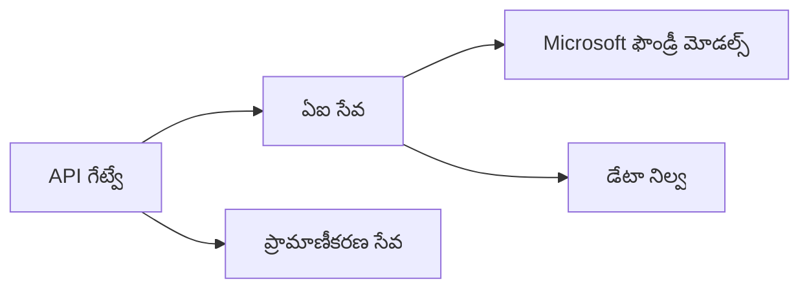
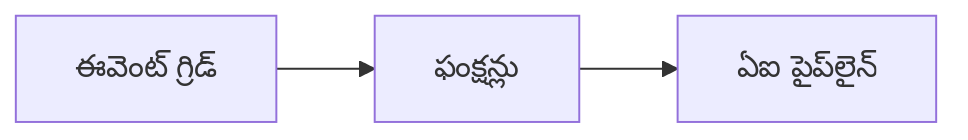

# అధ్యాయం 8: ప్రొడక్షన్ & ఎంటర్ప్రైజ్ నమూనాలు

**📚 కోర్సు**: [AZD ప్రారంభికులకు](../../README.md) | **⏱️ వ్యవధి**: 2-3 గంటలు | **⭐ క్లిష్టత**: అధిక స్థాయి

---

## అవలోకనం

ఈ అధ్యాయం ప్రొడక్షన్ AI వర్క్లోడ్స్ కోసం ఎంటర్ప్రైజ్-రెడీ డిప్లాయ్‌మెంట్ నమూనాలు, భద్రత గట్టిరపరచడం, మానిటరింగ్, మరియు ఖర్చు ఆప్టిమైజేషన్‌ను కవర్ చేస్తుంది.

> ఈ చాప్టర్ `azd 1.23.12` తో మార్చి 2026లో ధృవీకరించబడింది.

## అభ్యాస లక్ష్యాలు

By completing this chapter, you will:
- బహు-ప్రాంతాల్లో సహనశీల (resilient) అప్లికేషన్లను డిప్లాయ్ చేయండి
- ఎంటర్ప్రైజ్ భద్రతా నమూనాలను అమలు చేయండి
- సమగ్ర మానిటరింగ్‌ను కాన్ఫిగర్ చేయండి
- స్కేల్‌ వద్ద ఖర్చులను ఆప్టిమైజ్ చేయండి
- AZD తో CI/CD పైప్‌లైన్లను సెటప్ చేయండి

---

## 📚 పాఠాలు

| # | పాఠం | వివరణ | సమయం |
|---|--------|-------------|------|
| 1 | [ప్రొడక్షన్ AI ఆచరణలు](production-ai-practices.md) | ఎంటర్ప్రైజ్ డిప్లాయ్‌మెంట్ నమూనాలు | 90 నిమిషాలు |

---

## 🚀 ఉత్పత్తి చెక్లిస్ట్

- [ ] సహనశీలత కోసం బహు-ప్రాంతాల డిప్లాయ్‌మెంట్
- [ ] ప్రమాణీకరణ కోసం Managed Identity (కీలు లేవు)
- [ ] మానిటరింగ్ కోసం Application Insights
- [ ] ఖర్చు బడ్జెట్లు మరియు అలర్ట్లు కాన్ఫిగర్ చేయబడ్డాయి
- [ ] భద్రతా స్కానింగ్ ఎనేబుల్ చేయండి
- [ ] CI/CD పైప్‌లైన్ ఇంటిగ్రేషన్
- [ ] విపత్తు పునరుద్ధరణ ప్రణాళిక

---

## 🏗️ ఆర్కిటెక్చర్ నమూనాలు

### నమూనా 1: మైక్రోసర్వీసెస్ AI


### నమూనా 2: ఈవెంట్-డ్రివెన్ AI


---

## 🔐 భద్రతా ఉత్తమ ఆచరణలు

```bicep
// Use managed identity
identity: {
  type: 'SystemAssigned'
}

// Private endpoints for AI services
properties: {
  publicNetworkAccess: 'Disabled'
  networkAcls: {
    defaultAction: 'Deny'
  }
}
```

---

## 💰 ఖర్చు ఆప్టిమైజేషన్

| వ్యూహం | పొదుపు |
|----------|---------|
| శూన్యానికి స్కేల్ చేయడం (Container Apps) | 60-80% |
| డెవ్ కోసం ఖర్చు ఆధారిత టియర్లు వినియోగించండి | 50-70% |
| షెడ్యూల్డ్ స్కేలింగ్ | 30-50% |
| రిజర్వ్డ్ కెపాసిటీ | 20-40% |

```bash
# బడ్జెట్ హెచ్చరికలు సెట్ చేయండి
az consumption budget create \
  --budget-name "AI-Budget" \
  --amount 500 \
  --category Cost \
  --time-grain Monthly
```

---

## 📊 మానిటరింగ్ సెటప్

```bash
# లాగ్‌లను స్ట్రీమ్ చేయండి
azd monitor --logs

# Application Insights ను తనిఖీ చేయండి
azd monitor --overview

# మెట్రిక్స్‌ను చూడండి
az monitor metrics list --resource <resource-id>
```

---

## 🔗 నావిగేషన్

| దిశ | అధ్యాయం |
|-----------|---------|
| **మునుపటి** | [అధ్యాయం 7: సమస్యల పరిష్కారం](../chapter-07-troubleshooting/README.md) |
| **కోర్సు పూర్తి** | [కోర్సు హోమ్](../../README.md) |

---

## 📖 సంబంధించిన వనరులు

- [AI ఏజెంట్స్ గైడ్](../chapter-02-ai-development/agents.md)
- [Application Insights](../chapter-06-pre-deployment/application-insights.md)
- [బహుఏజెంట్ పరిష్కారాలు](../chapter-05-multi-agent/README.md)
- [మైక్రోసర్వీసెస్ ఉదాహరణ](../../examples/microservices/README.md)

---

<!-- CO-OP TRANSLATOR DISCLAIMER START -->
**బాధ్యత నిరాకరణ**:
ఈ పత్రం AI అనువాద సేవ [Co-op Translator](https://github.com/Azure/co-op-translator) ఉపయోగించి అనువదించబడింది. మేము ఖచ్చితత్వానికి ప్రయత్నించినప్పటికీ, ఆటోమేటెడ్ అనువాదాలలో తప్పులు లేదా లోపాలు ఉండవచ్చు. మూల పత్రాన్ని దాని మూల భాషలోని వెర్షన్‌ను అధికారిక వనరుగా పరిగణించండి. కీలకమైన సమాచారానికి, నిపుణులైన మానవ అనువాదాన్ని ఉపయోగించమని సూచించబడును. ఈ అనువాదం వాడకముతో వచ్చే ఏవైనా అపార్థాలు లేదా తప్పుడు అవగాహనల కోసం మేము బాధ్యత వహించము.
<!-- CO-OP TRANSLATOR DISCLAIMER END -->