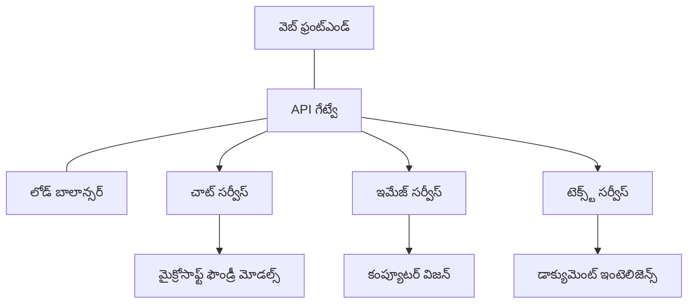

# ప్రొడక్షన్ AI వర్క్లోడ్ ఉత్తమ ప్రాక్టీసులు AZD తో

**అధ్యాయం నావిగేషన్:**
- **📚 కోర్సు హోమ్**: [AZD ప్రారంభకులకు](../../README.md)
- **📖 ప్రస్తుత అధ్యాయం**: అధ్యాయం 8 - ప్రొడక్షన్ & ఎంటర్‌ప్రైజ్ నమూనాలు
- **⬅️ వeroటి అధ్యాయం**: [అధ్యాయం 7: త్రుటి పరిష్కరణ](../chapter-07-troubleshooting/debugging.md)
- **⬅️ కూడా సంబంధిత**: [AI Workshop Lab](ai-workshop-lab.md)
- **🎯 కోర్సు పూర్తి**: [AZD ప్రారంభకులకు](../../README.md)

## అవలోకనం

ఈ గైడ్ Azure Developer CLI (AZD) ఉపయోగించి ప్రొడక్షన్-రెడి AI వర్క్లోడ్స్ ని డిప్లాయ్ చేయడానికి సంపూర్ణ ఉత్తమ ప్రాక్టీసులను అందిస్తుంది. Microsoft Foundry Discord కమ్యూనిటీ ఫీడ్‌బ్యాక్ మరియు వాస్తవ ప్రపంచ కస్టమర్ డిప్లాయ్‌మెంట్‌లపై ఆధారపడి, ఈ ప్రాక్టీసులు ప్రొడక్షన్ AI వ్యవస్థలలో సాధారణంగా వచ్చే సమస్యలను పరిష్కరిస్తాయి.

## పరిష్కరించబడిన ముఖ్య సవాళ్లు

మన కమ్యూనిటీ పోల్ల్ ఫలితాల ఆధారంగా, డెవలపర్లు ఎదుర్కొనే ప్రధాన సవాళ్లు ఇవే:

- **45%** బహు-సర్వీస్ AI డిప్లాయ్‌మెంట్‌లతో ఇబ్బంది పడుతున్నారు
- **38%** క్రెడెన్షియల్స్ మరియు సీక్రెట్ నిర్వహణలో సమస్యలు కలిగి ఉన్నారు  
- **35%** ప్రొడక్షన్ సిద్ధత మరియు స్కేలింగ్ కష్టం గా భావిస్తున్నారు
- **32%** మెరుగైన ఖర్చు సంస్కరణ వ్యూహాలు అవసరం
- **29%** మానిటరింగ్ మరియు డీబగ్గింగ్ మెరుగుదల అవసరం

## ప్రొడక్షన్ AI కోసం ఆర్కిటెక్చర్ నమూనాలు

### నమూనా 1: మైక్రోసर्वీసెస్ AI ఆర్కిటెక్చర్

**ఎప్పుడు ఉపయోగించాలి**: బహుళ సామర్ధ్యాలున్న సంకీర్ణ AI అనువర్తనాలు


**AZD అమలు**:

```yaml
# azure.yaml
name: enterprise-ai-platform
services:
  web:
    project: ./web
    host: staticwebapp
  api-gateway:
    project: ./api-gateway
    host: containerapp
  chat-service:
    project: ./services/chat
    host: containerapp
  vision-service:
    project: ./services/vision
    host: containerapp
  text-service:
    project: ./services/text
    host: containerapp
```

### నమూనా 2: ఈవెంట్-డ్రివెన్ AI ప్రాసెసింగ్

**ఎప్పుడు ఉపయోగించాలి**: బ్యాచ్ ప్రాసెసింగ్, డాక్యుమెంట్ విశ్లేషణ, అసింక్రో వర్క్‌ఫ్లోలు

```bicep
// Event Hub for AI processing pipeline
resource eventHub 'Microsoft.EventHub/namespaces@2023-01-01-preview' = {
  name: eventHubNamespaceName
  location: location
  sku: {
    name: 'Standard'
    tier: 'Standard'
    capacity: 1
  }
}

// Service Bus for reliable message processing
resource serviceBus 'Microsoft.ServiceBus/namespaces@2022-10-01-preview' = {
  name: serviceBusNamespaceName
  location: location
  sku: {
    name: 'Premium'
    tier: 'Premium'
    capacity: 1
  }
}

// Function App for processing
resource functionApp 'Microsoft.Web/sites@2023-01-01' = {
  name: functionAppName
  location: location
  kind: 'functionapp,linux'
  properties: {
    siteConfig: {
      appSettings: [
        {
          name: 'FUNCTIONS_EXTENSION_VERSION'
          value: '~4'
        }
        {
          name: 'AZURE_OPENAI_ENDPOINT'
          value: '@Microsoft.KeyVault(VaultName=${keyVault.name};SecretName=openai-endpoint)'
        }
      ]
    }
  }
}
```

## AI ఏజెంట్ ఆరోగ్య స్థితి గురించి ఆలోచనలు

సాంప్రదాయ వెబ్ యాప్ తెగినప్పుడు, లక్షణాలు పరిచయమైనవే: ఒక పేజీ లోడ్ అవ్వదు, ఒక API లో తప్పు వస్తుంది, లేదా ఒక డిప్లాయ్‌మెంట్ విఫలమవుతుంది. AI-శక్తిమంతమైన అనువర్తనాలు కూడా ఈ అన్ని మార్గాల్లో విఫలమవుతాయి—కాని అవి కనిపించని లోపాల రూపంలో కూడా తప్పుగా ప్రవర్తించవచ్చు, స్పష్టం అయిన తప్పు సందేశాలు ఉత్పత్తి చేయకుండా.

ఈ విభాగం AI వర్క్‌లోడ్‌లను మానిటర్ చేయడానికి మానసిక నమూనా గట్టిపడేందుకు సహాయపడుతుంది కాబట్టి సమస్య ఉన్నప్పుడు ఎక్కడ చూడాలో మీకు తెలియజేస్తుంది.

### ఏజెంట్ ఆరోగ్యం సాంప్రదాయ యాప్ ఆరోగ్యంతో ఎలా భిన్నంగా ఉంటుంది

ఒక సాంప్రదాయ యాప్ పనిచేస్తే పనిచేస్తుంది లేకపోతే కాదు. ఒక AI ఏజెంట్ పనిచేస్తున్నట్లు కనిపించవచ్చు కానీ చెడు ఫలితాలను ఉత్పత్తి చేయవచ్చు. ఏజెంట్ ఆరోగ్యాన్ని రెండు పరతులలో ఆలోచించండి:

| స్థరము | పరిశీలించవలసింది | ఎక్కడ చూడాలి |
|-------|--------------|---------------|
| **ఇన్‌ఫ్రాస్ట్రక్చర్ ఆరోగ్యం** | సేవ నడుస్తుందా? వనరులు ప్రావిజన్ చేయబడ్డాయా? ఎండ్‌పాయింట్లు చేరుకోవచ్చునా? | `azd monitor`, Azure పోర్టల్‌లో రిసోర్స్ ఆరోగ్యం, కంటెయినర్/యాప్ లాగ్లు |
| **వర్తన ఆరోగ్యం** | ఏజెంట్ ఖచ్చితంగా స్పందిస్తున్నదా? స్పందనలు సమయానుకూలమా? మోడల్‌ను సరియైన విధంగా కాల్ చేస్తున్నారా? | Application Insights ట్రేసులు, మోడల్ కాల్ లేటెన్సీ మెట్రిక్స్, స్పందన నాణ్యత లాగ్లు |

ఇన్‌ఫ్రాస్ట్రక్చర్ ఆరోగ్యం పరిచయం అయినది—ఇది ఏ azd యాప్‌కు అయినా అదే. వర్తన ఆరోగ్యం AI వర్క్‌లోడ్‌లు పరిచయం చేసే కొత్త పరతే.

### AI యాప్స్ ఆశించినట్లుగా ప్రవర్తించని సమయంలో ఎక్కడ చూడాలి

మీ AI అనువర్తనం మీరు ఆశించిన ఫలితాలు ఇవ్వకపోతే, ఇది ఒక భావనాత్మక చెక్‌లిస్ట్:

1. **బేసిక్స్‌తో ప్రారంభించండి.** యాప్ నడుస్తుందా? అది వాటి డిపెన్డెన్సీలను చేరుకోవడంలో సక్సెస్ అవుతున్నదా? ఏ యాప్ కోసం చెక్ చేసే విధంగా `azd monitor` మరియు రిసోర్స్ హెల్త్ చూడండి.
2. **మోడల్ కనెక్టర్‌ని తనిఖీ చేయండి.** మీ అనువర్తనం విజయవంతంగా AI మోడల్‌ను కాల్ చేస్తున్నదా? ఫెయిల్డ్ లేదా టైమ్-ఆఉట్ అయిన మోడల్ కాల్స్ AI యాప్ సమస్యలకు సాధారణ కారణం మరియు అవి మీ అప్లికేషన్ లాగ్‌లలో కనిపిస్తాయి.
3. **మోడల్‌కు ఏమి అందింది అని చూడండి.** AI ప్రతిస్పందనలు ఇన్పుట్ (ప్రాంప్ట్ మరియు పొరుగు చేర్చిన సందర్భం)పై ఆధారపడి ఉంటాయి. ఔట్‌పుట్ తప్పు అయితే, ఇన్పుట్ సాధారణంగా తప్పు ఉంటుంది. మీ అనువర్తనం మోడల్‌కు సరైన డేటాను పంపుతున్నదో పరిశీలించండి.
4. **ప్రతిస్పందన లేటెన్సీని సమీక్షించండి.** AI మోడల్ కాల్స్ సాధారణ API కాల్స్ కన్నా మెల్లగా ఉంటాయి. మీ యాప్ స్లోగా అనిపిస్తే, మోడల్ స్పందన సమయాలు పెరిగాయా అని చూడండి—ఇది థ్రాటిలింగ్, కెపాసిటీ పరిమితులు లేదా రీజియన్ స్థాయి గందరగోళాన్ని సూచించే అవకాశం ఉంది.
5. **ఖర్చు సంకేతాలపై జాగ్రత్త పడండి.** టోకెన్ వినియోగం లేదా API కాల్స్‌లో అనూహ్యutch spikes లు ఒక లూప్, తప్పుగా కాన్ఫిగర్ చేసిన ప్రాంప్ట్, లేదా అధిక రిట్రైలను సూచించవచ్చు.

నీకు ఒబ్జర్వబిలిటీ టూలింగ్ నేర్చుకోవడం వెంటనే అవసరం లేదు. ముఖ్యమైనది ఇది: AI అనువర్తనాలకు వీక్షించవలసిన అదనపు వర్తన పరత ఉంది, మరియు azd's built-in monitoring (`azd monitor`) రెండు పరతులను పరిశీలించడం ప్రారంభించడానికి ఒక ప్రారంభ బిందువు ఇస్తుంది.

---

## భద్రత ఉత్తమ ప్రాక్టీసులు

### 1. జీరో-ట్రస్ట్ భద్రత మోడల్

**అమలు వ్యూహం**:
- ప్రమాణీకరణ లేకుండా ఏ సర్వీస్-కు-సర్వీస్ కమ్యూనికేషన్ లేదు
- అన్ని API కాల్స్ managed identities ఉపయోగిస్తాయి
- ప్రైవేట్ ఎండ్‌పాయింట్స్‌తో నెట్‌వర్క్隔离
- కనీస привిలేజ్ యాక్సెస్ నియంత్రణలు

```bicep
// Managed Identity for each service
resource chatServiceIdentity 'Microsoft.ManagedIdentity/userAssignedIdentities@2023-01-31' = {
  name: 'chat-service-identity'
  location: location
}

// Role assignments with minimal permissions
resource openAIUserRole 'Microsoft.Authorization/roleAssignments@2022-04-01' = {
  scope: openAIAccount
  name: guid(openAIAccount.id, chatServiceIdentity.id, openAIUserRoleDefinitionId)
  properties: {
    roleDefinitionId: subscriptionResourceId('Microsoft.Authorization/roleDefinitions', '5e0bd9bd-7b93-4f28-af87-19fc36ad61bd')
    principalId: chatServiceIdentity.properties.principalId
    principalType: 'ServicePrincipal'
  }
}
```

### 2. సురక్షిత సీక్రెట్ నిర్వహణ

**Key Vault ఇంటిగ్రేషన్ నమూనా**:

```bicep
// Key Vault with proper access policies
resource keyVault 'Microsoft.KeyVault/vaults@2023-02-01' = {
  name: keyVaultName
  location: location
  properties: {
    tenantId: tenant().tenantId
    sku: {
      family: 'A'
      name: 'premium'  // Use premium for production
    }
    enableRbacAuthorization: true  // Use RBAC instead of access policies
    enablePurgeProtection: true    // Prevent accidental deletion
    enableSoftDelete: true
    softDeleteRetentionInDays: 90
  }
}

// Store all AI service credentials
resource openAIKeySecret 'Microsoft.KeyVault/vaults/secrets@2023-02-01' = {
  parent: keyVault
  name: 'openai-api-key'
  properties: {
    value: openAIAccount.listKeys().key1
    attributes: {
      enabled: true
    }
  }
}
```

### 3. నెట్‌వర్క్ భద్రత

**ప్రైవేట్ ఎండ్‌పాయింట్ కాన్ఫిగరేషన్**:

```bicep
// Virtual Network for AI services
resource virtualNetwork 'Microsoft.Network/virtualNetworks@2023-04-01' = {
  name: vnetName
  location: location
  properties: {
    addressSpace: {
      addressPrefixes: ['10.0.0.0/16']
    }
    subnets: [
      {
        name: 'ai-services-subnet'
        properties: {
          addressPrefix: '10.0.1.0/24'
          privateEndpointNetworkPolicies: 'Disabled'
        }
      }
      {
        name: 'app-services-subnet'
        properties: {
          addressPrefix: '10.0.2.0/24'
          delegations: [
            {
              name: 'Microsoft.Web/serverFarms'
              properties: {
                serviceName: 'Microsoft.Web/serverFarms'
              }
            }
          ]
        }
      }
    ]
  }
}

// Private endpoints for all AI services
resource openAIPrivateEndpoint 'Microsoft.Network/privateEndpoints@2023-04-01' = {
  name: '${openAIAccountName}-pe'
  location: location
  properties: {
    subnet: {
      id: virtualNetwork.properties.subnets[0].id
    }
    privateLinkServiceConnections: [
      {
        name: 'openai-connection'
        properties: {
          privateLinkServiceId: openAIAccount.id
          groupIds: ['account']
        }
      }
    ]
  }
}
```

## పనితీరు మరియు స్కేలింగ్

### 1. ఆటో-స్కేలింగ్ వ్యూహాలు

**కంటెయినర్ యాప్స్ ఆటో-స్కేలింగ్**:

```bicep
resource containerApp 'Microsoft.App/containerApps@2023-05-01' = {
  name: containerAppName
  location: location
  properties: {
    configuration: {
      ingress: {
        external: true
        targetPort: 8000
        transport: 'http'
      }
    }
    template: {
      scale: {
        minReplicas: 2  // Always have 2 instances minimum
        maxReplicas: 50 // Scale up to 50 for high load
        rules: [
          {
            name: 'http-scaling'
            http: {
              metadata: {
                concurrentRequests: '20'  // Scale when >20 concurrent requests
              }
            }
          }
          {
            name: 'cpu-scaling'
            custom: {
              type: 'cpu'
              metadata: {
                type: 'Utilization'
                value: '70'  // Scale when CPU >70%
              }
            }
          }
        ]
      }
    }
  }
}
```

### 2. క్యాషింగ్ వ్యూహాలు

**AI ప్రతిస్పందనల కోసం Redis Cache**:

```bicep
// Redis Premium for production workloads
resource redisCache 'Microsoft.Cache/redis@2023-04-01' = {
  name: redisCacheName
  location: location
  properties: {
    sku: {
      name: 'Premium'
      family: 'P'
      capacity: 1
    }
    enableNonSslPort: false
    minimumTlsVersion: '1.2'
    redisConfiguration: {
      'maxmemory-policy': 'allkeys-lru'
    }
    // Enable clustering for high availability
    redisVersion: '6.0'
    shardCount: 2
  }
}

// Cache configuration in application
var cacheConnectionString = '${redisCache.properties.hostName}:6380,password=${redisCache.listKeys().primaryKey},ssl=True,abortConnect=False'
```

### 3. లోడ్ బలాన్సింగ్ మరియు ట్రాఫిక్ నిర్వహణ

**WAF తో Application Gateway**:

```bicep
// Application Gateway with Web Application Firewall
resource applicationGateway 'Microsoft.Network/applicationGateways@2023-04-01' = {
  name: appGatewayName
  location: location
  properties: {
    sku: {
      name: 'WAF_v2'
      tier: 'WAF_v2'
      capacity: 2
    }
    webApplicationFirewallConfiguration: {
      enabled: true
      firewallMode: 'Prevention'
      ruleSetType: 'OWASP'
      ruleSetVersion: '3.2'
    }
    // Backend pools for AI services
    backendAddressPools: [
      {
        name: 'ai-services-pool'
        properties: {
          backendAddresses: [
            {
              fqdn: '${containerApp.properties.configuration.ingress.fqdn}'
            }
          ]
        }
      }
    ]
  }
}
```

## 💰 ఖర్చు ఆప్టిమైజేషన్

### 1. రిసోర్స్ రైట్-సైజింగ్

**పరిసర-నిర్దిష్ట కాన్ఫిగరేషన్లు**:

```bash
# అభివృద్ధి పర్యావరణం
azd env new development
azd env set AZURE_OPENAI_SKU "S0"
azd env set AZURE_OPENAI_CAPACITY 10
azd env set AZURE_SEARCH_SKU "basic"
azd env set CONTAINER_CPU 0.5
azd env set CONTAINER_MEMORY 1.0

# ఉత్పత్తి పర్యావరణం
azd env new production
azd env set AZURE_OPENAI_SKU "S0"
azd env set AZURE_OPENAI_CAPACITY 100
azd env set AZURE_SEARCH_SKU "standard"
azd env set CONTAINER_CPU 2.0
azd env set CONTAINER_MEMORY 4.0
```

### 2. ఖర్చు మానిటరింగ్ మరియు బడ్జెట్లు

```bicep
// Cost management and budgets
resource budget 'Microsoft.Consumption/budgets@2023-05-01' = {
  name: 'ai-workload-budget'
  properties: {
    timePeriod: {
      startDate: '2024-01-01'
      endDate: '2024-12-31'
    }
    timeGrain: 'Monthly'
    amount: 2000  // $2000 monthly budget
    category: 'Cost'
    notifications: {
      warning: {
        enabled: true
        operator: 'GreaterThan'
        threshold: 80
        contactEmails: [
          'finance@company.com'
          'engineering@company.com'
        ]
        contactRoles: [
          'Owner'
          'Contributor'
        ]
      }
      critical: {
        enabled: true
        operator: 'GreaterThan'
        threshold: 95
        contactEmails: [
          'cto@company.com'
        ]
      }
    }
  }
}
```

### 3. టోకెన్ వినియోగ ఆప్టిమైజేషన్

**OpenAI ఖర్చు నిర్వహణ**:

```typescript
// అప్లికేషన్-స్థాయి టోకెన్ ఉత్తమీకరణ
class TokenOptimizer {
  private readonly maxTokens = 4000;
  private readonly reserveTokens = 500;
  
  optimizePrompt(userInput: string, context: string): string {
    const availableTokens = this.maxTokens - this.reserveTokens;
    const estimatedTokens = this.estimateTokens(userInput + context);
    
    if (estimatedTokens > availableTokens) {
      // సందర్భాన్ని సంక్షిప్తం చేయండి, వినియోగదారుడి ఇన్‌పుట్ కాదు
      context = this.truncateContext(context, availableTokens - this.estimateTokens(userInput));
    }
    
    return `${context}\n\nUser: ${userInput}`;
  }
  
  private estimateTokens(text: string): number {
    // సుమారు అంచనా: 1 టోకెన్ ≈ 4 అక్షరాలు
    return Math.ceil(text.length / 4);
  }
}
```

## మానిటరింగ్ మరియు అవలీలబిలిటీ

### 1. సమగ్ర Application Insights

```bicep
// Application Insights with advanced features
resource applicationInsights 'Microsoft.Insights/components@2020-02-02' = {
  name: applicationInsightsName
  location: location
  kind: 'web'
  properties: {
    Application_Type: 'web'
    WorkspaceResourceId: logAnalyticsWorkspace.id
    SamplingPercentage: 100  // Full sampling for AI apps
    DisableIpMasking: false  // Enable for security
  }
}

// Custom metrics for AI operations
resource aiMetricAlerts 'Microsoft.Insights/metricAlerts@2018-03-01' = {
  name: 'ai-high-error-rate'
  location: 'global'
  properties: {
    description: 'Alert when AI service error rate is high'
    severity: 2
    enabled: true
    scopes: [
      applicationInsights.id
    ]
    evaluationFrequency: 'PT1M'
    windowSize: 'PT5M'
    criteria: {
      'odata.type': 'Microsoft.Azure.Monitor.SingleResourceMultipleMetricCriteria'
      allOf: [
        {
          name: 'high-error-rate'
          metricName: 'requests/failed'
          operator: 'GreaterThan'
          threshold: 10
          timeAggregation: 'Count'
        }
      ]
    }
  }
}
```

### 2. AI-నిర్దిష్ట మానిటరింగ్

**AI మెట్రిక్స్ కోసం కస్టమ్ డాష్‌బోర్డులు**:

```json
// Dashboard configuration for AI workloads
{
  "dashboard": {
    "name": "AI Application Monitoring",
    "tiles": [
      {
        "name": "OpenAI Request Volume",
        "query": "requests | where name contains 'openai' | summarize count() by bin(timestamp, 5m)"
      },
      {
        "name": "AI Response Latency",
        "query": "requests | where name contains 'openai' | summarize avg(duration) by bin(timestamp, 5m)"
      },
      {
        "name": "Token Usage",
        "query": "customMetrics | where name == 'openai_tokens_used' | summarize sum(value) by bin(timestamp, 1h)"
      },
      {
        "name": "Cost per Hour",
        "query": "customMetrics | where name == 'openai_cost' | summarize sum(value) by bin(timestamp, 1h)"
      }
    ]
  }
}
```

### 3. హెల్త్ చెక్స్లు మరియు అప్టైమ్ మానిటరింగ్

```bicep
// Application Insights availability tests
resource availabilityTest 'Microsoft.Insights/webtests@2022-06-15' = {
  name: 'ai-app-availability-test'
  location: location
  tags: {
    'hidden-link:${applicationInsights.id}': 'Resource'
  }
  properties: {
    SyntheticMonitorId: 'ai-app-availability-test'
    Name: 'AI Application Availability Test'
    Description: 'Tests AI application endpoints'
    Enabled: true
    Frequency: 300  // 5 minutes
    Timeout: 120    // 2 minutes
    Kind: 'ping'
    Locations: [
      {
        Id: 'us-east-2-azr'
      }
      {
        Id: 'us-west-2-azr'
      }
    ]
    Configuration: {
      WebTest: '''
        <WebTest Name="AI Health Check" 
                 Id="8d2de8d2-a2b0-4c2e-9a0d-8f9c9a0b8c8d" 
                 Enabled="True" 
                 CssProjectStructure="" 
                 CssIteration="" 
                 Timeout="120" 
                 WorkItemIds="" 
                 xmlns="http://microsoft.com/schemas/VisualStudio/TeamTest/2010" 
                 Description="" 
                 CredentialUserName="" 
                 CredentialPassword="" 
                 PreAuthenticate="True" 
                 Proxy="default" 
                 StopOnError="False" 
                 RecordedResultFile="" 
                 ResultsLocale="">
          <Items>
            <Request Method="GET" 
                     Guid="a5f10126-e4cd-570d-961c-cea43999a200" 
                     Version="1.1" 
                     Url="${webApp.properties.defaultHostName}/health" 
                     ThinkTime="0" 
                     Timeout="120" 
                     ParseDependentRequests="True" 
                     FollowRedirects="True" 
                     RecordResult="True" 
                     Cache="False" 
                     ResponseTimeGoal="0" 
                     Encoding="utf-8" 
                     ExpectedHttpStatusCode="200" 
                     ExpectedResponseUrl="" 
                     ReportingName="" 
                     IgnoreHttpStatusCode="False" />
          </Items>
        </WebTest>
      '''
    }
  }
}
```

## విపత్తు పునరుద్ధరణ మరియు హై అవైల్‌బిలిటీ

### 1. మల్టీ-రీజియన్ డిప్లాయ్‌మెంట్

```yaml
# azure.yaml - Multi-region configuration
name: ai-app-multiregion
services:
  api-primary:
    project: ./api
    host: containerapp
    env:
      - AZURE_REGION=eastus
  api-secondary:
    project: ./api
    host: containerapp
    env:
      - AZURE_REGION=westus2
```

```bicep
// Traffic Manager for global load balancing
resource trafficManager 'Microsoft.Network/trafficManagerProfiles@2022-04-01' = {
  name: trafficManagerProfileName
  location: 'global'
  properties: {
    profileStatus: 'Enabled'
    trafficRoutingMethod: 'Priority'
    dnsConfig: {
      relativeName: trafficManagerProfileName
      ttl: 30
    }
    monitorConfig: {
      protocol: 'HTTPS'
      port: 443
      path: '/health'
      intervalInSeconds: 30
      toleratedNumberOfFailures: 3
      timeoutInSeconds: 10
    }
    endpoints: [
      {
        name: 'primary-endpoint'
        type: 'Microsoft.Network/trafficManagerProfiles/azureEndpoints'
        properties: {
          targetResourceId: primaryAppService.id
          endpointStatus: 'Enabled'
          priority: 1
        }
      }
      {
        name: 'secondary-endpoint'
        type: 'Microsoft.Network/trafficManagerProfiles/azureEndpoints'
        properties: {
          targetResourceId: secondaryAppService.id
          endpointStatus: 'Enabled'
          priority: 2
        }
      }
    ]
  }
}
```

### 2. డేటా బ్యాకప్ మరియు పునరుద్ధరణ

```bicep
// Backup configuration for critical data
resource backupVault 'Microsoft.DataProtection/backupVaults@2023-05-01' = {
  name: backupVaultName
  location: location
  identity: {
    type: 'SystemAssigned'
  }
  properties: {
    storageSettings: [
      {
        datastoreType: 'VaultStore'
        type: 'LocallyRedundant'
      }
    ]
  }
}

// Backup policy for AI models and data
resource backupPolicy 'Microsoft.DataProtection/backupVaults/backupPolicies@2023-05-01' = {
  parent: backupVault
  name: 'ai-data-backup-policy'
  properties: {
    policyRules: [
      {
        backupParameters: {
          backupType: 'Full'
          objectType: 'AzureBackupParams'
        }
        trigger: {
          schedule: {
            repeatingTimeIntervals: [
              'R/2024-01-01T02:00:00+00:00/P1D'  // Daily at 2 AM
            ]
          }
          objectType: 'ScheduleBasedTriggerContext'
        }
        dataStore: {
          datastoreType: 'VaultStore'
          objectType: 'DataStoreInfoBase'
        }
        name: 'BackupDaily'
        objectType: 'AzureBackupRule'
      }
    ]
  }
}
```

## DevOps మరియు CI/CD ఇంటిగ్రేషన్

### 1. GitHub Actions వర్క్‌ఫ్లో

```yaml
# .github/workflows/deploy-ai-app.yml
name: Deploy AI Application

on:
  push:
    branches: [main]
  pull_request:
    branches: [main]

jobs:
  test:
    runs-on: ubuntu-latest
    steps:
      - uses: actions/checkout@v4
      
      - name: Setup Python
        uses: actions/setup-python@v4
        with:
          python-version: '3.11'
          
      - name: Install dependencies
        run: |
          pip install -r requirements.txt
          pip install pytest
          
      - name: Run tests
        run: pytest tests/
        
      - name: AI Safety Tests
        run: |
          python scripts/test_ai_safety.py
          python scripts/validate_prompts.py

  deploy-staging:
    needs: test
    if: github.event_name == 'pull_request'
    runs-on: ubuntu-latest
    steps:
      - uses: actions/checkout@v4
      
      - name: Setup AZD
        uses: Azure/setup-azd@v2
        
      - name: Login to Azure
        uses: azure/login@v1
        with:
          creds: ${{ secrets.AZURE_CREDENTIALS }}
          
      - name: Deploy to Staging
        run: |
          azd env select staging
          azd deploy

  deploy-production:
    needs: test
    if: github.ref == 'refs/heads/main'
    runs-on: ubuntu-latest
    steps:
      - uses: actions/checkout@v4
      
      - name: Setup AZD
        uses: Azure/setup-azd@v2
        
      - name: Login to Azure
        uses: azure/login@v1
        with:
          creds: ${{ secrets.AZURE_CREDENTIALS }}
          
      - name: Deploy to Production
        run: |
          azd env select production
          azd deploy
          
      - name: Run Production Health Checks
        run: |
          python scripts/health_check.py --env production
```

### 2. ఇన్‌ఫ్రాస్ట్రక్చర్ సరైనత ధృవీకరణ

```bash
# scripts/validate_infrastructure.sh
#!/bin/bash

echo "Validating AI infrastructure deployment..."

# అవసరమైన అన్ని సేవలు నడుస్తున్నాయో లేదో తనిఖీ చేయండి
services=("openai" "search" "storage" "keyvault")
for service in "${services[@]}"; do
    echo "Checking $service..."
    if ! az resource list --resource-type "Microsoft.CognitiveServices/accounts" --query "[?contains(name, '$service')]" -o tsv; then
        echo "ERROR: $service not found"
        exit 1
    fi
done

# OpenAI మోడల్ డిప్లాయ్‌మెంట్లను ధృవీకరించండి
echo "Validating OpenAI model deployments..."
models=$(az cognitiveservices account deployment list --name $AZURE_OPENAI_NAME --resource-group $AZURE_RESOURCE_GROUP --query "[].name" -o tsv)
if [[ ! $models == *"gpt-4.1-mini"* ]]; then
  echo "ERROR: Required model gpt-4.1-mini not deployed"
    exit 1
fi

# AI సేవల కనెక్టివిటీని పరీక్షించండి
echo "Testing AI service connectivity..."
python scripts/test_connectivity.py

echo "Infrastructure validation completed successfully!"
```

## ప్రొడక్షన్ సిద్ధత చెక్‌లిస్ట్

### భద్రత ✅
- [ ] All services use managed identities
- [ ] Secrets stored in Key Vault
- [ ] Private endpoints configured
- [ ] Network security groups implemented
- [ ] RBAC with least privilege
- [ ] WAF enabled on public endpoints

### పనితీరు ✅
- [ ] Auto-scaling configured
- [ ] Caching implemented
- [ ] Load balancing setup
- [ ] CDN for static content
- [ ] Database connection pooling
- [ ] Token usage optimization

### మానిటరింగ్ ✅
- [ ] Application Insights configured
- [ ] Custom metrics defined
- [ ] Alerting rules setup
- [ ] Dashboard created
- [ ] Health checks implemented
- [ ] Log retention policies

### నమ్మకయోగ్యత ✅
- [ ] Multi-region deployment
- [ ] Backup and recovery plan
- [ ] Circuit breakers implemented
- [ ] Retry policies configured
- [ ] Graceful degradation
- [ ] Health check endpoints

### ఖర్చు నిర్వహణ ✅
- [ ] Budget alerts configured
- [ ] Resource right-sizing
- [ ] Dev/test discounts applied
- [ ] Reserved instances purchased
- [ ] Cost monitoring dashboard
- [ ] Regular cost reviews

### కంప్లైయన్స్ ✅
- [ ] Data residency requirements met
- [ ] Audit logging enabled
- [ ] Compliance policies applied
- [ ] Security baselines implemented
- [ ] Regular security assessments
- [ ] Incident response plan

## పనితీరు బెంచ్‌మార్క్‌లు

### సాధారణ ప్రొడక్షన్ మెట్రిక్స్

| మెట్రిక్ | లక్ష్యం | మానిటరింగ్ |
|--------|--------|------------|
| **Response Time** | < 2 seconds | Application Insights |
| **Availability** | 99.9% | Uptime monitoring |
| **Error Rate** | < 0.1% | అప్లికేషన్ లాగ్లు |
| **Token Usage** | < $500/month | ఖర్చు నిర్వహణ |
| **Concurrent Users** | 1000+ | లోడ్ టెస్టింగ్ |
| **Recovery Time** | < 1 hour | విపత్తు పునరుద్ధరణ పరీక్షలు |

### లోడ్ టెస్టింగ్

```bash
# AI అనువర్తనాల కోసం లోడ్ టెస్టింగ్ స్క్రిప్ట్
python scripts/load_test.py \
  --endpoint https://your-ai-app.azurewebsites.net \
  --concurrent-users 100 \
  --duration 300 \
  --ramp-up 60
```

## 🤝 కమ్యూనిటీ ఉత్తమ చర్చలు

Microsoft Foundry Discord కమ్యూనిటీ ఫీడ్‌బ్యాక్ ఆధారంగా:

### కమ్యూనిటీ నుండి ముఖ్య సిఫార్సులైనవి:

1. **చిన్నగా మొదలుపెట్టు, స్థిరంగా స్కేలు చేయండి**: ప్రాథమిక SKUలతో ప్రారంభించి వాస్తవ వినియోగం ఆధారంగా స్కేలు చేయండి
2. **ప్రతి ఒక్క దానినీ మానిటర్ చేయండి**: మొదటి రోజు నుండే సమగ్ర మానిటరింగ్ అమర్చండి
3. **భద్రత ఆటోమేట్ చేయండి**: స్థిరమైన భద్రత కోసం ఇన్‌ఫ్రాస్ట్రక్చర్‌ను కోడ్‌గా ఉపయోగించండి
4. **పూర్తిగా పరీక్షించండి**: మీ పైప్‌లైన్‌లో AI-నిర్దిష్ట టెస్టింగ్‌ను చేర్చండి
5. **ఖర్చుకి ప్రణాళిక చేయండి**: టోకెన్ వినియోగాన్ని మానిటర్ చేయండి మరియు తొలుత బడ్జెట్ అలర్ట్‌లను అమర్చండి

### నివారించవలసిన సాధారణ తప్పులు:

- ❌ కోడ్‌లో API కీలు హార్డ్‌కోడ్ చేయడం
- ❌ సరైన మానిటరింగ్ ఏర్పాటు చేయకపోవడం
- ❌ ఖర్చు ఆప్టిమైజేషన్‌ను నిర్లక్ష్యం చేయడం
- ❌ ఫెయిల్యూర్ సన్నివేశాలను పరీక్షించకపోవడం
- ❌ హెల్త్ చెక్స్ లేకుండా డిప్లాయ్ చేయడం

## AZD AI CLI కమాండ్లు మరియు ఎక్స్‌టెన్షన్లు

AZD లో ప్రొడక్షన్ AI వర్క్‌ఫ్లోలను సరళీకరించే AI-నిర్దిష్ట కమాండ్లు మరియు ఎక్స్‌టెన్షన్లను పెంచుతున్న సెట్ ఉంది. ఈ టూల్‌లు లోకల్ డెవలప్‌మెంట్ మరియు ప్రొడక్షన్ డిప్లాయ్‌మెంట్ మధ్య గట్టిస్థాయిని నిలబెట్టుతాయి.

### AZD కోసం AI ఎక్స్‌టెన్షన్లు

AZD AI-నిర్దిష్ట సామర్ధ్యాలను జోడించడానికి ఒక ఎక్స్‌టెన్షన్ సిస్టమ్‌ను ఉపయోగిస్తుంది. ఇన్స్టాల్ చేయడానికి మరియు ఎక్స్‌టెన్షన్లను నిర్వహించడానికి:

```bash
# అందుబాటులో ఉన్న అన్ని ఎక్స్‌టెన్షన్లను జాబితా చేయండి (AI సహా)
azd extension list

# ఇన్‌స్టాల్ చేసిన ఎక్స్‌టెన్షన్ వివరాలను పరిశీలించండి
azd extension show azure.ai.agents

# Foundry agents ఎక్స్‌టెన్షన్‌ను ఇన్‌స్టాల్ చేయండి
azd extension install azure.ai.agents

# ఫైన్-ట్యూనింగ్ ఎక్స్‌టెన్షన్‌ను ఇన్‌స్టాల్ చేయండి
azd extension install azure.ai.finetune

# కస్టమ్ మోడల్స్ ఎక్స్‌టెన్షన్‌ను ఇన్‌స్టాల్ చేయండి
azd extension install azure.ai.models

# ఇన్‌స్టాల్ చేసిన అన్ని ఎక్స్‌టెన్షన్లను అప్‌గ్రేడ్ చేయండి
azd extension upgrade --all
```

**అందుబాటులో ఉన్న AI ఎక్స్‌టెన్షన్లు:**

| ఎక్స్‌టెన్షన్ | ప్రయోజనం | స్థితి |
|-----------|---------|--------|
| `azure.ai.agents` | Foundry Agent Service నిర్వహణ | ప్రివ్యూ |
| `azure.ai.finetune` | Foundry మోడల్ ఫైన్-ట్యూనింగ్ | ప్రివ్యూ |
| `azure.ai.models` | Foundry కస్టమ్ మోడల్స్ | ప్రివ్యూ |
| `azure.coding-agent` | కోడింగ్ ఏజెంట్ కాన్ఫిగరేషన్ | అందుబాటులో ఉంది |

### `azd ai agent init` తో ఏజెంట్ ప్రాజెక్టులను ప్రారంభించడం

`azd ai agent init` కమాండ్ Microsoft Foundry Agent Serviceతో ఇంటిగ్రేటెడ్ ప్రొడక్షన్-రెడి AI ఏజెంట్ ప్రాజెక్టును స్కాఫోల్డ్ చేస్తుంది:

```bash
# ఏజెంట్ మానిఫెస్ట్ నుండి కొత్త ఏజెంట్ ప్రాజెక్టును ప్రారంభించండి
azd ai agent init -m <manifest-path-or-uri>

# ఒక నిర్దిష్ట Foundry ప్రాజెక్టును ప్రారంభించి లక్ష్యంగా పెట్టండి
azd ai agent init -m agent-manifest.yaml --project-id <foundry-project-id>

# కస్టమ్ సోర్స్ డైరెక్టరీతో ప్రారంభించండి
azd ai agent init -m agent-manifest.yaml --src ./agents/my-agent

# హోస్ట్‌గా Container Apps‌ను లక్ష్యంగా పెట్టండి
azd ai agent init -m agent-manifest.yaml --host containerapp
```

**ప్రధాన ఫ్లాగ్స్:**

| ఫ్లాగ్ | వివరణ |
|------|-------------|
| `-m, --manifest` | మీ ప్రాజెక్టుకు జోడించాల్సిన ఏజెంట్ manifesta కు మార్గం లేదా URI |
| `-p, --project-id` | మీ azd పరిసరానికి గల ఉన్న Microsoft Foundry ప్రాజెక్ట్ ID |
| `-s, --src` | ఏజెంట్ నిర్వచనాన్ని డౌన్లోడ్ చేయాల్సిన డైరెక్టరీ (డిఫాల్ట్ `src/<agent-id>`) |
| `--host` | డిఫాల్ట్ హోస్ట్‌ను ఓవర్‌రైడ్ చేయండి (ఉదా., `containerapp`) |
| `-e, --environment` | ఉపయోగించాల్సిన azd పరిసరము |

**ప్రొడక్షన్ టిప్**: మొదటిపొద నుండి మీ ఏజెంట్ కోడ్ మరియు క్లౌడ్ వనరులను లింక్ చేయడానికి `--project-id` ఉపయోగించి నేరుగా ఉన్న Foundry ప్రాజెక్ట్‌కు కనెక్ట్ అవ్వండి.

### Model Context Protocol (MCP) `azd mcp` తో

AZD లో బిల్ట్-ఇన్ MCP సర్వర్ మద్దతు (అల్ఫా) ఉంటుంది, ఇది AI ఏజెంట్లు మరియు టూల్‌లకు మీ Azure వనరులతో స్టాండర్డైజ్డ్ ప్రోటోకాల్ ద్వారా ఇంటరాక్ట్ అయ్యే సామర్థ్యాన్ని ఇస్తుంది:

```bash
# మీ ప్రాజెక్ట్ కోసం MCP సర్వర్‌ను ప్రారంభించండి
azd mcp start

# టూల్ అమలు కోసం ప్రస్తుత Copilot అనుమతి నిబంధనలను సమీక్షించండి
azd copilot consent list
```

MCP సర్వర్ మీ azd ప్రాజెక్ట్ కాంటెక్స్ట్—పరిసరాలు, సేవలు, మరియు Azure వనరులను AI-శక్తిగల డెవలప్‌మెంట్ టూల్‌లకు ఎక్స్‌పోజ్ చేస్తుంది. ఇది సామర్థ్యాలను అందిస్తోంది:

- **AI-సహాయ డిప్లాయ్‌మెంట్**: కోడింగ్ ఏజెంట్లు మీ ప్రాజెక్ట్ స్టేట్‌ను క్వెరీ చేసి డిప్లాయ్‌మెంట్‌లను ట్రిగ్గర్ చేయగలవు
- **వనరుల కనుగొనడం**: AI టూల్‌లు మీ ప్రాజెక్ట్ ఉపయోగించే Azure వనరులను కనుగొనగలవు
- **పరిసర నిర్వహణ**: ఏజెంట్లు dev/staging/production పరిసరాల మధ్య స్విచ్ చేయగలవు

### `azd infra generate` తో ఇన్‌ఫ్రాస్ట్రక్చర్ ఉత్పత్తి

ప్రొడక్షన్ AI వర్క్‌లోడ్‌ల కోసం, ఆటోమాటిక్ ప్రావిజనింగ్‌పై ఆధారపడే బదులు Infrastructure as Code ని ఉత్పత్తి చేసి కస్టమైజ్ చేయవచ్చు:

```bash
# మీ ప్రాజెక్ట్ నిర్వచనానికి అనుగుణంగా Bicep/Terraform ఫైళ్లను ఉత్పత్తి చేయండి
azd infra generate
```

ఇది IaC ని డిస్క్‌కు రాయగలదు కాబట్టి మీరు చేయగలవు:
- డిప్లాయ్ చేసే ముందు ఇన్‌ఫ్రాస్ట్రక్చర్‌ను సమీక్షించండి మరియు ఆడిట్ చేయండి
- కస్టమ్ సెక్యూరిటీ పాలసీలను జోడించండి (నెట్‌వర్క్ రూల్స్, ప్రైవేట్ ఎండ్‌పాయింట్స్)
- ఉన్న IaC సమీక్ష ప్రక్రియలతో అనుసంధానం చేయండి
- అప్లికేషన్ కోడ్ నుండి వేరు గా ఇన్‌ఫ్రాస్ట్రక్చర్ మార్పుల వర్షన్ కంట్రోల్ చేయండి

### ప్రొడక్షన్ లైఫ్‌సైకిల్ హుక్‌లు

AZD hooks తో మీరు డిప్లాయ్‌మెంట్ లైఫ్సైకిల్ యొక్క ప్రతి దశలో కస్టమ్ లాజిక్ ఇంజెక్ట్ చేయవచ్చు—ఇది ప్రొడక్షన్ AI వర్క్‌లో ఫలితకరం:

```yaml
# azure.yaml - Production hooks example
name: ai-production-app
hooks:
  preprovision:
    shell: sh
    run: scripts/validate-quotas.sh    # Check AI model quota before provisioning
  postprovision:
    shell: sh
    run: scripts/configure-networking.sh  # Set up private endpoints
  predeploy:
    shell: sh
    run: scripts/run-ai-safety-tests.sh  # Run prompt safety checks
  postdeploy:
    shell: sh
    run: scripts/smoke-test.sh           # Verify agent responses post-deploy
services:
  agent-api:
    project: ./src/agent
    host: containerapp
    hooks:
      predeploy:
        shell: sh
        run: scripts/validate-model-access.sh  # Per-service hook
```

```bash
# అభివృద్ధి సమయంలో ఒక నిర్దిష్ట హుక్‌ను మాన్యువల్‌గా అమలు చేయండి
azd hooks run predeploy
```

**AI వర్క్‌లోడ్‌లకు సూచించబడిన ప్రొడక్షన్ హుక్‌లు:**

| Hook | వినియోగం కేసు |
|------|----------|
| `preprovision` | AI మోడల్ కెపాసిటీ కోసం సబ్స్క్రిప్షన్ కోటాలను ధృవీకరించండి |
| `postprovision` | ప్రైవేట్ ఎండ్‌పాయింట్స్ కాన్ఫిగర్ చేయండి, మోడల్ వెయిట్‌లను డిప్లాయ్ చేయండి |
| `predeploy` | AI సేఫ్టీ పరీక్షలు నడిపి, ప్రాంప్ట్ టెంప్లేట్లని ధృవీకరించండి |
| `postdeploy` | ఏజెంట్ స్పందనలు స్మోక్ టెస్ట్ చేయండి, మోడల్ కనెక్టివిటీని ధృవీకరించండి |

### CI/CD పైప్‌లైన్ కాన్ఫిగరేషన్

మీ ప్రాజెక్ట్‌ను GitHub Actions లేదా Azure Pipelines తో సురక్షిత Azure ఆటెంటికేషన్‌తో కనెక్ట్ చేయడానికి `azd pipeline config` ఉపయోగించండి:

```bash
# CI/CD పైప్‌లైన్‌ను కాన్ఫిగర్ చేయండి (ఇంటరాక్టివ్)
azd pipeline config

# ఒక నిర్దిష్ట ప్రొవైడర్‌తో కాన్ఫిగర్ చేయండి
azd pipeline config --provider github
```

ఈ కమాండ్:
- కనీస-ప్రివిలేజ్ యాక్సెస్ తో ఒక service principal సృష్టిస్తుంది
- ఫెడరేటెడ్ క్రెడెన్షియల్స్ కాన్ఫిగర్ చేస్తుంది (స్టోర్ చేయబడిన సీక్రెట్లు లేకుండా)
- మీ పైప్‌లైన్ నిర్వచనం ఫైల్‌ను రూపొందిస్తుంది లేదా అప్డేట్ చేస్తుంది
- మీ CI/CD సిస్టమ్‌లో అవసరమైన పరిసర చారాలను సెట్అప్ చేస్తుంది

**పైప్‌లైన్ కాన్ఫిగ్‌తో ప్రొడక్షన్ వర్క్‌ఫ్లో:**

```bash
# 1. ఉత్పత్తి పర్యావరణాన్ని అమర్చండి
azd env new production
azd env set AZURE_OPENAI_CAPACITY 100

# 2. పైప్‌లైన్‌ను కాన్ఫిగర్ చేయండి
azd pipeline config --provider github

# 3. main కు ప్రతి పుష్ జరిగినప్పుడు పైప్‌లైన్ azd deploy ను నడిపిస్తుంది
```

### `azd add` తో కంపోనెంట్లను జోడించడం

ఉన్న ప్రాజెక్ట్‌కు డెడ్‌లను క్రమంగా జోడించండి:

```bash
# ఇంటరాక్టివ్‌గా కొత్త సర్వీస్ కంపోనెంట్‌ను జోడించండి
azd add
```

ఇది ప్రొడక్షన్ AI అనువర్తనాలను విస్తరించడానికి ప్రత్యేకంగా ఉపయోగకరంగా ఉంటుంది—ఉదాహరణకు, ఒక వెక్టర్ సర్చ్ సర్వీస్, కొత్త ఏజెంట్ ఎండ్‌పాయింట్, లేదా మానిటరింగ్ కంపోనెంట్‌ను ఉన్న డిప్లాయ్‌మెంట్‌కు జోడించడం.

## అదనపు వనరులు
- **Azure బాగా-నిర్మిత ఫ్రేమ్‌వర్క్**: [AI వర్క్లోడ్ మార్గదర్శకత్వం](https://learn.microsoft.com/azure/well-architected/ai/)
- **Microsoft Foundry డాక్యుమెంటేషన్**: [అధికారిక డాక్యుమెంట్లు](https://learn.microsoft.com/azure/ai-studio/)
- **సముదాయ టెంప్లేట్లు**: [Azure నమూనాలు](https://github.com/Azure-Samples)
- **Discord సముదాయం**: [#Azure చానల్](https://discord.gg/microsoft-azure)
- **Azure కోసం ఏజెంట్ నైపుణ్యాలు**: [skills.sh పై microsoft/github-copilot-for-azure](https://skills.sh/microsoft/github-copilot-for-azure) - Azure AI, Foundry, deployment, cost optimization, మరియు diagnostics కోసం 37 ఓపెన్ ఏజెంట్ నైపుణ్యాలు. మీ ఎడిటర్‌లో ఇన్‌స్టాల్ చేయండి:
  ```bash
  npx skills add microsoft/github-copilot-for-azure
  ```

---

**అధ్యాయ నావిగేషన్:**
- **📚 కోర్సు హోమ్**: [AZD For Beginners](../../README.md)
- **📖 ప్రస్తుత అధ్యాయం**: అధ్యాయం 8 - ఉత్పత్తి & ఎంటర్‌ప్రైజ్ నమూనాలు
- **⬅️ మునుపటి అధ్యాయం**: [అధ్యాయం 7: సమస్యల పరిష్కారం](../chapter-07-troubleshooting/debugging.md)
- **⬅️ అలాగే సంబంధిత**: [AI వర్క్‌షాప్ ల్యాబ్](ai-workshop-lab.md)
- **� కోర్సు పూర్తి**: [AZD For Beginners](../../README.md)

**గమనించండి**: ఉత్పత్తి AI వర్క్లోడ్‌లకు జాగ్రత్తగా ప్రణాళిక, పర్యవేక్షణ మరియు నిరంతర ఆప్టిమైజేషన్ అవసరం. ఈ నమూనాలతో ప్రారంభించి వాటిని మీ నిర్దిష్ట అవసరాలకు అనుగుణంగా అనుకూలించండి.

---

<!-- CO-OP TRANSLATOR DISCLAIMER START -->
**నిరాకరణ**:
ఈ పత్రం AI అనువాద సేవ [Co-op Translator](https://github.com/Azure/co-op-translator) ఉపయోగించి అనువదించబడింది. మేము ఖచ్చితత్వానికి యత్నించినప్పటికీ, స్వయంచాలక అనువాదాల్లో పొరపాట్లు లేదా తప్పులు ఉండవచ్చు అని దయచేసి గమనించండి. అసలు భాషలోని మూల పత్రాన్ని ప్రామాణిక మూలంగా పరిగణించాలి. కీలకమైన సమాచారానికి వృత్తిపరమైన మనవీయ అనువాదం చేయించుకోవాలని సూచించబడుతుంది. ఈ అనువాదం ఉపయోగం వల్ల కలిగే ఏవైనా అపార్థాలు లేదా తప్పుగా అర్థం చేసుకోవడాల కోసం మేము బాధ్యులు కాదు.
<!-- CO-OP TRANSLATOR DISCLAIMER END -->