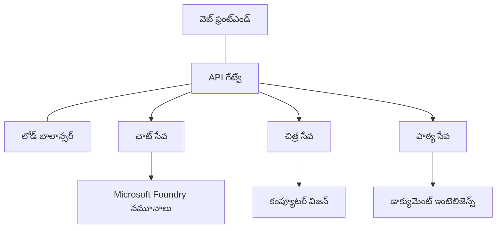

# AZD తో ఉత్పత్తి AI వర్క్‌లోడ్స్ కోసం ఉత్తమ పద్ధతులు

**Chapter Navigation:**
- **📚 Course Home**: [AZD For Beginners](../../README.md)
- **📖 Current Chapter**: Chapter 8 - Production & Enterprise Patterns
- **⬅️ Previous Chapter**: [Chapter 7: Troubleshooting](../chapter-07-troubleshooting/debugging.md)
- **⬅️ Also Related**: [AI Workshop Lab](ai-workshop-lab.md)
- **🎯 Course Complete**: [AZD For Beginners](../../README.md)

## అవలోకనం

ఈ గైడ్ Azure Developer CLI (AZD) ఉపయోగించి ఉత్పత్తి సిద్ధమైన AI వర్క్‌లోడ్స్ పెట్టకానికి సంబంధించిన సమగ్ర ఉత్తమ పద్ధతులను అందిస్తుంది. Microsoft Foundry Discord కమ్యూనిటీ మరియు వాస్తవ వినియోగదారుల డిప్లాయ్‌మెంట్ ఫీడ్‌బ్యాక్ ఆధారంగా, ఈ ప్రక్రియలు ఉత్పత్తి AI సిస్టమ్‌లలో సాధారణంగా ఎదురయ్యే సవాళ్లను పరిష్కరిస్తాయి.

## పరిష్కరించదలచిన ప్రధాన సవాళ్లు

మా కమ్యూనిటీ పోల్స్ ఫలితాల ఆధారంగా, డెవలపర్లు ఎదుర్కొంటున్న ప్రధాన సవాళ్లు ఇవే:

- **45%** బహు-సేవా AI డిప్లోయ్‌మెంట్‌లతో ఇబ్బంది పడుతున్నారు
- **38%** క్రెడెన్షియల్స్ మరియు రహస్యాల నిర్వహణలో సమస్యలు ఉన్నాయి  
- **35%** ఉత్పత్తి సిద్ధత మరియు స్కేలింగ్ కష్టం అనిపిస్తోంది
- **32%** మెరుగైన ఖర్చు ఆప్టిమైజేషన్ వ్యూహాలు అవసరం
- **29%** మానిటరింగ్ మరియు డీబగ్గింగ్ మెరుగ్గా కావాలి

## ఉత్పత్తి AI కోసం ఆర్కిటెక్చర్ నమూనాలు

### నమూనా 1: మైక్రోసర్వీస్‌లు AI ఆర్కిటెక్చర్

**ఎప్పుడు ఉపయోగించాలి**: బహుముఖ సామర్థ్యాలున్న సంక్లిష్ట AI అప్లికేషన్లకు


**AZD అమలు**:

```yaml
# azure.yaml
name: enterprise-ai-platform
services:
  web:
    project: ./web
    host: staticwebapp
  api-gateway:
    project: ./api-gateway
    host: containerapp
  chat-service:
    project: ./services/chat
    host: containerapp
  vision-service:
    project: ./services/vision
    host: containerapp
  text-service:
    project: ./services/text
    host: containerapp
```

### నమూనా 2: ఈవెంట్-డ్రైవెన్ AI ప్రాసెసింగ్

**ఎప్పుడు ఉపయోగించాలి**: బ్యాచ్ ప్రాసెసింగ్, డాక్యుమెంట్ విశ్లేషణ, అసింక్ వర్క్‌ఫ్లోలు

```bicep
// Event Hub for AI processing pipeline
resource eventHub 'Microsoft.EventHub/namespaces@2023-01-01-preview' = {
  name: eventHubNamespaceName
  location: location
  sku: {
    name: 'Standard'
    tier: 'Standard'
    capacity: 1
  }
}

// Service Bus for reliable message processing
resource serviceBus 'Microsoft.ServiceBus/namespaces@2022-10-01-preview' = {
  name: serviceBusNamespaceName
  location: location
  sku: {
    name: 'Premium'
    tier: 'Premium'
    capacity: 1
  }
}

// Function App for processing
resource functionApp 'Microsoft.Web/sites@2023-01-01' = {
  name: functionAppName
  location: location
  kind: 'functionapp,linux'
  properties: {
    siteConfig: {
      appSettings: [
        {
          name: 'FUNCTIONS_EXTENSION_VERSION'
          value: '~4'
        }
        {
          name: 'AZURE_OPENAI_ENDPOINT'
          value: '@Microsoft.KeyVault(VaultName=${keyVault.name};SecretName=openai-endpoint)'
        }
      ]
    }
  }
}
```

## AI ఏజెంట్ ఆరోగ్యాన్ని గురించి ఆలోచన

సాంప్రదాయ వెబ్ యాప్ తగుల్కితే లక్షణాలు పరిచయమయంగా ఉంటాయి: పేజీ లోడ్ కాకపోవడం, API లో తప్పు, లేదా డిప్లాయ్‌మెంట్ విఫలమవ్వడం. AI-సক্ষমతయైన అప్లికేషన్లు కూడా ఆనేటివే మార్గాల్లో విఫలమవుతాయి—కానీ అవి స్పష్టమైన లోప సందేశాలను ఇవ్వకుండా సున్నితంగా తప్పువులు చేయవచ్చు.

ఈ విభాగం AI వర్క్‌లోడ్స్‌కి మానిటరింగ్ కోసం మానసిక మోడల్ నిర్మించడంలో మీకు సహాయం చేస్తుంది, తద్వారా ఎక్కడ చూసుకోవాలో తెలుసుకోగలుగుతారు.

### ఏజెంట్ ఆరోగ్యం సాంప్రదాయ అప్లిక్ ల ఆరోగ్యంతో ఎలా విభిన్నం

సాంప్రదాయ అప్లిక్ పనిచేస్తుందో లేదో స్పష్టంగా ఉంటుంది. AI ఏజెంట్ పనిచేస్తున్నట్టు కనిపించినా తగ్గిన నాణ్యత పనితీరును ఇవ్వవచ్చు. ఏజెంట్ ఆరోగ్యాన్ని రెండు పొరలుగా ఆలోచించండి:

| Layer | What to Watch | Where to Look |
|-------|--------------|---------------|
| **Infrastructure health** | సేవ పనిచేస్తుందా? వనరులు ప్రొవిజన్ అయ్యాయా? ఎండ్పాయింట్లు చేరుకోవచ్చునా? | `azd monitor`, Azure Portal resource health, container/app logs |
| **Behavior health** | ఏజెంట్ సరైనంగా స్పందిస్తున్నదా? స్పందనలు సమయానుకూలమా? మోడల్‌ను సరిగ్గా పిలుస్తున్నదా? | Application Insights traces, model call latency metrics, response quality logs |

ఇన్‌ఫ్రాస్ట్రక్చర్ ఆరోగ్యము పరిచితమే—ఇది ఏ azd అప్లిక్‌కు అయినా ఆపేక్ష. బిహేవియర్ ఆరోగ్యము AI వర్క్‌లోడ్స్ వర్తించే కొత్త పొరనే.

### AI అప్లికేషన్లు అనుకుంటున్నట్లుగా పనిచేయకపోతే ఎక్కడ చూడాలి

మీ AI అప్లికేషన్ ఆశించిన ఫలితాలు ఇవ్వకపోతే, ఇక్కడ ఒక భావనాత్మక చెక్‌లిస్ట్ ఉంది:

1. **బేసిక్స్‌తో ప్రారంభించండి.** అప్లికేషన్ চলছে లేదా? దాని డిపెండెన్సీలను చేరుకోగలదా? ఏ యాప్ కోసం చేయగలిగితే `azd monitor` మరియు రిసోర్స్ హెల్త్ తనిఖీ చేయండి.
2. **మోడల్ కనెక్షన్‌ని తనిఖీ చేయండి.** మీ అప్లికేషన్ విజయవంతంగా AI మోడల్‌ను పిలుస్తున్నదా? ఫెయిల్డ్ లేదా టైమ్ఔట్ అయిన మోడల్ కాల్స్ AI అప్లిక్ సమస్యలకు సాధారణ కారణం; ఈ సమస్యలు మీ అప్లికేషన్ లాగ్స్‌లో కనిపిస్తాయి.
3. **మోడల్‌కు ఏమి అందుకున్నదో చూడండి.** AI ప్రతిస్పందనలు ఇన్పుట్ (ప్రాంప్ట్ మరియు ఏనైనా రిట్రీవ్‌ చేసిన కాన్టెక్స్‌ట్) మీద ఆధారపడి ఉంటాయి. అవుట్‌పుట్ తప్పైనా, ఇన్పుట్ సాధారణంగా తప్పుగా ఉంటుంది. మీ అప్లికేషన్ మోడల్‌కి సరైన డేటా పంపిస్తున్నదో లేదో తనిఖీ చేయండి.
4. **స్పందన ఆలస్యాలు పరిశీలించండి.** AI మోడల్ కాల్స్ సాధారణ API కాల్స్ కన్నా తక్కువ వేగంగా ఉంటాయి. మీ యాప్ స్లోగా అనిపిస్తుంటే, మోడల్ స్పందన సమయాలు పెరిగాయా కాదా చూడండి—ఇది throttling, కెపాసిటీ పరిమితులు లేదా రీజియన్-స్థాయి ట్రాఫిక్ జామింగ్ సూచించవచ్చు.
5. **ఖర్చు సంకేతాలపై గమనించండి.** డాక్స్ బాగా పెరిగే టోకెన్ వినియోగం లేదా API కాల్స్ అనివార్యంగా వృద్ధి అయితే అది లూప్, తప్పుగా కాన్ఫిగర్ చేసిన ప్రాంప్ట్ లేదా అధిక రీట్రైలను సూచించవచ్చు.

తక్షణమే పరిశీలన సాధనాలపై నిపుణుడవ్వాల్సిన అవసరం లేదు. కీలక విషయం: AI అప్లికేషన్లకు మానిటర్ చేయవలసిన అదనపు బిహేవియర్ పొర ఉంది, మరియు azd లోబిడి మానిటరింగ్ (`azd monitor`) రెండింటి పరిశీలనకు ప్రారంభ బిందువును ఇస్తుంది.

---

## సెక్యూరిటీ ఉత్తమ పద్ధతులు

### 1. జీరో-ట్రస్టు సెక్యూరిటీ మోడల్

**అమలు వ్యూహం**:
- ఆథెంటికేషన్ లేకుండా సేవల మధ్య కమ్యూనికేషన్ ఉండరాదు
- అన్ని API కాల్స్ మేనేజ్డ్ ఐడెంటిటీలను ఉపయోగిస్తాయి
- ప్రైవేట్ ఎండ్‌పాయింట్లతో నెట్‌వర్క్ ఐసోలేషన్
- కనిష్ట అనుమతులతో (least privilege) యాక్సెస్ నియంత్రణ

```bicep
// Managed Identity for each service
resource chatServiceIdentity 'Microsoft.ManagedIdentity/userAssignedIdentities@2023-01-31' = {
  name: 'chat-service-identity'
  location: location
}

// Role assignments with minimal permissions
resource openAIUserRole 'Microsoft.Authorization/roleAssignments@2022-04-01' = {
  scope: openAIAccount
  name: guid(openAIAccount.id, chatServiceIdentity.id, openAIUserRoleDefinitionId)
  properties: {
    roleDefinitionId: subscriptionResourceId('Microsoft.Authorization/roleDefinitions', '5e0bd9bd-7b93-4f28-af87-19fc36ad61bd')
    principalId: chatServiceIdentity.properties.principalId
    principalType: 'ServicePrincipal'
  }
}
```

### 2. రహస్యాల సురక్షిత నిర్వహణ

**Key Vault ఇంటిగ్రేషన్ నమూనా**:

```bicep
// Key Vault with proper access policies
resource keyVault 'Microsoft.KeyVault/vaults@2023-02-01' = {
  name: keyVaultName
  location: location
  properties: {
    tenantId: tenant().tenantId
    sku: {
      family: 'A'
      name: 'premium'  // Use premium for production
    }
    enableRbacAuthorization: true  // Use RBAC instead of access policies
    enablePurgeProtection: true    // Prevent accidental deletion
    enableSoftDelete: true
    softDeleteRetentionInDays: 90
  }
}

// Store all AI service credentials
resource openAIKeySecret 'Microsoft.KeyVault/vaults/secrets@2023-02-01' = {
  parent: keyVault
  name: 'openai-api-key'
  properties: {
    value: openAIAccount.listKeys().key1
    attributes: {
      enabled: true
    }
  }
}
```

### 3. నెట్‌వర్క్ సెక్యూరిటీ

**ప్రైవేట్ ఎండ్‌పాయింట్ కాన్ఫిగరేషన్**:

```bicep
// Virtual Network for AI services
resource virtualNetwork 'Microsoft.Network/virtualNetworks@2023-04-01' = {
  name: vnetName
  location: location
  properties: {
    addressSpace: {
      addressPrefixes: ['10.0.0.0/16']
    }
    subnets: [
      {
        name: 'ai-services-subnet'
        properties: {
          addressPrefix: '10.0.1.0/24'
          privateEndpointNetworkPolicies: 'Disabled'
        }
      }
      {
        name: 'app-services-subnet'
        properties: {
          addressPrefix: '10.0.2.0/24'
          delegations: [
            {
              name: 'Microsoft.Web/serverFarms'
              properties: {
                serviceName: 'Microsoft.Web/serverFarms'
              }
            }
          ]
        }
      }
    ]
  }
}

// Private endpoints for all AI services
resource openAIPrivateEndpoint 'Microsoft.Network/privateEndpoints@2023-04-01' = {
  name: '${openAIAccountName}-pe'
  location: location
  properties: {
    subnet: {
      id: virtualNetwork.properties.subnets[0].id
    }
    privateLinkServiceConnections: [
      {
        name: 'openai-connection'
        properties: {
          privateLinkServiceId: openAIAccount.id
          groupIds: ['account']
        }
      }
    ]
  }
}
```

## ప్రదర్శన మరియు స్కేలింగ్

### 1. ఆటో-స్కేలింగ్ వ్యూహాలు

**Container Apps ఆటో-స్కేలింగ్**:

```bicep
resource containerApp 'Microsoft.App/containerApps@2023-05-01' = {
  name: containerAppName
  location: location
  properties: {
    configuration: {
      ingress: {
        external: true
        targetPort: 8000
        transport: 'http'
      }
    }
    template: {
      scale: {
        minReplicas: 2  // Always have 2 instances minimum
        maxReplicas: 50 // Scale up to 50 for high load
        rules: [
          {
            name: 'http-scaling'
            http: {
              metadata: {
                concurrentRequests: '20'  // Scale when >20 concurrent requests
              }
            }
          }
          {
            name: 'cpu-scaling'
            custom: {
              type: 'cpu'
              metadata: {
                type: 'Utilization'
                value: '70'  // Scale when CPU >70%
              }
            }
          }
        ]
      }
    }
  }
}
```

### 2. కేชชింగ్ వ్యూహాలు

**AI ప్రతిస్పందనల కోసం Redis క్యాష్**:

```bicep
// Redis Premium for production workloads
resource redisCache 'Microsoft.Cache/redis@2023-04-01' = {
  name: redisCacheName
  location: location
  properties: {
    sku: {
      name: 'Premium'
      family: 'P'
      capacity: 1
    }
    enableNonSslPort: false
    minimumTlsVersion: '1.2'
    redisConfiguration: {
      'maxmemory-policy': 'allkeys-lru'
    }
    // Enable clustering for high availability
    redisVersion: '6.0'
    shardCount: 2
  }
}

// Cache configuration in application
var cacheConnectionString = '${redisCache.properties.hostName}:6380,password=${redisCache.listKeys().primaryKey},ssl=True,abortConnect=False'
```

### 3. లోడ్ బాలాన్సింగ్ మరియు ట్రాఫిక్ నిర్వహణ

**WAF తో Application Gateway**:

```bicep
// Application Gateway with Web Application Firewall
resource applicationGateway 'Microsoft.Network/applicationGateways@2023-04-01' = {
  name: appGatewayName
  location: location
  properties: {
    sku: {
      name: 'WAF_v2'
      tier: 'WAF_v2'
      capacity: 2
    }
    webApplicationFirewallConfiguration: {
      enabled: true
      firewallMode: 'Prevention'
      ruleSetType: 'OWASP'
      ruleSetVersion: '3.2'
    }
    // Backend pools for AI services
    backendAddressPools: [
      {
        name: 'ai-services-pool'
        properties: {
          backendAddresses: [
            {
              fqdn: '${containerApp.properties.configuration.ingress.fqdn}'
            }
          ]
        }
      }
    ]
  }
}
```

## 💰 ఖర్చు ఆప్టిమైజేషన్

### 1. వనరుల సరైన పరిమాణం

**పరిసర-ప్రత్యేక కాన్ఫిగరేషన్లు**:

```bash
# అభివృద్ధి వాతావరణం
azd env new development
azd env set AZURE_OPENAI_SKU "S0"
azd env set AZURE_OPENAI_CAPACITY 10
azd env set AZURE_SEARCH_SKU "basic"
azd env set CONTAINER_CPU 0.5
azd env set CONTAINER_MEMORY 1.0

# ఉత్పత్తి వాతావరణం
azd env new production
azd env set AZURE_OPENAI_SKU "S0"
azd env set AZURE_OPENAI_CAPACITY 100
azd env set AZURE_SEARCH_SKU "standard"
azd env set CONTAINER_CPU 2.0
azd env set CONTAINER_MEMORY 4.0
```

### 2. ఖర్చు మానిటరింగ్ మరియు బడ్జెట్లు

```bicep
// Cost management and budgets
resource budget 'Microsoft.Consumption/budgets@2023-05-01' = {
  name: 'ai-workload-budget'
  properties: {
    timePeriod: {
      startDate: '2024-01-01'
      endDate: '2024-12-31'
    }
    timeGrain: 'Monthly'
    amount: 2000  // $2000 monthly budget
    category: 'Cost'
    notifications: {
      warning: {
        enabled: true
        operator: 'GreaterThan'
        threshold: 80
        contactEmails: [
          'finance@company.com'
          'engineering@company.com'
        ]
        contactRoles: [
          'Owner'
          'Contributor'
        ]
      }
      critical: {
        enabled: true
        operator: 'GreaterThan'
        threshold: 95
        contactEmails: [
          'cto@company.com'
        ]
      }
    }
  }
}
```

### 3. టోకెన్ వినియోగ ఆప్టిమైజేషన్

**OpenAI ఖర్చు నిర్వహణ**:

```typescript
// అప్లికేషన్-స్థాయి టోకెన్ ఆప్టిమైజేషన్
class TokenOptimizer {
  private readonly maxTokens = 4000;
  private readonly reserveTokens = 500;
  
  optimizePrompt(userInput: string, context: string): string {
    const availableTokens = this.maxTokens - this.reserveTokens;
    const estimatedTokens = this.estimateTokens(userInput + context);
    
    if (estimatedTokens > availableTokens) {
      // సందర్భాన్ని సంక్షిప్తం చేయండి, వినియోగదారుడి ఇన్‌పుట్‌ను కాదు
      context = this.truncateContext(context, availableTokens - this.estimateTokens(userInput));
    }
    
    return `${context}\n\nUser: ${userInput}`;
  }
  
  private estimateTokens(text: string): number {
    // సుమారు అంచనా: 1 టోకెన్ ≈ 4 అక్షరాలు
    return Math.ceil(text.length / 4);
  }
}
```

## మానిటరింగ్ మరియు పరిశీలన సామర్థ్యాలు

### 1. విస్తృత Application Insights

```bicep
// Application Insights with advanced features
resource applicationInsights 'Microsoft.Insights/components@2020-02-02' = {
  name: applicationInsightsName
  location: location
  kind: 'web'
  properties: {
    Application_Type: 'web'
    WorkspaceResourceId: logAnalyticsWorkspace.id
    SamplingPercentage: 100  // Full sampling for AI apps
    DisableIpMasking: false  // Enable for security
  }
}

// Custom metrics for AI operations
resource aiMetricAlerts 'Microsoft.Insights/metricAlerts@2018-03-01' = {
  name: 'ai-high-error-rate'
  location: 'global'
  properties: {
    description: 'Alert when AI service error rate is high'
    severity: 2
    enabled: true
    scopes: [
      applicationInsights.id
    ]
    evaluationFrequency: 'PT1M'
    windowSize: 'PT5M'
    criteria: {
      'odata.type': 'Microsoft.Azure.Monitor.SingleResourceMultipleMetricCriteria'
      allOf: [
        {
          name: 'high-error-rate'
          metricName: 'requests/failed'
          operator: 'GreaterThan'
          threshold: 10
          timeAggregation: 'Count'
        }
      ]
    }
  }
}
```

### 2. AI-నిర్దిష్ట మానిటరింగ్

**AI మెట్రిక్స్ కోసం అనుకూల డాష్‌బోర్డ్‌లు**:

```json
// Dashboard configuration for AI workloads
{
  "dashboard": {
    "name": "AI Application Monitoring",
    "tiles": [
      {
        "name": "OpenAI Request Volume",
        "query": "requests | where name contains 'openai' | summarize count() by bin(timestamp, 5m)"
      },
      {
        "name": "AI Response Latency",
        "query": "requests | where name contains 'openai' | summarize avg(duration) by bin(timestamp, 5m)"
      },
      {
        "name": "Token Usage",
        "query": "customMetrics | where name == 'openai_tokens_used' | summarize sum(value) by bin(timestamp, 1h)"
      },
      {
        "name": "Cost per Hour",
        "query": "customMetrics | where name == 'openai_cost' | summarize sum(value) by bin(timestamp, 1h)"
      }
    ]
  }
}
```

### 3. హెల్త్ చెక్స্ మరియు అప్టైమ్ మానిటరింగ్

```bicep
// Application Insights availability tests
resource availabilityTest 'Microsoft.Insights/webtests@2022-06-15' = {
  name: 'ai-app-availability-test'
  location: location
  tags: {
    'hidden-link:${applicationInsights.id}': 'Resource'
  }
  properties: {
    SyntheticMonitorId: 'ai-app-availability-test'
    Name: 'AI Application Availability Test'
    Description: 'Tests AI application endpoints'
    Enabled: true
    Frequency: 300  // 5 minutes
    Timeout: 120    // 2 minutes
    Kind: 'ping'
    Locations: [
      {
        Id: 'us-east-2-azr'
      }
      {
        Id: 'us-west-2-azr'
      }
    ]
    Configuration: {
      WebTest: '''
        <WebTest Name="AI Health Check" 
                 Id="8d2de8d2-a2b0-4c2e-9a0d-8f9c9a0b8c8d" 
                 Enabled="True" 
                 CssProjectStructure="" 
                 CssIteration="" 
                 Timeout="120" 
                 WorkItemIds="" 
                 xmlns="http://microsoft.com/schemas/VisualStudio/TeamTest/2010" 
                 Description="" 
                 CredentialUserName="" 
                 CredentialPassword="" 
                 PreAuthenticate="True" 
                 Proxy="default" 
                 StopOnError="False" 
                 RecordedResultFile="" 
                 ResultsLocale="">
          <Items>
            <Request Method="GET" 
                     Guid="a5f10126-e4cd-570d-961c-cea43999a200" 
                     Version="1.1" 
                     Url="${webApp.properties.defaultHostName}/health" 
                     ThinkTime="0" 
                     Timeout="120" 
                     ParseDependentRequests="True" 
                     FollowRedirects="True" 
                     RecordResult="True" 
                     Cache="False" 
                     ResponseTimeGoal="0" 
                     Encoding="utf-8" 
                     ExpectedHttpStatusCode="200" 
                     ExpectedResponseUrl="" 
                     ReportingName="" 
                     IgnoreHttpStatusCode="False" />
          </Items>
        </WebTest>
      '''
    }
  }
}
```

## డిజాస్టర్ రికవరీ మరియు హై అవైలబిలిటీ

### 1. మల్టీ-రీజన్ డిప్లాయ్‌మెంట్

```yaml
# azure.yaml - Multi-region configuration
name: ai-app-multiregion
services:
  api-primary:
    project: ./api
    host: containerapp
    env:
      - AZURE_REGION=eastus
  api-secondary:
    project: ./api
    host: containerapp
    env:
      - AZURE_REGION=westus2
```

```bicep
// Traffic Manager for global load balancing
resource trafficManager 'Microsoft.Network/trafficManagerProfiles@2022-04-01' = {
  name: trafficManagerProfileName
  location: 'global'
  properties: {
    profileStatus: 'Enabled'
    trafficRoutingMethod: 'Priority'
    dnsConfig: {
      relativeName: trafficManagerProfileName
      ttl: 30
    }
    monitorConfig: {
      protocol: 'HTTPS'
      port: 443
      path: '/health'
      intervalInSeconds: 30
      toleratedNumberOfFailures: 3
      timeoutInSeconds: 10
    }
    endpoints: [
      {
        name: 'primary-endpoint'
        type: 'Microsoft.Network/trafficManagerProfiles/azureEndpoints'
        properties: {
          targetResourceId: primaryAppService.id
          endpointStatus: 'Enabled'
          priority: 1
        }
      }
      {
        name: 'secondary-endpoint'
        type: 'Microsoft.Network/trafficManagerProfiles/azureEndpoints'
        properties: {
          targetResourceId: secondaryAppService.id
          endpointStatus: 'Enabled'
          priority: 2
        }
      }
    ]
  }
}
```

### 2. డేటా బ్యాకప్ మరియు రికవరీ

```bicep
// Backup configuration for critical data
resource backupVault 'Microsoft.DataProtection/backupVaults@2023-05-01' = {
  name: backupVaultName
  location: location
  identity: {
    type: 'SystemAssigned'
  }
  properties: {
    storageSettings: [
      {
        datastoreType: 'VaultStore'
        type: 'LocallyRedundant'
      }
    ]
  }
}

// Backup policy for AI models and data
resource backupPolicy 'Microsoft.DataProtection/backupVaults/backupPolicies@2023-05-01' = {
  parent: backupVault
  name: 'ai-data-backup-policy'
  properties: {
    policyRules: [
      {
        backupParameters: {
          backupType: 'Full'
          objectType: 'AzureBackupParams'
        }
        trigger: {
          schedule: {
            repeatingTimeIntervals: [
              'R/2024-01-01T02:00:00+00:00/P1D'  // Daily at 2 AM
            ]
          }
          objectType: 'ScheduleBasedTriggerContext'
        }
        dataStore: {
          datastoreType: 'VaultStore'
          objectType: 'DataStoreInfoBase'
        }
        name: 'BackupDaily'
        objectType: 'AzureBackupRule'
      }
    ]
  }
}
```

## DevOps మరియు CI/CD ఇంటిగ్రేషన్

### 1. GitHub Actions వర్క్‌ఫ్లో

```yaml
# .github/workflows/deploy-ai-app.yml
name: Deploy AI Application

on:
  push:
    branches: [main]
  pull_request:
    branches: [main]

jobs:
  test:
    runs-on: ubuntu-latest
    steps:
      - uses: actions/checkout@v4
      
      - name: Setup Python
        uses: actions/setup-python@v4
        with:
          python-version: '3.11'
          
      - name: Install dependencies
        run: |
          pip install -r requirements.txt
          pip install pytest
          
      - name: Run tests
        run: pytest tests/
        
      - name: AI Safety Tests
        run: |
          python scripts/test_ai_safety.py
          python scripts/validate_prompts.py

  deploy-staging:
    needs: test
    if: github.event_name == 'pull_request'
    runs-on: ubuntu-latest
    steps:
      - uses: actions/checkout@v4
      
      - name: Setup AZD
        uses: Azure/setup-azd@v1.0.0
        
      - name: Login to Azure
        uses: azure/login@v1
        with:
          creds: ${{ secrets.AZURE_CREDENTIALS }}
          
      - name: Deploy to Staging
        run: |
          azd env select staging
          azd deploy

  deploy-production:
    needs: test
    if: github.ref == 'refs/heads/main'
    runs-on: ubuntu-latest
    steps:
      - uses: actions/checkout@v4
      
      - name: Setup AZD
        uses: Azure/setup-azd@v1.0.0
        
      - name: Login to Azure
        uses: azure/login@v1
        with:
          creds: ${{ secrets.AZURE_CREDENTIALS }}
          
      - name: Deploy to Production
        run: |
          azd env select production
          azd deploy
          
      - name: Run Production Health Checks
        run: |
          python scripts/health_check.py --env production
```

### 2. ఇన్‌ఫ్రాస్ట్రక్చర్ ధ్రువీకరణ

```bash
# scripts/validate_infrastructure.sh
#!/bin/bash

echo "Validating AI infrastructure deployment..."

# అవసరమైన అన్ని సేవలు నడుస్తున్నాయో తనిఖీ చేయండి
services=("openai" "search" "storage" "keyvault")
for service in "${services[@]}"; do
    echo "Checking $service..."
    if ! az resource list --resource-type "Microsoft.CognitiveServices/accounts" --query "[?contains(name, '$service')]" -o tsv; then
        echo "ERROR: $service not found"
        exit 1
    fi
done

# OpenAI మోడల్ డిప్లాయ్‌మెంట్‌లను ధృవీకరించండి
echo "Validating OpenAI model deployments..."
models=$(az cognitiveservices account deployment list --name $AZURE_OPENAI_NAME --resource-group $AZURE_RESOURCE_GROUP --query "[].name" -o tsv)
if [[ ! $models == *"gpt-35-turbo"* ]]; then
    echo "ERROR: Required model gpt-35-turbo not deployed"
    exit 1
fi

# AI సేవ కనెక్టివిటీని పరీక్షించండి
echo "Testing AI service connectivity..."
python scripts/test_connectivity.py

echo "Infrastructure validation completed successfully!"
```

## ఉత్పత్తి సిద్ధత చెక్‌లిస్ట్

### Security ✅
- [ ] అన్ని సర్వీసులు మేనేజ్డ్ ఐడెంటిటీలను ఉపయోగిస్తున్నాయా
- [ ] రహస్యాలు Key Vault లో నిల్వ చేయబడ్డాయా
- [ ] ప్రైవేట్ ఎండ్‌పాయింట్లు కాన్ఫిగర్ చేయబడ్డాయా
- [ ] నెట్‌వర్క్ సెక్యూరిటీ గ్రూపులు అమలు చేయబడ్డాయా
- [ ] కనిష్ట అనుమతులతో RBAC అమలు 되었ా
- [ ] పబ్లిక్ ఎండ్‌పాయింట్లపై WAF ఎనేబుల్ చేయబడ్డదా

### Performance ✅
- [ ] ఆటో-స్కేలింగ్ కాన్ఫిగర్ చేయబడింది
- [ ] కేชชింగ్ అమలు చేయబడింది
- [ ] లోడ్ బాలాన్సింగ్ సెటప్ చేయబడింది
- [ ] స్టాటిక్ కంటెంట్ కోసం CDN ఉంది
- [ ] డేటాబేస్ కనెక్షన్ పూలింగ్ ఉంది
- [ ] టోకెన్ వినియోగ ఆప్టిమైజేషన్

### Monitoring ✅
- [ ] Application Insights కాన్ఫిగర్ చేయబడింది
- [ ] కస్టమ్ మెట్రిక్స్ నిర్వచించబడ్డాయి
- [ ] అలర్ట్ రూల్స్ సెటప్ చేయబడ్డాయి
- [ ] డాష్‌బోర్డ్ రూపొందించబడింది
- [ ] హెల్త్ చెక్స్అమలు చేయబడ్డాయి
- [ ] లాగ్ రిటెన్షన్ పాలసీస్ అమలు చేయబడ్డాయి

### Reliability ✅
- [ ] మల్టీ-రీజన్ డిప్లాయ్‌మెంట్
- [ ] బ్యాకప్ మరియు రికవరీ ప్లాన్
- [ ] సర్క్యూట్ బ్రేకర్‌లు అమలు చేయబడ్డాయి
- [ ] రీట్రై పాలసీలు కాన్ఫిగర్ చేయబడ్డాయి
- [ ] గ్రేస్‌ఫుల్ డిగ్రేడేషన్
- [ ] హెల్త్ చెక్ ఎండ్పాయింట్లు

### Cost Management ✅
- [ ] బడ్జెట్ అలర్ట్స్ కాన్ఫిగర్ చేయబడ్డాయి
- [ ] వనరుల సరైన పరిమాణం అమలు
- [ ] డెవ్/టెస్ట్ డిస్కౌంట్లు వర్తింపచేశారు
- [ ] రిజర్వ్డ్ ఇన్స్టాన్సులు కొనుగోలు చేశారు
- [ ] ఖర్చు మానిటరింగ్ డాష్‌బోర్డ్
- [ ] reguliar ఖర్చు సమీక్షలు

### Compliance ✅
- [ ] డేటా రిడెన్సి అవసరాలు కలిగి ఉన్నాయి
- [ ] ఆడిట్ లాగింగ్ ఎనేబుల్ చేయబడింది
- [ ] కంప్లైయన్స్ పాలసీలు అప్లై చేయబడ్డాయి
- [ ] సెక్యూరిటీ బేస్‌లైన్స్ అమలు
- [ ] రెగ్యులర్ సెక్యూరిటీ మూల్యాంకనలు
- [ ] ఇన్సిడెంట్ రెస్పాన్స్ ప్లాన్

## పనితీరు బెంచ్‌మార్క్లు

### సాదారణ ఉత్పత్తి మెట్రిక్స్

| Metric | Target | Monitoring |
|--------|--------|------------|
| **Response Time** | < 2 seconds | Application Insights |
| **Availability** | 99.9% | Uptime monitoring |
| **Error Rate** | < 0.1% | Application logs |
| **Token Usage** | < $500/month | Cost management |
| **Concurrent Users** | 1000+ | Load testing |
| **Recovery Time** | < 1 hour | Disaster recovery tests |

### లోడ్ టెస్టింగ్

```bash
# AI అప్లికేషన్ల కోసం లోడ్ పరీక్షా స్క్రిప్ట్
python scripts/load_test.py \
  --endpoint https://your-ai-app.azurewebsites.net \
  --concurrent-users 100 \
  --duration 300 \
  --ramp-up 60
```

## 🤝 కమ్యూనిటీ ఉత్తమ పద్ధతులు

Microsoft Foundry Discord కమ్యూనిటీ ఫీడ్‌బ్యాక్ ఆధారంగా:

### కమ్యూనీ నుండి టాప్ సిఫార్సులు:

1. **చిన్నదిగా ప్రారంభించండి, జరుగుద్దలుగా స్కేలు చేయండి**: ప్రాథమిక SKUsతో మొదలు పెట్టి వాస్తవ వినియోగం ఆధారంగా పెంచడం మంచిది
2. **అన్నీ మానిటర్ చేయండి**: మొదటి రోజె నుండే విస్తృత మానిటరింగ్ సెటప్ చేయండి
3. **సెక్యూరిటీ ఆటోమేట్ చేయండి**: సెక్యూరిటీకి consistent ఇన్‌ఫ్రాస్ట్రక్చర్-అస్-కోడ్ ఉపయోగించండి
4. **సమగ్రంగా పరీక్షించండి**: మీ పైప్‌లైన్‌లో AI-నిర్దిష్ట టెస్టింగ్ చేర్చండి
5. **ఖర్చుల కోసం ప్లాన్ చేయండి**: టోకెన్ వినియోగాన్ని మానిటర్ చేసి త్వరగా బడ్జెట్ అలర్ట్స్ సెట్ చేయండి

### తప్పుల పట్టికలు నివారించవలసినవి:

- ❌ కోడ్‌లో API కీస్ హార్డ్కోడ్ చేయటం
- ❌ సరైన మానిటరింగ్ సెటప్ చేయకపోవటం
- ❌ ఖర్చు ఆప్టిమైజేషన్ పక్కన పెట్టడం
- ❌ ఫెయిల్యూర్ సీనారియోలపై పరీక్షించకపోవటం
- ❌ హెల్త్ చెక్స్అలేని డిప్లాయ్‌మెంట్

## AZD AI CLI కమాండ్లు మరియు ఎక్స్‌టెన్షన్లు

AZD ఉత్పత్తి AI వర్క్‌లోడ్స్ కోసం ప్రొడక్షన్ వర్క్‌ఫ్లోలను సరళీకృతం చేయడానికి AI-నిర్దిష్ట కమాండ్లు మరియు ఎక్స్‌టెన్షన్లు సమాహరాన్ని కలిగి ఉంది. ఈ టూల్స్ స్థానిక అభివృద్ధి మరియు ఉత్పత్తి డిప్లాయ్‌మెంట్ మధ్య అంతరాన్ని తగ్గిస్తాయి.

### AI కోసం AZD ఎక్స్‌టెన్షన్లు

AZD AI-నిర్దిష్ట సామర్థ్యాలను జోడించడానికి ఎక్స్‌టెన్షన్ సిస్టమ్ ఉపయోగిస్తుంది. ఎక్స్‌టెన్షన్లను ఇన్‌స్టాల్ చేసి నిర్వహించడానికి:

```bash
# అందుబాటులో ఉన్న అన్ని ఎక్స్‌టెన్షన్లను (AI సహా) జాబితా చేయండి
azd extension list

# Foundry ఏజెంట్స్ ఎక్స్‌టెన్షన్‌ను ఇన్‌స్టాల్ చేయండి
azd extension install azure.ai.agents

# ఫైన్-ట్యూనింగ్ ఎక్స్‌టెన్షన్‌ను ఇన్‌స్టాల్ చేయండి
azd extension install azure.ai.finetune

# కస్టమ్ మోడల్స్ ఎక్స్‌టెన్షన్‌ను ఇన్‌స్టాల్ చేయండి
azd extension install azure.ai.models

# ఇన్‌స్టాల్ చేసిన అన్ని ఎక్స్‌టెన్షన్లను అప్‌గ్రేడ్ చేయండి
azd extension upgrade --all
```

**అందుబాటులోని AI ఎక్స్‌టెన్షన్లు:**

| Extension | Purpose | Status |
|-----------|---------|--------|
| `azure.ai.agents` | Foundry Agent Service నిర్వహణ | ప్రివ్యూ |
| `azure.ai.finetune` | Foundry మోడల్ ఫైన్-ట్యూనింగ్ | ప్రివ్యూ |
| `azure.ai.models` | Foundry కస్టమ్ మోడల్స్ | ప్రివ్యూ |
| `azure.coding-agent` | కోడింగ్ ఏజెంట్ కాన్ఫిగరేషన్ | అందుబాటు |

### `azd ai agent init` తో ఏజెంట్ ప్రాజెక్ట్‌లు ఆరంభించడం

`azd ai agent init` కమాండ్ Microsoft Foundry Agent Service తో సమగ్రపరచబడిన ఉత్పత్తి సిద్ధమైన AI ఏజెంట్ ప్రాజెక్టును స్కాఫోల్డ్ చేస్తుంది:

```bash
# ఏజెంట్ మేనిఫెస్ట్ నుండి కొత్త ఏజెంట్ ప్రాజెక్టును ప్రారంభించండి
azd ai agent init -m <manifest-path-or-uri>

# నిర్దిష్ట Foundry ప్రాజెక్ట్‌ను ప్రారంభించి లక్ష్యంగా సెట్ చేయండి
azd ai agent init -m agent-manifest.yaml --project-id <foundry-project-id>

# కస్టమ్ సోర్స్ డైరెక్టరీతో ప్రారంభించండి
azd ai agent init -m agent-manifest.yaml --src ./agents/my-agent

# హోస్ట్‌గా Container Apps‌ను లక్ష్యంగా ఉంచండి
azd ai agent init -m agent-manifest.yaml --host containerapp
```

**కీ ఫ్లాగ్స్:**

| Flag | Description |
|------|-------------|
| `-m, --manifest` | ప్రాజెక్ట్‌కు జోడించడానికి ఏజెంట్ మానిఫెస్ట్‌కు పాథ్ లేదా URI |
| `-p, --project-id` | మీ azd పరిసరానికి ఉన్న ఇప్పటికే ఉన్న Microsoft Foundry Project ID |
| `-s, --src` | ఏజెంట్ నిర్వచనం డౌన్‌లోడ్ చేయడానికి డైరెక్టరీ (డిఫాల్ట్ `src/<agent-id>`) |
| `--host` | డిఫాల్ట్ హోస్ట్‌ను ఓవర్రైడ్ చేయండి (ఉదా., `containerapp`) |
| `-e, --environment` | ఉపయోగించవలసిన azd పరిసరము |

**ఉత్పత్తి సూచన**: ప్రారంభం నుండే మీ ఏజెంట్ కోడ్ మరియు క్లౌడ్ రిసోర్సులు లింక్ చేయటానికి `--project-id` ఉపయోగించి ఇప్పటికే ఉన్న Foundry ప్రాజెక్ట్‌కు నేరుగా కనెక్ట్ చేయండి.

### `azd mcp`తో Model Context Protocol (MCP)

AZD బుట్-ఇన్ MCP సర్వర్ మద్దతు (ఆల్ఫా) కలిగి ఉంది, ఇది AI ఏజెంట్లు మరియు టూల్స్‌ను సాందర్భిక ప్రోటోకాల్ ద్వారా మీ Azure రిసోర్సులుతో ఇంటరాక్ట్ చేయడానికి సాధ్యమవుతుంది:

```bash
# మీ ప్రాజెక్ట్ కోసం MCP సర్వర్‌ను ప్రారంభించండి
azd mcp start

# MCP ఆపరేషన్ల కోసం టూల్ అనుమతిని నిర్వహించండి
azd mcp consent
```

MCP సర్వర్ మీ azd ప్రాజెక్ట్ కాన్టెక్స్ట్—పరిసరాలు, సర్వీసులు మరియు Azure వనరులు—AI-శక్తి కలిగిన అభివృద్ధి టూల్స్‌కు ఎక్స్‌పోజ్ చేస్తుంది. ఇది సాధ్యమవుతుంది:

- **AI-సహాయంతో డిప్లాయ్‌మెంట్**: కోడింగ్ ఏజెంట్లు మీ ప్రాజెక్ట్ స్థితిని ప్రశ్నించి డిప్లాయ్‌మెంట్‌లను ట్రిగ్గర్ చేయగలవు
- **వనరు కనుగూర్చు**: AI టూల్స్ మీ ప్రాజెక్ట్ ఉపయోగించే Azure వనరులను కనుగొనగలవు
- **పరిసర నిర్వహణ**: ఏజెంట్లు dev/staging/production పరిసరాల మధ్య మిడత మార్చగలవు

### `azd infra generate` తో ఇన్‌ఫ్రాస్ట్రక్చర్ జనరేషన్

ఉత్పత్తి AI వర్క్‌లోడ్స్ కోసం, ఆటోమేటిక్ ప్రొవిజనింగ్‌పై ఆధారపడకుండా Infrastructure as Code ను జనరేట్ చేసి కస్టమైజ్ చేయొచ్చు:

```bash
# మీ ప్రాజెక్ట్ నిర్వచనంనుండి Bicep/Terraform ఫైళ్లను సృష్టించండి
azd infra generate
```

ఇది డిస్క్‌కి IaC వ్రాస్తుంది అందుకే మీరు చేయగలుగుతారు:
- డిప్లాయ్ ముందు ఇన్‌ఫ్రాస్ట్రక్చర్‌ను సమీక్షించి ఆడిట్ చేయండి
- రక్షణ విధానాలు జోడించండి (నెట్‌వర్క్ నియమాలు, ప్రైవేట్ ఎండ్‌పాయింట్లు)
- ఇప్పటికే ఉన్న IaC సమీక్ష ప్రక్రియలలో విలీనం చేయండి
- అప్లికేషన్ కోడ్ నుంచి వేరుగా ఇన్‌ఫ్రాస్ట్రక్చర్ మార్పులను వెర్షన్ కంట్రోల్ చేయండి

### ఉత్పత్తి జీవనచక్ర హుక్స్

AZD హుక్స్ ప్రతి డిప్లాయ్‌మెంట్ జీవనచక్ర దశలో అనుకూల లాజిక్ ప్రవేశపెట్టడానికి అనుమతిస్తాయి—ఇది ఉత్పత్తి AI వర్క్‌‌ఫ్లోలకు చాలా అవసరం:

```yaml
# azure.yaml - Production hooks example
name: ai-production-app
hooks:
  preprovision:
    shell: sh
    run: scripts/validate-quotas.sh    # Check AI model quota before provisioning
  postprovision:
    shell: sh
    run: scripts/configure-networking.sh  # Set up private endpoints
  predeploy:
    shell: sh
    run: scripts/run-ai-safety-tests.sh  # Run prompt safety checks
  postdeploy:
    shell: sh
    run: scripts/smoke-test.sh           # Verify agent responses post-deploy
services:
  agent-api:
    project: ./src/agent
    host: containerapp
    hooks:
      predeploy:
        shell: sh
        run: scripts/validate-model-access.sh  # Per-service hook
```

```bash
# డెవలప్‌మెంట్ సమయంలో ఒక నిర్దిష్ట హుక్‌ను మాన్యువల్‌గా నడపండి
azd hooks run predeploy
```

**AI వర్క్‌లోడ్స్ కోసం సూచించిన ఉత్పత్తి హుక్స్:**

| Hook | Use Case |
|------|----------|
| `preprovision` | AI మోడల్ కెపాసిటీ కోసం సబ్స్క్రిప్షన్ కోటాల ధృవీకరణ |
| `postprovision` | ప్రైవేట్ ఎండ్‌పాయింట్లను కాన్ఫిగర్ చేయడం, మోడల్ వెయిట్స్‌ ను డిప్లాయ్ చేయడం |
| `predeploy` | AI సురక్ష్యతా పరీక్షలు నడిపి, ప్రాంప్ట్ టెంప్లేట్స్ ధృవీకరించడం |
| `postdeploy` | ఏజెంట్ స్పందనలపై స్మోక్ టెస్టింగ్, మోడల్ కనెక్టివిటీ నిర్ధారణ చేయడం |

### CI/CD పైప్‌లైన్ కాన్ఫిగరేషన్

మీ ప్రాజెక్ట్‌ను GitHub Actions లేదా Azure Pipelines తో సురక్షిత Azure ఆథెంటికేషన్‌తో కనెక్ట్ చేయడానికి `azd pipeline config` ఉపయోగించండి:

```bash
# సీఐ/సీడీ పైప్‌లైన్‌ను కాన్ఫిగర్ చేయండి (ఇంటరాక్టివ్)
azd pipeline config

# ఒక నిర్దిష్ట ప్రొవైడర్‌తో కాన్ఫిగర్ చేయండి
azd pipeline config --provider github
```

ఈ కమాండ్:
- కనిష్ట-ప్రివిలేజ్ యాక్సెస్ ఉన్న ఒక సర్వీస్ ప్రిన్సిపల్ సృష్టిస్తుంది
- ఫెడరేటెడ్ క్రెడెన్షియల్స్‌ను కాన్ఫిగర్ చేస్తుంది (కానీ నిల్వ చేసిన రహస్యాలు ఉండవు)
- మీ పైప్‌లైన్ నిర్వచన ఫైల్‌ని జనరేట్ లేదా నవీకరిస్తుంది
- మీ CI/CD సిస్టమ్‌లో అవసరమైన పరిసర వేరియబుల్‌లను సెట్ చేస్తుంది

**పైప్‌లైన్ కాన్ఫిగ్తో ఉత్పత్తి వర్క్‌ఫ్లో**:

```bash
# 1. ఉత్పత్తి వాతావరణాన్ని ఏర్పాటు చేయండి
azd env new production
azd env set AZURE_OPENAI_CAPACITY 100

# 2. పైప్‌లైన్‌ను కాన్ఫిగర్ చేయండి
azd pipeline config --provider github

# 3. ప్రధానానికి ప్రతి పుష్‌కు పైప్‌లైన్ azd deploy ను నడిపిస్తుంది
```

### `azd add` తో కంపోనెంట్లు జోడించడం

ఇదిగో ప్రాజెక్ట్‌కు దశలవారీగా Azure సేవలను జోడించడానికి:

```bash
# కొత్త సర్వీస్ కంపోనెంట్‌ను ఇంటరాక్టివ్‌గా జోడించండి
azd add
```

ఉదాహరణకు, వెక్టర్ సెర్చ్ సర్వీస్, కొత్త ఏజెంట్ ఎండ్పాయింట్, లేదా ఇప్పటికే ఉన్న డిప్లాయ్‌మెంట్‌కు మానిటరింగ్ కంపోనెంట్ జోడించడం వంటి ఉత్పత్తి AI అప్లికేషన్లను విస్తరించడానికి ఇది ప్రత్యేకంగా ఉపయోగకరంగా ఉంటుంది.

## అదనపు వనరులు
- **Azure Well-Architected Framework**: [AI వర్క్లోడ్ మార్గదర్శకత్వం](https://learn.microsoft.com/azure/well-architected/ai/)
- **Microsoft Foundry Documentation**: [అధికారిక డాక్యుమెంటేషన్](https://learn.microsoft.com/azure/ai-studio/)
- **Community Templates**: [Azure నమూనాలు](https://github.com/Azure-Samples)
- **Discord Community**: [#Azure చానల్](https://discord.gg/microsoft-azure)
- **Agent Skills for Azure**: [microsoft/github-copilot-for-azure on skills.sh](https://skills.sh/microsoft/github-copilot-for-azure) - Azure AI, Foundry, డిప్లాయ్‌మెంట్, ఖర్చు ఆప్టిమైజేషన్, మరియు డయాగ్నోస్టిక్స్ కోసం 37 ఓపెన్ ఏజెంట్ స్కిల్స్. మీ ఎడిటర్‌లో ఇన్‌స్టాల్ చేయండి:
  ```bash
  npx skills add microsoft/github-copilot-for-azure
  ```

---

**Chapter Navigation:**
- **📚 Course Home**: [AZD ప్రారంభికులకు](../../README.md)
- **📖 Current Chapter**: అధ్యాయం 8 - ప్రొడక్షన్ & ఎంటర్ప్రైజ్ నమూనాలు
- **⬅️ Previous Chapter**: [అధ్యాయం 7: పరిష్కరణ](../chapter-07-troubleshooting/debugging.md)
- **⬅️ Also Related**: [AI వర్క్‌షాప్ ల్యాబ్](ai-workshop-lab.md)
- **� Course Complete**: [AZD ప్రారంభికులకు](../../README.md)

**గమనించండి**: ప్రొడక్షన్ AI వర్క్లోడ్స్‌కు జాగ్రత్తగా ప్రణాళిక, మానిటరింగ్, మరియు నిరంతర ఆప్టిమైజేషన్ అవసరం. ఈ నమూనాలతో ప్రారంభించి వాటిని మీ నిర్దిష్ట అవసరాలకు అనుగుణంగా మార్చుకోండి.

---

<!-- CO-OP TRANSLATOR DISCLAIMER START -->
**Disclaimer**:
ఈ డాక్యుమెంట్‌ను AI అనువాద సేవ [Co-op Translator](https://github.com/Azure/co-op-translator) ద్వారా అనువదించబడింది. మేము ఖచ్చితత్వానికి ప్రయత్నించినప్పటికీ, స్వయంచాలక అనువాదాల్లో తప్పులు లేదా లోపాలు ఉండొచ్చని దయచేసి గమనించండి. మూల డాక్యుమెంట్‌ను దాని స్థానిక భాషలోని పాఠ్యాన్ని అధికారిక మూలంగా పరిగణించాలి. ముఖ్యమైన సమాచారం కోసం, వృత్తిపరమైన మానవ అనువాదాన్ని సిఫార్సు చేస్తాము. ఈ అనువాదం ఉపయోగించుట వల్ల ఏర్పడే ఏవైనా అపార్థాలు లేదా తప్పుగా అర్థం చేసుకోవడాల వల్ల కలిగే పరిణామాలకు మేము బాధ్యులు కాదు.
<!-- CO-OP TRANSLATOR DISCLAIMER END -->