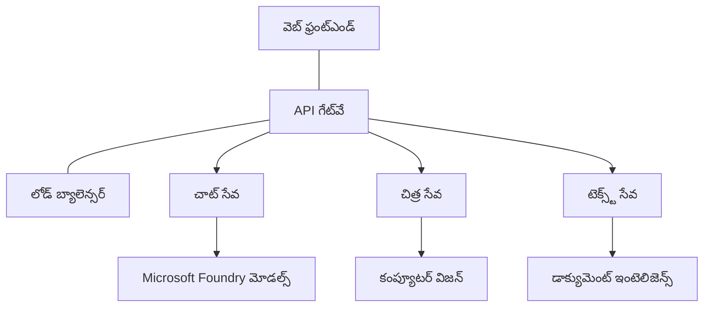

# AZD తో ప్రొడక్షన్ AI వర్క్లోడ్ ఉత్తమ ఆచరణలు

**చాప్టర్ నావిగేషన్:**
- **📚 కోర్సు హోమ్**: [AZD For Beginners](../../README.md)
- **📖 ప్రస్తుత అధ్యాయం**: చాప్టర్ 8 - ప్రొడక్షన్ & ఎంటర్‌ప్రైజ్ నమూనాలు
- **⬅️ మునుపటి అధ్యాయం**: [Chapter 7: Troubleshooting](../chapter-07-troubleshooting/debugging.md)
- **⬅️ అలాగే సంబంధిత**: [AI Workshop Lab](ai-workshop-lab.md)
- **🎯 కోర్సు పూర్తి**: [AZD For Beginners](../../README.md)

## అవలోకనం

ఈ గైడ్ Azure Developer CLI (AZD) ఉపయోగించి ప్రొడక్షన్-రెడి AI వర్క్లోడ్‌లని డిప్లాయ్ చేయడానికి సమగ్ర ఉత్తమ ఆచరణలను అందిస్తుంది. Microsoft Foundry Discord కమ్యూనిటీ ఫీడ్‌బాక్ మరియు వాస్తవ వినియోగదారు డిప్లాయ్‌మెంట్ల ఆధారంగా, ఈ ఆచరణలు ప్రొడక్షన్ AI సిస్టమ్స్‌లో మొస్ట్ కామన్ సవాళ్లను పరిష్కరించేందుకు లక్ష్యంగా ఉన్నాయి.

## నిర్దేశించిన కీలక సవాళ్లు

మన కమ్యూనిటీ పోలు ఫలితాల ఆధారంగా, అభివృద్ధికర్తలు ఎదుర్కొనే ప్రధాన సవాళ్లు ఇవి:

- **45%** బహుసేవల AI డిప్లాయ్‌మెంట్‌లతో ఇబ్బంది పడుతారు
- **38%** క్రెడెన్షియల్ మరియు సీక్రెట్ నిర్వహణలో సమస్యలు ఉన్నాయి  
- **35%** ప్రొడక్షన్ రెడినెస్ మరియు స్కేల్ చేయడంలో కష్టపడుతున్నారు
- **32%** మంచి ఖర్చు ఆప్టిమైజేషన్ వ్యూహాలు కావాలి
- **29%** మెరుగైన మానిటరింగ్ మరియు ట్రబుల్షూటింగ్ అవసరముంది

## ప్రొడక్షన్ AI కోసం ఆర్కిటెక్చర్ నమూనాలు

### Pattern 1: Microservices AI Architecture

**ఎప్పుడు ఉపయోగించాలి**: ఎన్నో సామర్థ్యాలున్న సంక్లిష్ట AI అనువర్తనాల కోసం



**AZD అమలు**:

```yaml
# azure.yaml
name: enterprise-ai-platform
services:
  web:
    project: ./web
    host: staticwebapp
  api-gateway:
    project: ./api-gateway
    host: containerapp
  chat-service:
    project: ./services/chat
    host: containerapp
  vision-service:
    project: ./services/vision
    host: containerapp
  text-service:
    project: ./services/text
    host: containerapp
```

### Pattern 2: Event-Driven AI Processing

**ఎప్పుడు ఉపయోగించాలి**: బ్యాచ్ ప్రాసెసింగ్, డాక్యుమెంట్ విశ్లేషణ, అసింక్ వర్క్‌ఫ్లోలు

```bicep
// Event Hub for AI processing pipeline
resource eventHub 'Microsoft.EventHub/namespaces@2023-01-01-preview' = {
  name: eventHubNamespaceName
  location: location
  sku: {
    name: 'Standard'
    tier: 'Standard'
    capacity: 1
  }
}

// Service Bus for reliable message processing
resource serviceBus 'Microsoft.ServiceBus/namespaces@2022-10-01-preview' = {
  name: serviceBusNamespaceName
  location: location
  sku: {
    name: 'Premium'
    tier: 'Premium'
    capacity: 1
  }
}

// Function App for processing
resource functionApp 'Microsoft.Web/sites@2023-01-01' = {
  name: functionAppName
  location: location
  kind: 'functionapp,linux'
  properties: {
    siteConfig: {
      appSettings: [
        {
          name: 'FUNCTIONS_EXTENSION_VERSION'
          value: '~4'
        }
        {
          name: 'AZURE_OPENAI_ENDPOINT'
          value: '@Microsoft.KeyVault(VaultName=${keyVault.name};SecretName=openai-endpoint)'
        }
      ]
    }
  }
}
```

## AI ఏజెంట్ ఆరోగ్యం గురించి ఆలోచనలు

ఒక సంప్రదాయ వెబ్ యాప్ బ్రేక్ అయినప్పుడు, లక్షణాలు పరిచితమే: ఒక పేజీ లోడ్ కావడం లేదు, ఒక API ఎర్రర్ రిటర్న్ చేస్తుంది, లేదా ఒక డిప్లాయ్‌మెంట్ విఫలమవుతుంది. AI-చాలిత అనువర్తనాలు కూడా ఇవే మార్గాల్లో విఫలమవచ్చు—కానీ అవి స్పష్టమైన ఎర్రర్ మెసేజ్‌లను చూపించకుండా సూక్ష్మంగా తప్పుడు ప్రవర్తన చూడవచ్చు.

ఈ విభాగం మీకు AI వర్క్లోడ్‌లను మానిటర్ చేయడానికి మానసిక నమూనాను నిర్మించడంలో సహాయపడుతుంది, కనుక విషయాలు సరిగా లేని సందర్భంలో ఎక్కడ చూడాలో మీకు తెలుస్తుంది.

### ఏజెంట్ ఆరోగ్యం పారంపరిక యాప్ ఆరోగ్యంతో ఎలా భిన్నంగా ఉంటుంది

సంప్రదాయ యాప్ పనిచేస్తే అది పనిచేస్తుంది లేదా కాదు. ఒక AI ఏజెంట్ పని చేస్తున్నట్లు కనిపించి కూడా తక్కువ నాణ్యత ఫలితాలను ఉత్పత్తి చేయవచ్చు. ఏజెంట్ ఆరోగ్యాన్ని రెండు పొరలలో ఆలోచించండి:

| Layer | What to Watch | Where to Look |
|-------|--------------|---------------|
| **Infrastructure health** | సర్వీస్ రన్ అవుతుందా? రిసోర్సులు ప్రావిజన్ అయ్యాయా? ఎండ్పాయింట్లు చేరేందుకు అందుబాటులో ఉన్నాయా? | `azd monitor`, Azure Portal resource health, container/app logs |
| **Behavior health** | ఏజెంట్ సరిగా స్పందిస్తుందా? స్పందనలు సమయానికి వస్తున్నాయా? మోడల్ సరైన విధంగా కాల్ అవుతుందా? | Application Insights traces, model call latency metrics, response quality logs |

ఇంఫ్రాస్ట్రక్చర్ ఆరోగ్యం పరిచితమే—ఇది ఏ azd యాప్‌కు వంటిదే. ప్రవర్తన ఆరోగ్యం AI వర్క్లోడ్‌లు పరిచయించే కొత్త పొర.

### AI యాప్స్ ఆశించినట్లుగా పని చేయకపోతే ఎక్కడ చూడాలి

మీ AI అప్లికేషన్ మీకు కోరుకున్న ఫలితాలు ఇవ్వకపోతే, ఇక్కడ ఒక భావనాత్మక చెక్లిస్ట్ను చూడండి:

1. **ప్రాథమికాలతో ప్రారంభించండి.** యాప్ రన్ అవుతుందా? ఇది దాని ఆధారపడ్డ ఉన్నవారికి చేరుకుంటుందా? ఏ యాప్‌కు అయినా చేసే విధంగా `azd monitor` మరియు రిసోర్సు ఆరోగ్యాన్ని తనిఖీ చేయండి.
2. **మోడల్ కనెక్షన్‌ను తనిఖీ చేయండి.** మీ అప్లికేషన్ సక్సెస్‌ఫుల్‌గా AI మోడల్‌ను కాల్ చేస్తున్నదా? విఫలమైన లేదా టైమ్-అవుట్ అయిన మోడల్ కాల్స్ AI యాప్ సమస్యలలో అత్యంత సాధారణ కారణం మరియు అవి మీ అప్లికేషన్ లాగ్‌లలో కనిపిస్తాయి.
3. **మోడల్‌కు ఏమి అందించబడిందో చూడండి.** AI స్పందనలు ఇన్‌పుట్ (ప్రాంప్ట్ మరియు ఏనైనా రెట్రీవ్డ్ కాన్టెక్స్ట్) మీద ఆధారపడి ఉంటాయి. అవుట్‌పుట్ తప్పైతే, ఇన్‌పుట్ సాధారణంగా తప్పుద మాత్రమే ఉంటుంది. మీ అప్లికేషన్ మోడల్‌కు సరైన డేటాను పంపుతున్నదో లేదో తనిఖీ చేయండి.
4. **స్పందన లేటెన్సీని సమీక్షించండి.** AI మోడల్ కాల్స్ సాధారణ API కాల్స్ కన్నా మందగిస్తాయి. మీ యాప్ అనుకుంటున్నదానికంటే నెమ్మదిగా అనిపిస్తే, మోడల్ స్పందన సమయాలు పెరిగాయా లేదా అని చూడండి—ఇది థ్రాట్లింగ్, సామర్థ్య పరిమితులు లేదా రీజన్-స్థాయి గజింపు సూచించవచ్చు.
5. **ఖర్చు సంకేతాలకూ గమనించండి.** టోకెన్ వినియోగంలో లేదా API కాల్స్‌లో యాక్స్‌పెక్టెడ్ కాని వేగంగా పెరుగుదల ఒక లూప్, తప్పుగా కాన్ఫిగర్ చేసిన ప్రాంప్ట్ లేదా అధిక రీట్రైస్ చూపిస్తుంది.

మీరు తక్షణంగా ఆబ్జర్వబిలిటీ టూలింగ్‌లో నిపుణులవ్వాల్సిన అవసరం లేదు. ముఖ్య విషయం ఏమిటంటే AI అనువర్తనాలకు మానిటర్ చేయాల్సిన అదనపు ప్రవర్తన పొర ఉంటుంది, మరియు azd యొక్క బిల్ట్-ఇన్ మానిటరింగ్ (`azd monitor`) రెండూ పొరలను విచారణ చేయడానికి ఒక ప్రారంభ బిందువు అందిస్తుంది.

---

## భద్రత ఉత్తమ ఆచరణలు

### 1. జీరో-ట్రస్టు భద్రతా నమూనా

**అమలుకరణ వ్యూహం**:
- authentication లేకుండా సేవ-తొ-సేవ కమ్యూనికేషన్ ఉండకూడదు
- అన్ని API కాల్స్ managed identities వాడతాయి
- ప్రైవేట్ ఎండ్పాయింట్లతో నెట్‌వర్క్ ఐసోలేషన్
- కనిష్ట హక్కుల ప్రాప్తి నియంత్రణలు

```bicep
// Managed Identity for each service
resource chatServiceIdentity 'Microsoft.ManagedIdentity/userAssignedIdentities@2023-01-31' = {
  name: 'chat-service-identity'
  location: location
}

// Role assignments with minimal permissions
resource openAIUserRole 'Microsoft.Authorization/roleAssignments@2022-04-01' = {
  scope: openAIAccount
  name: guid(openAIAccount.id, chatServiceIdentity.id, openAIUserRoleDefinitionId)
  properties: {
    roleDefinitionId: subscriptionResourceId('Microsoft.Authorization/roleDefinitions', '5e0bd9bd-7b93-4f28-af87-19fc36ad61bd')
    principalId: chatServiceIdentity.properties.principalId
    principalType: 'ServicePrincipal'
  }
}
```

### 2. సురక్షిత సీక్రెట్ నిర్వహణ

**Key Vault ఇంటిగ్రేషన్ నమూనా**:

```bicep
// Key Vault with proper access policies
resource keyVault 'Microsoft.KeyVault/vaults@2023-02-01' = {
  name: keyVaultName
  location: location
  properties: {
    tenantId: tenant().tenantId
    sku: {
      family: 'A'
      name: 'premium'  // Use premium for production
    }
    enableRbacAuthorization: true  // Use RBAC instead of access policies
    enablePurgeProtection: true    // Prevent accidental deletion
    enableSoftDelete: true
    softDeleteRetentionInDays: 90
  }
}

// Store all AI service credentials
resource openAIKeySecret 'Microsoft.KeyVault/vaults/secrets@2023-02-01' = {
  parent: keyVault
  name: 'openai-api-key'
  properties: {
    value: openAIAccount.listKeys().key1
    attributes: {
      enabled: true
    }
  }
}
```

### 3. నెట్‌వర్క్ భద్రత

**Private Endpoint కాన్ఫిగరేషన్**:

```bicep
// Virtual Network for AI services
resource virtualNetwork 'Microsoft.Network/virtualNetworks@2023-04-01' = {
  name: vnetName
  location: location
  properties: {
    addressSpace: {
      addressPrefixes: ['10.0.0.0/16']
    }
    subnets: [
      {
        name: 'ai-services-subnet'
        properties: {
          addressPrefix: '10.0.1.0/24'
          privateEndpointNetworkPolicies: 'Disabled'
        }
      }
      {
        name: 'app-services-subnet'
        properties: {
          addressPrefix: '10.0.2.0/24'
          delegations: [
            {
              name: 'Microsoft.Web/serverFarms'
              properties: {
                serviceName: 'Microsoft.Web/serverFarms'
              }
            }
          ]
        }
      }
    ]
  }
}

// Private endpoints for all AI services
resource openAIPrivateEndpoint 'Microsoft.Network/privateEndpoints@2023-04-01' = {
  name: '${openAIAccountName}-pe'
  location: location
  properties: {
    subnet: {
      id: virtualNetwork.properties.subnets[0].id
    }
    privateLinkServiceConnections: [
      {
        name: 'openai-connection'
        properties: {
          privateLinkServiceId: openAIAccount.id
          groupIds: ['account']
        }
      }
    ]
  }
}
```

## పనితనం మరియు స్కేలింగ్

### 1. ఆటో-స్కేలింగ్ వ్యూహాలు

**Container Apps ఆటో-స్కేలింగ్**:

```bicep
resource containerApp 'Microsoft.App/containerApps@2023-05-01' = {
  name: containerAppName
  location: location
  properties: {
    configuration: {
      ingress: {
        external: true
        targetPort: 8000
        transport: 'http'
      }
    }
    template: {
      scale: {
        minReplicas: 2  // Always have 2 instances minimum
        maxReplicas: 50 // Scale up to 50 for high load
        rules: [
          {
            name: 'http-scaling'
            http: {
              metadata: {
                concurrentRequests: '20'  // Scale when >20 concurrent requests
              }
            }
          }
          {
            name: 'cpu-scaling'
            custom: {
              type: 'cpu'
              metadata: {
                type: 'Utilization'
                value: '70'  // Scale when CPU >70%
              }
            }
          }
        ]
      }
    }
  }
}
```

### 2. క్యాషింగ్ వ్యూహాలు

**AI ప్రతిస్పందనల కోసం Redis క్యాష్**:

```bicep
// Redis Premium for production workloads
resource redisCache 'Microsoft.Cache/redis@2023-04-01' = {
  name: redisCacheName
  location: location
  properties: {
    sku: {
      name: 'Premium'
      family: 'P'
      capacity: 1
    }
    enableNonSslPort: false
    minimumTlsVersion: '1.2'
    redisConfiguration: {
      'maxmemory-policy': 'allkeys-lru'
    }
    // Enable clustering for high availability
    redisVersion: '6.0'
    shardCount: 2
  }
}

// Cache configuration in application
var cacheConnectionString = '${redisCache.properties.hostName}:6380,password=${redisCache.listKeys().primaryKey},ssl=True,abortConnect=False'
```

### 3. లోడ్ బ్యాలెన్సింగ్ మరియు ట్రాఫిక్ నిర్వహణ

**Application Gateway తో WAF**:

```bicep
// Application Gateway with Web Application Firewall
resource applicationGateway 'Microsoft.Network/applicationGateways@2023-04-01' = {
  name: appGatewayName
  location: location
  properties: {
    sku: {
      name: 'WAF_v2'
      tier: 'WAF_v2'
      capacity: 2
    }
    webApplicationFirewallConfiguration: {
      enabled: true
      firewallMode: 'Prevention'
      ruleSetType: 'OWASP'
      ruleSetVersion: '3.2'
    }
    // Backend pools for AI services
    backendAddressPools: [
      {
        name: 'ai-services-pool'
        properties: {
          backendAddresses: [
            {
              fqdn: '${containerApp.properties.configuration.ingress.fqdn}'
            }
          ]
        }
      }
    ]
  }
}
```

## 💰 ఖర్చు ఆప్టిమైజేషన్

### 1. రిసోర్స్ రైట్-సైజింగ్

**ఎన్‌విరాన్‌మెంట్-స్పెసిఫిక్ కాన్ఫిగరేషన్లు**:

```bash
# అభివృద్ధి వాతావరణం
azd env new development
azd env set AZURE_OPENAI_SKU "S0"
azd env set AZURE_OPENAI_CAPACITY 10
azd env set AZURE_SEARCH_SKU "basic"
azd env set CONTAINER_CPU 0.5
azd env set CONTAINER_MEMORY 1.0

# ఉత్పత్తి వాతావరణం
azd env new production
azd env set AZURE_OPENAI_SKU "S0"
azd env set AZURE_OPENAI_CAPACITY 100
azd env set AZURE_SEARCH_SKU "standard"
azd env set CONTAINER_CPU 2.0
azd env set CONTAINER_MEMORY 4.0
```

### 2. ఖర్చు మానిటరింగ్ మరియు బడ్జెట్లను ఏర్పాటు చేయడం

```bicep
// Cost management and budgets
resource budget 'Microsoft.Consumption/budgets@2023-05-01' = {
  name: 'ai-workload-budget'
  properties: {
    timePeriod: {
      startDate: '2024-01-01'
      endDate: '2024-12-31'
    }
    timeGrain: 'Monthly'
    amount: 2000  // $2000 monthly budget
    category: 'Cost'
    notifications: {
      warning: {
        enabled: true
        operator: 'GreaterThan'
        threshold: 80
        contactEmails: [
          'finance@company.com'
          'engineering@company.com'
        ]
        contactRoles: [
          'Owner'
          'Contributor'
        ]
      }
      critical: {
        enabled: true
        operator: 'GreaterThan'
        threshold: 95
        contactEmails: [
          'cto@company.com'
        ]
      }
    }
  }
}
```

### 3. టోకెన్ వినియోగ ఆప్టిమైజేషన్

**OpenAI ఖర్చు నిర్వహణ**:

```typescript
// అప్లికేషన్-స్థాయి టోకెన్ ఆప్టిమైజేషన్
class TokenOptimizer {
  private readonly maxTokens = 4000;
  private readonly reserveTokens = 500;
  
  optimizePrompt(userInput: string, context: string): string {
    const availableTokens = this.maxTokens - this.reserveTokens;
    const estimatedTokens = this.estimateTokens(userInput + context);
    
    if (estimatedTokens > availableTokens) {
      // సందర్భాన్ని సంక్షిప్తం చేయండి, వినియోగదారు ఇన్పుట్‌ను కాదు
      context = this.truncateContext(context, availableTokens - this.estimateTokens(userInput));
    }
    
    return `${context}\n\nUser: ${userInput}`;
  }
  
  private estimateTokens(text: string): number {
    // సుమారుగా అంచనా: 1 టోకెన్ ≈ 4 అక్షరాలు
    return Math.ceil(text.length / 4);
  }
}
```

## మానిటరింగ్ మరియు ఆబ్సర్వబిలిటీ

### 1. సమగ్ర Application Insights

```bicep
// Application Insights with advanced features
resource applicationInsights 'Microsoft.Insights/components@2020-02-02' = {
  name: applicationInsightsName
  location: location
  kind: 'web'
  properties: {
    Application_Type: 'web'
    WorkspaceResourceId: logAnalyticsWorkspace.id
    SamplingPercentage: 100  // Full sampling for AI apps
    DisableIpMasking: false  // Enable for security
  }
}

// Custom metrics for AI operations
resource aiMetricAlerts 'Microsoft.Insights/metricAlerts@2018-03-01' = {
  name: 'ai-high-error-rate'
  location: 'global'
  properties: {
    description: 'Alert when AI service error rate is high'
    severity: 2
    enabled: true
    scopes: [
      applicationInsights.id
    ]
    evaluationFrequency: 'PT1M'
    windowSize: 'PT5M'
    criteria: {
      'odata.type': 'Microsoft.Azure.Monitor.SingleResourceMultipleMetricCriteria'
      allOf: [
        {
          name: 'high-error-rate'
          metricName: 'requests/failed'
          operator: 'GreaterThan'
          threshold: 10
          timeAggregation: 'Count'
        }
      ]
    }
  }
}
```

### 2. AI-స్పెసిఫిక్ మానిటరింగ్

**AI మెట్రిక్స్ కోసం కస్టమ్ డాష్‌బోర్డ్లు**:

```json
// Dashboard configuration for AI workloads
{
  "dashboard": {
    "name": "AI Application Monitoring",
    "tiles": [
      {
        "name": "OpenAI Request Volume",
        "query": "requests | where name contains 'openai' | summarize count() by bin(timestamp, 5m)"
      },
      {
        "name": "AI Response Latency",
        "query": "requests | where name contains 'openai' | summarize avg(duration) by bin(timestamp, 5m)"
      },
      {
        "name": "Token Usage",
        "query": "customMetrics | where name == 'openai_tokens_used' | summarize sum(value) by bin(timestamp, 1h)"
      },
      {
        "name": "Cost per Hour",
        "query": "customMetrics | where name == 'openai_cost' | summarize sum(value) by bin(timestamp, 1h)"
      }
    ]
  }
}
```

### 3. హెల్త్ చెక్స్ మరియు అప్టైమ్ మానిటరింగ్

```bicep
// Application Insights availability tests
resource availabilityTest 'Microsoft.Insights/webtests@2022-06-15' = {
  name: 'ai-app-availability-test'
  location: location
  tags: {
    'hidden-link:${applicationInsights.id}': 'Resource'
  }
  properties: {
    SyntheticMonitorId: 'ai-app-availability-test'
    Name: 'AI Application Availability Test'
    Description: 'Tests AI application endpoints'
    Enabled: true
    Frequency: 300  // 5 minutes
    Timeout: 120    // 2 minutes
    Kind: 'ping'
    Locations: [
      {
        Id: 'us-east-2-azr'
      }
      {
        Id: 'us-west-2-azr'
      }
    ]
    Configuration: {
      WebTest: '''
        <WebTest Name="AI Health Check" 
                 Id="8d2de8d2-a2b0-4c2e-9a0d-8f9c9a0b8c8d" 
                 Enabled="True" 
                 CssProjectStructure="" 
                 CssIteration="" 
                 Timeout="120" 
                 WorkItemIds="" 
                 xmlns="http://microsoft.com/schemas/VisualStudio/TeamTest/2010" 
                 Description="" 
                 CredentialUserName="" 
                 CredentialPassword="" 
                 PreAuthenticate="True" 
                 Proxy="default" 
                 StopOnError="False" 
                 RecordedResultFile="" 
                 ResultsLocale="">
          <Items>
            <Request Method="GET" 
                     Guid="a5f10126-e4cd-570d-961c-cea43999a200" 
                     Version="1.1" 
                     Url="${webApp.properties.defaultHostName}/health" 
                     ThinkTime="0" 
                     Timeout="120" 
                     ParseDependentRequests="True" 
                     FollowRedirects="True" 
                     RecordResult="True" 
                     Cache="False" 
                     ResponseTimeGoal="0" 
                     Encoding="utf-8" 
                     ExpectedHttpStatusCode="200" 
                     ExpectedResponseUrl="" 
                     ReportingName="" 
                     IgnoreHttpStatusCode="False" />
          </Items>
        </WebTest>
      '''
    }
  }
}
```

## డిజాస్టర్ రికవరీ మరియు హై అవైలబిలిటీ

### 1. బహు-రీజియన్ డిప్లాయ్‌మెంట్

```yaml
# azure.yaml - Multi-region configuration
name: ai-app-multiregion
services:
  api-primary:
    project: ./api
    host: containerapp
    env:
      - AZURE_REGION=eastus
  api-secondary:
    project: ./api
    host: containerapp
    env:
      - AZURE_REGION=westus2
```

```bicep
// Traffic Manager for global load balancing
resource trafficManager 'Microsoft.Network/trafficManagerProfiles@2022-04-01' = {
  name: trafficManagerProfileName
  location: 'global'
  properties: {
    profileStatus: 'Enabled'
    trafficRoutingMethod: 'Priority'
    dnsConfig: {
      relativeName: trafficManagerProfileName
      ttl: 30
    }
    monitorConfig: {
      protocol: 'HTTPS'
      port: 443
      path: '/health'
      intervalInSeconds: 30
      toleratedNumberOfFailures: 3
      timeoutInSeconds: 10
    }
    endpoints: [
      {
        name: 'primary-endpoint'
        type: 'Microsoft.Network/trafficManagerProfiles/azureEndpoints'
        properties: {
          targetResourceId: primaryAppService.id
          endpointStatus: 'Enabled'
          priority: 1
        }
      }
      {
        name: 'secondary-endpoint'
        type: 'Microsoft.Network/trafficManagerProfiles/azureEndpoints'
        properties: {
          targetResourceId: secondaryAppService.id
          endpointStatus: 'Enabled'
          priority: 2
        }
      }
    ]
  }
}
```

### 2. డేటా బ్యాకప్ మరియు రికవరీ

```bicep
// Backup configuration for critical data
resource backupVault 'Microsoft.DataProtection/backupVaults@2023-05-01' = {
  name: backupVaultName
  location: location
  identity: {
    type: 'SystemAssigned'
  }
  properties: {
    storageSettings: [
      {
        datastoreType: 'VaultStore'
        type: 'LocallyRedundant'
      }
    ]
  }
}

// Backup policy for AI models and data
resource backupPolicy 'Microsoft.DataProtection/backupVaults/backupPolicies@2023-05-01' = {
  parent: backupVault
  name: 'ai-data-backup-policy'
  properties: {
    policyRules: [
      {
        backupParameters: {
          backupType: 'Full'
          objectType: 'AzureBackupParams'
        }
        trigger: {
          schedule: {
            repeatingTimeIntervals: [
              'R/2024-01-01T02:00:00+00:00/P1D'  // Daily at 2 AM
            ]
          }
          objectType: 'ScheduleBasedTriggerContext'
        }
        dataStore: {
          datastoreType: 'VaultStore'
          objectType: 'DataStoreInfoBase'
        }
        name: 'BackupDaily'
        objectType: 'AzureBackupRule'
      }
    ]
  }
}
```

## DevOps మరియు CI/CD ఇంటిగ్రేషన్

### 1. GitHub Actions వర్క్‌ఫ్లో

```yaml
# .github/workflows/deploy-ai-app.yml
name: Deploy AI Application

on:
  push:
    branches: [main]
  pull_request:
    branches: [main]

jobs:
  test:
    runs-on: ubuntu-latest
    steps:
      - uses: actions/checkout@v4
      
      - name: Setup Python
        uses: actions/setup-python@v4
        with:
          python-version: '3.11'
          
      - name: Install dependencies
        run: |
          pip install -r requirements.txt
          pip install pytest
          
      - name: Run tests
        run: pytest tests/
        
      - name: AI Safety Tests
        run: |
          python scripts/test_ai_safety.py
          python scripts/validate_prompts.py

  deploy-staging:
    needs: test
    if: github.event_name == 'pull_request'
    runs-on: ubuntu-latest
    steps:
      - uses: actions/checkout@v4
      
      - name: Setup AZD
        uses: Azure/setup-azd@v2
        
      - name: Login to Azure
        uses: azure/login@v1
        with:
          creds: ${{ secrets.AZURE_CREDENTIALS }}
          
      - name: Deploy to Staging
        run: |
          azd env select staging
          azd deploy

  deploy-production:
    needs: test
    if: github.ref == 'refs/heads/main'
    runs-on: ubuntu-latest
    steps:
      - uses: actions/checkout@v4
      
      - name: Setup AZD
        uses: Azure/setup-azd@v2
        
      - name: Login to Azure
        uses: azure/login@v1
        with:
          creds: ${{ secrets.AZURE_CREDENTIALS }}
          
      - name: Deploy to Production
        run: |
          azd env select production
          azd deploy
          
      - name: Run Production Health Checks
        run: |
          python scripts/health_check.py --env production
```

### 2. ఇన్‌ఫ్రాస్ట్రక్చర్ ధృవీకరణ

```bash
# scripts/validate_infrastructure.sh
#!/bin/bash

echo "Validating AI infrastructure deployment..."

# అవసరమైన అన్ని సేవలు నడుస్తున్నాయోని తనిఖీ చేయండి
services=("openai" "search" "storage" "keyvault")
for service in "${services[@]}"; do
    echo "Checking $service..."
    if ! az resource list --resource-type "Microsoft.CognitiveServices/accounts" --query "[?contains(name, '$service')]" -o tsv; then
        echo "ERROR: $service not found"
        exit 1
    fi
done

# OpenAI మోడల్ డిప్లాయ్‌మెంట్‌లను ధృవీకరించండి
echo "Validating OpenAI model deployments..."
models=$(az cognitiveservices account deployment list --name $AZURE_OPENAI_NAME --resource-group $AZURE_RESOURCE_GROUP --query "[].name" -o tsv)
if [[ ! $models == *"gpt-4.1-mini"* ]]; then
  echo "ERROR: Required model gpt-4.1-mini not deployed"
    exit 1
fi

# AI సేవ కనెక్టివిటీని పరీక్షించండి
echo "Testing AI service connectivity..."
python scripts/test_connectivity.py

echo "Infrastructure validation completed successfully!"
```

## ప్రొడక్షన్ రెడినెస్ చెక్లిస్ట్

### భద్రత ✅
- [ ] అన్ని సేవలు managed identities ఉపయోగిస్తాయి
- [ ] రహస్యాలు Key Vault లో నిల్వ చేయబడ్డాయి
- [ ] ప్రైవేట్ ఎండ్పాయింట్లు కాన్ఫిగర్ చేయబడ్డాయి
- [ ] నెట్‌వర్క్ సెక్యూరిటీ గ్రూప్‌లు అమలు చేయబడ్డాయి
- [ ] కనిష్ట హక్కులతో RBAC అమలు
- [ ] పబ్లిక్ ఎండ్పాయింట్లపై WAF ఎనేబుల్ చేయబడింది

### పనితనం ✅
- [ ] ఆటో-స్కేలింగ్ కాన్ఫిగర్ చేయబడింది
- [ ] క్యాషింగ్ అమలు చేయబడింది
- [ ] లోడ్ బ్యాలెన్సింగ్ సెట్‌అప్ చేశారు
- [ ] స్టాటిక్ కంటెంట్ కోసం CDN
- [ ] డేటాబేస్ కనెక్షన్ పూలింగ్
- [ ] టోకెన్ వినియోగ ఆప్టిమైజేషన్

### మానిటరింగ్ ✅
- [ ] Application Insights కాన్ఫిగర్ చేయబడింది
- [ ] కస్టమ్ మెట్రిక్స్ నిర్వచించబడ్డాయి
- [ ] అలర్టింగ్ రూల్స్ సెటప్ చేయబడ్డాయి
- [ ] డాష్‌బోర్డ్ సృష్టించబడింది
- [ ] హెల్త్ చెక్స్ అమలు చేయబడ్డాయి
- [ ] లాగ్ రిటెన్షన్ పాలసీలు అమలులో ఉన్నాయి

### నిర్బాధత ✅
- [ ] బహు-రీజియన్ డిప్లాయ్‌మెంట్
- [ ] బ్యాకప్ మరియు రికవరీ ప్లాన్
- [ ] సర్క్యూట్ బ్రేకర్స్ అమలు చేయబడ్డాయి
- [ ] రీట్రై పాలిసీలు కాన్ఫిగర్ చేయబడ్డాయి
- [ ] గ్రేస్ఫుల్ డిగ్రేడేషన్
- [ ] హెల్త్ చెక్ ఎండ్పాయింట్లు

### ఖర్చు నిర్వహణ ✅
- [ ] బడ్జెట్ అలర్ట్స్ కాన్ఫిగర్ చేయబడ్డాయి
- [ ] రిసోర్స్ రైట్-సైజింగ్
- [ ] Dev/test డిస్కౌంట్లు వర్తించబడ్డాయి
- [ ] Reserved instances కొనుగోలయ్యాయి
- [ ] ఖర్చు మానిటరింగ్ డాష్‌బోర్డ్
- [ ] నియమితంగా ఖర్చుల సమీక్షలు

### అనుసరణ ✅
- [ ] డేటా రెసిడెన్సీ అవసరాలు నెరవేర్చబడ్డాయి
- [ ] ఆడిట్ లాగింగ్ ఎనేబుల్ చేయబడింది
- [ ] కంప్లయన్స్ పాలసీలు వర్తించబడ్డాయి
- [ ] సెక్యూరిటీ బేస్‌లైన్లు అమలు చేయబడ్డాయి
- [ ] నియమిత సెక్యూరిటీ అసెస్‌మెంట్లు
- [ ] ఇన్సిడెంట్ రెస్పాన్స్ ప్లాన్

## పనితన బెంచ్‌మార్క్లు

### సాధారణ ప్రొడక్షన్ మెట్రిక్స్

| Metric | Target | Monitoring |
|--------|--------|------------|
| **Response Time** | < 2 seconds | Application Insights |
| **Availability** | 99.9% | Uptime monitoring |
| **Error Rate** | < 0.1% | Application logs |
| **Token Usage** | < $500/month | Cost management |
| **Concurrent Users** | 1000+ | Load testing |
| **Recovery Time** | < 1 hour | Disaster recovery tests |

### లోడ్ టెస్టింగ్

```bash
# కృత్రిమ మేధస్సు అనువర్తనాల కోసం లోడ్ పరీక్షా స్క్రిప్ట్
python scripts/load_test.py \
  --endpoint https://your-ai-app.azurewebsites.net \
  --concurrent-users 100 \
  --duration 300 \
  --ramp-up 60
```

## 🤝 కమ్యూనిటీ ఉత్తమ ఆచరణలు

Microsoft Foundry Discord కమ్యూనిటీ ఫీడ్‌బ్యాక్ ఆధారంగా:

### కమ్యూనిటీ ఇచ్చిన ప్రధాన సిఫార్సులు:

1. **స్కేల్ ని క్రమంగా పెంచండి**: ప్రాథమిక SKUs తో మొదలు పెట్టి నిజమైన వినియోగం ఆధారంగా స్కేల్ చేయండి
2. **అన్నింటినీ మానిటర్ చేయండి**: మొదటి రోజు నుండే సమగ్ర మానిటరింగ్ సెటప్ చేయండి
3. **భద్రతని ఆటోమేట్ చేయండి**: నిరంతర భద్రత కోసం ఇన్‌ఫ్రాస్ట్రక్చర్ యా కోడ్ వాడండి
4. **సక్రమంగా పరీక్షించండి**: మీ పైప్‌లైన్‌లో AI-స్పెసిఫిక్ టెస్టింగ్‌ను చేర్చండి
5. **ఖర్చుల కోసం ప్లాన్ చేయండి**: టోకెన్ వినియోగాన్ని మానిటర్ చేయండి మరియు త్వరగా బడ్జెట్ అలర్ట్స్ సెట్ చేయండి

### తప్పించుకోవాల్సిన సాధారణ పెట్ఫాల్స్:

- ❌ కోడ్‌లో API కీలు హార్డ్కోడ్ చేయడం
- ❌ సరైన మానిటరింగ్ సెటప్ చేయకుండా ఉండటం
- ❌ ఖర్చు ఆప్టిమైజేషన్‌ను పట్టించుకోకపోవడం
- ❌ ఫెయిల్యూర్ సన్నివేశాలను పరీక్షించకపోవడం
- ❌ హెల్త్ చెక్స్ లేకుండా డిప్లాయ్ చేయడం

## AZD AI CLI కమాండ్లు మరియు ఎక్స్‌టెన్షన్లు

AZD ఒక ఎదిగేట్టు AI-స్పెసిఫిక్ కమాండ్లు మరియు ఎక్స్‌టెన్షన్‌ల సమాహారాన్ని కలిగి ఉంటుంది, ఇవి ప్రొడక్షన్ AI వర్క్‌లో ఫ్లోలను సులభతరం చేస్తాయి. ఈ టూల్స్ లోకల్ డెవలప్మెంట్ మరియు ప్రొడక్షన్ డిప్లాయ్‌మెంట్ మధ్య గ్యాప్‌ను బ్రిడ్జ్ చేస్తాయి.

### AI కోసం AZD ఎక్స్‌టెన్షన్లు

AZD ఒక ఎక్స్‌టెన్షన్ సిస్టమ్ ఉపయోగించి AI-స్పెసిఫిక్ సామర్థ్యాలను జోడిస్తుంది. ఎక్స్‌టెన్షన్‌లను ఇన్‌స్టాల్ చేసి నిర్వహించడానికి:

```bash
# అందుబాటులో ఉన్న అన్ని విస్తరణలను చూపించండి (AI సహా)
azd extension list

# సంస్థాపించబడిన విస్తరణ వివరాలను పరిశీలించండి
azd extension show azure.ai.agents

# Foundry ఏజెంట్స్ విస్తరణను సంస్థాపించండి
azd extension install azure.ai.agents

# ఫైన్-ట్యూనింగ్ విస్తరణను సంస్థాపించండి
azd extension install azure.ai.finetune

# కస్టమ్ మోడల్స్ విస్తరణను సంస్థాపించండి
azd extension install azure.ai.models

# సంస్థాపించబడిన అన్ని విస్తరణలను అప్‌గ్రేడ్ చేయండి
azd extension upgrade --all
```

**అందుబాటులో ఉన్న AI ఎక్స్‌టెన్షన్లు:**

| Extension | Purpose | Status |
|-----------|---------|--------|
| `azure.ai.agents` | Foundry Agent Service నిర్వహణ | ప్రివ్యూ |
| `azure.ai.skills` | పునరుపయోగించుకునే ఏజెంట్ స్కిల్స్ | ప్రివ్యూ |
| `azure.ai.connections` | Foundry కనెక్షన్లు (డేటా సోర్సులు, టూల్స్) | ప్రివ్యూ |
| `azure.ai.finetune` | Foundry మోడల్ ఫైన్-ట్యూనింగ్ | ప్రివ్యూ |
| `azure.ai.models` | Foundry కస్టమ్ మోడల్స్ | ప్రివ్యూ |
| `azure.coding-agent` | కోడింగ్ ఏజెంట్ కన్ఫిగరేషన్ | అందుబాటులో |

> The `azure.ai.agents` extension త్వరగా అభివృద్ధి చెందుతుంది. ఈ కోर्स్‌ను `0.1.40-preview`తో చెలామణిలో ఉన్న వెర్షన్‌గా ధృవీకరించారు. `azd extension upgrade --all` ని రన్ చేసి తాజా కమాండ్ సెట్ పొందండి, మరియు `azd extension show azure.ai.agents` తో మీ ఇన్‍స్టాల్ చేయబడిన వెర్షన్‌ను నిర్ధారించుకోండి.

**ఇప్పుడు వచ్చిన కొత్త `skills` మరియు `connections` ఎక్స్‌టెన్షన్లు ఏమిటి?**

రెండు ప్రివ్యూ ఎక్స్‌టెన్షన్లు ఏజెంట్ టూలింగ్‌తో పాటు కనిపించాయి మరియు అవి ఒక బెగిన్నర్‌గా కూడా అర్థం చేసుకోవలసినవీ:

- **`azure.ai.skills`** — ఒక **skill** అనేది పునరుపయోగించదగిన సామర్థ్యం (ప్యాకేజ్డ్ టూల్ లేదా ప్రవర్తన) ఇది మీరు ప్రతి సారి మళ్ళీ రీరైటె చేయకుండా ఒక లేదా ఎక్కువ ఏజెంట్లకు అనుబంధించేలా ఉండవచ్చు. ఒక భాగంగా చూసుకోండి: ఒకసారి "డాక్స్‌ను శోధించు" లేదా "ఆర్డర్‌ను వెతకండి" అనే స్కిల్ ని నిర్వచించి, ఆ స్కిల్‌ను ఏజెంట్లలో పునరుపయోగించండి. ఇది బహు-ఏజెంట్ సిస్టమ్స్ (చాప్టర్ 5) ను కేటాయించి కాపి-పేస్ట్ ని నివారిస్తుంది.
- **`azure.ai.connections`** — ఒక **connection** అనేది మీ Foundry ప్రాజెక్ట్ నుండి ఏజెంట్లు అవసరపడే బహిర్గత వనరుకు నిర్వహించబడిన లింక్ — ఒక డేటా సోర్స్ (ఉదాహరణకు Azure AI Search), ఒక టూల్ ఎండ్పాయింట్ లేదా మరొక сервис. కనెక్షన్లు ఆ జాగాని, ఏజెంట్లు డేటాను ఎలా మరియు ఎక్కడ యాక్సెస్ చేస్తున్నాయో సెంట్రలైజ్ చేస్తాయి, కాబట్టి క్రెడెన్షియల్స్ మరియు ఎండ్పాయింట్లు కోడ్‌లో చల్లబడకుండా ఒక పాలనలో ఉండతాయి.

మీకు మొదటి ఏజెంట్లను డిప్లాయ్ చేయడానికి ఇవి అవసరం లేదు—learning సమయంలో `azure.ai.agents` తో కొనసాగండి. మీరు అదే టూల్‌ను ఏజెంట్లలో పునరావృతంగా ఉపయోగిస్తున్నట్లు కనపడితే `skills` కి చేరుకోండి, మరియు అనేక ఏజెంట్లు ఒకే డేటా సోర్స్‌ను పంచుకుంటే `connections` ఉపయోగించండి.

### `azd ai agent init` తో ఏజెంట్ ప్రాజెక్ట్‌లను ప్రారంభించడం

`azd ai agent init` కమాండ్ Microsoft Foundry Agent Service తో అనుసంధానించిన ప్రొడక్షన్-రెడి AI ఏజెంట్ ప్రాజెక్ట్‌ను స్కాఫోల్డ్ చేస్తుంది:

```bash
# ఏజెంట్ మానిఫెస్ట్ నుంచి కొత్త ఏజెంట్ ప్రాజెక్ట్‌ను ప్రారంభించండి
azd ai agent init -m <manifest-path-or-uri>

# ప్రారంభించి ఒక నిర్దిష్ట Foundry ప్రాజెక్ట్‌ను లక్ష్యంగా నిర్దేశించండి
azd ai agent init -m agent-manifest.yaml --project-id <foundry-project-id>

# కస్టమ్ సోర్స్ డైరెక్టరీతో ప్రారంభించండి
azd ai agent init -m agent-manifest.yaml --src ./agents/my-agent

# Container Apps ను హోస్ట్‌గా లక్ష్యంగా నిర్దేశించండి
azd ai agent init -m agent-manifest.yaml --host containerapp
```

**ప్రధాన ఫ్లాగ్‌లు:**

| Flag | Description |
|------|-------------|
| `-m, --manifest` | ప్రాజెక్ట్‌లో జోడించవలసిన ఏజెంట్ మానిఫెస్ట్‌కు పాత్ లేదా URI |
| `-p, --project-id` | మీ azd ఎన్విరాన్‌మెంట్ కోసం ఉన్న Microsoft Foundry Project ID |
| `-s, --src` | ఏజెంట్ నిర్వచనాన్ని డౌన్‌లోడ్ చేయడానికి డైరెక్టరీ (డిఫాల్ట్ కు `src/<agent-id>`) |
| `--host` | డిఫాల్ట్ హోస్ట్‌ను ఓవర్‌రైడ్ చేయండి (ఉదా., `containerapp`) |
| `-e, --environment` | ఉపయోగించాల్సిన azd ఎన్విరాన్‌మెంట్ |

**ప్రొడక్షన్ చిట్కా**: ప్రారంభంలోనే మీ ఏజెంట్ కోడ్ మరియు క్లౌడ్ రిసోర్సులను లింక్ చేయడానికి ఉన్న Foundry ప్రాజెక్ట్‌కు నేరుగా కనెక్ట్ కావడానికి `--project-id` వాడండి.

### ఏజెంట్ లైఫ్‌సైకిల్ నిర్వహణ

`init` తప్ప మరింతగా, `azure.ai.agents` ఎక్స్‌టెన్షన్ హోస్టెడ్ ఏజెంట్ యొక్క పూర్తి లైఫ్‌సైకిల్ కోసం టెస్టింగ్, మూల్యాంకనం, ఆప్టిమైజ్ మరియు రిటయర్ చేసే కమాండ్లను అందిస్తుంది:

```bash
# డిప్లాయ్ చేయబడిన ఏజెంట్‌ను పిలవండి మరియు సర్వర్ స్పందన సమయాన్ని చూడండి
# (మొత్తం లేటెన్సీ మరియు మొదటి బైట్‌కి సమయం)
azd ai agent invoke

# మార్చే ముందు లైవ్ ఎండ్‌పాయింట్ కాన్ఫిగరేషన్‌ను చూపించండి
azd ai agent endpoint show

# ఏజెంట్ కోసం మూల్యాంకన డేటాసెట్‌ను తయారుచేయండి
azd ai agent eval generate --dataset ./eval/dataset.jsonl

# మీ మూల్యాంకన డేటాపై ఏజెంట్ సూచనలను ఆప్టిమైజ్ చేయండి
# (ఏజెంట్ ప్రాజెక్ట్‌లో optimization_model అవసరం)
azd ai agent optimize

# కోడ్-ఆధారిత హోస్టెడ్ ఏజెంట్ యొక్క డిప్లాయ్ చేసిన సోర్స్‌ను డౌన్లోడ్ చేయండి
# (SHA-256 ధృవీకరణతో)
azd ai agent code download

# ఒక హోస్టెడ్ ఏజెంట్ మరియు దాని అన్ని వెర్షన్లను తొలగించండి
# (--force సక్రియ సెషన్లను ముగిస్తుంది)
azd ai agent delete --force
```

**ఒక చూపులో లైఫ్‌సైకిల్:**

| Stage | Command | Production use |
|-------|---------|----------------|
| Test | `azd ai agent invoke` | విడుదలకు ముందు స్పందనలు ధృవీకరించండి మరియు లేటెన్సీని కొలవండి |
| Inspect | `azd ai agent endpoint show` | ఎండ్పాయింట్ auth/config ని సమీక్షించండి; బ్రేకింగ్ చేంజెస్ పాల సంఖ్యలో కనిపెట్టండి |
| Measure | `azd ai agent eval generate` | నిజమైన ట్రేస్‌ల నుండి ఒక పునరావృతమయ్యే ఇవాల్యుయేషన్ సెట్ తయారు చేయండి |
| Improve | `azd ai agent optimize` | కొలవిన నాణ్యత ఆధారంగా సూచనలను ట్యూన్ చేయండి |
| Recover | `azd ai agent code download` | ఆడిట్/రాల్బ్యాక్ కోసం నిజంగా డిప్లాయ్ చేసిన సోర్స్‌ను తిరిగి పొందండి |
| Retire | `azd ai agent delete --force` | ఒక ఏజెంట్ మరియు దాని వెర్షన్‌లను శుభ్రంగా తొలగించండి |

> ఇవి ప్రివ్యూ కమాండ్లు మరియు ఎక్స్‌టెన్షన్ రిలీజ్‌లలో మారవచ్చు. మీ ఇన్‌స్టాల్ చేసిన వెర్షన్‌లో ఉన్న ఖచ్చితమైన సబ్‌కమాండ్లను చూడడానికి `azd ai agent --help` రన్ చేయండి.

### మోడల్ కాంటెక్స్ట్ ప్రోటోకాల్ (MCP) మరియు `azd mcp`
AZD includes built-in MCP server support (Alpha), enabling AI agents and tools to interact with your Azure resources through a standardized protocol:

```bash
# మీ ప్రాజెక్ట్ కోసం MCP సర్వర్ ప్రారంభించండి
azd mcp start

# సాధనాల అమలుకు ప్రస్తుత Copilot అనుమతి నియమాలను సమీక్షించండి
azd copilot consent list
```

MCP సర్వర్ మీ azd ప్రాజెక్ట్ కంటెక్ట్—పరిసరాలు, సేవలు, మరియు Azure వనరులను—AI-చేత నడిచే డెవలప్మెంట్ టూల్స్‌కు ప్రదర్శిస్తుంది. ఇది అనుమతిస్తుంది:

- **AI-assisted deployment**: కోడింగ్ ఏజెంట్లు మీ ప్రాజెక్ట్ స్థితిని ప్రశ్నించి డిప్లాయ్‌మెంట్‌లు ప్రారంభించగలవు
- **Resource discovery**: AI టూల్స్ మీ ప్రాజెక్ట్ ఉపయోగించే Azure వనరులను కనుగొనగలవు
- **Environment management**: ఏజెంట్లు dev/staging/production ఎన్‌విరాన్‌మెంట్‌ల మధ్య మార్పు చేయగలవు

### Infrastructure Generation with `azd infra generate`

For production AI workloads, you can generate and customize Infrastructure as Code rather than relying on automatic provisioning:

```bash
# మీ ప్రాజెక్ట్ నిర్వచనంనుంచి Bicep/Terraform ఫైళ్లను సృష్టించండి
azd infra generate
```

This writes IaC to disk so you can:
- డిప్లాయ్ చేయడానికి ముందుగా ఇన్‌ఫ్రాస్ట్రక్చరును సమీక్షించు మరియు ఆడిట్ చేయు
- కస్టమ్ సెక్యూరిటీ పాలసీలను జోడించండి (నెట్‌వర్క్ నియమాలు, ప్రైవేట్ ఎండ్‌పాయింట్లు)
- ఉన్న IaC సమీక్ష ప్రక్రియలతో అనుసంధానం చేయండి
- అప్లికేషన్ కోడ్ నుండి వేరుగా ఇన్‌ఫ్రాస్ట్రక్చర్ మార్పులను వర్షన్ నియంత్రణలో ఉంచండి

### Production Lifecycle Hooks

AZD hooks డిప్లాయ్‌మెంట్ లైఫ్‌సైకిల్ యొక్క ప్రతి దశలో కస్టమ్ లాజిక్‌ను ఇంజెక్ట్ చేయడానికి అనుమతిస్తాయి—ప్రొడక్షన్ AI వర్క్‌ఫ్లోలకు ఇది అత్యంత కీలకం:

```yaml
# azure.yaml - Production hooks example
name: ai-production-app
hooks:
  preprovision:
    shell: sh
    run: scripts/validate-quotas.sh    # Check AI model quota before provisioning
  postprovision:
    shell: sh
    run: scripts/configure-networking.sh  # Set up private endpoints
  predeploy:
    shell: sh
    run: scripts/run-ai-safety-tests.sh  # Run prompt safety checks
  postdeploy:
    shell: sh
    run: scripts/smoke-test.sh           # Verify agent responses post-deploy
services:
  agent-api:
    project: ./src/agent
    host: containerapp
    hooks:
      predeploy:
        shell: sh
        run: scripts/validate-model-access.sh  # Per-service hook
```

```bash
# అభివృద్ధి సమయంలో ఒక నిర్దిష్ట హుక్‌ను మాన్యువల్‌గా నడపండి
azd hooks run predeploy
```

**AI వర్క్‌లోడ్స్ కోసం సిఫార్సు చేయబడిన ప్రొడక్షన్ హూక్స్:**

| హుక్ | వినియోగం |
|------|----------|
| `preprovision` | AI మోడల్ సామర్థ్యానికి సంబంధించిన సబ్స్క్రిప్షన్ కోటాలను ధృవీకరించండి |
| `postprovision` | ప్రైవేట్ ఎండ్‌పాయింట్లను కాన్ఫిగర్ చేయండి, మోడల్ వెయిట్స్‌ను డిప్లాయ్ చేయండి |
| `predeploy` | AI సేఫ్టీ టెస్టులు నడపండి, ప్రాంప్ట్ టెంప్లేట్స్‌ను ధృవీకరించండి |
| `postdeploy` | ఏజెంట్ ప్రతిస్పందనలను స్మోక్ టెస్ట్ చేయండి, మోడల్ కనెక్టివిటీని నిర్ధారించండి |

### CI/CD Pipeline Configuration

సురక్షిత Azure ప్రమాణీకరణతో మీ ప్రాజెక్ట్‌ను GitHub Actions లేదా Azure Pipelines కు కనెక్ట్ చేయడానికి `azd pipeline config` ను ఉపయోగించండి:

```bash
# CI/CD పైప్‌లైన్‌ను కాన్ఫిగర్ చేయండి (సమ్వాదాత్మక)
azd pipeline config

# ఒక నిర్దిష్ట ప్రొవైడర్‌తో కాన్ఫిగర్ చేయండి
azd pipeline config --provider github
```

This command:
- కనిష్ట హక్కుల యాక్సెస్ తో ఒక సర్వీస్ ప్రిన్సిపల్‌ను సృష్టిస్తుంది
- ఫెడరేటెడ్ క్రెడెన్షియల్స్ (రహస్యాలు నిల్వ చేయబడవు) ని కాన్ఫిగర్ చేస్తుంది
- మీపైప్లైన్ నిర్వచన ఫైల్‌ను రూపొందిస్తుంది లేదా అప్‌డేట్ చేస్తుంది
- మీ CI/CD సిస్టమ్‌లో అవసరమైన ఎన్విరాన్‌మెంట్ వేరియబుల్స్‌ను సెట్చేస్తుంది

#### Step-by-step: your first GitHub Actions pipeline

Here's the full walkthrough from a working azd project to automated deployments on every push.

**1. Make sure your project is on GitHub**

```bash
git init
git add .
git commit -m "Initial azd project"
gh repo create my-ai-app --private --source=. --push
```

**2. Run pipeline config**

```bash
azd pipeline config --provider github
```

azd will, interactively:
- ఏ Azure subscription మరియు ఎన్‌విరాన్‌మెంట్‌ను లక్ష్యంగా చేయాలో అడుగుతుంది
- pipeline కోసం Entra **app registration + service principal** ను సృష్టిస్తుంది
- **federated credentials (OIDC)** ను సెటప్ చేస్తుంది—అందువల్ల GitHub సంక్షిప్త-కాలం టోకెన్లతో Azure ను authenticate చేస్తుంది మరియు **ఏ రహస్యాలు నిల్వ చేయబడవు**
- అవసరమైన **variables** ను మీ GitHub రిపోకు పుష్ చేస్తుంది (`AZURE_CLIENT_ID`, `AZURE_TENANT_ID`, `AZURE_SUBSCRIPTION_ID`, `AZURE_ENV_NAME`, `AZURE_LOCATION`)

**3. Understand the generated workflow**

azd adds `.github/workflows/azure-dev.yml`. The key parts look like this:

```yaml
# .github/workflows/azure-dev.yml
on:
  push:
    branches: [ main ]
  workflow_dispatch:        # lets you run it manually too

permissions:
  id-token: write           # required for OIDC federated login
  contents: read

jobs:
  build:
    runs-on: ubuntu-latest
    env:
      AZURE_CLIENT_ID: ${{ vars.AZURE_CLIENT_ID }}
      AZURE_TENANT_ID: ${{ vars.AZURE_TENANT_ID }}
      AZURE_SUBSCRIPTION_ID: ${{ vars.AZURE_SUBSCRIPTION_ID }}
      AZURE_ENV_NAME: ${{ vars.AZURE_ENV_NAME }}
      AZURE_LOCATION: ${{ vars.AZURE_LOCATION }}
    steps:
      - uses: actions/checkout@v4
      - name: Install azd
        uses: Azure/setup-azd@v2
      - name: Log in with OIDC
        run: azd auth login --client-id "$AZURE_CLIENT_ID" --federated-credential-provider "github" --tenant-id "$AZURE_TENANT_ID"
      - name: Provision infrastructure
        run: azd provision --no-prompt
      - name: Deploy application
        run: azd deploy --no-prompt
```

**4. Verify it works**

```bash
# పైప్‌లైన్‌ను ప్రారంభించడానికి ఒక మార్పును పుష్ చేయండి
git commit -am "Trigger pipeline" --allow-empty
git push
```

Open the **Actions** tab in your GitHub repo and watch the workflow run `azd provision` and `azd deploy` automatically.

> **Why federated credentials matter:** పాత పైప్లైన్లు GitHubలో క్లయింట్ సీక్రెట్‌ను నిల్వ చేసేవి. OIDC ఫెడరేటెడ్ క్రెడెన్షియల్స్ ఆ సీక్రెట్‌ను పూర్తిగా తొలగిస్తాయి—GitHub రన్‌టైమ్‌లో సంక్షిప్త-కాలం టోకెన్‌ను అభ్యర్థిస్తుంద, ఇది ఎక్కువగా సురక్షితం మరియు తిరగదిద్దాల్సిన లేదా లీక్ కావాల్సిన విషయమేమీ కాదు. ఇది `azd pipeline config` డిఫాల్ట్ సెటప్.

> **Secrets vs. variables:** సున్నితత్వం లేని గుర్తింపులు (`AZURE_CLIENT_ID`, మొదలైనవి) రిపో **variables** లోకి పోతాయి. మీ యాప్ నిజంగా బిల్డ్ టైంలో ఒక సీక్రెట్ అవసరమైతే, దాన్ని GitHub **secret** గా జోడించి `${{ secrets.NAME }}` తో సూచించండి—కానీ రన్‌టైమ్‌లో Key Vault + managed identityకి ప్రాధాన్యం ఇవ్వండి (చూడండి [Chapter 3](../chapter-03-configuration/authsecurity.md)).

**Production workflow with pipeline config:**

```bash
# 1. ఉత్పత్తి వాతావరణాన్ని ఏర్పాటు చేయండి
azd env new production
azd env set AZURE_OPENAI_CAPACITY 100

# 2. పైప్‌లైన్‌ను కాన్ఫిగర్ చేయండి
azd pipeline config --provider github

# 3. main బ్రాంచ్‌కు ప్రతి push పై పైప్‌లైన్ azd deploy ను నడిపిస్తుంది
```

#### Step-by-step: Azure DevOps Pipelines

GitHub Actions కంటే Azure DevOps ని ప్రాధాన్యం ఇస్తున్నారా? azd దీనిని స్థానికంగా `azdo` ప్రొవైడర్ ద్వారా మద్దతిస్తుంది. ప్రవాహం చాలా సమానంగా ఉంటుంది—azd పైప్లైన్ ఫైల్‌ను రూపొందిస్తుంది, ఒక సర్వీస్ కనెక్షన్‌ను సృష్టిస్తుంది, మరియు ప్రామాణీకరణను ఏర్పాటు చేస్తుంది.

**1. Make sure you have an Azure DevOps project**

మీకు `https://dev.azure.com/<your-org>` వద్ద ఒక ఆర్గనైజేషన్ మరియు ఒక ప్రాజెక్ట్ అవసరం. **Build (Read & execute)**, **Code (Read & write)**, మరియు **Service Connections (Read, query & manage)** స్కోప్స్ తో ఒక Personal Access Token (PAT) రూపొందించండి—azd మీకు అడుగుతుంది.

**2. Configure the pipeline**

```bash
azd pipeline config --provider azdo
```

azd will:
- మీ Azure DevOps ఆర్గనైజేషన్ మరియు ప్రాజెక్ట్ గురించి అడుగుతుంది
- సర్వీస్ ప్రిన్సిపల్ ఉపయోగించి Azureకి ఒక **service connection** ను సృష్టిస్తుంది (లేదా పునఃఉపయోగిస్తుంది)
- **workload identity federation (OIDC)** ను కాన్ఫిగర్ చేస్తుంది కాబట్టి ఏ క్లయింట్ సీక్రెట్ నిల్వ ఉండదు
- మీ రిపోకు `azure-dev.yml` పైప్లైన్ నిర్వచనాన్ని కమిట్ చేస్తుంది

**3. Review the generated `azure-dev.yml`**

azd `main` కి ప్రతి push పై ప్రోవిజన్ మరియు డిప్లాయ్ చేసే ఒక పైప్లైన్‌ను రాస్తుంది:

```yaml
# azure-dev.yml
trigger:
  - main

pool:
  vmImage: ubuntu-latest

steps:
  - task: setup-azd@1
    displayName: Install azd

  - script: azd provision --no-prompt
    displayName: Provision Infrastructure
    env:
      AZURE_SUBSCRIPTION_ID: $(AZURE_SUBSCRIPTION_ID)
      AZURE_ENV_NAME: $(AZURE_ENV_NAME)
      AZURE_LOCATION: $(AZURE_LOCATION)

  - script: azd deploy --no-prompt
    displayName: Deploy Application
    env:
      AZURE_SUBSCRIPTION_ID: $(AZURE_SUBSCRIPTION_ID)
      AZURE_ENV_NAME: $(AZURE_ENV_NAME)
      AZURE_LOCATION: $(AZURE_LOCATION)
```

**4. Where the variables come from**

azd ఎన్వైర్నమెంట్ విలువలను (`AZURE_ENV_NAME`, `AZURE_LOCATION`, `AZURE_SUBSCRIPTION_ID`) Azure DevOps లో ఒక **variable group**గా నిల్వ చేస్తుంది, అందువల్ల పైప్లైన్ వాటిని చదవగలదు. మీరు వాటిని **Pipelines → Library** లో చూడవచ్చు మరియు సవరించవచ్చు.

> **Same OIDC benefit as GitHub:** `azdo` ప్రొవైడర్ కూడా డిఫాల్ట్ గా workload identity federation ను కాన్ఫిగర్ చేస్తుంది, కాబట్టి సర్వీస్ కనెక్షన్‌లో ఏ క్లయింట్ సీక్రెట్ నిల్వ చేయబడదు—Azure DevOps రన్‌టైమ్‌లో సంక్షిప్త-కాలం టోకెన్‌ను మార్పిడి చేస్తుంది. మీ సంస్థ ఇంకా OIDC ఉపయోగించలేకపోతే మాత్రమే `--auth-type client-credentials` ను పాస్ చేయండి.

**5. Run it**

```bash
git commit -am "Add Azure DevOps pipeline" --allow-empty
git push
```

Open **Pipelines** in Azure DevOps to watch `azd provision` and `azd deploy` run.

### Adding Components with `azd add`

Incrementally add Azure services to an existing project:

```bash
# ఇంటరాక్టివ్‌గా కొత్త సర్వీస్ కంపోనెంట్‌ను జోడించండి
azd add
```

This is particularly useful for expanding production AI applications—for example, adding a vector search service, a new agent endpoint, or a monitoring component to an existing deployment.

## Additional Resources

- **Azure వెల్-ఆర్కిటెక్టెడ్ ఫ్రేమ్‌వర్క్**: [AI వర్క్‌లోడ్ మార్గదర్శకత్వం](https://learn.microsoft.com/azure/well-architected/ai/)
- **Microsoft Foundry డాక్యుమెంటేషన్**: [అధికారిక డాక్యుమెంట్లు](https://learn.microsoft.com/azure/ai-studio/)
- **కమ్యూనిటీ టెంప్లేట్స్**: [Azure Samples](https://github.com/Azure-Samples)
- **Discord కమ్యూనిటీ**: [#Azure చానల్](https://discord.gg/microsoft-azure)
- **Agent Skills for Azure**: [microsoft/github-copilot-for-azure on skills.sh](https://skills.sh/microsoft/github-copilot-for-azure) - Azure AI, Foundry, డిప్లాయ్‌మెంట్, ఖర్చు ఆప్టిమైజేషన్, మరియు డయాగ్నొస్టిక్స్ కోసం 37 ఓపెన్ ఏజెంట్ స్కిల్స్. మీ ఎడిటర్‌లో ఇన్‌స్టాల్ చేయండి:
  ```bash
  npx skills add microsoft/github-copilot-for-azure
  ```

---

**అధ్యాయ నావిగేషన్:**
- **📚 కోర్సు హోమ్**: [AZD For Beginners](../../README.md)
- **📖 ప్రస్తుత అధ్యాయం**: అధ్యాయం 8 - ప్రొడక్షన్ & ఎంటర్‌ప్రైజ్ నమూనాలు
- **⬅️ మునుపటి అధ్యాయం**: [అధ్యాయం 7: సమస్య పరిష్కారం](../chapter-07-troubleshooting/debugging.md)
- **⬅️ ఇతర సంబంధిత**: [AI Workshop Lab](ai-workshop-lab.md)
- **� కోర్సు పూర్తి**: [AZD For Beginners](../../README.md)

**గమనించండి**: ప్రొడక్షన్ AI వర్క్‌లోడ్స్‌కు జాగ్రత్తగా ప్లానింగ్, మానిటరింగ్, మరియు నిరంతర ఆప్టిమైజేషన్ అవసరం. ఈ నమూనాలతో ప్రారంభించి వాటిని మీ నిర్దిష్ట అవసరాలకు అనుగుణంగా మార్చుకోండి.

---

<!-- CO-OP TRANSLATOR DISCLAIMER START -->
**అస్వీకరణ**:
ఈ పత్రం AI అనువాద సేవ [Co-op Translator](https://github.com/Azure/co-op-translator) ఉపయోగించి అనువదించబడింది. మేము ఖచ్చితత్వానికి ప్రయత్నిస్తున్నప్పటికీ, ఆటోమేటెడ్ అనువాదాలు తప్పులు లేదా అసమగ్రతలను కలిగి ఉండవచ్చు. దాని స్వదేశ భాషలో ఉన్న అసలు పత్రాన్ని అధికారం కలిగిన మూలంగా పరిగణించాలి. కీలకమైన సమాచారం కోసం, ప్రొఫెషనల్ మానవ అనువాదాన్ని సిఫారసు చేస్తాము. ఈ అనువాదం ఉపయోగం వల్ల కలిగే ఏవైనా అపార్థాలు లేదా తప్పుదారులు కోసం మేము బాధ్యత వహించము.
<!-- CO-OP TRANSLATOR DISCLAIMER END -->