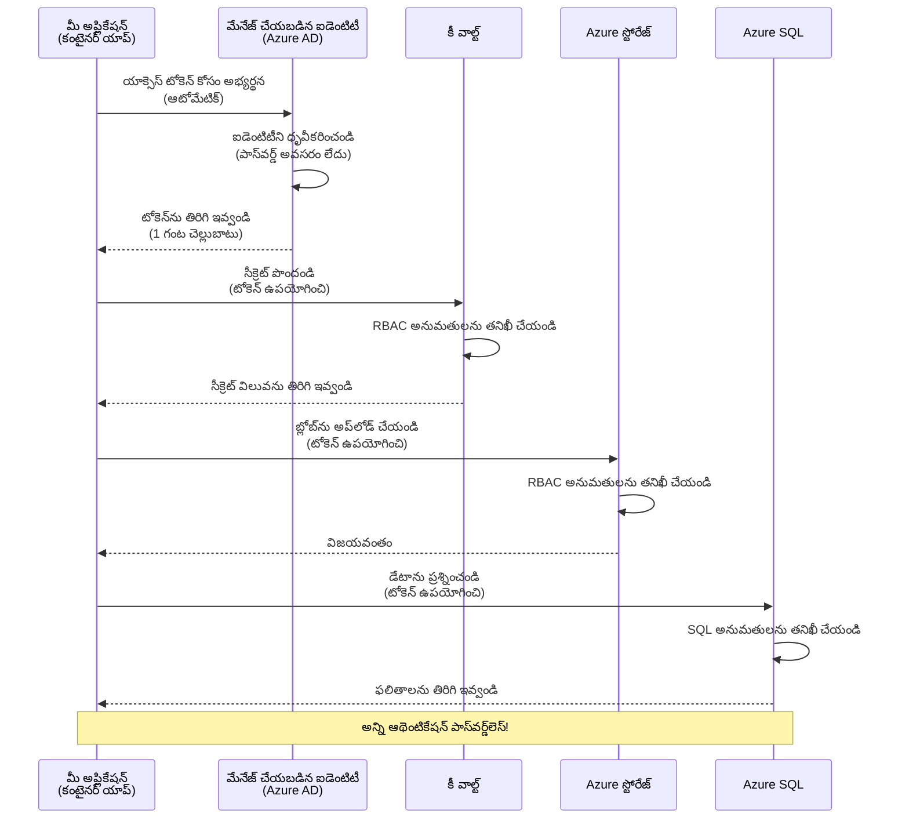
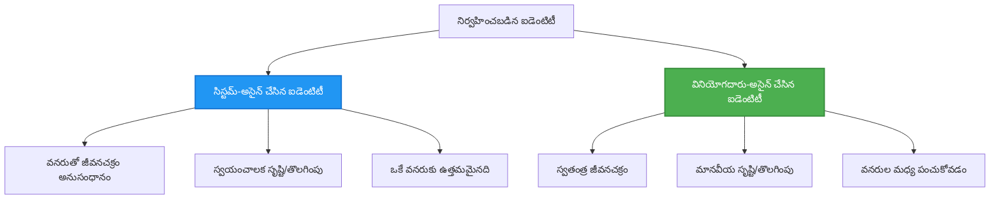

<!--
CO_OP_TRANSLATOR_METADATA:
{
  "original_hash": "e13ff6e1197e0a7462ed0aede7df9f23",
  "translation_date": "2025-11-25T08:43:03+00:00",
  "source_file": "docs/getting-started/authsecurity.md",
  "language_code": "te"
}
-->
# ధృవీకరణ నమూనాలు మరియు నిర్వహిత ఐడెంటిటీ

⏱️ **అంచనా సమయం**: 45-60 నిమిషాలు | 💰 **ఖర్చు ప్రభావం**: ఉచితం (అదనపు ఛార్జీలు లేవు) | ⭐ **సంక్లిష్టత**: మధ్యస్థం

**📚 అభ్యాస మార్గం:**
- ← గతం: [కాన్ఫిగరేషన్ మేనేజ్‌మెంట్](configuration.md) - పర్యావరణ వేరియబుల్స్ మరియు రహస్యాలను నిర్వహించడం
- 🎯 **మీరు ఇక్కడ ఉన్నారు**: ధృవీకరణ & భద్రత (నిర్వహిత ఐడెంటిటీ, కీ వాల్ట్, భద్రతా నమూనాలు)
- → తదుపరి: [మొదటి ప్రాజెక్ట్](first-project.md) - మీ మొదటి AZD అప్లికేషన్‌ను నిర్మించండి
- 🏠 [కోర్సు హోమ్](../../README.md)

---

## మీరు నేర్చుకునేది

ఈ పాఠాన్ని పూర్తి చేయడం ద్వారా, మీరు:
- Azure ధృవీకరణ నమూనాలను (కీలు, కనెక్షన్ స్ట్రింగ్స్, నిర్వహిత ఐడెంటిటీ) అర్థం చేసుకుంటారు
- **నిర్వహిత ఐడెంటిటీ**ను పాస్‌వర్డ్‌లేని ధృవీకరణ కోసం అమలు చేస్తారు
- **Azure Key Vault** ఇంటిగ్రేషన్‌తో రహస్యాలను భద్రపరుస్తారు
- AZD డిప్లాయ్‌మెంట్‌ల కోసం **పాత్ర ఆధారిత యాక్సెస్ కంట్రోల్ (RBAC)**ను కాన్ఫిగర్ చేస్తారు
- కంటైనర్ యాప్స్ మరియు Azure సేవలలో భద్రతా ఉత్తమ పద్ధతులను వర్తింపజేస్తారు
- కీ ఆధారిత ధృవీకరణ నుండి ఐడెంటిటీ ఆధారిత ధృవీకరణకు మార్పు చేస్తారు

## నిర్వహిత ఐడెంటిటీ ఎందుకు ముఖ్యమైంది

### సమస్య: సంప్రదాయ ధృవీకరణ

**నిర్వహిత ఐడెంటిటీకి ముందు:**
```javascript
// ❌ భద్రతా ప్రమాదం: కోడ్‌లో హార్డ్‌కోడ్ చేసిన రహస్యాలు
const connectionString = "Server=mydb.database.windows.net;User=admin;Password=P@ssw0rd123";
const storageKey = "xK7mN9pQ2wR5tY8uI0oP3aS6dF1gH4jK...";
const cosmosKey = "C2x7B9n4M1p8Q5w3E6r0T2y5U8i1O4p7...";
```

**సమస్యలు:**
- 🔴 **కోడ్, కాన్ఫిగరేషన్ ఫైళ్లలో, పర్యావరణ వేరియబుల్స్‌లో రహస్యాలు బయటపడటం**
- 🔴 **క్రెడెన్షియల్ రొటేషన్** కోడ్ మార్పులు మరియు రీడిప్లాయ్‌మెంట్ అవసరం
- 🔴 **ఆడిట్ సమస్యలు** - ఎవరు, ఎప్పుడు, ఏమి యాక్సెస్ చేశారు?
- 🔴 **విస్తరణ** - రహస్యాలు అనేక వ్యవస్థలలో వ్యాపించాయి
- 🔴 **కంప్లయన్స్ రిస్క్‌లు** - భద్రతా ఆడిట్లలో విఫలమవుతుంది

### పరిష్కారం: నిర్వహిత ఐడెంటిటీ

**నిర్వహిత ఐడెంటిటీ తర్వాత:**
```javascript
// ✅ సురక్షితం: కోడ్‌లో రహస్యాలు లేవు
const credential = new DefaultAzureCredential();
const client = new BlobServiceClient(
  "https://mystorageaccount.blob.core.windows.net",
  credential  // Azure స్వయంచాలకంగా ధృవీకరణను నిర్వహిస్తుంది
);
```

**ప్రయోజనాలు:**
- ✅ **కోడ్ లేదా కాన్ఫిగరేషన్‌లో రహస్యాలు లేవు**
- ✅ **ఆటోమేటిక్ రొటేషన్** - Azure దీనిని నిర్వహిస్తుంది
- ✅ **పూర్తి ఆడిట్ ట్రైల్** Azure AD లాగ్‌లలో
- ✅ **కేంద్రీకృత భద్రత** - Azure పోర్టల్‌లో నిర్వహించండి
- ✅ **కంప్లయన్స్ రెడీ** - భద్రతా ప్రమాణాలను కలుస్తుంది

**ఉదాహరణ**: సంప్రదాయ ధృవీకరణ అనేది వివిధ తలుపుల కోసం అనేక భౌతిక కీలు తీసుకెళ్లడం వంటిది. నిర్వహిత ఐడెంటిటీ అనేది మీరెవరో ఆధారంగా ఆటోమేటిక్ యాక్సెస్‌ను మంజూరు చేసే భద్రతా బ్యాడ్జ్‌ను కలిగి ఉండటంలాంటిది—తప్పిపోయే, కాపీ చేయగల, లేదా రొటేట్ చేయగల కీలు అవసరం లేదు.

---

## ఆర్కిటెక్చర్ అవలోకనం

### నిర్వహిత ఐడెంటిటీతో ధృవీకరణ ప్రవాహం


### నిర్వహిత ఐడెంటిటీల రకాలు


| ఫీచర్ | సిస్టమ్-అసైన్‌డ్ | యూజర్-అసైన్‌డ్ |
|---------|----------------|---------------|
| **లైఫ్‌సైకిల్** | వనరుతో అనుసంధానించబడింది | స్వతంత్రం |
| **సృష్టి** | వనరుతో ఆటోమేటిక్ | మాన్యువల్ సృష్టి |
| **తొలగింపు** | వనరుతో తొలగించబడింది | వనరుల తొలగింపు తర్వాత కొనసాగుతుంది |
| **షేరింగ్** | ఒక వనరుకు మాత్రమే | అనేక వనరులకు |
| **ఉపయోగం** | సింపుల్ సన్నివేశాలు | క్లిష్టమైన బహుళ వనరుల సన్నివేశాలు |
| **AZD డిఫాల్ట్** | ✅ సిఫార్సు చేయబడింది | ఐచ్ఛికం |

---

## అవసరమైనవి

### అవసరమైన టూల్స్

మీరు గత పాఠాల నుండి వీటిని ఇప్పటికే ఇన్‌స్టాల్ చేసుకుని ఉండాలి:

```bash
# Azure Developer CLIని ధృవీకరించండి
azd version
# ✅ ఆశించినది: azd వెర్షన్ 1.0.0 లేదా అంతకంటే ఎక్కువ

# Azure CLIని ధృవీకరించండి
az --version
# ✅ ఆశించినది: azure-cli 2.50.0 లేదా అంతకంటే ఎక్కువ
```

### Azure అవసరాలు

- యాక్టివ్ Azure సబ్‌స్క్రిప్షన్
- అనుమతులు:
  - నిర్వహిత ఐడెంటిటీలను సృష్టించండి
  - RBAC పాత్రలను అసైన్ చేయండి
  - Key Vault వనరులను సృష్టించండి
  - కంటైనర్ యాప్స్‌ను డిప్లాయ్ చేయండి

### జ్ఞాన అవసరాలు

మీరు పూర్తి చేయాలి:
- [ఇన్‌స్టాలేషన్ గైడ్](installation.md) - AZD సెటప్
- [AZD బేసిక్స్](azd-basics.md) - కోర్ కాన్సెప్ట్‌లు
- [కాన్ఫిగరేషన్ మేనేజ్‌మెంట్](configuration.md) - పర్యావరణ వేరియబుల్స్

---

## పాఠం 1: ధృవీకరణ నమూనాలను అర్థం చేసుకోవడం

### నమూనా 1: కనెక్షన్ స్ట్రింగ్స్ (లెగసీ - నివారించండి)

**ఇది ఎలా పనిచేస్తుంది:**
```bash
# కనెక్షన్ స్ట్రింగ్‌లో క్రెడెన్షియల్స్ ఉన్నాయి
STORAGE_CONNECTION_STRING="DefaultEndpointsProtocol=https;AccountName=myaccount;AccountKey=xK7mN9pQ2wR5..."
COSMOS_CONNECTION_STRING="AccountEndpoint=https://myaccount.documents.azure.com:443/;AccountKey=C2x7..."
SQL_CONNECTION_STRING="Server=myserver.database.windows.net;User=admin;Password=P@ssw0rd..."
```

**సమస్యలు:**
- ❌ పర్యావరణ వేరియబుల్స్‌లో రహస్యాలు కనిపిస్తాయి
- ❌ డిప్లాయ్‌మెంట్ సిస్టమ్‌లలో లాగ్ చేయబడింది
- ❌ రొటేట్ చేయడం కష్టం
- ❌ యాక్సెస్ యొక్క ఆడిట్ ట్రైల్ లేదు

**ఎప్పుడు ఉపయోగించాలి:** కేవలం లోకల్ డెవలప్‌మెంట్ కోసం, ప్రొడక్షన్‌లో ఎప్పుడూ కాదు.

---

### నమూనా 2: కీ వాల్ట్ రిఫరెన్సులు (మంచిది)

**ఇది ఎలా పనిచేస్తుంది:**
```bicep
// Store secret in Key Vault
resource keyVault 'Microsoft.KeyVault/vaults@2023-02-01' = {
  name: 'mykv'
  properties: {
    enableRbacAuthorization: true
  }
}

// Reference in Container App
env: [
  {
    name: 'STORAGE_KEY'
    secretRef: 'storage-key'  // References Key Vault
  }
]
```

**ప్రయోజనాలు:**
- ✅ రహస్యాలు కీ వాల్ట్‌లో సురక్షితంగా నిల్వ చేయబడతాయి
- ✅ కేంద్రీకృత రహస్య నిర్వహణ
- ✅ కోడ్ మార్పులు లేకుండా రొటేషన్

**పరిమితులు:**
- ⚠️ ఇంకా కీలు/పాస్‌వర్డ్‌లు ఉపయోగించబడుతున్నాయి
- ⚠️ కీ వాల్ట్ యాక్సెస్‌ను నిర్వహించాల్సి ఉంటుంది

**ఎప్పుడు ఉపయోగించాలి:** కనెక్షన్ స్ట్రింగ్స్ నుండి నిర్వహిత ఐడెంటిటీకి మార్పు దశ.

---

### నమూనా 3: నిర్వహిత ఐడెంటిటీ (ఉత్తమ పద్ధతి)

**ఇది ఎలా పనిచేస్తుంది:**
```bicep
// Enable managed identity
resource containerApp 'Microsoft.App/containerApps@2023-05-01' = {
  name: 'myapp'
  identity: {
    type: 'SystemAssigned'  // Automatically creates identity
  }
}

// Grant permissions
resource roleAssignment 'Microsoft.Authorization/roleAssignments@2022-04-01' = {
  scope: storageAccount
  properties: {
    roleDefinitionId: storageBlobDataContributorRole
    principalId: containerApp.identity.principalId
  }
}
```

**అప్లికేషన్ కోడ్:**
```javascript
// రహస్యాలు అవసరం లేదు!
const { DefaultAzureCredential } = require('@azure/identity');
const { BlobServiceClient } = require('@azure/storage-blob');

const credential = new DefaultAzureCredential();
const blobServiceClient = new BlobServiceClient(
  'https://mystorageaccount.blob.core.windows.net',
  credential
);
```

**ప్రయోజనాలు:**
- ✅ కోడ్/కాన్ఫిగరేషన్‌లో రహస్యాలు లేవు
- ✅ ఆటోమేటిక్ క్రెడెన్షియల్ రొటేషన్
- ✅ పూర్తి ఆడిట్ ట్రైల్
- ✅ RBAC ఆధారిత అనుమతులు
- ✅ కంప్లయన్స్ రెడీ

**ఎప్పుడు ఉపయోగించాలి:** ఎల్లప్పుడూ, ప్రొడక్షన్ అప్లికేషన్‌ల కోసం.

---

## పాఠం 2: AZDతో నిర్వహిత ఐడెంటిటీని అమలు చేయడం

### దశల వారీ అమలు

Azure స్టోరేజ్ మరియు Key Vault యాక్సెస్ చేయడానికి నిర్వహిత ఐడెంటిటీని ఉపయోగించే సురక్షిత కంటైనర్ యాప్‌ను నిర్మిద్దాం.

### ప్రాజెక్ట్ నిర్మాణం

```
secure-app/
├── azure.yaml                 # AZD configuration
├── infra/
│   ├── main.bicep            # Main infrastructure
│   ├── core/
│   │   ├── identity.bicep    # Managed identity setup
│   │   ├── keyvault.bicep    # Key Vault configuration
│   │   └── storage.bicep     # Storage with RBAC
│   └── app/
│       └── container-app.bicep
└── src/
    ├── app.js                # Application code
    ├── package.json
    └── Dockerfile
```

### 1. AZDని కాన్ఫిగర్ చేయండి (azure.yaml)

```yaml
name: secure-app
metadata:
  template: secure-app@1.0.0

services:
  api:
    project: ./src
    language: js
    host: containerapp

# Enable managed identity (AZD handles this automatically)
```

### 2. మౌలిక సదుపాయాలు: నిర్వహిత ఐడెంటిటీని ప్రారంభించండి

**ఫైల్: `infra/main.bicep`**

```bicep
targetScope = 'subscription'

param environmentName string
param location string = 'eastus'

var tags = { 'azd-env-name': environmentName }

// Resource group
resource rg 'Microsoft.Resources/resourceGroups@2021-04-01' = {
  name: 'rg-${environmentName}'
  location: location
  tags: tags
}

// Storage Account
module storage './core/storage.bicep' = {
  name: 'storage'
  scope: rg
  params: {
    name: 'st${uniqueString(rg.id)}'
    location: location
    tags: tags
  }
}

// Key Vault
module keyVault './core/keyvault.bicep' = {
  name: 'keyvault'
  scope: rg
  params: {
    name: 'kv-${uniqueString(rg.id)}'
    location: location
    tags: tags
  }
}

// Container App with Managed Identity
module containerApp './app/container-app.bicep' = {
  name: 'container-app'
  scope: rg
  params: {
    name: 'ca-${environmentName}'
    location: location
    tags: tags
    storageAccountName: storage.outputs.name
    keyVaultName: keyVault.outputs.name
  }
}

// Grant Container App access to Storage
module storageRoleAssignment './core/role-assignment.bicep' = {
  name: 'storage-role'
  scope: rg
  params: {
    principalId: containerApp.outputs.identityPrincipalId
    roleDefinitionId: 'ba92f5b4-2d11-453d-a403-e96b0029c9fe'  // Storage Blob Data Contributor
    targetResourceId: storage.outputs.id
  }
}

// Grant Container App access to Key Vault
module kvRoleAssignment './core/role-assignment.bicep' = {
  name: 'kv-role'
  scope: rg
  params: {
    principalId: containerApp.outputs.identityPrincipalId
    roleDefinitionId: '4633458b-17de-408a-b874-0445c86b69e6'  // Key Vault Secrets User
    targetResourceId: keyVault.outputs.id
  }
}

// Outputs
output AZURE_STORAGE_ACCOUNT_NAME string = storage.outputs.name
output AZURE_KEY_VAULT_NAME string = keyVault.outputs.name
output APP_URL string = containerApp.outputs.url
```

### 3. సిస్టమ్-అసైన్‌డ్ ఐడెంటిటీతో కంటైనర్ యాప్

**ఫైల్: `infra/app/container-app.bicep`**

```bicep
param name string
param location string
param tags object = {}
param storageAccountName string
param keyVaultName string

resource containerApp 'Microsoft.App/containerApps@2023-05-01' = {
  name: name
  location: location
  tags: tags
  identity: {
    type: 'SystemAssigned'  // 🔑 Enable managed identity
  }
  properties: {
    configuration: {
      ingress: {
        external: true
        targetPort: 3000
      }
    }
    template: {
      containers: [
        {
          name: 'api'
          image: 'myregistry.azurecr.io/api:latest'
          resources: {
            cpu: json('0.5')
            memory: '1Gi'
          }
          env: [
            {
              name: 'AZURE_STORAGE_ACCOUNT_NAME'
              value: storageAccountName
            }
            {
              name: 'AZURE_KEY_VAULT_NAME'
              value: keyVaultName
            }
            // 🔑 No secrets - managed identity handles authentication!
          ]
        }
      ]
    }
  }
}

// Output the identity for RBAC assignments
output identityPrincipalId string = containerApp.identity.principalId
output id string = containerApp.id
output url string = 'https://${containerApp.properties.configuration.ingress.fqdn}'
```

### 4. RBAC పాత్ర అసైన్‌మెంట్ మాడ్యూల్

**ఫైల్: `infra/core/role-assignment.bicep`**

```bicep
param principalId string
param roleDefinitionId string  // Azure built-in role ID
param targetResourceId string

resource roleAssignment 'Microsoft.Authorization/roleAssignments@2022-04-01' = {
  name: guid(principalId, roleDefinitionId, targetResourceId)
  scope: resourceId('Microsoft.Resources/resourceGroups', resourceGroup().name)
  properties: {
    roleDefinitionId: subscriptionResourceId('Microsoft.Authorization/roleDefinitions', roleDefinitionId)
    principalId: principalId
    principalType: 'ServicePrincipal'
  }
}

output id string = roleAssignment.id
```

### 5. నిర్వహిత ఐడెంటిటీతో అప్లికేషన్ కోడ్

**ఫైల్: `src/app.js`**

```javascript
const express = require('express');
const { DefaultAzureCredential } = require('@azure/identity');
const { BlobServiceClient } = require('@azure/storage-blob');
const { SecretClient } = require('@azure/keyvault-secrets');

const app = express();
const PORT = process.env.PORT || 3000;

// 🔑 క్రెడెన్షియల్ ప్రారంభించండి (నిర్వహించబడిన ఐడెంటిటీతో స్వయంచాలకంగా పనిచేస్తుంది)
const credential = new DefaultAzureCredential();

// Azure స్టోరేజ్ సెటప్
const storageAccountName = process.env.AZURE_STORAGE_ACCOUNT_NAME;
const blobServiceClient = new BlobServiceClient(
  `https://${storageAccountName}.blob.core.windows.net`,
  credential  // కీలు అవసరం లేదు!
);

// కీ వాల్ట్ సెటప్
const keyVaultName = process.env.AZURE_KEY_VAULT_NAME;
const secretClient = new SecretClient(
  `https://${keyVaultName}.vault.azure.net`,
  credential  // కీలు అవసరం లేదు!
);

// ఆరోగ్య తనిఖీ
app.get('/health', (req, res) => {
  res.json({ status: 'healthy', authentication: 'managed-identity' });
});

// బ్లోబ్ స్టోరేజ్‌కు ఫైల్‌ను అప్‌లోడ్ చేయండి
app.post('/upload', async (req, res) => {
  try {
    const containerClient = blobServiceClient.getContainerClient('uploads');
    await containerClient.createIfNotExists();
    
    const blobName = `file-${Date.now()}.txt`;
    const blockBlobClient = containerClient.getBlockBlobClient(blobName);
    
    await blockBlobClient.upload('Hello from managed identity!', 30);
    
    res.json({
      success: true,
      blobName: blobName,
      message: 'File uploaded using managed identity!'
    });
  } catch (error) {
    console.error('Upload error:', error);
    res.status(500).json({ error: error.message });
  }
});

// కీ వాల్ట్ నుండి సీక్రెట్ పొందండి
app.get('/secret/:name', async (req, res) => {
  try {
    const secretName = req.params.name;
    const secret = await secretClient.getSecret(secretName);
    
    res.json({
      name: secretName,
      value: secret.value,
      message: 'Secret retrieved using managed identity!'
    });
  } catch (error) {
    console.error('Secret error:', error);
    res.status(500).json({ error: error.message });
  }
});

// బ్లోబ్ కంటైనర్లను జాబితా చేయండి (పఠన ప్రాప్యతను ప్రదర్శిస్తుంది)
app.get('/containers', async (req, res) => {
  try {
    const containers = [];
    for await (const container of blobServiceClient.listContainers()) {
      containers.push(container.name);
    }
    
    res.json({
      containers: containers,
      count: containers.length,
      message: 'Containers listed using managed identity!'
    });
  } catch (error) {
    console.error('List error:', error);
    res.status(500).json({ error: error.message });
  }
});

app.listen(PORT, () => {
  console.log(`Secure API listening on port ${PORT}`);
  console.log('Authentication: Managed Identity (passwordless)');
});
```

**ఫైల్: `src/package.json`**

```json
{
  "name": "secure-app",
  "version": "1.0.0",
  "dependencies": {
    "express": "^4.18.2",
    "@azure/identity": "^4.0.0",
    "@azure/storage-blob": "^12.17.0",
    "@azure/keyvault-secrets": "^4.7.0"
  },
  "scripts": {
    "start": "node app.js"
  }
}
```

### 6. డిప్లాయ్ చేసి పరీక్షించండి

```bash
# AZD వాతావరణాన్ని ప్రారంభించండి
azd init

# మౌలిక సదుపాయాలు మరియు అప్లికేషన్‌ను మోహరించండి
azd up

# యాప్ URL పొందండి
APP_URL=$(azd env get-values | grep APP_URL | cut -d '=' -f2 | tr -d '"')

# ఆరోగ్య తనిఖీని పరీక్షించండి
curl $APP_URL/health
```

**✅ అంచనా ఫలితం:**
```json
{
  "status": "healthy",
  "authentication": "managed-identity"
}
```

**బ్లోబ్ అప్‌లోడ్‌ను పరీక్షించండి:**
```bash
curl -X POST $APP_URL/upload
```

**✅ అంచనా ఫలితం:**
```json
{
  "success": true,
  "blobName": "file-1700404800000.txt",
  "message": "File uploaded using managed identity!"
}
```

**కంటైనర్ లిస్టింగ్‌ను పరీక్షించండి:**
```bash
curl $APP_URL/containers
```

**✅ అంచనా ఫలితం:**
```json
{
  "containers": ["uploads"],
  "count": 1,
  "message": "Containers listed using managed identity!"
}
```

---

## సాధారణ Azure RBAC పాత్రలు

### నిర్వహిత ఐడెంటిటీ కోసం బిల్ట్-ఇన్ పాత్ర IDs

| సేవ | పాత్ర పేరు | పాత్ర ID | అనుమతులు |
|---------|-----------|---------|-------------|
| **స్టోరేజ్** | స్టోరేజ్ బ్లోబ్ డేటా రీడర్ | `2a2b9908-6b94-4a3d-8e5a-a7d8f8cc8a12` | బ్లోబ్‌లు మరియు కంటైనర్‌లను చదవండి |
| **స్టోరేజ్** | స్టోరేజ్ బ్లోబ్ డేటా కంట్రిబ్యూటర్ | `ba92f5b4-2d11-453d-a403-e96b0029c9fe` | చదవండి, రాయండి, బ్లోబ్‌లను తొలగించండి |
| **స్టోరేజ్** | స్టోరేజ్ క్యూవ్ డేటా కంట్రిబ్యూటర్ | `974c5e8b-45b9-4653-ba55-5f855dd0fb88` | చదవండి, రాయండి, క్యూవ్ సందేశాలను తొలగించండి |
| **కీ వాల్ట్** | కీ వాల్ట్ సీక్రెట్స్ యూజర్ | `4633458b-17de-408a-b874-0445c86b69e6` | రహస్యాలను చదవండి |
| **కీ వాల్ట్** | కీ వాల్ట్ సీక్రెట్స్ ఆఫీసర్ | `b86a8fe4-44ce-4948-aee5-eccb2c155cd7` | రహస్యాలను చదవండి, రాయండి, తొలగించండి |
| **కాస్మోస్ DB** | కాస్మోస్ DB బిల్ట్-ఇన్ డేటా రీడర్ | `00000000-0000-0000-0000-000000000001` | కాస్మోస్ DB డేటాను చదవండి |
| **కాస్మోస్ DB** | కాస్మోస్ DB బిల్ట్-ఇన్ డేటా కంట్రిబ్యూటర్ | `00000000-0000-0000-0000-000000000002` | చదవండి, రాయండి కాస్మోస్ DB డేటా |
| **SQL డేటాబేస్** | SQL DB కంట్రిబ్యూటర్ | `9b7fa17d-e63e-47b0-bb0a-15c516ac86ec` | SQL డేటాబేస్‌లను నిర్వహించండి |
| **సర్వీస్ బస్** | Azure సర్వీస్ బస్ డేటా ఓనర్ | `090c5cfd-751d-490a-894a-3ce6f1109419` | పంపండి, స్వీకరించండి, సందేశాలను నిర్వహించండి |

### పాత్ర IDsను ఎలా కనుగొనాలి

```bash
# అన్ని బిల్ట్-ఇన్ పాత్రలను జాబితా చేయండి
az role definition list --query "[].{Name:roleName, ID:name}" --output table

# నిర్దిష్ట పాత్ర కోసం శోధించండి
az role definition list --query "[?contains(roleName, 'Storage Blob')].{Name:roleName, ID:name}" --output table

# పాత్ర వివరాలను పొందండి
az role definition list --name "Storage Blob Data Contributor"
```

---

## ప్రాక్టికల్ వ్యాయామాలు

### వ్యాయామం 1: ఉన్న యాప్ కోసం నిర్వహిత ఐడెంటిటీని ప్రారంభించండి ⭐⭐ (మధ్యస్థం)

**లక్ష్యం**: కనెక్షన్ స్ట్రింగ్స్‌ను ఉపయోగిస్తున్న ఉన్న కంటైనర్ యాప్ డిప్లాయ్‌మెంట్‌కు నిర్వహిత ఐడెంటిటీని జోడించండి

**సన్నివేశం**: మీకు కనెక్షన్ స్ట్రింగ్స్‌ను ఉపయోగించే కంటైనర్ యాప్ ఉంది. దీన్ని నిర్వహిత ఐడెంటిటీకి మార్చండి.

**ప్రారంభ బిందువు**: ఈ కాన్ఫిగరేషన్‌తో కంటైనర్ యాప్:

```bicep
// ❌ Current: Using connection string
env: [
  {
    name: 'STORAGE_CONNECTION_STRING'
    secretRef: 'storage-connection'
  }
]
```

**దశలు**:

1. **Bicepలో నిర్వహిత ఐడెంటిటీని ప్రారంభించండి:**

```bicep
resource containerApp 'Microsoft.App/containerApps@2023-05-01' = {
  name: 'myapp'
  identity: {
    type: 'SystemAssigned'  // Add this
  }
  // ... rest of configuration
}
```

2. **స్టోరేజ్ యాక్సెస్‌ను మంజూరు చేయండి:**

```bicep
// Get storage account reference
resource storageAccount 'Microsoft.Storage/storageAccounts@2023-01-01' existing = {
  name: storageAccountName
}

// Assign role
resource roleAssignment 'Microsoft.Authorization/roleAssignments@2022-04-01' = {
  name: guid(containerApp.id, 'ba92f5b4-2d11-453d-a403-e96b0029c9fe', storageAccount.id)
  scope: storageAccount
  properties: {
    roleDefinitionId: subscriptionResourceId('Microsoft.Authorization/roleDefinitions', 'ba92f5b4-2d11-453d-a403-e96b0029c9fe')
    principalId: containerApp.identity.principalId
    principalType: 'ServicePrincipal'
  }
}
```

3. **అప్లికేషన్ కోడ్‌ను నవీకరించండి:**

**ముందు (కనెక్షన్ స్ట్రింగ్):**
```javascript
const { BlobServiceClient } = require('@azure/storage-blob');

const blobServiceClient = BlobServiceClient.fromConnectionString(
  process.env.STORAGE_CONNECTION_STRING
);
```

**తర్వాత (నిర్వహిత ఐడెంటిటీ):**
```javascript
const { DefaultAzureCredential } = require('@azure/identity');
const { BlobServiceClient } = require('@azure/storage-blob');

const credential = new DefaultAzureCredential();
const blobServiceClient = new BlobServiceClient(
  `https://${process.env.STORAGE_ACCOUNT_NAME}.blob.core.windows.net`,
  credential
);
```

4. **పర్యావరణ వేరియబుల్స్‌ను నవీకరించండి:**

```bicep
env: [
  {
    name: 'STORAGE_ACCOUNT_NAME'
    value: storageAccountName  // Just the name, no secrets!
  }
  // Remove STORAGE_CONNECTION_STRING
]
```

5. **డిప్లాయ్ చేసి పరీక్షించండి:**

```bash
# మళ్లీ అమలు చేయండి
azd up

# ఇది ఇంకా పనిచేస్తుందో పరీక్షించండి
curl https://myapp.azurecontainerapps.io/upload
```

**✅ విజయ ప్రమాణాలు:**
- ✅ అప్లికేషన్ ఎర్రర్‌లతో లేకుండా డిప్లాయ్ అవుతుంది
- ✅ స్టోరేజ్ ఆపరేషన్లు పనిచేస్తాయి (అప్‌లోడ్, లిస్ట్, డౌన్‌లోడ్)
- ✅ పర్యావరణ వేరియబుల్స్‌లో కనెక్షన్ స్ట్రింగ్స్ లేవు
- ✅ Azure పోర్టల్‌లో "Identity" బ్లేడ్‌లో ఐడెంటిటీ కనిపిస్తుంది

**ధృవీకరణ:**

```bash
# నిర్వహిత గుర్తింపు ప్రారంభించబడిందని తనిఖీ చేయండి
az containerapp show \
  --name myapp \
  --resource-group rg-myapp \
  --query "identity.type"
# ✅ ఆశించినది: "SystemAssigned"

# పాత్ర కేటాయింపును తనిఖీ చేయండి
az role assignment list \
  --assignee $(az containerapp show --name myapp --resource-group rg-myapp --query "identity.principalId" -o tsv) \
  --scope /subscriptions/{sub-id}/resourceGroups/rg-myapp/providers/Microsoft.Storage/storageAccounts/mystorageaccount
# ✅ ఆశించినది: "Storage Blob Data Contributor" పాత్రను చూపిస్తుంది
```

**సమయం**: 20-30 నిమిషాలు

---

### వ్యాయామం 2: బహుళ-సేవల యాక్సెస్‌తో యూజర్-అసైన్‌డ్ ఐడెంటిటీ ⭐⭐⭐ (అడ్వాన్స్‌డ్)

**లక్ష్యం**: అనేక కంటైనర్ యాప్స్‌లో భాగస్వామ్యం చేయబడిన యూజర్-అసైన్‌డ్ ఐడెంటిటీని సృష్టించండి

**సన్నివేశం**: మీకు 3 మైక్రోసర్వీసులు ఉన్నాయి, ఇవి అన్ని ఒకే స్టోరేజ్ అకౌంట్ మరియు Key Vault యాక్సెస్ అవసరం.

**దశలు**:

1. **యూజర్-అసైన్‌డ్ ఐడెంటిటీని సృష్టించండి:**

**ఫైల్: `infra/core/identity.bicep`**

```bicep
param name string
param location string
param tags object = {}

resource userAssignedIdentity 'Microsoft.ManagedIdentity/userAssignedIdentities@2023-01-31' = {
  name: name
  location: location
  tags: tags
}

output id string = userAssignedIdentity.id
output principalId string = userAssignedIdentity.properties.principalId
output clientId string = userAssignedIdentity.properties.clientId
```

2. **యూజర్-అసైన్‌డ్ ఐడెంటిటీకి పాత్రలను అసైన్ చేయండి:**

```bicep
// In main.bicep
module userIdentity './core/identity.bicep' = {
  name: 'user-identity'
  scope: rg
  params: {
    name: 'id-${environmentName}'
    location: location
    tags: tags
  }
}

// Grant Storage access
resource storageRoleAssignment 'Microsoft.Authorization/roleAssignments@2022-04-01' = {
  name: guid(userIdentity.outputs.principalId, 'storage-contributor')
  scope: storageAccount
  properties: {
    roleDefinitionId: subscriptionResourceId('Microsoft.Authorization/roleDefinitions', 'ba92f5b4-2d11-453d-a403-e96b0029c9fe')
    principalId: userIdentity.outputs.principalId
    principalType: 'ServicePrincipal'
  }
}

// Grant Key Vault access
resource kvRoleAssignment 'Microsoft.Authorization/roleAssignments@2022-04-01' = {
  name: guid(userIdentity.outputs.principalId, 'kv-secrets-user')
  scope: keyVault
  properties: {
    roleDefinitionId: subscriptionResourceId('Microsoft.Authorization/roleDefinitions', '4633458b-17de-408a-b874-0445c86b69e6')
    principalId: userIdentity.outputs.principalId
    principalType: 'ServicePrincipal'
  }
}
```

3. **అనేక కంటైనర్ యాప్స్‌కు ఐడెంటిటీని అసైన్ చేయండి:**

```bicep
resource apiGateway 'Microsoft.App/containerApps@2023-05-01' = {
  name: 'api-gateway'
  identity: {
    type: 'UserAssigned'
    userAssignedIdentities: {
      '${userIdentity.outputs.id}': {}
    }
  }
  // ... rest of config
}

resource productService 'Microsoft.App/containerApps@2023-05-01' = {
  name: 'product-service'
  identity: {
    type: 'UserAssigned'
    userAssignedIdentities: {
      '${userIdentity.outputs.id}': {}
    }
  }
  // ... rest of config
}

resource orderService 'Microsoft.App/containerApps@2023-05-01' = {
  name: 'order-service'
  identity: {
    type: 'UserAssigned'
    userAssignedIdentities: {
      '${userIdentity.outputs.id}': {}
    }
  }
  // ... rest of config
}
```

4. **అప్లికేషన్ కోడ్ (అన్ని సేవలు ఒకే నమూనాను ఉపయోగిస్తాయి):**

```javascript
const { DefaultAzureCredential, ManagedIdentityCredential } = require('@azure/identity');

// వినియోగదారు-అసైన్ చేసిన ఐడెంటిటీ కోసం, క్లయింట్ IDని పేర్కొనండి
const credential = new ManagedIdentityCredential(
  process.env.AZURE_CLIENT_ID  // వినియోగదారు-అసైన్ చేసిన ఐడెంటిటీ క్లయింట్ ID
);

// లేదా DefaultAzureCredential (ఆటో-డిటెక్ట్ చేస్తుంది) ఉపయోగించండి
const credential = new DefaultAzureCredential();

const blobServiceClient = new BlobServiceClient(
  `https://${process.env.STORAGE_ACCOUNT_NAME}.blob.core.windows.net`,
  credential
);
```

5. **డిప్లాయ్ చేసి ధృవీకరించండి:**

```bash
azd up

# అన్ని సేవలు నిల్వను యాక్సెస్ చేయగలవా పరీక్షించండి
curl https://api-gateway.azurecontainerapps.io/upload
curl https://product-service.azurecontainerapps.io/upload
curl https://order-service.azurecontainerapps.io/upload
```

**✅ విజయ ప్రమాణాలు:**
- ✅ 3 సేవలలో ఒక ఐడెంటిటీ భాగస్వామ్యం చేయబడింది
- ✅ అన్ని సేవలు స్టోరేజ్ మరియు Key Vaultను యాక్సెస్ చేయగలవు
- ✅ మీరు ఒక సేవను తొలగిస్తే ఐడెంటిటీ కొనసాగుతుంది
- ✅ కేంద్రీకృత అనుమతి నిర్వహణ

**యూజర్-అసైన్‌డ్ ఐడెంటిటీ ప్రయోజనాలు:**
- నిర్వహించడానికి ఒక ఐడెంటిటీ
- సేవలలో స్థిరమైన అనుమతులు
- సేవ తొలగింపు తర్వాత కొనసాగుతుంది
- క్లిష్టమైన ఆర్కిటెక్చర్‌లకు మెరుగైనది

**సమయం**: 30-40 నిమిషాలు

---

### వ్యాయామం 3: Key Vault సీక్రెట్ రొటేషన్ అమలు చేయండి ⭐⭐⭐ (అడ్వాన్స్‌డ్)

**లక్ష్యం**: Key Vaultలో మూడవ-పక్ష API కీలను నిల్వ చేసి, నిర్వహిత ఐడెంటిటీని ఉపయోగించి వాటిని యాక్సెస్ చేయండి

**సన్నివేశం**: మీ యాప్ OpenAI, Stripe, SendGrid వంటి బాహ్య APIని కాల్ చేయాలి, ఇది API కీలు అవసరం.

**దశలు**:

1. **RBACతో Key Vaultను సృష్టించండి:**

**ఫైల్: `infra/core/keyvault.bicep`**

```bicep
param name string
param location string
param tags object = {}

resource keyVault 'Microsoft.KeyVault/vaults@2023-02-01' = {
  name: name
  location: location
  tags: tags
  properties: {
    enableRbacAuthorization: true  // Use RBAC instead of access policies
    sku: {
      family: 'A'
      name: 'standard'
    }
    tenantId: subscription().tenantId
    enableSoftDelete: true
    softDeleteRetentionInDays: 90
  }
}

// Allow Container App to read secrets
output id string = keyVault.id
output name string = keyVault.name
output uri string = keyVault.properties.vaultUri
```

2. **Key Vaultలో రహస్యాలను నిల్వ
- [ ] **Q1**: Key Vault కోసం access policies బదులుగా RBAC ఎలా ప్రారంభించాలి?
  - **A**: Bicep లో `enableRbacAuthorization: true` సెట్ చేయండి

- [ ] **Q2**: Azure SDK లైబ్రరీలో managed identity authentication ను ఏది నిర్వహిస్తుంది?
  - **A**: `@azure/identity` మరియు `DefaultAzureCredential` క్లాస్

- [ ] **Q3**: Key Vault రహస్యాలు cache లో ఎంతకాలం ఉంటాయి?
  - **A**: అప్లికేషన్ ఆధారంగా; మీ స్వంత caching strategy అమలు చేయండి

**ప్రాక్టికల్ వెరిఫికేషన్:**
```bash
# కీ వాల్ట్ యాక్సెస్ పరీక్షించండి
az keyvault secret show \
  --vault-name $KV_NAME \
  --name "OpenAI-ApiKey" \
  --query "value"

# RBAC ప్రారంభించబడిందని తనిఖీ చేయండి
az keyvault show \
  --name $KV_NAME \
  --query "properties.enableRbacAuthorization"
# ✅ ఆశించినది: నిజం
```

---

## భద్రతకు సంబంధించిన ఉత్తమ పద్ధతులు

### ✅ చేయవలసినవి:

1. **ప్రొడక్షన్ లో managed identity ఉపయోగించండి**
   ```bicep
   identity: {
     type: 'SystemAssigned'
   }
   ```

2. **కనిష్ట-అధికార RBAC పాత్రలు ఉపయోగించండి**
   - సాధ్యమైనంతవరకు "Reader" పాత్రలు ఉపయోగించండి
   - అవసరం లేకపోతే "Owner" లేదా "Contributor" పాత్రలు నివారించండి

3. **మూడవ-పక్షం కీలను Key Vault లో నిల్వ చేయండి**
   ```javascript
   const apiKey = await secretClient.getSecret('ThirdPartyApiKey');
   ```

4. **audit logging ప్రారంభించండి**
   ```bicep
   diagnosticSettings: {
     logs: [{ category: 'AuditEvent', enabled: true }]
   }
   ```

5. **dev/staging/prod కోసం వేర్వేరు identities ఉపయోగించండి**
   ```bash
   azd env new dev
   azd env new staging
   azd env new prod
   ```

6. **రహస్యాలను తరచుగా తిరిగి సెట్ చేయండి**
   - Key Vault రహస్యాలపై గడువు తేదీలను సెట్ చేయండి
   - Azure Functions తో rotation ను ఆటోమేట్ చేయండి

### ❌ చేయకూడనివి:

1. **రహస్యాలను hardcode చేయకండి**
   ```javascript
   // ❌ చెడు
   const apiKey = "sk-proj-xxxxxxxxxxxxx";
   ```

2. **ప్రొడక్షన్ లో connection strings ఉపయోగించకండి**
   ```javascript
   // ❌ చెడు
   BlobServiceClient.fromConnectionString(process.env.STORAGE_CONNECTION_STRING)
   ```

3. **అధిక అనుమతులను ఇవ్వకండి**
   ```bicep
   // ❌ BAD - too much access
   roleDefinitionId: 'Owner'
   
   // ✅ GOOD - least privilege
   roleDefinitionId: 'Storage Blob Data Reader'
   ```

4. **రహస్యాలను లాగ్ చేయకండి**
   ```javascript
   // ❌ చెడు
   console.log('API Key:', apiKey);
   
   // ✅ మంచి
   console.log('API Key retrieved successfully');
   ```

5. **ప్రొడక్షన్ identities ను వేర్వేరు పరిసరాల్లో పంచుకోకండి**
   ```bicep
   // ❌ BAD - same identity for dev and prod
   // ✅ GOOD - separate identities per environment
   ```

---

## సమస్యల పరిష్కార మార్గదర్శిని

### సమస్య: Azure Storage ను access చేయడానికి "Unauthorized" 

**లక్షణాలు:**
```
Error: Unauthorized (403)
AuthorizationPermissionMismatch: This request is not authorized to perform this operation
```

**నిర్ధారణ:**

```bash
# నిర్వహిత గుర్తింపు ప్రారంభించబడిందా అని తనిఖీ చేయండి
az containerapp show \
  --name myapp \
  --resource-group rg-myapp \
  --query "identity.type"
# ✅ ఆశించినది: "SystemAssigned" లేదా "UserAssigned"

# పాత్ర నియమాలను తనిఖీ చేయండి
PRINCIPAL_ID=$(az containerapp show --name myapp --resource-group rg-myapp --query "identity.principalId" -o tsv)
az role assignment list --assignee $PRINCIPAL_ID

# ఆశించినది: "Storage Blob Data Contributor" లేదా ఇలాంటి పాత్రను చూడాలి
```

**పరిష్కారాలు:**

1. **సరైన RBAC పాత్రను ఇవ్వండి:**
```bash
STORAGE_ID=$(az storage account show --name mystorageaccount --resource-group rg-myapp --query "id" -o tsv)
az role assignment create \
  --assignee $PRINCIPAL_ID \
  --role "Storage Blob Data Contributor" \
  --scope $STORAGE_ID
```

2. **ప్రసారం కోసం వేచి ఉండండి (5-10 నిమిషాలు పడవచ్చు):**
```bash
# పాత్ర కేటాయింపు స్థితిని తనిఖీ చేయండి
az role assignment list --assignee $PRINCIPAL_ID --scope $STORAGE_ID
```

3. **అప్లికేషన్ కోడ్ సరైన credential ను ఉపయోగిస్తున్నదని నిర్ధారించండి:**
```javascript
// మీరు DefaultAzureCredential ఉపయోగిస్తున్నారని నిర్ధారించుకోండి
const credential = new DefaultAzureCredential();
```

---

### సమస్య: Key Vault access నిరాకరించబడింది

**లక్షణాలు:**
```
Error: Forbidden (403)
The user, group or application does not have secrets get permission
```

**నిర్ధారణ:**

```bash
# కీ వాల్ట్ RBAC ప్రారంభించబడిందని తనిఖీ చేయండి
az keyvault show \
  --name $KV_NAME \
  --query "properties.enableRbacAuthorization"
# ✅ ఆశించినది: true

# పాత్ర నియమాలను తనిఖీ చేయండి
az role assignment list \
  --assignee $PRINCIPAL_ID \
  --scope /subscriptions/{sub-id}/resourceGroups/rg-myapp/providers/Microsoft.KeyVault/vaults/$KV_NAME
```

**పరిష్కారాలు:**

1. **Key Vault పై RBAC ప్రారంభించండి:**
```bash
az keyvault update \
  --name $KV_NAME \
  --enable-rbac-authorization true
```

2. **Key Vault Secrets User పాత్రను ఇవ్వండి:**
```bash
KV_ID=$(az keyvault show --name $KV_NAME --query "id" -o tsv)
az role assignment create \
  --assignee $PRINCIPAL_ID \
  --role "Key Vault Secrets User" \
  --scope $KV_ID
```

---

### సమస్య: DefaultAzureCredential స్థానికంగా విఫలమవుతుంది

**లక్షణాలు:**
```
Error: DefaultAzureCredential failed to retrieve a token
CredentialUnavailableError: No credential available
```

**నిర్ధారణ:**

```bash
# మీరు లాగిన్ అయ్యారా అని తనిఖీ చేయండి
az account show

# Azure CLI ప్రామాణీకరణను తనిఖీ చేయండి
az ad signed-in-user show
```

**పరిష్కారాలు:**

1. **Azure CLI లో login చేయండి:**
```bash
az login
```

2. **Azure subscription ను సెట్ చేయండి:**
```bash
az account set --subscription "Your Subscription Name"
```

3. **స్థానిక అభివృద్ధి కోసం, environment variables ఉపయోగించండి:**
```bash
export AZURE_TENANT_ID="your-tenant-id"
export AZURE_CLIENT_ID="your-client-id"
export AZURE_CLIENT_SECRET="your-client-secret"
```

4. **లేదా స్థానికంగా వేర్వేరు credential ఉపయోగించండి:**
```javascript
const { DefaultAzureCredential, AzureCliCredential } = require('@azure/identity');

// స్థానిక అభివృద్ధి కోసం AzureCliCredential ఉపయోగించండి
const credential = process.env.NODE_ENV === 'production' 
  ? new DefaultAzureCredential()
  : new AzureCliCredential();
```

---

### సమస్య: Role assignment ప్రసారం కావడానికి ఎక్కువ సమయం పడుతుంది

**లక్షణాలు:**
- పాత్ర విజయవంతంగా అప్పగించబడింది
- ఇంకా 403 errors వస్తున్నాయి
- intermittent access (కొన్ని సార్లు పనిచేస్తుంది, కొన్ని సార్లు పనిచేయదు)

**వివరణ:**
Azure RBAC మార్పులు ప్రపంచవ్యాప్తంగా ప్రసారం కావడానికి 5-10 నిమిషాలు పడవచ్చు.

**పరిష్కారం:**

```bash
# వేచి ఉండి మళ్లీ ప్రయత్నించండి
echo "Waiting for RBAC propagation..."
sleep 300  # 5 నిమిషాలు వేచి ఉండండి

# యాక్సెస్‌ను పరీక్షించండి
curl https://myapp.azurecontainerapps.io/upload

# ఇంకా విఫలమైతే, యాప్‌ను మళ్లీ ప్రారంభించండి
az containerapp revision restart \
  --name myapp \
  --resource-group rg-myapp
```

---

## ఖర్చుల పరిశీలనలు

### Managed Identity ఖర్చులు

| వనరు | ఖర్చు |
|----------|------|
| **Managed Identity** | 🆓 **ఉచితం** - ఎటువంటి ఛార్జ్ లేదు |
| **RBAC Role Assignments** | 🆓 **ఉచితం** - ఎటువంటి ఛార్జ్ లేదు |
| **Azure AD Token Requests** | 🆓 **ఉచితం** - చేర్చబడింది |
| **Key Vault Operations** | $0.03 ప్రతి 10,000 ఆపరేషన్లకు |
| **Key Vault Storage** | $0.024 ప్రతి రహస్యానికి నెలకు |

**Managed identity ఖర్చులను తగ్గిస్తుంది:**
- ✅ సేవ-తొ-సేవ auth కోసం Key Vault ఆపరేషన్లను తొలగించడం
- ✅ భద్రతా సంఘటనలను తగ్గించడం (లీక్ అయిన credentials లేకుండా)
- ✅ ఆపరేషనల్ overhead తగ్గించడం (manual rotation అవసరం లేకుండా)

**ఉదాహరణ ఖర్చు పోలిక (నెలవారీ):**

| పరిస్థితి | Connection Strings | Managed Identity | ఆదా |
|----------|-------------------|-----------------|---------|
| చిన్న అప్లికేషన్ (1M requests) | ~$50 (Key Vault + ops) | ~$0 | $50/నెల |
| మధ్యస్థ అప్లికేషన్ (10M requests) | ~$200 | ~$0 | $200/నెల |
| పెద్ద అప్లికేషన్ (100M requests) | ~$1,500 | ~$0 | $1,500/నెల |

---

## మరింత తెలుసుకోండి

### అధికారిక డాక్యుమెంటేషన్
- [Azure Managed Identity](https://learn.microsoft.com/entra/identity/managed-identities-azure-resources/overview)
- [Azure RBAC](https://learn.microsoft.com/azure/role-based-access-control/overview)
- [Azure Key Vault](https://learn.microsoft.com/azure/key-vault/general/overview)
- [DefaultAzureCredential](https://learn.microsoft.com/dotnet/api/azure.identity.defaultazurecredential)

### SDK డాక్యుమెంటేషన్
- [@azure/identity (Node.js)](https://www.npmjs.com/package/@azure/identity)
- [Azure.Identity (C#)](https://www.nuget.org/packages/Azure.Identity/)
- [azure-identity (Python)](https://pypi.org/project/azure-identity/)

### ఈ కోర్సులో తదుపరి దశలు
- ← గతం: [Configuration Management](configuration.md)
- → తదుపరి: [First Project](first-project.md)
- 🏠 [కోర్సు హోమ్](../../README.md)

### సంబంధిత ఉదాహరణలు
- [Azure OpenAI Chat Example](../../../../examples/azure-openai-chat) - Azure OpenAI కోసం managed identity ఉపయోగిస్తుంది
- [Microservices Example](../../../../examples/microservices) - బహు-సేవ authentication patterns

---

## సారాంశం

**మీరు నేర్చుకున్నారు:**
- ✅ మూడు authentication patterns (connection strings, Key Vault, managed identity)
- ✅ AZD లో managed identity ను ప్రారంభించి కాన్ఫిగర్ చేయడం
- ✅ Azure services కోసం RBAC పాత్రలు అప్పగించడం
- ✅ మూడవ-పక్షం రహస్యాల కోసం Key Vault ఇంటిగ్రేషన్
- ✅ User-assigned మరియు system-assigned identities
- ✅ భద్రతకు సంబంధించిన ఉత్తమ పద్ధతులు మరియు సమస్యల పరిష్కారం

**ముఖ్యమైన విషయాలు:**
1. **ప్రొడక్షన్ లో managed identity ఉపయోగించండి** - రహస్యాలు లేవు, ఆటోమేటిక్ rotation
2. **కనిష్ట-అధికార RBAC పాత్రలు ఉపయోగించండి** - అవసరమైన అనుమతులు మాత్రమే ఇవ్వండి
3. **మూడవ-పక్షం కీలను Key Vault లో నిల్వ చేయండి** - కేంద్రీకృత రహస్య నిర్వహణ
4. **ప్రతి పరిసరానికి వేర్వేరు identities** - dev, staging, prod isolation
5. **audit logging ప్రారంభించండి** - ఎవరు ఏమి access చేసారో ట్రాక్ చేయండి

**తదుపరి దశలు:**
1. పై ప్రాక్టికల్ వ్యాయామాలను పూర్తి చేయండి
2. Connection strings నుండి managed identity కు ఒక ఉన్న అప్లికేషన్ ను మార్చండి
3. మొదటి AZD ప్రాజెక్ట్ ను భద్రతతో మొదటి రోజు నుంచే నిర్మించండి: [First Project](first-project.md)

---

<!-- CO-OP TRANSLATOR DISCLAIMER START -->
**అస్వీకరణ**:  
ఈ పత్రం AI అనువాద సేవ [Co-op Translator](https://github.com/Azure/co-op-translator) ఉపయోగించి అనువదించబడింది. మేము ఖచ్చితత్వానికి ప్రయత్నిస్తున్నప్పటికీ, ఆటోమేటెడ్ అనువాదాలు తప్పులు లేదా అసమగ్రతలను కలిగి ఉండవచ్చు. దాని స్వదేశ భాషలో ఉన్న అసలు పత్రాన్ని అధికారం కలిగిన మూలంగా పరిగణించాలి. కీలకమైన సమాచారం కోసం, ప్రొఫెషనల్ మానవ అనువాదం సిఫార్సు చేయబడుతుంది. ఈ అనువాదం ఉపయోగం వల్ల కలిగే ఏవైనా అపార్థాలు లేదా తప్పుదారులు కోసం మేము బాధ్యత వహించము.
<!-- CO-OP TRANSLATOR DISCLAIMER END -->