<!--
CO_OP_TRANSLATOR_METADATA:
{
  "original_hash": "e855e899d2705754fe85b04190edd0f0",
  "translation_date": "2025-11-25T08:35:31+00:00",
  "source_file": "docs/getting-started/azd-basics.md",
  "language_code": "te"
}
-->
# AZD ప్రాథమికాలు - Azure Developer CLI గురించి అవగాహన

# AZD ప్రాథమికాలు - ముఖ్యమైన భావనలు మరియు మూలాలు

**చాప్టర్ నావిగేషన్:**
- **📚 కోర్సు హోమ్**: [AZD For Beginners](../../README.md)
- **📖 ప్రస్తుత చాప్టర్**: చాప్టర్ 1 - ఫౌండేషన్ & క్విక్ స్టార్ట్
- **⬅️ గతం**: [కోర్సు అవలోకనం](../../README.md#-chapter-1-foundation--quick-start)
- **➡️ తదుపరి**: [ఇన్‌స్టాలేషన్ & సెటప్](installation.md)
- **🚀 తదుపరి చాప్టర్**: [చాప్టర్ 2: AI-First Development](../microsoft-foundry/microsoft-foundry-integration.md)

## పరిచయం

ఈ పాఠం Azure Developer CLI (azd) గురించి పరిచయం చేస్తుంది, ఇది మీ స్థానిక డెవలప్‌మెంట్ నుండి Azure డిప్లాయ్‌మెంట్ వరకు మీ ప్రయాణాన్ని వేగవంతం చేసే శక్తివంతమైన కమాండ్-లైన్ టూల్. మీరు ప్రాథమిక భావనలు, ముఖ్యమైన లక్షణాలు నేర్చుకుంటారు మరియు azd క్లౌడ్-నేటివ్ అప్లికేషన్ డిప్లాయ్‌మెంట్‌ను ఎలా సులభతరం చేస్తుందో అర్థం చేసుకుంటారు.

## అభ్యాస లక్ష్యాలు

ఈ పాఠం చివరికి, మీరు:
- Azure Developer CLI ఏమిటి మరియు దాని ప్రధాన ఉద్దేశం అర్థం చేసుకోవడం
- టెంప్లేట్లు, ఎన్విరాన్‌మెంట్లు, మరియు సర్వీసుల ప్రాథమిక భావాలను నేర్చుకోవడం
- టెంప్లేట్-డ్రైవన్ డెవలప్‌మెంట్ మరియు ఇన్‌ఫ్రాస్ట్రక్చర్ ఎస్ కోడ్ వంటి ముఖ్యమైన లక్షణాలను అన్వేషించడం
- azd ప్రాజెక్ట్ నిర్మాణం మరియు వర్క్‌ఫ్లో అర్థం చేసుకోవడం
- మీ డెవలప్‌మెంట్ ఎన్విరాన్‌మెంట్ కోసం azd ఇన్‌స్టాల్ మరియు కాన్ఫిగర్ చేయడానికి సిద్ధంగా ఉండడం

## అభ్యాస ఫలితాలు

ఈ పాఠం పూర్తి చేసిన తర్వాత, మీరు:
- ఆధునిక క్లౌడ్ డెవలప్‌మెంట్ వర్క్‌ఫ్లోలో azd పాత్రను వివరించగలరు
- azd ప్రాజెక్ట్ నిర్మాణ భాగాలను గుర్తించగలరు
- టెంప్లేట్లు, ఎన్విరాన్‌మెంట్లు, మరియు సర్వీసులు కలిసి ఎలా పనిచేస్తాయో వివరించగలరు
- azd తో ఇన్‌ఫ్రాస్ట్రక్చర్ ఎస్ కోడ్ ప్రయోజనాలను అర్థం చేసుకోవడం
- వివిధ azd కమాండ్లను మరియు వాటి ఉద్దేశాలను గుర్తించడం

## Azure Developer CLI (azd) ఏమిటి?

Azure Developer CLI (azd) అనేది స్థానిక డెవలప్‌మెంట్ నుండి Azure డిప్లాయ్‌మెంట్ వరకు మీ ప్రయాణాన్ని వేగవంతం చేయడానికి రూపొందించిన కమాండ్-లైన్ టూల్. ఇది Azure పై క్లౌడ్-నేటివ్ అప్లికేషన్లను నిర్మించడం, డిప్లాయ్ చేయడం, మరియు నిర్వహించడం ప్రక్రియను సులభతరం చేస్తుంది.

### 🎯 AZD ఎందుకు ఉపయోగించాలి? ఒక వాస్తవ ప్రపంచ పోలిక

ఒక సింపుల్ వెబ్ యాప్‌ను డేటాబేస్‌తో డిప్లాయ్ చేయడం పోల్చుకుందాం:

#### ❌ AZD లేకుండా: మాన్యువల్ Azure డిప్లాయ్‌మెంట్ (30+ నిమిషాలు)

```bash
# దశ 1: రిసోర్స్ గ్రూప్‌ను సృష్టించండి
az group create --name myapp-rg --location eastus

# దశ 2: యాప్ సర్వీస్ ప్లాన్‌ను సృష్టించండి
az appservice plan create --name myapp-plan \
  --resource-group myapp-rg \
  --sku B1 --is-linux

# దశ 3: వెబ్ యాప్‌ను సృష్టించండి
az webapp create --name myapp-web-unique123 \
  --resource-group myapp-rg \
  --plan myapp-plan \
  --runtime "NODE:18-lts"

# దశ 4: కోస్మోస్ డీబీ ఖాతాను సృష్టించండి (10-15 నిమిషాలు)
az cosmosdb create --name myapp-cosmos-unique123 \
  --resource-group myapp-rg \
  --kind MongoDB

# దశ 5: డేటాబేస్‌ను సృష్టించండి
az cosmosdb mongodb database create \
  --account-name myapp-cosmos-unique123 \
  --resource-group myapp-rg \
  --name tododb

# దశ 6: కలెక్షన్‌ను సృష్టించండి
az cosmosdb mongodb collection create \
  --account-name myapp-cosmos-unique123 \
  --resource-group myapp-rg \
  --database-name tododb \
  --name todos

# దశ 7: కనెక్షన్ స్ట్రింగ్‌ను పొందండి
CONN_STR=$(az cosmosdb keys list \
  --name myapp-cosmos-unique123 \
  --resource-group myapp-rg \
  --type connection-strings \
  --query "connectionStrings[0].connectionString" -o tsv)

# దశ 8: యాప్ సెట్టింగ్స్‌ను కాన్ఫిగర్ చేయండి
az webapp config appsettings set \
  --name myapp-web-unique123 \
  --resource-group myapp-rg \
  --settings MONGODB_URI="$CONN_STR"

# దశ 9: లాగింగ్‌ను ప్రారంభించండి
az webapp log config --name myapp-web-unique123 \
  --resource-group myapp-rg \
  --application-logging filesystem \
  --detailed-error-messages true

# దశ 10: అప్లికేషన్ ఇన్‌సైట్స్‌ను సెటప్ చేయండి
az monitor app-insights component create \
  --app myapp-insights \
  --location eastus \
  --resource-group myapp-rg

# దశ 11: యాప్ ఇన్‌సైట్స్‌ను వెబ్ యాప్‌కు లింక్ చేయండి
INSTRUMENTATION_KEY=$(az monitor app-insights component show \
  --app myapp-insights \
  --resource-group myapp-rg \
  --query "instrumentationKey" -o tsv)

az webapp config appsettings set \
  --name myapp-web-unique123 \
  --resource-group myapp-rg \
  --settings APPINSIGHTS_INSTRUMENTATIONKEY="$INSTRUMENTATION_KEY"

# దశ 12: అప్లికేషన్‌ను లోకల్‌గా నిర్మించండి
npm install
npm run build

# దశ 13: డిప్లాయ్‌మెంట్ ప్యాకేజీని సృష్టించండి
zip -r app.zip . -x "*.git*" "node_modules/*"

# దశ 14: అప్లికేషన్‌ను డిప్లాయ్ చేయండి
az webapp deployment source config-zip \
  --resource-group myapp-rg \
  --name myapp-web-unique123 \
  --src app.zip

# దశ 15: ఇది పనిచేస్తుందా అని వేచి ప్రార్థించండి 🙏
# (ఆటోమేటెడ్ వాలిడేషన్ లేదు, మానవ పరీక్ష అవసరం)
```

**సమస్యలు:**
- ❌ 15+ కమాండ్లను గుర్తు పెట్టుకోవడం మరియు అమలు చేయడం
- ❌ 30-45 నిమిషాల మాన్యువల్ పని
- ❌ తప్పులు చేయడం సులభం (టైపోస్, తప్పు పారామీటర్లు)
- ❌ కనెక్షన్ స్ట్రింగ్స్ టెర్మినల్ చరిత్రలో బయటపడతాయి
- ❌ ఏదైనా విఫలమైతే ఆటోమేటెడ్ రోల్బ్యాక్ లేదు
- ❌ టీమ్ సభ్యులకు పునరావృతం చేయడం కష్టం
- ❌ ప్రతి సారి భిన్నంగా ఉంటుంది (పునరుత్పత్తి చేయలేనిది)

#### ✅ AZD తో: ఆటోమేటెడ్ డిప్లాయ్‌మెంట్ (5 కమాండ్లు, 10-15 నిమిషాలు)

```bash
# దశ 1: టెంప్లేట్ నుండి ప్రారంభించండి
azd init --template todo-nodejs-mongo

# దశ 2: ధృవీకరించండి
azd auth login

# దశ 3: వాతావరణాన్ని సృష్టించండి
azd env new dev

# దశ 4: మార్పులను ప్రివ్యూ చేయండి (ఐచ్ఛికం కానీ సిఫార్సు చేయబడింది)
azd provision --preview

# దశ 5: అన్ని విషయాలను మోహరించండి
azd up

# ✨ పూర్తయింది! అన్ని మోహరించబడ్డాయి, ఆకృతీకరించబడ్డాయి, మరియు పర్యవేక్షించబడ్డాయి
```

**ప్రయోజనాలు:**
- ✅ **5 కమాండ్లు** vs. 15+ మాన్యువల్ స్టెప్స్
- ✅ **10-15 నిమిషాలు** మొత్తం సమయం (ముఖ్యంగా Azure కోసం వేచి ఉండడం)
- ✅ **జీరో తప్పులు** - ఆటోమేటెడ్ మరియు పరీక్షించబడింది
- ✅ **సీక్రెట్స్ సురక్షితంగా నిర్వహించబడతాయి** Key Vault ద్వారా
- ✅ **విఫలమైతే ఆటోమేటిక్ రోల్బ్యాక్**
- ✅ **పునరుత్పత్తి చేయగలది** - ప్రతి సారి అదే ఫలితం
- ✅ **టీమ్-రెడీ** - ఎవరికైనా అదే కమాండ్లతో డిప్లాయ్ చేయవచ్చు
- ✅ **ఇన్‌ఫ్రాస్ట్రక్చర్ ఎస్ కోడ్** - వెర్షన్ కంట్రోల్డ్ Bicep టెంప్లేట్లు
- ✅ **బిల్ట్-ఇన్ మానిటరింగ్** - Application Insights ఆటోమేటిక్‌గా కాన్ఫిగర్ చేయబడింది

### 📊 సమయం & తప్పుల తగ్గింపు

| మెట్రిక్ | మాన్యువల్ డిప్లాయ్‌మెంట్ | AZD డిప్లాయ్‌మెంట్ | మెరుగుదల |
|:-------|:------------------|:---------------|:------------|
| **కమాండ్లు** | 15+ | 5 | 67% తక్కువ |
| **సమయం** | 30-45 నిమిషాలు | 10-15 నిమిషాలు | 60% వేగంగా |
| **తప్పుల రేటు** | ~40% | <5% | 88% తగ్గింపు |
| **కన్సిస్టెన్సీ** | తక్కువ (మాన్యువల్) | 100% (ఆటోమేటెడ్) | పర్ఫెక్ట్ |
| **టీమ్ ఆన్‌బోర్డింగ్** | 2-4 గంటలు | 30 నిమిషాలు | 75% వేగంగా |
| **రోల్బ్యాక్ సమయం** | 30+ నిమిషాలు (మాన్యువల్) | 2 నిమిషాలు (ఆటోమేటెడ్) | 93% వేగంగా |

## ముఖ్యమైన భావనలు

### టెంప్లేట్లు
టెంప్లేట్లు azd యొక్క పునాది. ఇవి కలిగి ఉంటాయి:
- **అప్లికేషన్ కోడ్** - మీ సోర్స్ కోడ్ మరియు డిపెండెన్సీలు
- **ఇన్‌ఫ్రాస్ట్రక్చర్ నిర్వచనలు** - Azure వనరులు Bicep లేదా Terraform లో నిర్వచించబడతాయి
- **కాన్ఫిగరేషన్ ఫైళ్లు** - సెట్టింగ్స్ మరియు ఎన్విరాన్‌మెంట్ వేరియబుల్స్
- **డిప్లాయ్‌మెంట్ స్క్రిప్టులు** - ఆటోమేటెడ్ డిప్లాయ్‌మెంట్ వర్క్‌ఫ్లోలు

### ఎన్విరాన్‌మెంట్లు
ఎన్విరాన్‌మెంట్లు వివిధ డిప్లాయ్‌మెంట్ లక్ష్యాలను సూచిస్తాయి:
- **డెవలప్‌మెంట్** - టెస్టింగ్ మరియు డెవలప్‌మెంట్ కోసం
- **స్టేజింగ్** - ప్రీ-ప్రొడక్షన్ ఎన్విరాన్‌మెంట్
- **ప్రొడక్షన్** - లైవ్ ప్రొడక్షన్ ఎన్విరాన్‌మెంట్

ప్రతి ఎన్విరాన్‌మెంట్ తన స్వంత:
- Azure రిసోర్స్ గ్రూప్
- కాన్ఫిగరేషన్ సెట్టింగ్స్
- డిప్లాయ్‌మెంట్ స్థితిని నిర్వహిస్తుంది

### సర్వీసులు
సర్వీసులు మీ అప్లికేషన్ యొక్క నిర్మాణ బ్లాక్స్:
- **ఫ్రంట్‌ఎండ్** - వెబ్ అప్లికేషన్లు, SPAs
- **బ్యాక్‌ఎండ్** - APIs, మైక్రోసర్వీసులు
- **డేటాబేస్** - డేటా స్టోరేజ్ సొల్యూషన్లు
- **స్టోరేజ్** - ఫైల్ మరియు బ్లోబ్ స్టోరేజ్

## ముఖ్యమైన లక్షణాలు

### 1. టెంప్లేట్-డ్రైవన్ డెవలప్‌మెంట్
```bash
# అందుబాటులో ఉన్న టెంప్లేట్లను బ్రౌజ్ చేయండి
azd template list

# టెంప్లేట్ నుండి ప్రారంభించండి
azd init --template <template-name>
```

### 2. ఇన్‌ఫ్రాస్ట్రక్చర్ ఎస్ కోడ్
- **Bicep** - Azure యొక్క డొమైన్-స్పెసిఫిక్ లాంగ్వేజ్
- **Terraform** - మల్టీ-క్లౌడ్ ఇన్‌ఫ్రాస్ట్రక్చర్ టూల్
- **ARM టెంప్లేట్లు** - Azure Resource Manager టెంప్లేట్లు

### 3. ఇంటిగ్రేటెడ్ వర్క్‌ఫ్లోలు
```bash
# పూర్తి మోహరింపు వర్క్‌ఫ్లో
azd up            # ప్రొవిజన్ + మోహరింపు ఇది మొదటి సారి సెటప్ కోసం హ్యాండ్స్ ఆఫ్

# 🧪 కొత్తది: మోహరింపుకు ముందు మౌలిక మార్పులను ప్రివ్యూ చేయండి (సురక్షితం)
azd provision --preview    # మార్పులు చేయకుండా మౌలిక మోహరింపును అనుకరించండి

azd provision     # మీరు మౌలికాన్ని నవీకరిస్తే Azure వనరులను సృష్టించండి
azd deploy        # అప్లికేషన్ కోడ్‌ను మోహరించండి లేదా అప్లికేషన్ కోడ్‌ను నవీకరించిన తర్వాత మళ్లీ మోహరించండి
azd down          # వనరులను శుభ్రం చేయండి
```

#### 🛡️ సురక్షితమైన ఇన్‌ఫ్రాస్ట్రక్చర్ ప్లానింగ్ ప్రివ్యూ ద్వారా
`azd provision --preview` కమాండ్ సురక్షితమైన డిప్లాయ్‌మెంట్‌ల కోసం గేమ్-చేంజర్:
- **డ్రై-రన్ విశ్లేషణ** - ఏమి సృష్టించబడుతుంది, మార్చబడుతుంది లేదా తొలగించబడుతుంది చూపిస్తుంది
- **జీరో రిస్క్** - మీ Azure ఎన్విరాన్‌మెంట్‌లో అసలు మార్పులు చేయబడవు
- **టీమ్ సహకారం** - డిప్లాయ్‌మెంట్ ముందు ప్రివ్యూ ఫలితాలను షేర్ చేయండి
- **ఖర్చు అంచనా** - కమిట్‌మెంట్ ముందు వనరుల ఖర్చులను అర్థం చేసుకోండి

```bash
# ఉదాహరణ ప్రివ్యూ వర్క్‌ఫ్లో
azd provision --preview           # ఏమి మారుతుంది చూడండి
# అవుట్‌పుట్‌ను సమీక్షించండి, టీమ్‌తో చర్చించండి
azd provision                     # నమ్మకంతో మార్పులను వర్తింపజేయండి
```

### 📊 విజువల్: AZD డెవలప్‌మెంట్ వర్క్‌ఫ్లో

```mermaid
graph LR
    A[azd init] -->|ప్రాజెక్ట్ ప్రారంభించండి| B[azd auth login]
    B -->|ప్రామాణీకరించండి| C[azd env new]
    C -->|పర్యావరణాన్ని సృష్టించండి| D{మొదటి మోహరింపు?}
    D -->|అవును| E[azd up]
    D -->|కాదు| F[azd provision --preview]
    F -->|మార్పులను సమీక్షించండి| G[azd provision]
    E -->|సాధనాలు & మోహరింపులు| H[వనరులు నడుస్తున్నాయి]
    G -->|మౌలిక సదుపాయాలను నవీకరించండి| H
    H -->|మానిటర్ చేయండి| I[azd monitor]
    I -->|కోడ్ మార్పులు చేయండి| J[azd deploy]
    J -->|కేవలం కోడ్ మళ్లీ మోహరించండి| H
    H -->|శుభ్రం చేయండి| K[azd down]
    
    style A fill:#e1f5fe
    style E fill:#c8e6c9
    style F fill:#fff9c4
    style H fill:#c5e1a5
    style K fill:#ffcdd2
```


**వర్క్‌ఫ్లో వివరణ:**
1. **Init** - టెంప్లేట్ లేదా కొత్త ప్రాజెక్ట్‌తో ప్రారంభించండి
2. **Auth** - Azure తో ఆథెంటికేట్ చేయండి
3. **Environment** - ఐసోలేటెడ్ డిప్లాయ్‌మెంట్ ఎన్విరాన్‌మెంట్ సృష్టించండి
4. **Preview** - 🆕 ఎల్లప్పుడూ ఇన్‌ఫ్రాస్ట్రక్చర్ మార్పులను ముందుగా ప్రివ్యూ చేయండి (సురక్షితమైన ఆచరణ)
5. **Provision** - Azure వనరులను సృష్టించండి/అప్‌డేట్ చేయండి
6. **Deploy** - మీ అప్లికేషన్ కోడ్‌ను పుష్ చేయండి
7. **Monitor** - అప్లికేషన్ పనితీరును పరిశీలించండి
8. **Iterate** - మార్పులు చేయండి మరియు కోడ్‌ను మళ్లీ డిప్లాయ్ చేయండి
9. **Cleanup** - పూర్తయిన తర్వాత వనరులను తొలగించండి

### 4. ఎన్విరాన్‌మెంట్ నిర్వహణ
```bash
# పరిసరాలను సృష్టించి నిర్వహించండి
azd env new <environment-name>
azd env select <environment-name>
azd env list
```

## 📁 ప్రాజెక్ట్ నిర్మాణం

ఒక సాధారణ azd ప్రాజెక్ట్ నిర్మాణం:
```
my-app/
├── .azd/                    # azd configuration
│   └── config.json
├── .azure/                  # Azure deployment artifacts
├── .devcontainer/          # Development container config
├── .github/workflows/      # GitHub Actions
├── .vscode/               # VS Code settings
├── infra/                 # Infrastructure code
│   ├── main.bicep        # Main infrastructure template
│   ├── main.parameters.json
│   └── modules/          # Reusable modules
├── src/                  # Application source code
│   ├── api/             # Backend services
│   └── web/             # Frontend application
├── azure.yaml           # azd project configuration
└── README.md
```

## 🔧 కాన్ఫిగరేషన్ ఫైళ్లు

### azure.yaml
ప్రధాన ప్రాజెక్ట్ కాన్ఫిగరేషన్ ఫైల్:
```yaml
name: my-awesome-app
metadata:
  template: my-template@1.0.0

services:
  web:
    project: ./src/web
    language: js
    host: appservice
  api:
    project: ./src/api
    language: js
    host: appservice

hooks:
  preprovision:
    shell: pwsh
    run: echo "Preparing to provision..."
```

### .azure/config.json
ఎన్విరాన్‌మెంట్-స్పెసిఫిక్ కాన్ఫిగరేషన్:
```json
{
  "version": 1,
  "defaultEnvironment": "dev",
  "environments": {
    "dev": {
      "subscriptionId": "your-subscription-id",
      "location": "eastus"
    }
  }
}
```

## 🎪 సాధారణ వర్క్‌ఫ్లోలు మరియు ప్రాక్టికల్ ఎక్సర్సైజ్‌లు

> **💡 అభ్యాస సూచన:** ఈ ఎక్సర్సైజ్‌లను క్రమంగా అనుసరించి మీ AZD నైపుణ్యాలను క్రమంగా అభివృద్ధి చేయండి.

### 🎯 ఎక్సర్సైజ్ 1: మీ మొదటి ప్రాజెక్ట్‌ను ప్రారంభించండి

**లక్ష్యం:** ఒక AZD ప్రాజెక్ట్‌ను సృష్టించి దాని నిర్మాణాన్ని అన్వేషించండి

**స్టెప్స్:**
```bash
# నిర్ధారిత టెంప్లేట్‌ను ఉపయోగించండి
azd init --template todo-nodejs-mongo

# రూపొందించిన ఫైళ్లను అన్వేషించండి
ls -la  # దాచినవి సహా అన్ని ఫైళ్లను చూడండి

# ముఖ్యమైన ఫైళ్లు సృష్టించబడ్డాయి:
# - azure.yaml (ప్రధాన కాన్ఫిగరేషన్)
# - infra/ (ఇన్ఫ్రాస్ట్రక్చర్ కోడ్)
# - src/ (అప్లికేషన్ కోడ్)
```

**✅ విజయవంతం:** మీరు azure.yaml, infra/, మరియు src/ డైరెక్టరీలను కలిగి ఉన్నారు

---

### 🎯 ఎక్సర్సైజ్ 2: Azure కు డిప్లాయ్ చేయండి

**లక్ష్యం:** ఎండ్-టు-ఎండ్ డిప్లాయ్‌మెంట్ పూర్తి చేయండి

**స్టెప్స్:**
```bash
# 1. ప్రామాణీకరించండి
az login && azd auth login

# 2. వాతావరణాన్ని సృష్టించండి
azd env new dev
azd env set AZURE_LOCATION eastus

# 3. మార్పులను ప్రివ్యూ చేయండి (సిఫార్సు చేయబడింది)
azd provision --preview

# 4. అన్నింటిని మోహరించండి
azd up

# 5. మోహరింపును ధృవీకరించండి
azd show    # మీ యాప్ URL చూడండి
```

**అంచనా సమయం:** 10-15 నిమిషాలు  
**✅ విజయవంతం:** అప్లికేషన్ URL బ్రౌజర్‌లో తెరుచుకుంటుంది

---

### 🎯 ఎక్సర్సైజ్ 3: బహుళ ఎన్విరాన్‌మెంట్లు

**లక్ష్యం:** dev మరియు staging కు డిప్లాయ్ చేయండి

**స్టెప్స్:**
```bash
# ఇప్పటికే డెవ్ ఉంది, స్టేజింగ్ సృష్టించండి
azd env new staging
azd env set AZURE_LOCATION westus2
azd up

# వాటి మధ్య మారండి
azd env list
azd env select dev
```

**✅ విజయవంతం:** Azure పోర్టల్‌లో రెండు వేర్వేరు రిసోర్స్ గ్రూప్‌లు

---

### 🛡️ క్లీన్ స్లేట్: `azd down --force --purge`

మీరు పూర్తిగా రీసెట్ చేయాల్సినప్పుడు:

```bash
azd down --force --purge
```

**ఇది ఏమి చేస్తుంది:**
- `--force`: నిర్ధారణ ప్రాంప్ట్‌లు ఉండవు
- `--purge`: అన్ని స్థానిక స్థితి మరియు Azure వనరులను తొలగిస్తుంది

**ఎప్పుడు ఉపయోగించాలి:**
- డిప్లాయ్‌మెంట్ మధ్యలో విఫలమైంది
- ప్రాజెక్ట్‌లను మార్చడం
- కొత్త ప్రారంభం అవసరం

---

## 🎪 అసలు వర్క్‌ఫ్లో రిఫరెన్స్

### కొత్త ప్రాజెక్ట్ ప్రారంభించడం
```bash
# పద్ధతి 1: ఉన్న టెంప్లేట్‌ను ఉపయోగించండి
azd init --template todo-nodejs-mongo

# పద్ధతి 2: ప్రారంభం నుండి ప్రారంభించండి
azd init

# పద్ధతి 3: ప్రస్తుత డైరెక్టరీని ఉపయోగించండి
azd init .
```

### డెవలప్‌మెంట్ సైకిల్
```bash
# అభివృద్ధి వాతావరణాన్ని ఏర్పాటు చేయండి
azd auth login
azd env new dev
azd env select dev

# అన్ని విషయాలను మోహరించండి
azd up

# మార్పులు చేయండి మరియు మళ్లీ మోహరించండి
azd deploy

# పూర్తి అయినప్పుడు శుభ్రం చేయండి
azd down --force --purge # Azure Developer CLI లోని ఆదేశం మీ వాతావరణానికి **హార్డ్ రీసెట్**—ప్రత్యేకంగా విఫలమైన మోహరింపులను పరిష్కరించేటప్పుడు, అనాథ వనరులను శుభ్రం చేయేటప్పుడు, లేదా కొత్త మోహరింపుకు సిద్ధం చేసేటప్పుడు ఉపయోగకరంగా ఉంటుంది.
```

## `azd down --force --purge` అర్థం చేసుకోవడం

`azd down --force --purge` కమాండ్ మీ azd ఎన్విరాన్‌మెంట్ మరియు సంబంధిత వనరులను పూర్తిగా తొలగించడానికి శక్తివంతమైన మార్గం. ప్రతి ఫ్లాగ్ ఏమి చేస్తుందో ఇక్కడ వివరించబడింది:
```
--force
```
- నిర్ధారణ ప్రాంప్ట్‌లను స్కిప్ చేస్తుంది.
- మాన్యువల్ ఇన్‌పుట్ సాధ్యంకాని ఆటోమేషన్ లేదా స్క్రిప్టింగ్ కోసం ఉపయోగకరంగా ఉంటుంది.
- CLI అసమతుల్యతలను గుర్తించినా, టియర్‌డౌన్ అంతరాయం లేకుండా కొనసాగుతుంది.

```
--purge
```
**అన్ని సంబంధిత మెటాడేటా** తొలగిస్తుంది, అందులో:
ఎన్విరాన్‌మెంట్ స్థితి
స్థానిక `.azure` ఫోల్డర్
క్యాష్ చేసిన డిప్లాయ్‌మెంట్ సమాచారం
మునుపటి డిప్లాయ్‌మెంట్‌లను "గుర్తు పెట్టడం" నుండి azd ను నిరోధిస్తుంది, ఇది మిస్మ్యాచ్ చేసిన రిసోర్స్ గ్రూప్‌లు లేదా స్టేల్ రిజిస్ట్రీ రిఫరెన్స్‌ల వంటి సమస్యలను కలిగించవచ్చు.

### రెండింటిని ఎందుకు ఉపయోగించాలి?
మీరు `azd up` తో నిలిచిపోయినప్పుడు, మిగిలిన స్థితి లేదా పాక్షిక డిప్లాయ్‌మెంట్‌ల కారణంగా, ఈ కాంబో **క్లీన్ స్లేట్** ను నిర్ధారిస్తుంది.

ఇది Azure పోర్టల్‌లో మాన్యువల్ వనరుల తొలగింపుల తర్వాత లేదా టెంప్లేట్లు, ఎన్విరాన్‌మెంట్లు, లేదా రిసోర్స్ గ్రూప్ నేమింగ్ కన్వెన్షన్‌లను మార్చేటప్పుడు ప్రత్యేకంగా ఉపయోగకరంగా ఉంటుంది.

### బహుళ ఎన్విరాన్‌మెంట్ల నిర్వహణ
```bash
# స్టేజింగ్ వాతావరణాన్ని సృష్టించండి
azd env new staging
azd env select staging
azd up

# డెవ్‌కు తిరిగి మారండి
azd env select dev

# వాతావరణాలను సరిపోల్చండి
azd env list
```

## 🔐 ఆథెంటికేషన్ మరియు క్రెడెన్షియల్స్

ఆథెంటికేషన్‌ను అర్థం చేసుకోవడం విజయవంతమైన azd డిప్లాయ్‌మెంట్‌లకు కీలకం. Azure అనేక ఆథెంటికేషన్ పద్ధతులను ఉపయోగిస్తుంది, మరియు azd ఇతర Azure టూల్స్ ఉపయోగించే అదే క్రెడెన్షియల్ చైన్‌ను ఉపయోగిస్తుంది.

### Azure CLI ఆథెంటికేషన్ (`az login`)

azd ఉపయోగించే ముందు, మీరు Azure తో ఆథెంటికేట్ చేయాలి. సాధారణ పద్ధతి Azure CLI ఉపయోగించడం:

```bash
# ఇంటరాక్టివ్ లాగిన్ (బ్రౌజర్ తెరుచుకుంటుంది)
az login

# నిర్దిష్ట టెనెంట్‌తో లాగిన్ చేయండి
az login --tenant <tenant-id>

# సర్వీస్ ప్రిన్సిపల్‌తో లాగిన్ చేయండి
az login --service-principal -u <app-id> -p <password> --tenant <tenant-id>

# ప్రస్తుత లాగిన్ స్థితిని తనిఖీ చేయండి
az account show

# అందుబాటులో ఉన్న సబ్‌స్క్రిప్షన్లను జాబితా చేయండి
az account list --output table

# డిఫాల్ట్ సబ్‌స్క్రిప్షన్‌ను సెట్ చేయండి
az account set --subscription <subscription-id>
```

### ఆథెంటికేషన్ ఫ్లో
1. **ఇంటరాక్టివ్ లాగిన్**: ఆథెంటికేషన్ కోసం మీ డిఫాల్ట్ బ్రౌజర్ తెరుచుకుంటుంది
2. **డివైస్ కోడ్ ఫ్లో**: బ్రౌజర్ యాక్సెస్ లేని ఎన్విరాన్‌మెంట్‌ల కోసం
3. **సర్వీస్ ప్రిన్సిపల్**: ఆటోమేషన్ మరియు CI/CD సన్నివేశాల కోసం
4. **మ్యానేజ్డ్ ఐడెంటిటీ**: Azure హోస్టెడ్ అప్లికేషన్ల కోసం

### DefaultAzureCredential చైన్

`DefaultAzureCredential` అనేది ఒక క్రెడెన్షియల్ రకం, ఇది ప్రత్యేక క్రమంలో అనేక క్రెడెన్షియల్ సోర్స్‌లను ఆటోమేటిక్‌గా ప్రయత్నించడం ద్వారా సరళమైన ఆథెంటికేషన్ అనుభవాన్ని అందిస్తుంది:

#### క్రెడెన్షియల్ చైన్ ఆర్డర్

```mermaid
graph TD
    A[డిఫాల్ట్AzureCredential] --> B[పర్యావరణ వేరియబుల్స్]
    B --> C[వర్క్‌లోడ్ ఐడెంటిటీ]
    C --> D[మ్యానేజ్‌డ్ ఐడెంటిటీ]
    D --> E[విజువల్ స్టూడియో]
    E --> F[విజువల్ స్టూడియో కోడ్]
    F --> G[Azure CLI]
    G --> H[Azure పవర్‌షెల్]
    H --> I[ఇంటరాక్టివ్ బ్రౌజర్]
```

#### 1. ఎన్విరాన్‌
- [ఇన్‌స్టాలేషన్ & సెటప్](installation.md) - azd ను ఇన్‌స్టాల్ చేసి కాన్ఫిగర్ చేయండి  
- [మీ మొదటి ప్రాజెక్ట్](first-project.md) - పూర్తి హ్యాండ్స్-ఆన్ ట్యుటోరియల్  
- [కాన్ఫిగరేషన్ గైడ్](configuration.md) - అధునాతన కాన్ఫిగరేషన్ ఆప్షన్లు  

**🎯 తదుపరి అధ్యాయానికి సిద్ధమా?**  
- [అధ్యాయం 2: AI-ఫస్ట్ డెవలప్‌మెంట్](../microsoft-foundry/microsoft-foundry-integration.md) - AI అప్లికేషన్లను నిర్మించడం ప్రారంభించండి  

## అదనపు వనరులు  

- [Azure Developer CLI అవలోకనం](https://learn.microsoft.com/en-us/azure/developer/azure-developer-cli/)  
- [టెంప్లేట్ గ్యాలరీ](https://azure.github.io/awesome-azd/)  
- [కమ్యూనిటీ శాంపిల్స్](https://github.com/Azure-Samples)  

---

## 🙋 తరచుగా అడిగే ప్రశ్నలు  

### సాధారణ ప్రశ్నలు  

**Q: AZD మరియు Azure CLI మధ్య తేడా ఏమిటి?**  

A: Azure CLI (`az`) వ్యక్తిగత Azure వనరులను నిర్వహించడానికి ఉపయోగిస్తారు. AZD (`azd`) మొత్తం అప్లికేషన్లను నిర్వహించడానికి ఉపయోగిస్తారు:  

```bash
# Azure CLI - తక్కువ స్థాయి వనరుల నిర్వహణ
az webapp create --name myapp --resource-group rg
az sql server create --name myserver --resource-group rg
# ...అనేక ఆదేశాలు అవసరం

# AZD - అప్లికేషన్ స్థాయి నిర్వహణ
azd up  # అన్ని వనరులతో కూడిన మొత్తం యాప్‌ను మోహరిస్తుంది
```
  
**ఇలా ఆలోచించండి:**  
- `az` = వ్యక్తిగత లెగో బ్రిక్స్‌పై పని చేయడం  
- `azd` = పూర్తి లెగో సెట్లతో పని చేయడం  

---

**Q: AZD ఉపయోగించడానికి నాకు Bicep లేదా Terraform తెలుసుకోవాలా?**  

A: అవసరం లేదు! టెంప్లేట్లతో ప్రారంభించండి:  
```bash
# ఉన్న టెంప్లేట్‌ను ఉపయోగించండి - IaC జ్ఞానం అవసరం లేదు
azd init --template todo-nodejs-mongo
azd up
```
  
మీరు ఇన్‌ఫ్రాస్ట్రక్చర్‌ను అనుకూలీకరించడానికి Bicep నేర్చుకోవచ్చు. టెంప్లేట్లు నేర్చుకోవడానికి పని చేసే ఉదాహరణలను అందిస్తాయి.  

---

**Q: AZD టెంప్లేట్లను నడపడానికి ఎంత ఖర్చు అవుతుంది?**  

A: టెంప్లేట్ ఆధారంగా ఖర్చులు మారుతాయి. చాలా డెవలప్‌మెంట్ టెంప్లేట్ల ఖర్చు $50-150/నెల:  

```bash
# మోహరించే ముందు ఖర్చులను ప్రివ్యూ చేయండి
azd provision --preview

# ఉపయోగించనిప్పుడు ఎల్లప్పుడూ శుభ్రం చేయండి
azd down --force --purge  # అన్ని వనరులను తొలగిస్తుంది
```
  
**ప్రో టిప్:** అందుబాటులో ఉన్న ఉచిత టియర్లను ఉపయోగించండి:  
- యాప్ సర్వీస్: F1 (ఉచిత) టియర్  
- Azure OpenAI: 50,000 టోకెన్లు/నెల ఉచితం  
- Cosmos DB: 1000 RU/s ఉచిత టియర్  

---

**Q: నేను ఇప్పటికే ఉన్న Azure వనరులతో AZD ఉపయోగించగలనా?**  

A: అవును, కానీ కొత్తగా ప్రారంభించడం సులభం. AZD పూర్తి లైఫ్‌సైకిల్‌ను నిర్వహించినప్పుడు ఉత్తమంగా పనిచేస్తుంది. ఇప్పటికే ఉన్న వనరుల కోసం:  

```bash
# ఎంపిక 1: ఉన్న వనరులను దిగుమతి చేసుకోండి (అధునాతన)
azd init
# తరువాత infra/ ను సవరించి ఉన్న వనరులను సూచించండి

# ఎంపిక 2: కొత్తగా ప్రారంభించండి (సిఫార్సు చేయబడింది)
azd init --template matching-your-stack
azd up  # కొత్త వాతావరణాన్ని సృష్టిస్తుంది
```
  
---

**Q: నా ప్రాజెక్ట్‌ను టీమ్‌మేట్స్‌తో ఎలా షేర్ చేయాలి?**  

A: AZD ప్రాజెక్ట్‌ను Gitలో కమిట్ చేయండి (కానీ .azure ఫోల్డర్‌ను కాదు):  

```bash
# ఇప్పటికే .gitignore లో డిఫాల్ట్‌గా ఉంది
.azure/        # రహస్యాలు మరియు పర్యావరణ డేటాను కలిగి ఉంది
*.env          # పర్యావరణ వేరియబుల్స్

# టీమ్ సభ్యులు అప్పుడు:
git clone <your-repo>
azd auth login
azd env new <their-name>-dev
azd up
```
  
అందరూ ఒకే టెంప్లేట్ల నుండి ఒకే ఇన్‌ఫ్రాస్ట్రక్చర్‌ను పొందుతారు.  

---

### ట్రబుల్‌షూటింగ్ ప్రశ్నలు  

**Q: "azd up" మధ్యలో విఫలమైంది. నేను ఏమి చేయాలి?**  

A: ఎర్రర్‌ను తనిఖీ చేయండి, దాన్ని సరిచేసి మళ్లీ ప్రయత్నించండి:  

```bash
# వివరమైన లాగ్‌లను చూడండి
azd show

# సాధారణ పరిష్కారాలు:

# 1. కోటా మించిపోయినట్లయితే:
azd env set AZURE_LOCATION "westus2"  # వేరే ప్రాంతాన్ని ప్రయత్నించండి

# 2. వనరుల పేరుల ఘర్షణ ఉంటే:
azd down --force --purge  # శుభ్రంగా ప్రారంభించండి
azd up  # మళ్లీ ప్రయత్నించండి

# 3. ఆథరైజేషన్ గడువు ముగిసినట్లయితే:
az login
azd auth login
azd up
```
  
**సాధారణ సమస్య:** తప్పు Azure సబ్‌స్క్రిప్షన్ ఎంపిక చేయబడింది  
```bash
az account list --output table
az account set --subscription "<correct-subscription>"
```
  
---

**Q: ఇన్‌ఫ్రాస్ట్రక్చర్‌ను మళ్లీ ప్రొవిజన్ చేయకుండా కోడ్ మార్పులను ఎలా డిప్లాయ్ చేయాలి?**  

A: `azd up` బదులుగా `azd deploy` ఉపయోగించండి:  

```bash
azd up          # మొదటి సారి: ప్రొవిజన్ + డిప్లాయ్ (నెమ్మదిగా)

# కోడ్ మార్పులు చేయండి...

azd deploy      # తరువాతి సార్లు: కేవలం డిప్లాయ్ (త్వరగా)
```
  
వేగం పోలిక:  
- `azd up`: 10-15 నిమిషాలు (ఇన్‌ఫ్రాస్ట్రక్చర్‌ను ప్రొవిజన్ చేస్తుంది)  
- `azd deploy`: 2-5 నిమిషాలు (కేవలం కోడ్ మాత్రమే)  

---

**Q: ఇన్‌ఫ్రాస్ట్రక్చర్ టెంప్లేట్లను అనుకూలీకరించగలనా?**  

A: అవును! `infra/` లోని Bicep ఫైళ్లను ఎడిట్ చేయండి:  

```bash
# azd ప్రారంభించిన తర్వాత
cd infra/
code main.bicep  # VS కోడ్‌లో సవరించండి

# మార్పులను ప్రివ్యూ చేయండి
azd provision --preview

# మార్పులను వర్తింపజేయండి
azd provision
```
  
**టిప్:** చిన్నదిగా ప్రారంభించండి - SKUs మార్చండి:  
```bicep
// infra/main.bicep
sku: {
  name: 'B1'  // Change to 'P1V2' for production
}
```
  
---

**Q: AZD సృష్టించిన ప్రతిదాన్ని ఎలా తొలగించాలి?**  

A: ఒక కమాండ్ అన్ని వనరులను తొలగిస్తుంది:  

```bash
azd down --force --purge

# ఇది తొలగిస్తుంది:
# - అన్ని Azure వనరులు
# - వనరుల సమూహం
# - స్థానిక పరిసర స్థితి
# - క్యాష్ చేసిన మోహరింపు డేటా
```
  
**ఎప్పుడూ ఈ పని చేయండి:**  
- టెంప్లేట్‌ను పరీక్షించడం ముగిసింది  
- వేర్వేరు ప్రాజెక్ట్‌కు మారడం  
- కొత్తగా ప్రారంభించాలనుకుంటున్నప్పుడు  

**ఖర్చు ఆదా:** ఉపయోగించని వనరులను తొలగించడం = $0 ఛార్జీలు  

---

**Q: నేను Azure Portalలో వనరులను అనుకోకుండా తొలగిస్తే ఏమి చేయాలి?**  

A: AZD స్థితి సింక్ అవుట్ కావచ్చు. క్లీన్ స్లేట్ విధానం:  

```bash
# 1. స్థానిక స్థితిని తొలగించండి
azd down --force --purge

# 2. కొత్తగా ప్రారంభించండి
azd up

# ప్రత్యామ్నాయం: AZD గుర్తించి సరిచేయనివ్వండి
azd provision  # కొరత ఉన్న వనరులను సృష్టిస్తుంది
```
  
---

### అధునాతన ప్రశ్నలు  

**Q: AZD ను CI/CD పైప్‌లైన్లలో ఉపయోగించగలనా?**  

A: అవును! GitHub Actions ఉదాహరణ:  

```yaml
# .github/workflows/deploy.yml
name: Deploy with AZD

on:
  push:
    branches: [main]

jobs:
  deploy:
    runs-on: ubuntu-latest
    steps:
      - uses: actions/checkout@v2
      
      - name: Install azd
        run: curl -fsSL https://aka.ms/install-azd.sh | bash
      
      - name: Azure Login
        run: |
          azd auth login \
            --client-id ${{ secrets.AZURE_CLIENT_ID }} \
            --client-secret ${{ secrets.AZURE_CLIENT_SECRET }} \
            --tenant-id ${{ secrets.AZURE_TENANT_ID }}
      
      - name: Deploy
        run: azd up --no-prompt
```
  
---

**Q: రహస్యాలు మరియు సెన్సిటివ్ డేటాను ఎలా నిర్వహించాలి?**  

A: AZD స్వయంగా Azure Key Vaultతో ఇంటిగ్రేట్ అవుతుంది:  

```bash
# రహస్యాలు కోడ్‌లో కాకుండా కీ వాల్ట్‌లో నిల్వ చేయబడతాయి
azd env set DATABASE_PASSWORD "$(openssl rand -base64 32)"

# AZD స్వయంచాలకంగా:
# 1. కీ వాల్ట్‌ను సృష్టిస్తుంది
# 2. రహస్యాన్ని నిల్వ చేస్తుంది
# 3. మేనేజ్డ్ ఐడెంటిటీ ద్వారా యాప్ యాక్సెస్‌ను అనుమతిస్తుంది
# 4. రన్‌టైమ్‌లో ఇంజెక్ట్ చేస్తుంది
```
  
**ఎప్పుడూ కమిట్ చేయవద్దు:**  
- `.azure/` ఫోల్డర్ (పర్యావరణ డేటాను కలిగి ఉంటుంది)  
- `.env` ఫైళ్లు (లోకల్ రహస్యాలు)  
- కనెక్షన్ స్ట్రింగ్స్  

---

**Q: అనేక ప్రాంతాలకు డిప్లాయ్ చేయగలనా?**  

A: అవును, ప్రతి ప్రాంతానికి పర్యావరణాన్ని సృష్టించండి:  

```bash
# తూర్పు US పరిసరాలు
azd env new prod-eastus
azd env set AZURE_LOCATION eastus
azd up

# పడమటి యూరప్ పరిసరాలు
azd env new prod-westeurope
azd env set AZURE_LOCATION westeurope
azd up

# ప్రతి పరిసరం స్వతంత్రంగా ఉంటుంది
azd env list
```
  
నిజమైన మల్టీ-రీజియన్ అప్లికేషన్ల కోసం, అనేక ప్రాంతాలకు ఒకేసారి డిప్లాయ్ చేయడానికి Bicep టెంప్లేట్లను అనుకూలీకరించండి.  

---

**Q: నేను ఇరుక్కుపోయినప్పుడు సహాయం ఎక్కడ పొందగలను?**  

1. **AZD డాక్యుమెంటేషన్:** https://learn.microsoft.com/azure/developer/azure-developer-cli/  
2. **GitHub Issues:** https://github.com/Azure/azure-dev/issues  
3. **Discord:** [Azure Discord](https://discord.gg/microsoft-azure) - #azure-developer-cli ఛానల్  
4. **Stack Overflow:** Tag `azure-developer-cli`  
5. **ఈ కోర్సు:** [ట్రబుల్‌షూటింగ్ గైడ్](../troubleshooting/common-issues.md)  

**ప్రో టిప్:** అడిగే ముందు, ఈ కమాండ్ రన్ చేయండి:  
```bash
azd show       # ప్రస్తుత స్థితిని చూపిస్తుంది
azd version    # మీ వెర్షన్‌ను చూపిస్తుంది
```
మీ ప్రశ్నలో ఈ సమాచారం చేర్చండి, వేగంగా సహాయం పొందడానికి.  

---

## 🎓 తదుపరి ఏమిటి?  

మీరు ఇప్పుడు AZD ఫండమెంటల్స్‌ను అర్థం చేసుకున్నారు. మీ మార్గాన్ని ఎంచుకోండి:  

### 🎯 ప్రారంభకుల కోసం:  
1. **తదుపరి:** [ఇన్‌స్టాలేషన్ & సెటప్](installation.md) - మీ మెషీన్‌లో AZD ను ఇన్‌స్టాల్ చేయండి  
2. **తర్వాత:** [మీ మొదటి ప్రాజెక్ట్](first-project.md) - మీ మొదటి యాప్‌ను డిప్లాయ్ చేయండి  
3. **ప్రాక్టీస్:** ఈ పాఠంలో అన్ని 3 వ్యాయామాలను పూర్తి చేయండి  

### 🚀 AI డెవలపర్ల కోసం:  
1. **స్కిప్ చేయండి:** [అధ్యాయం 2: AI-ఫస్ట్ డెవలప్‌మెంట్](../microsoft-foundry/microsoft-foundry-integration.md)  
2. **డిప్లాయ్ చేయండి:** `azd init --template get-started-with-ai-chat` తో ప్రారంభించండి  
3. **నెర్చుకోండి:** డిప్లాయ్ చేస్తూ నిర్మించండి  

### 🏗️ అనుభవం ఉన్న డెవలపర్ల కోసం:  
1. **రివ్యూ చేయండి:** [కాన్ఫిగరేషన్ గైడ్](configuration.md) - అధునాతన సెట్టింగ్స్  
2. **ఎక్స్ప్లోర్ చేయండి:** [ఇన్‌ఫ్రాస్ట్రక్చర్ ఎస్ కోడ్](../deployment/provisioning.md) - Bicep లో లోతుగా తెలుసుకోండి  
3. **నిర్మించండి:** మీ స్టాక్ కోసం కస్టమ్ టెంప్లేట్లను సృష్టించండి  

---

**అధ్యాయం నావిగేషన్:**  
- **📚 కోర్సు హోమ్**: [AZD ప్రారంభకుల కోసం](../../README.md)  
- **📖 ప్రస్తుత అధ్యాయం**: అధ్యాయం 1 - ఫౌండేషన్ & క్విక్ స్టార్ట్  
- **⬅️ గతం**: [కోర్సు అవలోకనం](../../README.md#-chapter-1-foundation--quick-start)  
- **➡️ తదుపరి**: [ఇన్‌స్టాలేషన్ & సెటప్](installation.md)  
- **🚀 తదుపరి అధ్యాయం**: [అధ్యాయం 2: AI-ఫస్ట్ డెవలప్‌మెంట్](../microsoft-foundry/microsoft-foundry-integration.md)  

---

<!-- CO-OP TRANSLATOR DISCLAIMER START -->
**అస్వీకరణ**:  
ఈ పత్రం AI అనువాద సేవ [Co-op Translator](https://github.com/Azure/co-op-translator) ఉపయోగించి అనువదించబడింది. మేము ఖచ్చితత్వానికి ప్రయత్నిస్తున్నప్పటికీ, ఆటోమేటెడ్ అనువాదాలు తప్పులు లేదా అసమగ్రతలను కలిగి ఉండవచ్చు. దయచేసి దాని స్వస్థల భాషలో ఉన్న అసలు పత్రాన్ని అధికారం కలిగిన మూలంగా పరిగణించండి. ముఖ్యమైన సమాచారం కోసం, ప్రొఫెషనల్ మానవ అనువాదాన్ని సిఫారసు చేస్తాము. ఈ అనువాదం ఉపయోగం వల్ల కలిగే ఏవైనా అపార్థాలు లేదా తప్పుదారులు కోసం మేము బాధ్యత వహించము.
<!-- CO-OP TRANSLATOR DISCLAIMER END -->