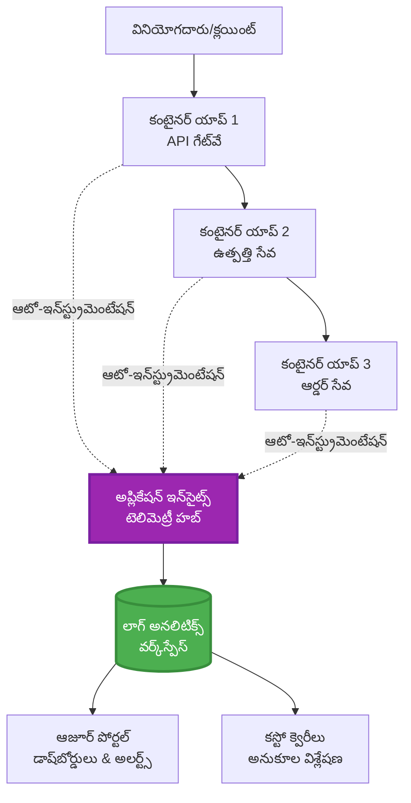
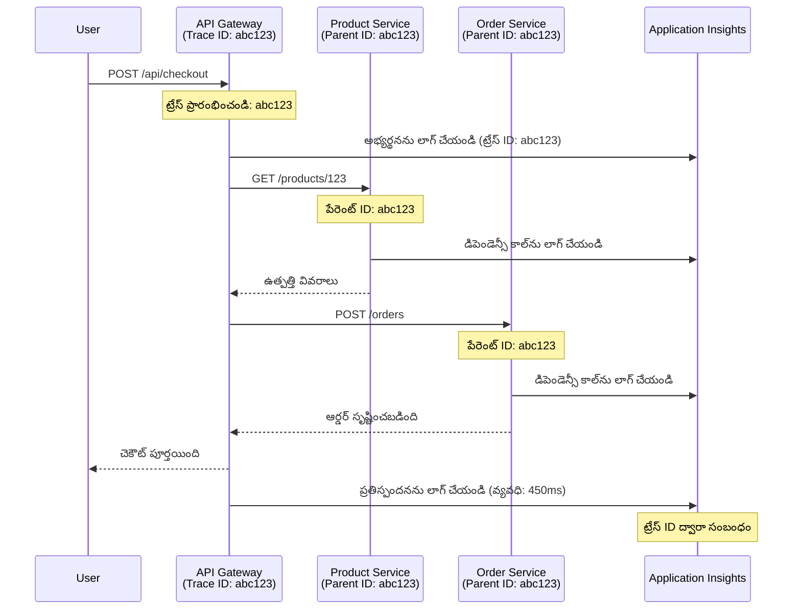

<!--
CO_OP_TRANSLATOR_METADATA:
{
  "original_hash": "e5aa37cdb6378c09099500ac31600b8c",
  "translation_date": "2025-11-25T08:02:50+00:00",
  "source_file": "docs/pre-deployment/application-insights.md",
  "language_code": "te"
}
-->
# AZD తో Application Insights ఇంటిగ్రేషన్

⏱️ **అంచనా సమయం**: 40-50 నిమిషాలు | 💰 **ఖర్చు ప్రభావం**: ~$5-15/నెల | ⭐ **సంక్లిష్టత**: మధ్యస్థం

**📚 నేర్చుకునే మార్గం:**
- ← గతం: [Preflight Checks](preflight-checks.md) - ప్రీ-డిప్లాయ్‌మెంట్ వెరిఫికేషన్
- 🎯 **మీరు ఇక్కడ ఉన్నారు**: Application Insights Integration (మానిటరింగ్, టెలిమెట్రీ, డీబగింగ్)
- → తదుపరి: [Deployment Guide](../deployment/deployment-guide.md) - Azureకి డిప్లాయ్ చేయడం
- 🏠 [కోర్సు హోమ్](../../README.md)

---

## మీరు నేర్చుకునేది

ఈ పాఠాన్ని పూర్తి చేయడం ద్వారా, మీరు:
- **Application Insights** ను AZD ప్రాజెక్టుల్లో ఆటోమేటిక్‌గా ఇంటిగ్రేట్ చేస్తారు
- మైక్రోసర్వీసుల కోసం **distributed tracing** ను కాన్ఫిగర్ చేస్తారు
- **custom telemetry** (మెట్రిక్స్, ఈవెంట్స్, డిపెండెన్సీలు) అమలు చేస్తారు
- **live metrics** ను రియల్-టైమ్ మానిటరింగ్ కోసం సెటప్ చేస్తారు
- AZD డిప్లాయ్‌మెంట్‌ల నుండి **alerts మరియు dashboards** సృష్టిస్తారు
- **telemetry queries** తో ప్రొడక్షన్ సమస్యలను డీబగ్ చేస్తారు
- **ఖర్చులు మరియు sampling** స్ట్రాటజీలను ఆప్టిమైజ్ చేస్తారు
- **AI/LLM అప్లికేషన్లను** (టోకెన్లు, లేటెన్సీ, ఖర్చులు) మానిటర్ చేస్తారు

## AZD తో Application Insights ఎందుకు ముఖ్యమైంది

### సమస్య: ప్రొడక్షన్ Observability

**Application Insights లేకుండా:**
```
❌ No visibility into production behavior
❌ Manual log aggregation across services
❌ Reactive debugging (wait for customer complaints)
❌ No performance metrics
❌ Cannot trace requests across services
❌ Unknown failure rates and bottlenecks
```

**Application Insights + AZD తో:**
```
✅ Automatic telemetry collection
✅ Centralized logs from all services
✅ Proactive issue detection
✅ End-to-end request tracing
✅ Performance metrics and insights
✅ Real-time dashboards
✅ AZD provisions everything automatically
```

**ఉదాహరణ**: Application Insights అనేది మీ అప్లికేషన్ కోసం "బ్లాక్ బాక్స్" ఫ్లైట్ రికార్డర్ + కాక్‌పిట్ డాష్‌బోర్డ్ లాంటిది. మీరు రియల్-టైమ్‌లో జరుగుతున్న ప్రతిదాన్ని చూడగలరు మరియు ఏదైనా ఇన్సిడెంట్‌ను రీప్లే చేయగలరు.

---

## ఆర్కిటెక్చర్ అవలోకనం

### AZD ఆర్కిటెక్చర్‌లో Application Insights


### ఆటోమేటిక్‌గా మానిటర్ చేయబడేది

| టెలిమెట్రీ రకం | ఇది ఏమి క్యాప్చర్ చేస్తుంది | ఉపయోగం |
|----------------|------------------|----------|
| **Requests** | HTTP రిక్వెస్టులు, స్టేటస్ కోడ్లు, డ్యూరేషన్ | API పనితీరు మానిటరింగ్ |
| **Dependencies** | బాహ్య కాల్స్ (DB, APIs, స్టోరేజ్) | బాటిల్‌నెక్స్ గుర్తించడం |
| **Exceptions** | స్టాక్ ట్రేస్‌లతో అనహ్యాండిల్ ఎర్రర్స్ | వైఫల్యాలను డీబగ్ చేయడం |
| **Custom Events** | బిజినెస్ ఈవెంట్స్ (సైన్-అప్, కొనుగోలు) | అనలిటిక్స్ మరియు ఫన్నెల్స్ |
| **Metrics** | పనితీరు కౌంటర్లు, కస్టమ్ మెట్రిక్స్ | కెపాసిటీ ప్లానింగ్ |
| **Traces** | Severityతో లాగ్ మెసేజ్‌లు | డీబగింగ్ మరియు ఆడిటింగ్ |
| **Availability** | అప్టైమ్ మరియు రెస్పాన్స్ టైమ్ టెస్టులు | SLA మానిటరింగ్ |

---

## అవసరమైనవి

### అవసరమైన టూల్స్

```bash
# Azure Developer CLIని ధృవీకరించండి
azd version
# ✅ ఆశించినది: azd వెర్షన్ 1.0.0 లేదా ఎక్కువ

# Azure CLIని ధృవీకరించండి
az --version
# ✅ ఆశించినది: azure-cli 2.50.0 లేదా ఎక్కువ
```

### Azure అవసరాలు

- యాక్టివ్ Azure సబ్‌స్క్రిప్షన్
- క్రియేట్ చేయడానికి అనుమతులు:
  - Application Insights రిసోర్సులు
  - Log Analytics వర్క్‌స్పేస్‌లు
  - Container Apps
  - Resource groups

### జ్ఞాన అవసరాలు

మీరు పూర్తి చేసి ఉండాలి:
- [AZD Basics](../getting-started/azd-basics.md) - AZD యొక్క ప్రాథమిక కాన్సెప్ట్‌లు
- [Configuration](../getting-started/configuration.md) - ఎన్విరాన్‌మెంట్ సెటప్
- [First Project](../getting-started/first-project.md) - ప్రాథమిక డిప్లాయ్‌మెంట్

---

## పాఠం 1: AZD తో ఆటోమేటిక్ Application Insights

### AZD Application Insights ను ఎలా ప్రొవిజన్ చేస్తుంది

AZD మీరు డిప్లాయ్ చేసినప్పుడు Application Insights ను ఆటోమేటిక్‌గా క్రియేట్ చేసి కాన్ఫిగర్ చేస్తుంది. ఇది ఎలా పనిచేస్తుందో చూద్దాం.

### ప్రాజెక్ట్ స్ట్రక్చర్

```
monitored-app/
├── azure.yaml                     # AZD configuration
├── infra/
│   ├── main.bicep                # Main infrastructure
│   ├── core/
│   │   └── monitoring.bicep      # Application Insights + Log Analytics
│   └── app/
│       └── api.bicep             # Container App with monitoring
└── src/
    ├── app.py                    # Application with telemetry
    ├── requirements.txt
    └── Dockerfile
```

---

### స్టెప్ 1: AZD ను కాన్ఫిగర్ చేయడం (azure.yaml)

**ఫైల్: `azure.yaml`**

```yaml
name: monitored-app
metadata:
  template: monitored-app@1.0.0

services:
  api:
    project: ./src
    language: python
    host: containerapp

# AZD automatically provisions monitoring!
```

**ఇది చాలు!** AZD డిఫాల్ట్‌గా Application Insights ను క్రియేట్ చేస్తుంది. ప్రాథమిక మానిటరింగ్ కోసం అదనపు కాన్ఫిగరేషన్ అవసరం లేదు.

---

### స్టెప్ 2: మానిటరింగ్ ఇన్‌ఫ్రాస్ట్రక్చర్ (Bicep)

**ఫైల్: `infra/core/monitoring.bicep`**

```bicep
param logAnalyticsName string
param applicationInsightsName string
param location string = resourceGroup().location
param tags object = {}

// Log Analytics Workspace (required for Application Insights)
resource logAnalytics 'Microsoft.OperationalInsights/workspaces@2022-10-01' = {
  name: logAnalyticsName
  location: location
  tags: tags
  properties: {
    sku: {
      name: 'PerGB2018'  // Pay-as-you-go pricing
    }
    retentionInDays: 30  // Keep logs for 30 days
    features: {
      enableLogAccessUsingOnlyResourcePermissions: true
    }
  }
}

// Application Insights
resource applicationInsights 'Microsoft.Insights/components@2020-02-02' = {
  name: applicationInsightsName
  location: location
  tags: tags
  kind: 'web'
  properties: {
    Application_Type: 'web'
    WorkspaceResourceId: logAnalytics.id
    IngestionMode: 'LogAnalytics'
    publicNetworkAccessForIngestion: 'Enabled'
    publicNetworkAccessForQuery: 'Enabled'
  }
}

// Outputs for Container Apps
output logAnalyticsWorkspaceId string = logAnalytics.id
output logAnalyticsWorkspaceName string = logAnalytics.name
output applicationInsightsConnectionString string = applicationInsights.properties.ConnectionString
output applicationInsightsInstrumentationKey string = applicationInsights.properties.InstrumentationKey
output applicationInsightsName string = applicationInsights.name
```

---

### స్టెప్ 3: Application Insights కు Container App ను కనెక్ట్ చేయడం

**ఫైల్: `infra/app/api.bicep`**

```bicep
param name string
param location string
param tags object = {}
param containerAppsEnvironmentName string
param applicationInsightsConnectionString string

resource containerApp 'Microsoft.App/containerApps@2023-05-01' = {
  name: name
  location: location
  tags: tags
  properties: {
    configuration: {
      ingress: {
        external: true
        targetPort: 8000
      }
      secrets: [
        {
          name: 'appinsights-connection-string'
          value: applicationInsightsConnectionString
        }
      ]
    }
    template: {
      containers: [
        {
          name: 'api'
          image: 'myregistry.azurecr.io/api:latest'
          resources: {
            cpu: json('0.5')
            memory: '1Gi'
          }
          env: [
            {
              name: 'APPLICATIONINSIGHTS_CONNECTION_STRING'
              secretRef: 'appinsights-connection-string'
            }
            {
              name: 'APPLICATIONINSIGHTS_ENABLED'
              value: 'true'
            }
          ]
        }
      ]
    }
  }
}

output uri string = 'https://${containerApp.properties.configuration.ingress.fqdn}'
```

---

### స్టెప్ 4: టెలిమెట్రీతో Application కోడ్

**ఫైల్: `src/app.py`**

```python
from flask import Flask, request, jsonify
from opencensus.ext.azure.log_exporter import AzureLogHandler
from opencensus.ext.azure.trace_exporter import AzureExporter
from opencensus.ext.flask.flask_middleware import FlaskMiddleware
from opencensus.trace.samplers import ProbabilitySampler
import logging
import os

app = Flask(__name__)

# అప్లికేషన్ ఇన్‌సైట్స్ కనెక్షన్ స్ట్రింగ్ పొందండి
connection_string = os.environ.get('APPLICATIONINSIGHTS_CONNECTION_STRING')

if connection_string:
    # పంపిణీ ట్రేసింగ్‌ను ఆకృతీకరించండి
    middleware = FlaskMiddleware(
        app,
        exporter=AzureExporter(connection_string=connection_string),
        sampler=ProbabilitySampler(rate=1.0)  # డెవ్ కోసం 100% శాంప్లింగ్
    )
    
    # లాగింగ్‌ను ఆకృతీకరించండి
    logger = logging.getLogger(__name__)
    logger.addHandler(AzureLogHandler(connection_string=connection_string))
    logger.setLevel(logging.INFO)
    
    print("✅ Application Insights enabled")
else:
    logger = logging.getLogger(__name__)
    logger.setLevel(logging.INFO)
    print("⚠️ Application Insights not configured")

@app.route('/health')
def health():
    logger.info('Health check endpoint called')
    return jsonify({'status': 'healthy', 'monitoring': 'enabled'})

@app.route('/api/products')
def get_products():
    logger.info('Fetching products')
    
    # డేటాబేస్ కాల్‌ను అనుకరించండి (ఆటోమేటిక్‌గా డిపెండెన్సీగా ట్రాక్ చేయబడుతుంది)
    products = [
        {'id': 1, 'name': 'Laptop', 'price': 999.99},
        {'id': 2, 'name': 'Mouse', 'price': 29.99},
        {'id': 3, 'name': 'Keyboard', 'price': 79.99}
    ]
    
    logger.info(f'Returned {len(products)} products')
    return jsonify(products)

@app.route('/api/error-test')
def error_test():
    """Test error tracking"""
    logger.error('Testing error tracking')
    try:
        raise ValueError('This is a test exception')
    except Exception as e:
        logger.exception('Exception occurred in error-test endpoint')
        return jsonify({'error': str(e)}), 500

@app.route('/api/slow')
def slow_endpoint():
    """Test performance tracking"""
    import time
    logger.info('Slow endpoint called')
    time.sleep(3)  # నెమ్మదిగా ఆపరేషన్‌ను అనుకరించండి
    logger.warning('Endpoint took 3 seconds to respond')
    return jsonify({'message': 'Slow operation completed'})

if __name__ == '__main__':
    app.run(host='0.0.0.0', port=8000)
```

**ఫైల్: `src/requirements.txt`**

```txt
Flask==3.0.0
opencensus-ext-azure==1.1.13
opencensus-ext-flask==0.8.1
gunicorn==21.2.0
```

---

### స్టెప్ 5: డిప్లాయ్ చేసి వెరిఫై చేయడం

```bash
# AZD ప్రారంభించండి
azd init

# మోహరించండి (ఆప్లికేషన్ ఇన్‌సైట్స్‌ను స్వయంచాలకంగా అందిస్తుంది)
azd up

# యాప్ URL పొందండి
APP_URL=$(azd env get-values | grep API_URL | cut -d '=' -f2 | tr -d '"')

# టెలిమెట్రీ రూపొందించండి
curl $APP_URL/health
curl $APP_URL/api/products
curl $APP_URL/api/error-test
curl $APP_URL/api/slow
```

**✅ అంచనా అవుట్‌పుట్:**
```json
{
  "status": "healthy",
  "monitoring": "enabled"
}
```

---

### స్టెప్ 6: Azure Portalలో టెలిమెట్రీ చూడడం

```bash
# అప్లికేషన్ ఇన్‌సైట్స్ వివరాలను పొందండి
azd env get-values | grep APPLICATIONINSIGHTS

# ఆజూర్ పోర్టల్‌లో తెరవండి
az monitor app-insights component show \
  --app $(azd env get-values | grep APPLICATIONINSIGHTS_NAME | cut -d '=' -f2 | tr -d '"') \
  --resource-group $(azd env get-values | grep AZURE_RESOURCE_GROUP | cut -d '=' -f2 | tr -d '"') \
  --query "appId" -o tsv
```

**Azure Portal → Application Insights → Transaction Search కు వెళ్లండి**

మీరు చూడగలరు:
- ✅ HTTP రిక్వెస్టులు స్టేటస్ కోడ్లతో
- ✅ రిక్వెస్ట్ డ్యూరేషన్ (`/api/slow` కోసం 3+ సెకన్లు)
- ✅ `/api/error-test` నుండి ఎక్సెప్షన్ వివరాలు
- ✅ కస్టమ్ లాగ్ మెసేజ్‌లు

---

## పాఠం 2: కస్టమ్ టెలిమెట్రీ మరియు ఈవెంట్స్

### బిజినెస్ ఈవెంట్స్ ట్రాక్ చేయడం

బిజినెస్-క్రిటికల్ ఈవెంట్స్ కోసం కస్టమ్ టెలిమెట్రీని జోడిద్దాం.

**ఫైల్: `src/telemetry.py`**

```python
from opencensus.ext.azure import metrics_exporter
from opencensus.stats import aggregation as aggregation_module
from opencensus.stats import measure as measure_module
from opencensus.stats import stats as stats_module
from opencensus.stats import view as view_module
from opencensus.tags import tag_map as tag_map_module
from opencensus.ext.azure.log_exporter import AzureLogHandler
from opencensus.ext.azure.trace_exporter import AzureExporter
from opencensus.trace import tracer as tracer_module
import logging
import os

class TelemetryClient:
    """Custom telemetry client for Application Insights"""
    
    def __init__(self, connection_string=None):
        self.connection_string = connection_string or os.environ.get('APPLICATIONINSIGHTS_CONNECTION_STRING')
        
        if not self.connection_string:
            print("⚠️ Application Insights connection string not found")
            return
        
        # లాగర్ సెటప్ చేయండి
        self.logger = logging.getLogger(__name__)
        self.logger.addHandler(AzureLogHandler(connection_string=self.connection_string))
        self.logger.setLevel(logging.INFO)
        
        # మెట్రిక్స్ ఎగుమతిదారుని సెటప్ చేయండి
        self.stats = stats_module.stats
        self.view_manager = self.stats.view_manager
        self.stats_recorder = self.stats.stats_recorder
        
        exporter = metrics_exporter.new_metrics_exporter(
            connection_string=self.connection_string
        )
        self.view_manager.register_exporter(exporter)
        
        # ట్రేసర్ సెటప్ చేయండి
        self.tracer = tracer_module.Tracer(
            exporter=AzureExporter(connection_string=self.connection_string)
        )
        
        print("✅ Custom telemetry client initialized")
    
    def track_event(self, event_name: str, properties: dict = None):
        """Track custom business event"""
        properties = properties or {}
        self.logger.info(
            f"CustomEvent: {event_name}",
            extra={
                'custom_dimensions': {
                    'event_name': event_name,
                    **properties
                }
            }
        )
    
    def track_metric(self, metric_name: str, value: float, properties: dict = None):
        """Track custom metric"""
        properties = properties or {}
        self.logger.info(
            f"CustomMetric: {metric_name} = {value}",
            extra={
                'custom_dimensions': {
                    'metric_name': metric_name,
                    'value': value,
                    **properties
                }
            }
        )
    
    def track_dependency(self, name: str, dependency_type: str, duration: float, success: bool):
        """Track external dependency call"""
        with self.tracer.span(name=name) as span:
            span.add_attribute('dependency.type', dependency_type)
            span.add_attribute('duration', duration)
            span.add_attribute('success', success)

# గ్లోబల్ టెలిమెట్రీ క్లయింట్
telemetry = TelemetryClient()
```

### కస్టమ్ ఈవెంట్స్‌తో అప్లికేషన్‌ను అప్‌డేట్ చేయడం

**ఫైల్: `src/app.py` (ఎన్‌హాన్స్ చేయబడింది)**

```python
from flask import Flask, request, jsonify
from telemetry import telemetry
import time
import random

app = Flask(__name__)

@app.route('/api/purchase', methods=['POST'])
def purchase():
    """Track purchase event with custom telemetry"""
    data = request.json
    product_id = data.get('product_id')
    quantity = data.get('quantity', 1)
    price = data.get('price', 0)
    
    # వ్యాపార ఈవెంట్‌ను ట్రాక్ చేయండి
    telemetry.track_event('Purchase', {
        'product_id': product_id,
        'quantity': quantity,
        'total_amount': price * quantity,
        'user_id': request.headers.get('X-User-Id', 'anonymous')
    })
    
    # ఆదాయ మెట్రిక్‌ను ట్రాక్ చేయండి
    telemetry.track_metric('Revenue', price * quantity, {
        'product_id': product_id,
        'currency': 'USD'
    })
    
    return jsonify({
        'order_id': f'ORD-{random.randint(1000, 9999)}',
        'status': 'confirmed',
        'total': price * quantity
    })

@app.route('/api/search')
def search():
    """Track search queries"""
    query = request.args.get('q', '')
    
    start_time = time.time()
    
    # శోధనను అనుకరించండి (ఇది నిజమైన డేటాబేస్ ప్రశ్నగా ఉంటుంది)
    results = [{'id': 1, 'name': f'Result for {query}'}]
    
    duration = (time.time() - start_time) * 1000  # మిల్లీసెకన్లకు మార్చండి
    
    # శోధన ఈవెంట్‌ను ట్రాక్ చేయండి
    telemetry.track_event('Search', {
        'query': query,
        'results_count': len(results),
        'duration_ms': duration
    })
    
    # శోధన పనితీరు మెట్రిక్‌ను ట్రాక్ చేయండి
    telemetry.track_metric('SearchDuration', duration, {
        'query_length': len(query)
    })
    
    return jsonify({'results': results, 'count': len(results)})

@app.route('/api/external-call')
def external_call():
    """Track external API dependency"""
    import requests
    
    start_time = time.time()
    success = True
    
    try:
        # బాహ్య API కాల్‌ను అనుకరించండి
        response = requests.get('https://api.example.com/data', timeout=5)
        result = response.json()
    except Exception as e:
        success = False
        result = {'error': str(e)}
    
    duration = (time.time() - start_time) * 1000
    
    # ఆధారాన్ని ట్రాక్ చేయండి
    telemetry.track_dependency(
        name='ExternalAPI',
        dependency_type='HTTP',
        duration=duration,
        success=success
    )
    
    return jsonify(result)

if __name__ == '__main__':
    app.run(host='0.0.0.0', port=8000)
```

### కస్టమ్ టెలిమెట్రీని పరీక్షించడం

```bash
# కొనుగోలు ఈవెంట్‌ను ట్రాక్ చేయండి
curl -X POST $APP_URL/api/purchase \
  -H "Content-Type: application/json" \
  -H "X-User-Id: user123" \
  -d '{"product_id": 1, "quantity": 2, "price": 29.99}'

# శోధన ఈవెంట్‌ను ట్రాక్ చేయండి
curl "$APP_URL/api/search?q=laptop"

# బాహ్య ఆధారాన్ని ట్రాక్ చేయండి
curl $APP_URL/api/external-call
```

**Azure Portalలో చూడండి:**

Application Insights → Logs కు వెళ్లి, ఈ క్వెరీని రన్ చేయండి:

```kusto
// View purchase events
traces
| where customDimensions.event_name == "Purchase"
| project 
    timestamp,
    product_id = tostring(customDimensions.product_id),
    total_amount = todouble(customDimensions.total_amount),
    user_id = tostring(customDimensions.user_id)
| order by timestamp desc

// View revenue metrics
traces
| where customDimensions.metric_name == "Revenue"
| summarize TotalRevenue = sum(todouble(customDimensions.value)) by bin(timestamp, 1h)
| render timechart

// View search performance
traces
| where customDimensions.event_name == "Search"
| summarize 
    AvgDuration = avg(todouble(customDimensions.duration_ms)),
    SearchCount = count()
  by bin(timestamp, 5m)
| render timechart
```

---

## పాఠం 3: మైక్రోసర్వీసుల కోసం Distributed Tracing

### క్రాస్-సర్వీస్ ట్రేసింగ్ ఎనేబుల్ చేయడం

మైక్రోసర్వీసుల కోసం, Application Insights ఆటోమేటిక్‌గా సర్వీసుల మధ్య రిక్వెస్టులను కలిపి చూపిస్తుంది.

**ఫైల్: `infra/main.bicep`**

```bicep
targetScope = 'subscription'

param environmentName string
param location string = 'eastus'

var tags = { 'azd-env-name': environmentName }

resource rg 'Microsoft.Resources/resourceGroups@2021-04-01' = {
  name: 'rg-${environmentName}'
  location: location
  tags: tags
}

// Monitoring (shared by all services)
module monitoring './core/monitoring.bicep' = {
  name: 'monitoring'
  scope: rg
  params: {
    logAnalyticsName: 'log-${environmentName}'
    applicationInsightsName: 'appi-${environmentName}'
    location: location
    tags: tags
  }
}

// API Gateway
module apiGateway './app/api-gateway.bicep' = {
  name: 'api-gateway'
  scope: rg
  params: {
    name: 'ca-gateway-${environmentName}'
    location: location
    tags: union(tags, { 'azd-service-name': 'gateway' })
    applicationInsightsConnectionString: monitoring.outputs.applicationInsightsConnectionString
  }
}

// Product Service
module productService './app/product-service.bicep' = {
  name: 'product-service'
  scope: rg
  params: {
    name: 'ca-products-${environmentName}'
    location: location
    tags: union(tags, { 'azd-service-name': 'products' })
    applicationInsightsConnectionString: monitoring.outputs.applicationInsightsConnectionString
  }
}

// Order Service
module orderService './app/order-service.bicep' = {
  name: 'order-service'
  scope: rg
  params: {
    name: 'ca-orders-${environmentName}'
    location: location
    tags: union(tags, { 'azd-service-name': 'orders' })
    applicationInsightsConnectionString: monitoring.outputs.applicationInsightsConnectionString
  }
}

output APPLICATIONINSIGHTS_CONNECTION_STRING string = monitoring.outputs.applicationInsightsConnectionString
output GATEWAY_URL string = apiGateway.outputs.uri
```

### ఎండ్-టు-ఎండ్ ట్రాన్సాక్షన్ చూడడం


**ఎండ్-టు-ఎండ్ ట్రేస్ క్వెరీ:**

```kusto
// Find complete request flow
let traceId = "abc123...";  // Get from response header
dependencies
| union requests
| where operation_Id == traceId
| project 
    timestamp,
    type = itemType,
    name,
    duration,
    success,
    cloud_RoleName
| order by timestamp asc
```

---

## పాఠం 4: లైవ్ మెట్రిక్స్ మరియు రియల్-టైమ్ మానిటరింగ్

### లైవ్ మెట్రిక్స్ స్ట్రీమ్ ఎనేబుల్ చేయడం

లైవ్ మెట్రిక్స్ <1 సెకన్ల లేటెన్సీతో రియల్-టైమ్ టెలిమెట్రీని అందిస్తుంది.

**లైవ్ మెట్రిక్స్ యాక్సెస్ చేయండి:**

```bash
# అప్లికేషన్ ఇన్‌సైట్స్ వనరును పొందండి
APPI_NAME=$(azd env get-values | grep APPLICATIONINSIGHTS_NAME | cut -d '=' -f2 | tr -d '"')

# వనరుల సమూహాన్ని పొందండి
RG_NAME=$(azd env get-values | grep AZURE_RESOURCE_GROUP | cut -d '=' -f2 | tr -d '"')

echo "Navigate to: Azure Portal → Resource Groups → $RG_NAME → $APPI_NAME → Live Metrics"
```

**మీరు రియల్-టైమ్‌లో చూడగలిగేది:**
- ✅ ఇన్‌కమింగ్ రిక్వెస్ట్ రేట్ (requests/sec)
- ✅ అవుట్‌గోయింగ్ డిపెండెన్సీ కాల్స్
- ✅ ఎక్సెప్షన్ కౌంట్
- ✅ CPU మరియు మెమరీ వినియోగం
- ✅ యాక్టివ్ సర్వర్ కౌంట్
- ✅ సాంపిల్ టెలిమెట్రీ

### టెస్టింగ్ కోసం లోడ్ జనరేట్ చేయడం

```bash
# లైవ్ మెట్రిక్స్ చూడటానికి లోడ్ ఉత్పత్తి చేయండి
for i in {1..100}; do
  curl $APP_URL/api/products &
  curl $APP_URL/api/search?q=test$i &
done

# Azure పోర్టల్‌లో లైవ్ మెట్రిక్స్ చూడండి
# మీరు అభ్యర్థన రేటు పెరుగుదల చూడాలి
```

---

## ప్రాక్టికల్ ఎక్సర్సైజ్‌లు

### ఎక్సర్సైజ్ 1: అలర్ట్స్ సెటప్ చేయడం ⭐⭐ (మధ్యస్థం)

**లక్ష్యం**: అధిక ఎర్రర్ రేట్లు మరియు నెమ్మదిగా స్పందనల కోసం అలర్ట్స్ క్రియేట్ చేయండి.

**స్టెప్స్:**

1. **ఎర్రర్ రేట్ కోసం అలర్ట్ క్రియేట్ చేయండి:**

```bash
# అప్లికేషన్ ఇన్‌సైట్స్ వనరుల ID పొందండి
APPI_ID=$(az monitor app-insights component show \
  --app $APPI_NAME \
  --resource-group $RG_NAME \
  --query "id" -o tsv)

# విఫలమైన అభ్యర్థనల కోసం మెట్రిక్ అలర్ట్ సృష్టించండి
az monitor metrics alert create \
  --name "High-Error-Rate" \
  --resource-group $RG_NAME \
  --scopes $APPI_ID \
  --condition "count requests/failed > 10" \
  --window-size 5m \
  --evaluation-frequency 1m \
  --description "Alert when error rate exceeds 10 per 5 minutes"
```

2. **నెమ్మదిగా స్పందనల కోసం అలర్ట్ క్రియేట్ చేయండి:**

```bash
az monitor metrics alert create \
  --name "Slow-Responses" \
  --resource-group $RG_NAME \
  --scopes $APPI_ID \
  --condition "avg requests/duration > 3000" \
  --window-size 5m \
  --evaluation-frequency 1m \
  --description "Alert when average response time exceeds 3 seconds"
```

3. **Bicep ద్వారా అలర్ట్ క్రియేట్ చేయండి (AZD కోసం ప్రిఫర్డ్):**

**ఫైల్: `infra/core/alerts.bicep`**

```bicep
param applicationInsightsId string
param actionGroupId string = ''
param location string = resourceGroup().location

// High error rate alert
resource errorRateAlert 'Microsoft.Insights/metricAlerts@2018-03-01' = {
  name: 'high-error-rate'
  location: 'global'
  properties: {
    description: 'Alert when error rate exceeds threshold'
    severity: 2
    enabled: true
    scopes: [
      applicationInsightsId
    ]
    evaluationFrequency: 'PT1M'
    windowSize: 'PT5M'
    criteria: {
      'odata.type': 'Microsoft.Azure.Monitor.SingleResourceMultipleMetricCriteria'
      allOf: [
        {
          name: 'Error rate'
          metricName: 'requests/failed'
          operator: 'GreaterThan'
          threshold: 10
          timeAggregation: 'Count'
        }
      ]
    }
    actions: actionGroupId != '' ? [
      {
        actionGroupId: actionGroupId
      }
    ] : []
  }
}

// Slow response alert
resource slowResponseAlert 'Microsoft.Insights/metricAlerts@2018-03-01' = {
  name: 'slow-responses'
  location: 'global'
  properties: {
    description: 'Alert when response time is too high'
    severity: 3
    enabled: true
    scopes: [
      applicationInsightsId
    ]
    evaluationFrequency: 'PT1M'
    windowSize: 'PT5M'
    criteria: {
      'odata.type': 'Microsoft.Azure.Monitor.SingleResourceMultipleMetricCriteria'
      allOf: [
        {
          name: 'Response duration'
          metricName: 'requests/duration'
          operator: 'GreaterThan'
          threshold: 3000
          timeAggregation: 'Average'
        }
      ]
    }
  }
}

output errorAlertId string = errorRateAlert.id
output slowResponseAlertId string = slowResponseAlert.id
```

4. **అలర్ట్స్ టెస్ట్ చేయండి:**

```bash
# లోపాలను సృష్టించండి
for i in {1..20}; do
  curl $APP_URL/api/error-test
done

# నెమ్మదిగా ప్రతిస్పందనలు సృష్టించండి
for i in {1..10}; do
  curl $APP_URL/api/slow
done

# అలర్ట్ స్థితిని తనిఖీ చేయండి (5-10 నిమిషాలు వేచి ఉండండి)
az monitor metrics alert list \
  --resource-group $RG_NAME \
  --query "[].{Name:name, Enabled:enabled, State:properties.enabled}" \
  --output table
```

**✅ విజయ ప్రమాణాలు:**
- ✅ అలర్ట్స్ విజయవంతంగా క్రియేట్ చేయబడ్డాయి
- ✅ థ్రెషోల్డ్‌లు అధిగమించినప్పుడు అలర్ట్స్ ఫైర్ అవుతాయి
- ✅ Azure Portalలో అలర్ట్ హిస్టరీ చూడగలరు
- ✅ AZD డిప్లాయ్‌మెంట్‌తో ఇంటిగ్రేట్ చేయబడింది

**సమయం**: 20-25 నిమిషాలు

---

### ఎక్సర్సైజ్ 2: కస్టమ్ డాష్‌బోర్డ్ క్రియేట్ చేయడం ⭐⭐ (మధ్యస్థం)

**లక్ష్యం**: ముఖ్యమైన అప్లికేషన్ మెట్రిక్స్ చూపించే డాష్‌బోర్డ్‌ను నిర్మించండి.

**స్టెప్స్:**

1. **Azure Portal ద్వారా డాష్‌బోర్డ్ క్రియేట్ చేయండి:**

Azure Portal → Dashboards → New Dashboard కు వెళ్లండి

2. **కీ మెట్రిక్స్ కోసం టైల్స్ జోడించండి:**

- రిక్వెస్ట్ కౌంట్ (గత 24 గంటలు)
- సగటు స్పందన సమయం
- ఎర్రర్ రేట్
- టాప్ 5 నెమ్మదిగా పనిచేసే ఆపరేషన్లు
- యూజర్ల భౌగోళిక పంపిణీ

3. **Bicep ద్వారా డాష్‌బోర్డ్ క్రియేట్ చేయండి:**

**ఫైల్: `infra/core/dashboard.bicep`**

```bicep
param dashboardName string
param applicationInsightsId string
param location string = resourceGroup().location

resource dashboard 'Microsoft.Portal/dashboards@2020-09-01-preview' = {
  name: dashboardName
  location: location
  properties: {
    lenses: [
      {
        order: 0
        parts: [
          // Request count
          {
            position: { x: 0, y: 0, rowSpan: 4, colSpan: 6 }
            metadata: {
              type: 'Extension/Microsoft_OperationsManagementSuite_Workspace/PartType/LogsDashboardPart'
              inputs: [
                {
                  name: 'resourceId'
                  value: applicationInsightsId
                }
                {
                  name: 'query'
                  value: '''
                    requests
                    | summarize RequestCount = count() by bin(timestamp, 1h)
                    | render timechart
                  '''
                }
              ]
            }
          }
          // Error rate
          {
            position: { x: 6, y: 0, rowSpan: 4, colSpan: 6 }
            metadata: {
              type: 'Extension/Microsoft_OperationsManagementSuite_Workspace/PartType/LogsDashboardPart'
              inputs: [
                {
                  name: 'resourceId'
                  value: applicationInsightsId
                }
                {
                  name: 'query'
                  value: '''
                    requests
                    | summarize 
                        Total = count(),
                        Failed = countif(success == false)
                    | extend ErrorRate = (Failed * 100.0) / Total
                    | project ErrorRate
                  '''
                }
              ]
            }
          }
        ]
      }
    ]
  }
}

output dashboardId string = dashboard.id
```

4. **డాష్‌బోర్డ్‌ను డిప్లాయ్ చేయండి:**

```bash
# ప్రధాన.bicep కు జోడించండి
module dashboard './core/dashboard.bicep' = {
  name: 'dashboard'
  scope: rg
  params: {
    dashboardName: 'dashboard-${environmentName}'
    applicationInsightsId: monitoring.outputs.applicationInsightsId
    location: location
  }
}

# మోహరించండి
azd up
```

**✅ విజయ ప్రమాణాలు:**
- ✅ డాష్‌బోర్డ్ ముఖ్యమైన మెట్రిక్స్‌ను చూపిస్తుంది
- ✅ Azure Portal హోమ్‌కు పిన్ చేయగలరు
- ✅ రియల్-టైమ్‌లో అప్‌డేట్ అవుతుంది
- ✅ AZD ద్వారా డిప్లాయ్ చేయగలరు

**సమయం**: 25-30 నిమిషాలు

---

### ఎక్సర్సైజ్ 3: AI/LLM అప్లికేషన్‌ను మానిటర్ చేయడం ⭐⭐⭐ (అడ్వాన్స్‌డ్)

**లక్ష్యం**: Azure OpenAI వినియోగాన్ని (టోకెన్లు, ఖర్చులు, లేటెన్సీ) ట్రాక్ చేయండి.

**స్టెప్స్:**

1. **AI మానిటరింగ్ రాపర్ క్రియేట్ చేయండి:**

**ఫైల్: `src/ai_telemetry.py`**

```python
from telemetry import telemetry
from openai import AzureOpenAI
import time

class MonitoredAzureOpenAI:
    """Azure OpenAI client with automatic telemetry"""
    
    def __init__(self, api_key, endpoint, api_version="2024-02-01"):
        self.client = AzureOpenAI(
            api_key=api_key,
            api_version=api_version,
            azure_endpoint=endpoint
        )
    
    def chat_completion(self, model: str, messages: list, **kwargs):
        """Track chat completion with telemetry"""
        start_time = time.time()
        
        try:
            # ఆజూర్ ఓపెన్ AI ను కాల్ చేయండి
            response = self.client.chat.completions.create(
                model=model,
                messages=messages,
                **kwargs
            )
            
            duration = (time.time() - start_time) * 1000  # మి.సె.
            
            # వినియోగాన్ని వెలికితీయండి
            usage = response.usage
            prompt_tokens = usage.prompt_tokens
            completion_tokens = usage.completion_tokens
            total_tokens = usage.total_tokens
            
            # ఖర్చును లెక్కించండి (GPT-4 ధరలు)
            prompt_cost = (prompt_tokens / 1000) * 0.03  # 1K టోకెన్లకు $0.03
            completion_cost = (completion_tokens / 1000) * 0.06  # 1K టోకెన్లకు $0.06
            total_cost = prompt_cost + completion_cost
            
            # కస్టమ్ ఈవెంట్‌ను ట్రాక్ చేయండి
            telemetry.track_event('OpenAI_Request', {
                'model': model,
                'prompt_tokens': prompt_tokens,
                'completion_tokens': completion_tokens,
                'total_tokens': total_tokens,
                'duration_ms': duration,
                'cost_usd': total_cost,
                'success': True
            })
            
            # మెట్రిక్స్‌ను ట్రాక్ చేయండి
            telemetry.track_metric('OpenAI_Tokens', total_tokens, {
                'model': model,
                'type': 'total'
            })
            
            telemetry.track_metric('OpenAI_Cost', total_cost, {
                'model': model,
                'currency': 'USD'
            })
            
            telemetry.track_metric('OpenAI_Duration', duration, {
                'model': model
            })
            
            return response
            
        except Exception as e:
            duration = (time.time() - start_time) * 1000
            
            telemetry.track_event('OpenAI_Request', {
                'model': model,
                'duration_ms': duration,
                'success': False,
                'error': str(e)
            })
            
            raise
```

2. **మానిటర్ చేసిన క్లయింట్‌ను ఉపయోగించండి:**

```python
from flask import Flask, request, jsonify
from ai_telemetry import MonitoredAzureOpenAI
import os

app = Flask(__name__)

# మానిటర్ చేయబడిన OpenAI క్లయింట్‌ను ప్రారంభించండి
openai_client = MonitoredAzureOpenAI(
    api_key=os.environ['AZURE_OPENAI_API_KEY'],
    endpoint=os.environ['AZURE_OPENAI_ENDPOINT']
)

@app.route('/api/chat', methods=['POST'])
def chat():
    data = request.json
    user_message = data.get('message')
    
    # ఆటోమేటిక్ మానిటరింగ్‌తో కాల్ చేయండి
    response = openai_client.chat_completion(
        model='gpt-4',
        messages=[
            {'role': 'user', 'content': user_message}
        ]
    )
    
    return jsonify({
        'response': response.choices[0].message.content,
        'tokens': response.usage.total_tokens
    })
```

3. **AI మెట్రిక్స్‌ను క్వెరీ చేయండి:**

```kusto
// Total AI spend over time
traces
| where customDimensions.event_name == "OpenAI_Request"
| where customDimensions.success == "True"
| summarize TotalCost = sum(todouble(customDimensions.cost_usd)) by bin(timestamp, 1h)
| render timechart

// Token usage by model
traces
| where customDimensions.event_name == "OpenAI_Request"
| summarize 
    TotalTokens = sum(toint(customDimensions.total_tokens)),
    RequestCount = count()
  by Model = tostring(customDimensions.model)

// Average latency
traces
| where customDimensions.event_name == "OpenAI_Request"
| summarize AvgDuration = avg(todouble(customDimensions.duration_ms))
| project AvgDurationSeconds = AvgDuration / 1000

// Cost per request
traces
| where customDimensions.event_name == "OpenAI_Request"
| extend Cost = todouble(customDimensions.cost_usd)
| summarize 
    TotalCost = sum(Cost),
    RequestCount = count(),
    AvgCostPerRequest = avg(Cost)
```

**✅ విజయ ప్రమాణాలు:**
- ✅ ప్రతి OpenAI కాల్ ఆటోమేటిక్‌గా ట్రాక్ చేయబడుతుంది
- ✅ టోకెన్ వినియోగం మరియు ఖర్చులు కనిపిస్తాయి
- ✅ లేటెన్సీ మానిటర్ చేయబడుతుంది
- ✅ బడ్జెట్ అలర్ట్స్ సెటప్ చేయగలరు

**సమయం**: 35-45 నిమిషాలు

---

## ఖర్చు ఆప్టిమైజేషన్

### Sampling స్ట్రాటజీలు

టెలిమెట్రీ ఖర్చులను Sampling ద్వారా నియంత్రించండి:

```python
from opencensus.trace.samplers import ProbabilitySampler

# అభివృద్ధి: 100% శాంప్లింగ్
sampler = ProbabilitySampler(rate=1.0)

# ఉత్పత్తి: 10% శాంప్లింగ్ (ఖర్చులను 90% తగ్గించండి)
sampler = ProbabilitySampler(rate=0.1)

# అనుకూల శాంప్లింగ్ (స్వయంచాలకంగా సర్దుబాటు చేస్తుంది)
from opencensus.trace.samplers import AdaptiveSampler
sampler = AdaptiveSampler()
```

**Bicepలో:**

```bicep
resource applicationInsights 'Microsoft.Insights/components@2020-02-02' = {
  name: applicationInsightsName
  properties: {
    SamplingPercentage: 10  // 10% sampling
  }
}
```

### డేటా రిటెన్షన్

```bicep
resource logAnalytics 'Microsoft.OperationalInsights/workspaces@2022-10-01' = {
  name: logAnalyticsName
  properties: {
    retentionInDays: 30  // Minimum (cheapest)
    // Options: 30, 31, 60, 90, 120, 180, 270, 365, 550, 730
  }
}
```

### నెలవారీ ఖర్చు అంచనాలు

| డేటా వాల్యూమ్ | రిటెన్షన్ | నెలవారీ ఖర్చు |
|-------------|-----------|--------------|
| 1 GB/నెల | 30 రోజులు | ~$2-5 |
| 5 GB/నెల | 30 రోజులు | ~$10-15 |
| 10 GB/నెల | 90 రోజులు | ~$25-40 |
| 50 GB/నెల | 90 రోజులు | ~$100-150 |

**ఉచిత టియర్**: 5 GB/నెల చేర్చబడింది

---

## జ్ఞాన చెక్‌పాయింట్

### 1. ప్రాథమిక ఇంటిగ్రేషన్ ✓

మీ అవగాహనను పరీక్షించండి:

- [ ] **Q1**: AZD Application Insights ను ఎలా ప్రొవిజన్ చేస్తుంది?
  - **A**: `infra/core/monitoring.bicep` లోని Bicep టెంప్లేట్‌ల ద్వారా ఆటోమేటిక్‌గా

- [ ] **Q2**: Application Insights ను ఎనేబుల్ చేసే ఎన్విరాన్‌మెంట్ వేరియబుల్ ఏమిటి?
  - **A**: `APPLICATIONINSIGHTS_CONNECTION_STRING`

- [ ] **Q3**: మూడు ప్రధాన టెలిమెట్రీ రకాలు ఏమిటి?
  - **A**: Requests (HTTP కాల్స్), Dependencies (బాహ్య కాల్స్), Exceptions (ఎర్రర్స్)

**హ్యాండ్స్-ఆన్ వెరిఫికేషన్:**
```bash
# అప్లికేషన్ ఇన్‌సైట్స్ కాన్ఫిగర్ చేయబడిందా అని తనిఖీ చేయండి
azd env get-values | grep APPLICATIONINSIGHTS

# టెలిమెట్రీ ప్రవహిస్తున్నదా అని ధృవీకరించండి
az monitor app-insights metrics show \
  --app $APPI_NAME \
  --resource-group $RG_NAME \
  --metric "requests/count"
```

---

### 2. కస్టమ్ టెలిమెట్రీ ✓

మీ అవగాహనను పరీక్షించండి:

- [ ] **Q1**: కస్టమ్ బిజినెస్ ఈవెంట్స్‌ను ఎలా ట్రాక్ చేస్తారు?
  - **A**: `custom_dimensions` తో logger లేదా `TelemetryClient.track_event()` ఉపయోగించండి

- [ ] **Q2**: ఈవెంట్స్ మరియు మెట్రిక్స్ మధ్య తేడా ఏమిటి?
  - **A**: ఈవెంట్స్ ప్రత్యేక సంఘటనలు, మెట్రిక్స్ సంఖ్యాత్మక కొలతలు

- [ ] **Q3**: సర్వీసుల మధ్య టెలిమెట్రీని ఎలా కలిపి చూపిస్తారు?
  - **A**: Application Insights ఆటోమేటిక్‌గా `operation_Id` ఉపయోగిస్తుంది

**హ్యాండ్స్-ఆన్ వెరిఫికేషన్:**
```kusto
// Verify custom events
traces
| where customDimensions.event_name != ""
| summarize count() by tostring(customDimensions.event_name)
```

---

### 3. ప్రొడక్షన్ మానిటరింగ్ ✓

మీ అవగాహనను పరీక్షించండి:

- [ ] **Q1**: Sampling అంటే ఏమిటి మరియు ఎందుకు ఉపయోగిస్తారు?
  - **A**: Sampling టెలిమెట్రీలో శాతం మాత్రమే క్యాప్చర్ చేయడం ద్వారా డేటా వాల్యూమ్ (మరియు ఖర్చు) తగ్గిస్తుంది

- [ ] **Q2**: అలర్ట్స్‌ను ఎలా సెటప్ చేస్తారు?
  - **A**: Application Insights మెట్రిక్స్ ఆధారంగా Bicep లేదా Azure Portalలో మెట్రిక్ అలర్ట్స్ ఉపయోగించండి

- [ ] **Q3**: Log Analytics మరియు Application Insights మధ్య తేడా ఏమిటి?
  - **A**: Application Insights డేటాను Log Analytics వర్క్‌స్పేస్‌లో నిల్వ చేస్తుంది; App Insights అప్లికేషన్-స్పెసిఫిక్ వీక్షణలను అందిస్తుంది

**హ్యాండ్స్-ఆన్ వెరిఫికేషన్:**
```bash
# నమూనా కాన్ఫిగరేషన్‌ను తనిఖీ చేయండి
az monitor app-insights component show \
  --app $APPI_NAME \
  --resource-group $RG_NAME \
  --query "properties.SamplingPercentage"
```

---

## ఉత్తమ పద్ధతులు

### ✅ చేయండి:

1. **Correlation IDs ఉపయోగించండి**
   ```python
   logger.info('Processing order', extra={
       'custom_dimensions': {
           'order_id': order_id,
           'user_id': user_id
       }
   })
   ```

2. **ముఖ్యమైన మెట్రిక్స్ కోసం అలర్ట్స్ సెటప్ చేయండి**
   ```bicep
   // Error rate, slow responses, availability
   ```

3. **స్ట్రక్చర్డ్ లాగింగ్ ఉపయోగించండి**
   ```python
   # ✅ మంచి: నిర్మాణబద్ధమైనది
   logger.info('User signup', extra={'custom_dimensions': {'user_id': 123}})
   
   # ❌ చెడు: నిర్మాణం లేనిది
   logger.info(f'User 123 signed up')
   ```

4. **డిపెండెన్సీలను మానిటర్ చేయండి**
   ```python
   # స్వయంచాలకంగా డేటాబేస్ కాల్స్, HTTP అభ్యర్థనలు మొదలైనవి ట్రాక్ చేయండి.
   ```

5. **డిప్లాయ్‌మెంట్‌ల సమయంలో లైవ్ మెట్రిక్స్ ఉపయోగించండి**

### ❌ చేయకండి:

1. **సెన్సిటివ్ డేటాను లాగ్ చేయకండి**
   ```python
   # ❌ చెడు
   logger.info(f'Login: {username}:{password}')
   
   # ✅ మంచి
   logger.info('Login attempt', extra={'custom_dimensions': {'username': username}})
   ```

2. **ప్రొడక్షన్‌లో 100% Sampling ఉపయోగించకండి**
   ```python
   # ❌ ఖర్చుతో కూడినది
   sampler = ProbabilitySampler(rate=1.0)
   
   # ✅ ఖర్చు తగ్గించేది
   sampler = ProbabilitySampler(rate=0.1)
   ```

3. **డెడ్ లెటర్ క్యూలను నిర్లక్ష్యం చేయకండి**

4.
- ✅ AI/LLM అప్లికేషన్ మానిటరింగ్  
- ✅ ఖర్చు ఆప్టిమైజేషన్ వ్యూహాలు  

**ముఖ్యమైన విషయాలు:**  
1. **AZD మానిటరింగ్‌ను ఆటోమేటిక్‌గా ప్రొవిజన్ చేస్తుంది** - మాన్యువల్ సెటప్ అవసరం లేదు  
2. **స్ట్రక్చర్డ్ లాగింగ్‌ను ఉపయోగించండి** - క్వెరీస్ సులభంగా చేయగలుగుతుంది  
3. **బిజినెస్ ఈవెంట్స్‌ను ట్రాక్ చేయండి** - కేవలం టెక్నికల్ మెట్రిక్స్ మాత్రమే కాదు  
4. **AI ఖర్చులను మానిటర్ చేయండి** - టోకెన్లు మరియు ఖర్చులను ట్రాక్ చేయండి  
5. **అలర్ట్స్‌ను సెటప్ చేయండి** - ప్రతిస్పందనాత్మకంగా కాకుండా ముందస్తుగా ఉండండి  
6. **ఖర్చులను ఆప్టిమైజ్ చేయండి** - శాంప్లింగ్ మరియు రిటెన్షన్ పరిమితులను ఉపయోగించండి  

**తదుపరి చర్యలు:**  
1. ప్రాక్టికల్ వ్యాయామాలను పూర్తి చేయండి  
2. మీ AZD ప్రాజెక్టులకు అప్లికేషన్ ఇన్‌సైట్స్‌ను జోడించండి  
3. మీ టీమ్ కోసం కస్టమ్ డాష్‌బోర్డ్స్‌ను సృష్టించండి  
4. [డిప్లాయ్‌మెంట్ గైడ్](../deployment/deployment-guide.md) నేర్చుకోండి  

---

<!-- CO-OP TRANSLATOR DISCLAIMER START -->
**అస్వీకరణ**:  
ఈ పత్రం AI అనువాద సేవ [Co-op Translator](https://github.com/Azure/co-op-translator) ఉపయోగించి అనువదించబడింది. మేము ఖచ్చితత్వానికి ప్రయత్నిస్తున్నప్పటికీ, ఆటోమేటెడ్ అనువాదాలు తప్పులు లేదా అసమగ్రతలను కలిగి ఉండవచ్చు. దాని స్వదేశ భాషలో ఉన్న అసలు పత్రాన్ని అధికారం కలిగిన మూలంగా పరిగణించాలి. కీలకమైన సమాచారం కోసం, ప్రొఫెషనల్ మానవ అనువాదాన్ని సిఫారసు చేస్తాము. ఈ అనువాదం ఉపయోగం వల్ల కలిగే ఏవైనా అపార్థాలు లేదా తప్పుదారులు కోసం మేము బాధ్యత వహించము.
<!-- CO-OP TRANSLATOR DISCLAIMER END -->