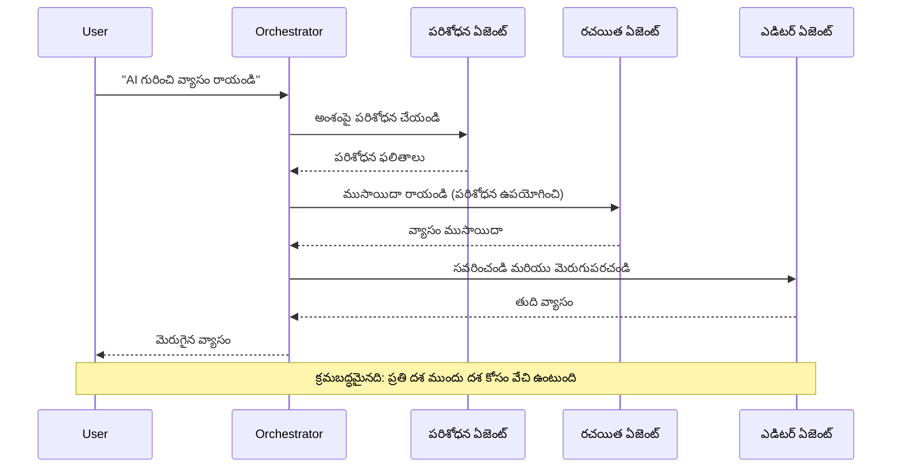
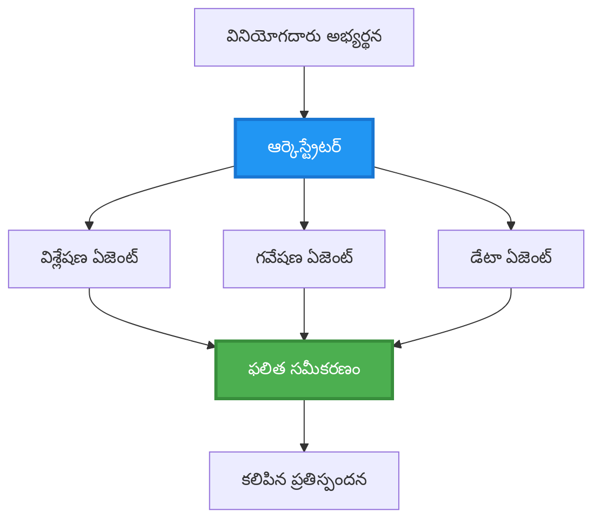
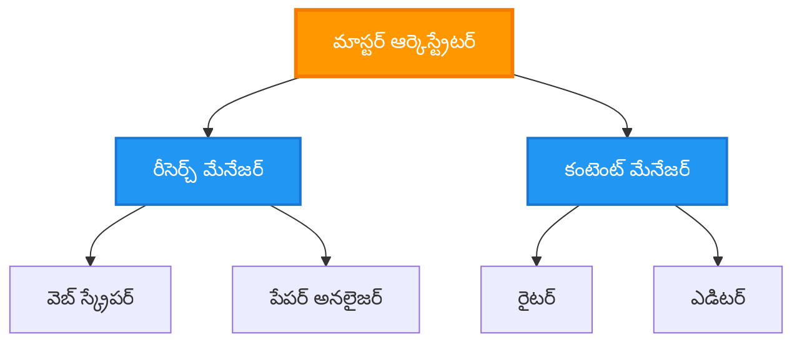
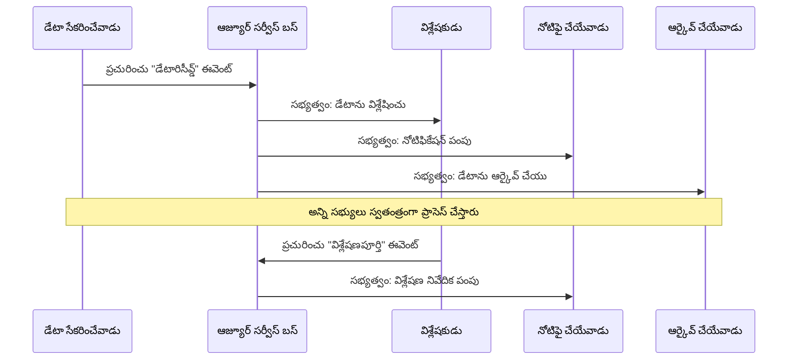
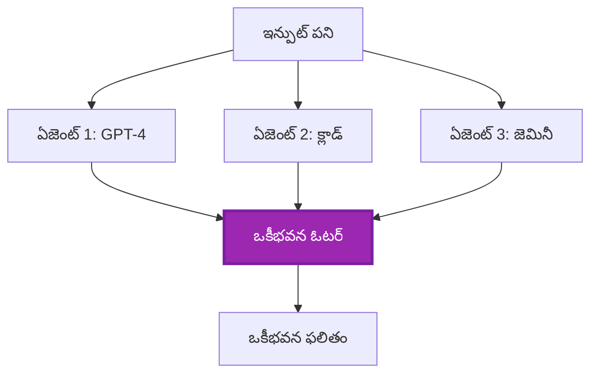
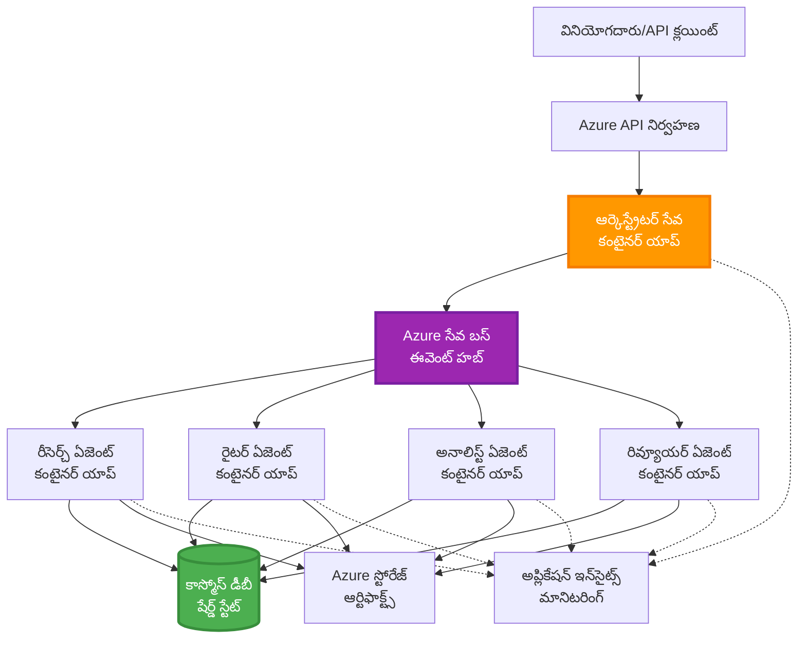

<!--
CO_OP_TRANSLATOR_METADATA:
{
  "original_hash": "bcefbd5d0107691ef3e6e33ba694d6f4",
  "translation_date": "2025-11-25T07:52:09+00:00",
  "source_file": "docs/pre-deployment/coordination-patterns.md",
  "language_code": "te"
}
-->
# మల్టీ-ఏజెంట్ సమన్వయ నమూనాలు

⏱️ **అంచనా సమయం**: 60-75 నిమిషాలు | 💰 **అంచనా ఖర్చు**: ~$100-300/నెల | ⭐ **సంక్లిష్టత**: అధునాతన

**📚 నేర్చుకునే మార్గం:**
- ← ముందు: [సామర్థ్య ప్రణాళిక](capacity-planning.md) - వనరుల పరిమాణం మరియు స్కేలింగ్ వ్యూహాలు
- 🎯 **మీరు ఇక్కడ ఉన్నారు**: మల్టీ-ఏజెంట్ సమన్వయ నమూనాలు (ఆర్కెస్ట్రేషన్, కమ్యూనికేషన్, స్టేట్ మేనేజ్‌మెంట్)
- → తదుపరి: [SKU ఎంపిక](sku-selection.md) - సరైన Azure సేవలను ఎంచుకోవడం
- 🏠 [కోర్సు హోమ్](../../README.md)

---

## మీరు ఏమి నేర్చుకుంటారు

ఈ పాఠాన్ని పూర్తి చేయడం ద్వారా, మీరు:
- **మల్టీ-ఏజెంట్ ఆర్కిటెక్చర్** నమూనాలను అర్థం చేసుకోవడం మరియు వాటిని ఎప్పుడు ఉపయోగించాలో తెలుసుకోవడం
- **ఆర్కెస్ట్రేషన్ నమూనాలను** అమలు చేయడం (కేంద్రీకృత, వికేంద్రీకృత, హైరార్కికల్)
- **ఏజెంట్ కమ్యూనికేషన్** వ్యూహాలను రూపొందించడం (సింక్రోనస్, అసింక్రోనస్, ఈవెంట్-డ్రివెన్)
- పంపిణీ చేయబడిన ఏజెంట్లలో **షేర్డ్ స్టేట్** నిర్వహణ
- AZDతో **మల్టీ-ఏజెంట్ సిస్టమ్స్**ను డిప్లాయ్ చేయడం
- వాస్తవ ప్రపంచ AI పరిస్థితుల కోసం **సమన్వయ నమూనాలను** వర్తింపజేయడం
- పంపిణీ చేయబడిన ఏజెంట్ సిస్టమ్స్‌ను మానిటర్ చేయడం మరియు డీబగ్ చేయడం

## మల్టీ-ఏజెంట్ సమన్వయం ఎందుకు ముఖ్యమైంది

### పరిణామం: సింగిల్ ఏజెంట్ నుండి మల్టీ-ఏజెంట్ వరకు

**సింగిల్ ఏజెంట్ (సరళమైనది):**
```
User → Agent → Response
```
- ✅ అర్థం చేసుకోవడం మరియు అమలు చేయడం సులభం
- ✅ సరళమైన పనుల కోసం వేగవంతం
- ❌ ఒకే మోడల్ సామర్థ్యాల పరిమితి
- ❌ సంక్లిష్ట పనులను సమాంతరంగా చేయలేరు
- ❌ ప్రత్యేకత లేదు

**మల్టీ-ఏజెంట్ సిస్టమ్ (అధునాతన):**
```
           ┌─────────────┐
           │ Orchestrator│
           └──────┬──────┘
        ┌─────────┼─────────┐
        │         │         │
    ┌───▼──┐  ┌──▼───┐  ┌──▼────┐
    │Agent1│  │Agent2│  │Agent3 │
    │(Plan)│  │(Code)│  │(Review)│
    └──────┘  └──────┘  └───────┘
```
- ✅ ప్రత్యేక పనుల కోసం ప్రత్యేక ఏజెంట్లు
- ✅ వేగం కోసం సమాంతర అమలు
- ✅ మాడ్యులర్ మరియు నిర్వహణ సులభం
- ✅ సంక్లిష్ట వర్క్‌ఫ్లోలలో మెరుగైనది
- ⚠️ సమన్వయ లాజిక్ అవసరం

**ఉదాహరణ**: సింగిల్ ఏజెంట్ అంటే అన్ని పనులు ఒక వ్యక్తి చేయడం లాంటిది. మల్టీ-ఏజెంట్ అంటే ప్రతి సభ్యుడు ప్రత్యేక నైపుణ్యాలు కలిగి ఉండే బృందం (రిసెర్చర్, కోడర్, రివ్యూయర్, రైటర్) కలిసి పనిచేయడం.

---

## ప్రధాన సమన్వయ నమూనాలు

### నమూనా 1: సీక్వెన్షియల్ సమన్వయం (చైన్ ఆఫ్ రెస్పాన్సిబిలిటీ)

**ఎప్పుడు ఉపయోగించాలి**: పనులు నిర్దిష్ట క్రమంలో పూర్తి కావాలి, ప్రతి ఏజెంట్ గత అవుట్‌పుట్‌పై ఆధారపడుతుంది.


**ప్రయోజనాలు:**
- ✅ స్పష్టమైన డేటా ప్రవాహం
- ✅ డీబగ్ చేయడం సులభం
- ✅ అంచనా వేయగల అమలు క్రమం

**పరిమితులు:**
- ❌ నెమ్మదిగా (సమాంతరత లేదు)
- ❌ ఒక వైఫల్యం మొత్తం చైన్‌ను అడ్డుకుంటుంది
- ❌ పరస్పర ఆధారిత పనులను నిర్వహించలేరు

**ఉదాహరణలు:**
- కంటెంట్ క్రియేషన్ పైప్‌లైన్ (రిసెర్చ్ → రైటింగ్ → ఎడిట్ → పబ్లిష్)
- కోడ్ జనరేషన్ (ప్లాన్ → ఇంప్లిమెంట్ → టెస్ట్ → డిప్లాయ్)
- రిపోర్ట్ జనరేషన్ (డేటా సేకరణ → విశ్లేషణ → విజువలైజేషన్ → సారాంశం)

---

### నమూనా 2: సమాంతర సమన్వయం (ఫ్యాన్-అవుట్/ఫ్యాన్-ఇన్)

**ఎప్పుడు ఉపయోగించాలి**: స్వతంత్ర పనులు ఒకేసారి నడపవచ్చు, ఫలితాలు చివర్లో కలిపి ఉంచబడతాయి.


**ప్రయోజనాలు:**
- ✅ వేగవంతం (సమాంతర అమలు)
- ✅ వైఫల్యాలను తట్టుకోగల సామర్థ్యం (పాక్షిక ఫలితాలు సరిపోతాయి)
- ✅ హారిజాంటల్ స్కేలింగ్

**పరిమితులు:**
- ⚠️ ఫలితాలు క్రమం తప్పుగా రావచ్చు
- ⚠️ సమీకరణ లాజిక్ అవసరం
- ⚠️ సంక్లిష్ట స్టేట్ మేనేజ్‌మెంట్

**ఉదాహరణలు:**
- బహుళ మూలాల డేటా సేకరణ (APIs + డేటాబేస్‌లు + వెబ్ స్క్రాపింగ్)
- పోటీ విశ్లేషణ (బహుళ మోడల్స్ సొల్యూషన్స్ రూపొందిస్తాయి, ఉత్తమమైనది ఎంచుకుంటారు)
- అనువాద సేవలు (ఒకేసారి బహుళ భాషలకు అనువదించడం)

---

### నమూనా 3: హైరార్కికల్ సమన్వయం (మేనేజర్-వర్కర్)

**ఎప్పుడు ఉపయోగించాలి**: ఉప-పనులతో కూడిన సంక్లిష్ట వర్క్‌ఫ్లోలు, ప్రతినిధిత్వం అవసరం.


**ప్రయోజనాలు:**
- ✅ సంక్లిష్ట వర్క్‌ఫ్లోలను నిర్వహించగల సామర్థ్యం
- ✅ మాడ్యులర్ మరియు నిర్వహణ సులభం
- ✅ స్పష్టమైన బాధ్యతా సరిహద్దులు

**పరిమితులు:**
- ⚠️ మరింత సంక్లిష్టమైన ఆర్కిటెక్చర్
- ⚠️ అధిక లేటెన్సీ (బహుళ సమన్వయ లేయర్లు)
- ⚠️ అధునాతన ఆర్కెస్ట్రేషన్ అవసరం

**ఉదాహరణలు:**
- ఎంటర్‌ప్రైజ్ డాక్యుమెంట్ ప్రాసెసింగ్ (వర్గీకరించు → రూట్ → ప్రాసెస్ → ఆర్కైవ్)
- బహుళ దశల డేటా పైప్‌లైన్‌లు (ఇంజెస్ట్ → క్లీన్ → ట్రాన్స్‌ఫార్మ్ → విశ్లేషణ → రిపోర్ట్)
- సంక్లిష్ట ఆటోమేషన్ వర్క్‌ఫ్లోలు (ప్లానింగ్ → వనరుల కేటాయింపు → అమలు → మానిటరింగ్)

---

### నమూనా 4: ఈవెంట్-డ్రివెన్ సమన్వయం (పబ్లిష్-సబ్‌స్క్రైబ్)

**ఎప్పుడు ఉపయోగించాలి**: ఏజెంట్లు ఈవెంట్లకు ప్రతిస్పందించాలి, సడలించిన అనుసంధానం కావాలి.


**ప్రయోజనాలు:**
- ✅ ఏజెంట్ల మధ్య సడలించిన అనుసంధానం
- ✅ కొత్త ఏజెంట్లను సులభంగా జోడించవచ్చు (కేవలం సబ్‌స్క్రైబ్ చేయండి)
- ✅ అసింక్రోనస్ ప్రాసెసింగ్
- ✅ రిజిలియంట్ (మెసేజ్ పర్సిస్టెన్స్)

**పరిమితులు:**
- ⚠️ ఈవెంట్యువల్ కన్సిస్టెన్సీ
- ⚠️ సంక్లిష్ట డీబగింగ్
- ⚠️ మెసేజ్ ఆర్డరింగ్ సవాళ్లు

**ఉదాహరణలు:**
- రియల్-టైమ్ మానిటరింగ్ సిస్టమ్స్ (అలర్ట్స్, డాష్‌బోర్డ్స్, లాగ్స్)
- బహుళ ఛానల్ నోటిఫికేషన్లు (ఇమెయిల్, SMS, పుష్, స్లాక్)
- డేటా ప్రాసెసింగ్ పైప్‌లైన్‌లు (అదే డేటాను బహుళ వినియోగదారులు)

---

### నమూనా 5: కన్‌సెన్సస్-బేస్డ్ సమన్వయం (వోటింగ్/క్వోరమ్)

**ఎప్పుడు ఉపయోగించాలి**: కొనసాగడానికి ముందు బహుళ ఏజెంట్ల నుండి అంగీకారం అవసరం.


**ప్రయోజనాలు:**
- ✅ అధిక ఖచ్చితత్వం (బహుళ అభిప్రాయాలు)
- ✅ వైఫల్యాలను తట్టుకోగల సామర్థ్యం (తక్కువ సంఖ్యలో వైఫల్యాలు అనుమతించబడతాయి)
- ✅ నాణ్యత హామీ అంతర్నిర్మితం

**పరిమితులు:**
- ❌ ఖరీదైనది (బహుళ మోడల్ కాల్స్)
- ❌ నెమ్మదిగా (అన్ని ఏజెంట్ల కోసం వేచి ఉండాలి)
- ⚠️ ఘర్షణ పరిష్కారం అవసరం

**ఉదాహరణలు:**
- కంటెంట్ మోడరేషన్ (బహుళ మోడల్స్ కంటెంట్‌ను సమీక్షిస్తాయి)
- కోడ్ రివ్యూ (బహుళ లింటర్లు/విశ్లేషకులు)
- వైద్య నిర్ధారణ (బహుళ AI మోడల్స్, నిపుణుల ధృవీకరణ)

---

## ఆర్కిటెక్చర్ అవలోకనం

### Azureలో పూర్తి మల్టీ-ఏజెంట్ సిస్టమ్


**ప్రధాన భాగాలు:**

| భాగం | ప్రయోజనం | Azure సేవ |
|-----------|---------|---------------|
| **API గేట్‌వే** | ప్రవేశ బిందువు, రేట్ లిమిటింగ్, ఆథ్ | API మేనేజ్‌మెంట్ |
| **ఆర్కెస్ట్రేటర్** | ఏజెంట్ వర్క్‌ఫ్లోలను సమన్వయం చేస్తుంది | కంటైనర్ యాప్స్ |
| **మెసేజ్ క్యూయూ** | అసింక్రోనస్ కమ్యూనికేషన్ | సర్వీస్ బస్ / ఈవెంట్ హబ్‌లు |
| **ఏజెంట్లు** | ప్రత్యేక AI వర్కర్లు | కంటైనర్ యాప్స్ / ఫంక్షన్స్ |
| **స్టేట్ స్టోర్** | షేర్డ్ స్టేట్, టాస్క్ ట్రాకింగ్ | కోస్మోస్ DB |
| **ఆర్టిఫాక్ట్ స్టోరేజ్** | డాక్యుమెంట్లు, ఫలితాలు, లాగ్స్ | బ్లోబ్ స్టోరేజ్ |
| **మానిటరింగ్** | పంపిణీ చేయబడిన ట్రేసింగ్, లాగ్స్ | అప్లికేషన్ ఇన్‌సైట్స్ |

---

## ముందస్తు అవసరాలు

### అవసరమైన టూల్స్

```bash
# Azure Developer CLI ను ధృవీకరించండి
azd version
# ✅ ఆశించినది: azd వెర్షన్ 1.0.0 లేదా అంతకంటే ఎక్కువ

# Azure CLI ను ధృవీకరించండి
az --version
# ✅ ఆశించినది: azure-cli 2.50.0 లేదా అంతకంటే ఎక్కువ

# Docker ను ధృవీకరించండి (స్థానిక పరీక్షల కోసం)
docker --version
# ✅ ఆశించినది: Docker వెర్షన్ 20.10 లేదా అంతకంటే ఎక్కువ
```

### Azure అవసరాలు

- చురుకైన Azure సబ్‌స్క్రిప్షన్
- క్రియేట్ చేయడానికి అనుమతులు:
  - కంటైనర్ యాప్స్
  - సర్వీస్ బస్ నేమ్‌స్పేస్‌లు
  - కోస్మోస్ DB ఖాతాలు
  - స్టోరేజ్ ఖాతాలు
  - అప్లికేషన్ ఇన్‌సైట్స్

### జ్ఞాన అవసరాలు

మీరు పూర్తి చేసి ఉండాలి:
- [కాన్ఫిగరేషన్ మేనేజ్‌మెంట్](../getting-started/configuration.md)
- [ఆథెంటికేషన్ & సెక్యూరిటీ](../getting-started/authsecurity.md)
- [మైక్రోసర్వీసెస్ ఉదాహరణ](../../../../examples/microservices)

---

## అమలు మార్గదర్శిని

### ప్రాజెక్ట్ నిర్మాణం

```
multi-agent-system/
├── azure.yaml                    # AZD configuration
├── infra/
│   ├── main.bicep               # Main infrastructure
│   ├── core/
│   │   ├── servicebus.bicep     # Message queue
│   │   ├── cosmos.bicep         # State store
│   │   ├── storage.bicep        # Artifact storage
│   │   └── monitoring.bicep     # Application Insights
│   └── app/
│       ├── orchestrator.bicep   # Orchestrator service
│       └── agent.bicep          # Agent template
└── src/
    ├── orchestrator/            # Orchestration logic
    │   ├── app.py
    │   ├── workflows.py
    │   └── Dockerfile
    ├── agents/
    │   ├── research/            # Research agent
    │   ├── writer/              # Writer agent
    │   ├── analyst/             # Analyst agent
    │   └── reviewer/            # Reviewer agent
    └── shared/
        ├── state_manager.py     # Shared state logic
        └── message_handler.py   # Message handling
```

---

## పాఠం 1: సీక్వెన్షియల్ సమన్వయ నమూనా

### అమలు: కంటెంట్ క్రియేషన్ పైప్‌లైన్

రిసెర్చ్ → రైటింగ్ → ఎడిట్ → పబ్లిష్ అనే సీక్వెన్షియల్ పైప్‌లైన్‌ను నిర్మిద్దాం

### 1. AZD కాన్ఫిగరేషన్

**ఫైల్: `azure.yaml`**

```yaml
name: content-pipeline
metadata:
  template: multi-agent-sequential@1.0.0

services:
  orchestrator:
    project: ./src/orchestrator
    language: python
    host: containerapp
  
  research-agent:
    project: ./src/agents/research
    language: python
    host: containerapp
  
  writer-agent:
    project: ./src/agents/writer
    language: python
    host: containerapp
  
  editor-agent:
    project: ./src/agents/editor
    language: python
    host: containerapp
```

### 2. ఇన్‌ఫ్రాస్ట్రక్చర్: సమన్వయానికి సర్వీస్ బస్

**ఫైల్: `infra/core/servicebus.bicep`**

```bicep
param name string
param location string
param tags object = {}

resource serviceBusNamespace 'Microsoft.ServiceBus/namespaces@2022-10-01-preview' = {
  name: name
  location: location
  tags: tags
  sku: {
    name: 'Standard'
    tier: 'Standard'
  }
  properties: {
    minimumTlsVersion: '1.2'
  }
}

// Queue for orchestrator → research agent
resource researchQueue 'Microsoft.ServiceBus/namespaces/queues@2022-10-01-preview' = {
  parent: serviceBusNamespace
  name: 'research-tasks'
  properties: {
    maxDeliveryCount: 3
    lockDuration: 'PT5M'
    deadLetteringOnMessageExpiration: true
  }
}

// Queue for research agent → writer agent
resource writerQueue 'Microsoft.ServiceBus/namespaces/queues@2022-10-01-preview' = {
  parent: serviceBusNamespace
  name: 'writer-tasks'
  properties: {
    maxDeliveryCount: 3
    lockDuration: 'PT5M'
  }
}

// Queue for writer agent → editor agent
resource editorQueue 'Microsoft.ServiceBus/namespaces/queues@2022-10-01-preview' = {
  parent: serviceBusNamespace
  name: 'editor-tasks'
  properties: {
    maxDeliveryCount: 3
    lockDuration: 'PT5M'
  }
}

output namespace string = serviceBusNamespace.name
output connectionString string = listKeys('${serviceBusNamespace.id}/AuthorizationRules/RootManageSharedAccessKey', serviceBusNamespace.apiVersion).primaryConnectionString
```

### 3. షేర్డ్ స్టేట్ మేనేజర్

**ఫైల్: `src/shared/state_manager.py`**

```python
from azure.cosmos import CosmosClient, PartitionKey
from datetime import datetime
import os

class StateManager:
    """Manages shared state across agents using Cosmos DB"""
    
    def __init__(self):
        endpoint = os.environ['COSMOS_ENDPOINT']
        key = os.environ['COSMOS_KEY']
        
        self.client = CosmosClient(endpoint, key)
        self.database = self.client.get_database_client('agent-state')
        self.container = self.database.get_container_client('tasks')
    
    def create_task(self, task_id: str, task_type: str, input_data: dict):
        """Create a new task"""
        task = {
            'id': task_id,
            'type': task_type,
            'status': 'pending',
            'input': input_data,
            'created_at': datetime.utcnow().isoformat(),
            'steps': []
        }
        self.container.create_item(task)
        return task
    
    def update_task_step(self, task_id: str, step_name: str, result: dict):
        """Update task with completed step"""
        task = self.container.read_item(task_id, partition_key=task_id)
        
        task['steps'].append({
            'name': step_name,
            'completed_at': datetime.utcnow().isoformat(),
            'result': result
        })
        
        self.container.replace_item(task_id, task)
        return task
    
    def complete_task(self, task_id: str, final_result: dict):
        """Mark task as complete"""
        task = self.container.read_item(task_id, partition_key=task_id)
        task['status'] = 'completed'
        task['result'] = final_result
        task['completed_at'] = datetime.utcnow().isoformat()
        self.container.replace_item(task_id, task)
        return task
    
    def get_task(self, task_id: str):
        """Retrieve task state"""
        return self.container.read_item(task_id, partition_key=task_id)
```

### 4. ఆర్కెస్ట్రేటర్ సర్వీస్

**ఫైల్: `src/orchestrator/app.py`**

```python
from flask import Flask, request, jsonify
from azure.servicebus import ServiceBusClient, ServiceBusMessage
import json
import uuid
import os
from shared.state_manager import StateManager

app = Flask(__name__)
state_manager = StateManager()

# సర్వీస్ బస్ కనెక్షన్
servicebus_connection_str = os.environ['SERVICEBUS_CONNECTION_STRING']
servicebus_client = ServiceBusClient.from_connection_string(servicebus_connection_str)

@app.route('/health', methods=['GET'])
def health():
    return jsonify({'status': 'healthy', 'service': 'orchestrator'})

@app.route('/create-content', methods=['POST'])
def create_content():
    """
    Sequential workflow: Research → Write → Edit → Publish
    """
    data = request.json
    topic = data.get('topic')
    
    if not topic:
        return jsonify({'error': 'Topic required'}), 400
    
    # స్టేట్ స్టోర్‌లో టాస్క్ సృష్టించండి
    task_id = str(uuid.uuid4())
    task = state_manager.create_task(
        task_id=task_id,
        task_type='content_creation',
        input_data={'topic': topic}
    )
    
    # రీసెర్చ్ ఏజెంట్‌కు సందేశం పంపండి (మొదటి దశ)
    sender = servicebus_client.get_queue_sender('research-tasks')
    message = ServiceBusMessage(
        body=json.dumps({
            'task_id': task_id,
            'topic': topic,
            'next_queue': 'writer-tasks'  # ఫలితాలను ఎక్కడికి పంపాలి
        }),
        content_type='application/json'
    )
    
    with sender:
        sender.send_messages(message)
    
    return jsonify({
        'task_id': task_id,
        'status': 'started',
        'workflow': 'sequential',
        'steps': ['research', 'write', 'edit', 'publish'],
        'message': 'Content creation pipeline initiated'
    }), 202

@app.route('/task/<task_id>', methods=['GET'])
def get_task_status(task_id):
    """Check task status"""
    try:
        task = state_manager.get_task(task_id)
        return jsonify(task)
    except Exception as e:
        return jsonify({'error': str(e)}), 404

if __name__ == '__main__':
    app.run(host='0.0.0.0', port=8080)
```

### 5. రిసెర్చ్ ఏజెంట్

**ఫైల్: `src/agents/research/app.py`**

```python
from azure.servicebus import ServiceBusClient, ServiceBusMessage
from openai import AzureOpenAI
import json
import os
import time
from shared.state_manager import StateManager

# క్లయింట్లను ప్రారంభించండి
state_manager = StateManager()
servicebus_client = ServiceBusClient.from_connection_string(
    os.environ['SERVICEBUS_CONNECTION_STRING']
)

openai_client = AzureOpenAI(
    api_key=os.environ['AZURE_OPENAI_API_KEY'],
    api_version="2024-02-01",
    azure_endpoint=os.environ['AZURE_OPENAI_ENDPOINT']
)

def process_research_task(message_data):
    """Process research request and pass to writer"""
    task_id = message_data['task_id']
    topic = message_data['topic']
    next_queue = message_data['next_queue']
    
    print(f"🔬 Researching: {topic}")
    
    # పరిశోధన కోసం Azure OpenAI ను కాల్ చేయండి
    response = openai_client.chat.completions.create(
        model="gpt-4",
        messages=[
            {"role": "system", "content": "You are a research assistant. Provide comprehensive research on the given topic."},
            {"role": "user", "content": f"Research this topic thoroughly: {topic}"}
        ],
        max_tokens=1500
    )
    
    research_results = response.choices[0].message.content
    
    # స్థితిని నవీకరించండి
    state_manager.update_task_step(
        task_id=task_id,
        step_name='research',
        result={'research': research_results}
    )
    
    # తదుపరి ఏజెంట్ (రచయిత) కు పంపండి
    sender = servicebus_client.get_queue_sender(next_queue)
    message = ServiceBusMessage(
        body=json.dumps({
            'task_id': task_id,
            'topic': topic,
            'research': research_results,
            'next_queue': 'editor-tasks'
        }),
        content_type='application/json'
    )
    
    with sender:
        sender.send_messages(message)
    
    print(f"✅ Research complete for task {task_id}")

def main():
    """Listen to research queue"""
    receiver = servicebus_client.get_queue_receiver('research-tasks')
    
    print("🔬 Research Agent started, listening for tasks...")
    
    with receiver:
        while True:
            messages = receiver.receive_messages(max_wait_time=5)
            for message in messages:
                try:
                    message_data = json.loads(str(message))
                    process_research_task(message_data)
                    receiver.complete_message(message)
                except Exception as e:
                    print(f"❌ Error processing message: {e}")
                    receiver.abandon_message(message)

if __name__ == '__main__':
    main()
```

### 6. రైటర్ ఏజెంట్

**ఫైల్: `src/agents/writer/app.py`**

```python
from azure.servicebus import ServiceBusClient, ServiceBusMessage
from openai import AzureOpenAI
import json
import os
from shared.state_manager import StateManager

state_manager = StateManager()
servicebus_client = ServiceBusClient.from_connection_string(
    os.environ['SERVICEBUS_CONNECTION_STRING']
)

openai_client = AzureOpenAI(
    api_key=os.environ['AZURE_OPENAI_API_KEY'],
    api_version="2024-02-01",
    azure_endpoint=os.environ['AZURE_OPENAI_ENDPOINT']
)

def process_writing_task(message_data):
    """Write article based on research"""
    task_id = message_data['task_id']
    topic = message_data['topic']
    research = message_data['research']
    next_queue = message_data['next_queue']
    
    print(f"✍️ Writing article: {topic}")
    
    # ఆర్టికల్ రాయడానికి Azure OpenAI ను కాల్ చేయండి
    response = openai_client.chat.completions.create(
        model="gpt-4",
        messages=[
            {"role": "system", "content": "You are a professional writer. Write engaging, well-structured articles."},
            {"role": "user", "content": f"Based on this research:\n\n{research}\n\nWrite a comprehensive article about: {topic}"}
        ],
        max_tokens=2000
    )
    
    article_draft = response.choices[0].message.content
    
    # స్థితిని నవీకరించండి
    state_manager.update_task_step(
        task_id=task_id,
        step_name='writing',
        result={'draft': article_draft}
    )
    
    # ఎడిటర్‌కు పంపండి
    sender = servicebus_client.get_queue_sender(next_queue)
    message = ServiceBusMessage(
        body=json.dumps({
            'task_id': task_id,
            'topic': topic,
            'draft': article_draft
        }),
        content_type='application/json'
    )
    
    with sender:
        sender.send_messages(message)
    
    print(f"✅ Article draft complete for task {task_id}")

def main():
    """Listen to writer queue"""
    receiver = servicebus_client.get_queue_receiver('writer-tasks')
    
    print("✍️ Writer Agent started, listening for tasks...")
    
    with receiver:
        while True:
            messages = receiver.receive_messages(max_wait_time=5)
            for message in messages:
                try:
                    message_data = json.loads(str(message))
                    process_writing_task(message_data)
                    receiver.complete_message(message)
                except Exception as e:
                    print(f"❌ Error: {e}")
                    receiver.abandon_message(message)

if __name__ == '__main__':
    main()
```

### 7. ఎడిటర్ ఏజెంట్

**ఫైల్: `src/agents/editor/app.py`**

```python
from azure.servicebus import ServiceBusClient
from openai import AzureOpenAI
import json
import os
from shared.state_manager import StateManager

state_manager = StateManager()
servicebus_client = ServiceBusClient.from_connection_string(
    os.environ['SERVICEBUS_CONNECTION_STRING']
)

openai_client = AzureOpenAI(
    api_key=os.environ['AZURE_OPENAI_API_KEY'],
    api_version="2024-02-01",
    azure_endpoint=os.environ['AZURE_OPENAI_ENDPOINT']
)

def process_editing_task(message_data):
    """Edit and finalize article"""
    task_id = message_data['task_id']
    topic = message_data['topic']
    draft = message_data['draft']
    
    print(f"📝 Editing article: {topic}")
    
    # Azure OpenAI ను కాల్ చేసి సవరించండి
    response = openai_client.chat.completions.create(
        model="gpt-4",
        messages=[
            {"role": "system", "content": "You are an expert editor. Improve grammar, clarity, and structure."},
            {"role": "user", "content": f"Edit and improve this article:\n\n{draft}"}
        ],
        max_tokens=2000
    )
    
    final_article = response.choices[0].message.content
    
    # పనిని పూర్తి అయినట్లు గుర్తించండి
    state_manager.complete_task(
        task_id=task_id,
        final_result={
            'topic': topic,
            'final_article': final_article,
            'word_count': len(final_article.split())
        }
    )
    
    print(f"✅ Article finalized for task {task_id}")

def main():
    """Listen to editor queue"""
    receiver = servicebus_client.get_queue_receiver('editor-tasks')
    
    print("📝 Editor Agent started, listening for tasks...")
    
    with receiver:
        while True:
            messages = receiver.receive_messages(max_wait_time=5)
            for message in messages:
                try:
                    message_data = json.loads(str(message))
                    process_editing_task(message_data)
                    receiver.complete_message(message)
                except Exception as e:
                    print(f"❌ Error: {e}")
                    receiver.abandon_message(message)

if __name__ == '__main__':
    main()
```

### 8. డిప్లాయ్ మరియు టెస్ట్

```bash
# ప్రారంభించి అమలు చేయండి
azd init
azd up

# ఆర్కెస్ట్రేటర్ URL పొందండి
ORCHESTRATOR_URL=$(azd env get-values | grep ORCHESTRATOR_URL | cut -d '=' -f2 | tr -d '"')

# కంటెంట్ సృష్టించండి
curl -X POST $ORCHESTRATOR_URL/create-content \
  -H "Content-Type: application/json" \
  -d '{"topic": "The Future of AI in Healthcare"}'
```

**✅ అంచనా ఫలితం:**
```json
{
  "task_id": "a1b2c3d4-e5f6-7890-abcd-ef1234567890",
  "status": "started",
  "workflow": "sequential",
  "steps": ["research", "write", "edit", "publish"],
  "message": "Content creation pipeline initiated"
}
```

**టాస్క్ పురోగతిని తనిఖీ చేయండి:**
```bash
TASK_ID="a1b2c3d4-e5f6-7890-abcd-ef1234567890"
curl $ORCHESTRATOR_URL/task/$TASK_ID
```

**✅ అంచనా ఫలితం (పూర్తి):**
```json
{
  "id": "a1b2c3d4-e5f6-7890-abcd-ef1234567890",
  "type": "content_creation",
  "status": "completed",
  "steps": [
    {
      "name": "research",
      "completed_at": "2025-11-19T10:30:00Z",
      "result": {"research": "..."}
    },
    {
      "name": "writing",
      "completed_at": "2025-11-19T10:32:00Z",
      "result": {"draft": "..."}
    }
  ],
  "result": {
    "topic": "The Future of AI in Healthcare",
    "final_article": "...",
    "word_count": 1500
  }
}
```

---

## పాఠం 2: సమాంతర సమన్వయ నమూనా

### అమలు: బహుళ మూలాల రిసెర్చ్ అగ్రిగేటర్

ఒకేసారి బహుళ మూలాల నుండి సమాచారం సేకరించే సమాంతర వ్యవస్థను నిర్మిద్దాం.

### సమాంతర ఆర్కెస్ట్రేటర్

**ఫైల్: `src/orchestrator/parallel_workflow.py`**

```python
from flask import Flask, request, jsonify
from azure.servicebus import ServiceBusClient, ServiceBusMessage
import json
import uuid
import os
from shared.state_manager import StateManager

app = Flask(__name__)
state_manager = StateManager()

servicebus_client = ServiceBusClient.from_connection_string(
    os.environ['SERVICEBUS_CONNECTION_STRING']
)

@app.route('/research-parallel', methods=['POST'])
def research_parallel():
    """
    Parallel workflow: Multiple agents work simultaneously
    """
    data = request.json
    query = data.get('query')
    
    task_id = str(uuid.uuid4())
    task = state_manager.create_task(
        task_id=task_id,
        task_type='parallel_research',
        input_data={
            'query': query,
            'agents': ['web', 'academic', 'news', 'social']
        }
    )
    
    # ఫ్యాన్-అవుట్: అన్ని ఏజెంట్లకు ఒకేసారి పంపండి
    agents = [
        ('web-research-queue', 'web'),
        ('academic-research-queue', 'academic'),
        ('news-research-queue', 'news'),
        ('social-research-queue', 'social')
    ]
    
    for queue_name, agent_type in agents:
        sender = servicebus_client.get_queue_sender(queue_name)
        message = ServiceBusMessage(
            body=json.dumps({
                'task_id': task_id,
                'query': query,
                'agent_type': agent_type,
                'result_queue': 'aggregation-queue'
            }),
            content_type='application/json'
        )
        
        with sender:
            sender.send_messages(message)
    
    return jsonify({
        'task_id': task_id,
        'status': 'started',
        'workflow': 'parallel',
        'agents_dispatched': 4,
        'message': 'Parallel research initiated'
    }), 202

if __name__ == '__main__':
    app.run(host='0.0.0.0', port=8080)
```

### సమీకరణ లాజిక్

**ఫైల్: `src/agents/aggregator/app.py`**

```python
from azure.servicebus import ServiceBusClient
import json
import os
from collections import defaultdict
from shared.state_manager import StateManager

state_manager = StateManager()
servicebus_client = ServiceBusClient.from_connection_string(
    os.environ['SERVICEBUS_CONNECTION_STRING']
)

# ప్రతి పనికి ఫలితాలను ట్రాక్ చేయండి
task_results = defaultdict(list)
expected_agents = 4  # వెబ్, అకాడమిక్, వార్తలు, సామాజిక

def process_result(message_data):
    """Aggregate results from parallel agents"""
    task_id = message_data['task_id']
    agent_type = message_data['agent_type']
    result = message_data['result']
    
    # ఫలితాన్ని నిల్వ చేయండి
    task_results[task_id].append({
        'agent': agent_type,
        'data': result
    })
    
    print(f"📊 Received result from {agent_type} agent ({len(task_results[task_id])}/{expected_agents})")
    
    # అన్ని ఏజెంట్లు పూర్తి చేశారా అని తనిఖీ చేయండి (ఫ్యాన్-ఇన్)
    if len(task_results[task_id]) == expected_agents:
        print(f"✅ All agents completed for task {task_id}. Aggregating...")
        
        # ఫలితాలను కలపండి
        aggregated = {
            'query': message_data['query'],
            'sources': task_results[task_id],
            'summary': generate_summary(task_results[task_id])
        }
        
        # పూర్తి అని గుర్తించండి
        state_manager.complete_task(task_id, aggregated)
        
        # శుభ్రం చేయండి
        del task_results[task_id]
        
        print(f"✅ Aggregation complete for task {task_id}")

def generate_summary(results):
    """Generate summary from all sources"""
    summaries = [r['data'].get('summary', '') for r in results]
    return '\n\n'.join(summaries)

def main():
    """Listen to aggregation queue"""
    receiver = servicebus_client.get_queue_receiver('aggregation-queue')
    
    print("📊 Aggregator started, listening for results...")
    
    with receiver:
        while True:
            messages = receiver.receive_messages(max_wait_time=5)
            for message in messages:
                try:
                    message_data = json.loads(str(message))
                    process_result(message_data)
                    receiver.complete_message(message)
                except Exception as e:
                    print(f"❌ Error: {e}")
                    receiver.abandon_message(message)

if __name__ == '__main__':
    main()
```

**సమాంతర నమూనా ప్రయోజనాలు:**
- ⚡ **4x వేగవంతం** (ఏజెంట్లు ఒకేసారి నడుస్తాయి)
- 🔄 **వైఫల్యాలను తట్టుకోగల సామర్థ్యం** (పాక్షిక ఫలితాలు సరిపోతాయి)
- 📈 **స్కేలబుల్** (సులభంగా మరిన్ని ఏజెంట్లను జోడించండి)

---

## ప్రాక్టికల్ వ్యాయామాలు

### వ్యాయామం 1: టైమ్‌ఔట్ హ్యాండ్లింగ్ జోడించండి ⭐⭐ (మధ్యస్థం)

**లక్ష్యం**: అగ్రిగేటర్ నెమ్మదిగా పనిచేసే ఏజెంట్ల కోసం ఎప్పటికీ వేచి ఉండకుండా టైమ్‌ఔట్ లాజిక్‌ను అమలు చేయండి.

**దశలు**:

1. **అగ్రిగేటర్‌కు టైమ్‌ఔట్ ట్రాకింగ్ జోడించండి:**

```python
from datetime import datetime, timedelta

task_timeouts = {}  # task_id -> గడువు సమయం

def process_result(message_data):
    task_id = message_data['task_id']
    
    # మొదటి ఫలితంపై టైమౌట్ సెట్ చేయండి
    if task_id not in task_timeouts:
        task_timeouts[task_id] = datetime.utcnow() + timedelta(seconds=30)
    
    task_results[task_id].append({
        'agent': message_data['agent_type'],
        'data': message_data['result']
    })
    
    # పూర్తయిందా లేదా టైమౌట్ అయ్యిందా అని తనిఖీ చేయండి
    if len(task_results[task_id]) == expected_agents or \
       datetime.utcnow() > task_timeouts[task_id]:
        
        print(f"📊 Aggregating with {len(task_results[task_id])}/{expected_agents} results")
        
        aggregated = {
            'query': message_data['query'],
            'sources': task_results[task_id],
            'completed_agents': len(task_results[task_id]),
            'timed_out': len(task_results[task_id]) < expected_agents
        }
        
        state_manager.complete_task(task_id, aggregated)
        
        # శుభ్రం చేయండి
        del task_results[task_id]
        del task_timeouts[task_id]
```

2. **కృత్రిమ ఆలస్యం ద్వారా పరీక్షించండి:**

```python
# ఒక ఏజెంట్‌లో, నెమ్మదిగా ప్రాసెసింగ్‌ను అనుకరించడానికి ఆలస్యం జోడించండి
import time
time.sleep(35)  # 30-సెకన్ల టైమ్‌ఔట్‌ను మించిపోతుంది
```

3. **డిప్లాయ్ చేసి ధృవీకరించండి:**

```bash
azd deploy aggregator

# పని సమర్పించండి
curl -X POST $ORCHESTRATOR_URL/research-parallel \
  -H "Content-Type: application/json" \
  -d '{"query": "AI safety research"}'

# 30 సెకన్ల తర్వాత ఫలితాలను తనిఖీ చేయండి
curl $ORCHESTRATOR_URL/task/$TASK_ID
```

**✅ విజయ ప్రమాణాలు:**
- ✅ ఏజెంట్లు పూర్తి చేయకపోయినా 30 సెకన్లలో టాస్క్ పూర్తి అవుతుంది
- ✅ ప్రతిస్పందన పాక్షిక ఫలితాలను సూచిస్తుంది (`"timed_out": true`)
- ✅ అందుబాటులో ఉన్న ఫలితాలు తిరిగి వస్తాయి (4లో 3 ఏజెంట్లు)

**సమయం**: 20-25 నిమిషాలు

---

### వ్యాయామం 2: రీట్రై లాజిక్ అమలు చేయండి ⭐⭐⭐ (అధునాతన)

**లక్ష్యం**: ఏజెంట్ పనులు విఫలమైతే ఆటోమేటిక్‌గా రీట్రై చేయండి.

**దశలు**:

1. **ఆర్కెస్ట్రేటర్‌కు రీట్రై ట్రాకింగ్ జోడించండి:**

```python
from dataclasses import dataclass
from typing import Dict

@dataclass
class RetryConfig:
    max_retries: int = 3
    backoff_seconds: int = 5

retry_counts: Dict[str, int] = {}  # సందేశం_ఐడి -> పునఃప్రయత్నం_సంఖ్య

def send_with_retry(queue_name: str, message_data: dict, retry_config: RetryConfig):
    """Send message with retry metadata"""
    message_id = message_data.get('message_id', str(uuid.uuid4()))
    message_data['message_id'] = message_id
    message_data['retry_count'] = retry_counts.get(message_id, 0)
    message_data['max_retries'] = retry_config.max_retries
    
    sender = servicebus_client.get_queue_sender(queue_name)
    message = ServiceBusMessage(
        body=json.dumps(message_data),
        content_type='application/json',
        message_id=message_id
    )
    
    with sender:
        sender.send_messages(message)
```

2. **ఏజెంట్లకు రీట్రై హ్యాండ్లర్ జోడించండి:**

```python
def process_with_retry(message, receiver, process_func):
    """Process message with automatic retry on failure"""
    try:
        message_data = json.loads(str(message))
        
        # సందేశాన్ని ప్రాసెస్ చేయండి
        process_func(message_data)
        
        # విజయవంతం - పూర్తి
        receiver.complete_message(message)
        
    except Exception as e:
        message_id = message.message_id
        retry_count = message_data.get('retry_count', 0)
        max_retries = message_data.get('max_retries', 3)
        
        if retry_count < max_retries:
            # మళ్లీ ప్రయత్నించండి: వదిలివేసి పెంచిన కౌంట్‌తో తిరిగి క్యూలో ఉంచండి
            print(f"⚠️ Retry {retry_count + 1}/{max_retries} for message {message_id}")
            
            message_data['retry_count'] = retry_count + 1
            
            # ఆలస్యం తో అదే క్యూలోకి తిరిగి పంపండి
            time.sleep(5 * (retry_count + 1))  # గుణాత్మక వెనుకడుగు
            send_with_retry(queue_name, message_data, RetryConfig())
            
            receiver.complete_message(message)  # అసలు దానిని తొలగించండి
        else:
            # గరిష్ట ప్రయత్నాలు మించిపోయాయి - డెడ్ లెటర్ క్యూలోకి తరలించండి
            print(f"❌ Max retries exceeded for message {message_id}")
            receiver.dead_letter_message(
                message,
                reason="MaxRetriesExceeded",
                error_description=str(e)
            )
```

3. **డెడ్ లెటర్ క్యూను మానిటర్ చేయండి:**

```python
def monitor_dead_letters():
    """Check dead letter queue for failed messages"""
    receiver = servicebus_client.get_queue_receiver(
        'research-queue',
        sub_queue='deadletter'
    )
    
    with receiver:
        messages = receiver.receive_messages(max_wait_time=5)
        for message in messages:
            print(f"☠️ Dead letter: {message.message_id}")
            print(f"Reason: {message.dead_letter_reason}")
            print(f"Description: {message.dead_letter_error_description}")
```

**✅ విజయ ప్రమాణాలు:**
- ✅ విఫలమైన పనులు ఆటోమేటిక్‌గా రీట్రై అవుతాయి (గరిష్టంగా 3 సార్లు)
- ✅ రీట్రైల మధ్య ఎక్స్‌పోనెన్షియల్ బ్యాక్‌ఆఫ్ (5s, 10s, 15s)
- ✅ గరిష్ట రీట్రైల తర్వాత, మెసేజ్‌లు డెడ్ లెటర్ క్యూకు వెళ్తాయి
- ✅ డెడ్ లెటర్ క్యూను మానిటర్ చేసి తిరిగి ప్లే చేయవచ్చు

**సమయం**: 30-40 నిమిషాలు

---

### వ్యాయామం 3: సర్క్యూట్ బ్రేకర్ అమలు చేయండి ⭐⭐⭐ (అధునాతన)

**లక్ష్యం**:
## సమస్యల పరిష్కార మార్గదర్శిని

### సమస్య: సందేశాలు క్యూలో నిలిచిపోవడం

**లక్షణాలు:**
- సందేశాలు క్యూలో చేరిపోతాయి
- ఏజెంట్లు ప్రాసెస్ చేయడం లేదు
- టాస్క్ స్థితి "పెండింగ్" వద్ద నిలిచిపోతుంది

**నిర్ధారణ:**
```bash
# క్యూలో లోతును తనిఖీ చేయండి
az servicebus queue show \
  --namespace-name mybus \
  --name research-tasks \
  --query "countDetails"

# ఏజెంట్ ఆరోగ్యాన్ని తనిఖీ చేయండి
azd logs research-agent --tail 50
```

**పరిష్కారాలు:**

1. **ఏజెంట్ రిప్లికాలను పెంచండి:**
   ```bash
   az containerapp update \
     --name research-agent \
     --min-replicas 3 \
     --max-replicas 10
   ```

2. **డెడ్ లెటర్ క్యూను తనిఖీ చేయండి:**
   ```bash
   az servicebus queue show \
     --namespace-name mybus \
     --name research-tasks \
     --query "countDetails.deadLetterMessageCount"
   ```

---

### సమస్య: టాస్క్ టైమ్ అవుట్/పూర్తి కాకపోవడం

**లక్షణాలు:**
- టాస్క్ స్థితి "ఇన్ ప్రోగ్రెస్" వద్ద ఉంటుంది
- కొంతమంది ఏజెంట్లు పూర్తి చేస్తారు, మరికొంతమంది చేయరు
- ఎటువంటి లోప సందేశాలు లేవు

**నిర్ధారణ:**
```bash
# టాస్క్ స్థితిని తనిఖీ చేయండి
curl $ORCHESTRATOR_URL/task/$TASK_ID

# అప్లికేషన్ ఇన్‌సైట్స్‌ను తనిఖీ చేయండి
# క్వెరీని అమలు చేయండి: traces | where customDimensions.task_id == "..."
```

**పరిష్కారాలు:**

1. **అగ్రిగేటర్‌లో టైమ్ అవుట్ అమలు చేయండి (వ్యాయామం 1)**

2. **ఏజెంట్ వైఫల్యాలను తనిఖీ చేయండి:**
   ```bash
   azd logs --follow | grep "ERROR\|FAIL"
   ```

3. **అన్ని ఏజెంట్లు నడుస్తున్నాయా అని ధృవీకరించండి:**
   ```bash
   az containerapp list \
     --resource-group rg-agents \
     --query "[].{name:name, status:properties.runningStatus}"
   ```

---

## మరింత తెలుసుకోండి

### అధికారిక డాక్యుమెంటేషన్
- [Azure Service Bus](https://learn.microsoft.com/azure/service-bus-messaging/service-bus-messaging-overview)
- [Cosmos DB](https://learn.microsoft.com/azure/cosmos-db/introduction)
- [Container Apps DAPR](https://learn.microsoft.com/azure/container-apps/dapr-overview)
- [Multi-Agent Design Patterns](https://learn.microsoft.com/azure/architecture/guide/ai/multi-agent-systems)

### ఈ కోర్సులో తదుపరి దశలు
- ← మునుపటి: [కెపాసిటీ ప్లానింగ్](capacity-planning.md)
- → తదుపరి: [SKU సెలెక్షన్](sku-selection.md)
- 🏠 [కోర్సు హోమ్](../../README.md)

### సంబంధిత ఉదాహరణలు
- [మైక్రోసర్వీసెస్ ఉదాహరణ](../../../../examples/microservices) - సర్వీస్ కమ్యూనికేషన్ ప్యాటర్న్స్
- [Azure OpenAI ఉదాహరణ](../../../../examples/azure-openai-chat) - AI ఇంటిగ్రేషన్

---

## సారాంశం

**మీరు నేర్చుకున్నవి:**
- ✅ ఐదు సమన్వయ ప్యాటర్న్స్ (సీక్వెన్షియల్, ప్యారలల్, హైరార్కికల్, ఈవెంట్-డ్రివెన్, కన్సెన్సస్)
- ✅ Azure పై మల్టీ-ఏజెంట్ ఆర్కిటెక్చర్ (Service Bus, Cosmos DB, Container Apps)
- ✅ పంపిణీ చేయబడిన ఏజెంట్లలో స్టేట్ మేనేజ్‌మెంట్
- ✅ టైమ్ అవుట్ హ్యాండ్లింగ్, రీట్రైస్, సర్క్యూట్ బ్రేకర్స్
- ✅ పంపిణీ చేయబడిన సిస్టమ్స్ మానిటరింగ్ మరియు డీబగింగ్
- ✅ ఖర్చు ఆప్టిమైజేషన్ వ్యూహాలు

**ముఖ్యమైన విషయాలు:**
1. **సరైన ప్యాటర్న్‌ను ఎంచుకోండి** - ఆర్డర్ చేసిన వర్క్‌ఫ్లోల కోసం సీక్వెన్షియల్, వేగం కోసం ప్యారలల్, అనుకూలత కోసం ఈవెంట్-డ్రివెన్
2. **స్టేట్‌ను జాగ్రత్తగా నిర్వహించండి** - షేర్డ్ స్టేట్ కోసం Cosmos DB లేదా ఇలాంటి వాటిని ఉపయోగించండి
3. **విఫలాలను సున్నితంగా నిర్వహించండి** - టైమ్ అవుట్‌లు, రీట్రైలు, సర్క్యూట్ బ్రేకర్లు, డెడ్ లెటర్ క్యూలు
4. **అన్నింటినీ మానిటర్ చేయండి** - డిస్ట్రిబ్యూటెడ్ ట్రేసింగ్ డీబగింగ్‌కు అవసరం
5. **ఖర్చులను ఆప్టిమైజ్ చేయండి** - జీరోకు స్కేల్ చేయండి, సర్వర్‌లెస్‌ను ఉపయోగించండి, క్యాషింగ్ అమలు చేయండి

**తదుపరి దశలు:**
1. ప్రాక్టికల్ వ్యాయామాలను పూర్తి చేయండి
2. మీ అవసరానికి అనుగుణంగా మల్టీ-ఏజెంట్ సిస్టమ్‌ను నిర్మించండి
3. పనితీరు మరియు ఖర్చును ఆప్టిమైజ్ చేయడానికి [SKU సెలెక్షన్](sku-selection.md) అధ్యయనం చేయండి

---

<!-- CO-OP TRANSLATOR DISCLAIMER START -->
**అస్వీకరణ**:  
ఈ పత్రం AI అనువాద సేవ [Co-op Translator](https://github.com/Azure/co-op-translator) ఉపయోగించి అనువదించబడింది. మేము ఖచ్చితత్వానికి ప్రయత్నిస్తున్నప్పటికీ, ఆటోమేటెడ్ అనువాదాలు తప్పులు లేదా అసమగ్రతలను కలిగి ఉండవచ్చు. దాని స్వదేశ భాషలో ఉన్న అసలు పత్రాన్ని అధికారం కలిగిన మూలంగా పరిగణించాలి. కీలకమైన సమాచారం కోసం, ప్రొఫెషనల్ మానవ అనువాదాన్ని సిఫారసు చేస్తాము. ఈ అనువాదం ఉపయోగం వల్ల కలిగే ఏవైనా అపార్థాలు లేదా తప్పుదారులు కోసం మేము బాధ్యత వహించము.
<!-- CO-OP TRANSLATOR DISCLAIMER END -->