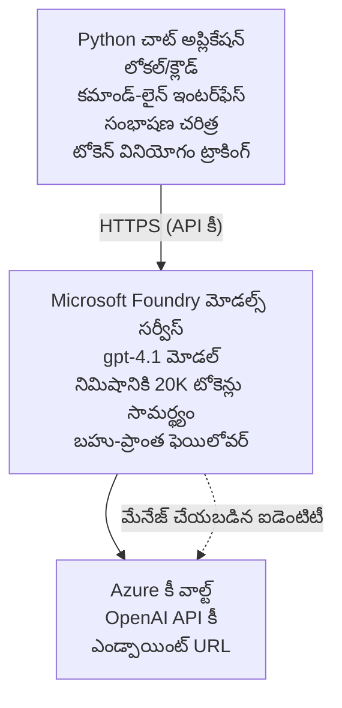

# Microsoft Foundry Models Chat Application

**Learning Path:** Intermediate ⭐⭐ | **Time:** 35-45 minutes | **Cost:** $50-200/month

A complete Microsoft Foundry Models chat application deployed using Azure Developer CLI (azd). This example demonstrates gpt-4.1 deployment, secure API access, and a simple chat interface.

## 🎯 What You'll Learn

- Deploy Microsoft Foundry Models Service with gpt-4.1 model
- Secure OpenAI API keys with Key Vault
- Build a simple chat interface with Python
- Monitor token usage and costs
- Implement rate limiting and error handling

## 📦 What's Included

✅ **Microsoft Foundry Models Service** - gpt-4.1 model deployment  
✅ **Python Chat App** - Simple command-line chat interface  
✅ **Key Vault Integration** - Secure API key storage  
✅ **ARM Templates** - Complete infrastructure as code  
✅ **Cost Monitoring** - Token usage tracking  
✅ **Rate Limiting** - Prevent quota exhaustion  

## Architecture



## Prerequisites

### Required

- **Azure Developer CLI (azd)** - [Install guide](https://learn.microsoft.com/azure/developer/azure-developer-cli/install-azd)
- **Azure subscription** with OpenAI access - [Request access](https://aka.ms/oai/access)
- **Python 3.9+** - [Install Python](https://www.python.org/downloads/)

### Verify Prerequisites

```bash
# azd సంస్కరణను తనిఖీ చేయండి (1.5.0 లేదా అంతకంటే ఉన్నతమైనది అవసరం)
azd version

# Azure లాగిన్‌ను ధృవీకరించండి
azd auth login

# Python సంస్కరణను తనిఖీ చేయండి
python --version  # లేదా python3 --version

# OpenAI యాక్సెస్‌ను ధృవీకరించండి (Azure పోర్టల్‌లో తనిఖీ చేయండి)
az cognitiveservices account list-skus \
  --kind OpenAI \
  --location eastus
```

> **⚠️ Important:** Microsoft Foundry Models requires application approval. If you haven't applied, visit [aka.ms/oai/access](https://aka.ms/oai/access). Approval typically takes 1-2 business days.

## ⏱️ Deployment Timeline

| Phase | Duration | What Happens |
|-------|----------|--------------|
| Prerequisites check | 2-3 minutes | Verify OpenAI quota availability |
| Deploy infrastructure | 8-12 minutes | Create OpenAI, Key Vault, model deployment |
| Configure application | 2-3 minutes | Set up environment and dependencies |
| **Total** | **12-18 minutes** | Ready to chat with gpt-4.1 |

**Note:** First-time OpenAI deployment may take longer due to model provisioning.

## Quick Start

```bash
# ఉదాహరణకు వెళ్లండి
cd examples/azure-openai-chat

# పర్యావరణాన్ని ప్రారంభించండి
azd env new myopenai

# అన్నింటినీ అమలు చేయండి (ఇన్‌ఫ్రాస్ట్రక్చర్ + కాన్ఫిగరేషన్)
azd up
# మీకు ఈ క్రింద చర్యలు అడిగబడతాయి:
# 1. Azure చందాను ఎంచుకోండి
# 2. OpenAI అందుబాటులో ఉన్న ప్రాంతాన్ని ఎంచుకోండి (ఉదా: eastus, eastus2, westus)
# 3. డిప్లాయ్‌మెంట్ కోసం 12-18 నిమిషాలు వేచి ఉండండి

# Python డిపెండెన్సీలను ఇన్‌స్టాల్ చేయండి
pip install -r requirements.txt

# చాట్ ప్రారంభించండి!
python chat.py
```

**Expected Output:**
```
🤖 Microsoft Foundry Models Chat Application
Connected to: gpt-4.1 (eastus)
Type your message (or 'quit' to exit)

You: Hello! Tell me about Microsoft Foundry Models.
Assistant: Microsoft Foundry Models Service provides REST API access to OpenAI's powerful language models including gpt-4.1, GPT-3.5-Turbo, and Embeddings...

[Tokens used: 145 | Estimated cost: $0.0044]
```

## ✅ Verify Deployment

### Step 1: Check Azure Resources

```bash
# డిప్లాయ్ చేయబడిన వనరులను చూడండి
azd show

# అనుకుంటున్న అవుట్‌పుట్ ఇలా ఉంటుంది:
# - OpenAI సేవ: (వనరు పేరు)
# - కీ వాల్ట్: (వనరు పేరు)
# - డిప్లాయ్‌మెంట్: gpt-4.1
# - ప్రాంతం: eastus (లేదా మీరు ఎంచుకున్న రీజియన్)
```

### Step 2: Test OpenAI API

```bash
# OpenAI ఎండ్‌పాయింట్ మరియు కీ పొందండి
OPENAI_ENDPOINT=$(azd env get-value AZURE_OPENAI_ENDPOINT)
OPENAI_KEY=$(azd env get-value AZURE_OPENAI_API_KEY)

# API కాల్‌ను పరీక్షించండి
curl "$OPENAI_ENDPOINT/openai/deployments/gpt-4.1/chat/completions?api-version=2024-08-01-preview" \
  -H "Content-Type: application/json" \
  -H "api-key: $OPENAI_KEY" \
  -d '{
    "messages": [{"role": "user", "content": "Say hello!"}],
    "max_tokens": 50
  }'
```

**Expected Response:**
```json
{
  "choices": [
    {
      "message": {
        "role": "assistant",
        "content": "Hello! How can I assist you today?"
      }
    }
  ],
  "usage": {
    "prompt_tokens": 8,
    "completion_tokens": 9,
    "total_tokens": 17
  }
}
```

### Step 3: Verify Key Vault Access

```bash
# Key Vaultలోని రహస్యాలను జాబితా చేయండి
KV_NAME=$(azd env get-value AZURE_KEY_VAULT_NAME)

az keyvault secret list \
  --vault-name $KV_NAME \
  --query "[].name" \
  --output table
```

**Expected Secrets:**
- `openai-api-key`
- `openai-endpoint`

**Success Criteria:**
- ✅ OpenAI service deployed with gpt-4.1
- ✅ API call returns valid completion
- ✅ Secrets stored in Key Vault
- ✅ Token usage tracking works

## Project Structure

```
azure-openai-chat/
├── README.md                   ✅ This guide
├── azure.yaml                  ✅ AZD configuration
├── infra/                      ✅ Infrastructure as Code
│   ├── main.bicep             ✅ Main Bicep template
│   ├── main.parameters.json   ✅ Parameters
│   └── openai.bicep           ✅ OpenAI resource definition
├── src/                        ✅ Application code
│   ├── chat.py                ✅ Chat interface
│   ├── config.py              ✅ Configuration loader
│   └── requirements.txt       ✅ Python dependencies
└── .gitignore                  ✅ Git ignore rules
```

## Application Features

### Chat Interface (`chat.py`)

The chat application includes:

- **Conversation History** - Maintains context across messages
- **Token Counting** - Tracks usage and estimates costs
- **Error Handling** - Graceful handling of rate limits and API errors
- **Cost Estimation** - Real-time cost calculation per message
- **Streaming Support** - Optional streaming responses

### Commands

While chatting, you can use:
- `quit` or `exit` - End the session
- `clear` - Clear conversation history
- `tokens` - Show total token usage
- `cost` - Show estimated total cost

### Configuration (`config.py`)

Loads configuration from environment variables:
```python
AZURE_OPENAI_ENDPOINT  # కీ వాల్ట్ నుండి
AZURE_OPENAI_API_KEY   # కీ వాల్ట్ నుండి
AZURE_OPENAI_MODEL     # డిఫాల్ట్: gpt-4.1
AZURE_OPENAI_MAX_TOKENS # డిఫాల్ట్: 800
```

## Usage Examples

### Basic Chat

```bash
python chat.py
```

### Chat with Custom Model

```bash
export AZURE_OPENAI_MODEL=gpt-35-turbo
python chat.py
```

### Chat with Streaming

```bash
python chat.py --stream
```

### Example Conversation

```
You: Explain Microsoft Foundry Models Service in 3 sentences.
Assistant: Microsoft Foundry Models Service is Microsoft Azure's cloud platform offering 
that provides access to OpenAI's powerful language models. It enables developers 
to integrate capabilities like gpt-4.1 into their applications with enterprise-grade 
security and compliance. The service includes features for content filtering, 
abuse monitoring, and responsible AI practices.

[Tokens used: 89 | Estimated cost: $0.0027]

You: What models are available?
Assistant: Microsoft Foundry Models Service offers several model families including gpt-4.1 
(most capable), GPT-3.5-Turbo (faster and cost-effective), and Embeddings models 
for vector search. Each model has different capabilities, pricing, and token limits.

[Tokens used: 67 | Estimated cost: $0.0020]

Total session: 156 tokens | $0.0047
```

## Cost Management

### Token Pricing (gpt-4.1)

| Model | Input (per 1K tokens) | Output (per 1K tokens) |
|-------|----------------------|------------------------|
| gpt-4.1 | $0.03 | $0.06 |
| GPT-3.5-Turbo | $0.0015 | $0.002 |

### Estimated Monthly Costs

Based on usage patterns:

| Usage Level | Messages/Day | Tokens/Day | Monthly Cost |
|-------------|--------------|------------|--------------|
| **Light** | 20 messages | 3,000 tokens | $3-5 |
| **Moderate** | 100 messages | 15,000 tokens | $15-25 |
| **Heavy** | 500 messages | 75,000 tokens | $75-125 |

**Base Infrastructure Cost:** $1-2/month (Key Vault + minimal compute)

### Cost Optimization Tips

```bash
# 1. సరళమైన పనుల కోసం GPT-3.5-Turbo ఉపయోగించండి (20 రెట్లు తక్కువ ఖర్చు)
export AZURE_OPENAI_MODEL=gpt-35-turbo

# 2. చిన్న ప్రతిస్పందనల కోసం గరిష్ట టోకెన్లను తగ్గించండి
export AZURE_OPENAI_MAX_TOKENS=400

# 3. టోకెన్ వినియోగాన్ని పర్యవేక్షించండి
python chat.py --show-tokens

# 4. బడ్జెట్ హెచ్చరికలు అమర్చండి
az consumption budget create \
  --budget-name "openai-budget" \
  --amount 50 \
  --time-grain Monthly
```

## Monitoring

### View Token Usage

```bash
# Azure పోర్టల్‌లో:
# OpenAI వనరు → మెట్రిక్స్ → "టోకెన్ లావాదేవీ" ఎంచుకోండి

# లేదా Azure CLI ద్వారా:
az monitor metrics list \
  --resource $(azd env get-value AZURE_OPENAI_RESOURCE_ID) \
  --metric "TokenTransaction" \
  --start-time $(date -u -d '1 hour ago' '+%Y-%m-%dT%H:%M:%S') \
  --interval PT1M
```

### View API Logs

```bash
# డయాగ్నోస్టిక్ లాగ్‌లను స్ట్రీమ్ చేయండి
az monitor diagnostic-settings create \
  --resource $(azd env get-value AZURE_OPENAI_RESOURCE_ID) \
  --name openai-logs \
  --logs '[{"category": "Audit", "enabled": true}]' \
  --workspace $(azd env get-value LOG_ANALYTICS_WORKSPACE_ID)

# క్వెరీ లాగ్‌లు
az monitor log-analytics query \
  --workspace $(azd env get-value LOG_ANALYTICS_WORKSPACE_ID) \
  --analytics-query "AzureDiagnostics | where Category == 'Audit' | top 10 by TimeGenerated"
```

## Troubleshooting

### Issue: "Access Denied" Error

**Symptoms:** 403 Forbidden when calling API

**Solutions:**
```bash
# 1. OpenAI యాక్సెస్ ఆమోదమై ఉందని నిర్ధారించండి
az cognitiveservices account show \
  --name $(azd env get-value AZURE_OPENAI_NAME) \
  --resource-group $(azd env get-value AZURE_RESOURCE_GROUP)

# 2. API కీ సరైనదో తనిఖీ చేయండి
azd env get-value AZURE_OPENAI_API_KEY

# 3. ఎండ్‌పాయింట్ URL ఫార్మాట్ సరైనదో నిర్ధారించండి
azd env get-value AZURE_OPENAI_ENDPOINT
# ఇది ఇలా ఉండాలి: https://[name].openai.azure.com/
```

### Issue: "Rate Limit Exceeded"

**Symptoms:** 429 Too Many Requests

**Solutions:**
```bash
# 1. ప్రస్తుత కోటాను తనిఖీ చేయండి
az cognitiveservices account deployment show \
  --name $(azd env get-value AZURE_OPENAI_NAME) \
  --resource-group $(azd env get-value AZURE_RESOURCE_GROUP) \
  --deployment-name gpt-4.1

# 2. కోటా పెంపును అభ్యర్థించండి (అవసరమైతే)
# Azure పోర్టల్‌కు వెళ్లండి → OpenAI రిసోర్స్ → కోటాలు → పెంపు అభ్యర్థించండి

# 3. రీట్రై లాజిక్ అమలు చేయండి (ఇది ఇప్పటికే chat.pyలో ఉంది)
# అప్లికేషన్ స్వయంచాలకంగా ఎక్స్‌పోనెన్షియల్ బ్యాకాఫ్‌తో పునఃప్రయత్నిస్తుంది
```

### Issue: "Model Not Found"

**Symptoms:** 404 error for deployment

**Solutions:**
```bash
# 1. అందుబాటులో ఉన్న డిప్లాయ్‌మెంట్లను జాబితా చేయండి
az cognitiveservices account deployment list \
  --name $(azd env get-value AZURE_OPENAI_NAME) \
  --resource-group $(azd env get-value AZURE_RESOURCE_GROUP)

# 2. ఎన్విరాన్‌మెంట్‌లో మోడల్ పేరు ధృవీకరించండి
echo $AZURE_OPENAI_MODEL

# 3. సరైన డిప్లాయ్‌మెంట్ పేరుకు నవీకరించండి
export AZURE_OPENAI_MODEL=gpt-4.1  # లేదా gpt-35-turbo
```

### Issue: High Latency

**Symptoms:** Slow response times (>5 seconds)

**Solutions:**
```bash
# 1. ప్రాంతీయ లేటెన్సీ తనిఖీ చేయండి
# వినియోగదారులకు అత్యంత సమీపమైన ప్రాంతంలో డిప్లాయ్ చేయండి

# 2. వేగవంతమైన స్పందనల కోసం max_tokens ను తగ్గించండి
export AZURE_OPENAI_MAX_TOKENS=400

# 3. మెరుగైన వినియోగదారు అనుభవానికి స్ట్రీమింగ్ ఉపయోగించండి
python chat.py --stream
```

## Security Best Practices

### 1. Protect API Keys

```bash
# సోర్స్ కంట్రోల్‌లో కీలు ఎప్పుడూ కమిట్ చేయకండి
# Key Vault ను ఉపయోగించండి (ఇప్పటికే కాన్ఫిగర్ చేయబడింది)

# కీలను తరచుగా మార్చండి
az cognitiveservices account keys regenerate \
  --name $(azd env get-value AZURE_OPENAI_NAME) \
  --resource-group $(azd env get-value AZURE_RESOURCE_GROUP) \
  --key-name key1
```

### 2. Implement Content Filtering

```python
# Microsoft Foundry Modelsలో అంతర్నిర్మిత కంటెంట్ ఫిల్టరింగ్ ఉంది
# Azure పోర్టల్‌లో కాన్ఫిగర్ చేయండి:
# OpenAI వనరు → కంటెంట్ ఫిల్టర్లు → కస్టమ్ ఫిల్టర్ సృష్టించండి

# వర్గాలు: ద్వేషం, లైంగిక, హింస, స్వీయ హాని
# స్థాయిలु: తక్కువ, మాధ్యమ, అధిక ఫిల్టరింగ్
```

### 3. Use Managed Identity (Production)

```bash
# ఉత్పత్తి డిప్లాయ్‌మెంట్స్ కోసం నిర్వహిత గుర్తింపును ఉపయోగించండి
# API కీలు బదులుగా (Azureలో యాప్ హోస్టింగ్ అవసరం)

# infra/openai.bicepను క్రిందివి చేర్చేలా నవీకరించండి:
# identity: { type: 'SystemAssigned' }
```

## Development

### Run Locally

```bash
# అవలంబనలను ఇన్‌స్టాల్ చేయండి
pip install -r src/requirements.txt

# పర్యావరణ చరాలను సెట్ చేయండి
export AZURE_OPENAI_ENDPOINT="https://[name].openai.azure.com/"
export AZURE_OPENAI_API_KEY="your-api-key"
export AZURE_OPENAI_MODEL="gpt-4.1"

# అనువర్తనాన్ని నడపండి
python src/chat.py
```

### Run Tests

```bash
# పరీక్ష కోసం ఆధారాలను ఇన్‌స్టాల్ చేయండి
pip install pytest pytest-cov

# టెస్ట్‌లను నడపండి
pytest tests/ -v

# కవరేజ్‌తో
pytest tests/ --cov=src --cov-report=html
```

### Update Model Deployment

```bash
# వేరే మోడల్ వెర్షన్‌ను డిప్లాయ్ చేయండి
az cognitiveservices account deployment create \
  --name $(azd env get-value AZURE_OPENAI_NAME) \
  --resource-group $(azd env get-value AZURE_RESOURCE_GROUP) \
  --deployment-name gpt-35-turbo \
  --model-name gpt-35-turbo \
  --model-version "0613" \
  --model-format OpenAI \
  --sku-capacity 20 \
  --sku-name "Standard"
```

## Clean Up

```bash
# అన్ని Azure వనరులను తొలగించండి
azd down --force --purge

# ఇది తొలగిస్తుంది:
# - OpenAI సేవ
# - కీ వాల్ట్ (90-రోజుల సాఫ్ట్ డిలీట్‌తో)
# - రిసోర్స్ గ్రూప్
# - అన్ని డిప్లాయ్‌మెంట్లు మరియు కాన్ఫిగరేషన్లు
```

## Next Steps

### Expand This Example

1. **Add Web Interface** - Build React/Vue frontend
   ```bash
   # azure.yamlకి ఫ్రంట్‌ఎండ్ సేవను జోడించండి
   # Azure Static Web Appsకు డిప్లాయ్ చేయండి
   ```

2. **Implement RAG** - Add document search with Azure AI Search
   ```python
   # Azure AI Search ని సమీకరించండి
   # పత్రాలను అప్లోడ్ చేసి వెక్టర్ సూచికను సృష్టించండి
   ```

3. **Add Function Calling** - Enable tool use
   ```python
   # chat.py లో ఫంక్షనులను నిర్వచించండి
   # gpt-4.1 కి బాహ్య APIలను పిలవడానికి అనుమతించండి
   ```

4. **Multi-Model Support** - Deploy multiple models
   ```bash
   # gpt-35-turbo మరియు ఎంబెడ్డింగ్ మోడల్స్‌ను జోడించండి
   # మోడల్ రూటింగ్ తర్కాన్ని అమలు చేయండి
   ```

### Related Examples

- **[Retail Multi-Agent](../retail-scenario.md)** - Advanced multi-agent architecture
- **[Database App](../../../../examples/database-app)** - Add persistent storage
- **[Container Apps](../../../../examples/container-app)** - Deploy as containerized service

### Learning Resources

- 📚 [AZD For Beginners Course](../../README.md) - Main course home
- 📚 [Microsoft Foundry Models Documentation](https://learn.microsoft.com/azure/ai-services/openai/) - Official docs
- 📚 [OpenAI API Reference](https://platform.openai.com/docs/api-reference) - API details
- 📚 [Responsible AI](https://www.microsoft.com/ai/responsible-ai) - Best practices

## Additional Resources

### Documentation
- **[Microsoft Foundry Models Service](https://learn.microsoft.com/azure/ai-services/openai/)** - Complete guide
- **[gpt-4.1 Models](https://learn.microsoft.com/azure/ai-services/openai/concepts/models)** - Model capabilities
- **[Content Filtering](https://learn.microsoft.com/azure/ai-services/openai/concepts/content-filter)** - Safety features
- **[Azure Developer CLI](https://learn.microsoft.com/azure/developer/azure-developer-cli/)** - azd reference

### Tutorials
- **[OpenAI Quickstart](https://learn.microsoft.com/azure/ai-services/openai/quickstart)** - First deployment
- **[Chat Completions](https://learn.microsoft.com/azure/ai-services/openai/how-to/chatgpt)** - Building chat apps
- **[Function Calling](https://learn.microsoft.com/azure/ai-services/openai/how-to/function-calling)** - Advanced features

### Tools
- **[Microsoft Foundry Models Studio](https://oai.azure.com/)** - Web-based playground
- **[Prompt Engineering Guide](https://platform.openai.com/docs/guides/prompt-engineering)** - Writing better prompts
- **[Token Calculator](https://platform.openai.com/tokenizer)** - Estimate token usage

### Community
- **[Azure AI Discord](https://discord.gg/azure)** - Get help from community
- **[GitHub Discussions](https://github.com/Azure-Samples/openai/discussions)** - Q&A forum
- **[Azure Blog](https://azure.microsoft.com/blog/tag/azure-openai-service/)** - Latest updates

---

**🎉 Success!** You've deployed Microsoft Foundry Models and built a working chat application. Start exploring gpt-4.1's capabilities and experiment with different prompts and use cases.

**Questions?** [Open an issue](https://github.com/microsoft/AZD-for-beginners/issues) or check the [FAQ](../../resources/faq.md)

**Cost Alert:** Remember to run `azd down` when done testing to avoid ongoing charges (~$50-100/month for active usage).

---

<!-- CO-OP TRANSLATOR DISCLAIMER START -->
**అస్వీకరణ**:
ఈ పత్రం AI అనువాద సేవ [Co-op Translator](https://github.com/Azure/co-op-translator) ఉపయోగించి అనువదించబడింది. మేము ఖచ్చితత్వానికి ప్రయత్నిస్తున్నప్పటికీ, ఆటోమేటెడ్ అనువాదాలు తప్పులు లేదా అసమగ్రతలను కలిగి ఉండవచ్చు. దాని స్వదేశ భాషలో ఉన్న అసలు పత్రాన్ని అధికారం కలిగిన మూలంగా పరిగణించాలి. కీలకమైన సమాచారం కోసం, ప్రొఫెషనల్ మానవ అనువాదాన్ని సిఫారసు చేస్తాము. ఈ అనువాదం ఉపయోగం వల్ల కలిగే ఏవైనా అపార్థాలు లేదా తప్పుదారులు కోసం మేము బాధ్యత వహించము.
<!-- CO-OP TRANSLATOR DISCLAIMER END -->