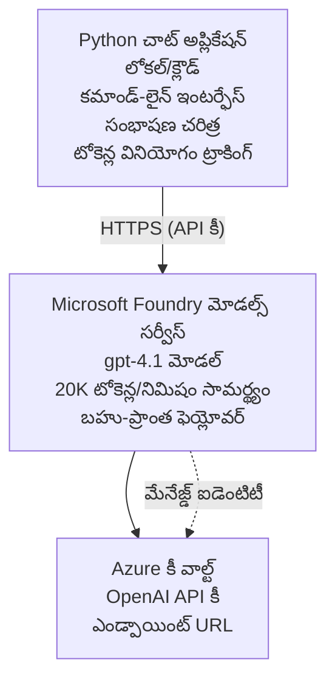

# Microsoft Foundry Models చాట్ అప్లికేషన్

**Learning Path:** మధ్యస్థ ⭐⭐ | **Time:** 35-45 minutes | **Cost:** $50-200/month

Azure Developer CLI (azd) ఉపయోగించి డిప్లాయ్ చేయబడిన పూర్తి Microsoft Foundry Models చాట్ అప్లికేషన్. ఈ ఉదాహరణ gpt-4.1 డిప్లాయ్‌మెంట్, సురక్షిత API యాక్సెస్, మరియు ఒక సాదాసీదాగా చాట్ ఇంటర్‌ఫేస్‌ను చూపిస్తుంది.

## 🎯 మీరు ఏమి నేర్చుకుంటారు

- gpt-4.1 మోడల్‌తో Microsoft Foundry Models సర్వీస్‌ను డిప్లాయ్ చేయడం
- Key Vault ద్వారా OpenAI API కీలు సురక్షితంగా నిల్వ చేయడం
- Python ఉపయోగించి ఒక సాధారణ చాట్ ఇంటర్‌ఫేస్ నిర్మించడం
- టోకెన్ వినియోగం మరియు ఖర్చులను మానిటర్ చేయడం
- రేట్ లిమిటింగ్ మరియు ఎర్రర్ హ్యాండ్లింగ్ అమలు చేయడం

## 📦 ఇందులో ఏమి ఉంది

✅ **Microsoft Foundry Models Service** - gpt-4.1 మోడల్ డిప్లాయ్‌మెంట్  
✅ **Python Chat App** - సాధారణ కమాండ్-లైన్ చాట్ ఇంటర్‌ఫేస్  
✅ **Key Vault Integration** - API కీలు సురక్షిత నిల్వ  
✅ **ARM Templates** - కోడ్ రూపంలో పూర్తి ఇన్‌ఫ్రాస్ట్రక్చర్  
✅ **Cost Monitoring** - టోకెన్ వినియోగ ట్రాకింగ్  
✅ **Rate Limiting** - ఖోయోటా తుక్కుమాట్లను నివారించడానికి

## Architecture


##Prerequisites

### Required

- **Azure Developer CLI (azd)** - [Install guide](https://learn.microsoft.com/azure/developer/azure-developer-cli/install-azd)
- **Azure subscription** with OpenAI access - [Request access](https://aka.ms/oai/access)
- **Python 3.9+** - [Install Python](https://www.python.org/downloads/)

### Verify Prerequisites

```bash
# azd వెర్షన్‌ను తనిఖీ చేయండి (1.5.0 లేదా అంతకు పైగా అవసరం)
azd version

# Azure లాగిన్‌ను ధృవీకరించండి
azd auth login

# Python వెర్షన్‌ను తనిఖీ చేయండి
python --version  # లేదా python3 --version

# OpenAI యాక్సెస్‌ను ధృవీకరించండి (Azure పోర్టల్‌లో తనిఖీ చేయండి)
az cognitiveservices account list-skus \
  --kind OpenAI \
  --location eastus
```

> **⚠️ ముఖ్యమైనది:** Microsoft Foundry Models కోసం అనువర్తన ఆమోదం అవసరం. మీరు దరఖాస్తు చేయలేదు అయితే, సందర్శించండి [aka.ms/oai/access](https://aka.ms/oai/access). ఆమోదం సాధారణంగా 1-2 పనిదినాలు పట్టుతుంది.

## ⏱️ డిప్లాయ్‌మెంట్ టైమ్‌లైన్

| Phase | Duration | What Happens |
|-------|----------|--------------|
| Prerequisites check | 2-3 minutes | OpenAI కోటా అందుబాటును నిర్ధారించడం |
| Deploy infrastructure | 8-12 minutes | OpenAI, Key Vault, మోడల్ డిప్లాయ్‌మెంట్ సృష్టించడం |
| Configure application | 2-3 minutes | పర్యావరణం మరియు డిపెండెన్సీలను సెటప్ చేయడం |
| **Total** | **12-18 minutes** | gpt-4.1 తో చాట్ చెలామణి కోసం సిద్ధం |

**గమనిక:** మొదటిసారిగా OpenAI డిప్లాయ్‌మెంట్ మోడల్ ప్రొవిజనింగ్ కారణంగా ఎక్కువ సమయం పట్టవచ్చు.

## Quick Start

```bash
# ఉదాహరణకు వెళ్లండి
cd examples/azure-openai-chat

# పరిసరాన్ని ప్రారంభించండి
azd env new myopenai

# అన్నింటినీ పంపిణీ చేయండి (ఇన్ఫ్రాస్ట్రక్చర్ + కాన్ఫిగరేషన్)
azd up
# మీకు ఈ క్రింది విషయాలు అడగబడతాయి:
# 1. Azure సబ్‌స్క్రిప్షన్ ఎంచుకోండి
# 2. OpenAI అందుబాటులో ఉన్న ప్రాంతాన్ని ఎంచుకోండి (ఉదాహరణకు: eastus, eastus2, westus)
# 3. డిప్లాయ్‌మెంట్ కోసం 12-18 నిమిషాలు వేచి ఉండండి

# Python అనుబంధాలు ఇన్‌స్టాల్ చేయండి
pip install -r requirements.txt

# చాట్ చేయడం ప్రారంభించండి!
python chat.py
```

**అంచనా ఫలితం:**
```
🤖 Microsoft Foundry Models Chat Application
Connected to: gpt-4.1 (eastus)
Type your message (or 'quit' to exit)

You: Hello! Tell me about Microsoft Foundry Models.
Assistant: Microsoft Foundry Models Service provides REST API access to OpenAI's powerful language models including gpt-4.1, GPT-3.5-Turbo, and Embeddings...

[Tokens used: 145 | Estimated cost: $0.0044]
```

## ✅ డిప్లాయ్‌మెంట్‌ని నిర్ధారించండి

### Step 1: Azure వనరులను తనిఖీ చేయండి

```bash
# డిప్లాయ్ చేయబడిన వనరులను వీక్షించండి
azd show

# అంచనా ఫలితం చూపిస్తుంది:
# - OpenAI సేవ: (వనరు పేరు)
# - Key Vault: (వనరు పేరు)
# - డిప్లాయ్‌మెంట్: gpt-4.1
# - ప్రాంతం: eastus (లేదా మీరు ఎంచుకున్న ప్రాంతం)
```

### Step 2: OpenAI APIని పరీక్షించండి

```bash
# OpenAI ఎండ్‌పాయింట్ మరియు కీ పొందండి
OPENAI_ENDPOINT=$(azd env get-value AZURE_OPENAI_ENDPOINT)
OPENAI_KEY=$(azd env get-value AZURE_OPENAI_API_KEY)

# API కాల్‌ను పరీక్షించండి
curl "$OPENAI_ENDPOINT/openai/deployments/gpt-4.1/chat/completions?api-version=2024-08-01-preview" \
  -H "Content-Type: application/json" \
  -H "api-key: $OPENAI_KEY" \
  -d '{
    "messages": [{"role": "user", "content": "Say hello!"}],
    "max_tokens": 50
  }'
```

**అంచనా ప్రతిస్పందన:**
```json
{
  "choices": [
    {
      "message": {
        "role": "assistant",
        "content": "Hello! How can I assist you today?"
      }
    }
  ],
  "usage": {
    "prompt_tokens": 8,
    "completion_tokens": 9,
    "total_tokens": 17
  }
}
```

### Step 3: Key Vault యాక్సెస్‌ను నిర్ధారించండి

```bash
# Key Vaultలో రహస్యాలను జాబితా చేయండి
KV_NAME=$(azd env get-value AZURE_KEY_VAULT_NAME)

az keyvault secret list \
  --vault-name $KV_NAME \
  --query "[].name" \
  --output table
```

**అంచనా రహస్యాలు:**
- `openai-api-key`
- `openai-endpoint`

**విజయ ప్రమాణాలు:**
- ✅ gpt-4.1 తో OpenAI సర్వీస్ డిప్లాయ్ చేయబడింది
- ✅ API కాల్ చెలామణీగా సరైన పూర్తి జవాబు ఇస్తుంది
- ✅ రహస్యాలు Key Vaultలో నిల్వ చేయబడ్డాయి
- ✅ టోకెన్ వినియోగ ట్రాకింగ్ పనిచేస్తుంది

## Project Structure

```
azure-openai-chat/
├── README.md                   ✅ This guide
├── azure.yaml                  ✅ AZD configuration
├── infra/                      ✅ Infrastructure as Code
│   ├── main.bicep             ✅ Main Bicep template
│   ├── main.parameters.json   ✅ Parameters
│   └── openai.bicep           ✅ OpenAI resource definition
├── src/                        ✅ Application code
│   ├── chat.py                ✅ Chat interface
│   ├── config.py              ✅ Configuration loader
│   └── requirements.txt       ✅ Python dependencies
└── .gitignore                  ✅ Git ignore rules
```

## అప్లికేషన్ ఫీచర్లు

### Chat Interface (`chat.py`)

చాట్ అప్లికేషన్‌లో ఇవి ఉన్నాయి:

- **Conversation History** - సందేశాల మధ్య контекст‌ను (context) నిలుపుతుంది
- **Token Counting** - వాడకాన్ని ట్రాక్ చేసి ఖర్చులను అంచనా వేస్తుంది
- **Error Handling** - రేట్ లిమిట్స్ మరియు API లోపాలను శాంతంగా నిర్వహిస్తుంది
- **Cost Estimation** - ప్రతి సందేశానికి రియల్-టైమ్ ఖర్చు లెక్కింపు
- **Streaming Support** - ఐచ్ఛిక స్ట్రీమింగ్ ప్రతిస్పందనలు

### Commands

చాటింగ్ చేస్తున్నప్పుడు, మీరు ఉపయోగించవచ్చు:
- `quit` or `exit` - సెషన్‌ను ముగించండి
- `clear` - సంభాషణ చరిత్రను శుభ్రం చేయండి
- `tokens` - మొత్తం టోకెన్ వాడకాన్ని చూపించు
- `cost` - అంచనా మొత్తం ఖర్చును చూపించు

### Configuration (`config.py`)

ఎన్విరాన్ మెంట్ వేరియబుల్స్ నుండి కాన్ఫిగరేషన్‌ను లోడ్ చేయబడుతుంది:
```python
AZURE_OPENAI_ENDPOINT  # కీ వాల్ట్ నుండి
AZURE_OPENAI_API_KEY   # కీ వాల్ట్ నుండి
AZURE_OPENAI_MODEL     # డిఫాల్ట్: gpt-4.1
AZURE_OPENAI_MAX_TOKENS # డిఫాల్ట్: 800
```

## ఉపయోగ ఉదాహరణలు

### Basic Chat

```bash
python chat.py
```

### Custom Model తో చాట్

```bash
export AZURE_OPENAI_MODEL=gpt-35-turbo
python chat.py
```

### Streaming తో చాట్

```bash
python chat.py --stream
```

### ఉదాహరణ సంభాషణ

```
You: Explain Microsoft Foundry Models Service in 3 sentences.
Assistant: Microsoft Foundry Models Service is Microsoft Azure's cloud platform offering 
that provides access to OpenAI's powerful language models. It enables developers 
to integrate capabilities like gpt-4.1 into their applications with enterprise-grade 
security and compliance. The service includes features for content filtering, 
abuse monitoring, and responsible AI practices.

[Tokens used: 89 | Estimated cost: $0.0027]

You: What models are available?
Assistant: Microsoft Foundry Models Service offers several model families including gpt-4.1 
(most capable), GPT-3.5-Turbo (faster and cost-effective), and Embeddings models 
for vector search. Each model has different capabilities, pricing, and token limits.

[Tokens used: 67 | Estimated cost: $0.0020]

Total session: 156 tokens | $0.0047
```

## ఖర్చు నిర్వహణ

### టోకెన్ ధరలు (gpt-4.1)

| Model | Input (per 1K tokens) | Output (per 1K tokens) |
|-------|----------------------|------------------------|
| gpt-4.1 | $0.03 | $0.06 |
| GPT-3.5-Turbo | $0.0015 | $0.002 |

### అంచనా నెలవారీ ఖర్చులు

వాడుక నమూనాల ఆధారంగా:

| Usage Level | Messages/Day | Tokens/Day | Monthly Cost |
|-------------|--------------|------------|--------------|
| **Light** | 20 messages | 3,000 tokens | $3-5 |
| **Moderate** | 100 messages | 15,000 tokens | $15-25 |
| **Heavy** | 500 messages | 75,000 tokens | $75-125 |

**ప్రాథమిక ఇన్‌ఫ్రాస్ట్రక్చర్ ఖర్చు:** $1-2/month (Key Vault + minimal compute)

### ఖర్చు తగ్గించే సూచనలు

```bash
# 1. సులభమైన పనులకు GPT-3.5-Turbo ఉపయోగించండి (20 రెట్లు చౌకగా)
export AZURE_OPENAI_MODEL=gpt-35-turbo

# 2. సంక్షిప్త సమాధానాల కోసం గరిష్ట టోకెన్లను తగ్గించండి
export AZURE_OPENAI_MAX_TOKENS=400

# 3. టోకెన్ వినియోగాన్ని పర్యవేక్షించండి
python chat.py --show-tokens

# 4. బడ్జెట్ హెచ్చరికలు అమర్చండి
az consumption budget create \
  --budget-name "openai-budget" \
  --amount 50 \
  --time-grain Monthly
```

## మానిటరింగ్

### టోకెన్ వాడకాన్ని చూడండి

```bash
# Azure పోర్టల్‌లో:
# OpenAI వనరు → మెట్రిక్స్ → "టోకెన్ లావాదేవి"ను ఎంచుకోండి

# లేదా Azure CLI ద్వారా:
az monitor metrics list \
  --resource $(azd env get-value AZURE_OPENAI_RESOURCE_ID) \
  --metric "TokenTransaction" \
  --start-time $(date -u -d '1 hour ago' '+%Y-%m-%dT%H:%M:%S') \
  --interval PT1M
```

### API లాగ్‌లను చూడండి

```bash
# స్ట్రీమ్ డయాగ్నోస్టిక్ లాగ్‌లు
az monitor diagnostic-settings create \
  --resource $(azd env get-value AZURE_OPENAI_RESOURCE_ID) \
  --name openai-logs \
  --logs '[{"category": "Audit", "enabled": true}]' \
  --workspace $(azd env get-value LOG_ANALYTICS_WORKSPACE_ID)

# క్వెరీ లాగ్‌లు
az monitor log-analytics query \
  --workspace $(azd env get-value LOG_ANALYTICS_WORKSPACE_ID) \
  --analytics-query "AzureDiagnostics | where Category == 'Audit' | top 10 by TimeGenerated"
```

## సమస్య పరిష్కారం

### సమస్య: "Access Denied" లోపం

**లక్షణాలు:** APIకి కాల్ చేసినప్పుడు 403 Forbidden

**పరిష్కారాలు:**
```bash
# 1. OpenAI యాక్సెస్ ఆమోదించబడిందో నిర్ధారించండి
az cognitiveservices account show \
  --name $(azd env get-value AZURE_OPENAI_NAME) \
  --resource-group $(azd env get-value AZURE_RESOURCE_GROUP)

# 2. API కీ సరైనదో తనిఖీ చేయండి
azd env get-value AZURE_OPENAI_API_KEY

# 3. ఎండ్‌పాయింట్ URL ఫార్మాట్‌ను ధృవీకరించండి
azd env get-value AZURE_OPENAI_ENDPOINT
# ఇలా ఉండాలి: https://[name].openai.azure.com/
```

### సమస్య: "Rate Limit Exceeded"

**లక్షణాలు:** 429 Too Many Requests

**పరిష్కారాలు:**
```bash
# 1. ప్రస్తుత క్వోటాను తనిఖీ చేయండి
az cognitiveservices account deployment show \
  --name $(azd env get-value AZURE_OPENAI_NAME) \
  --resource-group $(azd env get-value AZURE_RESOURCE_GROUP) \
  --deployment-name gpt-4.1

# 2. క్వోటా పెంపును అభ్యర్థించండి (అవసరమైతే)
# Azure పోర్టల్‌కి వెళ్లి → OpenAI రిసోర్స్ → క్వోటాలు → పెంపును అభ్యర్థించండి

# 3. రిట్రై లాజిక్ అమలు చేయండి (ఇది ఇప్పటికే chat.py లో ఉంది)
# అప్లికేషన్ స్వయంచాలకంగా ఎక్స్‌పోనెన్షియల్ బ్యాక్ ఆఫ్‌తో రిట్రై చేస్తుంది
```

### సమస్య: "Model Not Found"

**లక్షణాలు:** డిప్లాయ్‌మెంట్ కోసం 404 లోపం

**పరిష్కారాలు:**
```bash
# 1. అందుబాటులో ఉన్న డిప్లాయ్‌మెంట్‌లను జాబితా చేయండి
az cognitiveservices account deployment list \
  --name $(azd env get-value AZURE_OPENAI_NAME) \
  --resource-group $(azd env get-value AZURE_RESOURCE_GROUP)

# 2. పర్యావరణంలో మోడల్ పేరును నిర్ధారించండి
echo $AZURE_OPENAI_MODEL

# 3. సరైన డిప్లాయ్‌మెంట్ పేరుతో నవీకరించండి
export AZURE_OPENAI_MODEL=gpt-4.1  # లేదా gpt-35-turbo
```

### సమస్య: అధిక ఆలస్యం

**లక్షణాలు:** స్పందన సమయాలు మందగించటం (>5 seconds)

**పరిష్కారాలు:**
```bash
# 1. ప్రాంతీయ ఆలస్యం తనిఖీ చేయండి
# వినియోగదారులకు అత్యంత సమీపమైన ప్రాంతంలో అమర్చండి

# 2. వేగవంతమైన ప్రతిస్పందనల కోసం max_tokens తగ్గించండి
export AZURE_OPENAI_MAX_TOKENS=400

# 3. మెరుగైన వినియోగదారు అనుభవం కోసం స్ట్రీమింగ్ ఉపయోగించండి
python chat.py --stream
```

## భద్రత ఉత్తమ పద్ధతులు

### 1. API కీలు రక్షించండి

```bash
# కీలు సోర్స్ కంట్రోల్‌లో ఎప్పుడూ కమిట్ చేయకండి
# Key Vault ఉపయోగించండి (ఇప్పటికే కాన్ఫిగర్ చేయబడింది)

# కీలు తరచుగా మార్చండి
az cognitiveservices account keys regenerate \
  --name $(azd env get-value AZURE_OPENAI_NAME) \
  --resource-group $(azd env get-value AZURE_RESOURCE_GROUP) \
  --key-name key1
```

### 2. కంటెంట్ ఫిల్టరింగ్ అమలు చేయండి

```python
# Microsoft Foundry మోడల్స్‌లో బిల్ట్-ఇన్ కంటెంట్ ఫిల్టరింగ్ ఉంది
# Azure పోర్టల్‌లో కాన్ఫిగర్ చేయండి:
# OpenAI వనరు → కంటెంట్ ఫిల్టర్లు → అనుకూల ఫిల్టర్ సృష్టించండి

# వర్గాలు: ద్వేషం, లైంగిక, హింస, స్వీయ హానికర చర్య
# స్థాయిలు: తక్కువ, మధ్య, అధిక ఫిల్టరింగ్
```

### 3. మేనేజ్డ్ ఐడెంటిటీ ఉపయోగించండి (ప్రొడక్షన్)

```bash
# ప్రొడక్షన్ డిప్లాయ్‌మెంట్స్ కోసం మేనేజ్ చేయబడిన ఐడెంటిటీని ఉపయోగించండి
# API కీలు బదులు (Azureలో యాప్ హోస్టింగ్ అవసరం)

# infra/openai.bicep ను క్రిందివిధంగా అప్డేట్ చేయండి:
# ఐడెంటిటీ: { రకం: 'SystemAssigned' }
```

## డెవలప్‌మెంట్

### లోకల్‌గా నడపండి

```bash
# డిపెండెన్సీలను ఇన్‌స్టాల్ చేయండి
pip install -r src/requirements.txt

# పర్యావరణ చరాలను సెట్ చేయండి
export AZURE_OPENAI_ENDPOINT="https://[name].openai.azure.com/"
export AZURE_OPENAI_API_KEY="your-api-key"
export AZURE_OPENAI_MODEL="gpt-4.1"

# అప్లికేషన్‌ను నడపండి
python src/chat.py
```

### టెస్టులను నడపండి

```bash
# టెస్ట్ డిపెండెన్సీలు ఇన్‌స్టాల్ చేయండి
pip install pytest pytest-cov

# టెస్టులు నడపండి
pytest tests/ -v

# కవరేజ్‌తో
pytest tests/ --cov=src --cov-report=html
```

### మోడల్ డిప్లాయ్‌మెంట్‌ను అప్‌డేట్ చేయండి

```bash
# వేరే మోడల్ వెర్షన్‌ను ప్రవేశపెట్టండి
az cognitiveservices account deployment create \
  --name $(azd env get-value AZURE_OPENAI_NAME) \
  --resource-group $(azd env get-value AZURE_RESOURCE_GROUP) \
  --deployment-name gpt-35-turbo \
  --model-name gpt-35-turbo \
  --model-version "0613" \
  --model-format OpenAI \
  --sku-capacity 20 \
  --sku-name "Standard"
```

## వనరులు శుభ్రపరచడం

```bash
# అన్ని Azure వనరులను తొలగించండి
azd down --force --purge

# ఇది తీసివేస్తుంది:
# - OpenAI సర్వీస్
# - కీ వాల్ట్ (90-రోజుల సాఫ్ట్ డిలీట్‌తో)
# - వనరు సమూహం
# - అన్ని డిప్లాయ్‌మెంట్లు మరియు కాన్ఫిగరేషన్లు
```

## తదుపరి చర్యలు

### ఈ ఉదాహరణను విస్తరించండి

1. **వెబ్ ఇంటర్‌ఫేస్ జోడించండి** - React/Vue ఫ్రంట్‌ఎండ్ నిర్మించు
   ```bash
   # azure.yamlకి ఫ్రంట్‌ఎండ్ సేవను జోడించండి
   # Azure Static Web Appsకు డిప్లాయ్ చేయండి
   ```

2. **RAG అమలు చేయండి** - Azure AI Search తో డాక్యుమెంట్ సెర్చ్ జోడించండి
   ```python
   # Azure Cognitive Searchని ఏకీకృతం చేయండి
   # డాక్యుమెంట్లు అప్లోడ్ చేసి వెక్టర్ సూచికను సృష్టించండి
   ```

3. **ఫంక్షన్ కాలింగ్ జోడించండి** - టూల్ ఉపయోగాన్ని ఎనేబుల్ చేయండి
   ```python
   # chat.pyలో ఫంక్షన్లను నిర్వచించండి
   # gpt-4.1 కి బాహ్య APIలను పిలవడానికి అనుమతించండి
   ```

4. **బహుమోడల్ సపోర్ట్** - బహుమతి మోడల్స్‌ను డిప్లాయ్ చేయండి
   ```bash
   # gpt-35-turbo మరియు ఎంబెడ్డింగ్ మోడళ్లను జోడించండి
   # మోడల్ రౌటింగ్ లాజిక్ అమలు చేయండి
   ```

### సంబంధిత ఉదాహరణలు

- **[Retail Multi-Agent](../retail-scenario.md)** - అధునాతన మల్టీ-ఏజెంట్ ఆర్కిటెక్చర్
- **[Database App](../../../../examples/database-app)** - స్థిర నిల్వను జోడించండి
- **[Container Apps](../../../../examples/container-app)** - కంటైనరైజ్డ్ సర్వీస్ గా డిప్లాయ్ చేయండి

### లెర్నింగ్ వనరులు

- 📚 [AZD For Beginners Course](../../README.md) - ప్రధాన కోర్సు హోమ్
- 📚 [Microsoft Foundry Models Documentation](https://learn.microsoft.com/azure/ai-services/openai/) - అధికారిక డాక్స్
- 📚 [OpenAI API Reference](https://platform.openai.com/docs/api-reference) - API వివరాలు
- 📚 [Responsible AI](https://www.microsoft.com/ai/responsible-ai) - ఉత్తమ పద్ధతులు

## అంతరాయ వనరులు

### డాక్యుమెంటేషన్
- **[Microsoft Foundry Models Service](https://learn.microsoft.com/azure/ai-services/openai/)** - పూర్తి గైడ్
- **[gpt-4.1 Models](https://learn.microsoft.com/azure/ai-services/openai/concepts/models)** - మోడల్ సామర్థ్యాలు
- **[Content Filtering](https://learn.microsoft.com/azure/ai-services/openai/concepts/content-filter)** - సురక్షత ఫీచర్లు
- **[Azure Developer CLI](https://learn.microsoft.com/azure/developer/azure-developer-cli/)** - azd సూచిక

### ట్యుటోరియల్స్
- **[OpenAI Quickstart](https://learn.microsoft.com/azure/ai-services/openai/quickstart)** - మొదటి డిప్లాయ్‌మెంట్
- **[Chat Completions](https://learn.microsoft.com/azure/ai-services/openai/how-to/chatgpt)** - చాట్ అప్లికేషన్లు నిర్మించడం
- **[Function Calling](https://learn.microsoft.com/azure/ai-services/openai/how-to/function-calling)** - అధునాతన ఫీచర్లు

### టూల్స్
- **[Microsoft Foundry Models Studio](https://oai.azure.com/)** - వెబ్-ఆధారిత ప్లేగ్రౌండ్
- **[Prompt Engineering Guide](https://platform.openai.com/docs/guides/prompt-engineering)** - మెరుగైన ప్రాంప్ట్‌లు రాయడం
- **[Token Calculator](https://platform.openai.com/tokenizer)** - టోకెన్ వినియోగం అంచనా వేయండి

### కమ్యూనిటీ
- **[Azure AI Discord](https://discord.gg/azure)** - కమ్యూనిటీ నుండి సహాయం పొందండి
- **[GitHub Discussions](https://github.com/Azure-Samples/openai/discussions)** - Q&A ఫోరం
- **[Azure Blog](https://azure.microsoft.com/blog/tag/azure-openai-service/)** - తాజా అప్‌డేట్స్

---

**🎉 విజయమే!** మీరు Microsoft Foundry Models ను డిప్లాయ్ చేసి పనిచేసే చాట్ అప్లికేషన్‌ను నిర్మించారు. gpt-4.1 యొక్క సామర్థ్యాలను అన్వేషించండి మరియు مختلف ప్రాంప్ట్‌లు మరియు వాడుక కేసులతో ప్రయోగించండి.

**ప్రశ్నలు?** [Open an issue](https://github.com/microsoft/AZD-for-beginners/issues) లేదా [FAQ](../../resources/faq.md) చూడండి

**ఖర్చు సూచన:** పరీక్ష ముగిస్తే `azd down` రన్ చేయడం మర్చిపోకండి, కొనసాగుతున్న ఛార్జీలు నివారించడానికి (~$50-100/month యాక్టివ్ వాడుకకు).

---

<!-- CO-OP TRANSLATOR DISCLAIMER START -->
**Disclaimer**:
ఈ పత్రం AI అనువాద సేవ [Co-op Translator](https://github.com/Azure/co-op-translator) ఉపయోగించి అనువదించబడింది. మేము ఖచ్చితత్వానికి శ్రమిస్తున్నప్పటికీ, ఆటోమేటెడ్ అనువాదాల్లో పొరపాట్లు లేదా నిర్దిష్టత లోపాలు ఉండవచ్చని దయచేసి గమనించండి. అసలు పత్రాన్ని దాని స్థానిక భాషలో ఉన్న సంస్కరణను అధికారిక మూలంగా పరిగణించాలి. కీలకమైన సమాచారానికి వెకిలి వృత్తిపరులైన మానవ అనువాదాన్ని సిఫారసు చేస్తాము. ఈ అనువాద పరిణామంపైన ఏవైనా అపర్థాలు లేదా తప్పుగా అర్థం చేసుకోవడాలపై మేము బాధ్యత వహించము.
<!-- CO-OP TRANSLATOR DISCLAIMER END -->