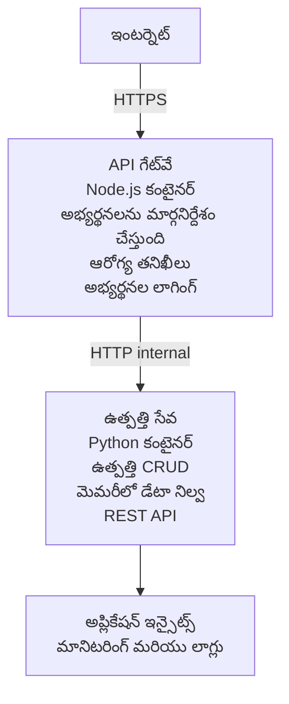

# మైక్రోసర్వీసెస్ ఆర్కిటెక్చర్ - కంటైనర్ యాప్ ఉదాహరణ

⏱️ **అంచనా సమయం**: 25-35 నిమిషాలు | 💰 **అంచనా ఖర్చు**: ~$50-100/నెల | ⭐ **సమస్యాత్మకత**: అడ్వాన్స్‍డ్

A **సరళీకృతమైన కానీ పనిచేసే** మైక్రోసర్వీసెస్ ఆర్కిటెక్చర్ Azure Container Apps పై AZD CLI ఉపయోగించి despleoy చేయబడినది. ఈ ఉదాహరణ సర్వీస్-టు-సర్వీస్ కమ్యూనికేషన్, కంటైనర్ ఒర్కెస్ట్రేషన్ మరియు మానిటరింగ్‌ను ప్రాక్టికల్ 2-సర్వీస్ సెటప్‌తో చూపిస్తుంది.

> **📚 నేర్చుకుందాం విధానం**: ఈ ఉదాహరణ ఒక కనీస 2-సేవల ఆర్కిటెక్చర్ (API గేట్వే + బ్యాకెండ్ సర్వీస్) తో మొదలవుతుంది, దీన్ని మీరు నిజంగా డిప్లాయ్ చేసి నేర్చుకోవచ్చు. ఈ బేస్‌ను నేర్చుకున్న తర్వాత, పూర్తి మైక్రోసర్వీసెస్ ఎకోసిస్టమ్ కు విస్తరించడానికి మార్గదర్శకత్వం ఇవ్వబడుతుంది.

## మీరు నేర్చుకునే అంశాలు

By completing this example, you will:
- Azure Container Apps కి బహుసంఖ్య కంటైనర్లను డిప్లాయ్ చేయడం
- అంతర్గత నెట్‌వర్కింగ్‌తో సర్వీస్-టు-సర్వీస్ కమ్యూనికేషన్ అమలు చేయడం
- పరిసరాల ఆధారిత స్కేలింగ్ మరియు హెల్త్ చెక్స్ కాన్ఫిగర్ చేయడం
- Application Insights తో పంపిణీ చేయబడిన అప్లికేషన్‌లను మానిటర్ చేయడం
- మైక్రోసర్వీసెస్ డిప్లాయ్ మాదరులు మరియు ఉత్తమ అనుభవాలను అర్థం చేసుకోవడం
- సాదా నుంచి సంక్లిష్ట ఆర్కిటెక్చర్స్ వరకు క్రమంగా విస్తరించడం నేర్చుకోవడం

## ఆర్కిటెక్చర్

### దశ 1: మేము నిర్మిస్తున్నది (ఈ ఉదాహరణలో చేర్చబడింది)


**గ్రహించడానికి సులభంగా ఎందుకు ప్రారంభించాలి?**
- ✅ త్వరగా డిప్లాయ్ చేసి అర్థం చేసుకోవచ్చు (25-35 నిమిషాలు)
- ✅ క్లిష్టత లేకుండా మైక్రోసర్వీసస్ యొక్క కోర్ ప్యాటర్న్‌లను నేర్చుకోండి
- ✅ మీరు సవరించగల మరియు ప్రయోగించగల పని చేసే కోడ్
- ✅ నేర్చుకోవటానికి తక్కువ ఖర్చు (~$50-100/నెల vs $300-1400/నెల)
- ✅ డేటాబేస్‌లు మరియు మెసేజ్ క్యూ లను జోడించే ముందు నమ్మకాన్ని నిర్మించుకోండి

**ఉపమా**: ఇది డ్రైవింగ్ నేర్చుకోవడం లాంటిది. మీరు ఖాళీ పార్కింగ్ లాట్ (2 సేవలు) తో మొదలుపెట్టి, మూలాలు నేర్చుకుని, తర్వాత సిటీ ట్రాఫిక్ (5+ సేవలు, డేటాబేస్‌లతో) వైపు ప్రభావవంతంగా సాగుతున్నారు.

### దశ 2: భవిష్యత్తు విస్తరణ (రెఫరెన్స్ ఆర్కిటెక్చర్)

```
Full Architecture (Not Included - For Reference)
├── API Gateway (✅ Included)
├── Product Service (✅ Included)
├── Order Service (🔜 Add next)
├── User Service (🔜 Add next)
├── Notification Service (🔜 Add last)
├── Azure Service Bus (🔜 For async communication)
├── Cosmos DB (🔜 For product persistence)
├── Azure SQL (🔜 For order management)
└── Azure Storage (🔜 For file storage)
```

దశలవారీ సూచనల కోసం చివరలో ఉన్న "విస్తరణ గైడ్" విభాగాన్ని చూడండి.

## చేర్చబడిన ఫీచర్లు

✅ **సర్వీస్ డిస్కవరీ**: కంటైనర్ల మధ్య ఆటోమేటిక్ DNS ఆధారిత డిస్కవరీ  
✅ **లోడ్ బ్యాలెన్సింగ్**: రిప్లికాస్ అన్ని మీద బిల్ట్-ఇన్ లోడ్ బ్యాలెన్సింగ్  
✅ **ఆటో-స్కేలింగ్**: HTTP అభ్యర్థనల ఆధారంగా సర్వీస్ ప్రతి ఒక్కదానిపై స్వతంత్రంగా స్కేల్ అవుతుంది  
✅ **హెల్త్ మానిటరింగ్**: రెండు సేవల కోసం లైవ్‌నెస్ మరియు రెడినెస్ probes  
✅ **డిస్ట్రిబ్యూటెడ్ లాగింగ్**: Application Insights తో కేంద్రికృత లాగింగ్  
✅ **ఇంటర్నల్ నెట్‌వర్కింగ్**: సురక్షిత సర్వీస్-టు-సర్వీస్ కమ్యూనికేషన్  
✅ **కంటైనర్ ఒర్కెస్ట్రేషన్**: ఆటోమేటిక్ డిప్లాయ్‌మెంట్ మరియు స్కేలింగ్  
✅ **శూన్య-డౌన్‌టైమ్ అప్‌డేట్స్**: రోలింగ్ అప్‌డేట్స్ రివిజన్ మేనేజ్‌మెంట్‌తో

## ముందస్తు అవసరాలు

### అవసరమైన టూల్స్

ప్రారంభానికి ముందుగా, మీ వద్ద ఈ టూల్స్ ఇన్‌స్టాల్ ఉన్నాయో లేకో తనిఖీ చేయండి:

1. **[Azure Developer CLI (azd)](https://learn.microsoft.com/azure/developer/azure-developer-cli/install-azd)** (ఆవృతీ 1.0.0 లేదా అంతకంటే పైగా)
   ```bash
   azd version
   # నిరీక్షిత అవుట్పుట్: azd సంచిక 1.0.0 లేదా అంతకు పైగా
   ```

2. **[Azure CLI](https://learn.microsoft.com/cli/azure/install-azure-cli)** (ఆవృతీ 2.50.0 లేదా అంతకంటే పైగా)
   ```bash
   az --version
   # ఆశించిన అవుట్పుట్: azure-cli 2.50.0 లేదా అంతకంటే ఉన్నతమైనది
   ```

3. **[Docker](https://www.docker.com/get-started)** (లోకల్ డెవలప్‌మెంట్/టెస్టింగ్ కోసం - ఐచ్ఛికం)
   ```bash
   docker --version
   # నిరೀಕ್ಷిత అవుట్పుట్: Docker సంస్కరణ 20.10 లేదా అంతకంటే ఎక్కువ
   ```

### Azure అవసరాలు

- ఒక యాక్టివ్ **Azure subscription** ([ఉచిత ఖాతా సృష్టించండి](https://azure.microsoft.com/free/))
- మీ సబ్స్క్రిప్షన్‌లో రిసోర్సులు సృష్టించడానికి అనుమతులు
- సబ్స్క్రిప్షన్ లేదా రిసోర్స్ గ్రూప్‌పై **Contributor** పాత్ర

### జ్ఞానాత్మక ముందస్తు అవసరాలు

ఇది ఒక **అడ్వాన్స్‍డ్-లెవెల్** ఉదాహరణ. మీకు ఉండాలి:
- [Simple Flask API example](../../../../../examples/container-app/simple-flask-api) పూర్తి చేసివుండాలి
- మైక్రోసర్వీసెస్ ఆర్కిటెక్చర్ యొక్క మూలభూత అవగాహన
- REST APIs మరియు HTTP గా పరిచయం
- కంటైనర్ కాన్సెప్ట్స్ అవగాహన

**Container Apps లో కొత్తగా ఉన్నారా?** ప్రాథమికాలను నేర్చుకోవడానికి ముందుగా [Simple Flask API example](../../../../../examples/container-app/simple-flask-api) తో ప్రారంభించండి.

## క్విక్ స్టార్ట్ (దశలవారీ)

### దశ 1: క్లోన్ చేసి నావిగేట్ చేయండి

```bash
git clone https://github.com/microsoft/AZD-for-beginners.git
cd AZD-for-beginners/examples/container-app/microservices
```

**✓ విజయ నిర్థారణ**: మీరు `azure.yaml` చూస్తున్నారని నిర్ధారించుకోండి:
```bash
ls
# ఆశించినవి: README.md, azure.yaml, infra/, src/
```

### దశ 2: Azureతో Authenticate చేయండి

```bash
azd auth login
```

ఇది మీ బ్రౌజర్‌ను Azure authentication కోసం తెరుస్తుంది. మీ Azure క్రెడెన్షియల్స్‌తో సైన్ ఇన్ చేయండి.

**✓ విజయ నిర్ధారణ**: మీరు ఈ అంశాన్ని చూడాలి:
```
Logged in to Azure.
```

### దశ 3: ఎన్‌వైరన్‌మెంట్ ను_INITIALIZE చేయండి

```bash
azd init
```

**మీకు కనబడేటి ప్రాంప్ట్స్**:
- **Environment name**: చిన్న పేరు నమోదు చేయండి (ఉదాహరణగా `microservices-dev`)
- **Azure subscription**: మీ subscription ఎంచుకోండి
- **Azure location**: ఒక రీజియన్ ఎంచుకోండి (ఉదాహరణ: `eastus`, `westeurope`)

**✓ విజయ నిర్ధారణ**: మీరు ఈ అవుట్‌పుట్‌ను చూడాలి:
```
SUCCESS: New project initialized!
```

### దశ 4: ఇన్‌ఫ్రాస్ట్రక్చర్ మరియు సర్వీసులను డిప్లాయ్ చేయండి

```bash
azd up
```

**ఏం జరుగుతుంది** (8-12 నిమిషాలు పట్టవచ్చు):
1. Container Apps environment ను సృష్టిస్తుంది
2. పంపిణీ కోసం Application Insights ను సృష్టిస్తుంది
3. API Gateway కంటైనర్ (Node.js) ను బిల్డ్ చేస్తుంది
4. Product Service కంటైనర్ (Python) ను బిల్డ్ చేస్తుంది
5. ఇద్దరు కంటైనర్లను Azure కు డిప్లాయ్ చేస్తుంది
6. నెట్‌వర్కింగ్ మరియు హెల్త్ చెక్స్ను కాన్ఫిగర్ చేస్తుంది
7. మానిటరింగ్ మరియు లాగింగ్ సెటాప్ చేస్తుంది

**✓ విజయ నిర్ధారణ**: మీరు ఇది చూడాలి:
```
SUCCESS: Your application was deployed to Azure in X minutes Y seconds.
Endpoint: https://api-gateway-<unique-id>.azurecontainerapps.io
```

**⏱️ సమయం**: 8-12 నిమిషాలు

### దశ 5: డిప్లాయ్‌మెంట్‌ను పరీక్షించండి

```bash
# గేట్‌వే ఎండ్‌పాయింట్ పొందండి
GATEWAY_URL=$(azd env get-values | grep API_GATEWAY_URL | cut -d '=' -f2 | tr -d '"')

# API గేట్‌వే ఆరోగ్యాన్ని పరీక్షించండి
curl $GATEWAY_URL/health

# అనుకోబడిన అవుట్‌పుట్:
# {"status":"ఆరోగ్యవంతం","service":"api-gateway","timestamp":"2025-11-19T10:30:00Z"}
```

**గేట్వే ద్వారా ప్రొడక్ట్ సర్వీస్‌ను పరీక్షించండి**:
```bash
# ఉత్పత్తులను జాబితా చేయండి
curl $GATEWAY_URL/api/products

# అనుకోబడిన అవుట్‌పుట్:
# [
#   {"id":1,"name":"ల్యాప్‌టాప్","price":999.99,"stock":50},
#   {"id":2,"name":"మౌస్","price":29.99,"stock":200},
#   {"id":3,"name":"కీబోర్డ్","price":79.99,"stock":150}
# ]
```

**✓ విజయ నిర్ధారణ**: రెండు ఎండ్‌పాయింట్లు కూడా ఎర్రర్ల లేకుండా JSON డేటాను రిటర్న్ చేయాలి.

---

**🎉 అభినందనలు!** మీరు Azureకి ఒక మైక్రోసర్వీసెస్ ఆర్కిటెక్చర్‌ను డిప్లాయ్ చేసారు!

## ప్రాజెక్ట్ నిర్మాణం

అన్ని అమలు ఫైళ్లు చేర్చబడ్డాయి—ఇది ఒక పూర్తి, పనిచేసే ఉదాహరణ:

```
microservices/
│
├── README.md                         # This file
├── azure.yaml                        # AZD configuration
├── .gitignore                        # Git ignore patterns
│
├── infra/                           # Infrastructure as Code (Bicep)
│   ├── main.bicep                   # Main orchestration
│   ├── abbreviations.json           # Naming conventions
│   ├── core/                        # Shared infrastructure
│   │   ├── container-apps-environment.bicep  # Container environment + registry
│   │   └── monitor.bicep            # Application Insights + Log Analytics
│   └── app/                         # Service definitions
│       ├── api-gateway.bicep        # API Gateway container app
│       └── product-service.bicep    # Product Service container app
│
└── src/                             # Application source code
    ├── api-gateway/                 # Node.js API Gateway
    │   ├── app.js                   # Express server with routing
    │   ├── package.json             # Node dependencies
    │   └── Dockerfile               # Container definition
    └── product-service/             # Python Product Service
        ├── main.py                  # Flask API with product data
        ├── requirements.txt         # Python dependencies
        └── Dockerfile               # Container definition
```

**ప్రతి కంపెనెంట్ ఏమి చేస్తుంది:**

**Infrastructure (infra/)**:
- `main.bicep`: అన్ని Azure రిసోర్సులు మరియు వాటి డిపెండెన్సీలను ఆర్కెస్ట్రేట్ చేస్తుంది
- `core/container-apps-environment.bicep`: Container Apps environment మరియు Azure Container Registry ని సృష్టిస్తుంది
- `core/monitor.bicep`: పంపిణీ లాగింగ్ కోసం Application Insights సెటప్ చేస్తుంది
- `app/*.bicep`: స్కేలింగ్ మరియు హెల్త్ చెక్సులతో కూడిన వ్యక్తిగత కంటైనర్ యాప్ నిర్వచనాలు

**API Gateway (src/api-gateway/)**:
- పబ్లిక్-ఫేసింగ్ సర్వీస్, ఇది బ్యాకెండ్ సర్వీసులకు రిక్వెస్ట్‌లను రౌట్ చేస్తుంది
- లాగింగ్, ఎర్రర్ హ్యాండ్లింగ్ మరియు రిక్వెస్ట్ ఫార్వార్డింగ్‌ను అమలు చేస్తుంది
- సర్వీస్-టు-సర్వీస్ HTTP కమ్యూనికేషన్‌ను చూపిస్తుంది

**Product Service (src/product-service/)**:
- ఇన్-మెమరీగా ప్రొడక్ట్ క్యాటలాగ్ నిర్వహించేది (సరళత కొరకు)
- REST API మరియు హెల్త్ చెక్స్
- బ్యాకెండ్ మైక్రోసర్వీస్ ప్యాటర్న్ యొక్క ఉదాహరణ

## సర్వీసులు అవలోకనం

### API Gateway (Node.js/Express)

**Port**: 8080  
**ప్రాప్యత**: పబ్లిక్ (బాహ్య ఇన్గ్రెస్స్)  
**ఉద్దేశ్యం**: ఇన్కమింగ్ రిక్వెస్టులను సరైన బ్యాకెండ్ సర్వీసులకు రూట్ చేయడం  

**ఎండ్‌పాయింట్లు**:
- `GET /` - సర్వీస్ సమాచారం
- `GET /health` - హెల్త్ చెక్ ఎండ్‌పాయింట్
- `GET /api/products` - product service కు ఫార్వర్డు (అన్ని ప్రొడక్ట్‌లు)
- `GET /api/products/:id` - product service కు ఫార్వర్డు (ID ద్వారా పొందు)

**ప్రధాన ఫీచర్లు**:
- axios తో రిక్వెస్ట్ రౌటింగ్
- కేంద్రీకృత లాగింగ్
- ఎర్రర్ హ్యాండ్లింగ్ మరియు టైమ్‌ఆవుట్ మేనేజ్మెంట్
- ఎన్విరాన్‌మెంట్ వేరియబుల్స్ ద్వారా సర్వీస్ డిస్కవరీ
- Application Insights ఇంటిగ్రేషన్

**కోడ్ హైలెట్** (`src/api-gateway/app.js`):
```javascript
// అంతర్గత సేవల మధ్య కమ్యూనికేషన్
app.get('/api/products', async (req, res) => {
  const response = await axios.get(`${PRODUCT_SERVICE_URL}/products`);
  res.json(response.data);
});
```

### Product Service (Python/Flask)

**Port**: 8000  
**ప్రాప్యత**: అంతర్గతమే (బాహ్య ఇన్గ్రెస్స్ లేదు)  
**ఉద్దేశ్యం**: ఇన్-మెమరీ డేటాతో ప్రొడక్ట్ క్యాటలాగ్ నిర్వహించడం  

**ఎండ్‌పాయింట్లు**:
- `GET /` - సర్వీస్ సమాచారంల
- `GET /health` - హెల్త్ చెక్ ఎండ్‌పాయింట్
- `GET /products` - అన్ని ప్రొడక్ట్‌లను ఫిర్యాదు చేయండి
- `GET /products/<id>` - ID ద్వారా ప్రొడక్ట్ పొందండి

**ప్రధాన లక్షణాలు**:
- Flask తో RESTful API
- ఇన్-మెమరీ ప్రొడక్ట్ స్టోర్ (సరళం, డేటాబేస్ అవసరం లేదు)
- probes తో హెల్త్ మానిటరింగ్
- నిర్మిత లాగింగ్
- Application Insights ఇంటిగ్రేషన్

**డేటా మోడల్**:
```python
{
  "id": 1,
  "name": "Laptop",
  "description": "High-performance laptop",
  "price": 999.99,
  "stock": 50
}
```

**ఇంటర్నల్ మాత్రమే ఎందుకు?**
Product service పబ్లిక్ గా ఎక్స్‌పోజ్ చేయబడదు. అన్ని రిక్వెస్టులు API గేట్వే ద్వారా రావలసి ఉంటుంది, ఇది అందిస్తుంది:
- భద్రత: నియంత్రిత ప్రవేశ బిందువు
- లవచ్యత: క్లయింట్లు ప్రభావితం కాకుండా బ్యాకెండ్‌ను మార్చగలదు
- మానిటరింగ్: కేంద్రీకృత రిక్వెస్ట్ లాగింగ్

## సర్వీస్ కమ్యూనికేషన్ ను అర్థం చేసుకోవడం

### సేవలు ఒక другి తో ఎలా మాట్లాడతాయి

ఈ ఉదాహరణలో, API Gateway Product Service తో అనుసంధానం చేస్తుంది **అంతర్గత HTTP కాల్స్** ఉపయోగించి:

```javascript
// API గేట్వే (src/api-gateway/app.js)
const PRODUCT_SERVICE_URL = process.env.PRODUCT_SERVICE_URL;

// అంతర్గత HTTP అభ్యర్థనను చేయండి
const response = await axios.get(`${PRODUCT_SERVICE_URL}/products`);
```

**ప్రధాన బిందువులు**:

1. **DNS-ఆధారిత డిస్కవరీ**: Container Apps ఆటోమేటిక్గా ఇంటర్నల్ సర్వీసులకు DNS అందిస్తుంది
   - Product Service FQDN: `product-service.internal.<environment>.azurecontainerapps.io`
   - సరళీకృతంగా: `http://product-service` (Container Apps దీన్ని రిజాల్వ్ చేయుతుంది)

2. **ప్రజా ఎక్స్‌పోజర్ లేదు**: Product Service లో Bicep లో `external: false`
   - కేవలం Container Apps environment లోనే యాక్సెస్ చేయగలరు
   - ఇంటర్నెట్ నుండి చేరుకోలేరు

3. **ఎన్‌విరాన్‌మెంట్ వేరియబుల్స్**: సర్వీస్ URLలు deployment సమయంలో ఇంజెక్ట్ చేయబడతాయి
   - Bicep గేట్‌వేకు అంతర్గత FQDN పంపుతుంది
   - అప్లికేషన్ కోడ్ లో హార్డ్‌కోడ్ URL‌లు ఉండవు

**ఉపమా**: ఇది ఆఫీస్ రూమ్‌ల్లాగా భావించండి. API Gateway రిసెప్షన్ డెస్క్ (పబ్లిక్-ఫేసింగ్) లాంటిదిగా ఉంటుంది, మరియు Product Service ఒక ఆఫీస్ రూమ్ (ఇంటర్నల్ మాత్రమే). సందర్శకులు ఆఫీస్ చేరడానికి రిసెప్షన్ ద్వారా వెళ్లాలి.

## డిప్లాయ్‌మెంట్ ఎంపికలు

### పూర్తి డిప్లాయ్‌మెంట్ (సిఫార్సు)

```bash
# ఇన్ఫ్రాస్ట్రక్చర్ మరియు రెండు సేవలను అమర్చండి
azd up
```

ఇది డిప్లాయ్ చేస్తుంది:
1. Container Apps environment
2. Application Insights
3. Container Registry
4. API Gateway కంటైనర్
5. Product Service కంటైనర్

**సమయం**: 8-12 నిమిషాలు

### వ్యక్తిగత సర్వీస్ ని డిప్లాయ్ చేయండి

```bash
# ఒకే ఒక సేవను మాత్రమే డిప్లాయ్ చేయండి (ప్రాథమిక azd up తర్వాత)
azd deploy api-gateway

# లేదా product సేవను డిప్లాయ్ చేయండి
azd deploy product-service
```

**వినియోగం సందర్భం**: ఒక సర్వీస్‌లో కోడ్ అప్డేట్ చేసి, కేవలం ఆ సర్వీస్‌ను పునఃడిప్లాయ్ చేయాలనుకుంటే.

### కాన్ఫిగరేషన్ అప్డేట్ చేయండి

```bash
# స్కేలింగ్ పారామితులను మార్చండి
azd env set GATEWAY_MAX_REPLICAS 30

# కొత్త కాన్ఫిగరేషన్‌తో మళ్లీ అమర్చండి
azd up
```

## కాన్ఫిగరేషన్

### స్కేలింగ్ కాన్ఫిగరేషన్

రెండు సేవలూ వారి Bicep ఫైల్స్‌లో HTTP-ఆధారిత ఆటోస్కేలింగ్‌తో కాన్ఫిగర్ చేయబడ్డాయి:

**API Gateway**:
- కనిష్ఠ రిప్లికాస్: 2 (ఉపలభ్యత కొరకు కనీసం 2)
- గరిష్ఠ రిప్లికాస్: 20
- స్కేల్ ట్రిగ్గర్: ప్రతి రిప్లికాకు 50 సమకాలీన అభ్యర్థనలు

**Product Service**:
- కనిష్ఠ రిప్లికాస్: 1 (తప్పిస్తే స్కేల్-టు-జీరో కి వీలుంటుంది)
- గరిష్ఠ రిప్లికాస్: 10
- స్కేల్ ట్రిగ్గర్: ప్రతి రిప్లికాకు 100 సమకాలీన అభ్యర్థనలు

**స్కేలింగ్‌ను అనుకూలీకరించండి** (in `infra/app/*.bicep`):
```bicep
scale: {
  minReplicas: 1
  maxReplicas: 10
  rules: [
    {
      name: 'http-scale-rule'
      http: {
        metadata: {
          concurrentRequests: '100'  // Adjust this
        }
      }
    }
  ]
}
```

### రిసోర్స్ కేటాయింపు

**API Gateway**:
- CPU: 1.0 vCPU
- మెమరీ: 2 GiB
- కారణం: అన్ని బాహ్య ట్రాఫిక్‌ను హ్యాండిల్ చేస్తుంది

**Product Service**:
- CPU: 0.5 vCPU
- మెమరీ: 1 GiB
- కారణం: లైట్‌వైట్ ఇన్-మెమరీ ఆపరేషన్లు

### హెల్త్ చెక్స్

రెండు సేవలూ లైవ్నెస్ మరియు రెడినెస్ probes ను కలిగి ఉంటాయి:

```bicep
probes: [
  {
    type: 'Liveness'
    httpGet: {
      path: '/health'
      port: 8080
    }
    initialDelaySeconds: 10
    periodSeconds: 30
  }
  {
    type: 'Readiness'
    httpGet: {
      path: '/health'
      port: 8080
    }
    initialDelaySeconds: 5
    periodSeconds: 10
  }
]
```

**దీని అర్థం ఏమిటి**:
- **Liveness**: హెల్త్ చెక్ విఫలమైతే, Container Apps కంటైనర్‌ను రీస్టార్ట్ చేస్తుంది
- **Readiness**: రెడీ కాకపోతే, Container Apps ఆ రిప్లికాకు ట్రాఫిక్ రూట్ చేయడం ఆపేస్తుంది


## మానిటరింగ్ & ఆబ్సర్వబిలిటీ

### సర్వీస్ లాగ్స్ చూడండి

```bash
# azd monitor ఉపయోగించి లాగులు చూడండి
azd monitor --logs

# లేదా నిర్దిష్ట Container Apps కోసం Azure CLI ఉపయోగించండి:
# API Gateway నుండి లాగ్‌లను స్ట్రీమ్ చేయండి
az containerapp logs show --name api-gateway --resource-group $RG_NAME --follow

# ఇటీవలి product service లాగ్‌లు చూడండి
az containerapp logs show --name product-service --resource-group $RG_NAME --tail 100
```

**అంచనా అవుట్పుట్**:
```
[api-gateway] API Gateway listening on port 8080
[api-gateway] Product Service URL: http://product-service
[api-gateway] GET /api/products 200 - 45ms
[product-service] Retrieved 5 products
```

### Application Insights క్వెరీస్

Azure పోర్టల్‌లో Application Insights ని యాక్సెస్ చేసి, ఈ క్వెరీస్ నడపండి:

**స్లో అభ్యర్థనలు కనుగొనండి**:
```kusto
requests
| where timestamp > ago(1h)
| where duration > 1000  // Requests taking >1 second
| summarize count() by name, cloud_RoleName
| order by count_ desc
```

**సర్వీస్-టు-సర్వీస్ కాల్స్ ట్రాక్ చేయండి**:
```kusto
dependencies
| where timestamp > ago(1h)
| where type == "Http"
| project timestamp, name, target, duration, success
| order by timestamp desc
```

**సర్వీస్ ప్రకారం ఎర్రర్ రేటు**:
```kusto
exceptions
| where timestamp > ago(24h)
| summarize errorCount = count() by cloud_RoleName, type
| order by errorCount desc
```

**సమయం ప్రకారం రిక్వెస్ట్ వాల్యూమ్**:
```kusto
requests
| where timestamp > ago(1h)
| summarize requestCount = count() by bin(timestamp, 5m), cloud_RoleName
| render timechart
```

### మానిటరింగ్ డాష్‌బోర్డు యాక్సెస్ చేయండి

```bash
# Application Insights వివరాలను పొందండి
azd env get-values | grep APPLICATIONINSIGHTS

# Azure పోర్టల్ మానిటరింగ్‌ను తెరవండి
az monitor app-insights component show \
  --app $(azd env get-values | grep APPLICATIONINSIGHTS_CONNECTION_STRING | cut -d '=' -f2) \
  --resource-group $(azd env get-values | grep AZURE_RESOURCE_GROUP | cut -d '=' -f2) \
  --query "appId" -o tsv
```

### లైవ్ మెట్రిక్స్

1. Azure పోర్టల్‌లో Application Insights కి వెళ్లండి
2. "Live Metrics" పై క్లిక్ చేయండి
3. రియల్-టైమ్ రిక్వెస్ట్‌లు, వైఫల్యాలు మరియు పనితీరు చూడండి
4. పరీక్ష కోసం రన్ చేయండి: `curl $(azd env get-values | grep API_GATEWAY_URL | cut -d '=' -f2 | tr -d '"')/api/products`

## ప్రాక్టికల్ వ్యాయామాలు

[Note: See full exercises above in the "Practical Exercises" section for detailed step-by-step exercises including deployment verification, data modification, autoscaling tests, error handling, and adding a third service.]

## ఖర్చు విశ్లేషణ

### అంచనా మాసిక ఖర్చులు (ఈ 2-సర్వీస్ ఉదాహరణ కొరకు)

| Resource | Configuration | Estimated Cost |
|----------|--------------|----------------|
| API Gateway | 2-20 replicas, 1 vCPU, 2GB RAM | $30-150 |
| Product Service | 1-10 replicas, 0.5 vCPU, 1GB RAM | $15-75 |
| Container Registry | Basic tier | $5 |
| Application Insights | 1-2 GB/month | $5-10 |
| Log Analytics | 1 GB/month | $3 |
| **Total** | | **$58-243/month** |

**ఉపయోగంపై ఖర్చు విభజన**:
- **లైట్ ట్రాఫిక్** (టెస్టింగ్/లెర్నింగ్): ~$60/నెల
- **మోడ్డరేట్ ట్రాఫిక్** (సమర్థ ప్రొడక్షన్): ~$120/నెల
- **హై ట్రాఫిక్** ( బిజీ పీరియడ్స్): ~$240/నెల

### ఖర్చు ఆప్టిమైజేషన్ సూచనలు

1. డెవలప్‌మెంట్ కోసం స్కేల్-టు-జీరో చేయండి:
   ```bicep
   scale: {
     minReplicas: 0  // Save $30-40/month when not in use
     maxReplicas: 10
   }
   ```

2. **Cosmos DB కోసం Consumption Plan ఉపయోగించండి** (మీరు ఇది జోడించినప్పుడు):
   - మీరు వాడినంత మాత్రాన చెల్లించండి
   - కనీస ఛార్జీలు ఉండవు

3. **Application Insights Sampling సెట్ చేయండి**:
   ```javascript
   appInsights.defaultClient.config.samplingPercentage = 50; // అభ్యర్థనలలో 50% ను నమూనా చేయండి
   ```

4. **వాడకంలో లేకపోవటం షరీలప్పుడు క్లీనప్ చేయండి**:
   ```bash
   azd down
   ```

### ఉచిత టైర్ ఎంపికలు

పరిశీలించడానికి, అభ్యాసం/పరీక్షల కోసం:
- Azure ఉచిత క్రెడిట్లు ఉపయోగించండి (ప్రథమ 30 రోజులు)
- రిప్లికులను కనీసంగా ఉంచండి
- పరీక్ష అనంతరం తొలగించండి (నిరంతర ఛార్జీలు రాకుండా)

---

## Cleanup

To avoid ongoing charges, delete all resources:

```bash
azd down --force --purge
```

**నిర్ధారణ ప్రాంప్ట్**:
```
? Total resources to delete: 6, are you sure you want to continue? (y/N)
```

నిర్ధారించడానికి `y` టైప్ చేయండి.

**ఏది తొలగించబడుతుంది**:
- Container Apps Environment
- Both Container Apps (gateway & product service)
- Container Registry
- Application Insights
- Log Analytics Workspace
- Resource Group

**✓ శుభ్రపరచడం ధృవీకరించండి**:
```bash
az group list --query "[?starts_with(name,'rg-microservices')]" --output table
```

ఖాళీగా తిరిగి రావాలి.

---

## Expansion Guide: From 2 to 5+ Services

Once you've mastered this 2-service architecture, here's how to expand:

### Phase 1: Add Database Persistence (Next Step)

**Product Service కోసం Cosmos DB జోడించండి**:

1. Create `infra/core/cosmos.bicep`:
   ```bicep
   resource cosmosAccount 'Microsoft.DocumentDB/databaseAccounts@2023-04-15' = {
     name: name
     location: location
     kind: 'GlobalDocumentDB'
     properties: {
       databaseAccountOfferType: 'Standard'
       locations: [{ locationName: location, failoverPriority: 0 }]
     }
   }
   ```

2. మేమరీలోని డేటా స్థానంలో Cosmos DB ఉపయోగించ도록 product serviceను అప్డేట్ చేయండి

3. అంచనా అదనపు ఖర్చు: సుమారు $25/నెల (సర్వర్‌లెస్)

### Phase 2: Add Third Service (Order Management)

**Order Service తయారుచేయండి**:

1. New folder: `src/order-service/` (Python/Node.js/C#)
2. New Bicep: `infra/app/order-service.bicep`
3. API Gateway‌ను `/api/orders`కి రూట్ చేయ도록 అప్డేట్ చేయండి
4. ఆర్డర్ స్థిరత్వానికి Azure SQL Database జోడించండి

**ఆర్కిటెక్చర్ ఇలా మారుతుంది**:
```
API Gateway → Product Service (Cosmos DB)
           → Order Service (Azure SQL)
```

### Phase 3: Add Async Communication (Service Bus)

**ఈవెంట్-చालित ఆర్కిటెక్చర్ అమలు చేయండి**:

1. Add Azure Service Bus: `infra/core/servicebus.bicep`
2. Product Service "ProductCreated" ఈవెంట్స్‌ను ప్రచురిస్తుంది
3. Order Service ఉత్పత్తి ఈవెంట్స్‌కు సబ్‌స్క్రైబ్ అవుతుంది
4. ఈవెంట్స్ ను ప్రాసెస్ చేయడానికి Notification Service జోడించండి

**పాటర్న్**: Request/Response (HTTP) + Event-Driven (Service Bus)

### Phase 4: Add User Authentication

**User Service అమలు చేయండి**:

1. Create `src/user-service/` (Go/Node.js)
2. Azure AD B2C లేదా కస్టమ్ JWT ప్రమాణీకరణ జోడించండి
3. API Gateway టోకెన్స్‌ను ధృవీకరిస్తుంది
4. సర్వీసులు వినియోగదారు అనుమతులను తనిఖీ చేస్తాయి

### Phase 5: Production Readiness

**ఈ భాగాలు జోడించండి**:
- Azure Front Door (global load balancing)
- Azure Key Vault (secret management)
- Azure Monitor Workbooks (custom dashboards)
- CI/CD Pipeline (GitHub Actions)
- Blue-Green Deployments
- Managed Identity for all services

**పూర్తి ప్రొడక్షన్ ఆర్కిటెక్చర్ ఖర్చు**: సుమారు $300-1,400/నెల

---

## Learn More

### Related Documentation
- [Azure Container Apps Documentation](https://learn.microsoft.com/azure/container-apps/)
- [Microservices Architecture Guide](https://learn.microsoft.com/azure/architecture/guide/architecture-styles/microservices)
- [Application Insights for Distributed Tracing](https://learn.microsoft.com/azure/azure-monitor/app/distributed-tracing)
- [Azure Developer CLI Documentation](https://learn.microsoft.com/azure/developer/azure-developer-cli/)

### Next Steps in This Course
- ← మునుపటి: [Simple Flask API](../../../../../examples/container-app/simple-flask-api) - ప్రారంభ స్థాయి సింగిల్-కంటైనర్ ఉదాహరణ
- → తర్వాతి: [AI Integration Guide](../../../../../examples/docs/ai-foundry) - AI సామర్ధ్యాలను జోడించండి
- 🏠 [Course Home](../../README.md)

### Comparison: When to Use What

**Single Container App** (Simple Flask API example):
- ✅ సాదా అనువర్తనాలు
- ✅ మోనోలిథిక్ ఆర్కిటెక్చర్
- ✅ వేగంగా డిప్లాయ్ చేయవచ్చు
- ❌ పరిమిత స్కేలబిలిటీ
- **ఖర్చు**: సుమారు $15-50/నెల

**Microservices** (This example):
- ✅ జటილ అనువర్తనాలు
- ✅ సర్వీస్ వారీగా స్వతంత్ర స్కేలింగ్
- ✅ టీమ్ స్వాతంత్ర్యం (వేర్వేరు సర్వీసులు, వేర్వేరు టీమ్స్)
- ❌ నిర్వహణకు మరింత సంక్లిష్టం
- **ఖర్చు**: సుమారు $60-250/నెల

**Kubernetes (AKS)**:
- ✅ గరిష్ట నియంత్రణ మరియు అనుకూలత
- ✅ మల్టీ-క్లౌడ్ పోర్టబిలిటీ
- ✅ అధునాతన నెట్వర్కింగ్
- ❌ Kubernetes నైపుణ్యం అవసరం
- **ఖర్చు**: కనీసం సుమారు $150-500/నెల

**సిఫార్సు**: మొదట Container Apps (ఈ ఉదాహరణ) తో ప్రారంభించండి, Kubernetes-స్పెసిఫిక్ ఫీచర్లు అవసరమైతేనే AKS కి మారండి.

---

## Frequently Asked Questions

**Q: ఎందుకు 5+కి బదులుగా కేవలం 2 సేవలు?**  
A: విద్యా పరమైన దశాబద్ధి. సంక్లిష్టతను జోడించే ముందు ప్రాథమిక అంశాలు (సేవా కమ్యూనికేషన్, మానిటరింగ్, స్కేలింగ్) ను ఒక సులభ ఉదాహరణతో నైనా దగ్గరగా నేర్చుకోండి. మీరు ఇక్కడ నేర్చుకున్న నమూనాలు 100-సర్వీస్ ఆర్కిటెక్చర్లకు వర్తిస్తాయి.

**Q: నేను నాకు ఇంకా సేవలు జోడించగలనా?**  
A: ఖచ్చితంగా! పైన తెలిపిన విస్తరణ మార్గదర్శిని అనుసరించండి. ప్రతి కొత్త సర్వీస్ ఒకే నమూనాను అనుసరిస్తుంది: src ఫోల్డర్ సృష్టించండి, Bicep ఫైల్ తయారుచేయండి, azure.yaml అప్డేట్ చేయండి, డిప్లాయ్ చేయండి.

**Q: ఇది ప్రొడక్షన్-రెడీనా?**  
A: ఇది బలమైన పునాదీ. ప్రొడక్షన్ కోసం జోడించవలసినవి: Managed Identity, Key Vault, పర్మనెంట్ డేటాబేస్లు, CI/CD పైప్‌లైన్, మానిటరింగ్ అలెర్ట్స్, బ్యాకప్ వ్యూహం.

**Q: Dapr లేదా ఇతర సర్వీస్ మెష్ ఉపయోగించకూడదా?**  
A: నేర్చుకునేందుకు సింపుల్ గా ఉంచండి. మీరు Container Apps యొక్క స్థానిక నెట్వర్కింగ్ను అర్థం చేసుకున్నప్పుడు, అధునాతన సందర్భాలకు Dapr ను జోడించవచ్చు.

**Q: నేను లోకల్‌గా ఎలా డీబగ్ చేయగలను?**  
A: సేవలను లోకల్‌గా Docker తో రన్ చేయండి:
```bash
cd src/api-gateway
docker build -t local-gateway .
docker run -p 8080:8080 -e PRODUCT_SERVICE_URL=http://localhost:8000 local-gateway
```

**Q: నేను వేర్వేరు ప్రోగ్రామింగ్ భాషలు ఉపయోగించగలనా?**  
A: అవును! ఈ ఉదాహరణ Node.js (gateway) + Python (product service) చూపిస్తుంది. కంటైనర్లలో రన్ అయ్యే ఏ భాషైనా మిక్స్ చేయవచ్చు.

**Q: Azure క్రెడిట్లు లేకపోతే ఏమి చేయాలి?**  
A: Azure ఫ్రీ టియర్ (కొత్త ఖాతాలకు మొదటి 30 రోజులు) ఉపయోగించండి లేదా తాత్కాలిక పరీక్షల కోసం డిప్లాయ్ చేసి వెంటనే తొలగించండి.

---

> **🎓 శిక్షణ మార్గం సారాంశం**: మీరు ఆటోమేటిక్ స్కేలింగ్, అంతర్గత నెట్వర్కింగ్, కేంద్రపూర్వక మానిటరింగ్, మరియు ప్రొడక్షన్-సిద్ధమైన ప్యాటర్న్లతో బహుళ-సర్వీస్ ఆర్కిటెక్చర్‌ను డిప్లాయ్ చేయడం నేర్చుకున్నారు. ఈ పునాదీ మీను సంక్లిష్ట పంపిణీ వ్యవస్థలు మరియు ఎంటర్‌ప్రైజ్ మైక్రోసర్వీసెస్ ఆర్కిటెక్చర్లకు సిద్ధం చేస్తుంది.

**📚 కోర్సు నావిగేషన్:**
- ← మునుపటి: [Simple Flask API](../../../../../examples/container-app/simple-flask-api)
- → తర్వాతి: [Database Integration Example](../../../../../examples/database-app)
- 🏠 [Course Home](../../../README.md)
- 📖 [Container Apps Best Practices](../../../docs/chapter-04-infrastructure/deployment-guide.md)

---

<!-- CO-OP TRANSLATOR DISCLAIMER START -->
**స్పష్టీకరణ**:
ఈ పత్రం AI అనువాద సేవ [Co-op Translator](https://github.com/Azure/co-op-translator) ద్వారా అనువదించబడింది. మేము ఖచ్చితత్వానికి ప్రయత్నించినప్పటికీ, స్వయంచాలక అనువాదాల్లో తప్పులు లేదా లోపాలు ఉండవచ్చు అని దయచేసి గమనించండి. మాతృభాషలో ఉన్న మూల పత్రాన్ని అధికారిక మూలంగా పరిగణించాలి. కీలకమైన సమాచారానికి వృత్తిపరమైన మానవ అనువాదాన్ని సూచిస్తాము. ఈ అనువాదాన్ని ఉపయోగించడం వల్ల ఏర్పడే ఏవైనా అపార్థాలు లేదా తప్పుగా అర్థం చేసుకోవడాలకు మేము బాధ్యులు కావు.
<!-- CO-OP TRANSLATOR DISCLAIMER END -->