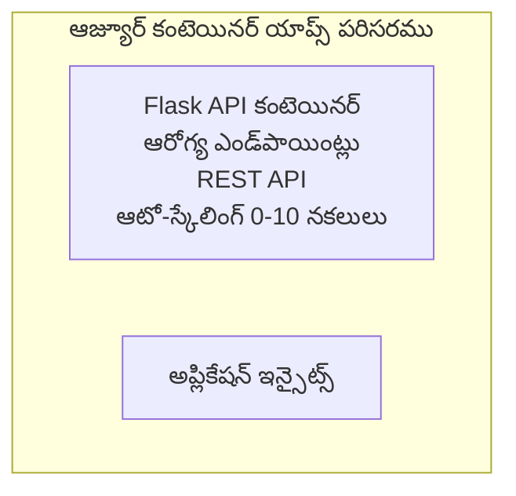

# Simple Flask API - Container App Example

**Learning Path:** Beginner ⭐ | **Time:** 25-35 minutes | **Cost:** $0-15/month

సంపూర్ణంగా పనిచేసే Python Flask REST API ను Azure Developer CLI (azd) ఉపయోగించి Azure Container Apps లో డిప్లాయ్ చేయించిన ఉదాహరణ. ఈ ఉదాహరణలో కంటైనర్ డిప్లాయ్‌మెంట్, ఆటో-స్కేలింగ్ మరియు మానిటరింగ్ యొక్క ప్రాథమిక అంశాలు చూపిస్తారు.

## 🎯 మీరు ఏమి నేర్చుకుంటారు

- కంటైనర్ చేయబడిన Python అప్లికేషన్‌ను Azureలో డిప్లాయ్ చేయడం
- స్కేల్-టు-జీరోతో ఆటో-స్కేలింగ్‌ను కాన్ఫిగర్ చేయడం
- హెల్త్ ప్రోబ్లు మరియు రెడీనెస్ చెక్స్లను అమలు చేయడం
- అప్లికేషన్ లాగ్స్ మరియు మెట్రిక్స్‌ను మానిటర్ చేయడం
- త్వరిత డిప్లాయ్‌మెంట్ కోసం Azure Developer CLI ఉపయోగించడం

## 📦 ఏమి ఉన్నాయి

✅ **Flask Application** - CRUD ఆపరేషన్లతో పూర్తి REST API (`src/app.py`)  
✅ **Dockerfile** - ప్రొడక్షన్-సిద్ధ কంటైనర్ కాన్ఫిగరేషన్  
✅ **Bicep Infrastructure** - Container Apps ఎన్విరాన్‌మెంట్ మరియు API డిప్లాయ్‌మెంట్  
✅ **AZD Configuration** - ఒకే కమాండ్ డిప్లాయ్‌మెంట్ సెటప్  
✅ **Health Probes** - లైవ్‌నెస్ మరియు రెడీనెస్ చెక్స్లు కాన్ఫిగర్ చేయబడ్డాయి  
✅ **Auto-scaling** - HTTP లోడ్ ఆధారంగా 0-10 రిప్లికాల వరకు

## Architecture



## ముందస్తు అవసరాలు

### అవసరమైనవి
- **Azure Developer CLI (azd)** - [Install guide](https://learn.microsoft.com/azure/developer/azure-developer-cli/install-azd)
- **Azure subscription** - [Free account](https://azure.microsoft.com/free/)
- **Docker Desktop** - [Install Docker](https://www.docker.com/products/docker-desktop/) (స్థానిక పరీక్షల కోసం)

### అవసరాలను నిర్ధారించండి

```bash
# azd వెర్షన్ తనిఖీ చేయండి (కనీసం 1.5.0 లేదా ఎక్కువ అవసరం)
azd version

# Azure లాగిన్ నిర్ధారించండి
azd auth login

# Docker తనిఖీ చేయండి (ఐచ్ఛికం, స్థానిక పరీక్ష కోసం)
docker --version
```

## ⏱️ డిప్లాయ్‌మెంట్ సమయం

| Phase | Duration | What Happens |
|-------|----------|--------------||
| Environment setup | 30 seconds | Create azd environment |
| Build container | 2-3 minutes | Docker build Flask app |
| Provision infrastructure | 3-5 minutes | Create Container Apps, registry, monitoring |
| Deploy application | 2-3 minutes | Push image and deploy to Container Apps |
| **Total** | **8-12 minutes** | Complete deployment ready |

## క్విక్ స్టార్ట్

```bash
# ఉదాహరణకు వెళ్లండి
cd examples/container-app/simple-flask-api

# పర్యావరణాన్ని ఆరంభించండి (అనన్యమైన పేరు ఎంచుకోండి)
azd env new myflaskapi

# అన్నింటినీ డిప్లాయ్ చేయండి (ఇన్ఫ్రాస్ట్రక్చర్ + అప్లికేషన్)
azd up
# మీకు అడిగబడుతుంది:
# 1. Azure సబ్‌స్క్రిప్షన్ ఎంచుకోండి
# 2. ప్రదేశం ఎంచుకోండి (ఉదాహరణకు, eastus2)
# 3. డిప్లాయ్ అయ్యే వరకు 8-12 నిమిషాలు వేచి ఉండండి

# మీ API ఎండ్‌పాయింట్‌ను పొందండి
azd env get-values

# APIని పరీక్షించండి
curl $(azd env get-value API_ENDPOINT)/health
```

**ఎ(Expected Output):**
```json
{
  "status": "healthy",
  "timestamp": "2025-11-19T10:30:00Z",
  "service": "simple-flask-api",
  "version": "1.0.0"
}
```

## ✅ డిప్లాయ్‌మెంట్‌ను ధృవీకరించండి

### దశ 1: డిప్లాయ్‌మెంట్ స్థితిని తనిఖీ చేయండి

```bash
# డిప్లాయ్ చేసిన సేవలను చూడండి
azd show

# అంచనా అవుట్పుట్ ఇలా ఉంటుంది:
# - సేవ: api
# - ఎండ్‌పాయింట్: https://ca-api-[env].xxx.azurecontainerapps.io
# - స్థితి: నడుస్తుంది
```

### దశ 2: API ఎండ్పాయింట్లను పరీక్షించండి

```bash
# API ఎండ్‌పాయింట్ పొందండి
API_URL=$(azd env get-value API_ENDPOINT)

# ఆరోగ్యాన్ని పరీక్షించండి
curl $API_URL/health

# రూట్ ఎండ్‌పాయింట్‌ను పరీక్షించండి
curl $API_URL/

# ఒక అంశాన్ని సృష్టించండి
curl -X POST $API_URL/api/items \
  -H "Content-Type: application/json" \
  -d '{"name": "Test Item", "description": "My first item"}'

# అన్ని అంశాలను పొందండి
curl $API_URL/api/items
```

**సక్సెస్ ప్రమాణాలు:**
- ✅ హెల్త్ ఎండ్పాయింట్ HTTP 200 రిటర్న్ చేయాలి
- ✅ రూట్ ఎండ్పాయింట్ API సమాచారాన్ని చూపించాలి
- ✅ POST ఐటెం సృష్టించి HTTP 201 రిటర్న్ చేయాలి
- ✅ GET సృష్టించిన ఐటెమ్స్‌ను రిటర్న్ చేయాలి

### దశ 3: లాగ్‌లను చూడండి

```bash
# azd monitor ఉపయోగించి ప్రత్యక్ష లాగ్‌లను స్ట్రీమ్ చేయండి
azd monitor --logs

# లేదా Azure CLI ఉపయోగించండి:
az containerapp logs show --name api --resource-group $RG_NAME --follow

# మీకు ఇవి కనిపించాలి:
# - Gunicorn ప్రారంభ సందేశాలు
# - HTTP అభ్యర్థన లాగ్‌లు
# - అప్లికేషన్ సమాచారం లాగ్‌లు
```

## ప్రాజెక్ట్ నిర్మాణం

```
simple-flask-api/
├── azure.yaml              # AZD configuration
├── infra/
│   ├── main.bicep         # Main infrastructure
│   ├── main.parameters.json
│   └── app/
│       ├── container-env.bicep
│       └── api.bicep
└── src/
    ├── app.py             # Flask application
    ├── requirements.txt
    └── Dockerfile
```

## API ఎండ్పాయింట్లు

| Endpoint | Method | Description |
|----------|--------|-------------|
| `/health` | GET | హెల్త్ చెక్ |
| `/api/items` | GET | అన్ని ఐటెమ్స్‌ను జాబితా చేయండి |
| `/api/items` | POST | కొత్త ఐటెం సృష్టించండి |
| `/api/items/{id}` | GET | నిర్దిష్ట ఐటెంను పొందండి |
| `/api/items/{id}` | PUT | ఐటెం నవీకరించండి |
| `/api/items/{id}` | DELETE | ఐటెంను తొలగించండి |

## కాన్ఫిగరేషన్

### ఎన్విరాన్‌మెంట్ వేరియబుల్స్

```bash
# అనుకూల కాన్ఫిగరేషన్ సెట్ చేయండి
azd env set PORT 8000
azd env set LOG_LEVEL info
azd env set MAX_REPLICAS 20
```

### స్కేలింగ్ కాన్ఫిగరేషన్

API ఆటోమేటిక్గా HTTP ట్రాఫిక్ ఆధారంగా స్కేల్ అవుతుంది:
- **Min Replicas**: 0 (అనవసరం ఉన్నప్పుడు జీరో వరకు స్కేల్ అవుతుంది)
- **Max Replicas**: 10
- **Concurrent Requests per Replica**: 50

## అభివృద్ధి

### స్థానికంగా నడపండి

```bash
# ఆశ్రిత ప్యాకేజీలను ఇన్‌స్టాల్ చేయండి
cd src
pip install -r requirements.txt

# యాప్‌ను నడపండి
python app.py

# స్థానికంగా పరీక్షించండి
curl http://localhost:8000/health
```

### కంటైనర్‌ను నిర్మించి పరీక్షించండి

```bash
# Docker ఇమేజ్‌ను నిర్మించండి
docker build -t flask-api:local ./src

# కంటైనర్‌ను స్థానికంగా నడపండి
docker run -p 8000:8000 flask-api:local

# కంటైనర్‌ను పరీక్షించండి
curl http://localhost:8000/health
```

## డిప్లాయ్‌మెంట్

### పూర్తి డిప్లాయ్‌మెంట్

```bash
# మౌలిక సదుపాయాలు మరియు అప్లికేషన్‌ను అమలు చేయండి
azd up
```

### కోడ్-కేవలం డిప్లాయ్‌మెంట్

```bash
# కేవలం అప్లికేషన్ కోడ్‌ను మాత్రమే డిప్లాయ్ చేయండి (ఇన్ఫ్రాస్ట్రక్చర్ మారకుండా ఉంచండి)
azd deploy api
```

### కాన్ఫిగరేషన్‌ను అప్డేట్ చేయండి

```bash
# పర్యావరణ చరాలను నవీకరించండి
azd env set API_KEY "new-api-key"

# కొత్త కాన్ఫిగరేషన్‌తో మళ్లీ అమర్చండి
azd deploy api
```

## మానిటరింగ్

### లాగ్‌లను చూడండి

```bash
# azd monitor ఉపయోగించి సజీవ లాగ్‌లను స్ట్రీమ్ చేయండి
azd monitor --logs

# లేదా Container Apps కోసం Azure CLI ఉపయోగించండి:
az containerapp logs show --name api --resource-group $RG_NAME --follow

# చివరి 100 లైన్లను చూడండి
az containerapp logs show --name api --resource-group $RG_NAME --tail 100
```

### మెట్రిక్స్‌ను మానిటర్ చేయండి

```bash
# Azure Monitor డ్యాష్‌బోర్డ్ తెరవండి
azd monitor --overview

# నిర్దిష్ట మెట్రిక్‌లను చూడండి
az monitor metrics list \
  --resource $(azd show --output json | jq -r '.services.api.resourceId') \
  --metric "Requests,ResponseTime"
```

## పరీక్షలు

### హెల్త్ చెక్

```bash
curl $(azd show --output json | jq -r '.services.api.endpoint')/health
```

 Expected response:
```json
{
  "status": "healthy",
  "timestamp": "2025-11-19T10:30:00Z"
}
```

### ఐటెం సృష్టించండి

```bash
curl -X POST $(azd show --output json | jq -r '.services.api.endpoint')/api/items \
  -H "Content-Type: application/json" \
  -d '{"name": "Test Item", "description": "A test item"}'
```

### అన్ని ఐటెమ్స్ పొందండి

```bash
curl $(azd show --output json | jq -r '.services.api.endpoint')/api/items
```

## ఖర్చు ఆప్టిమైజేషన్

ఈ డిప్లాయ్‌మెంట్ స్కేల్-టు-జీరో ఉపయోగిస్తుంది, అందుకే API అభ్యర్థనలు 처리 చేస్తున్నప్పుడు మాత్రమే చెల్లించాల్సి ఉంటుంది:

- **Idle cost**: ~$0/month (జీరోకి స్కేల్ అయ్యేటప్పుడు)
- **Active cost**: ~$0.000024/second per replica
- **Expected monthly cost** (తక్కువ ఉపయోగం): $5-15

### ఖర్చులను మరింత తగ్గించండి

```bash
# డెవ్ కోసం గరిష్ట రిప్లికాలను తగ్గించండి
azd env set MAX_REPLICAS 3

# తక్కువ idle టైమౌట్ ఉపయోగించండి
azd env set SCALE_TO_ZERO_TIMEOUT 300  # 5 నిమిషాలు
```

## సమస్య పరిష్కారం

### కంటైనర్ ప్రారంభం కావడం లేదు

```bash
# Azure CLI ఉపయోగించి కంటైనర్ లాగ్‌లను తనిఖీ చేయండి
az containerapp logs show --name api --resource-group $RG_NAME --tail 100

# Docker ఇమేజ్‌లు స్థానికంగా బిల్డ్ అవుతున్నాయో లేదో తనిఖీ చేయండి
docker build -t test ./src
```

### API అందుబాటులో లేదు

```bash
# ఇన్గ్రెస్ బాహ్యంగా ఉందని నిర్ధారించండి
az containerapp show --name api --resource-group rg-simple-flask-api \
  --query properties.configuration.ingress.external
```

### ఉన్నత ప్రతిస్పందనా సమయం

```bash
# CPU/మెమరీ వినియోగాన్ని తనిఖీ చేయండి
az monitor metrics list \
  --resource $(azd show --output json | jq -r '.services.api.resourceId') \
  --metric "CPUPercentage,MemoryPercentage"

# అవసరమైతే వనరులను పెంచండి
az containerapp update --name api --resource-group rg-simple-flask-api \
  --cpu 1.0 --memory 2Gi
```

## శుభ్రపరచడం

```bash
# అన్ని వనరులను తొలగించండి
azd down --force --purge
```

## తదుపరి దశలు

### ఈ ఉదాహరణను విస్తరించండి

1. **డేటాబేస్ జోడించు** - Azure Cosmos DB లేదా SQL Database ను అనుసంధానించండి
   ```bash
   # Cosmos DB మాడ్యూల్‌ను infra/main.bicep లో జోడించండి
   # app.py ను డేటాబేస్ కనెక్షన్‌తో నవీకరించండి
   ```

2. **ప్రామాణీకరణ జోడించు** - Microsoft Entra ID లేదా API కీలు అమలు చేయండి
   ```python
   # app.pyకి ప్రామాణీకరణ మిడిల్‌వేర్‌ను జోడించండి
   from functools import wraps
   ```

3. **CI/CD సెటప్ చేయండి** - GitHub Actions వర్క్‌ఫ్లో
   ```yaml
   # Create .github/workflows/deploy.yml
   name: Deploy to Azure
   on: [push]
   ```

4. **మేనేజ్‌డ్ ఐడెంటిటీ జోడించండి** - Azure సేవలకు సురక్షిత ప్రాప్తిని నిర్ధారించండి
   ```bicep
   # Update infra/app/api.bicep
   identity: { type: 'SystemAssigned' }
   ```

### సంబంధిత ఉదాహరణలు

- **[Database App](../../../../../examples/database-app)** - SQL Database తో పూర్తి ఉదాహరణ
- **[Microservices](../../../../../examples/container-app/microservices)** - మల్టీ-సర్వీస్ ఆర్కిటెక్చర్
- **[Container Apps Master Guide](../README.md)** - అన్ని కంటైనర్ నమూనాలు

### అడుక్కోవాల్సిన వనరులు

- 📚 [AZD For Beginners Course](../../../README.md) - ప్రధాన కోర్సు హోమ్
- 📚 [Container Apps Patterns](../README.md) - మరిన్ని డిప్లాయ్‌మెంట్ నమూనాలు
- 📚 [AZD Templates Gallery](https://azure.github.io/awesome-azd/) - కమ్యూనిటీ టెంప్లేట్లు

## అదనపు వనరులు

### డాక్యుమెంటేషన్
- **[Flask Documentation](https://flask.palletsprojects.com/)** - Flask ఫ్రేమ్‌వర్క్ గైడ్
- **[Azure Container Apps](https://learn.microsoft.com/azure/container-apps/)** - అధికారిక Azure డాక్స్
- **[Azure Developer CLI](https://learn.microsoft.com/azure/developer/azure-developer-cli/)** - azd కమాండ్ రిఫరెన్స్

### పాఠాలు
- **[Container Apps Quickstart](https://learn.microsoft.com/azure/container-apps/quickstart-portal)** - మీ మొదటి అప్లికేషన్‌ను డిప్లాయ్ చేయండి
- **[Python on Azure](https://learn.microsoft.com/azure/developer/python/)** - Python అభివృద్ధి గైడ్
- **[Bicep Language](https://learn.microsoft.com/azure/azure-resource-manager/bicep/)** - ఇన్ఫ్రాస్ట్రక్చర్ యాజ్ఞగా కోడ్

### పరికరాలు
- **[Azure Portal](https://portal.azure.com)** - వనరులను విజువల్‌గా నిర్వహించండి
- **[VS Code Azure Extension](https://marketplace.visualstudio.com/items?itemName=ms-azuretools.vscode-azurecontainerapps)** - IDE ఇన్‌టిగ్రేషన్

---

**🎉 అభినందనలు!** మీరు ఆటో-స్కేలింగ్ మరియు మానిటరింగ్‌తో Azure Container Apps కు ప్రొడక్షన్-సిద్ధ Flask API ను డిప్లాయ్ చేశారు.

**ప్రశ్నలున్నాయా?** [Open an issue](https://github.com/microsoft/AZD-for-beginners/issues) లేదా [FAQ](../../../resources/faq.md) ని చూడండి

---

<!-- CO-OP TRANSLATOR DISCLAIMER START -->
**అస్వీకరణ**:
ఈ పత్రం AI అనువాద సేవ [Co-op Translator](https://github.com/Azure/co-op-translator) ఉపయోగించి అనువదించబడింది. మేము ఖచ్చితత్వానికి ప్రయత్నిస్తున్నప్పటికీ, ఆటోమేటెడ్ అనువాదాలు తప్పులు లేదా అసమగ్రతలను కలిగి ఉండవచ్చు. దాని స్వదేశ భాషలో ఉన్న అసలు పత్రాన్ని అధికారం కలిగిన మూలంగా పరిగణించాలి. కీలకమైన సమాచారం కోసం, ప్రొఫెషనల్ మానవ అనువాదాన్ని సిఫారసు చేస్తాము. ఈ అనువాదం ఉపయోగం వల్ల కలిగే ఏవైనా అపార్థాలు లేదా తప్పుదారులు కోసం మేము బాధ్యత వహించము.
<!-- CO-OP TRANSLATOR DISCLAIMER END -->