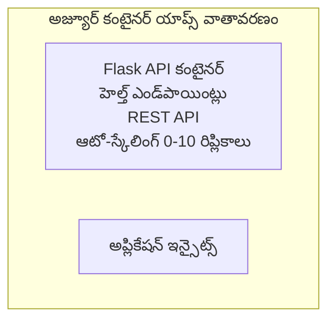

# సులభమైన Flask API - Container App ఉదాహరణ

**Learning Path:** ప్రారంభిక ⭐ | **Time:** 25-35 నిమిషాలు | **Cost:** $0-15/నెల

పూర్తిగా పనిచేసే Python Flask REST APIని Azure Container Appsలో Azure Developer CLI (azd) ఉపయోగించి అమర్చిన ఉదాహరణ. ఈ ఉదాహరణ కంటెయినర్ డిప్లాయ్‌మెంట్, ఆటో-స్కేలింగ్, మరియు మానిటరింగ్ మౌలిక విషయాలు చూపిస్తుంది.

## 🎯 మీరు ఏమి నేర్చుకుంటారు

- Python అప్లికేషన్‌ను కంటెయినర్ రూపంలో Azureకు డిప్లాయ్ చేయడం
- scale-to-zeroతో ఆటో-స్కేలింగ్‌ను కాన్ఫిగర్ చేయడం
- హెల్త్ ప్రోబ్‌లు మరియు రెడినెస్ చెక్లు అమలు చేయడం
- అప్లికేషన్ లాగ్‌లు మరియు మెట్రిక్స్‌ను మానిటర్ చేయడం
- వేగవంతమైన డిప్లాయ్‌మెంట్ కోసం Azure Developer CLI ఉపయోగించడం

## 📦 ఏమి ఉంటుంది

✅ **Flask Application** - CRUD ఆపరేషన్లు కలిగిన పూర్తి REST API (`src/app.py`)  
✅ **Dockerfile** - ప్రొడక్షన్-రెడి కంటెయినర్ కాన్ఫిగరేషన్  
✅ **Bicep Infrastructure** - Container Apps పర్యావరణం మరియు API డిప్లాయ్‌మెంట్  
✅ **AZD Configuration** - ఒక కమాండ్ డిప్లాయ్‌మెంట్ సెటప్  
✅ **Health Probes** - లైవ్‌నెస్ మరియు రెడినెస్ చెక్స్ కాన్ఫిగర్ చేయబడ్డాయి  
✅ **Auto-scaling** - HTTP లోడ్ ఆధారంగా 0-10 రిప్లికాస్  

## రూపకల్పన


## ముందస్తు అవసరాలు

### కావలసినవి
- **Azure Developer CLI (azd)** - [ఇన్స్టాల్ గైడ్](https://learn.microsoft.com/azure/developer/azure-developer-cli/install-azd)
- **Azure subscription** - [ఉచిత ఖాతా](https://azure.microsoft.com/free/)
- **Docker Desktop** - [Docker ఇన్స్టాల్ చేయండి](https://www.docker.com/products/docker-desktop/) (లోకల్ టెస్టింగ్ కోసం)

### ముందస్తు అవసరాలను తనిఖీ చేయండి

```bash
# azd వెర్షన్ తనిఖీ చేయండి (కనీసం 1.5.0 అవసరం)
azd version

# Azure లాగిన్‌ని నిర్ధారించండి
azd auth login

# Docker తనిఖీ చేయండి (ఐచ్ఛికం, స్థానిక పరీక్ష కోసం)
docker --version
```

## ⏱️ డిప్లాయ్‌మెంట్ సమయం

| దశ | కాలవ్యవధి | ఏం జరుగుతుంది |
|-------|----------|--------------||
| పర్యావరణం సెటప్ | 30 సెకన్లు | azd పర్యావరణం సృష్టించడం |
| కంటెయినర్ బిల్డ్ | 2-3 నిమిషాలు | Docker ద్వారా Flask అప్లికేషన్ బిల్డ్ చేయడం |
| ఇన్ఫ్రాస్ట్రక్చర్ ప్రొవిజనింగ్ | 3-5 నిమిషాలు | Container Apps, రిజిస్ట్రి, మానిటరింగ్ సృష్టించడం |
| అప్లికేషన్ డిప్లాయ్ | 2-3 నిమిషాలు | ఇమేజ్‌ను పుష్ చేసి Container Appsకు డిప్లాయ్ చేయడం |
| **మొత్తం** | **8-12 నిమిషాలు** | పూర్తి డిప్లాయ్‌మెంట్ సిద్ధం |

## శీఘ్ర ప్రారంభం

```bash
# ఉదాహరణకు వెళ్ళండి
cd examples/container-app/simple-flask-api

# పరిసరాన్ని ప్రారంభించండి (అద్వితీయమైన పేరు ఎంచుకోండి)
azd env new myflaskapi

# అన్నింటినీ అమలు చేయండి (మౌలిక నిర్మాణం + అప్లికేషన్)
azd up
# మీకు ఈ విషయాలు అడగబడతాయి:
# 1. Azure సభ్యత్వాన్ని ఎంచుకోండి
# 2. ప్రాంతం ఎంచుకోండి (ఉదాహరణకు: eastus2)
# 3. డిప్లాయ్‌మెంట్ కోసం 8-12 నిమిషాలు వేచి ఉండండి

# మీ API ఎండ్‌పాయింట్‌ను పొందండి
azd env get-values

# APIని పరీక్షించండి
curl $(azd env get-value API_ENDPOINT)/health
```

**అంచనా ఫలితం:**
```json
{
  "status": "healthy",
  "timestamp": "2025-11-19T10:30:00Z",
  "service": "simple-flask-api",
  "version": "1.0.0"
}
```

## ✅ డిప్లాయ్‌మెంట్‌ను తనిఖీ చేయండి

### దశ 1: డిప్లాయ్‌మెంట్ స్థితిని తనిఖీ చేయండి

```bash
# డిప్లాయ్ చేసిన సేవలను చూడండి
azd show

# ఆశించిన అవుట్‌పుట్ చూపిస్తుంది:
# - సేవ: api
# - ఎండ్‌పాయింట్: https://ca-api-[env].xxx.azurecontainerapps.io
# - స్థితి: నడుస్తోంది
```

### దశ 2: API ఎండ్‌పాయింట్లను పరీక్షించండి

```bash
# API ఎండ్‌పాయింట్ పొందండి
API_URL=$(azd env get-value API_ENDPOINT)

# సర్వీస్ ఆరోగ్యాన్ని పరీక్షించండి
curl $API_URL/health

# రూట్ ఎండ్‌పాయింట్‌ను పరీక్షించండి
curl $API_URL/

# ఒక అంశాన్ని సృష్టించండి
curl -X POST $API_URL/api/items \
  -H "Content-Type: application/json" \
  -d '{"name": "Test Item", "description": "My first item"}'

# అన్ని అంశాలను పొందండి
curl $API_URL/api/items
```

**విజయ ప్రమాణాలు:**
- ✅ హెల్త్ ఎండ్‌పాయింట్ HTTP 200 ని రిటర్న్ చేస్తుంది
- ✅ రూట్ ఎండ్‌పాయింట్ API సమాచారం చూపిస్తుంది
- ✅ POST ఐటెంను సృష్టిస్తుంది మరియు HTTP 201 ని రిటర్న్ చేస్తుంది
- ✅ GET సృష్టించిన ఐటెంలను రిటర్న్ చేస్తుంది

### దశ 3: లాగ్‌లు చూడండి

```bash
# azd monitor ఉపయోగించి ప్రత్యక్ష లాగ్‌లను ప్రసారం చేయండి
azd monitor --logs

# లేదా Azure CLI ఉపయోగించండి:
az containerapp logs show --name api --resource-group $RG_NAME --follow

# మీకు ఇవి కనిపించాలి:
# - Gunicorn ప్రారంభ సందేశాలు
# - HTTP అభ్యర్థనల లాగ్‌లు
# - అనువర్తన సమాచారం లాగ్‌లు
```

## ప్రాజెక్ట్ నిర్మాణం

```
simple-flask-api/
├── azure.yaml              # AZD configuration
├── infra/
│   ├── main.bicep         # Main infrastructure
│   ├── main.parameters.json
│   └── app/
│       ├── container-env.bicep
│       └── api.bicep
└── src/
    ├── app.py             # Flask application
    ├── requirements.txt
    └── Dockerfile
```

## API ఎండ్‌పాయింట్లు

| ఎండ్‌పాయింట్ | మెథడ్ | వివరణ |
|----------|--------|-------------|
| `/health` | GET | హెల్త్ చెక్ |
| `/api/items` | GET | అన్ని ఐటెంలను జాబితా చేస్తుంది |
| `/api/items` | POST | కొత్త ఐటెమ్ సృష్టించండి |
| `/api/items/{id}` | GET | నిర్దిష్ట ఐటెమ్ పొందండి |
| `/api/items/{id}` | PUT | ఐటెమ్‌ను నవీకరించండి |
| `/api/items/{id}` | DELETE | ఐటెమ్‌ను తొలగించండి |

## కాన్ఫిగరేషన్

### పర్యావరణ వేరియబుల్స్

```bash
# కస్టమ్ కాన్ఫిగరేషన్ సెట్ చేయండి
azd env set PORT 8000
azd env set LOG_LEVEL info
azd env set MAX_REPLICAS 20
```

### స్కేలింగ్ కాన్ఫిగరేషన్

API HTTP ట్రాఫిక్ ఆధారంగా ఆటోమేటిగ్గా స్కేల్ అవుతుంది:
- **Min Replicas**: 0 (ఆయిదైనప్పుడు జీరోకి స్కేల్ అవుతుంది)
- **Max Replicas**: 10
- **Concurrent Requests per Replica**: 50

## డెవలప్మెంట్

### స్థానికంగా రన్ చేయండి

```bash
# డిపెండెన్సీలు ఇన్‌స్టాల్ చేయండి
cd src
pip install -r requirements.txt

# యాప్‌ను నడపండి
python app.py

# స్థానికంగా పరీక్షించండి
curl http://localhost:8000/health
```

### కంటెయినర్ బిల్డ్ చేసి టెస్ట్ చేయండి

```bash
# డాకర్ ఇమేజ్‌ను నిర్మించండి
docker build -t flask-api:local ./src

# స్థానికంగా కంటైనర్‌ను నడపండి
docker run -p 8000:8000 flask-api:local

# కంటైనర్‌ను పరీక్షించండి
curl http://localhost:8000/health
```

## డిప్లాయ్‌మెంట్

### పూర్తి డిప్లాయ్‌మెంట్

```bash
# మౌలిక సదుపాయాలు మరియు అనువర్తనాన్ని అమలు చేయండి
azd up
```

### కోడ్-మాత్రమే డిప్లాయ్‌మెంట్

```bash
# కేవలం అప్లికేషన్ కోడ్‌ను డిప్లాయ్ చేయండి (ఇన్ఫ్రాస్ట్రక్చర్ మారలేదు)
azd deploy api
```

### కాన్ఫిగరేషన్‌ను అప్‌డేట్ చేయడం

```bash
# ఎన్విరాన్‌మెంట్ వేరియబుల్స్‌ను నవీకరించండి
azd env set API_KEY "new-api-key"

# కొత్త కాన్ఫిగరేషన్‌తో మళ్లీ డిప్లాయ్ చేయండి
azd deploy api
```

## మానిటరింగ్

### లాగ్‌లు చూడండి

```bash
# azd monitor ఉపయోగించి ప్రత్యక్ష లాగ్‌లను స్ట్రీమ్ చేయండి
azd monitor --logs

# లేదా Container Apps కోసం Azure CLI ఉపయోగించండి:
az containerapp logs show --name api --resource-group $RG_NAME --follow

# చివరి 100 లైన్లను చూడండి
az containerapp logs show --name api --resource-group $RG_NAME --tail 100
```

### మెట్రిక్స్‌ని పర్యవేక్షించండి

```bash
# Azure Monitor డ్యాష్‌బోర్డు తెరవండి
azd monitor --overview

# నిర్దిష్ట మెట్రిక్‌లను చూడండి
az monitor metrics list \
  --resource $(azd show --output json | jq -r '.services.api.resourceId') \
  --metric "Requests,ResponseTime"
```

## టెస్టింగ్

### హెల్త్ చెక్

```bash
curl $(azd show --output json | jq -r '.services.api.endpoint')/health
```

అంచనా ప్రతిస్పందన:
```json
{
  "status": "healthy",
  "timestamp": "2025-11-19T10:30:00Z"
}
```

### ఐటెమ్ సృష్టించండి

```bash
curl -X POST $(azd show --output json | jq -r '.services.api.endpoint')/api/items \
  -H "Content-Type: application/json" \
  -d '{"name": "Test Item", "description": "A test item"}'
```

### అన్ని ఐటెంలు పొందండి

```bash
curl $(azd show --output json | jq -r '.services.api.endpoint')/api/items
```

## ఖర్చు ఆప్టిమైజేషన్

ఈ డిప్లాయ్‌మెంట్ scale-to-zero ఉపయోగిస్తుంది, కాబట్టి API అభ్యర్థనలు ప్రాసెస్ చేస్తున్నప్పుడు మాత్రమే మీరు చెల్లిస్తారు:

- **Idle cost**: ~$0/నెల (జీరోకి స్కేల్ అవుతుంది)
- **Active cost**: ~$0.000024/సెకను ప్రతి రిప్లికా
- **అంచనా నెలవారీ ఖర్చు** (తేలికైన ఉపయోగం): $5-15

### ఖర్చులను మరింత తగ్గించండి

```bash
# డెవ్ కోసం గరిష్ట రిప్లికలను తగ్గించండి
azd env set MAX_REPLICAS 3

# చిన్న నిష్క్రియ సమయావధి ఉపయోగించండి
azd env set SCALE_TO_ZERO_TIMEOUT 300  # 5 నిమిషాలు
```

## సమస్య పరిష్కారం

### కంటెయినర్ ప్రారంభం కావడం లేదు

```bash
# Azure CLI ఉపయోగించి కంటైనర్ లాగ్‌లను తనిఖీ చేయండి
az containerapp logs show --name api --resource-group $RG_NAME --tail 100

# Docker ఇమేజ్‌లు స్థానికంగా నిర్మించబడుతున్నాయా అని నిర్ధారించండి
docker build -t test ./src
```

### API యాక్సెస్ చేయలేకపోతోంది

```bash
# ఇన్‌గ్రెస్ బాహ్యమైనదే అని నిర్ధారించండి
az containerapp show --name api --resource-group rg-simple-flask-api \
  --query properties.configuration.ingress.external
```

### అధిక స్పందన సమయాలు

```bash
# CPU/మెమరీ వినియోగాన్ని తనిఖీ చేయండి
az monitor metrics list \
  --resource $(azd show --output json | jq -r '.services.api.resourceId') \
  --metric "CPUPercentage,MemoryPercentage"

# అవసరం ఉంటే వనరులను పెంచండి
az containerapp update --name api --resource-group rg-simple-flask-api \
  --cpu 1.0 --memory 2Gi
```

## శుభ్రపరచడం

```bash
# అన్ని వనరులను తొలగించండి
azd down --force --purge
```

## తదుపరి దశలు

### ఈ ఉదాహరణను విస్తరించండి

1. **డేటాబేస్ జత చేయండి** - Azure Cosmos DB లేదా SQL Databaseని ఇంటిగ్రేట్ చేయండి
   ```bash
   # infra/main.bicepకు Cosmos DB మాడ్యూల్‌ను జోడించండి
   # app.pyని డేటాబేస్ కనెక్షన్‌తో నవీకరించండి
   ```

2. **ఆథెంటికేషన్ జత చేయండి** - Azure AD లేదా API కీలు అమలు చేయండి
   ```python
   # app.pyకి ఆథెంటికేషన్ మిడిల్‌వేర్ జోడించండి
   from functools import wraps
   ```

3. **CI/CD సెటప్ చేయండి** - GitHub Actions వర్క్‌ఫ్లో
   ```yaml
   # Create .github/workflows/deploy.yml
   name: Deploy to Azure
   on: [push]
   ```

4. **Managed Identity జత చేయండి** - Azure సేవలకు సురక్షిత యాక్సెస్
   ```bicep
   # Update infra/app/api.bicep
   identity: { type: 'SystemAssigned' }
   ```

### సంబంధిత ఉదాహరణలు

- **[డేటాబేస్ యాప్](../../../../../examples/database-app)** - SQL Database తో పూర్తి ఉదాహరణ
- **[మైక్రోసర్వీసెస్](../../../../../examples/container-app/microservices)** - బహు-సేవల ఆర్కిటెక్చర్
- **[Container Apps Master Guide](../README.md)** - అన్ని కంటెయినర్ నమూనాలు

### అభ్యాస వనరులు

- 📚 [AZD For Beginners Course](../../../README.md) - ప్రధాన కోర్సు హోమ్
- 📚 [Container Apps Patterns](../README.md) - మరిన్ని డిప్లాయ్‌మెంట్ నమూనాలు
- 📚 [AZD Templates Gallery](https://azure.github.io/awesome-azd/) - కమ్యూనిటీ టెంప్లేట్స్

## అదనపు వనరులు

### డాక్యుమెంటేషన్
- **[Flask Documentation](https://flask.palletsprojects.com/)** - Flask ఫ్రేమ్‌వర్క్ గైడ్
- **[Azure Container Apps](https://learn.microsoft.com/azure/container-apps/)** - అధికారిక Azure డాక్యుమెంటేషన్
- **[Azure Developer CLI](https://learn.microsoft.com/azure/developer/azure-developer-cli/)** - azd కమాండ్ సూచిక

### ట్యుటోరియల్స్
- **[Container Apps Quickstart](https://learn.microsoft.com/azure/container-apps/quickstart-portal)** - మీ మొదటి యాప్ డిప్లాయ్ చేయండి
- **[Python on Azure](https://learn.microsoft.com/azure/developer/python/)** - Python డెవలప్మెంట్ గైడ్
- **[Bicep Language](https://learn.microsoft.com/azure/azure-resource-manager/bicep/)** - కోడ్ రూపంలో ఇన్ఫ్రాస్ట్రక్చర్

### టూల్స్
- **[Azure Portal](https://portal.azure.com)** - విజువల్‌గా వనరులను నిర్వహించండి
- **[VS Code Azure Extension](https://marketplace.visualstudio.com/items?itemName=ms-azuretools.vscode-azurecontainerapps)** - IDE ఇంటిగ్రేషన్

---

**🎉 శుభాకాంక్షలు!** మీరు ఆటో-స్కేలింగ్ మరియు మానిటరింగ్ తో Azure Container Appsలో ప్రొడక్షన్-తయారైన Flask APIని డిప్లాయ్ చేసారు.

**ప్రశ్నలున్నాయా?** [ఒక ఇష్యూ తెరవండి](https://github.com/microsoft/AZD-for-beginners/issues) లేదా [FAQ](../../../resources/faq.md) చూడండి

---

<!-- CO-OP TRANSLATOR DISCLAIMER START -->
**అస్పష్టీకరణ**:
ఈ పత్రాన్ని AI అనువాద సేవ [Co-op Translator](https://github.com/Azure/co-op-translator) ద్వారా అనువదించబడింది. మేము ఖచ్చితత్వానికి ప్రయత్నించినప్పటికీ, ఆటోమేటెడ్ అనువాదాల్లో తప్పులు లేదా ఖచ్చితత్వ లోపాలు ఉండవచ్చని దయచేసి గమనించండి. మూల భాషలో ఉన్న ఒరిజినల్ డాక్యుమెంట్‌ను అధికారిక మూలంగా పరిగణించాలి. ముఖ్యమైన సమాచారానికి, ప్రొఫెషనల్ మానవ అనువాదం సిఫార్సు చేయబడుతుంది. ఈ అనువాదాన్ని ఉపయోగించడంతో ఏర్పడే ఏవైనా అవగాహనా లోపాలు లేదా తప్పుగా అర్థం చేసుకోవడం వల్ల కలిగే పరిణామాలకు మేము బాధ్యులు కాదు.
<!-- CO-OP TRANSLATOR DISCLAIMER END -->