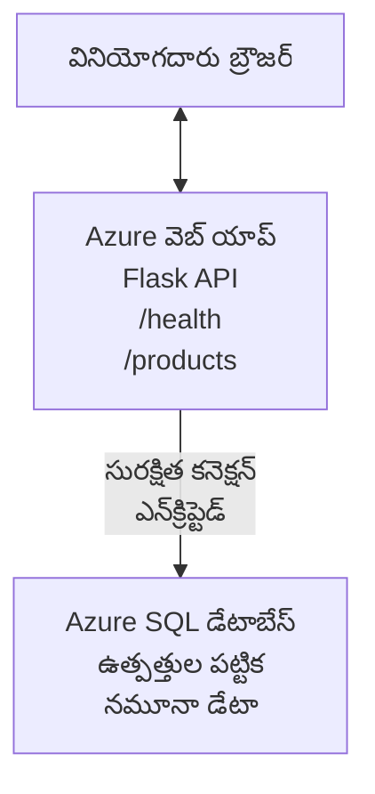

# AZD తో Microsoft SQL డేటాబేస్ మరియు వెబ్ యాప్‌ను డిప్లాయ్ చేయడం

⏱️ **అంచనా సమయం**: 20-30 నిమిషాలు | 💰 **అంచనా ఖర్చు**: ~$15-25/నెల | ⭐ **సంక్లిష్టత**: మధ్యస్థ

ఈ **పూర్తి, పని చేసే ఉదాహరణ** ద్వారా మీరు [Azure Developer CLI (azd)](https://learn.microsoft.com/azure/developer/azure-developer-cli/) ను ఉపయోగించి Microsoft SQL డేటాబేస్‌తో కూడిన Python Flask వెబ్ అప్లికేషన్‌ను Azureకి ఎలా డిప్లాయ్ చేయాలో చూడవచ్చు. అన్ని కోడ్‌లు చేర్చబడ్డాయి మరియు పరీక్షించబడ్డాయి—బాహ్య ఆధారాలు అవసరం లేదు.

## మీరు ఏమి నేర్చుకుంటారు

ఈ ఉదాహరణ పూర్తి చేయడం ద్వారా మీరు:
- ఇన్ఫ్రా-జంటగా కోడ్ ఉపయోగించి మల్టీ-టియర్ అప్లికేషన్ (వెబ్ యాప్ + డేటాబేస్)ను డిప్లాయ్ చేయడం
- రహస్యాలను హార్డ్‌కోడ్ చేయకుండా భద్రంగా డేటాబేస్ కనెక్షన్లను కాన్ఫిగర్ చేయడం
- Application Insights తో అప్లికేషన్ ఆరోగ్యాన్ని మానిటర్ చేయడం
- AZD CLI ద్వారా Azure వనరులను సమర్థవంతంగా నిర్వహించడం
- భద్రత, ఖర్చు ఆప్టిమైజేషన్ మరియు ఆబ్జర్వబిలిటీ కోసం Azure ఉత్తమ అనుచరణలను అనుసరించడం

## సన్నివేశ అవలోకనం
- **Web App**: డేటాబేస్ కనెక్టివిటీతో కూడిన Python Flask REST API
- **Database**: నమూనా డేటాతో Azure SQL Database
- **Infrastructure**: Bicep ఉపయోగించి ప్రావిజన్ చేయబడింది (మాడ్యులర్, పునఃఉపయోగయోగ్య టెంప్లేట్లు)
- **Deployment**: `azd` కమాండ్లతో పూర్తిగా ఆటోమేట్ చేయబడింది
- **Monitoring**: లాగ్స్ మరియు టెలిమెట్రీ కోసం Application Insights

## ముందస్తు అవసరాలు

### అవసరమైన సాధనాలు

ప్రారంభించే ముందు, మీరు ఈ టూల్స్ ఇన్‌స్టాల్ చేసినట్లు ధృవీకరించండి:

1. **[Azure CLI](https://learn.microsoft.com/cli/azure/install-azure-cli)** (వర్షన్ 2.50.0 లేదా అంతకంటే కొత్త)
   ```sh
   az --version
   # ఆశించిన ఫలితం: azure-cli 2.50.0 లేదా అంతకంటే పైగా
   ```

2. **[Azure Developer CLI (azd)](https://learn.microsoft.com/azure/developer/azure-developer-cli/install-azd)** (వర్షన్ 1.0.0 లేదా అంతకంటే కొత్త)
   ```sh
   azd version
   # ఆశించిన అవుట్పుట్: azd సంచిక 1.0.0 లేదా అంతకంటే ఎక్కువ
   ```

3. **[Python 3.8+](https://www.python.org/downloads/)** (లోకల్ డెవలప్మెంట్ కోసం)
   ```sh
   python --version
   # ఆశించిన ఫలితం: Python 3.8 లేదా అంతకంటే పైగా
   ```

4. **[Docker](https://www.docker.com/get-started)** (ఐచ్ఛికం, లోకల్ కంటైనరైజ్డ్ డెవలప్మెంట్ కోసం)
   ```sh
   docker --version
   # అనుకున్న అవుట్పుట్: Docker వెర్షన్ 20.10 లేదా ఎక్కువ
   ```

### Azure అవసరాలు

- ఒక యాక్టివ్ **Azure subscription** ([create a free account](https://azure.microsoft.com/free/))
- మీ సబ్‌స్క్రిప్షన్‌లో వనరులను సృష్టించే అనుమతులు
- సబ్‌స్క్రిప్షన్ లేదా రిసోర్స్ గ్రూప్‌పై **Owner** లేదా **Contributor** పాత్ర

### అవగాహన అవసరాలు

ఇది ఒక **మధ్యస్థ-స్థాయి** ఉదాహరణ. మీరు తెలుసుకోవలసినవి:
- బేసిక్ కమాండ్-లైన్ ఆపరేషన్లు
- క్లౌడ్ యొక్క ప్రాథమిక అభిజ్ఞానం (వనరులు, రిసోర్స్ గ్రూపులు)
- వెబ్ అప్లికేషన్లు మరియు డేటాబేస్‌ల గురించి బేసిక్ అవగాహన

**AZD కి కొత్తారా?** మొదట [Getting Started guide](../../docs/chapter-01-foundation/azd-basics.md) ను పరిశీలించండి.

## ఆర్కిటెక్చర్

ఈ ఉదాహరణ వెబ్ అప్లికేషన్ మరియు SQL డేటాబేస్ కలిగిన రెండు-టియర్ ఆర్కిటెక్చర్‌ను డిప్లాయ్ చేస్తుంది:


**వనరుల అమరిక:**
- **Resource Group**: అన్ని వనరుల కోసం కంటైనర్
- **App Service Plan**: Linux ఆధారిత హోస్టింగ్ (ఖర్చు సామర్థ్యానికి B1 టియర్)
- **Web App**: Flask అప్లికేషన్‌తో Python 3.11 రన్‌టైమ్
- **SQL Server**: TLS 1.2 కనీసంతో మేనేజ్‌డ్ డేటాబేస్ సర్వర్
- **SQL Database**: Basic టియర్ (2GB, డెవలప్‌మెంట్/టెస్టింగ్‌కు అనుకూలం)
- **Application Insights**: మానిటరింగ్ మరియు లాగింగ్
- **Log Analytics Workspace**: కేంద్రీకృత లాగ్ స్టోరేజ్

**ఉపమా**: దీన్ని ఒక రెస్టారెంట్ (వెబ్ యాప్) మరియు ఒక వాక్-ఇన్ ఫ్రీజర్ (డేటాబేస్) వంటి భావించండి. కస్టమర్లు మెనూలోనుండి ఆర్డర్ చేస్తారు (API ఎండ్‌పాయింట్లు), కిచెన్ (Flask యాప్) ఫ్రీజర్ నుండి పదార్థాలు (డేటా) తెస్తుంది. రెస్టారెంట్ మేనేజర్ (Application Insights) జరిగే అన్నింటిని ట్రాక్ చేస్తుంది.

## ఫోల్డర్ నిర్మాణం

ఈ ఉదాహరణలో అన్ని ఫైళ్లు చేర్చబడ్డాయి—బాహ్య ఆధారాలు అవసరం లేదు:

```
examples/database-app/
│
├── README.md                    # This file
├── azure.yaml                   # AZD configuration file
├── .env.sample                  # Sample environment variables
├── .gitignore                   # Git ignore patterns
│
├── infra/                       # Infrastructure as Code (Bicep)
│   ├── main.bicep              # Main orchestration template
│   ├── abbreviations.json      # Azure naming conventions
│   └── resources/              # Modular resource templates
│       ├── sql-server.bicep    # SQL Server configuration
│       ├── sql-database.bicep  # Database configuration
│       ├── app-service-plan.bicep  # Hosting plan
│       ├── app-insights.bicep  # Monitoring setup
│       └── web-app.bicep       # Web application
│
└── src/
    └── web/                    # Application source code
        ├── app.py              # Flask REST API
        ├── requirements.txt    # Python dependencies
        └── Dockerfile          # Container definition
```

**ప్రతి ఫైల్ ఏమి చేస్తుంది:**
- **azure.yaml**: AZDకి ఏమి డిప్లాయ్ చేయాలో మరియు ఎక్కడ చేస్తారో సూచిస్తుంది
- **infra/main.bicep**: అన్ని Azure వనరులను నిర్వహిస్తుంది
- **infra/resources/*.bicep**: వ్యక్తిగత వనరు నిర్వచనాలు (పునఃఉపయోగం కోసం మాడ్యులర్)
- **src/web/app.py**: డేటాబేస్ లాజిక్ కలిగిన Flask అప్లికేషన్
- **requirements.txt**: Python ప్యాకేజ్ డిపెండెన్సీలు
- **Dockerfile**: డిప్లాయ్ కోసం కంటైనరైజేషన్ సూచనలు

## త్వరితప్రారంభం (దశల వారీగా)

### దశ 1: క్లోన్ చేసి ఫోల్డర్‌లోకి వెళ్లండి

```sh
git clone https://github.com/microsoft/AZD-for-beginners.git
cd AZD-for-beginners/examples/database-app
```

**✓ Success Check**: మీరు `azure.yaml` మరియు `infra/` ఫోల్డర్‌ను చూస్తున్నారా నిర్ధారించండి:
```sh
ls
# అనుకోబడింది: README.md, azure.yaml, infra/, src/
```

### దశ 2: Azure తో ప్రామాణీకరణ చేయండి

```sh
azd auth login
```

ఇది Azure ప్రామాణీకరణ కోసం మీ బ్రౌజర్‌ను తెరుస్తుంది. మీ Azure క్రెడెన్షియల్స్‌తో సైన్ ఇన్ చేయండి.

**✓ Success Check**: మీరు ఈవిధంగా చూడాలి:
```
Logged in to Azure.
```

### దశ 3: ఎన్‌విరాన్మెంట్‌ను ఆరంభించండి

```sh
azd init
```

**ఏం జరుగుతుంది**: AZD మీ డిప్లాయ్‌మెంట్‌కు స్థానిక కాన్ఫిగరేషన్ సృష్టిస్తుంది.

**మీకు కనిపించే ప్రాంప్ట్‌లు**:
- **Environment name**: ఒక చిన్న పేరు నమోదు చేయండి (ఉదా., `dev`, `myapp`)
- **Azure subscription**: జాబితాలో నుండి మీ సబ్‌స్క్రిప్షన్‌ను ఎంచుకోండి
- **Azure location**: ఒక ప్రాంతాన్ని ఎంచుకోండి (ఉదా., `eastus`, `westeurope`)

**✓ Success Check**: మీరు ఈవిధంగా చూడాలి:
```
SUCCESS: New project initialized!
```

### దశ 4: Azure వనరులను ప్రావిజన్ చేయండి

```sh
azd provision
```

**ఏం జరుగుతుంది**: AZD అన్ని ఇన్ఫ్రాస్ట్రక్చర్‌ను డిప్లాయ్ చేస్తుంది (5-8 నిమిషాలు పడుతుంది):
1. రిసోర్స్ గ్రూప్‌ను సృష్టిస్తుంది
2. SQL సర్వర్ మరియు డేటాబేస్‌ను సృష్టిస్తుంది
3. App Service Plan ను సృష్టిస్తుంది
4. Web App ను సృష్టిస్తుంది
5. Application Insights‌ను సృష్టిస్తుంది
6. నెట్‌వర్కింగ్ మరియు భద్రతను కాన్ఫిగర్ చేస్తుంది

**మీకు అడిగే ప్రాంప్ట్‌లు**:
- **SQL admin username**: ఒక వినియోగదారు పేరు నమోదు చేయండి (ఉదా., `sqladmin`)
- **SQL admin password**: ఒక బలమైన పాస్‌వర్డ్ నమోదు చేయండి (దాన్ని సేవ్ చేసుకోండి!)

**✓ Success Check**: మీరు ఈవిధంగా చూడాలి:
```
SUCCESS: Your application was provisioned in Azure in X minutes Y seconds.
You can view the resources created under the resource group rg-<env-name> in Azure Portal:
https://portal.azure.com/#@/resource/subscriptions/.../resourceGroups/rg-<env-name>
```

**⏱️ సమయం**: 5-8 నిమిషాలు

### దశ 5: అప్లికేషన్‌ను డిప్లాయ్ చేయండి

```sh
azd deploy
```

**ఏం జరుగుతుంది**: AZD మీ Flask అప్లికేషన్‌ను బిల్డ్ చేసి డిప్లాయ్ చేస్తుంది:
1. Python అప్లికేషన్‌ను ప్యాకేజ్ చేస్తుంది
2. Docker కంటెయినర్‌ను బిల్డ్ చేస్తుంది
3. Azure Web App కు పుష్ చేస్తుంది
4. నమూనా డేటాతో డేటాబేస్‌ను ప్రారంభిస్తుంది
5. అప్లికేషన్‌ను స్టార్ట్ చేస్తుంది

**✓ Success Check**: మీరు ఈవిధంగా చూడాలి:
```
SUCCESS: Your application was deployed to Azure in X minutes Y seconds.
You can view the resources created under the resource group rg-<env-name> in Azure Portal:
https://portal.azure.com/#@/resource/subscriptions/.../resourceGroups/rg-<env-name>
```

**⏱️ సమయం**: 3-5 నిమిషాలు

### దశ 6: అప్లికేషన్‌ను బ్రౌజ్ చేయండి

```sh
azd browse
```

ఇది బ్రౌజర్‌లో మీ డిప్లాయ్ చేసిన వెబ్ యాప్‌ను ఈ URL వద్ద తెరుస్తుంది `https://app-<unique-id>.azurewebsites.net`

**✓ Success Check**: మీరు JSON అవుట్‌పుట్‌ని చూడాలి:
```json
{
  "message": "Welcome to the Database App API",
  "endpoints": {
    "/": "This help message",
    "/health": "Health check endpoint",
    "/products": "List all products",
    "/products/<id>": "Get product by ID"
  }
}
```

### దశ 7: API ఎండ్‌పాయింట్లను పరీక్షించండి

**Health Check** (డేటాబేస్ కనెక్షన్‌ను నిర్ధారించండి):
```sh
curl https://app-<your-id>.azurewebsites.net/health
```

**అంచనా ప్రతిస్పందన**:
```json
{
  "status": "healthy",
  "database": "connected"
}
```

**ఉత్పత్తుల జాబితా** (నమూనా డేటా):
```sh
curl https://app-<your-id>.azurewebsites.net/products
```

**అంచనా ప్రతిస్పందన**:
```json
[
  {
    "id": 1,
    "name": "Laptop",
    "description": "High-performance laptop",
    "price": 1299.99,
    "created_at": "2025-11-19T10:30:00"
  },
  ...
]
```

**ఒక ఉత్పత్తి పొందండి**:
```sh
curl https://app-<your-id>.azurewebsites.net/products/1
```

**✓ Success Check**: అన్ని ఎండ్‌పాయింట్లు تېరింగ్ లేకుండా JSON డేటా తిరిగి ఇస్తున్నాయో నిర్ధారించండి.

---

**🎉 అభినందనలు!** మీరు AZD ద్వారా Azureకి వనరులతో కూడిన వెబ్ అప్లికేషన్‌ను విజయవంతంగా డిప్లాయ్ చేశారు.

## కాన్ఫిగరేషన్ లోతైన వివరాలు

### పరిసర వేరియబుల్స్ (Environment Variables)

రహస్యాలు Azure App Service కాన్ఫిగరేషన్ ద్వారా భద్రంగా నిర్వహించబడతాయి—**సోర్స్ కోడ్‌లో ఎప్పుడూ హార్డ్‌కోడ్ చేయకండి**.

**AZD ద్వారా ఆటోమేటిక్ గా కాన్ఫిగర్ చేయబడింది**:
- `SQL_CONNECTION_STRING`: ఎన్‌క్రిప్టెడ్ క్రెడెన్షియల్స్‌తో డేటాబేస్ కనెక్షన్
- `APPLICATIONINSIGHTS_CONNECTION_STRING`: మానిటరింగ్ టెలిమెట్రీ ఎండ్‌పాయింట్
- `SCM_DO_BUILD_DURING_DEPLOYMENT`: ఆటోమేటిక్ డిపెండెన్సీ ఇన్‌స్టాలేషన్‌ను యాక్టివేట్ చేస్తుంది

**రహస్యాలు ఎక్కడ నిల్వ ఉంటాయి**:
1. `azd provision` సమయంలో, మీరు SQL క్రెడెన్షియల్స్‌ను సురక్షిత ప్రాంప్ట్‌ల ద్వారా అందిస్తారు
2. AZD ఇవి మీ స్థానిక `.azure/<env-name>/.env` ఫైల్‌లో నిల్వ చేస్తుంది (git-ignore చేయబడినది)
3. AZD వాటిని Azure App Service కాన్ఫిగరేషన్‌లో ఇంజెక్ట్ చేస్తుంది (రిస్ట్‌లో ఎన్‌క్రిప్టెడ్)
4. అప్లికేషన్ రన్‌టైంలో వాటిని `os.getenv()` ద్వారా చదవుతుంది

### లోకల్ డెవలప్మెంట్

లోకల్ టెస్టింగ్ కోసం, నమూనా నుండి `.env` ఫైల్ సృష్టించండి:

```sh
cp .env.sample .env
# మీ స్థానిక డేటాబేస్ కనెక్షన్‌తో .envని సవరించండి
```

**లోకల్ డెవలప్మెంట్ వర్క్ఫ్లో**:
```sh
# డిపెండెన్సీలు ఇన్‌స్టాల్ చేయండి
cd src/web
pip install -r requirements.txt

# పర్యావరణ వేరియబుల్స్‌ను సెట్ చేయండి
export SQL_CONNECTION_STRING="your-local-connection-string"

# అప్లికేషన్‌ను চালించండి
python app.py
```

**లోకల్‌గా పరీక్షించండి**:
```sh
curl http://localhost:8000/health
# అనుకోబడినది: {"status": "healthy", "database": "connected"}
```

### ఇన్‌ఫ్రాస్ట్రక్చర్-అస్-కోడ్

అన్ని Azure వనరులు **Bicep టెంప్లేట్ల** (`infra/` ఫోల్డర్) లో నిర్వచించబడ్డాయి:

- **మాడ్యులర్ డిజైన్**: ప్రతి వనరు రకానికి స్వతంత్ర ఫైల్ ఉంటుంది, పునఃఉపయోగానికి అనుకూలం
- **పారామెటరైజ్డ్**: SKUs, ప్రాంతాలు, నామకరణాన్ని تخصيص చేయవచ్చు
- **ఉత్తమ అభ్యాసాలు**: Azure నామకరణ ప్రమాణాలు మరియు భద్రత డిఫాల్ట్స్‌ను అనుసరిస్తుంది
- **వర్షన్ కంట్రోల్**: ఇన్ఫ్రాస్ట్రక్చర్ మార్పులు Git లో ట్రాక్ చేయబడతాయి

**కస్టమైజేషన్ ఉదాహరణ**:
డేటాబేస్ టియర్ మార్చాలంటే, `infra/resources/sql-database.bicep` ను ఎడిట్ చేయండి:
```bicep
sku: {
  name: 'Standard'  // Changed from 'Basic'
  tier: 'Standard'
  capacity: 10
}
```

## భద్రతా ఉత్తమ అభ్యాసాలు

ఈ ఉదాహరణ Azure భద్రత ఉత్తమ అభ్యాసాలను అనుసరిస్తుంది:

### 1. **సోర్స్ కోడ్‌లో గూఢాంశాలు ఉండవు**
- ✅ క్రెడెన్షియల్స్ Azure App Service కాన్ఫిగరేషన్‌లో నిల్వ చేయబడతాయి (ఎన్‌క్రిప్టెడ్)
- ✅ `.env` ఫైళ్లు Git ద్వారా బహిష్కరించబడ్డాయి (`.gitignore`)
- ✅ ప్రావిజనింగ్ సమయంలో సురక్షిత పారామీటర్లుగా రహస్యాలు అందించబడతాయి

### 2. **ఎన్‌క్రిప్టెడ్ కనెక్షన్లు**
- ✅ SQL Server కోసం కనీసం TLS 1.2
- ✅ Web App కోసం HTTPS-కే మాత్రమే అనుమతించబడింది
- ✅ డేటాబేస్ కనెక్షన్లు ఎన్‌క్రిప్ట్ చేయబడిన చానల్స్ ఉపయోగిస్తాయి

### 3. **నెట్‌వర్క్ భద్రత**
- ✅ SQL Server ఫైర్వాల్ Azure సేవలకు మాత్రమే అనుమతించబడింది
- ✅ పబ్లిక్ నెట్‌వర్క్ యాక్సెస్ పరిమితం చేయబడ్డింది (ప్రైవేట్ ఏండ్‌పాయింట్లతో మరింత బలంగా చేయవచ్చు)
- ✅ Web App పై FTPS డిసేబుల్ చేయబడింది

### 4. **ఆథెంటికేషన్ & ఆథరైజేషన్**
- ⚠️ **ప్రస్తుతము**: SQL authentication (username/password)
- ✅ **ప్రొడక్షన్ సిఫార్సు**: పాస్‌వర్డ్ లేకుండా ఆథెంటికేషన్ కోసం Azure Managed Identity ఉపయోగించండి

**Managed Identityకి అప్‌గ్రేడ్ చేయడానికి** (ప్రొడక్షన్ కోసం):
1. Web App పై managed identity ను ఎనేబుల్ చేయండి
2. identity కు SQL అనుమతులు ఇవ్వండి
3. కనెక్షన్ స్ట్రింగ్‌ను managed identity ఉపయోగించే విధంగా అప్‌డేట్ చేయండి
4. పాస్‌వర్డ్-ఆధారిత ఆథెంటికేషన్ తొలగించండి

### 5. **ఆడిటింగ్ & కంప్లయన్స్**
- ✅ Application Insights అన్ని రిక్వెస్టులు మరియు ఎర్రర్లను లాగ్ చేస్తుంది
- ✅ SQL Database ఆడిటింగ్ ఎనేబుల్ చేయబడింది (కంప్లయన్స్ కోసం కాన్ఫిగర్ చేయవచ్చు)
- ✅ గవర్నెన్స్ కోసం అన్ని వనరులు ట్యాగ్ చేయబడ్డాయి

**ప్రొడక్షన్ ముందు భద్రతా చెక్లిస్ట్**:
- [ ] Azure Defender for SQLని ప్రారంభించండి
- [ ] SQL Database కోసం Private Endpoints కాన్ఫిగర్ చేయండి
- [ ] Web Application Firewall (WAF)ని ఎనేబుల్ చేయండి
- [ ] రహస్య రోటేషన్ కోసం Azure Key Vault అమలులో పెట్టండి
- [ ] Azure AD ఆథెంటికేషన్‌ను కాన్ఫిగర్ చేయండి
- [ ] అన్ని వనరులకు డయాగ్నొస్టిక్ లాగింగ్‌ను ఎనేబుల్ చేయండి

## ఖర్చు ఆప్టిమైజేషన్

**అంచనా మాసిక ఖర్చులు** (నవంబర్ 2025 ప్రకారం):

| వనరు | SKU/టియర్ | అంచనా ఖర్చు |
|----------|----------|----------------|
| App Service Plan | B1 (Basic) | ~$13/month |
| SQL Database | Basic (2GB) | ~$5/month |
| Application Insights | Pay-as-you-go | ~$2/month (తక్కువ ట్రాఫిక్) |
| **మొత్తం** | | **~$20/month** |

**💡 ఖర్చు ఆదా సూచనలు**:

1. **అనుభవం కోసం ఫ్రీ టియర్ ఉపయోగించండి**:
   - App Service: F1 టియర్ (ఉచితం, పరిమిత గంటలు)
   - SQL Database: Azure SQL Database serverless ఉపయోగించండి
   - Application Insights: 5GB/నెల ఉచిత ఇన్గెస్ట్

2. **వినియోగంలో లేనప్పుడు వనరులను నిలిపివేయండి**:
   ```sh
   # వెబ్ యాప్‌ను నిలిపివేయండి (డేటాబేస్‌పై ఖర్చులు ఇంకా కొనసాగుతాయి)
   az webapp stop --name <app-name> --resource-group <rg-name>
   
   # అవసరమైతే తిరిగి ప్రారంభించండి
   az webapp start --name <app-name> --resource-group <rg-name>
   ```

3. **పరీక్షలు పూర్తయిన తరువాత అన్నింటినీ తొలగించండి**:
   ```sh
   azd down
   ```
   ఇది అన్ని వనరులనూ తొలగిస్తుంది మరియు చార్జీలను ఆపుతుంది.

4. **డెవలప్‌మెంట్ vs. ప్రొడక్షన్ SKUs**:
   - **డెవలప్‌మెంట్**: ఈ ఉదాహరణలో ఉపయోగించిన Basic టియర్
   - **ప్రొడక్షన్**: redundancy కలిగిన Standard/Premium టియర్

**ఖర్చు మానిటరింగ్**:
- [Azure Cost Management](https://portal.azure.com/#view/Microsoft_Azure_CostManagement) లో ఖర్చులను చూడండి
- ఆశ్చర్యాలకు గురికాకుండా ఖర్చు అలెర్ట్‌లు సెటప్ చేయండి
- ట్రాకింగ్ కోసం అన్ని వనరులకు `azd-env-name` ట్యాగ్ జోడించండి

**ఫ్రీ టియర్ ప్రత్యామ్నాయం**:
అభ్యాస ప్రయోజనాల కోసం, మీరు `infra/resources/app-service-plan.bicep` ను మార్చవచ్చు:
```bicep
sku: {
  name: 'F1'  // Free tier
  tier: 'Free'
}
```
**గమనిక**: ఫ్రీ టియర్ కు పరిమితులు ఉన్నాయి (రోజుకి 60 నిమిషాల CPU, ఎప్పుడూ ఆన్ అవ్వదు).

## మానిటరింగ్ మరియు పరిశీలన

### అప్లికేషన్ ఇన్‌సైట్స్ సమీకరణం

ఈ ఉదాహరణ లో విస్తృతమైన మానిటరింగ్ కోసం **Application Insights** చేర్చబడింది:

**ఏది మానిటర్ అవుతుంది**:
- ✅ HTTP రిక్వెస్ట్‌లు (లేటెన్సీ, స్టేటస్ కోడ్స్, ఎండ్‌పాయింట్లు)
- ✅ అప్లికేషన్ లోపాలు మరియు.Exceptionలు
- ✅ Flask అప్లికేషన్ నుండి కస్టమ్ లాగింగ్
- ✅ డేటాబేస్ కనెక్షన్ ఆరోగ్యం
- ✅ పనితన మెట్రిక్స్ (CPU, మెమరీ)

**Application Insights యాక్సెస్ చేయడం**:
1. [Azure Portal](https://portal.azure.com) ఓపెన్ చేయండి
2. మీ రిసోర్స్ గ్రూప్ (`rg-<env-name>`) కి వెళ్లండి
3. Application Insights రిసోర్స్ (`appi-<unique-id>`) పై క్లిక్ చేయండి

**ఉపయోగకరమైన క్వెరీస్** (Application Insights → Logs):

**అన్ని రిక్వెస్ట్‌లను చూపించు**:
```kusto
requests
| where timestamp > ago(1h)
| order by timestamp desc
| project timestamp, name, url, resultCode, duration
```

**లోపాలను కనుగొను**:
```kusto
exceptions
| where timestamp > ago(24h)
| order by timestamp desc
| project timestamp, type, outerMessage, operation_Name
```

**హెల్త్ ఎండ్‌పాయింట్‌ను తనిఖీ చేయండి**:
```kusto
requests
| where name contains "health"
| summarize count() by resultCode, bin(timestamp, 1h)
```

### SQL డేటాబేస్ ఆడిటింగ్

**SQL డేటాబేస్ ఆడిటింగ్ ఎనేబుల్ చేయబడింది** ట్రాక్ చేయడానికి:
- డేటాబేస్ యాక్సెస్ ప్యాటర్న్స్
- వైఫల్యమైన లాగిన్ యత్నాలు
- స్కీమా మార్పులు
- డేటా యాక్సెస్ (కంప్లయన్స్ కోసం)

**ఆడిట్ లాగ్‌లను యాక్సెస్ చేయడం**:
1. Azure Portal → SQL Database → Auditing
2. Log Analytics workspace లో లాగ్‌లను చూడండి

### రియల్-టైం మానిటరింగ్

**లైవ్ మెట్రిక్స్‌ను చూడండి**:
1. Application Insights → Live Metrics
2. రియల్-టైంలో రిక్వెస్ట్‌లు, ఫెయిల్యూర్లు మరియు పనితనాన్ని చూడండి

**అలెర్ట్‌లు సెటప్ చేయండి**:
నిందిత సంఘటనల కోసం అలెర్ట్‌లు సృష్టించండి:
- HTTP 500 ఎర్రర్లు > 5 ఐదు నిమిషాల్లో
- డేటాబేస్ కనెక్షన్ వైఫల్యాలు
- ఉన్నత స్పందన సమయం (>2 సెకన్లు)

**అలెర్ట్ సృష్టి ఉదాహరణ**:
```sh
az monitor metrics alert create \
  --name "High-Response-Time" \
  --resource-group <rg-name> \
  --scopes <app-insights-resource-id> \
  --condition "avg requests/duration > 2000" \
  --description "Alert when response time exceeds 2 seconds"
```

## సమస్యలు పరిష్కరణ
### సాధారణ సమస్యలు మరియు పరిష్కారాలు

#### 1. `azd provision` "Location not available" తో విఫలమవుతుంది

**లక్షణం**:
```
Error: The subscription is not registered for the resource type 'components' in the location 'centralus'.
```

**పరిష్కారం**:
వేరే Azure ప్రాంతాన్ని ఎంచుకోండి లేదా రిసోర్స్ ప్రొవైడర్ను రిజిస్టర్ చేయండి:
```sh
az provider register --namespace Microsoft.Insights
```

#### 2. డిప్లాయ్‌మెంట్ సందర్భంగా SQL కనెక్షన్ విఫలమవుతుంది

**లక్షణం**:
```
pyodbc.OperationalError: ('08001', '[08001] [Microsoft][ODBC Driver 18 for SQL Server]TCP Provider...')
```

**పరిష్కారం**:
- SQL Server ఫైర్వాల్ Azure సేవలను అనుమతిస్తున్నదని నిర్ధారించండి (స్వయంగా కాన్ఫిగర్ చేయబడుతుంది)
- `azd provision` సమయంలో SQL అడ్మిన్ పాస్‌వర్డ్ సరిగ్గా నమోదు అయ్యిందా అని తనిఖీ చేయండి
- SQL Server పూర్తి స్థాయిలో ప్రోవిజన్ అయ్యిందని నిర్ధారించండి (2-3 నిమిషాలు పడవచ్చు)

**కనెక్షన్ తనిఖీ చేయండి**:
```sh
# Azure పోర్టల్ నుండి SQL డేటాబేస్ → క్వెరీ ఎడిటర్ కు వెళ్లండి
# మీ ప్రవేశ వివరాలతో కనెక్ట్ అవడానికి ప్రయత్నించండి
```

#### 3. వెబ్ యాప్ "Application Error" చూపిస్తుంది

**లక్షణం**:
బ్రౌజర్ సాధారణ లోపపు పేజీని చూపిస్తుంది.

**పరిష్కారం**:
అప్లికేషన్ లాగ్‌లను తనిఖీ చేయండి:
```sh
# తాజా లాగ్‌లను చూడండి
az webapp log tail --name <app-name> --resource-group <rg-name>
```

**సాధారణ కారణాలు**:
- ఎన్విరాన్మెంట్ వేరియబుల్స్ లేకపోవడం (App Service → Configurationను తనిఖీ చేయండి)
- Python ప్యాకేజ్ ఇన్‌స్టాలేషన్ విఫలమైంది (డిప్లాయ్‌మెంట్ లాగ్‌లను తనిఖీ చేయండి)
- డేటాబేస్ ప్రారంభీకరణలో లోపం (SQL కనెక్టివిటీని తనిఖీ చేయండి)

#### 4. `azd deploy` "Build Error" తో విఫలమవుతుంది

**లక్షణం**:
```
Error: Failed to build project
```

**పరిష్కారం**:
- `requirements.txt`లో ఎలాంటి సింటాక్స్ లోపాలు లేనాయని నిర్ధారించండి
- Python 3.11 `infra/resources/web-app.bicep`లో పేర్కొనబడిందని తనిఖీ చేయండి
- Dockerfileలో సరైన బేస్ ఇమేజ్ ఉంది అని నిర్ధారించండి

**లోకల్‌గా డీబగ్ చేయండి**:
```sh
cd src/web
docker build -t test-app .
docker run -p 8000:8000 test-app
```

#### 5. AZD కమాండ్లు నడిపిస్తున్నప్పుడు "Unauthorized"

**లక్షణం**:
```
ERROR: (Unauthorized) The client '<id>' with object id '<id>' does not have authorization
```

**పరిష్కారం**:
Azureతో మళ్లీ ఆథెంటికేషన్ చేయండి:
```sh
azd auth login
az login
```

మీరు సబ్స్క్రిప్షన్‌పై సరైన అనుమతులు (Contributor role) కలిగి ఉన్నారో నిర్ధారించండి.

#### 6. ఎక్కువ డేటాబేస్ ఖర్చులు

**లక్షణం**:
అప్రత్యాశిత Azure బిల్లు.

**పరిష్కారం**:
- పరీక్షల తర్వాత `azd down` నడపడం మర్చిపోయారా అని తనిఖీ చేయండి
- SQL Database Basic tier అమలు చెయ్యబడిందో (Premium కాదు) చూపించండి
- Azure Cost Managementలో ఖర్చులను సమీక్షించండి
- ఖర్చుల అలెర్ట్‌లు సెట్ చేయండి

### సహాయం పొందడం

**అన్ని AZD ఎన్విరాన్మెంట్ వేరియబుల్స్ చూడండి**:
```sh
azd env get-values
```

**డిప్లాయ్‌మెంట్ స్టేటస్ తనిఖీ చేయండి**:
```sh
az webapp show --name <app-name> --resource-group <rg-name> --query state
```

**అప్లికేషన్ లాగ్స్ యాక్సెస్ చేయండి**:
```sh
az webapp log download --name <app-name> --resource-group <rg-name> --log-file app-logs.zip
```

**మరింత సహాయం కావాలా?**
- [AZD Troubleshooting Guide](../../docs/chapter-07-troubleshooting/common-issues.md)
- [Azure App Service Troubleshooting](https://learn.microsoft.com/azure/app-service/troubleshoot-diagnostic-logs)
- [Azure SQL Troubleshooting](https://learn.microsoft.com/azure/azure-sql/database/troubleshoot-common-errors-issues)

## ప్రాక్టికల్ వ్యాయామాలు

### వ్యాయామం 1: మీ డిప్లాయ్‌మెంట్‌ను నిర్ధారించండి (ఆరంభ స్థాయి)

**లక్ష్యము**: అన్ని రిసోర్సులు డిప్లాయ్ చేయబడ్డాయా మరియు అప్లికేషన్ సక్రియంగా ఉందా నిర్ధారించండి.

**దశలు**:
1. మీ రిసోర్స్ గ్రూప్‌లోని అన్ని రిసోర్సులను జాబితా చేయండి:
   ```sh
   az resource list --resource-group rg-<env-name> --output table
   ```
   **Expected**: 6-7 resources (Web App, SQL Server, SQL Database, App Service Plan, Application Insights, Log Analytics)

2. అన్ని API ఎండ్‌పాయింట్‌లను పరీక్షಿಸಿ:
   ```sh
   curl https://app-<your-id>.azurewebsites.net/
   curl https://app-<your-id>.azurewebsites.net/health
   curl https://app-<your-id>.azurewebsites.net/products
   curl https://app-<your-id>.azurewebsites.net/products/1
   ```
   **Expected**: All return valid JSON without errors

3. Application Insightsని తనిఖీ చేయండి:
   - Azure పోర్టలులో Application Insightsకి వెళ్లండి
   - "Live Metrics"కి వెళ్ళండి
   - వెబ్ యాప్‌లో మీ బ్రౌజర్‌ను రిఫ్రెష్ చేయండి
   **Expected**: రియల్ టైంలో రిక్వెస్ట్‌లు కనిపిస్తుంటాయి

**సక్సెస్ క్రైటీరియా**: అన్ని 6-7 రిసోర్సులు ఉన్నాయి, అన్ని ఎండ్‌పాయింట్‌లు డేటాను తిరిగి ఇస్తున్నాయి, Live Metrics गतिविधి చూపిస్తుంది.

---

### వ్యాయామం 2: కొత్త API ఎండ్‌పాయింట్ జోడించండి (మధ్యంతర స్థాయి)

**లక్ష్యము**: Flask అప్లికేషన్‌ని కొత్త ఎండ్‌పాయింట్‌తో విస్తరించండి.

**స్టార్టర్ కోడ్**: ప్రస్తుతం ఉన్న ఎండ్పాయింట్లు `src/web/app.py` లో ఉన్నాయి

**దశలు**:
1. `src/web/app.py`ని ఎడిట్ చేసి `get_product()` ఫంక్షన్ తర్వాత కొత్త ఎండ్‌పాయింట్ జోడించండి:
   ```python
   @app.route('/products/search/<keyword>')
   def search_products(keyword):
       """Search products by name or description."""
       try:
           conn = get_db_connection()
           cursor = conn.cursor()
           cursor.execute(
               "SELECT id, name, description, price, created_at FROM products WHERE name LIKE ? OR description LIKE ?",
               (f'%{keyword}%', f'%{keyword}%')
           )
           
           products = []
           for row in cursor.fetchall():
               products.append({
                   'id': row[0],
                   'name': row[1],
                   'description': row[2],
                   'price': float(row[3]) if row[3] else None,
                   'created_at': row[4].isoformat() if row[4] else None
               })
           
           cursor.close()
           conn.close()
           
           logger.info(f"Search for '{keyword}' returned {len(products)} results")
           return jsonify(products), 200
           
       except Exception as e:
           logger.error(f"Error searching products: {str(e)}")
           return jsonify({'error': str(e)}), 500
   ```

2. అప్డేట్ చేయబడిన అప్లికేషన్‌ను డిప్లాయ్ చేయండి:
   ```sh
   azd deploy
   ```

3. కొత్త ఎండ్‌పాయింట్‌ని పరీక్షించండి:
   ```sh
   curl https://app-<your-id>.azurewebsites.net/products/search/laptop
   ```
   **Expected**: Returns products matching "laptop"

**సక్సెస్ క్రైటీరియా**: కొత్త ఎండ్‌పాయింట్ పనిచేస్తుంది, ఫిల్టర్ చేయబడిన ఫలితాలు ఇస్తుంది, Application Insights లాగ్‌లలో కనిపిస్తుంది.

---

### వ్యాయామం 3: మానిటరింగ్ మరియు అలెర్ట్‌లు జోడించండి (అధిక స్థాయి)

**లక్ష్యము**: అలెర్ట్‌లతో ప్రొయాక్టివ్ మానిటరింగ్ సెటప్ చేయండి.

**దశలు**:
1. HTTP 500 లోపాలకు కోసం అలెర్ట్ క్రియేట్ చేయండి:
   ```sh
   # అప్లికేషన్ ఇన్సైట్స్ రిసోర్స్ ID పొందండి
   AI_ID=$(az monitor app-insights component show \
     --app appi-<your-id> \
     --resource-group rg-<env-name> \
     --query id -o tsv)
   
   # అలెర్ట్ సృష్టించండి
   az monitor metrics alert create \
     --name "High-Error-Rate" \
     --resource-group rg-<env-name> \
     --scopes $AI_ID \
     --condition "count requests/failed > 5" \
     --window-size 5m \
     --evaluation-frequency 1m \
     --description "Alert when >5 failed requests in 5 minutes"
   ```

2. లోపాలను సృష్టించడం ద్వారా అలెర్ట్ ట్రిగర్ చేయండి:
   ```sh
   # అస్తిత్వం లేని ఉత్పత్తిని అభ్యర్థించండి
   for i in {1..10}; do curl https://app-<your-id>.azurewebsites.net/products/999; done
   ```

3. అలెర్ట్_fire అయ్యిందా అని తనిఖీ చేయండి:
   - Azure Portal → Alerts → Alert Rules
   - మీ ఇమెయిల్ని తనిఖీ చేయండి (కన్ఫిగర్ చేసినట్లయితే)

**సక్సెస్ క్రైటీరియా**: అలెర్ట్ రూల్ సృష్టించబడింది, లోపాలపై ట్రిగర్ అవుతుంది, నోటిఫికేషన్లు అందుతాయి.

---

### వ్యాయామం 4: డేటాబేస్ స్కీమ్ మార్పులు (అధిక స్థాయి)

**లక్ష్యము**: కొత్త టేబుల్ జోడించి అప్లికేషన్‌ను అది వినియోగించేలా మార్చండి.

**దశలు**:
1. Azure పోర్టల్ Query Editor ద్వారా SQL Databaseకి కనెక్ట్ చేయండి

2. కొత్త `categories` టేబుల్ సృష్టించండి:
   ```sql
   CREATE TABLE categories (
       id INT PRIMARY KEY IDENTITY(1,1),
       name NVARCHAR(50) NOT NULL,
       description NVARCHAR(200)
   );
   
   INSERT INTO categories (name, description) VALUES
   ('Electronics', 'Electronic devices and accessories'),
   ('Office Supplies', 'Office equipment and supplies');
   
   -- Add category to products table
   ALTER TABLE products ADD category_id INT;
   UPDATE products SET category_id = 1; -- Set all to Electronics
   ```

3. `src/web/app.py`లో category సమాచారం ప్రతిస్పందనల్లో చేర్చడానికి అప్డేట్ చేయండి

4. డిప్లాయ్ చేసి పరీక్షించండి

**సక్సెస్ క్రైటీరియా**: కొత్త టేబుల్ ఉంది, ఉత్పత్తులు category సమాచారం చూపిస్తాయి, అప్లికేషన్ ఇంకా పనిచేస్తుంది.

---

### వ్యాయామం 5: క్యాచింగ్ అమలు చేయండి (నిపుణులు)

**లక్ష్యము**: పనితీరును మెరుగుపరచడానికి Azure Redis Cache జోడించండి.

**దశలు**:
1. `infra/main.bicep`లో Redis Cache జోడించండి
2. `src/web/app.py`ను అప్డేట్ చేసి ఉత్పత్తి క్వెరీలను క్యాష్ చేయండి
3. Application Insights సహాయంతో పనితీరు మెరుగుదల కొలవండి
4. క్యాచింగ్ ముందు/తరువాత రిస్పాన్స్ టైమ్స్‌ను పోల్చండి

**సక్సెస్ క్రైటీరియా**: Redis ప్రావిజన్ అయ్యింది, క్యాషింగ్ పనిచేస్తుంది, రిస్పాన్స్ టైమ్స్ >50% మెరుగవుతాయి.

**సూక్తి**: ప్రారంభించడానికి [Azure Cache for Redis documentation](https://learn.microsoft.com/azure/azure-cache-for-redis/) చూడండి.

---

## క్లీనప్

నిరంతర ఛార్జీలను నివారించడానికి, పనిని పూర్తిచేసిన తర్వాత అన్ని రిసోర్సులను తొలగించండి:

```sh
azd down
```

**నిర్ధారణ ప్రాంప్ట్**:
```
? Total resources to delete: 7, are you sure you want to continue? (y/N)
```

నిర్ధారించడానికి `y` టైప్ చేయండి.

**✓ విజయ నిర్ధారణ**: 
- అన్ని రిసోర్సులు Azure పోర్టల్ నుండి తొలగించబడ్డాయి
- ఎలాంటి నిరంతర ఛార్జీలు లేవు
- లోకల్ `.azure/<env-name>` ఫోల్డర్ తొలగించవచ్చు

**వికల్పం** (ఇన్ఫ్రాస్ట్రక్చర్ ఉంచి, డేటా తీసివేయండి):
```sh
# కేవలం రిసోర్స్ గ్రూప్‌ను తొలగించండి (AZD కాన్ఫిగరేషన్‌ను ఉంచండి)
az group delete --name rg-<env-name> --yes
```
## ఇంకా తెలుసుకోండి

### సంబంధిత డాక్యుమెంటేషన్
- [Azure Developer CLI Documentation](https://learn.microsoft.com/azure/developer/azure-developer-cli/)
- [Azure SQL Database Documentation](https://learn.microsoft.com/azure/azure-sql/database/)
- [Azure App Service Documentation](https://learn.microsoft.com/azure/app-service/)
- [Application Insights Documentation](https://learn.microsoft.com/azure/azure-monitor/app/app-insights-overview)
- [Bicep Language Reference](https://learn.microsoft.com/azure/azure-resource-manager/bicep/)

### ఈ కోర్సులో తదుపరి అడుగులు
- **[Container Apps ఉదాహరణ](../../../../examples/container-app)**: Azure Container Appsతో మైక్రోసర్వీసులను డిప్లాయ్ చేయండి
- **[AI ఇంటిగ్రేషన్ గైడ్](../../../../docs/ai-foundry)**: మీ అప్లికేషన్‌ಗೆ AI సామర్థ్యాలు జోడించండి
- **[డిప్లాయ్‌మెంట్ ఉత్తమ ప్రక్రియలు](../../docs/chapter-04-infrastructure/deployment-guide.md)**: ప్రొడక్షన్ డిప్లాయ్‌మెంట్ నమూనాలు

### అధునాతన అంశాలు
- **Managed Identity**: పాస్‌వర్డ్లను తొలగించి Azure AD ఆటోంటికేషన్ ఉపయోగించండి
- **Private Endpoints**: వర్చువల్ నెట్వర్క్ లోపల డేటాబేస్ కనెక్షన్లను సురక్షితంగా చేయండి
- **CI/CD Integration**: GitHub Actions లేదా Azure DevOps తో డిప్లాయ్‌మెంట్లను ఆటోమేట్ చేయండి
- **Multi-Environment**: dev, staging, మరియు production పరిసరాలను సెట్ చేయండి
- **Database Migrations**: స్కీమా వెర్షనింగ్ కోసం Alembic లేదా Entity Framework ఉపయోగించండి

### ఇతర పద్ధతులతో పోలిక

**AZD vs. ARM Templates**:
- ✅ AZD: ఉన్నత స్థాయి సరళీకరణ, సులభమైన కమాండ్లు
- ⚠️ ARM: ఎక్కువ వివరాలు, సూక్ష్మ నియంత్రణ

**AZD vs. Terraform**:
- ✅ AZD: Azure-నేటివ్, Azure సేవలతో సమగ్రత
- ⚠️ Terraform: బహు-క్లౌడ్ మద్దతు, పెద్ద ఎకోసిస్టమ్

**AZD vs. Azure Portal**:
- ✅ AZD: పునరావృతమైన, వెర్షన్-కంట్రోల్డ్, ఆటోమేటబుల్
- ⚠️ Portal: మాన్యువల్ క్లిక్స్, పునఃసృష్టి కష్టం

**AZD ని ఇలా ఆలోచించండి**: Azure కోసం Docker Compose—సంక్లిష్ట డిప్లాయ్‌మెంట్‌లకు సరళీకృత కాన్ఫిగరేషన్.

---

## తరచుగా అడిగే ప్రశ్నలు

**Q: నేను వేరే ప్రోగ్రామింగ్ భాష ఉపయోగించవచ్చా?**  
A: అవును! `src/web/` ని Node.js, C#, Go, లేదా మీరు ఇష్టపడే ఏ భాషతోనైనా మార్చండి. `azure.yaml` మరియు Bicep ను అనుగుణంగా నవీకరించండి.

**Q: నేను ఇంకా డేటాబేస్‌లను ఎలా జోడించగలను?**  
A: `infra/main.bicep`లో మరో SQL Database మాడ్యూల్ జోడించండి లేదా Azure Database సేవల నుండి PostgreSQL/MySQL ను ఉపయోగించండి.

**Q: దీన్ని ప్రొడక్షన్ కోసం ఉపయోగించవచ్చా?**  
A: ఇది ఒక ప్రారంభ బిందువు మాత్రమే. ప్రొడక్షన్ కోసం, managed identity, private endpoints, redundancy, backup strategy, WAF, మరియు మెరుగైన మానిటరింగ్ జోడించండి.

**Q: కోడ్ డిప్లాయ్‌మెంట్‌కు బదులుగా కంటెయినర్లు ఉపయోగించాలనుకుంటే?**  
A: మొత్తం Docker కంటెయినర్‌లు ఉపయోగించే [Container Apps ఉదాహరణ](../../../../examples/container-app)ని చూడండి.

**Q: నా లోకల్ మెషిన్ నుండి డేటాబేస్‌కు ఎలా కనెక్ట్ అవ్వాలి?**  
A: మీ IPని SQL Server ఫైర్వాల్‌కి జోడించండి:
```sh
az sql server firewall-rule create \
  --resource-group rg-<env-name> \
  --server sql-<unique-id> \
  --name AllowMyIP \
  --start-ip-address <your-ip> \
  --end-ip-address <your-ip>
```

**Q: కొత్తది సృష్టించకుండా ఉన్న డేటాబేస్ ఉపయోగించవచ్చా?**  
A: అవును, ఉన్న SQL Serverకి సూచించడానికి `infra/main.bicep`ను సవరించండి మరియు కనెక్షన్ స్ట్రింగ్ పరామితులను నవీకరించండి.

---

> **గమనిక:** ఈ ఉదాహరణ AZD ఉపయోగించి డేటాబేస్‌తో కూడిన వెబ్ అప్లికేషన్‌ను డిప్లాయ్ చేయడం కోసం ఉత్తమ అచరణలను చూపిస్తుంది. ఇది పని చేసే కోడ్, విస్తృత డాక్యుమెంటేషన్ మరియు శిక్షణను బలోపేతం చేయడానికి ప్రాక్టికల్ వ్యాయామాలను కలిగి ఉంది. ప్రొడక్షన్ డిప్లాయ్‌మెంట్ల కోసం, మీ సంస్థకు ప్రత్యేకమైన భద్రత, స్కేలింగ్, అనుగుణత మరియు ఖర్చు అవసరాలను సమీక్షించండి.

**📚 కోర్సు నావిగేషన్:**
- ← మునుపటి: [Container Apps ఉదాహరణ](../../../../examples/container-app)
- → తరువాతి: [AI ఇంటిగ్రేషన్ గైడ్](../../../../docs/ai-foundry)
- 🏠 [కోర్సు హోమ్](../../README.md)

---

<!-- CO-OP TRANSLATOR DISCLAIMER START -->
**Disclaimer**:
ఈ పత్రం AI అనువాద సేవ [Co-op Translator](https://github.com/Azure/co-op-translator) ఉపయోగించి అనువదించబడింది. మేము ఖచ్చితత్వానికి శ్రద్ధ చూపించినప్పటికీ, స్వయంచాలక అనువాదాల్లో తప్పులు లేదా అసంపూర్ణతలు ఉండవచ్చు అని దయచేసి గమనించండి. మూల పత్రాన్ని దాని స్వదేశీ భాషలోని రూపంలో అధికారిక మూలంగా పరిగణించాలి. ముఖ్యమైన సమాచారానికి వృత్తిపరమైన మానవ అనువాదం సిఫార్సు చేయబడుతుంది. ఈ అనువాదాన్ని ఉపయోగించעשה ఏర్పడిన ఏవైనా అపార్థాలు లేదా తప్పు అర్థనిర్వచనలకోసం మేము బాధ్యులు కాదు.
<!-- CO-OP TRANSLATOR DISCLAIMER END -->