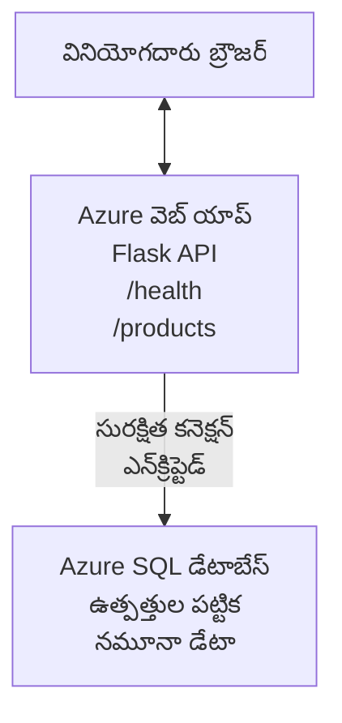

# AZD తో Microsoft SQL డేటాబేస్ మరియు వెబ్ యాప్‌ను డిప్లాయ్ చేయడం

⏱️ **అంచనా సమయం**: 20-30 నిమిషాలు | 💰 **అంచనా ఖర్చు**: సుమారు $15-25/నెల | ⭐ **సంక్లిష్టత**: మధ్యస్థ

ఈ **పూర్తిగా పనిచేసే ఉదాహరణ** [Azure Developer CLI (azd)](https://learn.microsoft.com/azure/developer/azure-developer-cli/) ఉపయోగించి Python Flask వెబ్ అప్లికేషన్‌ను Microsoft SQL డేటాబేస్‌తో Azure కు ఎలా డిప్లాయ్ చేయాలో చూపిస్తుంది. అన్ని కోడ్‌లు చేర్చబడి పరీక్షించబడ్డాయి—బయటి ఆధారాలు అవసరం లేవు.

## మీరు ఏమి నేర్చుకుంటారు

ఈ ఉదాహరణ పూర్తి చేసిన తర్వాత, మీరు:
- ఇన్ఫ్రాస్ట్రక్చర్-ఎస్-కోడ్ ద్వారా బహుళ-స్థాయి అనువర్తనాన్ని (వెబ్ అప్లికేషన్ + డేటాబేస్) డిప్లాయ్ చేయడం
- రహస్యాలను కోడ్‌లో హార్డ్‌కోడ్ చేయకుండా సురక్షితంగా డేటాబేస్ కనెక్షన్‌లు కన్ఫిగర్ చేయడం
- Application Insights ద్వారా అప్లికేషన్ ఆరోగ్యాన్ని మానిటర్ చేయడం
- AZD CLI తో Azure వనరులను సమర్థవంతంగా నిర్వహించడం
- భద్రత, ఖర్చు ఆప్టిమైజేషన్ మరియు అవలోకనం కోసం Azure ఉత్తమ ప్రాక్టీసులను అనుసరించడం

## సన్నివేశం అవలోకనం
- **వెబ్ అప్లికేషన్**: డేటాబేస్ కనెక్షన్తో Python Flask REST API
- **డేటాబేస్**: ఉదాహరణ డేటాతో Azure SQL Database
- **ఇన్ఫ్రాస్ట్రక్చర్**: Bicep ఉపయోగించి ప్రావిజనింగ్ (మాడ్యులర్, పునఃవినియోగయోగ్యం)
- **డిప్లాయ్‌మెంట్**: `azd` కమాండ్లతో పూర్తిగా ఆటోమేటెడ్
- **మానిటరింగ్**: লগ్స్ మరియు టెలిమెట్రీ కోసం Application Insights

## అవసరమైనదిగా ఉండాల్సినవి

### అవసరమయ్యే టూల్స్

ప్రారంభించేటప్పుడు, ఈ టూల్స్ ఇన్‌స్టాల్ చేయబడినట్లు నిర్ధారించండి:

1. **[Azure CLI](https://learn.microsoft.com/cli/azure/install-azure-cli)** (వర్షన్ 2.50.0 లేదా అంతకంటే పైగా)
   ```sh
   az --version
   # అందుకోవాల్సిన అవుట్పుట్: azure-cli 2.50.0 లేదా అంతకంటే పైగా
   ```

2. **[Azure Developer CLI (azd)](https://learn.microsoft.com/azure/developer/azure-developer-cli/install-azd)** (వర్షన్ 1.0.0 లేదా అంతకంటే పైగా)
   ```sh
   azd version
   # ఆశించిన అవుట్పుట్: azd సంస్కరణ 1.0.0 లేదా అంతకంటే ఎక్కువ
   ```

3. **[Python 3.8+](https://www.python.org/downloads/)** (లోకల్ అభివృద్ధికి)
   ```sh
   python --version
   # అనుకున్న అవుట్పుట్: Python 3.8 లేదా అంతకంటే పైగా
   ```

4. **[Docker](https://www.docker.com/get-started)** (ఐచ్ఛికం, లోకల్ కంటెయినర్ అభివృద్ధికి)
   ```sh
   docker --version
   # ఆశించిన అవుట్పుట్: Docker సంస్కరణ 20.10 లేదా అంతకంటే పైగా
   ```

### Azure అవసరాలు

- ఒక యాక్టివ్ **Azure subscription** ([create a free account](https://azure.microsoft.com/free/))
- మీ సబ్‌స్క్రిప్షన్‌లో వనరులు సృష్టించే అనుమతులు
- సబ్‌స్క్రిప్షన్ లేదా రీసోర్స్ గ్రూప్ మీద **Owner** లేదా **Contributor** రోల్

### జ్ఞాన అవసరాలు

ఇది **మధ్యస్థ-స్థాయి** ఉదాహరణ. మీరు ఈ విషయాల్లో పరిచయం కలిగి ఉండాలి:
- మౌలిక కమాండ్-లైన్ ఆపరేషన్లు
- క్లౌడ్ మూలభూత సంకల్పనలు (వనరులు, రీసోర్స్ గ్రూప్‌లు)
- వెబ్ అప్లికేషన్లు మరియు డేటాబేసుల మీటర్ జ్ఞానం

**AZDకి కొత్తవా?** ముందుగా [Getting Started guide](../../docs/chapter-01-foundation/azd-basics.md) తో మొదలెయ్యండి.

## ఆర్కిటెక్చర్

ఈ ఉదాహరణ ఒక రెండు-స్థాయి ఆర్కిటెక్చర్‌ను డిప్లాయ్ చేస్తుంది: వెబ్ అప్లికేషన్ మరియు SQL డేటాబేస్:


**వనరు డిప్లాయ్‌మెంట్:**
- **Resource Group**: అన్ని వనరుల కోసం కంటెయినర్
- **App Service Plan**: Linux ఆధారిత హోస్టింగ్ (ఖర్చు తక్కువగా ఉండేందుకు B1 టియర్)
- **Web App**: Python 3.11 రన్‌టైమ్‌తో Flask అప్లికేషన్
- **SQL Server**: TLS 1.2 కనీసంతో నిర్వహించే డేటాబేస్ సర్వర్
- **SQL Database**: Basic టియర్ (2GB, డెవలప్‌మెంట్/టెస్టింగ్‌కు అనుకూలం)
- **Application Insights**: మానిటరింగ్ మరియు లాగింగ్
- **Log Analytics Workspace**: లాగ్‌లు సెంట్రలైజ్ చేయడానికి

**ఉదాహరణ**: ఇది ఒక రెస్టారెంట్ (వెబ్ అప్లికేషన్) మరియు వాక్-ఇన్ ఫ్రీజర్ (డేటాబేస్) లా ఆలోచించండి. వినియోగదారులు మెనూ (API ఎండ‌పాయింట్లు) నుంచి ఆర్డర్ చేస్తారు, కిచెన్ (Flask అప్లికేషన్) ఫ్రీజర్ నుంచి పదార్థాలు (డేటా) తీసి రుచి చేస్తుంది. రెస్టారెంట్ మేనేజర్ (Application Insights) జరిగే ప్రతిదీ ట్రాక్ చేస్తుంది.

## ఫోల్డర్ నిర్మాణం

ఈ ఉదాహరణలో అన్ని ఫైళ్లు చేర్చబడ్డాయి—బయటి ఆధారాలు అవసరం లేవు:

```
examples/database-app/
│
├── README.md                    # This file
├── azure.yaml                   # AZD configuration file
├── .env.sample                  # Sample environment variables
├── .gitignore                   # Git ignore patterns
│
├── infra/                       # Infrastructure as Code (Bicep)
│   ├── main.bicep              # Main orchestration template
│   ├── abbreviations.json      # Azure naming conventions
│   └── resources/              # Modular resource templates
│       ├── sql-server.bicep    # SQL Server configuration
│       ├── sql-database.bicep  # Database configuration
│       ├── app-service-plan.bicep  # Hosting plan
│       ├── app-insights.bicep  # Monitoring setup
│       └── web-app.bicep       # Web application
│
└── src/
    └── web/                    # Application source code
        ├── app.py              # Flask REST API
        ├── requirements.txt    # Python dependencies
        └── Dockerfile          # Container definition
```

**ప్రతి ఫైల్ ఏమి చేస్తుంది:**
- **azure.yaml**: AZDకి ఏమి డిప్లాయ్ చేయాలో మరియు ఎక్కడ చేయాలో తెలపడం
- **infra/main.bicep**: అన్ని Azure వనరులను సమన్వయపరచుతుంది
- **infra/resources/*.bicep**: వ్యక్తిగత వనరు నిర్వచనాలు (పునఃవినియోగం కోసం మాడ్యులర్)
- **src/web/app.py**: డేటాబేస్ లాజిక్ ఉన్న Flask అప్లికేషన్
- **requirements.txt**: Python ప్యాకేజ్ డిపెండెన్సీలు
- **Dockerfile**: డిప్లాయ్‌మెంట్ కోసం కంటెయినరైజేషన్ సూచనలు

## త్వరితప్రారంభ (దశల వారీగా)

### దశ 1: క్లోన్ చేసి నావిగేట్ చేయండి

```sh
git clone https://github.com/microsoft/AZD-for-beginners.git
cd AZD-for-beginners/examples/database-app
```

**✓ విజయ తనిఖీ**: మీరు `azure.yaml` మరియు `infra/` ఫోల్డర్ కనిపిస్తున్నదని ధృవీకరించండి:
```sh
ls
# నిరೀಕ್ಷితం: README.md, azure.yaml, infra/, src/
```

### దశ 2: Azureలో Authenticate చేయండి

```sh
azd auth login
```

ఇది మీ బ్రౌజర్‌ను Azure authentication కోసం తెరిస్తుంది. మీ Azure క్రెడెన్షియల్స్‌తో సైన్ ఇన్ చేయండి.

**✓ విజయ తనిఖీ**: మీరు ఈకటిని చూడాలి:
```
Logged in to Azure.
```

### దశ 3: ఎన్విరాన్‌మెంట్‌ను ప్రారంభించండి

```sh
azd init
```

**ఏం జరుగుతుంది**: AZD మీ డిప్లాయ్‌మెంట్ కోసం లోకల్ కాన్ఫిగరేషన్‌ను సృష్టిస్తుంది.

**మీకు కనిపించే ప్రాంప్ట్‌లు**:
- **Environment name**: చిన్న పేరు నమోదు చేయండి (ఉదా., `dev`, `myapp`)
- **Azure subscription**: జాబితా నుండి మీ సబ్‌స్క్రిప్షన్‌ని ఎంచుకోండి
- **Azure location**: ఒక రీజియన్ ఎంచుకోండి (ఉదా., `eastus`, `westeurope`)

**✓ విజయ తనిఖీ**: మీరు ఈకటిని చూడాలి:
```
SUCCESS: New project initialized!
```

### దశ 4: Azure వనరులను ప్రావిజన్ చేయండి

```sh
azd provision
```

**ఏం జరుగుతుంది**: AZD అన్ని ఇన్ఫ్రాస్ట్రక్చర్‌ను డిప్లాయ్ చేస్తుంది (5-8 నిమిషాలు పడుతుంది):
1. రీసోర్స్ గ్రూప్ సృష్టిస్తుంది
2. SQL Server మరియు డేటాబేస్ సృష్టిస్తుంది
3. App Service Plan సృష్టిస్తుంది
4. Web App సృష్టిస్తుంది
5. Application Insights సృష్టిస్తుంది
6. నెట్‌వర్కింగ్ మరియు భద్రతను కాన్ఫిగర్ చేయుతుంది

**మీకు అడిగ బడే వస్తువులు**:
- **SQL admin username**: ఒక యూజర్‌నేమ్ నమోదు చేయండి (ఉదా., `sqladmin`)
- **SQL admin password**: ఒక బలమైన పాస్‌వర్డ్ నమోదు చేయండి (దాన్ని సేవ్ చేసి ఉంచండి!)

**✓ విజయ తనిఖీ**: మీరు ఈకటిని చూడాలి:
```
SUCCESS: Your application was provisioned in Azure in X minutes Y seconds.
You can view the resources created under the resource group rg-<env-name> in Azure Portal:
https://portal.azure.com/#@/resource/subscriptions/.../resourceGroups/rg-<env-name>
```

**⏱️ సమయం**: 5-8 నిమిషాలు

### దశ 5: అప్లికేషన్‌ను డిప్లాయ్ చేయండి

```sh
azd deploy
```

**ఏం జరుగుతుంది**: AZD మీ Flask అప్లికేషన్‌ను బిల్డ్ చేసి డిప్లాయ్ చేస్తుంది:
1. Python అప్లికేషన్‌ను ప్యాకేజ్ చేస్తుంది
2. Docker కంటెయినర్‌ను బిల్డ్ చేస్తుంది
3. Azure Web App కు పుష్ చేస్తుంది
4. ఉదాహరణ డేటాతో డేటాబేస్‌ను ఆరంభిస్తుంది
5. అప్లికేషన్‌ను ప్రారంభిస్తుంది

**✓ విజయ తనిఖీ**: మీరు ఈకటిని చూడాలి:
```
SUCCESS: Your application was deployed to Azure in X minutes Y seconds.
You can view the resources created under the resource group rg-<env-name> in Azure Portal:
https://portal.azure.com/#@/resource/subscriptions/.../resourceGroups/rg-<env-name>
```

**⏱️ సమయం**: 3-5 నిమిషాలు

### దశ 6: అప్లికేషన్‌ను బ్రౌజ్ చేయండి

```sh
azd browse
```

ఇది మీ డిప్లాయ్ చేసిన వెబ్ యాప్‌ను బ్రౌజర్‌లో తెరుస్తుంది: `https://app-<unique-id>.azurewebsites.net`

**✓ విజయ తనిఖీ**: మీరు JSON అవుట్‌పుట్‌ను చూడాలి:
```json
{
  "message": "Welcome to the Database App API",
  "endpoints": {
    "/": "This help message",
    "/health": "Health check endpoint",
    "/products": "List all products",
    "/products/<id>": "Get product by ID"
  }
}
```

### దశ 7: API ఎండ‌పాయింట్స్‌ను పరీక్షించండి

**హెల్త్ చెక్** (డేటాబేస్ కనెక్షన్‌ను ధృవీకరించండి):
```sh
curl https://app-<your-id>.azurewebsites.net/health
```

**అనుమానిత స్పందన**:
```json
{
  "status": "healthy",
  "database": "connected"
}
```

**ఉత్పత్తుల జాబితా** (ఉదాహరణ డేటా):
```sh
curl https://app-<your-id>.azurewebsites.net/products
```

**అనుమానిత స్పందన**:
```json
[
  {
    "id": 1,
    "name": "Laptop",
    "description": "High-performance laptop",
    "price": 1299.99,
    "created_at": "2025-11-19T10:30:00"
  },
  ...
]
```

**ఒకే ఉత్పత్తిని పొందు**:
```sh
curl https://app-<your-id>.azurewebsites.net/products/1
```

**✓ విజయ తనిఖీ**: అన్ని ఎండ‌పాయింట్లు లోపాలేకుండా JSON డేటాను రిటర్న్ చేస్తాయ్.

---

**🎉 శుభాకాంక్షలు!** మీరు AZD ఉపయోగించి Azure కు ఒక డేటాబేస్ తో కూడిన వెబ్ అప్లికేషన్‌ని విజయవంతంగా డిప్లాయ్ చేశారు.

## కాన్ఫిగరేషన్ లోతైన అవలోకనం

### ఎన్విరాన్‌మెంట్ వేరియబుల్స్

రహస్యాలు Azure App Service కాన్ఫిగరేషన్ ద్వారా సురక్షితంగా నిర్వహించబడతాయి—**సోర్స్ కోడ్‌లో ఎప్పుడూ హార్డ్‌కోడ్ చేయకండి**.

**AZD ద్వారా ఆటోమేటిగ్గా కాన్ఫిగర్ చేయబడింది**:
- `SQL_CONNECTION_STRING`: సంకేతీకృత క్రెడెన్షియల్స్‌తో డేటాబేస్ కనెక్షన్
- `APPLICATIONINSIGHTS_CONNECTION_STRING`: మానిటరింగ్ టెలిమెట్రీ ఎండ్పాయింట్
- `SCM_DO_BUILD_DURING_DEPLOYMENT`: స్వయంచాలిత డిపెండెన్సీ ఇన్‌స్టాలేషన్‌ను ఎనేబుల్ చేస్తుంది

**రహస్యాలు ఎక్కడ స్టోర్ చేయబడతాయి**:
1. `azd provision` సమయంలో, మీరు SQL క్రెడెన్షియల్స్‌ను సురక్షిత ప్రాంప్ట్‌ల ద్వారా అందిస్తారు
2. AZD ఇవి మీ లోకల్ `.azure/<env-name>/.env` ఫైల్‌లో నిల్వ చేస్తుంది (git-ignored)
3. AZD వాటిని Azure App Service కాన్ఫిగరేషన్‌లో ఇంజెక్ట్ చేస్తుంది (రెస్ట్‌లో ఎన్క్రిప్టు చేయబడింది)
4. అప్లికేషన్ రన్‌టైమ్‌లో వాటిని `os.getenv()` ద్వారా చదువుకుంటుంది

### లోకల్ డెవలప్మెంట్

లోకల్ పరీక్ష కోసం, శాంపిల్ నుండి `.env` ఫైల్‌ను సృష్టించండి:

```sh
cp .env.sample .env
# .env ఫైల్‌ను మీ స్థానిక డేటాబేస్ కనెక్షన్‌తో సవరించండి
```

**లోకల్ డెవలప్‌మెంట్ వర్క్‌ఫ్లో**:
```sh
# డిపెండెన్సీలు ఇన్‌స్టాల్ చేయండి
cd src/web
pip install -r requirements.txt

# ఎన్విరాన్‌మెంట్ వేరియబుల్స్‌ను సెట్ చేయండి
export SQL_CONNECTION_STRING="your-local-connection-string"

# అప్లికేషన్‌ను నడపండి
python app.py
```

**లోకల్‌గా పరీక్షించండి**:
```sh
curl http://localhost:8000/health
# అంచనా: {"స్థితి": "ఆరోగ్యగా ఉంది", "డేటాబేస్": "కనెక్ట్ అయింది"}
```

### ఇన్ఫ్రాస్ట్రక్చర్-యస్-కోడ్

అన్ని Azure వనరులు **Bicep టెంప్లేట్స్** (`infra/` ఫోల్డర్)లో నిర్వచించబడ్డాయి:

- **మాడ్యులర్ డిజైన్**: ప్రతి వనరు రకం పునఃవినియోగానికీ విడివిడిగా ఫైల్ ఉంది
- **పారామెటరైజ్డ్**: SKUs, రీజియన్లు, నామకరణ ప్రమాణాలను అనుకూలీకరించవచ్చు
- **ఉత్తమ ప్రాక్టీసులు**: Azure నామకరణ ప్రమాణాలు మరియు భద్రత డిఫాల్ట్‌లను అనుసరిస్తుంది
- **వర్షన్ కన్ట్రోల్‌లో**: ఇన్ఫ్రాస్ట్రక్చర్ మార్పులు Git‌లో ట్రాక్ చేయబడతాయి

**అనుకూలీకరణ ఉదాహరణ**:
డేటాబేస్ టియర్ మార్చడానికి, `infra/resources/sql-database.bicep`ను ఎడిట్ చేయండి:
```bicep
sku: {
  name: 'Standard'  // Changed from 'Basic'
  tier: 'Standard'
  capacity: 10
}
```

## భద్రత ఉత్తమ ప్రాక్టీసులు

ఈ ఉదాహరణ Azure భద్రత ఉత్తమ ప్రాక్టీసులను అనుసరిస్తుంది:

### 1. **సోర్స్ కోడ్‌లో రహస్యాలు ఉండకూడదు**
- ✅ క్రెడెన్షియల్స్ Azure App Service కాన్ఫిగరేషన్‌లో నిల్వ చేయబడ్డాయి (ఎన్‌క్రిప్టెడ్)
- ✅ `.env` ఫైళ్లను `.gitignore` ద్వారా Git నుండి బయటపెట్టారు
- ✅ ప్రావిజనింగ్ సమయంలో రహస్యాలు సురక్షిత ప్యారామీటర్లుగా పాస్స్ చేయబడ్డాయి

### 2. **ఎన్‌క్రిప్టెడ్ కనెక్షన్లు**
- ✅ SQL Server కోసం కనీసం TLS 1.2
- ✅ Web App కోసం HTTPS-నే అనుమతిస్తుంది
- ✅ డేటాబేస్ కనెక్షన్లు ఎన్క్రిప్టెడ్ చానెల్‌లను ఉపయోగిస్తాయి

### 3. **నెట్‌వర్క్ భద్రత**
- ✅ SQL Server ఫైర్వాల్ Azure సేవలకు మాత్రమే అనుమతి ఇస్తుంది
- ✅ పబ్లిక్ నెట్‌వర్క్ యాక్సెస్ పరిమితి (ప్రైవేట్ ఎండ్పాయింట్లతో మరింత కఠినಗావచ్చు)
- ✅ Web App లో FTPS డిసేబుల్ చేయబడింది

### 4. **ఆథెంటికేషన్ & ఆథరైజేషన్**
- ⚠️ **ప్రస్తుతము**: SQL ఆథెంటికేషన్ (యూజర్‌నేమ్/పాస్‌వర్డ్)
- ✅ **ఉత్పత్తి సిఫార్సు**: పాస్‌వర్డ్‌లేని ఆథెంటికేషన్ కోసం Azure Managed Identity వాడండి

**Managed Identity కు అప్గ్రేడ్ చేయడానికి** (ఉత్పత్తి కోసం):
1. Web Appపై managed identityని ఎనేబుల్ చేయండి
2. ఆ ఐడెంటిటీకి SQL అనుమతులు ఇవ్వండి
3. కనెక్షన్ స్ట్రింగ్‌ను managed identity ఉపయోగించేలా నవీకరించండి
4. పాస్‌వర్డ్ ఆధారిత ఆథెంటికేషన్‌ను తొలగించండి

### 5. **ఆడిటింగ్ & కంప్లయన్స్**
- ✅ Application Insights అన్ని రిక్వెస్ట్‌లు మరియు లోపాలను లాగ్ చేస్తుంది
- ✅ SQL Database ఆడిటింగ్ ఎనేబుల్ చేయబడింది (కంప్లయన్స్ కోసం కాన్ఫిగర్ చేయవచ్చు)
- ✅ అన్ని వనరులు గవర్నెన్స్ కోసం ట్యాగ్ చేయబడ్డాయి

**ప్రొడక్షన్ ముందు భద్రత చెక్లిస్ట్**:
- [ ] SQL కోసం Azure Defender ను ఎనేబుల్ చేయండి
- [ ] SQL Database కోసం Private Endpoints ని కాన్ఫిగర్ చేయండి
- [ ] Web Application Firewall (WAF) ని ఎనేబుల్ చేయండి
- [ ] రహస్య రొటేషన్ కోసం Azure Key Vault‌ని అమలు చేయండి
- [ ] Azure AD ఆథెంటికేషన్‌ను కాన్ఫిగర్ చేయండి
- [ ] అన్ని వనరుల కోసం డయాగ్నోస్టిక్ లాగింగ్‌ను ఎనేబుల్ చేయండి

## ఖర్చు ఆప్టిమైజేషన్

**అంచనా నెలవారీ ఖర్చులు** (నవంబర్ 2025 నాటికి):

| Resource | SKU/Tier | Estimated Cost |
|----------|----------|----------------|
| App Service Plan | B1 (Basic) | ~$13/month |
| SQL Database | Basic (2GB) | ~$5/month |
| Application Insights | Pay-as-you-go | ~$2/month (low traffic) |
| **Total** | | **~$20/month** |

**💡 ఖర్చు సేవింగ్స్ సూచనలు**:

1. **అధ్యయనానికి Free Tier ఉపయోగించండి**:
   - App Service: F1 టియర్ (ఉచితం, పరిమిత గంటలు)
   - SQL Database: Azure SQL Database serverless ఉపయోగించండి
   - Application Insights: 5GB/నెల ఉచిత ఇన్‌జెషన్

2. **వినియోగంలో లేని సమయంలో వనరులను ఆపు**:
   ```sh
   # వెబ్ యాప్‌ను ఆపండి (డేటాబేస్‌కు ఇంకా ఛార్జీలు వర్తిస్తాయి)
   az webapp stop --name <app-name> --resource-group <rg-name>
   
   # అవసరమైతే పునఃప్రారంభించండి
   az webapp start --name <app-name> --resource-group <rg-name>
   ```

3. **పరీక్షల తర్వాత అన్ని వనరులను తొలగించండి**:
   ```sh
   azd down
   ```
   ఇది అన్ని వనరులను తీసివేసి ఛార్జీలను ఆపుతుంది.

4. **డెవలప్‌మెంట్ vs. ప్రొడక్షన్ SKUs**:
   - **డెవలప్‌మెంట్**: ఈ ఉదాహరణలో ఉపయోగించిన Basic టియర్
   - **ప్రొడక్షన్**: redundancy ఉన్న Standard/Premium టియర్

**ఖర్చు మానిటరింగ్**:
- ఖర్చులను [Azure Cost Management](https://portal.azure.com/#view/Microsoft_Azure_CostManagement) లో చూడండి
- ఆశ్చర్యాలకు లోనవ్వకుండా ఖర్చు అలర్ట్‌లు సెట్ చేయండి
- ట్రాకింగ్ కోసం అన్ని వనరులపై `azd-env-name` ట్యాగ్ వేయండి

**ఉచిత టియర్ ప్రత్యామ్నాయం**:
అధ్యయన అవసరాల కోసం, మీరు `infra/resources/app-service-plan.bicep` ను మార్చవచ్చు:
```bicep
sku: {
  name: 'F1'  // Free tier
  tier: 'Free'
}
```
**గమనిక**: ఉచిత టియర్ పరిమితులుంటాయి (60 నిమిషాలు/రోజు CPU, ఎప్పుడూ-ఆన్ లేదు).

## మానిటరింగ్ & ఆబ్జర్వబిలిటీ

### Application Insights ఇంటిగ్రేషన్

ఈ ఉదాహరణ సమగ్ర మానిటరింగ్ కోసం **Application Insights** ను కలిగి ఉంది:

**ఏమీ మానిటర్ చేయబడుతుంది**:
- ✅ HTTP రిక్వెస్ట్‌లు (లేటెన్సీ, స్టేటస్ కోడ్స్, ఎండ‌పాయింట్లు)
- ✅ అప్లికేషన్ లోపాలు మరియు ఎక్సెప్షన్‌లు
- ✅ Flask అప్లికేషన్ నుండి కస్టమ్ లాగింగ్
- ✅ డేటాబేస్ కనెక్షన్ ఆరోగ్యం
- ✅ పనితీరు మెట్రిక్స్ (CPU, మెమెరీ)

**Application Insights యాక్సెస్ చేయడానికి**:
1. [Azure Portal](https://portal.azure.com) ఓపెన్ చేయండి
2. మీ రీసోర్స్ గ్రూప్‌కు నావిగేట్ చేయండి (`rg-<env-name>`)
3. Application Insights రీసోర్స్ (`appi-<unique-id>`) పై క్లిక్ చేయండి

**ఉపయోగకరమైన క్యూరీస్** (Application Insights → Logs):

**అన్ని రిక్వెస్ట్‌లను చూడండి**:
```kusto
requests
| where timestamp > ago(1h)
| order by timestamp desc
| project timestamp, name, url, resultCode, duration
```

**లోపాలను కనుగొనండి**:
```kusto
exceptions
| where timestamp > ago(24h)
| order by timestamp desc
| project timestamp, type, outerMessage, operation_Name
```

**హెల్త్ ఎండ్పాయింట్‌ను చెక్ చేయండి**:
```kusto
requests
| where name contains "health"
| summarize count() by resultCode, bin(timestamp, 1h)
```

### SQL Database ఆడిటింగ్

**SQL Database ఆడిట్ చేయబడింది** ట్రాక్ చేయడానికి:
- డేటాబేస్ యాక్సెస్ ప్యాటర్న్లు
- ఫెయిల్డ్ లాగిన్ ప్రయత్నాలు
- స్కీమా మార్పులు
- డేటా యాక్సెస్ (కంప్లయన్స్ కోసం)

**ఆడిట్ లాగ్స్ యాక్సెస్ చేయండి**:
1. Azure Portal → SQL Database → Auditing
2. Log Analytics workspaceలో లాగ్స్ చూడండి

### రియల్-టైమ్ మానిటరింగ్

**లైవ్ మెట్రిక్స్ చూడండి**:
1. Application Insights → Live Metrics
2. రియల్-టైమ్‌లో రిక్వెస్ట్‌లు, ఫెయిల్యూర్‌లు, పనితీరు చూడండి

**అలెర్ట్స్ సెటప్ చేయండి**:
క్రిటికల్ ఈవెంట్స్ కోసం అలెర్ట్‌లు సృష్టించండి:
- HTTP 500 లోపాలు > 5 లో 5 నిమిషాల్లో
- డేటాబేస్ కనెక్షన్ వైఫల్యాలు
- అధిక ప్రతిస్పందన సమయం (>2 సెకన్లు)

**అలెర్ట్ సృష్టించడానికి ఉదాహరణ**:
```sh
az monitor metrics alert create \
  --name "High-Response-Time" \
  --resource-group <rg-name> \
  --scopes <app-insights-resource-id> \
  --condition "avg requests/duration > 2000" \
  --description "Alert when response time exceeds 2 seconds"
```

## సమస్య పరిష్కరణ
### సాధారణ సమస్యలు మరియు పరిష్కారాలు

#### 1. `azd provision` "Location not available" తో విఫలమవుతుంది

**లక్షణం**:
```
Error: The subscription is not registered for the resource type 'components' in the location 'centralus'.
```

**పరిష్కారం**:
వేరే Azure ప్రాంతం ఎంచుకోండి లేదా రిసోర్స్ ప్రొవైడర్‌ను నమోదు చేయండి:
```sh
az provider register --namespace Microsoft.Insights
```

#### 2. డిప్లాయ్‌మెంట్ సమయంలో SQL కనెక్షన్ విఫలమవుతుంది

**లక్షణం**:
```
pyodbc.OperationalError: ('08001', '[08001] [Microsoft][ODBC Driver 18 for SQL Server]TCP Provider...')
```

**పరిష్కారం**:
- SQL Server ఫైర్‌వాల్ Azure సేవలకు అనుమతిస్తున్నదో లేదో తనిఖీ చేయండి (స్వయంచాలకంగా కాన్ఫిగర్ అవుతుంది)
- డిప్లాయ్ చేస్తున్నప్పుడు `azd provision` సమయంలో SQL అడ్మిన్ పాస్వర్డ్ సరిగ్గా నమోదు చేశారా అని తనిఖీ చేయండి
- SQL Server పూర్తిగా provision అయ్యిందా అని నిర్ధారించండి (2-3 నిమిషాలు పట్టొచ్చు)

**కనెక్షన్‌ని తనిఖీ చేయండి**:
```sh
# Azure పోర్టల్ నుండి SQL డేటాబేస్ → Query editor కు వెళ్లండి
# మీ ప్రవేశ వివరాలతో కనెక్ట్ చేయడానికి ప్రయత్నించండి
```

#### 3. Web App "Application Error" చూపిస్తుంది

**లక్షణం**:
బ్రౌజర్ సాధாரண దోష పేజీని చూపిస్తుంది.

**పరిష్కారం**:
అప్లికేషన్ లాగ్‌లను తనిఖీ చేయండి:
```sh
# ఇటీవలి లాగ్‌లను వీక్షించండి
az webapp log tail --name <app-name> --resource-group <rg-name>
```

**సాధారణ కారనాలు**:
- ఇన్‌వైరన్మెంట్ వేరియబుల్స్ లేవు (App Service → Configuration ని తనిఖీ చేయండి)
- Python ప్యాకేజ్ ఇన్‌స్టాలేషన్ విఫలమవింది (డిప్లాయ్‌మెంట్ లాగ్‌లను తనిఖీ చేయండి)
- డేటాబేస్ ప్రారంభీకరణలో దోషం (SQL కనెక్టివిటీని తనిఖీ చేయండి)

#### 4. `azd deploy` "Build Error" తో విఫలమవుతుంది

**లక్షణం**:
```
Error: Failed to build project
```

**పరిష్కారం**:
- నిర్ధారించండి `requirements.txt` లో సింటాక్స్ లో తప్పులు లేవు
- `infra/resources/web-app.bicep` లో Python 3.11 నిర్దేశించబడిందా అని తనిఖీ చేయండి
- Dockerfile సరైన base image ను ఉపయోగిస్తున్నదని నిర్ధారించండి

**లోకల్‌గా డీబగ్ చేయండి**:
```sh
cd src/web
docker build -t test-app .
docker run -p 8000:8000 test-app
```

#### 5. AZD కమాండ్లు నడపుతున్నప్పుడు "Unauthorized"

**లక్షణం**:
```
ERROR: (Unauthorized) The client '<id>' with object id '<id>' does not have authorization
```

**పరిష్కారం**:
Azureతో మళ్ళీ authentication చేయండి:
```sh
# AZD వర్క్‌ఫ్లోల కోసం అవసరం
azd auth login

# మీరు Azure CLI కమాండ్లను నేరుగా కూడా ఉపయోగిస్తున్నట్లయితే ఇది ఐచ్ఛికం
az login
```

మీకు subscription పై సరైన అనుమతులు (Contributor role) ఉన్నాయా అని ధృవీకరించండి.

#### 6. డేటాబేస్ ఖర్చులు అధికంగా ఉన్నాయి

**లక్షణం**:
అనూహ్యమైన Azure బిల్.

**పరిష్కారం**:
- టెస్టింగ్ తర్వాత మీరు `azd down` నడపడం మర్చిపోయి ఉందో లేదో తనిఖీ చేయండి
- SQL Database Basic tier (Premium కాదు) ఉపయోగిస్తున్నదో లేదో నిర్ధారించండి
- Azure Cost Managementలో ఖర్చులను సమీక్షించండి
- ఖర్చుల అలర్ట్‌లను అమర్చండి

### సహాయం పొందడం

**అన్ని AZD ఎన్విరాన్‌మెంట్ వేరియబుల్స్ చూడండి**:
```sh
azd env get-values
```

**డిప్లాయ్‌మెంట్ స్థితి తనిఖీ చేయండి**:
```sh
az webapp show --name <app-name> --resource-group <rg-name> --query state
```

**అప్లికేషన్ లాగ్‌లను యాక్సెస్ చేయండి**:
```sh
az webapp log download --name <app-name> --resource-group <rg-name> --log-file app-logs.zip
```

**కూడా సహాయం కావాలా?**
- [AZD ట్రబుల్‌షూటింగ్ గైడ్](../../docs/chapter-07-troubleshooting/common-issues.md)
- [Azure App Service ట్రబుల్‌షూటింగ్](https://learn.microsoft.com/azure/app-service/troubleshoot-diagnostic-logs)
- [Azure SQL ట్రబుల్‌షూటింగ్](https://learn.microsoft.com/azure/azure-sql/database/troubleshoot-common-errors-issues)

## ప్రయోగాత్మక వ్యాయామాలు

### వ్యాయామం 1: మీ డిప్లాయ్‌మెంట్‌ని నిర్ధారించండి (ప్రాథమిక)

**లక్ష్యం**: అన్ని రిసోర్సులు డిప్లాయ్ అయ్యాయో మరియు అప్లికేషన్ పనిచేస్తోందో నిర్ధారించండి.

**దశలు**:
1. మీ రిసోర్స్ గ్రూప్‌లోని అన్ని రిసోర్సులను జాబితా చేయండి:
   ```sh
   az resource list --resource-group rg-<env-name> --output table
   ```
   **అంచనా**: 6-7 resources (Web App, SQL Server, SQL Database, App Service Plan, Application Insights, Log Analytics)

2. అన్ని API ఎండ్పాయింట్స్ ను పరీక్షించండి:
   ```sh
   curl https://app-<your-id>.azurewebsites.net/
   curl https://app-<your-id>.azurewebsites.net/health
   curl https://app-<your-id>.azurewebsites.net/products
   curl https://app-<your-id>.azurewebsites.net/products/1
   ```
   **అంచనా**: అన్నీ తప్పులేకుండా సరైన JSON ను తిరిగి ఇస్తాయి

3. Application Insights ని తనిఖీ చేయండి:
   - Azure పోర్టల్‌లో Application Insights కి వెళ్ళండి
   - "Live Metrics" కి వెళ్ళండి
   - వెబ్ యాప్‌లో బ్రౌజర్ రిఫ్రెష్ చేయండి
  **అంచనా**: రియల్-టైమ్‌లో అభ్యర్థనలు కనిపిస్తున్నట్లు చూడగలరు

**విజయ ప్రమాణాలు**: అన్ని 6-7 రిసోర్సులు ఉన్నాయని, అన్ని ఎండ్పాయింట్లు డేటాను తిరిగి ఇస్తున్నాయని, Live Metrics‌లో activity కనిపిస్తున్నాయని నిర్ధారించుకోండి.

---

### వ్యాయామం 2: కొత్త API ఎండ్పాయింట్ జోడించండి (మధ్యంతర)

**లక్ష్యం**: Flask అప్లికేషన్‌ను కొత్త ఎండ్పాయింట్‌తో విస్తరించండి.

**స్టార్టర్ కోడ్**: ప్రస్తుత ఎండ్పాయింట్లు `src/web/app.py` లో ఉన్నాయి

**దశలు**:
1. `src/web/app.py` ను ఎడిట్ చేసి `get_product()` ఫంక్షన్ తరువాత ఒక కొత్త ఎండ్పాయింట్ జోడించండి:
   ```python
   @app.route('/products/search/<keyword>')
   def search_products(keyword):
       """Search products by name or description."""
       try:
           conn = get_db_connection()
           cursor = conn.cursor()
           cursor.execute(
               "SELECT id, name, description, price, created_at FROM products WHERE name LIKE ? OR description LIKE ?",
               (f'%{keyword}%', f'%{keyword}%')
           )
           
           products = []
           for row in cursor.fetchall():
               products.append({
                   'id': row[0],
                   'name': row[1],
                   'description': row[2],
                   'price': float(row[3]) if row[3] else None,
                   'created_at': row[4].isoformat() if row[4] else None
               })
           
           cursor.close()
           conn.close()
           
           logger.info(f"Search for '{keyword}' returned {len(products)} results")
           return jsonify(products), 200
           
       except Exception as e:
           logger.error(f"Error searching products: {str(e)}")
           return jsonify({'error': str(e)}), 500
   ```

2. అప్డేటెడ్ అప్లికేషన్‌ను డిప్లాయ్ చేయండి:
   ```sh
   azd deploy
   ```

3. కొత్త ఎండ్పాయింట్‌ను పరీక్షించండి:
   ```sh
   curl https://app-<your-id>.azurewebsites.net/products/search/laptop
   ```
   **అంచనా**: "laptop" కు సరిపోయే ఉత్పత్తులను తిరిగి ఇస్తుంది

**విజయ ప్రమాణాలు**: కొత్త ఎండ్పాయింట్ పనిచేస్తుంది, ఫిల్టర్ చేసిన ఫలితాలను తిరిగి ఇస్తుంది, Application Insights లాగ్‌లలో కనిపిస్తుంది.

---

### వ్యాయామం 3: మానిటరింగ్ మరియు అలర్ట్స్ జోడించండి (అధునాతన)

**లక్ష్యం**: అలర్ట్‌లతో ప్రోాక్టివ్ మానిటరింగ్‌ను ఏర్పాటు చేయండి.

**దశలు**:
1. HTTP 500 లోపాల కోసం ఒక అలర్ట్ సృష్టించండి:
   ```sh
   # Application Insights వనరు ID పొందండి
   AI_ID=$(az monitor app-insights component show \
     --app appi-<your-id> \
     --resource-group rg-<env-name> \
     --query id -o tsv)
   
   # హెచ్చరికను సృష్టించండి
   az monitor metrics alert create \
     --name "High-Error-Rate" \
     --resource-group rg-<env-name> \
     --scopes $AI_ID \
     --condition "count requests/failed > 5" \
     --window-size 5m \
     --evaluation-frequency 1m \
     --description "Alert when >5 failed requests in 5 minutes"
   ```

2. లోపాలను కలిగించడం ద్వారా అలర్ట్‌ను ట్రిగర్ చేయండి:
   ```sh
   # ఉనికిలో లేని ఉత్పత్తిని అభ్యర్థించండి
   for i in {1..10}; do curl https://app-<your-id>.azurewebsites.net/products/999; done
   ```

3. అలర్ట్ ఫైర్ అయిందో లేదో తనిఖీ చేయండి:
   - Azure పోర్టల్ → Alerts → Alert Rules
   - మీ ఇమెయిల్ చెక్ చేయండి (కాన్ఫిగర్ చేసినట్లయితే)

**విజయ ప్రమాణాలు**: అలర్ట్ రూల్ సృష్టించబడింది, లోపాలపై ట్రిగర్ అవుతుంది, నోటిఫికేషన్లు అందిస్తున్నాయి.

---

### వ్యాయామం 4: డేటాబేస్ స్కీమా మార్పులు (అధునాతన)

**లక్ష్యం**: కొత్త పట్టికను జోడించి అప్లికేషన్‌ను మార్చండి.

**దశలు**:
1. Azure పోర్టల్ Query Editor ద్వారా SQL Database-connect అవండి

2. కొత్త `categories` పట్టిక సృష్టించండి:
   ```sql
   CREATE TABLE categories (
       id INT PRIMARY KEY IDENTITY(1,1),
       name NVARCHAR(50) NOT NULL,
       description NVARCHAR(200)
   );
   
   INSERT INTO categories (name, description) VALUES
   ('Electronics', 'Electronic devices and accessories'),
   ('Office Supplies', 'Office equipment and supplies');
   
   -- Add category to products table
   ALTER TABLE products ADD category_id INT;
   UPDATE products SET category_id = 1; -- Set all to Electronics
   ```

3. `src/web/app.py` ను అప్డేట్ చేసి రిస్పాన్స్‌లలో కేటగరీ సమాచారం చేర్చండి

4. డిప్లాయ్ చేసి పరీక్షించండి

**విజయ ప్రమాణాలు**: కొత్త పట్టిక ఉన్నది, ఉత్పత్తులు కేటగరీ సమాచారాన్ని చూపిస్తున్నాయి, అప్లికేషన్ ఇంకా పనిచేస్తోంది.

---

### వ్యాయామం 5: క్యాషింగ్ అమలు చేయండి (నిష్ణాతం)

**లక్ష్యం**: పనితీరును మెరుగుపరచడానికి Azure Redis Cache జోడించండి.

**దశలు**:
1. `infra/main.bicep` లో Redis Cache జోడించండి
2. `src/web/app.py` ని అప్డేట్ చేసి ఉత్పత్తి క్వెరీలకు క్యాచ్ చేయండి
3. Application Insights తో పనితీరు మెరుగుదలను కొలవండి
4. క్యాషింగ్ ముందు/నిమి రీస్పాన్స్ సమయాలను సరాసరి చేయండి

**విజయ ప్రమాణాలు**: Redis డిప్లాయ్ అయింది, క్యాచింగ్ పని చేస్తుంది, రెస్పాన్స్ టైమ్స్ >50% మెరుగుపడినట్లు చూపిస్తుంది.

**హింట్**: Start with [Azure Cache for Redis documentation](https://learn.microsoft.com/azure/azure-cache-for-redis/).

---

## శుభ్రపరచడం

నిరంతర ఛార్జీలు రావనివ్వాలంటే, పని పూర్తైన తర్వాత అన్ని రిసోర్సులను డిలీట్ చేయండి:

```sh
azd down
```

**నిర్ధారణ ప్రాంప్ట్**:
```
? Total resources to delete: 7, are you sure you want to continue? (y/N)
```

Type `y` to confirm.

**✓ విజయ పరీక్ష**: 
- అన్ని రిసోర్సులు Azure పోర్టల్ నుండి తొలగించబడ్డాయి
- ఎలాంటి నిరంతర ఛార్జీలు లేవు
- స్థానిక `.azure/<env-name>` ఫోల్డర్ తొలగించవచ్చు

**వికల్పం** (ఇన్ఫ్రాస్ట్రక్చర్ ఉంచి, డేటాను తొలగించండి):
```sh
# రీసోర్స్ గ్రూప్‌ను మాత్రమే తొలగించండి (AZD కాన్ఫిగరేషన్‌ను ఉంచండి)
az group delete --name rg-<env-name> --yes
```
## మరింత తెలుసుకోండి

### సంబంధిత డాక్యుమెంటేషన్
- [Azure Developer CLI డాక్యుమెంటేషన్](https://learn.microsoft.com/azure/developer/azure-developer-cli/)
- [Azure SQL Database డాక్యుమెంటేషన్](https://learn.microsoft.com/azure/azure-sql/database/)
- [Azure App Service డాక్యుమెంటేషన్](https://learn.microsoft.com/azure/app-service/)
- [Application Insights డాక్యుమెంటేషన్](https://learn.microsoft.com/azure/azure-monitor/app/app-insights-overview)
- [Bicep భాష రిఫరెన్స్](https://learn.microsoft.com/azure/azure-resource-manager/bicep/)

### ఈ కోర్సులో తదుపరి దశలు
- **[Container Apps ఉదాహరణ](../../../../examples/container-app)**: Azure Container Apps తో మైక్రోసర్వీసులను డిప్లాయ్ చేయండి
- **[AI ఇంటిగ్రేషన్ గైడ్](../../../../docs/ai-foundry)**: మీ యాప్‌కు AI సామర్థ్యాలు జోడించండి
- **[Deployment Best Practices](../../docs/chapter-04-infrastructure/deployment-guide.md)**: ప్రొడక్షన్ డిప్లాయ్‌మెంట్ నమూనాలు

### అధునాతన విషయాలు
- **Managed Identity**: పాస్వర్డ్స్‌ను తీసివేసి Azure AD ఆథెంటికేషన్ ఉపయోగించండి
- **Private Endpoints**: వర్చువల్ నెట్‌వర్క్‌లో డేటాబేస్ కనెక్షన్లను సురక్షితంగా చేయండి
- **CI/CD Integration**: GitHub Actions లేదా Azure DevOps తో డిప్లాయ్‌మెంట్‌లను ఆటోమేట్ చేయండి
- **Multi-Environment**: dev, staging, production ఎన్విరాన్‌మెంట్‌లను సెటప్ చేయండి
- **Database Migrations**: స్కీమా వెర్షనింగ్ కోసం Alembic లేదా Entity Framework ఉపయోగించండి

### ఇతర దృష్టికోణాలతో పోలిక

**AZD vs. ARM Templates**:
- ✅ AZD: అధిక-స్థాయి సరళీకరణ, సులభమైన కమాండ్లు
- ⚠️ ARM: ఎక్కువ వర్ణనాత్మకత, మరింత సూక్ష్మ నియంత్రణ

**AZD vs. Terraform**:
- ✅ AZD: Azure-నేటివ్, Azure సేవలతో సమీకృతం
- ⚠️ Terraform: మల్టీ-క్లౌడ్ మద్దతు, విస్తారమైన ఎకోసిస్టమ్

**AZD vs. Azure Portal**:
- ✅ AZD: పునరావృతం చేయదగినది, వెర్షన్-నియంత్రణతో కూడినది, ఆటోమేటబుల్
- ⚠️ Portal: మాన్యువల్ క్లిక్స్, పునరుత్పత్తి చేయడానికి కష్టం

**AZDని ఈ రీతిగా భావించండి**: Azure కోసం Docker Compose — సంక్లిష్ట డిప్లాయ్‌మెంట్‌ల కోసం సరళీకృత కాన్ఫిగరేషన్.

---

## తరచుగా అడిగే ప్రశ్నలు

**Q: నేను వేరే ప్రోగ్రామింగ్ భాషను ఉపయోగించగలన嗎?**  
**A:** అవును! `src/web/` ను Node.js, C#, Go, లేదా ఏ భాషైనా తో మార్చండి. `azure.yaml` మరియు Bicep ను అనుగుణంగా అప్డేట్ చేయండి.

**Q: How do I add more databases?**  
**A:** `infra/main.bicep` లో మరో SQL Database మాడ్యూల్ జోడించండి లేదా Azure Database సేవల నుండి PostgreSQL/MySQL ఉపయోగించండి.

**Q: Can I use this for production?**  
**A:** ఇది ప్రారంభ బిందువు. ప్రొడక్షన్ కోసం, జోడించండి: managed identity, private endpoints, redundancy, backup strategy, WAF, మరియు మెరుగైన మానిటరింగ్.

**Q: What if I want to use containers instead of code deployment?**  
**A:** చూడండి **[Container Apps ఉదాహరణ](../../../../examples/container-app)** ఇది Docker కంటైనర్లను మొత్తం ఉపయోగిస్తుంది.

**Q: How do I connect to the database from my local machine?**  
**A:** SQL Server ఫైర్‌వాల్‌లో మీ IPని జోడించండి:
```sh
az sql server firewall-rule create \
  --resource-group rg-<env-name> \
  --server sql-<unique-id> \
  --name AllowMyIP \
  --start-ip-address <your-ip> \
  --end-ip-address <your-ip>
```

**Q: Can I use an existing database instead of creating a new one?**  
**A:** అవును, `infra/main.bicep` ని మార్చి ఉన్న SQL Server ను సూచించండి మరియు కనెక్షన్ స్ట్రింగ్ పరామితులను అప్డేట్ చేయండి.

---

> **గమనిక:** ఈ ఉదాహరణ AZD ఉపయోగించి డేటాబేస్‌తో వెబ్ అప్లికేషన్ డిప్లాయ్ చేయడానికి ఉత్తమ పద్ధతులను సూచిస్తుంది. ఇది పనిచేసే కోడ్, సమగ్ర డాక్యుమెంటేషన్ మరియు అభ్యాసాత్మక వ్యాయామాలను అందిస్తుంది. ప్రొడక్షన్ డిప్లాయ్‌మెంట్‌ల కోసం మీ సంస్థకు ప్రత్యేకమైన భద్రతా, స్కేలింగ్, కంప్లైయన్స్ మరియు ఖర్చు అవసరాలను పునఃసమీక్షించండి.

**📚 Course Navigation:**
- ← మునుపటి: [Container Apps ఉదాహరణ](../../../../examples/container-app)
- → తరువాతి: [AI ఇంటిగ్రేషన్ గైడ్](../../../../docs/ai-foundry)
- 🏠 [కోర్స్ హోమ్](../../README.md)

---

<!-- CO-OP TRANSLATOR DISCLAIMER START -->
**అస్వీకరణ**:
ఈ పత్రాన్ని AI అనువాద సేవ [Co-op Translator](https://github.com/Azure/co-op-translator) ఉపయోగించి అనువదించారు. మేము ఖచ్చితత్వానికి ప్రయత్నించినప్పటికీ, ఆటోమేటెడ్ అనువాదాలలో పొరపాట్లు లేదా లోపాలు ఉండే అవకాశం ఉందని దయచేసి గమనించండి. మూల పత్రాన్ని దాని స్థానిక భాషలోని రూపాన్ని అధికారిక మూలంగా పరిగణించాలి. ముఖ్యమైన సమాచారానికి వృత్తిపరమైన మానవ అనువాదం సిఫార్సు చేయబడుతుంది. ఈ అనువాదం వినియోగంతో ఏర్పడే ఏవైనా అపార్థాలు లేదా తప్పుగా అర్థమై చూసుకోవడాలకు మేము బాధ్యత వహించము.
<!-- CO-OP TRANSLATOR DISCLAIMER END -->