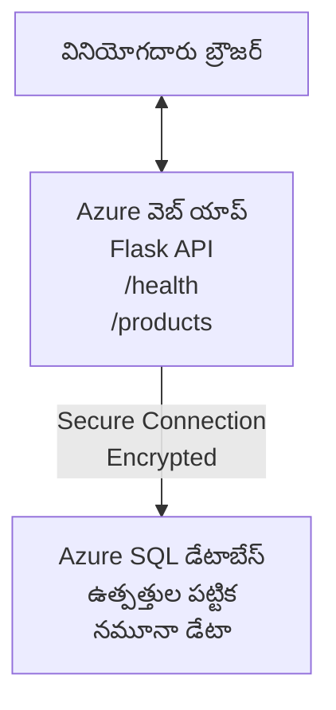

# AZDతో Microsoft SQL డేటాబేస్ మరియు వెబ్ యాప్‌ను డిప్లాయ్ చేయడం

⏱️ **అంచనా సమయం**: 20-30 నిమిషాలు | 💰 **అంచనా ఖర్చు**: ~$15-25/నెల | ⭐ **జটిల్యత**: మధ్యంతర

ఇది **పూర్తి, పని చేస్తున్న ఉదాహరణ** ఒక Python Flask వెబ్ అప్లికేషన్‌ను Microsoft SQL డేటాబేస్‌తో Azureకు డిప్లాయ్ చేయడానికి [Azure Developer CLI (azd)](https://learn.microsoft.com/azure/developer/azure-developer-cli/) ను ఎలా ఉపయోగించాలో చూపిస్తుంది. అన్ని కోడ్‌లూ చేర్చబడి పరీక్షించబడ్డాయి—బయటి డిపెండెన్సీలు అవసరం లేదు.

## మీరు నేర్చుకునేదీ

ఈ ఉదాహరణ పూర్తి చేయడం ద్వారా మీరు:
- ఇన్ఫ్రాస్ట్రక్చర్-ఎజ్-కోడ్ ఉపయోగించి బహు-ముడి అప్లికేషన్ (వెబ్ యాప్ + డేటాబేస్) ని డిప్లాయ్ చేయడం
- సీక్రెట్స్‌ను హార్డ్‌కోడింగ్ చేయకుండా సురక్షితంగా డేటాబేస్ కనెక్షన్లను కాంఫిగర్ చేయడం
- Application Insights తో అప్లికేషన్ ఆరోగ్యాన్ని మానిటర్ చేయడం
- AZD CLI తో Azure వనరులను సమర్థవంతంగా నిర్వహించడం
- భద్రత, ఖర్చు ఆప్టిమైజేషన్, మరియు ఆబ్జర్వబిలిటీకి Azure ఉత్తమ ప్రాథమికాలు అనుసరించడం

## సన్నివేశం అవలోకనం
- **Web App**: డేటాబేస్ కనెక్టివిటీతో Python Flask REST API
- **Database**: ఉదాహరణ డేటాతో Azure SQL Database
- **Infrastructure**: Bicep (మాడ్యులర్, పునర్వినియోగానికి సులభమైన టెంప్లేట్లు) ఉపయోగించి ప్రొవిజన్ చేయబడింది
- **Deployment**: `azd` కమాండ్లతో పూర్తి ఆటోమేటెడ్
- **Monitoring**: లాగ్స్ మరియు టెలిమెట్రీ కోసం Application Insights

## కావాల్సిన ముందు షరతులు

### అవసరమైన సాధనాలు

ప్రారম্ভించక ముందు, మీకు ఈ సాధనాలు ఇన్స్టాల్ అయ్యాయో లేదో నిర్ధారించుకోండి:

1. **[Azure CLI](https://learn.microsoft.com/cli/azure/install-azure-cli)** (వర్షన్ 2.50.0 లేదా ఎక్కువ)
   ```sh
   az --version
   # అనుకున్న అవుట్‌పుట్: azure-cli 2.50.0 లేదా అంతకంటే ఎక్కువ
   ```

2. **[Azure Developer CLI (azd)](https://learn.microsoft.com/azure/developer/azure-developer-cli/install-azd)** (వర్షన్ 1.0.0 లేదా ఎక్కువ)
   ```sh
   azd version
   # అనుకున్న ఫలితం: azd సంస్కరణ 1.0.0 లేదా పైగా
   ```

3. **[Python 3.8+](https://www.python.org/downloads/)** (లోకల్ డెవలప్‌మెంట్కు)
   ```sh
   python --version
   # ఆశించిన అవుట్‌పుట్: Python 3.8 లేదా అంతకంటే ఎక్కువ
   ```

4. **[Docker](https://www.docker.com/get-started)** (ఐచ్చికం, లోకల్ కంటైనరైజ్డ్ డెవలప్‌మెంట్ కోసం)
   ```sh
   docker --version
   # నిరీక్షిత అవుట్పుట్: Docker వెర్షన్ 20.10 లేదా అంతకంటే ఎక్కువ
   ```

### Azure అవసరాలు

- ఒక సక్రియమైన **Azure subscription** ([create a free account](https://azure.microsoft.com/free/))
- మీ సబ్‌స్క్రిప్షన్‌లో వనరులు సృష్టించడానికి అనుమతులు
- సబ్‌స్క్రిప్షన్ లేదా రిసోర్సు గ్రూప్‌పై **Owner** లేదా **Contributor** పాత్ర

### ముందస్తు పరిజ్ఞానం

ఇది **మధ్యంతర స్థాయి** ఉదాహరణ. మీకు ఇవి తెలుసు ఉండాలి:
- బేసిక్ కమాండ్-లైన్ ఆపరేషన్లు
- క్లౌడ్ బేసిక్ కాన్సెప్ట్‌లు (వనరులు, రిసోర్స్ గ్రూపులు)
- వెబ్ అప్లికేషన్‌లు మరియు డేటాబేస్‌ల గురించి ప్రాథమిక అవగాహన

**AZD కొత్తవారికి?** ముందు [ప్రారంభ మార్గదర్శక](../../docs/chapter-01-foundation/azd-basics.md) ను చూడండి.

## ఆర్కిటెక్చర్

ఈ ఉదాహరణ వెబ్ అప్లికేషన్ మరియు SQL డేటాబేస్ ఉన్న రెండు-టైర్ ఆర్కిటెక్చర్‌ను డిప్లాయ్ చేస్తుంది:



**Resource Deployment:**
- **Resource Group**: అన్ని వనరుల కోసం కంటైనర్
- **App Service Plan**: Linux-ఆధారిత హోస్టింగ్ (ఖర్చు సామర్థ్యానికి B1 టియర్)
- **Web App**: Flask అప్లికేషన్‌తో Python 3.11 రన్‌టైమ్
- **SQL Server**: TLS 1.2 కనీసంతో Managed డేటాబేస్ సర్వర్
- **SQL Database**: Basic టియర్ (2GB, డెవలప్‌మెంట్/టెస్టింగ్‌కు అనుకూలం)
- **Application Insights**: మానిటరింగ్ మరియు లాగింగ్
- **Log Analytics Workspace**: కేంద్రీకృత లాగ్ స్టోరేజ్

**ఉపమా**: దీన్ని ఒక రెస్టారెంట్ (వెబ్ యాప్) మరియు ఒక వాక్-ఇన్ ఫ్రీజర్ (డేటాబేస్) లాగా ఆలోచించండి. కస్టమర్లు మెనూ (API ఎండ్‌పాయింట్లు) నుంచి ఆర్డర్ చేస్తారు, కిచెన్ (Flask అప్లికేషన్) ఫ్రీజర్ నుంచి పదార్థాలు (డేటా) తీస్తుంది. రెస్టారెంట్ మేనేజర్ (Application Insights) జరిగే ప్రతీదాన్ని ట్రాక్ చేస్తాడు.

## ఫోల్డర్ నిర్మాణం

ఈ ఉదాహరణలో అన్ని ఫైళ్లు చేర్చబడ్డాయి—బయటి డిపెండెన్సీలు అవసరం లేదు:

```
examples/database-app/
│
├── README.md                    # This file
├── azure.yaml                   # AZD configuration file
├── .env.sample                  # Sample environment variables
├── .gitignore                   # Git ignore patterns
│
├── infra/                       # Infrastructure as Code (Bicep)
│   ├── main.bicep              # Main orchestration template
│   ├── abbreviations.json      # Azure naming conventions
│   └── resources/              # Modular resource templates
│       ├── sql-server.bicep    # SQL Server configuration
│       ├── sql-database.bicep  # Database configuration
│       ├── app-service-plan.bicep  # Hosting plan
│       ├── app-insights.bicep  # Monitoring setup
│       └── web-app.bicep       # Web application
│
└── src/
    └── web/                    # Application source code
        ├── app.py              # Flask REST API
        ├── requirements.txt    # Python dependencies
        └── Dockerfile          # Container definition
```

**ఫైల్‌ల యొక్క వివరణ:**
- **azure.yaml**: AZDకి ఏది డిప్లాయ్ చేయాలో మరియు ఎక్కడ చేయాలో చెప్పుతుంది
- **infra/main.bicep**: అన్ని Azure వనరులను సమన్వయిస్తుంది
- **infra/resources/*.bicep**: వ్యక్తిగత వనరు నిర్వచనాలు (పునర్వినియోగానికి మాడ్యూలర్)
- **src/web/app.py**: డేటాబేస్ లాజిక్ ఉన్న Flask అప్లికేషన్
- **requirements.txt**: Python ప్యాకేజ్ ఆధారితతలు
- **Dockerfile**: డిప్లాయ్‌మెంట్ కోసం కంటైనరైజేషన్ సూచనలు

## క్లిక్కువిత్ (స్టెప్-బై-స్టెప్)

### స్టెప్ 1: క్లోన్ చేసి నావిగేట్ చేయండి

```sh
git clone https://github.com/microsoft/AZD-for-beginners.git
cd AZD-for-beginners/examples/database-app
```

**✓ విజయo తనిఖీ**: మీరు `azure.yaml` మరియు `infra/` ఫోల్డర్ కనపడుతున్నదని నిర్ధారించండి:
```sh
ls
# అనుకోబడింది: README.md, azure.yaml, infra/, src/
```

### స్టెప్ 2: Azureతో ప్రామాణీకరణ

```sh
azd auth login
```

ఇది Azure ప్రామాణీకరణ కోసం మీ బ్రౌజర్‌ను తెరుస్తుంది. మీ Azure క్రెడెన్షియల్స్‌తో సైన్ ఇన్ చేయండి.

**✓ విజయo తనిఖీ**: మీరు ఇలాంటి అవుట్‌పుట్ చూడాలి:
```
Logged in to Azure.
```

### స్టెప్ 3: వాతావరణాన్ని ప్రారంభించండి

```sh
azd init
```

**ఏం జరుగుతుంది**: AZD మీ డిప్లాయ్‌మెంట్ కోసం ఒక లోకల్ కాన్ఫిగరేషన్ ను తయారు చేస్తుంది.

**మీకు కనిపించే ప్రాంప్ట్స్**:
- **Environment name**: చిన్న పేరు ఇవ్వండి (ఉదహరణకు, `dev`, `myapp`)
- **Azure subscription**: జాబితాలోనుంచి మీ సబ్‌స్క్రిప్షన్ ఎంచుకోండి
- **Azure location**: ఒక రీజియన్ ఎంచుకోండి (ఉదాహరణకు, `eastus`, `westeurope`)

**✓ విజయo తనిఖీ**: మీరు ఇలాంటి అవుట్‌పుట్ చూడాలి:
```
SUCCESS: New project initialized!
```

### స్టెప్ 4: Azure వనరులను ప్రావిజన్ చేయండి

```sh
azd provision
```

**ఏం జరుగుతుంది**: AZD అన్ని ఇన్ఫ్రాస్ట్రక్చర్‌ను డిప్లాయ్ చేస్తుంది (5-8 నిమిషాలు పడుతుంది):
1. రిసోర్స్ గ్రూప్ సృష్టిస్తుంది
2. SQL Server మరియు Database సృష్టిస్తుంది
3. App Service Plan సృష్టిస్తుంది
4. Web App సృష్టిస్తుంది
5. Application Insights సృష్టిస్తుంది
6. నెట్‌వర్కింగ్ మరియు సెక్యూరిటీని కాంఫిగర్ చేస్తుంది

**మీరు ఇన్‌పుట్ ఇవ్వవలసింది**:
- **SQL admin username**: ఒక యూజర్నేమ్ ఇవ్వండి (ఉదాహరణకు, `sqladmin`)
- **SQL admin password**: బలమైన పాస్వర్డ్ ఇవ్వండి (దీన్ని సేవ్ చేయండి!)

**✓ విజయo తనిఖీ**: మీరు ఇలాంటి అవుట్‌పుట్ చూడాలి:
```
SUCCESS: Your application was provisioned in Azure in X minutes Y seconds.
You can view the resources created under the resource group rg-<env-name> in Azure Portal:
https://portal.azure.com/#@/resource/subscriptions/.../resourceGroups/rg-<env-name>
```

**⏱️ సమయం**: 5-8 నిమిషాలు

### స్టెప్ 5: అప్లికేషన్‌ను డిప్లాయ్ చేయండి

```sh
azd deploy
```

**ఏం జరుగుతుంది**: AZD మీ Flask అప్లికేషన్‌ను బిల్డ్ చేసి డిప్లాయ్ చేస్తుంది:
1. Python అప్లికేషన్‌ను ప్యాకేజ్ చేస్తుంది
2. Docker కంటైనర్‌ను బిల్డ్ చేస్తుంది
3. Azure Web App కు పుష్ చేస్తుంది
4. నమూనా డేటాతో డేటాబేస్‌ను ఇనిషియలైజ్ చేస్తుంది
5. అప్లికేషన్‌ను ప్రారంభిస్తుంది

**✓ విజయo తనిఖీ**: మీరు ఇలాంటి అవుట్‌పుట్ చూడాలి:
```
SUCCESS: Your application was deployed to Azure in X minutes Y seconds.
You can view the resources created under the resource group rg-<env-name> in Azure Portal:
https://portal.azure.com/#@/resource/subscriptions/.../resourceGroups/rg-<env-name>
```

**⏱️ సమయం**: 3-5 నిమిషాలు

### స్టెప్ 6: అప్లికేషన్ ను బ్రౌజ్ చేయండి

```sh
azd browse
```

ఇది మీ డిప్లాయ్డ్ వెబ్ యాప్‌ను బ్రౌజర్‌లో `https://app-<unique-id>.azurewebsites.net` వద్ద తెరుస్తుంది

**✓ విజయo తనిఖీ**: మీరు JSON అవుట్‌పుట్ చూడాలి:
```json
{
  "message": "Welcome to the Database App API",
  "endpoints": {
    "/": "This help message",
    "/health": "Health check endpoint",
    "/products": "List all products",
    "/products/<id>": "Get product by ID"
  }
}
```

### స్టెప్ 7: API ఎండ్‌పాయింట్లను పరీక్షించండి

**హెల్త్ చెక్** (డేటాబేస్ కనెక్షన్ ను నిర్ధారించండి):
```sh
curl https://app-<your-id>.azurewebsites.net/health
```

**ఎప్పటికీ తేలికైన స్పందన**:
```json
{
  "status": "healthy",
  "database": "connected"
}
```

**పొడవైన ఉత్పత్తుల జాబితా** (నమూనా డేటా):
```sh
curl https://app-<your-id>.azurewebsites.net/products
```

**ఎప్పటికీ తేలికైన స్పందన**:
```json
[
  {
    "id": 1,
    "name": "Laptop",
    "description": "High-performance laptop",
    "price": 1299.99,
    "created_at": "2025-11-19T10:30:00"
  },
  ...
]
```

**ఒకే ఉత్పత్తి పొందండి**:
```sh
curl https://app-<your-id>.azurewebsites.net/products/1
```

**✓ విజయo తనిఖీ**: అన్ని ఎండ్‌పాయింట్లు తప్పులిలేకుండా JSON డేటా రిటర్న్ చేయాలి.

---

**🎉 అభినందనలు!** మీరు AZD ఉపయోగించి Azureలో ఒక డేటాబేస్‌తో కూడిన వెబ్ అప్లికేషన్‌ను విజయవంతంగా డిప్లాయ్ చేసారు.

## కాన్ఫిగరేషన్ లోతైన-దృష్టి

### ఎన్విరాన్‌మెంట్ వేరియబుల్స్

సీక్రెట్స్‌ను Azure App Service కాన్ఫిగరేషన్ ద్వారా సురక్షితంగా నిర్వహిస్తారు—**సోర్స్ కోడ్‌లో ఎప్పుడూ హార్డ్‌కోడ్ చేయకండి**.

**AZD ద్వారా ఆటోమేటిగ్గా కాన్ఫిగర్ చేయబడినవి**:
- `SQL_CONNECTION_STRING`: ఎన్‌క్రిప్టెడ్ విలువలతో డేటాబేస్ కనెక్షన్
- `APPLICATIONINSIGHTS_CONNECTION_STRING`: మానిటరింగ్ టెలిమెట్రీ ఎండ్‌పాయింట్
- `SCM_DO_BUILD_DURING_DEPLOYMENT`: ఆటోమేటిక్ డిపెండెన్సీ ఇన్స్టాల్‌ను ఎనేబుల్ చేస్తుంది

**సీక్రెట్స్ ఎక్కడ నిల్వ చేయబడతాయి**:
1. `azd provision` సమయంలో, మీరు SQL క్రెడెన్షియల్స్‌ను సెక్యూర్ ప్రాంప్ట్‌ల ద్వారా అందిస్తారు
2. AZD వాటిని లోకల్ `.azure/<env-name>/.env` ఫైల్‌లో (git-ignored) నిల్వ చేస్తుంది
3. AZD వాటిని Azure App Service కాన్ఫిగరేషన్‌లో ఇంజెక్ట్ చేస్తుంది (at rest లో ఎన్‌క్రిప్టెడ్)
4. అప్లికేషన్ runtime లో వాటిని `os.getenv()` ద్వారా చదుగుతుంది

### లోకల్ డెవలప్‌మెంట్

లోకల్ టెస్టింగ్ కోసం, నమూనా నుండి `.env` ఫైల్ క్రియేట్ చేయండి:

```sh
cp .env.sample .env
# .env ను మీ స్థానిక డేటాబేస్ కనెక్షన్‌తో సవరించండి
```

**లోకల్ డెవలప్‌మెంట్ వర్క్‌ఫ్లో**:
```sh
# అవలంబనలను ఇన్‌స్టాల్ చేయండి
cd src/web
pip install -r requirements.txt

# పర్యావరణ వేరియబుల్స్‌ను సెట్ చేయండి
export SQL_CONNECTION_STRING="your-local-connection-string"

# అప్లికేషన్‌ను నడపండి
python app.py
```

**లోకల్‌గా పరీక్షించండి**:
```sh
curl http://localhost:8000/health
# అనుకోబడింది: {"status": "healthy", "database": "connected"}
```

### ఇన్ఫ్రాస్ట్రక్చర్ ఎజ్ కోడ్

అన్ని Azure వనరులు **Bicep టెంప్లేట్లు** (`infra/` ఫోల్డర్) లో నిర్వచించబడ్డాయి:

- **మాడ్యులర్ డిజైన్**: ప్రతి వనరు రకం కోసం వేరే ఫైల్, పునర్వినియోగానికి సౌకర్యం
- **పేరామెటరైజ్డ్**: SKUs, రీజియన్లు, నామకరణ కన్వెన్షన్లు కస్టమైజ్ చేయండి
- **ఉత్తమ అభ్యాసాలు**: Azure నామకరణ ప్రమాణాలు మరియు సెక్యురిటీ డిఫాల్ట్స్‌ను అనుసరించాలి
- **వర్షన్ కంట్రోల్డ్**: ఇన్ఫ్రాస్ట్రక్చర్ మార్పులు Gitలో ట్రాక్ చేయబడతాయి

**కస్టమైజేషన్ ఉదాహరణ**:
డేటాబేస్ టియర్ మార్చడానికి, `infra/resources/sql-database.bicep` ను ఎడిట్ చేయండి:
```bicep
sku: {
  name: 'Standard'  // Changed from 'Basic'
  tier: 'Standard'
  capacity: 10
}
```

## భద్రత ఉత్తమ ఆచారాలు

ఈ ఉదాహరణ Azure భద్రత ఉత్తమ ఆచారాలను అనుసరిస్తుంది:

### 1. **సోర్స్ కోడ్‌లో సీక్రెట్స్ లేవు**
- ✅ క్రెడెన్షియల్స్ Azure App Service కాన్ఫిగరేషన్‌లో నిల్వ చేయబడతాయి (ఎన్‌క్రిప్టెడ్)
- ✅ `.env` ఫైళ్ళు `.gitignore` ద్వారా Git నుండి మినహాయింపులు
- ✅ ప్రోవిజనింగ్ సమయంలో సెక్యూర్ పరామీటర్స్ ద్వారా సీక్రెట్స్ పంపబడతాయి

### 2. **ఎన్‌క్రిప్టెడ్ కనెక్షన్లు**
- ✅ SQL Server కు కనీసం TLS 1.2
- ✅ Web App కోసం HTTPS-కే పరిమితం చేయబడింది
- ✅ డేటాబేస్ కనెక్షన్లు ఎన్‌క్రిప్టెడ్ చానెల్స్ ఉపయోగిస్తాయి

### 3. **నెట్‌వర్క్ భద్రత**
- ✅ SQL Server ఫైర్వాల్ Azure సర్వీసులకే అనుమతించే విధంగా కాంఫిగర్ చేయబడింది
- ✅ పబ్లిక్ నెట్‌వర్క్ యాక్సెస్ పరిమితి (Private Endpoints తో మరింత కఠినంగా చేయవచ్చు)
- ✅ Web App పై FTPS డిసేబుల్ చేయబడింది

### 4. **ఆథెంటికేషన్ & ఆథరైజేషన్**
- ⚠️ **ప్రస్తుత**: SQL ఆథెంటికేషన్ (యూజర్నేమ్/పాస్వర్డ్)
- ✅ **ప్రొడక్షన్ సిఫార్సు**: పాస్వర్డ్లు రహిత ఆథెంటికేషన్ కోసం Azure Managed Identity ఉపయోగించండి

**Managed Identity వరకు అప్‌గ్రేడ్ చేయడానికి** (ప్రొడక్షన్ కోసం):
1. Web Appపై managed identityని ఎనేబుల్ చేయండి
2. ఆ ఐడెంటిటీఐకి SQL అనుమతులు ఇవ్వండి
3. కనెక్షన్ స్ట్రింగ్‌ను managed identity ఉపయోగించేలా అప్డేట్ చేయండి
4. పాస్వర్డ్-ఆధారిత ఆథెంటికేషన్ తొలగించండి

### 5. **ఆడిటింగ్ & కంప్లయెన్స్**
- ✅ Application Insights అన్ని రిక్వెస్ట్స్ మరియు ఎర్రర్స్ లాగ్ చేస్తుంది
- ✅ SQL Database ఆడిటింగ్ ఎనేబుల్ చేయబడింది (కంప్లయెన్స్ కోసం కాంఫిగర్ చేయవచ్చు)
- ✅ అన్ని వనరులు పాలన కోసం ట్యాగ్ చేయబడ్డాయి

**ప్రొడక్షన్‌కు ముందు భద్రత చెక్‌లిస్ట్**:
- [ ] SQL కోసం Azure Defenderను ఎనేబుల్ చేయండి
- [ ] SQL Database కోసం Private Endpoints ను కాంఫిగర్ చేయండి
- [ ] Web Application Firewall (WAF) ను ఎనేబుల్ చేయండి
- [ ] రహస్యాల రొటేషన్ కోసం Azure Key Vault అమలు చేయండి
- [ ] Microsoft Entra ID ఆథెంటికేషన్ ను కాంఫిగర్ చేయండి
- [ ] అన్ని వనరుల కోసం డయాగ్నొస్టిక్ లాగ్‌లు ఎనేబుల్ చేయండి

## ఖర్చు ఆప్టిమైజేషన్

**అంచనా నెలవారీ ఖర్చులు** (నవంబర్ 2025 నాటికి):

| Resource | SKU/Tier | Estimated Cost |
|----------|----------|----------------|
| App Service Plan | B1 (Basic) | ~$13/month |
| SQL Database | Basic (2GB) | ~$5/month |
| Application Insights | Pay-as-you-go | ~$2/month (low traffic) |
| **Total** | | **~$20/month** |

**💡 ఖర్చు ఆదా సూచనలు**:

1. **సంసిద్ధత కోసం ఫ్రీ టియర్ ఉపయోగించండి**:
   - App Service: F1 టియర్ (ఫ్రీ, పరిమిత గంటలు)
   - SQL Database: Azure SQL Database serverless ఉపయోగించండి
   - Application Insights: 5GB/నెల ఫ్రీ ఇన్జెషన్

2. **వినియోగంలో లేనప్పుడు వనరులను ఆపండి**:
   ```sh
   # వెబ్ అనువర్తనాన్ని ఆపండి (డేటాబేస్‌కు ఇంకా ఛార్జీలు వర్తిస్తాయి)
   az webapp stop --name <app-name> --resource-group <rg-name>
   
   # అవసరమైతే మళ్లీ ప్రారంభించండి
   az webapp start --name <app-name> --resource-group <rg-name>
   ```

3. **పరీక్షల తర్వాత అన్నింటినీ తొలగించండి**:
   ```sh
   azd down
   ```
   ఇది అన్ని వనరులను తొలగించి ఖర్చులను ఆపుతుంది.

4. **డెవలప్‌మెంట్ vs. ప్రొడక్షన్ SKUs**:
   - **డెవలప్‌మెంట్**: Basic టియర్ (ఈ ఉదాహరణలో ఉపయోగించబడింది)
   - **ప్రొడక్షన్**: రెడండెన్సీతో కూడిన Standard/Premium టియర్

**ఖర్చు మానిటరింగ్**:
- ఖర్చులను చూడండి [Azure Cost Management](https://portal.azure.com/#view/Microsoft_Azure_CostManagement)
- ఆశ్చర్యకరమైన ఖర్చులను నివారించడానికి ఖర్చు అలెర్ట్స్ ఏర్పాటుచేసుకోండి
- ట్రాకింగ్ కోసం అన్ని వనరులకు `azd-env-name` ట్యాగ్ వేసుకోండి

**ఫ్రీ టియర్ ఎంపిక**:
పాఠం నేర్చుకోడానికి, మీరు `infra/resources/app-service-plan.bicep` ను మార్చవచ్చు:
```bicep
sku: {
  name: 'F1'  // Free tier
  tier: 'Free'
}
```
**గమనిక**: ఫ్రీ టియర్‌కు పరిమితులు ఉన్నాయి (రోజుకు 60 నిమిషాలు CPU, ఎప్పుడూ ఆన్ కాదు).

## మానిటరింగ్ & ఆబ్జర్వబిలిటీ

### Application Insights ఇంటిగ్రేషన్

ఈ ఉదాహరణలో సమగ్ర మానిటరింగ్ కోసం **Application Insights** చేర్చబడింది:

**ఏం మానిటర్ చేయబడుతుంది**:
- ✅ HTTP రిక్వెస్ట్స్ (లాటెన్సీ, స్టేటస్ కోడ్స్, ఎండ్‌పాయింట్లు)
- ✅ అప్లికేషన్ ఎర్రర్లు మరియు ఎక్సెప్షన్లు
- ✅ Flask అప్లికేషన్ నుండి కస్టమ్ లాగింగ్
- ✅ డేటాబేస్ కనెక్షన్ ఆరోగ్యం
- ✅ పనితీరు మెట్రిక్‌లు (CPU, మెమొరీ)

**Application Insights ను యాక్సెస్ చేయాలి**:
1. [Azure Portal](https://portal.azure.com) ఓపెన్ చేయండి
2. మీ రిసోర్స్ గ్రూప్ (`rg-<env-name>`) కు నావిగేట్ చేయండి
3. Application Insights రిసోర్స్ (`appi-<unique-id>`) పై క్లిక్ చేయండి

**ఉపయోగకరమైన క్వెరీస్** (Application Insights → Logs):

**అన్ని రిక్వెస్ట్స్ ని వీక్షించండి**:
```kusto
requests
| where timestamp > ago(1h)
| order by timestamp desc
| project timestamp, name, url, resultCode, duration
```

**ఎర్రర్లు కనుక్కోండి**:
```kusto
exceptions
| where timestamp > ago(24h)
| order by timestamp desc
| project timestamp, type, outerMessage, operation_Name
```

**హెల్త్ ఎండ్‌పాయింట్ చెక్ చేయండి**:
```kusto
requests
| where name contains "health"
| summarize count() by resultCode, bin(timestamp, 1h)
```

### SQL డేటాబేస్ ఆడిటింగ్

**SQL Database auditing ఎనేబుల్ చేయబడింది** తద్వారా ట్రాక్ చేయబడుతుంది:
- డేటాబేస్ యాక్సెస్ ప్యాటర్న్లు
- ఫెయిల్డ్ లాగిన్ ప్రయత్నాలు
- స్కీమా మార్పులు
- డేటా యాక్సెస్ (కంప్లయెన్స్ కోసం)

**ఆడిట్ లాగ్‌లను యాక్సెస్ చేయండి**:
1. Azure Portal → SQL Database → Auditing
2. Log Analytics workspaceలో లాగ్‌లను చూడండి

### రియల్-టైమ్ మానిటరింగ్

**లైవ్ మెట్రిక్స్ చూడండి**:
1. Application Insights → Live Metrics
2. రియల్-టైమ్‌లో రిక్వెస్ట్స్, ఫెయిల్యుర్స్, పనితీరు చూడండి

**అలెర్ట్స్ సెటప్ చేయండి**:
క్రిటికల్ ఈవెంట్స్ కోసం అలెర్ట్‌లను క్రియేట్ చేయండి:
- HTTP 500 ఎర్రర్లు > 5 లో 5 నిమిషాలలో
- డేటాబేస్ కనెక్షన్ ఫెయిల్యుర్స్
- అధిక రిస్పాన్స్ టైమ్ (>2 సెకన్లు)

**అలెర్ట్ క్రియేషన్ ఉదాహరణ**:
```sh
az monitor metrics alert create \
  --name "High-Response-Time" \
  --resource-group <rg-name> \
  --scopes <app-insights-resource-id> \
  --condition "avg requests/duration > 2000" \
  --description "Alert when response time exceeds 2 seconds"
```

## సమస్య పరిష్కరణ (Troubleshooting)
### సాధారణ సమస్యలు మరియు పరిష్కారాలు

#### 1. `azd provision` fails with "Location not available"

**లక్షణం**:
```
Error: The subscription is not registered for the resource type 'components' in the location 'centralus'.
```

**పరిష్కారం**:
వేరే Azure ప్రాంతాన్ని ఎంచుకోండి లేదా రిసోర్స్ ప్రొవైడర్‌ను రిజిస్టర్ చేయండి:
```sh
az provider register --namespace Microsoft.Insights
```

#### 2. SQL Connection Fails During Deployment

**లక్షణం**:
```
pyodbc.OperationalError: ('08001', '[08001] [Microsoft][ODBC Driver 18 for SQL Server]TCP Provider...')
```

**పరిష్కారం**:
- SQL Server ఫైర్వాల్ Azure సేవలను అనుమతిస్తున్నదో ధృవీకరించండి (స్వయంచాలకంగా కాన్ఫిగర్ అవుతుంది)
- `azd provision` సమయంలో SQL అడ్మిన్ పాస్‌వర్డ్ సరైనవిగా నమోదు చేశారని తనిఖీ చేయండి
- SQL Server పూర్తిగా ప్రొవిజన్ అయ్యిందో నిర్ధారించండి (2-3 నిమిషాలు పడవచ్చు)

**కనెక్షన్ను ధృవీకరించండి**:
```sh
# Azure పోర్టల్ నుండి SQL డేటాబేస్ → క్వెరీ ఎడిటర్ కు వెళ్ళండి
# మీ క్రెడెన్షియల్స్‌తో కనెక్ట్ చేయడానికి ప్రయత్నించండి
```

#### 3. Web App Shows "Application Error"

**లక్షణం**:
బ్రౌజర్ సాధారణ ఎర్రర్ పేజీని చూపిస్తుంది.

**పరిష్కారం**:
అప్లికేషన్ లాగ్‌లను తనిఖీ చేయండి:
```sh
# ఇటీవలి లాగ్‌లను చూడండి
az webapp log tail --name <app-name> --resource-group <rg-name>
```

**సాధారణ కారణాలు**:
- పర్యావరణ వేరియబుల్స్ లేవు (App Service → Configuration ను తనిఖీ చేయండి)
- Python ప్యాకేజ్ ఇన్స్టాలేషన్ విఫలమైంది (deployment logs ను తనిఖీ చేయండి)
- డాటాబేస్ ప్రారంభీకరణ లోపం (SQL కనెక్టివిటీని తనిఖీ చేయండి)

#### 4. `azd deploy` Fails with "Build Error"

**లక్షణం**:
```
Error: Failed to build project
```

**పరిష్కారం**:
- `requirements.txt` లో సింటాక్స్ లోపాలు లేవని నిర్ధారించండి
- `infra/resources/web-app.bicep` లో Python 3.11 సూచించబడిందో తనిఖీ చేయండి
- Dockerfile సరైన base image కలిగి ఉందో ధృవీకరించండి

**లోకల్‌గా డిబగ్ చేయండి**:
```sh
cd src/web
docker build -t test-app .
docker run -p 8000:8000 test-app
```

#### 5. "Unauthorized" When Running AZD Commands

**లక్షణం**:
```
ERROR: (Unauthorized) The client '<id>' with object id '<id>' does not have authorization
```

**పరిష్కారం**:
Azureలో మళ్లీ ప్రామాణీకరణ చేయండి:
```sh
# AZD వర్క్‌ఫ్లోలకు అవసరం
azd auth login

# మీరు Azure CLI కమాండ్లను నేరుగా కూడా ఉపయోగిస్తున్నట్లయితే ఐచ్ఛికం
az login
```

మీకు సబ్స్క్రిప్షన్‌పై సరైన అనుమతులు (Contributor పాత్ర) ఉన్నాయని ధృవీకరించండి.

#### 6. High Database Costs

**లక్షణం**:
అనుకొనని Azure బిల్ వచ్చింది.

**పరిష్కారం**:
- టెస్టింగ్ తర్వాత `azd down` నును నడపడం మర్చిపోయారా అని తనిఖీ చేయండి
- SQL Database Basic tier వాడుతున్నదో (Premium కాదు) నిర్ధారించండి
- Azure Cost Managementలో ఖర్చులను సమీక్షించండి
- ఖర్చు అలర్ట్‌లు ఏర్పాటు చేయండి

### సహాయం పొందడం

**అన్ని AZD పర్యావరణ వేరియబుల్స్‌ను చూడండి**:
```sh
azd env get-values
```

**డిప్లాయ్‌మెంట్ స్థితిని తనిఖీ చేయండి**:
```sh
az webapp show --name <app-name> --resource-group <rg-name> --query state
```

**అప్లికేషన్ లాగ్‌లను యాక్సెస్ చేయండి**:
```sh
az webapp log download --name <app-name> --resource-group <rg-name> --log-file app-logs.zip
```

**మరింత సహాయం కావాలా?**
- [AZD సమస్య పరిష్కార మార్గదర్శకం](../../docs/chapter-07-troubleshooting/common-issues.md)
- [Azure App Service ట్రబుల్‌షూటింగ్](https://learn.microsoft.com/azure/app-service/troubleshoot-diagnostic-logs)
- [Azure SQL ట్రబుల్‌షూటింగ్](https://learn.microsoft.com/azure/azure-sql/database/troubleshoot-common-errors-issues)

## ప్రాక్టికల్ వ్యాయామాలు

### వ్యాయామం 1: మీ డిప్లాయ్‌మెంట్‌ను ధృవీకరించండి (ఆరంభ స్థాయి)

**లక్ష్యం**: అన్ని రీసోర్స్‌లు డిప్లాయ్ అయ్యాయో మరియు అప్లికేషన్ పనిచేస్తున్నదో నిర్ధారించండి.

**దశలు**:
1. మీ రిసోర్స్ గ్రూప్‌లోని అన్ని రీసోర్స్‌లను జాబితా చేయండి:
   ```sh
   az resource list --resource-group rg-<env-name> --output table
   ```
   **అంచనా**: 6-7 resources (Web App, SQL Server, SQL Database, App Service Plan, Application Insights, Log Analytics)

2. అన్ని API endpoints ని పరీక్షించండి:
   ```sh
   curl https://app-<your-id>.azurewebsites.net/
   curl https://app-<your-id>.azurewebsites.net/health
   curl https://app-<your-id>.azurewebsites.net/products
   curl https://app-<your-id>.azurewebsites.net/products/1
   ```
   **అంచనా**: అన్ని తప్పుల్లేకుండా చెల్లుబాటు అయ్యే JSON ను తిరిగి ఇస్తాయి

3. Application Insights ను తనిఖీ చేయండి:
   - Azure పోర్టల్‌లోని Application Insights కు వెళ్లండి
   - "Live Metrics" కు వెళ్లండి
   - వెబ్ యాప్‌పై మీ బ్రౌజర్‌ను రిఫ్రెష్ చేయండి
   **అంచనా**: రిక్వెస్ట్‌లు రియల్-టైంలో కనిపిస్తాయి

**విజయ ప్రమాణాలు**: అన్ని 6-7 రీసోర్స్‌లు ఉండాలి, అన్ని ఎండ్‌పాయింట్లు డేటాను రిటర్న్ చేయాలి, Live Metrics లో చర్యలు కనిపించాలి.

---

### వ్యాయామం 2: కొత్త API ఎండ్‌పాయింట్ జోడించండి (మద్యమ స్థాయి)

**లక్ష్యం**: Flask అప్లికేషన్‌ను కొత్త ఎండ్‌పాయింట్ ద్వారా విస్తరించే పనిని చేయండి.

**స్టార్టర్ కోడ్**: ప్రస్తుత ఎండ్‌పాయింట్లు `src/web/app.py` లో ఉన్నాయి

**దశలు**:
1. `src/web/app.py` ను ఎడిట్ చేసి `get_product()` ఫంక్షన్ తరువాత కొత్త ఎండ్‌పాయింట్‌ను జోడించండి:
   ```python
   @app.route('/products/search/<keyword>')
   def search_products(keyword):
       """Search products by name or description."""
       try:
           conn = get_db_connection()
           cursor = conn.cursor()
           cursor.execute(
               "SELECT id, name, description, price, created_at FROM products WHERE name LIKE ? OR description LIKE ?",
               (f'%{keyword}%', f'%{keyword}%')
           )
           
           products = []
           for row in cursor.fetchall():
               products.append({
                   'id': row[0],
                   'name': row[1],
                   'description': row[2],
                   'price': float(row[3]) if row[3] else None,
                   'created_at': row[4].isoformat() if row[4] else None
               })
           
           cursor.close()
           conn.close()
           
           logger.info(f"Search for '{keyword}' returned {len(products)} results")
           return jsonify(products), 200
           
       except Exception as e:
           logger.error(f"Error searching products: {str(e)}")
           return jsonify({'error': str(e)}), 500
   ```

2. అప్డేట్ చేసిన అప్లికేషన్‌ను డిప్లాయ్ చేయండి:
   ```sh
   azd deploy
   ```

3. కొత్త ఎండ్‌పాయింట్‌ను పరీక్షించండి:
   ```sh
   curl https://app-<your-id>.azurewebsites.net/products/search/laptop
   ```
   **అంచనా**: "laptop" కు సరిపోయే ఉత్పత్తులు తిరిగి వస్తాయి

**విజయ ప్రమాణాలు**: కొత్త ఎండ్‌పాయింట్ పని చేయాలి, ఫిల్టర్ చేసిన ఫలితాలను రిటర్న్ చేయాలి, Application Insights లాగ్‌లలో కనబడాలి.

---

### వ్యాయామం 3: మానిటరింగ్ మరియు అలర్ట్‌లు జోడించండి (అధునాతన)

**లక్ష్యం**: అలర్ట్‌లతో ప్రో యాక్టివ్ మానిటరింగ్ సెటప్ చేయండి.

**దశలు**:
1. HTTP 500 లోపాల కోసం అలర్ట్ క్రియేట్ చేయండి:
   ```sh
   # Application Insights వనరు ID పొందండి
   AI_ID=$(az monitor app-insights component show \
     --app appi-<your-id> \
     --resource-group rg-<env-name> \
     --query id -o tsv)
   
   # అలర్ట్ సృష్టించండి
   az monitor metrics alert create \
     --name "High-Error-Rate" \
     --resource-group rg-<env-name> \
     --scopes $AI_ID \
     --condition "count requests/failed > 5" \
     --window-size 5m \
     --evaluation-frequency 1m \
     --description "Alert when >5 failed requests in 5 minutes"
   ```

2. లోపాలు సృష్టించడం ద్వారా అలర్ట్‌ను ట్రిగ్గర్ చేయండి:
   ```sh
   # ఉండని ఉత్పత్తిని అభ్యర్థించండి
   for i in {1..10}; do curl https://app-<your-id>.azurewebsites.net/products/999; done
   ```

3. అలర్ట్ ఫైర్ అయ్యిందా అని తనిఖీ చేయండి:
   - Azure Portal → Alerts → Alert Rules
   - మీ ఇమెయిల్‌ను తనిఖీ చేయండి (కాన్ఫిగర్ చేసినట్లయితే)

**విజయ ప్రమాణాలు**: అలర్ట్ రూల్ సృష్టించబడింది, లోపాలపై ట్రిగ్గర్ అవుతుంది, నోటిఫికేషన్లు పొందబడతాయి.

---

### వ్యాయామం 4: డాటాబేస్ స్కీమా మార్పులు (అధునాతన)

**లక్ష్యం**: కొత్త టేబుల్ జోడించి అప్లికేషన్‌ను దాన్ని ఉపయోగించేలా మార్చండి.

**దశలు**:
1. Azure పోర్టల్ Query Editor ద్వారా SQL డేటాబేస్‌కు కనెక్ట్ అవ్వండి

2. కొత్త `categories` టేబుల్ సృష్టించండి:
   ```sql
   CREATE TABLE categories (
       id INT PRIMARY KEY IDENTITY(1,1),
       name NVARCHAR(50) NOT NULL,
       description NVARCHAR(200)
   );
   
   INSERT INTO categories (name, description) VALUES
   ('Electronics', 'Electronic devices and accessories'),
   ('Office Supplies', 'Office equipment and supplies');
   
   -- Add category to products table
   ALTER TABLE products ADD category_id INT;
   UPDATE products SET category_id = 1; -- Set all to Electronics
   ```

3. రెస్పాన్స్‌లలో క్యాటగరీ సమాచారం ఉంచడానికి `src/web/app.py` ను అప్డేట్ చేయండి

4. డిప్లాయ్ చేసి పరీక్షించండి

**విజయ ప్రమాణాలు**: కొత్త టేబుల్ ఉండాలి, ఉత్పత్తులు క్యాటగరీ సమాచారంతో చూపబడాలి, అప్లికేషన్ ఇంకా పనిచేయాలి.

---

### వ్యాయామం 5: క్యాషింగ్ అమలు చేయండి (ఎక్స్‌పర్ట్)

**లక్ష్యం**: పనితీరును మెరుగుపరచడానికి Azure Redis Cache జోడించండి.

**దశలు**:
1. `infra/main.bicep` లో Redis Cacheను జోడించండి
2. ప్రొడక్ట్ క్వెరీస్ క్యాష్ చేయడానికి `src/web/app.py` ను అప్డేట్ చేయండి
3. Application Insightsతో పనితీరు మెరుగుదల ను కొలవండి
4. క్యాషింగ్ ముందునూ/తరువాత రెస్పాన్స్ టైమ్‌లను సరిపోల్చండి

**విజయ ప్రమాణాలు**: Redis డిప్లాయ్ అయి ఉండాలి, క్యాషింగ్ పని చేయాలి, రెస్పాన్స్ టైమ్స్ >50% మెరుగ్గావుండాలి.

**సూచన**: ప్రారంభానికి [Azure Cache for Redis documentation](https://learn.microsoft.com/azure/azure-cache-for-redis/) చూడండి.

---

## శుభ్రపరచడం

కొనసాగుతున్న రుసుములను నివారించడానికి, పూర్తయిన తర్వాత అన్ని రీసోర్స్‌లను తొలగించండి:

```sh
azd down
```

**ధృవీకరణ సూచన**:
```
? Total resources to delete: 7, are you sure you want to continue? (y/N)
```

ధృవీకరణకు `y` టైప్ చేయండి.

**✓ విజయ తనిఖీ**: 
- అన్ని రీసోర్స్‌లు Azure పోర్టల్ నుండి తొలగించబడ్డాయి
- కొనసాగుతున్న రుసుములు లేవు
- లోకల్ `.azure/<env-name>` ఫోల్డర్‌ను తొలగించవచ్చు

**వికల్పం** (ఇన్ఫ్రాస్ట్రక్చర్‌ను ఉంచి, డేటాను తొలగించడం):
```sh
# కేవలం రిసోర్సు గ్రూప్‌ను తొలగించండి (AZD కాన్ఫిగరేషన్‌ను ఉంచండి)
az group delete --name rg-<env-name> --yes
```
## మరింత తెలుసుకోండి

### సంబంధిత డాక్యుమెంటేషన్
- [Azure Developer CLI Documentation](https://learn.microsoft.com/azure/developer/azure-developer-cli/)
- [Azure SQL Database Documentation](https://learn.microsoft.com/azure/azure-sql/database/)
- [Azure App Service Documentation](https://learn.microsoft.com/azure/app-service/)
- [Application Insights Documentation](https://learn.microsoft.com/azure/azure-monitor/app/app-insights-overview)
- [Bicep Language Reference](https://learn.microsoft.com/azure/azure-resource-manager/bicep/)

### ఈ కోర్సులో తరువాతి దశలు
- **[Container Apps Example](../../../../examples/container-app)**: Azure Container Apps తో మైక్రోసర్వీసులను డిప్లాయ్ చేయండి
- **[AI Integration Guide](../../../../docs/ai-foundry)**: మీ యాప్‌కు AI సామర్థ్యాలను జోడించండి
- **[Deployment Best Practices](../../docs/chapter-04-infrastructure/deployment-guide.md)**: ప్రొడక్షన్ డిప్లాయ్‌మెంట్ నమూనాలు

### అధునాతన అంశాలు
- **Managed Identity**: పాస్‌వర్డులను హటించి Microsoft Entra ID authentication ని ఉపయోగించండి
- **Private Endpoints**: వర్చువల్ నెట్‌వర్క్‌లో డేటాబేస్ కనెక్షన్‌లను సురక్షితం చేయండి
- **CI/CD Integration**: GitHub Actions లేదా Azure DevOps తో డిప్లాయ్‌మెంట్స్ ఆటోమేట్ చేయండి
- **Multi-Environment**: dev, staging, మరియు production పరిసరాలను ఏర్పాటు చేయండి
- **Database Migrations**: స్కీమా వెర్షనింగ్ కోసం Alembic లేదా Entity Framework ఉపయోగించండి

### ఇతర విధానాలతో పోల్చినప్పుడు

**AZD vs. ARM Templates**:
- ✅ AZD: ఉన్నత-స్థాయి అబ్స్ట్రాక్షన్, సులభమైన కమాండ్లు
- ⚠️ ARM: మరింత వివరంగా, సూక్ష్మ నియంత్రణ

**AZD vs. Terraform**:
- ✅ AZD: Azure-నేటివ్, Azure సేవలతో సమగ్రం
- ⚠️ Terraform: మల్టీ-క్లౌడ్ మద్ధతు, పెద్ద ఎకోసిస్టం

**AZD vs. Azure Portal**:
- ✅ AZD: పునరావృతం చేయదగినది, వెర్షన్-నియంత్రితం, ఆటోమెషన్ చేయదగినది
- ⚠️ Portal: మాన్యువల్ క్లిక్స్, మళ్లీ ఉత్పత్తి చేయడం కష్టం

**AZDని ఆలోచించండి**: Azure కోసం Docker Compose—సంయుక్త డిప్లాయ్‌మెంట్స్ కోసం సులభీకృత కాన్ఫిగరేషన్.

---

## తరచుగా అడిగే ప్రశ్నలు

**Q: వేరే ప్రోగ్రామింగ్ భాష ఉపయోగించగలనా?**  
A: అవును! `src/web/` ను Node.js, C#, Go లేదా ఏ భాషతోనైనా మార్చండి. `azure.yaml` మరియు Bicep ను తగినట్లుగా అప్డేట్ చేయండి.

**Q: మరిన్ని డేటాబేస్‌లను ఎలా జోడించాలి?**  
A: `infra/main.bicep` లో మరో SQL Database మాడ్యూల్‌ను జోడించండి లేదా Azure Database సేవల నుండి PostgreSQL/MySQL ను ఉపయోగించండి.

**Q: దీనిని ప్రొడక్షన్‌కు ఉపయోగించగలనా?**  
A: ఇది ఒక స్టార్టింగ్ పాయింట్. ప్రొడక్షన్ కోసం: managed identity, private endpoints, redundancy, backup strategy, WAF, మరియు మెరుగైన మానిటరింగ్ వంటి అంశాలను జోడించండి.

**Q: కోడ్ డిప్లాయ్‌మెంట్ బదులుగా కంటెయినర్లు ఉపయోగించాలనుకుంటే ఏమవుతుంది?**  
A: మొత్తం గా Docker కంటెయినర్లు ఉపయోగించే [Container Apps Example](../../../../examples/container-app) చూడండి.

**Q: నా లొకల్ మెషీన్ నుంచి డేటాబేస్‌కు ఎలా కనెక్ట్ చేయాలి?**  
A: మీ IP ను SQL Server ఫైర్వాల్‌లో జోడించండి:
```sh
az sql server firewall-rule create \
  --resource-group rg-<env-name> \
  --server sql-<unique-id> \
  --name AllowMyIP \
  --start-ip-address <your-ip> \
  --end-ip-address <your-ip>
```

**Q: కొత్తదా సృష్టించకుండా ఉన్న డేటాబేస్‌ను ఉపయోగించగలనా?**  
A: అవును, `infra/main.bicep` ను సవరించి ఉన్న SQL Server ని సూచించండి మరియు కనెక్షన్ స్ట్రింగ్ పారామీటర్లను అప్డేట్ చేయండి.

> **గమనిక:** ఈ ఉదాహరణ AZD ఉపయోగించి డేటాబేస్‌తో కూడిన వెబ్ యాప్‌ను డిప్లాయ్ చేయడానికి ఉత్తమ పద్ధతులను సూచిస్తోంది. ఇది పని చేసే కోడ్, సమగ్ర డాక్యుమెంటేషన్ మరియు నేర్చుకోవడాన్ని బలోపేతం చేసే ప్రాక్టికల్ వ్యాయామాలను కలిగి ఉంది. ప్రొడక్షన్ డిప్లాయ్‌మెంట్‌ల కోసం, మీ సంస్థకు ప్రత్యేకమైన సెక్యూరిటీ, స్కేలింగ్, కంప్లైయన్స్, మరియు ఖర్చు అవసరాలను సమీక్షించండి.

**📚 కోర్సు నావిగేషన్:**
- ← ముందు: [Container Apps Example](../../../../examples/container-app)
- → తర్వాత: [AI Integration Guide](../../../../docs/ai-foundry)
- 🏠 [Course Home](../../README.md)

---

<!-- CO-OP TRANSLATOR DISCLAIMER START -->
**అస్వీకరణ**:
ఈ పత్రం AI అనువాద సేవ [Co-op Translator](https://github.com/Azure/co-op-translator) ఉపయోగించి అనువదించబడింది. మేము ఖచ్చితత్వానికి ప్రయత్నిస్తున్నప్పటికీ, ఆటోమేటెడ్ అనువాదాలు తప్పులు లేదా అసమగ్రతలను కలిగి ఉండవచ్చు. దాని స్వదేశ భాషలో ఉన్న అసలు పత్రాన్ని అధికారం కలిగిన మూలంగా పరిగణించాలి. కీలకమైన సమాచారం కోసం, ప్రొఫెషనల్ మానవ అనువాదాన్ని సిఫారసు చేస్తాము. ఈ అనువాదం ఉపయోగం వల్ల కలిగే ఏవైనా అపార్థాలు లేదా తప్పుదారులు కోసం మేము బాధ్యత వహించము.
<!-- CO-OP TRANSLATOR DISCLAIMER END -->