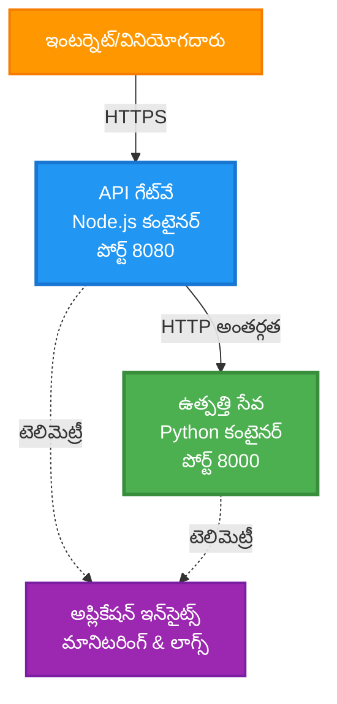
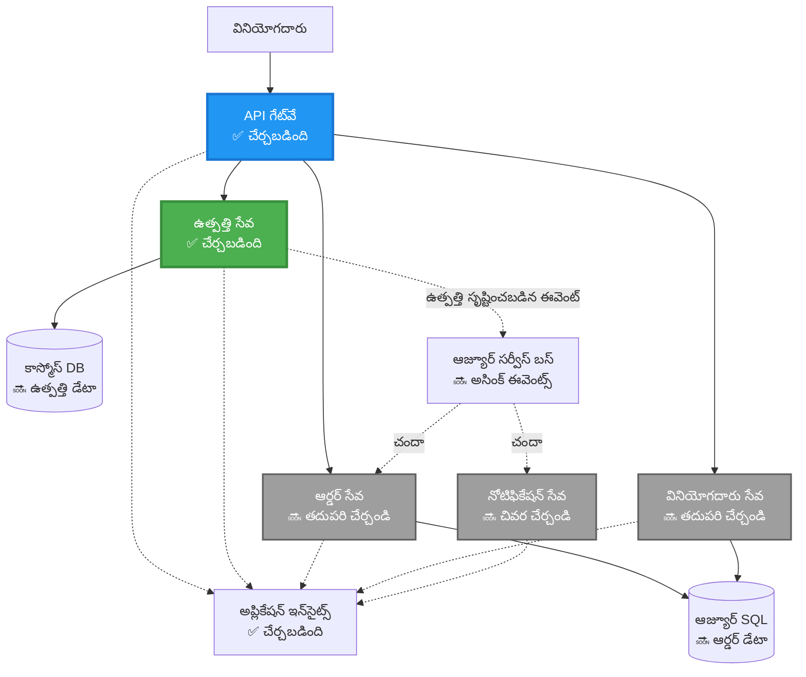
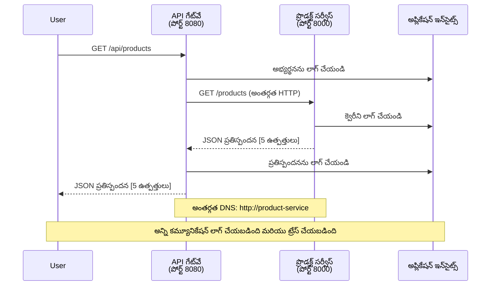

<!--
CO_OP_TRANSLATOR_METADATA:
{
  "original_hash": "eb3a4803a1e80a7f2e64f6bf63738c0f",
  "translation_date": "2025-11-25T07:20:32+00:00",
  "source_file": "examples/microservices/README.md",
  "language_code": "te"
}
-->
# మైక్రోసర్వీసెస్ ఆర్కిటెక్చర్ - కంటైనర్ యాప్ ఉదాహరణ

⏱️ **అంచనా సమయం**: 25-35 నిమిషాలు | 💰 **అంచనా ఖర్చు**: ~$50-100/నెల | ⭐ **సంక్లిష్టత**: అధునాతన

**📚 నేర్చుకునే మార్గం:**
- ← గతం: [సింపుల్ ఫ్లాస్క్ API](../../../../examples/container-app/simple-flask-api) - సింగిల్ కంటైనర్ ప్రాథమికాలు
- 🎯 **మీరు ఇక్కడ ఉన్నారు**: మైక్రోసర్వీసెస్ ఆర్కిటెక్చర్ (2-సర్వీస్ ఫౌండేషన్)
- → తదుపరి: [AI ఇంటిగ్రేషన్](../../../../docs/ai-foundry) - మీ సేవలకు ఇంటెలిజెన్స్ జోడించండి
- 🏠 [కోర్సు హోమ్](../../README.md)

---

AZD CLI ఉపయోగించి Azure Container Apps లో **సరళమైన కానీ ఫంక్షనల్** మైక్రోసర్వీసెస్ ఆర్కిటెక్చర్‌ను డిప్లాయ్ చేయడం. ఈ ఉదాహరణ సేవ-టు-సేవ కమ్యూనికేషన్, కంటైనర్ ఆర్కెస్ట్రేషన్, మరియు మానిటరింగ్‌ను ప్రాక్టికల్ 2-సర్వీస్ సెటప్‌తో ప్రదర్శిస్తుంది.

> **📚 నేర్చుకునే విధానం**: ఈ ఉదాహరణ కనీసం 2-సర్వీస్ ఆర్కిటెక్చర్ (API గేట్‌వే + బ్యాక్‌ఎండ్ సర్వీస్) తో ప్రారంభమవుతుంది, ఇది మీరు వాస్తవంగా డిప్లాయ్ చేసి నేర్చుకోవచ్చు. ఈ ఫౌండేషన్‌ను మాస్టర్ చేసిన తర్వాత, పూర్తి మైక్రోసర్వీసెస్ ఎకోసిస్టమ్‌కు విస్తరించడానికి మార్గదర్శకత్వం అందించబడుతుంది.

## మీరు ఏమి నేర్చుకుంటారు

ఈ ఉదాహరణను పూర్తి చేయడం ద్వారా, మీరు:
- Azure Container Apps కు బహుళ కంటైనర్లను డిప్లాయ్ చేయడం
- అంతర్గత నెట్‌వర్కింగ్‌తో సేవ-టు-సేవ కమ్యూనికేషన్ అమలు చేయడం
- పర్యావరణ ఆధారిత స్కేలింగ్ మరియు హెల్త్ చెక్స్ కాన్ఫిగర్ చేయడం
- Application Insights తో పంపిణీ చేసిన అప్లికేషన్లను మానిటర్ చేయడం
- మైక్రోసర్వీసెస్ డిప్లాయ్‌మెంట్ ప్యాటర్న్స్ మరియు ఉత్తమ పద్ధతులను అర్థం చేసుకోవడం
- సరళమైన నుండి సంక్లిష్టమైన ఆర్కిటెక్చర్స్ వరకు ప్రోగ్రెసివ్ విస్తరణ నేర్చుకోవడం

## ఆర్కిటెక్చర్

### దశ 1: మేము నిర్మిస్తున్నది (ఈ ఉదాహరణలో చేర్చబడింది)


**కాంపోనెంట్ వివరాలు:**

| కాంపోనెంట్ | ఉద్దేశం | యాక్సెస్ | వనరులు |
|-----------|---------|--------|-----------|
| **API గేట్‌వే** | బాహ్య అభ్యర్థనలను బ్యాక్‌ఎండ్ సేవలకు రూట్ చేస్తుంది | పబ్లిక్ (HTTPS) | 1 vCPU, 2GB RAM, 2-20 ప్రతులు |
| **ప్రొడక్ట్ సర్వీస్** | ఇన్-మెమరీ డేటాతో ప్రొడక్ట్ క్యాటలాగ్‌ను నిర్వహిస్తుంది | అంతర్గత మాత్రమే | 0.5 vCPU, 1GB RAM, 1-10 ప్రతులు |
| **అప్లికేషన్ ఇన్‌సైట్స్** | కేంద్రీకృత లాగింగ్ మరియు పంపిణీ చేసిన ట్రేసింగ్ | Azure పోర్టల్ | 1-2 GB/నెల డేటా ఇన్‌జెక్షన్ |

**ఎందుకు సరళంగా ప్రారంభించాలి?**
- ✅ త్వరగా డిప్లాయ్ చేసి అర్థం చేసుకోండి (25-35 నిమిషాలు)
- ✅ సంక్లిష్టత లేకుండా మైక్రోసర్వీసెస్ ప్యాటర్న్స్ నేర్చుకోండి
- ✅ పని చేసే కోడ్‌ను మీరు మార్చి ప్రయోగాలు చేయవచ్చు
- ✅ నేర్చుకోవడానికి తక్కువ ఖర్చు (~$50-100/నెల vs $300-1400/నెల)
- ✅ డేటాబేస్‌లు మరియు మెసేజ్ క్యూలను జోడించే ముందు నమ్మకాన్ని నిర్మించండి

**ఉపమానం**: ఇది డ్రైవింగ్ నేర్చుకోవడం లాంటిది. మీరు ఖాళీ పార్కింగ్ లాట్ (2 సేవలు) తో ప్రారంభించి, ప్రాథమికాలను మాస్టర్ చేసి, తర్వాత నగర ట్రాఫిక్ (5+ సేవలు డేటాబేస్‌లతో) కు పురోగమిస్తారు.

### దశ 2: భవిష్యత్ విస్తరణ (రెఫరెన్స్ ఆర్కిటెక్చర్)

మీరు 2-సర్వీస్ ఆర్కిటెక్చర్‌ను మాస్టర్ చేసిన తర్వాత, మీరు విస్తరించవచ్చు:


"విస్తరణ గైడ్" విభాగంలో దశల వారీగా సూచనలను చూడండి.

## చేర్చబడిన ఫీచర్లు

✅ **సర్వీస్ డిస్కవరీ**: కంటైనర్ల మధ్య ఆటోమేటిక్ DNS ఆధారిత డిస్కవరీ  
✅ **లోడ్ బ్యాలెన్సింగ్**: ప్రతుల మధ్య లోడ్ బ్యాలెన్సింగ్  
✅ **ఆటో-స్కేలింగ్**: HTTP అభ్యర్థనల ఆధారంగా సేవకు స్వతంత్ర స్కేలింగ్  
✅ **హెల్త్ మానిటరింగ్**: రెండు సేవల కోసం లైవ్‌నెస్ మరియు రెడీనెస్ ప్రోబ్స్  
✅ **డిస్ట్రిబ్యూటెడ్ లాగింగ్**: అప్లికేషన్ ఇన్‌సైట్స్‌తో కేంద్రీకృత లాగింగ్  
✅ **ఇంటర్నల్ నెట్‌వర్కింగ్**: సురక్షిత సేవ-టు-సేవ కమ్యూనికేషన్  
✅ **కంటైనర్ ఆర్కెస్ట్రేషన్**: ఆటోమేటిక్ డిప్లాయ్‌మెంట్ మరియు స్కేలింగ్  
✅ **జీరో-డౌన్‌టైమ్ అప్‌డేట్స్**: రివిజన్ మేనేజ్‌మెంట్‌తో రోలింగ్ అప్‌డేట్స్  

## అవసరమైనవి

### అవసరమైన టూల్స్

ప్రారంభించే ముందు, ఈ టూల్స్ ఇన్‌స్టాల్ చేయబడ్డాయని ధృవీకరించండి:

1. **[Azure Developer CLI (azd)](https://learn.microsoft.com/azure/developer/azure-developer-cli/install-azd)** (వెర్షన్ 1.0.0 లేదా ఎక్కువ)
   ```bash
   azd version
   # ఆశించిన అవుట్‌పుట్: azd వెర్షన్ 1.0.0 లేదా ఎక్కువ
   ```

2. **[Azure CLI](https://learn.microsoft.com/cli/azure/install-azure-cli)** (వెర్షన్ 2.50.0 లేదా ఎక్కువ)
   ```bash
   az --version
   # ఆశించిన అవుట్‌పుట్: azure-cli 2.50.0 లేదా ఎక్కువ
   ```

3. **[Docker](https://www.docker.com/get-started)** (లోకల్ డెవలప్‌మెంట్/టెస్టింగ్ కోసం - ఐచ్ఛికం)
   ```bash
   docker --version
   # ఆశించిన అవుట్‌పుట్: డాకర్ వెర్షన్ 20.10 లేదా ఎక్కువ
   ```

### మీ సెటప్‌ను ధృవీకరించండి

ఈ కమాండ్లను రన్ చేసి మీరు సిద్ధంగా ఉన్నారని ధృవీకరించండి:

```bash
# Azure Developer CLI తనిఖీ చేయండి
azd version
# ✅ ఆశించినది: azd వెర్షన్ 1.0.0 లేదా అంతకంటే ఎక్కువ

# Azure CLI తనిఖీ చేయండి
az --version
# ✅ ఆశించినది: azure-cli 2.50.0 లేదా అంతకంటే ఎక్కువ

# Docker తనిఖీ చేయండి (ఐచ్ఛికం)
docker --version
# ✅ ఆశించినది: Docker వెర్షన్ 20.10 లేదా అంతకంటే ఎక్కువ
```

**సక్సెస్ క్రైటీరియా**: అన్ని కమాండ్లు కనీసం లేదా ఎక్కువ వెర్షన్ నంబర్లను రిటర్న్ చేస్తాయి.

### Azure అవసరాలు

- చెల్లుబాటు అయ్యే **Azure సబ్‌స్క్రిప్షన్** ([ఉచిత ఖాతాను సృష్టించండి](https://azure.microsoft.com/free/))
- మీ సబ్‌స్క్రిప్షన్‌లో వనరులను సృష్టించడానికి అనుమతులు
- సబ్‌స్క్రిప్షన్ లేదా రిసోర్స్ గ్రూప్‌పై **కాంట్రిబ్యూటర్** పాత్ర

### జ్ఞాన అవసరాలు

ఇది **అధునాతన స్థాయి** ఉదాహరణ. మీకు ఉండాలి:
- [సింపుల్ ఫ్లాస్క్ API ఉదాహరణ](../../../../examples/container-app/simple-flask-api) పూర్తి చేయబడింది
- మైక్రోసర్వీసెస్ ఆర్కిటెక్చర్ యొక్క ప్రాథమిక అవగాహన
- REST APIs మరియు HTTP పరిచయం
- కంటైనర్ కాన్సెప్ట్‌ల అవగాహన

**కంటైనర్ యాప్స్ కొత్తవారా?** ప్రాథమికాలను నేర్చుకోవడానికి మొదట [సింపుల్ ఫ్లాస్క్ API ఉదాహరణ](../../../../examples/container-app/simple-flask-api) తో ప్రారంభించండి.

## త్వరిత ప్రారంభం (దశల వారీగా)

### దశ 1: క్లోన్ చేసి నావిగేట్ చేయండి

```bash
git clone https://github.com/microsoft/AZD-for-beginners.git
cd AZD-for-beginners/examples/microservices
```

**✓ సక్సెస్ చెక్**: మీరు `azure.yaml` ను చూస్తున్నారని ధృవీకరించండి:
```bash
ls
# ఆశించబడింది: README.md, azure.yaml, infra/, src/
```

### దశ 2: Azure తో ఆథెంటికేట్ చేయండి

```bash
azd auth login
```

ఇది Azure ఆథెంటికేషన్ కోసం మీ బ్రౌజర్‌ను తెరుస్తుంది. మీ Azure క్రెడెన్షియల్స్‌తో సైన్ ఇన్ చేయండి.

**✓ సక్సెస్ చెక్**: మీరు చూడాలి:
```
Logged in to Azure.
```

### దశ 3: పర్యావరణాన్ని ప్రారంభించండి

```bash
azd init
```

**మీరు చూడగలిగే ప్రాంప్ట్‌లు**:
- **పర్యావరణ పేరు**: చిన్న పేరు నమోదు చేయండి (ఉదా., `microservices-dev`)
- **Azure సబ్‌స్క్రిప్షన్**: మీ సబ్‌స్క్రిప్షన్‌ను ఎంచుకోండి
- **Azure లొకేషన్**: ఒక ప్రాంతాన్ని ఎంచుకోండి (ఉదా., `eastus`, `westeurope`)

**✓ సక్సెస్ చెక్**: మీరు చూడాలి:
```
SUCCESS: New project initialized!
```

### దశ 4: ఇన్‌ఫ్రాస్ట్రక్చర్ మరియు సేవలను డిప్లాయ్ చేయండి

```bash
azd up
```

**ఏం జరుగుతుంది** (8-12 నిమిషాలు పడుతుంది):

```mermaid
graph LR
    A[azd up] --> B[రిసోర్స్ గ్రూప్ సృష్టించండి]
    B --> C[కంటైనర్ రిజిస్ట్రీని డిప్లాయ్ చేయండి]
    C --> D[లాగ్ అనలిటిక్స్‌ను డిప్లాయ్ చేయండి]
    D --> E[యాప్ ఇన్‌సైట్స్‌ను డిప్లాయ్ చేయండి]
    E --> F[కంటైనర్ ఎన్విరాన్‌మెంట్ సృష్టించండి]
    F --> G[API గేట్‌వే ఇమేజ్‌ను బిల్డ్ చేయండి]
    F --> H[ప్రొడక్ట్ సర్వీస్ ఇమేజ్‌ను బిల్డ్ చేయండి]
    G --> I[రిజిస్ట్రీకి పుష్ చేయండి]
    H --> I
    I --> J[API గేట్‌వేను డిప్లాయ్ చేయండి]
    I --> K[ప్రొడక్ట్ సర్వీస్‌ను డిప్లాయ్ చేయండి]
    J --> L[ఇన్‌గ్రెస్ & హెల్త్ చెక్స్‌ను కాన్ఫిగర్ చేయండి]
    K --> L
    L --> M[డిప్లాయ్‌మెంట్ పూర్తయింది ✓]
    
    style A fill:#2196F3,stroke:#1976D2,stroke-width:3px,color:#fff
    style M fill:#4CAF50,stroke:#388E3C,stroke-width:3px,color:#fff
```


**✓ సక్సెస్ చెక్**: మీరు చూడాలి:
```
SUCCESS: Your application was deployed to Azure in X minutes Y seconds.
Endpoint: https://api-gateway-<unique-id>.azurecontainerapps.io
```

**⏱️ సమయం**: 8-12 నిమిషాలు

### దశ 5: డిప్లాయ్‌మెంట్‌ను పరీక్షించండి

```bash
# గేట్వే ఎండ్‌పాయింట్ పొందండి
GATEWAY_URL=$(azd env get-values | grep API_GATEWAY_URL | cut -d '=' -f2 | tr -d '"')

# API గేట్వే ఆరోగ్యాన్ని పరీక్షించండి
curl $GATEWAY_URL/health
```

**✅ ఆశించిన అవుట్‌పుట్**:
```json
{
  "status": "healthy",
  "service": "api-gateway",
  "timestamp": "2025-11-19T10:30:00Z"
}
```

**గేట్‌వే ద్వారా ప్రొడక్ట్ సేవను పరీక్షించండి**:
```bash
# ఉత్పత్తులను జాబితా చేయండి
curl $GATEWAY_URL/api/products
```

**✅ ఆశించిన అవుట్‌పుట్**:
```json
[
  {"id":1,"name":"Laptop","price":999.99,"stock":50},
  {"id":2,"name":"Mouse","price":29.99,"stock":200},
  {"id":3,"name":"Keyboard","price":79.99,"stock":150}
]
```

**✓ సక్సెస్ చెక్**: రెండు ఎండ్‌పాయింట్లు JSON డేటాను ఎర్రర్‌ల లేకుండా రిటర్న్ చేస్తాయి.

---

**🎉 అభినందనలు!** మీరు Azure లో మైక్రోసర్వీసెస్ ఆర్కిటెక్చర్‌ను డిప్లాయ్ చేశారు!

## ప్రాజెక్ట్ నిర్మాణం

అన్ని అమలు ఫైళ్లు చేర్చబడ్డాయి—ఇది పూర్తి, పని చేసే ఉదాహరణ:

```
microservices/
│
├── README.md                         # This file
├── azure.yaml                        # AZD configuration
├── .gitignore                        # Git ignore patterns
│
├── infra/                           # Infrastructure as Code (Bicep)
│   ├── main.bicep                   # Main orchestration
│   ├── abbreviations.json           # Naming conventions
│   ├── core/                        # Shared infrastructure
│   │   ├── container-apps-environment.bicep  # Container environment + registry
│   │   └── monitor.bicep            # Application Insights + Log Analytics
│   └── app/                         # Service definitions
│       ├── api-gateway.bicep        # API Gateway container app
│       └── product-service.bicep    # Product Service container app
│
└── src/                             # Application source code
    ├── api-gateway/                 # Node.js API Gateway
    │   ├── app.js                   # Express server with routing
    │   ├── package.json             # Node dependencies
    │   └── Dockerfile               # Container definition
    └── product-service/             # Python Product Service
        ├── main.py                  # Flask API with product data
        ├── requirements.txt         # Python dependencies
        └── Dockerfile               # Container definition
```

**ప్రతి కాంపోనెంట్ ఏమి చేస్తుంది:**

**ఇన్‌ఫ్రాస్ట్రక్చర్ (infra/)**:
- `main.bicep`: అన్ని Azure వనరులు మరియు వాటి ఆధారాలను ఆర్కెస్ట్రేట్ చేస్తుంది
- `core/container-apps-environment.bicep`: కంటైనర్ యాప్స్ పర్యావరణం మరియు Azure కంటైనర్ రిజిస్ట్రీని సృష్టిస్తుంది
- `core/monitor.bicep`: పంపిణీ చేసిన లాగింగ్ కోసం అప్లికేషన్ ఇన్‌సైట్స్‌ను సెటప్ చేస్తుంది
- `app/*.bicep`: స్కేలింగ్ మరియు హెల్త్ చెక్స్‌తో వ్యక్తిగత కంటైనర్ యాప్ నిర్వచనాలు

**API గేట్‌వే (src/api-gateway/)**:
- బ్యాక్‌ఎండ్ సేవలకు అభ్యర్థనలను రూట్ చేసే పబ్లిక్-ఫేసింగ్ సేవ
- లాగింగ్, ఎర్రర్ హ్యాండ్లింగ్, మరియు అభ్యర్థన ఫార్వార్డింగ్‌ను అమలు చేస్తుంది
- సేవ-టు-సేవ HTTP కమ్యూనికేషన్‌ను ప్రదర్శిస్తుంది

**ప్రొడక్ట్ సర్వీస్ (src/product-service/)**:
- ప్రొడక్ట్ క్యాటలాగ్‌తో అంతర్గత సేవ (సరళత కోసం ఇన్-మెమరీ)
- REST API తో హెల్త్ చెక్స్
- బ్యాక్‌ఎండ్ మైక్రోసర్వీస్ ప్యాటర్న్ ఉదాహరణ

## సేవల అవగాహన

### API గేట్‌వే (Node.js/Express)

**పోర్ట్**: 8080  
**యాక్సెస్**: పబ్లిక్ (బాహ్య ఇన్‌గ్రెస్)  
**ఉద్దేశం**: వచ్చే అభ్యర్థనలను తగిన బ్యాక్‌ఎండ్ సేవలకు రూట్ చేస్తుంది  

**ఎండ్‌పాయింట్లు**:
- `GET /` - సేవ సమాచారం
- `GET /health` - హెల్త్ చెక్ ఎండ్‌పాయింట్
- `GET /api/products` - ప్రొడక్ట్ సేవకు ఫార్వార్డ్ చేయండి (అన్ని జాబితా చేయండి)
- `GET /api/products/:id` - ప్రొడక్ట్ సేవకు ఫార్వార్డ్ చేయండి (ID ద్వారా పొందండి)

**ముఖ్య ఫీచర్లు**:
- axios తో అభ్యర్థన రూటింగ్
- కేంద్రీకృత లాగింగ్
- ఎర్రర్ హ్యాండ్లింగ్ మరియు టైమ్‌ఔట్ మేనేజ్‌మెంట్
- పర్యావరణ వేరియబుల్స్ ద్వారా సేవ డిస్కవరీ
- అప్లికేషన్ ఇన్‌సైట్స్ ఇంటిగ్రేషన్

**కోడ్ హైలైట్** (`src/api-gateway/app.js`):
```javascript
// అంతర్గత సేవల కమ్యూనికేషన్
app.get('/api/products', async (req, res) => {
  const response = await axios.get(`${PRODUCT_SERVICE_URL}/products`, {
    timeout: 5000
  });
  res.json(response.data);
});
```

### ప్రొడక్ట్ సర్వీస్ (Python/Flask)

**పోర్ట్**: 8000  
**యాక్సెస్**: అంతర్గత మాత్రమే (బాహ్య ఇన్‌గ్రెస్ లేదు)  
**ఉద్దేశం**: ఇన్-మెమరీ డేటాతో ప్రొడక్ట్ క్యాటలాగ్‌ను నిర్వహిస్తుంది  

**ఎండ్‌పాయింట్లు**:
- `GET /` - సేవ సమాచారం
- `GET /health` - హెల్త్ చెక్ ఎండ్‌పాయింట్
- `GET /products` - అన్ని ప్రొడక్ట్‌లను జాబితా చేయండి
- `GET /products/<id>` - ID ద్వారా ప్రొడక్ట్ పొందండి

**ముఖ్య ఫీచర్లు**:
- Flask తో RESTful API
- సరళమైన, డేటాబేస్ అవసరం లేని ఇన్-మెమరీ ప్రొడక్ట్ స్టోర్
- ప్రోబ్స్‌తో హెల్త్ మానిటరింగ్
- నిర్మిత లాగింగ్
- అప్లికేషన్ ఇన్‌సైట్స్ ఇంటిగ్రేషన్

**డేటా మోడల్**:
```python
{
  "id": 1,
  "name": "Laptop",
  "description": "High-performance laptop",
  "price": 999.99,
  "stock": 50
}
```

**ఎందుకు అంతర్గత మాత్రమే?**
ప్రొడక్ట్ సర్వీస్ బహిరంగంగా ఎక్స్‌పోజ్ చేయబడదు. అన్ని అభ్యర్థనలు API గేట్‌వే ద్వారా వెళ్లాలి, ఇది అందిస్తుంది:
- భద్రత: నియంత్రిత యాక్సెస్ పాయింట్
- అనువర్తనం: క్లయింట్లను ప్రభావితం చేయకుండా బ్యాక్‌ఎండ్‌ను మార్చవచ్చు
- మానిటరింగ్: కేంద్రీకృత అభ్యర్థన లాగింగ్

## సేవ కమ్యూనికేషన్‌ను అర్థం చేసుకోవడం

### సేవలు ఒకదానితో ఒకటి ఎలా మాట్లాడతాయి


ఈ ఉదాహరణలో, API గేట్‌వే **అంతర్గత HTTP కాల్స్** ఉపయోగించి ప్రొడక్ట్ సర్వీస్‌తో కమ్యూనికేట్ చేస్తుంది:

```javascript
// API గేట్‌వే (src/api-gateway/app.js)
const PRODUCT_SERVICE_URL = process.env.PRODUCT_SERVICE_URL;

// అంతర్గత HTTP అభ్యర్థన చేయండి
const response = await axios.get(`${PRODUCT_SERVICE_URL}/products`);
```

**ముఖ్య పాయింట్లు**:

1. **DNS-ఆధారిత డిస్కవరీ**: కంటైనర్ యాప్స్ అంతర్గత సేవల కోసం ఆటోమేటిక్ DNS అందిస్తుంది
   - ప్రొడక్ట్ సర్వీస్ FQDN: `product-service.internal.<environment>.azurecontainerapps.io`
   - సరళతగా: `http://product-service` (కంటైనర్ యాప్స్ దీన్ని రిజాల్వ్ చేస్తుంది)

2. **బహిరంగ ఎక్స్‌పోజర్ లేదు**: ప్రొడక్ట్ సర్వీస్‌లో `external: false` ఉంది Bicep లో
   - కంటైనర్ యాప్స్ పర్యావరణంలో మాత్రమే యాక్సెసిబుల్
   - ఇంటర్నెట్ నుండి చేరుకోలేరు

3. **పర్యావరణ వేరియబుల్స్**: సేవ URLs డిప్లాయ్‌మెంట్ సమయంలో ఇంజెక్ట్ చేయబడతాయి
   - Bicep అంతర్గత FQDN ను గేట్‌వేకు పంపుతుంది
   - అప్లికేషన్ కోడ్‌లో హార్డ్‌కోడ్ చేసిన URLs లేవు

**ఉపమానం**: ఇది ఆఫీస్ రూమ్‌ల వంటిది. API గేట్‌వే రిసెప్షన్ డెస్క్ (పబ్లిక్-ఫేసింగ్), మరియు ప్రొడక్ట్ సర్వీస్ ఒక ఆఫీస్ రూమ్ (అంతర్గత మాత్రమే). సందర్శకులు ఏ ఆఫీస్‌ను చేరుకోవాలంటే రిసెప్షన్ ద్వారా వెళ్లాలి.

## డిప్లాయ్‌మెంట్ ఆప్షన్లు

### పూర్తి డిప్లాయ్‌మెంట్ (సిఫార్సు చేయబడింది)

```bash
# మౌలిక సదుపాయాలను మరియు రెండు సేవలను అమలు చేయండి
azd up
```

ఇది డిప్లాయ్ చేస్తుంది:
1. కంటైనర్ యాప్స్ పర్యావరణం
2. అప్లికేషన్ ఇన్‌సైట్స్
3. కంటైనర్ రిజిస్ట్రీ
4. API గేట్‌వే కంటైనర్
5. ప్రొడక్ట్ సర్వీస్ కంటైనర్

**సమయం
3. రెండు సేవలను మళ్లీ అమలు చేయండి:

```bash
azd deploy product-service
azd deploy api-gateway
```

4. కొత్త ఎండ్‌పాయింట్‌ను పరీక్షించండి:

```bash
GATEWAY_URL=$(azd env get-values | grep API_GATEWAY_URL | cut -d '=' -f2 | tr -d '"')

# కొత్త ఉత్పత్తిని సృష్టించండి
curl -X POST $GATEWAY_URL/api/products \
  -H "Content-Type: application/json" \
  -d '{"name":"USB Cable","price":9.99,"stock":500}'
```

**✅ ఆశించిన అవుట్‌పుట్:**
```json
{"id":6,"name":"USB Cable","description":"","price":9.99,"stock":500}
```

5. ఇది జాబితాలో కనిపిస్తుందో ధృవీకరించండి:

```bash
curl $GATEWAY_URL/api/products
# ఇప్పుడు కొత్త USB కేబుల్ సహా 6 ఉత్పత్తులను చూపించాలి
```

**విజయం ప్రమాణాలు**:
- ✅ POST అభ్యర్థన HTTP 201 ను తిరిగి ఇస్తుంది
- ✅ కొత్త ఉత్పత్తి GET /api/products జాబితాలో కనిపిస్తుంది
- ✅ ఉత్పత్తికి ఆటో-ఇన్‌క్రిమెంట్ చేసిన ID ఉంటుంది

**సమయం**: 10-15 నిమిషాలు

---

### వ్యాయామం 2: ఆటోస్కేలింగ్ రూల్స్‌ను మార్చండి ⭐⭐ (మధ్యస్థం)

**లక్ష్యం**: ప్రొడక్ట్ సర్వీస్‌ను మరింత దూకుడుగా స్కేల్ చేయండి

**ప్రారంభ స్థానం**: `infra/app/product-service.bicep`

**దశలు**:

1. `infra/app/product-service.bicep` ను తెరవండి మరియు `scale` బ్లాక్‌ను కనుగొనండి (సుమారు 95వ లైన్)

2. ఈ క్రింది నుండి మార్చండి:
```bicep
scale: {
  minReplicas: 1
  maxReplicas: 10
  rules: [
    {
      name: 'http-scale-rule'
      http: {
        metadata: {
          concurrentRequests: '100'  // OLD
        }
      }
    }
  ]
}
```

ఈ క్రింద:
```bicep
scale: {
  minReplicas: 2  // Always have 2 running
  maxReplicas: 20  // Allow more scaling
  rules: [
    {
      name: 'http-scale-rule'
      http: {
        metadata: {
          concurrentRequests: '20'  // Scale at lower threshold
        }
      }
    }
  ]
}
```

3. మౌలిక సదుపాయాన్ని మళ్లీ అమలు చేయండి:

```bash
azd up
```

4. కొత్త స్కేలింగ్ కాన్ఫిగరేషన్‌ను ధృవీకరించండి:

```bash
az containerapp show \
  --name $(azd env get-values | grep PRODUCT_SERVICE | head -1 | cut -d '/' -f5) \
  --resource-group $(azd env get-values | grep AZURE_RESOURCE_GROUP | cut -d '=' -f2 | tr -d '"') \
  --query "properties.template.scale" -o json
```

**✅ ఆశించిన అవుట్‌పుట్:**
```json
{
  "minReplicas": 2,
  "maxReplicas": 20,
  "rules": [...]
}
```

5. లోడ్‌తో ఆటోస్కేలింగ్‌ను పరీక్షించండి:

```bash
# సమకాలిక అభ్యర్థనలను ఉత్పత్తి చేయండి
for i in {1..500}; do curl $GATEWAY_URL/api/products & done

# స్కేలింగ్ జరుగుతున్నదాన్ని గమనించండి
azd logs product-service --follow
# చూడండి: కంటైనర్ యాప్స్ స్కేలింగ్ ఈవెంట్స్
```

**విజయం ప్రమాణాలు**:
- ✅ ప్రొడక్ట్ సర్వీస్ కనీసం 2 ప్రతులను ఎల్లప్పుడూ అమలు చేస్తుంది
- ✅ లోడ్ సమయంలో, 2 ప్రతుల కంటే ఎక్కువకు స్కేల్ అవుతుంది
- ✅ Azure Portal కొత్త స్కేలింగ్ రూల్స్‌ను చూపిస్తుంది

**సమయం**: 15-20 నిమిషాలు

---

### వ్యాయామం 3: కస్టమ్ మానిటరింగ్ క్వెరీని జోడించండి ⭐⭐ (మధ్యస్థం)

**లక్ష్యం**: ప్రొడక్ట్ API పనితీరును ట్రాక్ చేయడానికి కస్టమ్ Application Insights క్వెరీని సృష్టించండి

**దశలు**:

1. Azure Portalలో Application Insightsకి వెళ్లండి:
   - Azure Portalకి వెళ్లండి
   - మీ రిసోర్స్ గ్రూప్ (rg-microservices-*) ను కనుగొనండి
   - Application Insights రిసోర్స్‌పై క్లిక్ చేయండి

2. ఎడమ మెనులో "Logs" పై క్లిక్ చేయండి

3. ఈ క్వెరీని సృష్టించండి:

```kusto
requests
| where timestamp > ago(1h)
| where name contains "products"
| summarize 
    RequestCount = count(),
    AvgDuration = avg(duration),
    P95Duration = percentile(duration, 95),
    SuccessRate = 100.0 * countif(success == true) / count()
  by bin(timestamp, 5m)
| render timechart
```

4. క్వెరీని అమలు చేయడానికి "Run" పై క్లిక్ చేయండి

5. క్వెరీని సేవ్ చేయండి:
   - "Save" పై క్లిక్ చేయండి
   - పేరు: "Product API Performance"
   - వర్గం: "Performance"

6. పరీక్ష ట్రాఫిక్‌ను సృష్టించండి:

```bash
for i in {1..100}; do curl $GATEWAY_URL/api/products; sleep 1; done
```

7. డేటాను చూడటానికి క్వెరీని రిఫ్రెష్ చేయండి

**✅ ఆశించిన అవుట్‌పుట్:**
- సమయం గడిచేకొద్దీ అభ్యర్థనల సంఖ్యను చూపించే చార్ట్
- సగటు వ్యవధి < 500ms
- విజయ రేటు = 100%
- 5 నిమిషాల సమయ బిన్స్

**విజయం ప్రమాణాలు**:
- ✅ క్వెరీ 100+ అభ్యర్థనలను చూపిస్తుంది
- ✅ విజయ రేటు 100%
- ✅ సగటు వ్యవధి < 500ms
- ✅ చార్ట్ 5-నిమిషాల సమయ బిన్స్‌ను ప్రదర్శిస్తుంది

**చదువు ఫలితం**: కస్టమ్ క్వెరీలతో సేవ పనితీరును ఎలా మానిటర్ చేయాలో అర్థం చేసుకోండి

**సమయం**: 10-15 నిమిషాలు

---

### వ్యాయామం 4: రీట్రై లాజిక్‌ను అమలు చేయండి ⭐⭐⭐ (అధునాతన)

**లక్ష్యం**: ప్రొడక్ట్ సర్వీస్ తాత్కాలికంగా అందుబాటులో లేకపోతే API గేట్‌వేలో రీట్రై లాజిక్‌ను జోడించండి

**ప్రారంభ స్థానం**: `src/api-gateway/app.js`

**దశలు**:

1. రీట్రై లైబ్రరీని ఇన్‌స్టాల్ చేయండి:

```bash
cd src/api-gateway
npm install axios-retry --save
cd ../..
```

2. `src/api-gateway/app.js` ను అప్‌డేట్ చేయండి (axios ఇంపోర్ట్ తర్వాత జోడించండి):

```javascript
const axiosRetry = require('axios-retry');

// పునఃప్రయత్న లాజిక్‌ను ఆకృతీకరించండి
axiosRetry(axios, {
  retries: 3,
  retryDelay: (retryCount) => {
    return retryCount * 1000; // 1సె, 2సె, 3సె
  },
  retryCondition: (error) => {
    // నెట్‌వర్క్ లోపాలు లేదా 5xx ప్రతిస్పందనలపై పునఃప్రయత్నం
    return axiosRetry.isNetworkOrIdempotentRequestError(error) ||
           (error.response && error.response.status >= 500);
  }
});

console.log('Retry logic configured: 3 retries with exponential backoff');
```

3. API గేట్‌వేను మళ్లీ అమలు చేయండి:

```bash
azd deploy api-gateway
```

4. సేవ వైఫల్యాన్ని అనుకరించడం ద్వారా రీట్రై ప్రవర్తనను పరీక్షించండి:

```bash
# ఉత్పత్తి సేవను 0కి స్కేల్ చేయండి (విఫలమవడం అనుకరించండి)
az containerapp update \
  --name $(azd env get-values | grep PRODUCT_SERVICE | head -1 | cut -d '/' -f5) \
  --resource-group $(azd env get-values | grep AZURE_RESOURCE_GROUP | cut -d '=' -f2 | tr -d '"') \
  --min-replicas 0 \
  --max-replicas 0

# ఉత్పత్తులను యాక్సెస్ చేయడానికి ప్రయత్నించండి (3 సార్లు ప్రయత్నిస్తుంది)
time curl -v $GATEWAY_URL/api/products
# గమనించండి: ప్రతిస్పందన ~6 సెకన్లు పడుతుంది (1స + 2స + 3స ప్రయత్నాలు)

# ఉత్పత్తి సేవను పునరుద్ధరించండి
az containerapp update \
  --name $(azd env get-values | grep PRODUCT_SERVICE | head -1 | cut -d '/' -f5) \
  --resource-group $(azd env get-values | grep AZURE_RESOURCE_GROUP | cut -d '=' -f2 | tr -d '"') \
  --min-replicas 1 \
  --max-replicas 10
```

5. రీట్రై లాగ్‌లను చూడండి:

```bash
azd logs api-gateway --tail 50
# రీట్రై ప్రయత్న సందేశాలను చూడండి
```

**✅ ఆశించిన ప్రవర్తన:**
- అభ్యర్థనలు విఫలమయ్యే ముందు 3 సార్లు రీట్రై చేస్తాయి
- ప్రతి రీట్రై ఎక్కువ సమయం వేచి ఉంటుంది (1s, 2s, 3s)
- సేవ పునఃప్రారంభం తర్వాత విజయవంతమైన అభ్యర్థనలు
- లాగ్‌లు రీట్రై ప్రయత్నాలను చూపిస్తాయి

**విజయం ప్రమాణాలు**:
- ✅ అభ్యర్థనలు విఫలమయ్యే ముందు 3 సార్లు రీట్రై చేస్తాయి
- ✅ ప్రతి రీట్రై ఎక్కువ సమయం వేచి ఉంటుంది (ఎక్స్‌పోనెన్షియల్ బ్యాకాఫ్)
- ✅ సేవ పునఃప్రారంభం తర్వాత విజయవంతమైన అభ్యర్థనలు
- ✅ లాగ్‌లు రీట్రై ప్రయత్నాలను చూపిస్తాయి

**చదువు ఫలితం**: మైక్రోసర్వీసులలో రిజిలియన్స్ ప్యాటర్న్‌లను అర్థం చేసుకోండి (సర్క్యూట్ బ్రేకర్లు, రీట్రైలు, టైమౌట్లు)

**సమయం**: 20-25 నిమిషాలు

---

## జ్ఞాన పరీక్ష

ఈ ఉదాహరణను పూర్తి చేసిన తర్వాత, మీ అర్థాన్ని ధృవీకరించండి:

### 1. సేవ కమ్యూనికేషన్ ✓

మీ జ్ఞానాన్ని పరీక్షించండి:
- [ ] API గేట్‌వే ప్రొడక్ట్ సర్వీస్‌ను ఎలా కనుగొంటుందో మీరు వివరించగలరా? (DNS ఆధారిత సేవ డిస్కవరీ)
- [ ] ప్రొడక్ట్ సర్వీస్ డౌన్ అయితే ఏమి జరుగుతుంది? (గేట్‌వే 503 ఎర్రర్‌ను తిరిగి ఇస్తుంది)
- [ ] మీరు మూడవ సేవను ఎలా జోడిస్తారు? (కొత్త Bicep ఫైల్ సృష్టించండి, main.bicepకు జోడించండి, src ఫోల్డర్ సృష్టించండి)

**హ్యాండ్స్-ఆన్ ధృవీకరణ**:
```bash
# సేవా వైఫల్యాన్ని అనుకరించండి
az containerapp update --name <product-service-name> --min-replicas 0 --max-replicas 0
curl $GATEWAY_URL/api/products
# ✅ ఆశించినది: 503 సేవ అందుబాటులో లేదు

# సేవను పునరుద్ధరించండి
az containerapp update --name <product-service-name> --min-replicas 1 --max-replicas 10
```

### 2. మానిటరింగ్ & ఆబ్జర్వబిలిటీ ✓

మీ జ్ఞానాన్ని పరీక్షించండి:
- [ ] పంపిణీ లాగ్‌లను మీరు ఎక్కడ చూస్తారు? (Azure Portalలో Application Insights)
- [ ] నెమ్మదిగా ఉన్న అభ్యర్థనలను మీరు ఎలా ట్రాక్ చేస్తారు? (Kusto క్వెరీ: `requests | where duration > 1000`)
- [ ] ఎర్రర్‌ను ఏ సేవ కారణం చేసిందో మీరు గుర్తించగలరా? (లాగ్‌లలో `cloud_RoleName` ఫీల్డ్‌ను తనిఖీ చేయండి)

**హ్యాండ్స్-ఆన్ ధృవీకరణ**:
```bash
# నెమ్మదిగా అభ్యర్థన సిమ్యులేషన్ రూపొందించండి
curl "$GATEWAY_URL/api/products?delay=2000"

# నెమ్మదిగా అభ్యర్థనల కోసం అప్లికేషన్ ఇన్‌సైట్స్‌ను ప్రశ్నించండి
# Azure పోర్టల్ → అప్లికేషన్ ఇన్‌సైట్స్ → లాగ్స్‌కు వెళ్లండి
# అమలు చేయండి: requests | where duration > 1000 | project timestamp, name, duration, cloud_RoleName
```

### 3. స్కేలింగ్ & పనితీరు ✓

మీ జ్ఞానాన్ని పరీక్షించండి:
- [ ] ఆటోస్కేలింగ్‌ను ఏమి ట్రిగర్ చేస్తుంది? (HTTP కన్‌కరెంట్ రిక్వెస్ట్ రూల్స్: గేట్‌వేకు 50, ప్రొడక్ట్‌కు 100)
- [ ] ఇప్పుడు ఎన్ని ప్రతులు అమలులో ఉన్నాయి? (`az containerapp revision list` తో తనిఖీ చేయండి)
- [ ] ప్రొడక్ట్ సర్వీస్‌ను 5 ప్రతులకు స్కేల్ చేయడానికి మీరు ఏమి చేస్తారు? (Bicepలో minReplicasను అప్‌డేట్ చేయండి)

**హ్యాండ్స్-ఆన్ ధృవీకరణ**:
```bash
# ఆటోస్కేలింగ్ పరీక్షించడానికి లోడ్ ఉత్పత్తి చేయండి
for i in {1..1000}; do curl $GATEWAY_URL/api/products & done

# ప్రతిరూపాలు పెరుగుతున్నాయి చూడండి
azd logs api-gateway --follow
# ✅ ఆశించినది: లాగ్‌లలో స్కేలింగ్ ఈవెంట్స్ చూడండి
```

**విజయం ప్రమాణాలు**: మీరు అన్ని ప్రశ్నలకు సమాధానం చెప్పగలరు మరియు హ్యాండ్స్-ఆన్ కమాండ్లతో ధృవీకరించగలరు.

---

## ఖర్చు విశ్లేషణ

### అంచనా నెలవారీ ఖర్చులు (ఈ 2-సర్వీస్ ఉదాహరణకు)

| వనరు | కాన్ఫిగరేషన్ | అంచనా ఖర్చు |
|----------|--------------|----------------|
| API గేట్‌వే | 2-20 ప్రతులు, 1 vCPU, 2GB RAM | $30-150 |
| ప్రొడక్ట్ సర్వీస్ | 1-10 ప్రతులు, 0.5 vCPU, 1GB RAM | $15-75 |
| కంటైనర్ రిజిస్ట్రీ | బేసిక్ టియర్ | $5 |
| Application Insights | 1-2 GB/నెల | $5-10 |
| లాగ్ అనలిటిక్స్ | 1 GB/నెల | $3 |
| **మొత్తం** | | **$58-243/నెల** |

### వినియోగం ద్వారా ఖర్చు విభజన

**తేలికపాటి ట్రాఫిక్** (పరీక్ష/చదువు): ~$60/నెల
- API గేట్‌వే: 2 ప్రతులు × 24/7 = $30
- ప్రొడక్ట్ సర్వీస్: 1 ప్రతులు × 24/7 = $15
- మానిటరింగ్ + రిజిస్ట్రీ = $13

**మోస్తరు ట్రాఫిక్** (చిన్న ప్రొడక్షన్): ~$120/నెల
- API గేట్‌వే: 5 సగటు ప్రతులు = $75
- ప్రొడక్ట్ సర్వీస్: 3 సగటు ప్రతులు = $45
- మానిటరింగ్ + రిజిస్ట్రీ = $13

**అధిక ట్రాఫిక్** (బిజీ పీరియడ్స్): ~$240/నెల
- API గేట్‌వే: 15 సగటు ప్రతులు = $225
- ప్రొడక్ట్ సర్వీస్: 8 సగటు ప్రతులు = $120
- మానిటరింగ్ + రిజిస్ట్రీ = $13

### ఖర్చు ఆప్టిమైజేషన్ చిట్కాలు

1. **డెవలప్‌మెంట్ కోసం జీరోకు స్కేల్ చేయండి**:
   ```bicep
   scale: {
     minReplicas: 0  // Save $30-40/month when not in use
     maxReplicas: 10
   }
   ```

2. **Cosmos DB కోసం వినియోగ ప్లాన్ ఉపయోగించండి** (మీరు దీనిని జోడించినప్పుడు):
   - మీరు ఉపయోగించినదానికి మాత్రమే చెల్లించండి
   - కనీస ఛార్జ్ లేదు

3. **Application Insights శాంప్లింగ్ సెట్ చేయండి**:
   ```javascript
   appInsights.defaultClient.config.samplingPercentage = 50; // అభ్యర్థనల 50% నమూనా
   ```

4. **అవసరం లేనప్పుడు క్లీన్ అప్ చేయండి**:
   ```bash
   azd down --force --purge
   ```

### ఉచిత టియర్ ఎంపికలు

చదువు/పరీక్ష కోసం, పరిగణించండి:
- ✅ Azure ఉచిత క్రెడిట్స్ ($200 మొదటి 30 రోజులకు కొత్త ఖాతాలతో)
- ✅ కనీస ప్రతులకు పరిమితం చేయండి (ఖర్చులను ~50% ఆదా చేస్తుంది)
- ✅ పరీక్ష తర్వాత తొలగించండి (కొనసాగుతున్న ఛార్జీలు ఉండవు)
- ✅ చదువు సెషన్‌ల మధ్య జీరోకు స్కేల్ చేయండి

**ఉదాహరణ**: ఈ ఉదాహరణను 2 గంటలు/రోజు × 30 రోజులు అమలు చేయడం = ~$5/నెల బదులుగా $60/నెల

---

## సమస్య పరిష్కారం త్వరిత సూచన

### సమస్య: `azd up` "Subscription not found" తో విఫలమవుతుంది

**పరిష్కారం**:
```bash
# స్పష్టమైన సభ్యత్వంతో మళ్లీ లాగిన్ అవ్వండి
az account set --subscription <your-subscription-id>
azd env set AZURE_SUBSCRIPTION_ID <your-subscription-id>
azd up
```

### సమస్య: API గేట్‌వే 503 "Product service unavailable" ను తిరిగి ఇస్తుంది

**నిర్ధారించండి**:
```bash
# ఉత్పత్తి సేవ లాగ్‌లను తనిఖీ చేయండి
azd logs product-service --tail 50

# ఉత్పత్తి సేవ ఆరోగ్యాన్ని తనిఖీ చేయండి
az containerapp show \
  --name $(azd env get-values | grep PRODUCT_SERVICE | head -1 | cut -d '/' -f5) \
  --resource-group $(azd env get-values | grep AZURE_RESOURCE_GROUP | cut -d '=' -f2 | tr -d '"') \
  --query "properties.runningStatus"
```

**సాధారణ కారణాలు**:
1. ప్రొడక్ట్ సర్వీస్ ప్రారంభం కాలేదు (Python ఎర్రర్‌ల కోసం లాగ్‌లను తనిఖీ చేయండి)
2. హెల్త్ చెక్ విఫలమవుతోంది (`/health` ఎండ్‌పాయింట్ పనిచేస్తుందో ధృవీకరించండి)
3. కంటైనర్ ఇమేజ్ బిల్డ్ విఫలమైంది (రిజిస్ట్రీలో ఇమేజ్‌ను తనిఖీ చేయండి)

### సమస్య: ఆటోస్కేలింగ్ పనిచేయడం లేదు

**నిర్ధారించండి**:
```bash
# ప్రస్తుత ప్రతిరూపాల సంఖ్యను తనిఖీ చేయండి
az containerapp revision list \
  --name $(azd env get-values | grep API_GATEWAY | head -1 | cut -d '/' -f5) \
  --resource-group $(azd env get-values | grep AZURE_RESOURCE_GROUP | cut -d '=' -f2 | tr -d '"') \
  --query "[].properties.replicas"

# పరీక్షించడానికి లోడ్ ఉత్పత్తి చేయండి
for i in {1..1000}; do curl $GATEWAY_URL/api/products & done

# స్కేలింగ్ ఈవెంట్లను చూడండి
azd logs api-gateway --follow | grep -i scale
```

**సాధారణ కారణాలు**:
1. స్కేల్ రూల్‌ను ట్రిగర్ చేయడానికి లోడ్ తక్కువగా ఉంది (50 కన్‌కరెంట్ అభ్యర్థనల కంటే ఎక్కువ అవసరం)
2. గరిష్ట ప్రతులు ఇప్పటికే చేరుకున్నాయి (Bicep కాన్ఫిగరేషన్‌ను తనిఖీ చేయండి)
3. Bicepలో స్కేల్ రూల్ తప్పుగా కాన్ఫిగర్ చేయబడింది (concurrentRequests విలువను ధృవీకరించండి)

### సమస్య: Application Insights లాగ్‌లను చూపడం లేదు

**నిర్ధారించండి**:
```bash
# కనెక్షన్ స్ట్రింగ్ సెట్ చేయబడిందని ధృవీకరించండి
azd env get-values | grep APPLICATIONINSIGHTS

# సేవలు టెలిమెట్రీని పంపుతున్నాయా అని తనిఖీ చేయండి
az monitor app-insights component show \
  --app $(azd env get-values | grep APPLICATIONINSIGHTS_NAME | cut -d '=' -f2 | tr -d '"') \
  --resource-group $(azd env get-values | grep AZURE_RESOURCE_GROUP | cut -d '=' -f2 | tr -d '"') \
  --query "properties.InstrumentationKey"
```

**సాధారణ కారణాలు**:
1. కంటైనర్‌కు కనెక్షన్ స్ట్రింగ్ పంపబడలేదు (పర్యావరణ వేరియబుల్స్‌ను తనిఖీ చేయండి)
2. Application Insights SDK కాన్ఫిగర్ చేయబడలేదు (కోడ్‌లో ఇంపోర్ట్‌లను ధృవీకరించండి)
3. టెలిమెట్రీని బ్లాక్ చేసే ఫైర్‌వాల్ (అత్యంత అరుదు, నెట్‌వర్క్ రూల్స్‌ను తనిఖీ చేయండి)

### సమస్య: Docker బిల్డ్ లోకల్‌గా విఫలమవుతుంది

**నిర్ధారించండి**:
```bash
# API గేట్‌వే నిర్మాణాన్ని పరీక్షించండి
cd src/api-gateway
docker build -t test-gateway .

# ప్రోడక్ట్ సర్వీస్ నిర్మాణాన్ని పరీక్షించండి
cd ../product-service
docker build -t test-product .
```

**సాధారణ కారణాలు**:
1. package.json/requirements.txt లో డిపెండెన్సీలు లేవు
2. Dockerfile సింటాక్స్ ఎర్రర్‌లు
3. డిపెండెన్సీలను డౌన్‌లోడ్ చేయడంలో నెట్‌వర్క్ సమస్యలు

**ఇంకా ఇబ్బంది పడుతున్నారా?** [సాధారణ సమస్యల గైడ్](../../docs/troubleshooting/common-issues.md) లేదా [Azure Container Apps Troubleshooting](https://learn.microsoft.com/azure/container-apps/troubleshooting) చూడండి

---

## క్లీనప్

కొనసాగుతున్న ఛార్జీలను నివారించడానికి, అన్ని వనరులను తొలగించండి:

```bash
azd down --force --purge
```

**ధృవీకరణ ప్రాంప్ట్**:
```
? Total resources to delete: 6, are you sure you want to continue? (y/N)
```

ధృవీకరించడానికి `y` టైప్ చేయండి.

**తొలగించబడే వాటి జాబితా**:
- కంటైనర్ Apps ఎన్విరాన్‌మెంట్
- రెండు కంటైనర్ Apps (గేట్‌వే & ప్రొడక్ట్ సర్వీస్)
- కంటైనర్ రిజిస్ట్రీ
- Application Insights
- లాగ్ అనలిటిక్స్ వర్క్‌స్పేస్
- రిసోర్స్ గ్రూప్

**✓ క్లీనప్ ధృవీకరించండి**:
```bash
az group list --query "[?starts_with(name,'rg-microservices')]" --output table
```

ఖాళీగా తిరిగి రావాలి.

---

## విస్తరణ గైడ్: 2 నుండి 5+ సేవలకు

మీరు ఈ 2-సర్వీస్ ఆర్కిటెక్చర్‌ను మాస్టర్ చేసిన తర్వాత, విస్తరించడానికి ఇలా చేయండి:

### దశ 1: డేటాబేస్ పర్సిస్టెన్స్ జోడించండి (తదుపరి దశ)

**ప్రొడక్ట్ సర్వీస్ కోసం Cosmos DB జోడించండి**:

1. `infra/core/cosmos.bicep` సృష్టించండి:
   ```bicep
   resource cosmosAccount 'Microsoft.DocumentDB/databaseAccounts@2023-04-15' = {
     name: name
     location: location
     kind: 'GlobalDocumentDB'
     properties: {
       databaseAccountOfferType: 'Standard'
       consistencyPolicy: { defaultConsistencyLevel: 'Session' }
       locations: [{ locationName: location, failoverPriority: 0 }]
     }
   }
   ```

2. ప్రొడక్ట్ సర్వీస్‌ను ఇన్-మెమరీ డేటా బదులుగా Azure Cosmos DB Python SDK ఉపయోగించడానికి అప్‌డేట్ చేయండి

3. అదనపు ఖర్చు అంచనా: ~$25/నెల (సర్వర్‌లెస్)

### దశ 2: మూడవ సేవను జోడించండి (ఆర్డర్ మేనేజ్‌మెంట్)

**ఆర్డర్ సర్వీస్ సృష్టించండి**:

1. కొత్త ఫోల్డర్: `src/order-service/` (Python/Node.js/C#)
2. కొత్త Bicep: `infra/app/order-service.bicep`
3. API గేట్‌వేను `/api/orders` రూట్ చేయడానికి అప్‌డేట్ చేయండి
4. ఆర్డర్ పర్సిస్టెన్స్ కోసం Azure SQL డేటాబేస్ జోడించండి

**ఆర్కిటెక్చర్ ఇలా మారుతుంది**:
```
API Gateway → Product Service (Cosmos DB)
           → Order Service (Azure SQL)
```

### దశ 3: అసింక్ కమ్యూనికేషన్ జోడించండి (Service Bus)

**ఈవెంట్-డ్రివెన్ ఆర్కిటెక్చర్ అమలు చేయండి**:

1. Azure Service Bus జోడించండి: `infra/core/servicebus.bicep`
2. ప్రొడక్ట్ సర్వీస్ "ProductCreated" ఈవెంట్‌లను ప్రచురిస్తుంది
3. ఆర్డర్ సర్వీస్ ప్రొడక్ట్ ఈవెంట్‌లను సబ్‌స్క్రైబ్ చేస్తుంది
4. ఈవెంట్‌లను ప్రాసెస్ చేయడానికి నోటిఫ
| **ఉత్తమమైనది** | MVPలు, ప్రోటోటైపులు | ప్రొడక్షన్ యాప్స్ | మల్టీ-క్లౌడ్, అడ్వాన్స్‌డ్ నెట్‌వర్కింగ్ |

**సిఫార్సు**: కంటైనర్ యాప్స్‌తో ప్రారంభించండి (ఈ ఉదాహరణ), కుబర్నెట్స్-స్పెసిఫిక్ ఫీచర్ల అవసరం ఉంటే మాత్రమే AKSకి మారండి.

---

## తరచుగా అడిగే ప్రశ్నలు

**ప్ర: ఎందుకు 5+ సేవల బదులుగా కేవలం 2 సేవలు మాత్రమే?**  
జ: విద్యా పురోగతి. క్లిష్టతను పెంచే ముందు సర్వీసు కమ్యూనికేషన్, మానిటరింగ్, స్కేలింగ్ వంటి ప్రాథమిక అంశాలను సులభమైన ఉదాహరణతో నేర్చుకోండి. మీరు ఇక్కడ నేర్చుకునే ప్యాటర్న్లు 100-సర్వీసు ఆర్కిటెక్చర్లకు వర్తిస్తాయి.

**ప్ర: నేను మరిన్ని సేవలను స్వయంగా జోడించగలనా?**  
జ: ఖచ్చితంగా! పై విస్తరణ గైడ్‌ను అనుసరించండి. ప్రతి కొత్త సేవ ఒకే విధానాన్ని అనుసరిస్తుంది: src ఫోల్డర్ సృష్టించండి, Bicep ఫైల్ సృష్టించండి, azure.yamlను అప్‌డేట్ చేయండి, డిప్లాయ్ చేయండి.

**ప్ర: ఇది ప్రొడక్షన్-రెడీనా?**  
జ: ఇది ఒక బలమైన పునాది. ప్రొడక్షన్ కోసం, మేనేజ్‌డ్ ఐడెంటిటీ, కీ వాల్ట్, పర్సిస్టెంట్ డేటాబేస్‌లు, CI/CD పైప్‌లైన్, మానిటరింగ్ అలర్ట్‌లు, మరియు బ్యాకప్ స్ట్రాటజీని జోడించండి.

**ప్ర: Dapr లేదా ఇతర సర్వీస్ మెష్ ఎందుకు ఉపయోగించకూడదు?**  
జ: నేర్చుకోవడానికి సింపుల్‌గా ఉంచండి. నేటివ్ కంటైనర్ యాప్స్ నెట్‌వర్కింగ్‌ను మీరు అర్థం చేసుకున్న తర్వాత, అధునాతన సన్నివేశాల కోసం (స్టేట్ మేనేజ్‌మెంట్, పబ్/సబ్, బైండింగ్స్) Daprను జోడించవచ్చు.

**ప్ర: లోకల్‌గా ఎలా డీబగ్ చేయాలి?**  
జ: Dockerతో సేవలను లోకల్‌గా రన్ చేయండి:  
```bash
cd src/api-gateway
docker build -t local-gateway .
docker run -p 8080:8080 -e PRODUCT_SERVICE_URL=http://localhost:8000 local-gateway
```
  
**ప్ర: నేను వేర్వేరు ప్రోగ్రామింగ్ భాషలను ఉపయోగించగలనా?**  
జ: అవును! ఈ ఉదాహరణ Node.js (గేట్‌వే) + Python (ప్రొడక్ట్ సర్వీస్)ను చూపిస్తుంది. కంటైనర్లలో రన్ అయ్యే ఏ భాషలైనా మిక్స్ చేయవచ్చు: C#, Go, Java, Ruby, PHP, మొదలైనవి.

**ప్ర: నాకు Azure క్రెడిట్స్ లేకపోతే?**  
జ: Azure ఫ్రీ టియర్‌ను ఉపయోగించండి (కొత్త ఖాతాలకు మొదటి 30 రోజులు $200 క్రెడిట్స్ అందుబాటులో ఉంటాయి) లేదా తక్కువ పరీక్షా కాలానికి డిప్లాయ్ చేసి వెంటనే డిలీట్ చేయండి. ఈ ఉదాహరణ ~రోజుకు $2 ఖర్చు అవుతుంది.

**ప్ర: ఇది Azure Kubernetes Service (AKS)తో ఎలా భిన్నంగా ఉంటుంది?**  
జ: కంటైనర్ యాప్స్ సింపుల్ (కుబర్నెట్స్ పరిజ్ఞానం అవసరం లేదు) కానీ తక్కువ ఫ్లెక్సిబుల్. AKS మీకు పూర్తి కుబర్నెట్స్ కంట్రోల్ ఇస్తుంది కానీ ఎక్కువ నైపుణ్యం అవసరం. కంటైనర్ యాప్స్‌తో ప్రారంభించి, అవసరమైతే AKSకి గ్రాడ్యుయేట్ అవ్వండి.

**ప్ర: నేను ఈ సేవలను ఇప్పటికే ఉన్న Azure సేవలతో ఉపయోగించగలనా?**  
జ: అవును! మీరు ఇప్పటికే ఉన్న డేటాబేస్‌లు, స్టోరేజ్ అకౌంట్లు, సర్వీస్ బస్ మొదలైన వాటికి కనెక్ట్ చేయవచ్చు. కొత్త వనరులను సృష్టించే బదులుగా, Bicep ఫైళ్లను అప్‌డేట్ చేసి ఇప్పటికే ఉన్న వనరులను సూచించండి.

---

> **🎓 లెర్నింగ్ పాత్ సారాంశం**: మీరు ఆటోమేటిక్ స్కేలింగ్, ఇంటర్నల్ నెట్‌వర్కింగ్, సెంట్రలైజ్డ్ మానిటరింగ్, మరియు ప్రొడక్షన్-రెడీ ప్యాటర్న్లతో మల్టీ-సర్వీస్ ఆర్కిటెక్చర్‌ను డిప్లాయ్ చేయడం నేర్చుకున్నారు. ఈ పునాది క్లిష్టమైన డిస్ట్రిబ్యూటెడ్ సిస్టమ్స్ మరియు ఎంటర్‌ప్రైజ్ మైక్రోసర్వీసెస్ ఆర్కిటెక్చర్లకు మిమ్మల్ని సిద్ధం చేస్తుంది.

**📚 కోర్సు నావిగేషన్:**
- ← గతం: [సింపుల్ Flask API](../../../../examples/container-app/simple-flask-api)
- → తదుపరి: [డేటాబేస్ ఇంటిగ్రేషన్ ఉదాహరణ](../../../../database-app)
- 🏠 [కోర్సు హోమ్](../../README.md)
- 📖 [కంటైనర్ యాప్స్ బెస్ట్ ప్రాక్టీసెస్](../../docs/deployment/deployment-guide.md)

---

**✨ అభినందనలు!** మీరు మైక్రోసర్వీసెస్ ఉదాహరణను పూర్తి చేశారు. Azure Container Appsపై డిస్ట్రిబ్యూటెడ్ అప్లికేషన్లను నిర్మించడం, డిప్లాయ్ చేయడం, మరియు మానిటర్ చేయడం ఎలా అనేది మీరు ఇప్పుడు అర్థం చేసుకున్నారు. AI సామర్థ్యాలను జోడించడానికి సిద్ధమా? [AI ఇంటిగ్రేషన్ గైడ్](../../../../docs/ai-foundry)ను చూడండి!

---

<!-- CO-OP TRANSLATOR DISCLAIMER START -->
**అస్వీకరణ**:  
ఈ పత్రాన్ని AI అనువాద సేవ [Co-op Translator](https://github.com/Azure/co-op-translator) ఉపయోగించి అనువదించారు. మేము ఖచ్చితత్వానికి ప్రయత్నిస్తున్నప్పటికీ, ఆటోమేటెడ్ అనువాదాలు తప్పులు లేదా అసమగ్రతలను కలిగి ఉండవచ్చు. దయచేసి, దాని స్వస్థల భాషలో ఉన్న అసలు పత్రాన్ని అధికారం కలిగిన మూలంగా పరిగణించండి. కీలకమైన సమాచారం కోసం, ప్రొఫెషనల్ మానవ అనువాదాన్ని సిఫారసు చేస్తాము. ఈ అనువాదాన్ని ఉపయోగించడం వల్ల ఏర్పడే ఏవైనా అపార్థాలు లేదా తప్పుదారులు కోసం మేము బాధ్యత వహించము.
<!-- CO-OP TRANSLATOR DISCLAIMER END -->