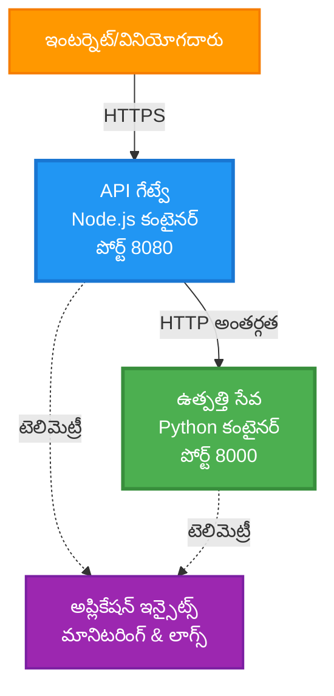
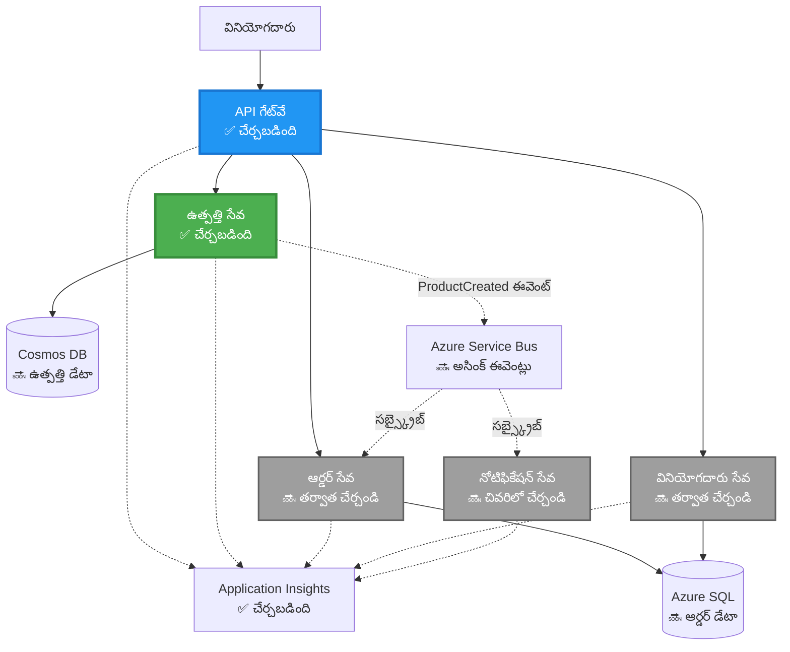
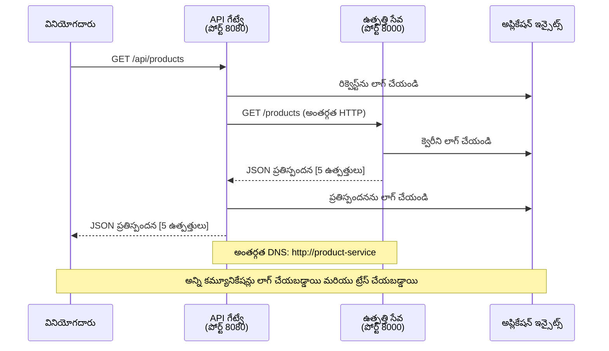

# Microservices Architecture - Container App Example

⏱️ **Estimated Time**: 25-35 minutes | 💰 **Estimated Cost**: ~$50-100/month | ⭐ **Complexity**: అధిక

**📚 అభ్యసన మార్గం:**
- ← Previous: [సింపుల్ ఫ్లాస్క్ API](../../../../examples/container-app/simple-flask-api) - ఒకే కంటైనర్ ప్రాథమికాలు
- 🎯 **మీరు ఇక్కడ ఉన్నారు**: Microservices Architecture (2-service foundation)
- → Next: [AI Integration](../../../../docs/ai-foundry) - మీ సేవలకు బుద్ధిమత్తను జోడించండి
- 🏠 [కోర్సు హోమ్](../../README.md)

---

A **సరళీకృతమైన కానీ కార్యదక్షమైన** మైక్రోసర్వీసెస్ ఆర్కిటెక్చర్ Azure Container Apps మీద AZD CLI ఉపయోగించి డిప్లాయ్ చేయబడింది. ఈ ఉదాహరణ సర్వీస్-టు-సర్వీస్ కమ్యూనికేషన్, కంటైనర్ ఆర్కెస్ట్రేషన్, మరియు మానిటరింగ్‌ను సాధ్యమయ్యే 2-సర్వీస్ సెటప్ తో చూపిస్తుంది.

> **📚 అభ్యసన విధానం**: ఈ ఉదాహరణ ఒక కనిష్ట 2-సర్వీస్ ఆర్కిటెక్చర్ (API Gateway + Backend Service) తో మొదలవుతుంది, దీన్ని మీరు వాస్తవంగా డిప్లాయ్ చేసి నేర్చుకోవచ్చు. ఈ మౌలికాన్ని అధిగమించిన తర్వాత, పూర్తి మైక్రోసర్వీసెస్ ఎకోసిస్టమ్‌కి విస్తరించడానికి మార్గదర్శకాన్ని అందిస్తాము.

## మీరు ఏమి నేర్చుకుంటారు

ఈ ఉదాహరణ పూర్తి చేసి మీరు:
- Azure Container Apps కు బహుళ కంటైనర్‌లు డిప్లాయ్ చేయడం నేర్చుకుంటారు
- అంతర్గత నెట్‌వర్కింగ్‌తో సర్వీస్-టు-సర్వీస్ కమ్యూనికేషన్ అమలు చేయడం
- వాతావరణాధారిత స్కేలింగ్ మరియు హెల్త్ చెక్స్‌లను కాన్ఫిగర్ చేయడం
- Application Insights తో పంపిణీ చేయబడిన అప్లికేషన్లను మానిటర్ చేయడం
- మైక్రోసర్వీసెస్ డిప్లాయ్‌మెంట్ నమూనాలు మరియు ఉత్తమ విధానాలను అర్థం చేసుకోవడం
- సరళంగా ప్రారంభించి క్లిష్టత దాకా క్రమంగా విస్తరించడాన్ని నేర్చుకోవడం

## ఆర్కిటెక్చర్

### Phase 1: మేము ఏమి నిర్మిస్తున్నారు (ఈ ఉదాహరణలో సాంత్రమైనది)


```mermaid
graph TB
    Internet[ఇంటర్నెట్/వినియోగదారు]
    Gateway[API గేట్వే<br/>Node.js కంటైనర్<br/>పోర్ట్ 8080]
    Product[ఉత్పత్తి సేవ<br/>Python కంటైనర్<br/>పోర్ట్ 8000]
    AppInsights[అప్లికేషన్ ఇన్సైట్స్<br/>మానిటరింగ్ & లాగ్స్]
    
    Internet -->|HTTPS| Gateway
    Gateway -->|HTTP అంతర్గత| Product
    Gateway -.->|టెలిమెట్రీ| AppInsights
    Product -.->|టెలిమెట్రీ| AppInsights
    
    style Gateway fill:#2196F3,stroke:#1976D2,stroke-width:3px,color:#fff
    style Product fill:#4CAF50,stroke:#388E3C,stroke-width:3px,color:#fff
    style Internet fill:#FF9800,stroke:#F57C00,stroke-width:2px,color:#fff
    style AppInsights fill:#9C27B0,stroke:#7B1FA2,stroke-width:2px,color:#fff
```
**భాగాల వివరాలు:**

| Component | Purpose | Access | Resources |
|-----------|---------|--------|-----------|
| **API Gateway** | బాహ్య అభ్యర్థనలను బ్యాకెండ్ సేవలకు రూట్ చేయడం | Public (HTTPS) | 1 vCPU, 2GB RAM, 2-20 replicas |
| **Product Service** | మెమొరీలోని డేటాతో ఉత్పత్తి క్యాటలాగ్ నిర్వహించడం | Internal only | 0.5 vCPU, 1GB RAM, 1-10 replicas |
| **Application Insights** | కేంద్రీకృత లాగింగ్ మరియు పంపిణీ చేసిన ట్రేసింగ్ | Azure Portal | 1-2 GB/month data ingestion |

**ఎందుకు సరళంగా ప్రారంభించాలి?**
- ✅ త్వరగా డిప్లోయ్ చేసి అర్థం చేసుకోగలిగేలా (25-35 నిమిషాలు)
- ✅ సంక్లిష్టత లేకుండా కోర్ మైక్రోసర్వీసెస్ నమూనాలు నేర్చుకోండి
- ✅ మీరు మార్చి ప్రయోగించగల పని చేసే కోడ్
- ✅ అభ్యాసానికి తక్కువ ఖర్చు (~$50-100/month పర్యాయంగా $300-1400/month కన్నా తక్కువ)
- ✅ డేటాబేస్‌లు మరియు మెసేజ్ క్యూ లు జోడించే ముందు నమ్మకాన్ని పెంచుకోండి

**ఉపమా**: ఇది డ్రైవింగ్ నేర్చుకునేలా. మీరు ఖాళీ పార్కింగ్ స్థలంతో (2 సర్వీసులు) ప్రారంభిస్తారు, ప్రాథమికాలు నేర్పుకొంటారు, తర్వాత నగర ట్రాఫిక్ (5+ సేవలు, డేటాబేస్‌లు) వైపుకు ముందుకు వెళతారు.

### Phase 2: భవిష్యత్ విస్తరణ (సూచనాత్మక ఆర్కిటెక్చర్)

Once you master the 2-service architecture, you can expand to:


```mermaid
graph TB
    User[వినియోగదారు]
    Gateway[API గేట్‌వే<br/>✅ చేర్చబడింది]
    Product[ఉత్పత్తి సేవ<br/>✅ చేర్చబడింది]
    Order[ఆర్డర్ సేవ<br/>🔜 తర్వాత చేర్చండి]
    UserSvc[వినియోగదారు సేవ<br/>🔜 తర్వాత చేర్చండి]
    Notify[నోటిఫికేషన్ సేవ<br/>🔜 చివరిలో చేర్చండి]
    
    CosmosDB[(Cosmos DB<br/>🔜 ఉత్పత్తి డేటా)]
    AzureSQL[(Azure SQL<br/>🔜 ఆర్డర్ డేటా)]
    ServiceBus[Azure Service Bus<br/>🔜 అసింక్ ఈవెంట్లు]
    AppInsights[Application Insights<br/>✅ చేర్చబడింది]
    
    User --> Gateway
    Gateway --> Product
    Gateway --> Order
    Gateway --> UserSvc
    
    Product --> CosmosDB
    Order --> AzureSQL
    UserSvc --> AzureSQL
    
    Product -.->|ProductCreated ఈవెంట్| ServiceBus
    ServiceBus -.->|సబ్స్క్రైబ్| Notify
    ServiceBus -.->|సబ్స్క్రైబ్| Order
    
    Gateway -.-> AppInsights
    Product -.-> AppInsights
    Order -.-> AppInsights
    UserSvc -.-> AppInsights
    Notify -.-> AppInsights
    
    style Product fill:#4CAF50,stroke:#388E3C,stroke-width:3px,color:#fff
    style Gateway fill:#2196F3,stroke:#1976D2,stroke-width:3px,color:#fff
    style Order fill:#9E9E9E,stroke:#616161,stroke-width:2px,color:#fff
    style UserSvc fill:#9E9E9E,stroke:#616161,stroke-width:2px,color:#fff
    style Notify fill:#9E9E9E,stroke:#616161,stroke-width:2px,color:#fff
```
See "Expansion Guide" విభాగాన్ని చివరలో దశలవారీ సూచనల కోసం చూడండి.

## సమకూర్చవలసిన ఫీచర్లు

✅ **Service Discovery**: కంటైనర్‌ల మధ్య ఆటోమేటిక్ DNS ఆధారిత కనుగొనుట  
✅ **Load Balancing**: రిప్లికాస్ మధ్య బిల్ట్-ఇన్ లోడ్ బేలెన్సింగ్  
✅ **Auto-scaling**: ప్రతి సేవ కోసం HTTP అభ్యర్థనల ఆధారంగా స్వతంత్రంగా స్కేలు అవుట్/ఇన్  
✅ **Health Monitoring**: ఇద్దరు సర్వీసుల కొరకు లైవెనెస్ మరియు రెడీనెస్ probes  
✅ **Distributed Logging**: Application Insights ద్వారా కేంద్రీకృత లాగింగ్  
✅ **Internal Networking**: సురక్షిత సేవ-టు-సేవ్ కమ్యూనికేషన్  
✅ **Container Orchestration**: ఆటోమేటిక్ డిప్లాయ్‌మెంట్ మరియు స్కేలింగ్  
✅ **Zero-Downtime Updates**: రోల్లింగ్ అప్డేట్స్ మరియు రివిజన్ నిర్వహణ

## ముందస్తు అవసరాలు

### అవసరమైన పరికరాలు

ప్రారంభించే ముందు, మీ వద్ద ఈ పరికరాలు ఇన్‌స్టాల్ అయ్యాయా అని నిర్ధారించుకోండి:

1. **[Azure Developer CLI (azd)](https://learn.microsoft.com/azure/developer/azure-developer-cli/install-azd)** (సంస్కరణ 1.0.0 లేదా అంతకంటే పైగా)
   ```bash
   azd version
   # అనుకున్న అవుట్‌పుట్: azd వెర్షన్ 1.0.0 లేదా పైగా
   ```

2. **[Azure CLI](https://learn.microsoft.com/cli/azure/install-azure-cli)** (సంస్కరణ 2.50.0 లేదా అంతకంటే పైగా)
   ```bash
   az --version
   # ఆశించిన అవుట్‌పుట్: azure-cli 2.50.0 లేదా అంతకు పైగా
   ```

3. **[Docker](https://www.docker.com/get-started)** (లోకల్ డెవలప్మెంట్/పరీక్షల కోసం - ఐచ్ఛికం)
   ```bash
   docker --version
   # ఆశించిన అవుట్‌పుట్: Docker వెర్షన్ 20.10 లేదా అంతకంటే పైగా
   ```

### మీ సెటప్‌ను నిర్ధారించండి

మీరు సిద్ధం ఉన్నారన్నదాన్ని నిర్ధారించడానికి ఈ కమాండ్లను రన్ చేయండి:

```bash
# Azure Developer CLIని తనిఖీ చేయండి
azd version
# ✅ అంచనా: azd సంస్కరణ 1.0.0 లేదా అంతకంటే పైగా

# Azure CLIని తనిఖీ చేయండి
az --version
# ✅ అంచనా: azure-cli 2.50.0 లేదా అంతకంటే పైగా

# Dockerని తనిఖీ చేయండి (ఐచ్ఛికం)
docker --version
# ✅ అంచనా: Docker సంస్కరణ 20.10 లేదా అంతకంటే పైగా
```

**జయశీల్య ప్రమాణాలు**: అన్ని కమాండ్లు కనీస απαιτήσειςకి సమానమైన లేదా అధిగమించే సంస్కరణ సంఖ్యలను రిటర్న్ చేయాలి.

### Azure అవసరాలు

- ఒక సక్రియమైన **Azure subscription** ([create a free account](https://azure.microsoft.com/free/))
- మీ సబ్‌స్క్రిప్షన్‌లో రిసోర్సులు సృష్టించడానికి అనుమతులు
- సబ్‌స్క్రిప్షన్ లేదా రిసోర్స్ గ్రూప్‌పై **Contributor** పాత్ర

### జ్ఞాన అవసరాలు

ఇది ఒక **అధిక స్థాయి** ఉదాహరణ. మీ వద్ద ఉండాలి:
- [Simple Flask API example](../../../../examples/container-app/simple-flask-api) పూర్తి చేసి ఉండాలి 
- మైక్రోసర్వీసెస్ ఆర్కిటెక్చర్ గురించి ప్రాథమిక అవగాహన
- REST APIs మరియు HTTP గురించి పరిచయం
- కంటైనర్ కాన్సెప్ట్‌ల గురించి అవగాహన

**Container Appsకి కొత్తవారా?** ప్రాథమికాలు నేర్చుకోడానికి ముందుగా [Simple Flask API example](../../../../examples/container-app/simple-flask-api) తో ప్రారంభించండి.

## త్వరిత ప్రారంభం (దశల వారీగా)

### దశ 1: క్లోన్ చేసి నావిగేట్ చేయండి

```bash
git clone https://github.com/microsoft/AZD-for-beginners.git
cd AZD-for-beginners/examples/microservices
```

**✓ విజయం ధృవీకరణ**: మీరు `azure.yaml` కనిపిస్తున్నదని నిర్ధారించండి:
```bash
ls
# అనుకున్నవి: README.md, azure.yaml, infra/, src/
```

### దశ 2: Azure తో ప్రామాణీకరించండి

```bash
azd auth login
```

ఇది Azure ప్రామాణీకరణ కోసం మీ బ్రౌజర్‌ను తెరుస్తుంది. మీ Azure క్రెడెన్షియల్స్‌తో సైన్ ఇన్ చేయండి.

**✓ విజయం ధృవీకరణ**: మీరు ఇలా చూడాలి:
```
Logged in to Azure.
```

### దశ 3: వాతావరణాన్ని ఆర్‌భవం చేయండి

```bash
azd init
```

**మీకు కనిపించే ప్రాంప్ట్స్**:
- **Environment name**: ఒక చిన్న పేరు నమోదు చేయండి (ఉదాహరణకి `microservices-dev`)
- **Azure subscription**: మీ సబ్‌స్క్రిప్షన్‌ను ఎంచుకోండి
- **Azure location**: ఒక రీజియన్‌ను ఎంచుకోండి (ఉదాహరణకి `eastus`, `westeurope`)

**✓ విజయం ధృవీకరణ**: మీరు ఇలా చూడాలి:
```
SUCCESS: New project initialized!
```

### దశ 4: ఇన్‌ఫ్రాస్ట్రక్చర్ మరియు సర్వీసులను డిప్లాయ్ చేయండి

```bash
azd up
```

**ఏం జరుగుతుంది** (సుమారు 8-12 నిమిషాలు తీసుకుంటుంది):


```mermaid
graph LR
    A[azd అప] --> B[రిసోర్స్ గ్రూప్ సృష్టించండి]
    B --> C[కంటైనర్ రిజిస్ట్రీను అమర్చండి]
    C --> D[లాగ్ అనలిటిక్స్‌ను అమర్చండి]
    D --> E[అప్లికేషన్ ఇన్సైట్స్‌ను అమర్చండి]
    E --> F[కంటైనర్ పర్యావరణాన్ని సృష్టించండి]
    F --> G[API గేట్వే ఇమేజ్‌ను నిర్మించండి]
    F --> H[ఉత్పత్తి సేవ ఇమేజ్‌ను నిర్మించండి]
    G --> I[రిజిస్ట్రీకు పుష్ చేయండి]
    H --> I
    I --> J[API గేట్వేను అమర్చండి]
    I --> K[ఉత్పత్తి సేవను అమర్చండి]
    J --> L[ఇన్గ్రెస్ మరియు ఆరోగ్య తనిఖీలను కాన్ఫిగర్ చేయండి]
    K --> L
    L --> M[డిప్లాయ్‌మెంట్ పూర్తి ✓]
    
    style A fill:#2196F3,stroke:#1976D2,stroke-width:3px,color:#fff
    style M fill:#4CAF50,stroke:#388E3C,stroke-width:3px,color:#fff
```
**✓ విజయం ధృవీకరణ**: మీరు ఇలా చూడాలి:
```
SUCCESS: Your application was deployed to Azure in X minutes Y seconds.
Endpoint: https://api-gateway-<unique-id>.azurecontainerapps.io
```

**⏱️ సమయం**: 8-12 నిమిషాలు

### దశ 5: డిప్లాయ్‌మెంట్‌ను పరీక్షించండి

```bash
# గేట్వే ఎండ్‌పాయింట్ పొందండి
GATEWAY_URL=$(azd env get-values | grep API_GATEWAY_URL | cut -d '=' -f2 | tr -d '"')

# API గేట్వే ఆరోగ్యాన్ని పరీక్షించండి
curl $GATEWAY_URL/health
```

**✅ అంచనా ఉత్పత్తి:** 
```json
{
  "status": "healthy",
  "service": "api-gateway",
  "timestamp": "2025-11-19T10:30:00Z"
}
```

**గేట్వే ద్వారా ఉత్పత్తి సర్వీస్ పరీక్షించండి**:
```bash
# ఉత్పత్తులను జాబితా చేయండి
curl $GATEWAY_URL/api/products
```

**✅ అంచనా ఉత్పత్తి:** 
```json
[
  {"id":1,"name":"Laptop","price":999.99,"stock":50},
  {"id":2,"name":"Mouse","price":29.99,"stock":200},
  {"id":3,"name":"Keyboard","price":79.99,"stock":150}
]
```

**✓ విజయం ధృవీకరణ**: రెండు ఎండ్‌పాయింట్లు లోతైన తప్పులుండకుండా JSON డేటాను రిటర్న్ చేయాలి.

---

**🎉 అభినందనలు!** మీరు Azure లో ఒక మైక్రోసర్వీసెస్ ఆర్కిటెక్చర్‌ను డిప్లాయ్ చేసారు!

## ప్రాజెక్ట్ నిర్మాణం

అన్ని అమలు ఫైళ్లు అందుబాటులో ఉన్నాయి—ఇది పూర్తి, పనిచేసే ఉదాహరణ:

```
microservices/
│
├── README.md                         # This file
├── azure.yaml                        # AZD configuration
├── .gitignore                        # Git ignore patterns
│
├── infra/                           # Infrastructure as Code (Bicep)
│   ├── main.bicep                   # Main orchestration
│   ├── abbreviations.json           # Naming conventions
│   ├── core/                        # Shared infrastructure
│   │   ├── container-apps-environment.bicep  # Container environment + registry
│   │   └── monitor.bicep            # Application Insights + Log Analytics
│   └── app/                         # Service definitions
│       ├── api-gateway.bicep        # API Gateway container app
│       └── product-service.bicep    # Product Service container app
│
└── src/                             # Application source code
    ├── api-gateway/                 # Node.js API Gateway
    │   ├── app.js                   # Express server with routing
    │   ├── package.json             # Node dependencies
    │   └── Dockerfile               # Container definition
    └── product-service/             # Python Product Service
        ├── main.py                  # Flask API with product data
        ├── requirements.txt         # Python dependencies
        └── Dockerfile               # Container definition
```

**ప్రతి భాగం ఏమి చేస్తుంది:**

**Infrastructure (infra/)**:
- `main.bicep`: అన్ని Azure రిసోర్సులు మరియు వాటి డిపెండెన్సీలను ఆర్కెస్ట్రేట్ చేస్తుంది
- `core/container-apps-environment.bicep`: Container Apps వాతావరణం మరియు Azure Container Registry‌ను సృష్టిస్తుంది
- `core/monitor.bicep`: పంపిణీ చేసిన లాగింగ్ కోసం Application Insights సెటప్ చేస్తుంది
- `app/*.bicep`: స్కేలింగ్ మరియు హెల్త్ చెక్స్లతో వ్యక్తిగత కంటైనర్ యాప్ నిర్వచనాలు

**API Gateway (src/api-gateway/)**:
- బాహ్యానికి ముఖపుట సేవ, బ్యాకెండ్ సేవలకు అభ్యర్థనలను రూట్ చేస్తుంది
- లాగింగ్, ఎర్రర్ హ్యాండ్లింగ్, మరియు అభ్యర్థన ఫార్వార్డింగ్‌ను అమలు చేస్తుంది
- సర్వీస్-టు-సర్వీస్ HTTP కమ్యూనికేషన్‌ను ప్రదర్శిస్తుంది

**Product Service (src/product-service/)**:
- మెమొరీలోని ఉత్పత్తి క్యాటలాగ్‌తో అంతర్గత సేవ (సరళత కోసం)
- REST API మరియు హెల్త్ చెక్స్లు
- బ్యాకెండ్ మైక్రోసర్వీస్ నమూనాకు ఉదాహరణ

## సేవల అవలోకనం

### API Gateway (Node.js/Express)

**పోర్ట్**: 8080  
**ప్రవేశం**: Public (external ingress)  
**ఉద్దేశ్యం**: వచ్చిన అభ్యర్థనలను సరైన బ్యాకెండ్ సేవలకు రూట్ చేయడం  

**ఎండ్పాయింట్లు**:
- `GET /` - సేవ సమాచారం
- `GET /health` - హెల్త్ చెక్ ఎండ్పాయింట్
- `GET /api/products` - ఉత్పత్తి సేవకు ఫార్వర్డ్ చేయండి (అన్ని లిస్ట్)
- `GET /api/products/:id` - ఉత్పత్తి సేవకు ఫార్వర్డ్ చేయండి (ID ద్వారా పొందండి)

**ప్రధాన ఫీచర్లు**:
- axios తో అభ్యర్థన రౌటింగ్
- కేంద్రీకృత లాగింగ్
- ఎర్రర్ హ్యాండ్లింగ్ మరియు టైమ్ అవుట్ నిర్వహణ
- ఎన్విరాన్మెంట్ వేరియబుల్స్ ద్వారా సర్వీస్ కనుగొనుట
- Application Insights సమీకరణ

**కోడ్ హైలైట్** (`src/api-gateway/app.js`):
```javascript
// అంతర్గత సేవల సంభాషణ
app.get('/api/products', async (req, res) => {
  const response = await axios.get(`${PRODUCT_SERVICE_URL}/products`, {
    timeout: 5000
  });
  res.json(response.data);
});
```

### Product Service (Python/Flask)

**పోర్ట్**: 8000  
**ప్రవేశం**: Internal only (ఎక్స్‌టర్నల్ ఇన్గ్రెస్ లేదు)  
**ఉద్దేశ్యం**: మెమొరీలోని డేటాతో ఉత్పత్తి క్యాటలాగ్ నిర్వహించడం  

**ఎండ్పాయింట్లు**:
- `GET /` - సేవ సమాచారం
- `GET /health` - హెల్త్ చెక్ ఎండ్‌పాయింట్
- `GET /products` - అన్ని ఉత్పత్తులను లిస్ట్ చేయండి
- `GET /products/<id>` - ID ద్వారా ఉత్పత్తిని పొందండి

**ప్రధాన ఫీచర్లు**:
- Flask తో RESTful API
- మెమొరీలో ఉత్పత్తి స్టోర్ (సరళం, డేటాబేస్ అవసరం లేదు)
- probes తో హెల్త్ మానిటరింగ్
- నిర్మిత లాగింగ్
- Application Insights సమీకరణ

**డేటా మోడల్**:
```python
{
  "id": 1,
  "name": "Laptop",
  "description": "High-performance laptop",
  "price": 999.99,
  "stock": 50
}
```

**ఎందుకు అంతర్గత మాత్రమే?**
Product Service ను పబ్లిక్ గా ఎక్స్‌పోజ్ చేయలేదు. అన్ని అభ్యర్థనలు API Gateway ద్వారా రావాలి, ఇది ఇస్తుంది:
- భద్రత: నియంత్రిత ప్రాప్యత పాయింట్
- ఫ్లెక్సిబిలిటీ: క్లయింట్‌లను ప్రభావితం చేయకుండా బ్యాకెండ్ మార్చుకోవచ్చు
- మానిటరింగ్: కేంద్రీకృత అభ్యర్థన లాగింగ్

## సర్వీస్ కమ్యూనికేషన్ అర్థం చేసుకోవడం

### సేవలు ఎలా పరస్పరం మాట్లాడతాయి


```mermaid
sequenceDiagram
    participant User as వినియోగదారు
    participant Gateway as API గేట్వే<br/>(పోర్ట్ 8080)
    participant Product as ఉత్పత్తి సేవ<br/>(పోర్ట్ 8000)
    participant AI as అప్లికేషన్ ఇన్సైట్స్
    
    User->>Gateway: GET /api/products
    Gateway->>AI: రిక్వెస్ట్‌ను లాగ్ చేయండి
    Gateway->>Product: GET /products (అంతర్గత HTTP)
    Product->>AI: క్వెరీని లాగ్ చేయండి
    Product-->>Gateway: JSON ప్రతిస్పందన [5 ఉత్పత్తులు]
    Gateway->>AI: ప్రతిస్పందనను లాగ్ చేయండి
    Gateway-->>User: JSON ప్రతిస్పందన [5 ఉత్పత్తులు]
    
    Note over Gateway,Product: అంతర్గత DNS: http://product-service
    Note over User,AI: అన్ని కమ్యూనికేషన్లు లాగ్ చేయబడ్డాయి మరియు ట్రేస్ చేయబడ్డాయి
```
ఈ ఉదాహరణలో, API Gateway Product Service తో **అంతర్గత HTTP కాల్స్** ద్వారా కమ్యూనికేట్ చేస్తుంది:

```javascript
// API గేట్‌వే (src/api-gateway/app.js)
const PRODUCT_SERVICE_URL = process.env.PRODUCT_SERVICE_URL;

// అంతర్గత HTTP అభ్యర్థన చేయండి
const response = await axios.get(`${PRODUCT_SERVICE_URL}/products`);
```

**ముఖ్యాంశాలు**:

1. **DNS-ఆధారిత కనుగొనుట**: Container Apps అంతర్గత సేవల కోసం ఆటోమేటిగ్గా DNS ను అందిస్తుంది
   - Product Service FQDN: `product-service.internal.<environment>.azurecontainerapps.io`
   - సరళీకృతంగా: `http://product-service` (Container Apps దీన్ని రిజాల్వ్ చేస్తుంది)

2. **జనరల్ ప్రశస్తి లేదు**: Product Service కు Bicep లో `external: false` ఉంది
   - కేవలం Container Apps వాతావరణంలోనే ప్రాప్యం
   - ఇంటర్నెట్ నుండి చేరుకోవడం సాధ్యం కాదు

3. **ఎన్విరాన్మెంట్ వేరియబుల్స్**: సర్వీస్ URL లు డిప్లాయ్‌మెంట్ సమయంలో ఇన్జెక్ట్ చేయబడతాయి
   - Bicep అంతర్గత FQDN ను గేట్వే కు పాస్ చేస్తుంది
   - అప్లికేషన్ కోడ్‌లో హార్డ్‌కోడ్ చేయబడిన URL లు ఉండవు

**ఉపమా**: ఇది ఆఫీస్ రూమ్‌ల లాంటిది. API Gateway రిసెప్షన్ డెస్క్ (పబ్లిక్-ఫేసింగ్), Product Service ఆఫీస్ రూమ్ (అంతర్గత). సందర్శకులు ఏదైనా ఆఫీస్ చేరడానికి రిసెప్షన్ ద్వారా వెళ్లాలి.

## డిప్లాయ్‌మెంట్ ఎంపికలు

### పూర్తి డిప్లాయ్‌మెంట్ (సిఫార్సు చేయబడింది)

```bash
# ఇన్‌ఫ్రాస్ట్రక్చర్ మరియు రెండు సేవలను అమలు చేయండి
azd up
```

ఇది డిప్లాయ్ చేస్తుంది:
1. Container Apps వాతావరణం
2. Application Insights
3. Container Registry
4. API Gateway కంటైనర్
5. Product Service కంటైనర్

**సమయం**: 8-12 నిమిషాలు

### వ్యక్తిగత సేవను డిప్లాయ్ చేయండి

```bash
# ఒకే ఒక సేవను మాత్రమే డిప్లాయ్ చేయండి (ప్రారంభ azd up తర్వాత)
azd deploy api-gateway

# లేదా ఉత్పత్తి సేవను డిప్లాయ్ చేయండి
azd deploy product-service
```

**వినియోగ సందర్భం**: ఒక సేవలో కోడ్ నవీకరించాక మీరు ఆే సేవకే నూతన డిప్లాయ్ మాత్రమే చేయాలనుకుంటే.

### కాన్ఫిగరేషన్ నవీకరణ

```bash
# స్కేలింగ్ పారామీటర్లను మార్చండి
azd env set GATEWAY_MAX_REPLICAS 30

# కొత్త కాన్ఫిగరేషన్‌తో మళ్లీ డిప్లాయ్ చేయండి
azd up
```

## కాన్ఫిగరేషన్

### స్కేలింగ్ కాన్ఫిగరేషన్

రెండు సేవలూ వారి Bicep ఫైళ్లలో HTTP-ఆధారిత ఆటోస్కేలింగ్‌తో కాన్ఫిగర్ చేయబడ్డాయి:

**API Gateway**:
- Min replicas: 2 (అవైలబిలిటీ కోసం కనీసం 2)
- Max replicas: 20
- Scale trigger: ప్రతి రిప్లికాకు 50 సమాంతర అభ్యర్థనలు

**Product Service**:
- Min replicas: 1 (అవసరమైతే జీరోకి కూడా స్కేలు అవ్వగలదు)
- Max replicas: 10
- Scale trigger: ప్రతి రిప్లికాకు 100 సమాంతర అభ్యర్థనలు

**స్కేలింగ్ ను అనుకూలీకరించండి** (in `infra/app/*.bicep`):
```bicep
scale: {
  minReplicas: 1
  maxReplicas: 10
  rules: [
    {
      name: 'http-scale-rule'
      http: {
        metadata: {
          concurrentRequests: '100'  // Adjust this
        }
      }
    }
  ]
}
```

### రిసోస్ కేటాయింపు

**API Gateway**:
- CPU: 1.0 vCPU
- Memory: 2 GiB
- కారణం: అన్ని బాహ్య ట్రాఫిక్‌ను హ్యాండిల్ చేస్తుంది

**Product Service**:
- CPU: 0.5 vCPU
- Memory: 1 GiB
- కారణం: లైట్‌వెయిట్ మెమోరీ ఆపరేషన్లు

### హెల్త్ చెక్స్లు

రెండు సేవలలో లైవెనెస్ మరియు రెడీనెస్ probes ఉన్నాయి:

```bicep
probes: [
  {
    type: 'Liveness'
    httpGet: {
      path: '/health'
      port: 8080
    }
    initialDelaySeconds: 10
    periodSeconds: 30
  }
  {
    type: 'Readiness'
    httpGet: {
      path: '/health'
      port: 8080
    }
    initialDelaySeconds: 5
    periodSeconds: 10
  }
]
```

**అర్థం ఏమిటి**:
- **Liveness**: హెల్త్ చెక్ విఫలమైతే, Container Apps కంటైనర్‌ను రీస్టార్ట్ చేస్తుంది
- **Readiness**: రెడీ కానప్పుడల్లా, Container Apps ఆ రిప్లికాకు ట్రాఫిక్ రూట్ చేయవద్దు

## మానిటరింగ్ & ఆబ్సర్వబిలిటీ

### సేవ లాగ్‌ల ను చూడండి

```bash
# azd monitor ఉపయోగించి లాగ్‌లను వీక్షించండి
azd monitor --logs

# లేదా నిర్దిష్ట Container Apps కోసం Azure CLI ఉపయోగించండి:
# API Gateway నుంచి లాగ్‌లను స్ట్రీమ్ చేయండి
az containerapp logs show --name api-gateway --resource-group $RG_NAME --follow

# తాజా ఉత్పత్తి సేవా లాగ్‌లను వీక్షించండి
az containerapp logs show --name product-service --resource-group $RG_NAME --tail 100
```

**అంచనా ఉత్పత్తి**:
```
[api-gateway] API Gateway listening on port 8080
[api-gateway] Product Service URL: http://product-service
[api-gateway] GET /api/products 200 - 45ms
[product-service] Retrieved 5 products
```

### Application Insights క్వెరీస్

Azure Portal లో Application Insights కు ప్రాప్యం చేసి, ఈ క్వెరీస్ ను రన్ చేయండి:

**నెమ్మదిగా వస్తున్న అభ్యర్థనలను కనుగొను**:
```kusto
requests
| where timestamp > ago(1h)
| where duration > 1000  // Requests taking >1 second
| summarize count() by name, cloud_RoleName
| order by count_ desc
```

**సర్వీస్-టు-సర్వీస్ కాల్స్‌ను ట్రాక్ చేయండి**:
```kusto
dependencies
| where timestamp > ago(1h)
| where type == "Http"
| project timestamp, name, target, duration, success
| order by timestamp desc
```

**సర్వీస్ ప్రకారం ఎర్రర్ రేటు**:
```kusto
exceptions
| where timestamp > ago(24h)
| summarize errorCount = count() by cloud_RoleName, type
| order by errorCount desc
```

**సమయం క్రమంలో రిక్వెస్ట్ వాల్యూమ్**:
```kusto
requests
| where timestamp > ago(1h)
| summarize requestCount = count() by bin(timestamp, 5m), cloud_RoleName
| render timechart
```

### మానిటరింగ్ డాష్‌బోర్డ్కు ప్రాప్యం

```bash
# Application Insights వివరాలు పొందండి
azd env get-values | grep APPLICATIONINSIGHTS

# Azure పోర్టల్‌లో మానిటరింగ్‌ను తెరవండి
az monitor app-insights component show \
  --app $(azd env get-values | grep APPLICATIONINSIGHTS_CONNECTION_STRING | cut -d '=' -f2) \
  --resource-group $(azd env get-values | grep AZURE_RESOURCE_GROUP | cut -d '=' -f2) \
  --query "appId" -o tsv
```

### లైవ్ మెట్రిక్స్

1. Azure Portal లో Application Insights కి వెళ్లండి
2. "Live Metrics" క్లిక్ చేయండి
3. రియల్-టైమ్ అభ్యర్థనలు, ఫెయిల్యూర్‌లు, మరియు పనితీరును చూడండి
4. పరీక్ష చేయడానికి రన్ చేయండి: `curl $(azd env get-values | grep API_GATEWAY_URL | cut -d '=' -f2 | tr -d '"')/api/products`

## ప్రాక్టికల్ వ్యాయామాలు

### వ్యాయామం 1: కొత్త ఉత్పత్తి ఎండ్‌పాయింట్ జోడించండి ⭐ (సులభం)

**లక్ష్యం**: కొత్త ఉత్పత్తులను సృష్టించడానికి POST ఎండ్‌పాయింట్ జోడించండి

**ప్రారంభ పాయింట్**: `src/product-service/main.py`

**దశలు**:

1. ఈ ఎండ్‌పాయింట్‌ను `get_product` ఫంక్షన్ తరువాత `main.py` లో జోడించండి:

```python
@app.route('/products', methods=['POST'])
def create_product():
    """Create a new product"""
    data = request.get_json()
    
    # అవసరమైన ఫీల్డ్‌లను ధృవీకరించండి
    if not data or 'name' not in data or 'price' not in data:
        return jsonify({'error': 'Missing required fields: name, price'}), 400
    
    new_id = max(p['id'] for p in products) + 1
    new_product = {
        'id': new_id,
        'name': data['name'],
        'description': data.get('description', ''),
        'price': float(data['price']),
        'stock': int(data.get('stock', 0))
    }
    products.append(new_product)
    logger.info(f"Created product {new_id}")
    return jsonify(new_product), 201
```

2. API Gateway లో POST రూట్ జోడించండి (`src/api-gateway/app.js`):

```javascript
// ఇది GET /api/products రూట్ తర్వాత జోడించండి
app.post('/api/products', async (req, res) => {
  try {
    console.log(`Forwarding POST request to ${PRODUCT_SERVICE_URL}/products`);
    const response = await axios.post(`${PRODUCT_SERVICE_URL}/products`, req.body, {
      timeout: 5000
    });
    res.status(201).json(response.data);
  } catch (error) {
    console.error('Error calling product service:', error.message);
    res.status(503).json({
      error: 'Product service unavailable',
      message: error.message
    });
  }
});
```

3. రెండు సర్వీసులను మళ్లీ డిప్లాయ్ చేయండి:

```bash
azd deploy product-service
azd deploy api-gateway
```

4. కొత్త ఎండ్‌పాయింట్‌ను పరీక్షించండి:

```bash
GATEWAY_URL=$(azd env get-values | grep API_GATEWAY_URL | cut -d '=' -f2 | tr -d '"')

# కొత్త ఉత్పత్తిని సృష్టించండి
curl -X POST $GATEWAY_URL/api/products \
  -H "Content-Type: application/json" \
  -d '{"name":"USB Cable","price":9.99,"stock":500}'
```

**✅ ఆశించిన ఫలితం:**
```json
{"id":6,"name":"USB Cable","description":"","price":9.99,"stock":500}
```

5. అది జాబితాలో కనిపిస్తుందని ధృవీకరించండి:

```bash
curl $GATEWAY_URL/api/products
# ఇప్పుడు కొత్త USB క్యాబుల్‌ను కలిపి మొత్తం 6 ఉత్పత్తులు చూపించాలి
```

**విజయ ప్రమాణాలు**:
- ✅ POST అభ్యర్థన HTTP 201 ను తిరిగి ఇస్తుంది
- ✅ GET /api/products జాబితాలో కొత్త ఉత్పత్తి కనిపిస్తుంది
- ✅ ఉత్పత్తికి ఆటో-ఇన్క్రిమెంట్ ID ఉంటుంది

**సమయం**: 10-15 నిమిషాలు

---

### వ్యాయామం 2: ఆటోస్కేలింగ్ నియమాలను మార్చండి ⭐⭐ (మధ్యస్థ)

**లక్ష్యం**: Product Service ను మరింత శక్తివంతంగా స్కేల్ అయ్యేలా మార్చండి

**ప్రారంభ స్థానం**: `infra/app/product-service.bicep`

**దశలు**:

1. `infra/app/product-service.bicep` ను తెరిచి `scale` బ్లాక్‌ను కనుగొనండి (సుమారు లైన్ 95 వద్ద)

2. మార్చండి నుంచి:
```bicep
scale: {
  minReplicas: 1
  maxReplicas: 10
  rules: [
    {
      name: 'http-scale-rule'
      http: {
        metadata: {
          concurrentRequests: '100'  // OLD
        }
      }
    }
  ]
}
```

కి:
```bicep
scale: {
  minReplicas: 2  // Always have 2 running
  maxReplicas: 20  // Allow more scaling
  rules: [
    {
      name: 'http-scale-rule'
      http: {
        metadata: {
          concurrentRequests: '20'  // Scale at lower threshold
        }
      }
    }
  ]
}
```

3. ఇన్ఫ్రాస్ట్రక్చర్‌ను మళ్లీ డిప్లాయ్ చేయండి:

```bash
azd up
```

4. కొత్త స్కేలింగ్ కాన్ఫిగరేషన్‌ను ధృవీకరించండి:

```bash
az containerapp show \
  --name $(azd env get-values | grep PRODUCT_SERVICE | head -1 | cut -d '/' -f5) \
  --resource-group $(azd env get-values | grep AZURE_RESOURCE_GROUP | cut -d '=' -f2 | tr -d '"') \
  --query "properties.template.scale" -o json
```

**✅ ఆశించిన అవుట్పుట్:**
```json
{
  "minReplicas": 2,
  "maxReplicas": 20,
  "rules": [...]
}
```

5. లోడ్‌తో ఆటోస్కేలింగ్‌ను పరీక్షించండి:

```bash
# సమకాలీన అభ్యర్థనలను సృష్టించండి
for i in {1..500}; do curl $GATEWAY_URL/api/products & done

# Azure CLI ఉపయోగించి స్కేలింగ్ జరుగుతున్నదన్ని పర్యవేక్షించండి
az containerapp logs show --name product-service --resource-group $RG_NAME --follow
# గమనించండి: Container Apps స్కేలింగ్ సంఘటనలు
```

**విజయ ప్రమాణాలు**:
- ✅ Product Service కనీసం ఎప్పుడూ 2 రెప్లికాలు నడుస్తుంది
- ✅ లోడ్ ఉన్నప్పుడు, 2 కంటే ఎక్కువ రెప్లికాలుగా స్కేల్ అవుతుంది
- ✅ Azure Portal లో కొత్త స్కేలింగ్ నియమాలు కనిపిస్తాయి

**సమయం**: 15-20 నిమిషాలు

---

### వ్యాయామం 3: కస్టమ్ మానిటరింగ్ క్వెరీ జోడించండి ⭐⭐ (మధ్యస్థ)

**లక్ష్యం**: product API పనితీరును ట్రాక్ చేయడానికి ఒక కస్టమ్ Application Insights క్వెరీ సృష్టించండి

**దశలు**:

1. Azure Portalలో Application Insights కి పోవండి:
   - Azure Portal కి పోవండి
   - మీ resource group (rg-microservices-*) ను కనుగొనండి
   - Application Insights రిసోర్సుపై క్లిక్ చేయండి

2. ఎడమ మెనులోని "Logs" పై క్లిక్ చేయండి

3. ఈ క్వెరిని సృష్టించండి:

```kusto
requests
| where timestamp > ago(1h)
| where name contains "products"
| summarize 
    RequestCount = count(),
    AvgDuration = avg(duration),
    P95Duration = percentile(duration, 95),
    SuccessRate = 100.0 * countif(success == true) / count()
  by bin(timestamp, 5m)
| render timechart
```

4. క్వెరీని అమలు చేయడానికి "Run" పై క్లిక్ చేయండి

5. క్వెరీని సేవ్ చేయండి:
   - "Save" పై క్లిక్ చేయండి
   - Name: "Product API Performance"
   - Category: "Performance"

6. టెస్ట్ ట్రాఫిక్ ఉత్పత్తి చేయండి:

```bash
for i in {1..100}; do curl $GATEWAY_URL/api/products; sleep 1; done
```

7. డేటా చూడడానికి క్వెరీని రిఫ్రెష్ చేయండి

**✅ ఆశించిన అవుట్పుట్:**
- కాలక్రమేణా అభ్యర్థనల సంఖ్యను చూపించే చార్ట్
- సగటు వ్యవధి < 500ms
- విజయం రేటు = 100%
- 5 నిమిషాల సమయ బిన్‌లు

**విజయ ప్రమాణాలు**:
- ✅ క్వెరీ 100+ అభ్యర్థనలను చూపిస్తుంది
- ✅ విజయం రేటు 100%
- ✅ సగటు వ్యవధి < 500ms
- ✅ చార్ట్ 5-నిమిషాల సమయ బిన్‌లు చూపిస్తుంది

**అధ్యయన ఫలితం**: కస్టమ్ క్వెరీలతో సర్వీస్ పనితీరును ఎలా మానిటర్ చేయాలో అర్థం చేసుకోవడం

**సమయం**: 10-15 నిమిషాలు

---

### వ్యాయామం 4: రీట్రై లాజిక్ అమలు చేయండి ⭐⭐⭐ (అధునాతన)

**లక్ష్యం**: Product Service తాత్కాలికంగా అందుబాటులో లేని సమయంలో API Gateway లో రీట్రై లాజిక్ జోడ చేయండి

**ప్రారంభ స్థానం**: `src/api-gateway/app.js`

**దశలు**:

1. రీట్రై లైబ్రరీని ఇన్స్టాల్ చేయండి:

```bash
cd src/api-gateway
npm install axios-retry --save
cd ../..
```

2. `src/api-gateway/app.js` ను అప్డేట్ చేయండి (axios ఇంపోర్ట్ తర్వాత జోడించండి):

```javascript
const axiosRetry = require('axios-retry');

// రీట్రై లాజిక్‌ను కాన్ఫిగర్ చేయండి
axiosRetry(axios, {
  retries: 3,
  retryDelay: (retryCount) => {
    return retryCount * 1000; // 1 సెకను, 2 సెకన్లు, 3 సెకన్లు
  },
  retryCondition: (error) => {
    // నెట్‌వర్క్ లోపాలపై లేదా 5xx ప్రతిస్పందనలపై పునఃప్రయత్నం చేయండి
    return axiosRetry.isNetworkOrIdempotentRequestError(error) ||
           (error.response && error.response.status >= 500);
  }
});

console.log('Retry logic configured: 3 retries with exponential backoff');
```

3. API Gateway ను మళ్లీ డిప్లాయ్ చేయండి:

```bash
azd deploy api-gateway
```

4. సర్వీస్ విఫలమైనట్లుగా సిమ్యులేట్ చేసి రీట్రై వ్యవహారాన్ని పరీక్షించండి:

```bash
# ఉత్పత్తి సర్వీస్‌ను 0గా స్కేల్ చేయండి (విఫలాన్ని అనుకరించడానికి)
az containerapp update \
  --name $(azd env get-values | grep PRODUCT_SERVICE | head -1 | cut -d '/' -f5) \
  --resource-group $(azd env get-values | grep AZURE_RESOURCE_GROUP | cut -d '=' -f2 | tr -d '"') \
  --min-replicas 0 \
  --max-replicas 0

# ఉత్పత్తులను యాక్సెస్ చేయాలని ప్రయత్నించండి (3 సార్లు మళ్లీ ప్రయత్నిస్తుంది)
time curl -v $GATEWAY_URL/api/products
# గమనించండి: స్పందనకు సుమారు 6 సెకన్లు పడుతుంది (1s + 2s + 3s మళ్లీ ప్రయత్నాలు)

# ఉత్పత్తి సర్వీస్‌ను పునరుద్ధరించండి
az containerapp update \
  --name $(azd env get-values | grep PRODUCT_SERVICE | head -1 | cut -d '/' -f5) \
  --resource-group $(azd env get-values | grep AZURE_RESOURCE_GROUP | cut -d '=' -f2 | tr -d '"') \
  --min-replicas 1 \
  --max-replicas 10
```

5. రీట్రై లాగులను చూడండి:

```bash
az containerapp logs show --name api-gateway --resource-group $RG_NAME --tail 50
# వెతకండి: పునఃప్రయత్నాల సందేశాలు
```

**✅ ఆశించిన ప్రవర్తన:**
- అభ్యర్థనాలు విఫలమయ్యే ముందు 3 సార్లు రీట్రై అవుతాయి
- ప్రతి రీట్రై ఎక్కువగా వేచి ఉంటుంది (1s, 2s, 3s)
- సర్వీస్ రీస్టార్ట్ అయిన తర్వాత అభ్యర్థనలు విజయవంతంగా సాగుతాయి
- లాగ్‌లు రీట్రై ప్రయత్నాలను చూపిస్తాయి

**విజయ ప్రమాణాలు**:
- ✅ అభ్యర్థనాలు విఫలమయ్యే ముందు 3 సార్లు రీట్రై అవుతాయి
- ✅ ప్రతి రీట్రై ఎక్కువగా వేచి ఉంటుంది (ఎక్స్పోనెన్షియల్ బాక్‌ఆఫ్)
- ✅ సర్వీస్ రీస్టార్ట్ తర్వాత అభ్యర్థనలు విజయవంతంగా పూర్తవుతాయి
- ✅ లాగ్‌లు రీట్రై ప్రయత్నాలను చూపిస్తాయి

**అధ్యయన ఫలితం**: మైక్రోసర్వీసెస్‌లో రిజిలియెన్స్ నమూనాలు (circuit breakers, retries, timeouts) ఎలా పనిచేస్తాయో అర్ధం చేసుకోవడం

**సమయం**: 20-25 నిమిషాలు

---

## జ్ఞాన తనిఖీ

ఈ ఉదాహరణను పూర్తి చేసిన తర్వాత, మీ అర్ధాన్ని ధృవీకరించండి:

### 1. సర్వీస్ కమ్యూనికేషన్ ✓

మీ జ్ఞానాన్ని పరీక్షించండి:
- [ ] API Gateway Product Service ను ఎలా కనుగొంటుందో మీరు వివరించగలరా? (DNS-ఆధారిత సర్వీస్ డిస్కవరీ)
- [ ] Product Service డౌన్ అయితే ఏమి జరుగుతుంది? (Gateway 503 లోపం తిరిగి ఇస్తుంది)
- [ ] మీరు మూడవ సర్వీసును ఎలా జోడిస్తారు? (కొత్త Bicep ఫైల్ సృష్టించండి, main.bicep లో జోడించండి, src ఫోల్డర్ సృష్టించండి)

**హ్యాండ్స్-ఆన్ నిర్ధారణ:**
```bash
# సేవ వైఫల్యాన్ని అనుకరించండి
az containerapp update --name <product-service-name> --min-replicas 0 --max-replicas 0
curl $GATEWAY_URL/api/products
# ✅ అనుకున్నది: 503 సేవ అందుబాటులో లేదు

# సేవను పునరుద్ధరించండి
az containerapp update --name <product-service-name> --min-replicas 1 --max-replicas 10
```

### 2. మానిటరింగ్ మరియు పరిశీలన ✓

మీ జ్ఞానాన్ని పరీక్షించండి:
- [ ] విస్తరించిన లాగ్‌లను ఎక్కడ చూడగలరు? (Azure Portalలో Application Insights)
- [ ] నెమ్మదైన అభ్యర్థనలను ఎలా ట్రాక్ చేయాలి? (Kusto query: `requests | where duration > 1000`)
- [ ] ఏ సర్వీస్ లోపానికి కారణమైంది అనేది గుర్తించగలరా? (లాగ్‌లలో `cloud_RoleName` ఫీల్డ్‌ను చెక్ చేయండి)

**హ్యాండ్స్-ఆన్ నిర్ధారణ:**
```bash
# నెమ్మదైన అభ్యర్థన అనుకరణను రూపొందించండి
curl "$GATEWAY_URL/api/products?delay=2000"

# నెమ్మదైన అభ్యర్థనల కోసం Application Insights లో ప్రశ్న చేయండి
# Azure Portal → Application Insights → Logs కి వెళ్లండి
# నడపండి: requests | where duration > 1000 | project timestamp, name, duration, cloud_RoleName
```

### 3. స్కేలింగ్ మరియు పనితీరు ✓

మీ జ్ఞానాన్ని పరీక్షించండి:
- [ ] ఆటోస్కేలింగ్‌ను ఏమి ప్రేరేపిస్తుంది? (HTTP concurrent request నియమాలు: gateway కోసం 50, product కోసం 100)
- [ ] ఇప్పుడు ఎన్ని రెప్లికాలు నడుస్తున్నాయి? (`az containerapp revision list` తో తనిఖీ చేయండి)
- [ ] Product Service ను 5 రెప్లికాలకి ఎలా స్కేల్ చేస్తారు? (Bicep లో minReplicas ను అప్డేట్ చేయండి)

**హ్యాండ్స్-ఆన్ నిర్ధారణ:**
```bash
# ఆటోస్కేలింగ్‌ను పరీక్షించడానికి లోడ్ ఉత్పత్తి చేయండి
for i in {1..1000}; do curl $GATEWAY_URL/api/products & done

# Azure CLI ఉపయోగించి రిప్లికల పెరుగుదలను గమనించండి
az containerapp logs show --name api-gateway --resource-group $RG_NAME --follow
# ✅ అంచనా: లాగ్‌లలో స్కేలింగ్ ఈవెంట్లు కనిపిస్తాయి
```

**విజయ ప్రమాణాలు**: మీరు అన్ని ప్రశ్నలకు జవాబివ్వగలరు మరియు హ్యాండ్స్-ఆన్ కమాండ్లతో ధృవీకరించగలరు.

---

## ఖర్చుల విశ్లేషణ

### అంచనా నెలవారీ ఖర్చులు (ఈ 2-సర్వీస్ ఉదాహరణకు)

| వనరు | కాన్ఫిగరేషన్ | అంచనా ఖర్చు |
|----------|--------------|----------------|
| API Gateway | 2-20 replicas, 1 vCPU, 2GB RAM | $30-150 |
| Product Service | 1-10 replicas, 0.5 vCPU, 1GB RAM | $15-75 |
| Container Registry | Basic tier | $5 |
| Application Insights | 1-2 GB/month | $5-10 |
| Log Analytics | 1 GB/month | $3 |
| **మొత్తం** | | **$58-243/month** |

### ఉపయోగం ప్రకారం ఖర్చుల విభజన

**లైట్ ట్రాఫిక్** (పరీక్ష/అభ్యాసం): ~ $60/నెల
- API Gateway: 2 రెప్లికలు × 24/7 = $30
- Product Service: 1 రెప్లికా × 24/7 = $15
- మానిటరింగ్ + రిజిస్ట్రీ = $13

**మోడ్‍රేట్ ట్రాఫిక్** (చిన్న ప్రొడక్షన్): ~ $120/నెల
- API Gateway: సగటు 5 రెప్లికలు = $75
- Product Service: సగటు 3 రెప్లికలు = $45
- మానిటరింగ్ + రిజిస్ట్రీ = $13

**హై ట్రాఫిక్** (బిజీ పీరియడ్స్): ~ $240/నెల
- API Gateway: సగటు 15 రెప్లికలు = $225
- Product Service: సగటు 8 రెప్లికలు = $120
- మానిటరింగ + రిజిస్ట్రీ = $13

### ఖర్చు ఆప్టిమైజేషన్ సూచనలు

1. **డెవలప్‌మెంట్ కోసం స్కేల్ టు జీరో**:
   ```bicep
   scale: {
     minReplicas: 0  // Save $30-40/month when not in use
     maxReplicas: 10
   }
   ```

2. **Cosmos DB కోసం Consumption Plan ఉపయోగించండి** (మీరు అది జోడించినప్పుడు):
   - మీరు ఉపయోగించేదే కోసం మాత్రమే చెల్లించండి
   - కనీస ఛార్జీ లేదు

3. **Application Insights శాంప్లింగ్‌ను అమర్చండి**:
   ```javascript
   appInsights.defaultClient.config.samplingPercentage = 50; // అభ్యర్థనలలో 50% నమూనా తీసుకోండి
   ```

4. **అవసరం లేనప్పుడు రిసోర్సులు క్లీనప్ చేయండి**:
   ```bash
   azd down --force --purge
   ```

### ఉచిత స్థాయి ఎంపికలు

అభ్యాసం/పరీక్ష కోసం, పరిగణించండి:
- ✅ Azure ఉచిత క్రెడిట్స్ ఉపయోగించండి ($200 మొదటి 30 రోజులకు కొత్త ఖాతాల కోసం)
- ✅ కనిష్ట రెప్లికలతో ప్రారంభించండి (సుమారు 50% ఖర్చులు ఆదా అవుతాయి)
- ✅ పరీక్ష తర్వాత తొలగించండి (కొనసాగే ఛార్జీలు ఉండవు)
- ✅ అభ్యాస సెషన్ల మధ్య స్కేల్ టు జీరో చేయండి

**ఉదాహరణ**: ఈ ఉదాహరణను రోజుకు 2 గంటలు × 30 రోజులు నడపడం = ~ $5/నెల, $60/నెలకు బదులు

---

## సమస్య పరిష్కరణ త్వరిత సూచిక

### సమస్య: `azd up` విఫలమవుతుంది "Subscription not found"

**సమాధానం**:
```bash
# స్పష్టమైన సబ్‌స్క్రిప్షన్‌తో మళ్లీ లాగిన్ అవ్వండి
az account set --subscription <your-subscription-id>
azd env set AZURE_SUBSCRIPTION_ID <your-subscription-id>
azd up
```

### సమస్య: API Gateway 503 "Product service unavailable" ను తిరిగి ఇస్తోంది

**పరిశీలన**:
```bash
# Azure CLI ఉపయోగించి ఉత్పత్తి సేవల లాగ్‌లను తనిఖీ చేయండి
az containerapp logs show --name product-service --resource-group $RG_NAME --tail 50

# ఉత్పత్తి సేవ యొక్క ఆరోగ్యాన్ని తనిఖీ చేయండి
az containerapp show \
  --name $(azd env get-values | grep PRODUCT_SERVICE | head -1 | cut -d '/' -f5) \
  --resource-group $(azd env get-values | grep AZURE_RESOURCE_GROUP | cut -d '=' -f2 | tr -d '"') \
  --query "properties.runningStatus"
```

**సాధారణ కారణాలు**:
1. Product service ప్రారంభమ కాకపోవడం (Python లోపాలకు లాగ్‌లను చూడండి)
2. హెల్త్ చెక్ విఫలమవ్తుంది ( `/health` ఎండ్‌పాయింట్ పని చేస్తున్నదో ధృవీకరించండి)
3. కంటైనర్ ఇమేజ్ బిల్డ్ విఫలమైంది (ఇమేజ్ కోసం రిజిస్ట్రీని తనిఖీ చేయండి)

### సమస్య: ఆటోస్కేలింగ్ పనిచేయడం లేదు

**పరిశీలన**:
```bash
# ప్రస్తుత రిప్లికా లెక్కను తనిఖీ చేయండి
az containerapp revision list \
  --name $(azd env get-values | grep API_GATEWAY | head -1 | cut -d '/' -f5) \
  --resource-group $(azd env get-values | grep AZURE_RESOURCE_GROUP | cut -d '=' -f2 | tr -d '"') \
  --query "[].properties.replicas"

# పరీక్ష చేయడానికి లోడ్ ఉత్పత్తి చేయండి
for i in {1..1000}; do curl $GATEWAY_URL/api/products & done

# Azure CLI ఉపయోగించి స్కేలింగ్ ఈవెంట్లను వీక్షించండి
az containerapp logs show --name api-gateway --resource-group $RG_NAME --follow | grep -i scale
```

**సాధారణ కారణాలు**:
1. స్కేల్ నియమాన్ని ప్రేరేపించడానికి లోడ్ సరిపోకుండా ఉంది (50 కంటే ఎక్కువ సమకాలీన అభ్యర్థనలు అవసరం)
2. గరిష్ఠ రెప్లికాలు ఇప్పటికే చేరుకున్నాయి (Bicep కాన్ఫిగరేషన్‌ను తనిఖీ చేయండి)
3. Bicepలో స్కేల్ నియమం తప్పుగా కాన్ఫిగర్ అయి ఉండవచ్చు (concurrentRequests విలువను ధృవీకరించండి)

### సమస్య: Application Insights లాగ్‌లు చూపించడం లేదు

**పరిశీలన**:
```bash
# కనెక్షన్ స్ట్రింగ్ సెట్ ఉన్నదని నిర్ధారించండి
azd env get-values | grep APPLICATIONINSIGHTS

# సేవలు టెలమెట్రీ పంపుతున్నాయా అని తనిఖీ చేయండి
az monitor app-insights component show \
  --app $(azd env get-values | grep APPLICATIONINSIGHTS_NAME | cut -d '=' -f2 | tr -d '"') \
  --resource-group $(azd env get-values | grep AZURE_RESOURCE_GROUP | cut -d '=' -f2 | tr -d '"') \
  --query "properties.InstrumentationKey"
```

**సాధారణ కారణాలు**:
1. కనెక్షన్ స్ట్రింగ్‌ను కంటైనర్‌కు పంపలేదు (environment variables ను తనిఖీ చేయండి)
2. Application Insights SDK కాన్ఫిగర్ చేయబడలేదు (కోడ్‌లో ఇంపోర్ట్స్ ను తనిఖీ చేయండి)
3. ఫైర‌వాల్ టెలిమెట్రీని బ్లాక్ చేయడం (దుర్లభం, నెట్‌వర్క్ నియమాలను తనిఖీ చేయండి)

### సమస్య: Docker బిల్డ్ స్థానికంగా విఫలమవుతుంది

**పరిశీలన**:
```bash
# API గేట్‌వే బిల్డ్‌ను పరీక్షించండి
cd src/api-gateway
docker build -t test-gateway .

# ఉత్పత్తి సేవ బిల్డ్‌ను పరీక్షించండి
cd ../product-service
docker build -t test-product .
```

**సాధారణ కారణాలు**:
1. package.json/requirements.txt లో డిపెండెన్సీలు లేవు
2. Dockerfile సింటాక్స్ లో లోపాలు
3. డిపెండెన్సీలు డౌన్లోడ్ చేసే సమయంలో నెట్‌వర్క్ సమస్యలు

**ఇంకా అడ్డుకాలా?** చూడండి [సాధారణ సమస్యల గైడ్](../../docs/chapter-07-troubleshooting/common-issues.md) లేదా [Azure Container Apps పరిష్కరణలు](https://learn.microsoft.com/azure/container-apps/troubleshooting)

---

## శుభ్రపరచడం

కొనసాగే ఛార్జీలను నివారించడానికి, అన్ని వనరులను తొలగించండి:

```bash
azd down --force --purge
```

**నిర్ధారణ ప్రశ్న**:
```
? Total resources to delete: 6, are you sure you want to continue? (y/N)
```

నిర్ధారించడానికి `y` టైప్ చేయండి.

**ఏది తొలగించబడుతుంది**:
- Container Apps Environment
- రెండు Container Apps (gateway & product service)
- Container Registry
- Application Insights
- Log Analytics Workspace
- Resource Group

**✓ శుభ్రపరిచినదాన్ని ధృవీకరించండి**:
```bash
az group list --query "[?starts_with(name,'rg-microservices')]" --output table
```

ఖాళీగా కనిపించాలి.

---

## విస్తరణ మార్గదర్శి: 2 నుండి 5+ సర్వీసులకు

ఈ 2-సర్వీస్ ఆర్కిటెక్చర్‌ను మీరు овర్ చేయగలనంటే, ఇక్కడ ఎలా విస్తరించాలి:

### దశ 1: డాటాబేస్ పెర్సిస్టెన్స్ జోడించండి (తరువాతి దశ)

**Product Service కోసం Cosmos DB జోడించండి**:

1. Create `infra/core/cosmos.bicep`:
   ```bicep
   resource cosmosAccount 'Microsoft.DocumentDB/databaseAccounts@2023-04-15' = {
     name: name
     location: location
     kind: 'GlobalDocumentDB'
     properties: {
       databaseAccountOfferType: 'Standard'
       consistencyPolicy: { defaultConsistencyLevel: 'Session' }
       locations: [{ locationName: location, failoverPriority: 0 }]
     }
   }
   ```

2. product service ను in-memory డేటా స్థానంలో Azure Cosmos DB Python SDK ఉపయోగించడానికి అప్డేట్ చేయండి

3. అదనపు అంచనా ఖర్చు: ~ $25/నెల (serverless)

### దశ 2: మూడవ సర్వీస్ జోడించండి (ఆర్డర్ నిర్వహణ)

**Order Service సృష్టించండి**:

1. New folder: `src/order-service/` (Python/Node.js/C#)
2. New Bicep: `infra/app/order-service.bicep`
3. API Gateway ను `/api/orders` కి రూట్ చేయడానికి అప్డేట్ చేయండి
4. ఆర్డర్ నిల్వ కోసం Azure SQL Database జోడించండి

**ఆర్కిటెక్చర్ ఇలా ఉంటుంది**:
```
API Gateway → Product Service (Cosmos DB)
           → Order Service (Azure SQL)
```

### దశ 3: అసింక్రోనస్ కమ్యూనికేషన్ జోడించండి (Service Bus)

**ఈవెంట్-డ్రివెన్ ఆర్కిటెక్చర్ అమలు చేయండి**:

1. `infra/core/servicebus.bicep` జోడించండి
2. Product Service "ProductCreated" ఈవెంట్స్ పబ్లిష్ చేయాలి
3. Order Service ప్రొడక్ట్ ఈవెంట్స్‌కు సబ్‌స్క్రైబ్ అవుతుంది
4. ఈవెంట్స్ ప్రాసెస్ చేయడానికి Notification Service జోడించండి

**ప్యాటర్న్**: Request/Response (HTTP) + Event-Driven (Service Bus)

### దశ 4: యూజర్ ఆథెంటికేషన్ జోడించండి

**User Service అమలు చేయండి**:

1. `src/user-service/` (Go/Node.js) సృష్టించండి
2. Azure AD B2C లేదా కస్టమ్ JWT ఆథెంటికేషన్ జోడించండి
3. API Gateway రూటింగ్‌కు ముందు టోకెన్లను వాలిడేట్ చేయాలి
4. సర్వీసులు యూజర్ అనుమతులను తనిఖీ చేయాలి

### దశ 5: ప్రొడక్షన్ సిద్ధత

**ఈ భాగాలను జోడించండి**:
- ✅ Azure Front Door (గ్లోబల్ లోడ్ బ్యాలెన్సింగ్)
- ✅ Azure Key Vault (సీక్రెట్ నిర్వహణ)
- ✅ Azure Monitor Workbooks (కస్టమ్ డ్యాష్‌బోర్డ్లు)
- ✅ CI/CD Pipeline (GitHub Actions)
- ✅ Blue-Green Deployments
- ✅ Managed Identity అన్ని సర్వీసుల కోసం

**పూర్తి ప్రొడక్షన్ ఆర్కిటెక్చర్ ఖర్చు**: ~ $300-1,400/నెల

---

## మరింత తెలుసుకోండి

### సంబంధిత డాక్యుమెంటేషన్
- [Azure Container Apps Documentation](https://learn.microsoft.com/azure/container-apps/)
- [Microservices Architecture Guide](https://learn.microsoft.com/azure/architecture/guide/architecture-styles/microservices)
- [Application Insights for Distributed Tracing](https://learn.microsoft.com/azure/azure-monitor/app/distributed-tracing)
- [Azure Developer CLI Documentation](https://learn.microsoft.com/azure/developer/azure-developer-cli/)

### ఈ కోర్సులో తదుపరి దశలు
- ← మునుపటి: [Simple Flask API](../../../../examples/container-app/simple-flask-api) - ప్రారంభ స్థాయి ఒకే కంటైనర్ ఉదాహరణ
- → తదుపరి: [AI Integration Guide](../../../../docs/ai-foundry) - AI సామర్థ్యాలు జోడించండి
- 🏠 [కోర్సు హోమ్](../../README.md)

### పోలిక: ఏ సమయంలో ఏది ఉపయోగించాలి

| ఫీచర్ | సింగిల్ కంటైనర్ | మైక్రోసర్వీసులు (ఇది) | Kubernetes (AKS) |
|---------|-----------------|---------------------|------------------|
| **ఉపయోగ సందర్భం** | సరళమైన యాప్స్ | సంక్లిష్ట యాప్స్ | ఎంటర్ప్రైజ్ యాప్స్ |
| **స్కేలబిలిటీ** | ఒకే సర్వీస్ | సర్వీస్ వారీగా స్కేల్ చేయగలదు | గరిష్ఠ అనుకూలత |
| **సంక్లిష్టత** | తక్కువ | మధ్యస్థ | ఎక్కువ |
| **టీమ్ పరిమాణం** | 1-3 డెవలపర్లు | 3-10 డెవలపర్లు | 10+ డెవలపర్లు |
| **ఖర్చు** | ~ $15-50/నెల | ~ $60-250/నెల | ~ $150-500/నెల |
| **డిప్లాయ్ సమయం** | 5-10 నిమిషాలు | 8-12 నిమిషాలు | 15-30 నిమిషాలు |
| **ఉత్తమంగా** | MVPలు, ప్రోటోటైప్లు | ప్రొడక్షన్ అనువర్తనాలు | బహు-క్లౌడ్, ఆధునిక నెట్‌వర్కింగ్ |

**శిఫార్సు**: ఈ ఉదాహరణలో Container Apps తో ప్రారంభించండి, Kubernetes-స్పెసిఫిక్ ఫీచర్లు అవసరమైతే మాత్రమే AKS కు మార్చండి.

---

## తరచుగా అడిగే ప్రశ్నలు

**Q: 5+ కాకుండా ఎందుకు కేవలం 2 సర్వీసులే?**  
A: శిక్షణాత్మక పురోగతి. సరళి ఉదాహరణతో ప్రాథమిక అంశాలను (సేవల కమ్యూనికేషన్, మానిటరింగ్, స్కేలింగ్) నేర్చుకుని తర్వాత సంక్లిష్టతను జోడించండి. ఇక్కడ మీరు నేర్చుకున్న నమూనాలు 100-సర్వీస్ ఆర్కిటెక్చర్లకు వర్తిస్తాయి.

**Q: నేను స్వయంగా మరిన్ని సర్వీసులు జోడించగలనా?**  
A: ఖచ్చితంగా! పై విస్తరణ మార్గదర్శకాన్ని అనుసరించండి. ప్రతి కొత్త సర్వీస్ అదే నమూనాను అనుసరిస్తుంది: src ఫోల్డర్ సృష్టించండి, Bicep ఫైల్ సృష్టించండి, azure.yaml ను నవీకరించండి, డిప్లాయ్ చేయండి.

**Q: ఇది ప్రొడక్షన్-రేడీనా?**  
A: ఇది బలమైన బునియాదు. ప్రొడక్షన్ కోసం, ఈ అంశాలను జోడించండి: managed identity, Key Vault, నిలకడ గల డేటాబేసులు, CI/CD పైప్లైన్, మానిటరింగ్ అలర్ట్స్, మరియు బ్యాకప్ వ్యూహం.

**Q: Dapr లేదా ఇతర సర్వీస్ మెష్ ఎందుకు ఉపయోగించరాదు?**  
A: నేర్చుకోవడానికి సరళంగా ఉంచండి. మీరు native Container Apps నెట్‌వర్కింగ్‌ను అర్థం చేసుకున్న తర్వాత, state management, pub/sub, bindings వంటి అధునాతన పరిస్ధితులకు Dapr ని పరిష్కారంగా ఉపయోగించవచ్చు.

**Q: నేను లోకల్‌గా ఎలా డీబగ్గ్ చేయగలను?**  
A: Docker తో సేవలను లోకల్‌గా నడపండి:  
```bash
cd src/api-gateway
docker build -t local-gateway .
docker run -p 8080:8080 -e PRODUCT_SERVICE_URL=http://localhost:8000 local-gateway
```

**Q: నేను ఇతర ప్రోగ్రామింగ్ భాషలు ఉపయోగించగలనా?**  
A: అవును! ఈ ఉదాహరణలో Node.js (gateway) + Python (product service) చూపిస్తుంది. మీరు కంటైనర్లలో నడిచే ఏ భాషని అయినా మిక్స్ చేయవచ్చు: C#, Go, Java, Ruby, PHP, మొదలైనవి.

**Q: నా వద్ద Azure క్రెడిట్స్ లేకుంటే ఏమి చేయాలి?**  
A: Azure free tier ఉపయోగించండి (కొత్త అకౌంట్స్ కు మొదటి 30 రోజులకు $200 క్రెడిట్స్) లేదా చిన్న పరీక్షల కోసం తాత్కాలికంగా డిప్లాయ్ చేసి వెంటనే తొలగించండి. ఈ ఉదాహరణ సుమారు ~$2/దినం ఖర్చవుతుంది.

**Q: ఇది Azure Kubernetes Service (AKS) తో ఎలా వేరుగా ఉంది?**  
A: Container Apps సులభం (Kubernetes గురించి ప్రత్యేక జ్ఞానం అవసరం లేదు) కానీ తక్కువ ఫ్లెక్సిబిలిటీ ఉంటుంది. AKS మీరు పూర్తి Kubernetes నియంత్రణ ఇస్తుంది కానీ ఎక్కువ నైపుణ్యం అవసరం. Container Apps తో ప్రారంభించి అవసరమైతే AKS కి మారండి.

**Q: నేను ఇది ఉన్న Azure సేవలతో ఉపయోగించగలనా?**  
A: అవును! మీరు ఉన్న డేటాబేసులు, స్టోరేజ్ అకౌంట్లు, Service Bus మొదలైన వాటితో కనెక్ట్ చేయవచ్చు. కొత్త వనరులు సృష్టించడానికి బదులు, ఉన్న వనరులను సూచించేలా Bicep ఫైళ్ళను నవీకరించండి.

---

> **🎓 అభ్యాస మార్గ సంక్షేపం**: మీరు ఆటోమేటిక్ స్కేలింగ్, అంతర్గత నెట్‌వర్కింగ్, కేంద్రికృత మానిటరింగ్, మరియు ప్రొడక్షన్-రేడీ నమూనాలతో బహుసర్వీస్ ఆర్కిటెక్చర్ ను డిప్లాయ్ చేయడం నేర్చుకున్నారు. ఈ బునియాదు క్లిష్టమైన పంపిణీ వ్యవస్థలు మరియు ఎంటర్ప్రైజ్ మైక్రోసర్వీస్ ఆర్కిటెక్చర్లకు మీను సిద్ధం చేస్తుంది.

**📚 కోర్సు నావిగేషన్:**
- ← మునుపటి: [సింపుల్ Flask API](../../../../examples/container-app/simple-flask-api)
- → తరువాత: [డేటాబేస్ ఇంటిగ్రేషన్ ఉదాహరణ](../../../../database-app)
- 🏠 [కోర్సు హోమ్](../../README.md)
- 📖 [Container Apps ఉత్తమ ఆచరణలు](../../docs/chapter-04-infrastructure/deployment-guide.md)

---

**✨ అభినందనలు!** మీరు మైక్రోసర్వీసులు ఉదాహరణను పూర్తి చేయిరా. మీరు ఇప్పుడు Azure Container Apps పై పంపిణీ చేయబడిన అనువర్తనాలను నిర్మించడం, డిప్లాయ్ చేయడం మరియు పర్యవేక్షించడం ఎలా చేయాలో అవగాహన పొందారు. AI సామర్థ్యాలు జోడించడానికి సిద్ధంగా ఉన్నారా? చూడండి [AI ఇంటిగ్రేషన్ గైడ్](../../../../docs/ai-foundry)!

---

<!-- CO-OP TRANSLATOR DISCLAIMER START -->
నిరాకరణ:
ఈ పత్రాన్ని AI అనువాద సేవ [Co-op Translator](https://github.com/Azure/co-op-translator) ఉపయోగించి అనువదించబడింది. మేము ఖచ్చితత్వానికి ప్రయత్నించినప్పటికీ, స్వయంచాలక అనువాదాల్లో తప్పులు లేదా లోపాలు ఉండవచ్చు అని దయచేసి గమనించండి. మూల పత్రాన్ని దాని స్వదేశీ భాషలోని అసలు డాక్యుమెంట్‌ను అధికారిక మూలంగా పరిగణించాలి. కీలక సమాచారం కోసం ప్రొఫెషనల్ మానవ అనువాదాన్ని చేయించుకోవాలని సూచించబడుతున్నది. ఈ అనువాదాన్ని ఉపయోగించడం వలన ఏర్పడిన ఏవైనా అవగాహనా లోపాలు లేదా తప్పుగా అర్థం చేసుకోవడంపై మేము బాధ్యత వహించము.
<!-- CO-OP TRANSLATOR DISCLAIMER END -->