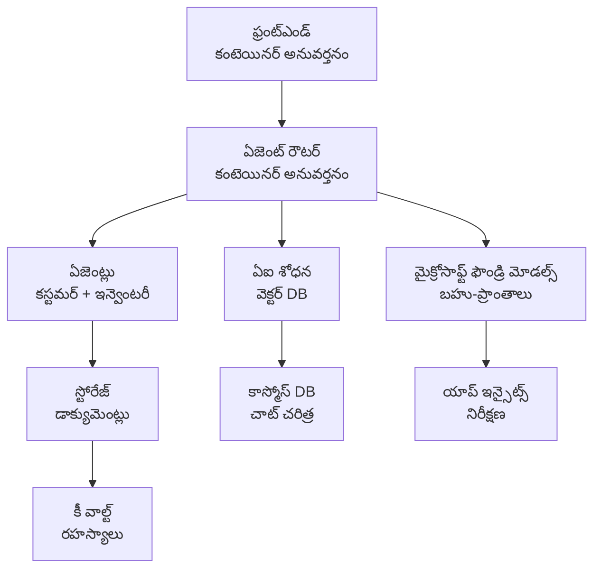

# రిటైల్ మల్టీ-ఏజెంట్ సొల్యూషన్ - ఇన్‌ఫ్రాస్ట్రక్చర్ టెంప్లేట్

**అధ్యాయ 5: ఉత్పత్తి డిప్లాయ్‌మెంట్ ప్యాకేజ్**
- **📚 కోర్స్ హోమ్**: [AZD For Beginners](../../README.md)
- **📖 సంబంధిత అధ్యాయం**: [అధ్యాయ 5: మల్టీ-ఏజెంట్ AI పరిష్కారాలు](../../README.md#-chapter-5-multi-agent-ai-solutions-advanced)
- **📝 సన్నివేశ మార్గదర్శి**: [సంపూర్ణ ఆర్కిటెక్చర్](../retail-scenario.md)
- **🎯 తక్షణ డిప్లాయ్**: [ఒక-క్లిక్ డిప్లాయ్](#-quick-deployment)

> **⚠️ ఇది కేవలం ఇన్‌ఫ్రాస్ట్రక్చర్ టెంప్లేట్ మాత్రమే**  
> ఈ ARM టెంప్లేట్ multi-agent సిస్టమ్‌ కోసం **Azure وسائل** ను డిప్లాయ్ చేస్తుంది.  
>  
> **ఏం డిప్లాయ్ అవుతుంది (15-25 నిమిషాలు):**
> - ✅ Microsoft Foundry Models (gpt-4.1, gpt-4.1-mini, embeddings మూడు రీజియన్లలో)
> - ✅ AI Search సేవ (ఖాళీ, సూచిక సృష్టించడానికి సిద్ధంగా)
> - ✅ Container Apps (placeholder images, మీ కోడ్ కోసం సిద్ధంగా)
> - ✅ Storage, Cosmos DB, Key Vault, Application Insights
>  
> **ఏం చేర్చబడలేదు (డెవలప్‌మెంట్ అవసరం):**
> - ❌ ఏజెంట్ అమలు కోడ్ (Customer Agent, Inventory Agent)
> - ❌ రౌటింగ్ లాజిక్ మరియు API ఎండ్పాయింట్స్
> - ❌ ఫ్రంట్‌ఎండ్ చాట్ UI
> - ❌ సెర్చ్ సూచిక స్కీమాలు మరియు డేటా పైప్‌లైన్స్
> - ❌ **అంచనా చేసిన డెవలప్‌మెంట్ శ్రమ: 80-120 గంటలు**
>  
> **ఈ టెంప్లేట్ ఉపయోగించండి यदि:**
> - ✅ మీరు multi-agent ప్రాజెక్ట్ కోసం Azure ఇన్‌ఫ్రాస్ట్రక్చర్‌ను provision చేయదలచుకుంటున్నారా
> - ✅ మీరు ఏజెంట్ అమలు వేరుగా అభివృద్ధి చేయాలని భావిస్తున్నారు
> - ✅ మీరు production-ready ఇన్‌ఫ్రాస్ట్రక్చర్ బేస్‌లైన్ అవసరం
>  
> **ఉపయోగించకండి अगर:**
> - ❌ మీరు తక్షణం పని చేసే multi-agent డెమో అనుకుంటున్నార
> - ❌ మీరు పూర్తి అప్లికేషన్ కోడ్ ఉదాహరణలు కోరుతున్నార

## అవలోకనం

ఈ డైరెక్టరీ multi-agent కస్టమర్ సపోర్ట్ సిస్టమ్ కోసం ఇన్‌ఫ్రాస్ట్రక్చర్ ఫౌండేషన్ ని డిప్లాయ్ చేయడానికి సమగ్ర Azure Resource Manager (ARM) టెంప్లేట్ ను కలిగి ఉంది. టెంప్లేట్ అవసరమైన అన్ని Azure సేవలను ప్రోవిజన్ చేస్తుంది, సరైన గా కాన్ఫిగర్ చేసి పరస్పరం కనెక్ట్ చేస్తుంది, మీ అప్లికేషన్ అభివృద్ధి కోసం సిద్ధంగా ఉంటుంది.

**డిప్లాయ్‌మెంట్ తర్వాత, మీ వద్ద ఉంటుంది:** ఉత్పత్తి-సిద్ధమైన Azure ఇన్‌ఫ్రాస్ట్రక్చర్  
**సిస్టమ్‌ను పూర్తి చేయడానికి మీకు అవసరం:** ఏజెంట్ కోడ్, ఫ్రంట్‌ఎండ్ UI, మరియు డేటా కాన్ఫిగరేషన్ (చూడండి [Architecture Guide](../retail-scenario.md))

## 🎯 ఏమి డిప్లాయ్ అవుతుంది

### కోర్ ఇన్‌ఫ్రాస్ట్రక్చర్ (డిప్లాయ్ తర్వాత స్థితి)

✅ **Microsoft Foundry Models సేవలు** (API కాల్స్ కోసం సిద్ధం)
  - ప్రైమరీ రీజియన్: gpt-4.1 deployment (20K TPM సామర్థ్యం)
  - సెకండరీ రీజియన్: gpt-4.1-mini deployment (10K TPM సామర్థ్యం)
  - టెర్షరీ రీజియన్: Text embeddings model (30K TPM సామర్థ్యం)
  - ఎవాల్యూషన్ రీజియన్: gpt-4.1 grader model (15K TPM సామర్థ్యం)
  - **స్థితి:** పూర్తి విధంగా పనిచేస్తుంది - తక్షణమే API కాల్స్ చేయవచ్చు

✅ **Azure AI Search** (ఖాళీ - కాన్ఫిగరేషన్ కోసం సిద్ధం)
  - వెక్టర్ సెర్చ్ సామర్థ్యం ఎనేబుల్ చేయబడింది
  - స్టాండర్డ్ టియర్ 1 partition, 1 replica తో
  - **స్థితి:** సేవ రన్నింగ్‌లో ఉంది, కాని సూచిక సృష్టి అవసరం
  - **చర్య అవసరం:** మీ స్కీమాతో సెర్చ్ సూచిక సృష్టించండి

✅ **Azure Storage Account** (ఖాళీ - అప్‌లోడ్స్ కోసం సిద్ధం)
  - Blob కంటైనర్లు: `documents`, `uploads`
  - సురక్షిత కాన్ఫిగరేషన్ (HTTPS-only, పబ్లిక్ యాక్సెస్ లేదు)
  - **స్థితి:** ఫైళ్లను స్వీకరించడానికి సిద్ధంగా ఉంది
  - **చర్య అవసరం:** మీ ఉత్పత్తి డేటా మరియు డాక్యుమెంట్లు అప్‌లోడ్ చేయండి

⚠️ **Container Apps Environment** (ప్లేస్‌హోల్డర్ ఇమేజ్‌లు డిప్లాయ్ చేయబడ్డాయి)
  - ఏజెంట్ రౌటర్ ఆప్ (nginx డిఫాల్ట్ ఇమేజ్)
  - ఫ్రంట్‌ఎండ్ ఆప్ (nginx డిఫాల్ట్ ఇమేజ్)
  - ఆటో-స్కేలింగ్ కాన్ఫిగర్డ్ (0-10 ఇన్స్టాన్స్)
  - **స్థితి:** ప్లేస్‌హోల్డర్ కంటైనర్లు రన్ అవుతున్నాయి
  - **చర్య అవసరం:** మీ ఏజెంట్ అప్లికేషన్లు బిల్డ్ చేసి డిప్లాయ్ చేయండి

✅ **Azure Cosmos DB** (ఖాళీ - డేటా కోసం సిద్ధం)
  - డాటాబేస్ మరియు కంటైనర్ ప్రీ-కాన్ఫిగర్ చేయబడ్డాయి
  - లో-లేటెన్సీ ఆపరేషన్ల కోసం ఆప్టిమైజ్ చేయబడ్డది
  - TTL ఎనేబుల్ చేయబడ్డది ఆటోమేటిక్ క్లీనప్ కోసం
  - **స్థితి:** చాట్ హిస్టరీ నిలిపేయడానికి సిద్ధంగా ఉంది

✅ **Azure Key Vault** (ఐచ్ఛిక - సీక్రెట్స్ కోసం సిద్ధం)
  - Soft delete ఎనేబుల్ చేయబడింది
  - RBAC మేనేజ్ చేయబడిన identities కోసం కాన్ఫిగర్ చేయబడింది
  - **స్థితి:** API కీస్ మరియు కనెక్షన్ స్ట్రింగ్స్ నిల్వ చేయడానికి సిద్ధంగా ఉంది

✅ **Application Insights** (ఐచ్ఛిక - మానిటరింగ్ సక్రియం)
  - Log Analytics వర్క్‌స్పేస్‌కు కనెక్ట్ చేయబడింది
  - కస్టమ్ metrics మరియు అలర్ట్స్ కాన్ఫిగర్ చేయబడ్డాయి
  - **స్థితి:** మీ యాప్స్ నుంచి టెలిమెట్రీ స్వీకరించడానికి సిద్ధంగా ఉంది

✅ **Document Intelligence** (API కాల్స్ కోసం సిద్ధం)
  - ఉత్పత్తి వర్క్‌లోడ్స్ కోసం S0 టియర్
  - **స్థితి:** అప్‌లోడ్ చేయబడిన డాక్యుమెంట్లను ప్రాసెస్ చేయడానికి సిద్ధంగా ఉంది

✅ **Bing Search API** (API కాల్స్ కోసం సిద్ధం)
  - రియల్-టైమ్ సెర్చ్ కోసం S1 టియర్
  - **స్థితి:** వెబ్ సెర్చ్ ప్రశ్నలకు సిద్ధంగా ఉంది

### డిప్లాయ్‌మెంట్ మోడ్స్

| Mode | OpenAI Capacity | Container Instances | Search Tier | Storage Redundancy | Best For |
|------|-----------------|---------------------|-------------|-------------------|----------|
| **సామాన్యమైన (Minimal)** | 10K-20K TPM | 0-2 replicas | Basic | LRS (Local) | డెవ్/టెస్ట్, అభ్యాసం, ప్రూఫ్-ఆఫ్-కాన్సెప్టు |
| **స్టాండర్డ్ (Standard)** | 30K-60K TPM | 2-5 replicas | Standard | ZRS (Zone) | ఉత్పత్తి, మోస్తరు ట్రాఫిక్ (<10K యూజర్లు) |
| **ప్రీమియం (Premium)** | 80K-150K TPM | 5-10 replicas, zone-redundant | Premium | GRS (Geo) | ఎంటర్ప్రైజ్, హై ట్రాఫిక్ (>10K యూజర్లు), 99.99% SLA |

**ఖర్చు ప్రభావం:**
- **Minimal → Standard:** సుమారు 4x ఖర్చు పెరుగుతుంది ($100-370/mo → $420-1,450/mo)
- **Standard → Premium:** సుమారు 3x ఖర్చు పెరుగుతుంది ($420-1,450/mo → $1,150-3,500/mo)
- **ఎంచుకోవడానికి ఆధారంగా:** అంచనా వేసిన లోడ్, SLA అవసరాలు, బడ్జెట్ పరిమితులు

**సామర్థ్య ప్లానింగ్:**
- **TPM (Tokens Per Minute):** అన్ని మోడల్ డిప్లాయ్‌మెంట్ల ఎక్కడికి మొత్తం
- **Container Instances:** ఆటో-స్కేలింగ్ పరిధి (min-max రిప్లికాస్)
- **Search Tier:** క్వెరీ పనితనం మరియు సూచిక పరిమాణ పరిమితులపై ప్రభావం

## 📋 మున్ముందు అవసరాలు

### అవసరమైన టూల్స్
1. **Azure CLI** (సంస్కరణ 2.50.0 లేదా అంతకంటే ఎక్కువ)
   ```bash
   az --version  # సంస్కరణను తనిఖీ చేయండి
   az login      # ప్రామాణీకరించండి
   ```

2. **సక్రియ Azure subscription** Owner లేదా Contributor అందుమార్గం
   ```bash
   az account show  # సబ్‌స్క్రిప్షన్‌ను ధృవీకరించండి
   ```

### అవసరమైన Azure కోటాలు

డిప్లాయ్‌మెంట్ నుంచి ముందు, మీ టార్గెట్ రీజియన్లలో సరిపడా కోటాలు ఉన్నాయో లేదో తనిఖీ చేయండి:

```bash
# మీ ప్రాంతంలో Microsoft Foundry మోడల్స్ లభ్యతను తనిఖీ చేయండి
az cognitiveservices account list-skus \
  --kind OpenAI \
  --location eastus2

# OpenAI క్వోటాను నిర్ధారించండి (gpt-4.1 కోసం ఉదాహరణ)
az cognitiveservices usage list \
  --location eastus2 \
  --query "[?name.value=='OpenAI.Standard.gpt-4.1']"

# Container Apps క్వోటాను తనిఖీ చేయండి
az provider show \
  --namespace Microsoft.App \
  --query "resourceTypes[?resourceType=='managedEnvironments'].locations"
```

**కనీస అవసరమైన కోటాలు:**
- **Microsoft Foundry Models:** రీజియన్లలో 3-4 మోడల్ డిప్లాయ్‌మెంట్లు
  - gpt-4.1: 20K TPM (Tokens Per Minute)
  - gpt-4.1-mini: 10K TPM
  - text-embedding-ada-002: 30K TPM
  - **గమనిక:** gpt-4.1 కొన్నిసార్లు కొన్ని రీజియన్లలో వేట్‌లిస్ట్లో ఉండవచ్చు - [model availability](https://learn.microsoft.com/azure/ai-services/openai/concepts/models) చూడండి
- **Container Apps:** Managed environment + 2-10 కంటైనర్ ఇన్స్టాన్సులు
- **AI Search:** స్టాండర్డ్ టియర్ (వెక్టర్ సెర్చ్ కోసం Basic పర്യാപ্তం కాదు)
- **Cosmos DB:** స్టాండర్డ్ ప్రొవిజన్‌డ్ థ్రుపుట్

**కోట్ పరిమితం సరిపడకపోతే:**
1. Azure పోర్టల్ కి పోయి → Quotas → Request increase
2. లేదా Azure CLI ఉపయోగించండి:
   ```bash
   az support tickets create \
     --ticket-name "OpenAI-Quota-Increase" \
     --severity "minimal" \
     --description "Request quota increase for Microsoft Foundry Models gpt-4.1 in eastus2"
   ```
3. అందుబాటులో ఉన్న ప్రత్యామ్నాయ రీజియన్లను పరిగణించండి

## 🚀 తక్షణ డిప్లాయ్

### ఎంపిక 1: Azure CLI ఉపయోగించడం

```bash
# టెంప్లేట్ ఫైళ్లను క్లోన్ చేయండి లేదా డౌన్లోడ్ చేయండి
git clone <repository-url>
cd examples/retail-multiagent-arm-template

# డిప్లాయ్‌మెంట్ స్క్రిప్ట్‌ను ఎగ్జిక్యూటబుల్‌గా చేయండి
chmod +x deploy.sh

# డిఫాల్ట్ సెట్టింగులతో డిప్లాయ్ చేయండి
./deploy.sh -g myResourceGroup

# ప్రొడక్షన్ కోసం ప్రీమియం ఫీచర్లతో డిప్లాయ్ చేయండి
./deploy.sh -g myProdRG -e prod -m premium -l eastus2
```

### ఎంపిక 2: Azure పోర్టల్ ఉపయోగించడం

[](https://portal.azure.com/#create/Microsoft.Template/uri/https%3A%2F%2Fraw.githubusercontent.com%2Fmicrosoft%2Fazd-for-beginners%2Fmain%2Fexamples%2Fretail-multiagent-arm-template%2Fazuredeploy.json)

### ఎంపిక 3: Azure CLI నేరుగా ఉపయోగించడం

```bash
# వనరుల సమూహాన్ని సృష్టించండి
az group create --name myResourceGroup --location eastus2

# టెంప్లేట్‌ను అమలు చేయండి
az deployment group create \
  --resource-group myResourceGroup \
  --template-file azuredeploy.json \
  --parameters azuredeploy.parameters.json
```

## ⏱️ డిప్లాయ్‌మెంట్ టైమ్‌లైన్

### ఏమి ఆశించాలి

| Phase | Duration | What Happens |
|-------|----------|--------------||
| **Template Validation** | 30-60 seconds | Azure మోడెల్ టెంప్లేట్ సింటాక్స్ మరియు ప్యారామీటర్స్ ని vali데이트 చేస్తుంది |
| **Resource Group Setup** | 10-20 seconds | రిసోర్స్ గ్రూప్ రూపొందిస్తుంది (అవశ్యమైనట్లయితే) |
| **OpenAI Provisioning** | 5-8 minutes | 3-4 OpenAI అకౌంట్లు సృష్టించి మోడల్స్ ను డిప్లాయ్ చేస్తుంది |
| **Container Apps** | 3-5 minutes | ఎన్‌విరాన్‌మెంట్ సృష్టించి ప్లేస్‌హోల్డర్ కంటైనర్లను డిప్లాయ్ చేస్తుంది |
| **Search & Storage** | 2-4 minutes | AI Search సర్వీస్ మరియు స్టోరేజ్ అకౌంట్లను ప్రోవిజన్ చేస్తుంది |
| **Cosmos DB** | 2-3 minutes | డాటాబేస్ సృష్టించి కంటైనర్లు కాన్ఫిగర్ చేస్తుంది |
| **Monitoring Setup** | 2-3 minutes | Application Insights మరియు Log Analytics ను సెట్ చేస్తుంది |
| **RBAC Configuration** | 1-2 minutes | మేనేజ్ చేయబడిన identities మరియు परमిషన్స్ ను కాన్ఫిగర్ చేస్తుంది |
| **Total Deployment** | **15-25 minutes** | పూర్తి ఇన్‌ఫ్రాస్ట్రక్చర్ సిద్ధం |

**డిప్లాయ్‌మెంట్ తర్వాత:**
- ✅ **ఇన్‌ఫ్రాస్ట్రక్చర్ సిద్ధం:** అన్ని Azure సేవలు ప్రోవిజన్ చేయబడ్డాయి మరియు రన్నింగ్‌లో ఉన్నాయి
- ⏱️ **అప్లికేషన్ అభివృద్ధి:** 80-120 గంటలు (మీ బాధ్యత)
- ⏱️ **సూచిక కాన్ఫిగరేషన్:** 15-30 నిమిషాలు (మీ స్కీమా అవసరం)
- ⏱️ **డేటా అప్‌లోడ్:** డేటాసెట్ పరిమాణంపై ఆధారపడుతుంది
- ⏱️ **టెస్టింగ్ & వాలిడేషన్:** 2-4 గంటలు

---

## ✅ డిప్లాయ్‌మెంట్ విజయాన్ని ధృవీకరించండి

### దశ 1: రిసోర్స్ ప్రోవిజనింగ్ తనిఖీ చేయండి (2 నిమిషాలు)

```bash
# అన్ని వనరులు విజయవంతంగా అమర్చబడ్డాయో నిర్ధారించండి
az resource list \
  --resource-group myResourceGroup \
  --query "[?provisioningState!='Succeeded'].{Name:name, Status:provisioningState, Type:type}" \
  --output table
```

**అంచనా:** ఖాళీ పట్టిక (అన్ని రిసోర్సులు "Succeeded" స్థితి చూపిస్తాయి)

### దశ 2: Microsoft Foundry Models డిప్లాయ్‌మెంట్‌లను ధృవీకరించండి (3 నిమిషాలు)

```bash
# అన్ని OpenAI ఖాతాలను జాబితా చేయండి
az cognitiveservices account list \
  --resource-group myResourceGroup \
  --query "[?kind=='OpenAI'].{Name:name, Location:location, Status:properties.provisioningState}" \
  --output table

# ప్రధాన ప్రాంతానికి మోడల్ డిప్లాయ్‌మెంట్లను తనిఖీ చేయండి
OPENAI_NAME=$(az cognitiveservices account list \
  --resource-group myResourceGroup \
  --query "[?kind=='OpenAI'] | [0].name" -o tsv)

az cognitiveservices account deployment list \
  --name $OPENAI_NAME \
  --resource-group myResourceGroup \
  --output table
```

**అంచనా:** 
- 3-4 OpenAI అకౌంట్లు (ప్రైమరీ, సెకండరీ, టెర్షరీ, ఎవాల్యూషన్ రీజియన్లు)
- ప్రతి అకౌంటుకు 1-2 మోడల్ డిప్లాయ్‌మెంట్లు (gpt-4.1, gpt-4.1-mini, text-embedding-ada-002)

### దశ 3: ఇన్‌ఫ్రాస్ట్రక్చర్ ఎండ్పాయింట్స్ ను టెస్ట్ చేయండి (5 నిమిషాలు)

```bash
# కంటైనర్ యాప్ URLలను పొందండి
az containerapp list \
  --resource-group myResourceGroup \
  --query "[].{Name:name, URL:properties.configuration.ingress.fqdn, Status:properties.runningStatus}" \
  --output table

# రౌటర్ ఎండ్‌పాయింట్‌ను పరీక్షించండి (ప్లేస్‌హోల్డర్ చిత్రం స్పందిస్తుంది)
ROUTER_URL=$(az containerapp show \
  --name retail-router \
  --resource-group myResourceGroup \
  --query "properties.configuration.ingress.fqdn" -o tsv)

echo "Testing: https://$ROUTER_URL"
curl -I https://$ROUTER_URL || echo "Container running (placeholder image - expected)"
```

**అంచనా:** 
- Container Apps "Running" స్థితి చూపిస్తాయి
- ప్లేస్‌హోల్డర్ nginx HTTP 200 లేదా 404తో ప్రతిస్పందిస్తుంది (ఇంకా అప్లికేషన్ కోడ్ లేదు)

### దశ 4: Microsoft Foundry Models API యాక్సెస్ ధృవీకరించండి (3 నిమిషాలు)

```bash
# OpenAI ఎండ్‌పాయింట్ మరియు కీని పొందండి
OPENAI_ENDPOINT=$(az cognitiveservices account show \
  --name $OPENAI_NAME \
  --resource-group myResourceGroup \
  --query "properties.endpoint" -o tsv)

OPENAI_KEY=$(az cognitiveservices account keys list \
  --name $OPENAI_NAME \
  --resource-group myResourceGroup \
  --query "key1" -o tsv)

# gpt-4.1 డిప్లాయ్‌మెంట్‌ను పరీక్షించండి
curl "${OPENAI_ENDPOINT}openai/deployments/gpt-4.1/chat/completions?api-version=2024-08-01-preview" \
  -H "Content-Type: application/json" \
  -H "api-key: $OPENAI_KEY" \
  -d '{
    "messages": [{"role": "user", "content": "Say hello"}],
    "max_tokens": 10
  }'
```

**అంచనా:** JSON రెస్పాన్స్ తో చాట్ కంప్లీషన్ (OpenAI పనిచేస్తుందని నిర్ధారిస్తుంది)

### ఏమి పనిచేస్తోంది vs ఏమి పనిచేయడం లేదు

**✅ పర్యవేక్షణ తర్వాత పనిచేస్తున్నవి:**
- Microsoft Foundry Models మోడల్స్ డిప్లాయ్ అయ్యి API కాల్స్ అంగీకరిస్తున్నవి
- AI Search సేవ రన్నింగ్‌లో ఉంది (ఖాళీ, ఇంకా సూచికలు లేవు)
- Container Apps రన్నింగ్‌లో ఉన్నాయి (ప్లేస్‌హోల్డర్ nginx images)
- స్టోరేజ్ అకౌంట్లు యాక్సెసిబుల్ మరియు అప్‌లోడ్స్ కోసం సిద్ధంగా ఉన్నాయి
- Cosmos DB డేటా ఆపరేషన్ల కోసం సిద్ధంగా ఉంది
- Application Insights ఇన్‌ఫ్రాస్ట్రక్చర్ టెలిమెట్రీ సేకరిస్తోంది
- Key Vault సీక్రెట్ నిల్వ కోసం సిద్ధంగా ఉంది

**❌ ఇంకా పని చేస్తున్నవి కాదు (డెవలప్‌మెంట్ అవసరం):**
- ఏజెంట్ ఎండ్పాయింట్లు (ఏప్లికేషన్ కోడ్ డిప్లాయ్ చేయబట్టలేదు)
- చాట్ ఫంక్షనాలిటీ (ఫ్రంట్‌ఎండ్ + బ్యాక్‌ఎండ్ అమలు అవసరం)
- సెర్చ్ ప్రశ్నలు (సూచిక సృష్టించబడలేదు)
- డాక్యుమెంట్ ప్రాసెసింగ్ పైప్‌లైన్ (డేటా అప్‌లోడ్ చేయబడలేదు)
- కస్టమ్ టెలిమెట్రీ (యాప్లికేషన్ ఇన్స్‌స్ట్రుమెంటేషన్ అవసరం)

**తరువాతి దశలు:** మీ అప్లికేషన్ అభివృద్ధి మరియు డిప్లాయ్ చేయడానికి [Post-Deployment Configuration](#-post-deployment-next-steps) చూడండి

---

## ⚙️ కాన్ఫిగరేషన్ ఎంపికలు

### టెంప్లేట్ ప్యారామీటర్‌లు

| Parameter | Type | Default | Description |
|-----------|------|---------|-------------|
| `projectName` | string | "retail" | అన్ని రిసోర్స్ నామాలకు prefix |
| `location` | string | Resource group location | ప్రాథమిక డిప్లాయ్ రీజియన్ |
| `secondaryLocation` | string | "westus2" | మల్టీ-రిజియన్ డిప్లాయిమెంట్ కోసం సెకండరీ రీజియన్ |
| `tertiaryLocation` | string | "francecentral" | embeddings మోడల్ కోసం రీజియన్ |
| `environmentName` | string | "dev" | ఎన్విరాన్‌మెంట్ డిజిగ్నేషన్ (dev/staging/prod) |
| `deploymentMode` | string | "standard" | డిప్లాయ్ కాన్ఫిగరేషన్ (minimal/standard/premium) |
| `enableMultiRegion` | bool | true | మల్టీ-రిజియన్ డిప్లాయ్‌మెంట్ ఎనేబుల్ చేయండి |
| `enableMonitoring` | bool | true | Application Insights మరియు లాగింగ్ ఎనేబుల్ చేయండి |
| `enableSecurity` | bool | true | Key Vault మరియు పెంచిన సెక్యూరిటీని ఎనేబుల్ చేయండి |

### ప్యారామీటర్లను కస్టమైజ్ చేయడం

Edit `azuredeploy.parameters.json`:

```json
{
  "$schema": "https://schema.management.azure.com/schemas/2019-04-01/deploymentParameters.json#",
  "contentVersion": "1.0.0.0",
  "parameters": {
    "projectName": {
      "value": "mycompany"
    },
    "environmentName": {
      "value": "prod"
    },
    "deploymentMode": {
      "value": "premium"
    },
    "location": {
      "value": "eastus2"
    }
  }
}
```

## 🏗️ ఆర్కిటెక్చర్ అవలోకనం


## 📖 డిప్లాయ్‌మెంట్ స్క్రిప్ట్ వినియోగం

`deploy.sh` స్క్రిప్ట్ ఒక ఇంటరాక్టివ్ డిప్లాయ్‌మెంట్ అనుభవాన్ని అందిస్తుంది:

```bash
# సహాయం చూపించు
./deploy.sh --help

# ప్రాథమిక అమలు
./deploy.sh -g myResourceGroup

# అనుకూల సెట్టింగులతో అధునాతన అమలు
./deploy.sh \
  -g myProductionRG \
  -p companyname \
  -e prod \
  -m premium \
  -l eastus2

# బహుళ ప్రాంతాలు లేకుండా అభివృద్ధి అమలు
./deploy.sh \
  -g myDevRG \
  -e dev \
  -m minimal \
  --no-multi-region \
  --no-security
```

### స్క్రిప్ట్ ఫీచర్లు

- ✅ **Prerequisites validation** (Azure CLI, login స్థితి, టెంప్లేట్ ఫైళ్లను తనిఖీ)
- ✅ **Resource group management** (లేవచ్చు అంటే సృష్టిస్తుంది)
- ✅ **Template validation** డిప్లాయ్‌మెంట్ ముందు
- ✅ **ప్రోగ్రస్ మానిటరింగ్** రంగులౌట్‌పుట్ తో
- ✅ **డిప్లాయ్‌మెంట్ అవుట్పుట్స్** డిస్ప్లే చేస్తుంది
- ✅ **పోస్ట్-డిప్లాయ్‌మెంట్ మార్గదర్శనం**

## 📊 డిప్లాయ్‌మెంట్ పర్యవేక్షణ

### డిప్లాయ్‌మెంట్ స్థితిని తనిఖీ చేయండి

```bash
# డిప్లాయ్‌మెంట్‌లను జాబితా చేయండి
az deployment group list --resource-group myResourceGroup --output table

# డిప్లాయ్‌మెంట్ వివరాలను పొందండి
az deployment group show \
  --resource-group myResourceGroup \
  --name retail-deployment-YYYYMMDD-HHMMSS

# డిప్లాయ్‌మెంట్ పురోగతిని వీక్షించండి
az deployment group create \
  --resource-group myResourceGroup \
  --template-file azuredeploy.json \
  --parameters azuredeploy.parameters.json \
  --verbose
```

### డిప్లాయ్‌మెంట్ అవుట్పుట్స్

విజయవంతంగా డిప్లాయ్ అయిన తర్వాత, క్రింది అవుట్పుట్స్ అందుబాటులో ఉంటాయి:

- **Frontend URL**: వెబ్ ఇంటర్ఫేస్ కోసం పబ్లిక్ ఎండ్పాయింట్
- **Router URL**: ఏజెంట్ రౌటర్ కోసం API ఎండ్పాయింట్
- **OpenAI Endpoints**: ప్రైమరీ మరియు సెకండరీ OpenAI సేవ ఎండ్పాయింట్స్
- **Search Service**: Azure AI Search సేవ ఎండ్పాయింట్
- **Storage Account**: డాక్యుమెంట్ల కోసం స్టోరేజ్ అకౌంట్ పేరు
- **Key Vault**: Key Vault పేరు (ఎనేబుల్ చేసినట్లయితే)
- **Application Insights**: మానిటరింగ్ సేవ పేరు (ఎనేబుల్ చేసినట్లయితే)

## 🔧 పోస్ట్-డిప్లాయ్‌మెంట్: తర్వాతి దశలు
> **📝 ముఖ్యము:** మౌలిక వసతులు డిప్లాయ్ చేయబడ్డాయి, కానీ మీరు అప్లికేషన్ కోడ్‌ను అభివృద్ధి చేసి డిప్లాయ్ చేయాలి.

### దశ 1: ఏజెంట్ అప్లికేషన్‌లను అభివృద్ధి చేయండి (మీ బాధ్యత)

The ARM template creates **ఖాళీ Container Apps** with placeholder nginx images. మీరు చేయాలి:

**Required Development:**
1. **ఏజెంట్ అమలుపరచడం** (30-40 గంటలు)
   - కస్టమర్ సేవ ఏజెంట్ gpt-4.1 ఇంటిగ్రేషన్ తో
   - ఇన్వెంటరీ ఏజెంట్ gpt-4.1-mini ఇంటిగ్రేషన్ తో
   - ఏజెంట్ రూటింగ్ లాజిక్

2. **ఫ్రంట్‌ఎండ్ అభివృద్ధి** (20-30 గంటలు)
   - చాట్ ఇంటర్‌ఫేస్ UI (React/Vue/Angular)
   - ఫైల్ అప్లోడ్ ఫంక్షనాలిటీ
   - రిస్పాన్స్ రెండరింగ్ మరియు ఫార్మాటింగ్

3. **బ్యాకెండ్ సేవలు** (12-16 గంటలు)
   - FastAPI లేదా Express రౌటర్
   - ప్రామాణికరణ మిడిల్వేర్
   - టెలిమెట్రీ ఇంటిగ్రేషన్

చూసే: [ఆర్కిటెక్చర్ గైడ్](../retail-scenario.md) వివరణాత్మక అమలు సరళీలు మరియు కోడ్ ఉదాహరణల కోసం

### దశ 2: AI సర్చ్ ఇండెక్స్‌ను కాన్ఫిగర్ చేయండి (15-30 నిమిషాలు)

మీ డేటా నమూనాకు సరిపోయే ఒక సర్చ్ ఇండెక్స్‌ని సృష్టించండి:

```bash
# శోధన సేవ వివరాలు పొందండి
SEARCH_NAME=$(az search service list \
  --resource-group myResourceGroup \
  --query "[0].name" -o tsv)

SEARCH_KEY=$(az search admin-key show \
  --service-name $SEARCH_NAME \
  --resource-group myResourceGroup \
  --query "primaryKey" -o tsv)

# మీ స్కీమాతో సూచికను సృష్టించండి (ఉదాహరణ)
curl -X POST "https://${SEARCH_NAME}.search.windows.net/indexes?api-version=2023-11-01" \
  -H "Content-Type: application/json" \
  -H "api-key: ${SEARCH_KEY}" \
  -d '{
    "name": "products",
    "fields": [
      {"name": "id", "type": "Edm.String", "key": true},
      {"name": "title", "type": "Edm.String", "searchable": true},
      {"name": "content", "type": "Edm.String", "searchable": true},
      {"name": "category", "type": "Edm.String", "filterable": true},
      {"name": "content_vector", "type": "Collection(Edm.Single)", 
       "searchable": true, "dimensions": 1536, "vectorSearchProfile": "default"}
    ],
    "vectorSearch": {
      "algorithms": [{"name": "default", "kind": "hnsw"}],
      "profiles": [{"name": "default", "algorithm": "default"}]
    }
  }'
```

**వనరులు:**
- [AI Search ఇండెక్స్ స్కీమా డిజైన్](https://learn.microsoft.com/azure/search/search-what-is-an-index)
- [వెక్టర్ సెర్చ్ కాన్ఫిగరేషన్](https://learn.microsoft.com/azure/search/vector-search-how-to-create-index)

### దశ 3: మీ డేటాను అప్లోడ్ చేయండి (సమయం మారుతుంది)

మీకు ఉత్పత్తి డేటా మరియు డాక్యుమెంట్లు ఉన్న తరువాత:

```bash
# స్టోరేజ్ ఖాతా వివరాలు పొందండి
STORAGE_NAME=$(az storage account list \
  --resource-group myResourceGroup \
  --query "[0].name" -o tsv)

STORAGE_KEY=$(az storage account keys list \
  --account-name $STORAGE_NAME \
  --resource-group myResourceGroup \
  --query "[0].value" -o tsv)

# మీ డాక్యుమెంట్లు అప్లోడ్ చేయండి
az storage blob upload-batch \
  --destination documents \
  --source /path/to/your/product/docs \
  --account-name $STORAGE_NAME \
  --account-key $STORAGE_KEY

# ఉదాహరణ: ఒకే ఫైల్‌ను అప్లోడ్ చేయండి
az storage blob upload \
  --container-name documents \
  --name "product-manual.pdf" \
  --file /path/to/product-manual.pdf \
  --account-name $STORAGE_NAME \
  --account-key $STORAGE_KEY
```

### దశ 4: మీ అప్లికేషన్‌లను నిర్మించి డిప్లాయ్ చేయండి (8-12 గంటలు)

మీరు మీ ఏజెంట్ కోడ్‌ను అభివృద్ధి చేసిన తరువాత:

```bash
# 1. Azure Container Registryని సృష్టించండి (అవసరమైతే)
az acr create \
  --name myregistry \
  --resource-group myResourceGroup \
  --sku Basic

# 2. ఏజెంట్ రౌటర్ ఇమేజ్‌ను నిర్మించి పుష్ చేయండి
docker build -t myregistry.azurecr.io/agent-router:v1 /path/to/your/router/code
az acr login --name myregistry
docker push myregistry.azurecr.io/agent-router:v1

# 3. ఫ్రంట్‌ఎండ్ ఇమేజ్‌ను నిర్మించి పుష్ చేయండి
docker build -t myregistry.azurecr.io/frontend:v1 /path/to/your/frontend/code
docker push myregistry.azurecr.io/frontend:v1

# 4. మీ ఇమేజ్‌లతో Container Appsను అప్డేట్ చేయండి
az containerapp update \
  --name retail-router \
  --resource-group myResourceGroup \
  --image myregistry.azurecr.io/agent-router:v1

az containerapp update \
  --name retail-frontend \
  --resource-group myResourceGroup \
  --image myregistry.azurecr.io/frontend:v1

# 5. పర్యావరణ వేరియబుల్స్‌ను కాన్ఫిగర్ చేయండి
az containerapp update \
  --name retail-router \
  --resource-group myResourceGroup \
  --set-env-vars \
    OPENAI_ENDPOINT=secretref:openai-endpoint \
    OPENAI_KEY=secretref:openai-key \
    SEARCH_ENDPOINT=secretref:search-endpoint \
    SEARCH_KEY=secretref:search-key
```

### దశ 5: మీ అప్లికేషన్‌ను పరీక్షించండి (2-4 గంటలు)

```bash
# మీ అప్లికేషన్ URL పొందండి
ROUTER_URL=$(az containerapp show \
  --name retail-router \
  --resource-group myResourceGroup \
  --query "properties.configuration.ingress.fqdn" -o tsv)

# ఏజెంట్ ఎండ్‌పాయింట్‌ను పరీక్షించండి (మీ కోడ్ అమర్చిన తర్వాత)
curl -X POST "https://${ROUTER_URL}/chat" \
  -H "Content-Type: application/json" \
  -d '{
    "message": "Hello, I need help with my order",
    "agent": "customer"
  }'

# అప్లికేషన్ లాగ్‌లను తనిఖీ చేయండి
az containerapp logs show \
  --name retail-router \
  --resource-group myResourceGroup \
  --follow
```

### అమలు వనరులు

**ఆర్కిటెక్చర్ & డిజైన్:**
- 📖 [పూర్తి ఆర్కిటెక్చర్ గైడ్](../retail-scenario.md) - వివరణాత్మక అమలు సరళీలు
- 📖 [బహు-ఏజెంట్ డిజైన్ నమూనాలు](https://learn.microsoft.com/azure/architecture/ai-ml/guide/multi-agent-systems)

**కోడ్ ఉదాహరణలు:**
- 🔗 [Microsoft Foundry Models Chat Sample](https://github.com/Azure-Samples/azure-search-openai-demo) - RAG ప్యాటర్న్
- 🔗 [Semantic Kernel](https://github.com/microsoft/semantic-kernel) - ఏజెంట్ ఫ్రేమ్‌వర్క్ (C#)
- 🔗 [LangChain Azure](https://github.com/langchain-ai/langchain) - ఏజెంట్ ఆర్కెస్ట్రేషన్ (Python)
- 🔗 [AutoGen](https://github.com/microsoft/autogen) - బహుళ ఏజెంట్ సంభాషణలు

**అంచనా మొత్తం శ్రమ:**
- Infrastructure deployment: 15-25 minutes (✅ పూర్తి)
- Application development: 80-120 hours (🔨 మీ పని)
- Testing and optimization: 15-25 hours (🔨 మీ పని)

## 🛠️ సమస్య పరిష్కారం

### సాధారణ సమస్యలు

#### 1. Microsoft Foundry Models కోటా అధిగమించబడింది

```bash
# ప్రస్తుత క్వోటా వినియోగాన్ని తనిఖీ చేయండి
az cognitiveservices usage list --location eastus2

# క్వోటా పెంపు కోసం అభ్యర్థించండి
az support tickets create \
  --ticket-name "OpenAI-Quota-Increase" \
  --severity "minimal" \
  --description "Request quota increase for Microsoft Foundry Models in region X"
```

#### 2. Container Apps డిప్లాయ్ విఫలమైంది

```bash
# కంటైనర్ యాప్ లాగ్‌లను తనిఖీ చేయండి
az containerapp logs show \
  --name retail-router \
  --resource-group myResourceGroup \
  --follow

# కంటైనర్ యాప్‌ను మళ్లీ ప్రారంభించండి
az containerapp revision restart \
  --name retail-router \
  --resource-group myResourceGroup
```

#### 3. Search సర్వీస్ ప్రారంభం

```bash
# శోధన సేవ యొక్క స్థితిని నిర్థారించండి
az search service show \
  --name <search-service-name> \
  --resource-group myResourceGroup

# శోధన సేవ కనెక్టివిటీని పరీక్షించండి
curl -X GET "https://<search-service-name>.search.windows.net/indexes?api-version=2023-11-01" \
  -H "api-key: <search-admin-key>"
```

### డిప్లాయ్‌మెంట్ ధృవీకరణ

```bash
# అన్ని వనరులు సృష్టించబడ్డాయని నిర్ధారించండి
az resource list \
  --resource-group myResourceGroup \
  --output table

# వనరుల ఆరోగ్యాన్ని తనిఖీ చేయండి
az resource list \
  --resource-group myResourceGroup \
  --query "[?provisioningState!='Succeeded'].{Name:name, Status:provisioningState, Type:type}" \
  --output table
```

## 🔐 భద్రత పరిగణనలు

### కీ నిర్వహణ
- అన్ని రహస్యాలు Azure Key Vaultలో నిల్వ చేయబడ్డాయి (సక్రియమైతే)
- Container apps ప్రామాణీకరణ కోసం మేనేజ్d ఐడెంటిటీని ఉపయోగిస్తాయి
- స్టోరేజ్ అకౌంట్స్‌కు సురక్షిత డిఫాల్ట్స్ ఉన్నాయి (HTTPS మాత్రమే, పబ్లిక్ బ్లాబ్ ప్రాప్యత లేదు)

### నెట్‌వర్క్ సెక్యూరిటీ
- సాధ్యమైన చోట్ల Container apps అంతర్గత నెట్‌వర్కింగ్‌ని ఉపయోగిస్తాయి
- Search సర్వీస్‌ను private endpoints ఆప్షన్‌తో కన్ఫిగర్ చేయబడింది
- Cosmos DB ను కనిష్ట అవసరమైన అనుమతులతో కన్ఫిగర్ చేయబడింది

### RBAC కాన్ఫిగరేషన్
```bash
# మేనేజ్డ్ ఐడెంటిటీకి అవసరమైన పాత్రలను కేటాయించండి
az role assignment create \
  --assignee <container-app-managed-identity> \
  --role "Cognitive Services OpenAI User" \
  --scope <openai-resource-id>
```

## 💰 ఖర్చు ఆప్టిమైజేషన్

### ఖర్చు అంచనాలు (నెలవారీ, USD)

| మోడ్ | OpenAI | Container Apps | Search | Storage | మొత్తం అంచనా |
|------|--------|----------------|--------|---------|------------|
| కనిష్ట | $50-200 | $20-50 | $25-100 | $5-20 | $100-370 |
| ప్రామాణిక | $200-800 | $100-300 | $100-300 | $20-50 | $420-1450 |
| ప్రీమియం | $500-2000 | $300-800 | $300-600 | $50-100 | $1150-3500 |

### ఖర్చు మానిటరింగ్

```bash
# బడ్జెట్ హెచ్చరికలను ఏర్పాటు చేయండి
az consumption budget create \
  --account-name <subscription-id> \
  --budget-name "retail-budget" \
  --amount 500 \
  --time-grain Monthly \
  --start-date 2024-01-01 \
  --end-date 2024-12-31
```

## 🔄 నవీకరణలు మరియు నిర్వహణ

### టెంప్లేట్ నవీకరణలు
- ARM టెంప్లేట్ ఫైల్స్‌కు వెర్షన్ కంట్రోల్ చేయండి
- మార్పులను ముందుగా డెవలప్‌మెంట్ పరిసరంలో పరీక్షించండి
- అప్‌డేట్స్ కోసం incremental deployment మోడ్ ఉపయోగించండి

### రిసోర్స్ నవీకరణలు
```bash
# కొత్త పరామితులతో నవీకరించండి
az deployment group create \
  --resource-group myResourceGroup \
  --template-file azuredeploy.json \
  --parameters azuredeploy.parameters.json \
  --mode Incremental
```

### బ్యాకప్ మరియు రికవరి
- Cosmos DB ఆటోమేటిక్ బ్యాకప్ సక్రియం
- Key Vault సాఫ్ట్ డిలీట్ సక్రియం
- రోల్బ్యాక్ కోసం Container app రివిజన్లు నిర్వహించబడతాయి

## 📞 మద్దతు

- **టెంప్లేట్ సమస్యలు**: [GitHub Issues](https://github.com/microsoft/azd-for-beginners/issues)
- **Azure మద్దతు**: [Azure Support Portal](https://portal.azure.com/#blade/Microsoft_Azure_Support/HelpAndSupportBlade)
- **సముదాయం**: [Azure AI Discord](https://discord.gg/microsoft-azure)

---

**⚡ మీ బహుళ-ఏజెంట్ సొల్యూషన్‌ను డిప్లాయ్ చేయడానికి సిద్ధంగా ఉన్నారా?**

ప్రారంభించండి: `./deploy.sh -g myResourceGroup`

---

<!-- CO-OP TRANSLATOR DISCLAIMER START -->
**Disclaimer**:
ఈ డాక్యుమెంట్‌ను AI అనువాద సేవ [Co-op Translator](https://github.com/Azure/co-op-translator) ఉపయోగించి అనువదించబడింది. మేము ఖచ్చితత్వానికి ప్రయత్నించినప్పటికీ, ఆటోమేటెడ్ అనువాదాల్లో పొరపాట్లు లేదా తప్పులు ఉండవచ్చు అని దయచేసి గమనించండి. దీనిని స్వదేశీ భాషలో ఉన్న మూల డాక్యుమెంట్‌ను అధికారిక మూలంగా భావించాలి. ముఖ్యమైన సమాచారానికి ప్రొఫెషనల్ మానవ అనువాదం సిఫార్సు చేయబడుతుంది. ఈ అనువాదాన్ని ఉపయోగించటం వల్ల ఏర్పడే ఏవైనా అవగాహనా లోపాలు లేదా తప్పుగా అర్థం చేసుకోవడంపై మేము బాధ్యత వహించము.
<!-- CO-OP TRANSLATOR DISCLAIMER END -->