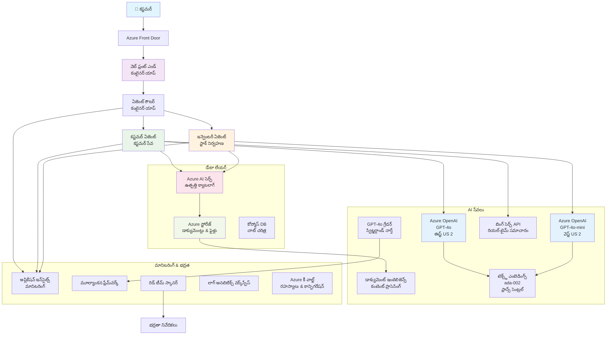

<!--
CO_OP_TRANSLATOR_METADATA:
{
  "original_hash": "77db71c83f2e7fbc9f50320bd1cc7116",
  "translation_date": "2025-11-25T06:55:02+00:00",
  "source_file": "examples/retail-scenario.md",
  "language_code": "te"
}
-->
# మల్టీ-ఏజెంట్ కస్టమర్ సపోర్ట్ సొల్యూషన్ - రిటైలర్ సీనారియో

**5వ అధ్యాయం: మల్టీ-ఏజెంట్ AI సొల్యూషన్స్**
- **📚 కోర్సు హోమ్**: [AZD For Beginners](../README.md)
- **📖 ప్రస్తుత అధ్యాయం**: [5వ అధ్యాయం: మల్టీ-ఏజెంట్ AI సొల్యూషన్స్](../README.md#-chapter-5-multi-agent-ai-solutions-advanced)
- **⬅️ ముందస్తు అవసరాలు**: [2వ అధ్యాయం: AI-ఫస్ట్ డెవలప్మెంట్](../docs/ai-foundry/azure-ai-foundry-integration.md)
- **➡️ తదుపరి అధ్యాయం**: [6వ అధ్యాయం: ప్రీ-డిప్లాయ్‌మెంట్ వాలిడేషన్](../docs/pre-deployment/capacity-planning.md)
- **🚀 ARM టెంప్లేట్స్**: [డిప్లాయ్‌మెంట్ ప్యాకేజీ](retail-multiagent-arm-template/README.md)

> **⚠️ ఆర్కిటెక్చర్ గైడ్ - పని చేసే ఇంప్లిమెంటేషన్ కాదు**  
> ఈ డాక్యుమెంట్ **కంప్రీహెన్సివ్ ఆర్కిటెక్చర్ బ్లూప్రింట్** అందిస్తుంది, మల్టీ-ఏజెంట్ సిస్టమ్ నిర్మాణానికి.  
> **ఇప్పటికే ఉన్నవి:** ఇన్‌ఫ్రాస్ట్రక్చర్ డిప్లాయ్‌మెంట్ కోసం ARM టెంప్లేట్ (Azure OpenAI, AI Search, Container Apps, మొదలైనవి)  
> **మీరు నిర్మించాల్సినవి:** ఏజెంట్ కోడ్, రౌటింగ్ లాజిక్, ఫ్రంట్‌ఎండ్ UI, డేటా పైప్‌లైన్స్ (అంచనా 80-120 గంటలు)  
>  
> **దీనిని ఇలా ఉపయోగించండి:**
> - ✅ మీ స్వంత మల్టీ-ఏజెంట్ ప్రాజెక్ట్ కోసం ఆర్కిటెక్చర్ రిఫరెన్స్‌గా
> - ✅ మల్టీ-ఏజెంట్ డిజైన్ ప్యాటర్న్స్ నేర్చుకునే గైడ్‌గా
> - ✅ Azure రిసోర్సుల డిప్లాయ్‌మెంట్ కోసం ఇన్‌ఫ్రాస్ట్రక్చర్ టెంప్లేట్‌గా
> - ❌ రెడీ-టు-రన్ అప్లికేషన్ కాదు (గణనీయమైన డెవలప్‌మెంట్ అవసరం)

## అవలోకనం

**లెర్నింగ్ ఆబ్జెక్టివ్:** రిటైలర్ కోసం ప్రొడక్షన్-రెడీ మల్టీ-ఏజెంట్ కస్టమర్ సపోర్ట్ చాట్‌బాట్ నిర్మాణానికి అవసరమైన ఆర్కిటెక్చర్, డిజైన్ నిర్ణయాలు, మరియు ఇంప్లిమెంటేషన్ విధానాన్ని అర్థం చేసుకోవడం.

**పూర్తి చేయడానికి సమయం:** చదవడం + అర్థం చేసుకోవడం (2-3 గంటలు) | పూర్తి ఇంప్లిమెంటేషన్ నిర్మాణం (80-120 గంటలు)

**మీరు నేర్చుకునేది:**
- మల్టీ-ఏజెంట్ ఆర్కిటెక్చర్ ప్యాటర్న్స్ మరియు డిజైన్ ప్రిన్సిపల్స్
- మల్టీ-రీజియన్ Azure OpenAI డిప్లాయ్‌మెంట్ స్ట్రాటజీస్
- RAG (రిట్రీవల్-ఆగ్మెంటెడ్ జనరేషన్) తో AI సెర్చ్ ఇంటిగ్రేషన్
- ఏజెంట్ ఈవాల్యుయేషన్ మరియు సెక్యూరిటీ టెస్టింగ్ ఫ్రేమ్‌వర్క్స్
- ప్రొడక్షన్ డిప్లాయ్‌మెంట్ పరిగణనలు మరియు ఖర్చు ఆప్టిమైజేషన్

## ఆర్కిటెక్చర్ లక్ష్యాలు

**ఎడ్యుకేషనల్ ఫోకస్:** ఈ ఆర్కిటెక్చర్ మల్టీ-ఏజెంట్ సిస్టమ్స్ కోసం ఎంటర్‌ప్రైజ్ ప్యాటర్న్స్‌ను ప్రదర్శిస్తుంది.

### సిస్టమ్ అవసరాలు (మీ ఇంప్లిమెంటేషన్ కోసం)

ప్రొడక్షన్ కస్టమర్ సపోర్ట్ సొల్యూషన్‌కు అవసరమైనవి:
- **వివిధ కస్టమర్ అవసరాలకు ప్రత్యేకమైన ఏజెంట్లు** (కస్టమర్ సర్వీస్ + ఇన్వెంటరీ మేనేజ్‌మెంట్)
- **మల్టీ-మోడల్ డిప్లాయ్‌మెంట్** సరైన కెపాసిటీ ప్లానింగ్‌తో (GPT-4o, GPT-4o-mini, ఎంబెడ్డింగ్స్ రీజియన్స్ అంతటా)
- **డైనమిక్ డేటా ఇంటిగ్రేషన్** AI సెర్చ్ మరియు ఫైల్ అప్‌లోడ్స్‌తో (వెక్టార్ సెర్చ్ + డాక్యుమెంట్ ప్రాసెసింగ్)
- **కంప్రీహెన్సివ్ మానిటరింగ్** మరియు ఈవాల్యుయేషన్ సామర్థ్యాలు (Application Insights + కస్టమ్ మెట్రిక్స్)
- **ప్రొడక్షన్-గ్రేడ్ సెక్యూరిటీ** రెడ్ టీమింగ్ వాలిడేషన్‌తో (వల్నరబిలిటీ స్కానింగ్ + ఏజెంట్ ఈవాల్యుయేషన్)

### ఈ గైడ్ అందించేది

✅ **ఆర్కిటెక్చర్ ప్యాటర్న్స్** - స్కేలబుల్ మల్టీ-ఏజెంట్ సిస్టమ్స్ కోసం నిరూపిత డిజైన్  
✅ **ఇన్‌ఫ్రాస్ట్రక్చర్ టెంప్లేట్స్** - అన్ని Azure సర్వీసులను డిప్లాయ్ చేసే ARM టెంప్లేట్స్  
✅ **కోడ్ ఉదాహరణలు** - కీలక భాగాల కోసం రిఫరెన్స్ ఇంప్లిమెంటేషన్స్  
✅ **కాన్ఫిగరేషన్ గైడెన్స్** - స్టెప్-బై-స్టెప్ సెటప్ సూచనలు  
✅ **ఉత్తమ పద్ధతులు** - సెక్యూరిటీ, మానిటరింగ్, ఖర్చు ఆప్టిమైజేషన్ వ్యూహాలు  

❌ **చేర్చబడలేదు** - పూర్తి పని చేసే అప్లికేషన్ (డెవలప్‌మెంట్ శ్రమ అవసరం)

## 🗺️ ఇంప్లిమెంటేషన్ రోడ్‌మ్యాప్

### దశ 1: ఆర్కిటెక్చర్ అధ్యయనం (2-3 గంటలు) - ఇక్కడ ప్రారంభించండి

**లక్ష్యం:** సిస్టమ్ డిజైన్ మరియు భాగాల పరస్పర చర్యలను అర్థం చేసుకోవడం

- [ ] ఈ డాక్యుమెంట్ పూర్తిగా చదవండి
- [ ] ఆర్కిటెక్చర్ డయాగ్రామ్ మరియు భాగాల సంబంధాలను సమీక్షించండి
- [ ] మల్టీ-ఏజెంట్ ప్యాటర్న్స్ మరియు డిజైన్ నిర్ణయాలను అర్థం చేసుకోండి
- [ ] ఏజెంట్ టూల్స్ మరియు రౌటింగ్ కోసం కోడ్ ఉదాహరణలను అధ్యయనం చేయండి
- [ ] ఖర్చు అంచనాలు మరియు కెపాసిటీ ప్లానింగ్ గైడెన్స్‌ను సమీక్షించండి

**ఫలితం:** మీరు నిర్మించాల్సిన దాని స్పష్టమైన అవగాహన

### దశ 2: ఇన్‌ఫ్రాస్ట్రక్చర్ డిప్లాయ్ చేయండి (30-45 నిమిషాలు)

**లక్ష్యం:** ARM టెంప్లేట్ ఉపయోగించి Azure రిసోర్సులను ప్రొవిజన్ చేయడం

```bash
cd retail-multiagent-arm-template
./deploy.sh -g myResourceGroup -m standard
```

**డిప్లాయ్ అయ్యేది:**
- ✅ Azure OpenAI (3 రీజియన్స్: GPT-4o, GPT-4o-mini, ఎంబెడ్డింగ్స్)
- ✅ AI సెర్చ్ సర్వీస్ (ఖాళీ, ఇండెక్స్ కాన్ఫిగరేషన్ అవసరం)
- ✅ కంటైనర్ యాప్స్ ఎన్విరాన్‌మెంట్ (ప్లేస్‌హోల్డర్ ఇమేజెస్)
- ✅ స్టోరేజ్ అకౌంట్స్, Cosmos DB, Key Vault
- ✅ అప్లికేషన్ ఇన్‌సైట్స్ మానిటరింగ్

**లేకపోయినవి:**
- ❌ ఏజెంట్ ఇంప్లిమెంటేషన్ కోడ్
- ❌ రౌటింగ్ లాజిక్
- ❌ ఫ్రంట్‌ఎండ్ UI
- ❌ సెర్చ్ ఇండెక్స్ స్కీమా
- ❌ డేటా పైప్‌లైన్స్

### దశ 3: అప్లికేషన్ నిర్మించండి (80-120 గంటలు)

**లక్ష్యం:** ఈ ఆర్కిటెక్చర్ ఆధారంగా మల్టీ-ఏజెంట్ సిస్టమ్‌ను అమలు చేయడం

1. **ఏజెంట్ ఇంప్లిమెంటేషన్** (30-40 గంటలు)
   - బేస్ ఏజెంట్ క్లాస్ మరియు ఇంటర్‌ఫేస్‌లు
   - GPT-4o తో కస్టమర్ సర్వీస్ ఏజెంట్
   - GPT-4o-mini తో ఇన్వెంటరీ ఏజెంట్
   - టూల్ ఇంటిగ్రేషన్స్ (AI సెర్చ్, Bing, ఫైల్ ప్రాసెసింగ్)

2. **రౌటింగ్ సర్వీస్** (12-16 గంటలు)
   - రిక్వెస్ట్ క్లాసిఫికేషన్ లాజిక్
   - ఏజెంట్ సెలెక్షన్ మరియు ఆర్కెస్ట్రేషన్
   - FastAPI/Express బ్యాక్‌ఎండ్

3. **ఫ్రంట్‌ఎండ్ డెవలప్‌మెంట్** (20-30 గంటలు)
   - చాట్ ఇంటర్‌ఫేస్ UI
   - ఫైల్ అప్‌లోడ్ ఫంక్షనాలిటీ
   - రెస్పాన్స్ రెండరింగ్

4. **డేటా పైప్‌లైన్** (8-12 గంటలు)
   - AI సెర్చ్ ఇండెక్స్ క్రియేషన్
   - డాక్యుమెంట్ ప్రాసెసింగ్ విత్ డాక్యుమెంట్ ఇంటెలిజెన్స్
   - ఎంబెడ్డింగ్ జనరేషన్ మరియు ఇండెక్సింగ్

5. **మానిటరింగ్ & ఈవాల్యుయేషన్** (10-15 గంటలు)
   - కస్టమ్ టెలిమెట్రీ ఇంప్లిమెంటేషన్
   - ఏజెంట్ ఈవాల్యుయేషన్ ఫ్రేమ్‌వర్క్
   - రెడ్ టీమ్ సెక్యూరిటీ స్కానర్

### దశ 4: డిప్లాయ్ & టెస్ట్ (8-12 గంటలు)

- అన్ని సర్వీసుల కోసం Docker ఇమేజెస్ నిర్మించండి
- Azure Container Registryకి పుష్ చేయండి
- కంటైనర్ యాప్స్‌ను రియల్ ఇమేజెస్‌తో అప్‌డేట్ చేయండి
- ఎన్విరాన్‌మెంట్ వేరియబుల్స్ మరియు సీక్రెట్స్ కాన్ఫిగర్ చేయండి
- ఈవాల్యుయేషన్ టెస్ట్ సూట్ నడపండి
- సెక్యూరిటీ స్కానింగ్ చేయండి

**మొత్తం అంచనా శ్రమ:** అనుభవజ్ఞులైన డెవలపర్లకు 80-120 గంటలు

## సొల్యూషన్ ఆర్కిటెక్చర్

### ఆర్కిటెక్చర్ డయాగ్రామ్


### భాగాల అవలోకనం

| భాగం | ప్రయోజనం | టెక్నాలజీ | రీజియన్ |
|-----------|---------|------------|---------|
| **వెబ్ ఫ్రంట్‌ఎండ్** | కస్టమర్ పరస్పర చర్యల కోసం యూజర్ ఇంటర్‌ఫేస్ | కంటైనర్ యాప్స్ | ప్రైమరీ రీజియన్ |
| **ఏజెంట్ రౌటర్** | సరైన ఏజెంట్‌కు రిక్వెస్ట్‌లను రూట్ చేస్తుంది | కంటైనర్ యాప్స్ | ప్రైమరీ రీజియన్ |
| **కస్టమర్ ఏజెంట్** | కస్టమర్ సర్వీస్ ప్రశ్నలను హ్యాండిల్ చేస్తుంది | కంటైనర్ యాప్స్ + GPT-4o | ప్రైమరీ రీజియన్ |
| **ఇన్వెంటరీ ఏజెంట్** | స్టాక్ మరియు ఫుల్‌ఫిల్‌మెంట్‌ను నిర్వహిస్తుంది | కంటైనర్ యాప్స్ + GPT-4o-mini | ప్రైమరీ రీజియన్ |
| **Azure OpenAI** | ఏజెంట్ల కోసం LLM ఇన్ఫరెన్స్ | Cognitive Services | మల్టీ-రీజియన్ |
| **AI సెర్చ్** | వెక్టర్ సెర్చ్ మరియు RAG | AI సెర్చ్ సర్వీస్ | ప్రైమరీ రీజియన్ |
| **స్టోరేజ్ అకౌంట్** | ఫైల్ అప్‌లోడ్స్ మరియు డాక్యుమెంట్స్ | బ్లోబ్ స్టోరేజ్ | ప్రైమరీ రీజియన్ |
| **అప్లికేషన్ ఇన్‌సైట్స్** | మానిటరింగ్ మరియు టెలిమెట్రీ | మానిటర్ | ప్రైమరీ రీజియన్ |
| **గ్రేడర్ మోడల్** | ఏజెంట్ ఈవాల్యుయేషన్ సిస్టమ్ | Azure OpenAI | సెకండరీ రీజియన్ |

## 📁 ప్రాజెక్ట్ నిర్మాణం

> **📍 స్థితి లెజెండ్:**  
> ✅ = రిపోజిటరీలో ఉంది  
> 📝 = రిఫరెన్స్ ఇంప్లిమెంటేషన్ (ఈ డాక్యుమెంట్‌లో కోడ్ ఉదాహరణ)  
> 🔨 = మీరు సృష్టించాల్సినది

```
retail-multiagent-solution/              🔨 Your project directory
├── .azure/                              🔨 Azure environment configs
│   ├── config.json                      🔨 Global config
│   └── env/
│       ├── .env.development             🔨 Dev environment
│       ├── .env.staging                 🔨 Staging environment
│       └── .env.production              🔨 Production environment
│
├── azure.yaml                          🔨 AZD main configuration
├── azure.parameters.json               🔨 Deployment parameters
├── README.md                           🔨 Solution documentation
│
├── infra/                              🔨 Infrastructure as Code (you create)
│   ├── main.bicep                      🔨 Main Bicep template (optional, ARM exists)
│   ├── main.parameters.json            🔨 Parameters file
│   ├── modules/                        📝 Bicep modules (reference examples below)
│   │   ├── ai-services.bicep           📝 Azure OpenAI deployments
│   │   ├── search.bicep                📝 AI Search configuration
│   │   ├── storage.bicep               📝 Storage accounts
│   │   ├── container-apps.bicep        📝 Container Apps environment
│   │   ├── monitoring.bicep            📝 Application Insights
│   │   ├── security.bicep              📝 Key Vault and RBAC
│   │   └── networking.bicep            📝 Virtual networks and DNS
│   ├── arm-template/                   ✅ ARM template version (EXISTS)
│   │   ├── azuredeploy.json            ✅ ARM main template (retail-multiagent-arm-template/)
│   │   └── azuredeploy.parameters.json ✅ ARM parameters
│   └── scripts/                        ✅/🔨 Deployment scripts
│       ├── deploy.sh                   ✅ Main deployment script (EXISTS)
│       ├── setup-data.sh               🔨 Data setup script (you create)
│       └── configure-rbac.sh           🔨 RBAC configuration (you create)
│
├── src/                                🔨 Application source code (YOU BUILD THIS)
│   ├── agents/                         📝 Agent implementations (examples below)
│   │   ├── base/                       🔨 Base agent classes
│   │   │   ├── agent.py                🔨 Abstract agent class
│   │   │   └── tools.py                🔨 Tool interfaces
│   │   ├── customer/                   🔨 Customer service agent
│   │   │   ├── agent.py                📝 Customer agent implementation (see below)
│   │   │   ├── prompts.py              🔨 System prompts
│   │   │   └── tools/                  🔨 Agent-specific tools
│   │   │       ├── search_tool.py      📝 AI Search integration (example below)
│   │   │       ├── bing_tool.py        📝 Bing Search integration (example below)
│   │   │       └── file_tool.py        🔨 File processing tool
│   │   └── inventory/                  🔨 Inventory management agent
│   │       ├── agent.py                🔨 Inventory agent implementation
│   │       ├── prompts.py              🔨 System prompts
│   │       └── tools/                  🔨 Agent-specific tools
│   │           ├── inventory_search.py 🔨 Inventory search tool
│   │           └── database_tool.py    🔨 Database query tool
│   │
│   ├── router/                         🔨 Agent routing service (you build)
│   │   ├── main.py                     🔨 FastAPI router application
│   │   ├── routing_logic.py            🔨 Request routing logic
│   │   └── middleware.py               🔨 Authentication & logging
│   │
│   ├── frontend/                       🔨 Web user interface (you build)
│   │   ├── Dockerfile                  🔨 Container configuration
│   │   ├── package.json                🔨 Node.js dependencies
│   │   ├── src/                        🔨 React/Vue source code
│   │   │   ├── components/             🔨 UI components
│   │   │   ├── pages/                  🔨 Application pages
│   │   │   ├── services/               🔨 API services
│   │   │   └── styles/                 🔨 CSS and themes
│   │   └── public/                     🔨 Static assets
│   │
│   ├── shared/                         🔨 Shared utilities (you build)
│   │   ├── config.py                   🔨 Configuration management
│   │   ├── telemetry.py                📝 Telemetry utilities (example below)
│   │   ├── security.py                 🔨 Security utilities
│   │   └── models.py                   🔨 Data models
│   │
│   └── evaluation/                     🔨 Evaluation and testing (you build)
│       ├── evaluator.py                📝 Agent evaluator (example below)
│       ├── red_team_scanner.py         📝 Security scanner (example below)
│       ├── test_cases.json             📝 Evaluation test cases (example below)
│       └── reports/                    🔨 Generated reports
│
├── data/                               🔨 Data and configuration (you create)
│   ├── search-schema.json              📝 AI Search index schema (example below)
│   ├── initial-docs/                   🔨 Initial document corpus
│   │   ├── product-manuals/            🔨 Product documentation (your data)
│   │   ├── policies/                   🔨 Company policies (your data)
│   │   └── faqs/                       🔨 Frequently asked questions (your data)
│   ├── fine-tuning/                    🔨 Fine-tuning datasets (optional)
│   │   ├── training.jsonl              🔨 Training data
│   │   └── validation.jsonl            🔨 Validation data
│   └── evaluation/                     🔨 Evaluation datasets
│       ├── test-conversations.json     📝 Test conversation data (example below)
│       └── ground-truth.json           🔨 Expected responses
│
├── scripts/                            # Utility scripts
│   ├── setup/                          # Setup scripts
│   │   ├── bootstrap.sh                # Initial environment setup
│   │   ├── install-dependencies.sh     # Install required tools
│   │   └── configure-env.sh            # Environment configuration
│   ├── data-management/                # Data management scripts
│   │   ├── upload-documents.py         # Document upload utility
│   │   ├── create-search-index.py      # Search index creation
│   │   └── sync-data.py                # Data synchronization
│   ├── deployment/                     # Deployment automation
│   │   ├── deploy-agents.sh            # Agent deployment
│   │   ├── update-frontend.sh          # Frontend updates
│   │   └── rollback.sh                 # Rollback procedures
│   └── monitoring/                     # Monitoring scripts
│       ├── health-check.py             # Health monitoring
│       ├── performance-test.py         # Performance testing
│       └── security-scan.py            # Security scanning
│
├── tests/                              # Test suites
│   ├── unit/                           # Unit tests
│   │   ├── test_agents.py              # Agent unit tests
│   │   ├── test_router.py              # Router unit tests
│   │   └── test_tools.py               # Tool unit tests
│   ├── integration/                    # Integration tests
│   │   ├── test_end_to_end.py          # E2E test scenarios
│   │   └── test_api.py                 # API integration tests
│   └── load/                           # Load testing
│       ├── load_test_config.yaml       # Load test configuration
│       └── scenarios/                  # Load test scenarios
│
├── docs/                               # Documentation
│   ├── architecture.md                 # Architecture documentation
│   ├── deployment-guide.md             # Deployment instructions
│   ├── agent-configuration.md          # Agent setup guide
│   ├── troubleshooting.md              # Troubleshooting guide
│   └── api/                            # API documentation
│       ├── agent-api.md                # Agent API reference
│       └── router-api.md               # Router API reference
│
├── hooks/                              # AZD lifecycle hooks
│   ├── preprovision.sh                 # Pre-provisioning tasks
│   ├── postprovision.sh                # Post-provisioning setup
│   ├── prepackage.sh                   # Pre-packaging tasks
│   └── postdeploy.sh                   # Post-deployment validation
│
└── .github/                            # GitHub workflows
    └── workflows/
        ├── ci-cd.yml                   # CI/CD pipeline
        ├── security-scan.yml           # Security scanning
        └── performance-test.yml        # Performance testing
```

---

## 🚀 త్వరిత ప్రారంభం: మీరు ఇప్పుడే చేయగలిగేది

### ఎంపిక 1: కేవలం ఇన్‌ఫ్రాస్ట్రక్చర్ డిప్లాయ్ చేయండి (30 నిమిషాలు)

**మీకు లభించేది:** అన్ని Azure సర్వీసులు ప్రొవిజన్ చేయబడి, డెవలప్‌మెంట్‌కు సిద్ధంగా ఉంటాయి

```bash
# రిపోజిటరీని క్లోన్ చేయండి
git clone https://github.com/microsoft/AZD-for-beginners.git
cd AZD-for-beginners/examples/retail-multiagent-arm-template

# మౌలిక సదుపాయాలను మోహరించండి
./deploy.sh -g myResourceGroup -m standard

# మోహరింపును ధృవీకరించండి
az resource list --resource-group myResourceGroup --output table
```

**అంచనా ఫలితం:**
- ✅ Azure OpenAI సర్వీసులు డిప్లాయ్ అయ్యాయి (3 రీజియన్స్)
- ✅ AI సెర్చ్ సర్వీస్ క్రియేట్ అయ్యింది (ఖాళీగా ఉంది)
- ✅ కంటైనర్ యాప్స్ ఎన్విరాన్‌మెంట్ సిద్ధంగా ఉంది
- ✅ స్టోరేజ్, Cosmos DB, Key Vault కాన్ఫిగర్ అయ్యాయి
- ❌ ఇంకా ఏజెంట్లు పనిచేయడం లేదు (కేవలం ఇన్‌ఫ్రాస్ట్రక్చర్ మాత్రమే)

### ఎంపిక 2: ఆర్కిటెక్చర్ అధ్యయనం చేయండి (2-3 గంటలు)

**మీకు లభించేది:** మల్టీ-ఏజెంట్ ప్యాటర్న్స్‌పై లోతైన అవగాహన

1. ఈ డాక్యుమెంట్ పూర్తిగా చదవండి
2. ప్రతి భాగం కోసం కోడ్ ఉదాహరణలను సమీక్షించండి
3. డిజైన్ నిర్ణయాలు మరియు ట్రేడ్-ఆఫ్స్ అర్థం చేసుకోండి
4. ఖర్చు ఆప్టిమైజేషన్ వ్యూహాలను అధ్యయనం చేయండి
5. మీ ఇంప్లిమెంటేషన్ విధానాన్ని ప్లాన్ చేయండి

**అంచనా ఫలితం:**
- ✅ సిస్టమ్ ఆర్కిటెక్చర్ యొక్క స్పష్టమైన మానసిక నమూనా
- ✅ అవసరమైన భాగాల అవగాహన
- ✅ వాస్తవిక శ్రమ అంచనాలు
- ✅ ఇంప్లిమెంటేషన్ ప్లాన్

### ఎంపిక 3: పూర్తి సిస్టమ్ నిర్మించండి (80-120 గంటలు)

**మీకు లభించేది:** ప్రొడక్షన్-రెడీ మల్టీ-ఏజెంట్ సొల్యూషన్

1. **దశ 1:** ఇన్‌ఫ్రాస్ట్రక్చర్ డిప్లాయ్ చేయండి (పైన చేసినట్లు)
2. **దశ 2:** క్రింది కోడ్ ఉదాహరణలను ఉపయోగించి ఏజెంట్లను అమలు చేయండి (30-40 గంటలు)
3. **దశ 3:** రౌటింగ్ సర్వీస్ నిర్మించండి (12-16 గంటలు)
4. **దశ 4:** ఫ్రంట్‌ఎండ్ UI సృష్టించండి (20-30 గంటలు)
5. **దశ 5:** డేటా పైప్‌లైన్స్ కాన్ఫిగర్ చేయండి (8-12 గంటలు)
6. **దశ 6:** మానిటరింగ్ & ఈవాల్యుయేషన్ జోడించండి (10-15 గంటలు)

**అంచనా ఫలితం:**
- ✅ పూర్తిగా ఫంక్షనల్ మల్టీ-ఏజెంట్ సిస్టమ్
- ✅ ప్రొడక్షన్-గ్రేడ్ మానిటరింగ్
- ✅ సెక్యూరిటీ వాలిడేషన్
- ✅ ఖర్చు-ఆప్టిమైజ్డ్ డిప్లాయ్‌మెంట్

---

## 📚 ఆర్కిటెక్చర్ రిఫరెన్స్ & ఇంప్లిమెంటేషన్ గైడ్

తదుపరి విభాగాలు మీ ఇంప్లిమెంటేషన్‌కు మార్గదర్శకత్వం అందించడానికి వివరణాత్మక ఆర్కిటెక్చర్ ప్యాటర్న్స్, కాన్ఫిగరేషన్ ఉదాహరణలు, మరియు రిఫరెన్స్ కోడ్‌ను అందిస్తాయి.

## ప్రారంభ కాన్ఫిగరేషన్ అవసరాలు

### 1. బహుళ ఏజెంట్లు & కాన్ఫిగరేషన్

**లక్ష్యం**: 2 ప్రత్యేక ఏజెంట్లను డిప్లాయ్ చేయడం - "కస్టమర్ ఏజెంట్" (కస్టమర్ సర్వీస్) మరియు "ఇన్వెంటరీ" (స్టాక్ మేనేజ్‌మెంట్)

> **📝 గమనిక:** క్రింది azure.yaml మరియు Bicep కాన్ఫిగరేషన్లు **రిఫరెన్స్ ఉదాహరణలు** మాత్రమే. మీరు ఈ ఫైళ్లను మరియు సంబంధిత ఏజెంట్ ఇంప్లిమెంటేషన్లను సృష్టించాలి.

#### కాన్ఫిగరేషన్ దశలు:

```yaml
# azure.yaml - Agent Configuration
services:
  agents:
    project: ./infra
    host: containerapp
    config:
      AGENTS_CONFIG: |
        {
          "customer": {
            "name": "Customer",
            "role": "Customer Service Representative",
            "description": "Handles general customer inquiries, returns, and support",
            "model": "gpt-4o",
            "temperature": 0.7,
            "max_tokens": 500,
            "tools": ["search", "file_retrieval", "bing_search"]
          },
          "inventory": {
            "name": "Inventory",
            "role": "Inventory Management Specialist", 
            "description": "Manages stock levels, product availability, and fulfillment",
            "model": "gpt-4o-mini",
            "temperature": 0.3,
            "max_tokens": 300,
            "tools": ["search", "database_query"]
          }
        }
```

#### Bicep టెంప్లేట్ అప్‌డేట్స్:

```bicep
// infra/agents.bicep
param agentsConfig object = {
  customer: {
    name: 'Customer'
    model: 'gpt-4o'
    capacity: 20
  }
  inventory: {
    name: 'Inventory'
    model: 'gpt-4o-mini'
    capacity: 10
  }
}

resource agentDeployments 'Microsoft.App/containerApps@2024-03-01' = [for agent in items(agentsConfig): {
  name: 'agent-${agent.key}'
  properties: {
    template: {
      containers: [{
        name: 'agent-container'
        image: 'your-registry.azurecr.io/agent:latest'
        env: [
          {
            name: 'AGENT_NAME'
            value: agent.value.name
          }
          {
            name: 'AGENT_MODEL'
            value: agent.value.model
          }
        ]
      }]
    }
  }
}]
```

### 2. బహుళ మోడల్స్‌తో కెపాసిటీ ప్లానింగ్

**
## ✅ అమలు చేయడానికి సిద్ధంగా ఉన్న ARM టెంప్లేట్

> **✨ ఇది నిజంగా ఉంది మరియు పనిచేస్తుంది!**  
> పై భావనాత్మక కోడ్ ఉదాహరణలతో పోలిస్తే, ARM టెంప్లేట్ **నిజమైన, పనిచేసే మౌలిక వసతుల అమలు** ఈ రిపోజిటరీలో చేర్చబడింది.

### ఈ టెంప్లేట్ నిజంగా ఏమి చేస్తుంది

[`retail-multiagent-arm-template/`](../../../examples/retail-multiagent-arm-template) లోని ARM టెంప్లేట్ **మల్టీ-ఏజెంట్ సిస్టమ్** కోసం అవసరమైన **అన్ని Azure మౌలిక వసతులను** అందిస్తుంది. ఇది **అమలు చేయడానికి సిద్ధంగా ఉన్న ఏకైక భాగం** - మిగతా వాటికి అభివృద్ధి అవసరం.

### ARM టెంప్లేట్‌లో ఏమి చేర్చబడింది

[`retail-multiagent-arm-template/`](../../../examples/retail-multiagent-arm-template) లోని ARM టెంప్లేట్‌లో:

#### **పూర్తి మౌలిక వసతులు**
- ✅ **మల్టీ-రీజియన్ Azure OpenAI** అమలు (GPT-4o, GPT-4o-mini, embeddings, grader)
- ✅ **Azure AI Search** వెక్టర్ సెర్చ్ సామర్థ్యాలతో
- ✅ **Azure Storage** డాక్యుమెంట్ మరియు అప్‌లోడ్ కంటైనర్లతో
- ✅ **Container Apps Environment** ఆటో-స్కేలింగ్‌తో
- ✅ **Agent Router & Frontend** కంటైనర్ యాప్స్
- ✅ **Cosmos DB** చాట్ చరిత్ర నిల్వ కోసం
- ✅ **Application Insights** సమగ్ర మానిటరింగ్ కోసం
- ✅ **Key Vault** సురక్షిత రహస్య నిర్వహణ కోసం
- ✅ **Document Intelligence** ఫైల్ ప్రాసెసింగ్ కోసం
- ✅ **Bing Search API** రియల్-టైమ్ సమాచారం కోసం

#### **అమలు మోడ్‌లు**
| మోడ్ | ఉపయోగం | వనరులు | అంచనా వ్యయం/నెల |
|------|----------|-----------|---------------------|
| **మినిమల్** | అభివృద్ధి, పరీక్ష | బేసిక్ SKUs, సింగిల్ రీజియన్ | $100-370 |
| **స్టాండర్డ్** | ఉత్పత్తి, మోస్తరు స్కేల్ | స్టాండర్డ్ SKUs, మల్టీ-రీజియన్ | $420-1,450 |
| **ప్రీమియం** | ఎంటర్‌ప్రైజ్, అధిక స్కేల్ | ప్రీమియం SKUs, HA సెటప్ | $1,150-3,500 |

### 🎯 త్వరిత అమలు ఎంపికలు

#### ఎంపిక 1: వన్-క్లిక్ Azure అమలు

[](https://portal.azure.com/#create/Microsoft.Template/uri/https%3A%2F%2Fraw.githubusercontent.com%2Fmicrosoft%2Fazd-for-beginners%2Fmain%2Fexamples%2Fretail-multiagent-arm-template%2Fazuredeploy.json)

#### ఎంపిక 2: Azure CLI అమలు

```bash
# రిపోజిటరీని క్లోన్ చేయండి
git clone https://github.com/microsoft/azd-for-beginners.git
cd azd-for-beginners/examples/retail-multiagent-arm-template

# డిప్లాయ్‌మెంట్ స్క్రిప్ట్‌ను అమలు చేయగలిగేలా చేయండి
chmod +x deploy.sh

# డిఫాల్ట్ సెట్టింగ్స్‌తో (స్టాండర్డ్ మోడ్) డిప్లాయ్ చేయండి
./deploy.sh -g myResourceGroup

# ప్రొడక్షన్ కోసం ప్రీమియం ఫీచర్లతో డిప్లాయ్ చేయండి
./deploy.sh -g myProdRG -e prod -m premium -l eastus2

# డెవలప్‌మెంట్ కోసం కనిష్ట వెర్షన్‌ను డిప్లాయ్ చేయండి
./deploy.sh -g myDevRG -e dev -m minimal --no-multi-region
```

#### ఎంపిక 3: నేరుగా ARM టెంప్లేట్ అమలు

```bash
# రిసోర్స్ గ్రూప్ సృష్టించండి
az group create --name myResourceGroup --location eastus2

# టెంప్లేట్‌ను నేరుగా డిప్లాయ్ చేయండి
az deployment group create \
  --resource-group myResourceGroup \
  --template-file azuredeploy.json \
  --parameters azuredeploy.parameters.json \
  --parameters projectName=retail environmentName=prod
```

### టెంప్లేట్ అవుట్‌పుట్‌లు

అమలు విజయవంతంగా పూర్తయిన తర్వాత, మీరు పొందేవి:

```json
{
  "frontendUrl": "https://retail-frontend-abc123.azurecontainerapps.io",
  "routerUrl": "https://retail-router-abc123.azurecontainerapps.io",
  "openAiEndpointPrimary": "https://retail-openai-primary-abc123.openai.azure.com/",
  "searchServiceEndpoint": "https://retail-search-abc123.search.windows.net",
  "storageAccountName": "retailstorage123abc",
  "keyVaultName": "retail-kv-abc123",
  "applicationInsightsName": "retail-ai-abc123"
}
```

### 🔧 అమలు తర్వాత కాన్ఫిగరేషన్

ARM టెంప్లేట్ మౌలిక వసతుల అమలును నిర్వహిస్తుంది. అమలు తర్వాత:

1. **సెర్చ్ ఇండెక్స్ కాన్ఫిగర్ చేయండి**:
   ```bash
   # అందించిన శోధన స్కీమాను ఉపయోగించండి
   curl -X POST "${SEARCH_ENDPOINT}/indexes?api-version=2023-11-01" \
     -H "Content-Type: application/json" \
     -H "api-key: ${SEARCH_KEY}" \
     -d @../data/search-schema.json
   ```

2. **ప్రారంభ డాక్యుమెంట్లను అప్‌లోడ్ చేయండి**:
   ```bash
   # ఉత్పత్తి మాన్యువల్స్ మరియు నాలెడ్జ్ బేస్‌ను అప్‌లోడ్ చేయండి
   az storage blob upload-batch \
     --destination documents \
     --source ../data/initial-docs \
     --account-name ${STORAGE_ACCOUNT}
   ```

3. **ఏజెంట్ కోడ్‌ను అమలు చేయండి**:
   ```bash
   # నిజమైన ఏజెంట్ అప్లికేషన్లను నిర్మించి మోహరించండి
   docker build -t myregistry.azurecr.io/agent-router:latest ./src/router
   az containerapp update \
     --name retail-router \
     --resource-group myResourceGroup \
     --image myregistry.azurecr.io/agent-router:latest
   ```

### 🎛️ అనుకూలీకరణ ఎంపికలు

`azuredeploy.parameters.json` ను సవరించి మీ అమలును అనుకూలీకరించండి:

```json
{
  "projectName": {"value": "mycompany"},
  "environmentName": {"value": "prod"},
  "deploymentMode": {"value": "premium"},
  "location": {"value": "eastus2"},
  "enableMultiRegion": {"value": true},
  "enableMonitoring": {"value": true},
  "enableSecurity": {"value": true}
}
```

### 📊 అమలు లక్షణాలు

- ✅ **అవసరాల ధృవీకరణ** (Azure CLI, కోటాలు, అనుమతులు)
- ✅ **మల్టీ-రీజియన్ అధిక లభ్యత** ఆటోమేటిక్ ఫెయిల్ ఓవర్‌తో
- ✅ **సమగ్ర మానిటరింగ్** Application Insights మరియు Log Analytics తో
- ✅ **సురక్షిత ఉత్తమ పద్ధతులు** Key Vault మరియు RBAC తో
- ✅ **ఖర్చు ఆప్టిమైజేషన్** అమలు మోడ్‌లను కాన్ఫిగర్ చేయడం ద్వారా
- ✅ **ఆటోమేటెడ్ స్కేలింగ్** డిమాండ్ ప్యాటర్న్‌ల ఆధారంగా
- ✅ **జీరో-డౌన్‌టైమ్ అప్‌డేట్స్** Container Apps రివిజన్‌లతో

### 🔍 మానిటరింగ్ మరియు నిర్వహణ

అమలు చేసిన తర్వాత, మీ పరిష్కారాన్ని మానిటర్ చేయండి:

- **Application Insights**: పనితీరు మెట్రిక్స్, డిపెండెన్సీ ట్రాకింగ్, మరియు కస్టమ్ టెలిమెట్రీ
- **Log Analytics**: అన్ని భాగాల నుండి కేంద్రీకృత లాగింగ్
- **Azure Monitor**: వనరుల ఆరోగ్యం మరియు లభ్యత మానిటరింగ్
- **Cost Management**: రియల్-టైమ్ ఖర్చు ట్రాకింగ్ మరియు బడ్జెట్ అలర్ట్‌లు

---

## 📚 పూర్తి అమలు గైడ్

ఈ సన్నివేశం డాక్యుమెంట్ ARM టెంప్లేట్‌తో కలిపి ఉత్పత్తి-సిద్ధమైన మల్టీ-ఏజెంట్ కస్టమర్ సపోర్ట్ పరిష్కారాన్ని అమలు చేయడానికి అవసరమైన ప్రతిదీ అందిస్తుంది. అమలు కవర్లు:

✅ **ఆర్కిటెక్చర్ డిజైన్** - భాగాల సంబంధాలతో సమగ్ర వ్యవస్థ డిజైన్  
✅ **మౌలిక వసతుల అమలు** - వన్-క్లిక్ అమలుకు పూర్తి ARM టెంప్లేట్  
✅ **ఏజెంట్ కాన్ఫిగరేషన్** - కస్టమర్ మరియు ఇన్వెంటరీ ఏజెంట్లకు వివరమైన సెటప్  
✅ **మల్టీ-మోడల్ అమలు** - ప్రాంతాల మధ్య వ్యూహాత్మక మోడల్ ప్లేస్‌మెంట్  
✅ **సెర్చ్ ఇంటిగ్రేషన్** - వెక్టర్ సామర్థ్యాలు మరియు డేటా ఇండెక్సింగ్‌తో AI సెర్చ్  
✅ **సెక్యూరిటీ అమలు** - రెడ్ టీమింగ్, భద్రతా స్కానింగ్, మరియు సురక్షిత పద్ధతులు  
✅ **మానిటరింగ్ & మూల్యాంకనం** - సమగ్ర టెలిమెట్రీ మరియు ఏజెంట్ మూల్యాంకన ఫ్రేమ్‌వర్క్  
✅ **ఉత్పత్తి సిద్ధత** - HA మరియు డిజాస్టర్ రికవరీతో ఎంటర్‌ప్రైజ్-గ్రేడ్ అమలు  
✅ **ఖర్చు ఆప్టిమైజేషన్** - తెలివైన రూటింగ్ మరియు వినియోగ ఆధారిత స్కేలింగ్  
✅ **ట్రబుల్‌షూటింగ్ గైడ్** - సాధారణ సమస్యలు మరియు పరిష్కార వ్యూహాలు

---

## 📊 సారాంశం: మీరు నేర్చుకున్నది

### కవరైన ఆర్కిటెక్చర్ ప్యాటర్న్‌లు

✅ **మల్టీ-ఏజెంట్ సిస్టమ్ డిజైన్** - ప్రత్యేక ఏజెంట్లు (కస్టమర్ + ఇన్వెంటరీ) ప్రత్యేక మోడల్‌లతో  
✅ **మల్టీ-రీజియన్ అమలు** - ఖర్చు ఆప్టిమైజేషన్ మరియు redundancy కోసం వ్యూహాత్మక మోడల్ ప్లేస్‌మెంట్  
✅ **RAG ఆర్కిటెక్చర్** - వెక్టర్ ఎంబెడింగ్స్‌తో AI సెర్చ్ ఇంటిగ్రేషన్  
✅ **ఏజెంట్ మూల్యాంకనం** - నాణ్యతా అంచనా కోసం ప్రత్యేక గ్రేడర్ మోడల్  
✅ **సెక్యూరిటీ ఫ్రేమ్‌వర్క్** - రెడ్ టీమింగ్ మరియు భద్రతా స్కానింగ్ ప్యాటర్న్‌లు  
✅ **ఖర్చు ఆప్టిమైజేషన్** - మోడల్ రూటింగ్ మరియు సామర్థ్య ప్రణాళిక వ్యూహాలు  
✅ **ఉత్పత్తి మానిటరింగ్** - Application Insights తో కస్టమ్ టెలిమెట్రీ  

### ఈ డాక్యుమెంట్ ఏమి అందిస్తుంది

| భాగం | స్థితి | ఎక్కడ కనుగొనాలి |
|-----------|--------|------------------|
| **మౌలిక వసతుల టెంప్లేట్** | ✅ అమలు చేయడానికి సిద్ధంగా ఉంది | [`retail-multiagent-arm-template/`](../../../examples/retail-multiagent-arm-template) |
| **ఆర్కిటెక్చర్ డయాగ్రామ్‌లు** | ✅ పూర్తి | పై మెర్మెయిడ్ డయాగ్రామ్ |
| **కోడ్ ఉదాహరణలు** | ✅ సూచన అమలు | ఈ డాక్యుమెంట్ అంతటా |
| **కాన్ఫిగరేషన్ ప్యాటర్న్‌లు** | ✅ వివరమైన మార్గదర్శకాలు | పై సెక్షన్‌లు 1-10 |
| **ఏజెంట్ అమలు** | 🔨 మీరు నిర్మించాలి | ~40 గంటల అభివృద్ధి |
| **ఫ్రంట్‌ఎండ్ UI** | 🔨 మీరు నిర్మించాలి | ~25 గంటల అభివృద్ధి |
| **డేటా పైప్‌లైన్‌లు** | 🔨 మీరు నిర్మించాలి | ~10 గంటల అభివృద్ధి |

### వాస్తవికత: నిజంగా ఏమి ఉంది

**రిపోజిటరీలో (ఇప్పుడు సిద్ధంగా ఉంది):**
- ✅ ARM టెంప్లేట్ 15+ Azure సేవలను అమలు చేస్తుంది (azuredeploy.json)
- ✅ అమలు స్క్రిప్ట్ ధృవీకరణతో (deploy.sh)
- ✅ పారామీటర్ కాన్ఫిగరేషన్ (azuredeploy.parameters.json)

**డాక్యుమెంట్‌లో సూచించబడింది (మీరు సృష్టించాలి):**
- 🔨 ఏజెంట్ అమలు కోడ్ (~30-40 గంటలు)
- 🔨 రూటింగ్ సేవ (~12-16 గంటలు)
- 🔨 ఫ్రంట్‌ఎండ్ అప్లికేషన్ (~20-30 గంటలు)
- 🔨 డేటా సెటప్ స్క్రిప్ట్‌లు (~8-12 గంటలు)
- 🔨 మానిటరింగ్ ఫ్రేమ్‌వర్క్ (~10-15 గంటలు)

### మీ తదుపరి దశలు

#### మీరు మౌలిక వసతులను అమలు చేయాలనుకుంటే (30 నిమిషాలు)
```bash
cd retail-multiagent-arm-template
./deploy.sh -g myResourceGroup
```

#### మీరు పూర్తి వ్యవస్థను నిర్మించాలనుకుంటే (80-120 గంటలు)
1. ✅ ఈ ఆర్కిటెక్చర్ డాక్యుమెంట్‌ను చదవండి మరియు అర్థం చేసుకోండి (2-3 గంటలు)
2. ✅ ARM టెంప్లేట్ ఉపయోగించి మౌలిక వసతులను అమలు చేయండి (30 నిమిషాలు)
3. 🔨 సూచన కోడ్ ప్యాటర్న్‌లను ఉపయోగించి ఏజెంట్లను అమలు చేయండి (~40 గంటలు)
4. 🔨 FastAPI/Express తో రూటింగ్ సేవను నిర్మించండి (~15 గంటలు)
5. 🔨 React/Vue తో ఫ్రంట్‌ఎండ్ UIని సృష్టించండి (~25 గంటలు)
6. 🔨 డేటా పైప్‌లైన్ మరియు సెర్చ్ ఇండెక్స్‌ను కాన్ఫిగర్ చేయండి (~10 గంటలు)
7. 🔨 మానిటరింగ్ మరియు మూల్యాంకనాన్ని జోడించండి (~15 గంటలు)
8. ✅ పరీక్షించండి, భద్రతను పెంచండి, మరియు ఆప్టిమైజ్ చేయండి (~10 గంటలు)

#### మీరు మల్టీ-ఏజెంట్ ప్యాటర్న్‌లను నేర్చుకోవాలనుకుంటే (అధ్యయనం)
- 📖 ఆర్కిటెక్చర్ డయాగ్రామ్ మరియు భాగాల సంబంధాలను సమీక్షించండి
- 📖 SearchTool, BingTool, AgentEvaluator కోసం కోడ్ ఉదాహరణలను అధ్యయనం చేయండి
- 📖 మల్టీ-రీజియన్ అమలు వ్యూహాన్ని అర్థం చేసుకోండి
- 📖 మూల్యాంకన మరియు భద్రతా ఫ్రేమ్‌వర్క్‌లను నేర్చుకోండి
- 📖 మీ స్వంత ప్రాజెక్టులకు ప్యాటర్న్‌లను వర్తింపజేయండి

### ముఖ్యమైన విషయాలు

1. **మౌలిక వసతులు vs. అప్లికేషన్** - ARM టెంప్లేట్ మౌలిక వసతులను అందిస్తుంది; ఏజెంట్లకు అభివృద్ధి అవసరం
2. **మల్టీ-రీజియన్ వ్యూహం** - వ్యూహాత్మక మోడల్ ప్లేస్‌మెంట్ ఖర్చులను తగ్గిస్తుంది మరియు నమ్మకాన్ని పెంచుతుంది
3. **మూల్యాంకన ఫ్రేమ్‌వర్క్** - నిరంతర నాణ్యతా అంచనాకు ప్రత్యేక గ్రేడర్ మోడల్
4. **సెక్యూరిటీ ఫస్ట్** - రెడ్ టీమింగ్ మరియు భద్రతా స్కానింగ్ ఉత్పత్తికి అవసరం
5. **ఖర్చు ఆప్టిమైజేషన్** - GPT-4o మరియు GPT-4o-mini మధ్య తెలివైన రూటింగ్ 60-80% ఆదా చేస్తుంది

### అంచనా ఖర్చులు

| అమలు మోడ్ | మౌలిక వసతులు/నెల | అభివృద్ధి (ఒకసారి) | మొత్తం మొదటి నెల |
|-----------------|---------------------|------------------------|-------------------|
| **మినిమల్** | $100-370 | $15K-25K (80-120 గంటలు) | $15.1K-25.4K |
| **స్టాండర్డ్** | $420-1,450 | $15K-25K (అదే ప్రయత్నం) | $15.4K-26.5K |
| **ప్రీమియం** | $1,150-3,500 | $15K-25K (అదే ప్రయత్నం) | $16.2K-28.5K |

**గమనిక:** కొత్త అమలుల కోసం మౌలిక వసతులు మొత్తం ఖర్చులో <5%. అభివృద్ధి ప్రయత్నం ప్రధాన పెట్టుబడి.

### సంబంధిత వనరులు

- 📚 [ARM టెంప్లేట్ అమలు గైడ్](retail-multiagent-arm-template/README.md) - మౌలిక వసతుల సెటప్
- 📚 [Azure OpenAI ఉత్తమ పద్ధతులు](https://learn.microsoft.com/azure/ai-services/openai/) - మోడల్ అమలు
- 📚 [AI సెర్చ్ డాక్యుమెంటేషన్](https://learn.microsoft.com/azure/search/) - వెక్టర్ సెర్చ్ కాన్ఫిగరేషన్
- 📚 [Container Apps ప్యాటర్న్‌లు](https://learn.microsoft.com/azure/container-apps/) - మైక్రోసర్వీసెస్ అమలు
- 📚 [Application Insights](https://learn.microsoft.com/azure/azure-monitor/app/app-insights-overview) - మానిటరింగ్ సెటప్

### ప్రశ్నలు లేదా సమస్యలు?

- 🐛 [సమస్యలను నివేదించండి](https://github.com/microsoft/AZD-for-beginners/issues) - టెంప్లేట్ బగ్‌లు లేదా డాక్యుమెంటేషన్ లోపాలు
- 💬 [GitHub చర్చలు](https://github.com/microsoft/AZD-for-beginners/discussions) - ఆర్కిటెక్చర్ ప్రశ్నలు
- 📖 [FAQ](../../resources/faq.md) - సాధారణ ప్రశ్నలకు సమాధానాలు
- 🔧 [ట్రబుల్‌షూటింగ్ గైడ్](../../docs/troubleshooting/common-issues.md) - అమలు సమస్యలు

---

**ఈ సమగ్ర సన్నివేశం Azure Developer CLIతో అధునాతన కస్టమర్ సపోర్ట్ పరిష్కారాలను నిర్మించడానికి మల్టీ-ఏజెంట్ AI వ్యవస్థల కోసం ఎంటర్‌ప్రైజ్-గ్రేడ్ ఆర్కిటెక్చర్ బ్లూప్రింట్‌ను, మౌలిక వసతుల టెంప్లేట్‌లు, అమలు మార్గదర్శకాలు, మరియు ఉత్పత్తి ఉత్తమ పద్ధతులతో అందిస్తుంది.**

---

<!-- CO-OP TRANSLATOR DISCLAIMER START -->
**అస్వీకరణ**:  
ఈ పత్రం AI అనువాద సేవ [Co-op Translator](https://github.com/Azure/co-op-translator) ఉపయోగించి అనువదించబడింది. మేము ఖచ్చితత్వానికి ప్రయత్నిస్తున్నప్పటికీ, ఆటోమేటెడ్ అనువాదాలు తప్పులు లేదా అసమగ్రతలను కలిగి ఉండవచ్చు. దాని స్వదేశ భాషలో ఉన్న అసలు పత్రాన్ని అధికారం కలిగిన మూలంగా పరిగణించాలి. కీలకమైన సమాచారం కోసం, ప్రొఫెషనల్ మానవ అనువాదాన్ని సిఫారసు చేస్తాము. ఈ అనువాదం ఉపయోగం వల్ల కలిగే ఏవైనా అపార్థాలు లేదా తప్పుదారులు కోసం మేము బాధ్యత వహించము.
<!-- CO-OP TRANSLATOR DISCLAIMER END -->