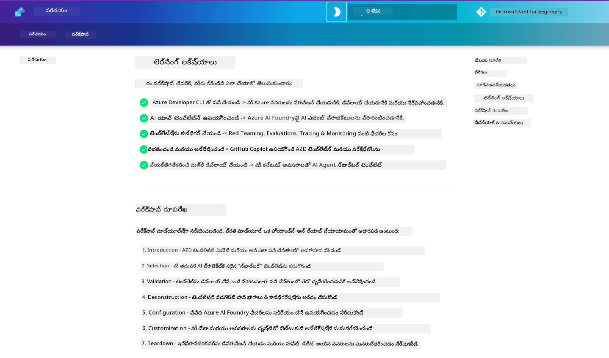

<div align="center">
  <div style="background: linear-gradient(135deg, #0078d4, #106ebe); border-radius: 10px; padding: 20px; margin: 20px 0; box-shadow: 0 4px 15px rgba(0, 120, 212, 0.3); border: 2px solid #005a9e;">
    <h2 style="color: white; margin: 0; font-size: 24px; text-shadow: 1px 1px 2px rgba(0,0,0,0.3);">
      🎯 AZD కోసం AI డెవలపర్లు వర్క్‌షాప్
    </h2>
    <p style="color: white; margin: 10px 0 0 0; font-size: 16px; text-shadow: 1px 1px 2px rgba(0,0,0,0.3);">
      <strong>Azure Developer CLI తో AI అనువర్తనాలను నిర్మించడానికి ఆచరణాత్మక వర్క్‌షాప్.</strong><br>
      AZD టెంప్లేట్లు మరియు AI డిప్లాయ్‌మెంట్ వర్క్‌ఫ్లోలను నైపుణ్యం చేయడానికి 7 మాడ్యూల్‌లు పూర్తి చేయండి.
    </p>
    <div style="margin-top: 15px;">
      <span style="background: rgba(255,255,255,0.2); padding: 5px 10px; border-radius: 15px; color: white; font-size: 14px;">
        📅 చివరిగా నవీకరించబడింది: మార్చి 2026
      </span>
    </div>
  </div>
</div>

# AZD కోసం AI డెవలపర్లు వర్క్‌షాప్

Azure Developer CLI (AZD) నేర్చుకునే, ముఖ్యంగా AI అనువర్తనాల డిప్లాయ్‌మెంట్‌పై దృష్టి సారించిన ఆచరణాత్మక వర్క్‌షాప్‌కు స్వాగతం. ఈ వర్క్‌షాప్ మీకు AZD టెంప్లేట్లను వినియోగపరంగా అర్థం చేసుకునే 3 దశల విధానంలో సహాయపడుతుంది:

1. **అన్వేషణ** - మీకు సరిపోయే టెంప్లేట్‌ను కనుగొనండి.
1. **డిప్లాయ్‌మెంట్** - డిప్లాయ్ చేసి అది పని చేస్తున్నదని ధృవీకరించండి
1. **అనుకూలీకరణ** - దాన్ని మార్చి మీకు తగినట్లుగా మెరుగుపరచండి!

ఈ వర్క్‌షాప్ సందర్భంగా, మేము మీకు ప్రధాన డెవలపర్ టూల్స్ మరియు వర్క్‌ఫ్లోలను కూడా పరిచయం చేస్తాము, ఇది మీ ఎండ్-టు-ఎండ్ అభివృద్ధి ప్రయాణాన్ని సులభతరం చేయడంలో మీకు సహాయపడుతుంది.

<br/>

## బ్రౌజర్ ఆధారిత మార్గదర్శకం

వర్క్‌షాప్ పాఠాలు Markdown లో ఉన్నాయి. మీరు వాటిని నేరుగా GitHubలో బ్రౌజ్ చేయవచ్చు - లేదా దిగువ స్క్రీన్‌షాట్‌లో చూపినట్లుగా బ్రౌజర్-ఆధారిత ప్రివ్యూ ప్రారంభించండి.



ఈ ఎంపికను ఉపయోగించడానికి - రిపొజిటరీని మీ ప్రొఫైల్‌కి fork చేయండి, మరియు GitHub Codespaces ను ప్రారంభించండి. VS Code టెర్మినల్ క్రియాశీలమయ్యాక, ఈ కమాండ్ టైప్ చేయండి:

This browser preview works in GitHub Codespaces, dev containers, or a local clone with Python and MkDocs installed.

```bash title="" linenums="0"
mkdocs serve > /dev/null 2>&1 &
```

In a few seconds, you will see a pop-up dialog. Select the option to `Open in browser`. The web-based guide will now open in a new browser tab. Some benefits of this preview:

1. **బిల్ట్-ఇన్ శోధన** - కీవర్డ్లు లేదా పాఠాలను వేగంగా కనుగొనండి.
1. **కాపీ ఐకాన్** - కోడ్‌బ్లాక్స్‌పై హోవర్ చేయి ఈ ఎంపికను చూడండి
1. **థీమ్ టాగుల్** - డార్క్ మరియు లైట్ థీమ్స్ మధ్య మార్చుకోండి
1. **సహాయం పొందండి** - చేరడానికి ఫూటర్‌లోని Discord ఐకాన్‌పై క్లిక్ చేయండి!

<br/>

## వర్క్‌షాప్ అవలోకనం

**వ్యవధి:** 3-4 గంటలు  
**స్థాయి:** ప్రారంభం నుంచి మధ్యంతర  
**అవసరమైన పరిజ్ఞానం:** Azure, AI కాన్సెప్ట్‌లు, VS Code & కమాండ్-లైన్ టూల్స్‌కి పరిచయం.

ఇది ఒక ఆచరణాత్మక వర్క్‌షాప్ — మీరు చేయడం ద్వారా నేర్చుకుంటారు. మీరు వ్యాయామాలు పూర్తి చేసిన తరువాత, మనం AZD For Beginners పాఠ్యक्रमాన్ని సమీక్షించమని సిఫార్సు చేస్తాం, దీని ద్వారా మీరు సెక్యూరిటీ మరియు ఉత్పాదకత ఉత్తమ ఆచరణలలో మీ శిక్షణ కొనసాగించవచ్చు.

| సమయం| మాడ్యూల్  | లక్ష్యం |
|:---|:---|:---|
| 15 నిమిషాలు | [పరిచయం](docs/instructions/0-Introduction.md) | స్థితిని ఏర్పాటు చేయండి, లక్ష్యాలను అర్థం చేసుకోండి |
| 30 నిమిషాలు | [AI టెంప్లేట్ ఎంచుకోండి](docs/instructions/1-Select-AI-Template.md) | ఎంపికలను అన్వేషించి స్టార్టర్‌ను ఎంచుకోండి | 
| 30 నిమిషాలు | [AI టెంప్లేట్‌ను ధృవీకరించండి](docs/instructions/2-Validate-AI-Template.md) | డిఫాల్ట్ సొల్యూషన్‌ను Azure కు డిప్లాయ్ చేయండి |
| 30 నిమిషాలు | [AI టెంప్లేట్‌ను విచ్ఛేదించండి](docs/instructions/3-Deconstruct-AI-Template.md) | నిర్మాణం మరియు కాన్ఫిగరేషన్‌ను పరిశీలించండి |
| 30 నిమిషాలు | [AI టెంప్లేట్‌ను కాన్ఫిగర్ చేయండి](docs/instructions/4-Configure-AI-Template.md) | ప్రాప్త ఫీచర్‌లను యాక్టివేట్ చేసి పరీక్షించండి |
| 30 నిమిషాలు | [AI టెంప్లేట్‌ను కస్టమైజ్ చేయండి](docs/instructions/5-Customize-AI-Template.md) | టెంప్లేట్‌ను మీ అవసరాలకు అనుగుణంగా మార్చండి |
| 30 నిమిషాలు | [ఇన్ఫ్రా తొలగింపు](docs/instructions/6-Teardown-Infrastructure.md) | క్లీన్‌అప్ చేసి రిసోర్సులను విడుదల చేయండి |
| 15 నిమిషాలు | [సారాంశం & తదుపరి దశలు](docs/instructions/7-Wrap-up.md) | లెర్నింగ్ రిసోర్సులు, వర్క్‌షాప్ ఛాలెంజ్ |

<br/>

## మీరు నేర్చుకునే విషయాలు

AZD టెంప్లేట్‌ను Microsoft Foundryపై ఎండ్తు-ఎండ్తు అభివృద్ధి కోసం వివిధ సామర్థ్యాలు మరియు టూల్స్‌ను అన్వేషించడానికి ఒక లెర్నింగ్ శాంబాక్స్‌గా పరిగణించండి. ఈ వర్క్‌షాప్ ముగిసినప్పుడు, మీరు ఈ సందర్భంలో వివిధ టూల్స్ మరియు కాన్సెప్ట్‌ల గురించి అవగాహన కలిగి ఉండాలి.

| కాన్సెప్ట్  | లక్ష్యం |
|:---|:---|
| **Azure Developer CLI** | టూల్ కమాండ్లు మరియు వర్క్‌ఫ్లోలను అర్థం చేసుకోండి |
| **AZD Templates**| ప్రాజెక్ట్ నిర్మాణం మరియు కాన్ఫిగ్‌ను అర్థం చేసుకోండి |
| **Azure AI Agent**| Microsoft Foundry ప్రాజెక్ట్‌ను ప్రొవిజన్ & డిప్లాయ్ చేయండి |
| **Azure AI Search**| ఏజెంట్లతో కాంటెక్స్ట్ ఇంజనీరింగ్ ను ఎనేబుల్ చేయండి |
| **Observability**| ట్రేసింగ్, మానిటరింగ్ మరియు మూల్యాంకనాలను పరిశీలించండి |
| **Red Teaming**| విరోధి పరీక్షలు మరియు ఉపశమన పద్ధతులను పరిశీలించండి |

<br/>

## వర్క్‌షాప్ నిర్మాణం

వర్క్‌షాప్ టెంప్లేట్ అన్వేషణ నుంచి డిప్లాయ్‌మెంట్, విచ్ఛేదనం మరియు అనుకూలీకరణ వరకు మీను తీసుకెళ్లే విధంగా నిర్మించబడింది - ఆధారంగా అధికారిక [AI ఏజెంట్స్‌తో ప్రారంభించండి](https://github.com/Azure-Samples/get-started-with-ai-agents) స్టార్టర్ టెంప్లేట్‌ను ఉపయోగిస్తుంది.

### [మాడ్యూల్ 1: AI టెంప్లేట్ ఎంచుకోండి](docs/instructions/1-Select-AI-Template.md) (30 నిమిషాలు)

- AI టెంప్లేట్స్ అంటే ఏమిటి?
- AI టెంప్లేట్స్‌ను నేను ఎక్కడ కనుగొనవచ్చు?
- AI ఏజెంట్స్‌ని నిర్మించడం ఎలా ప్రారంభించాలి?
- **ల్యాబ్**: Codespaces లేదా dev కంటైనర్‌లో క్విక్‌స్టార్ట్

### [మాడ్యూల్ 2: AI టెంప్లేట్‌ను ధృవీకరించండి](docs/instructions/2-Validate-AI-Template.md) (30 నిమిషాలు)

- AI టెంప్లేట్ ఆర్కిటెక్చర్ అంటే ఏమిటి?
- AZD డెవలప్‌మెంట్ వర్క్‌ఫ్లో ఏమిటి?
- AZD డెవలప్‌మెంట్‌లో సహాయం ఎలా పొందాలి?
- **ల్యాబ్**: AI ఏజెంట్స్ టెంప్లేట్‌ను డిప్లాయ్ చేసి ధృవీకరించండి

### [మాడ్యూల్ 3: AI టెంప్లేట్‌ను విచ్ఛేదించండి](docs/instructions/3-Deconstruct-AI-Template.md) (30 నిమిషాలు)

- మీ పరిసరాన్ని `.azure/` లో పరిశీలించండి
- మీ రిసోర్స్ సెటప్‌ను `infra/` లో పరిశీలించండి
- మీ AZD కాన్ఫిగరేషన్‌ను `azure.yaml`s లో పరిశీలించండి
- **ల్యాబ్**: ఎన్విరాన్‌మెంట్ వెరియబుల్స్‌ను మార్చి మళ్లీ డిప్లాయ్ చేయండి

### [మాడ్యూల్ 4: AI టెంప్లేట్‌ను కాన్ఫిగర్ చేయండి](docs/instructions/4-Configure-AI-Template.md) (30 నిమిషాలు)
- పరిశీలించండి: రీట్రీవల్ ఆగ్మెంటెడ్ జనరేషన్
- పరిశీలించండి: ఏజెంట్ మూల్యాంకనం & రెడ్-టీమింగ్
- పరిశీలించండి: ట్రేసింగ్ & మానిటరింగ్
- **ల్యాబ్**: AI ఏజెంట్ + ఆబ్జర్వబిలిటీని పరిశీలించండి 

### [మాడ్యూల్ 5: AI టెంప్లేట్‌ను కస్టమైజ్ చేయండి](docs/instructions/5-Customize-AI-Template.md) (30 నిమిషాలు)
- నిర్వచించండి: సన్నివేశ అవసరాలతో PRD
- కాన్ఫిగర్ చేయండి: AZD కోసం ఎన్విరాన్‌మెంట్ వెరియబుల్స్
- అమలు చేయండి: అదనపు పనుల కోసం లైఫ్‌సైకిల్ హుక్స్
- **ల్యాబ్**: నా సన్నివేశానికి టెంప్లేట్‌ను అనుకూలీకరించండి

### [మాడ్యూల్ 6: ఇన్ఫ్రాస్ట్రక్చర్‌ను తొలగించండి](docs/instructions/6-Teardown-Infrastructure.md) (30 నిమిషాలు)
- మళ్లీ గుర్తు చేసుకోండి: AZD టెంప్లేట్‌లు ఏమిటి?
- మళ్లీ గుర్తు చేసుకోండి: Azure Developer CLI ఎందుకు ఉపయోగించాలి?
- తదుపరి దశలు: వేరే టెంప్లేట్ ప్రయత్నించండి!
- **ల్యాబ్**: ఇన్‌ఫ్రాను డీప్రోవిజన్ చేసి క్లీన్‌అప్ చేయండి

<br/>

## వర్క్‌షాప్ ఛాలెంజ్

ఇంకా ఎక్కువ చేయడానికి మీమీద సవాలు వేయాలనుకుంటున్నారా? ఇక్కడ కొన్ని ప్రాజెక్ట్ సూచనలు ఉన్నాయి - లేదా మీ ఆలోచనలను మన వెంట పంచుకోండి!!

| ప్రాజెక్ట్ | వివరణ |
|:---|:---|
|1. **ఒక సంక్లిష్ట AI టెంప్లేట్‌ను విచ్ఛేదించండి** | మనం వివరిస్తున్న వర్క్‌ఫ్లో మరియు టూల్స్ ఉపయోగించి వేరే AI సొల్యూషన్ టెంప్లేట్‌ను డిప్లాయ్ చేయగలరా, ధృవీకరించగలరా, మరియు అనుకూలీకరించగలరా అని చూడండి. _మీరు ఏం నేర్చుకున్నారు?_|
|2. **మీ సన్నివేశానికి అనుగుణంగా అనుకూలీకరించండి**  | వేరే సన్నివేశానికి PRD (Product Requirements Document) రాయడానికి ప్రయత్నించండి. తర్వాత మీ టెంప్లేట్ రిపోలో GitHub Copilot ని Agent Model లో ఉపయోగించి - అది మీకు అనుకూలీకరణ వర్క్‌ఫ్లో రూపొందించమని అడగండి. _మీరు ఏమి నేర్చుకున్నారు? ఈ సూచనలను మీరు ఎలా మెరుగుపరచగలరు?_|
| | |

## ఫీడ్బ్యాక్ ఉందా?

1. ఈ రిపోలో ఒక ఇష్యూ పోస్ట్ చేయండి - సులభత కోసం దానికి `Workshop` ట్యాగ్ చేయండి.
1. Microsoft Foundry Discordలో చేరండి - మీ సహచరులతో కనెక్ట్ అవ్వండి!


| | | 
|:---|:---|
| **📚 కోర్సు హోమ్**| [AZD ప్రారంభికులకు](../README.md)|
| **📖 డాక్యుమెంటేషన్** | [AI టెంప్లేట్స్‌తో ప్రారంభించండి](https://learn.microsoft.com/en-us/azure/ai-foundry/how-to/develop/ai-template-get-started)|
| **🛠️AI టెంప్లేట్స్** | [Microsoft Foundry టెంప్లేట్స్](https://ai.azure.com/templates) |
|**🚀 తదుపరి దశలు** | [వర్క్‌షాప్ ప్రారంభించండి](#వర్క్‌షాప్-అవలోకనం) |
| | |

<br/>

---

**నావిగేషన్:** [ప్రధాన కోర్సు](../README.md) | [పరిచయం](docs/instructions/0-Introduction.md) | [మాడ్యూల్ 1: టెంప్లేట్ ఎంచుకోండి](docs/instructions/1-Select-AI-Template.md)

**AZD తో AI అనువర్తనాలను నిర్మించడం మొదలుపెట్టడానికి సిద్దమా?**

[వర్క్‌షాప్ ప్రారంభించండి: పరిచయం →](docs/instructions/0-Introduction.md)

---

<!-- CO-OP TRANSLATOR DISCLAIMER START -->
**Disclaimer**:
ఈ పత్రం AI అనువాద సేవ [Co-op Translator](https://github.com/Azure/co-op-translator) ఉపయోగించి అనువదించబడింది. మేము ఖచ్చితత్వానికి ప్రయత్నించినప్పటికీ, స్వయంచాలక అనువాదాల్లో తప్పులు లేదా లోపాలు ఉండవొచ్చు అని దయచేసి గమనించండి. మూల భాషలోని అసలు పత్రాన్ని ప్రామాణిక మూలంగా పరిగణించాలి. కీలక సమాచారానికి వృత్తిపరమైన మానవ అనువాదాన్ని సిఫార్సు చేస్తాము. ఈ అనువాదం వాడకంలో ఉత్పన్నమయ్యే ఏవైనా అపార్థాలు లేదా తప్పుదోషాలకి మేము బాధ్యులం కాదని తెలియజేయబడుతుంది.
<!-- CO-OP TRANSLATOR DISCLAIMER END -->