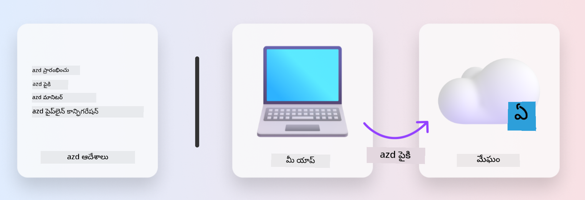

<!--
CO_OP_TRANSLATOR_METADATA:
{
  "original_hash": "06d6207eff634aefcaa41739490a5324",
  "translation_date": "2025-11-25T07:30:30+00:00",
  "source_file": "workshop/docs/instructions/1-Select-AI-Template.md",
  "language_code": "te"
}
-->
# 1. టెంప్లేట్‌ను ఎంచుకోండి

!!! tip "ఈ మాడ్యూల్ ముగిసే సమయానికి మీరు చేయగలరు"

    - [ ] AZD టెంప్లేట్లు ఏమిటో వివరించండి
    - [ ] AI కోసం AZD టెంప్లేట్లను కనుగొని ఉపయోగించండి
    - [ ] AI ఏజెంట్స్ టెంప్లేట్‌తో ప్రారంభించండి
    - [ ] **ల్యాబ్ 1:** GitHub Codespaces‌తో AZD క్విక్‌స్టార్ట్

---

## 1. ఒక బిల్డర్ అనలజీ

ఆధునిక ఎంటర్‌ప్రైజ్-రెడీ AI అప్లికేషన్‌ను _స్క్రాచ్ నుండి_ నిర్మించడం కష్టతరమైన పని. ఇది మీ కొత్త ఇంటిని మీరే ఇటుకలతో నిర్మించడంలా ఉంటుంది. అవును, ఇది సాధ్యమే! కానీ ఇది కావలసిన ఫలితాన్ని పొందడానికి అత్యంత సమర్థవంతమైన మార్గం కాదు!

దాని బదులుగా, మేము సాధారణంగా ఉన్న _డిజైన్ బ్లూప్రింట్_ తో ప్రారంభించి, దాన్ని మా వ్యక్తిగత అవసరాలకు అనుగుణంగా మార్చడానికి ఒక ఆర్కిటెక్ట్‌తో పని చేస్తాము. మరియు అదే విధానాన్ని తెలివైన అప్లికేషన్లను నిర్మించేటప్పుడు అనుసరించాలి. మొదట, మీ సమస్య స్థలానికి సరిపోయే మంచి డిజైన్ ఆర్కిటెక్చర్‌ను కనుగొనండి. ఆ తర్వాత మీ ప్రత్యేక పరిస్థితికి అనుగుణంగా పరిష్కారాన్ని అనుకూలీకరించి అభివృద్ధి చేయడానికి ఒక సొల్యూషన్ ఆర్కిటెక్ట్‌తో పని చేయండి.

కానీ ఈ డిజైన్ బ్లూప్రింట్లను ఎక్కడ కనుగొనవచ్చు? మరియు ఈ బ్లూప్రింట్లను అనుకూలీకరించి, మేమే వాటిని డిప్లాయ్ చేయడం ఎలా చేయాలో మాకు నేర్పించడానికి సిద్ధంగా ఉన్న ఆర్కిటెక్ట్‌ను ఎలా కనుగొనాలి? ఈ వర్క్‌షాప్‌లో, మేము ఈ ప్రశ్నలకు సమాధానాలు ఇస్తూ మీకు మూడు టెక్నాలజీలను పరిచయం చేస్తాము:

1. [Azure Developer CLI](https://aka.ms/azd) - స్థానిక అభివృద్ధి (బిల్డ్) నుండి క్లౌడ్ డిప్లాయ్‌మెంట్ (షిప్) వరకు డెవలపర్ మార్గాన్ని వేగవంతం చేసే ఓపెన్-సోర్స్ టూల్.
1. [Azure AI Foundry Templates](https://ai.azure.com/templates) - AI పరిష్కార ఆర్కిటెక్చర్‌ను డిప్లాయ్ చేయడానికి నమూనా కోడ్, ఇన్‌ఫ్రాస్ట్రక్చర్ మరియు కాన్ఫిగరేషన్ ఫైళ్లను కలిగి ఉన్న ప్రామాణిక ఓపెన్-సోర్స్ రిపోజిటరీలు.
1. [GitHub Copilot Agent Mode](https://code.visualstudio.com/docs/copilot/chat/chat-agent-mode) - Azure పరిజ్ఞానంతో నడిచే కోడింగ్ ఏజెంట్, ఇది కోడ్‌బేస్‌ను నావిగేట్ చేయడంలో మరియు మార్పులు చేయడంలో సహాయపడుతుంది - సహజ భాషను ఉపయోగించి.

ఈ టూల్స్‌తో, మేము ఇప్పుడు సరైన టెంప్లేట్‌ను _కనుగొనడం_, అది పనిచేస్తుందా అని _డిప్లాయ్ చేయడం_, మరియు మా ప్రత్యేక పరిస్థితులకు అనుగుణంగా _అనుకూలీకరించడం_ చేయవచ్చు. ఇవి ఎలా పనిచేస్తాయో తెలుసుకోవడానికి ముందుకు సాగుదాం.

---

## 2. Azure Developer CLI

[Azure Developer CLI](https://learn.microsoft.com/en-us/azure/developer/azure-developer-cli/) (లేదా `azd`) అనేది ఓపెన్-సోర్స్ కమాండ్‌లైన్ టూల్, ఇది మీ కోడ్-టు-క్లౌడ్ ప్రయాణాన్ని వేగవంతం చేయగలదు. ఇది IDE (అభివృద్ధి) మరియు CI/CD (డెవాప్స్) వాతావరణాలలో స్థిరంగా పనిచేసే డెవలపర్-ఫ్రెండ్లీ కమాండ్ల సెట్‌ను అందిస్తుంది.

`azd` తో, మీ డిప్లాయ్‌మెంట్ ప్రయాణం ఈ విధంగా సులభంగా ఉండవచ్చు:

- `azd init` - ఉన్న AZD టెంప్లేట్ నుండి కొత్త AI ప్రాజెక్ట్‌ను ప్రారంభిస్తుంది.
- `azd up` - ఇన్‌ఫ్రాస్ట్రక్చర్‌ను ప్రొవిజన్ చేసి, ఒకే దశలో మీ అప్లికేషన్‌ను డిప్లాయ్ చేస్తుంది.
- `azd monitor` - డిప్లాయ్ చేసిన అప్లికేషన్ కోసం రియల్-టైమ్ మానిటరింగ్ మరియు డయాగ్నోస్టిక్స్ పొందండి.
- `azd pipeline config` - Azureకి డిప్లాయ్‌మెంట్‌ను ఆటోమేట్ చేయడానికి CI/CD పైప్‌లైన్లను సెటప్ చేయండి.

**🎯 | వ్యాయామం**: <br/> GitHub Codespaces వాతావరణంలో `azd` కమాండ్‌లైన్ టూల్‌ను అన్వేషించండి. ఈ కమాండ్‌ను టైప్ చేయడం ద్వారా టూల్ ఏమి చేయగలదో చూడండి:

```bash title="" linenums="0"
azd help
```



---

## 3. AZD టెంప్లేట్

`azd` ఇది సాధించడానికి, ఇది ప్రొవిజన్ చేయాల్సిన ఇన్‌ఫ్రాస్ట్రక్చర్, అమలు చేయాల్సిన కాన్ఫిగరేషన్ సెట్టింగ్స్, మరియు డిప్లాయ్ చేయాల్సిన అప్లికేషన్ గురించి తెలుసుకోవాలి. ఇక్కడే [AZD టెంప్లేట్లు](https://learn.microsoft.com/en-us/azure/developer/azure-developer-cli/azd-templates?tabs=csharp) ఉపయోగపడతాయి.

AZD టెంప్లేట్లు ఓపెన్-సోర్స్ రిపోజిటరీలు, ఇవి నమూనా కోడ్‌తో పాటు పరిష్కార ఆర్కిటెక్చర్‌ను డిప్లాయ్ చేయడానికి అవసరమైన ఇన్‌ఫ్రాస్ట్రక్చర్ మరియు కాన్ఫిగరేషన్ ఫైళ్లను కలిగి ఉంటాయి.  
_ఇన్‌ఫ్రాస్ట్రక్చర్-ఆస్-కోడ్_ (IaC) విధానాన్ని ఉపయోగించడం ద్వారా, టెంప్లేట్ రిసోర్స్ నిర్వచనాలు మరియు కాన్ఫిగరేషన్ సెట్టింగ్స్‌ను వెర్షన్-కంట్రోల్ చేయవచ్చు (అప్లికేషన్ సోర్స్ కోడ్ మాదిరిగానే) - ఆ ప్రాజెక్ట్ వినియోగదారుల మధ్య పునర్వినియోగపరచదగిన మరియు స్థిరమైన వర్క్‌ఫ్లోలను సృష్టించడం.

మీ పరిస్థితికి AZD టెంప్లేట్‌ను సృష్టించడం లేదా ఉపయోగించడం గురించి ఆలోచించినప్పుడు, ఈ ప్రశ్నలను పరిగణించండి:

1. మీరు ఏమి నిర్మిస్తున్నారు? → ఆ పరిస్థితికి స్టార్టర్ కోడ్ కలిగిన టెంప్లేట్ ఉందా?
1. మీ పరిష్కారం ఎలా ఆర్కిటెక్ట్ చేయబడింది? → అవసరమైన వనరులు కలిగిన టెంప్లేట్ ఉందా?
1. మీ పరిష్కారం ఎలా డిప్లాయ్ చేయబడింది? → `azd deploy` తో ప్రీ/పోస్ట్-ప్రాసెసింగ్ హుక్స్ గురించి ఆలోచించండి!
1. దాన్ని మరింతగా ఎలా ఆప్టిమైజ్ చేయవచ్చు? → అంతర్గత మానిటరింగ్ మరియు ఆటోమేషన్ పైప్‌లైన్ల గురించి ఆలోచించండి!

**🎯 | వ్యాయామం**: <br/> 
[Awesome AZD](https://azure.github.io/awesome-azd/) గ్యాలరీని సందర్శించి, ప్రస్తుతం అందుబాటులో ఉన్న 250+ టెంప్లేట్లను అన్వేషించడానికి ఫిల్టర్లను ఉపయోగించండి. మీ పరిస్థితి అవసరాలకు సరిపోయే టెంప్లేట్‌ను కనుగొనగలరా చూడండి.


---

## 4. AI అప్లికేషన్ టెంప్లేట్లు

---

<!-- CO-OP TRANSLATOR DISCLAIMER START -->
**అస్వీకరణ**:  
ఈ పత్రం AI అనువాద సేవ [Co-op Translator](https://github.com/Azure/co-op-translator) ఉపయోగించి అనువదించబడింది. మేము ఖచ్చితత్వానికి ప్రయత్నిస్తున్నప్పటికీ, ఆటోమేటెడ్ అనువాదాలు తప్పులు లేదా అసమగ్రతలను కలిగి ఉండవచ్చు. దాని స్వదేశ భాషలో ఉన్న అసలు పత్రాన్ని అధికారం కలిగిన మూలంగా పరిగణించాలి. కీలకమైన సమాచారం కోసం, ప్రొఫెషనల్ మానవ అనువాదాన్ని సిఫారసు చేస్తాము. ఈ అనువాదం ఉపయోగం వల్ల కలిగే ఏవైనా అపార్థాలు లేదా తప్పుదారులు కోసం మేము బాధ్యత వహించము.
<!-- CO-OP TRANSLATOR DISCLAIMER END -->