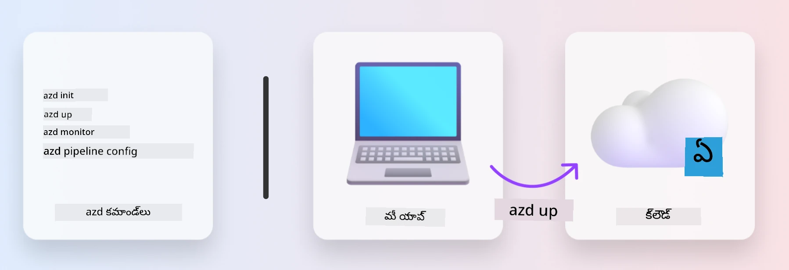
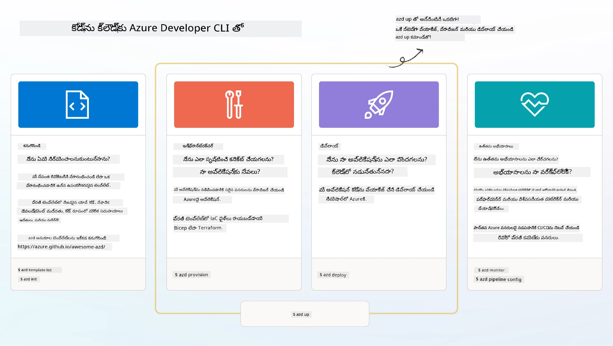

# 1. టెంప్లేట్‌ని ఎంచుకోండి

!!! tip "ఈ మాడ్యూల్ ముగిసే సరికి మీరు చేయగలుగుతారు"

    - [ ] AZD టెంప్లేట్స్ ఏమిటో వివరించండి
    - [ ] AI కోసం AZD టెంప్లేట్స్‌ను కనుగొని ఉపయోగించండి
    - [ ] AI Agents టెంప్లేట్‌తో ప్రారంభించండి
    - [ ] **ల్యాబ్ 1:** GitHub Codespacesతో AZD క్విక్స్టార్ట్

---

## 1. ఒక బిల్డర్ సారూప్యం

పూర్తిగా శూన్యంగా ప్రారంభించి ఆధునిక ఎంటర్‌ప్రైజ్-సిద్ధ AI అప్లికేషన్‌ను నిర్మించడం భయంకరంగా ఉండొచ్చు. ఇది మీ కొత్త ఇంటిని ఒక్కొక్క ఇటుకగా స్వయంగా నిర్మించడం లాంటిది. అవునా, అది చేయగలిగే పరిస్థితి ఉంది! కానీ ఇది కోరుకున్న తుది ఫలితాన్ని పొందడానికి అత్యంత సమర్థవంతమైన మార్గం కాదు।

దిన్నిబదులుగా, మనం సాధారణంగా ఇప్పటికే ఉన్న ఒక _డిజైన్ బ్లూప్రింట్_ తో ప్రారంభించి, మన వ్యక్తిగత అవసరాలకు అనుగుణంగా దాన్ని కస్టమైజ్ చేయడానికి ఒక ఆర్కిటెక్ట్‌తో పని చేస్తాం. ఇలాంటి ఆలోచనే తెలివైన అప్లికేషన్లు నిర్మిస్తున్నప్పుడు అనుసరించవలసిన విధానం. మొదట, మీ సమస్య పరిధికి సరిపోయే మంచి డిజైన్ ఆర్కిటెక్చర్‌ను కనుగొనండి. తర్వాత మీ ప్రత్యేక పరిస్థితులకు అనుగుణంగా పరిష్కారాన్ని కస్టమైజ్ చేయడానికి ఒక సొల్యూషన్ ఆర్కిటెక్ట్‌తో పని చేయండి.

కానీ ఈ డిజైన్ బ్లూప్రింట్‌లను ఎక్కడ కనుగొనాలి? మరియు ఈ బ్లూప్రింట్‌లను స్వయంగా కస్టమైజ్ చేసి డిప్లాయ్ చేయడం నేర్పే ఆర్కిటెక్ట్ని ఎలా కనుగొనాలి? ఈ వర్క్‌షాప్‌లో, మేము ఈ ప్రశ్నలకు స్పందిస్తూ మీకు మూడు టెక్నాలజీలను పరిచయం చేస్తాము:

1. [Azure Developer CLI](https://aka.ms/azd) - ఒక ఓపెన్-సోర్స్ టూల్, ఇది స్థానిక డెవలప్‌మెంట్ (build) నుంచి క్లౌడ్ డిప్లాయ్మెంట్ (ship) దాకా డెవలపర్ మార్గాన్ని వేగవంతం చేస్తుంది.
1. [Microsoft Foundry Templates](https://ai.azure.com/templates) - ఉదాహరణ కోడ్, ఇంఫ్రాస్ట్రక్చర్ మరియు కన్ఫిగరేషన్ ఫైళ్లను కలిగిన, AI సొల్యూషన్ ఆర్కిటెక్చర్‌ను డిప్లాయ్ చేయడానికి ఉపయోగించే స్టాండర్డైజ్డ్ ఓపెన్-సోర్స్ రిపాజిటరీలు.
1. [GitHub Copilot Agent Mode](https://code.visualstudio.com/docs/copilot/chat/chat-agent-mode) - Azure పరిజ్ఞానంపై ఆధారపడి కోడ్‌బేస్‌ను నావిగేట్ చేయడంలో మరియు మార్పులు చేయడంలో సహాయపడే, సహజభాషలో మార్గనిర్దేశం చేసే కోడింగ్ ఏజెంట్.

ఈ టూల్స్ తో మన దగ్గర, ఇప్పుడు సరైన టెంప్లేట్‌ను _కనుక్కోవచ్చ_", దానిని పనిచేస్తుందో లేదో పరీక్షించేందుకు _డిప్లాయ్_ చేయవచ్చు, మరియు మన ప్రత్యేక సందర్భాలకు అనుగుణంగా దాన్ని _కస్టమైజ్_ చేయవచ్చు. ఇవి ఎలా పనిచేస్తాయో తెలుసుకుందాం.


---

## 2. Azure Developer CLI

The [Azure Developer CLI](https://learn.microsoft.com/en-us/azure/developer/azure-developer-cli/) (or `azd`) ఒక ఓపెన్-సోర్స్ కమాండ్‌లైన్ టూల్, ఇది మీ కోడ్-టి-క్లౌడ్ ప్రస్థానాన్ని వేగవంతం చేయగల డెవలపర్-ఫ్రెండ్లీ కమాండ్ల సెట్‌ను అందిస్తుంది, ఇవి మీ IDE (development) మరియు CI/CD (devops) పరిసరాల్లో సక్రమంగా పని చేస్తాయి.

With `azd`, your deployment journey can be as simple as:

- `azd init` - ఒక ఉన్న AZD టెంప్లేట్ నుండి కొత్త AI ప్రాజెక్ట్‌ను ప్రారంభిస్తుంది.
- `azd up` - ఒక చిరునామాలో ఇంఫ్రాస్ట్రక్చర్‌నుProvision చేసి, మీ అప్లికేషన్‌ను ఒకే దశలో డిప్లాయ్ చేస్తుంది.
- `azd monitor` - మీ డిప్లాయ్ చేసిన అప్లికేషన్ కోసం రియల్-టైమ్ మానిటరింగ్ మరియు డయాగ్నొస్టిక్స్ పొందండి.
- `azd pipeline config` - Azure కి ఆటోమేషన్ డిప్లాయ్‌మెంట్ కోసం CI/CD పైప్లైన్లను సెటప్ చేయండి.

**🎯 | అభ్యాసం**: <br/> Explore the `azd` commandline tool in your GitHub Codespaces environment now. Start by typing this command to see what the tool can do:

```bash title="" linenums="0"
azd help
```



---

## 3. AZD టెంప్లెట్

For `azd` to achieve this, it needs to know the infrastructure to provision, the configuration settings to enforce, and the application to deploy. This is where [AZD templates](https://learn.microsoft.com/en-us/azure/developer/azure-developer-cli/azd-templates?tabs=csharp) come in. 

AZD టెంప్లేట్లు ఉదాహరణ కోడ్‌ను ఇంఫ్రాస్ట్రక్చర్ మరియు కాన్ఫిగరేషన్ ఫైళ్లతో కలిపి ఉన్న ఓపెన్-సోర్స్ రిపాజిటరీలు. అవి _Infrastructure-as-Code_ (IaC) విధానాన్ని ఉపయోగించి, టెంప్లేట్ రిసోర్సు నిర్వచనాలు మరియు కాన్ఫిగరేషన్ సెట్టింగ్స్‌ను (అప్లికేషన్ సోర్స్ కోడ్ లా) వెర్షన్-కంట్రోల్ చేయడానికి అనుమతిస్తాయి - దీని ద్వారా ప్రాజెక్ట్ వినియోగదారుల మధ్య పునఃఉపయోగయోగ్యమైన మరియు సుసంపన్న వర్క్‌ఫ్లోలు సృష్టించబడుతాయి.

When creating or reusing an AZD template for _your_ scenario, consider these questions:

1. What are you building? → Is there a template that has starter code for that scenario?
1. How is your solution architected? → Is there a template that has the necessary resources?
1. How is your solution deployed? → Think `azd deploy` with pre/post-processing hooks!
1. How can you optimize it further? → Think built-in monitoring and automation pipelines!

**🎯 | అభ్యాసం**: <br/> 
సందర్శించండి [Awesome AZD](https://azure.github.io/awesome-azd/) గ్యాలరీని మరియు ఫిల్టర్లను ఉపయోగించి ప్రస్తుతం అందుబాటులో ఉన్న 250+ టెంప్లేట్స్‌ని అన్వేషించండి. మీ సందర్భ అవసరాలకు అనుగుణంగా ఒకటి కనుగొనగలరా చూడండి.



---

## 4. AI App Templates

AI శక్తినిచ్చే అప్లికేషన్ల కోసం, Microsoft ప్రత్యేక టెంప్లేట్స్‌ను **Microsoft Foundry** మరియు **Foundry Agents** లక్ష్యం గా అందిస్తుంది. ఈ టెంప్లేట్లు మీరు బొధించిన, ప్రెడక్షన్-సిద్ధ అప్లికేషన్లు నిర్మించడానికి మీ మార్గాన్ని వేగవంతం చేస్తాయి.

### Microsoft Foundry & Foundry Agents Templates

Select a template below to deploy. Each template is available on [Awesome AZD](https://azure.github.io/awesome-azd/) and can be initialized with a single command.

| Template | Description | Deploy Command |
|----------|-------------|----------------|
| **[AI Chat with RAG](https://azure.github.io/awesome-azd/?tags=ai&tags=rag)** | Chat application with Retrieval Augmented Generation using Microsoft Foundry | `azd init -t azure-samples/azure-search-openai-demo` |
| **[Foundry Agent Service Starter](https://azure.github.io/awesome-azd/?tags=ai&tags=agents)** | Build AI agents with Foundry Agents for autonomous task execution | `azd init -t azure-samples/foundry-agent-service-starter` |
| **[Multi-Agent Orchestration](https://azure.github.io/awesome-azd/?tags=ai&tags=agents)** | Coordinate multiple Foundry Agents for complex workflows | `azd init -t azure-samples/multi-agent-orchestration` |
| **[AI Document Intelligence](https://azure.github.io/awesome-azd/?tags=ai&tags=document)** | Extract and analyze documents with Microsoft Foundry models | `azd init -t azure-samples/ai-document-processing` |
| **[Conversational AI Bot](https://azure.github.io/awesome-azd/?tags=ai&tags=bot)** | Build intelligent chatbots with Microsoft Foundry integration | `azd init -t azure-samples/ai-chat-protocol` |
| **[AI Image Generation](https://azure.github.io/awesome-azd/?tags=ai&tags=dalle)** | Generate images using DALL-E via Microsoft Foundry | `azd init -t azure-samples/ai-image-generation` |
| **[Semantic Kernel Agent](https://azure.github.io/awesome-azd/?tags=ai&tags=semantic-kernel)** | AI agents using Semantic Kernel with Foundry Agents | `azd init -t azure-samples/semantic-kernel-agent` |
| **[AutoGen Multi-Agent](https://azure.github.io/awesome-azd/?tags=ai&tags=autogen)** | Multi-agent systems using AutoGen framework | `azd init -t azure-samples/autogen-multi-agent` |

### Quick Start

1. **Browse templates**: Visit [https://azure.github.io/awesome-azd/](https://azure.github.io/awesome-azd/) and filter by `AI`, `Agents`, or `Microsoft Foundry`
2. **Select your template**: Choose one that matches your use case
3. **Initialize**: Run the `azd init` command for your chosen template
4. **Deploy**: Run `azd up` to provision and deploy

**🎯 | అభ్యాసం**: <br/>
మీ సందర్భం ఆధారంగా పై టెంప్లేట్స్‌లోని ఒకటిని ఎన్నుకోండి:

- **భార్యంగా చాట్‌బాట్ నిర్మిస్తున్నారా?** → **AI Chat with RAG** లేదా **Conversational AI Bot** తో ప్రారంభించండి
- **స్వయంచాలక ఏజెంట్లు కావాలా?** → **Foundry Agent Service Starter** లేదా **Multi-Agent Orchestration** లను ప్రయత్నించండి
- **డాక్యుమెంట్స్ ప్రాసెసింగ్ చేస్తున్నారా?** → **AI Document Intelligence** ని ఉపయోగించండి
- **AI కోడింగ్ సహాయం కావాలా?** → **Semantic Kernel Agent** లేదా **AutoGen Multi-Agent** ను అన్వేషించండి

```bash title="Example: Deploy the AI Chat with RAG template" linenums="0"
azd init -t azure-samples/azure-search-openai-demo
azd up
```

!!! info "మరిన్ని టెంప్లేట్స్ అన్వేషించండి"
    [Awesome AZD Gallery](https://azure.github.io/awesome-azd/)లో 250+ టెంప్లేట్స్ ఉన్నాయి. భాష, ఫ్రేమ్‌వర్క్, మరియు Azure సర్వీసుల కోసం మీ నిర్దిష్ట అవసరాలకు సరిపడే టెంప్లేట్స్‌ను కనుగొనడానికి ఫిల్టర్లను ఉపయోగించండి.

---

<!-- CO-OP TRANSLATOR DISCLAIMER START -->
నిరాకరణ:
ఈ పత్రాన్ని AI అనువాద సేవ [Co-op Translator](https://github.com/Azure/co-op-translator) ద్వారా అనువదించబడింది. మేము ఖచ్చితత్వాన్ని లక్ష్యంగా పెట్టుకున్నప్పటికీ, స్వయంచాలిత అనువాదాలలో తప్పులు లేదా అసంపూర్ణతలు ఉండొచ్చు. మూల భాషలో ఉన్న అసలైన పత్రాన్ని అధికారిక మూలంగా పరిగణించాలి. కీలకమైన సమాచారం కోసం వృత్తిపరమైన మానవ అనువాదాన్ని సిఫార్సు చేయబడుతుంది. ఈ అనువాదాన్ని ఉపయోగించడం వల్ల కలిగే ఏవైనా అవగాహన లోపాలు లేదా తప్పుదсоциа? אנו? — క్షమించండి. తుది వాక్యం సరి చేయాలి.

Replace last sentence properly: "ఈ అనువాదాన్ని ఉపయోగించడం వల్ల కలిగే ఏవైనా అవగాహన లోపాలు లేదా తప్పుదోషాలందుకు మేము బాధ్యులు కాదని గమనించండి."

I'll produce final message.
<!-- CO-OP TRANSLATOR DISCLAIMER END -->