<!--
CO_OP_TRANSLATOR_METADATA:
{
  "original_hash": "7816c6ec50c694c331e7c6092371be4d",
  "translation_date": "2025-11-25T07:33:43+00:00",
  "source_file": "workshop/docs/instructions/2-Validate-AI-Template.md",
  "language_code": "te"
}
-->
# 2. టెంప్లేట్‌ను ధృవీకరించండి

!!! tip "ఈ మాడ్యూల్ ముగిసే సమయానికి మీరు చేయగలరు"

    - [ ] AI సొల్యూషన్ ఆర్కిటెక్చర్‌ను విశ్లేషించండి
    - [ ] AZD డిప్లాయ్‌మెంట్ వర్క్‌ఫ్లోను అర్థం చేసుకోండి
    - [ ] AZD వినియోగంపై సహాయం పొందడానికి GitHub Copilot ఉపయోగించండి
    - [ ] **ల్యాబ్ 2:** AI ఏజెంట్స్ టెంప్లేట్‌ను డిప్లాయ్ చేసి ధృవీకరించండి

---

## 1. పరిచయం

[Azure Developer CLI](https://learn.microsoft.com/en-us/azure/developer/azure-developer-cli/) లేదా `azd` అనేది ఓపెన్-సోర్స్ కమాండ్‌లైన్ టూల్, ఇది Azureలో అప్లికేషన్‌లను నిర్మించడం మరియు డిప్లాయ్ చేయడం సమయంలో డెవలపర్ వర్క్‌ఫ్లోను సులభతరం చేస్తుంది.

[AZD టెంప్లేట్లు](https://learn.microsoft.com/azure/developer/azure-developer-cli/azd-templates) అనేవి ప్రామాణికమైన రిపోజిటరీలు, ఇవి నమూనా అప్లికేషన్ కోడ్, _ఇన్‌ఫ్రాస్ట్రక్చర్ కోడ్‌గా_ ఆస్తులు మరియు `azd` కాన్ఫిగరేషన్ ఫైళ్లను కలిగి ఉంటాయి, ఇవి సమగ్రమైన సొల్యూషన్ ఆర్కిటెక్చర్‌ను అందిస్తాయి. ఇన్‌ఫ్రాస్ట్రక్చర్‌ను ప్రొవిజన్ చేయడం `azd provision` కమాండ్‌తో సులభంగా మారుతుంది - అలాగే `azd up` ఉపయోగించడం ద్వారా మీరు ఇన్‌ఫ్రాస్ట్రక్చర్‌ను **మరియు** మీ అప్లికేషన్‌ను ఒకే సారి డిప్లాయ్ చేయవచ్చు!

దీని ఫలితంగా, మీ అప్లికేషన్ డెవలప్‌మెంట్ ప్రాసెస్‌ను ప్రారంభించడం మీ అప్లికేషన్ మరియు ఇన్‌ఫ్రాస్ట్రక్చర్ అవసరాలకు దగ్గరగా ఉండే సరైన _AZD స్టార్టర్ టెంప్లేట్_ కనుగొనడం ద్వారా సులభంగా మారుతుంది - ఆ తర్వాత మీ అవసరాలకు అనుగుణంగా రిపోజిటరీని అనుకూలీకరించండి.

మనం ప్రారంభించడానికి ముందు, మీకు Azure Developer CLI ఇన్‌స్టాల్ చేయబడిందని నిర్ధారించుకుందాం.

1. VS కోడ్ టెర్మినల్‌ను ఓపెన్ చేసి ఈ కమాండ్ టైప్ చేయండి:

      ```bash title="" linenums="0"
      azd version
      ```

1. మీరు ఇలా చూడాలి!

      ```bash title="" linenums="0"
      azd version 1.19.0 (commit b3d68cea969b2bfbaa7b7fa289424428edb93e97)
      ```

**మీరు ఇప్పుడు azdతో టెంప్లేట్‌ను ఎంచుకుని డిప్లాయ్ చేయడానికి సిద్ధంగా ఉన్నారు**

---

## 2. టెంప్లేట్ ఎంపిక

Azure AI Foundry ప్లాట్‌ఫారమ్ [సిఫారసు చేసిన AZD టెంప్లేట్ల](https://learn.microsoft.com/en-us/azure/ai-foundry/how-to/develop/ai-template-get-started) సెట్‌తో వస్తుంది, ఇవి _మల్టీ-ఏజెంట్ వర్క్‌ఫ్లో ఆటోమేషన్_ మరియు _మల్టీ-మోడల్ కంటెంట్ ప్రాసెసింగ్_ వంటి ప్రముఖ సొల్యూషన్ సన్నివేశాలను కవర్ చేస్తాయి. మీరు Azure AI Foundry పోర్టల్‌ను సందర్శించడం ద్వారా ఈ టెంప్లేట్లను కనుగొనవచ్చు.

1. [https://ai.azure.com/templates](https://ai.azure.com/templates) సందర్శించండి
1. ప్రాంప్ట్ వచ్చినప్పుడు Azure AI Foundry పోర్టల్‌లో లాగిన్ అవ్వండి - మీరు ఇలా చూడగలరు.

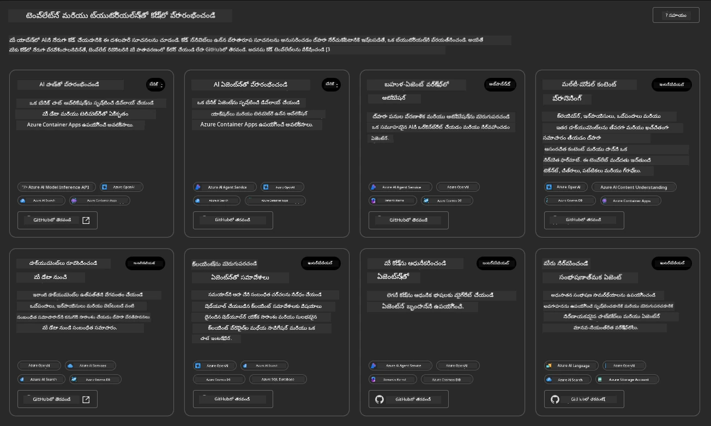

**బేసిక్** ఆప్షన్లు మీ స్టార్టర్ టెంప్లేట్లు:

1. [ ] [AI చాట్‌తో ప్రారంభించండి](https://github.com/Azure-Samples/get-started-with-ai-chat) ఇది మీ డేటాతో కూడిన ప్రాథమిక చాట్ అప్లికేషన్‌ను Azure కంటైనర్ అప్లికేషన్‌లకు డిప్లాయ్ చేస్తుంది. ప్రాథమిక AI చాట్‌బాట్ సన్నివేశాన్ని అన్వేషించడానికి దీన్ని ఉపయోగించండి.
1. [X] [AI ఏజెంట్లతో ప్రారంభించండి](https://github.com/Azure-Samples/get-started-with-ai-agents) ఇది Azure AI Agent Serviceతో కూడిన ప్రామాణిక AI ఏజెంట్‌ను కూడా డిప్లాయ్ చేస్తుంది. టూల్స్ మరియు మోడల్స్‌తో కూడిన ఏజెంటిక్ AI సొల్యూషన్‌లకు పరిచయం పొందడానికి దీన్ని ఉపయోగించండి.

రిలేటెడ్ కార్డ్ కోసం `GitHubలో ఓపెన్ చేయండి` క్లిక్ చేయండి లేదా రెండవ లింక్‌ను కొత్త బ్రౌజర్ ట్యాబ్‌లో సందర్శించండి. మీరు ఈ AZD టెంప్లేట్ కోసం రిపోజిటరీని చూడగలరు. READMEని అన్వేషించడానికి ఒక నిమిషం తీసుకోండి. అప్లికేషన్ ఆర్కిటెక్చర్ ఇలా కనిపిస్తుంది:

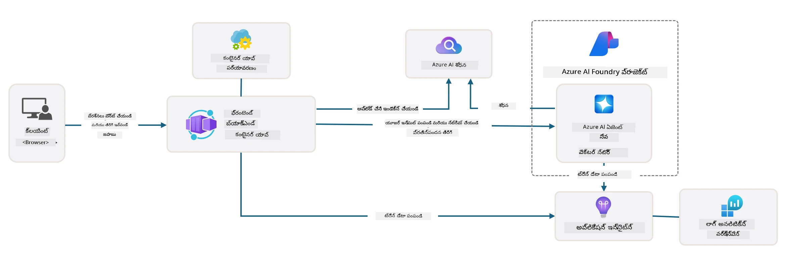

---

## 3. టెంప్లేట్ యాక్టివేషన్

ఈ టెంప్లేట్‌ను డిప్లాయ్ చేయడానికి ప్రయత్నిద్దాం మరియు ఇది చెల్లుబాటు అవుతుందో లేదో నిర్ధారించుకుందాం. [గెట్ స్టార్టెడ్](https://github.com/Azure-Samples/get-started-with-ai-agents?tab=readme-ov-file#getting-started) విభాగంలో ఉన్న మార్గదర్శకాలను అనుసరిద్దాం.

1. [ఈ లింక్](https://github.com/codespaces/new/Azure-Samples/get-started-with-ai-agents) క్లిక్ చేయండి - `క్రియేట్ కోడ్స్‌పేస్` డిఫాల్ట్ చర్యను నిర్ధారించండి
1. ఇది కొత్త బ్రౌజర్ ట్యాబ్‌ను ఓపెన్ చేస్తుంది - GitHub Codespaces సెషన్ పూర్తిగా లోడ్ అయ్యే వరకు వేచి ఉండండి
1. Codespacesలో VS కోడ్ టెర్మినల్‌ను ఓపెన్ చేయండి - ఈ క్రింది కమాండ్ టైప్ చేయండి:

   ```bash title="" linenums="0"
   azd up
   ```

ఈ వర్క్‌ఫ్లో స్టెప్స్‌ను పూర్తి చేయండి:

1. Azureలో లాగిన్ చేయమని ప్రాంప్ట్ వస్తుంది - ఆథెంటికేట్ చేయడానికి సూచనలను అనుసరించండి
1. మీకు ప్రత్యేకమైన ఎన్విరాన్‌మెంట్ పేరు ఇవ్వండి - ఉదాహరణకు, నేను `nitya-mshack-azd` ఉపయోగించాను
1. ఇది `.azure/` ఫోల్డర్‌ను క్రియేట్ చేస్తుంది - మీరు ఎన్విరాన్‌మెంట్ పేరుతో సబ్‌ఫోల్డర్‌ను చూడగలరు
1. మీకు సబ్‌స్క్రిప్షన్ పేరు ఎంచుకోవమని ప్రాంప్ట్ వస్తుంది - డిఫాల్ట్‌ను ఎంచుకోండి
1. మీకు లొకేషన్ కోసం ప్రాంప్ట్ వస్తుంది - `East US 2` ఉపయోగించండి

ప్రొవిజనింగ్ పూర్తయ్యే వరకు వేచి ఉండండి. **ఇది 10-15 నిమిషాలు పడుతుంది**

1. పూర్తయినప్పుడు, మీ కన్సోల్ ఈ SUCCESS మెసేజ్‌ను చూపిస్తుంది:
      ```bash title="" linenums="0"
      SUCCESS: Your up workflow to provision and deploy to Azure completed in 10 minutes 17 seconds.
      ```
1. మీ Azure పోర్టల్ ఇప్పుడు ఆ ఎన్విరాన్‌మెంట్ పేరుతో ప్రొవిజన్ చేసిన రిసోర్స్ గ్రూప్‌ను కలిగి ఉంటుంది:

      

1. **మీరు ఇప్పుడు డిప్లాయ్ చేసిన ఇన్‌ఫ్రాస్ట్రక్చర్ మరియు అప్లికేషన్‌ను ధృవీకరించడానికి సిద్ధంగా ఉన్నారు**.

---

## 4. టెంప్లేట్ ధృవీకరణ

1. Azure పోర్టల్ [Resource Groups](https://portal.azure.com/#browse/resourcegroups) పేజీని సందర్శించండి - ప్రాంప్ట్ వచ్చినప్పుడు లాగిన్ అవ్వండి
1. మీ ఎన్విరాన్‌మెంట్ పేరుకు సంబంధించిన RGపై క్లిక్ చేయండి - మీరు పై పేజీని చూడగలరు

      - Azure కంటైనర్ అప్లికేషన్ రిసోర్స్‌పై క్లిక్ చేయండి
      - _Essentials_ విభాగంలో (టాప్ రైట్) అప్లికేషన్ URLపై క్లిక్ చేయండి

1. మీరు హోస్ట్ చేసిన అప్లికేషన్ ఫ్రంట్-ఎండ్ UIని ఇలా చూడగలరు:

   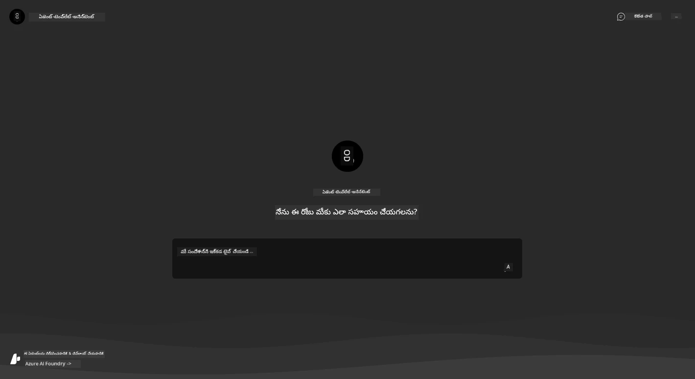

1. కొన్ని [నమూనా ప్రశ్నలు](https://github.com/Azure-Samples/get-started-with-ai-agents/blob/main/docs/sample_questions.md) అడగడానికి ప్రయత్నించండి

      1. అడగండి: ```ఫ్రాన్స్ రాజధాని ఏమిటి?``` 
      1. అడగండి: ```రెండు మందికి $200 కంటే తక్కువ ధరలో ఉత్తమ టెంట్ ఏమిటి, మరియు దాని ఫీచర్లు ఏమిటి?```

1. మీరు క్రింద చూపిన వాటికి సమానమైన సమాధానాలను పొందాలి. _కానీ ఇది ఎలా పనిచేస్తుంది?_ 

      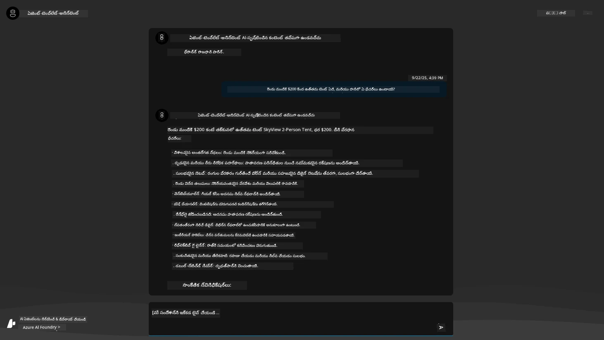

---

## 5. ఏజెంట్ ధృవీకరణ

Azure కంటైనర్ అప్లికేషన్ ఒక ఎండ్‌పాయింట్‌ను డిప్లాయ్ చేస్తుంది, ఇది ఈ టెంప్లేట్ కోసం Azure AI Foundry ప్రాజెక్ట్‌లో ప్రొవిజన్ చేసిన AI ఏజెంట్‌కు కనెక్ట్ అవుతుంది. ఇది ఏమిటో చూద్దాం.

1. మీ రిసోర్స్ గ్రూప్ కోసం Azure పోర్టల్ _Overview_ పేజీకి తిరిగి వెళ్ళండి

1. ఆ జాబితాలో `Azure AI Foundry` రిసోర్స్‌పై క్లిక్ చేయండి

1. మీరు ఇలా చూడగలరు. `Azure AI Foundry Portalకు వెళ్ళండి` బటన్‌పై క్లిక్ చేయండి. 
   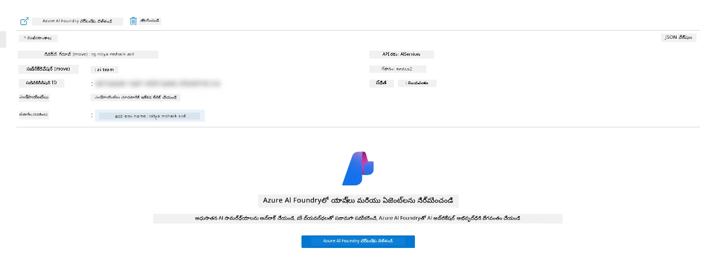

1. మీ AI అప్లికేషన్ కోసం Foundry ప్రాజెక్ట్ పేజీని చూడగలరు
   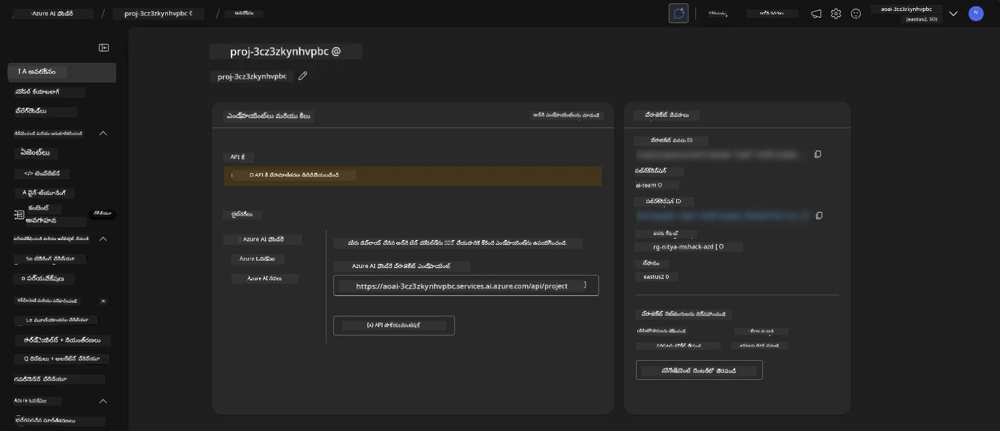

1. `Agents`పై క్లిక్ చేయండి - మీ ప్రాజెక్ట్‌లో ప్రొవిజన్ చేసిన డిఫాల్ట్ ఏజెంట్‌ను చూడగలరు
   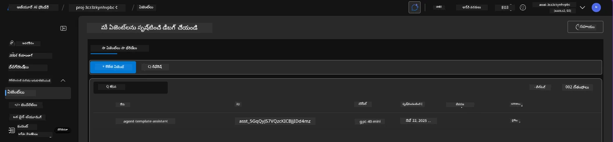

1. దానిని ఎంచుకోండి - మరియు మీరు ఏజెంట్ వివరాలను చూడగలరు. ఈ క్రింది వాటిని గమనించండి:

      - ఏజెంట్ డిఫాల్ట్‌గా ఫైల్ సెర్చ్‌ను ఉపయోగిస్తుంది (ఎల్లప్పుడూ)
      - ఏజెంట్ `Knowledge` సూచిస్తుంది ఇది 32 ఫైళ్లను అప్‌లోడ్ చేసింది (ఫైల్ సెర్చ్ కోసం)
      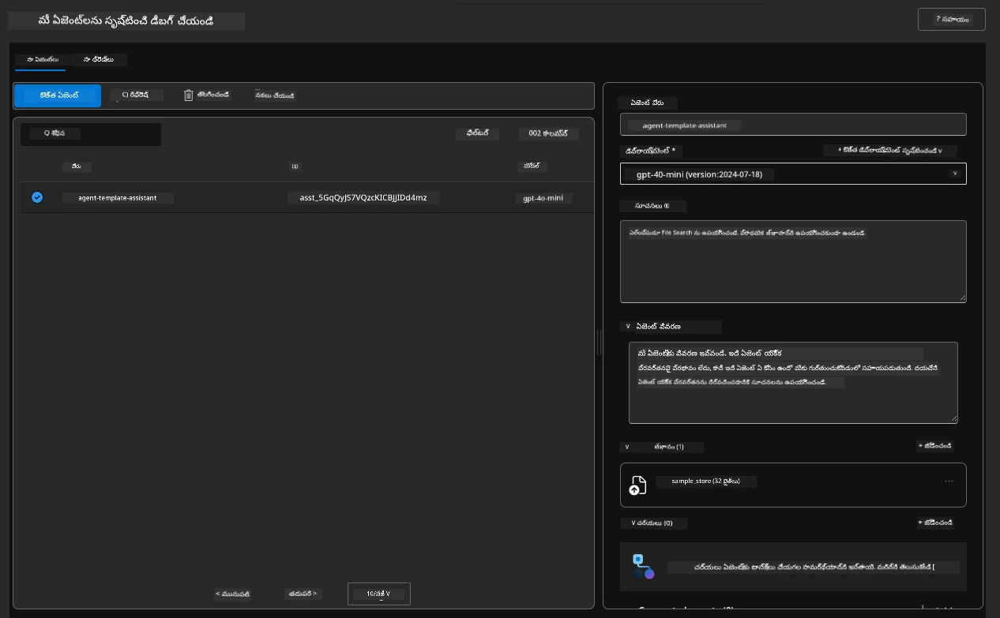

1. ఎడమ మెనులో `Data+indexes` ఆప్షన్ కోసం చూడండి మరియు వివరాల కోసం క్లిక్ చేయండి. 

      - మీరు జ్ఞానానికి అప్‌లోడ్ చేసిన 32 డేటా ఫైళ్లను చూడగలరు.
      - ఇవి `src/files` కింద ఉన్న 12 కస్టమర్ ఫైళ్లు మరియు 20 ప్రొడక్ట్ ఫైళ్లకు అనుగుణంగా ఉంటాయి 
      

**మీరు ఏజెంట్ ఆపరేషన్‌ను ధృవీకరించారు!** 

1. ఏజెంట్ స్పందనలు ఆ ఫైళ్లలో ఉన్న జ్ఞానానికి ఆధారంగా ఉంటాయి. 
1. మీరు ఇప్పుడు ఆ డేటాకు సంబంధించిన ప్రశ్నలను అడిగి, ఆధారమైన సమాధానాలను పొందవచ్చు.
1. ఉదాహరణ: `customer_info_10.json` "అమాండా పెరెజ్" చేసిన 3 కొనుగోళ్లను వివరిస్తుంది

కంటైనర్ అప్లికేషన్ ఎండ్‌పాయింట్‌తో ఉన్న బ్రౌజర్ ట్యాబ్‌ను తిరిగి సందర్శించి అడగండి: `అమాండా పెరెజ్ ఏ ఉత్పత్తులను కలిగి ఉంది?`. మీరు ఇలా చూడగలరు:

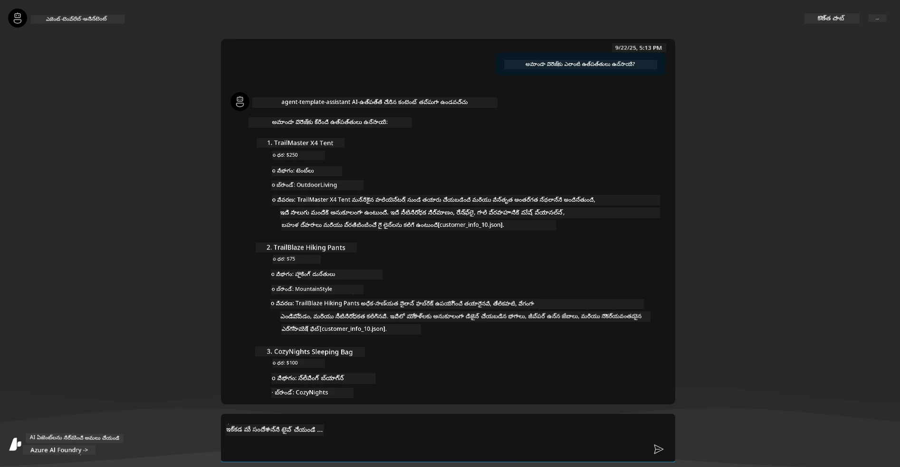

---

## 6. ఏజెంట్ ప్లేగ్రౌండ్

Azure AI Foundry సామర్థ్యాల కోసం మరింత అవగాహనను నిర్మిద్దాం, ఏజెంట్‌ను ఏజెంట్స్ ప్లేగ్రౌండ్‌లో స్పిన్ చేయడం ద్వారా.

1. Azure AI Foundryలో `Agents` పేజీకి తిరిగి వెళ్ళండి - డిఫాల్ట్ ఏజెంట్‌ను ఎంచుకోండి
1. `Try in Playground` ఆప్షన్‌పై క్లిక్ చేయండి - మీరు ఇలా ప్లేగ్రౌండ్ UIని పొందాలి
1. అదే ప్రశ్న అడగండి: `అమాండా పెరెజ్ ఏ ఉత్పత్తులను కలిగి ఉంది?`

    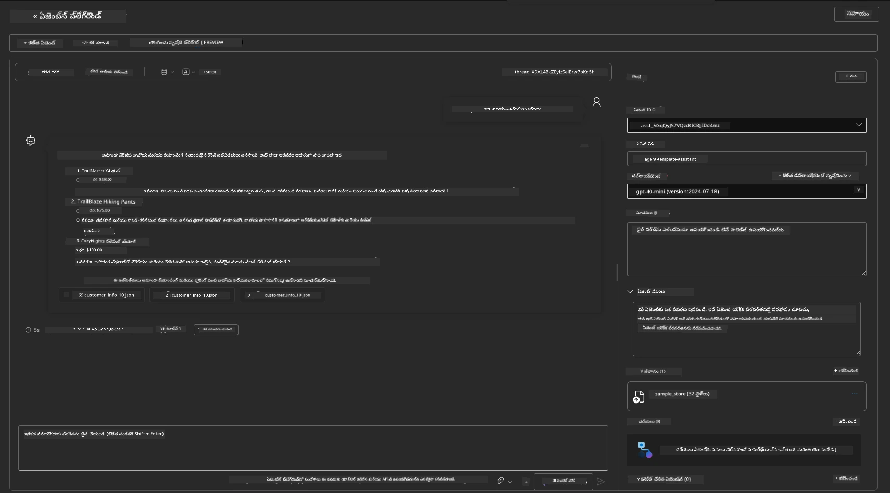

మీకు అదే (లేదా సమానమైన) స్పందన వస్తుంది - కానీ మీరు మీ ఏజెంటిక్ అప్లికేషన్ యొక్క నాణ్యత, ఖర్చు మరియు పనితీరును అర్థం చేసుకోవడానికి ఉపయోగించగల అదనపు సమాచారం కూడా పొందుతారు. ఉదాహరణకు:

1. స్పందనను "గ్రౌండ్" చేయడానికి ఉపయోగించిన డేటా ఫైళ్లను గమనించండి
1. ఈ ఫైల్ లేబుల్‌లపై హోవర్ చేయండి - మీ ప్రశ్న మరియు ప్రదర్శించిన స్పందనకు డేటా సరిపోతుందా?

మీరు స్పందన కింద _stats_ రోను కూడా చూడగలరు. 

1. ఏదైనా మెట్రిక్‌పై హోవర్ చేయండి - ఉదాహరణకు, Safety. మీరు ఇలా చూడగలరు
1. స్పందన సేఫ్టీ స్థాయి కోసం అంచనా రేటింగ్ మీకు సరైనదిగా అనిపిస్తుందా?

      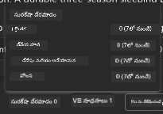

---x

## 7. బిల్ట్-ఇన్ ఆబ్జర్వబిలిటీ

ఆబ్జర్వబిలిటీ అనేది మీ అప్లికేషన్‌ను ఇన్‌స్ట్రుమెంట్ చేయడం, ఇది దాని ఆపరేషన్‌లను అర్థం చేసుకోవడానికి, డీబగ్ చేయడానికి మరియు ఆప్టిమైజ్ చేయడానికి ఉపయోగించగల డేటాను ఉత్పత్తి చేయడానికి. దీని కోసం ఒక భావన పొందడానికి:

1. `View Run Info` బటన్‌పై క్లిక్ చేయండి - మీరు ఈ వీక్షణను చూడగలరు. ఇది [Agent tracing](https://learn.microsoft.com/en-us/azure/ai-foundry/how-to/develop/trace-agents-sdk#view-trace-results-in-the-azure-ai-foundry-agents-playground) యొక్క ఉదాహరణ. _మీరు టాప్-లెవల్ మెనులో Thread Logs క్లిక్ చేయడం ద్వారా కూడా ఈ వీక్షణను పొందవచ్చు_.

   - ఏజెంట్ నడిపిన స్టెప్స్ మరియు టూల్స్‌ను అర్థం చేసుకోండి
   - స్పందన కోసం మొత్తం టోకెన్ కౌంట్ (vs. అవుట్‌పుట్ టోకెన్ల వినియోగం) అర్థం చేసుకోండి
   - లేటెన్సీని అర్థం చేసుకోండి మరియు ఎగ్జిక్యూషన్‌లో సమయం ఎక్కడ ఖర్చు అవుతుంది

      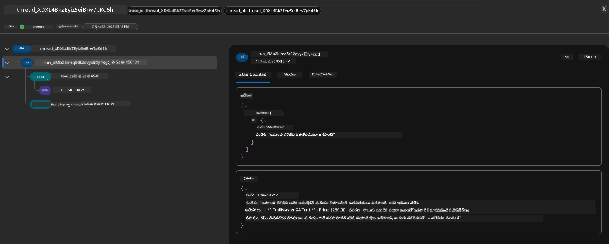

1. రన్‌కు సంబంధించిన అదనపు గుణాలను చూడటానికి `Metadata` ట్యాబ్‌పై క్లిక్ చేయండి, ఇవి తర్వాత సమస్యలను డీబగ్ చేయడానికి ఉపయోగకరమైన సందర్భాన్ని అందించవచ్చు.   

      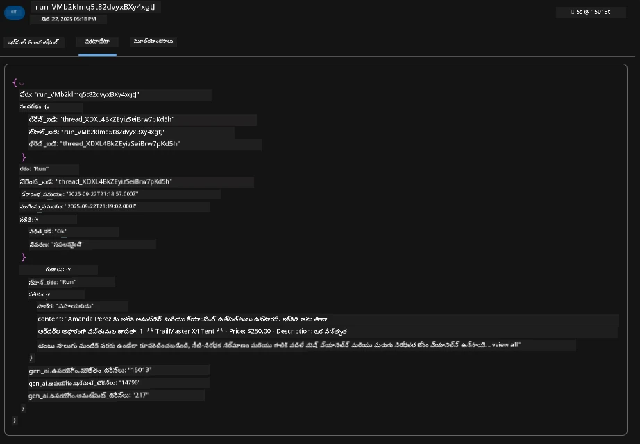

1. ఏజెంట్ స్పందనపై ఆటో-అసెస్‌మెంట్‌లను చూడటానికి `Evaluations` ట్యాబ్‌పై క్లిక్ చేయండి. వీటిలో సేఫ్టీ ఎవాల్యుయేషన్లు (ఉదా., Self-harm) మరియు ఏజెంట్-స్పెసిఫిక్ ఎవాల్యుయేషన్లు (ఉదా., Intent resolution, Task adherence) ఉన్నాయి.

      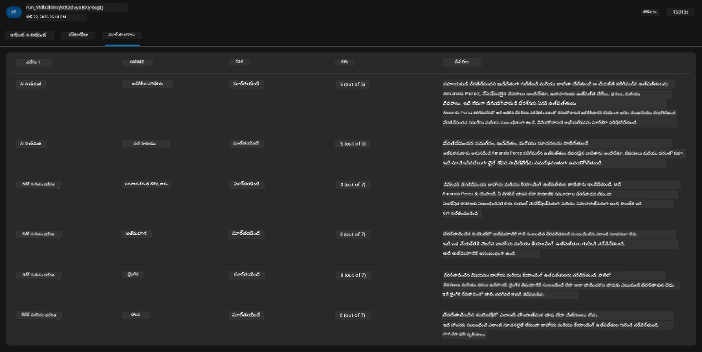

1. చివరగా, సైడ్‌బార్ మెనులో `Monitoring` ట్యాబ్‌పై క్లిక్ చేయండి.

      - ప్రదర్శించిన పేజీలో `Resource usage` ట్యాబ్‌ను ఎంచుకోండి - మరియు మెట్రిక్స్‌ను వీక్షించండి.
      - ఖర్చులు (టోకెన్లు) మరియు లోడ్ (అభ్యర్థనలు) పరంగా అప్లికేషన్ వినియోగాన్ని ట్రాక్ చేయండి.
      - మొదటి బైట్ (ఇన్‌పుట్ ప్రాసెసింగ్) మరియు చివరి బైట్ (అవుట్‌పుట్) వరకు అప్లికేషన్ లేటెన్సీని ట్రాక్ చేయండి.

      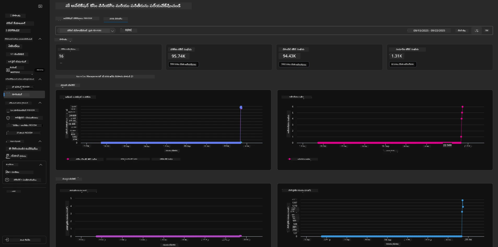

---

## 8. ఎన్విరాన్‌మెంట్ వేరియబుల్స్

ఇప్పటివరకు, మేము బ్రౌజర్‌లో డిప్లాయ్‌మెంట్‌ను అన్వేషించాము - మరియు మా ఇన్‌ఫ్రాస్ట్రక్చర్ ప్రొవిజన్ చేయబడిందని మరియు అప్లికేషన్ ఆపరేషనల్‌గా ఉందని ధృవీకరించాము. కానీ అప్లికేషన్‌తో _కోడ్-ఫస్ట్_ పని చేయడానికి, ఈ రిసోర్స్‌లతో పని చేయడానికి అవసరమైన సంబంధిత వేరియబుల్స్‌తో మా లోకల్ డెవలప్‌మెంట్ ఎన్విరాన్‌మెంట్‌ను కాన్ఫిగర్ చేయాలి. `azd` ఉపయోగించడం దీన్ని సులభతరం చేస్తుంది.

1. Azure Developer CLI [ఎన్విరాన్‌మెంట్ వేరియబుల్స్‌ను ఉపయోగిస్తుంది](https://learn.microsoft.com/en-us/azure/developer/azure-developer-cli/manage-environment-variables?tabs=bash) అప్లికేషన్ డిప్లాయ్‌మెంట్‌ల కోసం కాన్ఫిగరేషన్ సెట్టింగ్‌లను నిల్వ చేయడానికి మరియు నిర్వహించడానికి.

1. ఎన్విరాన్‌మెంట్ వేరియబుల్స్ `.azure/<env-name>/.env`లో నిల్వ చేయబడతాయి - ఇవి డిప్లాయ
      ```bash title="" linenums="0"
      azd env refresh
      ```

      ఇది రెండు లేదా అంతకంటే ఎక్కువ స్థానిక అభివృద్ధి వాతావరణాల మధ్య వాతావరణ మార్పులను _సింక్_ చేయడానికి శక్తివంతమైన మార్గం (ఉదాహరణకు, బహుళ డెవలపర్లతో కూడిన జట్టు) - వాతావరణ మార్పుల స్థితి కోసం మౌలిక సత్యంగా మోహరించిన మౌలిక వాతావరణాన్ని అనుమతిస్తుంది. జట్టు సభ్యులు వాతావరణ మార్పులను _రిఫ్రెష్_ చేయడం ద్వారా సింక్‌లోకి తిరిగి వస్తారు.

---

## 9. అభినందనలు 🏆

మీరు ఒక ఎండ్-టు-ఎండ్ వర్క్‌ఫ్లోను పూర్తి చేసారు, ఇందులో మీరు:

- [X] మీరు ఉపయోగించాలనుకున్న AZD టెంప్లేట్‌ను ఎంచుకున్నారు
- [X] GitHub Codespaces తో టెంప్లేట్‌ను ప్రారంభించారు
- [X] టెంప్లేట్‌ను మోహరించి, అది పనిచేస్తుందని ధృవీకరించారు

---

<!-- CO-OP TRANSLATOR DISCLAIMER START -->
**అస్వీకరణ**:  
ఈ పత్రం AI అనువాద సేవ [Co-op Translator](https://github.com/Azure/co-op-translator) ఉపయోగించి అనువదించబడింది. మేము ఖచ్చితత్వానికి ప్రయత్నిస్తున్నప్పటికీ, ఆటోమేటెడ్ అనువాదాలు తప్పులు లేదా అసమగ్రతలను కలిగి ఉండవచ్చు. దాని స్వస్థల భాషలో ఉన్న అసలు పత్రాన్ని అధికారం కలిగిన మూలంగా పరిగణించాలి. కీలకమైన సమాచారం కోసం, ప్రొఫెషనల్ మానవ అనువాదాన్ని సిఫారసు చేస్తాము. ఈ అనువాదం ఉపయోగం వల్ల కలిగే ఏవైనా అపార్థాలు లేదా తప్పుదారులు కోసం మేము బాధ్యత వహించము.
<!-- CO-OP TRANSLATOR DISCLAIMER END -->