# 2. టెంప్లేట్‌ను ధృవీకరించండి

!!! tip "ఈ మాడ్యూల్ ముగిసేప/png్ మీరు చేయగలిగేది"

    - [ ] AI సొల్యూషన్ ఆర్కిటెక్చర్‌ను విశ్లేషించండి
    - [ ] AZD డిప్లాయ్‌మెంట్ వర్క్‌ఫ్లోను అర్థం చేసుకోండి
    - [ ] AZD వాడకంపై సహాయం కోసం GitHub Copilot ను ఉపయోగించండి
    - [ ] **ల్యాబ్ 2:** AI ఏజెంట్స్ టెంప్లేట్‌ను డిప్లాయ్ & ధృవీకరించండి

---


## 1. పరిచయం

[Azure Developer CLI](https://learn.microsoft.com/en-us/azure/developer/azure-developer-cli/) లేదా `azd` అనేది ఓపెన్సోర్స్ కమాండ్‌లైన్ టూల్, ఇది Azure కు అప్లికేషన్లు నిర్మించడం మరియు డిప్లాయ్ చేయడం సమయంలో డెవలపర్ వర్క్‌ఫ్లోను సరళీకృతం చేస్తుంది.

[AZD Templates](https://learn.microsoft.com/azure/developer/azure-developer-cli/azd-templates) అనేవి ప్రమాణీకృత రిపాజిటరీలు, ఇవి నమూనా అప్లికేషన్ కోడ్, _ఇన్ఫ్రాస్ట్రక్చర్-ఏస్-కోడ్_ ఆస్థులు, మరియు `azd` కాన్ఫిగరేషన్ ఫైళ్లను ఒక సూమేళిత సొల్యూషన్ ఆర్కిటెక్చర్ కోసం కలిగి ఉంటాయి. ఇన్ఫ్రాస్ట్రక్చర్‌ను provision చేయడం ఒక `azd provision` కమాండ్ మాదిరిగానే సులభం — మరియు `azd up` ను ఉపయోగించడం ద్వారా మీరు ఒకేసారి ఇన్ఫ్రాస్ట్రక్చర్‌ను provision చేసి మీ అప్లికేషన్‌ను కూడా డిప్లాయ్ చేయగలirsiniz!

ఫలితంగా, మీ అప్లికేషన్ మరియు ఇన్ఫ్రాస్ట్రక్చర్ అవసరాలకు అనుకూలంగా ఉన్న సరైన _AZD Starter template_ ను కనుగొనడం ద్వారా మీ అప్లికేషన్ అభివృద్ధి ప్రక్రియను త్వరగా ప్రారంభించుకోవచ్చు - ఆ తరువాత రిపాజిటరీని మీ సన్నివేశ అవసరాలకు అనుగుణంగా కస్టమైజ్ చేయండి.

మనం మొదలు పెట్టేము ముందు, మీ వద్ద Azure Developer CLI ఇన్‌స్టాలేషన్ ఉందని నిర్ధారిద్దాం.

1. VS Code టెర్మినల్ ఓపెన్ చేసి ఈ కమాండ్ టైప్ చేయండి:

      ```bash title="" linenums="0"
      azd version
      ```

1. మీరు ఇలాంటిది చూడాలి!

      ```bash title="" linenums="0"
      azd version 1.19.0 (commit b3d68cea969b2bfbaa7b7fa289424428edb93e97)
      ```

**ఇప్పుడు మీరు azd తో టెంప్లేట్‌ని ఎంపిక చేసి డిప్లాయ్ చేయడానికి సిద్ధంగా ఉన్నారు**

---

## 2. టెంప్లేట్ ఎంపిక

Microsoft Foundry ప్లాట్‌ఫారమ్ కొద్ది మంది వినియోగించే పరిష్కార సన్నివేశాలను కవరింగ్ చేసే [సిఫార్సు చేసిన AZD టెంప్లెట్ల సెట్](https://learn.microsoft.com/en-us/azure/ai-foundry/how-to/develop/ai-template-get-started) తో వస్తుంది—ఉదాహరణకు _బహు-ఏజెంట్ వర్క్‌ఫ్లో ఆటోమేషన్_ మరియు _బహು-మోఢల్ కంటెంట్ ప్రాసెసింగ్_. మీరు ఈ టెంప్లెట్లను Microsoft Foundry పోర్టల్ ను సందర్శించడం ద్వారా కూడా కనుగొనవచ్చు.

1. [https://ai.azure.com/templates](https://ai.azure.com/templates) ను సందర్శించండి
1. ప్రాంప్ట్ వచ్చినప్పుడు Microsoft Foundry పోర్టల్‌కి లాగిన్ అవ్వండి - మీరు ఇలాంటిది చూస్తారు.

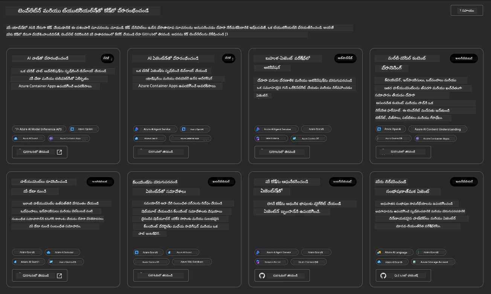


**Basic** ఎంపికలు మీ స్టార్టర్ టెంప్లెట్లు:

1. [ ] [Get Started with AI Chat](https://github.com/Azure-Samples/get-started-with-ai-chat) ఇది ఒక బేసిక్ చాట్ అప్లికేషన్‌ను _మీ డేటాతో_ Azure Container Apps లో డిప్లాయ్ చేస్తుంది. బేసిక్ AI చాట్‌బాట్ సన్నివేశాన్ని అన్వేషించడానికి దీన్ని ఉపయోగించండి.
1. [X] [Get Started with AI Agents](https://github.com/Azure-Samples/get-started-with-ai-agents) ఇది కూడా ఒక స్టాండర్డ్ AI ఏజెంట్ (Foundry Agents తో) ని డిప్లాయ్ చేస్తుంది. టూల్‌లు మరియు మోడల్స్ కలిగిన ఏజెంటిక్ AI సొల్యూషన్‌లను పరిచయం అవ్వడానికి దీన్ని ఉపయోగించండి.

రిలేటెడ్ కార్డ్ కోసం రెండవ లింక్‌ను కొత్త బ్రౌజర్ టాబ్‌లో తెరవండి (లేదా `Open in GitHub` క్లిక్ చేయండి). మీరు ఈ AZD టెంప్లేట్ రిపాజిటరీని చూడాలి. READMEని ఒక నిమిషం పరిశీలించండి. అప్లికేషన్ ఆర్కిటెక్చర్ ఇలాఉంటే ఉంటుంది:

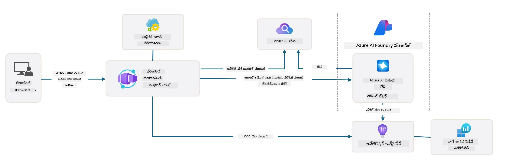

---

## 3. టెంప్లేట్ యాక్టివేషన్

ఈ టెంప్లేట్‌ను డిప్లాయ్ చేసి అది చెల్లుబాటు అయ్యిందో లేదో చూద్దాం. మనం [Getting Started](https://github.com/Azure-Samples/get-started-with-ai-agents?tab=readme-ov-file#getting-started) సెక్షన్‌లోని మార్గదర్శకాలను అనుసరించబోతున్నాము.

1. ఈ లింక్‌పై క్లిక్ చేయండి: [this link](https://github.com/codespaces/new/Azure-Samples/get-started-with-ai-agents) - `Create codespace` ను డిఫాల్ట్ చర్యగా నిర్ధారించండి
1. ఇది ఒక కొత్త బ్రౌజర్ టాబ్‌ను తెరుస్తుంది - GitHub Codespaces సెషన్ లోడ్ అవ్వడానికి వేచి ఉండండి
1. Codespaces లోని VS Code టెర్మినల్ ఓపెన్ చేయండి - క్రింది కమాండ్ టైప్ చేయండి:

   ```bash title="" linenums="0"
   azd up
   ```

ఇది ట్రిగ్గర్ చేసే వర్క్‌ఫ్లో దశలను పూర్తి చేయండి:

1. మీకు Azure లో లాగిన్ చేయమని ప్రాంప్ట్ వస్తుంది - ఆటెంటికేట్ చేయడానికి సూచనలను అనుసరించండి
1. మీ కోసం ఒక ప్రత్యేక environment name నమోదు చేయండి - ఉదా., నేను `nitya-mshack-azd` ను ఉపయోగించాను
1. ఇది `.azure/` ఫోల్డర్‌ను సృష్టిస్తుంది - మీరు ఆ env name తో ఒక సబ్‌ఫోల్డర్‌ను చూడగలుగుతారు
1. మీకు subscription name ఎంచుకోవాలని అడిగారు - డిఫాల్ట్‌ను ఎంచుకోండి
1. మీకు location అడిగారు - `East US 2` ఉపయోగించండి

ఇప్పుడీ provisioning పూర్తి కావడానికి మీరు వేచి ఉండాలి. **ఇది 10-15 నిమిషాలు పడుతుంది**

1. పూర్తైనప్పుడు, మీ కన్సోల్ SUCCESS సందేశం ఇలాంటిది చూపిస్తుంది:
      ```bash title="" linenums="0"
      SUCCESS: Your up workflow to provision and deploy to Azure completed in 10 minutes 17 seconds.
      ```
1. ఇప్పుడు మీ Azure పోర్టల్‌లో ఆ env name తో ఒక provision చేయబడిన resource group ఉంటుంది:

      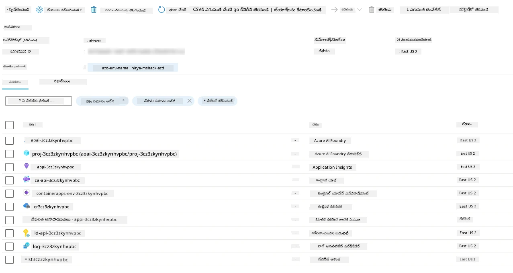

1. **ఇప్పుడు మీరు డిప్లాయ్ చేసిన ఇన్ఫ్రాస్ట్రక్చర్ మరియు అప్లికేషన్‌ను ధృవీకరించడానికి సిద్ధంగా ఉన్నారు**.

---

## 4. టెంప్లేట్ ధృవీకరణ

1. Azure పోర్టల్ [Resource Groups](https://portal.azure.com/#browse/resourcegroups) పేజీని సందర్శించండి - ప్రాంప్ట్ వచ్చినప్పుడు లాగిన్ చేయండి
1. మీ environment name కోసం ఉన్న RG పై క్లిక్ చేయండి - పై పేజీని మీరు చూస్తారు

      - Azure Container Apps resource పై క్లిక్ చేయండి
      - _Essentials_ సెక్షన్ (పైన కుడి) లోని Application Url పై క్లిక్ చేయండి

1. మీరు ఈ రకం హోస్ట్ చేయబడిన అప్లికేషన్ ఫ్రంట్-ఎండ్ UI చూడగలరు:

   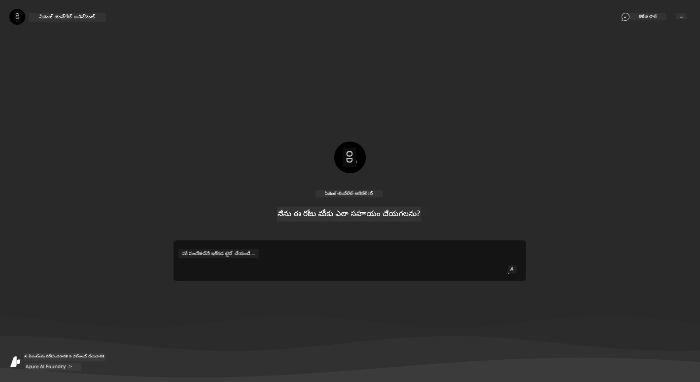

1. కొన్ని [నమూనా ప్రశ్నలు](https://github.com/Azure-Samples/get-started-with-ai-agents/blob/main/docs/sample_questions.md) అడిగి చూడండి

      1. అడగండి: ```What is the capital of France?``` 
      1. అడగండి: ```What's the best tent under $200 for two people, and what features does it include?```

1. మీరు క్రింద చూపించిన దానికి సందేహించదగ్గ సమాధానాలు పొందాలి. _కానీ ఇది ఎలా పని చేస్తుంది?_

      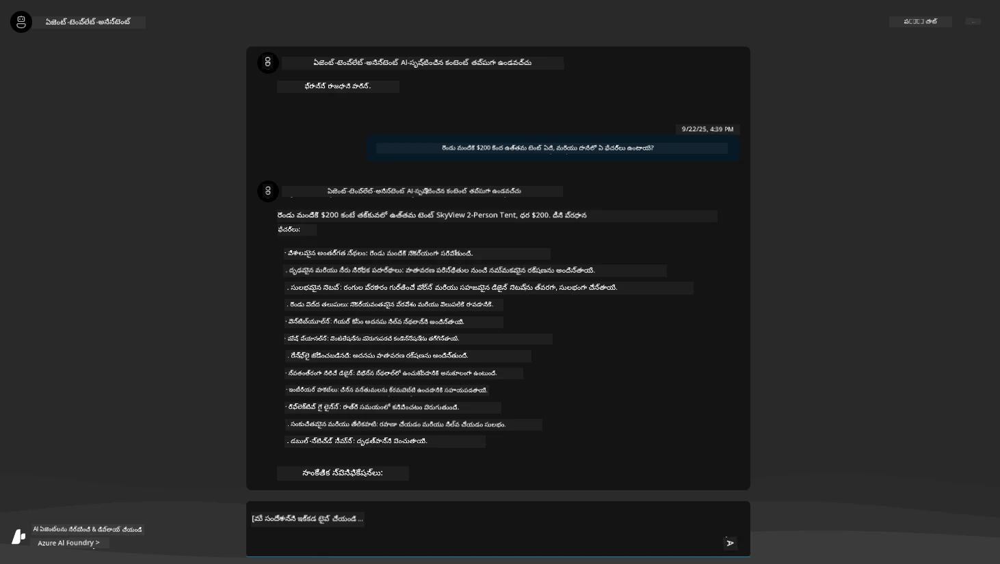

---

## 5. ఏజెంట్ ధృవీకరణ

Azure Container App ఒక ఎండ్‌పాయింట్‌ను డిప్లాయ్ చేస్తుంది ఇది ఈ టెంప్లేట్ కోసం Microsoft Foundry ప్రాజెక్ట్‌లో provision చేయబడిన AI ఏజెంట్‌కు కనెక్ట్ అవుతుంది. దీని అర్థాన్ని చూస్తే ఇలా ఉంటుంది.

1. మీ resource group కోసం Azure పోర్టల్ _Overview_ పేజీకి తిరిగి వచ్చి

1. ఆ జాబితాలోని `Microsoft Foundry` resource పై క్లిక్ చేయండి

1. మీరు ఇది చూడగలరు. `Go to Microsoft Foundry Portal` బటన్‌ను క్లిక్ చేయండి.
   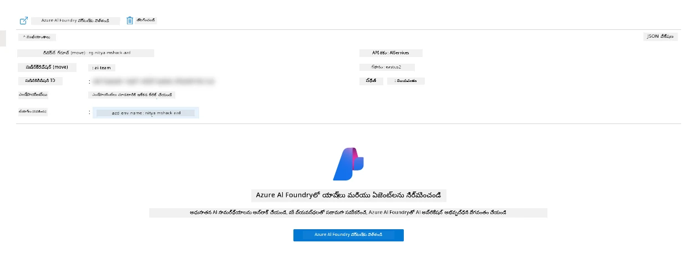

1. మీ AI అప్లికేషన్ కోసం Foundry Project పేజీ మీరు చూస్తారు
   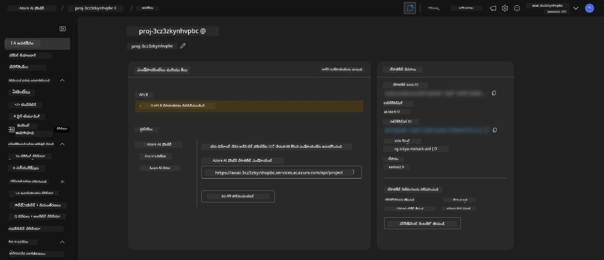

1. `Agents` పై క్లిక్ చేయండి - మీ ప్రాజెక్ట్‌లో provision చేయబడిన డిఫాల్ట్ ఏజెంట్ కనిపిస్తుంది
   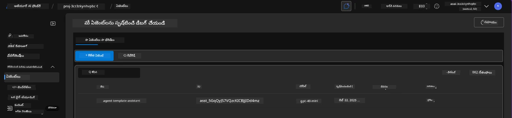

1. దాన్ని సెలెక్ట్ చేయండి - మీరు ఏజెంట్ వివరాలను చూస్తారు. క్రిందివి గమనించండి:

      - ఏజెంట్ డిఫాల్ట్‌గా File Search ను ఉపయోగిస్తుంది (ఎప్పుడూ)
      - ఏజెంట్ `Knowledge` తో సూచిస్తుంది ఇది 32 ఫైళ్లను అప్లోడ్ చేసుకున్నట్టు సూచిస్తుంది (ఫైల్ సెర్చ్ కోసం)
      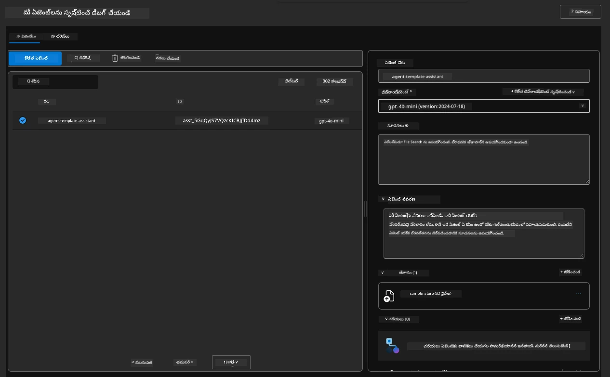

1. ఎడమ మెను లో `Data+indexes` ఆప్షన్ కోసం చూడండి మరియు వివరాల కోసం క్లిక్ చేయండి.

      - మీరు నాలుగవ 32 డేటా ఫైళ్లు నోట్ చేయగలరు అవి జ్ఞానానికి అప్లోడ్ చేయబడ్డాయి.
      - ఇవి `src/files` లోని 12 customer ఫైల్స్ మరియు 20 product ఫైల్స్‌కు అనువైనవి
      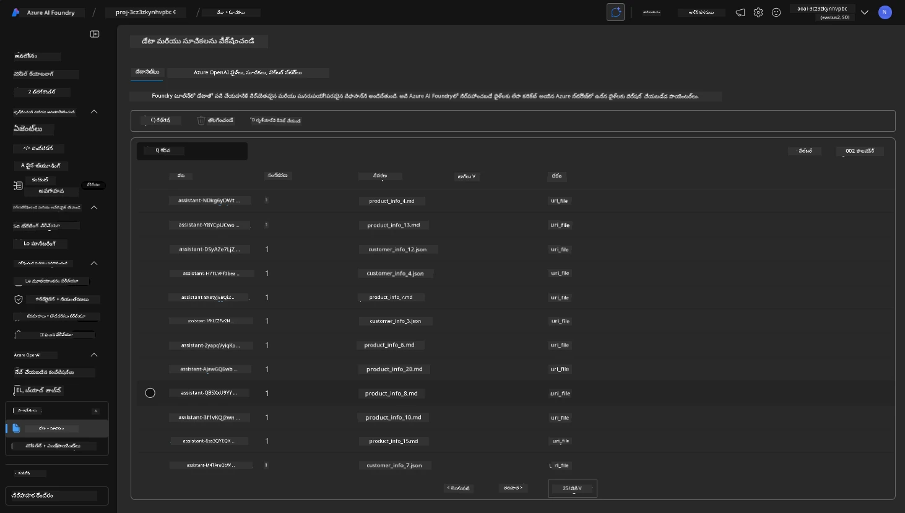

**మీరు ఏజెంట్ ఆపరేషన్‌ను ధృవీకరించారు!**

1. ఏజెంట్ ప్రతిస్పందనలు ఆ ఫైళ్లలోని జ్ఞానంపై ఆధారపడతాయి.
1. మీరు ఇప్పుడు ఆ డేటాకు సంబంధించి ప్రశ్నలు అడిగి, ఆధారపడి సమాధానాలు పొందవచ్చు.
1. ఉదాహరణ: `customer_info_10.json` "Amanda Perez" చేసిన 3 కొనుగోళ్లను వివరిస్తుంది

Container App ఎండ్‌పాయింట్ ఉన్న బ్రౌజర్ టాబ్‌ను తిరిగి తెరచి అడగండి: `What products does Amanda Perez own?`. మీరు ఇలాంటిది చూడాలి:

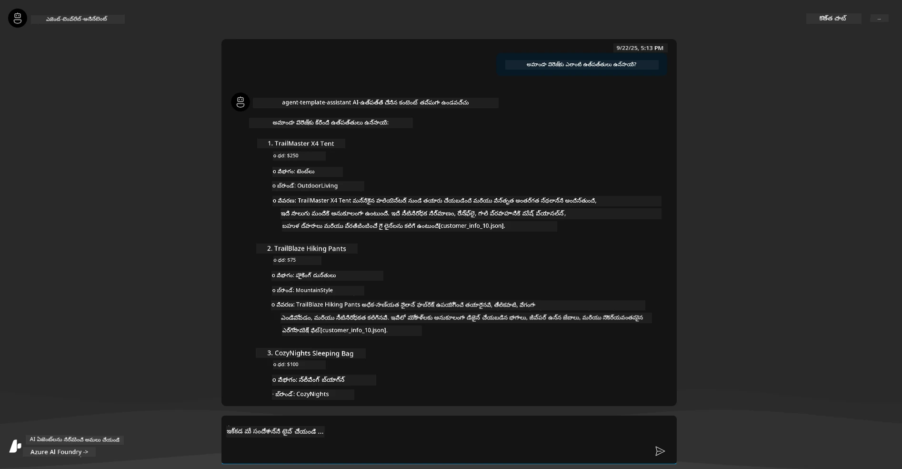

---

## 6. ఏజెంట్ ప్లేగ్రౌండ్

Microsoft Foundry యొక్క సామర్థ్యాలపై కొంత ఇన్సైట్స్ పొందడానికి, ఏజెంట్‌ను Agents Playground లో ఆనందించండి.

1. Microsoft Foundry లోని `Agents` పేజీకి తిరిగి వచ్చి - డిఫాల్ట్ ఏజెంట్‌ను సెలెక్ట్ చేయండి
1. `Try in Playground` ఆప్షన్‌ను క్లిక్ చేయండి - మీరు ఇలాంటిది Playground UI చూడగలరు
1. అదే ప్రశ్న అడగండి: `What products does Amanda Perez own?`

    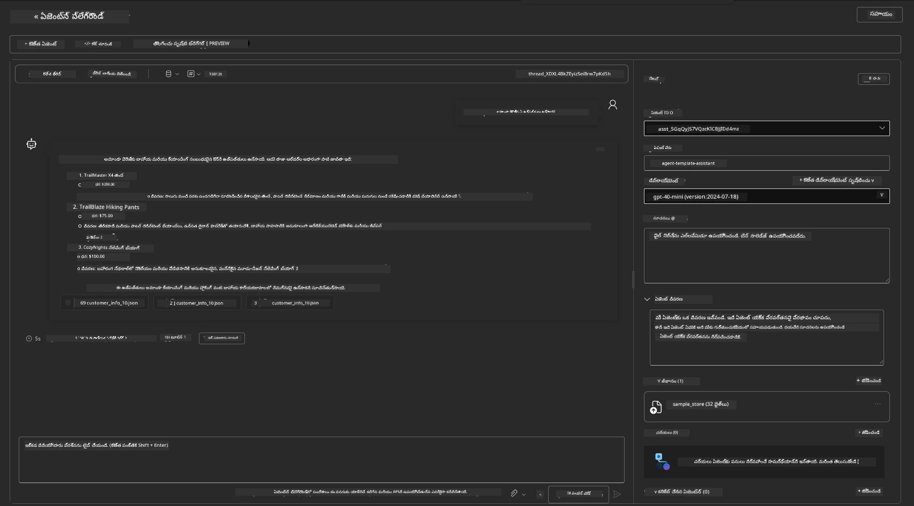

మీకు అదే (లేదా సమాన) సమాధానం వస్తుంది - కానీ మీరు మీ ఏజెంటిక్ అప్లికేషన్ యొక్క నాణ్యత, ఖర్చు, మరియు పనితీరు గురించి అర్థం చేసుకోవడానికి ఉపయోగపడే అదనపు సమాచారం కూడా అందుతుంది. ఉదాహరణకు:

1. ప్రతిస్పందనలో ప్రతిస్పందనాన్ని "గ్రౌండ్" చేయడానికి ఉపయోగించిన డేటా ఫైళ్లను సూచించినట్లు గమనించండి
1. ఈ ఫైల్ లేబుళ్లపై హోవర్ చేయండి - డేటా మీ ప్రశ్న మరియు ప్రదర్శిత ప్రతిస్పందనకి సరిపోతుందా అని చూడండి

మీరు ప్రతిస్పందన కింద ఒక _స్టాట్స్_ రో కూడా చూస్తారు.

1. ఏదైనా మెట్రిక్ పై హోవర్ చేయండి - ఉదా., Safety. మీరు ఇలాంటిది చూస్తారు
1. అంచనా వేయబడిన రేటింగ్ మీ ప్రతిస్పందన సేఫ్టీ స్థాయికి మీ జ్ఞానానికి సరిపోతుందా?

      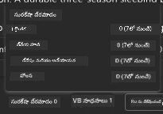

---

## 7. బిల్ట్-ఇన్ ఆబ్జర్వబిలిటీ

ఆబ్జర్వబిలిటీ అంటే మీ అప్లికేషన్‌ను ఇన్స్ట్రుమెంట్ చేయడమే, తద్వారా దీని ఆపరేషన్స్‌ను అర్థం చేసుకోవడానికి, డీబగ్ చేయడానికి, మరియు ఆప్టిమైజ్ చేయడానికి ఉపయోగపడే డేటా ఉత్పత్తి చేయబడుతుంది. దీనికి ఒక భావన పొందడానికి:

1. `View Run Info` బటన్‌ను క్లిక్ చేయండి - మీరు ఈ వీక్షణని చూడగలరు. ఇది [Agent tracing](https://learn.microsoft.com/en-us/azure/ai-foundry/how-to/develop/trace-agents-sdk#view-trace-results-in-the-azure-ai-foundry-agents-playground) యొక్క చర్య ఉదాహరణ. _ఈ వీక్షణను పొందడానికి మీరు టాప్-లెవల్ మెనులోని Thread Logs క్లిక్ చేయవచ్చు_.

   - ఏజెంట్ ద్వారా సంచలనం పొందిన రన్ దశలు మరియు టూల్స్ గురించి అవగాహన పొందండి
   - ప్రతిస్పందన కోసం మొత్తం Token లెక్క (vs. output tokens వాడకం) ను అర్థం చేసుకోండి
   - లేటెన్సీ మరియు ఎక్కడ సమయం ఖర్చవుతున్నదో అర్థం చేసుకోండి

      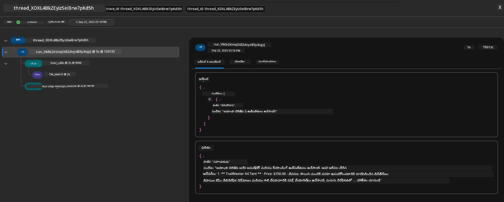

1. రన్ కోసం అదనపు లక్షణాలను చూడటానికి `Metadata` ట్యాబ్‌పై క్లిక్ చేయండి, ఇవి తర్వాత సమస్యల్ని డీబగ్ చేయడానికి ఉపయోగకరమైన సందర్భాన్ని అందవచ్చు.

      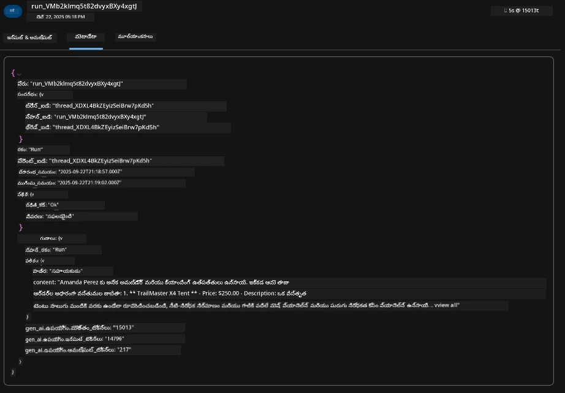


1. ఏజెంట్ ప్రతిస్పందనపై ఆటో-అంచనాలు చూడటానికి `Evaluations` ట్యాబ్‌పై క్లిక్ చేయండి. ఇవి సేఫ్టీ అంచనాలను (ఉదా., Self-harm) మరియు ఏజెంట్-వైశిష్ట్య అంచనాలను (ఉదా., Intent resolution, Task adherence) కలిగి ఉంటాయి.

      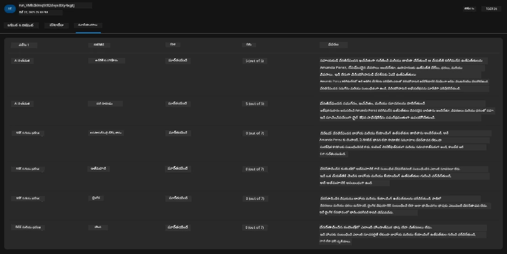

1. చివరగా, సైడ్‌బార్ మెనులోని `Monitoring` ట్యాబ్‌పై క్లిక్ చేయండి.

      - ప్రదర్శింపబడిన పేజీలో `Resource usage` ట్యాబ్‌ను ఎంచుకుని మెట్రిక్స్‌ని చూడండి.
      - ఖర్చు (టోకెన్లు) మరియు లోడ్ (రిక్వెస్ట్‌లు) పరంగా అప్లికేషన్ వాడకాన్ని ట్రాక్ చేయండి.
      - ఫస్ట్ బైట్ (ఇన్‌పుట్ ప్రాసెసింగ్) మరియు లాస్ట్ బైట్ (ఆుట్పుట్) కు అప్లికేషన్ లేటెన్సీని ట్రాక్ చేయండి.

      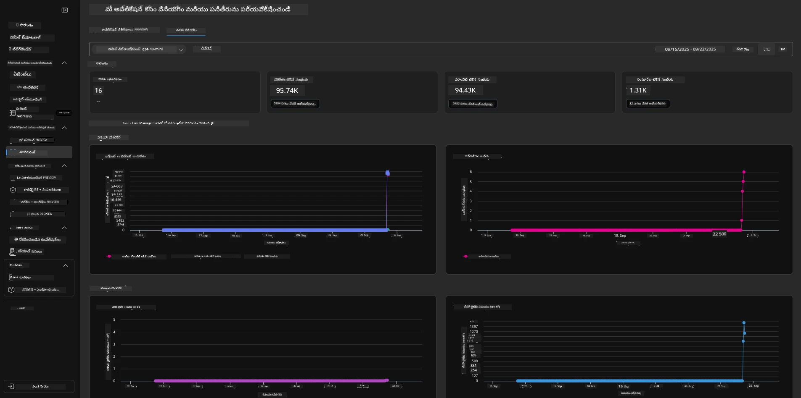

---

## 8. ఎన్విరాన్‌మెంట్ వేరియబుల్స్

ఇప్పటివరకు, మనం బ్రౌజర్‌లో డిప్లాయ్‌మెంట్‌ను గమనించాము - మరియు మన ఇన్ఫ్రాస్ట్రక్చర్ provision అయ్యిందని మరియు అప్లికేషన్ పనిచేస్తున్నదని ధృవీకరించాము. కానీ అప్లికేషన్‌ను _కోడ్-ఫస్ట్_ గా పని చేయడానికి, మన స్థానిక డెవలప్మెంట్ ఎన్విరాన్‌మెంట్‌ను అందుబాటులో ఉన్న వనరులతో పని చేయడానికి అవసరమైన సంబంధిత వైరీబుల్స్‌తో కాన్ఫిగర్ చేయాల్సి ఉంటుంది. `azd` ఉపయోగించడం దీన్ని సులభతరం చేస్తుంది.

1. Azure Developer CLI [పరిపాటిగా environment variables ను ఉపయోగిస్తుంది](https://learn.microsoft.com/en-us/azure/developer/azure-developer-cli/manage-environment-variables?tabs=bash) అప్లికేషన్ డిప్లాయ్‌మెంట్‌కి కాన్ఫిగరేషన్ సెట్టింగ్స్ నిల్వ చేయడానికి మరియు నిర్వహించడానికి.

1. ఎన్విరాన్‌మెంట్ వేరియబుల్స్ `.azure/<env-name>/.env` లో నిల్వ చేయబడతాయి - ఇది వాటిని deployment సమయంలో ఉపయోగించిన `env-name` పరిధికి పరిమితం చేస్తుంది మరియు అదే repoలో వేర్వేరు డిప్లాయ్‌మెంట్ లక్ష్యాల మధ్య ఎన్విరాన్‌మెంట్లను విడదీయడంలో మీకు సహాయపడుతుంది.

1. ఎన్విరాన్‌మెంట్ వేరియబుల్స్ `azd` కమాండ్ ఏదైనా ప్రత్యేక కమాండ్ (ఉదా., `azd up`) నడిచే ప్రతిసారి ఆటోమేటిక్‌గా లోడ్ చేయబడతాయి. గమనించండి `azd` స్వతహాగా _OS-లెవల్_ ఎన్విరాన్‌మెంట్ వేరియబుల్స్ (ఉదా., షెల్‌లో సెటయ్యే) ను ఆటోమాటిక్‌గా చదవదు - బదులుగా స్క్రిప్ట్‌లలో సమాచారాన్ని బదిలీ చేయడానికి `azd set env` మరియు `azd get env` ను ఉపయోగించండి.


కొన్ని కమాండులను ప్రయత్నించండి:

1. ఈ ఎన్విరాన్‌మెంట్‌లో `azd` కోసం సెటైన అన్ని ఎన్విరాన్‌మెంట్ వేరియబుల్స్ పొందండి:

      ```bash title="" linenums="0"
      azd env get-values
      ```
      
      మీరు ఇలాంటిది చూడగలరు:

      ```bash title="" linenums="0"
      AZURE_AI_AGENT_DEPLOYMENT_NAME="gpt-4o-mini"
      AZURE_AI_AGENT_NAME="agent-template-assistant"
      AZURE_AI_EMBED_DEPLOYMENT_NAME="text-embedding-3-small"
      AZURE_AI_EMBED_DIMENSIONS=100
      ...
      ```

1. ఒక ప్రత్యేక విలువను పొందండి - ఉదా., నేను తెలుసుకోవాలనుకుంటున్నాను మేము `AZURE_AI_AGENT_MODEL_NAME` విలువను సెట్చేశారా అంటే

      ```bash title="" linenums="0"
      azd env get-value AZURE_AI_AGENT_MODEL_NAME 
      ```
      
      మీరు ఇలాంటిది చూడగలరు - ఇది డిఫాల్ట్‌గా సెటైనట్లేదు!

      ```bash title="" linenums="0"
      ERROR: key 'AZURE_AI_AGENT_MODEL_NAME' not found in the environment values
      ```

1. `azd` కోసం ఒక కొత్త ఎన్విరాన్‌మెంట్ వేరియబుల్ సెట్ చేయండి. ఇక్కడ, మనం ఏజెంట్ మోడల్ పేరు ను నవీకరిస్తున్నాము. _గమనిక: చేసిన మార్పులు తక్షణమే `.azure/<env-name>/.env` ఫైల్‌లో ప్రతిబింబిస్తాయి._

      ```bash title="" linenums="0"
      azd env set AZURE_AI_AGENT_MODEL_NAME gpt-4.1
      azd env set AZURE_AI_AGENT_MODEL_VERSION 2025-04-14
      azd env set AZURE_AI_AGENT_DEPLOYMENT_CAPACITY 150
      ```

      ఇప్పుడు, మనం ఆ విలువ సెటైయినట్లు కనుగొంటాం:

      ```bash title="" linenums="0"
      azd env get-value AZURE_AI_AGENT_MODEL_NAME 
      ```

1. గమనించండి కొన్ని వనరులు పరమాణు స్వభావమైనవి (ఉదా., మోడల్ డిప్లాయ్‌మెంట్స్) మరియు వాటి కోసం కేవలం `azd up` కాకుండా మరింత ప్రయత్నం అవసరం ఉంటుంది రెడీప్లాయ్ చేయడానికి. మూల డిప్లాయ్‌మెంట్‌ను తొలగించి మార్పు చేసిన ఎన్విరాన్‌మెంట్ వేరియబుల్స్‌తో మళ్లీ డిప్లాయ్ చేయడం ప్రయత్నిద్దాం.

1. **Refresh** మీకు ముందుగా azd టెంప్లేట్ ఉపయోగించి ఇన్ఫ్రాస్ట్రక్చర్ డిప్లాయ్ చేసినట్లయితే - మీరు ఈ కమాండ్ ఉపయోగించి మీ స్థానిక ఎన్విరాన్‌మెంట్ వేరియబుల్స్ స్థితిని మీ Azure డిప్లాయ్‌మెంట్ యొక్క ప్రస్తుత స్థితిపై ఆధారపడి రిఫ్రెష్ చేయవచ్చు:

      ```bash title="" linenums="0"
      azd env refresh
      ```

      ఇది రెండు లేదా అంతకంటే ఎక్కువ లోకల్ డెవలప్‌మెంట్ పరిసరాల (ఉదాహరణకు, బహుళ డెవలపర్లతో కూడిన టీమ్) మధ్య ఎన్విరాన్‌మెంట్ వేరియబుల్‌లను _సమకాలీకరించడానికి_ శక్తివంతమైన మార్గం - అమలు చేయబడిన ఇన్‌ఫ్రాస్ట్రక్చర్‌ను env వేరియబుల్ స్థితికి ఆధారమైన సత్యంగా ఉపయోగించుకోవడానికి అనుమతిస్తుంది. టీమ్ సభ్యులు సులభంగా వేరియబుల్స్‌ను _రీఫ్రెష్_ చేయడం ద్వారా మళ్లీ సమకూర్చుకుంటారు.

---

## 9. అభినందనలు 🏆

మీరు ఇప్పుడే ఒక end-to-end వర్క్‌ఫ్లోను పూర్తి చేసారు, ఇందులో మీరు:

- [X] మీరు ఉపయోగించదలచుకున్న AZD Template‌ను ఎంచుకున్నారు
- [X] టెంప్లేట్‌ను GitHub Codespacesతో ప్రారంభించారు
- [X] టెంప్లేట్‌ను డిప్లాయ్ చేసి అది పనిచేస్తుందో ధృవీకరించారు

---

<!-- CO-OP TRANSLATOR DISCLAIMER START -->
స్పష్టీకరణ:
ఈ పత్రాన్ని AI అనువాద సేవ [Co-op Translator](https://github.com/Azure/co-op-translator) ఉపయోగించి అనువదించబడింది. మేము ఖచ్చితత్వానికి యత్నించినప్పటికీ, ఆటోమేటెడ్ అనువాదాల్లో పొరపాట్లు లేదా అసంపూర్ణతలు ఉండవచ్చునని దయచేసి గమనించండి. మూల భాషలోని అసలు పత్రాన్నే అధికారిక మూలంగా పరిగణించాలి. ముఖ్యమైన సమాచారానికి వృత్తిపరమైన మానవ అనువాదాన్ని సూచించబడుతుంది. ఈ అనువాదాన్ని ఉపయోగించడం వల్ల కలిగే ఏవైన అపార్థాలు లేదా తప్పుగా అర్థం చేసుకోవడాలకు మేము బాధ్యులం కాదు.
<!-- CO-OP TRANSLATOR DISCLAIMER END -->