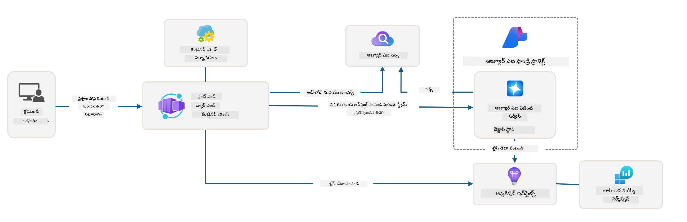

<!--
CO_OP_TRANSLATOR_METADATA:
{
  "original_hash": "4e403f041411361140d6beb88ab2a181",
  "translation_date": "2025-11-25T07:36:35+00:00",
  "source_file": "workshop/docs/instructions/3-Deconstruct-AI-Template.md",
  "language_code": "te"
}
-->
# 3. టెంప్లేట్‌ను విభజించండి

!!! tip "ఈ మాడ్యూల్ ముగిసే నాటికి మీరు చేయగలరు"

    - [ ] అంశం
    - [ ] అంశం
    - [ ] అంశం
    - [ ] **ల్యాబ్ 3:**

---

AZD టెంప్లేట్లు మరియు Azure Developer CLI (`azd`) సహాయంతో, మేము నమూనా కోడ్, మౌలిక సదుపాయాలు మరియు కాన్ఫిగరేషన్ ఫైళ్లను అందించే ప్రామాణిక రిపోజిటరీలతో మా AI అభివృద్ధి ప్రయాణాన్ని వేగంగా ప్రారంభించవచ్చు - ఇది సిద్ధంగా ఉన్న _స్టార్టర్_ ప్రాజెక్ట్ రూపంలో ఉంటుంది.

**కానీ ఇప్పుడు, ప్రాజెక్ట్ నిర్మాణం మరియు కోడ్‌బేస్‌ను అర్థం చేసుకోవాలి - మరియు AZD టెంప్లేట్‌ను అనుకూలీకరించగలగాలి - AZD గురించి ఎటువంటి ముందస్తు అనుభవం లేకుండా!**

---

## 1. GitHub Copilotను యాక్టివేట్ చేయండి

### 1.1 GitHub Copilot చాట్ ఇన్‌స్టాల్ చేయండి

[Agent Modeతో GitHub Copilot](https://code.visualstudio.com/docs/copilot/chat/chat-agent-mode)ను అన్వేషించడానికి ఇది సమయం. ఇప్పుడు, మేము మా పనిని ఉన్నత స్థాయిలో సహజమైన భాషలో వివరించవచ్చు, మరియు అమలులో సహాయం పొందవచ్చు. ఈ ల్యాబ్ కోసం, మేము [Copilot Free ప్లాన్](https://github.com/github-copilot/signup)ను ఉపయోగిస్తాము, ఇది పూర్తి చేయడంలో మరియు చాట్ పరస్పర చర్యలలో నెలవారీ పరిమితిని కలిగి ఉంటుంది.

ఈ ఎక్స్‌టెన్షన్ మార్కెట్‌ప్లేస్ నుండి ఇన్‌స్టాల్ చేయవచ్చు, కానీ ఇది మీ కోడ్‌స్పేస్‌ల వాతావరణంలో ఇప్పటికే అందుబాటులో ఉండాలి. _Copilot ఐకాన్ డ్రాప్‌డౌన్ నుండి `Open Chat` క్లిక్ చేయండి - మరియు `What can you do?` వంటి ప్రాంప్ట్‌ను టైప్ చేయండి_ - మీరు లాగిన్ చేయమని అడగవచ్చు. **GitHub Copilot చాట్ సిద్ధంగా ఉంది**.

### 1.2. MCP సర్వర్లను ఇన్‌స్టాల్ చేయండి

Agent మోడ్ ప్రభావవంతంగా ఉండటానికి, ఇది జ్ఞానాన్ని పొందడంలో లేదా చర్యలు తీసుకోవడంలో సహాయపడే సరైన సాధనాలకు ప్రాప్యత అవసరం. ఇక్కడ MCP సర్వర్లు సహాయపడతాయి. మేము ఈ క్రింది సర్వర్లను కాన్ఫిగర్ చేస్తాము:

1. [Azure MCP Server](../../../../../workshop/docs/instructions)
1. [Microsoft Docs MCP Server](../../../../../workshop/docs/instructions)

ఇవి యాక్టివేట్ చేయడానికి:

1. `.vscode/mcp.json` అనే ఫైల్‌ను సృష్టించండి, ఇది లేకపోతే
1. ఆ ఫైల్‌లో ఈ క్రింది కోడ్‌ను కాపీ చేసి, సర్వర్లను ప్రారంభించండి!
   ```json title=".vscode/mcp.json"
   {
      "servers": {
         "Azure MCP Server": {
            "command": "npx",
            "args": [
            "-y",
            "@azure/mcp@latest",
            "server",
            "start"
            ]
         },
         "microsoft.docs.mcp": {
            "type": "http",
            "url": "https://learn.microsoft.com/api/mcp"
         }
      }
   }
   ```

??? warning "`npx` ఇన్‌స్టాల్ కాలేదని మీరు ఎర్రర్ పొందవచ్చు (ఫిక్స్ కోసం క్లిక్ చేయండి)"

      దీన్ని పరిష్కరించడానికి, `.devcontainer/devcontainer.json` ఫైల్‌ను ఓపెన్ చేసి, ఫీచర్స్ సెక్షన్‌లో ఈ లైన్‌ను జోడించండి. ఆపై కంటైనర్‌ను రీబిల్డ్ చేయండి. ఇప్పుడు `npx` ఇన్‌స్టాల్ అయి ఉంటుంది.

      ```title="" linenums="0"
         "features": {
            "ghcr.io/devcontainers/features/node:1": {},
            ...
         },
      ```

---

### 1.3. GitHub Copilot చాట్‌ను పరీక్షించండి

**మొదట `az login` ఉపయోగించి Azureతో VS Code కమాండ్ లైన్ నుండి ప్రామాణీకరించండి.**

ఇప్పుడు మీరు మీ Azure సబ్‌స్క్రిప్షన్ స్థితిని ప్రశ్నించగలరు, మరియు మోహరించిన వనరులు లేదా కాన్ఫిగరేషన్ గురించి ప్రశ్నలు అడగవచ్చు. ఈ ప్రాంప్ట్‌లను ప్రయత్నించండి:

1. `List my Azure resource groups`
1. `#foundry list my current deployments`

మీరు Azure డాక్యుమెంటేషన్ గురించి ప్రశ్నలు అడిగి, Microsoft Docs MCP సర్వర్‌లో ఆధారపడిన సమాధానాలను పొందవచ్చు. ఈ ప్రాంప్ట్‌లను ప్రయత్నించండి:

1. `#microsoft_docs_search What is Azure Developer CLI?`
1. `#microsoft_docs_search Show me a Python tutorial to chat with deployed model`

లేదా మీరు ఒక పనిని పూర్తి చేయడానికి కోడ్ స్నిప్పెట్లను అడగవచ్చు. ఈ ప్రాంప్ట్‌ను ప్రయత్నించండి.

1. `Give me a Python code example that uses AAD for an interactive chat client`

`Ask` మోడ్‌లో, ఇది మీరు కాపీ-పేస్ట్ చేసి ప్రయత్నించగల కోడ్‌ను అందిస్తుంది. `Agent` మోడ్‌లో, ఇది మరింత ముందుకు వెళ్లి, ఆ పనిని అమలు చేయడంలో మీకు సహాయపడటానికి సంబంధిత వనరులను సృష్టించవచ్చు - సెటప్ స్క్రిప్ట్‌లు మరియు డాక్యుమెంటేషన్‌తో సహా.

**మీరు ఇప్పుడు టెంప్లేట్ రిపోజిటరీని అన్వేషించడానికి సిద్ధంగా ఉన్నారు**

---

## 2. ఆర్కిటెక్చర్‌ను విభజించండి

??? prompt "ప్రశ్న: docs/images/architecture.pngలోని అప్లికేషన్ ఆర్కిటెక్చర్‌ను 1 పేరాగ్రాఫ్‌లో వివరించండి"

      ఈ అప్లికేషన్ Azureపై నిర్మించబడిన AI ఆధారిత చాట్ అప్లికేషన్, ఇది ఆధునిక ఏజెంట్-ఆధారిత ఆర్కిటెక్చర్‌ను ప్రదర్శిస్తుంది. ఈ పరిష్కారం ప్రధాన అప్లికేషన్ కోడ్‌ను హోస్ట్ చేసే Azure Container App చుట్టూ కేంద్రీకృతమై ఉంటుంది, ఇది వినియోగదారు ఇన్‌పుట్‌ను ప్రాసెస్ చేస్తుంది మరియు AI ఏజెంట్ ద్వారా తెలివైన ప్రతిస్పందనలను ఉత్పత్తి చేస్తుంది.

      ఆర్కిటెక్చర్ Azure AI Foundry ప్రాజెక్ట్‌ను AI సామర్థ్యాల కోసం పునాది‌గా ఉపయోగిస్తుంది, Azure AI Servicesతో కనెక్ట్ అవుతుంది, ఇవి ప్రాథమిక భాషా మోడళ్లను (GPT-4o-mini వంటి) మరియు ఏజెంట్ ఫంక్షనాలిటీని అందిస్తాయి. వినియోగదారు పరస్పర చర్యలు React ఆధారిత ఫ్రంట్‌ఎండ్ ద్వారా FastAPI బ్యాక్‌ఎండ్‌కు ప్రవహిస్తాయి, ఇది సందర్భాత్మక ప్రతిస్పందనలను ఉత్పత్తి చేయడానికి AI ఏజెంట్ సేవతో కమ్యూనికేట్ చేస్తుంది.

      సిస్టమ్ ఫైల్ సెర్చ్ లేదా Azure AI సెర్చ్ సేవ ద్వారా జ్ఞానాన్ని పొందే సామర్థ్యాలను కలిగి ఉంది, ఏజెంట్‌కు అప్‌లోడ్ చేసిన డాక్యుమెంట్ల నుండి సమాచారాన్ని యాక్సెస్ చేయడానికి మరియు ఉటంకించడానికి అనుమతిస్తుంది. ఆపరేషనల్ ఎక్సలెన్స్ కోసం, ఆర్కిటెక్చర్ ట్రేసింగ్, లాగింగ్ మరియు పనితీరు ఆప్టిమైజేషన్ కోసం Application Insights మరియు Log Analytics Workspace ద్వారా సమగ్ర మానిటరింగ్‌ను కలిగి ఉంది.

      Azure Storage అప్లికేషన్ డేటా మరియు ఫైల్ అప్‌లోడ్‌ల కోసం బ్లోబ్ స్టోరేజ్‌ను అందిస్తుంది, మరియు Managed Identity Azure వనరుల మధ్య నమ్మకమైన ప్రాప్యతను నిర్ధారిస్తుంది, క్రెడెన్షియల్స్‌ను నిల్వ చేయకుండా. మొత్తం పరిష్కారం డిమాండ్ ఆధారంగా ఆటోమేటిక్ స్కేలింగ్‌తో కంటైనరైజ్డ్ అప్లికేషన్‌ను రూపొందించబడింది, Azure యొక్క మేనేజ్‌డ్ సర్వీసెస్ ఎకోసిస్టమ్ ద్వారా బిల్ట్-ఇన్ సెక్యూరిటీ, మానిటరింగ్ మరియు CI/CD సామర్థ్యాలను అందిస్తుంది.



---

## 3. రిపోజిటరీ నిర్మాణం

!!! prompt "ప్రశ్న: టెంప్లేట్ ఫోల్డర్ నిర్మాణాన్ని వివరించండి. విజువల్ హైరార్కికల్ డయాగ్రామ్‌తో ప్రారంభించండి."

??? info "సమాధానం: విజువల్ హైరార్కికల్ డయాగ్రామ్"

      ```bash title="" 
      get-started-with-ai-agents/
      ├── 📋 కాన్ఫిగరేషన్ & సెటప్
      │   ├── azure.yaml                    # Azure Developer CLI కాన్ఫిగరేషన్
      │   ├── docker-compose.yaml           # లోకల్ డెవలప్‌మెంట్ కంటైనర్లు
      │   ├── pyproject.toml                # Python ప్రాజెక్ట్ కాన్ఫిగరేషన్
      │   ├── requirements-dev.txt          # డెవలప్‌మెంట్ డిపెండెన్సీలు
      │   └── .devcontainer/                # VS Code డెవ్ కంటైనర్ సెటప్
      │
      ├── 🏗️ మౌలిక సదుపాయాలు (infra/)
      │   ├── main.bicep                    # ప్రధాన మౌలిక సదుపాయాల టెంప్లేట్
      │   ├── api.bicep                     # API-స్పెసిఫిక్ వనరులు
      │   ├── main.parameters.json          # మౌలిక సదుపాయాల పారామీటర్లు
      │   └── core/                         # మాడ్యులర్ మౌలిక భాగాలు
      │       ├── ai/                       # AI సేవల కాన్ఫిగరేషన్లు
      │       ├── host/                     # హోస్టింగ్ మౌలిక సదుపాయాలు
      │       ├── monitor/                  # మానిటరింగ్ మరియు లాగింగ్
      │       ├── search/                   # Azure AI సెర్చ్ సెటప్
      │       ├── security/                 # సెక్యూరిటీ మరియు ఐడెంటిటీ
      │       └── storage/                  # స్టోరేజ్ అకౌంట్ కాన్ఫిగ్స్
      │
      ├── 💻 అప్లికేషన్ సోర్స్ (src/)
      │   ├── api/                          # బ్యాక్‌ఎండ్ API
      │   │   ├── main.py                   # FastAPI అప్లికేషన్ ఎంట్రీ
      │   │   ├── routes.py                 # API రూట్ నిర్వచనలు
      │   │   ├── search_index_manager.py   # సెర్చ్ ఫంక్షనాలిటీ
      │   │   ├── data/                     # API డేటా హ్యాండ్లింగ్
      │   │   ├── static/                   # స్టాటిక్ వెబ్ ఆస్తులు
      │   │   └── templates/                # HTML టెంప్లేట్లు
      │   ├── frontend/                     # React/TypeScript ఫ్రంట్‌ఎండ్
      │   │   ├── package.json              # Node.js డిపెండెన్సీలు
      │   │   ├── vite.config.ts            # Vite బిల్డ్ కాన్ఫిగరేషన్
      │   │   └── src/                      # ఫ్రంట్‌ఎండ్ సోర్స్ కోడ్
      │   ├── data/                         # నమూనా డేటా ఫైళ్లు
      │   │   └── embeddings.csv            # ప్రీ-కంప్యూటెడ్ ఎంబెడింగ్స్
      │   ├── files/                        # జ్ఞాన బేస్ ఫైళ్లు
      │   │   ├── customer_info_*.json      # కస్టమర్ డేటా నమూనాలు
      │   │   └── product_info_*.md         # ప్రొడక్ట్ డాక్యుమెంటేషన్
      │   ├── Dockerfile                    # కంటైనర్ కాన్ఫిగరేషన్
      │   └── requirements.txt              # Python డిపెండెన్సీలు
      │
      ├── 🔧 ఆటోమేషన్ & స్క్రిప్ట్స్ (scripts/)
      │   ├── postdeploy.sh/.ps1           # పోస్ట్-డిప్లాయ్‌మెంట్ సెటప్
      │   ├── setup_credential.sh/.ps1     # క్రెడెన్షియల్ కాన్ఫిగరేషన్
      │   ├── validate_env_vars.sh/.ps1    # వాతావరణ ధృవీకరణ
      │   └── resolve_model_quota.sh/.ps1  # మోడల్ కోటా నిర్వహణ
      │
      ├── 🧪 టెస్టింగ్ & ఈవాల్యుయేషన్
      │   ├── tests/                        # యూనిట్ మరియు ఇంటిగ్రేషన్ టెస్టులు
      │   │   └── test_search_index_manager.py
      │   ├── evals/                        # ఏజెంట్ ఈవాల్యుయేషన్ ఫ్రేమ్‌వర్క్
      │   │   ├── evaluate.py               # ఈవాల్యుయేషన్ రన్నర్
      │   │   ├── eval-queries.json         # టెస్ట్ క్వెరీస్
      │   │   └── eval-action-data-path.json
      │   ├── sandbox/                      # డెవలప్‌మెంట్ ప్లేగ్రౌండ్
      │   │   ├── 1-quickstart.py           # గెటింగ్ స్టార్టెడ్ ఉదాహరణలు
      │   │   └── aad-interactive-chat.py   # ఆథెంటికేషన్ ఉదాహరణలు
      │   └── airedteaming/                 # AI సేఫ్టీ ఈవాల్యుయేషన్
      │       └── ai_redteaming.py          # రెడ్ టీమ్ టెస్టింగ్
      │
      ├── 📚 డాక్యుమెంటేషన్ (docs/)
      │   ├── deployment.md                 # డిప్లాయ్‌మెంట్ గైడ్
      │   ├── local_development.md          # లోకల్ సెటప్ సూచనలు
      │   ├── troubleshooting.md            # సాధారణ సమస్యలు & పరిష్కారాలు
      │   ├── azure_account_setup.md        # Azure ప్రీరిక్విజిట్స్
      │   └── images/                       # డాక్యుమెంటేషన్ ఆస్తులు
      │
      └── 📄 ప్రాజెక్ట్ మెటాడేటా
         ├── README.md                     # ప్రాజెక్ట్ అవలోకనం
         ├── CODE_OF_CONDUCT.md           # కమ్యూనిటీ మార్గదర్శకాలు
         ├── CONTRIBUTING.md              # కాంట్రిబ్యూషన్ గైడ్
         ├── LICENSE                      # లైసెన్స్ నిబంధనలు
         └── next-steps.md                # పోస్ట్-డిప్లాయ్‌మెంట్ మార్గదర్శకాలు
      ```

### 3.1. కోర్ యాప్ ఆర్కిటెక్చర్

ఈ టెంప్లేట్ **ఫుల్-స్టాక్ వెబ్ అప్లికేషన్** నమూనాను అనుసరిస్తుంది:

- **బ్యాక్‌ఎండ్**: Azure AI ఇంటిగ్రేషన్‌తో Python FastAPI
- **ఫ్రంట్‌ఎండ్**: Vite బిల్డ్ సిస్టమ్‌తో TypeScript/React
- **మౌలిక సదుపాయాలు**: క్లౌడ్ వనరుల కోసం Azure Bicep టెంప్లేట్లు
- **కంటైనరైజేషన్**: స్థిరమైన మోహరింపుల కోసం Docker

### 3.2 Infra As Code (bicep)

మౌలిక సదుపాయాల పొర **Azure Bicep** టెంప్లేట్లను మాడ్యులర్‌గా ఉపయోగిస్తుంది:

   - **`main.bicep`**: అన్ని Azure వనరులను సమన్వయపరుస్తుంది
   - **`core/` మాడ్యూల్స్**: వివిధ సేవల కోసం పునర్వినియోగపరచదగిన భాగాలు
      - AI సేవలు (Azure OpenAI, AI Search)
      - కంటైనర్ హోస్టింగ్ (Azure Container Apps)
      - మానిటరింగ్ (Application Insights, Log Analytics)
      - సెక్యూరిటీ (Key Vault, Managed Identity)

### 3.3 అప్లికేషన్ సోర్స్ (`src/`)

**బ్యాక్‌ఎండ్ API (`src/api/`)**:

- FastAPI ఆధారిత REST API
- Azure AI ఏజెంట్ సేవ ఇంటిగ్రేషన్
- జ్ఞానాన్ని పొందడానికి సెర్చ్ ఇండెక్స్ నిర్వహణ
- ఫైల్ అప్‌లోడ్ మరియు ప్రాసెసింగ్ సామర్థ్యాలు

**ఫ్రంట్‌ఎండ్ (`src/frontend/`)**:

- ఆధునిక React/TypeScript SPA
- వేగవంతమైన అభివృద్ధి మరియు ఆప్టిమైజ్డ్ బిల్డ్‌ల కోసం Vite
- ఏజెంట్ పరస్పర చర్యల కోసం చాట్ ఇంటర్‌ఫేస్

**జ్ఞాన బేస్ (`src/files/`)**:

- నమూనా కస్టమర్ మరియు ప్రొడక్ట్ డేటా
- ఫైల్ ఆధారిత జ్ఞానాన్ని పొందడాన్ని ప్రదర్శిస్తుంది
- JSON మరియు Markdown ఫార్మాట్ ఉదాహరణలు

### 3.4 DevOps & ఆటోమేషన్

**స్క్రిప్ట్స్ (`scripts/`)**:

- క్రాస్-ప్లాట్‌ఫారమ్ PowerShell మరియు Bash స్క్రిప్ట్స్
- వాతావరణ ధృవీకరణ మరియు సెటప్
- పోస్ట్-డిప్లాయ్‌మెంట్ కాన్ఫిగరేషన్
- మోడల్ కోటా నిర్వహణ

**Azure Developer CLI ఇంటిగ్రేషన్**:

- `azd` వర్క్‌ఫ్లోల కోసం `azure.yaml` కాన్ఫిగరేషన్
- ఆటోమేటెడ్ ప్రొవిజనింగ్ మరియు డిప్లాయ్‌మెంట్
- వాతావరణ వేరియబుల్ నిర్వహణ

### 3.5 టెస్టింగ్ & క్వాలిటీ అస్యూరెన్స్

**ఈవాల్యుయేషన్ ఫ్రేమ్‌వర్క్ (`evals/`)**:

- ఏజెంట్ పనితీరు ఈవాల్యుయేషన్


---

<!-- CO-OP TRANSLATOR DISCLAIMER START -->
**అస్వీకరణ**:  
ఈ పత్రం AI అనువాద సేవ [Co-op Translator](https://github.com/Azure/co-op-translator) ఉపయోగించి అనువదించబడింది. మేము ఖచ్చితత్వానికి ప్రయత్నిస్తున్నప్పటికీ, ఆటోమేటెడ్ అనువాదాలు తప్పులు లేదా అసమగ్రతలను కలిగి ఉండవచ్చు. దయచేసి, దాని స్వదేశ భాషలోని అసలు పత్రాన్ని అధికారం కలిగిన మూలంగా పరిగణించండి. కీలకమైన సమాచారం కోసం, ప్రొఫెషనల్ మానవ అనువాదాన్ని సిఫారసు చేస్తాము. ఈ అనువాదం ఉపయోగం వల్ల కలిగే ఏవైనా అపార్థాలు లేదా తప్పుదారులు కోసం మేము బాధ్యత వహించము.
<!-- CO-OP TRANSLATOR DISCLAIMER END -->