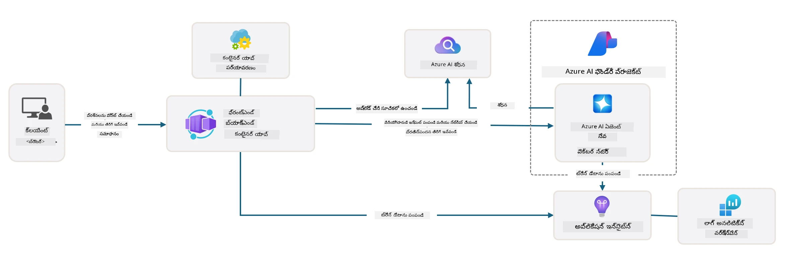

# 3. టెంప్లేట్‌ను విశ్లేషించండి

!!! tip "ఈ మాడ్యూల్ ముగిసే నాటికి మీరు చేయగలవు"

    - [ ] GitHub Copilot‌ను Azure సహాయానికి MCP సర్వర్లతో సక్రియం చేయండి
    - [ ] AZD టెంప్లేట్ ఫోల్డర్ నిర్మాణం మరియు భాగాలను అర్థం చేసుకోండి
    - [ ] ఇన్‌ఫ్రాస్ట్రక్చర్-అస్-కోడ్ (Bicep) సంస్థాపనా నమూనాలను అన్వేషించండి
    - [ ] **ల్యాబ్ 3:** రిపోజిటరీ ఆర్కిటెక్చర్‌ను అన్వేషించడానికి మరియు అర్థం చేసుకోవడానికి GitHub Copilot ఉపయోగించండి

---


With AZD templates and the Azure Developer CLI (`azd`) we can quickly jumpstart our AI development journey with standardized repositories that provide sample code, infrastructure and configuration files - in the form of a ready-to-deploy _starter_ project.

**కానీ ఇప్పుడు, మేము ప్రాజెక్ట్ నిర్మాణం మరియు కోడ్బేస్‌ను అర్థం చేసుకోవాలి - మరియు AZD గురించి ముందస్తు అనుభవం లేకుండా AZD టెంప్లేట్‌ను అనుకూలీకరించగలగాలి!**

---

## 1. Activate GitHub Copilot

### 1.1 Install GitHub Copilot Chat

It's time to explore [Agent మోడ్‌తో GitHub Copilot](https://code.visualstudio.com/docs/copilot/chat/chat-agent-mode). Now, we can use natural language to describe our task at a high level, and get assistance in execution. For this lab, we'll use the [Copilot ఉచిత పథకం](https://github.com/github-copilot/signup) which has a monthly limit for completions and chat interactions.

The extension can be installed from the marketplace, but should already be available in your Codespaces environment. _Click `Open Chat` from the Copilot icon drop-down - and type a prompt like `What can you do?`_ - you may be prompted to log in. **GitHub Copilot Chat సిద్ధంగా ఉంది**.

### 1.2. Install MCP Servers

For Agent mode to be effective, it needs access to the right tools to help it retrieve knowledge or take actions. This is where MCP servers can help. We'll configure the following servers:

1. [Azure MCP Server](../../../../../workshop/docs/instructions)
1. [Microsoft Docs MCP Server](../../../../../workshop/docs/instructions)

To activate these:

1. Create a file called `.vscode/mcp.json` if it does not exist
1. Copy the following into that file - and start the servers!
   ```json title=".vscode/mcp.json"
   {
      "servers": {
         "Azure MCP Server": {
            "command": "npx",
            "args": [
            "-y",
            "@azure/mcp@latest",
            "server",
            "start"
            ]
         },
         "microsoft.docs.mcp": {
            "type": "http",
            "url": "https://learn.microsoft.com/api/mcp"
         }
      }
   }
   ```

??? warning "మీరు `npx` ఇన్‌స్టాల్ చేయబడలేదు అనే లోపాన్ని పొందవచ్చు (పరిష్కారం కోసం విస్తరించడానికి క్లిక్ చేయండి)"

      సరిపర్చడానికి, ఈ `.devcontainer/devcontainer.json` ఫైల్‌ను తెరచి features సెక్షన్‌లో ఈ పంక్తిని జోడించండి. తరువాత కంటెయినర్‌ను పునఃనిర్మించండి. ఇప్పుడు మీకు `npx` ఇన్‌స్టాల్ అయి ఉండాలి.

      ```title="" linenums="0"
         "features": {
            "ghcr.io/devcontainers/features/node:1": {},
            ...
         },
      ```

---

### 1.3. Test GitHub Copilot Chat

**మొదట `az login` ఉపయోగించి VS Code కమాండ్ లైన్ నుండి Azureతో ప్రామాణీకరించండి.**

You should now be able to query your Azure subscription status, and ask questions about deployed resources or configuration. Try these prompts:

1. `List my Azure resource groups`
1. `#foundry list my current deployments`

You can also ask questions about Azure documentation and get responses grounded in the Microsoft Docs MCP server. Try these prompts:

1. `#microsoft_docs_search What is Azure Developer CLI?`
1. `#microsoft_docs_search Show me a Python tutorial to chat with deployed model`

Or you can ask for code snippets to complete a task. Try this prompt.

1. `Give me a Python code example that uses AAD for an interactive chat client`

In `Ask` mode, this will provide code that you can copy-paste and try out. In `Agent` mode, this might go a step further and create the relevant resources for you - including setup scripts and documentation - to help you execute that task.

**ఇప్పుడు మీరు టెంప్లేట్ రిపోజిటరీని అన్వేషించడానికి సిద్ధంగా ఉన్నారు**

---

## 2. ఆర్కిటెక్చర్‌ను విశ్లేషించండి

??? prompt "ASK: docs/images/architecture.png లోని అప్లికేషన్ ఆర్కిటెక్చర్‌ను ఒక పేరాగ్రాఫ్‌లో వివరించండి"

      ఈ అప్లికేషన్ ఒక Azure ఆధారిత, AI-శక్తిగల చాట్ అప్లికేషన్, ఇది ఆధునిక ఏజంట్-ఆధారిత ఆర్కిటెక్చర్‌ను ప్రదర్శిస్తుంది. పరిష్కారం ప్రధానంగా Azure Container App చుట్టూ ఉంటుంది, ఇది ప్రధాన అప్లికేషన్ కోడ్‌ను హోస్ట్ చేస్తుంది, యూజర్ ఇన్‌పుట్‌ను ప్రాసెస్ చేసి AI ఏజంట్ ద్వారా తెలివైన ప్రతిస్పందనలు రూపొందిస్తుంది.
      
      ఆర్కిటెక్చర్ Microsoft Foundry Projectని AI సామర్థ్యాలకు స్థాపనగా ఉపయోగిస్తుంది, మరియు Azure AI Services (ఉదాహరణకు GPT-4o-mini వంటి భాషా మోడల్స్) మరియు ఏజంట్ ఫంక్షనల్‌ను కనెక్ట్ చేస్తుంది. యూజర్ ఇంటర‌క్షన్లు React ఆధారిత ఫ్రంట్‌ఎండ్ నుండి FastAPI బెకెండ్‌కు ప్రవహిస్తాయి, బెకెండ్ AI ఏజంట్ సేవతో సంబంధం పెట్టుకుని సందర్భానుకూల ప్రతిస్పందనలు సృష్టిస్తుంటుంది.
      
      సిస్టమ్ ఫైల్ శోధన లేదా Azure AI Search సేవ ద్వారా నాలెడ్జ్ రిట్రీవల్ సామర్థ్యాలను ఉపయోగిస్తుంది, తద్వారా ఏజంట్ అప్లోడ్ చేయబడిన డాక్యుమెంట్ల నుండి సమాచారం యాక్సెస్ చేసి ఉద్ఘాటించగలదు. ఆపరేషనల్ ఎక్సేలెన్స్ కోసం, Application Insights మరియు Log Analytics Workspace ద్వారా సమగ్ర మానిటరింగ్ కలిగి ఉంది, ట్రేసింగ్, లాగింగ్ మరియు ప్రదర్శన ఆప్టిమైజేషన్ కోసం.
      
      Azure Storage అనువర్తన డేటా మరియు ఫైల్ అప్‌లోడ్‌ల కొరకు బ్లాబ్ స్టోరేజ్‌ను అందిస్తుంది, Managed Identity వనరుల మధ్య సురక్షిత యాక్సెస్‌ను క్రెడెన్షియల్స్ నిల్వ చేయకుండా నిర్ధారిస్తుంది. మొత్తం పరిష్కారం స్కేలబిలిటీ మరియు నిర్వహణ సామర్థ్యాల కోసం రూపకల్పన చేయబడింది, కంటెయినర్ చేయబడు అప్లికేషన్ డిమాండ్ ఆధారంగా ఆటోమాటిక్‌గా స్కేల్ అవుతుంది మరియు Azure యొక్క మేనేజ్‌డ్ సర్వీసుల ద్వారా బిల్ట్-ఇన్ భద్రత, మానిటరింగ్ మరియు CI/CD సామర్థ్యాలను అందిస్తుంది.



---

## 3. రిపోజిటరీ నిర్మాణం

!!! prompt "ASK: టెంప్లేట్ ఫోల్డర్ నిర్మాణాన్ని వివరించండి. దాని ఒక దృశ్య హైరార్కికల్ డయాగ్రామ్‌తో ప్రారంభించండి."

??? info "ANSWER: దృశ్య హైరార్కికల్ డయాగ్రామ్"

      ```bash title="" 
      get-started-with-ai-agents/
      ├── 📋 Configuration & Setup
      │   ├── azure.yaml                    # Azure Developer CLI configuration
      │   ├── docker-compose.yaml           # Local development containers
      │   ├── pyproject.toml                # Python project configuration
      │   ├── requirements-dev.txt          # Development dependencies
      │   └── .devcontainer/                # VS Code dev container setup
      │
      ├── 🏗️ Infrastructure (infra/)
      │   ├── main.bicep                    # Main infrastructure template
      │   ├── api.bicep                     # API-specific resources
      │   ├── main.parameters.json          # Infrastructure parameters
      │   └── core/                         # Modular infrastructure components
      │       ├── ai/                       # AI service configurations
      │       ├── host/                     # Hosting infrastructure
      │       ├── monitor/                  # Monitoring and logging
      │       ├── search/                   # Azure AI Search setup
      │       ├── security/                 # Security and identity
      │       └── storage/                  # Storage account configs
      │
      ├── 💻 Application Source (src/)
      │   ├── api/                          # Backend API
      │   │   ├── main.py                   # FastAPI application entry
      │   │   ├── routes.py                 # API route definitions
      │   │   ├── search_index_manager.py   # Search functionality
      │   │   ├── data/                     # API data handling
      │   │   ├── static/                   # Static web assets
      │   │   └── templates/                # HTML templates
      │   ├── frontend/                     # React/TypeScript frontend
      │   │   ├── package.json              # Node.js dependencies
      │   │   ├── vite.config.ts            # Vite build configuration
      │   │   └── src/                      # Frontend source code
      │   ├── data/                         # Sample data files
      │   │   └── embeddings.csv            # Pre-computed embeddings
      │   ├── files/                        # Knowledge base files
      │   │   ├── customer_info_*.json      # Customer data samples
      │   │   └── product_info_*.md         # Product documentation
      │   ├── Dockerfile                    # Container configuration
      │   └── requirements.txt              # Python dependencies
      │
      ├── 🔧 Automation & Scripts (scripts/)
      │   ├── postdeploy.sh/.ps1           # Post-deployment setup
      │   ├── setup_credential.sh/.ps1     # Credential configuration
      │   ├── validate_env_vars.sh/.ps1    # Environment validation
      │   └── resolve_model_quota.sh/.ps1  # Model quota management
      │
      ├── 🧪 Testing & Evaluation
      │   ├── tests/                        # Unit and integration tests
      │   │   └── test_search_index_manager.py
      │   ├── evals/                        # Agent evaluation framework
      │   │   ├── evaluate.py               # Evaluation runner
      │   │   ├── eval-queries.json         # Test queries
      │   │   └── eval-action-data-path.json
      │   ├── sandbox/                      # Development playground
      │   │   ├── 1-quickstart.py           # Getting started examples
      │   │   └── aad-interactive-chat.py   # Authentication examples
      │   └── airedteaming/                 # AI safety evaluation
      │       └── ai_redteaming.py          # Red team testing
      │
      ├── 📚 Documentation (docs/)
      │   ├── deployment.md                 # Deployment guide
      │   ├── local_development.md          # Local setup instructions
      │   ├── troubleshooting.md            # Common issues & fixes
      │   ├── azure_account_setup.md        # Azure prerequisites
      │   └── images/                       # Documentation assets
      │
      └── 📄 Project Metadata
         ├── README.md                     # Project overview
         ├── CODE_OF_CONDUCT.md           # Community guidelines
         ├── CONTRIBUTING.md              # Contribution guide
         ├── LICENSE                      # License terms
         └── next-steps.md                # Post-deployment guidance
      ```

### 3.1. ప్రధాన అప్లికేషన్ ఆర్కిటెక్చర్

This template follows a **full-stack web application** pattern with:

- **బ్యాకెండ్**: Python FastAPI తో Azure AI ఇన్టిగ్రేషన్
- **ఫ్రంట్‌ఎండ్**: TypeScript/React తో Vite బిల్డ్ సిస్టమ్
- **ఇన్‌ఫ్రాస్ట్రక్చర్**: క్లౌడ్ వనరుల కొరకు Azure Bicep టెంప్లేట్స్
- **కంటెయినరీజేషన్**: సुसंगతాత్మక డిప్లాయ్‌మెంట్ కోసం Docker

### 3.2 Infra As Code (bicep)

The infrastructure layer uses **Azure Bicep** templates organized modularly:

   - **`main.bicep`**: అన్ని Azure వనరులను సమన్వయంగా నిర్వహిస్తుంది
   - **`core/` modules**: వివిధ సేవల కోసం పునఃఉపయోగించదగిన భాగాలు
      - AI services (Azure OpenAI, AI Search)
      - Container hosting (Azure Container Apps)
      - Monitoring (Application Insights, Log Analytics)
      - Security (Key Vault, Managed Identity)

### 3.3 Application Source (`src/`)

**Backend API (`src/api/`)**:

- FastAPI ఆధారిత REST API
- Foundry Agents సమీకరణ
- నాలెడ్జ్ రిట్రీవల్ కోసం సెర్చ్ ఇండెక్స్ నిర్వహణ
- ఫైల్ అప్లోడ్ మరియు ప్రాసెసింగ్ కార్యకలాపాలు

**Frontend (`src/frontend/`)**:

- ఆధునిక React/TypeScript SPA
- ఫాస్ట్ డెవలప్‌మెంట్ మరియు ఆప్టిమైజ్డ్ బిల్డులకు Vite
- ఏజంట్ ఇంటరాక్షన్‌ల కోసం చాట్ ఇంటర్‌ఫేస్

**Knowledge Base (`src/files/`)**:

- నమూనా కస్టమర్ మరియు ఉత్పత్తి డేటా
- ఫైల్-ఆధారిత నాలెడ్జ్ రిట్రీవల్‌ను ప్రదర్శిస్తుంది
- JSON మరియు Markdown ఫార్మాట్ ตัวอย่างలు


### 3.4 DevOps & Automation

**Scripts (`scripts/`)**:

- క్రాస్-ప్లాట్‌ఫారం PowerShell మరియు Bash స్క్రిప్టులు
- ఎన్విరాన్‌మెంట్ వెరిఫికేషన్ మరియు సెటప్
- పోస్ట్-డిప్లాయ్‌మెంట్ కాన్ఫిగరేషన్
- మోడల్ కోటా నిర్వహణ

**Azure Developer CLI Integration**:

- `azure.yaml` కాన్ఫిగరేషన్ azd వర్క్‌ఫ్లోలకు
- ఆటోమేటెడ్ ప్రావిషనింగ్ మరియు డిప్లాయ్‌మెంట్
- ఎన్విరాన్‌మెంట్ వేరియబుల్ నిర్వహణ

### 3.5 Testing & Quality Assurance

**Evaluation Framework (`evals/`)**:

- ఏజంట్ పనితీరు αξιολόγηση
- క్వరి-రెస్పాన్స్ నాణ్యత పరీక్షలు
- ఆటోమేటెడ్ అసెస్‌మెంట్ పైప్లైన్

**AI Safety (`airedteaming/`)**:

- AI సేఫ్టీ కోసం రెడ్ టీమ్ పరీక్షలు
- భద్రతా భేద్యతలు స్క్యానింగ్
- బాధ్యతాయుత AI ఉపాయాలు

---

## 4. అభినందనలు 🏆

You successfully used GitHub Copilot Chat with MCP servers, to explore the repository.

- [X] GitHub Copilot‌ను Azure కోసం సక్రియం చేశారు
- [X] అప్లికేషన్ ఆర్కిటెక్చర్‌ను అర్థం చేసుకున్నారు
- [X] AZD టెంప్లేట్ నిర్మాణాన్ని అన్వేషించారు

This gives you a sense of the _infrastructure as code_ assets for this template. Next, we'll look at the configuration file for AZD.

---

<!-- CO-OP TRANSLATOR DISCLAIMER START -->
నిరాకరణ:
ఈ పత్రాన్ని AI అనువాద సేవ [Co-op Translator](https://github.com/Azure/co-op-translator) ద్వారా అనువదించారు. మేము ఖచ్చితత్వానికి ప్రయత్నించినప్పటికీ, ఆటోమేటెడ్ అనువాదాల్లో పొరపాట్లు లేదా లోపాలు ఉండవచ్చు. మూల పత్రాన్ని దాని స్థానిక భాషలోని అధికారిక వనరుగా పరిగణించాలి. కీలకమైన సమాచారానికి వృత్తిపరమైన మానవ అనువాదాన్ని సూచిస్తాము. ఈ అనువాదాన్ని ఉపయోగించుట వలన ఏర్పడిన ఏవైనా అపార్థాలు లేదా తప్పుగా అర్థం చేసుకోవడాల కోసం మేము బాధ్యులు కాదు.
<!-- CO-OP TRANSLATOR DISCLAIMER END -->