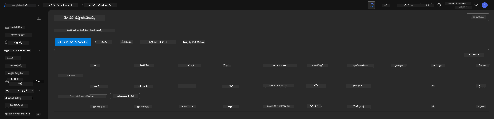

<!--
CO_OP_TRANSLATOR_METADATA:
{
  "original_hash": "6539a34c770f3ceff282370d72ee74dc",
  "translation_date": "2025-11-25T07:35:14+00:00",
  "source_file": "workshop/docs/instructions/6-Teardown-Infrastructure.md",
  "language_code": "te"
}
-->
# 6. ఇన్‌ఫ్రాస్ట్రక్చర్‌ను తొలగించడం

!!! tip "ఈ మాడ్యూల్ ముగిసే సమయానికి మీరు చేయగలుగుతారు"

    - [ ] అంశం
    - [ ] అంశం
    - [ ] అంశం

---

## అదనపు వ్యాయామాలు

ప్రాజెక్ట్‌ను తొలగించే ముందు, కొంత సమయం తీసుకుని కొన్ని స్వేచ్ఛా అన్వేషణలు చేయండి.

!!! danger "నిత్య-టుడూ: ప్రయత్నించడానికి కొన్ని సూచనలు ఇవ్వండి"

---

## ఇన్‌ఫ్రాను తొలగించడం

1. ఇన్‌ఫ్రాస్ట్రక్చర్‌ను తొలగించడం చాలా సులభం:
      
      ```bash title="" linenums="0"
      azd down --purge
      ```
1. `--purge` ఫ్లాగ్ సాఫ్ట్-డిలీట్ చేయబడిన Cognitive Service వనరులను కూడా తొలగించడాన్ని నిర్ధారిస్తుంది, తద్వారా ఈ వనరుల ద్వారా పట్టుకున్న కోటాను విడుదల చేస్తుంది. పూర్తయిన తర్వాత మీరు ఈ విధంగా ఏదో ఒకటి చూడగలరు:
      
      ```bash title="" linenums="0"
      ? Total resources to delete: 11, are you sure you want to continue? Yes
      Deleting your resources can take some time.
      (✓) Done: Deleted resource group rg-nitya-mshack-azd
      (✓) Done: Purging Cognitive Account: aoai-3cz3zkynhvpbc

      SUCCESS: Your application was removed from Azure in 11 minutes 4 seconds.
      ```

1. (ఐచ్ఛికం) మీరు ఇప్పుడు మళ్లీ `azd up` నడిపితే, స్థానిక `.azure` ఫోల్డర్‌లో పర్యావరణ వేరియబుల్ మార్చబడిన (మరియు సేవ్ చేయబడిన) కారణంగా gpt-4.1 మోడల్ మళ్లీ డిప్లాయ్ చేయబడుతుందని గమనించవచ్చు.

      ఇక్కడ **ముందు** మోడల్ డిప్లాయ్‌మెంట్లు ఉన్నాయి:

      

      మరియు ఇది **తర్వాత** ఇలా ఉంది:
      

---

<!-- CO-OP TRANSLATOR DISCLAIMER START -->
**అస్వీకరణ**:  
ఈ పత్రం AI అనువాద సేవ [Co-op Translator](https://github.com/Azure/co-op-translator) ఉపయోగించి అనువదించబడింది. మేము ఖచ్చితత్వానికి ప్రయత్నిస్తున్నప్పటికీ, ఆటోమేటెడ్ అనువాదాలు తప్పులు లేదా అసమగ్రతలను కలిగి ఉండవచ్చు. దాని స్వదేశ భాషలో ఉన్న అసలు పత్రాన్ని అధికారం కలిగిన మూలంగా పరిగణించాలి. కీలకమైన సమాచారం కోసం, ప్రొఫెషనల్ మానవ అనువాదాన్ని సిఫారసు చేస్తాము. ఈ అనువాదాన్ని ఉపయోగించడం వల్ల కలిగే ఏవైనా అపార్థాలు లేదా తప్పుదారులు కోసం మేము బాధ్యత వహించము.
<!-- CO-OP TRANSLATOR DISCLAIMER END -->