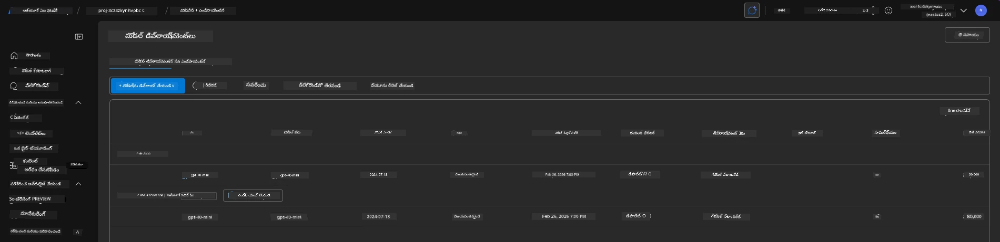
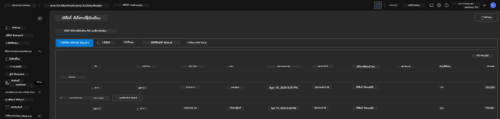

# 6. ఇన్ఫ్రాస్ట్రక్చర్ తొలగింపు

!!! tip "ఈ మాడ్యూల్ ముగిశినపుడు మీరు చేయగలుగుతారు"

    - [ ] వనరుల శుభ్రపరిచే ప్రక్రియ మరియు ఖర్చు నిర్వహణ యొక్క ప్రాముఖ్యతను అర్థం చేసుకోండి
    - [ ] సురక్షితంగా ఇన్ఫ్రాస్ట్రక్చర్‌ను డీప్రోవిజన్ చేయడానికి `azd down` ఉపయోగించండి
    - [ ] సాఫ్ట్-డిలీట్ అయిన కాగ్నిటివ్ సేవలను అవసరమైతే పునరుద్ధరించండి
    - [ ] **ల్యాబ్ 6:** Azure వనరులను శుభ్రపరిచి, తొలగింపును నిర్ధారించండి

---

## బోనస్ వ్యాయామాలు

ప్రాజెక్ట్‌ను తొలగించే ముందు, కొన్ని నిమిషాలు తీసుకొని కొంత స్వేచ్ఛాయుత అన్వేషణ చేయండి.

!!! info "ఈ అన్వేషణ ప్రాంప్ట్స్ ప్రయత్నించండి"

    **GitHub Copilot తో ప్రయోగించండి:**
    
    1. అడగండి: `బహుఎజెంట్ పరిస్థితుల కోసం నేను మరే ఇతర AZD టెంప్లేట్స్ ప్రయత్నించవచ్చు?`
    2. అడగండి: `హెల్త్‌కేర్ వినియోగానికి ఏజెంట్ సూచనలను నేను ఎలా అనుకూలీకరించగలను?`
    3. అడగండి: `ఖర్చు ఆప్టిమైజేషన్‌ను నియంత్రించడానికి ఏ వాతావరణ వేరియబుల్స్ ఉన్నాయ్?`
    
    **Azure పోర్టల్‌ను అన్వేషించండి:**
    
    1. మీ డిప్లాయ్‌మెంట్ కోసం Application Insights మెట్రిక్స్‌ను సమీక్షించండి
    2. ప్రొవిజన్ చేసిన వనరుల కోసం ఖర్చు విశ్లేషణను తనిఖీ చేయండి
    3. Microsoft Foundry పోర్టల్ ఏజెంట్ ప్లేగ్రౌండ్‌ను ఒకసారి మళ్లీ అన్వేషించండి

---

## ఇన్ఫ్రా తొలగింపు

1. ఇన్ఫ్రాస్ట్రక్చర్‌ను తొలగించడం ఇంతనే సులభం:

      
      ```bash title="" linenums="0"
      azd down --purge
      ```
1. `--purge` ఫ్లాగ్ సాఫ్ట్-డిలీట్ అయిన కాగ్నిటివ్ సర్వీస్ వనరులను కూడా శుద్ధి చేస్తుందని నిర్ధారిస్తుంది, తద్వారా ఆ వనరులు పట్టుకున్న క్వాటా విడుదల అవుతుంది. పూర్తి అయిన తర్వాత మీరు ఇలాంటి ఒకదాన్ని చూడగలుగుతారు:
      
      ```bash title="" linenums="0"
      ? Total resources to delete: 11, are you sure you want to continue? Yes
      Deleting your resources can take some time.
      (✓) Done: Deleted resource group rg-nitya-mshack-azd
      (✓) Done: Purging Cognitive Account: aoai-3cz3zkynhvpbc

      SUCCESS: Your application was removed from Azure in 11 minutes 4 seconds.
      ```

1. (ఐచ్చికంగా) ఇప్పుడు మీరు `azd up` మళ్లీ రన్ చేస్తే, పరిసర వేరియబుల్ స్థానిక `.azure` ఫోల్డర్‌లో మార్చబడి (మరియు సేవ్ చేయబడి) ఉండటంతో gpt-4.1 మోడల్ డిప్లాయ్ అయ్యిందని మీరు గమనిస్తారు. 

      Here is the model deployments **ముందు**:

      

      And here it is **తరువాత**:
      

---

<!-- CO-OP TRANSLATOR DISCLAIMER START -->
నిరాకరణ:
ఈ పత్రాన్ని AI అనువాద సేవ [Co-op Translator](https://github.com/Azure/co-op-translator) ద్వారా అనువదించబడింది. మేము ఖచ్చితత్వానికి యత్నించినప్పటికీ, ఆటోమేటెడ్ అనువాదాల్లో తప్పులు లేదా అసమర్థతలు ఉండకపోవచ్చని దయచేసి గమనించండి. స్థానిక భాషలోని అసలు పత్రాన్ని అధికారిక మూలంగా పరిగణించాలి. కీలక సమాచారానికి, వృత్తిపరమైన మానవ అనువాదాన్ని సూచించబడుతుంది. ఈ అనువాదం ఉపయోగం కారణంగా కలిగే ఏవైనా అపార్థాలు లేదా తప్పుగా వ్యాఖ్యానించబడిన విషయాల కోసం మేము బాధ్యులు కాదు.
<!-- CO-OP TRANSLATOR DISCLAIMER END -->