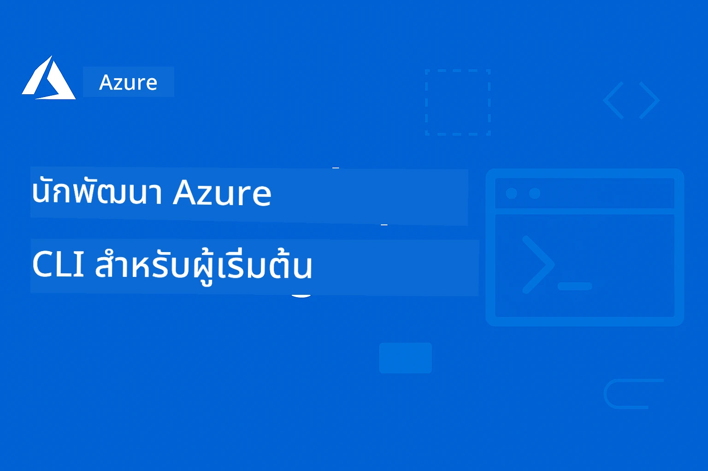

# AZD สำหรับผู้เริ่มต้น: การเรียนรู้ที่มีโครงสร้าง

 

[](https://GitHub.com/microsoft/azd-for-beginners/watchers/)
[](https://GitHub.com/microsoft/azd-for-beginners/network/)
[](https://GitHub.com/microsoft/azd-for-beginners/stargazers/)

[](https://discord.gg/microsoft-azure)
[](https://discord.gg/nTYy5BXMWG)

## การเริ่มต้นกับคอร์สนี้

ทำตามขั้นตอนเหล่านี้เพื่อเริ่มต้นการเรียนรู้ AZD ของคุณ:

1. **โคลนที่เก็บโค้ด (Fork the Repository)**: คลิก [](https://GitHub.com/microsoft/azd-for-beginners/fork)
2. **โคลน Repository**: `git clone https://github.com/microsoft/azd-for-beginners.git`
3. **เข้าร่วมชุมชน**: [ชุมชน Azure Discord](https://discord.com/invite/ByRwuEEgH4) เพื่อรับการสนับสนุนจากผู้เชี่ยวชาญ
4. **เลือกเส้นทางการเรียนรู้ของคุณ**: เลือกบทเรียนด้านล่างที่ตรงกับระดับประสบการณ์ของคุณ

### รองรับหลายภาษา

#### การแปลอัตโนมัติ (อัปเดตทุกเวลา)

<!-- CO-OP TRANSLATOR LANGUAGES TABLE START -->
[Arabic](../ar/README.md) | [Bengali](../bn/README.md) | [Bulgarian](../bg/README.md) | [Burmese (Myanmar)](../my/README.md) | [Chinese (Simplified)](../zh-CN/README.md) | [Chinese (Traditional, Hong Kong)](../zh-HK/README.md) | [Chinese (Traditional, Macau)](../zh-MO/README.md) | [Chinese (Traditional, Taiwan)](../zh-TW/README.md) | [Croatian](../hr/README.md) | [Czech](../cs/README.md) | [Danish](../da/README.md) | [Dutch](../nl/README.md) | [Estonian](../et/README.md) | [Finnish](../fi/README.md) | [French](../fr/README.md) | [German](../de/README.md) | [Greek](../el/README.md) | [Hebrew](../he/README.md) | [Hindi](../hi/README.md) | [Hungarian](../hu/README.md) | [Indonesian](../id/README.md) | [Italian](../it/README.md) | [Japanese](../ja/README.md) | [Kannada](../kn/README.md) | [Korean](../ko/README.md) | [Lithuanian](../lt/README.md) | [Malay](../ms/README.md) | [Malayalam](../ml/README.md) | [Marathi](../mr/README.md) | [Nepali](../ne/README.md) | [Nigerian Pidgin](../pcm/README.md) | [Norwegian](../no/README.md) | [Persian (Farsi)](../fa/README.md) | [Polish](../pl/README.md) | [Portuguese (Brazil)](../pt-BR/README.md) | [Portuguese (Portugal)](../pt-PT/README.md) | [Punjabi (Gurmukhi)](../pa/README.md) | [Romanian](../ro/README.md) | [Russian](../ru/README.md) | [Serbian (Cyrillic)](../sr/README.md) | [Slovak](../sk/README.md) | [Slovenian](../sl/README.md) | [Spanish](../es/README.md) | [Swahili](../sw/README.md) | [Swedish](../sv/README.md) | [Tagalog (Filipino)](../tl/README.md) | [Tamil](../ta/README.md) | [Telugu](../te/README.md) | [Thai](./README.md) | [Turkish](../tr/README.md) | [Ukrainian](../uk/README.md) | [Urdu](../ur/README.md) | [Vietnamese](../vi/README.md)

> **ชอบดาวน์โหลดแบบโคลนในเครื่อง?**

> ที่เก็บนี้มีการแปลกว่า 50 ภาษา ซึ่งจะเพิ่มขนาดการดาวน์โหลดมาก เพื่อโคลนโดยไม่รวมการแปล ให้ใช้ sparse checkout:
> ```bash
> git clone --filter=blob:none --sparse https://github.com/microsoft/AZD-for-beginners.git
> cd AZD-for-beginners
> git sparse-checkout set --no-cone '/*' '!translations' '!translated_images'
> ```
> สิ่งนี้จะให้ทุกอย่างที่คุณต้องการเพื่อทำคอร์สนี้ให้เสร็จได้ด้วยความเร็วดาวน์โหลดที่เร็วขึ้นมาก
<!-- CO-OP TRANSLATOR LANGUAGES TABLE END -->

## ภาพรวมของคอร์ส

เชี่ยวชาญ Azure Developer CLI (azd) ผ่านบทต่างๆ ที่จัดโครงสร้างสำหรับการเรียนรู้แบบค่อยเป็นค่อยไป โดยมี **การให้ความสำคัญพิเศษกับการนำแอป AI ไปใช้งานพร้อมการรวม Microsoft Foundry**

### ทำไมคอร์สนี้จึงจำเป็นสำหรับนักพัฒนาสมัยใหม่

อ้างอิงจากข้อมูลเชิงลึกจากชุมชน Microsoft Foundry Discord, **45% ของนักพัฒนาต้องการใช้ AZD ในงาน AI** แต่เจอปัญหากับ:
- สถาปัตยกรรม AI แบบหลายบริการที่ซับซ้อน
- แนวทางปฏิบัติที่ดีสำหรับการนำ AI ไปใช้ในสภาพแวดล้อมการผลิต  
- การรวมและตั้งค่าบริการ AI ใน Azure
- การปรับแต่งค่าใช้จ่ายสำหรับงาน AI
- การแก้ไขปัญหาการนำไปใช้ AI โดยเฉพาะ

### เป้าหมายการเรียนรู้

เมื่อทำคอร์สนี้เสร็จสมบูรณ์ คุณจะ:
- **เชี่ยวชาญพื้นฐาน AZD**: แนวคิดหลัก การติดตั้ง และการตั้งค่า
- **นำแอป AI ไปใช้งาน**: ใช้ AZD กับบริการ Microsoft Foundry
- **ใช้งาน Infrastructure as Code**: จัดการทรัพยากร Azure ด้วยเทมเพลต Bicep
- **แก้ไขปัญหาการนำไปใช้**: แก้ปัญหาทั่วไปและดีบักข้อผิดพลาด
- **ปรับแต่งสำหรับการผลิต**: ความปลอดภัย, การปรับขนาด, การเฝ้าติดตาม และการจัดการค่าใช้จ่าย
- **สร้างโซลูชัน Multi-Agent**: นำสถาปัตยกรรม AI ที่ซับซ้อนไปใช้งาน

## 📚 บทเรียน

*เลือกเส้นทางการเรียนรู้ตามระดับประสบการณ์และเป้าหมายของคุณ*

### 🚀 บทที่ 1: รากฐาน & เริ่มต้นอย่างรวดเร็ว  
**เงื่อนไขเบื้องต้น**: บัญชี Azure, ความรู้เส้นคำสั่งพื้นฐาน  
**ระยะเวลา**: 30-45 นาที  
**ความซับซ้อน**: ⭐

#### สิ่งที่คุณจะได้เรียนรู้
- เข้าใจพื้นฐาน Azure Developer CLI
- ติดตั้ง AZD บนแพลตฟอร์มของคุณ
- การนำแอปแรกของคุณไปใช้งานสำเร็จ

#### แหล่งเรียนรู้
- **🎯 เริ่มที่นี่**: [Azure Developer CLI คืออะไร?](../..)
- **📖 ทฤษฎี**: [พื้นฐาน AZD](docs/getting-started/azd-basics.md) - แนวคิดหลักและคำศัพท์
- **⚙️ การตั้งค่า**: [ติดตั้ง & ตั้งค่า](docs/getting-started/installation.md) - คู่มือเฉพาะแพลตฟอร์ม
- **🛠️ ฝึกปฏิบัติ**: [โครงการแรกของคุณ](docs/getting-started/first-project.md) - บทเรียนทีละขั้นตอน
- **📋 อ้างอิงด่วน**: [แผ่นคำสั่ง](resources/cheat-sheet.md)

#### แบบฝึกหัดปฏิบัติ
```bash
# ตรวจสอบการติดตั้งอย่างรวดเร็ว
azd version

# นำแอปพลิเคชันแรกของคุณขึ้นใช้งาน
azd init --template todo-nodejs-mongo
azd up
```

**💡 ผลลัพธ์บทเรียน**: นำแอปเว็บง่ายๆ ไปใช้งานบน Azure ด้วย AZD ได้สำเร็จ

**✅ การยืนยันความสำเร็จ:**
```bash
# หลังจากทำบทที่ 1 เสร็จ คุณควรจะสามารถ:
azd version              # แสดงเวอร์ชันที่ติดตั้ง
azd init --template todo-nodejs-mongo  # เริ่มต้นโครงการ
azd up                  # นำไปใช้กับ Azure
azd show                # แสดง URL แอปที่กำลังทำงาน
# แอปเปิดในเบราว์เซอร์และทำงานได้
azd down --force --purge  # ทำความสะอาดทรัพยากร
```

**📊 เวลาลงทุน:** 30-45 นาที  
**📈 ระดับทักษะหลังเรียน:** สามารถนำแอปพื้นฐานไปใช้งานได้ด้วยตนเอง

**✅ การยืนยันความสำเร็จ:**
```bash
# หลังจากทำบทที่ 1 เสร็จ คุณควรจะสามารถ:
azd version              # แสดงเวอร์ชันที่ติดตั้งแล้ว
azd init --template todo-nodejs-mongo  # เริ่มต้นโปรเจกต์
azd up                  # นำส่งไปยัง Azure
azd show                # แสดง URL ของแอปที่กำลังรัน
# เปิดแอปในเบราว์เซอร์และทำงานได้
azd down --force --purge  # ลบทรัพยากรที่ใช้แล้ว
```

**📊 เวลาลงทุน:** 30-45 นาที  
**📈 ระดับทักษะหลังเรียน:** สามารถนำแอปพื้นฐานไปใช้งานได้ด้วยตนเอง

---

### 🤖 บทที่ 2: การพัฒนา AI เป็นอันดับแรก (แนะนำสำหรับนักพัฒนา AI)  
**เงื่อนไขเบื้องต้น**: ทำบทที่ 1 เสร็จแล้ว  
**ระยะเวลา**: 1-2 ชั่วโมง  
**ความซับซ้อน**: ⭐⭐

#### สิ่งที่คุณจะได้เรียนรู้
- การรวม Microsoft Foundry กับ AZD
- การนำแอป AI ไปใช้งาน
- เข้าใจการตั้งค่าบริการ AI

#### แหล่งเรียนรู้
- **🎯 เริ่มที่นี่**: [การรวม Microsoft Foundry](docs/microsoft-foundry/microsoft-foundry-integration.md)
- **📖 รูปแบบ**: [การนำโมเดล AI ไปใช้งาน](docs/microsoft-foundry/ai-model-deployment.md) - นำโมเดล AI ไปใช้และจัดการ
- **🛠️ เวิร์กช็อป**: [ห้องปฏิบัติการ AI](docs/microsoft-foundry/ai-workshop-lab.md) - ทำให้โซลูชัน AI พร้อมใช้งานกับ AZD
- **🎥 คู่มือแบบโต้ตอบ**: [เอกสารเวิร์กช็อป](workshop/README.md) - การเรียนรู้ผ่านเบราว์เซอร์ด้วย MkDocs * สภาพแวดล้อม DevContainer
- **📋 เทมเพลต**: [เทมเพลต Microsoft Foundry](../..)
- **📝 ตัวอย่าง**: [ตัวอย่างการนำ AZD ไปใช้งาน](examples/README.md)

#### แบบฝึกหัดปฏิบัติ
```bash
# นำแอปพลิเคชัน AI ตัวแรกของคุณขึ้นใช้งาน
azd init --template azure-search-openai-demo
azd up

# ลองใช้เทมเพลต AI เพิ่มเติม
azd init --template openai-chat-app-quickstart
azd init --template agent-openai-python-prompty
```

**💡 ผลลัพธ์บทเรียน**: นำแอปแชท AI พร้อมฟีเจอร์ RAG ไปใช้งานและตั้งค่าเรียบร้อย

**✅ การยืนยันความสำเร็จ:**
```bash
# หลังจากบทที่ 2 คุณควรจะสามารถ:
azd init --template azure-search-openai-demo
azd up
# ทดสอบอินเทอร์เฟซแชท AI
# ถามคำถามและรับคำตอบที่ขับเคลื่อนโดย AI พร้อมแหล่งที่มา
# ตรวจสอบว่าการรวมการค้นหาทำงานได้
azd monitor  # ตรวจสอบว่า Application Insights แสดงข้อมูลโทรเมทรี่
azd down --force --purge
```

**📊 เวลาลงทุน:** 1-2 ชั่วโมง  
**📈 ระดับทักษะหลังเรียน:** สามารถนำและตั้งค่าแอป AI พร้อมใช้งานในสภาพแวดล้อมผลิตได้  
**💰 ความเข้าใจค่าใช้จ่าย:** เข้าใจค่าใช้จ่ายในการพัฒนาประมาณ $80-150/เดือน และในสภาพแวดล้อมผลิต $300-3500/เดือน

#### 💰 ข้อควรพิจารณาค่าใช้จ่ายสำหรับการนำ AI ไปใช้

**สภาพแวดล้อมพัฒนา (ประมาณ $80-150/เดือน):**
- Azure OpenAI (จ่ายตามจริง): $0-50/เดือน (ขึ้นกับการใช้โทเค็น)
- AI Search (ระดับพื้นฐาน): $75/เดือน
- Container Apps (แบบบริโภค): $0-20/เดือน
- Storage (ระดับมาตรฐาน): $1-5/เดือน

**สภาพแวดล้อมผลิต (ประมาณ $300-3,500+/เดือน):**
- Azure OpenAI (PTU สำหรับประสิทธิภาพสม่ำเสมอ): $3,000+/เดือน หรือ แบบจ่ายตามจริงแต่ใช้ปริมาณมาก
- AI Search (ระดับมาตรฐาน): $250/เดือน
- Container Apps (แบบเฉพาะ): $50-100/เดือน
- Application Insights: $5-50/เดือน
- Storage (ระดับพรีเมียม): $10-50/เดือน

**💡 เคล็ดลับการปรับค่าใช้จ่าย:**
- ใช้ **Free Tier** Azure OpenAI เพื่อการเรียนรู้ (รวม 50,000 โทเค็น/เดือน)
- ใช้คำสั่ง `azd down` เพื่อปลดทรัพยากรเมื่อไม่พัฒนา
- เริ่มด้วยระบบเรียกเก็บเงินแบบบริโภค อัปเกรดไป PTU เฉพาะการผลิต
- ใช้คำสั่ง `azd provision --preview` เพื่อประเมินค่าใช้จ่ายก่อนนำไปใช้งานจริง
- เปิดใช้งานการปรับขนาดอัตโนมัติ: จ่ายเฉพาะการใช้งานจริงเท่านั้น

**การตรวจสอบค่าใช้จ่าย:**
```bash
# ตรวจสอบค่าใช้จ่ายประจำเดือนโดยประมาณ
azd provision --preview

# ตรวจสอบค่าใช้จ่ายจริงใน Azure Portal
az consumption budget list --resource-group <your-rg>
```

---

### ⚙️ บทที่ 3: การตั้งค่าและการพิสูจน์ตัวตน  
**เงื่อนไขเบื้องต้น**: ทำบทที่ 1 เสร็จแล้ว  
**ระยะเวลา**: 45-60 นาที  
**ความซับซ้อน**: ⭐⭐

#### สิ่งที่คุณจะได้เรียนรู้
- การตั้งค่าและจัดการสภาพแวดล้อม
- วิธีพิสูจน์ตัวตนและแนวทางปฏิบัติด้านความปลอดภัยที่ดีที่สุด
- การตั้งชื่อและการจัดระเบียบทรัพยากร

#### แหล่งเรียนรู้
- **📖 การตั้งค่า**: [คู่มือการตั้งค่า](docs/getting-started/configuration.md) - การตั้งค่าสภาพแวดล้อม
- **🔐 ความปลอดภัย**: [รูปแบบการพิสูจน์ตัวตนและ managed identity](docs/getting-started/authsecurity.md) - รูปแบบการพิสูจน์ตัวตน
- **📝 ตัวอย่าง**: [ตัวอย่างแอปฐานข้อมูล](examples/database-app/README.md) - ตัวอย่างฐานข้อมูล AZD

#### แบบฝึกหัดปฏิบัติ
- ตั้งค่าสภาพแวดล้อมหลายชุด (dev, staging, prod)
- ตั้งค่าการพิสูจน์ตัวตนด้วย managed identity
- ใช้งานการตั้งค่าสภาพแวดล้อมเฉพาะ

**💡 ผลลัพธ์บทเรียน**: จัดการหลายสภาพแวดล้อม พร้อมการพิสูจน์ตัวตนและความปลอดภัยอย่างถูกต้อง

---

### 🏗️ บทที่ 4: Infrastructure as Code & การนำไปใช้  
**เงื่อนไขเบื้องต้น**: ทำบทที่ 1-3 เสร็จแล้ว  
**ระยะเวลา**: 1-1.5 ชั่วโมง  
**ความซับซ้อน**: ⭐⭐⭐

#### สิ่งที่คุณจะได้เรียนรู้
- รูปแบบการนำไปใช้ขั้นสูง
- Infrastructure as Code ด้วย Bicep
- กลยุทธ์การจัดเตรียมทรัพยากร

#### แหล่งเรียนรู้
- **📖 การนำไปใช้**: [คู่มือการนำไปใช้](docs/deployment/deployment-guide.md) - กระบวนการครบวงจร
- **🏗️ การจัดเตรียม**: [การจัดเตรียมทรัพยากร](docs/deployment/provisioning.md) - การจัดการทรัพยากร Azure
- **📝 ตัวอย่าง**: [ตัวอย่าง Container App](../../examples/container-app) - การนำไปใช้แบบ containerized

#### แบบฝึกหัดปฏิบัติ
- สร้างเทมเพลต Bicep แบบกำหนดเอง
- นำแอปหลายบริการไปใช้งาน
- ใช้กลยุทธ์การนำไปใช้แบบ blue-green

**💡 ผลลัพธ์บทเรียน**: นำแอปหลายบริการที่ซับซ้อนไปใช้โดยใช้เทมเพลตโครงสร้างพื้นฐานแบบกำหนดเอง

---

### 🎯 บทที่ 5: โซลูชัน AI แบบ Multi-Agent (ขั้นสูง)  
**เงื่อนไขเบื้องต้น**: ทำบทที่ 1-2 เสร็จแล้ว  
**ระยะเวลา**: 2-3 ชั่วโมง  
**ความซับซ้อน**: ⭐⭐⭐⭐
#### สิ่งที่คุณจะได้เรียนรู้
- รูปแบบสถาปัตยกรรมหลายเอเจนต์
- การประสานงานและการจัดการเอเจนต์
- การปรับใช้ AI ที่พร้อมสำหรับการใช้งานจริง

#### แหล่งเรียนรู้
- **🤖 โปรเจกต์เด่น**: [Retail Multi-Agent Solution](examples/retail-scenario.md) - การใช้งานครบถ้วน
- **🛠️ แม่แบบ ARM**: [ARM Template Package](../../examples/retail-multiagent-arm-template) - การปรับใช้ด้วยคลิกเดียว
- **📖 สถาปัตยกรรม**: [รูปแบบการประสานงานหลายเอเจนต์](/docs/pre-deployment/coordination-patterns.md) - รูปแบบต่าง ๆ

#### แบบฝึกหัดเชิงปฏิบัติ
```bash
# นำเสนอโซลูชันตัวแทนหลายตัวสำหรับค้าปลีกครบวงจร
cd examples/retail-multiagent-arm-template
./deploy.sh

# สำรวจการกำหนดค่าของตัวแทน
az deployment group show --resource-group <rg-name> --name <deployment-name>
```

**💡 ผลลัพธ์บทเรียน**: ปรับใช้และจัดการโซลูชัน AI หลายเอเจนต์ที่พร้อมใช้งานจริงด้วยเอเจนต์ลูกค้าและเอเจนต์สินค้าคงคลัง

---

### 🔍 บทที่ 6: การตรวจสอบความถูกต้องและการวางแผนก่อนปรับใช้
**ความต้องการเบื้องต้น**: ผ่านบทที่ 4  
**ระยะเวลา**: 1 ชั่วโมง  
**ระดับความยาก**: ⭐⭐

#### สิ่งที่คุณจะได้เรียนรู้
- การวางแผนความจุและการตรวจสอบทรัพยากร
- กลยุทธ์การเลือก SKU
- การตรวจสอบก่อนปรับใช้และการทำงานอัตโนมัติ

#### แหล่งเรียนรู้
- **📊 การวางแผน**: [Capacity Planning](docs/pre-deployment/capacity-planning.md) - การตรวจสอบทรัพยากร
- **💰 การเลือก**: [SKU Selection](docs/pre-deployment/sku-selection.md) - ตัวเลือกที่คุ้มค่า
- **✅ การตรวจสอบ**: [Pre-flight Checks](docs/pre-deployment/preflight-checks.md) - สคริปต์อัตโนมัติ

#### แบบฝึกหัดเชิงปฏิบัติ
- รันสคริปต์การตรวจสอบความจุ
- ปรับแต่งการเลือก SKU ให้คุ้มค่าที่สุด
- ดำเนินการตรวจสอบอัตโนมัติก่อนปรับใช้

**💡 ผลลัพธ์บทเรียน**: ตรวจสอบความถูกต้องและปรับแต่งการปรับใช้ก่อนการดำเนินการจริง

---

### 🚨 บทที่ 7: การแก้ไขปัญหาและดีบัก
**ความต้องการเบื้องต้น**: ผ่านบทปรับใช้ใด ๆ  
**ระยะเวลา**: 1-1.5 ชั่วโมง  
**ระดับความยาก**: ⭐⭐

#### สิ่งที่คุณจะได้เรียนรู้
- วิธีการดีบักอย่างเป็นระบบ
- ปัญหาทั่วไปและแนวทางแก้ไข
- การแก้ไขปัญหาเฉพาะด้าน AI

#### แหล่งเรียนรู้
- **🔧 ปัญหาทั่วไป**: [Common Issues](docs/troubleshooting/common-issues.md) - คำถามที่พบบ่อยและวิธีแก้ไข
- **🕵️ การดีบัก**: [Debugging Guide](docs/troubleshooting/debugging.md) - แนวทางทีละขั้นตอน
- **🤖 ปัญหา AI**: [AI-Specific Troubleshooting](docs/troubleshooting/ai-troubleshooting.md) - ปัญหาบริการ AI

#### แบบฝึกหัดเชิงปฏิบัติ
- วินิจฉัยความล้มเหลวในการปรับใช้
- แก้ไขปัญหาการรับรองตัวตน
- ดีบักการเชื่อมต่อบริการ AI

**💡 ผลลัพธ์บทเรียน**: วินิจฉัยและแก้ไขปัญหาการปรับใช้ทั่วไปได้อย่างอิสระ

---

### 🏢 บทที่ 8: รูปแบบการใช้งานระดับองค์กรและการผลิต
**ความต้องการเบื้องต้น**: ผ่านบทที่ 1-4  
**ระยะเวลา**: 2-3 ชั่วโมง  
**ระดับความยาก**: ⭐⭐⭐⭐

#### สิ่งที่คุณจะได้เรียนรู้
- กลยุทธ์การปรับใช้ในสภาพแวดล้อมการผลิต
- รูปแบบความปลอดภัยระดับองค์กร
- การตรวจสอบและการปรับแต่งค่าใช้จ่าย

#### แหล่งเรียนรู้
- **🏭 การผลิต**: [Production AI Best Practices](docs/microsoft-foundry/production-ai-practices.md) - รูปแบบองค์กร
- **📝 ตัวอย่าง**: [Microservices Example](../../examples/microservices) - สถาปัตยกรรมซับซ้อน
- **📊 การตรวจสอบ**: [Application Insights integration](docs/pre-deployment/application-insights.md) - การตรวจสอบ

#### แบบฝึกหัดเชิงปฏิบัติ
- ใช้รูปแบบความปลอดภัยระดับองค์กร
- ตั้งค่าการตรวจสอบอย่างครบถ้วน
- ปรับใช้ในสภาพแวดล้อมการผลิตด้วยการควบคุมที่เหมาะสม

**💡 ผลลัพธ์บทเรียน**: ปรับใช้แอปพลิเคชันที่พร้อมสำหรับองค์กรและการผลิตอย่างเต็มรูปแบบ

---

## 🎓 ภาพรวมเวิร์กช็อป: ประสบการณ์เรียนรู้แบบลงมือทำ

> **⚠️ สถานะเวิร์กช็อป: กำลังพัฒนา**  
> วัสดุเวิร์กช็อปอยู่ในระหว่างการพัฒนาและปรับปรุง โมดูลหลักใช้งานได้ แต่บางส่วนขั้นสูงยังไม่สมบูรณ์ เรากำลังดำเนินการให้เสร็จสมบูรณ์ทุกส่วน [ติดตามความคืบหน้า →](workshop/README.md)

### วัสดุเวิร์กช็อปแบบโต้ตอบ
**การเรียนรู้แบบลงมือทำครบวงจรผ่านเครื่องมือบนเบราว์เซอร์และแบบฝึกหัดแนะนำ**

วัสดุเวิร์กช็อปของเรามอบประสบการณ์เรียนรู้อย่างมีโครงสร้างและเป็นระบบที่เสริมเนื้อหาบทเรียนข้างต้น เวิร์กช็อปนี้ออกแบบมาสำหรับการเรียนรู้ด้วยตนเองและการเรียนการสอนโดยผู้สอน

#### 🛠️ คุณสมบัติเวิร์กช็อป
- **อินเทอร์เฟซบนเบราว์เซอร์**: เวิร์กช็อปที่ใช้ MkDocs แบบครบวงจรพร้อมฟีเจอร์ค้นหา, คัดลอก และธีม
- **การผสานกับ GitHub Codespaces**: ตั้งค่าสภาพแวดล้อมพัฒนาได้ด้วยการคลิกเดียว
- **เส้นทางการเรียนรู้แบบมีโครงสร้าง**: แบบฝึกหัดแนะนำ 7 ขั้นตอน (รวม 3.5 ชั่วโมง)
- **ค้นหา → ปรับใช้ → ปรับแต่ง**: วิธีการเรียนรู้อย่างเป็นขั้นตอน
- **สภาพแวดล้อม DevContainer แบบโต้ตอบ**: เครื่องมือและการตั้งล่วงหน้าที่ครบครัน

#### 📚 โครงสร้างเวิร์กช็อป
เวิร์กช็อปนี้ใช้วิธีการ **ค้นหา → ปรับใช้ → ปรับแต่ง** ดังนี้:

1. **ระยะค้นหา** (45 นาที)
   - สำรวจแม่แบบและบริการ Microsoft Foundry
   - ทำความเข้าใจรูปแบบสถาปัตยกรรมหลายเอเจนต์
   - ทบทวนข้อกำหนดและความต้องการก่อนปรับใช้

2. **ระยะปรับใช้** (2 ชั่วโมง)
   - ลงมือปรับใช้แอปพลิเคชัน AI ด้วย AZD
   - ตั้งค่าบริการ Azure AI และจุดเชื่อมต่อ
   - ทำรูปแบบความปลอดภัยและการรับรองตัวตน

3. **ระยะปรับแต่ง** (45 นาที)
   - แก้ไขแอปพลิเคชันให้เหมาะกับกรณีใช้งานเฉพาะ
   - ปรับแต่งให้เหมาะสมสำหรับการปรับใช้ในสภาพแวดล้อมการผลิต
   - ทำการตรวจสอบและจัดการค่าใช้จ่าย

#### 🚀 เริ่มต้นกับเวิร์กช็อป
```bash
# ตัวเลือกที่ 1: GitHub Codespaces (แนะนำ)
# คลิก "รหัส" → "สร้าง codespace ใน main" ในที่เก็บข้อมูล

# ตัวเลือกที่ 2: การพัฒนาในเครื่อง
git clone https://github.com/microsoft/azd-for-beginners.git
cd azd-for-beginners/workshop
# ทำตามคำแนะนำการตั้งค่าใน workshop/README.md
```

#### 🎯 ผลลัพธ์การเรียนรู้เวิร์กช็อป
เมื่อเสร็จสิ้นเวิร์กช็อป ผู้เข้าร่วมจะ:
- **ปรับใช้แอปพลิเคชัน AI ในสภาพแวดล้อมการผลิต**: ใช้ AZD กับบริการ Microsoft Foundry
- **เชี่ยวชาญสถาปัตยกรรมหลายเอเจนต์**: ใช้โซลูชันเอเจนต์ AI ที่ประสานงานกัน
- **นำแนวปฏิบัติด้านความปลอดภัยมาใช้**: ตั้งค่าการรับรองตัวตนและการควบคุมการเข้าถึง
- **เพิ่มประสิทธิภาพเพื่อขยายสเกล**: ออกแบบการปรับใช้ที่คุ้มค่าและประสิทธิภาพสูง
- **แก้ไขปัญหาการปรับใช้ได้ด้วยตนเอง**: แก้ไขปัญหาทั่วไปอย่างอิสระ

#### 📖 แหล่งข้อมูลเวิร์กช็อป
- **🎥 คู่มือแบบโต้ตอบ**: [Workshop Materials](workshop/README.md) - สภาพแวดล้อมการเรียนรู้บนเบราว์เซอร์
- **📋 คำแนะนำทีละขั้นตอน**: [Guided Exercises](../../workshop/docs/instructions) - การเดินคู่มืออย่างละเอียด
- **🛠️ ห้องแล็บเวิร์กช็อป AI**: [AI Workshop Lab](docs/microsoft-foundry/ai-workshop-lab.md) - แบบฝึกหัดเน้นด้าน AI
- **💡 เริ่มต้นอย่างรวดเร็ว**: [Workshop Setup Guide](workshop/README.md#quick-start) - การตั้งค่าสภาพแวดล้อม

**เหมาะสำหรับ**: การฝึกอบรมองค์กร, หลักสูตรมหาวิทยาลัย, การเรียนรู้ด้วยตนเอง และบูทแคมป์สำหรับนักพัฒนา

---

## 📖 Azure Developer CLI คืออะไร?

Azure Developer CLI (azd) เป็นอินเทอร์เฟซบรรทัดคำสั่งที่มุ่งเน้นนักพัฒนาเพื่อเร่งกระบวนการสร้างและปรับใช้แอปพลิเคชันบน Azure โดยมีคุณสมบัติดังนี้:

- **การปรับใช้ด้วยแม่แบบ** - ใช้แม่แบบที่สร้างไว้ล่วงหน้าสำหรับรูปแบบแอปพลิเคชันทั่วไป
- **โครงสร้างพื้นฐานเป็นโค้ด** - จัดการทรัพยากร Azure ผ่าน Bicep หรือ Terraform  
- **เวิร์กโฟลว์แบบบูรณาการ** - จัดเตรียม ปรับใช้ และตรวจสอบแอปพลิเคชันอย่างไร้รอยต่อ
- **ใช้งานง่ายสำหรับนักพัฒนา** - ปรับแต่งให้เหมาะสมกับประสิทธิภาพและประสบการณ์ของนักพัฒนา

### **AZD + Microsoft Foundry: เหมาะสมสำหรับการปรับใช้ AI**

**ทำไมต้องใช้ AZD กับโซลูชัน AI?** AZD ตอบโจทย์ความท้าทายหลักของนักพัฒนา AI ดังนี้:

- **แม่แบบพร้อมใช้สำหรับ AI** - แม่แบบที่ตั้งค่าล่วงหน้าสำหรับ Azure OpenAI, Cognitive Services และงาน ML
- **ปรับใช้ AI อย่างปลอดภัย** - รูปแบบความปลอดภัยในตัวสำหรับบริการ AI, คีย์ API และจุดเชื่อมต่อโมเดล  
- **รูปแบบ AI สำหรับการผลิต** - แนวปฏิบัติที่ดีที่สุดสำหรับการปรับใช้ AI ที่ขยายได้และคุ้มค่า
- **เวิร์กโฟลว์ AI ตั้งแต่ต้นจนจบ** - จากการพัฒนาโมเดลสู่การปรับใช้ในสภาพแวดล้อมจริงพร้อมการตรวจสอบ
- **การปรับแต่งค่าใช้จ่าย** - การจัดสรรทรัพยากรอัจฉริยะและกลยุทธ์การสเกลสำหรับงาน AI
- **การผสานกับ Microsoft Foundry** - เชื่อมโยงกับแคตตาล็อกโมเดลและจุดเชื่อมต่อของ Microsoft Foundry อย่างไร้รอยต่อ

---

## 🎯 แม่แบบและไลบรารีตัวอย่าง

### แนะนำ: แม่แบบ Microsoft Foundry
**เริ่มต้นที่นี่ถ้าคุณต้องการปรับใช้แอปพลิเคชัน AI!**

> **หมายเหตุ:** แม่แบบเหล่านี้แสดงรูปแบบ AI ที่หลากหลาย บางตัวเป็นตัวอย่าง Azure ภายนอก บางตัวเป็นการใช้งานในที่นี้

| แม่แบบ | บท | ความซับซ้อน | บริการ | ประเภท |
|----------|---------|------------|----------|------|
| [**เริ่มต้นใช้งาน AI chat**](https://github.com/Azure-Samples/get-started-with-ai-chat) | บทที่ 2 | ⭐⭐ | AzureOpenAI + Azure AI Model Inference API + Azure AI Search + Azure Container Apps + Application Insights | ภายนอก |
| [**เริ่มต้นใช้งาน AI agents**](https://github.com/Azure-Samples/get-started-with-ai-agents) | บทที่ 2 | ⭐⭐ | Azure AI Agent Service + AzureOpenAI + Azure AI Search + Azure Container Apps + Application Insights| ภายนอก |
| [**สาธิต Azure Search + OpenAI**](https://github.com/Azure-Samples/azure-search-openai-demo) | บทที่ 2 | ⭐⭐ | AzureOpenAI + Azure AI Search + App Service + Storage | ภายนอก |
| [**เริ่มต้นใช้งาน OpenAI Chat App**](https://github.com/Azure-Samples/openai-chat-app-quickstart) | บทที่ 2 | ⭐ | AzureOpenAI + Container Apps + Application Insights | ภายนอก |
| [**Agent OpenAI Python Prompty**](https://github.com/Azure-Samples/agent-openai-python-prompty) | บทที่ 5 | ⭐⭐⭐ | AzureOpenAI + Azure Functions + Prompty | ภายนอก |
| [**Contoso Chat RAG**](https://github.com/Azure-Samples/contoso-chat) | บทที่ 8 | ⭐⭐⭐⭐ | AzureOpenAI + AI Search + Cosmos DB + Container Apps | ภายนอก |
| [**Retail Multi-Agent Solution**](examples/retail-scenario.md) | บทที่ 5 | ⭐⭐⭐⭐ | AzureOpenAI + AI Search + Storage + Container Apps + Cosmos DB | **ในที่นี้** |

### แนะนำ: กรณีศึกษาการเรียนรู้ครบวงจร
**แม่แบบแอปพลิเคชันพร้อมใช้งานครอบคลุมกับบทเรียน**

| แม่แบบ | บทเรียน | ความซับซ้อน | สิ่งที่ได้เรียนรู้หลัก |
|----------|------------------|------------|--------------|
| [**openai-chat-app-quickstart**](https://github.com/Azure-Samples/openai-chat-app-quickstart) | บทที่ 2 | ⭐ | รูปแบบการปรับใช้ AI พื้นฐาน |
| [**azure-search-openai-demo**](https://github.com/Azure-Samples/azure-search-openai-demo) | บทที่ 2 | ⭐⭐ | การใช้งาน RAG ด้วย Azure AI Search |
| [**ai-document-processing**](https://github.com/Azure-Samples/ai-document-processing) | บทที่ 4 | ⭐⭐ | การผสาน Document Intelligence |
| [**agent-openai-python-prompty**](https://github.com/Azure-Samples/agent-openai-python-prompty) | บทที่ 5 | ⭐⭐⭐ | กรอบงานเอเจนต์และการเรียกฟังก์ชัน |
| [**contoso-chat**](https://github.com/Azure-Samples/contoso-chat) | บทที่ 8 | ⭐⭐⭐ | การจัดการ AI สำหรับองค์กร |
| [**retail-multi-agent-solution**](examples/retail-scenario.md) | บทที่ 5 | ⭐⭐⭐⭐ | สถาปัตยกรรมหลายเอเจนต์กับเอเจนต์ลูกค้าและสินค้าคงคลัง |

### การเรียนรู้จากประเภทตัวอย่าง

> **📌 ตัวอย่างในที่นี้ vs ตัวอย่างภายนอก:**  
> **ตัวอย่างในที่นี้** (ในที่จัดเก็บนี้) = ใช้งานได้ทันที  
> **ตัวอย่างภายนอก** (Azure Samples) = โคลนจากที่เก็บข้อมูลที่ลิงก์ไว้

#### ตัวอย่างในที่นี้ (พร้อมใช้งาน)
- [**Retail Multi-Agent Solution**](examples/retail-scenario.md) - การใช้งานพร้อมสำหรับการผลิตแบบครบถ้วนพร้อมแม่แบบ ARM
  - สถาปัตยกรรมหลายเอเจนต์ (เอเจนต์ลูกค้า + เอเจนต์สินค้าคงคลัง)
  - การตรวจสอบและประเมินผลอย่างครอบคลุม
  - ปรับใช้ด้วยคลิกเดียวผ่านแม่แบบ ARM

#### ตัวอย่างในที่นี้ - แอปพลิเคชัน Container (บทที่ 2-5)
**ตัวอย่างการปรับใช้แบบคอนเทนเนอร์ครบถ้วนในที่นี้:**
- [**ตัวอย่าง Container App**](examples/container-app/README.md) - คู่มือการปรับใช้คอนเทนเนอร์
  - [Simple Flask API](../../examples/container-app/simple-flask-api) - REST API พื้นฐานพร้อมสเกลเป็นศูนย์
  - [สถาปัตยกรรมไมโครเซอร์วิส](../../examples/container-app/microservices) - การปรับใช้หลายบริการสำหรับการผลิต
  - รูปแบบเริ่มต้น การผลิต และขั้นสูง
  - แนวทางการตรวจสอบ ความปลอดภัย และการปรับค่าใช้จ่าย

#### ตัวอย่างภายนอก - แอปพลิเคชันพื้นฐาน (บทที่ 1-2)
**โคลนที่เก็บ Azure Samples เหล่านี้เพื่อเริ่มต้น:**
- [Simple Web App - Node.js + MongoDB](https://github.com/Azure-Samples/todo-nodejs-mongo) - รูปแบบการปรับใช้พื้นฐาน
- [Static Website - React SPA](https://github.com/Azure-Samples/todo-csharp-sql-swa-func) - การปรับใช้เนื้อหาคงที่
- [Container App - Python Flask](https://github.com/Azure-Samples/container-apps-store-api-microservice) - การปรับใช้ REST API

#### ตัวอย่างภายนอก - การผสานฐานข้อมูล (บทที่ 3-4)  
- [Database App - C# + SQL](https://github.com/Azure-Samples/todo-csharp-sql) - รูปแบบการเชื่อมต่อฐานข้อมูล
- [Functions + Cosmos DB](https://github.com/Azure-Samples/todo-python-mongo-swa-func) - เวิร์กโฟลว์ข้อมูลแบบ Serverless

#### ตัวอย่างภายนอก - รูปแบบขั้นสูง (บทที่ 4-8)
- [Java Microservices](https://github.com/Azure-Samples/java-microservices-aca-lab) - สถาปัตยกรรมหลายบริการ
- [Container Apps Jobs](https://github.com/Azure-Samples/container-apps-jobs) - การประมวลผลเบื้องหลัง  
- [Enterprise ML Pipeline](https://github.com/Azure-Samples/mlops-v2) - รูปแบบ ML พร้อมใช้สำหรับการผลิต

### คลังแม่แบบภายนอก
- [**AZD Template Gallery อย่างเป็นทางการ**](https://azure.github.io/awesome-azd/) - คลังแม่แบบอย่างเป็นทางการและจากชุมชนคัดสรรแล้ว
- [**เทมเพลต Azure Developer CLI**](https://learn.microsoft.com/en-us/azure/developer/azure-developer-cli/azd-templates) - เอกสารเทมเพลตของ Microsoft Learn
- [**ไดเรกทอรีตัวอย่าง**](examples/README.md) - ตัวอย่างการเรียนรู้ท้องถิ่นพร้อมคำอธิบายอย่างละเอียด

---

## 📚 แหล่งเรียนรู้ & อ้างอิง

### การอ้างอิงด่วน
- [**ชีทคำสั่งด่วน**](resources/cheat-sheet.md) - คำสั่ง azd ที่จำเป็นจัดเรียงตามบท
- [**พจนานุกรมคำศัพท์**](resources/glossary.md) - คำศัพท์ Azure และ azd  
- [**คำถามที่พบบ่อย**](resources/faq.md) - คำถามทั่วไปจัดเรียงตามบทเรียน
- [**คู่มือการศึกษา**](resources/study-guide.md) - แบบฝึกหัดปฏิบัติที่ครอบคลุม

### เวิร์กช็อปปฏิบัติ
- [**ห้องปฏิบัติการเวิร์กช็อป AI**](docs/microsoft-foundry/ai-workshop-lab.md) - ทำให้โซลูชัน AI ของคุณพร้อมสำหรับการดีพลอย AZD (2-3 ชั่วโมง)
- [**คู่มือเวิร์กช็อปแบบโต้ตอบ**](workshop/README.md) - เวิร์กช็อปบนเบราว์เซอร์ด้วย MkDocs และสภาพแวดล้อม DevContainer
- [**เส้นทางการเรียนรู้ที่มีโครงสร้าง**](../../workshop/docs/instructions) - แบบฝึกหัด 7 ขั้นตอน (การค้นพบ → การดีพลอย → การปรับแต่ง)
- [**เวิร์กช็อป AZD สำหรับผู้เริ่มต้น**](workshop/README.md) - วัสดุเวิร์กช็อปแบบปฏิบัติครบถ้วนพร้อมการผสาน GitHub Codespaces

### แหล่งเรียนรู้ภายนอก
- เอกสาร Azure Developer CLI (https://learn.microsoft.com/en-us/azure/developer/azure-developer-cli/)
- ศูนย์สถาปัตยกรรม Azure (https://learn.microsoft.com/en-us/azure/architecture/)
- เครื่องคิดเลขการตั้งราคา Azure (https://azure.microsoft.com/pricing/calculator/)
- สถานะ Azure (https://status.azure.com/)

---

## 🔧 คู่มือแก้ไขปัญหาอย่างรวดเร็ว

**ปัญหาทั่วไปที่ผู้เริ่มต้นเผชิญและวิธีแก้ไขทันที:**

### ❌ "azd: ไม่พบคำสั่ง"

```bash
# ติดตั้ง AZD ก่อน
# Windows (PowerShell):
winget install microsoft.azd

# macOS:
brew tap azure/azd && brew install azd

# Linux:
curl -fsSL https://aka.ms/install-azd.sh | bash

# ตรวจสอบการติดตั้ง
azd version
```

### ❌ "ไม่พบการสมัครใช้งาน" หรือ "ยังไม่ได้ตั้งค่าการสมัครใช้งาน"

```bash
# แสดงรายการการสมัครใช้งานที่มีอยู่
az account list --output table

# ตั้งค่าการสมัครใช้งานเริ่มต้น
az account set --subscription "<subscription-id-or-name>"

# ตั้งค่าสำหรับสภาพแวดล้อม AZD
azd env set AZURE_SUBSCRIPTION_ID "<subscription-id>"

# ยืนยัน
az account show
```

### ❌ "โควตาไม่เพียงพอ" หรือ "เกินโควตา"

```bash
# ลองใช้ภูมิภาค Azure ที่แตกต่างกัน
azd env set AZURE_LOCATION "westus2"
azd up

# หรือใช้ SKU ขนาดเล็กกว่าในการพัฒนา
# แก้ไข infra/main.parameters.json:
{
  "sku": "B1"  // Instead of "P1V2"
}
```

### ❌ "azd up" ล้มเหลวกึ่งกลางทาง

```bash
# ตัวเลือกที่ 1: ล้างและลองใหม่
azd down --force --purge
azd up

# ตัวเลือกที่ 2: แก้ไขโครงสร้างพื้นฐานอย่างเดียว
azd provision

# ตัวเลือกที่ 3: ตรวจสอบบันทึกรายละเอียด
azd show
azd logs
```

### ❌ "การตรวจสอบสิทธิ์ล้มเหลว" หรือ "โทเคนหมดอายุ"

```bash
# ตรวจสอบสิทธิ์อีกครั้ง
az logout
az login

azd auth logout
azd auth login

# ยืนยันการตรวจสอบสิทธิ์
az account show
```

### ❌ "ทรัพยากรมีอยู่แล้ว" หรือขัดแย้งกับชื่อ

```bash
# AZD สร้างชื่อที่ไม่ซ้ำกัน แต่หากมีความขัดแย้ง:
azd down --force --purge

# จากนั้นลองใหม่อีกครั้งด้วยสภาพแวดล้อมใหม่
azd env new dev-v2
azd up
```

### ❌ การดีพลอยเทมเพลตใช้เวลานานเกินไป

**เวลารอปกติ:**
- เว็บแอปง่าย ๆ: 5-10 นาที
- แอปพร้อมฐานข้อมูล: 10-15 นาที
- แอป AI: 15-25 นาที (การจัดเตรียม OpenAI ช้า)

```bash
# ตรวจสอบความคืบหน้า
azd show

# ถ้าหยุดชะงักเกิน 30 นาที ให้ตรวจสอบที่ Azure Portal:
azd monitor
# มองหาการปรับใช้ที่ล้มเหลว
```

### ❌ "ถูกปฏิเสธสิทธิ์" หรือ "ถูกห้าม"

```bash
# ตรวจสอบบทบาท Azure ของคุณ
az role assignment list --assignee $(az account show --query user.name -o tsv)

# คุณต้องมีบทบาท "Contributor" อย่างน้อย
# ขอให้ผู้ดูแลระบบ Azure ของคุณให้สิทธิ์:
# - Contributor (สำหรับทรัพยากร)
# - User Access Administrator (สำหรับการมอบหมายบทบาท)
```

### ❌ ไม่พบ URL แอปพลิเคชันที่ดีพลอย

```bash
# แสดงจุดเชื่อมต่อบริการทั้งหมด
azd show

# หรือเปิด Azure Portal
azd monitor

# ตรวจสอบบริการเฉพาะ
azd env get-values
# มองหาตัวแปร *_URL
```

### 📚 แหล่งข้อมูลการแก้ไขปัญหาเต็มรูปแบบ

- **คู่มือปัญหาทั่วไป:** [วิธีแก้ปัญหารายละเอียด](docs/troubleshooting/common-issues.md)
- **ปัญหาเฉพาะ AI:** [การแก้ไขปัญหา AI](docs/troubleshooting/ai-troubleshooting.md)
- **คู่มือดีบัก:** [การดีบักทีละขั้นตอน](docs/troubleshooting/debugging.md)
- **ขอความช่วยเหลือ:** [Azure Discord](https://discord.gg/microsoft-azure) #azure-developer-cli

---

## 🔧 คู่มือแก้ไขปัญหาอย่างรวดเร็ว

**ปัญหาทั่วไปที่ผู้เริ่มต้นเผชิญและวิธีแก้ไขทันที:**

<details>
<summary><strong>❌ "azd: ไม่พบคำสั่ง"</strong></summary>

```bash
# ติดตั้ง AZD ก่อน
# Windows (PowerShell):
winget install microsoft.azd

# macOS:
brew tap azure/azd && brew install azd

# Linux:
curl -fsSL https://aka.ms/install-azd.sh | bash

# ตรวจสอบการติดตั้ง
azd version
```
</details>

<details>
<summary><strong>❌ "ไม่พบการสมัครใช้งาน" หรือ "ยังไม่ได้ตั้งค่าการสมัครใช้งาน"</strong></summary>

```bash
# แสดงรายการการสมัครใช้งานที่มีอยู่
az account list --output table

# ตั้งค่าการสมัครใช้งานเริ่มต้น
az account set --subscription "<subscription-id-or-name>"

# ตั้งค่าสำหรับสภาพแวดล้อม AZD
azd env set AZURE_SUBSCRIPTION_ID "<subscription-id>"

# ตรวจสอบ
az account show
```
</details>

<details>
<summary><strong>❌ "โควตาไม่เพียงพอ" หรือ "เกินโควตา"</strong></summary>

```bash
# ลองใช้ภูมิภาค Azure ที่ต่างกัน
azd env set AZURE_LOCATION "westus2"
azd up

# หรือใช้ SKU ที่เล็กกว่าในระหว่างการพัฒนา
# แก้ไข infra/main.parameters.json:
{
  "sku": "B1"  // Instead of "P1V2"
}
```
</details>

<details>
<summary><strong>❌ "azd up" ล้มเหลวกึ่งกลางทาง</strong></summary>

```bash
# ตัวเลือกที่ 1: ทำความสะอาดและลองใหม่
azd down --force --purge
azd up

# ตัวเลือกที่ 2: แก้ไขเฉพาะโครงสร้างพื้นฐาน
azd provision

# ตัวเลือกที่ 3: ตรวจสอบบันทึกรายละเอียด
azd show
azd logs
```
</details>

<details>
<summary><strong>❌ "การตรวจสอบสิทธิ์ล้มเหลว" หรือ "โทเคนหมดอายุ"</strong></summary>

```bash
# ยืนยันตัวตนอีกครั้ง
az logout
az login

azd auth logout
azd auth login

# ตรวจสอบการยืนยันตัวตน
az account show
```
</details>

<details>
<summary><strong>❌ "ทรัพยากรมีอยู่แล้ว" หรือขัดแย้งกับชื่อ</strong></summary>

```bash
# AZD สร้างชื่อที่ไม่ซ้ำกัน แต่ถ้ามีความขัดแย้ง:
azd down --force --purge

# จากนั้นลองใหม่ด้วยสภาพแวดล้อมใหม่
azd env new dev-v2
azd up
```
</details>

<details>
<summary><strong>❌ การดีพลอยเทมเพลตใช้เวลานานเกินไป</strong></summary>

**เวลารอปกติ:**
- เว็บแอปง่าย ๆ: 5-10 นาที
- แอปพร้อมฐานข้อมูล: 10-15 นาที
- แอป AI: 15-25 นาที (การจัดเตรียม OpenAI ช้า)

```bash
# ตรวจสอบความคืบหน้า
azd show

# หากติดขัดเกิน 30 นาที ให้ตรวจสอบ Azure Portal:
azd monitor
# ค้นหาการปรับใช้ที่ล้มเหลว
```
</details>

<details>
<summary><strong>❌ "ถูกปฏิเสธสิทธิ์" หรือ "ถูกห้าม"</strong></summary>

```bash
# ตรวจสอบบทบาท Azure ของคุณ
az role assignment list --assignee $(az account show --query user.name -o tsv)

# คุณต้องการบทบาทอย่างน้อย "ผู้ร่วมให้ข้อมูล"
# ขอให้ผู้ดูแลระบบ Azure ของคุณมอบสิทธิ์:
# - ผู้ร่วมให้ข้อมูล (สำหรับทรัพยากร)
# - ผู้ดูแลการเข้าถึงผู้ใช้ (สำหรับการมอบหมายบทบาท)
```
</details>

<details>
<summary><strong>❌ ไม่พบ URL แอปพลิเคชันที่ดีพลอย</strong></summary>

```bash
# แสดงจุดเชื่อมต่อบริการทั้งหมด
azd show

# หรือเปิด Azure Portal
azd monitor

# ตรวจสอบบริการเฉพาะ
azd env get-values
# ค้นหาตัวแปร *_URL
```
</details>

### 📚 แหล่งข้อมูลการแก้ไขปัญหาเต็มรูปแบบ

- **คู่มือปัญหาทั่วไป:** [วิธีแก้ปัญหารายละเอียด](docs/troubleshooting/common-issues.md)
- **ปัญหาเฉพาะ AI:** [การแก้ไขปัญหา AI](docs/troubleshooting/ai-troubleshooting.md)
- **คู่มือดีบัก:** [การดีบักทีละขั้นตอน](docs/troubleshooting/debugging.md)
- **ขอความช่วยเหลือ:** [Azure Discord](https://discord.gg/microsoft-azure) #azure-developer-cli

---

## 🎓 การสำเร็จหลักสูตร & ใบรับรอง

### การติดตามความก้าวหน้า
ติดตามความก้าวหน้าในการเรียนรู้ของคุณผ่านแต่ละบท:

- [ ] **บทที่ 1**: พื้นฐาน & เริ่มต้นด่วน ✅
- [ ] **บทที่ 2**: การพัฒนา AI-First ✅  
- [ ] **บทที่ 3**: การกำหนดค่า & การตรวจสอบสิทธิ์ ✅
- [ ] **บทที่ 4**: โครงสร้างพื้นฐานเป็นโค้ด & การดีพลอย ✅
- [ ] **บทที่ 5**: โซลูชัน AI หลายตัวแทน ✅
- [ ] **บทที่ 6**: การตรวจสอบล่วงหน้า & การวางแผนก่อนการดีพลอย ✅
- [ ] **บทที่ 7**: การแก้ไขปัญหา & การดีบัก ✅
- [ ] **บทที่ 8**: รูปแบบการผลิต & องค์กร ✅

### การตรวจสอบการเรียนรู้
หลังจากจบบทเรียนแต่ละบท ให้ตรวจสอบความรู้ของคุณโดย:
1. **แบบฝึกปฏิบัติ**: ทำการดีพลอยแบบมือในบทนั้นให้เสร็จ
2. **ตรวจสอบความรู้**: ทบทวนส่วนคำถามที่พบบ่อยของบทเรียน
3. **อภิปรายในชุมชน**: แบ่งปันประสบการณ์ของคุณใน Azure Discord
4. **บทถัดไป**: ไปยังระดับความซับซ้อนถัดไป

### ประโยชน์จากการสำเร็จหลักสูตร
เมื่อคุณจบบททั้งหมด คุณจะมี:
- **ประสบการณ์การผลิต**: ดีพลอยแอป AI จริงบน Azure
- **ทักษะทางวิชาชีพ**: ความสามารถในการดีพลอยที่พร้อมสำหรับองค์กร  
- **การยอมรับจากชุมชน**: สมาชิกชุมชนนักพัฒนา Azure ที่มีบทบาท
- **ก้าวหน้าในอาชีพ**: ความเชี่ยวชาญ AZD และการดีพลอย AI ที่เป็นที่ต้องการ

---

## 🤝 ชุมชน & สนับสนุน

### ขอความช่วยเหลือ & สนับสนุน
- **ปัญหาด้านเทคนิค**: [รายงานบักและขอฟีเจอร์](https://github.com/microsoft/azd-for-beginners/issues)
- **คำถามการเรียนรู้**: [ชุมชน Microsoft Azure Discord](https://discord.gg/microsoft-azure) และ [](https://discord.gg/nTYy5BXMWG)
- **ความช่วยเหลือเฉพาะ AI**: เข้าร่วม [](https://discord.gg/nTYy5BXMWG)
- **เอกสาร**: [เอกสารอย่างเป็นทางการ Azure Developer CLI](https://learn.microsoft.com/en-us/azure/developer/azure-developer-cli/)

### ข้อมูลเชิงลึกจาก Microsoft Foundry Discord

**ผลโหวตล่าสุดจากช่อง #Azure:**
- **45%** ของนักพัฒนาต้องการใช้ AZD สำหรับงาน AI
- **ความท้าทายหลัก**: การดีพลอยหลายบริการ, การจัดการข้อมูลประจำตัว, การพร้อมใช้งานในสภาพแวดล้อมการผลิต  
- **สิ่งที่ร้องขอบ่อยที่สุด**: เทมเพลตเฉพาะ AI, คู่มือแก้ไขปัญหา, แนวปฏิบัติที่ดีที่สุด

**เข้าร่วมชุมชนของเราเพื่อ:**
- แบ่งปันประสบการณ์ AZD + AI และขอความช่วยเหลือ
- เข้าถึงตัวอย่างเทมเพลต AI ก่อนใคร
- มีส่วนร่วมในแนวปฏิบัติที่ดีที่สุดสำหรับการดีพลอย AI
- มีส่วนกำหนดทิศทางฟีเจอร์ AI + AZD ในอนาคต

### การมีส่วนร่วมกับหลักสูตร
เรายินดีรับการมีส่วนร่วม! โปรดอ่าน [คู่มือการมีส่วนร่วม](CONTRIBUTING.md) สำหรับรายละเอียดเกี่ยวกับ:
- **การปรับปรุงเนื้อหา**: พัฒนาบทเรียนและตัวอย่างที่มีอยู่
- **เพิ่มตัวอย่างใหม่**: เพิ่มสถานการณ์และเทมเพลตจากโลกจริง  
- **การแปล**: ช่วยดูแลการสนับสนุนหลายภาษา
- **รายงานบัก**: ปรับปรุงความถูกต้องและความชัดเจน
- **มาตรฐานชุมชน**: ปฏิบัติตามแนวทางชุมชนที่ครอบคลุม

---

## 📄 ข้อมูลหลักสูตร

### ใบอนุญาต
โปรเจกต์นี้ได้รับอนุญาตภายใต้ใบอนุญาต MIT - ดูไฟล์ [LICENSE](../../LICENSE) สำหรับรายละเอียด

### แหล่งเรียนรู้ Microsoft Learning ที่เกี่ยวข้อง

ทีมงานของเราผลิตหลักสูตรการเรียนรู้อย่างครอบคลุมอื่น ๆ:

<!-- CO-OP TRANSLATOR OTHER COURSES START -->
### LangChain
[](https://aka.ms/langchain4j-for-beginners)
[](https://aka.ms/langchainjs-for-beginners?WT.mc_id=m365-94501-dwahlin)
[](https://github.com/microsoft/langchain-for-beginners?WT.mc_id=m365-94501-dwahlin)
---

### Azure / Edge / MCP / Agents
[](https://github.com/microsoft/AZD-for-beginners?WT.mc_id=academic-105485-koreyst)
[](https://github.com/microsoft/edgeai-for-beginners?WT.mc_id=academic-105485-koreyst)
[](https://github.com/microsoft/mcp-for-beginners?WT.mc_id=academic-105485-koreyst)
[](https://github.com/microsoft/ai-agents-for-beginners?WT.mc_id=academic-105485-koreyst)

---
 
### Generative AI Series
[](https://github.com/microsoft/generative-ai-for-beginners?WT.mc_id=academic-105485-koreyst)
[-9333EA?style=for-the-badge&labelColor=E5E7EB&color=9333EA)](https://github.com/microsoft/Generative-AI-for-beginners-dotnet?WT.mc_id=academic-105485-koreyst)
[-C084FC?style=for-the-badge&labelColor=E5E7EB&color=C084FC)](https://github.com/microsoft/generative-ai-for-beginners-java?WT.mc_id=academic-105485-koreyst)
[-E879F9?style=for-the-badge&labelColor=E5E7EB&color=E879F9)](https://github.com/microsoft/generative-ai-with-javascript?WT.mc_id=academic-105485-koreyst)

---
 
### การเรียนรู้หลัก

[](https://aka.ms/ml-beginners?WT.mc_id=academic-105485-koreyst)
[](https://aka.ms/datascience-beginners?WT.mc_id=academic-105485-koreyst)
[](https://aka.ms/ai-beginners?WT.mc_id=academic-105485-koreyst)
[](https://github.com/microsoft/Security-101?WT.mc_id=academic-96948-sayoung)
[](https://aka.ms/webdev-beginners?WT.mc_id=academic-105485-koreyst)
[](https://aka.ms/iot-beginners?WT.mc_id=academic-105485-koreyst)
[](https://github.com/microsoft/xr-development-for-beginners?WT.mc_id=academic-105485-koreyst)

---
 
### ชุดซีรีส์ Copilot
[](https://aka.ms/GitHubCopilotAI?WT.mc_id=academic-105485-koreyst)
[](https://github.com/microsoft/mastering-github-copilot-for-dotnet-csharp-developers?WT.mc_id=academic-105485-koreyst)
[](https://github.com/microsoft/CopilotAdventures?WT.mc_id=academic-105485-koreyst)
<!-- CO-OP TRANSLATOR OTHER COURSES END -->

---

## 🗺️ นำทางหลักสูตร

**🚀 พร้อมเริ่มเรียนรู้หรือยัง?**

**ผู้เริ่มต้น**: เริ่มต้นที่ [บทที่ 1: พื้นฐาน & เริ่มต้นอย่างรวดเร็ว](../..)  
**นักพัฒนา AI**: ข้ามไปที่ [บทที่ 2: การพัฒนา AI-First](../..)  
**นักพัฒนามืออาชีพ**: เริ่มที่ [บทที่ 3: การกำหนดค่า & การพิสูจน์ตัวตน](../..)

**ขั้นตอนถัดไป**: [เริ่มบทที่ 1 - พื้นฐาน AZD](docs/getting-started/azd-basics.md) →

---

<!-- CO-OP TRANSLATOR DISCLAIMER START -->
**ข้อจำกัดความรับผิดชอบ**:  
เอกสารนี้ได้รับการแปลโดยใช้บริการแปลภาษา AI [Co-op Translator](https://github.com/Azure/co-op-translator) แม้เราจะพยายามให้ความถูกต้องสูงสุด แต่โปรดทราบว่าการแปลอัตโนมัติอาจมีข้อผิดพลาดหรือความไม่แม่นยำ เอกสารต้นฉบับในภาษาดั้งเดิมควรถูกพิจารณาเป็นแหล่งข้อมูลที่เชื่อถือได้ สำหรับข้อมูลที่สำคัญ ขอแนะนำให้ใช้บริการแปลโดยมืออาชีพ เราไม่รับผิดชอบต่อความเข้าใจผิดหรือการตีความที่ผิดพลาดใด ๆ ที่เกิดจากการใช้การแปลนี้
<!-- CO-OP TRANSLATOR DISCLAIMER END -->