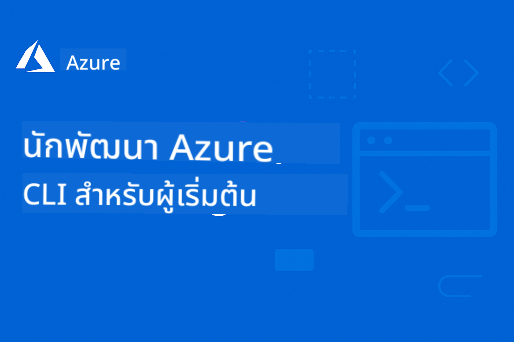

<!--
CO_OP_TRANSLATOR_METADATA:
{
  "original_hash": "7c5d2bb409800e22e74f34ee0ed12bed",
  "translation_date": "2025-12-17T14:03:45+00:00",
  "source_file": "README.md",
  "language_code": "th"
}
-->
# AZD สำหรับผู้เริ่มต้น: การเดินทางเรียนรู้ที่มีโครงสร้าง

 

[](https://GitHub.com/microsoft/azd-for-beginners/watchers/)
[](https://GitHub.com/microsoft/azd-for-beginners/network/)
[](https://GitHub.com/microsoft/azd-for-beginners/stargazers/)

[](https://discord.gg/microsoft-azure)
[](https://discord.gg/nTYy5BXMWG)

## เริ่มต้นกับคอร์สนี้

ทำตามขั้นตอนเหล่านี้เพื่อเริ่มต้นการเรียนรู้ AZD ของคุณ:

1. **Fork ที่เก็บข้อมูล**: คลิก [](https://GitHub.com/microsoft/azd-for-beginners/fork)
2. **โคลนที่เก็บข้อมูล**: `git clone https://github.com/microsoft/azd-for-beginners.git`
3. **เข้าร่วมชุมชน**: [ชุมชน Azure Discord](https://discord.com/invite/ByRwuEEgH4) เพื่อรับการสนับสนุนจากผู้เชี่ยวชาญ
4. **เลือกเส้นทางการเรียนรู้ของคุณ**: เลือกบทด้านล่างที่ตรงกับระดับประสบการณ์ของคุณ

### รองรับหลายภาษา

#### การแปลอัตโนมัติ (อัปเดตเสมอ)

<!-- CO-OP TRANSLATOR LANGUAGES TABLE START -->
[Arabic](../ar/README.md) | [Bengali](../bn/README.md) | [Bulgarian](../bg/README.md) | [Burmese (Myanmar)](../my/README.md) | [Chinese (Simplified)](../zh/README.md) | [Chinese (Traditional, Hong Kong)](../hk/README.md) | [Chinese (Traditional, Macau)](../mo/README.md) | [Chinese (Traditional, Taiwan)](../tw/README.md) | [Croatian](../hr/README.md) | [Czech](../cs/README.md) | [Danish](../da/README.md) | [Dutch](../nl/README.md) | [Estonian](../et/README.md) | [Finnish](../fi/README.md) | [French](../fr/README.md) | [German](../de/README.md) | [Greek](../el/README.md) | [Hebrew](../he/README.md) | [Hindi](../hi/README.md) | [Hungarian](../hu/README.md) | [Indonesian](../id/README.md) | [Italian](../it/README.md) | [Japanese](../ja/README.md) | [Kannada](../kn/README.md) | [Korean](../ko/README.md) | [Lithuanian](../lt/README.md) | [Malay](../ms/README.md) | [Malayalam](../ml/README.md) | [Marathi](../mr/README.md) | [Nepali](../ne/README.md) | [Nigerian Pidgin](../pcm/README.md) | [Norwegian](../no/README.md) | [Persian (Farsi)](../fa/README.md) | [Polish](../pl/README.md) | [Portuguese (Brazil)](../br/README.md) | [Portuguese (Portugal)](../pt/README.md) | [Punjabi (Gurmukhi)](../pa/README.md) | [Romanian](../ro/README.md) | [Russian](../ru/README.md) | [Serbian (Cyrillic)](../sr/README.md) | [Slovak](../sk/README.md) | [Slovenian](../sl/README.md) | [Spanish](../es/README.md) | [Swahili](../sw/README.md) | [Swedish](../sv/README.md) | [Tagalog (Filipino)](../tl/README.md) | [Tamil](../ta/README.md) | [Telugu](../te/README.md) | [Thai](./README.md) | [Turkish](../tr/README.md) | [Ukrainian](../uk/README.md) | [Urdu](../ur/README.md) | [Vietnamese](../vi/README.md)
<!-- CO-OP TRANSLATOR LANGUAGES TABLE END -->

## ภาพรวมของคอร์ส

เชี่ยวชาญ Azure Developer CLI (azd) ผ่านบทเรียนที่มีโครงสร้างออกแบบมาเพื่อการเรียนรู้แบบก้าวหน้า **เน้นพิเศษที่การปรับใช้แอปพลิเคชัน AI พร้อมการผสานรวม Microsoft Foundry**

### ทำไมคอร์สนี้จึงจำเป็นสำหรับนักพัฒนายุคใหม่

อ้างอิงจากข้อมูลในชุมชน Microsoft Foundry Discord, **45% ของนักพัฒนาต้องการใช้ AZD สำหรับงาน AI** แต่พบปัญหาเกี่ยวกับ:
- สถาปัตยกรรม AI หลายบริการที่ซับซ้อน
- แนวทางปฏิบัติที่ดีที่สุดสำหรับการปรับใช้ AI ในการผลิต  
- การผสานรวมและการกำหนดค่าบริการ Azure AI
- การเพิ่มประสิทธิภาพค่าใช้จ่ายสำหรับงาน AI
- การแก้ไขปัญหาการปรับใช้เฉพาะ AI

### วัตถุประสงค์การเรียนรู้

เมื่อจบคอร์สนี้ คุณจะสามารถ:
- **เชี่ยวชาญพื้นฐาน AZD**: แนวคิดหลัก การติดตั้ง และการกำหนดค่า
- **ปรับใช้แอป AI**: ใช้ AZD กับบริการ Microsoft Foundry
- **ใช้งาน Infrastructure as Code**: จัดการทรัพยากร Azure ด้วยเทมเพลต Bicep
- **แก้ไขปัญหาการปรับใช้**: แก้ไขปัญหาทั่วไปและดีบัก
- **เพิ่มประสิทธิภาพสำหรับการผลิต**: ความปลอดภัย การปรับขนาด การตรวจสอบ และการจัดการค่าใช้จ่าย
- **สร้างโซลูชัน Multi-Agent**: ปรับใช้สถาปัตยกรรม AI ที่ซับซ้อน

## 📚 บทเรียน

*เลือกเส้นทางการเรียนรู้ตามระดับประสบการณ์และเป้าหมายของคุณ*

### 🚀 บทที่ 1: พื้นฐาน & เริ่มต้นอย่างรวดเร็ว
**ข้อกำหนดเบื้องต้น**: มีบัญชี Azure, ความรู้พื้นฐานคำสั่งบรรทัดคำสั่ง  
**ระยะเวลา**: 30-45 นาที  
**ความซับซ้อน**: ⭐

#### สิ่งที่คุณจะได้เรียนรู้
- เข้าใจพื้นฐาน Azure Developer CLI
- การติดตั้ง AZD บนแพลตฟอร์มของคุณ
- การปรับใช้ครั้งแรกที่ประสบความสำเร็จ

#### แหล่งเรียนรู้
- **🎯 เริ่มที่นี่**: [Azure Developer CLI คืออะไร?](../..)
- **📖 ทฤษฎี**: [พื้นฐาน AZD](docs/getting-started/azd-basics.md) - แนวคิดหลักและคำศัพท์
- **⚙️ การตั้งค่า**: [การติดตั้งและตั้งค่า](docs/getting-started/installation.md) - คู่มือเฉพาะแพลตฟอร์ม
- **🛠️ ฝึกปฏิบัติ**: [โปรเจกต์แรกของคุณ](docs/getting-started/first-project.md) - บทเรียนทีละขั้นตอน
- **📋 อ้างอิงด่วน**: [ชีทคำสั่ง](resources/cheat-sheet.md)

#### แบบฝึกหัดปฏิบัติ
```bash
# ตรวจสอบการติดตั้งอย่างรวดเร็ว
azd version

# ติดตั้งแอปพลิเคชันแรกของคุณ
azd init --template todo-nodejs-mongo
azd up
```

**💡 ผลลัพธ์ของบทเรียน**: ปรับใช้เว็บแอปพลิเคชันง่ายๆ บน Azure ด้วย AZD ได้สำเร็จ

**✅ การตรวจสอบความสำเร็จ:**
```bash
# หลังจากทำบทที่ 1 เสร็จ คุณควรจะสามารถ:
azd version              # แสดงเวอร์ชันที่ติดตั้ง
azd init --template todo-nodejs-mongo  # เริ่มต้นโปรเจกต์
azd up                  # นำไปใช้งานบน Azure
azd show                # แสดง URL ของแอปที่กำลังทำงาน
# แอปพลิเคชันเปิดในเบราว์เซอร์และทำงานได้
azd down --force --purge  # ล้างทรัพยากร
```

**📊 เวลาที่ใช้:** 30-45 นาที  
**📈 ระดับทักษะหลังเรียน:** สามารถปรับใช้แอปพื้นฐานได้ด้วยตนเอง

**✅ การตรวจสอบความสำเร็จ:**
```bash
# หลังจากทำบทที่ 1 เสร็จ คุณควรจะสามารถ:
azd version              # แสดงเวอร์ชันที่ติดตั้ง
azd init --template todo-nodejs-mongo  # เริ่มต้นโปรเจกต์
azd up                  # นำไปใช้งานบน Azure
azd show                # แสดง URL ของแอปที่กำลังทำงาน
# แอปพลิเคชันเปิดในเบราว์เซอร์และทำงานได้
azd down --force --purge  # ล้างทรัพยากรทั้งหมด
```

**📊 เวลาที่ใช้:** 30-45 นาที  
**📈 ระดับทักษะหลังเรียน:** สามารถปรับใช้แอปพื้นฐานได้ด้วยตนเอง

---

### 🤖 บทที่ 2: การพัฒนา AI-First (แนะนำสำหรับนักพัฒนา AI)
**ข้อกำหนดเบื้องต้น**: จบบทที่ 1  
**ระยะเวลา**: 1-2 ชั่วโมง  
**ความซับซ้อน**: ⭐⭐

#### สิ่งที่คุณจะได้เรียนรู้
- การผสานรวม Microsoft Foundry กับ AZD
- การปรับใช้แอปพลิเคชันที่ขับเคลื่อนด้วย AI
- เข้าใจการกำหนดค่าบริการ AI

#### แหล่งเรียนรู้
- **🎯 เริ่มที่นี่**: [การผสานรวม Microsoft Foundry](docs/microsoft-foundry/microsoft-foundry-integration.md)
- **📖 รูปแบบ**: [การปรับใช้โมเดล AI](docs/microsoft-foundry/ai-model-deployment.md) - ปรับใช้และจัดการโมเดล AI
- **🛠️ เวิร์กช็อป**: [ห้องปฏิบัติการ AI](docs/microsoft-foundry/ai-workshop-lab.md) - ทำให้โซลูชัน AI ของคุณพร้อมใช้งานกับ AZD
- **🎥 คู่มือแบบโต้ตอบ**: [วัสดุเวิร์กช็อป](workshop/README.md) - เรียนรู้ผ่านเบราว์เซอร์ด้วย MkDocs * สภาพแวดล้อม DevContainer
- **📋 เทมเพลต**: [เทมเพลต Microsoft Foundry](../..)
- **📝 ตัวอย่าง**: [ตัวอย่างการปรับใช้ AZD](examples/README.md)

#### แบบฝึกหัดปฏิบัติ
```bash
# เปิดใช้งานแอปพลิเคชัน AI แรกของคุณ
azd init --template azure-search-openai-demo
azd up

# ลองใช้แม่แบบ AI เพิ่มเติม
azd init --template openai-chat-app-quickstart
azd init --template agent-openai-python-prompty
```

**💡 ผลลัพธ์ของบทเรียน**: ปรับใช้และกำหนดค่าแอปแชท AI ที่มีความสามารถ RAG

**✅ การตรวจสอบความสำเร็จ:**
```bash
# หลังจากบทที่ 2 คุณควรจะสามารถ:
azd init --template azure-search-openai-demo
azd up
# ทดสอบอินเทอร์เฟซแชท AI
# ถามคำถามและรับคำตอบที่ขับเคลื่อนด้วย AI พร้อมแหล่งที่มา
# ตรวจสอบการทำงานของการรวมการค้นหา
azd monitor  # ตรวจสอบว่า Application Insights แสดงข้อมูลเทเลเมทรี
azd down --force --purge
```

**📊 เวลาที่ใช้:** 1-2 ชั่วโมง  
**📈 ระดับทักษะหลังเรียน:** สามารถปรับใช้และกำหนดค่าแอป AI ที่พร้อมใช้งานในผลิตได้  
**💰 ความเข้าใจค่าใช้จ่าย:** เข้าใจค่าใช้จ่ายพัฒนาประมาณ $80-150/เดือน, ค่าใช้จ่ายผลิต $300-3500/เดือน

#### 💰 การพิจารณาค่าใช้จ่ายสำหรับการปรับใช้ AI

**สภาพแวดล้อมการพัฒนา (ประมาณ $80-150/เดือน):**
- Azure OpenAI (จ่ายตามการใช้งาน): $0-50/เดือน (ขึ้นกับการใช้โทเค็น)
- AI Search (ระดับพื้นฐาน): $75/เดือน
- Container Apps (แบบบริโภค): $0-20/เดือน
- Storage (มาตรฐาน): $1-5/เดือน

**สภาพแวดล้อมการผลิต (ประมาณ $300-3,500+/เดือน):**
- Azure OpenAI (PTU สำหรับประสิทธิภาพสม่ำเสมอ): $3,000+/เดือน หรือ จ่ายตามการใช้งานปริมาณสูง
- AI Search (ระดับมาตรฐาน): $250/เดือน
- Container Apps (แบบเฉพาะ): $50-100/เดือน
- Application Insights: $5-50/เดือน
- Storage (พรีเมียม): $10-50/เดือน

**💡 เคล็ดลับการเพิ่มประสิทธิภาพค่าใช้จ่าย:**
- ใช้ **ระดับฟรี** ของ Azure OpenAI สำหรับการเรียนรู้ (รวม 50,000 โทเค็น/เดือน)
- รัน `azd down` เพื่อปลดปล่อยทรัพยากรเมื่อไม่พัฒนา
- เริ่มด้วยการคิดค่าบริการแบบบริโภค อัปเกรดเป็น PTU เฉพาะสำหรับผลิต
- ใช้ `azd provision --preview` เพื่อประเมินค่าใช้จ่ายก่อนปรับใช้
- เปิดใช้งานการปรับขนาดอัตโนมัติ: จ่ายเฉพาะการใช้งานจริง

**การตรวจสอบค่าใช้จ่าย:**
```bash
# ตรวจสอบค่าใช้จ่ายรายเดือนโดยประมาณ
azd provision --preview

# ตรวจสอบค่าใช้จ่ายจริงใน Azure Portal
az consumption budget list --resource-group <your-rg>
```

---

### ⚙️ บทที่ 3: การกำหนดค่า & การพิสูจน์ตัวตน
**ข้อกำหนดเบื้องต้น**: จบบทที่ 1  
**ระยะเวลา**: 45-60 นาที  
**ความซับซ้อน**: ⭐⭐

#### สิ่งที่คุณจะได้เรียนรู้
- การกำหนดค่าและจัดการสภาพแวดล้อม
- การพิสูจน์ตัวตนและแนวทางปฏิบัติด้านความปลอดภัย
- การตั้งชื่อและการจัดระเบียบทรัพยากร

#### แหล่งเรียนรู้
- **📖 การกำหนดค่า**: [คู่มือการกำหนดค่า](docs/getting-started/configuration.md) - การตั้งค่าสภาพแวดล้อม
- **🔐 ความปลอดภัย**: [รูปแบบการพิสูจน์ตัวตนและ managed identity](docs/getting-started/authsecurity.md) - รูปแบบการพิสูจน์ตัวตน
- **📝 ตัวอย่าง**: [ตัวอย่างแอปฐานข้อมูล](examples/database-app/README.md) - ตัวอย่างฐานข้อมูล AZD

#### แบบฝึกหัดปฏิบัติ
- กำหนดค่าสภาพแวดล้อมหลายแบบ (dev, staging, prod)
- ตั้งค่าการพิสูจน์ตัวตน managed identity
- ใช้งานการกำหนดค่าสภาพแวดล้อมเฉพาะ

**💡 ผลลัพธ์ของบทเรียน**: จัดการสภาพแวดล้อมหลายแบบด้วยการพิสูจน์ตัวตนและความปลอดภัยที่เหมาะสม

---

### 🏗️ บทที่ 4: Infrastructure as Code & การปรับใช้
**ข้อกำหนดเบื้องต้น**: จบบทที่ 1-3  
**ระยะเวลา**: 1-1.5 ชั่วโมง  
**ความซับซ้อน**: ⭐⭐⭐

#### สิ่งที่คุณจะได้เรียนรู้
- รูปแบบการปรับใช้ขั้นสูง
- Infrastructure as Code ด้วย Bicep
- กลยุทธ์การจัดสรรทรัพยากร

#### แหล่งเรียนรู้
- **📖 การปรับใช้**: [คู่มือการปรับใช้](docs/deployment/deployment-guide.md) - เวิร์กโฟลว์ครบถ้วน
- **🏗️ การจัดสรรทรัพยากร**: [การจัดสรรทรัพยากร](docs/deployment/provisioning.md) - การจัดการทรัพยากร Azure
- **📝 ตัวอย่าง**: [ตัวอย่าง Container App](../../examples/container-app) - การปรับใช้แบบคอนเทนเนอร์

#### แบบฝึกหัดปฏิบัติ
- สร้างเทมเพลต Bicep แบบกำหนดเอง
- ปรับใช้แอปหลายบริการ
- ใช้งานกลยุทธ์การปรับใช้แบบ blue-green

**💡 ผลลัพธ์ของบทเรียน**: ปรับใช้แอปหลายบริการที่ซับซ้อนโดยใช้เทมเพลตโครงสร้างพื้นฐานแบบกำหนดเอง

---

### 🎯 บทที่ 5: โซลูชัน AI แบบ Multi-Agent (ขั้นสูง)
**ข้อกำหนดเบื้องต้น**: จบบทที่ 1-2  
**ระยะเวลา**: 2-3 ชั่วโมง  
**ความซับซ้อน**: ⭐⭐⭐⭐

#### สิ่งที่คุณจะได้เรียนรู้
- รูปแบบสถาปัตยกรรม multi-agent
- การประสานงานและจัดการตัวแทน
- การปรับใช้ AI ที่พร้อมใช้งานในผลิต

#### แหล่งเรียนรู้
- **🤖 โปรเจกต์เด่น**: [โซลูชัน Multi-Agent สำหรับค้าปลีก](examples/retail-scenario.md) - การใช้งานครบถ้วน
- **🛠️ ARM Templates**: [ARM Template Package](../../examples/retail-multiagent-arm-template) - การปรับใช้ด้วยคลิกเดียว
- **📖 Architecture**: [Multi-agent coordination patterns](/docs/pre-deployment/coordination-patterns.md) - รูปแบบ

#### แบบฝึกหัดปฏิบัติ
```bash
# ปรับใช้โซลูชันตัวแทนหลายรายค้าปลีกครบถ้วน
cd examples/retail-multiagent-arm-template
./deploy.sh

# สำรวจการกำหนดค่าตัวแทน
az deployment group show --resource-group <rg-name> --name <deployment-name>
```

**💡 ผลลัพธ์บทเรียน**: ปรับใช้และจัดการโซลูชัน AI แบบหลายตัวแทนที่พร้อมใช้งานจริงด้วยตัวแทนลูกค้าและสินค้าคงคลัง

---

### 🔍 บทที่ 6: การตรวจสอบและวางแผนก่อนการปรับใช้
**ข้อกำหนดเบื้องต้น**: บทที่ 4 เสร็จสมบูรณ์  
**ระยะเวลา**: 1 ชั่วโมง  
**ความซับซ้อน**: ⭐⭐

#### สิ่งที่คุณจะได้เรียนรู้
- การวางแผนความจุและการตรวจสอบทรัพยากร
- กลยุทธ์การเลือก SKU
- การตรวจสอบก่อนการบินและระบบอัตโนมัติ

#### แหล่งเรียนรู้
- **📊 การวางแผน**: [Capacity Planning](docs/pre-deployment/capacity-planning.md) - การตรวจสอบทรัพยากร
- **💰 การเลือก**: [SKU Selection](docs/pre-deployment/sku-selection.md) - ตัวเลือกที่คุ้มค่า
- **✅ การตรวจสอบ**: [Pre-flight Checks](docs/pre-deployment/preflight-checks.md) - สคริปต์อัตโนมัติ

#### แบบฝึกหัดปฏิบัติ
- รันสคริปต์ตรวจสอบความจุ
- ปรับแต่งการเลือก SKU ให้คุ้มค่า
- นำระบบตรวจสอบก่อนการปรับใช้แบบอัตโนมัติมาใช้

**💡 ผลลัพธ์บทเรียน**: ตรวจสอบและปรับแต่งการปรับใช้ก่อนการดำเนินการ

---

### 🚨 บทที่ 7: การแก้ไขปัญหาและดีบัก
**ข้อกำหนดเบื้องต้น**: บทใดก็ได้ที่เกี่ยวกับการปรับใช้เสร็จสมบูรณ์  
**ระยะเวลา**: 1-1.5 ชั่วโมง  
**ความซับซ้อน**: ⭐⭐

#### สิ่งที่คุณจะได้เรียนรู้
- วิธีการดีบักอย่างเป็นระบบ
- ปัญหาทั่วไปและวิธีแก้ไข
- การแก้ไขปัญหาเฉพาะ AI

#### แหล่งเรียนรู้
- **🔧 ปัญหาทั่วไป**: [Common Issues](docs/troubleshooting/common-issues.md) - คำถามที่พบบ่อยและวิธีแก้ไข
- **🕵️ การดีบัก**: [Debugging Guide](docs/troubleshooting/debugging.md) - กลยุทธ์ทีละขั้นตอน
- **🤖 ปัญหา AI**: [AI-Specific Troubleshooting](docs/troubleshooting/ai-troubleshooting.md) - ปัญหาบริการ AI

#### แบบฝึกหัดปฏิบัติ
- วินิจฉัยความล้มเหลวในการปรับใช้
- แก้ไขปัญหาการตรวจสอบสิทธิ์
- ดีบักการเชื่อมต่อบริการ AI

**💡 ผลลัพธ์บทเรียน**: วินิจฉัยและแก้ไขปัญหาการปรับใช้ทั่วไปได้อย่างอิสระ

---

### 🏢 บทที่ 8: รูปแบบการผลิตและองค์กร
**ข้อกำหนดเบื้องต้น**: บทที่ 1-4 เสร็จสมบูรณ์  
**ระยะเวลา**: 2-3 ชั่วโมง  
**ความซับซ้อน**: ⭐⭐⭐⭐

#### สิ่งที่คุณจะได้เรียนรู้
- กลยุทธ์การปรับใช้ในสภาพแวดล้อมการผลิต
- รูปแบบความปลอดภัยสำหรับองค์กร
- การตรวจสอบและการปรับแต่งค่าใช้จ่าย

#### แหล่งเรียนรู้
- **🏭 การผลิต**: [Production AI Best Practices](docs/microsoft-foundry/production-ai-practices.md) - รูปแบบองค์กร
- **📝 ตัวอย่าง**: [Microservices Example](../../examples/microservices) - สถาปัตยกรรมที่ซับซ้อน
- **📊 การตรวจสอบ**: [Application Insights integration](docs/pre-deployment/application-insights.md) - การตรวจสอบ

#### แบบฝึกหัดปฏิบัติ
- นำรูปแบบความปลอดภัยสำหรับองค์กรมาใช้
- ตั้งค่าการตรวจสอบอย่างครบถ้วน
- ปรับใช้ในสภาพแวดล้อมการผลิตด้วยการกำกับดูแลที่เหมาะสม

**💡 ผลลัพธ์บทเรียน**: ปรับใช้แอปพลิเคชันที่พร้อมใช้งานในองค์กรด้วยความสามารถการผลิตเต็มรูปแบบ

---

## 🎓 ภาพรวมเวิร์กช็อป: ประสบการณ์การเรียนรู้แบบลงมือทำ

> **⚠️ สถานะเวิร์กช็อป: กำลังพัฒนา**  
> วัสดุเวิร์กช็อปกำลังอยู่ในระหว่างการพัฒนาและปรับปรุง โมดูลหลักใช้งานได้ แต่บางส่วนของเนื้อหาขั้นสูงยังไม่สมบูรณ์ เรากำลังเร่งดำเนินการให้ครบถ้วน [ติดตามความคืบหน้า →](workshop/README.md)

### วัสดุเวิร์กช็อปแบบโต้ตอบ
**ประสบการณ์การเรียนรู้แบบลงมือทำครบวงจรด้วยเครื่องมือบนเบราว์เซอร์และแบบฝึกหัดแนะนำ**

วัสดุเวิร์กช็อปของเรามอบประสบการณ์การเรียนรู้ที่มีโครงสร้างและโต้ตอบได้ ซึ่งเสริมหลักสูตรตามบทเรียนข้างต้น เวิร์กช็อปนี้ออกแบบมาสำหรับการเรียนรู้ด้วยตนเองและการสอนโดยผู้สอน

#### 🛠️ คุณสมบัติของเวิร์กช็อป
- **อินเทอร์เฟซบนเบราว์เซอร์**: เวิร์กช็อปที่ขับเคลื่อนด้วย MkDocs พร้อมฟีเจอร์ค้นหา คัดลอก และธีม
- **การผสาน GitHub Codespaces**: ตั้งค่าสภาพแวดล้อมการพัฒนาด้วยคลิกเดียว
- **เส้นทางการเรียนรู้ที่มีโครงสร้าง**: แบบฝึกหัดแนะนำ 7 ขั้นตอน (รวม 3.5 ชั่วโมง)
- **ค้นหา → ปรับใช้ → ปรับแต่ง**: วิธีการแบบก้าวหน้า
- **สภาพแวดล้อม DevContainer แบบโต้ตอบ**: เครื่องมือและการพึ่งพาที่ตั้งค่าล่วงหน้า

#### 📚 โครงสร้างเวิร์กช็อป
เวิร์กช็อปดำเนินตามวิธีการ **ค้นหา → ปรับใช้ → ปรับแต่ง**:

1. **ขั้นตอนค้นหา** (45 นาที)
   - สำรวจเทมเพลตและบริการ Microsoft Foundry
   - เข้าใจรูปแบบสถาปัตยกรรมหลายตัวแทน
   - ทบทวนข้อกำหนดและข้อจำกัดก่อนปรับใช้

2. **ขั้นตอนปรับใช้** (2 ชั่วโมง)
   - ปรับใช้แอป AI ด้วย AZD แบบลงมือทำ
   - กำหนดค่าบริการและจุดเชื่อมต่อ Azure AI
   - นำรูปแบบความปลอดภัยและการตรวจสอบสิทธิ์มาใช้

3. **ขั้นตอนปรับแต่ง** (45 นาที)
   - แก้ไขแอปสำหรับกรณีใช้งานเฉพาะ
   - ปรับแต่งสำหรับการปรับใช้ในสภาพแวดล้อมการผลิต
   - นำระบบตรวจสอบและการจัดการค่าใช้จ่ายมาใช้

#### 🚀 เริ่มต้นกับเวิร์กช็อป
```bash
# ตัวเลือกที่ 1: GitHub Codespaces (แนะนำ)
# คลิก "Code" → "Create codespace on main" ในที่เก็บข้อมูล

# ตัวเลือกที่ 2: การพัฒนาในเครื่อง
git clone https://github.com/microsoft/azd-for-beginners.git
cd azd-for-beginners/workshop
# ทำตามคำแนะนำการตั้งค่าใน workshop/README.md
```

#### 🎯 ผลลัพธ์การเรียนรู้เวิร์กช็อป
เมื่อจบเวิร์กช็อป ผู้เข้าร่วมจะสามารถ:
- **ปรับใช้แอป AI ในสภาพแวดล้อมการผลิต**: ใช้ AZD กับบริการ Microsoft Foundry
- **เชี่ยวชาญสถาปัตยกรรมหลายตัวแทน**: นำโซลูชันตัวแทน AI ที่ประสานงานกันมาใช้
- **นำแนวปฏิบัติความปลอดภัยที่ดีที่สุดมาใช้**: กำหนดค่าการตรวจสอบสิทธิ์และการควบคุมการเข้าถึง
- **ปรับแต่งเพื่อรองรับการขยายตัว**: ออกแบบการปรับใช้ที่คุ้มค่าและมีประสิทธิภาพ
- **แก้ไขปัญหาการปรับใช้**: แก้ไขปัญหาทั่วไปได้อย่างอิสระ

#### 📖 แหล่งข้อมูลเวิร์กช็อป
- **🎥 คู่มือโต้ตอบ**: [Workshop Materials](workshop/README.md) - สภาพแวดล้อมการเรียนรู้บนเบราว์เซอร์
- **📋 คำแนะนำทีละขั้นตอน**: [Guided Exercises](../../workshop/docs/instructions) - การเดินทางอย่างละเอียด
- **🛠️ ห้องปฏิบัติการเวิร์กช็อป AI**: [AI Workshop Lab](docs/microsoft-foundry/ai-workshop-lab.md) - แบบฝึกหัดเน้น AI
- **💡 เริ่มต้นอย่างรวดเร็ว**: [Workshop Setup Guide](workshop/README.md#quick-start) - การกำหนดค่าสภาพแวดล้อม

**เหมาะสำหรับ**: การฝึกอบรมองค์กร หลักสูตรมหาวิทยาลัย การเรียนรู้ด้วยตนเอง และบูตแคมป์สำหรับนักพัฒนา

---

## 📖 Azure Developer CLI คืออะไร?

Azure Developer CLI (azd) คืออินเทอร์เฟซบรรทัดคำสั่งที่เน้นนักพัฒนา ช่วยเร่งกระบวนการสร้างและปรับใช้แอปพลิเคชันบน Azure โดยมีคุณสมบัติดังนี้:

- **การปรับใช้ด้วยเทมเพลต** - ใช้เทมเพลตที่สร้างไว้ล่วงหน้าสำหรับรูปแบบแอปพลิเคชันทั่วไป
- **โครงสร้างพื้นฐานเป็นโค้ด** - จัดการทรัพยากร Azure ด้วย Bicep หรือ Terraform  
- **เวิร์กโฟลว์แบบบูรณาการ** - จัดเตรียม ปรับใช้ และตรวจสอบแอปพลิเคชันอย่างราบรื่น
- **เหมาะสำหรับนักพัฒนา** - ปรับแต่งเพื่อเพิ่มประสิทธิภาพและประสบการณ์ของนักพัฒนา

### **AZD + Microsoft Foundry: เหมาะสำหรับการปรับใช้ AI**

**ทำไมต้องใช้ AZD สำหรับโซลูชัน AI?** AZD แก้ไขปัญหาหลักที่นักพัฒนา AI เผชิญ:

- **เทมเพลตพร้อมใช้งานสำหรับ AI** - เทมเพลตที่ตั้งค่าล่วงหน้าสำหรับ Azure OpenAI, Cognitive Services และงาน ML
- **การปรับใช้ AI ที่ปลอดภัย** - รูปแบบความปลอดภัยในตัวสำหรับบริการ AI, คีย์ API และจุดเชื่อมต่อโมเดล  
- **รูปแบบ AI สำหรับการผลิต** - แนวปฏิบัติที่ดีที่สุดสำหรับการปรับใช้แอป AI ที่ขยายได้และคุ้มค่า
- **เวิร์กโฟลว์ AI ครบวงจร** - ตั้งแต่การพัฒนาโมเดลจนถึงการปรับใช้ในสภาพแวดล้อมการผลิตพร้อมการตรวจสอบที่เหมาะสม
- **การปรับแต่งค่าใช้จ่าย** - การจัดสรรทรัพยากรและกลยุทธ์การปรับขนาดอย่างชาญฉลาดสำหรับงาน AI
- **การผสาน Microsoft Foundry** - การเชื่อมต่ออย่างราบรื่นกับแคตตาล็อกโมเดลและจุดเชื่อมต่อของ Microsoft Foundry

---

## 🎯 ห้องสมุดเทมเพลตและตัวอย่าง

### เทมเพลตเด่น: Microsoft Foundry Templates
**เริ่มที่นี่หากคุณกำลังปรับใช้แอป AI!**

> **หมายเหตุ:** เทมเพลตเหล่านี้แสดงรูปแบบ AI ต่างๆ บางส่วนเป็นตัวอย่าง Azure ภายนอก บางส่วนเป็นการใช้งานในเครื่อง

| เทมเพลต | บทเรียน | ความซับซ้อน | บริการ | ประเภท |
|----------|---------|------------|----------|------|
| [**เริ่มต้นกับ AI chat**](https://github.com/Azure-Samples/get-started-with-ai-chat) | บทที่ 2 | ⭐⭐ | AzureOpenAI + Azure AI Model Inference API + Azure AI Search + Azure Container Apps + Application Insights | ภายนอก |
| [**เริ่มต้นกับ AI agents**](https://github.com/Azure-Samples/get-started-with-ai-agents) | บทที่ 2 | ⭐⭐ | Azure AI Agent Service + AzureOpenAI + Azure AI Search + Azure Container Apps + Application Insights| ภายนอก |
| [**Azure Search + OpenAI Demo**](https://github.com/Azure-Samples/azure-search-openai-demo) | บทที่ 2 | ⭐⭐ | AzureOpenAI + Azure AI Search + App Service + Storage | ภายนอก |
| [**OpenAI Chat App Quickstart**](https://github.com/Azure-Samples/openai-chat-app-quickstart) | บทที่ 2 | ⭐ | AzureOpenAI + Container Apps + Application Insights | ภายนอก |
| [**Agent OpenAI Python Prompty**](https://github.com/Azure-Samples/agent-openai-python-prompty) | บทที่ 5 | ⭐⭐⭐ | AzureOpenAI + Azure Functions + Prompty | ภายนอก |
| [**Contoso Chat RAG**](https://github.com/Azure-Samples/contoso-chat) | บทที่ 8 | ⭐⭐⭐⭐ | AzureOpenAI + AI Search + Cosmos DB + Container Apps | ภายนอก |
| [**Retail Multi-Agent Solution**](examples/retail-scenario.md) | บทที่ 5 | ⭐⭐⭐⭐ | AzureOpenAI + AI Search + Storage + Container Apps + Cosmos DB | **ในเครื่อง** |

### เทมเพลตเด่น: สถานการณ์การเรียนรู้ครบถ้วน
**เทมเพลตแอปพร้อมใช้งานจริงที่จับคู่กับบทเรียน**

| เทมเพลต | บทเรียน | ความซับซ้อน | การเรียนรู้หลัก |
|----------|------------------|------------|--------------|
| [**openai-chat-app-quickstart**](https://github.com/Azure-Samples/openai-chat-app-quickstart) | บทที่ 2 | ⭐ | รูปแบบการปรับใช้ AI พื้นฐาน |
| [**azure-search-openai-demo**](https://github.com/Azure-Samples/azure-search-openai-demo) | บทที่ 2 | ⭐⭐ | การใช้งาน RAG กับ Azure AI Search |
| [**ai-document-processing**](https://github.com/Azure-Samples/ai-document-processing) | บทที่ 4 | ⭐⭐ | การผสาน Document Intelligence |
| [**agent-openai-python-prompty**](https://github.com/Azure-Samples/agent-openai-python-prompty) | บทที่ 5 | ⭐⭐⭐ | เฟรมเวิร์กตัวแทนและการเรียกฟังก์ชัน |
| [**contoso-chat**](https://github.com/Azure-Samples/contoso-chat) | บทที่ 8 | ⭐⭐⭐ | การประสานงาน AI สำหรับองค์กร |
| [**retail-multi-agent-solution**](examples/retail-scenario.md) | บทที่ 5 | ⭐⭐⭐⭐ | สถาปัตยกรรมหลายตัวแทนกับตัวแทนลูกค้าและสินค้าคงคลัง |

### การเรียนรู้ตามประเภทตัวอย่าง

> **📌 ตัวอย่างในเครื่อง vs. ภายนอก:**  
> **ตัวอย่างในเครื่อง** (ในที่เก็บนี้) = พร้อมใช้งานทันที  
> **ตัวอย่างภายนอก** (Azure Samples) = โคลนจากที่เก็บที่ลิงก์ไว้

#### ตัวอย่างในเครื่อง (พร้อมใช้งาน)
- [**Retail Multi-Agent Solution**](examples/retail-scenario.md) - การใช้งานจริงครบถ้วนพร้อมเทมเพลต ARM
  - สถาปัตยกรรมหลายตัวแทน (ตัวแทนลูกค้า + สินค้าคงคลัง)
  - การตรวจสอบและประเมินผลอย่างครบถ้วน
  - การปรับใช้ด้วยคลิกเดียวผ่านเทมเพลต ARM

#### ตัวอย่างในเครื่อง - แอปคอนเทนเนอร์ (บทที่ 2-5)
**ตัวอย่างการปรับใช้คอนเทนเนอร์ครบถ้วนในที่เก็บนี้:**
- [**ตัวอย่าง Container App**](examples/container-app/README.md) - คู่มือครบถ้วนสำหรับการปรับใช้แบบคอนเทนเนอร์
  - [Simple Flask API](../../examples/container-app/simple-flask-api) - REST API พื้นฐานพร้อมสเกลเป็นศูนย์
  - [Microservices Architecture](../../examples/container-app/microservices) - การปรับใช้หลายบริการพร้อมใช้งานจริง
  - รูปแบบการเริ่มต้นอย่างรวดเร็ว การผลิต และขั้นสูง
  - คำแนะนำการตรวจสอบ ความปลอดภัย และการปรับแต่งค่าใช้จ่าย

#### ตัวอย่างภายนอก - แอปพลิเคชันง่าย (บทที่ 1-2)
**โคลนที่เก็บ Azure Samples เหล่านี้เพื่อเริ่มต้น:**
- [Simple Web App - Node.js + MongoDB](https://github.com/Azure-Samples/todo-nodejs-mongo) - รูปแบบการปรับใช้พื้นฐาน
- [Static Website - React SPA](https://github.com/Azure-Samples/todo-csharp-sql-swa-func) - การปรับใช้เนื้อหาสถิต
- [Container App - Python Flask](https://github.com/Azure-Samples/container-apps-store-api-microservice) - การปรับใช้ REST API

#### ตัวอย่างภายนอก - การผสานฐานข้อมูล (บทที่ 3-4)  
- [Database App - C# + SQL](https://github.com/Azure-Samples/todo-csharp-sql) - รูปแบบการเชื่อมต่อฐานข้อมูล
- [Functions + Cosmos DB](https://github.com/Azure-Samples/todo-python-mongo-swa-func) - เวิร์กโฟลว์ข้อมูลแบบไร้เซิร์ฟเวอร์

#### ตัวอย่างภายนอก - รูปแบบขั้นสูง (บทที่ 4-8)
- [Java Microservices](https://github.com/Azure-Samples/java-microservices-aca-lab) - สถาปัตยกรรมหลายบริการ
- [Container Apps Jobs](https://github.com/Azure-Samples/container-apps-jobs) - การประมวลผลเบื้องหลัง  
- [Enterprise ML Pipeline](https://github.com/Azure-Samples/mlops-v2) - รูปแบบ ML พร้อมใช้งานจริง

### คอลเลกชันเทมเพลตภายนอก
- [**Official AZD Template Gallery**](https://azure.github.io/awesome-azd/) - คอลเลกชันเทมเพลตอย่างเป็นทางการและจากชุมชน
- [**Azure Developer CLI Templates**](https://learn.microsoft.com/en-us/azure/developer/azure-developer-cli/azd-templates) - เอกสารเทมเพลต Microsoft Learn
- [**Examples Directory**](examples/README.md) - ตัวอย่างการเรียนรู้ในเครื่องพร้อมคำอธิบายละเอียด

---

## 📚 แหล่งข้อมูลและเอกสารอ้างอิง

### เอกสารอ้างอิงด่วน
- [**แผ่นคำสั่งด่วน**](resources/cheat-sheet.md) - คำสั่ง azd ที่จำเป็นจัดเรียงตามบท
- [**พจนานุกรม**](resources/glossary.md) - คำศัพท์ Azure และ azd  
- [**คำถามที่พบบ่อย**](resources/faq.md) - คำถามทั่วไปจัดเรียงตามบทเรียน
- [**คู่มือการศึกษา**](resources/study-guide.md) - แบบฝึกหัดปฏิบัติครบถ้วน

### เวิร์กช็อปเชิงปฏิบัติ
- [**ห้องปฏิบัติการเวิร์กช็อป AI**](docs/microsoft-foundry/ai-workshop-lab.md) - ทำให้โซลูชัน AI ของคุณสามารถปรับใช้ด้วย AZD (2-3 ชั่วโมง)
- [**คู่มือเวิร์กช็อปแบบโต้ตอบ**](workshop/README.md) - เวิร์กช็อปบนเบราว์เซอร์ด้วย MkDocs และสภาพแวดล้อม DevContainer
- [**เส้นทางการเรียนรู้ที่มีโครงสร้าง**](../../workshop/docs/instructions) - แบบฝึกหัดแนะนำ 7 ขั้นตอน (ค้นพบ → ปรับใช้ → ปรับแต่ง)
- [**เวิร์กช็อป AZD สำหรับผู้เริ่มต้น**](workshop/README.md) - วัสดุเวิร์กช็อปเชิงปฏิบัติครบถ้วนพร้อมการผสาน GitHub Codespaces

### แหล่งเรียนรู้นอก
- [เอกสาร Azure Developer CLI](https://learn.microsoft.com/en-us/azure/developer/azure-developer-cli/)
- [ศูนย์สถาปัตยกรรม Azure](https://learn.microsoft.com/en-us/azure/architecture/)
- [เครื่องคิดเลขราคา Azure](https://azure.microsoft.com/pricing/calculator/)
- [สถานะ Azure](https://status.azure.com/)

---

## 🔧 คู่มือแก้ไขปัญหาอย่างรวดเร็ว

**ปัญหาทั่วไปที่ผู้เริ่มต้นพบและวิธีแก้ไขทันที:**

### ❌ "azd: ไม่พบคำสั่ง"

```bash
# ติดตั้ง AZD ก่อน
# Windows (PowerShell):
winget install microsoft.azd

# macOS:
brew tap azure/azd && brew install azd

# Linux:
curl -fsSL https://aka.ms/install-azd.sh | bash

# ตรวจสอบการติดตั้ง
azd version
```

### ❌ "ไม่พบการสมัครใช้งาน" หรือ "ยังไม่ได้ตั้งค่าการสมัครใช้งาน"

```bash
# แสดงรายการการสมัครใช้งานที่มีอยู่
az account list --output table

# ตั้งค่าการสมัครใช้งานเริ่มต้น
az account set --subscription "<subscription-id-or-name>"

# ตั้งค่าสำหรับสภาพแวดล้อม AZD
azd env set AZURE_SUBSCRIPTION_ID "<subscription-id>"

# ตรวจสอบ
az account show
```

### ❌ "โควต้าไม่เพียงพอ" หรือ "เกินโควต้า"

```bash
# ลองใช้ภูมิภาค Azure ที่แตกต่างกัน
azd env set AZURE_LOCATION "westus2"
azd up

# หรือใช้ SKU ขนาดเล็กกว่าในระหว่างการพัฒนา
# แก้ไข infra/main.parameters.json:
{
  "sku": "B1"  // Instead of "P1V2"
}
```

### ❌ "azd up" ล้มเหลวกึ่งกลางทาง

```bash
# ตัวเลือกที่ 1: ล้างและลองใหม่
azd down --force --purge
azd up

# ตัวเลือกที่ 2: แก้ไขโครงสร้างพื้นฐานเท่านั้น
azd provision

# ตัวเลือกที่ 3: ตรวจสอบบันทึกรายละเอียด
azd show
azd logs
```

### ❌ "การตรวจสอบสิทธิ์ล้มเหลว" หรือ "โทเค็นหมดอายุ"

```bash
# ยืนยันตัวตนอีกครั้ง
az logout
az login

azd auth logout
azd auth login

# ตรวจสอบการยืนยันตัวตน
az account show
```

### ❌ "ทรัพยากรมีอยู่แล้ว" หรือปัญหาการตั้งชื่อซ้ำ

```bash
# AZD สร้างชื่อที่ไม่ซ้ำกัน แต่ถ้ามีความขัดแย้ง:
azd down --force --purge

# จากนั้นลองใหม่ด้วยสภาพแวดล้อมใหม่
azd env new dev-v2
azd up
```

### ❌ การปรับใช้เทมเพลตใช้เวลานานเกินไป

**เวลารอปกติ:**
- เว็บแอปง่ายๆ: 5-10 นาที
- แอปที่มีฐานข้อมูล: 10-15 นาที
- แอป AI: 15-25 นาที (การจัดเตรียม OpenAI ช้า)

```bash
# ตรวจสอบความคืบหน้า
azd show

# หากติดขัดเกิน 30 นาที ให้ตรวจสอบ Azure Portal:
azd monitor
# มองหาการปรับใช้ที่ล้มเหลว
```

### ❌ "ไม่ได้รับอนุญาต" หรือ "ถูกปฏิเสธ"

```bash
# ตรวจสอบบทบาท Azure ของคุณ
az role assignment list --assignee $(az account show --query user.name -o tsv)

# คุณต้องมีบทบาทอย่างน้อย "ผู้ร่วมให้ข้อมูล"
# ขอให้ผู้ดูแลระบบ Azure ของคุณมอบสิทธิ์:
# - ผู้ร่วมให้ข้อมูล (สำหรับทรัพยากร)
# - ผู้ดูแลการเข้าถึงผู้ใช้ (สำหรับการมอบหมายบทบาท)
```

### ❌ ไม่พบ URL ของแอปที่ปรับใช้แล้ว

```bash
# แสดงจุดสิ้นสุดของบริการทั้งหมด
azd show

# หรือเปิด Azure Portal
azd monitor

# ตรวจสอบบริการเฉพาะ
azd env get-values
# มองหาตัวแปร *_URL
```

### 📚 แหล่งข้อมูลแก้ไขปัญหาเต็มรูปแบบ

- **คู่มือปัญหาทั่วไป:** [วิธีแก้ไขโดยละเอียด](docs/troubleshooting/common-issues.md)
- **ปัญหาเฉพาะ AI:** [แก้ไขปัญหา AI](docs/troubleshooting/ai-troubleshooting.md)
- **คู่มือดีบัก:** [ดีบักทีละขั้นตอน](docs/troubleshooting/debugging.md)
- **ขอความช่วยเหลือ:** [Azure Discord](https://discord.gg/microsoft-azure) #azure-developer-cli

---

## 🔧 คู่มือแก้ไขปัญหาอย่างรวดเร็ว

**ปัญหาทั่วไปที่ผู้เริ่มต้นพบและวิธีแก้ไขทันที:**

<details>
<summary><strong>❌ "azd: ไม่พบคำสั่ง"</strong></summary>

```bash
# ติดตั้ง AZD ก่อน
# Windows (PowerShell):
winget install microsoft.azd

# macOS:
brew tap azure/azd && brew install azd

# Linux:
curl -fsSL https://aka.ms/install-azd.sh | bash

# ตรวจสอบการติดตั้ง
azd version
```
</details>

<details>
<summary><strong>❌ "ไม่พบการสมัครใช้งาน" หรือ "ยังไม่ได้ตั้งค่าการสมัครใช้งาน"</strong></summary>

```bash
# แสดงรายการการสมัครใช้งานที่มีอยู่
az account list --output table

# ตั้งค่าการสมัครใช้งานเริ่มต้น
az account set --subscription "<subscription-id-or-name>"

# ตั้งค่าสำหรับสภาพแวดล้อม AZD
azd env set AZURE_SUBSCRIPTION_ID "<subscription-id>"

# ตรวจสอบ
az account show
```
</details>

<details>
<summary><strong>❌ "โควต้าไม่เพียงพอ" หรือ "เกินโควต้า"</strong></summary>

```bash
# ลองใช้ภูมิภาค Azure ที่แตกต่างกัน
azd env set AZURE_LOCATION "westus2"
azd up

# หรือใช้ SKU ขนาดเล็กกว่าในระหว่างการพัฒนา
# แก้ไข infra/main.parameters.json:
{
  "sku": "B1"  // Instead of "P1V2"
}
```
</details>

<details>
<summary><strong>❌ "azd up" ล้มเหลวกึ่งกลางทาง</strong></summary>

```bash
# ตัวเลือกที่ 1: ล้างและลองใหม่
azd down --force --purge
azd up

# ตัวเลือกที่ 2: แก้ไขโครงสร้างพื้นฐานเท่านั้น
azd provision

# ตัวเลือกที่ 3: ตรวจสอบบันทึกรายละเอียด
azd show
azd logs
```
</details>

<details>
<summary><strong>❌ "การตรวจสอบสิทธิ์ล้มเหลว" หรือ "โทเค็นหมดอายุ"</strong></summary>

```bash
# ยืนยันตัวตนอีกครั้ง
az logout
az login

azd auth logout
azd auth login

# ตรวจสอบการยืนยันตัวตน
az account show
```
</details>

<details>
<summary><strong>❌ "ทรัพยากรมีอยู่แล้ว" หรือปัญหาการตั้งชื่อซ้ำ</strong></summary>

```bash
# AZD สร้างชื่อที่ไม่ซ้ำกัน แต่ถ้ามีความขัดแย้ง:
azd down --force --purge

# จากนั้นลองใหม่ด้วยสภาพแวดล้อมใหม่
azd env new dev-v2
azd up
```
</details>

<details>
<summary><strong>❌ การปรับใช้เทมเพลตใช้เวลานานเกินไป</strong></summary>

**เวลารอปกติ:**
- เว็บแอปง่ายๆ: 5-10 นาที
- แอปที่มีฐานข้อมูล: 10-15 นาที
- แอป AI: 15-25 นาที (การจัดเตรียม OpenAI ช้า)

```bash
# ตรวจสอบความคืบหน้า
azd show

# หากติดขัดเกิน 30 นาที ให้ตรวจสอบ Azure Portal:
azd monitor
# มองหาการปรับใช้ที่ล้มเหลว
```
</details>

<details>
<summary><strong>❌ "ไม่ได้รับอนุญาต" หรือ "ถูกปฏิเสธ"</strong></summary>

```bash
# ตรวจสอบบทบาท Azure ของคุณ
az role assignment list --assignee $(az account show --query user.name -o tsv)

# คุณต้องมีบทบาทอย่างน้อย "ผู้ร่วมให้ข้อมูล"
# ขอให้ผู้ดูแลระบบ Azure ของคุณมอบสิทธิ์:
# - ผู้ร่วมให้ข้อมูล (สำหรับทรัพยากร)
# - ผู้ดูแลการเข้าถึงผู้ใช้ (สำหรับการมอบหมายบทบาท)
```
</details>

<details>
<summary><strong>❌ ไม่พบ URL ของแอปที่ปรับใช้แล้ว</strong></summary>

```bash
# แสดงจุดสิ้นสุดของบริการทั้งหมด
azd show

# หรือเปิด Azure Portal
azd monitor

# ตรวจสอบบริการเฉพาะ
azd env get-values
# มองหาตัวแปร *_URL
```
</details>

### 📚 แหล่งข้อมูลแก้ไขปัญหาเต็มรูปแบบ

- **คู่มือปัญหาทั่วไป:** [วิธีแก้ไขโดยละเอียด](docs/troubleshooting/common-issues.md)
- **ปัญหาเฉพาะ AI:** [แก้ไขปัญหา AI](docs/troubleshooting/ai-troubleshooting.md)
- **คู่มือดีบัก:** [ดีบักทีละขั้นตอน](docs/troubleshooting/debugging.md)
- **ขอความช่วยเหลือ:** [Azure Discord](https://discord.gg/microsoft-azure) #azure-developer-cli

---

## 🎓 การสำเร็จหลักสูตรและการรับรอง

### การติดตามความก้าวหน้า
ติดตามความก้าวหน้าการเรียนรู้ของคุณในแต่ละบท:

- [ ] **บทที่ 1**: พื้นฐาน & เริ่มต้นอย่างรวดเร็ว ✅
- [ ] **บทที่ 2**: การพัฒนา AI-First ✅  
- [ ] **บทที่ 3**: การกำหนดค่า & การตรวจสอบสิทธิ์ ✅
- [ ] **บทที่ 4**: โครงสร้างพื้นฐานเป็นโค้ด & การปรับใช้ ✅
- [ ] **บทที่ 5**: โซลูชัน AI หลายตัวแทน ✅
- [ ] **บทที่ 6**: การตรวจสอบและวางแผนก่อนปรับใช้ ✅
- [ ] **บทที่ 7**: การแก้ไขปัญหา & การดีบัก ✅
- [ ] **บทที่ 8**: รูปแบบการผลิต & องค์กร ✅

### การตรวจสอบการเรียนรู้
หลังจากจบบทแต่ละบท ให้ตรวจสอบความรู้ของคุณโดย:
1. **แบบฝึกหัดปฏิบัติ**: ทำการปรับใช้เชิงปฏิบัติของบทนั้นให้เสร็จ
2. **ตรวจสอบความรู้**: ทบทวนส่วนคำถามที่พบบ่อยของบทนั้น
3. **อภิปรายชุมชน**: แชร์ประสบการณ์ของคุณใน Azure Discord
4. **บทถัดไป**: ไปยังระดับความซับซ้อนถัดไป

### ประโยชน์จากการสำเร็จหลักสูตร
เมื่อจบบททั้งหมด คุณจะมี:
- **ประสบการณ์การผลิต**: ปรับใช้แอป AI จริงบน Azure
- **ทักษะมืออาชีพ**: ความสามารถในการปรับใช้ระดับองค์กร  
- **การยอมรับในชุมชน**: สมาชิกที่มีส่วนร่วมในชุมชนนักพัฒนา Azure
- **ความก้าวหน้าในอาชีพ**: ความเชี่ยวชาญ AZD และการปรับใช้ AI ที่เป็นที่ต้องการ

---

## 🤝 ชุมชน & การสนับสนุน

### ขอความช่วยเหลือ & การสนับสนุน
- **ปัญหาทางเทคนิค**: [รายงานบั๊กและขอฟีเจอร์](https://github.com/microsoft/azd-for-beginners/issues)
- **คำถามการเรียนรู้**: [ชุมชน Microsoft Azure Discord](https://discord.gg/microsoft-azure) และ [](https://discord.gg/nTYy5BXMWG)
- **ความช่วยเหลือเฉพาะ AI**: เข้าร่วม [](https://discord.gg/nTYy5BXMWG)
- **เอกสาร**: [เอกสาร Azure Developer CLI อย่างเป็นทางการ](https://learn.microsoft.com/en-us/azure/developer/azure-developer-cli/)

### ข้อมูลเชิงลึกจาก Microsoft Foundry Discord

**ผลสำรวจล่าสุดจากช่อง #Azure:**
- **45%** ของนักพัฒนาต้องการใช้ AZD สำหรับงาน AI
- **ความท้าทายหลัก**: การปรับใช้หลายบริการ, การจัดการข้อมูลรับรอง, ความพร้อมใช้งานในผลิตภัณฑ์  
- **คำขอสูงสุด**: เทมเพลตเฉพาะ AI, คู่มือแก้ไขปัญหา, แนวทางปฏิบัติที่ดีที่สุด

**เข้าร่วมชุมชนของเราเพื่อ:**
- แชร์ประสบการณ์ AZD + AI และรับความช่วยเหลือ
- เข้าถึงตัวอย่างเทมเพลต AI ใหม่ก่อนใคร
- มีส่วนร่วมในแนวทางปฏิบัติที่ดีที่สุดสำหรับการปรับใช้ AI
- มีอิทธิพลต่อการพัฒนาฟีเจอร์ AI + AZD ในอนาคต

### การมีส่วนร่วมในหลักสูตร
เรายินดีรับการมีส่วนร่วม! โปรดอ่าน [คู่มือการมีส่วนร่วม](CONTRIBUTING.md) สำหรับรายละเอียดเกี่ยวกับ:
- **ปรับปรุงเนื้อหา**: พัฒนาบทและตัวอย่างที่มีอยู่
- **ตัวอย่างใหม่**: เพิ่มสถานการณ์และเทมเพลตในโลกจริง  
- **การแปลภาษา**: ช่วยดูแลการสนับสนุนหลายภาษา
- **รายงานบั๊ก**: ปรับปรุงความถูกต้องและความชัดเจน
- **มาตรฐานชุมชน**: ปฏิบัติตามแนวทางชุมชนที่ครอบคลุม

---

## 📄 ข้อมูลหลักสูตร

### ใบอนุญาต
โครงการนี้ได้รับอนุญาตภายใต้ใบอนุญาต MIT - ดูไฟล์ [LICENSE](../../LICENSE) สำหรับรายละเอียด

### แหล่งเรียนรู้ Microsoft ที่เกี่ยวข้อง

ทีมของเราผลิตหลักสูตรการเรียนรู้อื่นๆ ที่ครอบคลุม:

<!-- CO-OP TRANSLATOR OTHER COURSES START -->
### LangChain
[](https://aka.ms/langchain4j-for-beginners)
[](https://aka.ms/langchainjs-for-beginners?WT.mc_id=m365-94501-dwahlin)

---

### Azure / Edge / MCP / Agents
[](https://github.com/microsoft/AZD-for-beginners?WT.mc_id=academic-105485-koreyst)
[](https://github.com/microsoft/edgeai-for-beginners?WT.mc_id=academic-105485-koreyst)
[](https://github.com/microsoft/mcp-for-beginners?WT.mc_id=academic-105485-koreyst)
[](https://github.com/microsoft/ai-agents-for-beginners?WT.mc_id=academic-105485-koreyst)

---
 
### ชุด Generative AI
[](https://github.com/microsoft/generative-ai-for-beginners?WT.mc_id=academic-105485-koreyst)
[-9333EA?style=for-the-badge&labelColor=E5E7EB&color=9333EA)](https://github.com/microsoft/Generative-AI-for-beginners-dotnet?WT.mc_id=academic-105485-koreyst)
[-C084FC?style=for-the-badge&labelColor=E5E7EB&color=C084FC)](https://github.com/microsoft/generative-ai-for-beginners-java?WT.mc_id=academic-105485-koreyst)
[-E879F9?style=for-the-badge&labelColor=E5E7EB&color=E879F9)](https://github.com/microsoft/generative-ai-with-javascript?WT.mc_id=academic-105485-koreyst)

---
 
### การเรียนรู้หลัก
[](https://aka.ms/ml-beginners?WT.mc_id=academic-105485-koreyst)
[](https://aka.ms/datascience-beginners?WT.mc_id=academic-105485-koreyst)
[](https://aka.ms/ai-beginners?WT.mc_id=academic-105485-koreyst)
[](https://github.com/microsoft/Security-101?WT.mc_id=academic-96948-sayoung)
[](https://aka.ms/webdev-beginners?WT.mc_id=academic-105485-koreyst)
[](https://aka.ms/iot-beginners?WT.mc_id=academic-105485-koreyst)
[](https://github.com/microsoft/xr-development-for-beginners?WT.mc_id=academic-105485-koreyst)

---
 
### ชุด Copilot
[](https://aka.ms/GitHubCopilotAI?WT.mc_id=academic-105485-koreyst)
[](https://github.com/microsoft/mastering-github-copilot-for-dotnet-csharp-developers?WT.mc_id=academic-105485-koreyst)
[](https://github.com/microsoft/CopilotAdventures?WT.mc_id=academic-105485-koreyst)
<!-- CO-OP TRANSLATOR OTHER COURSES END -->

---

## 🗺️ การนำทางหลักสูตร

**🚀 พร้อมเริ่มเรียนรู้หรือยัง?**

**ผู้เริ่มต้น**: เริ่มที่ [บทที่ 1: พื้นฐาน & เริ่มต้นอย่างรวดเร็ว](../..)  
**นักพัฒนา AI**: ข้ามไปที่ [บทที่ 2: การพัฒนา AI-First](../..)  
**นักพัฒนาที่มีประสบการณ์**: เริ่มที่ [บทที่ 3: การกำหนดค่า & การตรวจสอบสิทธิ์](../..)

**ขั้นตอนถัดไป**: [เริ่มบทที่ 1 - พื้นฐาน AZD](docs/getting-started/azd-basics.md) →

---

<!-- CO-OP TRANSLATOR DISCLAIMER START -->
**ข้อจำกัดความรับผิดชอบ**:  
เอกสารนี้ได้รับการแปลโดยใช้บริการแปลภาษาอัตโนมัติ [Co-op Translator](https://github.com/Azure/co-op-translator) แม้ว่าเราจะพยายามให้ความถูกต้องสูงสุด แต่โปรดทราบว่าการแปลอัตโนมัติอาจมีข้อผิดพลาดหรือความไม่ถูกต้อง เอกสารต้นฉบับในภาษาต้นทางถือเป็นแหล่งข้อมูลที่เชื่อถือได้ สำหรับข้อมูลที่สำคัญ ขอแนะนำให้ใช้บริการแปลโดยผู้เชี่ยวชาญมนุษย์ เราไม่รับผิดชอบต่อความเข้าใจผิดหรือการตีความผิดใด ๆ ที่เกิดจากการใช้การแปลนี้
<!-- CO-OP TRANSLATOR DISCLAIMER END -->