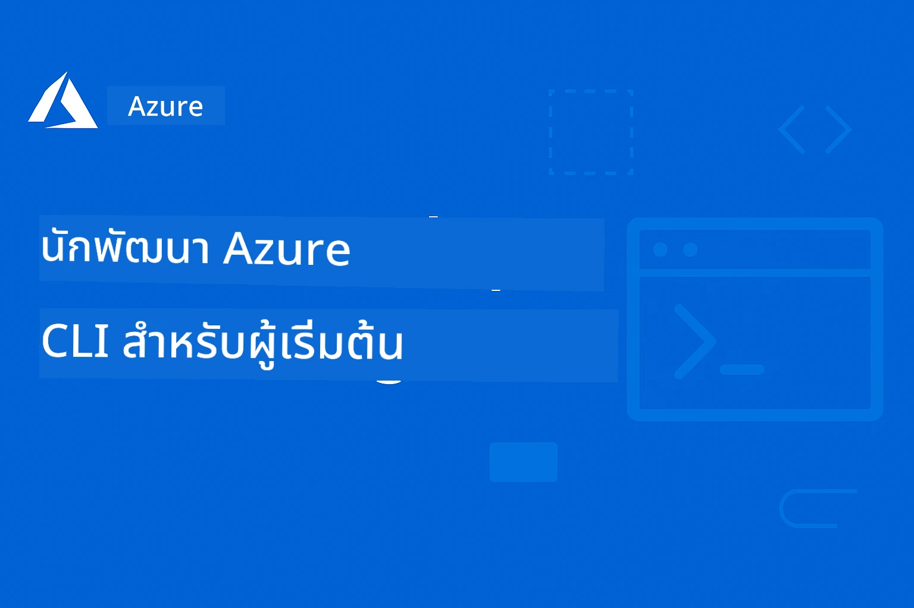

# AZD For Beginners: เส้นทางการเรียนรู้ที่มีโครงสร้าง

 

[](https://GitHub.com/microsoft/azd-for-beginners/watchers/)
[](https://GitHub.com/microsoft/azd-for-beginners/network/)
[](https://GitHub.com/microsoft/azd-for-beginners/stargazers/)

[](https://discord.com/invite/nkVh3dp)
[](https://discord.gg/nTYy5BXMWG)

---

### การแปลอัตโนมัติ (อัปเดตเสมอ)

<!-- CO-OP TRANSLATOR LANGUAGES TABLE START -->
[Arabic](../ar/README.md) | [Bengali](../bn/README.md) | [Bulgarian](../bg/README.md) | [Burmese (Myanmar)](../my/README.md) | [Chinese (Simplified)](../zh-CN/README.md) | [Chinese (Traditional, Hong Kong)](../zh-HK/README.md) | [Chinese (Traditional, Macau)](../zh-MO/README.md) | [Chinese (Traditional, Taiwan)](../zh-TW/README.md) | [Croatian](../hr/README.md) | [Czech](../cs/README.md) | [Danish](../da/README.md) | [Dutch](../nl/README.md) | [Estonian](../et/README.md) | [Finnish](../fi/README.md) | [French](../fr/README.md) | [German](../de/README.md) | [Greek](../el/README.md) | [Hebrew](../he/README.md) | [Hindi](../hi/README.md) | [Hungarian](../hu/README.md) | [Indonesian](../id/README.md) | [Italian](../it/README.md) | [Japanese](../ja/README.md) | [Kannada](../kn/README.md) | [Khmer](../km/README.md) | [Korean](../ko/README.md) | [Lithuanian](../lt/README.md) | [Malay](../ms/README.md) | [Malayalam](../ml/README.md) | [Marathi](../mr/README.md) | [Nepali](../ne/README.md) | [Nigerian Pidgin](../pcm/README.md) | [Norwegian](../no/README.md) | [Persian (Farsi)](../fa/README.md) | [Polish](../pl/README.md) | [Portuguese (Brazil)](../pt-BR/README.md) | [Portuguese (Portugal)](../pt-PT/README.md) | [Punjabi (Gurmukhi)](../pa/README.md) | [Romanian](../ro/README.md) | [Russian](../ru/README.md) | [Serbian (Cyrillic)](../sr/README.md) | [Slovak](../sk/README.md) | [Slovenian](../sl/README.md) | [Spanish](../es/README.md) | [Swahili](../sw/README.md) | [Swedish](../sv/README.md) | [Tagalog (Filipino)](../tl/README.md) | [Tamil](../ta/README.md) | [Telugu](../te/README.md) | [Thai](./README.md) | [Turkish](../tr/README.md) | [Ukrainian](../uk/README.md) | [Urdu](../ur/README.md) | [Vietnamese](../vi/README.md)

> **ต้องการโคลนลงเครื่องไหม?**
>
> ที่เก็บนี้มีการแปลมากกว่า 50 ภาษา ซึ่งทำให้ขนาดดาวน์โหลดเพิ่มขึ้นมาก หากต้องการโคลนโดยไม่รวมการแปล ให้ใช้ sparse checkout:
>
> **Bash / macOS / Linux:**
> ```bash
> git clone --filter=blob:none --sparse https://github.com/microsoft/AZD-for-beginners.git
> cd AZD-for-beginners
> git sparse-checkout set --no-cone '/*' '!translations' '!translated_images'
> ```
>
> **CMD (Windows):**
> ```cmd
> git clone --filter=blob:none --sparse https://github.com/microsoft/AZD-for-beginners.git
> cd AZD-for-beginners
> git sparse-checkout set --no-cone "/*" "!translations" "!translated_images"
> ```
>
> สิ่งนี้จะให้ทุกอย่างที่คุณต้องใช้เพื่อจบคอร์สด้วยการดาวน์โหลดที่เร็วขึ้นมาก
<!-- CO-OP TRANSLATOR LANGUAGES TABLE END -->

## 🆕 มีอะไรใหม่ใน azd วันนี้

Azure Developer CLI เติบโตเกินกว่าจะเป็นแอปเว็บและ API แบบดั้งเดิม วันนี้ azd เป็นเครื่องมือเดียวสำหรับการติดตั้งแอป **ทุกประเภท** บน Azure — รวมถึงแอปที่ขับเคลื่อนด้วย AI และเอเย่นต์อัจฉริยะ

นี่คือสิ่งที่หมายถึงสำหรับคุณ:

- **เอเย่นต์ AI กลายเป็นงาน azd ชั้นนำแล้ว** คุณสามารถเริ่มต้น ติดตั้ง และจัดการโครงการเอเย่นต์ AI โดยใช้ workflow `azd init` → `azd up` ที่คุณคุ้นเคย
- **การรวม Microsoft Foundry** นำการติดตั้งโมเดล การโฮสต์เอเย่นต์ และการตั้งค่าบริการ AI เข้ามาในระบบเทมเพลตของ azd โดยตรง
- **Workflow หลักไม่มีการเปลี่ยนแปลง** ไม่ว่าคุณจะติดตั้งแอปทำงาน รายการไมโครเซอร์วิส หรือโซลูชัน AI หลายเอเย่นต์ คำสั่งก็เหมือนเดิม

ถ้าคุณเคยใช้ azd มาก่อน การรองรับ AI เป็นส่วนขยายทางธรรมชาติ — ไม่ใช่เครื่องมือแยกหรือเส้นทางขั้นสูง หากคุณเริ่มใหม่ คุณจะได้เรียนรู้ workflow เดียวที่ใช้ได้กับทุกอย่าง

---

## 🚀 Azure Developer CLI (azd) คืออะไร?

**Azure Developer CLI (azd)** คือเครื่องมือบรรทัดคำสั่งที่ใช้งานง่ายสำหรับนักพัฒนา ซึ่งช่วยให้การ deploy แอปพลิเคชันบน Azure เป็นเรื่องง่าย แทนที่จะต้องสร้างและเชื่อมต่อแหล่งข้อมูล Azure จำนวนมากด้วยตนเอง คุณสามารถ deploy แอปทั้งหมดได้ด้วยคำสั่งเดียว

### ความมหัศจรรย์ของ `azd up`

```bash
# คำสั่งเดียวนี้ทำทุกอย่างได้:
# ✅ สร้างทรัพยากร Azure ทั้งหมด
# ✅ กำหนดค่าเครือข่ายและความปลอดภัย
# ✅ สร้างโค้ดแอปพลิเคชันของคุณ
# ✅ ปรับใช้ไปยัง Azure
# ✅ ให้ URL ที่ใช้งานได้
azd up
```

**แค่นั้นแหละ!** ไม่ต้องคลิกใน Azure Portal, ไม่ต้องเรียนรู้ ARM templates ที่ซับซ้อนก่อน, ไม่ต้องตั้งค่าด้วยมือ — มีแต่แอปที่ใช้งานได้บน Azure ทันที

---

## ❓ Azure Developer CLI กับ Azure CLI: แตกต่างกันอย่างไร?

นี่คือคำถามที่พบบ่อยที่สุดสำหรับผู้เริ่มต้น นี่คือคำตอบง่ายๆ:

| คุณสมบัติ | **Azure CLI (`az`)** | **Azure Developer CLI (`azd`)** |
|---------|---------------------|--------------------------------|
| **วัตถุประสงค์** | จัดการทรัพยากร Azure ทีละตัว | ติดตั้งแอปพลิเคชันครบชุด |
| **แนวคิด** | เน้นโครงสร้างพื้นฐาน | เน้นแอปพลิเคชัน |
| **ตัวอย่าง** | `az webapp create --name myapp...` | `azd up` |
| **เส้นทางการเรียนรู้** | ต้องรู้บริการ Azure | แค่รู้แอปของคุณ |
| **เหมาะกับ** | DevOps, โครงสร้างพื้นฐาน | นักพัฒนา, ต้นแบบ |

### อุปมาง่ายๆ

- **Azure CLI** เหมือนมีเครื่องมือทุกอย่างเพื่อสร้างบ้าน — ค้อน เลื่อย ตะปู คุณสร้างได้ทุกอย่างแต่ต้องรู้เรื่องก่อสร้าง
- **Azure Developer CLI** เหมือนจ้างผู้รับเหมา — คุณบอกสิ่งที่ต้องการ และพวกเขาดูแลการก่อสร้างให้

### เมื่อไรควรใช้แต่ละตัว

| สถานการณ์ | ใช้อันนี้ |
|----------|----------|
| "ฉันอยาก deploy เว็บแอปอย่างรวดเร็ว" | `azd up` |
| "ฉันต้องการสร้างแค่บัญชีเก็บข้อมูล" | `az storage account create` |
| "ฉันกำลังสร้างแอป AI แบบเต็มรูปแบบ" | `azd init --template azure-search-openai-demo` |
| "ฉันต้องการดีบักทรัพยากร Azure ตัวใดตัวหนึ่ง" | `az resource show` |
| "ฉันต้องการการ deploy พร้อมใช้งานในไม่กี่นาที" | `azd up --environment production` |

### พวกเขาทำงานร่วมกัน!

AZD ใช้ Azure CLI เป็นพื้นหลัง คุณสามารถใช้ทั้งสองตัวร่วมกันได้:
```bash
# ปรับใช้แอปของคุณด้วย AZD
azd up

# จากนั้นปรับแต่งทรัพยากรเฉพาะด้วย Azure CLI
az webapp config set --name myapp --always-on true
```

---

## 🌟 ค้นหาเทมเพลตใน Awesome AZD

ไม่ต้องเริ่มจากศูนย์! **Awesome AZD** คือคอลเลกชันเทมเพลตพร้อมใช้งานจากชุมชน:

| รายการทรัพยากร | คำอธิบาย |
|----------|-------------|
| 🔗 [**Awesome AZD Gallery**](https://azure.github.io/awesome-azd/) | เลือกดูเทมเพลตกว่า 200 รายการพร้อมคลิกเดียวติดตั้ง |
| 🔗 [**ส่งเทมเพลต**](https://github.com/Azure/awesome-azd/issues) | ร่วมส่งเทมเพลตของคุณให้ชุมชน |
| 🔗 [**ที่เก็บ GitHub**](https://github.com/Azure/awesome-azd) | กดดาวและสำรวจซอร์สโค้ด |

### เทมเพลต AI ยอดนิยมจาก Awesome AZD

```bash
# RAG แชทกับโมเดล Microsoft Foundry และการค้นหาด้วย AI
azd init --template azure-search-openai-demo

# แอปแชท AI แบบรวดเร็ว
azd init --template openai-chat-app-quickstart

# ตัวแทน AI กับตัวแทนของ Foundry
azd init --template get-started-with-ai-agents
```

---

## 🎯 เริ่มต้นใน 3 ขั้นตอน

ก่อนเริ่ม ให้แน่ใจว่าเครื่องของคุณพร้อมสำหรับเทมเพลตที่ต้องการ deploy:

**Windows:**
```powershell
.\validate-setup.ps1
```

**macOS / Linux:**
```bash
bash ./validate-setup.sh
```

ถ้ามีข้อผิดพลาดใดๆ ในการตรวจสอบ ให้แก้ไขก่อน แล้วค่อยทำขั้นตอนต่อไป

### ขั้นตอนที่ 1: ติดตั้ง AZD (2 นาที)

**Windows:**
```powershell
winget install microsoft.azd
```

**macOS:**
```bash
brew tap azure/azd && brew install azd
```

**Linux:**
```bash
curl -fsSL https://aka.ms/install-azd.sh | bash
```

### ขั้นตอนที่ 2: ลงชื่อเข้าใช้สำหรับ AZD

```bash
# เป็นทางเลือกหากคุณวางแผนที่จะใช้คำสั่ง Azure CLI โดยตรงในหลักสูตรนี้
az login

# จำเป็นสำหรับเวิร์กโฟลว์ของ AZD
azd auth login
```

ถ้าคุณไม่แน่ใจว่าต้องใช้แบบไหน ให้ทำตามกระบวนการตั้งค่าครบถ้วนใน [การติดตั้ง & การตั้งค่า](docs/chapter-01-foundation/installation.md#authentication-setup)

### ขั้นตอนที่ 3: Deploy แอปแรกของคุณ

```bash
# เริ่มต้นจากเทมเพลต
azd init --template todo-nodejs-mongo

# ปรับใช้ไปยัง Azure (สร้างทุกอย่าง!)
azd up
```

**🎉 เสร็จแล้ว!** ตอนนี้แอปของคุณออนไลน์บน Azure เรียบร้อย

### ทำความสะอาด (อย่าลืม!)

```bash
# Remove all resources when done experimenting
azd down --force --purge
```

---

## 📚 วิธีใช้คอร์สนี้

คอร์สนี้ออกแบบมาเพื่อ **การเรียนรู้แบบค่อยเป็นค่อยไป** — เริ่มต้นจากจุดที่คุณถนัด แล้วค่อยๆ เพิ่มระดับความรู้:

| ประสบการณ์ของคุณ | เริ่มที่นี่ |
|-----------------|------------|
| **มือใหม่กับ Azure** | [บทที่ 1: พื้นฐาน](#-chapter-1-foundation--quick-start) |
| **รู้จัก Azure แต่ใหม่กับ AZD** | [บทที่ 1: พื้นฐาน](#-chapter-1-foundation--quick-start) |
| **ต้องการ deploy แอป AI** | [บทที่ 2: การพัฒนา AI-First](#-chapter-2-ai-first-development-recommended-for-ai-developers) |
| **ต้องการเรียนรู้ด้วยตนเอง** | [🎓 เวิร์กช็อปเชิงโต้ตอบ](workshop/README.md) - ห้องแล็บ 3-4 ชั่วโมงมีคำแนะนำ |
| **ต้องการรูปแบบสำหรับใช้งานจริง** | [บทที่ 8: รูปแบบการใช้งานจริง & องค์กร](#-chapter-8-production--enterprise-patterns) |

### การตั้งค่ารวดเร็ว

1. **Fork ที่เก็บนี้**: [](https://GitHub.com/microsoft/azd-for-beginners/fork)
2. **โคลนลงเครื่อง**: `git clone https://github.com/YOUR-USERNAME/azd-for-beginners.git`
3. **ขอความช่วยเหลือ**: [ชุมชน Discord ของ Azure](https://discord.com/invite/ByRwuEEgH4)

> **ต้องการโคลนลงเครื่องไหม?**

> ที่เก็บนี้มีการแปลมากกว่า 50 ภาษา ซึ่งทำให้ขนาดดาวน์โหลดเพิ่มขึ้นมาก หากต้องการโคลนโดยไม่รวมการแปล ให้ใช้ sparse checkout:
> ```bash
> git clone --filter=blob:none --sparse https://github.com/microsoft/AZD-for-beginners.git
> cd AZD-for-beginners
> git sparse-checkout set --no-cone '/*' '!translations' '!translated_images'
> ```
> สิ่งนี้จะให้ทุกสิ่งที่คุณต้องใช้จบคอร์สด้วยความเร็วในการดาวน์โหลดที่มากขึ้น


## ภาพรวมคอร์ส

เชี่ยวชาญ Azure Developer CLI (azd) ผ่านบทเรียนที่ออกแบบมาสำหรับการเรียนรู้แบบขั้นตอน มี **โฟกัสพิเศษสำหรับการติดตั้งแอป AI ด้วยการผสานรวม Microsoft Foundry**

### ทำไมคอร์สนี้สำคัญสำหรับนักพัฒนายุคใหม่

อิงจากข้อมูลจากชุมชน Microsoft Foundry Discord, **45% ของนักพัฒนาต้องการใช้ AZD สำหรับงาน AI** แต่พบความท้าทายกับ:
- สถาปัตยกรรม AI หลายบริการซับซ้อน
- แนวทางปฏิบัติที่ดีที่สุดสำหรับการ deploy AI ในสภาพแวดล้อมจริง  
- การรวมและตั้งค่าบริการ AI ของ Azure
- การเพิ่มประสิทธิภาพค่าใช้จ่ายสำหรับงาน AI
- การแก้ไขปัญหาการติดตั้งเฉพาะ AI

### วัตถุประสงค์การเรียนรู้

เมื่อจบคอร์สที่มีโครงสร้างนี้ คุณจะ:
- **เชี่ยวชาญพื้นฐาน AZD**: แนวคิดหลัก, การติดตั้ง, และการตั้งค่า
- **ติดตั้งแอป AI**: ใช้ AZD ร่วมกับบริการ Microsoft Foundry
- **ใช้ Infrastructure as Code**: จัดการทรัพยากร Azure ด้วยเทมเพลต Bicep
- **แก้ไขปัญหาการติดตั้ง**: แก้ไขข้อผิดพลาดทั่วไปและดีบักปัญหา
- **เพิ่มประสิทธิภาพสำหรับผลิตจริง**: ความปลอดภัย, การปรับขนาด, การตรวจสอบ และการบริหารต้นทุน
- **สร้างโซลูชันหลายเอเย่นต์**: ติดตั้งสถาปัตยกรรม AI ที่ซับซ้อน

## ก่อนเริ่ม: บัญชี การเข้าถึง และสมมติฐาน

ก่อนเริ่มบทที่ 1 โปรดตรวจสอบให้แน่ใจว่าคุณมีสิ่งต่อไปนี้พร้อมใช้งาน ขั้นตอนการติดตั้งในคู่มือนี้จะสมมติว่าสิ่งพื้นฐานเหล่านี้ถูกจัดการแล้วแล้ว
- **การสมัครใช้งาน Azure**: คุณสามารถใช้การสมัครใช้งานที่มีอยู่แล้วจากที่ทำงานหรือบัญชีของคุณเอง หรือสร้าง [ทดลองใช้ฟรี](https://aka.ms/azurefreetrial) เพื่อเริ่มต้นได้  
- **สิทธิ์ในการสร้างทรัพยากร Azure**: สำหรับแบบฝึกหัดส่วนใหญ่ คุณควรมีสิทธิ์อย่างน้อยระดับ **Contributor** บนการสมัครใช้งานหรือกลุ่มทรัพยากรเป้าหมาย บางบทอาจสมมติว่าคุณสามารถสร้างกลุ่มทรัพยากร managed identities และการมอบหมาย RBAC ได้ด้วย  
- [**บัญชี GitHub**](https://github.com): มีประโยชน์สำหรับการทำ fork รีโพสิตอรี่ การติดตามการเปลี่ยนแปลงของตัวเอง และใช้ GitHub Codespaces สำหรับการเวิร์กช็อป  
- **ข้อกำหนดล่วงหน้าสำหรับเวลาใช้งานของเทมเพลต**: เทมเพลตบางส่วนต้องการเครื่องมือในเครื่องเช่น Node.js, Python, Java หรือ Docker ให้รันตัวตรวจสอบการตั้งค่าก่อนเริ่มเพื่อจับข้อผิดพลาดที่อาจเกิดขึ้นในตอนต้น  
- **ความคุ้นเคยพื้นฐานกับเทอร์มินัล**: คุณไม่จำเป็นต้องเป็นผู้เชี่ยวชาญ แต่ควรรู้สึกสบายกับการรันคำสั่งเช่น `git clone`, `azd auth login` และ `azd up`  

> **ทำงานในการสมัครใช้งานองค์กร?**  
> หากสภาพแวดล้อม Azure ของคุณถูกจัดการโดยผู้ดูแลระบบ โปรดยืนยันล่วงหน้าว่าคุณสามารถปรับใช้ทรัพยากรในการสมัครใช้งานหรือกลุ่มทรัพยากรที่คุณวางแผนจะใช้งานได้หรือไม่ หากไม่ได้ ให้ขอการสมัครใช้งาน sandbox หรือสิทธิ์ Contributor ก่อนเริ่ม  

> **ใหม่กับ Azure?**  
> เริ่มด้วยทดลองใช้งาน Azure ของคุณเองหรือสมัครใช้งานแบบชำระเงินตามการใช้งานที่ https://aka.ms/azurefreetrial เพื่อให้คุณสามารถทำแบบฝึกหัดให้เสร็จสมบูรณ์ตั้งแต่ต้นจนจบโดยไม่ต้องรอการอนุมัติในระดับ tenant  

## 🗺️ แผนที่หลักสูตร: นำทางด่วนตามบท

แต่ละบทมี README เฉพาะที่มีวัตถุประสงค์การเรียนรู้ การเริ่มต้นอย่างรวดเร็ว และแบบฝึกหัด:  

| บท | หัวข้อ | บทเรียน | ระยะเวลา | ความซับซ้อน |  
|---------|-------|---------|----------|------------|  
| **[บทที่ 1: พื้นฐาน](docs/chapter-01-foundation/README.md)** | การเริ่มต้น | [AZD พื้นฐาน](docs/chapter-01-foundation/azd-basics.md) &#124; [การติดตั้ง](docs/chapter-01-foundation/installation.md) &#124; [โปรเจกต์แรก](docs/chapter-01-foundation/first-project.md) | 30-45 นาที | ⭐ |  
| **[บทที่ 2: การพัฒนา AI](docs/chapter-02-ai-development/README.md)** | แอพ AI-แรก | [การผสานรวม Foundry](docs/chapter-02-ai-development/microsoft-foundry-integration.md) &#124; [ตัวแทน AI](docs/chapter-02-ai-development/agents.md) &#124; [การปรับใช้โมเดล](docs/chapter-02-ai-development/ai-model-deployment.md) &#124; [เวิร์กช็อป](docs/chapter-02-ai-development/ai-workshop-lab.md) | 1-2 ชั่วโมง | ⭐⭐ |  
| **[บทที่ 3: การกำหนดค่า](docs/chapter-03-configuration/README.md)** | การรับรองและความปลอดภัย | [การกำหนดค่า](docs/chapter-03-configuration/configuration.md) &#124; [การรับรอง & ความปลอดภัย](docs/chapter-03-configuration/authsecurity.md) | 45-60 นาที | ⭐⭐ |  
| **[บทที่ 4: โครงสร้างพื้นฐาน](docs/chapter-04-infrastructure/README.md)** | IaC และการปรับใช้ | [คู่มือการปรับใช้](docs/chapter-04-infrastructure/deployment-guide.md) &#124; [การจัดสรรทรัพยากร](docs/chapter-04-infrastructure/provisioning.md) | 1-1.5 ชั่วโมง | ⭐⭐⭐ |  
| **[บทที่ 5: ตัวแทนหลายคน](docs/chapter-05-multi-agent/README.md)** | โซลูชันตัวแทน AI | [สถานการณ์ค้าปลีก](examples/retail-scenario.md) &#124; [รูปแบบการประสานงาน](docs/chapter-06-pre-deployment/coordination-patterns.md) | 2-3 ชั่วโมง | ⭐⭐⭐⭐ |  
| **[บทที่ 6: ก่อนปรับใช้](docs/chapter-06-pre-deployment/README.md)** | การวางแผนและการตรวจสอบ | [การตรวจสอบก่อนบิน](docs/chapter-06-pre-deployment/preflight-checks.md) &#124; [การวางแผนความจุ](docs/chapter-06-pre-deployment/capacity-planning.md) &#124; [การเลือก SKU](docs/chapter-06-pre-deployment/sku-selection.md) &#124; [App Insights](docs/chapter-06-pre-deployment/application-insights.md) | 1 ชั่วโมง | ⭐⭐ |  
| **[บทที่ 7: การแก้ไขปัญหา](docs/chapter-07-troubleshooting/README.md)** | การแก้ไขและดีบัก | [ปัญหาที่พบบ่อย](docs/chapter-07-troubleshooting/common-issues.md) &#124; [การดีบัก](docs/chapter-07-troubleshooting/debugging.md) &#124; [ปัญหา AI](docs/chapter-07-troubleshooting/ai-troubleshooting.md) | 1-1.5 ชั่วโมง | ⭐⭐ |  
| **[บทที่ 8: การผลิต](docs/chapter-08-production/README.md)** | รูปแบบองค์กร | [แนวปฏิบัติการผลิต](docs/chapter-08-production/production-ai-practices.md) | 2-3 ชั่วโมง | ⭐⭐⭐⭐ |  
| **[🎓 เวิร์กช็อป](workshop/README.md)** | แล็บภาคปฏิบัติ | [บทนำ](workshop/docs/instructions/0-Introduction.md) &#124; [การเลือก](workshop/docs/instructions/1-Select-AI-Template.md) &#124; [การตรวจสอบ](workshop/docs/instructions/2-Validate-AI-Template.md) &#124; [การแยกวิเคราะห์](workshop/docs/instructions/3-Deconstruct-AI-Template.md) &#124; [การกำหนดค่า](workshop/docs/instructions/4-Configure-AI-Template.md) &#124; [การปรับแต่ง](workshop/docs/instructions/5-Customize-AI-Template.md) &#124; [การรื้อถอน](workshop/docs/instructions/6-Teardown-Infrastructure.md) &#124; [สรุป](workshop/docs/instructions/7-Wrap-up.md) | 3-4 ชั่วโมง | ⭐⭐ |

**ระยะเวลารวมหลักสูตร:** ~10-14 ชั่วโมง | **ความก้าวหน้าในทักษะ:** ผู้เริ่มต้น → พร้อมการผลิต  

---

## 📚 บทเรียนรู้

*เลือกเส้นทางการเรียนรู้ตามระดับประสบการณ์และเป้าหมาย*  

### 🚀 บทที่ 1: พื้นฐานและการเริ่มต้นอย่างรวดเร็ว  
**ข้อกำหนดเบื้องต้น**: การสมัครใช้งาน Azure, ความรู้พื้นฐานเกี่ยวกับบรรทัดคำสั่ง  
**ระยะเวลา**: 30-45 นาที  
**ความซับซ้อน**: ⭐  

#### สิ่งที่จะได้เรียนรู้  
- ความเข้าใจพื้นฐานของ Azure Developer CLI  
- การติดตั้ง AZD บนแพลตฟอร์มของคุณ  
- การปรับใช้โปรเจกต์แรกที่ประสบความสำเร็จ  

#### แหล่งเรียนรู้  
- **🎯 เริ่มต้นที่นี่**: [Azure Developer CLI คืออะไร?](#what-is-azure-developer-cli)  
- **📖 ทฤษฎี**: [AZD พื้นฐาน](docs/chapter-01-foundation/azd-basics.md) - แนวคิดหลักและคำศัพท์  
- **⚙️ การติดตั้ง**: [การติดตั้งและตั้งค่า](docs/chapter-01-foundation/installation.md) - คู่มือสำหรับแต่ละแพลตฟอร์ม  
- **🛠️ ปฏิบัติจริง**: [โปรเจกต์แรกของคุณ](docs/chapter-01-foundation/first-project.md) - คู่มือทีละขั้นตอน  
- **📋 อ้างอิงด่วน**: [ชีทช่วยจำคำสั่ง](resources/cheat-sheet.md)  

#### แบบฝึกหัด  
```bash
# ตรวจสอบการติดตั้งอย่างรวดเร็ว
azd version

# ปรับใช้แอปพลิเคชันแรกของคุณ
azd init --template todo-nodejs-mongo
azd up
```
  
**💡 ผลลัพธ์ของบท**: ปรับใช้เว็บแอปพลิเคชันง่ายๆ กับ Azure โดยใช้ AZD ได้สำเร็จ  

**✅ การตรวจสอบความสำเร็จ:**  
```bash
# หลังจากทำบทที่ 1 เสร็จแล้ว คุณควรจะสามารถ:
azd version              # แสดงเวอร์ชันที่ติดตั้ง
azd init --template todo-nodejs-mongo  # เริ่มต้นโปรเจกต์
azd up                  # นำส่งไปยัง Azure
azd show                # แสดง URL ของแอปที่กำลังทำงาน
# แอปพลิเคชันเปิดในเบราว์เซอร์และทำงานได้
azd down --force --purge  # ล้างทรัพยากรทั้งหมด
```
  
**📊 เวลาในการลงทุน:** 30-45 นาที  
**📈 ระดับทักษะหลัง:** สามารถปรับใช้แอปพลิเคชันพื้นฐานได้ด้วยตนเอง  

---

### 🤖 บทที่ 2: การพัฒนา AI-First (แนะนำสำหรับนักพัฒนา AI)  
**ข้อกำหนดเบื้องต้น**: ผ่านบทที่ 1  
**ระยะเวลา**: 1-2 ชั่วโมง  
**ความซับซ้อน**: ⭐⭐  

#### สิ่งที่จะได้เรียนรู้  
- การผสานรวม Microsoft Foundry กับ AZD  
- การปรับใช้แอปพลิเคชันที่ขับเคลื่อนด้วย AI  
- ความเข้าใจการกำหนดค่าบริการ AI  

#### แหล่งเรียนรู้  
- **🎯 เริ่มต้นที่นี่**: [การผสานรวม Microsoft Foundry](docs/chapter-02-ai-development/microsoft-foundry-integration.md)  
- **🤖 ตัวแทน AI**: [คู่มือ AI Agents](docs/chapter-02-ai-development/agents.md) - ปรับใช้ตัวแทนอัจฉริยะด้วย AZD  
- **📖 รูปแบบ**: [การปรับใช้โมเดล AI](docs/chapter-02-ai-development/ai-model-deployment.md) - ปรับใช้และจัดการโมเดล AI  
- **🛠️ เวิร์กช็อป**: [แล็บเวิร์กช็อป AI](docs/chapter-02-ai-development/ai-workshop-lab.md) - ทำให้โซลูชัน AI ของคุณพร้อมใช้ AZD  
- **🎥 คู่มือเชิงโต้ตอบ**: [วัสดุเวิร์กช็อป](workshop/README.md) - การเรียนรู้ผ่านเบราว์เซอร์ด้วย MkDocs * สภาพแวดล้อม DevContainer  
- **📋 เทมเพลต**: [เทมเพลต Microsoft Foundry ที่แนะนำ](#แหล่งข้อมูลเวิร์กช็อป)  
- **📝 ตัวอย่าง**: [ตัวอย่างการปรับใช้ AZD](examples/README.md)  

#### แบบฝึกหัด  
```bash
# เปิดตัวแอปพลิเคชัน AI แรกของคุณ
azd init --template azure-search-openai-demo
azd up

# ลองใช้แม่แบบ AI เพิ่มเติม
azd init --template openai-chat-app-quickstart
azd init --template agent-openai-python-prompty
```
  
**💡 ผลลัพธ์ของบท**: ปรับใช้และกำหนดค่าแอปแชท AI พร้อมความสามารถ RAG  

**✅ การตรวจสอบความสำเร็จ:**  
```bash
# หลังจากบทที่ 2 คุณควรจะสามารถ:
azd init --template azure-search-openai-demo
azd up
# ทดสอบอินเทอร์เฟซแชท AI
# ถามคำถามและรับคำตอบจาก AI พร้อมแหล่งข้อมูล
# ตรวจสอบการทำงานของการรวมการค้นหา
azd monitor  # ตรวจสอบว่า Application Insights แสดงโทรเมทรี
azd down --force --purge
```
  
**📊 เวลาในการลงทุน:** 1-2 ชั่วโมง  
**📈 ระดับทักษะหลัง:** สามารถปรับใช้และกำหนดค่าแอป AI พร้อมใช้งานในโปรดักชันได้  
**💰 ความเข้าใจด้านต้นทุน:** เข้าใจต้นทุนพัฒนาราว $80-150 ต่อเดือน, ต้นทุนโปรดักชัน $300-3500 ต่อเดือน  

#### 💰 การพิจารณาต้นทุนสำหรับการปรับใช้ AI  

**สภาพแวดล้อมการพัฒนา (ประมาณ $80-150/เดือน):**  
- โมเดล Microsoft Foundry (ชำระตามการใช้งาน): $0-50/เดือน (ขึ้นกับการใช้ token)  
- AI Search (ระดับ Basic): $75/เดือน  
- Container Apps (แบบ Consumption): $0-20/เดือน  
- Storage (มาตรฐาน): $1-5/เดือน  

**สภาพแวดล้อมการผลิต (ประมาณ $300-3,500+/เดือน):**  
- โมเดล Microsoft Foundry (PTU สำหรับประสิทธิภาพคงที่): $3,000+/เดือน หรือ ชำระตามการใช้งานปริมาณสูง  
- AI Search (ระดับ Standard): $250/เดือน  
- Container Apps (แบบ Dedicated): $50-100/เดือน  
- Application Insights: $5-50/เดือน  
- Storage (ระดับ Premium): $10-50/เดือน  

**💡 เคล็ดลับการเพิ่มประสิทธิภาพต้นทุน:**  
- ใช้ **Free Tier** ของโมเดล Microsoft Foundry สำหรับการเรียนรู้ (Azure OpenAI รวม 50,000 tokens ต่อเดือน)  
- รัน `azd down` เพื่อปล่อยทรัพยากรเมื่อไม่ใช้งานจริง  
- เริ่มด้วยการคิดค่าบริการแบบ consumption แล้วอัพเกรดเป็น PTU เฉพาะโปรดักชัน  
- ใช้ `azd provision --preview` เพื่อประเมินต้นทุนก่อนปรับใช้  
- เปิดใช้งาน auto-scaling: จ่ายเฉพาะการใช้งานจริง  

**การติดตามต้นทุน:**  
```bash
# ตรวจสอบค่าใช้จ่ายรายเดือนโดยประมาณ
azd provision --preview

# ตรวจสอบค่าใช้จ่ายจริงใน Azure Portal
az consumption budget list --resource-group <your-rg>
```
  
---

### ⚙️ บทที่ 3: การกำหนดค่าและการยืนยันตัวตน  
**ข้อกำหนดเบื้องต้น**: ผ่านบทที่ 1  
**ระยะเวลา**: 45-60 นาที  
**ความซับซ้อน**: ⭐⭐  

#### สิ่งที่จะได้เรียนรู้  
- การกำหนดค่าและการจัดการสภาพแวดล้อม  
- การยืนยันตัวตนและแนวทางปฏิบัติด้านความปลอดภัย  
- การตั้งชื่อและจัดระเบียบทรัพยากร  

#### แหล่งเรียนรู้  
- **📖 การกำหนดค่า**: [คู่มือการกำหนดค่า](docs/chapter-03-configuration/configuration.md) - การตั้งค่าสภาพแวดล้อม  
- **🔐 ความปลอดภัย**: [รูปแบบการยืนยันตัวตนและ managed identity](docs/chapter-03-configuration/authsecurity.md) - รูปแบบการยืนยันตัวตน  
- **📝 ตัวอย่าง**: [ตัวอย่างแอปฐานข้อมูล](examples/database-app/README.md) - ตัวอย่างฐานข้อมูล AZD  

#### แบบฝึกหัด  
- กำหนดค่าสภาพแวดล้อมหลายสภาพ (dev, staging, prod)  
- ตั้งค่าการยืนยันตัวตนแบบ managed identity  
- นำแนวทางการกำหนดค่าสำหรับแต่ละสภาพแวดล้อมไปใช้  

**💡 ผลลัพธ์ของบท**: จัดการสภาพแวดล้อมหลายสภาพพร้อมการยืนยันตัวตนและความปลอดภัยที่เหมาะสม  

---

### 🏗️ บทที่ 4: โครงสร้างพื้นฐานเป็นรหัสและการปรับใช้  
**ข้อกำหนดเบื้องต้น**: ผ่านบทที่ 1-3  
**ระยะเวลา**: 1-1.5 ชั่วโมง  
**ความซับซ้อน**: ⭐⭐⭐  

#### สิ่งที่จะได้เรียนรู้  
- รูปแบบการปรับใช้ขั้นสูง  
- โครงสร้างพื้นฐานเป็นรหัสด้วย Bicep  
- กลยุทธ์การจัดสรรทรัพยากร  

#### แหล่งเรียนรู้  
- **📖 การปรับใช้**: [คู่มือการปรับใช้](docs/chapter-04-infrastructure/deployment-guide.md) - เวิร์กโฟลว์ครบถ้วน  
- **🏗️ การจัดสรรทรัพยากร**: [การจัดสรรทรัพยากร](docs/chapter-04-infrastructure/provisioning.md) - การจัดการทรัพยากร Azure  
- **📝 ตัวอย่าง**: [ตัวอย่าง Container App](../../examples/container-app) - การปรับใช้แบบ container  

#### แบบฝึกหัด  
- สร้างเทมเพลต Bicep ที่กำหนดเอง  
- ปรับใช้แอปพลิเคชันหลายบริการ  
- นำกลยุทธ์ blue-green deployment ไปใช้  

**💡 ผลลัพธ์ของบท**: ปรับใช้แอปพลิเคชันหลายบริการที่ซับซ้อนโดยใช้เทมเพลตโครงสร้างพื้นฐานแบบกำหนดเอง  

---

### 🎯 บทที่ 5: โซลูชัน AI หลายตัวแทน (ขั้นสูง)  
**ข้อกำหนดเบื้องต้น**: ผ่านบทที่ 1-2  
**ระยะเวลา**: 2-3 ชั่วโมง  
**ความซับซ้อน**: ⭐⭐⭐⭐  

#### สิ่งที่จะได้เรียนรู้  
- รูปแบบสถาปัตยกรรมตัวแทนหลายตัว  
- การจัดการและประสานงานตัวแทน  
- การปรับใช้ AI ที่พร้อมใช้งานในโปรดักชัน  

#### แหล่งเรียนรู้  
- **🤖 โปรเจกต์เด่น**: [โซลูชัน Multi-Agent ในค้าปลีก](examples/retail-scenario.md) - การดำเนินการครบถ้วน  
- **🛠️ แพ็กเกจเทมเพลต ARM**: [ARM Template สำหรับ Multi-Agent](../../examples/retail-multiagent-arm-template) - ปรับใช้คลิกเดียว  
- **📖 สถาปัตยกรรม**: [รูปแบบการประสานงานตัวแทนหลายตัว](docs/chapter-06-pre-deployment/coordination-patterns.md) - รูปแบบ  

#### แบบฝึกหัด  
```bash
# นำระบบตัวแทนหลายตัวสำหรับการค้าปลีกที่สมบูรณ์ใช้งาน
cd examples/retail-multiagent-arm-template
./deploy.sh

# สำรวจการตั้งค่าตัวแทน
az deployment group show --resource-group <rg-name> --name <deployment-name>
```
  
**💡 ผลลัพธ์ของบท**: ปรับใช้และจัดการโซลูชัน AI หลายตัวแทนที่พร้อมใช้งานในโปรดักชันกับตัวแทนลูกค้าและตัวแทนสินค้าคงคลัง  

---

### 🔍 บทที่ 6: การตรวจสอบและวางแผนก่อนปรับใช้  
**ข้อกำหนดเบื้องต้น**: ผ่านบทที่ 4  
**ระยะเวลา**: 1 ชั่วโมง  
**ความซับซ้อน**: ⭐⭐
#### สิ่งที่คุณจะได้เรียนรู้
- การวางแผนความจุและการตรวจสอบทรัพยากร
- กลยุทธ์การเลือก SKU
- การตรวจสอบก่อนการใช้งานและการทำงานอัตโนมัติ

#### แหล่งเรียนรู้
- **📊 การวางแผน**: [การวางแผนความจุ](docs/chapter-06-pre-deployment/capacity-planning.md) - การตรวจสอบทรัพยากร
- **💰 การเลือก**: [การเลือก SKU](docs/chapter-06-pre-deployment/sku-selection.md) - ตัวเลือกที่คุ้มค่า
- **✅ การตรวจสอบ**: [การตรวจสอบก่อนการใช้งาน](docs/chapter-06-pre-deployment/preflight-checks.md) - สคริปต์อัตโนมัติ

#### แบบฝึกหัดปฏิบัติ
- รันสคริปต์ตรวจสอบความจุ
- ปรับแต่งการเลือก SKU ให้เหมาะสมกับต้นทุน
- นำการตรวจสอบก่อนการใช้งานอัตโนมัติไปใช้

**💡 ผลลัพธ์บทนี้**: ตรวจสอบและปรับแต่งการปรับใช้งานก่อนการดำเนินการจริง

---

### 🚨 บทที่ 7: การแก้ไขปัญหา & การดีบัก
**ข้อกำหนดเบื้องต้น**: ผ่านบทการปรับใช้งานใดก็ได้  
**ระยะเวลา**: 1-1.5 ชั่วโมง  
**ความซับซ้อน**: ⭐⭐

#### สิ่งที่คุณจะได้เรียนรู้
- วิธีการดีบักอย่างเป็นระบบ
- ปัญหาทั่วไปและวิธีแก้ไข
- การแก้ไขปัญหาเฉพาะ AI

#### แหล่งเรียนรู้
- **🔧 ปัญหาทั่วไป**: [ปัญหาทั่วไป](docs/chapter-07-troubleshooting/common-issues.md) - คำถามที่พบบ่อยและวิธีแก้ไข
- **🕵️ การดีบัก**: [คู่มือการดีบัก](docs/chapter-07-troubleshooting/debugging.md) - กลยุทธ์ทีละขั้นตอน
- **🤖 ปัญหา AI**: [การแก้ไขปัญหาเฉพาะ AI](docs/chapter-07-troubleshooting/ai-troubleshooting.md) - ปัญหาบริการ AI

#### แบบฝึกหัดปฏิบัติ
- วินิจฉัยความล้มเหลวในการปรับใช้
- แก้ไขปัญหาการตรวจสอบสิทธิ์
- ดีบักการเชื่อมต่อบริการ AI

**💡 ผลลัพธ์บทนี้**: วินิจฉัยและแก้ไขปัญหาการปรับใช้งานทั่วไปได้ด้วยตนเอง

---

### 🏢 บทที่ 8: รูปแบบการใช้งานจริง & สำหรับองค์กร
**ข้อกำหนดเบื้องต้น**: ผ่านบทที่ 1-4  
**ระยะเวลา**: 2-3 ชั่วโมง  
**ความซับซ้อน**: ⭐⭐⭐⭐

#### สิ่งที่คุณจะได้เรียนรู้
- กลยุทธ์การปรับใช้งานจริง
- รูปแบบความปลอดภัยสำหรับองค์กร
- การตรวจสอบและปรับปรุงต้นทุน

#### แหล่งเรียนรู้
- **🏭 การผลิต**: [แนวปฏิบัติ AI สำหรับการผลิต](docs/chapter-08-production/production-ai-practices.md) - รูปแบบองค์กร
- **📝 ตัวอย่าง**: [ตัวอย่างไมโครเซอร์วิส](../../examples/microservices) - สถาปัตยกรรมซับซ้อน
- **📊 การตรวจสอบ**: [การผสาน Application Insights](docs/chapter-06-pre-deployment/application-insights.md) - การตรวจสอบ

#### แบบฝึกหัดปฏิบัติ
- นำรูปแบบความปลอดภัยสำหรับองค์กรไปใช้
- ตั้งค่าการตรวจสอบอย่างครบวงจร
- ปรับใช้ในสภาพแวดล้อมการผลิตโดยมีการควบคุมอย่างเหมาะสม

**💡 ผลลัพธ์บทนี้**: ปรับใช้แอปพลิเคชันพร้อมใช้งานสำหรับองค์กรด้วยฟีเจอร์การผลิตครบถ้วน

---

## 🎓 ภาพรวมเวิร์กช็อป: ประสบการณ์การเรียนรู้แบบลงมือทำ

> **⚠️ สถานะเวิร์กช็อป: กำลังพัฒนา**  
> วัสดุเวิร์กช็อปกำลังอยู่ในระหว่างการพัฒนาและปรับปรุง โมดูลหลักทำงานได้แล้ว แต่บางส่วนของเนื้อหาขั้นสูงยังไม่สมบูรณ์ เรากำลังเร่งดำเนินการให้ครบถ้วน [ติดตามความคืบหน้า →](workshop/README.md)

### วัสดุเวิร์กช็อปเชิงโต้ตอบ
**ประสบการณ์การเรียนรู้แบบโต้ตอบอย่างครบถ้วนด้วยเครื่องมือบนเบราว์เซอร์และแบบฝึกหัดแนะนำ**

วัสดุเวิร์กช็อปของเรานำเสนอประสบการณ์การเรียนรู้ที่มีโครงสร้างและโต้ตอบ ซึ่งเสริมกับหลักสูตรตามบทข้างต้น เวิร์กช็อปออกแบบมาเพื่อให้เหมาะกับการเรียนรู้ด้วยตนเองและการสอนโดยผู้ฝึกสอน

#### 🛠️ คุณสมบัติเวิร์กช็อป
- **อินเทอร์เฟซบนเบราว์เซอร์**: เวิร์กช็อปที่ขับเคลื่อนด้วย MkDocs พร้อมฟีเจอร์ค้นหา คัดลอก และธีม
- **ผสานกับ GitHub Codespaces**: ตั้งค่าสภาพแวดล้อมพัฒนาได้ด้วยคลิกเดียว
- **เส้นทางการเรียนรู้ที่มีโครงสร้าง**: แบบฝึกหัด 8 โมดูล (รวม 3-4 ชั่วโมง)
- **วิธีการแบบก้าวหน้า**: แนะนำ → เลือก → ตรวจสอบ → วิเคราะห์ → กำหนดค่า → ปรับแต่ง → ทำลาย → สรุป
- **สภาพแวดล้อม DevContainer เชิงโต้ตอบ**: มีเครื่องมือและการตั้งค่าที่เตรียมไว้แล้ว

#### 📚 โครงสร้างโมดูลเวิร์กช็อป
เวิร์กช็อปดำเนินการตาม **วิธีการแบบก้าวหน้า 8 โมดูล** ที่พาคุณตั้งแต่การค้นพบจนถึงความเชี่ยวชาญในการปรับใช้:

| โมดูล | หัวข้อ | สิ่งที่จะทำ | ระยะเวลา |
|--------|-------|------------|---------|
| **0. แนะนำ** | ภาพรวมเวิร์กช็อป | เข้าใจวัตถุประสงค์การเรียนรู้ ข้อกำหนด และโครงสร้างเวิร์กช็อป | 15 นาที |
| **1. เลือก** | ค้นหาแม่แบบ | สำรวจแม่แบบ AZD และเลือกแม่แบบ AI ที่เหมาะกับกรณีของคุณ | 20 นาที |
| **2. ตรวจสอบ** | ปรับใช้ & ตรวจสอบ | ปรับใช้แม่แบบด้วย `azd up` และตรวจสอบว่าโครงสร้างพื้นฐานทำงานได้ | 30 นาที |
| **3. วิเคราะห์** | เข้าใจโครงสร้าง | ใช้ GitHub Copilot สำรวจสถาปัตยกรรมแม่แบบ ไฟล์ Bicep และการจัดระเบียบโค้ด | 30 นาที |
| **4. กำหนดค่า** | เจาะลึก azure.yaml | เชี่ยวชาญการกำหนดค่า `azure.yaml` รวมถึง lifecycle hooks และตัวแปรสิ่งแวดล้อม | 30 นาที |
| **5. ปรับแต่ง** | ทำให้เป็นของคุณ | เปิดใช้งาน AI Search, tracing, evaluation และปรับแต่งให้เหมาะกับกรณีของคุณ | 45 นาที |
| **6. ทำลาย** | ทำความสะอาด | ปลดทรัพยากรอย่างปลอดภัยด้วยคำสั่ง `azd down --purge` | 15 นาที |
| **7. สรุป** | ขั้นตอนถัดไป | ทบทวนความสำเร็จ แนวคิดสำคัญ และต่อยอดเส้นทางการเรียนรู้ | 15 นาที |

**ลำดับเวิร์กช็อป:**
```
Introduction → Selection → Validation → Deconstruction → Configuration → Customization → Teardown → Wrap-up
     ↓            ↓           ↓              ↓               ↓              ↓            ↓           ↓
  Overview    Find the     Deploy &      Explore        Master         Customize     Clean up    Review &
             right        verify        code &        azure.yaml      for your      resources   next steps
             template                   structure                     scenario
```

#### 🚀 การเริ่มต้นเวิร์กช็อป
```bash
# ตัวเลือกที่ 1: GitHub Codespaces (แนะนำ)
# คลิก "Code" → "Create codespace on main" ในที่เก็บ

# ตัวเลือกที่ 2: การพัฒนาในเครื่อง
git clone https://github.com/microsoft/azd-for-beginners.git
cd azd-for-beginners/workshop
# ทำตามคำแนะนำการตั้งค่าใน workshop/README.md
```

#### 🎯 ผลลัพธ์การเรียนรู้เวิร์กช็อป
เมื่อจบเวิร์กช็อป ผู้เข้าร่วมจะสามารถ:
- **ปรับใช้แอป AI สำหรับการผลิต**: ใช้ AZD กับบริการ Microsoft Foundry
- **เชี่ยวชาญสถาปัตยกรรมตัวแทนหลายตัว**: นำโซลูชันตัวแทน AI ที่ประสานงานกันไปใช้
- **นำแนวทางปฏิบัติด้านความปลอดภัยไปใช้**: กำหนดการยืนยันตัวตนและการควบคุมการเข้าถึง
- **ปรับแต่งเพื่อการขยายตัว**: ออกแบบการปรับใช้ที่คุ้มค่าและทำงานได้ดี
- **แก้ไขปัญหาการปรับใช้**: แก้ไขปัญหาทั่วไปได้ด้วยตนเอง

#### 📖 แหล่งข้อมูลเวิร์กช็อป
- **🎥 คู่มือเชิงโต้ตอบ**: [วัสดุเวิร์กช็อป](workshop/README.md) - สภาพแวดล้อมเรียนรู้บนเบราว์เซอร์
- **📋 คำแนะนำรายโมดูล**:
  - [0. แนะนำ](workshop/docs/instructions/0-Introduction.md) - ภาพรวมเวิร์กช็อปและวัตถุประสงค์
  - [1. เลือก](workshop/docs/instructions/1-Select-AI-Template.md) - ค้นหาและเลือกแม่แบบ AI
  - [2. ตรวจสอบ](workshop/docs/instructions/2-Validate-AI-Template.md) - ปรับใช้และตรวจสอบแม่แบบ
  - [3. วิเคราะห์](workshop/docs/instructions/3-Deconstruct-AI-Template.md) - สำรวจสถาปัตยกรรมแม่แบบ
  - [4. กำหนดค่า](workshop/docs/instructions/4-Configure-AI-Template.md) - เชี่ยวชาญ azure.yaml
  - [5. ปรับแต่ง](workshop/docs/instructions/5-Customize-AI-Template.md) - ปรับแต่งให้เหมาะกับกรณีของคุณ
  - [6. ทำลาย](workshop/docs/instructions/6-Teardown-Infrastructure.md) - ทำความสะอาดทรัพยากร
  - [7. สรุป](workshop/docs/instructions/7-Wrap-up.md) - ทบทวนและขั้นตอนถัดไป
- **🛠️ ห้องปฏิบัติการเวิร์กช็อป AI**: [ห้องปฏิบัติการ AI](docs/chapter-02-ai-development/ai-workshop-lab.md) - แบบฝึกหัดเน้น AI
- **💡 เริ่มต้นอย่างรวดเร็ว**: [คู่มือการตั้งค่าเวิร์กช็อป](workshop/README.md#quick-start) - การกำหนดค่าสภาพแวดล้อม

**เหมาะสำหรับ**: การฝึกอบรมองค์กร หลักสูตรมหาวิทยาลัย การเรียนรู้ด้วยตนเอง และบูตแคมป์สำหรับนักพัฒนา

---

## 📖 การเจาะลึก: ความสามารถของ AZD

นอกเหนือจากพื้นฐานแล้ว AZD ยังมอบฟีเจอร์ทรงพลังสำหรับการปรับใช้งานจริง:

- **การปรับใช้ตามแม่แบบ** - ใช้แม่แบบที่สร้างไว้ล่วงหน้าสำหรับรูปแบบแอปพลิเคชันทั่วไป  
- **โครงสร้างพื้นฐานเป็นโค้ด** - จัดการทรัพยากร Azure ด้วย Bicep หรือ Terraform  
- **เวิร์กโฟลว์แบบรวม** - จัดเตรียม ปรับใช้ และตรวจสอบแอปพลิเคชันอย่างไร้รอยต่อ  
- **เหมาะสำหรับนักพัฒนา** - ปรับแต่งสำหรับประสิทธิภาพและประสบการณ์นักพัฒนา

### **AZD + Microsoft Foundry: สมบูรณ์แบบสำหรับการปรับใช้ AI**

**ทำไมต้องใช้ AZD สำหรับโซลูชัน AI?** AZD ตอบโจทย์ความท้าทายสำคัญของนักพัฒนา AI:

- **แม่แบบพร้อมใช้งานสำหรับ AI** - แม่แบบที่ตั้งค่าไว้ล่วงหน้าสำหรับ Microsoft Foundry Models, บริการ Cognitive และงาน ML  
- **การปรับใช้ AI ที่ปลอดภัย** - รูปแบบความปลอดภัยในตัวสำหรับบริการ AI กุญแจ API และจุดเชื่อมต่อโมเดล  
- **รูปแบบ AI สำหรับการผลิต** - แนวปฏิบัติที่ดีที่สุดสำหรับการปรับใช้แอป AI ที่ขยายตัวได้และคุ้มค่า  
- **เวิร์กโฟลว์ AI ครบวงจร** - ตั้งแต่การพัฒนาโมเดลจนถึงการปรับใช้ในผลิต พร้อมการตรวจสอบที่เหมาะสม  
- **การปรับแต่งต้นทุน** - การจัดสรรทรัพยากรและกลยุทธ์การปรับสเกลแบบชาญฉลาดสำหรับงาน AI  
- **ผสาน Microsoft Foundry** - การเชื่อมต่อที่ไร้รอยต่อกับแคตตาล็อกและจุดเชื่อมต่อโมเดล Microsoft Foundry

---

## 🎯 แม่แบบ & ห้องสมุดตัวอย่าง

### แม่แบบเด่น: Microsoft Foundry Templates
**เริ่มต้นที่นี่ถ้าคุณกำลังปรับใช้แอป AI!**

> **หมายเหตุ:** แม่แบบเหล่านี้แสดงรูปแบบ AI ต่าง ๆ บางแม่แบบเป็นตัวอย่าง Azure ภายนอก บางแม่แบบเป็นการใช้งานภายในเครื่อง

| แม่แบบ | บท | ความซับซ้อน | บริการ | ประเภท |
|----------|---------|------------|----------|------|
| [**เริ่มต้นใช้ AI chat**](https://github.com/Azure-Samples/get-started-with-ai-chat) | บท 2 | ⭐⭐ | AzureOpenAI + Azure AI Model Inference API + Azure AI Search + Azure Container Apps + Application Insights | ภายนอก |
| [**เริ่มต้นใช้ AI agents**](https://github.com/Azure-Samples/get-started-with-ai-agents) | บท 2 | ⭐⭐ | Foundry Agents + AzureOpenAI + Azure AI Search + Azure Container Apps + Application Insights | ภายนอก |
| [**สาธิต Azure Search + OpenAI**](https://github.com/Azure-Samples/azure-search-openai-demo) | บท 2 | ⭐⭐ | AzureOpenAI + Azure AI Search + App Service + Storage | ภายนอก |
| [**เริ่มต้น OpenAI Chat App**](https://github.com/Azure-Samples/openai-chat-app-quickstart) | บท 2 | ⭐ | AzureOpenAI + Container Apps + Application Insights | ภายนอก |
| [**Agent OpenAI Python Prompty**](https://github.com/Azure-Samples/agent-openai-python-prompty) | บท 5 | ⭐⭐⭐ | AzureOpenAI + Azure Functions + Prompty | ภายนอก |
| [**Contoso Chat RAG**](https://github.com/Azure-Samples/contoso-chat) | บท 8 | ⭐⭐⭐⭐ | AzureOpenAI + AI Search + Cosmos DB + Container Apps | ภายนอก |
| [**โซลูชันตัวแทนหลายตัวสำหรับค้าปลีก**](examples/retail-scenario.md) | บท 5 | ⭐⭐⭐⭐ | AzureOpenAI + AI Search + Storage + Container Apps + Cosmos DB | **ภายใน** |

### เด่น: สถานการณ์การเรียนรู้ครบถ้วน
**แม่แบบแอปพร้อมผลิตที่แมปกับบทเรียน**

| แม่แบบ | บทเรียน | ความซับซ้อน | การเรียนรู้สำคัญ |
|----------|--------------|------------|----------------|
| [**openai-chat-app-quickstart**](https://github.com/Azure-Samples/openai-chat-app-quickstart) | บท 2 | ⭐ | รูปแบบการปรับใช้ AI พื้นฐาน |
| [**azure-search-openai-demo**](https://github.com/Azure-Samples/azure-search-openai-demo) | บท 2 | ⭐⭐ | การทำ RAG ด้วย Azure AI Search |
| [**ai-document-processing**](https://github.com/Azure-Samples/ai-document-processing) | บท 4 | ⭐⭐ | การผสาน Document Intelligence |
| [**agent-openai-python-prompty**](https://github.com/Azure-Samples/agent-openai-python-prompty) | บท 5 | ⭐⭐⭐ | เฟรมเวิร์กตัวแทนและการเรียกฟังก์ชัน |
| [**contoso-chat**](https://github.com/Azure-Samples/contoso-chat) | บท 8 | ⭐⭐⭐ | การจัดการ AI สำหรับองค์กร |
| [**retail-multi-agent-solution**](examples/retail-scenario.md) | บท 5 | ⭐⭐⭐⭐ | สถาปัตยกรรมตัวแทนหลายตัวพร้อมตัวแทนลูกค้าและ库存 |

### เรียนรู้จากตัวอย่างตามประเภท

> **📌 ตัวอย่างภายในกับภายนอก:**  
> **ตัวอย่างภายใน** (ในรีโปนี้) = พร้อมใช้ทันที  
> **ตัวอย่างภายนอก** (Azure Samples) = โคลนจากรีโปที่ลิงก์

#### ตัวอย่างภายใน (พร้อมใช้)
- [**โซลูชันตัวแทนหลายตัวค้าปลีก**](examples/retail-scenario.md) - การใช้งานครบพร้อมผลิตด้วยแม่แบบ ARM
  - สถาปัตยกรรมตัวแทนหลายตัว (ลูกค้า + สต็อก)
  - การตรวจสอบและประเมินผลอย่างครบถ้วน
  - ปรับใช้ด้วยคลิกเดียวผ่านแม่แบบ ARM

#### ตัวอย่างภายใน - แอปคอนเทนเนอร์ (บท 2-5)
**ตัวอย่างการปรับใช้แอปคอนเทนเนอร์อย่างครบถ้วนในรีโปนี้:**
- [**ตัวอย่างแอปคอนเทนเนอร์**](examples/container-app/README.md) - คู่มือครบถ้วนสำหรับปรับใช้คอนเทนเนอร์
  - [Simple Flask API](../../examples/container-app/simple-flask-api) - API REST พื้นฐานพร้อมสเกลเป็นศูนย์
  - [สถาปัตยกรรมไมโครเซอร์วิส](../../examples/container-app/microservices) - การปรับใช้บริการหลายตัวพร้อมสำหรับผลิต
  - รูปแบบเริ่มต้น, ผลิต, และขั้นสูง
  - คำแนะนำด้านการตรวจสอบ ความปลอดภัย และการปรับต้นทุน

#### ตัวอย่างภายนอก - แอปพลิเคชันง่าย (บท 1-2)
**โคลนรีโปตัวอย่าง Azure เหล่านี้เพื่อเริ่มต้น:**
- [แอปเว็บง่าย - Node.js + MongoDB](https://github.com/Azure-Samples/todo-nodejs-mongo) - รูปแบบการปรับใช้พื้นฐาน
- [เว็บไซต์สแตติก - React SPA](https://github.com/Azure-Samples/todo-csharp-sql-swa-func) - การปรับใช้เนื้อหาสแตติก
- [แอปคอนเทนเนอร์ - Python Flask](https://github.com/Azure-Samples/container-apps-store-api-microservice) - การปรับใช้ REST API

#### ตัวอย่างภายนอก - การผสานฐานข้อมูล (บท 3-4)  

- [แอปฐานข้อมูล - C# + SQL](https://github.com/Azure-Samples/todo-csharp-sql) - รูปแบบการเชื่อมต่อฐานข้อมูล  
- [ฟังก์ชัน + Cosmos DB](https://github.com/Azure-Samples/todo-python-mongo-swa-func) - กระบวนการทำงานข้อมูลแบบไร้เซิร์ฟเวอร์

#### ตัวอย่างภายนอก - รูปแบบขั้นสูง (บทที่ 4-8)  
- [ไมโครเซอร์วิส Java](https://github.com/Azure-Samples/java-microservices-aca-lab) - สถาปัตยกรรมหลายบริการ  
- [งาน Container Apps](https://github.com/Azure-Samples/container-apps-jobs) - การประมวลผลเบื้องหลัง  
- [พื้่นที่ ML สำหรับองค์กร](https://github.com/Azure-Samples/mlops-v2) - รูปแบบ ML ที่พร้อมใช้งานในการผลิต

### คอลเลกชันแม่แบบภายนอก  
- [**แกลเลอรีแม่แบบอย่างเป็นทางการของ AZD**](https://azure.github.io/awesome-azd/) - คอลเลกชันแม่แบบอย่างเป็นทางการและชุมชนคัดสรร  
- [**เอกสารแม่แบบ Azure Developer CLI**](https://learn.microsoft.com/en-us/azure/developer/azure-developer-cli/azd-templates) - เอกสารแม่แบบจาก Microsoft Learn  
- [**ไดเรกทอรีตัวอย่าง**](examples/README.md) - ตัวอย่างการเรียนรู้ในเครื่องพร้อมคำอธิบายโดยละเอียด

---

## 📚 แหล่งเรียนรู้ & เอกสารอ้างอิง

### อ้างอิงด่วน  
- [**แผ่นสรุปคำสั่ง**](resources/cheat-sheet.md) - คำสั่ง azd สำคัญจัดตามบทเรียน  
- [**พจนานุกรม**](resources/glossary.md) - คำศัพท์ Azure และ azd  
- [**คำถามที่พบบ่อย**](resources/faq.md) - คำถามทั่วไปจัดตามบทเรียน  
- [**คู่มือการศึกษา**](resources/study-guide.md) - แบบฝึกหัดฝึกปฏิบัติอย่างครบถ้วน

### เวิร์กช็อปปฏิบัติ  
- [**ห้องปฏิบัติการเวิร์กช็อป AI**](docs/chapter-02-ai-development/ai-workshop-lab.md) - สร้างโซลูชัน AI ที่ปรับใช้กับ AZD ได้ (2-3 ชั่วโมง)  
- [**เวิร์กช็อปแบบโต้ตอบ**](workshop/README.md) - แบบฝึกหัดฝึกปฏิบัติ 8 โมดูล โดยใช้ MkDocs และ GitHub Codespaces  
  - ตามลำดับ: บทนำ → การเลือก → การตรวจสอบ → การแยกส่วน → การกำหนดค่า → การปรับแต่ง → การรื้อถอน → สรุป

### แหล่งเรียนรู้ภายนอก  
- เอกสาร Azure Developer CLI: https://learn.microsoft.com/en-us/azure/developer/azure-developer-cli/  
- ศูนย์สถาปัตยกรรม Azure: https://learn.microsoft.com/en-us/azure/architecture/  
- เครื่องคำนวณราคาของ Azure: https://azure.microsoft.com/pricing/calculator/  
- สถานะ Azure: https://status.azure.com/

### ทักษะ AI Agent สำหรับตัวแก้ไขของคุณ  
- [**ทักษะ Microsoft Azure บน skills.sh**](https://skills.sh/microsoft/github-copilot-for-azure) - ทักษะเอเย่นต์เปิด 37 ทักษะสำหรับ AI ของ Azure, Foundry, การปรับใช้, การวิเคราะห์, การเพิ่มประสิทธิภาพค่าใช้จ่าย และอื่น ๆ ติดตั้งได้ใน GitHub Copilot, Cursor, Claude Code หรือเอเย่นต์ที่รองรับ:  
  ```bash
  npx skills add microsoft/github-copilot-for-azure
  ```
  
---

## 🔧 คู่มือแก้ไขปัญหาอย่างรวดเร็ว

**ปัญหาทั่วไปที่ผู้เริ่มต้นพบและวิธีแก้ไขทันที:**

<details>
<summary><strong>❌ "azd: command not found"</strong></summary>

```bash
# ติดตั้ง AZD ก่อน
# Windows (PowerShell):
winget install microsoft.azd

# macOS:
brew tap azure/azd && brew install azd

# Linux:
curl -fsSL https://aka.ms/install-azd.sh | bash

# ตรวจสอบการติดตั้ง
azd version
```
</details>

<details>
<summary><strong>❌ "ไม่พบการสมัครใช้งาน" หรือ "การสมัครใช้งานยังไม่ได้ตั้งค่า"</strong></summary>

```bash
# แสดงรายการการสมัครใช้งานที่มีอยู่
az account list --output table

# ตั้งค่าการสมัครใช้งานเริ่มต้น
az account set --subscription "<subscription-id-or-name>"

# ตั้งค่าสำหรับสภาพแวดล้อม AZD
azd env set AZURE_SUBSCRIPTION_ID "<subscription-id>"

# ยืนยันข้อมูล
az account show
```
</details>

<details>
<summary><strong>❌ "InsufficientQuota" หรือ "โควต้าเกิน"</strong></summary>

```bash
# ลองใช้ภูมิภาค Azure ที่แตกต่างกัน
azd env set AZURE_LOCATION "westus2"
azd up

# หรือใช้ SKU ที่เล็กกว่าในขั้นตอนการพัฒนา
# แก้ไขไฟล์ infra/main.parameters.json:
{
  "sku": "B1"  // Instead of "P1V2"
}
```
</details>

<details>
<summary><strong>❌ "azd up" ล้มเหลวกลางทาง</strong></summary>

```bash
# ตัวเลือก 1: ทำความสะอาดและลองใหม่อีกครั้ง
azd down --force --purge
azd up

# ตัวเลือก 2: แก้ไขเฉพาะโครงสร้างพื้นฐาน
azd provision

# ตัวเลือก 3: ตรวจสอบสถานะละเอียด
azd show

# ตัวเลือก 4: ตรวจสอบบันทึกใน Azure Monitor
azd monitor --logs
```
</details>

<details>
<summary><strong>❌ "การตรวจสอบสิทธิ์ล้มเหลว" หรือ "โทเค็นหมดอายุ"</strong></summary>

```bash
# ลงชื่อเข้าใช้งานใหม่สำหรับ AZD
azd auth logout
azd auth login

# ไม่บังคับ: รีเฟรช Azure CLI ด้วยถ้าคุณกำลังรันคำสั่ง az
az logout
az login

# ยืนยันการตรวจสอบสิทธิ์
az account show
```
</details>

<details>
<summary><strong>❌ "ทรัพยากรมีอยู่แล้ว" หรือปัญหาชื่อซ้ำซ้อน</strong></summary>

```bash
# AZD สร้างชื่อเฉพาะ แต่หากมีความขัดแย้ง:
azd down --force --purge

# จากนั้นลองใหม่ด้วยสภาพแวดล้อมใหม่
azd env new dev-v2
azd up
```
</details>

<details>
<summary><strong>❌ การปรับใช้แม่แบบใช้เวลานานเกินไป</strong></summary>

**เวลารอปกติ:**  
- แอปเว็บง่าย: 5-10 นาที  
- แอปที่มีฐานข้อมูล: 10-15 นาที  
- แอป AI: 15-25 นาที (การจัดเตรียม OpenAI ช้ากว่า)

```bash
# ตรวจสอบความคืบหน้า
azd show

# หากติดขัดเกิน 30 นาที ให้ตรวจสอบ Azure Portal:
azd monitor --overview
# ค้นหาการปรับใช้ที่ล้มเหลว
```
</details>

<details>
<summary><strong>❌ "ไม่ได้รับอนุญาต" หรือ "ห้ามเข้าถึง"</strong></summary>

```bash
# ตรวจสอบบทบาท Azure ของคุณ
az role assignment list --assignee $(az account show --query user.name -o tsv)

# คุณต้องมีบทบาทอย่างน้อย "ผู้ร่วมให้ข้อมูล"
# ขอให้ผู้ดูแลระบบ Azure ของคุณมอบสิทธิ์:
# - ผู้ร่วมให้ข้อมูล (สำหรับทรัพยากร)
# - ผู้ดูแลจัดการการเข้าถึงของผู้ใช้ (สำหรับการกำหนดบทบาท)
```
</details>

<details>
<summary><strong>❌ ไม่พบ URL แอปพลิเคชันที่ปรับใช้</strong></summary>

```bash
# แสดงทุกจุดสิ้นสุดของบริการ
azd show

# หรือเปิด Azure Portal
azd monitor

# ตรวจสอบบริการเฉพาะ
azd env get-values
# มองหาตัวแปร *_URL
```
</details>

### 📚 แหล่งข้อมูลแก้ไขปัญหาเพิ่มเติม

- **คู่มือปัญหาทั่วไป:** [วิธีแก้ไขโดยละเอียด](docs/chapter-07-troubleshooting/common-issues.md)  
- **ปัญหา AI โดยเฉพาะ:** [การแก้ไขปัญหา AI](docs/chapter-07-troubleshooting/ai-troubleshooting.md)  
- **คู่มือดีบัก:** [ดีบักทีละขั้นตอน](docs/chapter-07-troubleshooting/debugging.md)  
- **ขอความช่วยเหลือ:** [Azure Discord](https://discord.gg/microsoft-azure) #azure-developer-cli

---

## 🎓 การสำเร็จหลักสูตร & การรับรอง

### การติดตามความก้าวหน้า  
ติดตามความคืบหน้าการเรียนของคุณในแต่ละบท:  

- [ ] **บทที่ 1**: พื้นฐาน & เริ่มต้นอย่างรวดเร็ว ✅  
- [ ] **บทที่ 2**: การพัฒนา AI-First ✅  
- [ ] **บทที่ 3**: การกำหนดค่า & การตรวจสอบสิทธิ์ ✅  
- [ ] **บทที่ 4**: โครงสร้างพื้นฐานในรูปแบบโค้ด & การปรับใช้ ✅  
- [ ] **บทที่ 5**: โซลูชัน AI หลายเอเย่นต์ ✅  
- [ ] **บทที่ 6**: การตรวจสอบก่อนปรับใช้ & การวางแผน ✅  
- [ ] **บทที่ 7**: การแก้ไขปัญหา & ดีบัก ✅  
- [ ] **บทที่ 8**: รูปแบบการใช้งานจริง & สำหรับองค์กร ✅  

### การตรวจสอบการเรียนรู้  
หลังจบบทเรียนแต่ละบท ให้ยืนยันความรู้ของคุณโดย:  
1. **แบบฝึกหัดปฏิบัติ:** ดำเนินการปรับใช้ในบทเรียนนั้นให้เสร็จสมบูรณ์  
2. **ตรวจสอบความรู้:** ทบทวนส่วนคำถามที่พบบ่อยของบทเรียน  
3. **อภิปรายในชุมชน:** แชร์ประสบการณ์ของคุณใน Azure Discord  
4. **บทถัดไป:** ไปยังระดับความซับซ้อนต่อไป

### ประโยชน์จากการสำเร็จหลักสูตร  
เมื่อเรียนจบบททั้งหมดแล้ว คุณจะได้รับ:  
- **ประสบการณ์ผลิตจริง:** ปรับใช้แอป AI จริงใน Azure  
- **ทักษะมืออาชีพ:** ความสามารถในการปรับใช้ระดับองค์กร  
- **การยอมรับในชุมชน:** เป็นสมาชิกชุมชนนักพัฒนา Azure ที่มีส่วนร่วม  
- **การก้าวหน้าในอาชีพ:** ทักษะการใช้งาน AZD และ AI ที่เป็นที่ต้องการสูง

---

## 🤝 ชุมชน & การสนับสนุน

### ขอความช่วยเหลือ & การสนับสนุน  
- **ปัญหาทางเทคนิค:** [รายงานข้อผิดพลาดและขอฟีเจอร์](https://github.com/microsoft/azd-for-beginners/issues)  
- **คำถามการเรียนรู้:** [ชุมชน Microsoft Azure Discord](https://discord.gg/microsoft-azure) และ [](https://discord.gg/nTYy5BXMWG)  
- **ช่วยเหลือเฉพาะ AI:** เข้าร่วม [](https://discord.gg/nTYy5BXMWG)  
- **เอกสาร:** [เอกสาร Azure Developer CLI อย่างเป็นทางการ](https://learn.microsoft.com/en-us/azure/developer/azure-developer-cli/)

### แนวคิดชุมชนจาก Microsoft Foundry Discord

**ผลสำรวจล่าสุดในช่อง #Azure:**  
- **45%** ของนักพัฒนาต้องการใช้ AZD สำหรับงาน AI  
- **ความท้าทายหลัก:** การปรับใช้หลายบริการ, การจัดการข้อมูลรับรอง, ความพร้อมใช้งานในระดับผลิต  
- **สิ่งที่ขอมากที่สุด:** แม่แบบเฉพาะ AI, คู่มือแก้ปัญหา, แนวทางปฏิบัติที่ดีที่สุด

**เข้าร่วมชุมชนของเราเพื่อ:**  
- แชร์ประสบการณ์ AZD + AI และรับความช่วยเหลือ  
- เข้าถึงตัวอย่างแม่แบบ AI ใหม่ล่วงหน้า  
- ร่วมสร้างแนวทางปฏิบัติที่ดีที่สุดสำหรับการปรับใช้ AI  
- มีส่วนร่วมในการพัฒนาฟีเจอร์ AI + AZD ในอนาคต

### การมีส่วนร่วมในหลักสูตร  
เรายินดีรับการมีส่วนร่วม! กรุณาอ่าน [คู่มือการมีส่วนร่วม](CONTRIBUTING.md) สำหรับรายละเอียดเกี่ยวกับ:  
- **การปรับปรุงเนื้อหา:** พัฒนาบทเรียนและตัวอย่างที่มีอยู่  
- **ตัวอย่างใหม่:** เพิ่มสถานการณ์จริงและแม่แบบ  
- **การแปล:** ช่วยรักษาการสนับสนุนหลายภาษา  
- **รายงานบั๊ก:** ปรับปรุงความถูกต้องและความชัดเจน  
- **มาตรฐานชุมชน:** ปฏิบัติตามแนวทางชุมชนที่เปิดกว้างของเรา

---

## 📄 ข้อมูลหลักสูตร

### ใบอนุญาต  
โครงการนี้ได้รับอนุญาตภายใต้สัญญาอนุญาต MIT - ดูไฟล์ [LICENSE](../../LICENSE) สำหรับรายละเอียด

### แหล่งเรียนรู้ที่เกี่ยวข้องของ Microsoft

ทีมงานของเราจัดทำหลักสูตรการเรียนรู้อื่นๆ ที่ครอบคลุม:

<!-- CO-OP TRANSLATOR OTHER COURSES START -->  
### LangChain  
[](https://aka.ms/langchain4j-for-beginners)  
[](https://aka.ms/langchainjs-for-beginners?WT.mc_id=m365-94501-dwahlin)  
[](https://github.com/microsoft/langchain-for-beginners?WT.mc_id=m365-94501-dwahlin)  
---

### Azure / Edge / MCP / Agents  
[](https://github.com/microsoft/AZD-for-beginners?WT.mc_id=academic-105485-koreyst)  
[](https://github.com/microsoft/edgeai-for-beginners?WT.mc_id=academic-105485-koreyst)  
[](https://github.com/microsoft/mcp-for-beginners?WT.mc_id=academic-105485-koreyst)  
[](https://github.com/microsoft/ai-agents-for-beginners?WT.mc_id=academic-105485-koreyst)

---

### ชุด AI สร้างสรรค์  
[](https://github.com/microsoft/generative-ai-for-beginners?WT.mc_id=academic-105485-koreyst)  
[-9333EA?style=for-the-badge&labelColor=E5E7EB&color=9333EA)](https://github.com/microsoft/Generative-AI-for-beginners-dotnet?WT.mc_id=academic-105485-koreyst)  
[-C084FC?style=for-the-badge&labelColor=E5E7EB&color=C084FC)](https://github.com/microsoft/generative-ai-for-beginners-java?WT.mc_id=academic-105485-koreyst)  
[-E879F9?style=for-the-badge&labelColor=E5E7EB&color=E879F9)](https://github.com/microsoft/generative-ai-with-javascript?WT.mc_id=academic-105485-koreyst)

---

### การเรียนรู้หลัก  
[](https://aka.ms/ml-beginners?WT.mc_id=academic-105485-koreyst)
[](https://aka.ms/datascience-beginners?WT.mc_id=academic-105485-koreyst)
[](https://aka.ms/ai-beginners?WT.mc_id=academic-105485-koreyst)
[](https://github.com/microsoft/Security-101?WT.mc_id=academic-96948-sayoung)
[](https://aka.ms/webdev-beginners?WT.mc_id=academic-105485-koreyst)
[](https://aka.ms/iot-beginners?WT.mc_id=academic-105485-koreyst)
[](https://github.com/microsoft/xr-development-for-beginners?WT.mc_id=academic-105485-koreyst)

---
 
### Copilot Series
[](https://aka.ms/GitHubCopilotAI?WT.mc_id=academic-105485-koreyst)
[](https://github.com/microsoft/mastering-github-copilot-for-dotnet-csharp-developers?WT.mc_id=academic-105485-koreyst)
[](https://github.com/microsoft/CopilotAdventures?WT.mc_id=academic-105485-koreyst)
<!-- CO-OP TRANSLATOR OTHER COURSES END -->

---

## 🗺️ นำทางหลักสูตร

**🚀 พร้อมเริ่มเรียนรู้หรือยัง?**

**ผู้เริ่มต้น**: เริ่มต้นที่ [บทที่ 1: พื้นฐาน & เริ่มต้นอย่างรวดเร็ว](#-chapter-1-foundation--quick-start)  
**นักพัฒนา AI**: ข้ามไปที่ [บทที่ 2: การพัฒนาแบบ AI-First](#-chapter-2-ai-first-development-recommended-for-ai-developers)  
**นักพัฒนาที่มีประสบการณ์**: เริ่มที่ [บทที่ 3: การกำหนดค่า & การตรวจสอบสิทธิ์](#️-chapter-3-configuration--authentication)

**ขั้นตอนถัดไป**: [เริ่มบทที่ 1 - พื้นฐาน AZD](docs/chapter-01-foundation/azd-basics.md) →

---

<!-- CO-OP TRANSLATOR DISCLAIMER START -->
**ข้อจำกัดความรับผิดชอบ**:  
เอกสารนี้ได้รับการแปลโดยใช้บริการแปลภาษา AI [Co-op Translator](https://github.com/Azure/co-op-translator) แม้เราจะพยายามให้ความถูกต้องสูงสุด แตกรุณาทราบว่าการแปลอัตโนมัติอาจมีข้อผิดพลาดหรือความไม่ถูกต้อง เอกสารต้นฉบับในภาษาต้นทางควรถูกพิจารณาเป็นแหล่งข้อมูลที่น่าเชื่อถือ สำหรับข้อมูลที่สำคัญ ควรใช้บริการแปลภาษามนุษย์มืออาชีพ เราไม่รับผิดชอบต่อความเข้าใจผิดหรือการตีความผิดที่อาจเกิดขึ้นจากการใช้การแปลนี้
<!-- CO-OP TRANSLATOR DISCLAIMER END -->