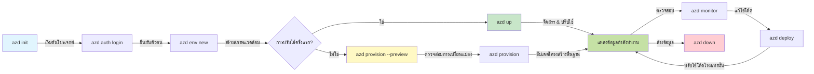
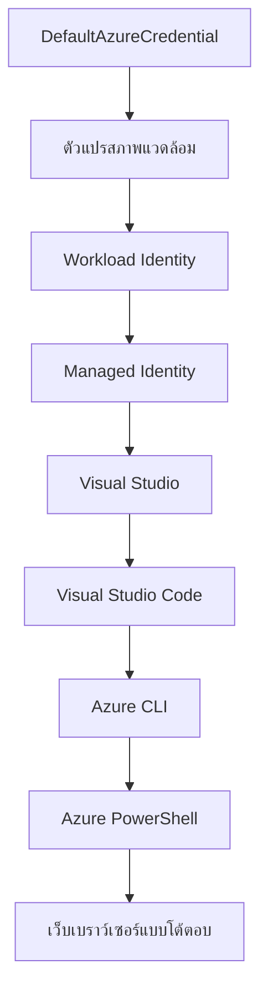

# AZD Basics - ความเข้าใจ Azure Developer CLI

# AZD Basics - แนวคิดหลักและพื้นฐาน

**การนำทางบทเรียน:**
- **📚 หน้าแรกของหลักสูตร**: [AZD For Beginners](../../README.md)
- **📖 บทเรียนปัจจุบัน**: บทที่ 1 - พื้นฐานและเริ่มต้นอย่างรวดเร็ว
- **⬅️ ก่อนหน้า**: [ภาพรวมหลักสูตร](../../README.md#-chapter-1-foundation--quick-start)
- **➡️ ถัดไป**: [การติดตั้งและตั้งค่า](installation.md)
- **🚀 บทถัดไป**: [บทที่ 2: การพัฒนาด้วย AI เป็นอันดับแรก](../chapter-02-ai-development/microsoft-foundry-integration.md)

## บทนำ

บทเรียนนี้จะแนะนำให้คุณรู้จักกับ Azure Developer CLI (azd) เครื่องมือบรรทัดคำสั่งที่ทรงพลังซึ่งช่วยเร่งการเดินทางของคุณจากการพัฒนาบนเครื่องท้องถิ่นไปสู่การปรับใช้บน Azure คุณจะได้เรียนรู้แนวคิดพื้นฐาน ฟีเจอร์หลัก และเข้าใจว่า azd ช่วยให้งานปรับใช้แอปพลิเคชันบนคลาวด์เนทีฟเป็นเรื่องง่ายขึ้นอย่างไร

## เป้าหมายการเรียนรู้

เมื่อจบบทเรียนนี้แล้ว คุณจะ:
- เข้าใจว่า Azure Developer CLI คืออะไรและมีจุดประสงค์หลักอย่างไร
- เรียนรู้แนวคิดหลักเกี่ยวกับเทมเพลต, สิ่งแวดล้อม และบริการ
- สำรวจฟีเจอร์สำคัญรวมถึงการพัฒนาที่ขับเคลื่อนด้วยเทมเพลตและ Infrastructure as Code
- เข้าใจโครงสร้างโปรเจกต์และเวิร์กโฟลว์ของ azd
- เตรียมพร้อมเพื่อติดตั้งและกำหนดค่า azd สำหรับสภาพแวดล้อมการพัฒนาของคุณ

## ผลลัพธ์การเรียนรู้

หลังจากทำบทเรียนนี้เสร็จ คุณจะสามารถ:
- อธิบายบทบาทของ azd ในเวิร์กโฟลว์การพัฒนาคลาวด์สมัยใหม่
- ระบุส่วนประกอบของโครงสร้างโปรเจกต์ azd ได้
- อธิบายการทำงานร่วมกันของเทมเพลต, สิ่งแวดล้อม และบริการ
- เข้าใจประโยชน์ของ Infrastructure as Code กับ azd
- รู้จักคำสั่งต่าง ๆ ของ azd และวัตถุประสงค์ของแต่ละคำสั่ง

## Azure Developer CLI (azd) คืออะไร?

Azure Developer CLI (azd) คือเครื่องมือบรรทัดคำสั่งที่ออกแบบมาเพื่อเร่งกระบวนการจากการพัฒนาบนเครื่องท้องถิ่นไปสู่การปรับใช้บน Azure มันช่วยทำให้งานสร้าง ปรับใช้ และจัดการแอปพลิเคชันคลาวด์เนทีฟบน Azure ง่ายขึ้น

### คุณสามารถปรับใช้อะไรได้บ้างด้วย azd?

azd รองรับภาระงานที่หลากหลาย และรายการนี้ก็มีการขยายอยู่เรื่อย ๆ วันนี้คุณสามารถใช้ azd ในการปรับใช้:

| ประเภทภาระงาน | ตัวอย่าง | เวิร์กโฟลว์เหมือนกัน? |
|---------------|----------|----------------|
| **แอปพลิเคชันแบบดั้งเดิม** | เว็บแอป, REST APIs, เว็บไซต์สแตติก | ✅ `azd up` |
| **บริการและไมโครเซอร์วิส** | Container Apps, Function Apps, แบ็คเอนด์ที่มีหลายบริการ | ✅ `azd up` |
| **แอปพลิเคชันที่ขับเคลื่อนด้วย AI** | แอปแชทที่ใช้ Microsoft Foundry Models, โซลูชัน RAG ด้วย AI Search | ✅ `azd up` |
| **เอเจนต์อัจฉริยะ** | เอเจนต์ที่โฮสต์โดย Foundry, การประสานงานเอเจนต์หลายตัว | ✅ `azd up` |

ประเด็นสำคัญคือ **วงจรชีวิตของ azd จะเหมือนกันไม่ว่าคุณจะปรับใช้อะไร** คุณจะเริ่มโปรเจกต์, จัดเตรียมโครงสร้างพื้นฐาน, ปรับใช้โค้ด, ติดตามแอปของคุณ และทำความสะอาด — ไม่ว่าจะเป็นเว็บไซต์ง่าย ๆ หรือเอเจนต์ AI ที่ซับซ้อน

ความต่อเนื่องนี้เป็นการออกแบบโดยเจตนา azd มองความสามารถด้าน AI เป็นบริการรูปแบบหนึ่งที่แอปของคุณสามารถใช้ได้ ไม่ได้มองเป็นสิ่งที่แตกต่างอย่างสิ้นเชิง จุดสิ้นสุดของแชทที่ขับเคลื่อนโดย Microsoft Foundry Models จากมุมมองของ azd คือบริการอีกตัวหนึ่งที่กำหนดค่าและปรับใช้ได้

### 🎯 ทำไมต้องใช้ AZD? การเปรียบเทียบในโลกจริง

เรามาเปรียบเทียบการปรับใช้เว็บแอปง่าย ๆ พร้อมฐานข้อมูล:

#### ❌ ไม่ใช้ AZD: ปรับใช้ Azure ด้วยตนเอง (30+ นาที)

```bash
# ขั้นตอนที่ 1: สร้างกลุ่มทรัพยากร
az group create --name myapp-rg --location eastus

# ขั้นตอนที่ 2: สร้างแผนบริการแอป
az appservice plan create --name myapp-plan \
  --resource-group myapp-rg \
  --sku B1 --is-linux

# ขั้นตอนที่ 3: สร้างเว็บแอป
az webapp create --name myapp-web-unique123 \
  --resource-group myapp-rg \
  --plan myapp-plan \
  --runtime "NODE:18-lts"

# ขั้นตอนที่ 4: สร้างบัญชี Cosmos DB (10-15 นาที)
az cosmosdb create --name myapp-cosmos-unique123 \
  --resource-group myapp-rg \
  --kind MongoDB

# ขั้นตอนที่ 5: สร้างฐานข้อมูล
az cosmosdb mongodb database create \
  --account-name myapp-cosmos-unique123 \
  --resource-group myapp-rg \
  --name tododb

# ขั้นตอนที่ 6: สร้างคอลเลกชัน
az cosmosdb mongodb collection create \
  --account-name myapp-cosmos-unique123 \
  --resource-group myapp-rg \
  --database-name tododb \
  --name todos

# ขั้นตอนที่ 7: รับสตริงการเชื่อมต่อ
CONN_STR=$(az cosmosdb keys list \
  --name myapp-cosmos-unique123 \
  --resource-group myapp-rg \
  --type connection-strings \
  --query "connectionStrings[0].connectionString" -o tsv)

# ขั้นตอนที่ 8: กำหนดค่าการตั้งค่าแอป
az webapp config appsettings set \
  --name myapp-web-unique123 \
  --resource-group myapp-rg \
  --settings MONGODB_URI="$CONN_STR"

# ขั้นตอนที่ 9: เปิดใช้งานการบันทึก
az webapp log config --name myapp-web-unique123 \
  --resource-group myapp-rg \
  --application-logging filesystem \
  --detailed-error-messages true

# ขั้นตอนที่ 10: ตั้งค่า Application Insights
az monitor app-insights component create \
  --app myapp-insights \
  --location eastus \
  --resource-group myapp-rg

# ขั้นตอนที่ 11: เชื่อมโยง App Insights กับเว็บแอป
INSTRUMENTATION_KEY=$(az monitor app-insights component show \
  --app myapp-insights \
  --resource-group myapp-rg \
  --query "instrumentationKey" -o tsv)

az webapp config appsettings set \
  --name myapp-web-unique123 \
  --resource-group myapp-rg \
  --settings APPINSIGHTS_INSTRUMENTATIONKEY="$INSTRUMENTATION_KEY"

# ขั้นตอนที่ 12: สร้างแอปพลิเคชันในเครื่อง
npm install
npm run build

# ขั้นตอนที่ 13: สร้างแพ็กเกจสำหรับการปรับใช้
zip -r app.zip . -x "*.git*" "node_modules/*"

# ขั้นตอนที่ 14: ปรับใช้แอปพลิเคชัน
az webapp deployment source config-zip \
  --resource-group myapp-rg \
  --name myapp-web-unique123 \
  --src app.zip

# ขั้นตอนที่ 15: รอและอธิษฐานให้มันทำงาน 🙏
# (ไม่มีการตรวจสอบอัตโนมัติ จำเป็นต้องทดสอบด้วยตนเอง)
```

**ปัญหา:**
- ❌ ต้องจำและรันคำสั่งกว่า 15 คำสั่งตามลำดับ
- ❌ ใช้เวลาทำงานด้วยตนเอง 30-45 นาที
- ❌ ง่ายต่อการเกิดข้อผิดพลาด (พิมพ์ผิด, พารามิเตอร์ผิด)
- ❌ สตริงการเชื่อมต่อเปิดเผยในประวัติเทอร์มินัล
- ❌ ไม่มีการย้อนกลับอัตโนมัติถ้ามีข้อผิดพลาด
- ❌ ยากที่จะทำซ้ำสำหรับสมาชิกทีม
- ❌ แตกต่างทุกครั้ง (ไม่สามารถทำซ้ำได้)

#### ✅ ใช้ AZD: ปรับใช้อัตโนมัติ (5 คำสั่ง, 10-15 นาที)

```bash
# ขั้นตอนที่ 1: เริ่มต้นจากแม่แบบ
azd init --template todo-nodejs-mongo

# ขั้นตอนที่ 2: ตรวจสอบสิทธิ์
azd auth login

# ขั้นตอนที่ 3: สร้างสภาพแวดล้อม
azd env new dev

# ขั้นตอนที่ 4: ดูตัวอย่างการเปลี่ยนแปลง (ไม่บังคับแต่แนะนำ)
azd provision --preview

# ขั้นตอนที่ 5: ปล่อยใช้งานทุกอย่าง
azd up

# ✨ เสร็จแล้ว! ทุกอย่างถูกปล่อยใช้งาน ตั้งค่า และตรวจสอบสถานะแล้ว
```

**ประโยชน์:**
- ✅ **5 คำสั่ง** เทียบกับขั้นตอนด้วยตนเองกว่า 15 ขั้นตอน
- ✅ ใช้เวลารวมเพียง **10-15 นาที** (ส่วนใหญ่รอ Azure)
- ✅ **ไม่มีข้อผิดพลาด** - อัตโนมัติและทดสอบแล้ว
- ✅ **การจัดการความลับอย่างปลอดภัย** ผ่าน Key Vault
- ✅ **ย้อนกลับอัตโนมัติ** เมื่อเกิดข้อผิดพลาด
- ✅ **ทำซ้ำได้เต็มรูปแบบ** - ผลลัพธ์เหมือนเดิมทุกครั้ง
- ✅ **พร้อมสำหรับทีม** - ใครก็สามารถปรับใช้ด้วยคำสั่งเดียวกัน
- ✅ **Infrastructure as Code** - เทมเพลต Bicep ควบคุมเวอร์ชัน
- ✅ **มอนิเตอร์ในตัว** - Application Insights ตั้งค่าอัตโนมัติ

### 📊 ลดเวลาและข้อผิดพลาด

| ตัวชี้วัด | ปรับใช้ด้วยมือ | ปรับใช้ด้วย AZD | การปรับปรุง |
|:-------|:------------------|:---------------|:------------|
| **คำสั่ง** | 15+ | 5 | ลดลง 67% |
| **เวลา** | 30-45 นาที | 10-15 นาที | เร็วขึ้น 60% |
| **อัตราข้อผิดพลาด** | ~40% | <5% | ลดลง 88% |
| **ความสม่ำเสมอ** | ต่ำ (ด้วยมือ) | 100% (อัตโนมัติ) | สมบูรณ์แบบ |
| **การเริ่มต้นทีม** | 2-4 ชั่วโมง | 30 นาที | เร็วขึ้น 75% |
| **เวลาในการย้อนกลับ** | 30+ นาที (ด้วยมือ) | 2 นาที (อัตโนมัติ) | เร็วขึ้น 93% |

## แนวคิดหลัก

### เทมเพลต
เทมเพลตเป็นรากฐานของ azd ซึ่งประกอบด้วย:
- **โค้ดแอปพลิเคชัน** - โค้ดต้นทางและการพึ่งพา
- **นิยามโครงสร้างพื้นฐาน** - แหล่งข้อมูล Azure กำหนดไว้ใน Bicep หรือ Terraform
- **ไฟล์กำหนดค่า** - การตั้งค่าและตัวแปรสิ่งแวดล้อม
- **สคริปต์ปรับใช้** - เวิร์กโฟลว์การปรับใช้แบบอัตโนมัติ

### สิ่งแวดล้อม
สิ่งแวดล้อมแทนเป้าหมายการปรับใช้ที่แตกต่างกัน:
- **Development** - สำหรับการทดสอบและพัฒนา  
- **Staging** - สิ่งแวดล้อมก่อนการผลิต  
- **Production** - สิ่งแวดล้อมการผลิตใช้งานจริง  

แต่ละสิ่งแวดล้อมจะเก็บ:
- กลุ่มทรัพยากร Azure ของตัวเอง
- การตั้งค่ากำหนดค่า
- สถานะการปรับใช้

### บริการ
บริการเป็นองค์ประกอบสร้างแอปของคุณ:
- **Frontend** - เว็บแอปพลิเคชัน, SPA
- **Backend** - API, ไมโครเซอร์วิส
- **ฐานข้อมูล** - โซลูชันจัดเก็บข้อมูล
- **Storage** - การจัดเก็บไฟล์และ blob

## ฟีเจอร์สำคัญ

### 1. การพัฒนาด้วยเทมเพลต
```bash
# เรียกดูแม่แบบที่มีอยู่
azd template list

# เริ่มต้นจากแม่แบบ
azd init --template <template-name>
```

### 2. Infrastructure as Code
- **Bicep** - ภาษาที่เฉพาะสำหรับ Azure
- **Terraform** - เครื่องมือโครงสร้างพื้นฐานแบบมัลติคลาวด์
- **ARM Templates** - เทมเพลตผู้จัดการทรัพยากร Azure

### 3. เวิร์กโฟลว์แบบบูรณาการ
```bash
# กระบวนการทำงานการปรับใช้สมบูรณ์
azd up            # จัดเตรียม + ปรับใช้ นี่คือการตั้งค่าแบบไม่ต้องใช้มือสำหรับครั้งแรก

# 🧪 ใหม่: ดูตัวอย่างการเปลี่ยนแปลงโครงสร้างพื้นฐานก่อนการปรับใช้ (ปลอดภัย)
azd provision --preview    # จำลองการปรับใช้โครงสร้างพื้นฐานโดยไม่ทำการเปลี่ยนแปลง

azd provision     # สร้างทรัพยากร Azure หากคุณอัปเดตโครงสร้างพื้นฐาน ใช้นี่
azd deploy        # ปรับใช้โค้ดแอปพลิเคชันหรือปรับใช้โค้ดแอปพลิเคชันอีกครั้งเมื่อต้องการอัปเดต
azd down          # ล้างทรัพยากรให้สะอาด
```

#### 🛡️ การวางแผนโครงสร้างพื้นฐานอย่างปลอดภัยด้วย Preview
คำสั่ง `azd provision --preview` คือเกมเชนเจอร์สำหรับการปรับใช้อย่างปลอดภัย:
- **วิเคราะห์แบบ Dry-run** - แสดงสิ่งที่จะถูกสร้าง, แก้ไข หรือถูกลบ
- **ความเสี่ยงเป็นศูนย์** - ไม่มีการเปลี่ยนแปลงจริงในสภาพแวดล้อม Azure ของคุณ
- **การทำงานร่วมกันในทีม** - แชร์ผลลัพธ์พรีวิวก่อนปรับใช้
- **ประเมินค่าใช้จ่าย** - เข้าใจต้นทุนทรัพยากรก่อนผูกมัด

```bash
# ตัวอย่างกระบวนงานแสดงตัวอย่าง
azd provision --preview           # ดูสิ่งที่จะเปลี่ยนแปลง
# ทบทวนผลลัพธ์, หารือกับทีม
azd provision                     # นำการเปลี่ยนแปลงไปใช้ด้วยความมั่นใจ
```

### 📊 ภาพ: เวิร์กโฟลว์การพัฒนา AZD


**คำอธิบายเวิร์กโฟลว์:**
1. **Init** - เริ่มต้นด้วยเทมเพลตหรือโปรเจกต์ใหม่
2. **Auth** - ตรวจสอบสิทธิ์กับ Azure
3. **Environment** - สร้างสิ่งแวดล้อมปรับใช้แยกกัน
4. **Preview** - 🆕 เรียกดูการเปลี่ยนแปลงโครงสร้างพื้นฐานก่อนเสมอ (แนวปฏิบัติที่ปลอดภัย)
5. **Provision** - สร้าง/อัปเดตทรัพยากร Azure
6. **Deploy** - ส่งโค้ดแอปพลิเคชันของคุณ
7. **Monitor** - ติดตามประสิทธิภาพแอป
8. **Iterate** - ปรับเปลี่ยนและปรับใช้โค้ดใหม่
9. **Cleanup** - ลบทรัพยากรเมื่อเสร็จ

### 4. การจัดการสิ่งแวดล้อม
```bash
# สร้างและจัดการสภาพแวดล้อม
azd env new <environment-name>
azd env select <environment-name>
azd env list
```

### 5. ส่วนขยายและคำสั่ง AI

azd ใช้ระบบส่วนขยายเพื่อเพิ่มความสามารถนอกเหนือจาก CLI หลัก ซึ่งมีประโยชน์โดยเฉพาะสำหรับภาระงาน AI:

```bash
# แสดงรายการส่วนขยายที่มี
azd extension list

# ติดตั้งส่วนขยายตัวแทน Foundry
azd extension install azure.ai.agents

# เริ่มต้นโครงการตัวแทน AI จากไฟล์ manifest
azd ai agent init -m agent-manifest.yaml

# เริ่มเซิร์ฟเวอร์ MCP สำหรับการพัฒนาด้วยความช่วยเหลือของ AI (รุ่น Alpha)
azd mcp start
```

> ส่วนขยายจะถูกอธิบายโดยละเอียดใน [บทที่ 2: การพัฒนาด้วย AI เป็นอันดับแรก](../chapter-02-ai-development/agents.md) และเอกสารอ้างอิง [AZD AI CLI Commands](../chapter-08-production/production-ai-practices.md#azd-ai-cli-commands-and-extensions)

## 📁 โครงสร้างโปรเจกต์

โครงสร้างโปรเจกต์ azd ทั่วไป:
```
my-app/
├── .azd/                    # azd configuration
│   └── config.json
├── .azure/                  # Azure deployment artifacts
├── .devcontainer/          # Development container config
├── .github/workflows/      # GitHub Actions
├── .vscode/               # VS Code settings
├── infra/                 # Infrastructure code
│   ├── main.bicep        # Main infrastructure template
│   ├── main.parameters.json
│   └── modules/          # Reusable modules
├── src/                  # Application source code
│   ├── api/             # Backend services
│   └── web/             # Frontend application
├── azure.yaml           # azd project configuration
└── README.md
```

## 🔧 ไฟล์กำหนดค่า

### azure.yaml
ไฟล์กำหนดค่าโปรเจกต์หลัก:
```yaml
name: my-awesome-app
metadata:
  template: my-template@1.0.0

services:
  web:
    project: ./src/web
    language: js
    host: appservice
  api:
    project: ./src/api
    language: js
    host: appservice

hooks:
  preprovision:
    shell: pwsh
    run: echo "Preparing to provision..."
```

### .azure/config.json
การตั้งค่าสิ่งแวดล้อมเฉพาะ:
```json
{
  "version": 1,
  "defaultEnvironment": "dev",
  "environments": {
    "dev": {
      "subscriptionId": "your-subscription-id",
      "location": "eastus"
    }
  }
}
```

## 🎪 เวิร์กโฟลว์ทั่วไปพร้อมแบบฝึกหัดปฏิบัติ

> **💡 เคล็ดลับการเรียนรู้:** ทำแบบฝึกหัดตามลำดับเพื่อพัฒนาทักษะ AZD อย่างต่อเนื่อง

### 🎯 แบบฝึกหัด 1: เริ่มต้นโปรเจกต์แรกของคุณ

**เป้าหมาย:** สร้างโปรเจกต์ AZD และสำรวจโครงสร้าง

**ขั้นตอน:**
```bash
# ใช้เทมเพลตที่ผ่านการพิสูจน์แล้ว
azd init --template todo-nodejs-mongo

# สำรวจไฟล์ที่สร้างขึ้น
ls -la  # ดูไฟล์ทั้งหมดรวมถึงไฟล์ที่ซ่อนอยู่

# ไฟล์สำคัญที่สร้างขึ้น:
# - azure.yaml (การตั้งค่าหลัก)
# - infra/ (โค้ดโครงสร้างพื้นฐาน)
# - src/ (โค้ดแอปพลิเคชัน)
```

**✅ สำเร็จ:** คุณมี azure.yaml, โฟลเดอร์ infra/ และ src/

---

### 🎯 แบบฝึกหัด 2: ปรับใช้ไปยัง Azure

**เป้าหมาย:** ทำการปรับใช้แบบครบวงจร

**ขั้นตอน:**
```bash
# 1. ตรวจสอบสิทธิ์
az login && azd auth login

# 2. สร้างสภาพแวดล้อม
azd env new dev
azd env set AZURE_LOCATION eastus

# 3. ดูตัวอย่างการเปลี่ยนแปลง (แนะนำ)
azd provision --preview

# 4. ดีพลอยทุกอย่าง
azd up

# 5. ยืนยันการดีพลอย
azd show    # ดู URL แอปของคุณ
```

**เวลาคาดหวัง:** 10-15 นาที  
**✅ สำเร็จ:** URL แอปพลิเคชันเปิดบนเบราว์เซอร์

---

### 🎯 แบบฝึกหัด 3: สิ่งแวดล้อมหลายชุด

**เป้าหมาย:** ปรับใช้ไปยัง dev และ staging

**ขั้นตอน:**
```bash
# มี dev แล้ว สร้าง staging
azd env new staging
azd env set AZURE_LOCATION westus2
azd up

# สลับระหว่างกัน
azd env list
azd env select dev
```

**✅ สำเร็จ:** มีสองกลุ่มทรัพยากรแยกบน Azure Portal

---

### 🛡️ ทำความสะอาดแบบเต็ม: `azd down --force --purge`

เมื่อคุณต้องการรีเซ็ตโปรเจกต์อย่างสมบูรณ์:

```bash
azd down --force --purge
```

**สิ่งที่ทำ:**
- `--force`: ไม่มีการถามยืนยัน
- `--purge`: ลบสถานะท้องถิ่นและทรัพยากร Azure ทั้งหมด

**ใช้เมื่อ:**
- การปรับใช้ล้มเหลวกึ่งกลางทาง
- เปลี่ยนโปรเจกต์
- ต้องการเริ่มใหม่ตั้งแต่ต้น

---

## 🎪 การอ้างอิงเวิร์กโฟลว์เดิม

### การเริ่มโปรเจกต์ใหม่
```bash
# วิธีที่ 1: ใช้แม่แบบที่มีอยู่
azd init --template todo-nodejs-mongo

# วิธีที่ 2: เริ่มจากศูนย์
azd init

# วิธีที่ 3: ใช้ไดเรกทอรีปัจจุบัน
azd init .
```

### วงจรการพัฒนา
```bash
# ตั้งค่าสภาพแวดล้อมการพัฒนา
azd auth login
azd env new dev
azd env select dev

# นำส่งทุกอย่าง
azd up

# ทำการเปลี่ยนแปลงและนำส่งใหม่
azd deploy

# ล้างเมื่องานเสร็จ
azd down --force --purge # คำสั่งใน Azure Developer CLI เป็นการ **รีเซ็ตอย่างหนัก** สำหรับสภาพแวดล้อมของคุณ—มีประโยชน์โดยเฉพาะเมื่อคุณกำลังแก้ไขปัญหาการนำส่งที่ล้มเหลว ล้างทรัพยากรที่ถูกทอดทิ้ง หรือเตรียมพร้อมสำหรับการนำส่งใหม่แบบสด ๆ
```

## ความเข้าใจคำสั่ง `azd down --force --purge`
คำสั่ง `azd down --force --purge` เป็นวิธีที่ทรงพลังสำหรับลบสภาพแวดล้อม azd และทรัพยากรที่เกี่ยวข้องทั้งหมด นี่คือสิ่งที่แต่ละฟลักทำ:
```
--force
```
- ข้ามการถามยืนยัน
- มีประโยชน์สำหรับงานอัตโนมัติหรือสคริปต์ที่ไม่สามารถตอบโต้ด้วยมือได้
- ทำให้การลบดำเนินต่อโดยไม่ขัดจังหวะ แม้ CLI จะตรวจพบความไม่สอดคล้อง

```
--purge
```
ลบ **ข้อมูลเมตาทั้งหมดที่เกี่ยวข้อง** รวมถึง:
สถานะสิ่งแวดล้อม
โฟลเดอร์ท้องถิ่น `.azure`
ข้อมูลการปรับใช้ที่เก็บไว้
ป้องกันไม่ให้ azd "จำ" การปรับใช้ก่อนหน้า ซึ่งอาจทำให้เกิดปัญหาเช่นกลุ่มทรัพยากรไม่ตรงกันหรืออ้างอิงรีจิสทรีเก่า

### ทำไมต้องใช้ทั้งคู่?
เมื่อคุณเจอปัญหากับ `azd up` เนื่องจากสถานะตกค้างหรือติดตั้งไม่สมบูรณ์ คำสั่งนี้ช่วยให้คุณได้ **รีเซ็ตสภาพแวดล้อมอย่างสะอาดหมดจด**

มีประโยชน์เป็นพิเศษหลังจากลบทรัพยากรด้วยตนเองในพอร์ทัล Azure หรือเมื่อเปลี่ยนเทมเพลต, สิ่งแวดล้อม หรือการตั้งชื่อกลุ่มทรัพยากร

### การจัดการสิ่งแวดล้อมหลายชุด
```bash
# สร้างสภาพแวดล้อมสำหรับการทดสอบ
azd env new staging
azd env select staging
azd up

# สลับกลับไปที่การพัฒนา
azd env select dev

# เปรียบเทียบสภาพแวดล้อม
azd env list
```

## 🔐 การตรวจสอบสิทธิ์และข้อมูลรับรอง

การเข้าใจการตรวจสอบสิทธิ์เป็นกุญแจสำคัญในการปรับใช้ azd สำเร็จ Azure ใช้วิธีการตรวจสอบสิทธิ์หลายแบบ และ azd ใช้โซ่ของข้อมูลรับรองเดียวกับที่เครื่องมือ Azure อื่น ๆ ใช้

### การตรวจสอบสิทธิ์ด้วย Azure CLI (`az login`)

ก่อนใช้ azd คุณต้องตรวจสอบสิทธิ์กับ Azure วิธีที่พบบ่อยที่สุดคือใช้ Azure CLI:

```bash
# เข้าสู่ระบบแบบโต้ตอบ (เปิดเบราว์เซอร์)
az login

# เข้าสู่ระบบด้วยผู้เช่าเฉพาะ
az login --tenant <tenant-id>

# เข้าสู่ระบบด้วย service principal
az login --service-principal -u <app-id> -p <password> --tenant <tenant-id>

# ตรวจสอบสถานะการเข้าสู่ระบบปัจจุบัน
az account show

# แสดงรายการการสมัครใช้งานที่มีอยู่
az account list --output table

# ตั้งค่าการสมัครใช้งานเริ่มต้น
az account set --subscription <subscription-id>
```

### กระบวนการตรวจสอบสิทธิ์
1. **เข้าสู่ระบบแบบโต้ตอบ**: เปิดเบราว์เซอร์เริ่มต้นของคุณสำหรับตรวจสอบสิทธิ์
2. **Device Code Flow**: สำหรับสภาพแวดล้อมที่ไม่มีเบราว์เซอร์
3. **Service Principal**: สำหรับงานอัตโนมัติและสถานการณ์ CI/CD
4. **Managed Identity**: สำหรับแอปที่โฮสต์ใน Azure

### โซ่ข้อมูลรับรอง DefaultAzureCredential

`DefaultAzureCredential` คือประเภทข้อมูลรับรองที่ให้ประสบการณ์การตรวจสอบสิทธิ์ที่ง่ายขึ้นโดยพยายามใช้แหล่งข้อมูลรับรองหลายแห่งตามลำดับนี้โดยอัตโนมัติ:

#### ลำดับการตรวจสอบสิทธิ์

#### 1. ตัวแปรสิ่งแวดล้อม
```bash
# ตั้งค่าตัวแปรสภาพแวดล้อมสำหรับ service principal
export AZURE_CLIENT_ID="<app-id>"
export AZURE_CLIENT_SECRET="<password>"
export AZURE_TENANT_ID="<tenant-id>"
```

#### 2. Workload Identity (Kubernetes/GitHub Actions)
ใช้โดยอัตโนมัติใน:
- Azure Kubernetes Service (AKS) กับ Workload Identity
- GitHub Actions กับ OIDC federation
- กรณีการใช้งานระบบยืนยันตัวตนแบบแฟเดอเรชันอื่น ๆ

#### 3. Managed Identity
สำหรับทรัพยากร Azure เช่น:
- Virtual Machines
- App Service
- Azure Functions
- Container Instances

```bash
# ตรวจสอบว่ารันบนทรัพยากร Azure ที่มี managed identity หรือไม่
az account show --query "user.type" --output tsv
# คืนค่า: "servicePrincipal" หากใช้ managed identity
```

#### 4. การผนวกเครื่องมือสำหรับนักพัฒนา
- **Visual Studio**: ใช้บัญชีที่ลงชื่อเข้าใช้อัตโนมัติ
- **VS Code**: ใช้ข้อมูลรับรองส่วนขยาย Azure Account
- **Azure CLI**: ใช้ข้อมูลรับรองจาก `az login` (พบมากที่สุดสำหรับการพัฒนาท้องถิ่น)

### การตั้งค่าการตรวจสอบสิทธิ์ AZD

```bash
# วิธีที่ 1: ใช้ Azure CLI (แนะนำสำหรับการพัฒนา)
az login
azd auth login  # ใช้ข้อมูลประจำตัว Azure CLI ที่มีอยู่

# วิธีที่ 2: การยืนยันตัวตน azd โดยตรง
azd auth login --use-device-code  # สำหรับสภาพแวดล้อมที่ไม่มีส่วนติดต่อผู้ใช้

# วิธีที่ 3: ตรวจสอบสถานะการยืนยันตัวตน
azd auth login --check-status

# วิธีที่ 4: ออกจากระบบและเข้าสู่ระบบใหม่
azd auth logout
azd auth login
```

### แนวปฏิบัติที่ดีที่สุดสำหรับการตรวจสอบสิทธิ์

#### สำหรับการพัฒนาท้องถิ่น
```bash
# 1. เข้าสู่ระบบด้วย Azure CLI
az login

# 2. ตรวจสอบการสมัครสมาชิกที่ถูกต้อง
az account show
az account set --subscription "Your Subscription Name"

# 3. ใช้ azd กับข้อมูลรับรองที่มีอยู่
azd auth login
```

#### สำหรับ CI/CD Pipeline
```yaml
# GitHub Actions example
- name: Azure Login
  uses: azure/login@v1
  with:
    creds: ${{ secrets.AZURE_CREDENTIALS }}

- name: Deploy with azd
  run: |
    azd auth login --client-id ${{ secrets.AZURE_CLIENT_ID }} \
                    --client-secret ${{ secrets.AZURE_CLIENT_SECRET }} \
                    --tenant-id ${{ secrets.AZURE_TENANT_ID }}
    azd up --no-prompt
```

#### สำหรับสิ่งแวดล้อมการผลิต
- ใช้ **Managed Identity** เมื่อใช้งานบนทรัพยากร Azure
- ใช้ **Service Principal** สำหรับงานอัตโนมัติ
- หลีกเลี่ยงการเก็บข้อมูลรับรองในโค้ดหรือไฟล์กำหนดค่า
- ใช้ **Azure Key Vault** สำหรับการตั้งค่าที่ละเอียดอ่อน

### ปัญหาที่พบบ่อยในการตรวจสอบสิทธิ์และวิธีแก้ไข

#### ปัญหา: "ไม่พบการสมัครใช้งาน"
```bash
# วิธีแก้ไข: ตั้งค่าการสมัครสมาชิกเริ่มต้น
az account list --output table
az account set --subscription "<subscription-id>"
azd env set AZURE_SUBSCRIPTION_ID "<subscription-id>"
```

#### ปัญหา: "สิทธิ์ไม่เพียงพอ"
```bash
# โซลูชัน: ตรวจสอบและกำหนดบทบาทที่จำเป็น
az role assignment list --assignee $(az account show --query user.name --output tsv)

# บทบาทที่จำเป็นทั่วไป:
# - ผู้ร่วมให้ข้อมูล (สำหรับการจัดการทรัพยากร)
# - ผู้ดูแลการเข้าถึงผู้ใช้ (สำหรับการกำหนดบทบาท)
```

#### ปัญหา: "โทเคนหมดอายุ"
```bash
# วิธีแก้ไข: ยืนยันตัวตนอีกครั้ง
az logout
az login
azd auth logout
azd auth login
```

### การตรวจสอบสิทธิ์ในสถานการณ์ต่าง ๆ

#### การพัฒนาท้องถิ่น
```bash
# บัญชีพัฒนาตนเอง
az login
azd auth login
```

#### การพัฒนาร่วมทีม
```bash
# ใช้ผู้เช่าเฉพาะสำหรับองค์กร
az login --tenant contoso.onmicrosoft.com
azd auth login
```

#### สถานการณ์มัลติเทนานท์
```bash
# สลับระหว่างผู้เช่า
az login --tenant tenant1.onmicrosoft.com
# ปล่อยใช้งานไปยังผู้เช่า 1
azd up

az login --tenant tenant2.onmicrosoft.com  
# ปล่อยใช้งานไปยังผู้เช่า 2
azd up
```

### การพิจารณาด้านความปลอดภัย
1. **การจัดเก็บข้อมูลรับรอง**: ห้ามจัดเก็บข้อมูลรับรองในซอร์สโค้ด
2. **การจำกัดขอบเขต**: ใช้หลักการสิทธิ์น้อยที่สุดสำหรับ service principals
3. **การหมุนเวียนโทเค็น**: หมุนเวียนความลับของ service principal อย่างสม่ำเสมอ
4. **การตรวจสอบย้อนหลัง**: ตรวจสอบกิจกรรมการตรวจสอบสิทธิ์และการปรับใช้
5. **ความปลอดภัยเครือข่าย**: ใช้ private endpoints เมื่อเป็นไปได้

### การแก้ไขปัญหาการตรวจสอบสิทธิ์

```bash
# แก้ไขปัญหาการตรวจสอบสิทธิ์
azd auth login --check-status
az account show
az account get-access-token

# คำสั่งวินิจฉัยทั่วไป
whoami                          # บริบทผู้ใช้ปัจจุบัน
az ad signed-in-user show      # รายละเอียดผู้ใช้ Azure AD
az group list                  # ทดสอบการเข้าถึงทรัพยากร
```

## ทำความเข้าใจ `azd down --force --purge`

### การค้นพบ
```bash
azd template list              # เรียกดูแม่แบบ
azd template show <template>   # รายละเอียดแม่แบบ
azd init --help               # ตัวเลือกการเริ่มต้นใช้งาน
```

### การจัดการโครงการ
```bash
azd show                     # ภาพรวมโครงการ
azd env show                 # สภาพแวดล้อมปัจจุบัน
azd config list             # การตั้งค่าคอนฟิกูเรชัน
```

### การตรวจสอบ
```bash
azd monitor                  # เปิดการตรวจสอบพอร์ทัล Azure
azd monitor --logs           # ดูบันทึกแอปพลิเคชัน
azd monitor --live           # ดูเมตริกสด
azd pipeline config          # ตั้งค่า CI/CD
```

## แนวทางปฏิบัติที่ดีที่สุด

### 1. ใช้ชื่อที่มีความหมาย
```bash
# ดี
azd env new production-east
azd init --template web-app-secure

# หลีกเลี่ยง
azd env new env1
azd init --template template1
```

### 2. ใช้เทมเพลต
- เริ่มต้นด้วยเทมเพลตที่มีอยู่
- ปรับแต่งตามความต้องการของคุณ
- สร้างเทมเพลตที่ใช้ซ้ำได้สำหรับองค์กรของคุณ

### 3. การแยกสภาพแวดล้อม
- ใช้สภาพแวดล้อมแยกสำหรับ dev/staging/prod
- ห้ามปรับใช้ตรงไปยัง production จากเครื่องท้องถิ่น
- ใช้ CI/CD pipeline สำหรับการปรับใช้ production

### 4. การจัดการการตั้งค่า
- ใช้ environment variables สำหรับข้อมูลที่ละเอียดอ่อน
- เก็บการตั้งค่าไว้ในระบบควบคุมเวอร์ชัน
- บันทึกการตั้งค่าที่เฉพาะเจาะจงตามสภาพแวดล้อม

## ขั้นตอนการเรียนรู้

### ผู้เริ่มต้น (สัปดาห์ที่ 1-2)
1. ติดตั้ง azd และยืนยันตัวตน
2. ปรับใช้เทมเพลตง่ายๆ
3. เข้าใจโครงสร้างโปรเจกต์
4. เรียนรู้คำสั่งพื้นฐาน (up, down, deploy)

### ระดับกลาง (สัปดาห์ที่ 3-4)
1. ปรับแต่งเทมเพลต
2. จัดการหลายสภาพแวดล้อม
3. เข้าใจโค้ดโครงสร้างพื้นฐาน
4. ตั้งค่า CI/CD pipeline

### ขั้นสูง (สัปดาห์ที่ 5+)
1. สร้างเทมเพลตเอง
2. รูปแบบโครงสร้างพื้นฐานขั้นสูง
3. การปรับใช้หลายภูมิภาค
4. การตั้งค่าระดับองค์กร

## ขั้นตอนถัดไป

**📖 เรียนรู้บทที่ 1 ต่อ:**
- [การติดตั้ง & การตั้งค่า](installation.md) - ติดตั้งและตั้งค่า azd
- [โปรเจกต์แรกของคุณ](first-project.md) - ทำแบบฝึกหัดปฏิบัติ
- [คู่มือการตั้งค่า](configuration.md) - ตัวเลือกการตั้งค่าขั้นสูง

**🎯 พร้อมสำหรับบทต่อไปหรือยัง?**
- [บทที่ 2: การพัฒนา AI-First](../chapter-02-ai-development/microsoft-foundry-integration.md) - เริ่มสร้างแอป AI

## แหล่งข้อมูลเพิ่มเติม

- [ภาพรวม Azure Developer CLI](https://learn.microsoft.com/en-us/azure/developer/azure-developer-cli/)
- [แกลเลอรีเทมเพลต](https://azure.github.io/awesome-azd/)
- [ตัวอย่างจากชุมชน](https://github.com/Azure-Samples)

---

## 🙋 คำถามที่พบบ่อย

### คำถามทั่วไป

**ถาม: AZD กับ Azure CLI แตกต่างกันอย่างไร?**

ตอบ: Azure CLI (`az`) ใช้จัดการทรัพยากร Azure ทีละรายการ ส่วน AZD (`azd`) ใช้จัดการแอปพลิเคชันทั้งหมด:

```bash
# Azure CLI - การจัดการทรัพยากรระดับต่ำ
az webapp create --name myapp --resource-group rg
az sql server create --name myserver --resource-group rg
# ...ต้องการคำสั่งอีกมากมาย

# AZD - การจัดการระดับแอปพลิเคชัน
azd up  # ติดตั้งแอปทั้งหมดพร้อมทรัพยากรทั้งหมด
```

**คิดแบบนี้:**
- `az` = ใช้กับตัวบล็อกเลโก้ทีละชิ้น
- `azd` = ทำงานกับชุดเลโก้ทั้งหมด

---

**ถาม: ต้องรู้ Bicep หรือ Terraform เพื่อใช้ AZD ไหม?**

ตอบ: ไม่ต้อง! เริ่มด้วยเทมเพลตก่อน:
```bash
# ใช้เทมเพลตที่มีอยู่ - ไม่จำเป็นต้องมีความรู้ IaC
azd init --template todo-nodejs-mongo
azd up
```

คุณสามารถเรียนรู้ Bicep เพิ่มเติมเพื่อปรับแต่งโครงสร้างพื้นฐาน เทมเพลตมีตัวอย่างใช้งานจริงให้เรียนรู้

---

**ถาม: ค่าใช้จ่ายในการรันเทมเพลต AZD เท่าไหร่?**

ตอบ: ค่าใช้จ่ายขึ้นอยู่กับเทมเพลต ส่วนใหญ่เทมเพลตพัฒนามีค่าใช้จ่าย 50-150 ดอลลาร์ต่อเดือน:

```bash
# ดูตัวอย่างค่าใช้จ่ายก่อนการปรับใช้
azd provision --preview

# ทำความสะอาดเสมอเมื่อไม่ใช้งาน
azd down --force --purge  # ลบทรัพยากรทั้งหมด
```

**เคล็ดลับ:** ใช้ระดับฟรีเมื่อมี:
- App Service: ระดับ F1 (ฟรี)
- Microsoft Foundry Models: Azure OpenAI 50,000 โทเค็นต่อเดือนฟรี
- Cosmos DB: ระดับฟรี 1000 RU/s

---

**ถาม: ใช้ AZD กับทรัพยากร Azure ที่มีอยู่แล้วได้ไหม?**

ตอบ: ได้ แต่เริ่มใหม่ง่ายกว่า AZD ทำงานดีที่สุดเมื่อจัดการวงจรชีวิตเต็ม สำหรับทรัพยากรเดิม:

```bash
# ตัวเลือก 1: นำเข้าทรัพยากรที่มีอยู่ (ขั้นสูง)
azd init
# จากนั้นแก้ไข infra/ เพื่ออ้างอิงทรัพยากรที่มีอยู่

# ตัวเลือก 2: เริ่มต้นใหม่ (แนะนำ)
azd init --template matching-your-stack
azd up  # สร้างสภาพแวดล้อมใหม่
```

---

**ถาม: แชร์โปรเจกต์กับเพื่อนร่วมงานอย่างไร?**

ตอบ: ให้ commit โปรเจกต์ AZD ลง Git (ยกเว้นโฟลเดอร์ .azure):

```bash
# มีอยู่ใน .gitignore โดยค่าเริ่มต้นแล้ว
.azure/        # มีข้อมูลลับและข้อมูลสภาพแวดล้อม
*.env          # ตัวแปรสภาพแวดล้อม

# สมาชิกทีมจากนั้น:
git clone <your-repo>
azd auth login
azd env new <their-name>-dev
azd up
```

ทุกคนจะได้โครงสร้างพื้นฐานเหมือนกันจากเทมเพลตเดียวกัน

---

### คำถามแก้ไขปัญหา

**ถาม: "azd up" ล้มเหลวกลางทาง ทำยังไงดี?**

ตอบ: ตรวจสอบข้อผิดพลาด แก้ไข แล้วลองใหม่:

```bash
# ดูบันทึกรายละเอียด
azd show

# การแก้ไขทั่วไป:

# 1. หากเกินโควต้า:
azd env set AZURE_LOCATION "westus2"  # ลองภูมิภาคอื่น

# 2. หากชื่อทรัพยากรซ้ำ:
azd down --force --purge  # เริ่มต้นใหม่
azd up  # ลองใหม่อีกครั้ง

# 3. หากการพิสูจน์ตัวตนหมดอายุ:
az login
azd auth login
azd up
```

**ปัญหาที่พบบ่อย:** เลือก Azure subscription ผิด
```bash
az account list --output table
az account set --subscription "<correct-subscription>"
```

---

**ถาม: จะปรับใช้แค่โค้ดโดยไม่ต้อง reprovision ได้ไหม?**

ตอบ: ใช้ `azd deploy` แทน `azd up`:

```bash
azd up          # ครั้งแรก: จัดเตรียม + ติดตั้ง (ช้า)

# ทำการเปลี่ยนแปลงโค้ด...

azd deploy      # ครั้งถัดไป: ติดตั้งอย่างเดียว (เร็ว)
```

เปรียบเทียบความเร็ว:
- `azd up`: 10-15 นาที (จัดเตรียมโครงสร้างพื้นฐาน)
- `azd deploy`: 2-5 นาที (โค้ดเท่านั้น)

---

**ถาม: ปรับแต่งเทมเพลตโครงสร้างพื้นฐานได้ไหม?**

ตอบ: ได้! แก้ไขไฟล์ Bicep ในโฟลเดอร์ `infra/`:

```bash
# หลังจาก azd init
cd infra/
code main.bicep  # แก้ไขใน VS Code

# ดูตัวอย่างการเปลี่ยนแปลง
azd provision --preview

# นำการเปลี่ยนแปลงไปใช้
azd provision
```

**เคล็ดลับ:** เริ่มจากเล็ก ๆ - เปลี่ยน SKU ก่อน:
```bicep
// infra/main.bicep
sku: {
  name: 'B1'  // Change to 'P1V2' for production
}
```

---

**ถาม: จะลบทุกอย่างที่ AZD สร้างได้อย่างไร?**

ตอบ: คำสั่งเดียวลบทรัพยากรทั้งหมด:

```bash
azd down --force --purge

# นี่จะลบ:
# - ทรัพยากร Azure ทั้งหมด
# - กลุ่มทรัพยากร
# - สถานะสภาพแวดล้อมภายในเครื่อง
# - ข้อมูลการปรับใช้ที่เก็บไว้ในแคช
```

**ควรใช้คำสั่งนี้เมื่อ:**
- ทดสอบเทมเพลตเสร็จ
- เปลี่ยนโปรเจกต์
- ต้องการเริ่มใหม่

**ประหยัดค่าใช้จ่าย:** ลบทรัพยากรที่ไม่ได้ใช้ = ไม่มีค่าใช้จ่าย

---

**ถาม: ลบทรัพยากรใน Azure Portal โดยไม่ตั้งใจ ทำอย่างไร?**

ตอบ: สถานะ AZD อาจไม่ตรงกัน ใช้วิธีเริ่มใหม่ทั้งหมด:

```bash
# 1. ลบสถานะภายในเครื่อง
azd down --force --purge

# 2. เริ่มต้นใหม่
azd up

# ทางเลือก: ให้ AZD ตรวจจับและแก้ไข
azd provision  # จะสร้างทรัพยากรที่ขาดหายไป
```

---

### คำถามขั้นสูง

**ถาม: ใช้ AZD ใน CI/CD pipeline ได้ไหม?**

ตอบ: ได้! ตัวอย่าง GitHub Actions:

```yaml
# .github/workflows/deploy.yml
name: Deploy with AZD

on:
  push:
    branches: [main]

jobs:
  deploy:
    runs-on: ubuntu-latest
    steps:
      - uses: actions/checkout@v2
      
      - name: Install azd
        run: curl -fsSL https://aka.ms/install-azd.sh | bash
      
      - name: Azure Login
        run: |
          azd auth login \
            --client-id ${{ secrets.AZURE_CLIENT_ID }} \
            --client-secret ${{ secrets.AZURE_CLIENT_SECRET }} \
            --tenant-id ${{ secrets.AZURE_TENANT_ID }}
      
      - name: Deploy
        run: azd up --no-prompt
```

---

**ถาม: จัดการความลับและข้อมูลสำคัญอย่างไร?**

ตอบ: AZD เชื่อมต่อกับ Azure Key Vault อัตโนมัติ:

```bash
# ความลับถูกเก็บไว้ใน Key Vault ไม่ใช่ในโค้ด
azd env set DATABASE_PASSWORD "$(openssl rand -base64 32)"

# AZD ทำงานโดยอัตโนมัติ:
# 1. สร้าง Key Vault
# 2. เก็บความลับ
# 3. ให้สิทธิ์แอปเข้าถึงผ่าน Managed Identity
# 4. ฉีดเข้าในขณะรันไทม์
```

**ห้าม commit:**
- โฟลเดอร์ `.azure/` (ข้อมูลสภาพแวดล้อม)
- ไฟล์ `.env` (ความลับท้องถิ่น)
- สตริงการเชื่อมต่อ

---

**ถาม: ปรับใช้หลายภูมิภาคได้ไหม?**

ตอบ: ได้ สร้างสภาพแวดล้อมแยกตามภูมิภาค:

```bash
# สภาพแวดล้อมตะวันออกของสหรัฐอเมริกา
azd env new prod-eastus
azd env set AZURE_LOCATION eastus
azd up

# สภาพแวดล้อมตะวันตกของยุโรป
azd env new prod-westeurope
azd env set AZURE_LOCATION westeurope
azd up

# แต่ละสภาพแวดล้อมเป็นอิสระจากกัน
azd env list
```

สำหรับแอปหลายภูมิภาคจริง ๆ ปรับเทมเพลต Bicep เพื่อปรับใช้พร้อมกันในหลายภูมิภาค

---

**ถาม: ขอความช่วยเหลือได้ที่ไหนหากติดปัญหา?**

1. **เอกสาร AZD:** https://learn.microsoft.com/azure/developer/azure-developer-cli/
2. **GitHub Issues:** https://github.com/Azure/azure-dev/issues
3. **Discord:** [Azure Discord](https://discord.gg/microsoft-azure) - ช่อง #azure-developer-cli
4. **Stack Overflow:** แท็ก `azure-developer-cli`
5. **คอร์สนี้:** [คู่มือแก้ปัญหา](../chapter-07-troubleshooting/common-issues.md)

**เคล็ดลับ:** ก่อนถาม ให้วิ่งคำสั่งนี้:
```bash
azd show       # แสดงสถานะปัจจุบัน
azd version    # แสดงเวอร์ชันของคุณ
```
รวมข้อมูลนี้ในคำถามเพื่อช่วยให้ได้คำตอบเร็วขึ้น

---

## 🎓 ต่อไปคืออะไร?

ตอนนี้คุณเข้าใจพื้นฐาน AZD แล้ว เลือกเส้นทางของคุณ:

### 🎯 สำหรับผู้เริ่มต้น:
1. **ต่อไป:** [การติดตั้ง & การตั้งค่า](installation.md) - ติดตั้ง AZD บนเครื่อง
2. **จากนั้น:** [โปรเจกต์แรกของคุณ](first-project.md) - ปรับใช้แอปแรก
3. **ฝึกฝน:** ทำแบบฝึกหัด 3 ชุดในบทนี้ให้ครบ

### 🚀 สำหรับนักพัฒนา AI:
1. **ข้ามไป:** [บทที่ 2: AI-First Development](../chapter-02-ai-development/microsoft-foundry-integration.md)
2. **ปรับใช้:** เริ่มด้วย `azd init --template get-started-with-ai-chat`
3. **เรียนรู้:** สร้างขณะปรับใช้

### 🏗️ สำหรับนักพัฒนามืออาชีพ:
1. **ทบทวน:** [คู่มือการตั้งค่า](configuration.md) - การตั้งค่าขั้นสูง
2. **สำรวจ:** [Infrastructure as Code](../chapter-04-infrastructure/provisioning.md) - เจาะลึก Bicep
3. **สร้าง:** สร้างเทมเพลตเองสำหรับสแต็คของคุณ

---

**นำทางบทเรียน:**
- **📚 หน้าแรกของคอร์ส**: [AZD For Beginners](../../README.md)
- **📖 บทปัจจุบัน**: บทที่ 1 - พื้นฐาน & เริ่มต้นอย่างรวดเร็ว  
- **⬅️ ก่อนหน้า**: [ภาพรวมคอร์ส](../../README.md#-chapter-1-foundation--quick-start)
- **➡️ ถัดไป**: [การติดตั้ง & การตั้งค่า](installation.md)
- **🚀 บทต่อไป**: [บทที่ 2: การพัฒนา AI-First](../chapter-02-ai-development/microsoft-foundry-integration.md)

---

<!-- CO-OP TRANSLATOR DISCLAIMER START -->
**คำปฏิเสธความรับผิด**:  
เอกสารนี้ได้รับการแปลโดยใช้บริการแปลภาษาอัตโนมัติ [Co-op Translator](https://github.com/Azure/co-op-translator) แม้ว่าเราจะพยายามให้ความถูกต้องสูงสุด แต่โปรดทราบว่าการแปลโดยอัตโนมัติอาจมีข้อผิดพลาดหรือความคลาดเคลื่อนได้ เอกสารต้นฉบับในภาษาดั้งเดิมควรถูกพิจารณาเป็นแหล่งข้อมูลที่เชื่อถือได้ สำหรับข้อมูลที่สำคัญ ขอแนะนำให้ใช้บริการแปลโดยผู้เชี่ยวชาญมืออาชีพ เราไม่รับผิดชอบต่อความเข้าใจผิดหรือการตีความผิดที่เกิดขึ้นจากการใช้การแปลนี้
<!-- CO-OP TRANSLATOR DISCLAIMER END -->