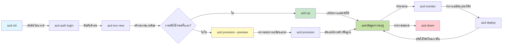
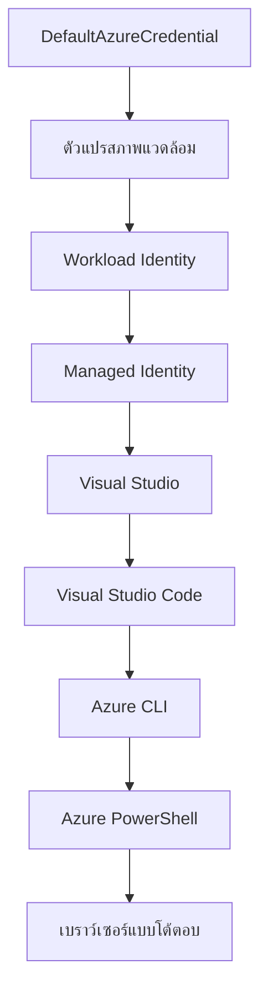

# AZD พื้นฐาน - ความเข้าใจ Azure Developer CLI

# AZD พื้นฐาน - แนวคิดหลักและพื้นฐาน

**การนำทางบทเรียน:**
- **📚 หน้าแรกคอร์ส**: [AZD สำหรับผู้เริ่มต้น](../../README.md)
- **📖 บทปัจจุบัน**: บทที่ 1 - พื้นฐาน & เริ่มต้นอย่างรวดเร็ว
- **⬅️ ก่อนหน้า**: [ภาพรวมคอร์ส](../../README.md#-chapter-1-foundation--quick-start)
- **➡️ ต่อไป**: [การติดตั้งและตั้งค่า](installation.md)
- **🚀 บทถัดไป**: [บทที่ 2: พัฒนา AI-First](../chapter-02-ai-development/microsoft-foundry-integration.md)

## บทนำ

บทเรียนนี้จะแนะนำคุณให้รู้จักกับ Azure Developer CLI (azd) เครื่องมือบรรทัดคำสั่งที่ทรงพลังที่ช่วยเร่งการเดินทางจากการพัฒนาท้องถิ่นสู่การปรับใช้บน Azure คุณจะได้เรียนรู้แนวคิดพื้นฐาน คุณสมบัติหลัก และเข้าใจว่า azd ช่วยให้การปรับใช้แอปพลิเคชันแบบคลาวด์เนทีฟง่ายขึ้นอย่างไร

## เป้าหมายการเรียนรู้

เมื่อจบบทเรียนนี้ คุณจะสามารถ:
- เข้าใจว่า Azure Developer CLI คืออะไรและวัตถุประสงค์หลักของมัน
- เรียนรู้แนวคิดหลักของเทมเพลต สภาพแวดล้อม และบริการ
- สำรวจคุณสมบัติสำคัญรวมถึงการพัฒนาด้วยเทมเพลตและ Infrastructure as Code
- เข้าใจโครงสร้างโปรเจกต์ azd และเวิร์กโฟลว์
- เตรียมพร้อมสำหรับการติดตั้งและกำหนดค่า azd สำหรับสภาพแวดล้อมพัฒนาของคุณ

## ผลลัพธ์การเรียนรู้

หลังจากทำบทเรียนนี้เสร็จ คุณจะสามารถ:
- อธิบายบทบาทของ azd ในเวิร์กโฟลว์การพัฒนาคลาวด์สมัยใหม่
- ระบุส่วนประกอบของโครงสร้างโปรเจกต์ azd
- อธิบายว่าเทมเพลต สภาพแวดล้อม และบริการทำงานร่วมกันอย่างไร
- เข้าใจประโยชน์ของ Infrastructure as Code กับ azd
- จำแนกคำสั่ง azd ต่าง ๆ และวัตถุประสงค์ของแต่ละคำสั่ง

## Azure Developer CLI (azd) คืออะไร?

Azure Developer CLI (azd) คือเครื่องมือบรรทัดคำสั่งที่ออกแบบมาเพื่อเร่งการเดินทางของคุณจากการพัฒนาท้องถิ่นสู่การปรับใช้บน Azure มันช่วยลดความซับซ้อนของกระบวนการสร้าง ปรับใช้ และจัดการแอปพลิเคชันแบบคลาวด์เนทีฟบน Azure

### คุณสามารถปรับใช้ด้วย azd อะไรได้บ้าง?

azd รองรับงานหลากหลายประเภท — และรายชื่อยังคงเพิ่มขึ้นเรื่อย ๆ วันนี้ คุณสามารถใช้ azd เพื่อปรับใช้:

| ประเภทงาน | ตัวอย่าง | ใช้เวิร์กโฟลว์เดียวกัน? |
|------------|----------|------------------------|
| **แอปแบบดั้งเดิม** | เว็บแอป, REST API, เว็บไซต์สเตติก | ✅ `azd up` |
| **บริการและไมโครเซอร์วิส** | Container Apps, Function Apps, แบ็คเอนด์หลายบริการ | ✅ `azd up` |
| **แอปพลิเคชันที่ใช้ AI** | แอปแชทที่ใช้โมเดล Microsoft Foundry, โซลูชัน RAG กับ AI Search | ✅ `azd up` |
| **ตัวแทนอัจฉริยะ** | ตัวแทนที่โฮสต์บน Foundry, การประสานงานตัวแทนหลายตัว | ✅ `azd up` |

ข้อสังเกตสำคัญคือ **วัฏจักรของ azd จะเหมือนเดิมไม่ว่าจะปรับใช้อะไร** คุณเริ่มโปรเจกต์ ตั้งค่าโครงสร้างพื้นฐาน ปรับใช้โค้ด ตรวจสอบแอป และล้างข้อมูล — ไม่ว่าจะเป็นเว็บไซต์ง่าย ๆ หรือเอเยนต์ AI ที่ซับซ้อน

ความต่อเนื่องนี้ถูกออกแบบมา azd ถือว่า AI เป็นบริการชนิดหนึ่งที่แอปพลิเคชันของคุณใช้ ไม่ใช่สิ่งที่แตกต่างโดยพื้นฐาน จุดปลายแชทที่ใช้ Microsoft Foundry Models จากมุมมองของ azd ก็เป็นบริการชนิดหนึ่งที่ต้องกำหนดค่าและปรับใช้อย่างเดียวกัน

### 🎯 ทำไมต้องใช้ AZD? การเปรียบเทียบในโลกจริง

เปรียบเทียบการปรับใช้เว็บแอปง่าย ๆ กับฐานข้อมูล:

#### ❌ ไม่มี AZD: การปรับใช้ Azure ด้วยตนเอง (30+ นาที)

```bash
# ขั้นตอนที่ 1: สร้างกลุ่มทรัพยากร
az group create --name myapp-rg --location eastus

# ขั้นตอนที่ 2: สร้างแผนบริการแอป
az appservice plan create --name myapp-plan \
  --resource-group myapp-rg \
  --sku B1 --is-linux

# ขั้นตอนที่ 3: สร้างเว็บแอป
az webapp create --name myapp-web-unique123 \
  --resource-group myapp-rg \
  --plan myapp-plan \
  --runtime "NODE:18-lts"

# ขั้นตอนที่ 4: สร้างบัญชี Cosmos DB (10-15 นาที)
az cosmosdb create --name myapp-cosmos-unique123 \
  --resource-group myapp-rg \
  --kind MongoDB

# ขั้นตอนที่ 5: สร้างฐานข้อมูล
az cosmosdb mongodb database create \
  --account-name myapp-cosmos-unique123 \
  --resource-group myapp-rg \
  --name tododb

# ขั้นตอนที่ 6: สร้างคอลเลกชัน
az cosmosdb mongodb collection create \
  --account-name myapp-cosmos-unique123 \
  --resource-group myapp-rg \
  --database-name tododb \
  --name todos

# ขั้นตอนที่ 7: รับสตริงการเชื่อมต่อ
CONN_STR=$(az cosmosdb keys list \
  --name myapp-cosmos-unique123 \
  --resource-group myapp-rg \
  --type connection-strings \
  --query "connectionStrings[0].connectionString" -o tsv)

# ขั้นตอนที่ 8: กำหนดค่าแอปตั้งค่า
az webapp config appsettings set \
  --name myapp-web-unique123 \
  --resource-group myapp-rg \
  --settings MONGODB_URI="$CONN_STR"

# ขั้นตอนที่ 9: เปิดใช้งานการบันทึก
az webapp log config --name myapp-web-unique123 \
  --resource-group myapp-rg \
  --application-logging filesystem \
  --detailed-error-messages true

# ขั้นตอนที่ 10: ตั้งค่า Application Insights
az monitor app-insights component create \
  --app myapp-insights \
  --location eastus \
  --resource-group myapp-rg

# ขั้นตอนที่ 11: เชื่อมโยง App Insights กับเว็บแอป
INSTRUMENTATION_KEY=$(az monitor app-insights component show \
  --app myapp-insights \
  --resource-group myapp-rg \
  --query "instrumentationKey" -o tsv)

az webapp config appsettings set \
  --name myapp-web-unique123 \
  --resource-group myapp-rg \
  --settings APPINSIGHTS_INSTRUMENTATIONKEY="$INSTRUMENTATION_KEY"

# ขั้นตอนที่ 12: สร้างแอปพลิเคชันในเครื่อง
npm install
npm run build

# ขั้นตอนที่ 13: สร้างแพ็กเกจปรับใช้
zip -r app.zip . -x "*.git*" "node_modules/*"

# ขั้นตอนที่ 14: ปรับใช้แอปพลิเคชัน
az webapp deployment source config-zip \
  --resource-group myapp-rg \
  --name myapp-web-unique123 \
  --src app.zip

# ขั้นตอนที่ 15: รอและภาวนาให้สำเร็จ 🙏
# (ไม่มีการตรวจสอบอัตโนมัติ ต้องทดสอบด้วยตนเอง)
```

**ปัญหา:**
- ❌ ต้องจำและรันคำสั่งกว่า 15 คำสั่งตามลำดับ
- ❌ ใช้เวลาทำงานด้วยตนเอง 30-45 นาที
- ❌ ง่ายต่อการผิดพลาด (พิมพ์ผิด พารามิเตอร์ผิด)
- ❌ สายการเชื่อมต่อแสดงในประวัติเทอร์มินัล
- ❌ ไม่มีการย้อนกลับอัตโนมัติหากเกิดข้อผิดพลาด
- ❌ ยากต่อการทำซ้ำสำหรับสมาชิกในทีม
- ❌ แตกต่างทุกครั้ง (ไม่สามารถทำซ้ำได้)

#### ✅ ใช้ AZD: การปรับใช้อัตโนมัติ (5 คำสั่ง 10-15 นาที)

```bash
# ขั้นตอนที่ 1: เริ่มต้นจากแม่แบบ
azd init --template todo-nodejs-mongo

# ขั้นตอนที่ 2: ยืนยันตัวตน
azd auth login

# ขั้นตอนที่ 3: สร้างสภาพแวดล้อม
azd env new dev

# ขั้นตอนที่ 4: ดูตัวอย่างการเปลี่ยนแปลง (ไม่บังคับแต่แนะนำ)
azd provision --preview

# ขั้นตอนที่ 5: นำไปใช้ทั้งหมด
azd up

# ✨ เสร็จแล้ว! ทุกอย่างถูกนำไปใช้, ตั้งค่า และตรวจสอบ
```

**ประโยชน์:**
- ✅ **5 คำสั่ง** เทียบกับ 15+ ขั้นตอนด้วยตนเอง
- ✅ **เวลา 10-15 นาที** รวมทั้งหมด (รอ Azure เป็นส่วนใหญ่)
- ✅ **ลดข้อผิดพลาดจากคนทำงานด้วยตนเอง** – เวิร์กโฟลว์เทมเพลตที่สม่ำเสมอ
- ✅ **จัดการความลับอย่างปลอดภัย** – เทมเพลตหลายชุดใช้โครงสร้างจัดเก็บความลับของ Azure
- ✅ **ปรับใช้ซ้ำได้** – เวิร์กโฟลว์เหมือนเดิมทุกครั้ง
- ✅ **ทำซ้ำผลได้เต็มที่** – ผลลัพธ์เหมือนเดิมทุกครั้ง
- ✅ **พร้อมทีม** – ใครก็ได้สามารถปรับใช้ด้วยคำสั่งเดียวกัน
- ✅ **Infrastructure as Code** – เทมเพลต Bicep ที่ควบคุมเวอร์ชัน
- ✅ **มีเครื่องมือมอนิเตอร์ในตัว** – Application Insights ตั้งค่าอัตโนมัติ

### 📊 การลดเวลาและข้อผิดพลาด

| ตัวชี้วัด | การปรับใช้ด้วยตนเอง | การปรับใช้ด้วย AZD | การปรับปรุง |
|:---------|:---------------------|:------------------|:------------|
| **คำสั่ง** | 15+ | 5 | ลดลง 67% |
| **เวลา** | 30-45 นาที | 10-15 นาที | เร็วขึ้น 60% |
| **อัตราข้อผิดพลาด** | ~40% | <5% | ลดลง 88% |
| **ความสม่ำเสมอ** | ต่ำ (ด้วยตนเอง) | 100% (อัตโนมัติ) | สมบูรณ์แบบ |
| **การเริ่มต้นทีม** | 2-4 ชั่วโมง | 30 นาที | เร็วขึ้น 75% |
| **เวลาย้อนกลับ (Rollback)** | 30+ นาที (ด้วยตนเอง) | 2 นาที (อัตโนมัติ) | เร็วขึ้น 93% |

## แนวคิดหลัก

### เทมเพลต
เทมเพลตคือรากฐานของ azd ประกอบด้วย:
- **โค้ดแอปพลิเคชัน** - ซอร์สโค้ดและ dependencies ของคุณ
- **นิยามโครงสร้างพื้นฐาน** - ทรัพยากร Azure ที่กำหนดใน Bicep หรือ Terraform
- **ไฟล์กำหนดค่า** - การตั้งค่าและตัวแปรสภาพแวดล้อม
- **สคริปต์ปรับใช้** - เวิร์กโฟลว์การปรับใช้อัตโนมัติ

### สภาพแวดล้อม
สภาพแวดล้อมแทนเป้าหมายการปรับใช้ที่ต่างกัน:
- **Development** - สำหรับทดสอบและพัฒนา
- **Staging** - สภาพแวดล้อมก่อนผลิต
- **Production** - สภาพแวดล้อมการผลิตจริง

แต่ละสภาพแวดล้อมจะมี:
- กลุ่มทรัพยากร Azure เป็นของตัวเอง
- การตั้งค่ากำหนดค่า
- สถานะการปรับใช้

### บริการ
บริการคือบล็อกก่อสร้างของแอปพลิเคชันของคุณ:
- **Frontend** - เว็บแอปพลิเคชัน, SPA
- **Backend** - API, ไมโครเซอร์วิส
- **Database** - โซลูชันเก็บข้อมูล
- **Storage** - เก็บไฟล์และบล็อบ

## คุณสมบัติหลัก

### 1. การพัฒนาด้วยเทมเพลต
```bash
# เรียกดูเทมเพลตที่มีอยู่
azd template list

# เริ่มต้นจากเทมเพลต
azd init --template <template-name>
```

### 2. Infrastructure as Code
- **Bicep** - ภาษาที่เฉพาะสำหรับ Azure
- **Terraform** - เครื่องมือโครงสร้างพื้นฐานหลายคลาวด์
- **ARM Templates** - เทมเพลต Azure Resource Manager

### 3. เวิร์กโฟลว์แบบผสานรวม
```bash
# กระบวนการทำงานการปรับใช้ครบถ้วน
azd up            # การจัดเตรียม + การปรับใช้ นี่คือการตั้งค่าแบบไม่ต้องทำมือครั้งแรก

# 🧪 ใหม่: ดูก่อนการเปลี่ยนแปลงโครงสร้างพื้นฐานก่อนปรับใช้ (ปลอดภัย)
azd provision --preview    # จำลองการปรับใช้โครงสร้างพื้นฐานโดยไม่ทำการเปลี่ยนแปลง

azd provision     # สร้างทรัพยากร Azure หากคุณอัปเดตโครงสร้างพื้นฐานให้ใช้สิ่งนี้
azd deploy        # ปรับใช้โค้ดแอปพลิเคชัน หรือปรับใช้ใหม่อีกรอบเมื่อมีการอัปเดต
azd down          # ล้างทรัพยากรออก
```

#### 🛡️ การวางแผนโครงสร้างพื้นฐานอย่างปลอดภัยด้วย Preview
คำสั่ง `azd provision --preview` เป็นตัวเปลี่ยนเกมสำหรับการปรับใช้อย่างปลอดภัย:
- **วิเคราะห์แบบ dry-run** - แสดงสิ่งที่จะถูกสร้าง แก้ไข หรือ ลบ
- **ความเสี่ยงเป็นศูนย์** - ไม่มีการเปลี่ยนแปลงจริงในสภาพแวดล้อม Azure ของคุณ
- **ความร่วมมือของทีม** - แชร์ผลลัพธ์ preview ก่อนปรับใช้
- **ประมาณค่าใช้จ่าย** - เข้าใจต้นทุนทรัพยากรก่อนตัดสินใจ

```bash
# ตัวอย่างการทำงานล่วงหน้า
azd provision --preview           # ดูสิ่งที่จะเปลี่ยนแปลง
# ตรวจสอบผลลัพธ์ พูดคุยกับทีม
azd provision                     # ใช้การเปลี่ยนแปลงอย่างมั่นใจ
```

### 📊 ภาพ: เวิร์กโฟลว์การพัฒนา AZD



**คำอธิบายเวิร์กโฟลว์:**
1. **Init** - เริ่มต้นด้วยเทมเพลตหรือโปรเจกต์ใหม่
2. **Auth** - รับรองตัวตนกับ Azure
3. **Environment** - สร้างสภาพแวดล้อมปรับใช้แยกต่างหาก
4. **Preview** - 🆕 ดูตัวอย่างการเปลี่ยนแปลงโครงสร้างพื้นฐานก่อนเสมอ (แนวปฏิบัติที่ปลอดภัย)
5. **Provision** - สร้าง/อัปเดตทรัพยากร Azure
6. **Deploy** - ส่งโค้ดแอปพลิเคชันของคุณ
7. **Monitor** - เฝ้าสังเกตประสิทธิภาพแอป
8. **Iterate** - ปรับแก้และปรับใช้โค้ดใหม่
9. **Cleanup** - ลบทรัพยากรเมื่อเสร็จสิ้น

### 4. การจัดการสภาพแวดล้อม
```bash
# สร้างและจัดการสภาพแวดล้อม
azd env new <environment-name>
azd env select <environment-name>
azd env list
```

### 5. ส่วนขยายและคำสั่ง AI

azd ใช้ระบบส่วนขยายเพื่อเพิ่มความสามารถนอกเหนือจาก CLI หลัก ซึ่งมีประโยชน์อย่างยิ่งสำหรับงาน AI:

```bash
# แสดงรายการส่วนขยายที่มีอยู่
azd extension list

# ติดตั้งส่วนขยายตัวแทน Foundry
azd extension install azure.ai.agents

# เริ่มต้นโปรเจกต์ตัวแทน AI จากไฟล์ manifest
azd ai agent init -m agent-manifest.yaml

# ทดสอบตัวแทนที่ปรับใช้แล้ว (แสดงความหน่วงเวลาและเวลาถึงไบต์แรก)
azd ai agent invoke

# เริ่มเซิร์ฟเวอร์ MCP สำหรับการพัฒนาที่มี AI ช่วย (รุ่นอัลฟ่า)
azd mcp start
```

**วัฏจักรของเอเยนต์ แบบครบวงจร** เมื่อติดตั้ง `azure.ai.agents` แล้ว เวิร์กโฟลว์เดียวจะพาคุณจากไอเดียสู่เอเยนต์ที่กำลังรันและถูกติดตาม คุณไม่จำเป็นต้องใช้ทั้งหมดในวันแรก — เพียงรู้ว่ามีคำสั่งเหล่านี้:

| ขั้นตอน | คำสั่ง | ทำอะไร |
|---------|--------|--------|
| **Scaffold** | `azd ai agent init -m <manifest>` | สร้างโปรเจกต์เอเยนต์จากไฟล์ manifest |
| **Test** | `azd ai agent invoke` | เรียกใช้งานเอเยนต์และดูเวลาตอบรับ |
| **Measure** | `azd ai agent eval generate` | สร้างชุดข้อมูลการประเมินสำหรับเอเยนต์ |
| **Improve** | `azd ai agent optimize` | ปรับปรุงคำสั่งเอเยนต์ตามข้อมูลของคุณ |
| **Inspect** | `azd ai agent endpoint show` | ดูการตั้งค่าจุดปลายสด |
| **Clean up** | `azd ai agent delete` | ลบเอเยนต์ที่โฮสต์และทุกเวอร์ชัน |

> ส่วนขยายอธิบายรายละเอียดใน [บทที่ 2: พัฒนา AI-First](../chapter-02-ai-development/agents.md) และเอกสารอ้างอิง [AZD AI CLI Commands](../chapter-08-production/production-ai-practices.md#azd-ai-cli-commands-and-extensions)

## 📁 โครงสร้างโปรเจกต์

โครงสร้างโปรเจกต์ azd ทั่วไป:
```
my-app/
├── .azd/                    # azd configuration
│   └── config.json
├── .azure/                  # Azure deployment artifacts
├── .devcontainer/          # Development container config
├── .github/workflows/      # GitHub Actions
├── .vscode/               # VS Code settings
├── infra/                 # Infrastructure code
│   ├── main.bicep        # Main infrastructure template
│   ├── main.parameters.json
│   └── modules/          # Reusable modules
├── src/                  # Application source code
│   ├── api/             # Backend services
│   └── web/             # Frontend application
├── azure.yaml           # azd project configuration
└── README.md
```

## 🔧 ไฟล์กำหนดค่า

### azure.yaml
ไฟล์กำหนดค่าโปรเจกต์หลัก:
```yaml
name: my-awesome-app
metadata:
  template: my-template@1.0.0

services:
  web:
    project: ./src/web
    language: js
    host: appservice
  api:
    project: ./src/api
    language: js
    host: appservice

hooks:
  preprovision:
    shell: pwsh
    run: echo "Preparing to provision..."
```

### .azure/config.json
การตั้งค่าสำหรับแต่ละสภาพแวดล้อม:
```json
{
  "version": 1,
  "defaultEnvironment": "dev",
  "environments": {
    "dev": {
      "subscriptionId": "your-subscription-id",
      "location": "eastus"
    }
  }
}
```

## 🎪 เวิร์กโฟลว์ทั่วไปพร้อมแบบฝึกหัดปฏิบัติ

> **💡 เคล็ดลับการเรียนรู้:** ทำแบบฝึกหัดเหล่านี้ตามลำดับเพื่อสร้างทักษะ AZD ของคุณอย่างต่อเนื่อง

### 🎯 แบบฝึกหัดที่ 1: เริ่มโปรเจกต์แรกของคุณ

**เป้าหมาย:** สร้างโปรเจกต์ AZD และสำรวจโครงสร้าง

**ขั้นตอน:**
```bash
# ใช้เทมเพลตที่ได้รับการพิสูจน์แล้ว
azd init --template todo-nodejs-mongo

# สำรวจไฟล์ที่สร้างขึ้น
ls -la  # ดูไฟล์ทั้งหมดรวมถึงไฟล์ที่ซ่อนอยู่

# ไฟล์สำคัญที่ถูกสร้างขึ้น:
# - azure.yaml (การกำหนดค่าหลัก)
# - infra/ (โค้ดโครงสร้างพื้นฐาน)
# - src/ (โค้ดแอปพลิเคชัน)
```

**✅ สำเร็จ:** คุณมีไดเรกทอรี azure.yaml, infra/, และ src/

---

### 🎯 แบบฝึกหัดที่ 2: ปรับใช้ไปยัง Azure

**เป้าหมาย:** ทำการปรับใช้แบบตั้งแต่ต้นจนจบ

**ขั้นตอน:**
```bash
# 1. ยืนยันตัวตน
az login && azd auth login

# 2. สร้างสภาพแวดล้อม
azd env new dev
azd env set AZURE_LOCATION eastus

# 3. ดูตัวอย่างการเปลี่ยนแปลง (แนะนำ)
azd provision --preview

# 4. ทำการปรับใช้ทั้งหมด
azd up

# 5. ตรวจสอบการปรับใช้
azd show    # ดู URL ของแอปของคุณ
```

**เวลาที่คาดหวัง:** 10-15 นาที  
**✅ สำเร็จ:** URL ของแอปพลิเคชันเปิดในเบราว์เซอร์

---

### 🎯 แบบฝึกหัดที่ 3: สภาพแวดล้อมหลายชุด

**เป้าหมาย:** ปรับใช้ใน dev และ staging

**ขั้นตอน:**
```bash
# มี dev แล้ว สร้าง staging
azd env new staging
azd env set AZURE_LOCATION westus2
azd up

# สลับระหว่างพวกมัน
azd env list
azd env select dev
```

**✅ สำเร็จ:** มีสองกลุ่มทรัพยากรแยกต่างหากใน Azure Portal

---

### 🛡️ การล้างข้อมูล: `azd down --force --purge`

เมื่อคุณต้องการรีเซ็ตทั้งหมด:

```bash
azd down --force --purge
```

**สิ่งที่ทำ:**
- `--force`: ไม่มีคำถามยืนยัน
- `--purge`: ลบสถานะท้องถิ่นและทรัพยากร Azure ทั้งหมด

**ใช้เมื่อ:**
- ปรับใช้ล้มเหลวระหว่างทาง
- เปลี่ยนโปรเจกต์
- ต้องการเริ่มใหม่หมด

---

## 🎪 อ้างอิงเวิร์กโฟลว์เดิม

### เริ่มโปรเจกต์ใหม่
```bash
# วิธีที่ 1: ใช้เทมเพลตที่มีอยู่
azd init --template todo-nodejs-mongo

# วิธีที่ 2: เริ่มจากศูนย์
azd init

# วิธีที่ 3: ใช้ไดเรกทอรีปัจจุบัน
azd init .
```

### วัฏจักรการพัฒนา
```bash
# ตั้งค่าสภาพแวดล้อมสำหรับการพัฒนา
azd auth login
azd env new dev
azd env select dev

# ปรับใช้ทุกอย่าง
azd up

# ทำการเปลี่ยนแปลงและปรับใช้อีกครั้ง
azd deploy

# ทำความสะอาดเมื่อเสร็จแล้ว
azd down --force --purge # คำสั่งใน Azure Developer CLI เป็นการ **รีเซ็ตอย่างหนัก** สำหรับสภาพแวดล้อมของคุณ—มีประโยชน์อย่างยิ่งเมื่อต้องแก้ไขปัญหาการปรับใช้ที่ล้มเหลว, ทำความสะอาดทรัพยากรที่ถูกทิ้ง, หรือเตรียมพร้อมสำหรับการปรับใช้ใหม่ทั้งหมด.
```

## ความเข้าใจ `azd down --force --purge`
คำสั่ง `azd down --force --purge` เป็นวิธีที่ทรงพลังในการล้างสภาพแวดล้อม azd และทรัพยากรที่เกี่ยวข้องทั้งหมด นี่คือรายละเอียดของแต่ละออปชัน:
```
--force
```
- ข้ามคำถามยืนยัน
- เหมาะสำหรับการทำงานอัตโนมัติหรือสคริปต์ที่ไม่ต้องการการป้อนข้อมูลด้วยมือ
- รับประกันว่าการลบจะดำเนินไปโดยไม่ถูกขัดจังหวะ แม้ CLI พบความไม่สอดคล้อง

```
--purge
```
ลบ **ข้อมูลเมตาที่เกี่ยวข้องทั้งหมด** รวมถึง:
สถานะสภาพแวดล้อม  
โฟลเดอร์ `.azure` ท้องถิ่น  
ข้อมูลการปรับใช้ที่แคชไว้  
ช่วยป้องกัน azd จำการปรับใช้ก่อนหน้า ซึ่งอาจทำให้เกิดปัญหา เช่น กลุ่มทรัพยากรไม่ตรงกัน หรือการอ้างอิง registry เก่า

### ทำไมต้องใช้ทั้งสองอย่าง?
เมื่อคุณติดขัดกับ `azd up` จากปัญหาสถานะค้างหรือปรับใช้ไม่สมบูรณ์ ชุดคำสั่งนี้ช่วยให้คุณเริ่มต้นใหม่ได้ “สะอาดหมดจด”

มีประโยชน์มากหลังจากลบทรัพยากรด้วยตนเองใน Azure Portal หรือเมื่อเปลี่ยนเทมเพลต สภาพแวดล้อม หรือการตั้งชื่อกลุ่มทรัพยากร

### การจัดการหลายสภาพแวดล้อม
```bash
# สร้างสภาพแวดล้อมสำหรับการทดสอบ
azd env new staging
azd env select staging
azd up

# สลับกลับไปที่ dev
azd env select dev

# เปรียบเทียบสภาพแวดล้อม
azd env list
```

## 🔐 การรับรองตัวตนและข้อมูลประจำตัว

ความเข้าใจการรับรองตัวตนเป็นสิ่งสำคัญสำหรับการปรับใช้ azd ที่สำเร็จ Azure ใช้วิธีการรับรองตัวตนหลายแบบ และ azd ใช้ลำดับห่วงโซ่ข้อมูลประจำตัวเดียวกับเครื่องมือ Azure อื่น ๆ

### การรับรองตัวตนด้วย Azure CLI (`az login`)

ก่อนใช้ azd คุณต้องรับรองตัวตนกับ Azure วิธีทั่วไปคือใช้ Azure CLI:

```bash
# การเข้าสู่ระบบแบบโต้ตอบ (เปิดเบราว์เซอร์)
az login

# เข้าสู่ระบบด้วยผู้เช่าเฉพาะ
az login --tenant <tenant-id>

# เข้าสู่ระบบด้วยผู้ใช้หลักบริการ
az login --service-principal -u <app-id> -p <password> --tenant <tenant-id>

# ตรวจสอบสถานะการเข้าสู่ระบบปัจจุบัน
az account show

# แสดงรายการการสมัครใช้งานที่มี
az account list --output table

# ตั้งค่าการสมัครใช้งานเริ่มต้น
az account set --subscription <subscription-id>
```

### กระบวนการรับรองตัวตน
1. **ล็อกอินแบบอินเทอร์แอกทีฟ**: เปิดเบราว์เซอร์เริ่มต้นของคุณเพื่อรับรองตัวตน
2. **Device Code Flow**: สำหรับสภาพแวดล้อมที่ไม่มีเบราว์เซอร์
3. **Service Principal**: สำหรับงานอัตโนมัติและ CI/CD
4. **Managed Identity**: สำหรับแอปที่โฮสต์บน Azure

### ห่วงโซ่ DefaultAzureCredential

`DefaultAzureCredential` เป็นชนิดข้อมูลประจำตัวที่ให้ประสบการณ์รับรองตัวตนที่ง่ายขึ้นโดยลองแหล่งข้อมูลประจำตัวหลายแหล่งโดยอัตโนมัติในลำดับที่กำหนด:

#### ลำดับห่วงโซ่ข้อมูลประจำตัว


#### 1. ตัวแปรสภาพแวดล้อม
```bash
# ตั้งค่าตัวแปรสภาพแวดล้อมสำหรับ service principal
export AZURE_CLIENT_ID="<app-id>"
export AZURE_CLIENT_SECRET="<password>"
export AZURE_TENANT_ID="<tenant-id>"
```

#### 2. Workload Identity (Kubernetes/GitHub Actions)
ใช้โดยอัตโนมัติใน:
- Azure Kubernetes Service (AKS) กับ Workload Identity
- GitHub Actions กับ OIDC federation
- กรณีการรับรองตัวตนแบบ federated อื่น ๆ

#### 3. Managed Identity
สำหรับทรัพยากร Azure เช่น:
- เครื่องเสมือน (Virtual Machines)
- App Service
- Azure Functions
- Container Instances

```bash
# ตรวจสอบว่าใช้งานบนทรัพยากร Azure ที่มี managed identity หรือไม่
az account show --query "user.type" --output tsv
# คืนค่า: "servicePrincipal" หากใช้ managed identity
```

#### 4. การผสานกับเครื่องมือสำหรับนักพัฒนา
- **Visual Studio**: ใช้บัญชีที่ลงชื่อเข้าใช้โดยอัตโนมัติ
- **VS Code**: ใช้ข้อมูลประจำตัวของส่วนขยาย Azure Account
- **Azure CLI**: ใช้ข้อมูลรับรองจาก `az login` (วิธีที่ใช้บ่อยที่สุดสำหรับพัฒนาท้องถิ่น)

### การตั้งค่าการรับรองตัวตน AZD

```bash
# วิธีที่ 1: ใช้ Azure CLI (แนะนำสำหรับการพัฒนา)
az login
azd auth login  # ใช้ข้อมูลประจำตัว Azure CLI ที่มีอยู่

# วิธีที่ 2: การตรวจสอบสิทธิ์ azd โดยตรง
azd auth login --use-device-code  # สำหรับสภาพแวดล้อมที่ไม่มีหัว

# วิธีที่ 3: ตรวจสอบสถานะการยืนยันตัวตน
azd auth login --check-status

# วิธีที่ 4: ออกจากระบบและเข้าสู่ระบบใหม่อีกครั้ง
azd auth logout
azd auth login
```

### แนวปฏิบัติที่ดีที่สุดสำหรับการรับรองตัวตน

#### สำหรับพัฒนาท้องถิ่น
```bash
# 1. เข้าสู่ระบบด้วย Azure CLI
az login

# 2. ตรวจสอบการสมัครใช้งานที่ถูกต้อง
az account show
az account set --subscription "Your Subscription Name"

# 3. ใช้ azd กับข้อมูลรับรองที่มีอยู่
azd auth login
```

#### สำหรับ CI/CD Pipelines
```yaml
# GitHub Actions example
- name: Azure Login
  uses: azure/login@v1
  with:
    creds: ${{ secrets.AZURE_CREDENTIALS }}

- name: Deploy with azd
  run: |
    azd auth login --client-id ${{ secrets.AZURE_CLIENT_ID }} \
                    --client-secret ${{ secrets.AZURE_CLIENT_SECRET }} \
                    --tenant-id ${{ secrets.AZURE_TENANT_ID }}
    azd up --no-prompt
```

#### สำหรับสภาพแวดล้อมการผลิต
- ใช้ **Managed Identity** เมื่อทำงานบนทรัพยากร Azure
- ใช้ **Service Principal** สำหรับกรณีใช้งานอัตโนมัติ
- หลีกเลี่ยงการเก็บข้อมูลรับรองในโค้ดหรือไฟล์คอนฟิก
- ใช้ **Azure Key Vault** สำหรับการตั้งค่าที่ละเอียดอ่อน

### ปัญหาการยืนยันตัวตนที่พบบ่อยและวิธีแก้ไข

#### ปัญหา: "ไม่พบการสมัครใช้งาน"
```bash
# วิธีแก้ไข: ตั้งค่าการสมัครสมาชิกเริ่มต้น
az account list --output table
az account set --subscription "<subscription-id>"
azd env set AZURE_SUBSCRIPTION_ID "<subscription-id>"
```

#### ปัญหา: "สิทธิ์ไม่เพียงพอ"
```bash
# วิธีแก้ไข: ตรวจสอบและกำหนดบทบาทที่จำเป็น
az role assignment list --assignee $(az account show --query user.name --output tsv)

# บทบาทที่จำเป็นทั่วไป:
# - Contributor (สำหรับการจัดการทรัพยากร)
# - User Access Administrator (สำหรับการกำหนดบทบาท)
```

#### ปัญหา: "โทเค็นหมดอายุ"
```bash
# วิธีแก้ไข: ยืนยันตัวตนใหม่
az logout
az login
azd auth logout
azd auth login
```

### การยืนยันตัวตนในสถานการณ์ต่างๆ

#### การพัฒนาในเครื่องท้องถิ่น
```bash
# บัญชีพัฒนาตนเอง
az login
azd auth login
```

#### การพัฒนาเป็นทีม
```bash
# ใช้ผู้เช่าที่เฉพาะเจาะจงสำหรับองค์กร
az login --tenant contoso.onmicrosoft.com
azd auth login
```

#### กรณีใช้งานหลายเช่า (Multi-tenant)
```bash
# สลับระหว่างผู้เช่า
az login --tenant tenant1.onmicrosoft.com
# ติดตั้งสู่ผู้เช่า 1
azd up

az login --tenant tenant2.onmicrosoft.com  
# ติดตั้งสู่ผู้เช่า 2
azd up
```

### ข้อควรพิจารณาด้านความปลอดภัย

1. **การเก็บข้อมูลรับรอง**: อย่าเก็บข้อมูลรับรองในซอร์สโค้ด
2. **ขอบเขตการใช้งาน**: ใช้หลักการสิทธิต่ำสุดสำหรับ service principal
3. **การหมุนเวียนโทเค็น**: หมุนเวียนความลับของ service principal เป็นประจำ
4. **เส้นทางตรวจสอบ**: ตรวจสอบกิจกรรมการยืนยันตัวตนและการปล่อยใช้งาน
5. **ความปลอดภัยเครือข่าย**: ใช้ private endpoints เมื่อเป็นไปได้

### การแก้ไขปัญหาการยืนยันตัวตน

```bash
# แก้ไขปัญหาการตรวจสอบสิทธิ์
azd auth login --check-status
az account show
az account get-access-token

# คำสั่งวินิจฉัยทั่วไป
whoami                          # บริบทผู้ใช้ปัจจุบัน
az ad signed-in-user show      # รายละเอียดผู้ใช้ Microsoft Entra ID
az group list                  # ทดสอบการเข้าถึงทรัพยากร
```

## ทำความเข้าใจคำสั่ง `azd down --force --purge`

### การค้นพบ
```bash
azd template list              # เรียกดูแม่แบบ
azd template show <template>   # รายละเอียดแม่แบบ
azd init --help               # ตัวเลือกการเริ่มต้นใช้งาน
```

### การจัดการโปรเจกต์
```bash
azd show                     # ภาพรวมโครงการ
azd env list                # สภาพแวดล้อมที่มีให้เลือกและค่าปริยายที่เลือก
azd config show            # การตั้งค่าการกำหนดค่า
```

### การตรวจสอบ
```bash
azd monitor                  # เปิดการตรวจสอบพอร์ทัล Azure
azd monitor --logs           # ดูบันทึกแอปพลิเคชัน
azd monitor --live           # ดูเมตริกแบบสด
azd pipeline config          # ตั้งค่า CI/CD
```

## แนวปฏิบัติที่ดีที่สุด

### 1. ใช้ชื่อที่มีความหมาย
```bash
# ดี
azd env new production-east
azd init --template web-app-secure

# หลีกเลี่ยง
azd env new env1
azd init --template template1
```

### 2. ใช้เทมเพลต
- เริ่มจากเทมเพลตที่มีอยู่แล้ว
- ปรับแต่งให้ตรงกับความต้องการของคุณ
- สร้างเทมเพลตที่ใช้งานซ้ำได้สำหรับองค์กรของคุณ

### 3. แยกสภาพแวดล้อม
- ใช้สภาพแวดล้อมแยกสำหรับ dev/staging/prod
- อย่าเผยแพร่โดยตรงไปยัง production จากเครื่องท้องถิ่น
- ใช้ CI/CD pipelines สำหรับการปล่อยใช้ใน production

### 4. การจัดการคอนฟิก
- ใช้ตัวแปรสภาพแวดล้อมสำหรับข้อมูลที่ละเอียดอ่อน
- เก็บคอนฟิกไว้ในระบบควบคุมเวอร์ชัน
- จัดทำเอกสารการตั้งค่าที่เฉพาะกับสภาพแวดล้อม

## ความก้าวหน้าในการเรียนรู้

### ผู้เริ่มต้น (สัปดาห์ที่ 1-2)
1. ติดตั้ง azd และยืนยันตัวตน
2. ปล่อยใช้งานเทมเพลตง่ายๆ
3. ทำความเข้าใจโครงสร้างโปรเจกต์
4. เรียนรู้คำสั่งพื้นฐาน (up, down, deploy)

### ระดับกลาง (สัปดาห์ที่ 3-4)
1. ปรับแต่งเทมเพลต
2. จัดการหลายสภาพแวดล้อม
3. เข้าใจโค้ดโครงสร้างพื้นฐาน
4. ตั้งค่า CI/CD pipelines

### ขั้นสูง (สัปดาห์ที่ 5 ขึ้นไป)
1. สร้างเทมเพลตที่กำหนดเอง
2. รูปแบบโครงสร้างพื้นฐานขั้นสูง
3. การปล่อยใช้งานหลายภูมิภาค
4. การตั้งค่าระดับองค์กร

## ขั้นตอนถัดไป

**📖 เรียนรู้ต่อในบทที่ 1:**
- [การติดตั้งและการตั้งค่า](installation.md) - ติดตั้งและตั้งค่า azd
- [โปรเจกต์แรกของคุณ](first-project.md) - ทำแบบฝึกหัดปฏิบัติ
- [คู่มือการตั้งค่า](configuration.md) - ตัวเลือกการตั้งค่าขั้นสูง

**🎯 พร้อมสำหรับบทถัดไปหรือยัง?**
- [บทที่ 2: การพัฒนา AI-First](../chapter-02-ai-development/microsoft-foundry-integration.md) - เริ่มสร้างแอป AI

## แหล่งข้อมูลเพิ่มเติม

- [ภาพรวม Azure Developer CLI](https://learn.microsoft.com/en-us/azure/developer/azure-developer-cli/)
- [แกลเลอรีเทมเพลต](https://azure.github.io/awesome-azd/)
- [ตัวอย่างจากชุมชน](https://github.com/Azure-Samples)

---

## 🙋 คำถามที่พบบ่อย

### คำถามทั่วไป

**ถาม: ความแตกต่างระหว่าง AZD กับ Azure CLI คืออะไร?**

ตอบ: Azure CLI (`az`) ใช้สำหรับจัดการทรัพยากร Azure ทีละตัว AZD (`azd`) ใช้สำหรับจัดการแอปพลิเคชันทั้งหมด:

```bash
# Azure CLI - การจัดการทรัพยากรระดับต่ำ
az webapp create --name myapp --resource-group rg
az sql server create --name myserver --resource-group rg
# ...ต้องการคำสั่งอีกมากมาย

# AZD - การจัดการระดับแอปพลิเคชัน
azd up  # ติดตั้งแอปทั้งหมดพร้อมกับทรัพยากรทั้งหมด
```

**คิดแบบนี้:**
- `az` = การจัดการอิฐเลโก้ทีละก้อน
- `azd` = การทำงานกับชุดเลโก้ครบชุด

---

**ถาม: ต้องรู้ Bicep หรือ Terraform เพื่อใช้ AZD หรือไม่?**

ตอบ: ไม่จำเป็น! เริ่มต้นด้วยเทมเพลต:
```bash
# ใช้เทมเพลตที่มีอยู่ - ไม่จำเป็นต้องมีความรู้ IaC
azd init --template todo-nodejs-mongo
azd up
```

คุณสามารถเรียนรู้ Bicep ในภายหลังเพื่อปรับแต่งโครงสร้างพื้นฐาน เทมเพลตจะให้ตัวอย่างที่ใช้งานได้จริงเพื่อเรียนรู้

---

**ถาม: ค่าใช้จ่ายในการรันเทมเพลต AZD เป็นเท่าไหร่?**

ตอบ: ค่าใช้จ่ายขึ้นอยู่กับเทมเพลต เทมเพลตส่วนใหญ่สำหรับการพัฒนาจะมีค่าใช้จ่าย $50-150 ต่อเดือน:

```bash
# ดูตัวอย่างค่าใช้จ่ายก่อนการปรับใช้
azd provision --preview

# ทำความสะอาดเสมอเมื่อไม่ใช้งาน
azd down --force --purge  # ลบทรัพยากรทั้งหมดออก
```

**เคล็ดลับ:** ใช้ระดับฟรีเมื่อมี:
- App Service: ระดับ F1 (ฟรี)
- Microsoft Foundry Models: Azure OpenAI 50,000 โทเค็น/เดือน ฟรี
- Cosmos DB: ระดับ 1000 RU/s ฟรี

---

**ถาม: ใช้ AZD กับทรัพยากร Azure ที่มีอยู่แล้วได้ไหม?**

ตอบ: ได้ แต่เริ่มต้นใหม่จะง่ายกว่า AZD ทำงานได้ดีเมื่อจัดการวงจรชีวิตทั้งหมด สำหรับทรัพยากรที่มีอยู่แล้ว:

```bash
# ตัวเลือกที่ 1: นำเข้าทรัพยากรที่มีอยู่แล้ว (ขั้นสูง)
azd init
# จากนั้นแก้ไขโฟลเดอร์ infra/ เพื่ออ้างอิงทรัพยากรที่มีอยู่แล้ว

# ตัวเลือกที่ 2: เริ่มใหม่ (แนะนำ)
azd init --template matching-your-stack
azd up  # สร้างสภาพแวดล้อมใหม่
```

---

**ถาม: ฉันจะแบ่งปันโปรเจกต์กับทีมงานได้อย่างไร?**

ตอบ: คอมมิตโปรเจกต์ AZD ไปยัง Git (แต่ไม่ใช่โฟลเดอร์ .azure):

```bash
# มีอยู่ใน .gitignore โดยค่าเริ่มต้น
.azure/        # มีข้อมูลลับและข้อมูลสภาพแวดล้อม
*.env          # ตัวแปรสภาพแวดล้อม

# สมาชิกทีม ณ เวลานั้น:
git clone <your-repo>
azd auth login
azd env new <their-name>-dev
azd up
```

ทุกคนจะได้โครงสร้างพื้นฐานเหมือนกันจากเทมเพลตเดียวกัน

---

### คำถามเกี่ยวกับการแก้ไขปัญหา

**ถาม: "azd up" ล้มเหลวกึ่งกลาง ฉันควรทำอย่างไร?**

ตอบ: ตรวจสอบข้อผิดพลาด แก้ไข จากนั้นลองใหม่:

```bash
# ดูบันทึกโดยละเอียด
azd show

# การแก้ไขทั่วไป:

# 1. ถ้าเกินโควต้า:
azd env set AZURE_LOCATION "westus2"  # ลองภูมิภาคที่แตกต่าง

# 2. ถ้ามีการขัดแย้งของชื่อทรัพยากร:
azd down --force --purge  # เริ่มต้นใหม่
azd up  # ลองอีกครั้ง

# 3. ถ้าการรับรองหมดอายุ:
az login
azd auth login
azd up
```

**ปัญหาที่พบบ่อยที่สุด:** เลือก Subscription Azure ผิด
```bash
az account list --output table
az account set --subscription "<correct-subscription>"
```

---

**ถาม: ฉันจะปล่อยใช้งานเฉพาะโค้ดโดยไม่ต้อง reprovision ได้อย่างไร?**

ตอบ: ใช้ `azd deploy` แทน `azd up`:

```bash
azd up          # ครั้งแรก: จัดเตรียม + ติดตั้ง (ช้า)

# ทำการเปลี่ยนแปลงโค้ด...

azd deploy      # ครั้งถัดไป: ติดตั้งอย่างเดียว (เร็ว)
```

เปรียบเทียบความเร็ว:
- `azd up`: 10-15 นาที (จัดเตรียมโครงสร้างพื้นฐาน)
- `azd deploy`: 2-5 นาที (เฉพาะโค้ด)

---

**ถาม: สามารถปรับแต่งเทมเพลตโครงสร้างพื้นฐานได้ไหม?**

ตอบ: ได้! แก้ไขไฟล์ Bicep ในโฟลเดอร์ `infra/`:

```bash
# หลังจาก azd init
cd infra/
code main.bicep  # แก้ไขใน VS Code

# ดูตัวอย่างการเปลี่ยนแปลง
azd provision --preview

# ใช้การเปลี่ยนแปลง
azd provision
```

**เคล็ดลับ:** เริ่มจากเล็กๆ - เปลี่ยน SKU ก่อน:
```bicep
// infra/main.bicep
sku: {
  name: 'B1'  // Change to 'P1V2' for production
}
```

---

**ถาม: ฉันจะลบทุกอย่างที่ AZD สร้างได้อย่างไร?**

ตอบ: ใช้คำสั่งเดียวลบทรัพยากรทั้งหมด:

```bash
azd down --force --purge

# สิ่งนี้จะลบ:
# - ทรัพยากร Azure ทั้งหมด
# - กลุ่มทรัพยากร
# - สถานะสภาพแวดล้อมในเครื่อง
# - ข้อมูลการปรับใช้ที่แคชไว้
```

**ควรใช้ทุกครั้งเมื่อ:**
- ทดสอบเทมเพลตเสร็จแล้ว
- เปลี่ยนไปใช้โปรเจกต์อื่น
- ต้องการเริ่มใหม่

**ประหยัดค่าใช้จ่าย:** ลบทรัพยากรที่ไม่ใช้ = ไม่มีค่าใช้จ่าย

---

**ถาม: ถ้าฉันเผลอลบทรัพยากรใน Azure Portal จะทำอย่างไร?**

ตอบ: สถานะ AZD อาจไม่ตรงกัน ใช้วิธีล้างระบบใหม่:

```bash
# 1. ลบสถานะภายในเครื่อง
azd down --force --purge

# 2. เริ่มใหม่
azd up

# ทางเลือก: ให้ AZD ตรวจจับและแก้ไข
azd provision  # จะสร้างทรัพยากรที่หายไป
```

---

### คำถามขั้นสูง

**ถาม: ใช้ AZD ใน CI/CD pipelines ได้ไหม?**

ตอบ: ได้! ตัวอย่าง GitHub Actions:

```yaml
# .github/workflows/deploy.yml
name: Deploy with AZD

on:
  push:
    branches: [main]

jobs:
  deploy:
    runs-on: ubuntu-latest
    steps:
      - uses: actions/checkout@v2
      
      - name: Install azd
        run: curl -fsSL https://aka.ms/install-azd.sh | bash
      
      - name: Azure Login
        run: |
          azd auth login \
            --client-id ${{ secrets.AZURE_CLIENT_ID }} \
            --client-secret ${{ secrets.AZURE_CLIENT_SECRET }} \
            --tenant-id ${{ secrets.AZURE_TENANT_ID }}
      
      - name: Deploy
        run: azd up --no-prompt
```

---

**ถาม: ฉันจัดการกับความลับและข้อมูลละเอียดอ่อนได้อย่างไร?**

ตอบ: AZD ผสานรวมกับ Azure Key Vault อัตโนมัติ:

```bash
# ความลับจะถูกเก็บไว้ใน Key Vault ไม่ใช่ในโค้ด
azd env set DATABASE_PASSWORD "$(openssl rand -base64 32)"

# AZD ทำงานโดยอัตโนมัติ:
# 1. สร้าง Key Vault
# 2. จัดเก็บความลับ
# 3. ให้สิทธิ์แอปเข้าถึงผ่าน Managed Identity
# 4. แทรกในระหว่างรันไทม์
```

**อย่า commit:**
- โฟลเดอร์ `.azure/` (เก็บข้อมูลสภาพแวดล้อม)
- ไฟล์ `.env` (ความลับท้องถิ่น)
- สตริงการเชื่อมต่อ

---

**ถาม: สามารถปล่อยใช้งานหลายภูมิภาคได้ไหม?**

ตอบ: ได้ สร้างสภาพแวดล้อมแยกตามภูมิภาค:

```bash
# สภาพแวดล้อม East US
azd env new prod-eastus
azd env set AZURE_LOCATION eastus
azd up

# สภาพแวดล้อม West Europe
azd env new prod-westeurope
azd env set AZURE_LOCATION westeurope
azd up

# แต่ละสภาพแวดล้อมเป็นอิสระต่อกัน
azd env list
```

สำหรับแอปหลายภูมิภาคจริงๆ ให้ปรับแต่งเทมเพลต Bicep เพื่อปล่อยใช้งานพร้อมกันหลายภูมิภาค

---

**ถาม: ฉันจะขอความช่วยเหลือได้ที่ไหนถ้าติดปัญหา?**

1. **เอกสาร AZD:** https://learn.microsoft.com/azure/developer/azure-developer-cli/
2. **GitHub Issues:** https://github.com/Azure/azure-dev/issues
3. **Discord:** [Azure Discord](https://discord.gg/microsoft-azure) - ช่อง #azure-developer-cli
4. **Stack Overflow:** แท็ก `azure-developer-cli`
5. **คอร์สนี้:** [คู่มือแก้ไขปัญหา](../chapter-07-troubleshooting/common-issues.md)

**เคล็ดลับ:** ก่อนถาม ลองรัน:
```bash
azd show       # แสดงสถานะปัจจุบัน
azd version    # แสดงเวอร์ชันของคุณ
```
รวมข้อมูลนี้ในคำถามเพื่อช่วยให้ได้คำตอบเร็วขึ้น

---

## 🎓 ขั้นตอนต่อไป?

ตอนนี้คุณเข้าใจพื้นฐานของ AZD แล้ว เลือกเส้นทางของคุณ:

### 🎯 สำหรับผู้เริ่มต้น:
1. **ถัดไป:** [ติดตั้งและตั้งค่า](installation.md) - ติดตั้ง AZD บนเครื่องของคุณ
2. **จากนั้น:** [โปรเจกต์แรกของคุณ](first-project.md) - ปล่อยใช้งานครั้งแรก
3. **ฝึกฝน:** ทำแบบฝึกหัดครบ 3 เรื่องในบทนี้

### 🚀 สำหรับนักพัฒนา AI:
1. **ข้ามไป:** [บทที่ 2: การพัฒนา AI-First](../chapter-02-ai-development/microsoft-foundry-integration.md)
2. **ปล่อยใช้งาน:** เริ่มด้วย `azd init --template get-started-with-ai-chat`
3. **เรียนรู้:** สร้างไปพร้อมกับการปล่อยใช้งาน

### 🏗️ สำหรับนักพัฒนาที่มีประสบการณ์:
1. **ทบทวน:** [คู่มือการตั้งค่า](configuration.md) - การตั้งค่าขั้นสูง
2. **สำรวจ:** [โครงสร้างพื้นฐานเป็นโค้ด](../chapter-04-infrastructure/provisioning.md) - บทลึก Bicep
3. **สร้าง:** สร้างเทมเพลตตามสแต็คของคุณ

---

**การนำทางบทเรียน:**
- **📚 หน้าแรกของคอร์ส:** [AZD สำหรับผู้เริ่มต้น](../../README.md)
- **📖 บทปัจจุบัน:** บทที่ 1 - พื้นฐานและเริ่มต้นด่วน  
- **⬅️ ก่อนหน้า:** [ภาพรวมคอร์ส](../../README.md#-chapter-1-foundation--quick-start)
- **➡️ ถัดไป:** [ติดตั้งและตั้งค่า](installation.md)
- **🚀 บทต่อไป:** [บทที่ 2: การพัฒนา AI-First](../chapter-02-ai-development/microsoft-foundry-integration.md)

---

<!-- CO-OP TRANSLATOR DISCLAIMER START -->
**ปฏิเสธความรับผิดชอบ**:
เอกสารนี้ได้รับการแปลโดยใช้บริการแปลภาษา AI [Co-op Translator](https://github.com/Azure/co-op-translator) ขณะที่เราพยายามให้ความถูกต้อง โปรดทราบว่าการแปลโดยอัตโนมัติอาจมีข้อผิดพลาดหรือความไม่ถูกต้อง เอกสารต้นฉบับในภาษาต้นทางควรถูกพิจารณาเป็นแหล่งข้อมูลที่เชื่อถือได้ สำหรับข้อมูลที่สำคัญ แนะนำให้ใช้การแปลโดยมนุษย์มืออาชีพ เราไม่รับผิดชอบต่อความเข้าใจผิดหรือการตีความที่ผิดพลาดที่เกิดขึ้นจากการใช้การแปลนี้
<!-- CO-OP TRANSLATOR DISCLAIMER END -->