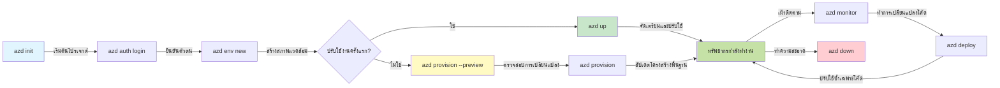
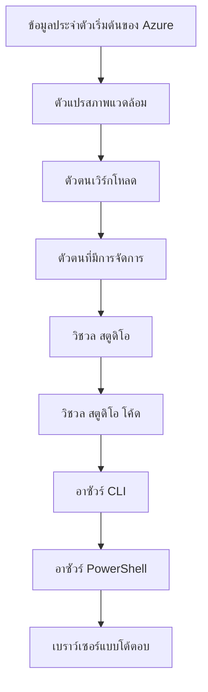

# AZD Basics - ทำความเข้าใจ Azure Developer CLI

# AZD Basics - แนวคิดพื้นฐานและหลักการสำคัญ

**การนำทางบทเรียน:**
- **📚 หน้าแรกของคอร์ส**: [AZD สำหรับผู้เริ่มต้น](../../README.md)
- **📖 บทปัจจุบัน**: บทที่ 1 - พื้นฐาน & เริ่มต้นอย่างรวดเร็ว
- **⬅️ ก่อนหน้า**: [ภาพรวมคอร์ส](../../README.md#-chapter-1-foundation--quick-start)
- **➡️ ถัดไป**: [การติดตั้ง & การตั้งค่า](installation.md)
- **🚀 บทต่อไป**: [บทที่ 2: การพัฒนาเชิง AI เป็นหลัก](../chapter-02-ai-development/microsoft-foundry-integration.md)

## บทนำ

บทเรียนนี้แนะนำให้คุณรู้จัก Azure Developer CLI (azd) เครื่องมือบรรทัดคำสั่งที่ทรงพลังซึ่งเร่งการเดินทางของคุณจากการพัฒนาในเครื่องไปยังการปรับใช้บน Azure คุณจะได้เรียนรู้แนวคิดพื้นฐาน ฟีเจอร์หลัก และเข้าใจว่า azd ช่วยให้การปรับใช้แอปพลิเคชันแบบ cloud-native ง่ายขึ้นอย่างไร

## เป้าหมายการเรียนรู้

By the end of this lesson, you will:
- เข้าใจว่า Azure Developer CLI คืออะไรและจุดประสงค์หลักของมัน
- เรียนรู้แนวคิดหลักของเทมเพลต สภาพแวดล้อม และบริการ
- สำรวจฟีเจอร์สำคัญ รวมถึงการพัฒนาแบบขับเคลื่อนด้วยเทมเพลตและโครงสร้างพื้นฐานในรูปแบบโค้ด
- เข้าใจโครงสร้างโปรเจกต์และเวิร์กโฟลว์ของ azd
- เตรียมพร้อมที่จะติดตั้งและกำหนดค่า azd สำหรับสภาพแวดล้อมการพัฒนาของคุณ

## ผลลัพธ์การเรียนรู้

หลังจากทำบทเรียนนี้เสร็จ คุณจะสามารถ:
- อธิบายบทบาทของ azd ในเวิร์กโฟลว์การพัฒนาบนคลาวด์สมัยใหม่
- ระบุส่วนประกอบของโครงสร้างโปรเจกต์ azd
- อธิบายว่าเทมเพลต สภาพแวดล้อม และบริการทำงานร่วมกันอย่างไร
- เข้าใจประโยชน์ของโครงสร้างพื้นฐานในรูปแบบโค้ดกับ azd
- ระบุคำสั่งต่างๆ ของ azd และวัตถุประสงค์ของแต่ละคำสั่ง

## Azure Developer CLI (azd) คืออะไร?

Azure Developer CLI (azd) เป็นเครื่องมือบรรทัดคำสั่งที่ออกแบบมาเพื่อเร่งการเดินทางของคุณจากการพัฒนาในเครื่องไปยังการปรับใช้บน Azure มันช่วยให้กระบวนการสร้าง ปรับใช้ และจัดการแอปพลิเคชันแบบ cloud-native บน Azure ง่ายขึ้น

### 🎯 ทำไมต้องใช้ AZD? การเปรียบเทียบในโลกความเป็นจริง

มาลองเปรียบเทียบการปรับใช้เว็บแอปง่ายๆ พร้อมฐานข้อมูล:

#### ❌ หากไม่มี AZD: การปรับใช้ Azure แบบแมนนวล (30+ นาที)

```bash
# ขั้นตอนที่ 1: สร้างกลุ่มทรัพยากร
az group create --name myapp-rg --location eastus

# ขั้นตอนที่ 2: สร้าง App Service Plan
az appservice plan create --name myapp-plan \
  --resource-group myapp-rg \
  --sku B1 --is-linux

# ขั้นตอนที่ 3: สร้างเว็บแอป
az webapp create --name myapp-web-unique123 \
  --resource-group myapp-rg \
  --plan myapp-plan \
  --runtime "NODE:18-lts"

# ขั้นตอนที่ 4: สร้างบัญชี Cosmos DB (10–15 นาที)
az cosmosdb create --name myapp-cosmos-unique123 \
  --resource-group myapp-rg \
  --kind MongoDB

# ขั้นตอนที่ 5: สร้างฐานข้อมูล
az cosmosdb mongodb database create \
  --account-name myapp-cosmos-unique123 \
  --resource-group myapp-rg \
  --name tododb

# ขั้นตอนที่ 6: สร้างคอลเล็กชัน
az cosmosdb mongodb collection create \
  --account-name myapp-cosmos-unique123 \
  --resource-group myapp-rg \
  --database-name tododb \
  --name todos

# ขั้นตอนที่ 7: รับสตริงการเชื่อมต่อ
CONN_STR=$(az cosmosdb keys list \
  --name myapp-cosmos-unique123 \
  --resource-group myapp-rg \
  --type connection-strings \
  --query "connectionStrings[0].connectionString" -o tsv)

# ขั้นตอนที่ 8: กำหนดค่าการตั้งค่าแอป
az webapp config appsettings set \
  --name myapp-web-unique123 \
  --resource-group myapp-rg \
  --settings MONGODB_URI="$CONN_STR"

# ขั้นตอนที่ 9: เปิดใช้งานการบันทึก
az webapp log config --name myapp-web-unique123 \
  --resource-group myapp-rg \
  --application-logging filesystem \
  --detailed-error-messages true

# ขั้นตอนที่ 10: ตั้งค่า Application Insights
az monitor app-insights component create \
  --app myapp-insights \
  --location eastus \
  --resource-group myapp-rg

# ขั้นตอนที่ 11: เชื่อม Application Insights กับเว็บแอป
INSTRUMENTATION_KEY=$(az monitor app-insights component show \
  --app myapp-insights \
  --resource-group myapp-rg \
  --query "instrumentationKey" -o tsv)

az webapp config appsettings set \
  --name myapp-web-unique123 \
  --resource-group myapp-rg \
  --settings APPINSIGHTS_INSTRUMENTATIONKEY="$INSTRUMENTATION_KEY"

# ขั้นตอนที่ 12: สร้างแอปในเครื่อง
npm install
npm run build

# ขั้นตอนที่ 13: สร้างแพ็กเกจการปรับใช้
zip -r app.zip . -x "*.git*" "node_modules/*"

# ขั้นตอนที่ 14: ปรับใช้แอปพลิเคชัน
az webapp deployment source config-zip \
  --resource-group myapp-rg \
  --name myapp-web-unique123 \
  --src app.zip

# ขั้นตอนที่ 15: รอและอธิษฐานให้มันทำงาน 🙏
# (ไม่มีการตรวจสอบอัตโนมัติ จำเป็นต้องทดสอบด้วยตนเอง)
```

**ปัญหา:**
- ❌ ต้องจำและรันคำสั่งมากกว่า 15 คำสั่งตามลำดับ
- ❌ ใช้เวลาทำงานด้วยมือ 30-45 นาที
- ❌ ง่ายต่อการทำผิดพลาด (พิมพ์ผิด พารามิเตอร์ไม่ถูกต้อง)
- ❌ ค่าสตริงการเชื่อมต่อเปิดเผยในประวัติเทอร์มินัล
- ❌ ไม่มีการย้อนกลับอัตโนมัติหากเกิดข้อผิดพลาด
- ❌ ยากสำหรับสมาชิกทีมที่จะทำซ้ำ
- ❌ แตกต่างกันทุกครั้ง (ไม่สามารถทำซ้ำได้)

#### ✅ พร้อม AZD: การปรับใช้อัตโนมัติ (5 คำสั่ง, 10-15 นาที)

```bash
# ขั้นตอนที่ 1: เริ่มต้นจากเทมเพลต
azd init --template todo-nodejs-mongo

# ขั้นตอนที่ 2: ตรวจสอบสิทธิ์
azd auth login

# ขั้นตอนที่ 3: สร้างสภาพแวดล้อม
azd env new dev

# ขั้นตอนที่ 4: ดูตัวอย่างการเปลี่ยนแปลง (ไม่บังคับแต่แนะนำ)
azd provision --preview

# ขั้นตอนที่ 5: ปรับใช้ทั้งหมด
azd up

# ✨ เสร็จเรียบร้อย! ทุกอย่างถูกปรับใช้ กำหนดค่า และถูกตรวจสอบ
```

**ประโยชน์:**
- ✅ **5 คำสั่ง** เทียบกับขั้นตอนแมนนวล 15+ ขั้นตอน
- ✅ **10-15 นาที** เวลารวม (ส่วนใหญ่รอ Azure)
- ✅ **ข้อผิดพลาดเป็นศูนย์** - อัตโนมัติและทดสอบแล้ว
- ✅ **การจัดการความลับอย่างปลอดภัย** ผ่าน Key Vault
- ✅ **ย้อนกลับอัตโนมัติ** เมื่อเกิดความล้มเหลว
- ✅ **ทำซ้ำได้เต็มรูปแบบ** - ให้ผลลัพธ์เหมือนเดิมทุกครั้ง
- ✅ **พร้อมสำหรับทีม** - ใครก็สามารถปรับใช้ด้วยคำสั่งเดียวกัน
- ✅ **โครงสร้างพื้นฐานเป็นโค้ด** - เทมเพลต Bicep ที่ควบคุมเวอร์ชัน
- ✅ **การตรวจสอบในตัว** - Application Insights ถูกกำหนดค่าโดยอัตโนมัติ

### 📊 การลดเวลาและข้อผิดพลาด

| ตัวชี้วัด | การปรับใช้แบบแมนนวล | การปรับใช้ด้วย AZD | การปรับปรุง |
|:-------|:------------------|:---------------|:------------|
| **คำสั่ง** | 15+ | 5 | ลดลง 67% |
| **เวลา** | 30-45 นาที | 10-15 นาที | เร็วขึ้น 60% |
| **อัตราข้อผิดพลาด** | ~40% | <5% | ลดลง 88% |
| **ความสม่ำเสมอ** | ต่ำ (แมนนวล) | 100% (อัตโนมัติ) | สมบูรณ์แบบ |
| **การนำทีมเข้าสู่ระบบ** | 2-4 ชั่วโมง | 30 นาที | เร็วขึ้น 75% |
| **เวลาในการย้อนกลับ** | 30+ นาที (แมนนวล) | 2 นาที (อัตโนมัติ) | เร็วขึ้น 93% |

## แนวคิดหลัก

### เทมเพลต
เทมเพลตเป็นรากฐานของ azd พวกมันประกอบด้วย:
- **โค้ดแอปพลิเคชัน** - โค้ดต้นฉบับและการพึ่งพา
- **คำนิยามโครงสร้างพื้นฐาน** - ทรัพยากร Azure ที่กำหนดโดย Bicep หรือ Terraform
- **ไฟล์การกำหนดค่า** - การตั้งค่าและตัวแปรสภาพแวดล้อม
- **สคริปต์การปรับใช้** - เวิร์กโฟลว์การปรับใช้อัตโนมัติ

### สภาพแวดล้อม
สภาพแวดล้อมแทนเป้าหมายการปรับใช้ที่แตกต่างกัน:
- **Development** - สำหรับการทดสอบและการพัฒนา
- **Staging** - สภาพแวดล้อมก่อนใช้งานจริง
- **Production** - สภาพแวดล้อมการใช้งานจริง

แต่ละสภาพแวดล้อมจะเก็บรักษา:
- กลุ่มทรัพยากร Azure
- การตั้งค่าคอนฟิก
- สถานะการปรับใช้

### บริการ
บริการเป็นบล็อกการสร้างของแอปพลิเคชันของคุณ:
- **Frontend** - แอปเว็บ, SPAs
- **Backend** - APIs, ไมโครเซอร์วิส
- **Database** - โซลูชันการจัดเก็บข้อมูล
- **Storage** - การเก็บไฟล์และ blob

## คุณสมบัติหลัก

### 1. การพัฒนาโดยใช้เทมเพลตเป็นหลัก
```bash
# ดูเทมเพลตที่มีอยู่
azd template list

# เริ่มต้นจากเทมเพลต
azd init --template <template-name>
```

### 2. โครงสร้างพื้นฐานเป็นโค้ด
- **Bicep** - ภาษาเฉพาะโดเมนของ Azure
- **Terraform** - เครื่องมือโครงสร้างพื้นฐานหลายคลาวด์
- **ARM Templates** - เทมเพลต Azure Resource Manager

### 3. เวิร์กโฟลว์แบบบูรณาการ
```bash
# เวิร์กโฟลว์การปรับใช้ครบถ้วน
azd up            # Provision + Deploy นี่เป็นแบบไม่ต้องลงมือสำหรับการตั้งค่าเริ่มแรก

# 🧪 ใหม่: ดูตัวอย่างการเปลี่ยนแปลงโครงสร้างพื้นฐานก่อนการปรับใช้ (ปลอดภัย)
azd provision --preview    # จำลองการปรับใช้โครงสร้างพื้นฐานโดยไม่ทำการเปลี่ยนแปลง

azd provision     # สร้างทรัพยากร Azure หากคุณอัปเดตโครงสร้างพื้นฐาน ให้ใช้สิ่งนี้
azd deploy        # ปรับใช้โค้ดแอปพลิเคชัน หรือปรับใช้ซ้ำหลังการอัปเดต
azd down          # ลบทรัพยากร
```

#### 🛡️ การวางแผนโครงสร้างพื้นฐานที่ปลอดภัยด้วยการพรีวิว
The `azd provision --preview` command is a game-changer for safe deployments:
- **Dry-run analysis** - Shows what will be created, modified, or deleted
- **Zero risk** - No actual changes are made to your Azure environment
- **Team collaboration** - Share preview results before deployment
- **Cost estimation** - Understand resource costs before commitment

```bash
# ตัวอย่างเวิร์กโฟลว์สำหรับการพรีวิว
azd provision --preview           # ดูว่าจะมีอะไรเปลี่ยนแปลง
# ทบทวนผลลัพธ์, หารือกับทีม
azd provision                     # นำการเปลี่ยนแปลงไปใช้ด้วยความมั่นใจ
```

### 📊 ภาพประกอบ: เวิร์กโฟลว์การพัฒนาด้วย AZD


**คำอธิบายเวิร์กโฟลว์:**
1. **Init** - เริ่มด้วยเทมเพลตหรือโปรเจกต์ใหม่
2. **Auth** - ทำการพิสูจน์ตัวตนกับ Azure
3. **Environment** - สร้างสภาพแวดล้อมการปรับใช้อย่างแยกจากกัน
4. **Preview** - 🆕 ควรพรีวิวการเปลี่ยนแปลงโครงสร้างพื้นฐานก่อนเสมอ (แนวปฏิบัติที่ปลอดภัย)
5. **Provision** - สร้าง/อัปเดตทรัพยากร Azure
6. **Deploy** - ส่งโค้ดแอปพลิเคชันของคุณ
7. **Monitor** - สังเกตประสิทธิภาพของแอปพลิเคชัน
8. **Iterate** - ทำการเปลี่ยนแปลงและปรับใช้โค้ดใหม่
9. **Cleanup** - ลบทรัพยากรเมื่อเสร็จแล้ว

### 4. การจัดการสภาพแวดล้อม
```bash
# สร้างและจัดการสภาพแวดล้อม
azd env new <environment-name>
azd env select <environment-name>
azd env list
```

## 📁 โครงสร้างโปรเจกต์

A typical azd project structure:
```
my-app/
├── .azd/                    # azd configuration
│   └── config.json
├── .azure/                  # Azure deployment artifacts
├── .devcontainer/          # Development container config
├── .github/workflows/      # GitHub Actions
├── .vscode/               # VS Code settings
├── infra/                 # Infrastructure code
│   ├── main.bicep        # Main infrastructure template
│   ├── main.parameters.json
│   └── modules/          # Reusable modules
├── src/                  # Application source code
│   ├── api/             # Backend services
│   └── web/             # Frontend application
├── azure.yaml           # azd project configuration
└── README.md
```

## 🔧 ไฟล์การกำหนดค่า

### azure.yaml
The main project configuration file:
```yaml
name: my-awesome-app
metadata:
  template: my-template@1.0.0

services:
  web:
    project: ./src/web
    language: js
    host: appservice
  api:
    project: ./src/api
    language: js
    host: appservice

hooks:
  preprovision:
    shell: pwsh
    run: echo "Preparing to provision..."
```

### .azure/config.json
Environment-specific configuration:
```json
{
  "version": 1,
  "defaultEnvironment": "dev",
  "environments": {
    "dev": {
      "subscriptionId": "your-subscription-id",
      "location": "eastus"
    }
  }
}
```

## 🎪 เวิร์กโฟลว์ทั่วไปพร้อมแบบฝึกหัดเชิงปฏิบัติ

> **💡 เคล็ดลับการเรียนรู้:** ทำตามแบบฝึกหัดเหล่านี้ตามลำดับเพื่อพัฒนาทักษะ AZD ของคุณอย่างเป็นขั้นตอน

### 🎯 แบบฝึกหัด 1: สร้างโปรเจกต์แรกของคุณ

**เป้าหมาย:** สร้างโปรเจกต์ AZD และสำรวจโครงสร้างของมัน

**ขั้นตอน:**
```bash
# ใช้เทมเพลตที่ได้รับการพิสูจน์แล้ว
azd init --template todo-nodejs-mongo

# สำรวจไฟล์ที่ถูกสร้างขึ้น
ls -la  # ดูไฟล์ทั้งหมดรวมทั้งไฟล์ที่ซ่อนอยู่

# ไฟล์สำคัญที่สร้างขึ้น:
# - azure.yaml (การกำหนดค่าหลัก)
# - infra/ (โค้ดโครงสร้างพื้นฐาน)
# - src/ (โค้ดแอปพลิเคชัน)
```

**✅ สำเร็จ:** คุณจะมีไฟล์ azure.yaml, โฟลเดอร์ infra/ และ src/ directories

---

### 🎯 แบบฝึกหัด 2: ปรับใช้ไปยัง Azure

**เป้าหมาย:** ทำการปรับใช้อย่างครบวงจร

**ขั้นตอน:**
```bash
# 1. ยืนยันตัวตน
az login && azd auth login

# 2. สร้างสภาพแวดล้อม
azd env new dev
azd env set AZURE_LOCATION eastus

# 3. ดูตัวอย่างการเปลี่ยนแปลง (แนะนำ)
azd provision --preview

# 4. ปรับใช้ทั้งหมด
azd up

# 5. ตรวจสอบการปรับใช้
azd show    # ดู URL ของแอปของคุณ
```

**ระยะเวลาที่คาดไว้:** 10-15 นาที  
**✅ สำเร็จ:** URL ของแอปพลิเคชันเปิดในเบราว์เซอร์

---

### 🎯 แบบฝึกหัด 3: หลายสภาพแวดล้อม

**เป้าหมาย:** ปรับใช้ไปยัง dev และ staging

**ขั้นตอน:**
```bash
# มี dev อยู่แล้ว สร้าง staging
azd env new staging
azd env set AZURE_LOCATION westus2
azd up

# สลับระหว่างทั้งสอง
azd env list
azd env select dev
```

**✅ สำเร็จ:** มีสองกลุ่มทรัพยากรแยกจากกันใน Azure Portal

---

### 🛡️ คืนสภาพเริ่มต้น: `azd down --force --purge`

เมื่อคุณต้องการรีเซ็ตอย่างสมบูรณ์:

```bash
azd down --force --purge
```

**มันทำอะไร:**
- `--force`: ไม่มีการขอยืนยัน
- `--purge`: ลบสถานะท้องถิ่นทั้งหมดและทรัพยากร Azure

**ใช้เมื่อ:**
- การปรับใช้ล้มเหลวกึ่งกลาง
- สลับโปรเจกต์
- ต้องการเริ่มต้นใหม่

---

## 🎪 อ้างอิงเวิร์กโฟลว์ต้นฉบับ

### การเริ่มโปรเจกต์ใหม่
```bash
# วิธีที่ 1: ใช้เทมเพลตที่มีอยู่
azd init --template todo-nodejs-mongo

# วิธีที่ 2: เริ่มจากศูนย์
azd init

# วิธีที่ 3: ใช้ไดเรกทอรีปัจจุบัน
azd init .
```

### วงจรการพัฒนา
```bash
# ตั้งค่าสภาพแวดล้อมการพัฒนา
azd auth login
azd env new dev
azd env select dev

# ปรับใช้ทุกอย่าง
azd up

# ทำการเปลี่ยนแปลงและปรับใช้ใหม่
azd deploy

# ทำความสะอาดเมื่อเสร็จ
azd down --force --purge # คำสั่งใน Azure Developer CLI เป็นการ **รีเซ็ตอย่างสิ้นเชิง** สำหรับสภาพแวดล้อมของคุณ — มีประโยชน์โดยเฉพาะเมื่อต้องตรวจสอบปัญหาการปรับใช้ที่ล้มเหลว, ทำความสะอาดทรัพยากรที่หลงเหลือ, หรือเตรียมสำหรับการปรับใช้ใหม่
```

## ทำความเข้าใจ `azd down --force --purge`
The `azd down --force --purge` command is a powerful way to completely tear down your azd environment and all associated resources. Here's a breakdown of what each flag does:
```
--force
```

- ข้ามการขอยืนยัน
- มีประโยชน์สำหรับการทำงานอัตโนมัติหรือการเขียนสคริปต์ที่การป้อนข้อมูลด้วยมือไม่เหมาะสม
- ทำให้การทำลายดำเนินต่อไปโดยไม่ถูกขัดจังหวะ แม้ CLI จะตรวจพบความไม่สอดคล้องกัน

```
--purge
```
ลบ **เมตาดาต้าที่เกี่ยวข้องทั้งหมด**, รวมถึง:
สถานะของสภาพแวดล้อม
โฟลเดอร์ท้องถิ่น `.azure`
ข้อมูลการปรับใช้ที่แคชไว้
ป้องกันไม่ให้ azd "จำ" การปรับใช้ก่อนหน้า ซึ่งอาจก่อให้เกิดปัญหาเช่น กลุ่มทรัพยากรไม่ตรงกันหรือการอ้างอิง registry เก่าที่ล้าสมัย

### ทำไมต้องใช้ทั้งสอง?
เมื่อคุณติดขัดกับ `azd up` เนื่องจากสถานะค้างหรือการปรับใช้ไม่สมบูรณ์ การใช้คอมโบนี้จะทำให้แน่ใจว่าเป็น **การเริ่มต้นใหม่ที่สะอาด**  

มันมีประโยชน์โดยเฉพาะหลังจากการลบทรัพยากรด้วยตนเองในพอร์ทัล Azure หรือตอนที่สลับเทมเพลต สภาพแวดล้อม หรือรูปแบบการตั้งชื่อกลุ่มทรัพยากร

### การจัดการหลายสภาพแวดล้อม
```bash
# สร้างสภาพแวดล้อมสเตจ
azd env new staging
azd env select staging
azd up

# สลับกลับไปยังสภาพแวดล้อมพัฒนา
azd env select dev

# เปรียบเทียบสภาพแวดล้อม
azd env list
```

## 🔐 การพิสูจน์ตัวตนและข้อมูลรับรอง

การเข้าใจการพิสูจน์ตัวตนเป็นสิ่งสำคัญสำหรับการปรับใช้ azd ที่ประสบผลสำเร็จ Azure ใช้วิธีการพิสูจน์ตัวตนหลายแบบ และ azd ใช้โซ่ข้อมูลรับรองเดียวกับเครื่องมือ Azure อื่นๆ

### การพิสูจน์ตัวตนด้วย Azure CLI (`az login`)

ก่อนใช้ azd คุณต้องพิสูจน์ตัวตนกับ Azure วิธีที่พบบ่อยที่สุดคือการใช้ Azure CLI:

```bash
# เข้าสู่ระบบแบบโต้ตอบ (เปิดเบราว์เซอร์)
az login

# เข้าสู่ระบบด้วยเทนแนนต์ที่ระบุ
az login --tenant <tenant-id>

# เข้าสู่ระบบด้วยบัญชี Service Principal
az login --service-principal -u <app-id> -p <password> --tenant <tenant-id>

# ตรวจสอบสถานะการเข้าสู่ระบบปัจจุบัน
az account show

# แสดงรายการการสมัครใช้งานที่มีอยู่
az account list --output table

# ตั้งค่าการสมัครใช้งานเริ่มต้น
az account set --subscription <subscription-id>
```

### ลำดับการพิสูจน์ตัวตน
1. **Interactive Login**: เปิดเบราว์เซอร์เริ่มต้นของคุณเพื่อพิสูจน์ตัวตน
2. **Device Code Flow**: สำหรับสภาพแวดล้อมที่ไม่สามารถเข้าถึงเบราว์เซอร์
3. **Service Principal**: สำหรับการทำงานอัตโนมัติและสถานการณ์ CI/CD
4. **Managed Identity**: สำหรับแอปที่โฮสต์บน Azure

### DefaultAzureCredential Chain

`DefaultAzureCredential` เป็นประเภทข้อมูลรับรองที่ให้ประสบการณ์การพิสูจน์ตัวตนที่เรียบง่ายโดยพยายามใช้แหล่งข้อมูลรับรองหลายแหล่งตามลำดับที่กำหนดโดยอัตโนมัติ:

#### Credential Chain Order

#### 1. ตัวแปรสภาพแวดล้อม
```bash
# ตั้งค่าตัวแปรแวดล้อมสำหรับ Service Principal
export AZURE_CLIENT_ID="<app-id>"
export AZURE_CLIENT_SECRET="<password>"
export AZURE_TENANT_ID="<tenant-id>"
```

#### 2. Workload Identity (Kubernetes/GitHub Actions)
ใช้โดยอัตโนมัติใน:
- Azure Kubernetes Service (AKS) กับ Workload Identity
- GitHub Actions กับการรวม OIDC
- กรณีการระบุตัวตนแบบ federation อื่นๆ

#### 3. Managed Identity
สำหรับทรัพยากร Azure เช่น:
- Virtual Machines
- App Service
- Azure Functions
- Container Instances

```bash
# ตรวจสอบว่ากำลังรันบนทรัพยากรของ Azure ที่มีการระบุตัวตนแบบจัดการ
az account show --query "user.type" --output tsv
# คืนค่า: "servicePrincipal" หากใช้การระบุตัวตนแบบจัดการ
```

#### 4. การรวมกับเครื่องมือสำหรับนักพัฒนา
- **Visual Studio**: ใช้บัญชีที่ลงชื่อเข้าใช้อยู่โดยอัตโนมัติ
- **VS Code**: ใช้ข้อมูลรับรองจากส่วนขยาย Azure Account
- **Azure CLI**: ใช้ข้อมูลรับรองจาก `az login` (วิธีที่พบบ่อยที่สุดสำหรับการพัฒนาในเครื่อง)

### การตั้งค่าการพิสูจน์ตัวตนสำหรับ AZD

```bash
# วิธีที่ 1: ใช้ Azure CLI (แนะนำสำหรับการพัฒนา)
az login
azd auth login  # ใช้ข้อมูลรับรอง Azure CLI ที่มีอยู่

# วิธีที่ 2: การยืนยันตัวตน azd โดยตรง
azd auth login --use-device-code  # สำหรับสภาพแวดล้อมแบบไม่มีส่วนติดต่อผู้ใช้

# วิธีที่ 3: ตรวจสอบสถานะการยืนยันตัวตน
azd auth login --check-status

# วิธีที่ 4: ออกจากระบบและยืนยันตัวตนใหม่
azd auth logout
azd auth login
```

### แนวทางปฏิบัติที่ดีที่สุดด้านการพิสูจน์ตัวตน

#### สำหรับการพัฒนาในเครื่อง
```bash
# 1. ลงชื่อเข้าใช้ด้วย Azure CLI
az login

# 2. ยืนยันการสมัครใช้งานที่ถูกต้อง
az account show
az account set --subscription "Your Subscription Name"

# 3. ใช้ azd ด้วยข้อมูลรับรองที่มีอยู่
azd auth login
```

#### สำหรับท่อ CI/CD
```yaml
# GitHub Actions example
- name: Azure Login
  uses: azure/login@v1
  with:
    creds: ${{ secrets.AZURE_CREDENTIALS }}

- name: Deploy with azd
  run: |
    azd auth login --client-id ${{ secrets.AZURE_CLIENT_ID }} \
                    --client-secret ${{ secrets.AZURE_CLIENT_SECRET }} \
                    --tenant-id ${{ secrets.AZURE_TENANT_ID }}
    azd up --no-prompt
```

#### สำหรับสภาพแวดล้อมการผลิต
- ใช้ **Managed Identity** เมื่อรันบนทรัพยากร Azure
- ใช้ **Service Principal** สำหรับการทำงานอัตโนมัติ
- หลีกเลี่ยงการเก็บข้อมูลรับรองในโค้ดหรือไฟล์การกำหนดค่า
- ใช้ **Azure Key Vault** สำหรับการกำหนดค่าที่ละเอียดอ่อน

### ปัญหาการพิสูจน์ตัวตนที่พบบ่อยและวิธีแก้ไข

#### Issue: "No subscription found"
```bash
# วิธีแก้: ตั้งการสมัครใช้งานเริ่มต้น
az account list --output table
az account set --subscription "<subscription-id>"
azd env set AZURE_SUBSCRIPTION_ID "<subscription-id>"
```

#### Issue: "Insufficient permissions"
```bash
# วิธีแก้ไข: ตรวจสอบและกำหนดบทบาทที่จำเป็น
az role assignment list --assignee $(az account show --query user.name --output tsv)

# บทบาทที่จำเป็นทั่วไป:
# - Contributor (สำหรับการจัดการทรัพยากร)
# - User Access Administrator (สำหรับการมอบหมายบทบาท)
```

#### Issue: "Token expired"
```bash
# วิธีแก้ไข: ยืนยันตัวตนอีกครั้ง
az logout
az login
azd auth logout
azd auth login
```

### การพิสูจน์ตัวตนในสถานการณ์ต่างๆ

#### Local Development
```bash
# บัญชีเพื่อการพัฒนาตนเอง
az login
azd auth login
```

#### Team Development
```bash
# ใช้ tenant เฉพาะสำหรับองค์กร
az login --tenant contoso.onmicrosoft.com
azd auth login
```

#### Multi-tenant Scenarios
```bash
# สลับระหว่างผู้เช่า
az login --tenant tenant1.onmicrosoft.com
# ปรับใช้ไปยังผู้เช่า 1
azd up

az login --tenant tenant2.onmicrosoft.com  
# ปรับใช้ไปยังผู้เช่า 2
azd up
```

### ข้อควรพิจารณาด้านความปลอดภัย

1. **การจัดเก็บข้อมูลรับรอง**: ห้ามเก็บข้อมูลรับรองไว้ในซอร์สโค้ด
2. **การจำกัดขอบเขต**: ใช้หลักการสิทธิ์น้อยที่สุดสำหรับ service principals
3. **การหมุนเวียนโทเค็น**: หมุนรหัสลับของ service principal เป็นประจำ
4. **ร่องรอยการตรวจสอบ**: ติดตามกิจกรรมการพิสูจน์ตัวตนและการปรับใช้
5. **ความปลอดภัยเครือข่าย**: ใช้ private endpoints เมื่อเป็นไปได้

### การแก้ปัญหาการพิสูจน์ตัวตน

```bash
# แก้ไขปัญหาการยืนยันตัวตน
azd auth login --check-status
az account show
az account get-access-token

# คำสั่งวินิจฉัยทั่วไป
whoami                          # บริบทของผู้ใช้ปัจจุบัน
az ad signed-in-user show      # รายละเอียดผู้ใช้ Azure AD
az group list                  # ทดสอบการเข้าถึงทรัพยากร
```

## ทำความเข้าใจ `azd down --force --purge`

### Discovery
```bash
azd template list              # เรียกดูเทมเพลต
azd template show <template>   # รายละเอียดเทมเพลต
azd init --help               # ตัวเลือกการเริ่มต้น
```

### Project Management
```bash
azd show                     # ภาพรวมของโครงการ
azd env show                 # สภาพแวดล้อมปัจจุบัน
azd config list             # การตั้งค่าการกำหนดค่า
```

### Monitoring
```bash
azd monitor                  # เปิดการตรวจสอบในพอร์ทัล Azure
azd monitor --logs           # ดูบันทึกของแอปพลิเคชัน
azd monitor --live           # ดูเมตริกแบบเรียลไทม์
azd pipeline config          # ตั้งค่า CI/CD
```

## แนวทางปฏิบัติที่ดีที่สุด

### 1. Use Meaningful Names
```bash
# ดี
azd env new production-east
azd init --template web-app-secure

# หลีกเลี่ยง
azd env new env1
azd init --template template1
```

### 2. ใช้ประโยชน์จากเทมเพลต
- เริ่มจากเทมเพลตที่มีอยู่
- ปรับแต่งตามความต้องการของคุณ
- สร้างเทมเพลตที่นำกลับมาใช้ซ้ำได้สำหรับองค์กรของคุณ

### 3. การแยกสภาพแวดล้อม
- ใช้สภาพแวดล้อมแยกสำหรับ dev/staging/prod
- ห้ามปรับใช้โดยตรงสู่ production จากเครื่องท้องถิ่น
- ใช้ท่อ CI/CD สำหรับการปรับใช้ production

### 4. การจัดการการกำหนดค่า
- ใช้ตัวแปรสภาพแวดล้อมสำหรับข้อมูลที่ละเอียดอ่อน
- เก็บการกำหนดค่าในระบบควบคุมเวอร์ชัน
- จดบันทึกการตั้งค่าเฉพาะสภาพแวดล้อม

## การพัฒนาทักษะ

### ระดับเริ่มต้น (สัปดาห์ 1-2)
1. ติดตั้ง azd และพิสูจน์ตัวตน
2. ปรับใช้เทมเพลตง่ายๆ
3. เข้าใจโครงสร้างโปรเจกต์
4. เรียนรู้คำสั่งพื้นฐาน (up, down, deploy)

### ระดับกลาง (สัปดาห์ 3-4)
1. ปรับแต่งเทมเพลต
2. จัดการหลายสภาพแวดล้อม
3. เข้าใจโค้ดโครงสร้างพื้นฐาน
4. ตั้งค่าท่อ CI/CD

### ระดับสูง (สัปดาห์ 5+)
1. สร้างเทมเพลตแบบกำหนดเอง
2. รูปแบบโครงสร้างพื้นฐานขั้นสูง
3. การปรับใช้หลายภูมิภาค
4. การกำหนดค่าระดับองค์กร

## ขั้นตอนถัดไป

**📖 ต่อไป: เรียนรู้บทที่ 1 ต่อ:**
- [การติดตั้งและการตั้งค่า](installation.md) - ติดตั้งและกำหนดค่า `azd`
- [โปรเจกต์แรกของคุณ](first-project.md) - บทแนะนำแบบลงมือปฏิบัติครบถ้วน
- [คู่มือการกำหนดค่า](configuration.md) - ตัวเลือกการกำหนดค่าขั้นสูง

**🎯 พร้อมสำหรับบทถัดไปหรือยัง?**
- [บทที่ 2: การพัฒนาโดยมุ่งเน้น AI](../chapter-02-ai-development/microsoft-foundry-integration.md) - เริ่มสร้างแอปพลิเคชัน AI

## ทรัพยากรเพิ่มเติม

- [ภาพรวมของ Azure Developer CLI](https://learn.microsoft.com/en-us/azure/developer/azure-developer-cli/)
- [แกลเลอรีเทมเพลต](https://azure.github.io/awesome-azd/)
- [ตัวอย่างจากชุมชน](https://github.com/Azure-Samples)

---

## 🙋 คำถามที่พบบ่อย

### คำถามทั่วไป

**Q: ความแตกต่างระหว่าง AZD กับ Azure CLI คืออะไร?**

A: Azure CLI (`az`) ถูกใช้เพื่อจัดการทรัพยากร Azure แต่ละรายการ ส่วน AZD (`azd`) ถูกใช้เพื่อจัดการแอปพลิเคชันทั้งหมด:

```bash
# Azure CLI - การจัดการทรัพยากรระดับล่าง
az webapp create --name myapp --resource-group rg
az sql server create --name myserver --resource-group rg
# ...ต้องการคำสั่งอีกมากมาย

# AZD - การจัดการระดับแอปพลิเคชัน
azd up  # ปรับใช้ทั้งแอปพร้อมทรัพยากรทั้งหมด
```

**ลองคิดแบบนี้:**
- `az` = การจัดการบล็อกเลโก้ทีละชิ้น
- `azd` = การทำงานกับชุดเลโก้ทั้งหมด

---

**Q: จำเป็นต้องรู้ Bicep หรือ Terraform เพื่อใช้ AZD หรือไม่?**

A: ไม่จำเป็น! เริ่มจากเทมเพลต:
```bash
# ใช้เทมเพลตที่มีอยู่ - ไม่จำเป็นต้องมีความรู้เกี่ยวกับ IaC
azd init --template todo-nodejs-mongo
azd up
```

คุณสามารถเรียนรู้ Bicep ภายหลังเพื่อปรับแต่งโครงสร้างพื้นฐาน เทมเพลตเหล่านี้ให้ตัวอย่างที่ใช้งานได้เพื่อเรียนรู้

---

**Q: ค่าใช้จ่ายในการใช้งานเทมเพลต AZD เท่าไหร่?**

A: ค่าใช้จ่ายแตกต่างกันตามเทมเพลต เทมเพลตสำหรับการพัฒนาส่วนใหญ่มีค่าใช้จ่าย $50-150/เดือน:

```bash
# ดูตัวอย่างค่าใช้จ่ายก่อนการปรับใช้
azd provision --preview

# ทำความสะอาดเสมอเมื่อไม่ได้ใช้งาน
azd down --force --purge  # ลบทรัพยากรทั้งหมด
```

**เคล็ดลับ:** ใช้ระดับฟรีเมื่อมีให้บริการ:
- App Service: ระดับ F1 (ฟรี)
- Azure OpenAI: 50,000 โทเค็น/เดือน ฟรี
- Cosmos DB: ระดับฟรี 1000 RU/s

---

**Q: ฉันสามารถใช้ AZD กับทรัพยากร Azure ที่มีอยู่แล้วได้หรือไม่?**

A: ได้ แต่จะง่ายกว่าถ้าเริ่มใหม่ AZD ทำงานได้ดีที่สุดเมื่อจัดการวงจรชีวิตทั้งหมด สำหรับทรัพยากรที่มีอยู่:
```bash
# ตัวเลือก 1: นำเข้าทรัพยากรที่มีอยู่ (ขั้นสูง)
azd init
# จากนั้นแก้ไข infra/ เพื่ออ้างอิงทรัพยากรที่มีอยู่

# ตัวเลือก 2: เริ่มใหม่ทั้งหมด (แนะนำ)
azd init --template matching-your-stack
azd up  # สร้างสภาพแวดล้อมใหม่
```

---

**Q: ฉันจะแบ่งปันโปรเจกต์กับเพื่อนร่วมทีมได้อย่างไร?**

A: คอมมิตโปรเจกต์ AZD ไปยัง Git (แต่ไม่รวมโฟลเดอร์ `.azure`):
```bash
# .gitignore มีอยู่แล้วโดยค่าเริ่มต้น
.azure/        # ประกอบด้วยความลับและข้อมูลสภาพแวดล้อม
*.env          # ตัวแปรแวดล้อม

# สมาชิกทีม ณ ตอนนั้น:
git clone <your-repo>
azd auth login
azd env new <their-name>-dev
azd up
```

ทุกคนจะได้โครงสร้างพื้นฐานที่เหมือนกันจากเทมเพลตชุดเดียวกัน.

---

### คำถามเกี่ยวกับการแก้ปัญหา

**Q: "azd up" ล้มเหลวกึ่งทาง ฉันควรทำอย่างไร?**

A: ตรวจสอบข้อผิดพลาด แก้ไข แล้วลองใหม่:
```bash
# ดูบันทึกโดยละเอียด
azd show

# การแก้ไขทั่วไป:

# 1. หากเกินโควต้า:
azd env set AZURE_LOCATION "westus2"  # ลองใช้ภูมิภาคอื่น

# 2. หากชื่อทรัพยากรซ้ำกัน:
azd down --force --purge  # เริ่มใหม่ทั้งหมด
azd up  # ลองอีกครั้ง

# 3. หากการตรวจสอบสิทธิ์หมดอายุ:
az login
azd auth login
azd up
```

**ปัญหาที่พบบ่อยที่สุด:** เลือกการสมัครใช้งาน Azure ไม่ถูกต้อง
```bash
az account list --output table
az account set --subscription "<correct-subscription>"
```

---

**Q: ฉันจะปรับใช้เฉพาะการเปลี่ยนแปลงโค้ดโดยไม่ต้องจัดเตรียมทรัพยากรใหม่ได้อย่างไร?**

A: ใช้ `azd deploy` แทน `azd up`:
```bash
azd up          # ครั้งแรก: จัดเตรียมทรัพยากร + ปรับใช้ (ช้า)

# ทำการแก้ไขโค้ด...

azd deploy      # ครั้งถัดไป: ปรับใช้เท่านั้น (เร็ว)
```

การเปรียบเทียบความเร็ว:
- `azd up`: 10-15 นาที (จัดเตรียมโครงสร้างพื้นฐาน)
- `azd deploy`: 2-5 นาที (เฉพาะโค้ด)

---

**Q: ฉันสามารถปรับแต่งเทมเพลตโครงสร้างพื้นฐานได้หรือไม่?**

A: ได้! แก้ไขไฟล์ Bicep ใน `infra/`:
```bash
# หลังจากเรียกใช้ azd init
cd infra/
code main.bicep  # แก้ไขใน VS Code

# ดูตัวอย่างการเปลี่ยนแปลง
azd provision --preview

# นำการเปลี่ยนแปลงไปใช้
azd provision
```

**เคล็ดลับ:** เริ่มจากสิ่งเล็ก ๆ - เปลี่ยน SKU ก่อน:
```bicep
// infra/main.bicep
sku: {
  name: 'B1'  // Change to 'P1V2' for production
}
```

---

**Q: ฉันจะลบทุกอย่างที่ AZD สร้างได้อย่างไร?**

A: คำสั่งเดียวจะลบทรัพยากรทั้งหมด:
```bash
azd down --force --purge

# จะลบ:
# - ทรัพยากร Azure ทั้งหมด
# - กลุ่มทรัพยากร
# - สถานะสภาพแวดล้อมในเครื่อง
# - ข้อมูลการปรับใช้ที่ถูกแคช
```

**ควรเรียกใช้เสมอเมื่อ:**
- ทดสอบเทมเพลตเสร็จแล้ว
- ย้ายไปยังโปรเจกต์อื่น
- ต้องการเริ่มใหม่

**การประหยัดค่าใช้จ่าย:** การลบทรัพยากรที่ไม่ได้ใช้งาน = ค่าบริการ $0

---

**Q: ถ้าฉันเผลอลบทรัพยากรใน Azure Portal จะทำอย่างไร?**

A: สถานะของ AZD อาจไม่ตรงกัน ใช้วิธีล้างสถานะทั้งหมด:
```bash
# 1. ลบสถานะท้องถิ่น
azd down --force --purge

# 2. เริ่มใหม่
azd up

# ทางเลือก: ให้ AZD ตรวจหาและแก้ไข
azd provision  # จะสร้างทรัพยากรที่หายไป
```

---

### คำถามขั้นสูง

**Q: ฉันสามารถใช้ AZD ใน CI/CD pipelines ได้หรือไม่?**

A: ได้! ตัวอย่าง GitHub Actions:
```yaml
# .github/workflows/deploy.yml
name: Deploy with AZD

on:
  push:
    branches: [main]

jobs:
  deploy:
    runs-on: ubuntu-latest
    steps:
      - uses: actions/checkout@v2
      
      - name: Install azd
        run: curl -fsSL https://aka.ms/install-azd.sh | bash
      
      - name: Azure Login
        run: |
          azd auth login \
            --client-id ${{ secrets.AZURE_CLIENT_ID }} \
            --client-secret ${{ secrets.AZURE_CLIENT_SECRET }} \
            --tenant-id ${{ secrets.AZURE_TENANT_ID }}
      
      - name: Deploy
        run: azd up --no-prompt
```

---

**Q: ฉันจะจัดการความลับและข้อมูลที่ละเอียดอ่อนได้อย่างไร?**

A: AZD รวมการทำงานกับ Azure Key Vault อัตโนมัติ:
```bash
# ความลับถูกเก็บไว้ใน Key Vault ไม่ใช่ในโค้ด
azd env set DATABASE_PASSWORD "$(openssl rand -base64 32)"

# AZD จะทำโดยอัตโนมัติ:
# 1. สร้าง Key Vault
# 2. จัดเก็บความลับ
# 3. มอบสิทธิ์การเข้าถึงให้แอปผ่าน Managed Identity
# 4. ฉีดข้อมูลขณะรันไทม์
```

**อย่าคอมมิต:**
- `.azure/` โฟลเดอร์ (มีข้อมูลสภาพแวดล้อม)
- `.env` ไฟล์ (ความลับท้องถิ่น)
- สตริงการเชื่อมต่อ

---

**Q: ฉันสามารถปรับใช้ไปยังหลายภูมิภาคได้หรือไม่?**

A: ได้ สร้าง environment สำหรับแต่ละภูมิภาค:
```bash
# สภาพแวดล้อมภาคตะวันออกของสหรัฐฯ
azd env new prod-eastus
azd env set AZURE_LOCATION eastus
azd up

# สภาพแวดล้อมยุโรปตะวันตก
azd env new prod-westeurope
azd env set AZURE_LOCATION westeurope
azd up

# แต่ละสภาพแวดล้อมเป็นอิสระจากกัน
azd env list
```

สำหรับแอปที่ต้องการหลายภูมิภาคจริง ๆ ให้ปรับแต่งเทมเพลต Bicep เพื่อปรับใช้ในหลายภูมิภาคพร้อมกัน.

---

**Q: ฉันจะขอความช่วยเหลือได้จากที่ไหนหากติดปัญหา?**

1. **AZD Documentation:** https://learn.microsoft.com/azure/developer/azure-developer-cli/
2. **GitHub Issues:** https://github.com/Azure/azure-dev/issues
3. **Discord:** [Discord ของ Azure](https://discord.gg/microsoft-azure) - ช่อง #azure-developer-cli
4. **Stack Overflow:** ติดแท็ก `azure-developer-cli`
5. **คอร์สนี้:** [คู่มือการแก้ปัญหา](../chapter-07-troubleshooting/common-issues.md)

**เคล็ดลับ:** ก่อนถาม ให้รัน:
```bash
azd show       # แสดงสถานะปัจจุบัน
azd version    # แสดงเวอร์ชันของคุณ
```
รวมข้อมูลนี้ไว้ในคำถามของคุณเพื่อให้ได้รับความช่วยเหลือที่รวดเร็วยิ่งขึ้น.

---

## 🎓 ต่อไปคืออะไร?

ตอนนี้คุณเข้าใจพื้นฐานของ AZD แล้ว เลือกเส้นทางของคุณ:

### 🎯 สำหรับผู้เริ่มต้น:
1. **ถัดไป:** [การติดตั้งและการตั้งค่า](installation.md) - ติดตั้ง AZD บนเครื่องของคุณ
2. **จากนั้น:** [โปรเจกต์แรกของคุณ](first-project.md) - ปรับใช้แอปแรกของคุณ
3. **ฝึกฝน:** ทำแบบฝึกหัดทั้ง 3 ข้อในบทเรียนนี้ให้ครบ

### 🚀 สำหรับนักพัฒนา AI:
1. **ข้ามไปยัง:** [บทที่ 2: การพัฒนาโดยมุ่งเน้น AI](../chapter-02-ai-development/microsoft-foundry-integration.md)
2. **ปรับใช้:** เริ่มด้วย `azd init --template get-started-with-ai-chat`
3. **เรียนรู้:** สร้างไปพร้อมกับการปรับใช้

### 🏗️ สำหรับนักพัฒนาที่มีประสบการณ์:
1. **ทบทวน:** [คู่มือการกำหนดค่า](configuration.md) - การตั้งค่าขั้นสูง
2. **สำรวจ:** [โครงสร้างพื้นฐานเป็นโค้ด](../chapter-04-infrastructure/provisioning.md) - เจาะลึก Bicep
3. **สร้าง:** สร้างเทมเพลตที่กำหนดเองสำหรับสแต็กของคุณ

---

**การนำทางบท:**
- **📚 หน้าหลักของคอร์ส**: [AZD สำหรับผู้เริ่มต้น](../../README.md)
- **📖 บทปัจจุบัน**: บทที่ 1 - พื้นฐาน & เริ่มต้นอย่างรวดเร็ว  
- **⬅️ ก่อนหน้า**: [ภาพรวมคอร์ส](../../README.md#-chapter-1-foundation--quick-start)
- **➡️ ถัดไป**: [การติดตั้งและการตั้งค่า](installation.md)
- **🚀 บทถัดไป**: [บทที่ 2: การพัฒนาโดยมุ่งเน้น AI](../chapter-02-ai-development/microsoft-foundry-integration.md)

---

<!-- CO-OP TRANSLATOR DISCLAIMER START -->
ข้อจำกัดความรับผิดชอบ:
เอกสารฉบับนี้ได้รับการแปลโดยใช้บริการแปลด้วย AI [Co-op Translator](https://github.com/Azure/co-op-translator) แม้เราจะพยายามให้การแปลมีความถูกต้อง แต่โปรดทราบว่าการแปลอัตโนมัติอาจมีข้อผิดพลาดหรือความคลาดเคลื่อน เอกสารต้นฉบับในภาษาต้นทางควรถูกถือเป็นแหล่งข้อมูลที่เป็นทางการ สำหรับข้อมูลที่มีความสำคัญ ขอแนะนำให้ใช้บริการแปลโดยนักแปลมืออาชีพ เราไม่รับผิดชอบต่อความเข้าใจผิดหรือการตีความที่ผิดพลาดใด ๆ ที่เกิดจากการใช้การแปลฉบับนี้
<!-- CO-OP TRANSLATOR DISCLAIMER END -->