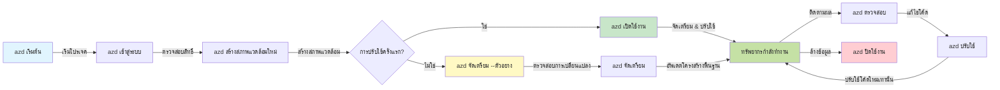
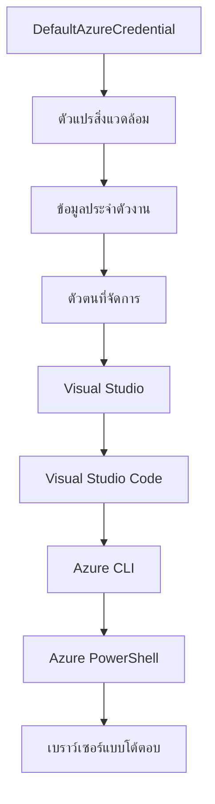

# AZD Basics - ความเข้าใจพื้นฐาน Azure Developer CLI

# AZD Basics - แนวคิดหลักและพื้นฐาน

**การนำทางบทเรียน:**
- **📚 หน้าโฮมคอร์ส**: [AZD สำหรับผู้เริ่มต้น](../../README.md)
- **📖 บทเรียนปัจจุบัน**: บทที่ 1 - พื้นฐาน & เริ่มต้นอย่างรวดเร็ว
- **⬅️ ก่อนหน้า**: [ภาพรวมคอร์ส](../../README.md#-chapter-1-foundation--quick-start)
- **➡️ ถัดไป**: [การติดตั้ง & การตั้งค่า](installation.md)
- **🚀 บทถัดไป**: [บทที่ 2: การพัฒนาแบบ AI-First](../chapter-02-ai-development/microsoft-foundry-integration.md)

## บทนำ

บทเรียนนี้จะแนะนำให้คุณรู้จักกับ Azure Developer CLI (azd) ซึ่งเป็นเครื่องมือบรรทัดคำสั่งที่ทรงพลัง ช่วยเร่งการเดินทางของคุณจากการพัฒนาในเครื่องสู่การปรับใช้บน Azure คุณจะได้เรียนรู้แนวคิดพื้นฐาน คุณสมบัติหลัก และเข้าใจว่า azd ช่วยให้การปรับใช้แอปพลิเคชันแบบคลาวด์เนทีฟง่ายขึ้นอย่างไร

## เป้าหมายการเรียนรู้

เมื่อจบบทเรียนนี้ คุณจะ:
- เข้าใจว่า Azure Developer CLI คืออะไร และวัตถุประสงค์หลักของมัน
- เรียนรู้แนวคิดหลักเกี่ยวกับเทมเพลต สภาพแวดล้อม และบริการต่างๆ
- สำรวจคุณสมบัติสำคัญ เช่น การพัฒนาแบบใช้เทมเพลตและ Infrastructure as Code
- เข้าใจโครงสร้างและกระบวนการทำงานของโปรเจค azd
- พร้อมติดตั้งและกำหนดค่า azd สำหรับสภาพแวดล้อมการพัฒนาของคุณ

## ผลลัพธ์การเรียนรู้

หลังจากเรียนบทนี้เสร็จ คุณจะสามารถ:
- อธิบายบทบาทของ azd ในกระบวนการพัฒนาคลาวด์สมัยใหม่
- ระบุส่วนประกอบของโครงสร้างโปรเจค azd
- อธิบายว่าเทมเพลต สภาพแวดล้อม และบริการทำงานร่วมกันอย่างไร
- เข้าใจประโยชน์ของ Infrastructure as Code กับ azd
- รับรู้คำสั่ง azd ต่างๆ และจุดประสงค์ของแต่ละคำสั่ง

## Azure Developer CLI (azd) คืออะไร?

Azure Developer CLI (azd) คือเครื่องมือบรรทัดคำสั่งที่ออกแบบมาเพื่อเร่งกระบวนการจากการพัฒนาในเครื่องสู่การปรับใช้บน Azure ช่วยให้กระบวนการสร้าง ปรับใช้ และจัดการแอปพลิเคชันคลาวด์เนทีฟบน Azure ง่ายขึ้น

### คุณสามารถปรับใช้อะไรได้บ้างด้วย azd?

azd รองรับงานหลายประเภท และรายการก็เพิ่มขึ้นเรื่อยๆ วันนี้คุณสามารถใช้ azd ในการปรับใช้:

| ประเภทงาน | ตัวอย่าง | กระบวนการเหมือนกัน? |
|---------------|----------|----------------|
| **แอปพลิเคชันแบบดั้งเดิม** | เว็บแอป, REST API, เว็บไซต์สแตติก | ✅ `azd up` |
| **บริการและไมโครเซอร์วิส** | Container Apps, Function Apps, แบ็คเอนด์หลายบริการ | ✅ `azd up` |
| **แอป AI ที่ขับเคลื่อนด้วย AI** | แอปแชทที่ใช้ Microsoft Foundry Models, โซลูชัน RAG ที่ใช้ AI Search | ✅ `azd up` |
| **เอเจนต์อัจฉริยะ** | เอเจนต์โฮสต์โดย Foundry, การประสานงานเอเจนต์หลายตัว | ✅ `azd up` |

ข้อมูลสำคัญคือ **วงจรชีวิตของ azd จะเหมือนกันไม่ว่าคุณจะปรับใช้สิ่งใด** คุณจะเริ่มโครงงาน กำหนดโครงสร้างพื้นฐาน ปรับใช้โค้ด ตรวจสอบแอป และล้างข้อมูล — ไม่ว่าจะเป็นเว็บไซต์ง่ายๆ หรือเอเจนต์ AI ที่ซับซ้อน

การดำเนินการนี้ถูกออกแบบมา azd ถือว่า AI เป็นบริการชนิดหนึ่งที่แอปของคุณใช้ ไม่ใช่สิ่งที่แตกต่างโดยพื้นฐาน จุดปลายทางแชทที่ใช้ Microsoft Foundry Models เป็นเพียงบริการอื่นที่ azd ต้องกำหนดค่าและปรับใช้

### 🎯 ทำไมต้องใช้ AZD? การเปรียบเทียบในโลกจริง

ลองเปรียบเทียบการปรับใช้เว็บแอปง่ายๆ กับฐานข้อมูล:

#### ❌ ไม่มี AZD: การปรับใช้ด้วยมือบน Azure (30+ นาที)

```bash
# ขั้นตอนที่ 1: สร้างกลุ่มทรัพยากร
az group create --name myapp-rg --location eastus

# ขั้นตอนที่ 2: สร้างแผนบริการแอป
az appservice plan create --name myapp-plan \
  --resource-group myapp-rg \
  --sku B1 --is-linux

# ขั้นตอนที่ 3: สร้างเว็บแอป
az webapp create --name myapp-web-unique123 \
  --resource-group myapp-rg \
  --plan myapp-plan \
  --runtime "NODE:18-lts"

# ขั้นตอนที่ 4: สร้างบัญชี Cosmos DB (10-15 นาที)
az cosmosdb create --name myapp-cosmos-unique123 \
  --resource-group myapp-rg \
  --kind MongoDB

# ขั้นตอนที่ 5: สร้างฐานข้อมูล
az cosmosdb mongodb database create \
  --account-name myapp-cosmos-unique123 \
  --resource-group myapp-rg \
  --name tododb

# ขั้นตอนที่ 6: สร้างคอลเลกชัน
az cosmosdb mongodb collection create \
  --account-name myapp-cosmos-unique123 \
  --resource-group myapp-rg \
  --database-name tododb \
  --name todos

# ขั้นตอนที่ 7: รับสตริงการเชื่อมต่อ
CONN_STR=$(az cosmosdb keys list \
  --name myapp-cosmos-unique123 \
  --resource-group myapp-rg \
  --type connection-strings \
  --query "connectionStrings[0].connectionString" -o tsv)

# ขั้นตอนที่ 8: กำหนดค่าการตั้งค่าแอป
az webapp config appsettings set \
  --name myapp-web-unique123 \
  --resource-group myapp-rg \
  --settings MONGODB_URI="$CONN_STR"

# ขั้นตอนที่ 9: เปิดใช้งานการบันทึกข้อมูล
az webapp log config --name myapp-web-unique123 \
  --resource-group myapp-rg \
  --application-logging filesystem \
  --detailed-error-messages true

# ขั้นตอนที่ 10: ตั้งค่า Application Insights
az monitor app-insights component create \
  --app myapp-insights \
  --location eastus \
  --resource-group myapp-rg

# ขั้นตอนที่ 11: ลิงก์ App Insights กับเว็บแอป
INSTRUMENTATION_KEY=$(az monitor app-insights component show \
  --app myapp-insights \
  --resource-group myapp-rg \
  --query "instrumentationKey" -o tsv)

az webapp config appsettings set \
  --name myapp-web-unique123 \
  --resource-group myapp-rg \
  --settings APPINSIGHTS_INSTRUMENTATIONKEY="$INSTRUMENTATION_KEY"

# ขั้นตอนที่ 12: สร้างแอปพลิเคชันในเครื่อง
npm install
npm run build

# ขั้นตอนที่ 13: สร้างแพ็กเกจการปรับใช้
zip -r app.zip . -x "*.git*" "node_modules/*"

# ขั้นตอนที่ 14: ปรับใช้แอปพลิเคชัน
az webapp deployment source config-zip \
  --resource-group myapp-rg \
  --name myapp-web-unique123 \
  --src app.zip

# ขั้นตอนที่ 15: รอและอธิษฐานให้มันสำเร็จ 🙏
# (ไม่มีการตรวจสอบอัตโนมัติ ต้องทดสอบด้วยตนเอง)
```

**ปัญหา:**
- ❌ ต้องจำและสั่งงานกว่า 15 คำสั่งตามลำดับ
- ❌ ใช้เวลาประมาณ 30-45 นาทีแบบแมนนวล
- ❌ ง่ายต่อการผิดพลาด (พิมพ์ผิด, พารามิเตอร์ผิด)
- ❌ สตริงการเชื่อมต่อแสดงในประวัติเทอร์มินัล
- ❌ ไม่มีการย้อนกลับอัตโนมัติหากเกิดข้อผิดพลาด
- ❌ ยากต่อการทำซ้ำสำหรับทีม
- ❌ แต่ละครั้งทำไม่เหมือนกัน (ไม่สามารถทำซ้ำได้)

#### ✅ ใช้ AZD: ปรับใช้โดยอัตโนมัติ (5 คำสั่ง, 10-15 นาที)

```bash
# ขั้นตอนที่ 1: เริ่มต้นจากแม่แบบ
azd init --template todo-nodejs-mongo

# ขั้นตอนที่ 2: ยืนยันตัวตน
azd auth login

# ขั้นตอนที่ 3: สร้างสภาพแวดล้อม
azd env new dev

# ขั้นตอนที่ 4: ดูตัวอย่างการเปลี่ยนแปลง (ไม่บังคับแต่แนะนำ)
azd provision --preview

# ขั้นตอนที่ 5: ติดตั้งทุกอย่าง
azd up

# ✨ เสร็จแล้ว! ทุกอย่างถูกติดตั้ง, ตั้งค่า และตรวจสอบเรียบร้อยแล้ว
```

**ประโยชน์:**
- ✅ **5 คำสั่ง** เทียบกับกว่า 15 ขั้นตอนแบบแมนนวล
- ✅ ใช้เวลารวม **10-15 นาที** (ส่วนใหญ่รอ Azure)
- ✅ **ลดข้อผิดพลาดแมนนวล** - กระบวนการเทมเพลตที่สม่ำเสมอ
- ✅ **จัดการความลับอย่างปลอดภัย** - เทมเพลตหลายตัวใช้ Azure secret storage
- ✅ **ปรับใช้ซ้ำได้** - กระบวนการเหมือนกันทุกครั้ง
- ✅ **ทำซ้ำได้สมบูรณ์** - ผลลัพธ์เหมือนกันทุกครั้ง
- ✅ **พร้อมสำหรับทีม** - ทุกคนปรับใช้ได้ด้วยคำสั่งเดียวกัน
- ✅ **Infrastructure as Code** - เทมเพลต Bicep ควบคุมเวอร์ชัน
- ✅ **การตรวจสอบในตัว** - Application Insights ตั้งค่าให้อัตโนมัติ

### 📊 การประหยัดเวลาและลดข้อผิดพลาด

| ตัวชี้วัด | การปรับใช้ด้วยมือ | การปรับใช้ด้วย AZD | การปรับปรุง |
|:-------|:------------------|:---------------|:------------|
| **คำสั่ง** | 15+ | 5 | ลดลง 67% |
| **เวลา** | 30-45 นาที | 10-15 นาที | เร็วขึ้น 60% |
| **อัตราข้อผิดพลาด** | ~40% | <5% | ลดลง 88% |
| **ความสม่ำเสมอ** | ต่ำ (แมนนวล) | 100% (อัตโนมัติ) | สมบูรณ์แบบ |
| **เวลาเริ่มต้นทีม** | 2-4 ชั่วโมง | 30 นาที | เร็วขึ้น 75% |
| **เวลาย้อนกลับ** | 30+ นาที (แมนนวล) | 2 นาที (อัตโนมัติ) | เร็วขึ้น 93% |

## แนวคิดหลัก

### เทมเพลต
เทมเพลตคือต้นแบบของ azd ประกอบด้วย:
- **โค้ดแอปพลิเคชัน** - โค้ดต้นทางและการพึ่งพา
- **คำจำกัดความโครงสร้างพื้นฐาน** - ทรัพยากร Azure กำหนดใน Bicep หรือ Terraform
- **ไฟล์กำหนดค่า** - การตั้งค่าและตัวแปรสภาพแวดล้อม
- **สคริปต์ปรับใช้** - กระบวนการปรับใช้แบบอัตโนมัติ

### สภาพแวดล้อม
สภาพแวดล้อมแทนเป้าหมายการปรับใช้ที่แตกต่างกัน:
- **พัฒนา** - สำหรับทดสอบและพัฒนา
- **สเตจจิ้ง** - สภาพแวดล้อมก่อนผลิต
- **ผลิต** - สภาพแวดล้อมจริง

แต่ละสภาพแวดล้อมมี:
- กลุ่มทรัพยากร Azure แยกต่างหาก
- การตั้งค่ากำหนดค่า
- สถานะการปรับใช้

### บริการ
บริการคือส่วนประกอบของแอปพลิเคชันคุณ:
- **ส่วนหน้า** - เว็บแอป, SPA
- **ส่วนหลัง** - API, ไมโครเซอร์วิส
- **ฐานข้อมูล** - โซลูชันเก็บข้อมูล
- **ที่เก็บข้อมูล** - ไฟล์และการเก็บ blob

## คุณสมบัติหลัก

### 1. การพัฒนาด้วยเทมเพลต
```bash
# เรียกดูแม่แบบที่มีอยู่
azd template list

# เริ่มต้นจากแม่แบบ
azd init --template <template-name>
```

### 2. Infrastructure as Code
- **Bicep** - ภาษาคำจำกัดความเฉพาะ Azure
- **Terraform** - เครื่องมือโครงสร้างพื้นฐานหลายคลาวด์
- **ARM Templates** - เทมเพลต Azure Resource Manager

### 3. กระบวนงานแบบบูรณาการ
```bash
# กระบวนการทำงานการปรับใช้ให้สมบูรณ์
azd up            # จัดหา + ปรับใช้ นี่คือการตั้งค่าเริ่มต้นโดยไม่ต้องใช้มือ

# 🧪 ใหม่: ดูตัวอย่างการเปลี่ยนแปลงโครงสร้างพื้นฐานก่อนปรับใช้ (ปลอดภัย)
azd provision --preview    # จำลองการปรับใช้โครงสร้างพื้นฐานโดยไม่ทำการเปลี่ยนแปลง

azd provision     # สร้างทรัพยากร Azure หากคุณอัปเดตโครงสร้างพื้นฐานให้ใช้สิ่งนี้
azd deploy        # ปรับใช้โค้ดแอปพลิเคชันหรือปรับใช้โค้ดแอปพลิเคชันใหม่เมื่อมีการอัปเดต
azd down          # ทำความสะอาดทรัพยากร
```

#### 🛡️ การวางแผนโครงสร้างพื้นฐานที่ปลอดภัยด้วย Preview
คำสั่ง `azd provision --preview` เป็นตัวช่วยสำคัญสำหรับการปรับใช้อย่างปลอดภัย:
- **วิเคราะห์ dry-run** - แสดงสิ่งที่จะถูกสร้าง เปลี่ยนแปลง หรือลบ
- **ไม่มีความเสี่ยง** - ไม่มีการเปลี่ยนแปลงจริงในสภาพแวดล้อม Azure
- **การทำงานร่วมทีม** - แชร์ผลลัพธ์ preview ก่อนปรับใช้
- **การประมาณค่าใช้จ่าย** - เข้าใจค่าใช้จ่ายทรัพยากรก่อนตัดสินใจ

```bash
# ตัวอย่างขั้นตอนการทำงานล่วงหน้า
azd provision --preview           # ดูว่ามีอะไรจะเปลี่ยนแปลงบ้าง
# ตรวจสอบผลลัพธ์, หารือกับทีม
azd provision                     # ใช้การเปลี่ยนแปลงด้วยความมั่นใจ
```

### 📊 ภาพแสดง: กระบวนการพัฒนา AZD


**คำอธิบายกระบวนงาน:**
1. **Init** - เริ่มต้นด้วยเทมเพลตหรือโปรเจคใหม่
2. **Auth** - ยืนยันตัวตนกับ Azure
3. **Environment** - สร้างสภาพแวดล้อมปรับใช้แยกต่างหาก
4. **Preview** - 🆕 preview การเปลี่ยนแปลงโครงสร้างพื้นฐานเสมอ (แนวปฏิบัติปลอดภัย)
5. **Provision** - สร้าง/อัปเดตทรัพยากร Azure
6. **Deploy** - ดันโค้ดแอปพลิเคชัน
7. **Monitor** - สังเกตการณ์ประสิทธิภาพแอป
8. **Iterate** - เปลี่ยนแปลงและปรับใช้โค้ดใหม่
9. **Cleanup** - ลบทรัพยากรเมื่อเสร็จสิ้น

### 4. การจัดการสภาพแวดล้อม
```bash
# สร้างและจัดการสภาพแวดล้อม
azd env new <environment-name>
azd env select <environment-name>
azd env list
```

### 5. ส่วนขยายและคำสั่ง AI

azd ใช้ระบบส่วนขยายเพื่อเพิ่มความสามารถนอกเหนือจาก CLI หลัก ซึ่งมีประโยชน์มากสำหรับงาน AI:

```bash
# แสดงรายการส่วนขยายที่มีอยู่
azd extension list

# ติดตั้งส่วนขยายตัวแทน Foundry
azd extension install azure.ai.agents

# เริ่มต้นโครงการตัวแทน AI จากไฟล์ manifest
azd ai agent init -m agent-manifest.yaml

# เริ่มเซิร์ฟเวอร์ MCP สำหรับการพัฒนาด้วย AI (อัลฟา)
azd mcp start
```

> ส่วนขยายจะอธิบายโดยละเอียดใน [บทที่ 2: การพัฒนาแบบ AI-First](../chapter-02-ai-development/agents.md) และ เอกสารอ้างอิง [AZD AI CLI Commands](../chapter-08-production/production-ai-practices.md#azd-ai-cli-commands-and-extensions)

## 📁 โครงสร้างโปรเจค

โครงสร้างโปรเจค azd ทั่วไป:
```
my-app/
├── .azd/                    # azd configuration
│   └── config.json
├── .azure/                  # Azure deployment artifacts
├── .devcontainer/          # Development container config
├── .github/workflows/      # GitHub Actions
├── .vscode/               # VS Code settings
├── infra/                 # Infrastructure code
│   ├── main.bicep        # Main infrastructure template
│   ├── main.parameters.json
│   └── modules/          # Reusable modules
├── src/                  # Application source code
│   ├── api/             # Backend services
│   └── web/             # Frontend application
├── azure.yaml           # azd project configuration
└── README.md
```

## 🔧 ไฟล์กำหนดค่า

### azure.yaml
ไฟล์กำหนดค่าโปรเจคหลัก:
```yaml
name: my-awesome-app
metadata:
  template: my-template@1.0.0

services:
  web:
    project: ./src/web
    language: js
    host: appservice
  api:
    project: ./src/api
    language: js
    host: appservice

hooks:
  preprovision:
    shell: pwsh
    run: echo "Preparing to provision..."
```

### .azure/config.json
การกำหนดค่าสภาพแวดล้อมเฉพาะ:
```json
{
  "version": 1,
  "defaultEnvironment": "dev",
  "environments": {
    "dev": {
      "subscriptionId": "your-subscription-id",
      "location": "eastus"
    }
  }
}
```

## 🎪 กระบวนงานทั่วไปพร้อมแบบฝึกหัด

> **💡 เคล็ดลับการเรียนรู้:** ทำแบบฝึกหัดเหล่านี้ตามลำดับเพื่อสร้างทักษะ AZD ของคุณอย่างต่อเนื่อง

### 🎯 แบบฝึกหัด 1: สร้างโปรเจคแรกของคุณ

**เป้าหมาย:** สร้างโปรเจค AZD และสำรวจโครงสร้าง

**ขั้นตอน:**
```bash
# ใช้เทมเพลตที่ผ่านการพิสูจน์แล้ว
azd init --template todo-nodejs-mongo

# สำรวจไฟล์ที่สร้างขึ้น
ls -la  # ดูไฟล์ทั้งหมดรวมถึงไฟล์ที่ซ่อนอยู่

# ไฟล์สำคัญที่ถูกสร้าง:
# - azure.yaml (การตั้งค่าหลัก)
# - infra/ (โค้ดโครงสร้างพื้นฐาน)
# - src/ (โค้ดแอปพลิเคชัน)
```

**✅ สำเร็จ:** คุณมีไดเรกทอรี azure.yaml, infra/, และ src/

---

### 🎯 แบบฝึกหัด 2: ปรับใช้บน Azure

**เป้าหมาย:** ทำการปรับใช้งานจากต้นจนจบ

**ขั้นตอน:**
```bash
# 1. ตรวจสอบสิทธิ์
az login && azd auth login

# 2. สร้างสภาพแวดล้อม
azd env new dev
azd env set AZURE_LOCATION eastus

# 3. ดูตัวอย่างการเปลี่ยนแปลง (แนะนำ)
azd provision --preview

# 4. ติดตั้งทั้งหมด
azd up

# 5. ตรวจสอบการติดตั้ง
azd show    # ดู URL แอปของคุณ
```

**เวลาที่คาดหวัง:** 10-15 นาที  
**✅ สำเร็จ:** URL แอปเปิดในเบราว์เซอร์

---

### 🎯 แบบฝึกหัด 3: หลายสภาพแวดล้อม

**เป้าหมาย:** ปรับใช้ใน dev และ staging

**ขั้นตอน:**
```bash
# มี dev แล้ว สร้าง staging
azd env new staging
azd env set AZURE_LOCATION westus2
azd up

# สลับใช้งานระหว่างกัน
azd env list
azd env select dev
```

**✅ สำเร็จ:** กลุ่มทรัพยากรสองกลุ่มแยกกันใน Azure Portal

---

### 🛡️ รีเซ็ตอย่างสมบูรณ์: `azd down --force --purge`

เมื่อคุณต้องการเริ่มต้นใหม่อย่างสมบูรณ์:

```bash
azd down --force --purge
```

**สิ่งที่ทำ:**
- `--force`: ไม่ต้องยืนยันคำสั่ง
- `--purge`: ลบสถานะท้องถิ่นและทรัพยากร Azure ทั้งหมด

**ใช้เมื่อ:**
- การปรับใช้ล้มเหลวกึ่งกลางทาง
- เปลี่ยนโปรเจค
- ต้องการเริ่มใหม่

---

## 🎪 การอ้างอิงกระบวนงานต้นฉบับ

### การเริ่มโปรเจคใหม่
```bash
# วิธีที่ 1: ใช้เทมเพลตที่มีอยู่
azd init --template todo-nodejs-mongo

# วิธีที่ 2: เริ่มจากศูนย์
azd init

# วิธีที่ 3: ใช้ไดเรกทอรีปัจจุบัน
azd init .
```

### วงจรการพัฒนา
```bash
# ตั้งค่าสภาพแวดล้อมการพัฒนา
azd auth login
azd env new dev
azd env select dev

# นำส่งทุกอย่าง
azd up

# ทำการเปลี่ยนแปลงและนำส่งใหม่
azd deploy

# ทำความสะอาดเมื่อเสร็จแล้ว
azd down --force --purge # คำสั่งใน Azure Developer CLI เป็น **การรีเซ็ตหนัก** สำหรับสภาพแวดล้อมของคุณ—เหมาะอย่างยิ่งเมื่อคุณกำลังแก้ไขปัญหาการนำส่งที่ล้มเหลว ทำความสะอาดทรัพยากรที่เหลือ หรือเตรียมพร้อมสำหรับการนำส่งใหม่ทั้งหมด
```

## การเข้าใจ `azd down --force --purge`
คำสั่ง `azd down --force --purge` เป็นวิธีที่ทรงพลังในการลบสภาพแวดล้อม azd และทรัพยากรที่เกี่ยวข้องทั้งหมด อธิบายการทำงานแต่ละแฟล็ก:
```
--force
```
- ข้ามการยืนยันคำสั่ง
- ใช้สำหรับการทำงานอัตโนมัติหรือสคริปต์ที่ไม่ต้องการป้อนข้อมูลด้วยมือ
- ทำให้การรื้อถอนดำเนินต่อได้โดยไม่ขัดจังหวะ แม้ว่ามีความไม่สอดคล้องกันใน CLI

```
--purge
```
ลบ **เมแทดาต้าทั้งหมด** รวมถึง:
สถานะสภาพแวดล้อม  
โฟลเดอร์ `.azure` ท้องถิ่น  
ข้อมูลการปรับใช้ที่แคชไว้  
ป้องกันไม่ให้ azd “จำ” การปรับใช้ก่อนหน้า ซึ่งอาจก่อปัญหา เช่น กลุ่มทรัพยากรไม่ตรงกันหรือการอ้างอิงรีจิสทรีเก่า

### ทำไมต้องใช้ทั้งคู่?
เมื่อ `azd up` ติดขัดเพราะสถานะค้างอยู่หรือปรับใช้ไม่ครบ การใช้ชุดคำสั่งนี้ช่วยให้คุณได้ **เริ่มต้นใหม่อย่างสมบูรณ์**

มีประโยชน์มากโดยเฉพาะหลังจากลบทรัพยากรด้วยมือในพอร์ทัล Azure หรือเมื่อเปลี่ยนเทมเพลต สภาพแวดล้อม หรือรูปแบบการตั้งชื่อกลุ่มทรัพยากร

### การจัดการหลายสภาพแวดล้อม
```bash
# สร้างสภาพแวดล้อมสำหรับการทดสอบ
azd env new staging
azd env select staging
azd up

# สลับกลับไปที่การพัฒนา
azd env select dev

# เปรียบเทียบสภาพแวดล้อม
azd env list
```

## 🔐 การยืนยันตัวตนและข้อมูลรับรอง

ความเข้าใจเรื่องการยืนยันตัวตนสำคัญต่อความสำเร็จในการปรับใช้ด้วย azd Azure ใช้วิธีการยืนยันตัวตนหลายแบบ และ azd ใช้สายโซ่ข้อมูลรับรองเดียวกับเครื่องมือ Azure อื่นๆ

### การยืนยันตัวตนด้วย Azure CLI (`az login`)

ก่อนใช้ azd คุณต้องยืนยันตัวตนกับ Azure วิธีที่ใช้บ่อยคือ Azure CLI:

```bash
# การเข้าสู่ระบบแบบโต้ตอบ (เปิดเบราว์เซอร์)
az login

# เข้าสู่ระบบด้วยผู้เช่าเฉพาะ
az login --tenant <tenant-id>

# เข้าสู่ระบบด้วย service principal
az login --service-principal -u <app-id> -p <password> --tenant <tenant-id>

# ตรวจสอบสถานะการเข้าสู่ระบบปัจจุบัน
az account show

# แสดงรายการการสมัครสมาชิกรายการที่มี
az account list --output table

# ตั้งค่าการสมัครสมาชิกเริ่มต้น
az account set --subscription <subscription-id>
```

### กระบวนการยืนยันตัวตน
1. **เข้าสู่ระบบแบบโต้ตอบ**: เปิดเบราว์เซอร์เริ่มการยืนยันตัวตน
2. **วิธีรหัสอุปกรณ์**: สำหรับสภาพแวดล้อมที่ไม่มีเบราว์เซอร์
3. **Service Principal**: สำหรับงานอัตโนมัติและ CI/CD
4. **Managed Identity**: สำหรับแอปที่โฮสต์ใน Azure

### สายโซ่ DefaultAzureCredential

`DefaultAzureCredential` เป็นประเภทข้อมูลรับรองที่ให้ประสบการณ์การยืนยันตัวตนที่ง่ายขึ้น โดยจะพยายามเรียกใช้แหล่งข้อมูลรับรองหลายแหล่งตามลำดับที่กำหนด:

#### ลำดับสายโซ่ข้อมูลรับรอง

#### 1. ตัวแปรสภาพแวดล้อม
```bash
# ตั้งค่าตัวแปรแวดล้อมสำหรับ service principal
export AZURE_CLIENT_ID="<app-id>"
export AZURE_CLIENT_SECRET="<password>"
export AZURE_TENANT_ID="<tenant-id>"
```

#### 2. Workload Identity (Kubernetes/GitHub Actions)
ใช้โดยอัตโนมัติใน:
- Azure Kubernetes Service (AKS) กับ Workload Identity
- GitHub Actions กับการเชื่อมต่อ OIDC
- กรณี identity federation อื่นๆ

#### 3. Managed Identity
สำหรับทรัพยากร Azure เช่น:
- Virtual Machines
- App Service
- Azure Functions
- Container Instances

```bash
# ตรวจสอบว่ากำลังทำงานบนทรัพยากร Azure ที่มี managed identity หรือไม่
az account show --query "user.type" --output tsv
# คืนค่า: "servicePrincipal" หากใช้ managed identity
```

#### 4. การรวมกับเครื่องมือพัฒนา
- **Visual Studio**: ใช้บัญชีที่ลงชื่อเข้าใช้โดยอัตโนมัติ
- **VS Code**: ใช้ข้อมูลรับรองของ Azure Account extension
- **Azure CLI**: ใช้ข้อมูลรับรองจาก `az login` (วิธีที่ใช้บ่อยสุดสำหรับการพัฒนาในเครื่อง)

### การตั้งค่าการยืนยันตัวตนของ AZD

```bash
# วิธีที่ 1: ใช้ Azure CLI (แนะนำสำหรับการพัฒนา)
az login
azd auth login  # ใช้ข้อมูลประจำตัว Azure CLI ที่มีอยู่

# วิธีที่ 2: การยืนยันตัวตน azd โดยตรง
azd auth login --use-device-code  # สำหรับสภาพแวดล้อมแบบไม่มีส่วนต่อประสานผู้ใช้

# วิธีที่ 3: ตรวจสอบสถานะการยืนยันตัวตน
azd auth login --check-status

# วิธีที่ 4: ออกจากระบบและเข้าสู่ระบบใหม่อีกครั้ง
azd auth logout
azd auth login
```

### แนวทางปฏิบัติที่ดีที่สุดเกี่ยวกับการยืนยันตัวตน

#### สำหรับการพัฒนาในเครื่อง
```bash
# 1. เข้าสู่ระบบด้วย Azure CLI
az login

# 2. ตรวจสอบการสมัครใช้งานที่ถูกต้อง
az account show
az account set --subscription "Your Subscription Name"

# 3. ใช้ azd กับข้อมูลประจำตัวที่มีอยู่แล้ว
azd auth login
```

#### สำหรับ CI/CD Pipeline
```yaml
# GitHub Actions example
- name: Azure Login
  uses: azure/login@v1
  with:
    creds: ${{ secrets.AZURE_CREDENTIALS }}

- name: Deploy with azd
  run: |
    azd auth login --client-id ${{ secrets.AZURE_CLIENT_ID }} \
                    --client-secret ${{ secrets.AZURE_CLIENT_SECRET }} \
                    --tenant-id ${{ secrets.AZURE_TENANT_ID }}
    azd up --no-prompt
```

#### สำหรับสภาพแวดล้อมการผลิต
- ใช้ **Managed Identity** เมื่อรันบนทรัพยากร Azure
- ใช้ **Service Principal** สำหรับงานอัตโนมัติ
- หลีกเลี่ยงการเก็บข้อมูลรับรองในโค้ดหรือไฟล์กำหนดค่า
- ใช้ **Azure Key Vault** สำหรับการตั้งค่าที่ละเอียดอ่อน

### ปัญหาการยืนยันตัวตนทั่วไปและวิธีแก้ไข

#### ปัญหา: "ไม่พบการสมัครใช้งาน"
```bash
# วิธีแก้ไข: ตั้งค่าการสมัครสมาชิกเป็นค่าเริ่มต้น
az account list --output table
az account set --subscription "<subscription-id>"
azd env set AZURE_SUBSCRIPTION_ID "<subscription-id>"
```

#### ปัญหา: "สิทธิ์ไม่เพียงพอ"
```bash
# วิธีแก้ปัญหา: ตรวจสอบและกำหนดบทบาทที่จำเป็น
az role assignment list --assignee $(az account show --query user.name --output tsv)

# บทบาทที่จำเป็นทั่วไป:
# - ผู้ร่วม (สำหรับการจัดการทรัพยากร)
# - ผู้ดูแลการเข้าถึงของผู้ใช้ (สำหรับการกำหนดบทบาท)
```

#### ปัญหา: "โทเคนหมดอายุ"
```bash
# วิธีแก้ไข: ตรวจสอบสิทธิ์ใหม่อีกครั้ง
az logout
az login
azd auth logout
azd auth login
```

### การยืนยันตัวตนในสถานการณ์ต่างๆ

#### การพัฒนาในเครื่อง
```bash
# บัญชีพัฒนาตนเอง
az login
azd auth login
```

#### การพัฒนาทีม
```bash
# ใช้ผู้เช่าเฉพาะสำหรับองค์กร
az login --tenant contoso.onmicrosoft.com
azd auth login
```

#### กรณีหลายผู้เช่า
```bash
# สลับระหว่างผู้เช่า
az login --tenant tenant1.onmicrosoft.com
# ปรับใช้ไปยังผู้เช่าหมายเลข 1
azd up

az login --tenant tenant2.onmicrosoft.com  
# ปรับใช้ไปยังผู้เช่าหมายเลข 2
azd up
```

### ข้อควรพิจารณาทางด้านความปลอดภัย
1. **การจัดเก็บข้อมูลรับรอง**: ห้ามเก็บข้อมูลรับรองในซอร์สโค้ด
2. **การจำกัดขอบเขต**: ใช้หลักการสิทธิ์น้อยที่สุดสำหรับ service principals
3. **การหมุนเวียนโทเค็น**: หมุนเวียนความลับของ service principal เป็นประจำ
4. **การตรวจสอบย้อนหลัง**: ตรวจสอบกิจกรรมการพิสูจน์ตัวตนและการปรับใช้งาน
5. **ความปลอดภัยเครือข่าย**: ใช้ private endpoints เมื่อเป็นไปได้

### การแก้ไขปัญหาการพิสูจน์ตัวตน

```bash
# แก้ไขปัญหาการตรวจสอบสิทธิ์
azd auth login --check-status
az account show
az account get-access-token

# คำสั่งวินิจฉัยทั่วไป
whoami                          # บริบทของผู้ใช้ปัจจุบัน
az ad signed-in-user show      # รายละเอียดผู้ใช้ Azure AD
az group list                  # ทดสอบการเข้าถึงทรัพยากร
```

## ทำความเข้าใจ `azd down --force --purge`

### การค้นพบ
```bash
azd template list              # เรียกดูแม่แบบ
azd template show <template>   # รายละเอียดแม่แบบ
azd init --help               # ตัวเลือกการเริ่มต้นใช้งาน
```

### การจัดการโครงการ
```bash
azd show                     # ภาพรวมโครงการ
azd env list                # สภาพแวดล้อมที่มีอยู่และค่าเริ่มต้นที่เลือก
azd config show            # การตั้งค่าการกำหนดค่า
```

### การตรวจสอบ
```bash
azd monitor                  # เปิดการตรวจสอบพอร์ทัล Azure
azd monitor --logs           # ดูบันทึกการใช้งานแอปพลิเคชัน
azd monitor --live           # ดูเมตริกสด
azd pipeline config          # ตั้งค่า CI/CD
```

## แนวทางปฏิบัติที่ดีที่สุด

### 1. ใช้ชื่อที่มีความหมาย
```bash
# ดี
azd env new production-east
azd init --template web-app-secure

# หลีกเลี่ยง
azd env new env1
azd init --template template1
```

### 2. ใช้เทมเพลต
- เริ่มต้นด้วยเทมเพลตที่มีอยู่
- ปรับแต่งให้ตรงกับความต้องการของคุณ
- สร้างเทมเพลตที่นำกลับมาใช้ซ้ำได้สำหรับองค์กรของคุณ

### 3. การแยกสภาพแวดล้อม
- ใช้สภาพแวดล้อมแยกต่างหากสำหรับ dev/staging/prod
- ห้ามปรับใช้ตรงไปยัง production จากเครื่องท้องถิ่นโดยตรง
- ใช้ CI/CD pipelines สำหรับการปรับใช้ใน production

### 4. การจัดการการตั้งค่า
- ใช้ environment variables สำหรับข้อมูลที่ละเอียดอ่อน
- เก็บการตั้งค่าในระบบควบคุมเวอร์ชัน
- บันทึกการตั้งค่าที่เฉพาะเจาะจงในแต่ละสภาพแวดล้อม

## การเรียนรู้ลำดับขั้น

### มือใหม่ (สัปดาห์ที่ 1-2)
1. ติดตั้ง azd และพิสูจน์ตัวตน
2. ปรับใช้เทมเพลตเรียบง่าย
3. เข้าใจโครงสร้างโครงการ
4. เรียนรู้คำสั่งพื้นฐาน (up, down, deploy)

### ระดับกลาง (สัปดาห์ที่ 3-4)
1. ปรับแต่งเทมเพลต
2. จัดการหลายสภาพแวดล้อม
3. เข้าใจโค้ดโครงสร้างพื้นฐาน
4. ตั้งค่า CI/CD pipelines

### ขั้นสูง (สัปดาห์ที่ 5 ขึ้นไป)
1. สร้างเทมเพลตที่กำหนดเอง
2. รูปแบบโครงสร้างพื้นฐานขั้นสูง
3. การปรับใช้หลายภูมิภาค
4. การตั้งค่าระดับองค์กร

## ขั้นตอนต่อไป

**📖 เรียนรู้ต่อในบทที่ 1:**
- [การติดตั้ง & การตั้งค่า](installation.md) - ติดตั้งและตั้งค่า azd
- [โครงการแรกของคุณ](first-project.md) - ทำแบบฝึกปฏิบัติแบบครบถ้วน
- [คู่มือการตั้งค่า](configuration.md) - ตัวเลือกการตั้งค่าขั้นสูง

**🎯 พร้อมสำหรับบทต่อไปไหม?**
- [บทที่ 2: การพัฒนาด้วย AI เป็นหลัก](../chapter-02-ai-development/microsoft-foundry-integration.md) - เริ่มสร้างแอป AI

## ทรัพยากรเพิ่มเติม

- [ภาพรวม Azure Developer CLI](https://learn.microsoft.com/en-us/azure/developer/azure-developer-cli/)
- [คลังเทมเพลต](https://azure.github.io/awesome-azd/)
- [ตัวอย่างจากชุมชน](https://github.com/Azure-Samples)

---

## 🙋 คำถามที่พบบ่อย

### คำถามทั่วไป

**ถาม: AZD กับ Azure CLI แตกต่างกันอย่างไร?**

ตอบ: Azure CLI (`az`) ใช้สำหรับจัดการทรัพยากร Azure แต่ละตัว ส่วน AZD (`azd`) จัดการแอปพลิเคชันทั้งหมด:

```bash
# Azure CLI - การจัดการทรัพยากรระดับต่ำ
az webapp create --name myapp --resource-group rg
az sql server create --name myserver --resource-group rg
# ...ยังต้องการคำสั่งอีกมากมาย

# AZD - การจัดการระดับแอปพลิเคชัน
azd up  # ปล่อยใช้งานแอปทั้งหมดพร้อมทรัพยากรทั้งหมด
```

**คิดแบบนี้:**
- `az` = การจัดการอิฐ Lego ทีละก้อน
- `azd` = ทำงานกับชุด Lego แบบสมบูรณ์

---

**ถาม: ต้องรู้ Bicep หรือ Terraform เพื่อใช้ AZD หรือไม่?**

ตอบ: ไม่ต้อง! เริ่มด้วยเทมเพลต:
```bash
# ใช้เทมเพลตที่มีอยู่ - ไม่ต้องการความรู้ IaC
azd init --template todo-nodejs-mongo
azd up
```

คุณสามารถเรียนรู้ Bicep ในภายหลังเพื่อปรับแต่งโครงสร้างพื้นฐาน เทมเพลตจะให้ตัวอย่างที่ทำงานได้เพื่อเรียนรู้

---

**ถาม: ค่าใช้จ่ายในการรันเทมเพลต AZD เป็นเท่าไหร่?**

ตอบ: ค่าใช้จ่ายขึ้นอยู่กับแต่ละเทมเพลต ส่วนใหญ่เทมเพลตสำหรับพัฒนามีค่าใช้จ่ายประมาณ $50-150/เดือน:

```bash
# ดูตัวอย่างค่าใช้จ่ายก่อนการปรับใช้
azd provision --preview

# ทำความสะอาดเสมอเมื่อไม่ใช้งาน
azd down --force --purge  # ลบทรัพยากรทั้งหมด
```

**คำแนะนำมือโปร:** ใช้ระดับฟรีหากมี:
- App Service: ระดับ F1 (ฟรี)
- Microsoft Foundry Models: Azure OpenAI 50,000 โทเค็น/เดือน ฟรี
- Cosmos DB: ระดับ 1000 RU/s ฟรี

---

**ถาม: ฉันสามารถใช้ AZD กับทรัพยากร Azure ที่มีอยู่ได้ไหม?**

ตอบ: ได้ แต่จะง่ายกว่าถ้าเริ่มใหม่ AZD จะทำงานได้ดีที่สุดเมื่อจัดการวงจรชีวิตทั้งหมด สำหรับทรัพยากรที่มีอยู่:

```bash
# ตัวเลือก 1: นำเข้าทรัพยากรที่มีอยู่แล้ว (ขั้นสูง)
azd init
# จากนั้นแก้ไข infra/ เพื่ออ้างอิงถึงทรัพยากรที่มีอยู่

# ตัวเลือก 2: เริ่มใหม่ (แนะนำ)
azd init --template matching-your-stack
azd up  # สร้างสภาพแวดล้อมใหม่
```

---

**ถาม: ฉันจะแบ่งปันโครงการกับเพื่อนร่วมทีมอย่างไร?**

ตอบ: คอมมิตโครงการ AZD ไปยัง Git (แต่ห้ามคอมมิตโฟลเดอร์ .azure):

```bash
# มีอยู่ใน .gitignore โดยค่าเริ่มต้น
.azure/        # ประกอบด้วยความลับและข้อมูลสภาพแวดล้อม
*.env          # ตัวแปรสภาพแวดล้อม

# สมาชิกทีมเมื่อ:
git clone <your-repo>
azd auth login
azd env new <their-name>-dev
azd up
```

ทุกคนจะได้รับโครงสร้างพื้นฐานที่เหมือนกันจากเทมเพลตชุดเดียวกัน

---

### คำถามการแก้ไขปัญหา

**ถาม: "azd up" ล้มเหลวกึ่งทาง ฉันควรทำอย่างไร?**

ตอบ: ตรวจสอบข้อผิดพลาด แก้ไข แล้วลองใหม่:

```bash
# ดูบันทึกรายละเอียด
azd show

# การแก้ไขทั่วไป:

# 1. หากเกินโควต้า:
azd env set AZURE_LOCATION "westus2"  # ลองภูมิภาคอื่น

# 2. หากชื่อทรัพยากรซ้ำ:
azd down --force --purge  # เริ่มต้นใหม่
azd up  # ลองใหม่

# 3. หากการตรวจสอบสิทธิ์หมดอายุ:
az login
azd auth login
azd up
```

**ปัญหายอดนิยม:** เลือก Azure subscription ผิด
```bash
az account list --output table
az account set --subscription "<correct-subscription>"
```

---

**ถาม: ฉันจะปรับใช้แค่โค้ดที่เปลี่ยนโดยไม่ต้อง reprovision ได้อย่างไร?**

ตอบ: ใช้ `azd deploy` แทน `azd up`:

```bash
azd up          # ครั้งแรก: จัดเตรียม + การปรับใช้ (ช้า)

# ทำการเปลี่ยนแปลงโค้ด...

azd deploy      # ครั้งถัดไป: ปรับใช้เท่านั้น (เร็ว)
```

เปรียบเทียบความเร็ว:
- `azd up`: 10-15 นาที (จัดเตรียมโครงสร้างพื้นฐาน)
- `azd deploy`: 2-5 นาที (โค้ดเท่านั้น)

---

**ถาม: ฉันจะปรับแต่งเทมเพลตโครงสร้างพื้นฐานได้อย่างไร?**

ตอบ: ได้แน่นอน! แก้ไขไฟล์ Bicep ในโฟลเดอร์ `infra/`:

```bash
# หลังจาก azd init
cd infra/
code main.bicep  # แก้ไขใน VS Code

# ดูตัวอย่างการเปลี่ยนแปลง
azd provision --preview

# ใช้การเปลี่ยนแปลง
azd provision
```

**คำแนะนำ:** เริ่มจากขนาดเล็ก - เปลี่ยน SKU ก่อน:
```bicep
// infra/main.bicep
sku: {
  name: 'B1'  // Change to 'P1V2' for production
}
```

---

**ถาม: ฉันจะลบทุกอย่างที่ AZD สร้างขึ้นได้อย่างไร?**

ตอบ: ใช้คำสั่งเดียวเพื่อลบทรัพยากรทั้งหมด:

```bash
azd down --force --purge

# นี่จะลบ:
# - ทรัพยากร Azure ทั้งหมด
# - กลุ่มทรัพยากร
# - สถานะสภาพแวดล้อมภายในเครื่อง
# - ข้อมูลการปรับใช้ที่แคชไว้
```

**ควรรันคำสั่งนี้เมื่อ:**
- ทดสอบเทมเพลตเสร็จแล้ว
- เปลี่ยนไปโครงการอื่น
- ต้องการเริ่มใหม่

**ประหยัดค่าใช้จ่าย:** การลบทรัพยากรที่ไม่ใช้แล้ว = ไม่มีค่าใช้จ่าย

---

**ถาม: ถ้าฉันเผลอลบทรัพยากรใน Azure Portal จะทำอย่างไร?**

ตอบ: สถานะ AZD อาจไม่ตรงกัน วิธีแก้คือเริ่มต้นใหม่:

```bash
# 1. ลบสถานะท้องถิ่น
azd down --force --purge

# 2. เริ่มต้นใหม่
azd up

# ทางเลือก: ให้ AZD ตรวจจับและแก้ไข
azd provision  # จะสร้างทรัพยากรที่ขาดหายไป
```

---

### คำถามขั้นสูง

**ถาม: ฉันสามารถใช้ AZD ใน CI/CD pipelines ได้ไหม?**

ตอบ: ได้! ตัวอย่าง GitHub Actions:

```yaml
# .github/workflows/deploy.yml
name: Deploy with AZD

on:
  push:
    branches: [main]

jobs:
  deploy:
    runs-on: ubuntu-latest
    steps:
      - uses: actions/checkout@v2
      
      - name: Install azd
        run: curl -fsSL https://aka.ms/install-azd.sh | bash
      
      - name: Azure Login
        run: |
          azd auth login \
            --client-id ${{ secrets.AZURE_CLIENT_ID }} \
            --client-secret ${{ secrets.AZURE_CLIENT_SECRET }} \
            --tenant-id ${{ secrets.AZURE_TENANT_ID }}
      
      - name: Deploy
        run: azd up --no-prompt
```

---

**ถาม: ฉันจะจัดการความลับและข้อมูลที่ละเอียดอ่อนได้อย่างไร?**

ตอบ: AZD ผสานรวมกับ Azure Key Vault อัตโนมัติ:

```bash
# ความลับถูกเก็บไว้ใน Key Vault ไม่ใช่ในโค้ด
azd env set DATABASE_PASSWORD "$(openssl rand -base64 32)"

# AZD ทำงานโดยอัตโนมัติ:
# 1. สร้าง Key Vault
# 2. เก็บความลับ
# 3. ให้สิทธิ์แอปเข้าถึงผ่าน Managed Identity
# 4. ฉีดในเวลารันไทม์
```

**ห้ามคอมมิต:**
- โฟลเดอร์ `.azure/` (เก็บข้อมูลสภาพแวดล้อม)
- ไฟล์ `.env` (ความลับท้องถิ่น)
- สายการเชื่อมต่อ

---

**ถาม: ฉันจะปรับใช้หลายภูมิภาคได้ไหม?**

ตอบ: ได้ สร้างสภาพแวดล้อมแยกตามภูมิภาค:

```bash
# สภาพแวดล้อมภาคตะวันออกของสหรัฐอเมริกา
azd env new prod-eastus
azd env set AZURE_LOCATION eastus
azd up

# สภาพแวดล้อมภาคตะวันตกของยุโรป
azd env new prod-westeurope
azd env set AZURE_LOCATION westeurope
azd up

# แต่ละสภาพแวดล้อมเป็นอิสระจากกัน
azd env list
```

สำหรับแอปหลายภูมิภาคจริงๆ ปรับแต่งเทมเพลต Bicep เพื่อปรับใช้พร้อมกันหลายภูมิภาค

---

**ถาม: ฉันจะหาความช่วยเหลือได้จากที่ไหนเมื่อเกิดติดขัด?**

1. **เอกสาร AZD:** https://learn.microsoft.com/azure/developer/azure-developer-cli/
2. **GitHub Issues:** https://github.com/Azure/azure-dev/issues
3. **Discord:** [Azure Discord](https://discord.gg/microsoft-azure) - ช่อง #azure-developer-cli
4. **Stack Overflow:** แท็ก `azure-developer-cli`
5. **คอร์สนี้:** [คู่มือแก้ไขปัญหาพื้นฐาน](../chapter-07-troubleshooting/common-issues.md)

**คำแนะนำมือโปร:** ก่อนถาม ควรรัน:
```bash
azd show       # แสดงสถานะปัจจุบัน
azd version    # แสดงเวอร์ชันของคุณ
```
ใส่ข้อมูลนี้ในคำถามเพื่อรับความช่วยเหลือเร็วขึ้น

---

## 🎓 ขั้นตอนถัดไป?

ตอนนี้คุณเข้าใจพื้นฐาน AZD แล้ว เลือกเส้นทางของคุณ:

### 🎯 สำหรับมือใหม่:
1. **ต่อไป:** [การติดตั้ง & การตั้งค่า](installation.md) - ติดตั้ง AZD บนเครื่องของคุณ
2. **ถัดไป:** [โครงการแรกของคุณ](first-project.md) - ปรับใช้แอปแรกของคุณ
3. **ฝึกฝน:** ทำแบบฝึกหัดทั้งหมด 3 บทในบทเรียนนี้

### 🚀 สำหรับนักพัฒนา AI:
1. **ข้ามไป:** [บทที่ 2: การพัฒนาด้วย AI เป็นหลัก](../chapter-02-ai-development/microsoft-foundry-integration.md)
2. **ปรับใช้:** เริ่มด้วย `azd init --template get-started-with-ai-chat`
3. **เรียนรู้:** สร้างขณะปรับใช้

### 🏗️ สำหรับนักพัฒนาที่มีประสบการณ์:
1. **ทบทวน:** [คู่มือการตั้งค่า](configuration.md) - การตั้งค่าขั้นสูง
2. **สำรวจ:** [Infrastructure as Code](../chapter-04-infrastructure/provisioning.md) - เจาะลึก Bicep
3. **สร้าง:** สร้างเทมเพลตที่กำหนดเองสำหรับสแต็กของคุณ

---

**การนำทางบท:**
- **📚 หน้าแรกคอร์ส**: [AZD สำหรับผู้เริ่มต้น](../../README.md)
- **📖 บทปัจจุบัน**: บทที่ 1 - พื้นฐาน & เริ่มต้นอย่างรวดเร็ว  
- **⬅️ ก่อนหน้า**: [ภาพรวมคอร์ส](../../README.md#-chapter-1-foundation--quick-start)
- **➡️ ถัดไป**: [การติดตั้ง & การตั้งค่า](installation.md)
- **🚀 บทถัดไป**: [บทที่ 2: การพัฒนาด้วย AI เป็นหลัก](../chapter-02-ai-development/microsoft-foundry-integration.md)

---

<!-- CO-OP TRANSLATOR DISCLAIMER START -->
**ข้อจำกัดความรับผิดชอบ**:  
เอกสารนี้ได้รับการแปลโดยใช้บริการแปลภาษา AI [Co-op Translator](https://github.com/Azure/co-op-translator) แม้ว่าเราจะพยายามให้มีความถูกต้อง โปรดทราบว่าการแปลโดยอัตโนมัติอาจมีข้อผิดพลาดหรือความคลาดเคลื่อน เอกสารต้นฉบับในภาษาต้นทางควรถูกพิจารณาว่าเป็นแหล่งข้อมูลที่เชื่อถือได้ สำหรับข้อมูลที่สำคัญ แนะนำให้ใช้บริการแปลโดยมนุษย์มืออาชีพ เราไม่รับผิดชอบต่อความเข้าใจผิดหรือการตีความผิดใด ๆ ที่เกิดจากการใช้การแปลนี้
<!-- CO-OP TRANSLATOR DISCLAIMER END -->