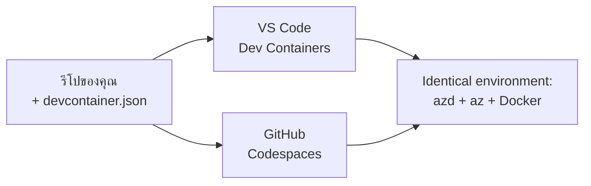

# Dev Containers & GitHub Codespaces สำหรับ azd

**การนำทางบทเรียน:**
- **📚 หน้าแรกหลักสูตร**: [AZD สำหรับผู้เริ่มต้น](../../README.md)
- **📖 บทปัจจุบัน**: บทที่ 1 - พื้นฐาน & เริ่มต้นอย่างรวดเร็ว
- **⬅️ ก่อนหน้า**: [นำแอปของคุณเองมา](bring-your-own-app.md)
- **🚀 บทถัดไป**: [บทที่ 2: การพัฒนา AI-First](../chapter-02-ai-development/README.md)

> ได้รับการตรวจสอบกับ `azd 1.27.1` ในกรกฎาคม 2026

## บทนำ

การติดตั้ง azd, runtime ภาษาที่เหมาะสม, Docker, และ Azure CLI ในทุกเครื่องเป็นเรื่องยุ่งยาก—และนี่คือเหตุผลอันดับหนึ่งที่บทแนะนำที่ "ใช้ได้ในเครื่องของฉัน" กลับใช้ไม่ได้กับใครบางคน **dev container** จะแก้ปัญหานี้โดยการอธิบาย toolchain ทั้งหมดของคุณในไฟล์เดียว ใครก็ตามที่เปิดโปรเจกต์ใน VS Code หรือ GitHub Codespaces จะได้รับสภาพแวดล้อมเดียวกันอย่างแม่นยำโดยที่ azd ได้ติดตั้งไว้แล้ว บทเรียนนี้จะแสดงวิธีการเพิ่มมัน

## เป้าหมายการเรียนรู้

หลังจบบทเรียนนี้ คุณจะ:
- เข้าใจว่า dev container คืออะไรและช่วยอย่างไรกับ azd
- เพิ่มไฟล์ `.devcontainer/devcontainer.json` ที่เรียบง่ายในโปรเจกต์
- รวม azd, Azure CLI, และ Docker ผ่าน Dev Container *features*
- เปิดโปรเจกต์ใน GitHub Codespaces หรือ VS Code

## ผลลัพธ์การเรียนรู้

หลังเรียนจบบทนี้ คุณจะสามารถ:
- สร้าง `devcontainer.json` สำหรับโปรเจกต์ azd
- เพิ่ม azd และเครื่องมือ Azure โดยไม่ต้องติดตั้งเอง
- รันคำสั่ง `azd up` จากภายใน container หรือ Codespace

---

## Dev Container คืออะไร?

Dev container คือสภาพแวดล้อมการพัฒนาที่สร้างจาก Docker กำหนดโดยไฟล์ `.devcontainer/devcontainer.json` ในที่เก็บของคุณ เมื่่อคุณเปิดโปรเจกต์:

- **VS Code** (พร้อมส่วนขยาย Dev Containers) จะสร้าง container และเชื่อมต่อกับมัน
- **GitHub Codespaces** จะสร้าง container เดียวกันในคลาวด์และให้ตัวแก้ไขบนเว็บเบราว์เซอร์

ไม่ว่าจะเป็นวิธีใด ผู้ร่วมพัฒนาทุกคนจะได้เครื่องมือเหมือนกันทุกประการ—ไม่ต้องเสียเวลาถามว่า "คุณติดตั้ง azd รึยัง?"



---

## ขั้นตอนที่ 1: สร้างไฟล์ devcontainer

สร้างไฟล์ `.devcontainer/devcontainer.json` ในโฟลเดอร์รากของโปรเจกต์ของคุณ:

```json
{
  "name": "azd-project",
  "image": "mcr.microsoft.com/devcontainers/base:bookworm",
  "features": {
    "ghcr.io/devcontainers/features/azure-cli:1": {},
    "ghcr.io/azure/azure-dev/azd:latest": {},
    "ghcr.io/devcontainers/features/docker-in-docker:2": {},
    "ghcr.io/devcontainers/features/node:1": {}
  },
  "customizations": {
    "vscode": {
      "extensions": [
        "ms-azuretools.azure-dev",
        "ms-azuretools.vscode-bicep"
      ]
    }
  },
  "forwardPorts": [3000],
  "postCreateCommand": "azd version"
}
```

ส่วนต่างๆ ที่ทำหน้าที่:

| คีย์ | จุดประสงค์ |
|-----|-----------|
| `image` | ระบบปฏิบัติการพื้นฐานสำหรับ container |
| `features` | ตัวติดตั้งสำเร็จรูป—ที่นี่ คือ Azure CLI, **azd**, Docker และ Node.js |
| `customizations.vscode.extensions` | ติดตั้งส่วนขยาย azd และ Bicep ของ VS Code อัตโนมัติ |
| `forwardPorts` | เปิดเผยพอร์ตแอปของคุณไปยังเบราว์เซอร์ |
| `postCreateCommand` | รันคำสั่งครั้งเดียวหลังจากสร้าง container เสร็จ (ที่นี่เป็นการเช็คความถูกต้อง) |

> คุณลักษณะ `ghcr.io/azure/azure-dev/azd:latest` คือวิธีการอย่างเป็นทางการในการติดตั้ง azd ใน container เลือกเวอร์ชันเฉพาะ (เช่น `azd:1.27.1`) หากคุณต้องการความสม่ำเสมอ

---

## ขั้นตอนที่ 2: เปลี่ยนคุณลักษณะให้ตรงกับภาษาแอปของคุณ

เปลี่ยนคุณลักษณะ `node` เป็นภาษาที่แอปของคุณใช้:

```jsonc
// Python project
"ghcr.io/devcontainers/features/python:1": {},

// .NET project
"ghcr.io/devcontainers/features/dotnet:2": {},

// Java project
"ghcr.io/devcontainers/features/java:1": {},

// Go project
"ghcr.io/devcontainers/features/go:1": {}
```

คง `docker-in-docker` ไว้หาก `host` ของคุณคือ `containerapp`, `aks`, หรือสิ่งที่สร้างอิมเมจ container — azd จำเป็นต้องใช้ Docker เพื่อสร้างและ push อิมเมจ

---

## ขั้นตอนที่ 3: เปิดโปรเจกต์

**ใน VS Code:**
1. ติดตั้งส่วนขยาย **Dev Containers**
2. เปิดโฟลเดอร์โปรเจกต์
3. คลิก **Reopen in Container** เมื่อมีการแจ้งเตือน (หรือรัน *Dev Containers: Reopen in Container*)

**ใน GitHub Codespaces:**
1. ผลักดัน repo ขึ้น GitHub
2. คลิก **Code → Codespaces → Create codespace on main**
3. รอให้ container สร้างเสร็จ—azd พร้อมใช้งานในเทอร์มินัล

---

## ขั้นตอนที่ 4: ดีพลอยจากใน container

Container มี azd ติดตั้งไว้ล่วงหน้าแล้ว ดังนั้นกระบวนการปกติก็ทำงานได้ทันที:

```bash
azd auth login --use-device-code   # รหัสอุปกรณ์ใช้งานสะดวกภายใน Codespaces
azd up
```

> **ทำไมต้องใช้ `--use-device-code`?** ใน container ระยะไกลหรือ Codespace จะไม่มีเบราว์เซอร์ในเครื่องสำหรับเปลี่ยนเส้นทาง ดังนั้นการล็อกอินด้วย device code จึงเป็นวิธีที่เชื่อถือได้ คุณจะต้องวางโค้ดลงในแท็บเบราว์เซอร์เพื่อเสร็จสิ้นการเข้าสู่ระบบ

---

## ข้อควรระวังทั่วไป

| ปัญหา | วิธีแก้ |
|---------|-------------|
| `azd up` สร้างอิมเมจไม่ได้ | เพิ่มคุณลักษณะ `docker-in-docker` |
| การล็อกอินผ่านเบราว์เซอร์ค้างใน Codespaces | ใช้คำสั่ง `azd auth login --use-device-code` |
| เครื่องมือไม่เหมือนกันระหว่างสมาชิกทีม | กำหนดเวอร์ชันคุณลักษณะ (เช่น `azd:1.27.1`) |
| แอปเข้าถึงไม่ได้ผ่านเบราว์เซอร์ | เพิ่มพอร์ตนั้นใน `forwardPorts` |

---

## สรุป

- Dev container ช่วยให้ toolchain ของ azd ของคุณเหมือนกันสำหรับทุกคน
- เพิ่ม azd, Azure CLI และ Docker ผ่าน Dev Container *features*
- ปรับคุณลักษณะภาษาตรงกับแอปของคุณและเก็บ `docker-in-docker` ไว้สำหรับโฮสต์ container
- ใช้การล็อกอินด้วย device-code เมื่อรันใน Codespaces

---

## 🔗 การนำทาง

| ทิศทาง | แหล่งข้อมูล |
|-----------|------------|
| **ก่อนหน้า** | [นำแอปของคุณเองมา](bring-your-own-app.md) |
| **หน้าแรกบท** | [บทที่ 1: พื้นฐาน & เริ่มต้นอย่างรวดเร็ว](README.md) |
| **บทถัดไป** | [บทที่ 2: การพัฒนา AI-First](../chapter-02-ai-development/README.md) |

## 📖 แหล่งข้อมูลที่เกี่ยวข้อง

- [การติดตั้งและตั้งค่า](installation.md)
- [คำสั่งยอดนิยม](../../resources/cheat-sheet.md)
- [สเปค Dev Containers อย่างเป็นทางการ](https://containers.dev/)
- [ฟีเจอร์ azd Dev Container](https://github.com/Azure/azure-dev/tree/main/ext/devcontainer)

---

<!-- CO-OP TRANSLATOR DISCLAIMER START -->
**ปฏิเสธความรับผิดชอบ**:
เอกสารนี้ได้รับการแปลโดยใช้บริการแปลภาษา AI [Co-op Translator](https://github.com/Azure/co-op-translator) ขณะที่เราพยายามให้ความถูกต้อง โปรดทราบว่าการแปลโดยอัตโนมัติอาจมีข้อผิดพลาดหรือความไม่ถูกต้อง เอกสารต้นฉบับในภาษาต้นทางควรถูกพิจารณาเป็นแหล่งข้อมูลที่เชื่อถือได้ สำหรับข้อมูลที่สำคัญ แนะนำให้ใช้การแปลโดยมนุษย์มืออาชีพ เราไม่รับผิดชอบต่อความเข้าใจผิดหรือการตีความที่ผิดพลาดที่เกิดขึ้นจากการใช้การแปลนี้
<!-- CO-OP TRANSLATOR DISCLAIMER END -->