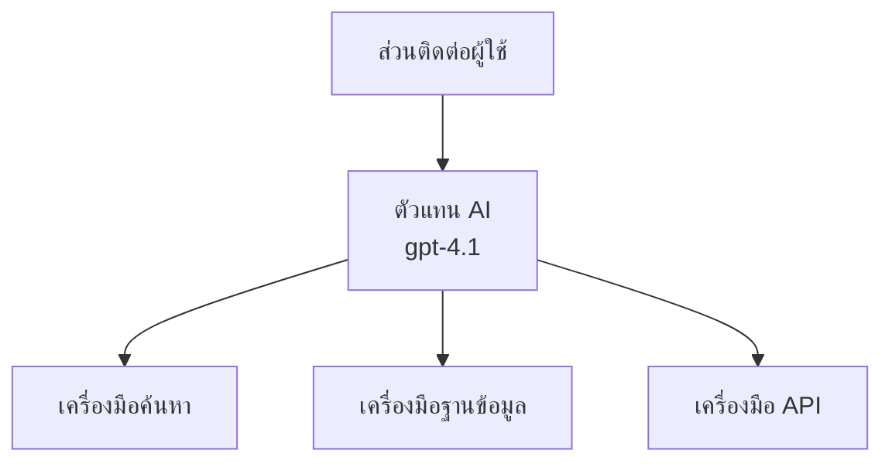
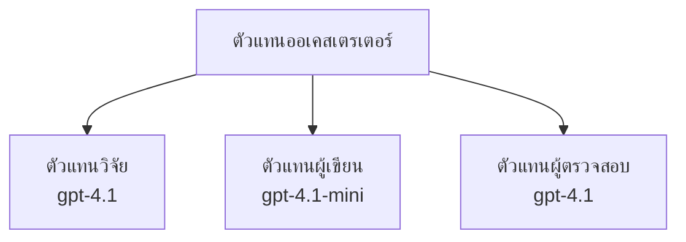

# ตัวแทน AI ด้วย Azure Developer CLI

**การนำทางบทเรียน:**
- **📚 หน้าแรกคอร์ส**: [AZD สำหรับผู้เริ่มต้น](../../README.md)
- **📖 บทปัจจุบัน**: บทที่ 2 - การพัฒนา AI-First
- **⬅️ ก่อนหน้า**: [การรวม Microsoft Foundry](microsoft-foundry-integration.md)
- **➡️ ถัดไป**: [การปรับใช้โมเดล AI](ai-model-deployment.md)
- **🚀 ขั้นสูง**: [โซลูชันหลายตัวแทน](../../examples/retail-scenario.md)

---

## บทนำ

ตัวแทน AI คือโปรแกรมอิสระที่สามารถรับรู้สภาพแวดล้อมของตน ตัดสินใจ และดำเนินการเพื่อบรรลุเป้าหมายเฉพาะ ต่างจากแชทบอทธรรมดาที่ตอบกลับคำสั่ง ตัวแทนสามารถ:

- **ใช้เครื่องมือ** - เรียกใช้ API, ค้นหาฐานข้อมูล, รันโค้ด
- **วางแผนและเหตุผล** - แบ่งงานซับซ้อนออกเป็นขั้นตอน
- **เรียนรู้จากบริบท** - จดจำและปรับพฤติกรรมได้
- **ทำงานร่วมกัน** - ร่วมมือกับตัวแทนอื่น ๆ (ระบบหลายตัวแทน)

คู่มือนี้จะแสดงวิธีปรับใช้ตัวแทน AI บน Azure โดยใช้ Azure Developer CLI (azd)

## เป้าหมายการเรียนรู้

เมื่อจบคู่มือนี้ คุณจะ:
- เข้าใจว่าตัวแทน AI คืออะไรและแตกต่างจากแชทบอทยังไง
- ปรับใช้เทมเพลตตัวแทน AI ที่เตรียมไว้แล้วด้วย AZD
- กำหนดค่าตัวแทน Foundry สำหรับตัวแทนที่กำหนดเอง
- นำแพตเทิร์นตัวแทนพื้นฐานไปใช้ (ใช้งานเครื่องมือ, RAG, หลายตัวแทน)
- ตรวจสอบและแก้ไขตัวแทนที่ปรับใช้

## ผลลัพธ์การเรียนรู้

หลังจากเสร็จสิ้น คุณจะสามารถ:
- ปรับใช้แอปตัวแทน AI บน Azure ด้วยคำสั่งเดียว
- กำหนดค่าเครื่องมือและความสามารถของตัวแทน
- นำการสร้างเนื้อหาพร้อมการดึงข้อมูล (RAG) มาใช้กับตัวแทน
- ออกแบบสถาปัตยกรรมหลายตัวแทนสำหรับเวิร์กโฟลว์ซับซ้อน
- แก้ไขปัญหาที่พบบ่อยในการปรับใช้ตัวแทน

---

## 🤖 ตัวแทนแตกต่างจากแชทบอทยังไง?

| คุณสมบัติ | แชทบอท | ตัวแทน AI |
|---------|---------|----------|
| **พฤติกรรม** | ตอบคำสั่ง | ดำเนินการได้โดยอัตโนมัติ |
| **เครื่องมือ** | ไม่มี | สามารถเรียก API, ค้นหา, รันโค้ด |
| **หน่วยความจำ** | แค่ในเซสชัน | หน่วยความจำถาวรข้ามเซสชัน |
| **การวางแผน** | ตอบกลับทีละคำ | เหตุผลหลายขั้นตอน |
| **การทำงานร่วมกัน** | เป็นเอนทิตีเดียว | ร่วมมือกับตัวแทนอื่นได้ |

### อุปมาอุปไมยง่ายๆ

- **แชทบอท** = เจ้าหน้าที่ช่วยตอบคำถามที่โต๊ะข้อมูล
- **ตัวแทน AI** = ผู้ช่วยส่วนตัวที่สามารถโทร, นัดหมาย, และทำงานแทนคุณได้

---

## 🚀 เริ่มต้นด่วน: ปรับใช้ตัวแทนตัวแรกของคุณ

### ตัวเลือก 1: เทมเพลต Foundry Agents (แนะนำ)

```bash
# เริ่มต้นแม่แบบตัวแทน AI
azd init --template get-started-with-ai-agents

# นำไปใช้บน Azure
azd up
```

**สิ่งที่จะถูกปรับใช้:**
- ✅ Foundry Agents
- ✅ Microsoft Foundry Models (gpt-4.1)
- ✅ Azure AI Search (สำหรับ RAG)
- ✅ Azure Container Apps (อินเทอร์เฟซเว็บ)
- ✅ Application Insights (การตรวจสอบ)

**เวลา:** ~15-20 นาที
**ค่าใช้จ่าย:** ~$100-150/เดือน (สำหรับพัฒนา)

### ตัวเลือก 2: ตัวแทน OpenAI กับ Prompty

```bash
# เริ่มต้นแม่แบบเอเจนต์ที่ใช้ Prompty
azd init --template agent-openai-python-prompty

# ปล่อยใช้งานไปยัง Azure
azd up
```

**สิ่งที่จะถูกปรับใช้:**
- ✅ Azure Functions (รันตัวแทนแบบ serverless)
- ✅ Microsoft Foundry Models
- ✅ ไฟล์กำหนดค่า Prompty
- ✅ ตัวอย่างการใช้งานตัวแทน

**เวลา:** ~10-15 นาที
**ค่าใช้จ่าย:** ~$50-100/เดือน (สำหรับพัฒนา)

### ตัวเลือก 3: ตัวแทนแชท RAG

```bash
# เริ่มต้นแม่แบบแชท RAG
azd init --template azure-search-openai-demo

# นำไปใช้กับ Azure
azd up
```

**สิ่งที่จะถูกปรับใช้:**
- ✅ Microsoft Foundry Models
- ✅ Azure AI Search พร้อมข้อมูลตัวอย่าง
- ✅ ระบบประมวลผลเอกสาร
- ✅ อินเทอร์เฟซแชทพร้อมการอ้างอิงแหล่งข้อมูล

**เวลา:** ~15-25 นาที
**ค่าใช้จ่าย:** ~$80-150/เดือน (สำหรับพัฒนา)

### ตัวเลือก 4: AZD AI Agent Init (แบบใช้ Manifest)

ถ้าคุณมีไฟล์ manifest ตัวแทน สามารถใช้คำสั่ง `azd ai` เพื่อสร้างโครงโปรเจกต์ Foundry Agent Service ได้โดยตรง:

```bash
# ติดตั้งส่วนขยายตัวแทน AI
azd extension install azure.ai.agents

# เริ่มต้นจากแถลงการตัวแทน
azd ai agent init -m agent-manifest.yaml

# ปล่อยบน Azure
azd up
```

**เมื่อใดควรใช้ `azd ai agent init` แทน `azd init --template`:**

| วิธีการ | เหมาะกับ | วิธีทำงาน |
|----------|----------|------|
| `azd init --template` | เริ่มจากตัวอย่างแอปที่ใช้งานได้ | โคลน template repo พร้อมโค้ด + โครงสร้างพื้นฐาน |
| `azd ai agent init -m` | สร้างจาก manifest ตัวแทนของคุณเอง | สร้างโครงโปรเจกต์จากนิยามตัวแทนของคุณ |

> **เคล็ดลับ:** ใช้ `azd init --template` เมื่อเรียนรู้ (ตัวเลือก 1-3 ข้างต้น) ใช้ `azd ai agent init` เมื่อสร้างตัวแทนในระดับโปรดักชันด้วย manifest ของคุณ ดู [คำสั่ง AZD AI CLI](../chapter-08-production/production-ai-practices.md#azd-ai-cli-commands-and-extensions) เพื่อดูรายการทั้งหมด

---

## 🏗️ แพตเทิร์นสถาปัตยกรรมตัวแทน

### แพตเทิร์น 1: ตัวแทนเดี่ยวกับเครื่องมือ

แพตเทิร์นตัวแทนที่ง่ายที่สุด - ตัวแทนหนึ่งตัวที่ใช้เครื่องมือหลายอย่างได้


**เหมาะสำหรับ:**
- บอทบริการลูกค้า
- ผู้ช่วยค้นคว้าวิจัย
- ตัวแทนวิเคราะห์ข้อมูล

**เทมเพลต AZD:** `azure-search-openai-demo`

### แพตเทิร์น 2: ตัวแทน RAG (การสร้างพร้อมการดึงข้อมูล)

ตัวแทนที่ดึงเอกสารที่เกี่ยวข้องมาก่อนจึงสร้างคำตอบ


**เหมาะสำหรับ:**
- ฐานความรู้สำหรับองค์กร
- ระบบตอบคำถามเอกสาร
- การวิจัยด้านกฎหมายและความสอดคล้อง

**เทมเพลต AZD:** `azure-search-openai-demo`

### แพตเทิร์น 3: ระบบหลายตัวแทน

หลายตัวแทนชำนาญเฉพาะทางทำงานร่วมกันในงานซับซ้อน


**เหมาะสำหรับ:**
- การสร้างเนื้อหาซับซ้อน
- เวิร์กโฟลว์หลายขั้นตอน
- งานที่ต้องมีความเชี่ยวชาญหลากหลายด้าน

**เรียนรู้เพิ่มเติม:** [แพตเทิร์นการประสานงานหลายตัวแทน](../chapter-06-pre-deployment/coordination-patterns.md)

---

## ⚙️ การกำหนดค่าเครื่องมือของตัวแทน

ตัวแทนจะทรงพลังเมื่อใช้เครื่องมือได้ นี่คือวิธีกำหนดค่าเครื่องมือทั่วไป:

### การกำหนดค่าเครื่องมือใน Foundry Agents

```python
# agent_config.py
from azure.ai.projects import AIProjectClient
from azure.ai.projects.models import FunctionTool, CodeInterpreterTool

# กำหนดเครื่องมือที่กำหนดเอง
search_tool = FunctionTool(
    name="search_knowledge_base",
    description="Search the company knowledge base for relevant documents",
    parameters={
        "type": "object",
        "properties": {
            "query": {
                "type": "string",
                "description": "The search query"
            }
        },
        "required": ["query"]
    }
)

# สร้างเอเจนต์พร้อมเครื่องมือ
agent = project_client.agents.create_agent(
    model="gpt-4.1",
    name="Support Agent",
    instructions="You are a helpful support agent. Use the search tool to find relevant information.",
    tools=[search_tool, CodeInterpreterTool()]
)
```

### การกำหนดค่าสภาพแวดล้อม

```bash
# ตั้งค่าสภาพแวดล้อมเฉพาะตัวตัวแทน
azd env set AZURE_OPENAI_MODEL "gpt-4.1"
azd env set AGENT_INSTRUCTIONS "You are a helpful assistant..."
azd env set ENABLE_CODE_INTERPRETER "true"
azd env set ENABLE_FILE_SEARCH "true"

# ปล่อยใช้งานด้วยการกำหนดค่าที่อัปเดตแล้ว
azd deploy
```

---

## 📊 การตรวจสอบตัวแทน

### การรวม Application Insights

เทมเพลตตัวแทน AZD ทุกตัวรวม Application Insights สำหรับการตรวจสอบ:

```bash
# เปิดแผงควบคุมการตรวจสอบ
azd monitor --overview

# ดูบันทึกสด
azd monitor --logs

# ดูเมตริกสด
azd monitor --live
```

### ตัวชี้วัดสำคัญที่ควรติดตาม

| ตัวชี้วัด | คำอธิบาย | เป้าหมาย |
|--------|-------------|--------|
| ระยะเวลาตอบกลับ | เวลาสร้างคำตอบ | < 5 วินาที |
| การใช้โทเค็น | โทเค็นต่อคำขอ | ตรวจสอบต้นทุน |
| อัตราความสำเร็จการเรียกเครื่องมือ | % การเรียกเครื่องมือสำเร็จ | > 95% |
| อัตราข้อผิดพลาด | คำขอตัวแทนที่ล้มเหลว | < 1% |
| ความพึงพอใจของผู้ใช้ | คะแนนตอบรับ | > 4.0/5.0 |

### การบันทึกแบบกำหนดเองสำหรับตัวแทน

```python
import os
from azure.monitor.opentelemetry import configure_azure_monitor
from opentelemetry import trace

# กำหนดค่า Azure Monitor ด้วย OpenTelemetry
configure_azure_monitor(
    connection_string=os.environ["APPLICATIONINSIGHTS_CONNECTION_STRING"]
)

tracer = trace.get_tracer(__name__)

def log_agent_interaction(user_query, agent_response, tools_used, latency_ms):
    with tracer.start_as_current_span("agent_interaction") as span:
        span.set_attributes({
            "user_query": user_query,
            "response_length": len(agent_response),
            "tools_used": tools_used,
            "latency_ms": latency_ms
        })
```

> **หมายเหตุ:** ติดตั้งแพ็กเกจที่ต้องใช้: `pip install azure-monitor-opentelemetry opentelemetry`

---

## 💰 การพิจารณาต้นทุน

### ต้นทุนโดยประมาณรายเดือนตามแพตเทิร์น

| แพตเทิร์น | สภาพแวดล้อมพัฒนา | โปรดักชัน |
|---------|-----------------|------------|
| ตัวแทนเดี่ยว | $50-100 | $200-500 |
| ตัวแทน RAG | $80-150 | $300-800 |
| หลายตัวแทน (2-3 ตัว) | $150-300 | $500-1,500 |
| หลายตัวแทนระดับองค์กร | $300-500 | $1,500-5,000+ |

### เคล็ดลับการลดต้นทุน

1. **ใช้ gpt-4.1-mini สำหรับงานง่ายๆ**
   ```bash
   azd env set AZURE_OPENAI_MODEL "gpt-4.1-mini"
   ```

2. **ใช้การแคชคำถามที่ซ้ำกัน**
   ```python
   from functools import lru_cache
   
   @lru_cache(maxsize=1000)
   def get_cached_response(query_hash):
       return agent.run(query_hash)
   ```

3. **กำหนดขีดจำกัดโทเค็นต่อรัน**
   ```python
   # ตั้งค่า max_completion_tokens เมื่อรันเอเย่นต์ ไม่ใช่ตอนสร้าง
   run = project_client.agents.create_run(
       thread_id=thread.id,
       agent_id=agent.id,
       max_completion_tokens=1000  # จำกัดความยาวคำตอบ
   )
   ```

4. **ลดขนาดจนถึงศูนย์เมื่อไม่ใช้งาน**
   ```bash
   # Container Apps ปรับขนาดอัตโนมัติเป็นศูนย์
   azd env set MIN_REPLICAS "0"
   ```

---

## 🔧 การแก้ไขปัญหาตัวแทน

### ปัญหาที่พบบ่อยและวิธีแก้ไข

<details>
<summary><strong>❌ ตัวแทนไม่ตอบสนองต่อการเรียกเครื่องมือ</strong></summary>

```bash
# ตรวจสอบว่าเครื่องมือถูกลงทะเบียนอย่างถูกต้องหรือไม่
azd show

# ตรวจสอบการติดตั้ง OpenAI
az cognitiveservices account deployment list \
  --name $AZURE_OPENAI_NAME \
  --resource-group $RG_NAME

# ตรวจสอบบันทึกของเอเย่นต์
azd monitor --logs
```

**สาเหตุทั่วไป:**
- ฟังก์ชันเครื่องมือไม่ตรงกับคาดหวัง
- ขาดสิทธิ์ที่จำเป็น
- ไม่สามารถเข้าถึง API endpoint
</details>

<details>
<summary><strong>❌ ความล่าช้าสูงในการตอบกลับตัวแทน</strong></summary>

```bash
# ตรวจสอบ Application Insights สำหรับคอขวด
azd monitor --live

# พิจารณาใช้โมเดลที่เร็วกว่า
azd env set AZURE_OPENAI_MODEL "gpt-4.1-mini"
azd deploy
```

**เคล็ดลับการเพิ่มประสิทธิภาพ:**
- ใช้การตอบกลับแบบสตรีมมิ่ง
- ใช้แคชคำตอบ
- ลดขนาดหน้าต่างบริบท
</details>

<details>
<summary><strong>❌ ตัวแทนให้ข้อมูลผิดหรือสร้างข้อมูลหลอก</strong></summary>

```python
# ปรับปรุงด้วยการแจ้งเตือนระบบที่ดีกว่า
instructions = """
You are a helpful assistant. IMPORTANT:
- Only answer based on provided context
- If you don't know, say "I don't know"
- Always cite your sources
- Never make up information
"""

# เพิ่มการดึงข้อมูลสำหรับการวางพื้นฐาน
agent = project_client.agents.create_agent(
    model="gpt-4.1",
    instructions=instructions,
    tools=[FileSearchTool()]  # วางพื้นฐานคำตอบในเอกสาร
)
```
</details>

<details>
<summary><strong>❌ ข้อผิดพลาดเกินขีดจำกัดโทเค็น</strong></summary>

```python
# ดำเนินการจัดการหน้าต่างบริบท
def truncate_context(messages, max_tokens=8000, model="gpt-4.1"):
    """Keep only recent messages within token limit."""
    import tiktoken
    encoding = tiktoken.encoding_for_model(model)
    total_tokens = 0
    truncated = []
    
    for msg in reversed(messages):
        msg_tokens = len(encoding.encode(msg.content))
        if total_tokens + msg_tokens > max_tokens:
            break
        truncated.insert(0, msg)
        total_tokens += msg_tokens
    
    return truncated
```
</details>

---

## 🎓 แบบฝึกหัดลงมือทำ

### แบบฝึกหัด 1: ปรับใช้ตัวแทนพื้นฐาน (20 นาที)

**เป้าหมาย:** ปรับใช้ตัวแทน AI ตัวแรกของคุณด้วย AZD

```bash
# ขั้นตอนที่ 1: เริ่มต้นเทมเพลต
azd init --template get-started-with-ai-agents

# ขั้นตอนที่ 2: เข้าสู่ระบบ Azure
azd auth login

# ขั้นตอนที่ 3: ปรับใช้
azd up

# ขั้นตอนที่ 4: ทดสอบตัวแทน
# ผลลัพธ์ที่คาดหวังหลังจากการปรับใช้:
#   การปรับใช้เสร็จสมบูรณ์!
#   จุดเชื่อมต่อ: https://<app-name>.<region>.azurecontainerapps.io
# เปิด URL ที่แสดงในผลลัพธ์และลองถามคำถาม

# ขั้นตอนที่ 5: ดูการมอนิเตอร์
azd monitor --overview

# ขั้นตอนที่ 6: ทำความสะอาด
azd down --force --purge
```

**เกณฑ์ความสำเร็จ:**
- [ ] ตัวแทนตอบคำถามได้
- [ ] เข้าถึงแดชบอร์ดตรวจสอบผ่าน `azd monitor` ได้
- [ ] ลบทรัพยากรเรียบร้อย

### แบบฝึกหัด 2: เพิ่มเครื่องมือกำหนดเอง (30 นาที)

**เป้าหมาย:** ขยายตัวแทนด้วยเครื่องมือกำหนดเอง

1. ปรับใช้เทมเพลตตัวแทน:
   ```bash
   azd init --template get-started-with-ai-agents
   azd up
   ```
2. สร้างฟังก์ชันเครื่องมือใหม่ในโค้ดตัวแทน:
   ```python
   def get_weather(location: str) -> str:
       """Get current weather for a location."""
       # การเรียกใช้ API ไปยังบริการสภาพอากาศ
       return f"Weather in {location}: Sunny, 72°F"
   ```
3. ลงทะเบียนเครื่องมือกับตัวแทน:
   ```python
   from azure.ai.projects.models import FunctionTool

   weather_tool = FunctionTool(
       name="get_weather",
       description="Get current weather for a location",
       parameters={
           "type": "object",
           "properties": {
               "location": {"type": "string", "description": "City name"}
           },
           "required": ["location"]
       }
   )

   agent = project_client.agents.create_agent(
       model="gpt-4.1",
       name="Weather Agent",
       tools=[weather_tool]
   )
   ```
4. ปรับใช้ใหม่และทดสอบ:
   ```bash
   azd deploy
   # ถาม: "สภาพอากาศในซีแอตเทิลเป็นอย่างไร?"
   # คาดว่า: ตัวแทนจะเรียกใช้ get_weather("Seattle") และส่งคืนข้อมูลสภาพอากาศ
   ```

**เกณฑ์ความสำเร็จ:**
- [ ] ตัวแทนรู้จักคำถามเกี่ยวกับสภาพอากาศ
- [ ] เรียกเครื่องมือถูกต้อง
- [ ] คำตอบมีข้อมูลสภาพอากาศ

### แบบฝึกหัด 3: สร้างตัวแทน RAG (45 นาที)

**เป้าหมาย:** สร้างตัวแทนที่ตอบคำถามจากเอกสารของคุณ

```bash
# ขั้นตอนที่ 1: นำเทมเพลต RAG ไปใช้งาน
azd init --template azure-search-openai-demo
azd up

# ขั้นตอนที่ 2: อัปโหลดเอกสารของคุณ
# วางไฟล์ PDF/TXT ในไดเรกทอรี data/ จากนั้นรัน:
python scripts/prepdocs.py

# ขั้นตอนที่ 3: ทดสอบด้วยคำถามเฉพาะโดเมน
# เปิด URL ของเว็บแอปจากผลลัพธ์ azd up
# ถามคำถามเกี่ยวกับเอกสารที่คุณอัปโหลด
# คำตอบควรรวมอ้างอิงการอ้างอิงเช่น [doc.pdf]
```

**เกณฑ์ความสำเร็จ:**
- [ ] ตัวแทนตอบจากเอกสารที่อัปโหลด
- [ ] คำตอบมีการอ้างอิงแหล่งที่มา
- [ ] ไม่มีข้อมูลหลอกในคำถามนอกขอบเขต

---

## 📚 ขั้นตอนถัดไป

เมื่อคุณเข้าใจตัวแทน AI แล้ว ให้สำรวจหัวข้อขั้นสูงเหล่านี้:

| หัวข้อ | คำอธิบาย | ลิงก์ |
|-------|-------------|------|
| **ระบบหลายตัวแทน** | สร้างระบบที่ตัวแทนหลายตัวทำงานร่วมกัน | [ตัวอย่างหลายตัวแทนในค้าปลีก](../../examples/retail-scenario.md) |
| **แพตเทิร์นการประสานงาน** | เรียนรู้แพตเทิร์นการสั่งงานและสื่อสาร | [แพตเทิร์นการประสานงาน](../chapter-06-pre-deployment/coordination-patterns.md) |
| **การปรับใช้โปรดักชัน** | ปรับใช้งานตัวแทนในระดับองค์กร | [แนวปฏิบัติ AI ในโปรดักชัน](../chapter-08-production/production-ai-practices.md) |
| **การประเมินตัวแทน** | ทดสอบและประเมินผลการทำงานตัวแทน | [แก้ไขปัญหา AI](../chapter-07-troubleshooting/ai-troubleshooting.md) |
| **ห้องทดลอง AI Workshop** | ปฏิบัติ: ทำให้โซลูชัน AI ของคุณพร้อมใช้ AZD | [ห้องทดลอง AI Workshop](ai-workshop-lab.md) |

---

## 📖 แหล่งข้อมูลเพิ่มเติม

### เอกสารอย่างเป็นทางการ
- [Azure AI Agent Service](https://learn.microsoft.com/azure/ai-services/agents/)
- [Azure AI Foundry Agent Service Quickstart](https://learn.microsoft.com/azure/ai-services/agents/quickstart)
- [Semantic Kernel Agent Framework](https://learn.microsoft.com/semantic-kernel/)

### เทมเพลต AZD สำหรับตัวแทน
- [เริ่มต้นใช้งาน AI Agents](https://github.com/Azure-Samples/get-started-with-ai-agents)
- [Agent OpenAI Python Prompty](https://github.com/Azure-Samples/agent-openai-python-prompty)
- [Azure Search OpenAI Demo](https://github.com/Azure-Samples/azure-search-openai-demo)

### แหล่งข้อมูลชุมชน
- [Awesome AZD - เทมเพลตตัวแทน](https://azure.github.io/awesome-azd/?tags=ai-agents)
- [Azure AI Discord](https://discord.gg/microsoft-azure)
- [Microsoft Foundry Discord](https://discord.gg/nTYy5BXMWG)

### ทักษะตัวแทนสำหรับเครื่องมือแก้ไขของคุณ
- [**ทักษะตัวแทน Microsoft Azure**](https://skills.sh/microsoft/github-copilot-for-azure) - ติดตั้งทักษะตัวแทน AI ที่ใช้ซ้ำได้สำหรับการพัฒนา Azure ใน GitHub Copilot, Cursor หรือเอเจนต์ที่รองรับอื่น ๆ มีทักษะสำหรับ [Azure AI](https://skills.sh/microsoft/github-copilot-for-azure/azure-ai), [Microsoft Foundry](https://skills.sh/microsoft/github-copilot-for-azure/microsoft-foundry), [การปรับใช้](https://skills.sh/microsoft/github-copilot-for-azure/azure-deploy), และ [การวินิจฉัย](https://skills.sh/microsoft/github-copilot-for-azure/azure-diagnostics):
  ```bash
  npx skills add microsoft/github-copilot-for-azure
  ```

---

**การนำทาง**
- **บทเรียนก่อนหน้า**: [การรวม Microsoft Foundry](microsoft-foundry-integration.md)
- **บทเรียนถัดไป**: [การปรับใช้โมเดล AI](ai-model-deployment.md)

---

<!-- CO-OP TRANSLATOR DISCLAIMER START -->
**ข้อจำกัดความรับผิดชอบ**:  
เอกสารฉบับนี้ได้รับการแปลโดยใช้บริการแปลภาษา AI [Co-op Translator](https://github.com/Azure/co-op-translator) แม้เราจะพยายามให้มีความถูกต้องสูงสุด แต่โปรดทราบว่าการแปลโดยอัตโนมัติอาจมีข้อผิดพลาดหรือความไม่ถูกต้อง เอกสารต้นฉบับในภาษาดั้งเดิมถือเป็นแหล่งข้อมูลที่เชื่อถือได้ สำหรับข้อมูลที่สำคัญ ควรใช้การแปลโดยผู้เชี่ยวชาญมนุษย์เท่านั้น เราจะไม่รับผิดชอบต่อความเข้าใจผิดหรือการตีความที่ผิดพลาดที่เกิดจากการใช้การแปลฉบับนี้
<!-- CO-OP TRANSLATOR DISCLAIMER END -->