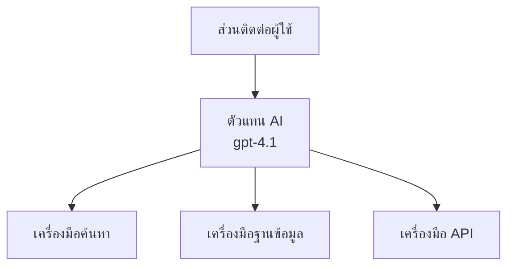
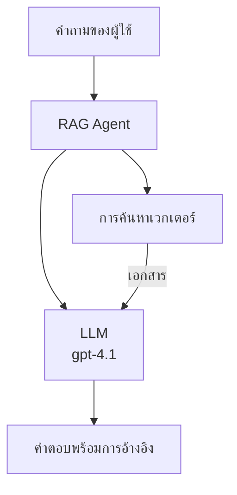
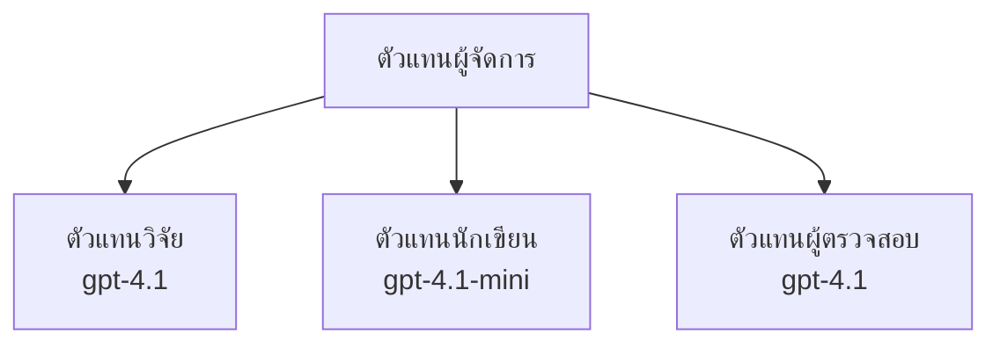

# ตัวแทน AI ด้วย Azure Developer CLI

**การนำทางบทเรียน:**
- **📚 หน้าแรกคอร์ส**: [AZD สำหรับผู้เริ่มต้น](../../README.md)
- **📖 บทปัจจุบัน**: บทที่ 2 - การพัฒนา AI-First
- **⬅️ ก่อนหน้า**: [การผนวกรวม Microsoft Foundry](microsoft-foundry-integration.md)
- **➡️ ถัดไป**: [การปรับใช้งานโมเดล AI](ai-model-deployment.md)
- **🚀 ขั้นสูง**: [โซลูชันหลายตัวแทน](../../examples/retail-scenario.md)

---

## บทนำ

ตัวแทน AI คือโปรแกรมอิสระที่สามารถรับรู้สภาพแวดล้อมของตนเอง ตัดสินใจ และดำเนินการเพื่อบรรลุเป้าหมายเฉพาะ แตกต่างจากแชทบอทธรรมดาที่ตอบสนองต่อคำสั่ง ตัวแทนสามารถ:

- **ใช้เครื่องมือ** - เรียกใช้ API, ค้นหาฐานข้อมูล, รันโค้ด
- **วางแผนและเหตุผล** - แบ่งงานที่ซับซ้อนออกเป็นขั้นตอน
- **เรียนรู้จากบริบท** - เก็บความจำและปรับเปลี่ยนพฤติกรรม
- **ร่วมมือ** - ทำงานร่วมกับตัวแทนอื่นๆ (ระบบหลายตัวแทน)

คู่มือนี้จะแสดงวิธีปรับใช้งานตัวแทน AI ไปที่ Azure ด้วย Azure Developer CLI (azd)

> **หมายเหตุการตรวจสอบ (2026-03-25):** คู่มือนี้ได้รับการตรวจสอบกับ `azd` `1.23.12` และ `azure.ai.agents` `0.1.18-preview` ประสบการณ์ใช้งาน `azd ai` ยังเป็นเวอร์ชันพรีวิว โปรดตรวจสอบความช่วยเหลือของส่วนขยายหากธงที่ติดตั้งแตกต่างกัน

## เป้าหมายการเรียนรู้

หลังจากเรียนจบ คุณจะ:
- เข้าใจว่าตัวแทน AI คืออะไรและแตกต่างจากแชทบอทย่างไร
- ปรับใช้งานแม่แบบตัวแทน AI ที่สร้างไว้ล่วงหน้าด้วย AZD
- กำหนดค่าตัวแทน Foundry สำหรับตัวแทนที่กำหนดเอง
- นำรูปแบบตัวแทนพื้นฐานมาใช้ (การใช้เครื่องมือ, RAG, หลายตัวแทน)
- ตรวจสอบและดีบักตัวแทนที่ปรับใช้

## ผลลัพธ์ที่คาดหวัง

เมื่เสร็จสมบูรณ์ คุณจะสามารถ:
- ปรับใช้งานแอปตัวแทน AI ไปยัง Azure ได้ด้วยคำสั่งเดียว
- กำหนดค่าเครื่องมือและขีดความสามารถของตัวแทน
- ใช้งานการสร้างข้อความเสริมการดึงข้อมูล (RAG) กับตัวแทน
- ออกแบบสถาปัตยกรรมหลายตัวแทนสำหรับเวิร์กโฟลว์ซับซ้อน
- แก้ไขปัญหาการปรับใช้งานตัวแทนทั่วไป

---

## 🤖 อะไรที่ทำให้ตัวแทนแตกต่างจากแชทบอท?

| คุณลักษณะ | แชทบอท | ตัวแทน AI |
|---------|---------|----------|
| **พฤติกรรม** | ตอบคำถาม | ดำเนินการโดยอิสระ |
| **เครื่องมือ** | ไม่มี | สามารถเรียกใช้ API, ค้นหา, รันโค้ด |
| **ความจำ** | แค่ภาคเซสชัน | ความจำถาวรข้ามเซสชัน |
| **การวางแผน** | ตอบทีละคำตอบ | เหตุผลหลายขั้นตอน |
| **การร่วมมือ** | เอนทิตี้เดียว | ทำงานกับตัวแทนอื่นได้ |

### ตัวอย่างเปรียบเทียบง่ายๆ

- **แชทบอท** = คนช่วยตอบคำถามที่โต๊ะข้อมูล
- **ตัวแทน AI** = ผู้ช่วยส่วนตัวที่สามารถโทร จองนัดหมาย และทำงานให้คุณ

---

## 🚀 เริ่มต้นอย่างรวดเร็ว: ปรับใช้ตัวแทนแรกของคุณ

### ตัวเลือก 1: แม่แบบ Foundry Agents (แนะนำ)

```bash
# เริ่มต้นแม่แบบตัวแทน AI
azd init --template get-started-with-ai-agents

# นำไปใช้กับ Azure
azd up
```

**สิ่งที่จะถูกปรับใช้:**
- ✅ Foundry Agents
- ✅ Microsoft Foundry Models (gpt-4.1)
- ✅ Azure AI Search (สำหรับ RAG)
- ✅ Azure Container Apps (เว็บอินเทอร์เฟซ)
- ✅ Application Insights (การตรวจสอบ)

**เวลา:** ประมาณ 15-20 นาที  
**ค่าใช้จ่าย:** ประมาณ 100-150 ดอลลาร์/เดือน (การพัฒนา)

### ตัวเลือก 2: ตัวแทน OpenAI กับ Prompty

```bash
# เริ่มต้นแม่แบบเอเจนต์ที่ใช้ Prompty
azd init --template agent-openai-python-prompty

# ปรับใช้ไปยัง Azure
azd up
```

**สิ่งที่จะถูกปรับใช้:**
- ✅ Azure Functions (รันตัวแทนอัตโนมัติ)
- ✅ Microsoft Foundry Models
- ✅ ไฟล์กำหนดค่า Prompty
- ✅ ตัวอย่างการใช้งานตัวแทน

**เวลา:** ประมาณ 10-15 นาที  
**ค่าใช้จ่าย:** ประมาณ 50-100 ดอลลาร์/เดือน (การพัฒนา)

### ตัวเลือก 3: ตัวแทนแชท RAG

```bash
# เริ่มต้นแม่แบบแชท RAG
azd init --template azure-search-openai-demo

# นำไปใช้ใน Azure
azd up
```

**สิ่งที่จะถูกปรับใช้:**
- ✅ Microsoft Foundry Models
- ✅ Azure AI Search พร้อมข้อมูลตัวอย่าง
- ✅ ท่อการประมวลผลเอกสาร
- ✅ อินเทอร์เฟซแชทพร้อมการอ้างอิง

**เวลา:** ประมาณ 15-25 นาที  
**ค่าใช้จ่าย:** ประมาณ 80-150 ดอลลาร์/เดือน (การพัฒนา)

### ตัวเลือก 4: AZD AI Agent Init (ตัวอย่างแบบ Manifest หรือ Template)

หากคุณมีไฟล์ manifest ตัวแทน คุณสามารถใช้คำสั่ง `azd ai` เพื่อสร้างโปรเจกต์ Foundry Agent Service ได้โดยตรง รุ่นล่าสุดยังเพิ่มการสนับสนุนการเริ่มต้นจากแม่แบบ การเรียกใช้อาจแตกต่างเล็กน้อยขึ้นอยู่กับเวอร์ชันส่วนขยายที่ติดตั้ง

```bash
# ติดตั้งส่วนขยายตัวแทน AI
azd extension install azure.ai.agents

# ตัวเลือก: ตรวจสอบเวอร์ชันทดลองที่ติดตั้ง
azd extension show azure.ai.agents

# เริ่มต้นจากเอกสารแสดงตัวแทน
azd ai agent init -m agent-manifest.yaml

# นำไปใช้กับ Azure
azd up
```

**เมื่อใช้ `azd ai agent init` กับ `azd init --template`:**

| วิธีการ | เหมาะสำหรับ | วิธีทำงาน |
|----------|----------|------|
| `azd init --template` | เริ่มจากแอปตัวอย่างที่ใช้งานได้ | คลอนสำเนารีโปแม่แบบเต็มพร้อมโค้ดและโครงสร้างพื้นฐาน |
| `azd ai agent init -m` | สร้างจาก manifest ตัวแทนของคุณเอง | สร้างโครงสร้างโปรเจกต์จากคำจำกัดความตัวแทน |

> **เคล็ดลับ:** ใช้ `azd init --template` เมื่อเรียนรู้ (ตัวเลือก 1-3 ข้างบน) ใช้ `azd ai agent init` เมื่อสร้างตัวแทนการผลิตด้วย manifest ของคุณ ดู [คำสั่ง AZD AI CLI](../chapter-08-production/production-ai-practices.md#azd-ai-cli-commands-and-extensions) สำหรับข้อมูลเพิ่มเติม

---

## 🏗️ รูปแบบสถาปัตยกรรมตัวแทน

### รูปแบบ 1: ตัวแทนเดียวกับเครื่องมือ

รูปแบบตัวแทนที่ง่ายที่สุด - ตัวแทนหนึ่งตัวที่สามารถใช้เครื่องมือหลายชนิด


**เหมาะสำหรับ:**
- บอทสนับสนุนลูกค้า
- ผู้ช่วยวิจัย
- ตัวแทนวิเคราะห์ข้อมูล

**แม่แบบ AZD:** `azure-search-openai-demo`

### รูปแบบ 2: ตัวแทน RAG (การสร้างข้อความเสริมการดึงข้อมูล)

ตัวแทนที่ดึงเอกสารที่เกี่ยวข้องก่อนสร้างคำตอบ


**เหมาะสำหรับ:**
- ฐานความรู้ในองค์กร
- ระบบถามตอบเอกสาร
- งานวิจัยด้านกฎหมายและปฏิบัติตามข้อกำหนด

**แม่แบบ AZD:** `azure-search-openai-demo`

### รูปแบบ 3: ระบบตัวแทนหลายตัว

ตัวแทนเฉพาะทางหลายตัวทำงานร่วมกันในงานซับซ้อน


**เหมาะสำหรับ:**
- การสร้างเนื้อหาซับซ้อน
- เวิร์กโฟลว์หลายขั้นตอน
- งานที่ต้องใช้ความเชี่ยวชาญหลากหลาย

**เรียนรู้เพิ่มเติม:** [รูปแบบการประสานงานตัวแทนหลายตัว](../chapter-06-pre-deployment/coordination-patterns.md)

---

## ⚙️ การกำหนดค่าเครื่องมือตัวแทน

ตัวแทนจะทรงพลังเมื่อสามารถใช้เครื่องมือได้ นี่คือวิธีตั้งค่าเครื่องมือทั่วไป:

### การกำหนดค่าเครื่องมือใน Foundry Agents

```python
# agent_config.py
from azure.ai.projects import AIProjectClient
from azure.ai.projects.models import FunctionTool, CodeInterpreterTool

# กำหนดเครื่องมือที่กำหนดเอง
search_tool = FunctionTool(
    name="search_knowledge_base",
    description="Search the company knowledge base for relevant documents",
    parameters={
        "type": "object",
        "properties": {
            "query": {
                "type": "string",
                "description": "The search query"
            }
        },
        "required": ["query"]
    }
)

# สร้างตัวแทนพร้อมเครื่องมือ
agent = project_client.agents.create_agent(
    model="gpt-4.1",
    name="Support Agent",
    instructions="You are a helpful support agent. Use the search tool to find relevant information.",
    tools=[search_tool, CodeInterpreterTool()]
)
```

### การกำหนดค่าสภาพแวดล้อม

```bash
# ตั้งค่าสิ่งแวดล้อมเฉพาะตัวแปรของเอเย่นต์
azd env set AZURE_OPENAI_MODEL "gpt-4.1"
azd env set AGENT_INSTRUCTIONS "You are a helpful assistant..."
azd env set ENABLE_CODE_INTERPRETER "true"
azd env set ENABLE_FILE_SEARCH "true"

# เปิดตัวด้วยการตั้งค่าที่อัปเดตแล้ว
azd deploy
```

---

## 📊 การตรวจสอบตัวแทน

### การผนวก Application Insights

แม่แบบตัวแทน AZD ทุกตัวมี Application Insights สำหรับติดตาม:

```bash
# เปิดแดชบอร์ดการตรวจสอบ
azd monitor --overview

# ดูบันทึกสด
azd monitor --logs

# ดูเมตริกสด
azd monitor --live
```

### ตัวชี้วัดสำคัญที่ควรติดตาม

| ตัวชี้วัด | คำอธิบาย | ค่าเป้าหมาย |
|--------|-------------|--------|
| ความล่าช้าในการตอบ | เวลาสร้างการตอบสนอง | < 5 วินาที |
| การใช้โทเค็น | โทเค็นต่อคำขอ | ติดตามค่าใช้จ่าย |
| อัตราความสำเร็จการเรียกเครื่องมือ | % การเรียกเครื่องมือสำเร็จ | > 95% |
| อัตราความผิดพลาด | คำขอตัวแทนล้มเหลว | < 1% |
| ความพึงพอใจของผู้ใช้ | คะแนนย้อนกลับ | > 4.0/5.0 |

### การบันทึกกำหนดเองสำหรับตัวแทน

```python
import os
from azure.monitor.opentelemetry import configure_azure_monitor
from opentelemetry import trace

# กำหนดค่า Azure Monitor ด้วย OpenTelemetry
configure_azure_monitor(
    connection_string=os.environ["APPLICATIONINSIGHTS_CONNECTION_STRING"]
)

tracer = trace.get_tracer(__name__)

def log_agent_interaction(user_query, agent_response, tools_used, latency_ms):
    with tracer.start_as_current_span("agent_interaction") as span:
        span.set_attributes({
            "user_query": user_query,
            "response_length": len(agent_response),
            "tools_used": tools_used,
            "latency_ms": latency_ms
        })
```

> **หมายเหตุ:** ติดตั้งแพ็กเกจที่จำเป็น: `pip install azure-monitor-opentelemetry opentelemetry`

---

## 💰 การพิจารณาต้นทุน

### ต้นทุนรายเดือนโดยประมาณตามรูปแบบ

| รูปแบบ | สภาพแวดล้อมพัฒนา | การผลิต |
|---------|-----------------|------------|
| ตัวแทนเดียว | $50-100 | $200-500 |
| ตัวแทน RAG | $80-150 | $300-800 |
| หลายตัวแทน (2-3 ตัว) | $150-300 | $500-1,500 |
| หลายตัวแทนในองค์กร | $300-500 | $1,500-5,000+ |

### เคล็ดลับการประหยัดต้นทุน

1. **ใช้ gpt-4.1-mini สำหรับงานง่าย**
   ```bash
   azd env set AZURE_OPENAI_MODEL "gpt-4.1-mini"
   ```

2. **ใช้แคชสำหรับคำถามซ้ำ**
   ```python
   from functools import lru_cache
   
   @lru_cache(maxsize=1000)
   def get_cached_response(query_hash):
       return agent.run(query_hash)
   ```

3. **กำหนดขีดจำกัดโทเค็นต่อรัน**
   ```python
   # กำหนด max_completion_tokens เมื่อรันเอเย่นต์ ไม่ใช่ตอนสร้าง
   run = project_client.agents.create_run(
       thread_id=thread.id,
       agent_id=agent.id,
       max_completion_tokens=1000  # จำกัดความยาวของคำตอบ
   )
   ```

4. **ปรับสเกลเป็นศูนย์เมื่อไม่ได้ใช้งาน**
   ```bash
   # Container Apps ปรับขนาดเป็นศูนย์โดยอัตโนมัติ
   azd env set MIN_REPLICAS "0"
   ```

---

## 🔧 การแก้ไขปัญหาตัวแทน

### ปัญหาทั่วไปและวิธีแก้ไข

<details>
<summary><strong>❌ ตัวแทนไม่ตอบกลับการเรียกเครื่องมือ</strong></summary>

```bash
# ตรวจสอบว่าเครื่องมือถูกลงทะเบียนอย่างถูกต้อง
azd show

# ยืนยันการใช้งาน OpenAI
az cognitiveservices account deployment list \
  --name $AZURE_OPENAI_NAME \
  --resource-group $RG_NAME

# ตรวจสอบบันทึกของตัวแทน
azd monitor --logs
```

**สาเหตุที่พบบ่อย:**
- ฟังก์ชันเครื่องมือไม่ตรงกับลายเซ็น
- ขาดสิทธิ์ที่จำเป็น
- ไม่สามารถเข้าถึง API endpoint
</details>

<details>
<summary><strong>❌ ความล่าช้าสูงในการตอบของตัวแทน</strong></summary>

```bash
# ตรวจสอบ Application Insights สำหรับคอขวด
azd monitor --live

# พิจารณาใช้โมเดลที่เร็วขึ้น
azd env set AZURE_OPENAI_MODEL "gpt-4.1-mini"
azd deploy
```

**เคล็ดลับการเพิ่มประสิทธิภาพ:**
- ใช้การตอบสนองแบบสตรีมมิ่ง
- ใช้แคชการตอบสนอง
- ลดขนาดหน้าต่างบริบท
</details>

<details>
<summary><strong>❌ ตัวแทนตอบข้อมูลผิดหรือสร้างข้อมูลผิดพลาด</strong></summary>

```python
# ปรับปรุงด้วยคำสั่งระบบที่ดีกว่า
instructions = """
You are a helpful assistant. IMPORTANT:
- Only answer based on provided context
- If you don't know, say "I don't know"
- Always cite your sources
- Never make up information
"""

# เพิ่มการดึงข้อมูลเพื่อนำมาสนับสนุน
agent = project_client.agents.create_agent(
    model="gpt-4.1",
    instructions=instructions,
    tools=[FileSearchTool()]  # ให้คำตอบอิงกับเอกสาร
)
```
</details>

<details>
<summary><strong>❌ ข้อผิดพลาดเกินขีดจำกัดโทเค็น</strong></summary>

```python
# ดำเนินการจัดการหน้าต่างบริบท
def truncate_context(messages, max_tokens=8000, model="gpt-4.1"):
    """Keep only recent messages within token limit."""
    import tiktoken
    encoding = tiktoken.encoding_for_model(model)
    total_tokens = 0
    truncated = []
    
    for msg in reversed(messages):
        msg_tokens = len(encoding.encode(msg.content))
        if total_tokens + msg_tokens > max_tokens:
            break
        truncated.insert(0, msg)
        total_tokens += msg_tokens
    
    return truncated
```
</details>

---

## 🎓 แบบฝึกหัดลงมือทำ

### แบบฝึกหัด 1: ปรับใช้ตัวแทนพื้นฐาน (20 นาที)

**เป้าหมาย:** ปรับใช้งานตัวแทน AI ตัวแรกของคุณด้วย AZD

```bash
# ขั้นตอนที่ 1: เริ่มต้นแม่แบบ
azd init --template get-started-with-ai-agents

# ขั้นตอนที่ 2: เข้าสู่ระบบ Azure
azd auth login
# หากคุณทำงานข้ามผู้เช่า ให้เพิ่ม --tenant-id <tenant-id>

# ขั้นตอนที่ 3: ปรับใช้
azd up

# ขั้นตอนที่ 4: ทดสอบเอเจนต์
# ผลลัพธ์ที่คาดว่าจะได้รับหลังการปรับใช้:
#   การปรับใช้เสร็จสมบูรณ์!
#   จุดสิ้นสุด: https://<app-name>.<region>.azurecontainerapps.io
# เปิด URL ที่แสดงในผลลัพธ์และลองถามคำถาม

# ขั้นตอนที่ 5: ดูการตรวจสอบ
azd monitor --overview

# ขั้นตอนที่ 6: ทำความสะอาด
azd down --force --purge
```

**เกณฑ์ความสำเร็จ:**
- [ ] ตัวแทนตอบคำถามได้
- [ ] สามารถเข้าถึงแดชบอร์ดการตรวจสอบผ่าน `azd monitor`
- [ ] ล้างทรัพยากรสำเร็จ

### แบบฝึกหัด 2: เพิ่มเครื่องมือกำหนดเอง (30 นาที)

**เป้าหมาย:** ขยายตัวแทนด้วยเครื่องมือกำหนดเอง

1. ปรับใช้แม่แบบตัวแทน:  
   ```bash
   azd init --template get-started-with-ai-agents
   azd up
   ```
2. สร้างฟังก์ชันเครื่องมือใหม่ในโค้ดตัวแทนของคุณ:  
   ```python
   def get_weather(location: str) -> str:
       """Get current weather for a location."""
       # การเรียก API ไปยังบริการสภาพอากาศ
       return f"Weather in {location}: Sunny, 72°F"
   ```
3. ลงทะเบียนเครื่องมือกับตัวแทน:  
   ```python
   from azure.ai.projects.models import FunctionTool

   weather_tool = FunctionTool(
       name="get_weather",
       description="Get current weather for a location",
       parameters={
           "type": "object",
           "properties": {
               "location": {"type": "string", "description": "City name"}
           },
           "required": ["location"]
       }
   )

   agent = project_client.agents.create_agent(
       model="gpt-4.1",
       name="Weather Agent",
       tools=[weather_tool]
   )
   ```
4. ปรับใช้อีกครั้งและทดสอบ:  
   ```bash
   azd deploy
   # ถาม: "สภาพอากาศที่ซีแอตเทิลเป็นอย่างไร?"
   # คาดว่า: ตัวแทนเรียกใช้ get_weather("Seattle") แล้วส่งคืนข้อมูลสภาพอากาศ
   ```

**เกณฑ์ความสำเร็จ:**
- [ ] ตัวแทนรู้จำคำถามเกี่ยวกับสภาพอากาศ
- [ ] เครื่องมือถูกเรียกใช้อย่างถูกต้อง
- [ ] คำตอบรวมข้อมูลสภาพอากาศ

### แบบฝึกหัด 3: สร้างตัวแทน RAG (45 นาที)

**เป้าหมาย:** สร้างตัวแทนที่ตอบคำถามจากเอกสารของคุณ

```bash
# ขั้นตอนที่ 1: ติดตั้งแม่แบบ RAG
azd init --template azure-search-openai-demo
azd up

# ขั้นตอนที่ 2: อัปโหลดเอกสารของคุณ
# วางไฟล์ PDF/TXT ในไดเรกทอรี data/ จากนั้นรัน:
python scripts/prepdocs.py

# ขั้นตอนที่ 3: ทดสอบด้วยคำถามเฉพาะโดเมน
# เปิด URL แอปเว็บจากผลลัพธ์ azd up
# ถามคำถามเกี่ยวกับเอกสารที่คุณอัปโหลด
# การตอบกลับควรรวมแหล่งอ้างอิงเช่น [doc.pdf]
```

**เกณฑ์ความสำเร็จ:**
- [ ] ตัวแทนตอบจากเอกสารที่อัปโหลด
- [ ] คำตอบมีการอ้างอิง
- [ ] ไม่มีการสร้างข้อมูลผิดพลาดสำหรับคำถามนอกขอบเขต

---

## 📚 ขั้นตอนต่อไป

เมื่อคุณเข้าใจตัวแทน AI แล้ว ให้สำรวจหัวข้อขั้นสูงเหล่านี้:

| หัวข้อ | คำอธิบาย | ลิงก์ |
|-------|-------------|------|
| **ระบบตัวแทนหลายตัว** | สร้างระบบด้วยตัวแทนหลายตัวทำงานร่วมกัน | [ตัวอย่างระบบหลายตัวแทน Retail](../../examples/retail-scenario.md) |
| **รูปแบบการประสานงาน** | เรียนรู้รูปแบบการประสานและการสื่อสาร | [รูปแบบการประสานงาน](../chapter-06-pre-deployment/coordination-patterns.md) |
| **การปรับใช้งานระดับผลิต** | การปรับใช้งานตัวแทนพร้อมใช้งานในองค์กร | [แนวทาง AI การผลิต](../chapter-08-production/production-ai-practices.md) |
| **การประเมินตัวแทน** | ทดสอบและประเมินประสิทธิภาพตัวแทน | [การแก้ปัญหา AI](../chapter-07-troubleshooting/ai-troubleshooting.md) |
| **ห้องปฏิบัติการ AI Workshop** | ลงมือทำ: ทำโซลูชัน AI ของคุณให้พร้อมใช้งานกับ AZD | [AI Workshop Lab](ai-workshop-lab.md) |

---

## 📖 ทรัพยากรเพิ่มเติม

### เอกสารทางการ
- [Azure AI Agent Service](https://learn.microsoft.com/azure/ai-services/agents/)
- [Azure AI Foundry Agent Service Quickstart](https://learn.microsoft.com/azure/ai-services/agents/quickstart)
- [Semantic Kernel Agent Framework](https://learn.microsoft.com/semantic-kernel/)

### แม่แบบ AZD สำหรับตัวแทน
- [เริ่มต้นกับตัวแทน AI](https://github.com/Azure-Samples/get-started-with-ai-agents)
- [Agent OpenAI Python Prompty](https://github.com/Azure-Samples/agent-openai-python-prompty)
- [Azure Search OpenAI Demo](https://github.com/Azure-Samples/azure-search-openai-demo)

### ทรัพยากรชุมชน
- [Awesome AZD - แม่แบบตัวแทน](https://azure.github.io/awesome-azd/?tags=ai-agents)
- [Azure AI Discord](https://discord.gg/microsoft-azure)
- [Microsoft Foundry Discord](https://discord.gg/nTYy5BXMWG)

### ทักษะตัวแทนสำหรับโปรแกรมแก้ไขของคุณ
- [**ทักษะตัวแทน Microsoft Azure**](https://skills.sh/microsoft/github-copilot-for-azure) - ติดตั้งทักษะตัวแทน AI ที่ใช้ซ้ำได้สำหรับการพัฒนา Azure ใน GitHub Copilot, Cursor หรือเอเจนต์ที่รองรับอื่น รวมทักษะสำหรับ [Azure AI](https://skills.sh/microsoft/github-copilot-for-azure/azure-ai), [Microsoft Foundry](https://skills.sh/microsoft/github-copilot-for-azure/microsoft-foundry), [การปรับใช้](https://skills.sh/microsoft/github-copilot-for-azure/azure-deploy) และ [การวินิจฉัย](https://skills.sh/microsoft/github-copilot-for-azure/azure-diagnostics):  
  ```bash
  npx skills add microsoft/github-copilot-for-azure
  ```

---

**การนำทาง**
- **บทเรียนก่อนหน้า**: [การผนวกรวม Microsoft Foundry](microsoft-foundry-integration.md)
- **บทเรียนถัดไป**: [การปรับใช้งานโมเดล AI](ai-model-deployment.md)

---

<!-- CO-OP TRANSLATOR DISCLAIMER START -->
**ข้อจำกัดความรับผิดชอบ**:  
เอกสารฉบับนี้ได้รับการแปลโดยใช้บริการแปลภาษา AI [Co-op Translator](https://github.com/Azure/co-op-translator) แม้ว่าเราจะพยายามให้ความถูกต้องสูงสุด โปรดทราบว่าการแปลโดยอัตโนมัติอาจมีข้อผิดพลาดหรือความไม่ถูกต้อง เอกสารต้นฉบับในภาษาดั้งเดิมควรถือเป็นแหล่งข้อมูลที่ถูกต้อง สำหรับข้อมูลที่มีความสำคัญ ควรใช้บริการแปลโดยนักแปลมืออาชีพ เราไม่รับผิดชอบต่อความเข้าใจผิดหรือการตีความที่ผิดพลาดใด ๆ ที่เกิดจากการใช้การแปลนี้
<!-- CO-OP TRANSLATOR DISCLAIMER END -->