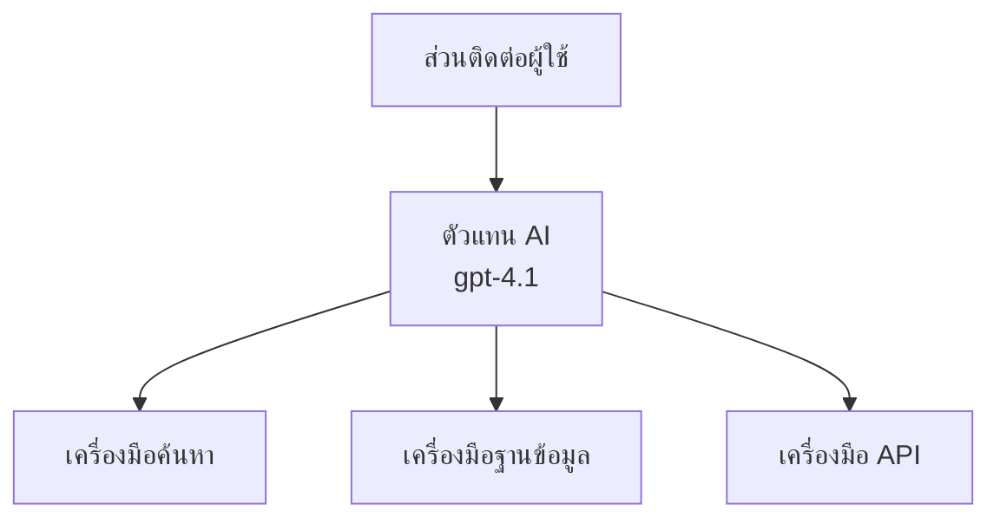
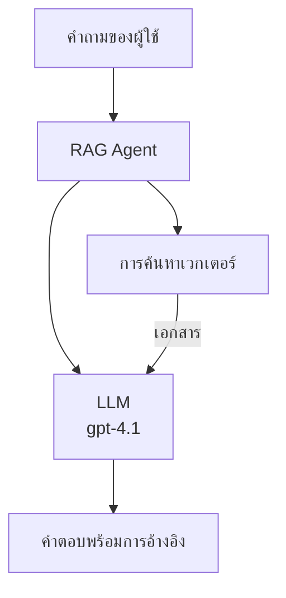
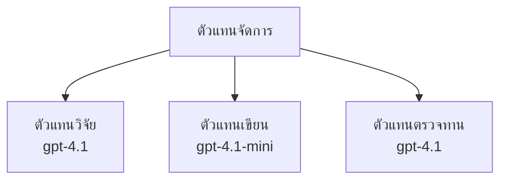

# AI Agents with Azure Developer CLI

**Chapter Navigation:**
- **📚 Course Home**: [AZD For Beginners](../../README.md)
- **📖 Current Chapter**: Chapter 2 - AI-First Development
- **⬅️ Previous**: [Microsoft Foundry Integration](microsoft-foundry-integration.md)
- **➡️ Next**: [AI Model Deployment](ai-model-deployment.md)
- **🚀 Advanced**: [Multi-Agent Solutions](../../examples/retail-scenario.md)

---

## บทนำ

AI agents คือโปรแกรมอิสระที่สามารถรับรู้สภาพแวดล้อมของตน ตัดสินใจ และดำเนินการเพื่อบรรลุเป้าหมายเฉพาะ แตกต่างจากแชทบอทที่ตอบกลับคำถามง่าย ๆ ตัวแทนสามารถ:

- **ใช้เครื่องมือ** - เรียก API, ค้นหาฐานข้อมูล, รันโค้ด
- **วางแผนและคิดวิเคราะห์** - แยกงานที่ซับซ้อนเป็นขั้นตอน
- **เรียนรู้จากบริบท** - เก็บความทรงจำและปรับพฤติกรรม
- **ทำงานร่วมกัน** - ทำงานกับเอเย่นต์อื่น ๆ (ระบบหลายตัวแทน)

คำแนะนำนี้จะแสดงวิธีการปรับใช้ AI agents บน Azure โดยใช้ Azure Developer CLI (azd)

> **หมายเหตุการตรวจสอบ (2026-03-25):** คำแนะนำนี้ผ่านการทบทวนกับ `azd` `1.23.12` และ `azure.ai.agents` `0.1.18-preview` ประสบการณ์ `azd ai` ยังเป็นรุ่นพรีวิว ดังนั้นโปรดตรวจสอบความช่วยเหลือของส่วนขยายหากแฟลกที่ติดตั้งแตกต่างกัน

## เป้าหมายการเรียนรู้

เมื่อทำคำแนะนำนี้เสร็จสิ้นแล้ว คุณจะ:
- เข้าใจว่า AI agents คืออะไรและแตกต่างจากแชทบอทอย่างไร
- ปรับใช้เทมเพลต AI agent ที่สร้างไว้ล่วงหน้าด้วย AZD
- กำหนดค่า Foundry Agents สำหรับตัวแทนที่กำหนดเอง
- นำรูปแบบตัวแทนพื้นฐานมาใช้ (การใช้เครื่องมือ, RAG, ระบบหลายตัวแทน)
- ตรวจสอบและดีบักตัวแทนที่ปรับใช้แล้ว

## ผลลัพธ์การเรียนรู้

เมื่อเสร็จสิ้น คุณจะสามารถ:
- ปรับใช้แอปพลิเคชัน AI agent ไปยัง Azure ด้วยคำสั่งเดียว
- กำหนดค่าเครื่องมือและความสามารถของตัวแทน
- นำการสร้างที่เสริมด้วยการเรียกค้น (RAG) มาใช้กับเอเย่นต์
- ออกแบบสถาปัตยกรรมหลายตัวแทนสำหรับเวิร์กโฟลว์ที่ซับซ้อน
- แก้ไขปัญหาการปรับใช้เอเย่นต์ทั่วไป

---

## 🤖 ปัจจัยที่ทำให้อีกต่างจากแชทบอท

| คุณสมบัติ | แชทบอท | AI Agent |
|---------|---------|----------|
| **พฤติกรรม** | ตอบกลับคำถาม | ทำงานอัตโนมัติ |
| **เครื่องมือ** | ไม่มี | สามารถเรียก API, ค้นหา, รันโค้ด |
| **ความทรงจำ** | เฉพาะบนเซสชัน | ความทรงจำถาวรข้ามเซสชัน |
| **การวางแผน** | ตอบครั้งเดียว | คิดวิเคราะห์หลายขั้นตอน |
| **การทำงานร่วมกัน** | เอนทิตีเดี่ยว | สามารถทำงานกับเอเย่นต์อื่น |

### อุปมาอย่างง่าย

- **แชทบอท** = พนักงานที่ช่วยตอบคำถามที่โต๊ะข้อมูล
- **AI Agent** = ผู้ช่วยส่วนตัวที่โทร จองนัดหมาย และทำงานแทนคุณ

---

## 🚀 เริ่มต้นอย่างรวดเร็ว: ปรับใช้เอเย่นต์ตัวแรกของคุณ

### ตัวเลือก 1: Foundry Agents Template (แนะนำ)

```bash
# เริ่มต้นแม่แบบตัวแทน AI
azd init --template get-started-with-ai-agents

# นำไปใช้บน Azure
azd up
```

**สิ่งที่จะถูกปรับใช้:**
- ✅ Foundry Agents
- ✅ Microsoft Foundry Models (gpt-4.1)
- ✅ Azure AI Search (สำหรับ RAG)
- ✅ Azure Container Apps (เว็บอินเทอร์เฟซ)
- ✅ Application Insights (สำหรับการติดตาม)

**เวลา:** ~15-20 นาที
**ค่าใช้จ่าย:** ~$100-150/เดือน (สำหรับการพัฒนา)

### ตัวเลือก 2: OpenAI Agent ด้วย Prompty

```bash
# เริ่มต้นแม่แบบตัวแทนที่ใช้ Prompty
azd init --template agent-openai-python-prompty

# นำไปใช้ใน Azure
azd up
```

**สิ่งที่จะถูกปรับใช้:**
- ✅ Azure Functions (รันเอเย่นต์แบบไร้เซิร์ฟเวอร์)
- ✅ Microsoft Foundry Models
- ✅ ไฟล์กำหนดค่า Prompty
- ✅ ตัวอย่างการใช้งานเอเย่นต์

**เวลา:** ~10-15 นาที
**ค่าใช้จ่าย:** ~$50-100/เดือน (สำหรับการพัฒนา)

### ตัวเลือก 3: RAG Chat Agent

```bash
# เริ่มต้นแม่แบบแชท RAG
azd init --template azure-search-openai-demo

# นำไปใช้ใน Azure
azd up
```

**สิ่งที่จะถูกปรับใช้:**
- ✅ Microsoft Foundry Models
- ✅ Azure AI Search พร้อมข้อมูลตัวอย่าง
- ✅ pipeline สำหรับประมวลผลเอกสาร
- ✅ อินเทอร์เฟซแชทพร้อมอ้างอิง

**เวลา:** ~15-25 นาที
**ค่าใช้จ่าย:** ~$80-150/เดือน (สำหรับการพัฒนา)

### ตัวเลือก 4: AZD AI Agent Init (พรีวิวบนพื้นฐาน Manifest หรือ Template)

ถ้าคุณมีไฟล์ agent manifest คุณสามารถใช้คำสั่ง `azd ai` เพื่อสร้างโปรเจค Foundry Agent Service โดยตรง รุ่นพรีวิวล่าสุดยังเพิ่มการรองรับการเริ่มต้นจากเทมเพลต ดังนั้นขั้นตอนคำถามอาจแตกต่างเล็กน้อยขึ้นกับเวอร์ชันส่วนขยายของคุณ

```bash
# ติดตั้งส่วนขยายตัวแทน AI
azd extension install azure.ai.agents

# ทางเลือก: ยืนยันเวอร์ชันพรีวิวที่ติดตั้งแล้ว
azd extension show azure.ai.agents

# เริ่มต้นจากแผ่นป้ายกำกับตัวแทน
azd ai agent init -m agent-manifest.yaml

# ติดตั้งไปยัง Azure
azd up

# ทดสอบตัวแทนที่ติดตั้งแล้ว (แสดงความล่าช้า + เวลาในการรับไบต์แรก)
azd ai agent invoke
```

**เมื่อใดควรใช้ `azd ai agent init` กับ `azd init --template`:**

| วิธีการ | เหมาะสำหรับ | วิธีการทำงาน |
|----------|----------|------|
| `azd init --template` | เริ่มจากแอปตัวอย่างที่ทำงานได้ | โคลนรีโพสเทมเพลตเต็มรวมโค้ด+โครงสร้างพื้นฐาน |
| `azd ai agent init -m` | สร้างจาก manifest ของเอเย่นต์คุณเอง | สร้างโครงสร้างโปรเจคจากการกำหนดเอเย่นต์ของคุณ |

> **เคล็ดลับ:** ใช้ `azd init --template` เมื่อเรียนรู้ (ตัวเลือก 1-3 ข้างต้น) ใช้ `azd ai agent init` เมื่อสร้างเอเย่นต์สำหรับผลิตภัณฑ์ด้วย manifest ของตัวเอง

หลังจาก `azd up` ส่วนขยายเดียวกันนี้จะช่วยคุณในขั้นตอนวงจรชีวิตของเอเย่นต์: ใช้ `azd ai agent invoke` เพื่อทดสอบ, `azd ai agent eval generate` และ `azd ai agent optimize` เพื่อวัดผลและปรับปรุงคุณภาพ, และ `azd ai agent delete` เพื่อลบ เมื่อดูคำอ้างอิงเต็มได้ที่ [AZD AI CLI Commands](../chapter-08-production/production-ai-practices.md#azd-ai-cli-commands-and-extensions)

---

## 🏗️ รูปแบบสถาปัตยกรรมของ Agent

### รูปแบบ 1: เอเย่นต์เดี่ยวพร้อมเครื่องมือ

รูปแบบเอเย่นต์ที่ง่ายที่สุด - เอเย่นต์หนึ่งตัวที่ใช้เครื่องมือหลายอย่างได้



**เหมาะสำหรับ:**
- บอทฝ่ายสนับสนุนลูกค้า
- ผู้ช่วยวิจัย
- เอเย่นต์วิเคราะห์ข้อมูล

**เทมเพลต AZD:** `azure-search-openai-demo`

### รูปแบบ 2: RAG Agent (การสร้างเนื้อหาเสริมด้วยการเรียกค้น)

เอเย่นต์ที่ดึงเอกสารที่เกี่ยวข้องก่อนสร้างคำตอบ



**เหมาะสำหรับ:**
- ฐานความรู้ในองค์กร
- ระบบถามตอบเอกสาร
- การวิจัยด้านกฎหมายและการปฏิบัติตามข้อกำหนด

**เทมเพลต AZD:** `azure-search-openai-demo`

### รูปแบบ 3: ระบบหลายเอเย่นต์

เอเย่นต์เฉพาะทางหลายตัวทำงานร่วมกันในงานที่ซับซ้อน



**เหมาะสำหรับ:**
- การสร้างเนื้อหาที่ซับซ้อน
- เวิร์กโฟลว์หลายขั้นตอน
- งานที่ต้องความเชี่ยวชาญหลากหลาย

**เรียนรู้เพิ่มเติม:** [รูปแบบการประสานงานหลายเอเย่นต์](../chapter-06-pre-deployment/coordination-patterns.md)

---

## ⚙️ การกำหนดค่าเครื่องมือของ Agent

เอเย่นต์จะทรงพลังเมื่อสามารถใช้เครื่องมือได้ นี่คือวิธีการกำหนดค่าเครื่องมือทั่วไป:

### การกำหนดค่าเครื่องมือใน Foundry Agents

```python
# agent_config.py
from azure.ai.projects import AIProjectClient
from azure.ai.projects.models import FunctionTool, CodeInterpreterTool

# กำหนดเครื่องมือที่กำหนดเอง
search_tool = FunctionTool(
    name="search_knowledge_base",
    description="Search the company knowledge base for relevant documents",
    parameters={
        "type": "object",
        "properties": {
            "query": {
                "type": "string",
                "description": "The search query"
            }
        },
        "required": ["query"]
    }
)

# สร้างตัวแทนพร้อมเครื่องมือ
agent = project_client.agents.create_agent(
    model="gpt-4.1",
    name="Support Agent",
    instructions="You are a helpful support agent. Use the search tool to find relevant information.",
    tools=[search_tool, CodeInterpreterTool()]
)
```

### การกำหนดค่าสภาพแวดล้อม

```bash
# ตั้งค่าสิ่งแวดล้อมเฉพาะตัวของเอเจนต์
azd env set AZURE_OPENAI_MODEL "gpt-4.1"
azd env set AGENT_INSTRUCTIONS "You are a helpful assistant..."
azd env set ENABLE_CODE_INTERPRETER "true"
azd env set ENABLE_FILE_SEARCH "true"

# ปรับใช้ด้วยการกำหนดค่าที่อัปเดตแล้ว
azd deploy
```

---

## 📊 การติดตามดูแลเอเย่นต์

### การบูรณาการ Application Insights

เทมเพลตเอเย่นต์ AZD ทั้งหมดรวม Application Insights สำหรับติดตาม:

```bash
# เปิดแผงควบคุมการตรวจสอบ
azd monitor --overview

# ดูบันทึกสด
azd monitor --logs

# ดูเมตริกสด
azd monitor --live
```

### เมตริกสำคัญที่ควรติดตาม

| เมตริก | คำอธิบาย | เป้าหมาย |
|--------|-------------|--------|
| Response Latency | เวลาที่ใช้ในการสร้างคำตอบ | < 5 วินาที |
| Token Usage | จำนวนโทเคนต่อคำขอ | ติดตามต้นทุน |
| Tool Call Success Rate | % การเรียกเครื่องมือสำเร็จ | > 95% |
| Error Rate | คำขอเอเย่นต์ล้มเหลว | < 1% |
| User Satisfaction | คะแนนความพึงพอใจ | > 4.0/5.0 |

### การบันทึกแบบกำหนดเองสำหรับเอเย่นต์

```python
import os
from azure.monitor.opentelemetry import configure_azure_monitor
from opentelemetry import trace

# กำหนดค่า Azure Monitor ด้วย OpenTelemetry
configure_azure_monitor(
    connection_string=os.environ["APPLICATIONINSIGHTS_CONNECTION_STRING"]
)

tracer = trace.get_tracer(__name__)

def log_agent_interaction(user_query, agent_response, tools_used, latency_ms):
    with tracer.start_as_current_span("agent_interaction") as span:
        span.set_attributes({
            "user_query": user_query,
            "response_length": len(agent_response),
            "tools_used": tools_used,
            "latency_ms": latency_ms
        })
```

> **หมายเหตุ:** ติดตั้งแพ็กเกจที่จำเป็น: `pip install azure-monitor-opentelemetry opentelemetry`

---

## 💰 การพิจารณาต้นทุน

### ต้นทุนเฉลี่ยรายเดือนตามรูปแบบ

| รูปแบบ | สภาพแวดล้อมพัฒนา | ผลิตจริง |
|---------|-----------------|------------|
| เอเย่นต์เดี่ยว | $50-100 | $200-500 |
| เอเย่นต์ RAG | $80-150 | $300-800 |
| ระบบหลายเอเย่นต์ (2-3 ตัว) | $150-300 | $500-1,500 |
| ระบบหลายเอเย่นต์สำหรับองค์กร | $300-500 | $1,500-5,000+ |

### เคล็ดลับการประหยัดต้นทุน

1. **ใช้ gpt-4.1-mini สำหรับงานง่าย**
   ```bash
   azd env set AZURE_OPENAI_MODEL "gpt-4.1-mini"
   ```

2. **ใช้งานแคชสำหรับคำถามซ้ำ**
   ```python
   from functools import lru_cache
   
   @lru_cache(maxsize=1000)
   def get_cached_response(query_hash):
       return agent.run(query_hash)
   ```

3. **ตั้งค่าขีดจำกัดโทเคนต่อการทำงาน**
   ```python
   # ตั้งค่า max_completion_tokens เมื่อรันเอเย่นต์ ไม่ใช่ตอนสร้าง
   run = project_client.agents.create_run(
       thread_id=thread.id,
       agent_id=agent.id,
       max_completion_tokens=1000  # จำกัดความยาวของการตอบกลับ
   )
   ```

4. **สเกลลงเป็นศูนย์เมื่อไม่ใช้งาน**
   ```bash
   # Container Apps ปรับขนาดเป็นศูนย์โดยอัตโนมัติ
   azd env set MIN_REPLICAS "0"
   ```

---

## 🔧 การแก้ไขปัญหาเอเย่นต์

### ปัญหาทั่วไปและวิธีแก้ไข

<details>
<summary><strong>❌ เอเย่นต์ไม่ตอบสนองเมื่อเรียกใช้เครื่องมือ</strong></summary>

```bash
# ตรวจสอบว่าเครื่องมือลงทะเบียนอย่างถูกต้องหรือไม่
azd show

# ตรวจสอบการปรับใช้ OpenAI
az cognitiveservices account deployment list \
  --name $AZURE_OPENAI_NAME \
  --resource-group $RG_NAME

# ตรวจสอบบันทึกตัวแทน
azd monitor --logs
```

**สาเหตุทั่วไป:**
- ลายเซ็นฟังก์ชันเครื่องมือไม่ตรงกัน
- ไม่มีสิทธิ์ที่จำเป็น
- ไม่สามารถเข้าถึง API endpoint
</details>

<details>
<summary><strong>❌ ความหน่วงสูงในคำตอบของเอเย่นต์</strong></summary>

```bash
# ตรวจสอบ Application Insights สำหรับคอขวด
azd monitor --live

# พิจารณาใช้โมเดลที่เร็วกว่า
azd env set AZURE_OPENAI_MODEL "gpt-4.1-mini"
azd deploy
```

**เคล็ดลับการปรับปรุง:**
- ใช้การตอบสนองแบบสตรีมมิ่ง
- ใช้งานแคชคำตอบ
- ลดขนาดบริบทข้อมูล
</details>

<details>
<summary><strong>❌ เอเย่นต์ตอบข้อมูลผิดหรือสร้างข้อมูลลวง</strong></summary>

```python
# ปรับปรุงด้วยคำสั่งระบบที่ดียิ่งขึ้น
instructions = """
You are a helpful assistant. IMPORTANT:
- Only answer based on provided context
- If you don't know, say "I don't know"
- Always cite your sources
- Never make up information
"""

# เพิ่มการดึงข้อมูลสำหรับการสนับสนุน
agent = project_client.agents.create_agent(
    model="gpt-4.1",
    instructions=instructions,
    tools=[FileSearchTool()]  # ตอบสนองโดยอิงเอกสาร
)
```
</details>

<details>
<summary><strong>❌ ข้อผิดพลาดเกินขีดจำกัดโทเคน</strong></summary>

```python
# ดำเนินการจัดการหน้าต่างบริบท
def truncate_context(messages, max_tokens=8000, model="gpt-4.1"):
    """Keep only recent messages within token limit."""
    import tiktoken
    encoding = tiktoken.encoding_for_model(model)
    total_tokens = 0
    truncated = []
    
    for msg in reversed(messages):
        msg_tokens = len(encoding.encode(msg.content))
        if total_tokens + msg_tokens > max_tokens:
            break
        truncated.insert(0, msg)
        total_tokens += msg_tokens
    
    return truncated
```
</details>

---

## 🎓 แบบฝึกหัดเชิงปฏิบัติ

### แบบฝึกหัด 1: ปรับใช้เอเย่นต์พื้นฐาน (20 นาที)

**เป้าหมาย:** ปรับใช้เอเย่นต์ AI ตัวแรกของคุณด้วย AZD

```bash
# ขั้นตอนที่ 1: เริ่มต้นแม่แบบ
azd init --template get-started-with-ai-agents

# ขั้นตอนที่ 2: เข้าสู่ระบบ Azure
azd auth login
# หากคุณทำงานข้ามผู้เช่า ให้เพิ่ม --tenant-id <tenant-id>

# ขั้นตอนที่ 3: ดำเนินการปรับใช้
azd up

# ขั้นตอนที่ 4: ทดสอบตัวแทน
# ผลลัพธ์ที่คาดหวังหลังจากการปรับใช้:
#   การปรับใช้เสร็จสมบูรณ์!
#   จุดเชื่อมต่อ: https://<app-name>.<region>.azurecontainerapps.io
# เปิด URL ที่แสดงในผลลัพธ์และลองถามคำถาม

# ขั้นตอนที่ 5: ดูการตรวจสอบ
azd monitor --overview

# ขั้นตอนที่ 6: ทำความสะอาด
azd down --force --purge
```

**เกณฑ์ความสำเร็จ:**
- [ ] เอเย่นต์ตอบคำถามได้
- [ ] เข้าถึงแดชบอร์ดติดตามผ่าน `azd monitor`
- [ ] ลบทรัพยากรเรียบร้อย

### แบบฝึกหัด 2: เพิ่มเครื่องมือที่กำหนดเอง (30 นาที)

**เป้าหมาย:** ขยายเอเย่นต์ด้วยเครื่องมือที่กำหนดเอง

1. ปรับใช้เทมเพลตเอเย่นต์:
   ```bash
   azd init --template get-started-with-ai-agents
   azd up
   ```
2. สร้างฟังก์ชันเครื่องมือใหม่ในโค้ดเอเย่นต์:
   ```python
   def get_weather(location: str) -> str:
       """Get current weather for a location."""
       # การเรียก API ไปยังบริการสภาพอากาศ
       return f"Weather in {location}: Sunny, 72°F"
   ```
3. ลงทะเบียนเครื่องมือกับเอเย่นต์:
   ```python
   from azure.ai.projects.models import FunctionTool

   weather_tool = FunctionTool(
       name="get_weather",
       description="Get current weather for a location",
       parameters={
           "type": "object",
           "properties": {
               "location": {"type": "string", "description": "City name"}
           },
           "required": ["location"]
       }
   )

   agent = project_client.agents.create_agent(
       model="gpt-4.1",
       name="Weather Agent",
       tools=[weather_tool]
   )
   ```
4. ปรับใช้ใหม่และทดสอบ:
   ```bash
   azd deploy
   # ถาม: "อากาศในซีแอตเทิลเป็นอย่างไร?"
   # คาดหวัง: เอเย่นต์เรียกใช้ get_weather("Seattle") และส่งกลับข้อมูลสภาพอากาศ
   ```

**เกณฑ์ความสำเร็จ:**
- [ ] เอเย่นต์รู้จำคำถามเกี่ยวกับสภาพอากาศ
- [ ] เครื่องมือถูกเรียกใช้อย่างถูกต้อง
- [ ] คำตอบมีข้อมูลสภาพอากาศประกอบ

### แบบฝึกหัด 3: สร้างเอเย่นต์ RAG (45 นาที)

**เป้าหมาย:** สร้างเอเย่นต์ที่ตอบคำถามจากเอกสารของคุณ

```bash
# ขั้นตอนที่ 1: ปล่อยเทมเพลต RAG
azd init --template azure-search-openai-demo
azd up

# ขั้นตอนที่ 2: อัปโหลดเอกสารของคุณ
# วางไฟล์ PDF/TXT ในไดเรกทอรี data/ จากนั้นรัน:
python scripts/prepdocs.py

# ขั้นตอนที่ 3: ทดสอบด้วยคำถามเฉพาะโดเมน
# เปิด URL ของเว็บแอปจากผลลัพธ์ azd up
# ถามคำถามเกี่ยวกับเอกสารที่คุณอัปโหลด
# คำตอบควรรวมการอ้างอิงแหล่งที่มาเช่น [doc.pdf]
```

**เกณฑ์ความสำเร็จ:**
- [ ] เอเย่นต์ตอบจากเอกสารที่อัปโหลด
- [ ] คำตอบมีการอ้างอิง
- [ ] ไม่มีข้อมูลลวงสำหรับคำถามนอกขอบเขต

---

## 📚 ขั้นตอนถัดไป

ตอนนี้ที่คุณเข้าใจ AI agents แล้ว ลองสำรวจหัวข้อขั้นสูงเหล่านี้:

| หัวข้อ | คำอธิบาย | ลิงก์ |
|-------|-------------|------|
| **ระบบหลายเอเย่นต์** | สร้างระบบที่มีเอเย่นต์หลายตัวทำงานร่วมกัน | [ตัวอย่าง Multi-Agent ใน Retail](../../examples/retail-scenario.md) |
| **รูปแบบการประสานงาน** | เรียนรู้แบบแผนการจัดการและสื่อสาร | [รูปแบบการประสานงาน](../chapter-06-pre-deployment/coordination-patterns.md) |
| **การปรับใช้ในผลิตจริง** | การปรับใช้เอเย่นต์ระดับองค์กร | [แนวปฏิบัติ AI ในผลิต](../chapter-08-production/production-ai-practices.md) |
| **การประเมินเอเย่นต์** | ทดสอบและประเมินประสิทธิภาพเอเย่นต์ | [การแก้ไขปัญหา AI](../chapter-07-troubleshooting/ai-troubleshooting.md) |
| **ห้องทดลอง AI Workshop** | ปฏิบัติจริง: สร้างโซลูชัน AI พร้อม AZD | [ห้องทดลอง AI Workshop](ai-workshop-lab.md) |

---

## 📖 แหล่งข้อมูลเพิ่มเติม

### เอกสารอย่างเป็นทางการ
- [Microsoft Foundry Agent Service](https://learn.microsoft.com/azure/ai-services/agents/)
- [Microsoft Foundry Agent Service Quickstart](https://learn.microsoft.com/azure/ai-services/agents/quickstart)
- [Semantic Kernel Agent Framework](https://learn.microsoft.com/semantic-kernel/)

### เทมเพลต AZD สำหรับเอเย่นต์
- [เริ่มต้นใช้งาน AI Agents](https://github.com/Azure-Samples/get-started-with-ai-agents)
- [Agent OpenAI Python Prompty](https://github.com/Azure-Samples/agent-openai-python-prompty)
- [Azure Search OpenAI Demo](https://github.com/Azure-Samples/azure-search-openai-demo)

### แหล่งข้อมูลชุมชน
- [Awesome AZD - เทมเพลตเอเย่นต์](https://azure.github.io/awesome-azd/?tags=ai-agents)
- [Azure AI Discord](https://discord.gg/microsoft-azure)
- [Microsoft Foundry Discord](https://discord.gg/nTYy5BXMWG)

### ทักษะเอเย่นต์สำหรับโปรแกรมแก้ไขของคุณ
- [**ทักษะเอเย่นต์ Microsoft Azure**](https://skills.sh/microsoft/github-copilot-for-azure) - ติดตั้งทักษะเอเย่นต์ AI ที่ใช้งานซ้ำได้สำหรับการพัฒนา Azure ใน GitHub Copilot, Cursor หรือเอเย่นต์ที่รองรับอื่น ๆ รวมถึงทักษะสำหรับ [Azure AI](https://skills.sh/microsoft/github-copilot-for-azure/azure-ai), [Microsoft Foundry](https://skills.sh/microsoft/github-copilot-for-azure/microsoft-foundry), [deployment](https://skills.sh/microsoft/github-copilot-for-azure/azure-deploy), และ [diagnostics](https://skills.sh/microsoft/github-copilot-for-azure/azure-diagnostics):
  ```bash
  npx skills add microsoft/github-copilot-for-azure
  ```

---

**Navigation**
- **Previous Lesson**: [Microsoft Foundry Integration](microsoft-foundry-integration.md)
- **Next Lesson**: [AI Model Deployment](ai-model-deployment.md)

---

<!-- CO-OP TRANSLATOR DISCLAIMER START -->
**ปฏิเสธความรับผิดชอบ**:
เอกสารนี้ได้รับการแปลโดยใช้บริการแปลภาษา AI [Co-op Translator](https://github.com/Azure/co-op-translator) ขณะที่เราพยายามให้ความถูกต้อง โปรดทราบว่าการแปลโดยอัตโนมัติอาจมีข้อผิดพลาดหรือความไม่ถูกต้อง เอกสารต้นฉบับในภาษาต้นทางควรถูกพิจารณาเป็นแหล่งข้อมูลที่เชื่อถือได้ สำหรับข้อมูลที่สำคัญ แนะนำให้ใช้การแปลโดยมนุษย์มืออาชีพ เราไม่รับผิดชอบต่อความเข้าใจผิดหรือการตีความที่ผิดพลาดที่เกิดขึ้นจากการใช้การแปลนี้
<!-- CO-OP TRANSLATOR DISCLAIMER END -->