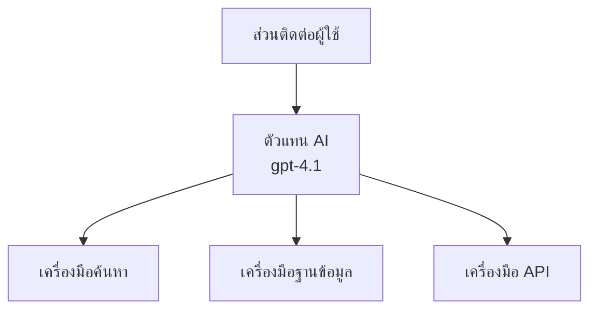
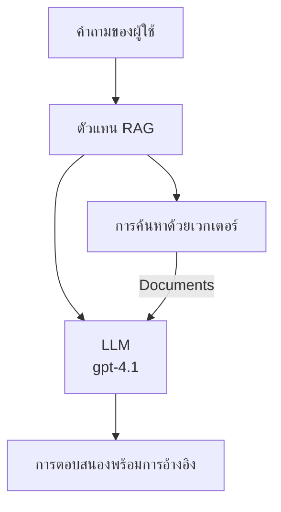
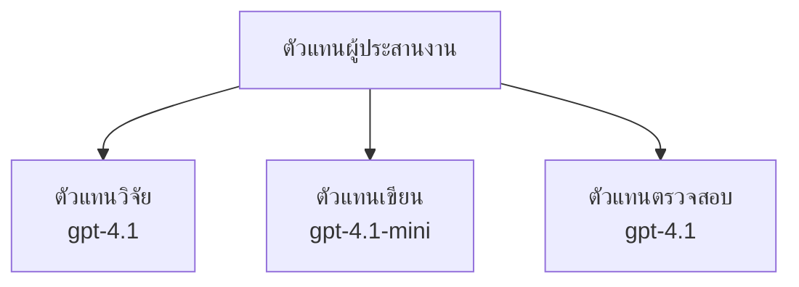

# ตัวแทน AI ด้วย Azure Developer CLI

**การนำทางบทเรียน:**
- **📚 หน้าแรกหลักสูตร**: [AZD สำหรับผู้เริ่มต้น](../../README.md)
- **📖 บทปัจจุบัน**: บทที่ 2 - การพัฒนาแบบ AI-First
- **⬅️ ก่อนหน้า**: [การรวม Microsoft Foundry](microsoft-foundry-integration.md)
- **➡️ ถัดไป**: [การปรับใช้โมเดล AI](ai-model-deployment.md)
- **🚀 ขั้นสูง**: [โซลูชันหลายตัวแทน](../../examples/retail-scenario.md)

---

## บทนำ

ตัวแทน AI คือโปรแกรมอัตโนมัติที่สามารถรับรู้สภาพแวดล้อมของตนเอง ตัดสินใจ และทำการเพื่อบรรลุเป้าหมายเฉพาะ แตกต่างจากแชทบอททั่วไปที่ตอบคำถาม ตัวแทนสามารถ:

- **ใช้เครื่องมือ** - เรียกใช้ API, ค้นหาฐานข้อมูล, รันโค้ด
- **วางแผนและวิเคราะห์** - แบ่งงานที่ซับซ้อนออกเป็นขั้นตอน
- **เรียนรู้จากบริบท** - รักษาความจำและปรับพฤติกรรม
- **ทำงานร่วมกัน** - ทำงานร่วมกับตัวแทนอื่น (ระบบหลายตัวแทน)

คู่มือนี้จะแสดงวิธีปรับใช้ตัวแทน AI บน Azure ด้วย Azure Developer CLI (azd)

> **หมายเหตุการตรวจสอบ (2026-07-13):** คู่มือนี้ได้รับการตรวจสอบกับ `azd` `1.27.1` และ `azure.ai.agents` `1.0.0-beta.5` ประสบการณ์ `azd ai` ยังอยู่ในเวอร์ชันพรีวิว ดังนั้นตรวจสอบความช่วยเหลือของส่วนขยายหากตัวเลือกที่ติดตั้งแตกต่างกัน

## เป้าหมายการเรียนรู้

เมื่อทำตามคู่มือนี้ครบถ้วน คุณจะ:
- เข้าใจว่าตัวแทน AI คืออะไรและแตกต่างจากแชทบอทยังไง
- ปรับใช้เทมเพลตตัวแทน AI ที่สร้างไว้ล่วงหน้าด้วย AZD
- กำหนดค่าตัวแทน Foundry สำหรับตัวแทนที่กำหนดเอง
- นำแบบแพทเทิร์นตัวแทนพื้นฐานมาใช้ (การใช้เครื่องมือ, RAG, หลายตัวแทน)
- เฝ้าติดตามและแก้ไขบั๊กตัวแทนที่ปรับใช้

## ผลลัพธ์การเรียนรู้

เมื่อเสร็จสิ้น คุณจะสามารถ:
- ปรับใช้แอปพลิเคชันตัวแทน AI บน Azure ด้วยคำสั่งเดียว
- กำหนดค่าเครื่องมือและความสามารถของตัวแทน
- นำการสร้างเนื้อหาแบบเสริมการค้นคืน (RAG) ร่วมกับตัวแทนมาใช้
- ออกแบบสถาปัตยกรรมหลายตัวแทนสำหรับเวิร์กโฟลว์ซับซ้อน
- แก้ไขปัญหาทั่วไปในการปรับใช้ตัวแทน

---

## 🤖 สิ่งที่ทำให้ตัวแทนแตกต่างจากแชทบอท?

| คุณสมบัติ | แชทบอท | ตัวแทน AI |
|---------|---------|----------|
| **พฤติกรรม** | ตอบคำถาม | ทำการโดยอิสระ |
| **เครื่องมือ** | ไม่มี | สามารถเรียกใช้ API, ค้นหา, รันโค้ดได้ |
| **ความจำ** | จำเฉพาะระหว่างเซสชัน | ความจำคงทนข้ามเซสชัน |
| **การวางแผน** | ตอบครั้งเดียว | การวิเคราะห์หลายขั้นตอน |
| **การทำงานร่วมกัน** | ตัวตนเดียว | สามารถทำงานร่วมกับตัวแทนอื่นได้ |

### อุปมาอย่างง่าย

- **แชทบอท** = คนช่วยตอบคำถามที่โต๊ะประชาสัมพันธ์
- **ตัวแทน AI** = ผู้ช่วยส่วนตัวที่สามารถโทร นัดหมาย และทำงานแทนคุณได้

---

## 🚀 เริ่มต้นอย่างรวดเร็ว: ปรับใช้ตัวแทนแรกของคุณ

### ตัวเลือก 1: เทมเพลต Foundry Agents (แนะนำ)

```bash
# เริ่มต้นแม่แบบตัวแทน AI
azd init --template get-started-with-ai-agents

# ปรับใช้ไปยัง Azure
azd up
```

**สิ่งที่ถูกปรับใช้:**
- ✅ Foundry Agents
- ✅ Microsoft Foundry Models (gpt-4.1)
- ✅ Azure AI Search (สำหรับ RAG)
- ✅ Azure Container Apps (อินเทอร์เฟซเว็บ)
- ✅ Application Insights (การเฝ้าติดตาม)

**เวลา:** ~15-20 นาที
**ค่าใช้จ่าย:** ~$100-150/เดือน (สำหรับพัฒนา)

### ตัวเลือก 2: ตัวแทน OpenAI กับ Prompty

```bash
# เริ่มต้นเทมเพลตเอเจนต์ที่ใช้ Prompty
azd init --template agent-openai-python-prompty

# ปรับใช้ไปยัง Azure
azd up
```

**สิ่งที่ถูกปรับใช้:**
- ✅ Azure Functions (การทำงานตัวแทนแบบไม่มีเซิร์ฟเวอร์)
- ✅ Microsoft Foundry Models
- ✅ ไฟล์กำหนดค่าของ Prompty
- ✅ ตัวอย่างการใช้งานตัวแทน

**เวลา:** ~10-15 นาที
**ค่าใช้จ่าย:** ~$50-100/เดือน (สำหรับพัฒนา)

### ตัวเลือก 3: ตัวแทน RAG Chat

```bash
# เริ่มต้นเทมเพลตแชท RAG
azd init --template azure-search-openai-demo

# นำไปใช้งานบน Azure
azd up
```

**สิ่งที่ถูกปรับใช้:**
- ✅ Microsoft Foundry Models
- ✅ Azure AI Search พร้อมข้อมูลตัวอย่าง
- ✅ ท่อประมวลผลเอกสาร
- ✅ อินเทอร์เฟซแชทพร้อมการอ้างอิง

**เวลา:** ~15-25 นาที
**ค่าใช้จ่าย:** ~$80-150/เดือน (สำหรับพัฒนา)

### ตัวเลือก 4: AZD AI Agent Init (พรีวิวแบบ Manifest หรือ Template)

หากคุณมีไฟล์ตัวแทน manifest คุณสามารถใช้คำสั่ง `azd ai` เพื่อสร้างโปรเจกต์บริการ Foundry Agent ได้โดยตรง เวอร์ชันพรีวิวล่าสุดยังได้เพิ่มการรองรับการเริ่มต้นจากเทมเพลต ดังนั้นขั้นตอนที่ปรากฏอาจแตกต่างเล็กน้อยตามเวอร์ชันส่วนขยายที่ติดตั้ง

```bash
# ติดตั้งส่วนขยายตัวแทน AI
azd extension install azure.ai.agents

# ทางเลือก: ตรวจสอบเวอร์ชันตัวอย่างที่ติดตั้ง
azd extension show azure.ai.agents

# เริ่มต้นจากไฟล์แสดงรายละเอียดตัวแทน
azd ai agent init -m agent-manifest.yaml

# ติดตั้งไปยัง Azure
azd up

# ทดสอบตัวแทนที่ติดตั้ง (แสดงความล่าช้า + เวลาในการรับไบต์แรก)
azd ai agent invoke
```

**เมื่อใดควรใช้ `azd ai agent init` กับ `azd init --template`:**

| วิธี | เหมาะสำหรับ | วิธีทำงาน |
|----------|----------|------|
| `azd init --template` | เริ่มจากแอปตัวอย่างที่ใช้งานได้ | โคลนรีโพเทมเพลตเต็มรูปแบบพร้อมโค้ดและโครงสร้างพื้นฐาน |
| `azd ai agent init -m` | สร้างจากประกาศ manifest ตัวแทนของคุณเอง | สร้างโครงสร้างโปรเจกต์จากคำจำกัดความตัวแทนของคุณ |

> **เคล็ดลับ:** ใช้ `azd init --template` เมื่อเรียนรู้ (ตัวเลือก 1-3 ข้างต้น) ใช้ `azd ai agent init` เมื่อสร้างตัวแทนสำหรับใช้งานจริงด้วย manifest ของคุณเอง

หลังจาก `azd up` ส่วนขยายนั้นจะนำคุณผ่านวงจรชีวิตตัวแทนครบถ้วน: `azd ai agent invoke` สำหรับทดสอบ, `azd ai agent eval generate` และ `azd ai agent optimize` เพื่อวัดและปรับปรุงคุณภาพ, และ `azd ai agent delete` เพื่อทำความสะอาด ดูเพิ่มเติมที่ [คำสั่ง AZD AI CLI](../chapter-08-production/production-ai-practices.md#azd-ai-cli-commands-and-extensions)

---

## 🏗️ แบบแผนสถาปัตยกรรมตัวแทน

### แบบแผน 1: ตัวแทนเดี่ยวพร้อมเครื่องมือ

แบบแผนตัวแทนที่ง่ายที่สุด - ตัวแทนตัวเดียวที่ใช้เครื่องมือหลายชนิดได้



**เหมาะสำหรับ:**
- แชทบอทสนับสนุนลูกค้า
- ผู้ช่วยวิจัย
- ตัวแทนวิเคราะห์ข้อมูล

**เทมเพลต AZD:** `azure-search-openai-demo`

### แบบแผน 2: ตัวแทน RAG (การสร้างเสริมด้วยการค้นคืน)

ตัวแทนที่ดึงข้อมูลจากเอกสารที่เกี่ยวข้องก่อนสร้างคำตอบ



**เหมาะสำหรับ:**
- ฐานความรู้สำหรับองค์กร
- ระบบถามตอบเอกสาร
- การค้นคว้าด้านการปฏิบัติตามข้อกำหนดและกฎหมาย

**เทมเพลต AZD:** `azure-search-openai-demo`

### แบบแผน 3: ระบบหลายตัวแทน

ตัวแทนเฉพาะทางหลายตัวร่วมกันทำงานในงานที่ซับซ้อน



**เหมาะสำหรับ:**
- การสร้างเนื้อหาที่ซับซ้อน
- เวิร์กโฟลว์หลายขั้นตอน
- งานที่ต้องความเชี่ยวชาญแตกต่างกัน

**เรียนรู้เพิ่มเติม:** [แบบแผนการประสานงานหลายตัวแทน](../chapter-06-pre-deployment/coordination-patterns.md)

---

## ⚙️ การกำหนดค่าเครื่องมือตัวแทน

ตัวแทนจะทรงพลังเมื่อสามารถใช้เครื่องมือได้ นี่คือวิธีการกำหนดค่าเครื่องมือทั่วไป:

### การกำหนดค่าเครื่องมือใน Foundry Agents

```python
# agent_config.py
from azure.ai.projects import AIProjectClient
from azure.ai.projects.models import FunctionTool, CodeInterpreterTool

# กำหนดเครื่องมือที่กำหนดเอง
search_tool = FunctionTool(
    name="search_knowledge_base",
    description="Search the company knowledge base for relevant documents",
    parameters={
        "type": "object",
        "properties": {
            "query": {
                "type": "string",
                "description": "The search query"
            }
        },
        "required": ["query"]
    }
)

# สร้างเอเจนต์พร้อมเครื่องมือ
agent = project_client.agents.create_agent(
    model="gpt-4.1",
    name="Support Agent",
    instructions="You are a helpful support agent. Use the search tool to find relevant information.",
    tools=[search_tool, CodeInterpreterTool()]
)
```

### การกำหนดค่าสภาพแวดล้อม

```bash
# ตั้งค่าสิ่งแวดล้อมเฉพาะสำหรับตัวแทน
azd env set AZURE_OPENAI_MODEL "gpt-4.1"
azd env set AGENT_INSTRUCTIONS "You are a helpful assistant..."
azd env set ENABLE_CODE_INTERPRETER "true"
azd env set ENABLE_FILE_SEARCH "true"

# ปรับใช้ด้วยการกำหนดค่าที่อัปเดตแล้ว
azd deploy
```

---

## 📊 การเฝ้าติดตามตัวแทน

### การรวม Application Insights

เทมเพลตตัวแทนทั้งหมดของ AZD รวม Application Insights สำหรับการเฝ้าติดตาม:

```bash
# เปิดแดชบอร์ดการตรวจสอบ
azd monitor --overview

# ดูบันทึกสด
azd monitor --logs

# ดูเมตริกสด
azd monitor --live
```

### ดัชนีชี้วัดสำคัญที่ต้องติดตาม

| ตัวชี้วัด | คำอธิบาย | เป้าหมาย |
|--------|-------------|--------|
| ความหน่วงในการตอบ | เวลาสร้างคำตอบ | < 5 วินาที |
| การใช้โทเค็น | โทเค็นต่อคำขอ | เฝ้าติดตามค่าใช้จ่าย |
| อัตราความสำเร็จในการเรียกใช้เครื่องมือ | % การใช้งานเครื่องมือสำเร็จ | > 95% |
| อัตราความผิดพลาด | คำขอตัวแทนที่ล้มเหลว | < 1% |
| ความพึงพอใจของผู้ใช้ | คะแนนตอบกลับ | > 4.0/5.0 |

### การบันทึกแบบกำหนดเองสำหรับตัวแทน

```python
import os
from azure.monitor.opentelemetry import configure_azure_monitor
from opentelemetry import trace

# กำหนดค่า Azure Monitor ด้วย OpenTelemetry
configure_azure_monitor(
    connection_string=os.environ["APPLICATIONINSIGHTS_CONNECTION_STRING"]
)

tracer = trace.get_tracer(__name__)

def log_agent_interaction(user_query, agent_response, tools_used, latency_ms):
    with tracer.start_as_current_span("agent_interaction") as span:
        span.set_attributes({
            "user_query": user_query,
            "response_length": len(agent_response),
            "tools_used": tools_used,
            "latency_ms": latency_ms
        })
```

> **หมายเหตุ:** ติดตั้งแพ็กเกจที่จำเป็น: `pip install azure-monitor-opentelemetry opentelemetry`

---

## 💰 การพิจารณาค่าใช้จ่าย

### ประมาณค่าใช้จ่ายรายเดือนตามแบบแผน

| แบบแผน | สภาพแวดล้อมพัฒนา | การผลิต |
|---------|-----------------|------------|
| ตัวแทนเดี่ยว | $50-100 | $200-500 |
| ตัวแทน RAG | $80-150 | $300-800 |
| หลายตัวแทน (2-3 ตัว) | $150-300 | $500-1,500 |
| หลายตัวแทนสำหรับองค์กร | $300-500 | $1,500-5,000+ |

### เคล็ดลับการปรับลดค่าใช้จ่าย

1. **ใช้ gpt-4.1-mini สำหรับงานง่ายๆ**
   ```bash
   azd env set AZURE_OPENAI_MODEL "gpt-4.1-mini"
   ```

2. **ใช้แคชสำหรับคำถามที่เกิดซ้ำ**
   ```python
   from functools import lru_cache
   
   @lru_cache(maxsize=1000)
   def get_cached_response(query_hash):
       return agent.run(query_hash)
   ```

3. **ตั้งค่าขีดจำกัดโทเค็นต่อรัน**
   ```python
   # ตั้งค่า max_completion_tokens เมื่อเรียกใช้เอเย่นต์ ไม่ใช่ตอนสร้าง
   run = project_client.agents.create_run(
       thread_id=thread.id,
       agent_id=agent.id,
       max_completion_tokens=1000  # จำกัดความยาวการตอบกลับ
   )
   ```

4. **ปรับสเกลเป็นศูนย์เมื่อไม่ได้ใช้**
   ```bash
   # Container Apps ปรับขนาดเป็นศูนย์โดยอัตโนมัติ
   azd env set MIN_REPLICAS "0"
   ```

---

## 🔧 การแก้ไขปัญหาตัวแทน

### ปัญหาทั่วไปและวิธีแก้ไข

<details>
<summary><strong>❌ ตัวแทนไม่ตอบสนองต่อการเรียกใช้เครื่องมือ</strong></summary>

```bash
# ตรวจสอบว่าเครื่องมือถูกลงทะเบียนอย่างถูกต้องหรือไม่
azd show

# ตรวจสอบการปรับใช้ OpenAI
az cognitiveservices account deployment list \
  --name $AZURE_OPENAI_NAME \
  --resource-group $RG_NAME

# ตรวจสอบบันทึกตัวแทน
azd monitor --logs
```

**สาเหตุทั่วไป:**
- ฟังก์ชันเครื่องมือไม่ตรงกับลายเซ็น
- ขาดสิทธิ์ที่จำเป็น
- ไม่สามารถเข้าถึงจุดเชื่อมต่อ API
</details>

<details>
<summary><strong>❌ ความหน่วงสูงในการตอบตัวแทน</strong></summary>

```bash
# ตรวจสอบ Application Insights สำหรับคอขวด
azd monitor --live

# พิจารณาใช้โมเดลที่เร็วกว่า
azd env set AZURE_OPENAI_MODEL "gpt-4.1-mini"
azd deploy
```

**เคล็ดลับการปรับปรุง:**
- ใช้การตอบกลับแบบสตรีม
- ใช้แคชคำตอบ
- ลดขนาดบริบทหน้าต่าง
</details>

<details>
<summary><strong>❌ ตัวแทนให้ข้อมูลผิดหรือเกิดความเข้าใจผิด</strong></summary>

```python
# ปรับปรุงด้วยคำสั่งระบบที่ดีขึ้น
instructions = """
You are a helpful assistant. IMPORTANT:
- Only answer based on provided context
- If you don't know, say "I don't know"
- Always cite your sources
- Never make up information
"""

# เพิ่มการดึงข้อมูลเพื่อการยึดโยง
agent = project_client.agents.create_agent(
    model="gpt-4.1",
    instructions=instructions,
    tools=[FileSearchTool()]  # ยึดคำตอบในเอกสาร
)
```
</details>

<details>
<summary><strong>❌ เกิดข้อผิดพลาดเกินขีดจำกัดโทเค็น</strong></summary>

```python
# ดำเนินการจัดการหน้าต่างบริบท
def truncate_context(messages, max_tokens=8000, model="gpt-4.1"):
    """Keep only recent messages within token limit."""
    import tiktoken
    encoding = tiktoken.encoding_for_model(model)
    total_tokens = 0
    truncated = []
    
    for msg in reversed(messages):
        msg_tokens = len(encoding.encode(msg.content))
        if total_tokens + msg_tokens > max_tokens:
            break
        truncated.insert(0, msg)
        total_tokens += msg_tokens
    
    return truncated
```
</details>

---

## 🎓 แบบฝึกหัด

### แบบฝึกหัด 1: ปรับใช้ตัวแทนพื้นฐาน (20 นาที)

**เป้าหมาย:** ปรับใช้ตัวแทน AI ตัวแรกของคุณด้วย AZD

```bash
# ขั้นตอนที่ 1: เริ่มต้นแม่แบบ
azd init --template get-started-with-ai-agents

# ขั้นตอนที่ 2: เข้าสู่ระบบ Azure
azd auth login
# หากคุณทำงานข้ามผู้เช่า ให้เพิ่ม --tenant-id <tenant-id>

# ขั้นตอนที่ 3: ติดตั้ง
azd up

# ขั้นตอนที่ 4: ทดสอบเอเจนต์
# ผลลัพธ์ที่คาดหวังหลังการติดตั้ง:
#   การติดตั้งเสร็จสมบูรณ์!
#   จุดเชื่อมต่อ: https://<app-name>.<region>.azurecontainerapps.io
# เปิด URL ที่แสดงในผลลัพธ์แล้วลองถามคำถาม

# ขั้นตอนที่ 5: ดูการตรวจสอบ
azd monitor --overview

# ขั้นตอนที่ 6: ทำความสะอาดพื้นที่ใช้งาน
azd down --force --purge
```

**เกณฑ์ความสำเร็จ:**
- [ ] ตัวแทนตอบคำถามได้
- [ ] สามารถเข้าถึงแดชบอร์ดเฝ้าติดตามผ่านคำสั่ง `azd monitor`
- [ ] ทำความสะอาดทรัพยากรเรียบร้อย

### แบบฝึกหัด 2: เพิ่มเครื่องมือกำหนดเอง (30 นาที)

**เป้าหมาย:** ขยายตัวแทนด้วยเครื่องมือกำหนดเอง

1. ปรับใช้เทมเพลตตัวแทน:
   ```bash
   azd init --template get-started-with-ai-agents
   azd up
   ```
2. สร้างฟังก์ชันเครื่องมือใหม่ในโค้ดตัวแทนของคุณ:
   ```python
   def get_weather(location: str) -> str:
       """Get current weather for a location."""
       # เรียก API ไปยังบริการสภาพอากาศ
       return f"Weather in {location}: Sunny, 72°F"
   ```
3. ลงทะเบียนเครื่องมือกับตัวแทน:
   ```python
   from azure.ai.projects.models import FunctionTool

   weather_tool = FunctionTool(
       name="get_weather",
       description="Get current weather for a location",
       parameters={
           "type": "object",
           "properties": {
               "location": {"type": "string", "description": "City name"}
           },
           "required": ["location"]
       }
   )

   agent = project_client.agents.create_agent(
       model="gpt-4.1",
       name="Weather Agent",
       tools=[weather_tool]
   )
   ```
4. ปรับใช้ใหม่และทดสอบ:
   ```bash
   azd deploy
   # ถาม: "อากาศที่ซีแอตเทิลเป็นอย่างไร?"
   # คาดหวัง: ตัวแทนโทรเรียก get_weather("Seattle") และคืนข้อมูลสภาพอากาศ
   ```

**เกณฑ์ความสำเร็จ:**
- [ ] ตัวแทนรู้จำคำถามเกี่ยวกับสภาพอากาศ
- [ ] เรียกใช้เครื่องมือถูกต้อง
- [ ] คำตอบรวมข้อมูลสภาพอากาศ

### แบบฝึกหัด 3: สร้างตัวแทน RAG (45 นาที)

**เป้าหมาย:** สร้างตัวแทนที่ตอบคำถามจากเอกสารของคุณ

```bash
# ขั้นตอนที่ 1: ติดตั้งแม่แบบ RAG
azd init --template azure-search-openai-demo
azd up

# ขั้นตอนที่ 2: อัปโหลดเอกสารของคุณ
# วางไฟล์ PDF/TXT ในโฟลเดอร์ data/ จากนั้นรัน:
python scripts/prepdocs.py

# ขั้นตอนที่ 3: ทดสอบด้วยคำถามเฉพาะโดเมน
# เปิด URL แอปเว็บจากผลลัพธ์ azd up
# ถามคำถามเกี่ยวกับเอกสารที่คุณอัปโหลด
# คำตอบควรรวมการอ้างอิงแหล่งที่มาด้วย เช่น [doc.pdf]
```

**เกณฑ์ความสำเร็จ:**
- [ ] ตัวแทนตอบจากเอกสารที่อัปโหลด
- [ ] คำตอบมีการอ้างอิง
- [ ] ไม่มีความเข้าใจผิดในคำถามนอกขอบเขต

---

## 📚 ขั้นตอนถัดไป

ตอนนี้ที่คุณเข้าใจตัวแทน AI แล้ว ให้สำรวจหัวข้อขั้นสูงเหล่านี้:

| หัวข้อ | คำอธิบาย | ลิงก์ |
|-------|-------------|------|
| **ระบบหลายตัวแทน** | สร้างระบบที่ตัวแทนหลายตัวทำงานร่วมกัน | [ตัวอย่างการค้าปลีกหลายตัวแทน](../../examples/retail-scenario.md) |
| **แบบแผนการประสานงาน** | เรียนรู้แบบแผนการประสานงานและการสื่อสาร | [แบบแผนการประสานงาน](../chapter-06-pre-deployment/coordination-patterns.md) |
| **การปรับใช้สำหรับการผลิต** | การปรับใช้ตัวแทนระดับองค์กร | [แนวปฏิบัติ AI สำหรับการผลิต](../chapter-08-production/production-ai-practices.md) |
| **การประเมินตัวแทน** | ทดสอบและประเมินประสิทธิภาพตัวแทน | [การแก้ไขปัญหา AI](../chapter-07-troubleshooting/ai-troubleshooting.md) |
| **ห้องทดลองเวิร์กช็อป AI** | ฝึกปฏิบัติ: ทำให้โซลูชัน AI ของคุณพร้อมใช้ AZD | [ห้องทดลองเวิร์กช็อป AI](ai-workshop-lab.md) |

---

## 📖 แหล่งข้อมูลเพิ่มเติม

### เอกสารทางการ
- [Microsoft Foundry Agent Service](https://learn.microsoft.com/azure/ai-services/agents/)
- [เริ่มต้นอย่างรวดเร็ว Microsoft Foundry Agent Service](https://learn.microsoft.com/azure/ai-services/agents/quickstart)
- [Semantic Kernel Agent Framework](https://learn.microsoft.com/semantic-kernel/)

### เทมเพลต AZD สำหรับตัวแทน
- [เริ่มต้นกับ AI Agents](https://github.com/Azure-Samples/get-started-with-ai-agents)
- [Agent OpenAI Python Prompty](https://github.com/Azure-Samples/agent-openai-python-prompty)
- [Azure Search OpenAI Demo](https://github.com/Azure-Samples/azure-search-openai-demo)

### แหล่งข้อมูลชุมชน
- [Awesome AZD - เทมเพลตตัวแทน](https://azure.github.io/awesome-azd/?tags=ai-agents)
- [Azure AI Discord](https://discord.gg/microsoft-azure)
- [Microsoft Foundry Discord](https://discord.gg/nTYy5BXMWG)

### ทักษะตัวแทนสำหรับโปรแกรมแก้ไขของคุณ
- [**ทักษะตัวแทน Microsoft Azure**](https://skills.sh/microsoft/github-copilot-for-azure) - ติดตั้งทักษะตัวแทน AI ที่นำกลับมาใช้ได้สำหรับการพัฒนา Azure ใน GitHub Copilot, Cursor หรือเอเจนต์ที่รองรับอื่นๆ มีทักษะสำหรับ [Azure AI](https://skills.sh/microsoft/github-copilot-for-azure/azure-ai), [Microsoft Foundry](https://skills.sh/microsoft/github-copilot-for-azure/microsoft-foundry), [การปรับใช้](https://skills.sh/microsoft/github-copilot-for-azure/azure-deploy) และ [การวินิจฉัย](https://skills.sh/microsoft/github-copilot-for-azure/azure-diagnostics):
  ```bash
  npx skills add microsoft/github-copilot-for-azure
  ```

---

**การนำทาง**
- **บทเรียนก่อนหน้า**: [การรวม Microsoft Foundry](microsoft-foundry-integration.md)
- **บทเรียนถัดไป**: [การปรับใช้โมเดล AI](ai-model-deployment.md)

---

<!-- CO-OP TRANSLATOR DISCLAIMER START -->
**ปฏิเสธความรับผิดชอบ**:
เอกสารนี้ได้รับการแปลโดยใช้บริการแปลภาษา AI [Co-op Translator](https://github.com/Azure/co-op-translator) ขณะที่เราพยายามให้ความถูกต้อง โปรดทราบว่าการแปลโดยอัตโนมัติอาจมีข้อผิดพลาดหรือความไม่ถูกต้อง เอกสารต้นฉบับในภาษาต้นทางควรถูกพิจารณาเป็นแหล่งข้อมูลที่เชื่อถือได้ สำหรับข้อมูลที่สำคัญ แนะนำให้ใช้การแปลโดยมนุษย์มืออาชีพ เราไม่รับผิดชอบต่อความเข้าใจผิดหรือการตีความที่ผิดพลาดที่เกิดขึ้นจากการใช้การแปลนี้
<!-- CO-OP TRANSLATOR DISCLAIMER END -->