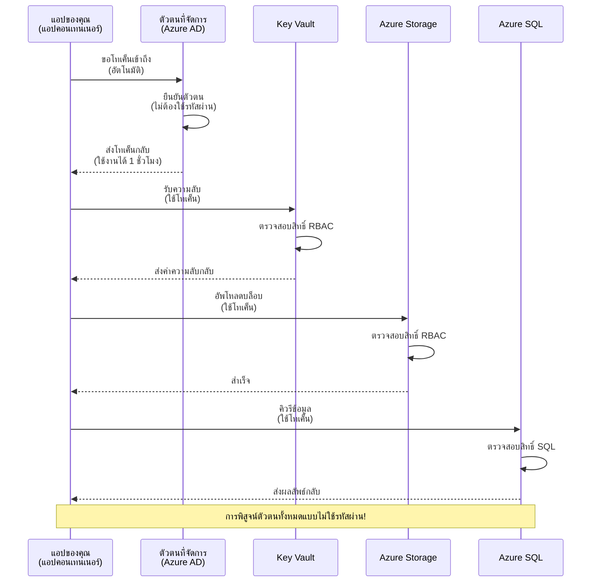
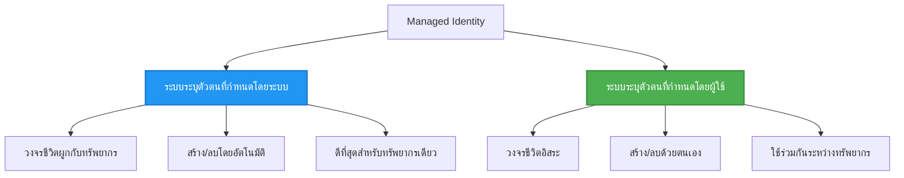

# รูปแบบการรับรองความถูกต้องและการจัดการตัวตน

⏱️ **เวลาที่ประมาณไว้**: 45-60 นาที | 💰 **ผลกระทบด้านค่าใช้จ่าย**: ฟรี (ไม่มีค่าธรรมเนียมเพิ่มเติม) | ⭐ **ความซับซ้อน**: ระดับกลาง

**📚 เส้นทางการเรียนรู้:**
- ← ก่อนหน้า: [การจัดการการกำหนดค่า](configuration.md) - การจัดการตัวแปรสภาพแวดล้อมและความลับ
- 🎯 **คุณอยู่ที่นี่**: การรับรองความถูกต้อง & ความปลอดภัย (การจัดการตัวตน, Key Vault, รูปแบบความปลอดภัย)
- → ถัดไป: [โปรเจกต์แรก](first-project.md) - สร้างแอป AZD แรกของคุณ
- 🏠 [หน้าหลักคอร์ส](../../README.md)

---

## สิ่งที่คุณจะได้เรียนรู้

โดยการทำบทเรียนนี้ให้สำเร็จ คุณจะ:
- เข้าใจรูปแบบการรับรองความถูกต้องของ Azure (กุญแจ, สตริงการเชื่อมต่อ, การจัดการตัวตน)
- ใช้งาน **การจัดการตัวตน** สำหรับการรับรองความถูกต้องโดยไม่ใช้รหัสผ่าน
- ปกป้องความลับด้วยการผสานรวม **Azure Key Vault**
- กำหนดค่า **บทบาทที่ควบคุมการเข้าถึง (RBAC)** สำหรับการปรับใช้ AZD
- ใช้แนวทางปฏิบัติด้านความปลอดภัยใน Container Apps และบริการ Azure ต่างๆ
- ย้ายจากการรับรองด้วยกุญแจไปสู่การรับรองโดยใช้ตัวตน

## ทำไมการจัดการตัวตนจึงสำคัญ

### ปัญหา: การรับรองความถูกต้องแบบดั้งเดิม

**ก่อนการจัดการตัวตน:**
```javascript
// ❌ ความเสี่ยงด้านความปลอดภัย: ความลับที่ฝังไว้ในโค้ดโดยตรง
const connectionString = "Server=mydb.database.windows.net;User=admin;Password=P@ssw0rd123";
const storageKey = "xK7mN9pQ2wR5tY8uI0oP3aS6dF1gH4jK...";
const cosmosKey = "C2x7B9n4M1p8Q5w3E6r0T2y5U8i1O4p7...";
```

**ปัญหา:**
- 🔴 **เปิดเผยความลับ** ในโค้ด, ไฟล์การกำหนดค่า, ตัวแปรสภาพแวดล้อม
- 🔴 **การหมุนเวียนข้อมูลรับรอง** ต้องเปลี่ยนโค้ดและปรับใช้ซ้ำ
- 🔴 **ฝันร้ายในการตรวจสอบ** - ใครเข้าถึงอะไร เมื่อไหร่?
- 🔴 **กระจัดกระจาย** - ความลับอยู่ในระบบหลายแห่ง
- 🔴 **ความเสี่ยงด้านการปฏิบัติตามข้อกำหนด** - ไม่ผ่านการตรวจสอบความปลอดภัย

### วิธีแก้ไข: การจัดการตัวตน

**หลังการจัดการตัวตน:**
```javascript
// ✅ ปลอดภัย: ไม่มีความลับในโค้ด
const credential = new DefaultAzureCredential();
const client = new BlobServiceClient(
  "https://mystorageaccount.blob.core.windows.net",
  credential  // Azure จัดการการตรวจสอบสิทธิ์โดยอัตโนมัติ
);
```

**ประโยชน์:**
- ✅ **ไม่มีความลับ** ในโค้ดหรือการกำหนดค่า
- ✅ **หมุนเวียนอัตโนมัติ** - Azure ดูแลให้
- ✅ **ประวัติการตรวจสอบเต็มรูปแบบ** ในบันทึก Azure AD
- ✅ **ความปลอดภัยแบบศูนย์กลาง** - จัดการใน Azure Portal
- ✅ **พร้อมการปฏิบัติตามข้อกำหนด** - ตรงตามมาตรฐานความปลอดภัย

**อุปมาอุปไมย**: การรับรองความถูกต้องแบบดั้งเดิมเหมือนการพกกุญแจหลายดอกสำหรับประตูหลายบาน ในขณะที่การจัดการตัวตนเหมือนการมอบบัตรผ่านความปลอดภัยที่อนุญาตการเข้าถึงโดยอัตโนมัติตามตัวตนของคุณ — ไม่มีการทำกุญแจหาย, ทำสำเนา หรือหมุนเวียน

---

## ภาพรวมสถาปัตยกรรม

### การไหลของการรับรองความถูกต้องด้วยการจัดการตัวตน


### ประเภทของการจัดการตัวตน


| คุณสมบัติ | กำหนดโดยระบบ | กำหนดโดยผู้ใช้ |
|---------|----------------|---------------|
| **วงจรชีวิต** | ผูกกับทรัพยากร | อิสระ |
| **การสร้าง** | สร้างอัตโนมัติกับทรัพยากร | สร้างด้วยตนเอง |
| **การลบ** | ถูกลบพร้อมทรัพยากร | คงอยู่หลังทรัพยากรถูกลบ |
| **การแชร์** | ทรัพยากรเดียวเท่านั้น | หลายทรัพยากร |
| **กรณีใช้งาน** | สถานการณ์ง่าย | สถานการณ์ที่ซับซ้อนหลายทรัพยากร |
| **ค่าเริ่มต้น AZD** | ✅ แนะนำ | เลือกใช้ได้ |

---

## ข้อกำหนดเบื้องต้น

### เครื่องมือที่จำเป็น

คุณควรติดตั้งเครื่องมือเหล่านี้จากบทเรียนก่อนหน้าแล้ว:

```bash
# ตรวจสอบ Azure Developer CLI
azd version
# ✅ คาดว่า: azd เวอร์ชัน 1.0.0 หรือสูงกว่า

# ตรวจสอบ Azure CLI
az --version
# ✅ คาดว่า: azure-cli 2.50.0 หรือสูงกว่า
```

### ข้อกำหนดของ Azure

- มีการสมัครใช้งาน Azure ที่ใช้งานได้
- สิทธิ์ในการ:
  - สร้างตัวตนที่จัดการแล้ว
  - กำหนดบทบาท RBAC
  - สร้างทรัพยากร Key Vault
  - ปรับใช้ Container Apps

### ความรู้เบื้องต้น

คุณควรได้ผ่าน:
- [คู่มือการติดตั้ง](installation.md) - การตั้งค่า AZD
- [พื้นฐาน AZD](azd-basics.md) - แนวคิดหลัก
- [การจัดการการกำหนดค่า](configuration.md) - ตัวแปรสภาพแวดล้อม

---

## บทเรียน 1: ทำความเข้าใจรูปแบบการรับรองความถูกต้อง

### รูปแบบ 1: สตริงการเชื่อมต่อ (รุ่นก่อน - หลีกเลี่ยง)

**วิธีทำงาน:**
```bash
# สายการเชื่อมต่อมีข้อมูลรับรอง
STORAGE_CONNECTION_STRING="DefaultEndpointsProtocol=https;AccountName=myaccount;AccountKey=xK7mN9pQ2wR5..."
COSMOS_CONNECTION_STRING="AccountEndpoint=https://myaccount.documents.azure.com:443/;AccountKey=C2x7..."
SQL_CONNECTION_STRING="Server=myserver.database.windows.net;User=admin;Password=P@ssw0rd..."
```

**ปัญหา:**
- ❌ ความลับปรากฏในตัวแปรสภาพแวดล้อม
- ❌ บันทึกในระบบปรับใช้
- ❌ ยากต่อการหมุนเวียน
- ❌ ไม่มีประวัติการตรวจสอบการเข้าถึง

**เมื่อใช้:** เฉพาะการพัฒนาท้องถิ่นเท่านั้น หลีกเลี่ยงในระบบผลิตจริง

---

### รูปแบบ 2: อ้างอิง Key Vault (ดีกว่า)

**วิธีทำงาน:**
```bicep
// Store secret in Key Vault
resource keyVault 'Microsoft.KeyVault/vaults@2023-02-01' = {
  name: 'mykv'
  properties: {
    enableRbacAuthorization: true
  }
}

// Reference in Container App
env: [
  {
    name: 'STORAGE_KEY'
    secretRef: 'storage-key'  // References Key Vault
  }
]
```

**ประโยชน์:**
- ✅ ความลับถูกเก็บอย่างปลอดภัยใน Key Vault
- ✅ การจัดการความลับแบบศูนย์กลาง
- ✅ หมุนเวียนได้โดยไม่ต้องเปลี่ยนโค้ด

**ข้อจำกัด:**
- ⚠️ ยังคงใช้กุญแจ/รหัสผ่าน
- ⚠️ ต้องจัดการการเข้าถึง Key Vault

**เมื่อใช้:** ขั้นตอนการเปลี่ยนผ่านจากสตริงการเชื่อมต่อเป็นการจัดการตัวตน

---

### รูปแบบ 3: การจัดการตัวตน (แนวปฏิบัติที่ดีที่สุด)

**วิธีทำงาน:**
```bicep
// Enable managed identity
resource containerApp 'Microsoft.App/containerApps@2023-05-01' = {
  name: 'myapp'
  identity: {
    type: 'SystemAssigned'  // Automatically creates identity
  }
}

// Grant permissions
resource roleAssignment 'Microsoft.Authorization/roleAssignments@2022-04-01' = {
  scope: storageAccount
  properties: {
    roleDefinitionId: storageBlobDataContributorRole
    principalId: containerApp.identity.principalId
  }
}
```

**โค้ดแอปพลิเคชัน:**
```javascript
// ไม่ต้องมีความลับใดๆ!
const { DefaultAzureCredential } = require('@azure/identity');
const { BlobServiceClient } = require('@azure/storage-blob');

const credential = new DefaultAzureCredential();
const blobServiceClient = new BlobServiceClient(
  'https://mystorageaccount.blob.core.windows.net',
  credential
);
```

**ประโยชน์:**
- ✅ ไม่มีความลับในโค้ด/การกำหนดค่า
- ✅ หมุนเวียนข้อมูลรับรองอัตโนมัติ
- ✅ บันทึกการตรวจสอบเต็มรูปแบบ
- ✅ สิทธิ์ตามบทบาท RBAC
- ✅ พร้อมปฏิบัติตามข้อกำหนด

**เมื่อใช้:** เสมอ สำหรับแอปผลิตจริง

---

## บทเรียน 2: การใช้งานการจัดการตัวตนด้วย AZD

### ขั้นตอนการใช้งานทีละขั้นตอน

มาสร้าง Container App ที่ปลอดภัยซึ่งใช้การจัดการตัวตนเพื่อเข้าถึง Azure Storage และ Key Vault

### โครงสร้างโปรเจกต์

```
secure-app/
├── azure.yaml                 # AZD configuration
├── infra/
│   ├── main.bicep            # Main infrastructure
│   ├── core/
│   │   ├── identity.bicep    # Managed identity setup
│   │   ├── keyvault.bicep    # Key Vault configuration
│   │   └── storage.bicep     # Storage with RBAC
│   └── app/
│       └── container-app.bicep
└── src/
    ├── app.js                # Application code
    ├── package.json
    └── Dockerfile
```

### 1. กำหนดค่า AZD (azure.yaml)

```yaml
name: secure-app
metadata:
  template: secure-app@1.0.0

services:
  api:
    project: ./src
    language: js
    host: containerapp

# Enable managed identity (AZD handles this automatically)
```

### 2. โครงสร้างพื้นฐาน: เปิดใช้การจัดการตัวตน

**ไฟล์: `infra/main.bicep`**

```bicep
targetScope = 'subscription'

param environmentName string
param location string = 'eastus'

var tags = { 'azd-env-name': environmentName }

// Resource group
resource rg 'Microsoft.Resources/resourceGroups@2021-04-01' = {
  name: 'rg-${environmentName}'
  location: location
  tags: tags
}

// Storage Account
module storage './core/storage.bicep' = {
  name: 'storage'
  scope: rg
  params: {
    name: 'st${uniqueString(rg.id)}'
    location: location
    tags: tags
  }
}

// Key Vault
module keyVault './core/keyvault.bicep' = {
  name: 'keyvault'
  scope: rg
  params: {
    name: 'kv-${uniqueString(rg.id)}'
    location: location
    tags: tags
  }
}

// Container App with Managed Identity
module containerApp './app/container-app.bicep' = {
  name: 'container-app'
  scope: rg
  params: {
    name: 'ca-${environmentName}'
    location: location
    tags: tags
    storageAccountName: storage.outputs.name
    keyVaultName: keyVault.outputs.name
  }
}

// Grant Container App access to Storage
module storageRoleAssignment './core/role-assignment.bicep' = {
  name: 'storage-role'
  scope: rg
  params: {
    principalId: containerApp.outputs.identityPrincipalId
    roleDefinitionId: 'ba92f5b4-2d11-453d-a403-e96b0029c9fe'  // Storage Blob Data Contributor
    targetResourceId: storage.outputs.id
  }
}

// Grant Container App access to Key Vault
module kvRoleAssignment './core/role-assignment.bicep' = {
  name: 'kv-role'
  scope: rg
  params: {
    principalId: containerApp.outputs.identityPrincipalId
    roleDefinitionId: '4633458b-17de-408a-b874-0445c86b69e6'  // Key Vault Secrets User
    targetResourceId: keyVault.outputs.id
  }
}

// Outputs
output AZURE_STORAGE_ACCOUNT_NAME string = storage.outputs.name
output AZURE_KEY_VAULT_NAME string = keyVault.outputs.name
output APP_URL string = containerApp.outputs.url
```

### 3. Container App กับตัวตนที่กำหนดโดยระบบ

**ไฟล์: `infra/app/container-app.bicep`**

```bicep
param name string
param location string
param tags object = {}
param storageAccountName string
param keyVaultName string

resource containerApp 'Microsoft.App/containerApps@2023-05-01' = {
  name: name
  location: location
  tags: tags
  identity: {
    type: 'SystemAssigned'  // 🔑 Enable managed identity
  }
  properties: {
    configuration: {
      ingress: {
        external: true
        targetPort: 3000
      }
    }
    template: {
      containers: [
        {
          name: 'api'
          image: 'myregistry.azurecr.io/api:latest'
          resources: {
            cpu: json('0.5')
            memory: '1Gi'
          }
          env: [
            {
              name: 'AZURE_STORAGE_ACCOUNT_NAME'
              value: storageAccountName
            }
            {
              name: 'AZURE_KEY_VAULT_NAME'
              value: keyVaultName
            }
            // 🔑 No secrets - managed identity handles authentication!
          ]
        }
      ]
    }
  }
}

// Output the identity for RBAC assignments
output identityPrincipalId string = containerApp.identity.principalId
output id string = containerApp.id
output url string = 'https://${containerApp.properties.configuration.ingress.fqdn}'
```

### 4. โมดูลการมอบหมายบทบาท RBAC

**ไฟล์: `infra/core/role-assignment.bicep`**

```bicep
param principalId string
param roleDefinitionId string  // Azure built-in role ID
param targetResourceId string

resource roleAssignment 'Microsoft.Authorization/roleAssignments@2022-04-01' = {
  name: guid(principalId, roleDefinitionId, targetResourceId)
  scope: resourceId('Microsoft.Resources/resourceGroups', resourceGroup().name)
  properties: {
    roleDefinitionId: subscriptionResourceId('Microsoft.Authorization/roleDefinitions', roleDefinitionId)
    principalId: principalId
    principalType: 'ServicePrincipal'
  }
}

output id string = roleAssignment.id
```

### 5. โค้ดแอปพลิเคชันที่ใช้การจัดการตัวตน

**ไฟล์: `src/app.js`**

```javascript
const express = require('express');
const { DefaultAzureCredential } = require('@azure/identity');
const { BlobServiceClient } = require('@azure/storage-blob');
const { SecretClient } = require('@azure/keyvault-secrets');

const app = express();
const PORT = process.env.PORT || 3000;

// 🔑 เริ่มต้นข้อมูลประจำตัว (ทำงานโดยอัตโนมัติด้วย managed identity)
const credential = new DefaultAzureCredential();

// การตั้งค่า Azure Storage
const storageAccountName = process.env.AZURE_STORAGE_ACCOUNT_NAME;
const blobServiceClient = new BlobServiceClient(
  `https://${storageAccountName}.blob.core.windows.net`,
  credential  // ไม่ต้องใช้คีย์!
);

// การตั้งค่า Key Vault
const keyVaultName = process.env.AZURE_KEY_VAULT_NAME;
const secretClient = new SecretClient(
  `https://${keyVaultName}.vault.azure.net`,
  credential  // ไม่ต้องใช้คีย์!
);

// ตรวจสอบสุขภาพ
app.get('/health', (req, res) => {
  res.json({ status: 'healthy', authentication: 'managed-identity' });
});

// อัปโหลดไฟล์ไปยัง blob storage
app.post('/upload', async (req, res) => {
  try {
    const containerClient = blobServiceClient.getContainerClient('uploads');
    await containerClient.createIfNotExists();
    
    const blobName = `file-${Date.now()}.txt`;
    const blockBlobClient = containerClient.getBlockBlobClient(blobName);
    
    await blockBlobClient.upload('Hello from managed identity!', 30);
    
    res.json({
      success: true,
      blobName: blobName,
      message: 'File uploaded using managed identity!'
    });
  } catch (error) {
    console.error('Upload error:', error);
    res.status(500).json({ error: error.message });
  }
});

// ดึงความลับจาก Key Vault
app.get('/secret/:name', async (req, res) => {
  try {
    const secretName = req.params.name;
    const secret = await secretClient.getSecret(secretName);
    
    res.json({
      name: secretName,
      value: secret.value,
      message: 'Secret retrieved using managed identity!'
    });
  } catch (error) {
    console.error('Secret error:', error);
    res.status(500).json({ error: error.message });
  }
});

// แสดงรายการ blob containers (สาธิตการเข้าถึงแบบอ่าน)
app.get('/containers', async (req, res) => {
  try {
    const containers = [];
    for await (const container of blobServiceClient.listContainers()) {
      containers.push(container.name);
    }
    
    res.json({
      containers: containers,
      count: containers.length,
      message: 'Containers listed using managed identity!'
    });
  } catch (error) {
    console.error('List error:', error);
    res.status(500).json({ error: error.message });
  }
});

app.listen(PORT, () => {
  console.log(`Secure API listening on port ${PORT}`);
  console.log('Authentication: Managed Identity (passwordless)');
});
```

**ไฟล์: `src/package.json`**

```json
{
  "name": "secure-app",
  "version": "1.0.0",
  "dependencies": {
    "express": "^4.18.2",
    "@azure/identity": "^4.0.0",
    "@azure/storage-blob": "^12.17.0",
    "@azure/keyvault-secrets": "^4.7.0"
  },
  "scripts": {
    "start": "node app.js"
  }
}
```

### 6. ปรับใช้และทดสอบ

```bash
# เริ่มต้นสภาพแวดล้อม AZD
azd init

# ปรับใช้โครงสร้างพื้นฐานและแอปพลิเคชัน
azd up

# ดึง URL ของแอป
APP_URL=$(azd env get-values | grep APP_URL | cut -d '=' -f2 | tr -d '"')

# ทดสอบการตรวจสอบสุขภาพ
curl $APP_URL/health
```

**✅ ผลลัพธ์ที่คาดหวัง:**
```json
{
  "status": "healthy",
  "authentication": "managed-identity"
}
```

**ทดสอบการอัปโหลด blob:**
```bash
curl -X POST $APP_URL/upload
```

**✅ ผลลัพธ์ที่คาดหวัง:**
```json
{
  "success": true,
  "blobName": "file-1700404800000.txt",
  "message": "File uploaded using managed identity!"
}
```

**ทดสอบรายการ container:**
```bash
curl $APP_URL/containers
```

**✅ ผลลัพธ์ที่คาดหวัง:**
```json
{
  "containers": ["uploads"],
  "count": 1,
  "message": "Containers listed using managed identity!"
}
```

---

## บทบาท RBAC ของ Azure ที่พบบ่อย

### รหัสบทบาทในตัวสำหรับการจัดการตัวตน

| บริการ | ชื่อบทบาท | รหัสบทบาท | สิทธิ์ |
|---------|-----------|---------|-------------|
| **Storage** | Storage Blob Data Reader | `2a2b9908-6b94-4a3d-8e5a-a7d8f8cc8a12` | อ่าน blobs และ containers |
| **Storage** | Storage Blob Data Contributor | `ba92f5b4-2d11-453d-a403-e96b0029c9fe` | อ่าน, เขียน, ลบ blobs |
| **Storage** | Storage Queue Data Contributor | `974c5e8b-45b9-4653-ba55-5f855dd0fb88` | อ่าน, เขียน, ลบข้อความคิว |
| **Key Vault** | Key Vault Secrets User | `4633458b-17de-408a-b874-0445c86b69e6` | อ่านความลับ |
| **Key Vault** | Key Vault Secrets Officer | `b86a8fe4-44ce-4948-aee5-eccb2c155cd7` | อ่าน, เขียน, ลบความลับ |
| **Cosmos DB** | Cosmos DB Built-in Data Reader | `00000000-0000-0000-0000-000000000001` | อ่านข้อมูล Cosmos DB |
| **Cosmos DB** | Cosmos DB Built-in Data Contributor | `00000000-0000-0000-0000-000000000002` | อ่าน, เขียนข้อมูล Cosmos DB |
| **SQL Database** | SQL DB Contributor | `9b7fa17d-e63e-47b0-bb0a-15c516ac86ec` | จัดการฐานข้อมูล SQL |
| **Service Bus** | Azure Service Bus Data Owner | `090c5cfd-751d-490a-894a-3ce6f1109419` | ส่ง, รับ, จัดการข้อความ |

### วิธีค้นหารหัสบทบาท

```bash
# แสดงรายการบทบาทในตัวทั้งหมด
az role definition list --query "[].{Name:roleName, ID:name}" --output table

# ค้นหาบทบาทเฉพาะ
az role definition list --query "[?contains(roleName, 'Storage Blob')].{Name:roleName, ID:name}" --output table

# รับรายละเอียดบทบาท
az role definition list --name "Storage Blob Data Contributor"
```

---

## แบบฝึกหัดปฏิบัติ

### แบบฝึกหัด 1: เปิดใช้การจัดการตัวตนสำหรับแอปเดิม ⭐⭐ (ระดับกลาง)

**เป้าหมาย**: เพิ่มการจัดการตัวตนให้กับการปรับใช้ Container App ที่มีอยู่

**สถานการณ์**: คุณมี Container App ที่ใช้สตริงการเชื่อมต่อ แปลงเป็นการใช้การจัดการตัวตน

**จุดเริ่มต้น**: Container App ด้วยการกำหนดค่านี้:

```bicep
// ❌ Current: Using connection string
env: [
  {
    name: 'STORAGE_CONNECTION_STRING'
    secretRef: 'storage-connection'
  }
]
```

**ขั้นตอน**:

1. **เปิดใช้การจัดการตัวตนใน Bicep:**

```bicep
resource containerApp 'Microsoft.App/containerApps@2023-05-01' = {
  name: 'myapp'
  identity: {
    type: 'SystemAssigned'  // Add this
  }
  // ... rest of configuration
}
```

2. **มอบสิทธิ์ Storage:**

```bicep
// Get storage account reference
resource storageAccount 'Microsoft.Storage/storageAccounts@2023-01-01' existing = {
  name: storageAccountName
}

// Assign role
resource roleAssignment 'Microsoft.Authorization/roleAssignments@2022-04-01' = {
  name: guid(containerApp.id, 'ba92f5b4-2d11-453d-a403-e96b0029c9fe', storageAccount.id)
  scope: storageAccount
  properties: {
    roleDefinitionId: subscriptionResourceId('Microsoft.Authorization/roleDefinitions', 'ba92f5b4-2d11-453d-a403-e96b0029c9fe')
    principalId: containerApp.identity.principalId
    principalType: 'ServicePrincipal'
  }
}
```

3. **อัปเดตโค้ดแอปพลิเคชัน:**

**ก่อน (สตริงการเชื่อมต่อ):**
```javascript
const { BlobServiceClient } = require('@azure/storage-blob');

const blobServiceClient = BlobServiceClient.fromConnectionString(
  process.env.STORAGE_CONNECTION_STRING
);
```

**หลัง (การจัดการตัวตน):**
```javascript
const { DefaultAzureCredential } = require('@azure/identity');
const { BlobServiceClient } = require('@azure/storage-blob');

const credential = new DefaultAzureCredential();
const blobServiceClient = new BlobServiceClient(
  `https://${process.env.STORAGE_ACCOUNT_NAME}.blob.core.windows.net`,
  credential
);
```

4. **อัปเดตตัวแปรสภาพแวดล้อม:**

```bicep
env: [
  {
    name: 'STORAGE_ACCOUNT_NAME'
    value: storageAccountName  // Just the name, no secrets!
  }
  // Remove STORAGE_CONNECTION_STRING
]
```

5. **ปรับใช้และทดสอบ:**

```bash
# ติดตั้งใหม่
azd up

# ทดสอบว่ายังใช้งานได้อยู่
curl https://myapp.azurecontainerapps.io/upload
```

**✅ เกณฑ์ความสำเร็จ:**
- ✅ ปรับใช้แอปได้โดยไม่มีข้อผิดพลาด
- ✅ ฟังก์ชัน Storage ทำงานได้ (อัปโหลด, แสดงรายการ, ดาวน์โหลด)
- ✅ ไม่มีสตริงการเชื่อมต่อในตัวแปรสภาพแวดล้อม
- ✅ ตัวตนแสดงใน Azure Portal ใต้แถบ "Identity"

**ตรวจสอบ:**

```bash
# ตรวจสอบว่าเปิดใช้งาน managed identity หรือไม่
az containerapp show \
  --name myapp \
  --resource-group rg-myapp \
  --query "identity.type"
# ✅ ที่คาดไว้: "SystemAssigned"

# ตรวจสอบการกำหนดบทบาท
az role assignment list \
  --assignee $(az containerapp show --name myapp --resource-group rg-myapp --query "identity.principalId" -o tsv) \
  --scope /subscriptions/{sub-id}/resourceGroups/rg-myapp/providers/Microsoft.Storage/storageAccounts/mystorageaccount
# ✅ ที่คาดไว้: แสดงบทบาท "Storage Blob Data Contributor"
```

**เวลา**: 20-30 นาที

---

### แบบฝึกหัด 2: การเข้าถึงบริการหลายตัวด้วยตัวตนที่กำหนดโดยผู้ใช้ ⭐⭐⭐ (ขั้นสูง)

**เป้าหมาย**: สร้างตัวตนที่กำหนดโดยผู้ใช้เพื่อแชร์กับ Container Apps หลายตัว

**สถานการณ์**: คุณมีไมโครเซอร์วิส 3 ตัว ที่ทั้งหมดต้องเข้าถึงบัญชี Storage และ Key Vault เดียวกัน

**ขั้นตอน**:

1. **สร้างตัวตนที่กำหนดโดยผู้ใช้:**

**ไฟล์: `infra/core/identity.bicep`**

```bicep
param name string
param location string
param tags object = {}

resource userAssignedIdentity 'Microsoft.ManagedIdentity/userAssignedIdentities@2023-01-31' = {
  name: name
  location: location
  tags: tags
}

output id string = userAssignedIdentity.id
output principalId string = userAssignedIdentity.properties.principalId
output clientId string = userAssignedIdentity.properties.clientId
```

2. **มอบบทบาทให้ตัวตนที่กำหนดโดยผู้ใช้:**

```bicep
// In main.bicep
module userIdentity './core/identity.bicep' = {
  name: 'user-identity'
  scope: rg
  params: {
    name: 'id-${environmentName}'
    location: location
    tags: tags
  }
}

// Grant Storage access
resource storageRoleAssignment 'Microsoft.Authorization/roleAssignments@2022-04-01' = {
  name: guid(userIdentity.outputs.principalId, 'storage-contributor')
  scope: storageAccount
  properties: {
    roleDefinitionId: subscriptionResourceId('Microsoft.Authorization/roleDefinitions', 'ba92f5b4-2d11-453d-a403-e96b0029c9fe')
    principalId: userIdentity.outputs.principalId
    principalType: 'ServicePrincipal'
  }
}

// Grant Key Vault access
resource kvRoleAssignment 'Microsoft.Authorization/roleAssignments@2022-04-01' = {
  name: guid(userIdentity.outputs.principalId, 'kv-secrets-user')
  scope: keyVault
  properties: {
    roleDefinitionId: subscriptionResourceId('Microsoft.Authorization/roleDefinitions', '4633458b-17de-408a-b874-0445c86b69e6')
    principalId: userIdentity.outputs.principalId
    principalType: 'ServicePrincipal'
  }
}
```

3. **มอบหมายตัวตนให้กับ Container Apps หลายตัว:**

```bicep
resource apiGateway 'Microsoft.App/containerApps@2023-05-01' = {
  name: 'api-gateway'
  identity: {
    type: 'UserAssigned'
    userAssignedIdentities: {
      '${userIdentity.outputs.id}': {}
    }
  }
  // ... rest of config
}

resource productService 'Microsoft.App/containerApps@2023-05-01' = {
  name: 'product-service'
  identity: {
    type: 'UserAssigned'
    userAssignedIdentities: {
      '${userIdentity.outputs.id}': {}
    }
  }
  // ... rest of config
}

resource orderService 'Microsoft.App/containerApps@2023-05-01' = {
  name: 'order-service'
  identity: {
    type: 'UserAssigned'
    userAssignedIdentities: {
      '${userIdentity.outputs.id}': {}
    }
  }
  // ... rest of config
}
```

4. **โค้ดแอปพลิเคชัน (บริการทั้งหมดใช้รูปแบบเดียวกัน):**

```javascript
const { DefaultAzureCredential, ManagedIdentityCredential } = require('@azure/identity');

// สำหรับตัวตนที่ผู้ใช้กำหนด ให้ระบุรหัสประจำตัวลูกค้า
const credential = new ManagedIdentityCredential(
  process.env.AZURE_CLIENT_ID  // รหัสประจำตัวลูกค้าของตัวตนที่ผู้ใช้กำหนด
);

// หรือใช้ DefaultAzureCredential (ตรวจจับอัตโนมัติ)
const credential = new DefaultAzureCredential();

const blobServiceClient = new BlobServiceClient(
  `https://${process.env.STORAGE_ACCOUNT_NAME}.blob.core.windows.net`,
  credential
);
```

5. **ปรับใช้และตรวจสอบ:**

```bash
azd up

# ทดสอบว่าบริการทั้งหมดสามารถเข้าถึงที่เก็บข้อมูลได้หรือไม่
curl https://api-gateway.azurecontainerapps.io/upload
curl https://product-service.azurecontainerapps.io/upload
curl https://order-service.azurecontainerapps.io/upload
```

**✅ เกณฑ์ความสำเร็จ:**
- ✅ หนึ่งตัวตนแชร์ใน 3 บริการ
- ✅ บริการทั้งหมดเข้าถึง Storage และ Key Vault ได้
- ✅ ตัวตนยังคงอยู่หากลบบริการใดบริการหนึ่ง
- ✅ การจัดการสิทธิ์แบบศูนย์กลาง

**ประโยชน์ของตัวตนที่กำหนดโดยผู้ใช้:**
- จัดการตัวตนเดียว
- สิทธิ์สอดคล้องกันทั่วบริการ
- อยู่รอดแม้ลบบริการ
- เหมาะสำหรับสถาปัตยกรรมซับซ้อน

**เวลา**: 30-40 นาที

---

### แบบฝึกหัด 3: การหมุนเวียนความลับใน Key Vault ⭐⭐⭐ (ขั้นสูง)

**เป้าหมาย**: เก็บ API keys ของบุคคลที่สามใน Key Vault และเข้าถึงโดยใช้การจัดการตัวตน

**สถานการณ์**: แอปของคุณต้องเรียก API ภายนอก (OpenAI, Stripe, SendGrid) ซึ่งต้องใช้ API keys

**ขั้นตอน**:

1. **สร้าง Key Vault พร้อม RBAC:**

**ไฟล์: `infra/core/keyvault.bicep`**

```bicep
param name string
param location string
param tags object = {}

resource keyVault 'Microsoft.KeyVault/vaults@2023-02-01' = {
  name: name
  location: location
  tags: tags
  properties: {
    enableRbacAuthorization: true  // Use RBAC instead of access policies
    sku: {
      family: 'A'
      name: 'standard'
    }
    tenantId: subscription().tenantId
    enableSoftDelete: true
    softDeleteRetentionInDays: 90
  }
}

// Allow Container App to read secrets
output id string = keyVault.id
output name string = keyVault.name
output uri string = keyVault.properties.vaultUri
```

2. **เก็บความลับใน Key Vault:**

```bash
# รับชื่อ Key Vault
KV_NAME=$(azd env get-values | grep AZURE_KEY_VAULT_NAME | cut -d '=' -f2 | tr -d '"')

# จัดเก็บคีย์ API จากบุคคลที่สาม
az keyvault secret set \
  --vault-name $KV_NAME \
  --name "OpenAI-ApiKey" \
  --value "sk-proj-xxxxxxxxxxxxx"

az keyvault secret set \
  --vault-name $KV_NAME \
  --name "Stripe-ApiKey" \
  --value "sk_live_xxxxxxxxxxxxx"

az keyvault secret set \
  --vault-name $KV_NAME \
  --name "SendGrid-ApiKey" \
  --value "SG.xxxxxxxxxxxxx"
```

3. **โค้ดแอปพลิเคชันเพื่อดึงความลับ:**

**ไฟล์: `src/config.js`**

```javascript
const { DefaultAzureCredential } = require('@azure/identity');
const { SecretClient } = require('@azure/keyvault-secrets');

class Config {
  constructor() {
    this.credential = new DefaultAzureCredential();
    this.secretClient = new SecretClient(
      `https://${process.env.AZURE_KEY_VAULT_NAME}.vault.azure.net`,
      this.credential
    );
    this.cache = {};
  }

  async getSecret(secretName) {
    // ตรวจสอบแคชก่อน
    if (this.cache[secretName]) {
      return this.cache[secretName];
    }

    try {
      const secret = await this.secretClient.getSecret(secretName);
      this.cache[secretName] = secret.value;
      console.log(`✅ Retrieved secret: ${secretName}`);
      return secret.value;
    } catch (error) {
      console.error(`❌ Failed to get secret ${secretName}:`, error.message);
      throw error;
    }
  }

  async getOpenAIKey() {
    return this.getSecret('OpenAI-ApiKey');
  }

  async getStripeKey() {
    return this.getSecret('Stripe-ApiKey');
  }

  async getSendGridKey() {
    return this.getSecret('SendGrid-ApiKey');
  }
}

module.exports = new Config();
```

4. **ใช้งานความลับในแอปพลิเคชัน:**

**ไฟล์: `src/app.js`**

```javascript
const express = require('express');
const config = require('./config');
const { OpenAI } = require('openai');

const app = express();

// เริ่มต้น OpenAI ด้วยคีย์จาก Key Vault
let openaiClient;

async function initializeServices() {
  const openaiKey = await config.getOpenAIKey();
  openaiClient = new OpenAI({ apiKey: openaiKey });
  console.log('✅ Services initialized with secrets from Key Vault');
}

// เรียกใช้เมื่อเริ่มต้น
initializeServices().catch(console.error);

app.post('/chat', async (req, res) => {
  try {
    const completion = await openaiClient.chat.completions.create({
      model: 'gpt-4.1',
      messages: [{ role: 'user', content: 'Hello!' }]
    });
    
    res.json({
      response: completion.choices[0].message.content,
      authentication: 'Key from Key Vault via Managed Identity'
    });
  } catch (error) {
    res.status(500).json({ error: error.message });
  }
});

app.listen(3000, () => {
  console.log('Secure API with Key Vault integration running');
});
```

5. **ปรับใช้และทดสอบ:**

```bash
azd up

# ทดสอบว่า API keys ทำงานได้
curl -X POST https://myapp.azurecontainerapps.io/chat \
  -H "Content-Type: application/json" \
  -d '{"message":"Hello AI"}'
```

**✅ เกณฑ์ความสำเร็จ:**
- ✅ ไม่มี API keys ในโค้ดหรือข้อมูลสภาพแวดล้อม
- ✅ แอปรับกุญแจจาก Key Vault ได้
- ✅ API ของบุคคลที่สามทำงานถูกต้อง
- ✅ สามารถหมุนเวียนกุญแจโดยไม่ต้องเปลี่ยนโค้ด

**หมุนเวียนความลับ:**

```bash
# อัปเดตรหัสลับใน Key Vault
az keyvault secret set \
  --vault-name $KV_NAME \
  --name "OpenAI-ApiKey" \
  --value "sk-proj-NEW_KEY_HERE"

# รีสตาร์ทแอปเพื่อรับกุญแจใหม่
az containerapp revision restart \
  --name myapp \
  --resource-group rg-myapp
```

**เวลา**: 25-35 นาที

---

## การตรวจสอบความรู้

### 1. รูปแบบการรับรองความถูกต้อง ✓

ทดสอบความเข้าใจของคุณ:

- [ ] **คำถามที่ 1**: รูปแบบการรับรองความถูกต้องหลักสามแบบคืออะไร?
  - **คำตอบ**: สตริงการเชื่อมต่อ (รุ่นเก่า), อ้างอิง Key Vault (เปลี่ยนผ่าน), การจัดการตัวตน (ดีที่สุด)

- [ ] **คำถามที่ 2**: ทำไมการจัดการตัวตนจึงดีกว่าสตริงการเชื่อมต่อ?
  - **คำตอบ**: ไม่มีความลับในโค้ด, หมุนเวียนอัตโนมัติ, บันทึกตรวจสอบเต็ม, สิทธิ์ตามบทบาท RBAC

- [ ] **คำถามที่ 3**: เมื่อใดควรใช้ตัวตนที่กำหนดโดยผู้ใช้แทนตัวตนที่กำหนดโดยระบบ?
  - **คำตอบ**: เมื่อแชร์ตัวตนในหลายทรัพยากร หรือวงจรชีวิตของตัวตนอิสระจากวงจรชีวิตของทรัพยากร

**ตรวจสอบด้วยมือ:**
```bash
# ตรวจสอบประเภทของตัวตนที่แอปของคุณใช้
az containerapp show \
  --name myapp \
  --resource-group rg-myapp \
  --query "identity.type"

# แสดงรายการการมอบหมายบทบาททั้งหมดสำหรับตัวตนนั้น
az role assignment list \
  --assignee $(az containerapp show --name myapp --resource-group rg-myapp --query "identity.principalId" -o tsv)
```

---

### 2. RBAC และสิทธิ์ ✓

ทดสอบความเข้าใจของคุณ:

- [ ] **คำถามที่ 1**: รหัสบทบาทสำหรับ "Storage Blob Data Contributor" คืออะไร?
  - **คำตอบ**: `ba92f5b4-2d11-453d-a403-e96b0029c9fe`

- [ ] **คำถามที่ 2**: สิทธิ์ของ "Key Vault Secrets User" คืออะไร?
  - **คำตอบ**: อ่านความลับเท่านั้น (ไม่สามารถสร้าง, อัปเดต, หรือลบได้)

- [ ] **คำถามที่ 3**: วิธีให้ Container App เข้าถึง Azure SQL คืออะไร?
  - **คำตอบ**: มอบหมายบทบาท "SQL DB Contributor" หรือตั้งค่า Azure AD authentication สำหรับ SQL

**ตรวจสอบด้วยมือ:**
```bash
# ค้นหาบทบาทเฉพาะ
az role definition list --name "Storage Blob Data Contributor"

# ตรวจสอบว่ามีการกำหนดบทบาทใดบ้างให้กับตัวตนของคุณ
PRINCIPAL_ID=$(az containerapp show --name myapp --resource-group rg-myapp --query "identity.principalId" -o tsv)
az role assignment list --assignee $PRINCIPAL_ID --output table
```

---

### 3. การผสานรวม Key Vault ✓

ทดสอบความเข้าใจ:
- [ ] **Q1**: คุณเปิดใช้งาน RBAC สำหรับ Key Vault แทนนโยบายการเข้าถึงอย่างไร?
  - **A**: ตั้งค่า `enableRbacAuthorization: true` ใน Bicep

- [ ] **Q2**: ไลบรารี Azure SDK ใดที่จัดการการตรวจสอบตัวตนด้วย managed identity?
  - **A**: `@azure/identity` พร้อมคลาส `DefaultAzureCredential`

- [ ] **Q3**: ความลับใน Key Vault อยู่ในแคชได้นานเท่าไหร่?
  - **A**: ขึ้นอยู่กับแอปพลิเคชัน; ดำเนินการกลยุทธ์แคชชิ่งของคุณเอง

**การตรวจสอบด้วยตนเอง:**
```bash
# ทดสอบการเข้าถึง Key Vault
az keyvault secret show \
  --vault-name $KV_NAME \
  --name "OpenAI-ApiKey" \
  --query "value"

# ตรวจสอบว่าเปิดใช้งาน RBAC หรือไม่
az keyvault show \
  --name $KV_NAME \
  --query "properties.enableRbacAuthorization"
# ✅ คาดหวัง: true
```

---

## แนวปฏิบัติที่ดีที่สุดด้านความปลอดภัย

### ✅ ควร:

1. **ใช้ managed identity เสมอในสภาพแวดล้อมการผลิต**
   ```bicep
   identity: {
     type: 'SystemAssigned'
   }
   ```

2. **ใช้บทบาท RBAC ที่มีสิทธิ์น้อยที่สุด**
   - ใช้บทบาท "Reader" เมื่อเป็นไปได้
   - หลีกเลี่ยง "Owner" หรือ "Contributor" เว้นแต่จำเป็น

3. **เก็บกุญแจของบุคคลที่สามใน Key Vault**
   ```javascript
   const apiKey = await secretClient.getSecret('ThirdPartyApiKey');
   ```

4. **เปิดใช้งานการบันทึกการตรวจสอบ (audit logging)**
   ```bicep
   diagnosticSettings: {
     logs: [{ category: 'AuditEvent', enabled: true }]
   }
   ```

5. **ใช้ตัวตนที่แตกต่างกันสำหรับ dev/staging/prod**
   ```bash
   azd env new dev
   azd env new staging
   azd env new prod
   ```

6. **หมุนเวียนความลับอย่างสม่ำเสมอ**
   - ตั้งวันหมดอายุบนความลับใน Key Vault
   - อัตโนมัติการหมุนเวียนด้วย Azure Functions

### ❌ ไม่ควร:

1. **ห้ามเขียนความลับแบบแก้ไขในซอร์สโค้ด**
   ```javascript
   // ❌ เลวร้าย
   const apiKey = "sk-proj-xxxxxxxxxxxxx";
   ```

2. **ไม่ใช้สตริงการเชื่อมต่อในสภาพแวดล้อมการผลิต**
   ```javascript
   // ❌ ไม่ดี
   BlobServiceClient.fromConnectionString(process.env.STORAGE_CONNECTION_STRING)
   ```

3. **ไม่ให้สิทธิ์มากเกินความจำเป็น**
   ```bicep
   // ❌ BAD - too much access
   roleDefinitionId: 'Owner'
   
   // ✅ GOOD - least privilege
   roleDefinitionId: 'Storage Blob Data Reader'
   ```

4. **ไม่บันทึกความลับในบันทึก**
   ```javascript
   // ❌ แย่
   console.log('API Key:', apiKey);
   
   // ✅ ดี
   console.log('API Key retrieved successfully');
   ```

5. **ไม่แชร์ตัวตนสภาพแวดล้อมการผลิตข้ามกัน**
   ```bicep
   // ❌ BAD - same identity for dev and prod
   // ✅ GOOD - separate identities per environment
   ```

---

## คู่มือแก้ไขปัญหา

### ปัญหา: "Unauthorized" เมื่อเข้าถึง Azure Storage

**อาการ:**
```
Error: Unauthorized (403)
AuthorizationPermissionMismatch: This request is not authorized to perform this operation
```

**การวินิจฉัย:**

```bash
# ตรวจสอบว่ามีการเปิดใช้งาน managed identity หรือไม่
az containerapp show \
  --name myapp \
  --resource-group rg-myapp \
  --query "identity.type"
# ✅ ที่คาดไว้: "SystemAssigned" หรือ "UserAssigned"

# ตรวจสอบการกำหนดบทบาท
PRINCIPAL_ID=$(az containerapp show --name myapp --resource-group rg-myapp --query "identity.principalId" -o tsv)
az role assignment list --assignee $PRINCIPAL_ID

# ที่คาดไว้: ควรเห็น "Storage Blob Data Contributor" หรือบทบาทที่คล้ายกัน
```

**วิธีแก้ไข:**

1. **มอบหมายบทบาท RBAC ที่ถูกต้อง:**
```bash
STORAGE_ID=$(az storage account show --name mystorageaccount --resource-group rg-myapp --query "id" -o tsv)
az role assignment create \
  --assignee $PRINCIPAL_ID \
  --role "Storage Blob Data Contributor" \
  --scope $STORAGE_ID
```

2. **รอการเผยแพร่ (ใช้เวลาประมาณ 5-10 นาที):**
```bash
# ตรวจสอบสถานะการมอบหมายบทบาท
az role assignment list --assignee $PRINCIPAL_ID --scope $STORAGE_ID
```

3. **ตรวจสอบว่าโค้ดแอปใช้ข้อมูลประจำตัวที่ถูกต้อง:**
```javascript
// ตรวจสอบให้แน่ใจว่าคุณกำลังใช้ DefaultAzureCredential
const credential = new DefaultAzureCredential();
```

---

### ปัญหา: การเข้าถึง Key Vault ถูกปฏิเสธ

**อาการ:**
```
Error: Forbidden (403)
The user, group or application does not have secrets get permission
```

**การวินิจฉัย:**

```bash
# ตรวจสอบว่าได้เปิดใช้งาน Key Vault RBAC แล้ว
az keyvault show \
  --name $KV_NAME \
  --query "properties.enableRbacAuthorization"
# ✅ คาดการณ์: จริง

# ตรวจสอบการกำหนดบทบาท
az role assignment list \
  --assignee $PRINCIPAL_ID \
  --scope /subscriptions/{sub-id}/resourceGroups/rg-myapp/providers/Microsoft.KeyVault/vaults/$KV_NAME
```

**วิธีแก้ไข:**

1. **เปิดใช้งาน RBAC บน Key Vault:**
```bash
az keyvault update \
  --name $KV_NAME \
  --enable-rbac-authorization true
```

2. **มอบหมายบทบาท Key Vault Secrets User:**
```bash
KV_ID=$(az keyvault show --name $KV_NAME --query "id" -o tsv)
az role assignment create \
  --assignee $PRINCIPAL_ID \
  --role "Key Vault Secrets User" \
  --scope $KV_ID
```

---

### ปัญหา: DefaultAzureCredential ล้มเหลวในเครื่องโลคอล

**อาการ:**
```
Error: DefaultAzureCredential failed to retrieve a token
CredentialUnavailableError: No credential available
```

**การวินิจฉัย:**

```bash
# ตรวจสอบว่าคุณได้เข้าสู่ระบบหรือไม่
az account show

# ตรวจสอบการรับรองความถูกต้องของ Azure CLI
az ad signed-in-user show
```

**วิธีแก้ไข:**

1. **เข้าสู่ระบบ Azure CLI:**
```bash
az login
```

2. **ตั้งค่าสมาชิก Azure subscription:**
```bash
az account set --subscription "Your Subscription Name"
```

3. **สำหรับการพัฒนาในเครื่อง ใช้ตัวแปรสภาพแวดล้อม:**
```bash
export AZURE_TENANT_ID="your-tenant-id"
export AZURE_CLIENT_ID="your-client-id"
export AZURE_CLIENT_SECRET="your-client-secret"
```

4. **หรือใช้ข้อมูลประจำตัวที่ต่างกันในเครื่อง:**
```javascript
const { DefaultAzureCredential, AzureCliCredential } = require('@azure/identity');

// ใช้ AzureCliCredential สำหรับการพัฒนาในเครื่อง
const credential = process.env.NODE_ENV === 'production' 
  ? new DefaultAzureCredential()
  : new AzureCliCredential();
```

---

### ปัญหา: การมอบหมายบทบาทใช้เวลานานเกินไปในการเผยแพร่

**อาการ:**
- มอบหมายบทบาทสำเร็จแล้ว
- ยังได้รับข้อผิดพลาด 403
- การเข้าถึงเป็นช่วง ๆ (บางครั้งใช้งานได้ บางครั้งไม่ได้)

**คำอธิบาย:**
การเปลี่ยนแปลง Azure RBAC อาจใช้เวลาประมาณ 5-10 นาทีในการเผยแพร่ทั่วโลก

**วิธีแก้ไข:**

```bash
# รอและลองใหม่
echo "Waiting for RBAC propagation..."
sleep 300  # รอ 5 นาที

# ทดสอบการเข้าถึง
curl https://myapp.azurecontainerapps.io/upload

# หากยังล้มเหลว ให้รีสตาร์ทแอป
az containerapp revision restart \
  --name myapp \
  --resource-group rg-myapp
```

---

## การพิจารณาค่าใช้จ่าย

### ค่าใช้จ่าย Managed Identity

| ทรัพยากร | ค่าใช้จ่าย |
|----------|----------|
| **Managed Identity** | 🆓 **ฟรี** - ไม่มีค่าใช้จ่าย |
| **RBAC Role Assignments** | 🆓 **ฟรี** - ไม่มีค่าใช้จ่าย |
| **Azure AD Token Requests** | 🆓 **ฟรี** - รวมอยู่แล้ว |
| **การปฏิบัติการ Key Vault** | $0.03 ต่อ 10,000 การปฏิบัติการ |
| **การจัดเก็บ Key Vault** | $0.024 ต่อความลับต่อเดือน |

**Managed identity ประหยัดเงินโดย:**
- ✅ ขจัดการปฏิบัติการ Key Vault สำหรับการพิสูจน์ตัวบริการต่อบริการ
- ✅ ลดเหตุการณ์ความปลอดภัย (ไม่มีข้อมูลรับรองรั่วไหล)
- ✅ ลดภาระการดำเนินงาน (ไม่ต้องหมุนเวียนด้วยตนเอง)

**ตัวอย่างการเปรียบเทียบค่าใช้จ่าย (รายเดือน):**

| สถานการณ์ | สตริงการเชื่อมต่อ | Managed Identity | การประหยัด |
|----------|-------------------|-----------------|-----------|
| แอปเล็ก (1 ล้านคำขอ) | ประมาณ $50 (Key Vault + งาน) | ประมาณ $0 | $50/เดือน |
| แอปกลาง (10 ล้านคำขอ) | ประมาณ $200 | ประมาณ $0 | $200/เดือน |
| แอปใหญ่ (100 ล้านคำขอ) | ประมาณ $1,500 | ประมาณ $0 | $1,500/เดือน |

---

## เรียนรู้เพิ่มเติม

### เอกสารอย่างเป็นทางการ
- [Azure Managed Identity](https://learn.microsoft.com/entra/identity/managed-identities-azure-resources/overview)
- [Azure RBAC](https://learn.microsoft.com/azure/role-based-access-control/overview)
- [Azure Key Vault](https://learn.microsoft.com/azure/key-vault/general/overview)
- [DefaultAzureCredential](https://learn.microsoft.com/dotnet/api/azure.identity.defaultazurecredential)

### เอกสาร SDK
- [@azure/identity (Node.js)](https://www.npmjs.com/package/@azure/identity)
- [Azure.Identity (C#)](https://www.nuget.org/packages/Azure.Identity/)
- [azure-identity (Python)](https://pypi.org/project/azure-identity/)

### ขั้นตอนถัดไปในหลักสูตรนี้
- ← ก่อนหน้า: [การจัดการการกำหนดค่า](configuration.md)
- → ถัดไป: [โปรเจคแรก](first-project.md)
- 🏠 [หน้าหลักของหลักสูตร](../../README.md)

### ตัวอย่างที่เกี่ยวข้อง
- [ตัวอย่าง Microsoft Foundry Models Chat](../../../../examples/azure-openai-chat) - ใช้ managed identity สำหรับ Microsoft Foundry Models
- [ตัวอย่าง Microservices](../../../../examples/microservices) - รูปแบบตรวจสอบตัวตนแบบหลายบริการ

---

## สรุป

**คุณได้เรียนรู้:**
- ✅ สามรูปแบบการตรวจสอบตัวตน (สตริงการเชื่อมต่อ, Key Vault, managed identity)
- ✅ วิธีเปิดใช้งานและกำหนดค่า managed identity ใน AZD
- ✅ การมอบหมายบทบาท RBAC สำหรับบริการ Azure
- ✅ การรวม Key Vault สำหรับความลับของบุคคลที่สาม
- ✅ ตัวตนที่มอบหมายโดยผู้ใช้และโดยระบบ
- ✅ แนวปฏิบัติและการแก้ปัญหาด้านความปลอดภัย

**ประเด็นสำคัญ:**
1. **ใช้ managed identity เสมอในสภาพแวดล้อมการผลิต** - ไม่มีความลับ, หมุนเวียนอัตโนมัติ
2. **ใช้บทบาท RBAC ที่มีสิทธิ์น้อยที่สุด** - มอบสิทธิ์เท่าที่จำเป็น
3. **เก็บกุญแจของบุคคลที่สามใน Key Vault** - การจัดการความลับแบบรวมศูนย์
4. **แยกตัวตนตามสภาพแวดล้อม** - แยก dev, staging, prod
5. **เปิดใช้งานการบันทึกการตรวจสอบ** - ติดตามว่าใครเข้าถึงอะไร

**ขั้นตอนถัดไป:**
1. ทำแบบฝึกหัดภาคปฏิบัติข้างต้นให้เสร็จ
2. ย้ายแอปที่มีอยู่จากสตริงการเชื่อมต่อไปใช้ managed identity
3. สร้างโปรเจค AZD แรกของคุณโดยเน้นความปลอดภัยตั้งแต่วันแรก: [โปรเจคแรก](first-project.md)

---

<!-- CO-OP TRANSLATOR DISCLAIMER START -->
**ข้อจำกัดความรับผิดชอบ**:  
เอกสารนี้ได้รับการแปลโดยใช้บริการแปลภาษา AI [Co-op Translator](https://github.com/Azure/co-op-translator) แม้เราจะพยายามให้เกิดความถูกต้อง แต่โปรดทราบว่าการแปลอัตโนมัติอาจมีข้อผิดพลาดหรือความคลาดเคลื่อน เอกสารต้นฉบับในภาษาดั้งเดิมควรถูกถือเป็นแหล่งข้อมูลที่เชื่อถือได้ สำหรับข้อมูลที่สำคัญ แนะนำให้ใช้บริการแปลโดยผู้เชี่ยวชาญมนุษย์เท่านั้น เราไม่รับผิดชอบต่อความเข้าใจผิดหรือการตีความที่ผิดพลาดที่เกิดจากการใช้การแปลนี้
<!-- CO-OP TRANSLATOR DISCLAIMER END -->