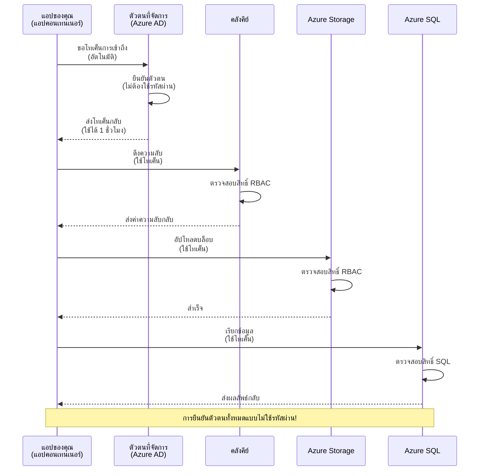
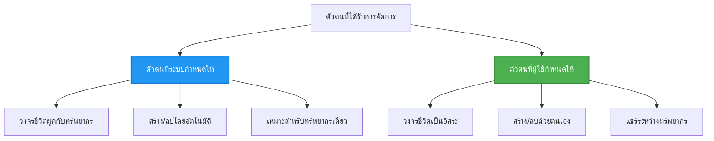

# Authentication Patterns and Managed Identity

⏱️ **เวลาโดยประมาณ**: 45-60 นาที | 💰 **ผลกระทบต่อค่าใช้จ่าย**: ฟรี (ไม่มีค่าใช้จ่ายเพิ่มเติม) | ⭐ **ความซับซ้อน**: ระดับกลาง

**📚 เส้นทางการเรียนรู้:**
- ← ก่อนหน้า: [Configuration Management](configuration.md) - การจัดการตัวแปรสภาพแวดล้อมและความลับ
- 🎯 **คุณอยู่ที่นี่**: การพิสูจน์ตัวตน & ความปลอดภัย (Managed Identity, Key Vault, รูปแบบที่ปลอดภัย)
- → ถัดไป: [First Project](first-project.md) - สร้างแอป AZD แรกของคุณ
- 🏠 [หน้าแรกของคอร์ส](../../README.md)

---

## สิ่งที่คุณจะได้เรียนรู้

โดยการทำบทเรียนนี้ให้เสร็จ คุณจะ:
- เข้าใจรูปแบบการพิสูจน์ตัวตนของ Azure (คีย์, สตริงการเชื่อมต่อ, managed identity)
- นำ **Managed Identity** ไปใช้สำหรับการพิสูจน์ตัวตนแบบไม่ต้องใช้รหัสผ่าน
- ปกป้องความลับด้วยการผนวก **Azure Key Vault**
- กำหนดค่า **role-based access control (RBAC)** สำหรับการปรับใช้ AZD
- นำแนวปฏิบัติด้านความปลอดภัยไปใช้ใน Container Apps และบริการ Azure
- ย้ายจากการใช้คีย์มาเป็นการใช้ตัวตนแบบอิงตัวตน

## ทำไม Managed Identity จึงสำคัญ

### ปัญหา: การพิสูจน์ตัวตนแบบดั้งเดิม

**ก่อน Managed Identity:**
```javascript
// ❌ ความเสี่ยงด้านความปลอดภัย: ความลับที่ฝังไว้ในโค้ด
const connectionString = "Server=mydb.database.windows.net;User=admin;Password=P@ssw0rd123";
const storageKey = "xK7mN9pQ2wR5tY8uI0oP3aS6dF1gH4jK...";
const cosmosKey = "C2x7B9n4M1p8Q5w3E6r0T2y5U8i1O4p7...";
```

**ปัญหา:**
- 🔴 **ความลับที่เปิดเผย** ในโค้ด ไฟล์คอนฟิก ตัวแปรสภาพแวดล้อม
- 🔴 **การหมุนเวียนข้อมูลประจำตัว** ต้องแก้โค้ดและปรับใช้ใหม่
- 🔴 **การตรวจสอบย้อนหลังยุ่งยาก** - ใครเข้าถึงอะไร เมื่อไหร่?
- 🔴 **การกระจัดกระจาย** - ความลับกระจัดกระจายไปยังระบบหลายแห่ง
- 🔴 **ความเสี่ยงด้านการปฏิบัติตามข้อกำหนด** - ผ่านการตรวจสอบความปลอดภัยได้ยาก

### ทางออก: Managed Identity

**หลัง Managed Identity:**
```javascript
// ✅ ปลอดภัย: ไม่มีความลับในโค้ด
const credential = new DefaultAzureCredential();
const client = new BlobServiceClient(
  "https://mystorageaccount.blob.core.windows.net",
  credential  // Azure จัดการการตรวจสอบสิทธิ์โดยอัตโนมัติ
);
```

**ประโยชน์:**
- ✅ **ไม่มีความลับ** ในโค้ดหรือคอนฟิก
- ✅ **การหมุนเวียนอัตโนมัติ** - Azure จัดการให้
- ✅ **บันทึกการตรวจสอบครบถ้วน** ในบันทึก Azure AD
- ✅ **ความปลอดภัยแบบรวมศูนย์** - จัดการผ่าน Azure Portal
- ✅ **พร้อมสำหรับการปฏิบัติตามข้อกำหนด** - ตรงตามมาตรฐานความปลอดภัย

**อุปมา**: การพิสูจน์ตัวตนแบบดั้งเดิมเหมือนการพกพากุญแจหลายดอกสำหรับประตูต่าง ๆ Managed Identity เหมือนบัตรประจำตัวรักษาความปลอดภัยที่มอบสิทธิ์โดยอัตโนมัติตามตัวตนของคุณ—ไม่มีการทำกุญแจหาย สำเนา หรือหมุนเวียน

---

## ภาพรวมสถาปัตยกรรม

### การไหลของการพิสูจน์ตัวตนด้วย Managed Identity


### ประเภทของ Managed Identities


| Feature | System-Assigned | User-Assigned |
|---------|----------------|---------------|
| **Lifecycle** | Tied to resource | Independent |
| **Creation** | Automatic with resource | Manual creation |
| **Deletion** | Deleted with resource | Persists after resource deletion |
| **Sharing** | One resource only | Multiple resources |
| **Use Case** | Simple scenarios | Complex multi-resource scenarios |
| **AZD Default** | ✅ Recommended | Optional |

---

## ข้อกำหนดเบื้องต้น

### เครื่องมือที่ต้องมี

คุณควรติดตั้งเครื่องมือต่อไปนี้จากบทเรียนก่อนหน้าแล้ว:

```bash
# ตรวจสอบ Azure Developer CLI
azd version
# ✅ ที่คาดไว้: azd เวอร์ชัน 1.0.0 หรือสูงกว่า

# ตรวจสอบ Azure CLI
az --version
# ✅ ที่คาดไว้: azure-cli 2.50.0 หรือสูงกว่า
```

### ข้อกำหนดของ Azure

- มี subscription ของ Azure ที่ใช้งานได้
- สิทธิ์ในการ:
  - สร้าง managed identities
  - กำหนดบทบาท RBAC
  - สร้างทรัพยากร Key Vault
  - ปรับใช้ Container Apps

### ความรู้พื้นฐานที่ควรมี

คุณควรได้ทำบทเรียนต่อไปนี้แล้ว:
- [Installation Guide](installation.md) - การติดตั้ง AZD
- [AZD Basics](azd-basics.md) - แนวคิดหลัก
- [Configuration Management](configuration.md) - ตัวแปรสภาพแวดล้อม

---

## บทเรียน 1: ทำความเข้าใจรูปแบบการพิสูจน์ตัวตน

### รูปแบบที่ 1: Connection Strings (แบบเก่า - หลีกเลี่ยง)

**วิธีการทำงาน:**
```bash
# สตริงการเชื่อมต่อมีข้อมูลรับรอง
STORAGE_CONNECTION_STRING="DefaultEndpointsProtocol=https;AccountName=myaccount;AccountKey=xK7mN9pQ2wR5..."
COSMOS_CONNECTION_STRING="AccountEndpoint=https://myaccount.documents.azure.com:443/;AccountKey=C2x7..."
SQL_CONNECTION_STRING="Server=myserver.database.windows.net;User=admin;Password=P@ssw0rd..."
```

**ปัญหา:**
- ❌ ความลับปรากฏในตัวแปรสภาพแวดล้อม
- ❌ ถูกบันทึกในระบบปรับใช้
- ❌ ยากต่อการหมุนเวียน
- ❌ ไม่มีบันทึกการเข้าถึง

**เมื่อใช้:** ใช้เฉพาะเพื่อพัฒนาในเครื่องเท่านั้น ห้ามใช้ใน production

---

### รูปแบบที่ 2: Key Vault References (ดีกว่า)

**วิธีการทำงาน:**
```bicep
// Store secret in Key Vault
resource keyVault 'Microsoft.KeyVault/vaults@2023-02-01' = {
  name: 'mykv'
  properties: {
    enableRbacAuthorization: true
  }
}

// Reference in Container App
env: [
  {
    name: 'STORAGE_KEY'
    secretRef: 'storage-key'  // References Key Vault
  }
]
```

**ประโยชน์:**
- ✅ เก็บความลับอย่างปลอดภัยใน Key Vault
- ✅ การจัดการความลับแบบรวมศูนย์
- ✅ หมุนเวียนโดยไม่ต้องเปลี่ยนโค้ด

**ข้อจำกัด:**
- ⚠️ ยังคงใช้คีย์/รหัสผ่าน
- ⚠️ ต้องจัดการการเข้าถึง Key Vault

**เมื่อใช้:** เป็นขั้นตอนการเปลี่ยนจาก connection strings ไปยัง managed identity

---

### รูปแบบที่ 3: Managed Identity (แนวปฏิบัติที่ดีที่สุด)

**วิธีการทำงาน:**
```bicep
// Enable managed identity
resource containerApp 'Microsoft.App/containerApps@2023-05-01' = {
  name: 'myapp'
  identity: {
    type: 'SystemAssigned'  // Automatically creates identity
  }
}

// Grant permissions
resource roleAssignment 'Microsoft.Authorization/roleAssignments@2022-04-01' = {
  scope: storageAccount
  properties: {
    roleDefinitionId: storageBlobDataContributorRole
    principalId: containerApp.identity.principalId
  }
}
```

**โค้ดแอปพลิเคชัน:**
```javascript
// ไม่ต้องมีความลับ!
const { DefaultAzureCredential } = require('@azure/identity');
const { BlobServiceClient } = require('@azure/storage-blob');

const credential = new DefaultAzureCredential();
const blobServiceClient = new BlobServiceClient(
  'https://mystorageaccount.blob.core.windows.net',
  credential
);
```

**ประโยชน์:**
- ✅ ไม่มีความลับในโค้ด/คอนฟิก
- ✅ การหมุนเวียนข้อมูลรับรองอัตโนมัติ
- ✅ บันทึกการตรวจสอบครบถ้วน
- ✅ สิทธิ์ตาม RBAC
- ✅ พร้อมสำหรับการปฏิบัติตามข้อกำหนด

**เมื่อใช้:** ใช้เสมอ สำหรับแอปพลิเคชัน production

---

## บทเรียน 2: นำ Managed Identity ไปใช้กับ AZD

### การดำเนินการทีละขั้นตอน

มาสร้าง Container App ที่ปลอดภัยซึ่งใช้ managed identity เพื่อเข้าถึง Azure Storage และ Key Vault

### โครงสร้างโปรเจกต์

```
secure-app/
├── azure.yaml                 # AZD configuration
├── infra/
│   ├── main.bicep            # Main infrastructure
│   ├── core/
│   │   ├── identity.bicep    # Managed identity setup
│   │   ├── keyvault.bicep    # Key Vault configuration
│   │   └── storage.bicep     # Storage with RBAC
│   └── app/
│       └── container-app.bicep
└── src/
    ├── app.js                # Application code
    ├── package.json
    └── Dockerfile
```

### 1. กำหนดค่า AZD (azure.yaml)

```yaml
name: secure-app
metadata:
  template: secure-app@1.0.0

services:
  api:
    project: ./src
    language: js
    host: containerapp

# Enable managed identity (AZD handles this automatically)
```

### 2. โครงสร้างพื้นฐาน: เปิดใช้งาน Managed Identity

**File: `infra/main.bicep`**

```bicep
targetScope = 'subscription'

param environmentName string
param location string = 'eastus'

var tags = { 'azd-env-name': environmentName }

// Resource group
resource rg 'Microsoft.Resources/resourceGroups@2021-04-01' = {
  name: 'rg-${environmentName}'
  location: location
  tags: tags
}

// Storage Account
module storage './core/storage.bicep' = {
  name: 'storage'
  scope: rg
  params: {
    name: 'st${uniqueString(rg.id)}'
    location: location
    tags: tags
  }
}

// Key Vault
module keyVault './core/keyvault.bicep' = {
  name: 'keyvault'
  scope: rg
  params: {
    name: 'kv-${uniqueString(rg.id)}'
    location: location
    tags: tags
  }
}

// Container App with Managed Identity
module containerApp './app/container-app.bicep' = {
  name: 'container-app'
  scope: rg
  params: {
    name: 'ca-${environmentName}'
    location: location
    tags: tags
    storageAccountName: storage.outputs.name
    keyVaultName: keyVault.outputs.name
  }
}

// Grant Container App access to Storage
module storageRoleAssignment './core/role-assignment.bicep' = {
  name: 'storage-role'
  scope: rg
  params: {
    principalId: containerApp.outputs.identityPrincipalId
    roleDefinitionId: 'ba92f5b4-2d11-453d-a403-e96b0029c9fe'  // Storage Blob Data Contributor
    targetResourceId: storage.outputs.id
  }
}

// Grant Container App access to Key Vault
module kvRoleAssignment './core/role-assignment.bicep' = {
  name: 'kv-role'
  scope: rg
  params: {
    principalId: containerApp.outputs.identityPrincipalId
    roleDefinitionId: '4633458b-17de-408a-b874-0445c86b69e6'  // Key Vault Secrets User
    targetResourceId: keyVault.outputs.id
  }
}

// Outputs
output AZURE_STORAGE_ACCOUNT_NAME string = storage.outputs.name
output AZURE_KEY_VAULT_NAME string = keyVault.outputs.name
output APP_URL string = containerApp.outputs.url
```

### 3. Container App ที่มี System-Assigned Identity

**File: `infra/app/container-app.bicep`**

```bicep
param name string
param location string
param tags object = {}
param storageAccountName string
param keyVaultName string

resource containerApp 'Microsoft.App/containerApps@2023-05-01' = {
  name: name
  location: location
  tags: tags
  identity: {
    type: 'SystemAssigned'  // 🔑 Enable managed identity
  }
  properties: {
    configuration: {
      ingress: {
        external: true
        targetPort: 3000
      }
    }
    template: {
      containers: [
        {
          name: 'api'
          image: 'myregistry.azurecr.io/api:latest'
          resources: {
            cpu: json('0.5')
            memory: '1Gi'
          }
          env: [
            {
              name: 'AZURE_STORAGE_ACCOUNT_NAME'
              value: storageAccountName
            }
            {
              name: 'AZURE_KEY_VAULT_NAME'
              value: keyVaultName
            }
            // 🔑 No secrets - managed identity handles authentication!
          ]
        }
      ]
    }
  }
}

// Output the identity for RBAC assignments
output identityPrincipalId string = containerApp.identity.principalId
output id string = containerApp.id
output url string = 'https://${containerApp.properties.configuration.ingress.fqdn}'
```

### 4. โมดูลการมอบหมายบทบาท RBAC

**File: `infra/core/role-assignment.bicep`**

```bicep
param principalId string
param roleDefinitionId string  // Azure built-in role ID
param targetResourceId string

resource roleAssignment 'Microsoft.Authorization/roleAssignments@2022-04-01' = {
  name: guid(principalId, roleDefinitionId, targetResourceId)
  scope: resourceId('Microsoft.Resources/resourceGroups', resourceGroup().name)
  properties: {
    roleDefinitionId: subscriptionResourceId('Microsoft.Authorization/roleDefinitions', roleDefinitionId)
    principalId: principalId
    principalType: 'ServicePrincipal'
  }
}

output id string = roleAssignment.id
```

### 5. โค้ดแอปพลิเคชันที่ใช้ Managed Identity

**File: `src/app.js`**

```javascript
const express = require('express');
const { DefaultAzureCredential } = require('@azure/identity');
const { BlobServiceClient } = require('@azure/storage-blob');
const { SecretClient } = require('@azure/keyvault-secrets');

const app = express();
const PORT = process.env.PORT || 3000;

// 🔑 เริ่มต้นข้อมูลประจำตัว (ทำงานโดยอัตโนมัติกับ Managed Identity)
const credential = new DefaultAzureCredential();

// การตั้งค่า Azure Storage
const storageAccountName = process.env.AZURE_STORAGE_ACCOUNT_NAME;
const blobServiceClient = new BlobServiceClient(
  `https://${storageAccountName}.blob.core.windows.net`,
  credential  // ไม่ต้องใช้คีย์!
);

// การตั้งค่า Key Vault
const keyVaultName = process.env.AZURE_KEY_VAULT_NAME;
const secretClient = new SecretClient(
  `https://${keyVaultName}.vault.azure.net`,
  credential  // ไม่ต้องใช้คีย์!
);

// การตรวจสอบสถานะ
app.get('/health', (req, res) => {
  res.json({ status: 'healthy', authentication: 'managed-identity' });
});

// อัปโหลดไฟล์ไปยัง Blob Storage
app.post('/upload', async (req, res) => {
  try {
    const containerClient = blobServiceClient.getContainerClient('uploads');
    await containerClient.createIfNotExists();
    
    const blobName = `file-${Date.now()}.txt`;
    const blockBlobClient = containerClient.getBlockBlobClient(blobName);
    
    await blockBlobClient.upload('Hello from managed identity!', 30);
    
    res.json({
      success: true,
      blobName: blobName,
      message: 'File uploaded using managed identity!'
    });
  } catch (error) {
    console.error('Upload error:', error);
    res.status(500).json({ error: error.message });
  }
});

// ดึงความลับจาก Key Vault
app.get('/secret/:name', async (req, res) => {
  try {
    const secretName = req.params.name;
    const secret = await secretClient.getSecret(secretName);
    
    res.json({
      name: secretName,
      value: secret.value,
      message: 'Secret retrieved using managed identity!'
    });
  } catch (error) {
    console.error('Secret error:', error);
    res.status(500).json({ error: error.message });
  }
});

// แสดงรายการคอนเทนเนอร์ Blob (เพื่อสาธิตสิทธิ์การอ่าน)
app.get('/containers', async (req, res) => {
  try {
    const containers = [];
    for await (const container of blobServiceClient.listContainers()) {
      containers.push(container.name);
    }
    
    res.json({
      containers: containers,
      count: containers.length,
      message: 'Containers listed using managed identity!'
    });
  } catch (error) {
    console.error('List error:', error);
    res.status(500).json({ error: error.message });
  }
});

app.listen(PORT, () => {
  console.log(`Secure API listening on port ${PORT}`);
  console.log('Authentication: Managed Identity (passwordless)');
});
```

**File: `src/package.json`**

```json
{
  "name": "secure-app",
  "version": "1.0.0",
  "dependencies": {
    "express": "^4.18.2",
    "@azure/identity": "^4.0.0",
    "@azure/storage-blob": "^12.17.0",
    "@azure/keyvault-secrets": "^4.7.0"
  },
  "scripts": {
    "start": "node app.js"
  }
}
```

### 6. ปรับใช้และทดสอบ

```bash
# เริ่มต้นสภาพแวดล้อม AZD
azd init

# ปรับใช้โครงสร้างพื้นฐานและแอปพลิเคชัน
azd up

# รับ URL ของแอป
APP_URL=$(azd env get-values | grep APP_URL | cut -d '=' -f2 | tr -d '"')

# ทดสอบการตรวจสอบสถานะ
curl $APP_URL/health
```

**✅ ผลลัพธ์ที่คาดไว้:**
```json
{
  "status": "healthy",
  "authentication": "managed-identity"
}
```

**ทดสอบการอัปโหลด blob:**
```bash
curl -X POST $APP_URL/upload
```

**✅ ผลลัพธ์ที่คาดไว้:**
```json
{
  "success": true,
  "blobName": "file-1700404800000.txt",
  "message": "File uploaded using managed identity!"
}
```

**ทดสอบการแสดงรายการ container:**
```bash
curl $APP_URL/containers
```

**✅ ผลลัพธ์ที่คาดไว้:**
```json
{
  "containers": ["uploads"],
  "count": 1,
  "message": "Containers listed using managed identity!"
}
```

---

## บทบาท RBAC ทั่วไปของ Azure

### รหัสบทบาทที่มีมาให้สำหรับ Managed Identity

| Service | Role Name | Role ID | Permissions |
|---------|-----------|---------|-------------|
| **Storage** | Storage Blob Data Reader | `2a2b9908-6b94-4a3d-8e5a-a7d8f8cc8a12` | อ่าน blobs และ containers |
| **Storage** | Storage Blob Data Contributor | `ba92f5b4-2d11-453d-a403-e96b0029c9fe` | อ่าน เขียน ลบ blobs |
| **Storage** | Storage Queue Data Contributor | `974c5e8b-45b9-4653-ba55-5f855dd0fb88` | อ่าน เขียน ลบ ข้อความคิว |
| **Key Vault** | Key Vault Secrets User | `4633458b-17de-408a-b874-0445c86b69e6` | อ่านความลับ |
| **Key Vault** | Key Vault Secrets Officer | `b86a8fe4-44ce-4948-aee5-eccb2c155cd7` | อ่าน เขียน ลบ ความลับ |
| **Cosmos DB** | Cosmos DB Built-in Data Reader | `00000000-0000-0000-0000-000000000001` | อ่านข้อมูล Cosmos DB |
| **Cosmos DB** | Cosmos DB Built-in Data Contributor | `00000000-0000-0000-0000-000000000002` | อ่าน เขียน ข้อมูล Cosmos DB |
| **SQL Database** | SQL DB Contributor | `9b7fa17d-e63e-47b0-bb0a-15c516ac86ec` | จัดการฐานข้อมูล SQL |
| **Service Bus** | Azure Service Bus Data Owner | `090c5cfd-751d-490a-894a-3ce6f1109419` | ส่ง รับ จัดการข้อความ |

### วิธีค้นหารหัสบทบาท

```bash
# แสดงบทบาทที่มีมาในตัวทั้งหมด
az role definition list --query "[].{Name:roleName, ID:name}" --output table

# ค้นหาบทบาทเฉพาะ
az role definition list --query "[?contains(roleName, 'Storage Blob')].{Name:roleName, ID:name}" --output table

# รับรายละเอียดบทบาท
az role definition list --name "Storage Blob Data Contributor"
```

---

## แบบฝึกหัดเชิงปฏิบัติ

### แบบฝึกหัด 1: เปิดใช้งาน Managed Identity สำหรับแอปที่มีอยู่ ⭐⭐ (ระดับกลาง)

**เป้าหมาย**: เพิ่ม managed identity ให้กับการปรับใช้ Container App ที่มีอยู่

**สถานการณ์**: คุณมี Container App ที่ใช้ connection strings ให้แปลงเป็น managed identity

**จุดเริ่มต้น**: Container App ที่มีการกำหนดค่านี้:

```bicep
// ❌ Current: Using connection string
env: [
  {
    name: 'STORAGE_CONNECTION_STRING'
    secretRef: 'storage-connection'
  }
]
```

**ขั้นตอน**:

1. **เปิดใช้งาน managed identity ใน Bicep:**

```bicep
resource containerApp 'Microsoft.App/containerApps@2023-05-01' = {
  name: 'myapp'
  identity: {
    type: 'SystemAssigned'  // Add this
  }
  // ... rest of configuration
}
```

2. **มอบสิทธิ์การเข้าถึง Storage:**

```bicep
// Get storage account reference
resource storageAccount 'Microsoft.Storage/storageAccounts@2023-01-01' existing = {
  name: storageAccountName
}

// Assign role
resource roleAssignment 'Microsoft.Authorization/roleAssignments@2022-04-01' = {
  name: guid(containerApp.id, 'ba92f5b4-2d11-453d-a403-e96b0029c9fe', storageAccount.id)
  scope: storageAccount
  properties: {
    roleDefinitionId: subscriptionResourceId('Microsoft.Authorization/roleDefinitions', 'ba92f5b4-2d11-453d-a403-e96b0029c9fe')
    principalId: containerApp.identity.principalId
    principalType: 'ServicePrincipal'
  }
}
```

3. **อัปเดตโค้ดแอปพลิเคชัน:**

**ก่อน (connection string):**
```javascript
const { BlobServiceClient } = require('@azure/storage-blob');

const blobServiceClient = BlobServiceClient.fromConnectionString(
  process.env.STORAGE_CONNECTION_STRING
);
```

**หลัง (managed identity):**
```javascript
const { DefaultAzureCredential } = require('@azure/identity');
const { BlobServiceClient } = require('@azure/storage-blob');

const credential = new DefaultAzureCredential();
const blobServiceClient = new BlobServiceClient(
  `https://${process.env.STORAGE_ACCOUNT_NAME}.blob.core.windows.net`,
  credential
);
```

4. **อัปเดตตัวแปรสภาพแวดล้อม:**

```bicep
env: [
  {
    name: 'STORAGE_ACCOUNT_NAME'
    value: storageAccountName  // Just the name, no secrets!
  }
  // Remove STORAGE_CONNECTION_STRING
]
```

5. **ปรับใช้และทดสอบ:**

```bash
# ปรับใช้ใหม่
azd up

# ทดสอบว่ายังทำงานอยู่
curl https://myapp.azurecontainerapps.io/upload
```

**✅ เกณฑ์ความสำเร็จ:**
- ✅ แอปพลิเคชันปรับใช้โดยไม่มีข้อผิดพลาด
- ✅ การดำเนินการกับ Storage ทำงาน (อัปโหลด แสดงรายการ ดาวน์โหลด)
- ✅ ไม่มีสตริงการเชื่อมต่อในตัวแปรสภาพแวดล้อม
- ✅ ตัวตนเห็นได้ใน Azure Portal ภายใต้แผง "Identity"

**การยืนยัน:**

```bash
# ตรวจสอบว่า managed identity ถูกเปิดใช้งาน
az containerapp show \
  --name myapp \
  --resource-group rg-myapp \
  --query "identity.type"
# ✅ คาดว่า: "SystemAssigned"

# ตรวจสอบการมอบหมายบทบาท
az role assignment list \
  --assignee $(az containerapp show --name myapp --resource-group rg-myapp --query "identity.principalId" -o tsv) \
  --scope /subscriptions/{sub-id}/resourceGroups/rg-myapp/providers/Microsoft.Storage/storageAccounts/mystorageaccount
# ✅ คาดว่า: แสดงบทบาท "Storage Blob Data Contributor"
```

**เวลา**: 20-30 นาที

---

### แบบฝึกหัด 2: การเข้าถึงบริการหลายตัวด้วย User-Assigned Identity ⭐⭐⭐ (ขั้นสูง)

**เป้าหมาย**: สร้าง user-assigned identity ที่แชร์ข้าม Container Apps หลายตัว

**สถานการณ์**: คุณมีไมโครเซอร์วิส 3 ตัวที่ต้องการเข้าถึงบัญชี Storage และ Key Vault เดียวกัน

**ขั้นตอน**:

1. **สร้าง user-assigned identity:**

**File: `infra/core/identity.bicep`**

```bicep
param name string
param location string
param tags object = {}

resource userAssignedIdentity 'Microsoft.ManagedIdentity/userAssignedIdentities@2023-01-31' = {
  name: name
  location: location
  tags: tags
}

output id string = userAssignedIdentity.id
output principalId string = userAssignedIdentity.properties.principalId
output clientId string = userAssignedIdentity.properties.clientId
```

2. **มอบบทบาทให้กับ user-assigned identity:**

```bicep
// In main.bicep
module userIdentity './core/identity.bicep' = {
  name: 'user-identity'
  scope: rg
  params: {
    name: 'id-${environmentName}'
    location: location
    tags: tags
  }
}

// Grant Storage access
resource storageRoleAssignment 'Microsoft.Authorization/roleAssignments@2022-04-01' = {
  name: guid(userIdentity.outputs.principalId, 'storage-contributor')
  scope: storageAccount
  properties: {
    roleDefinitionId: subscriptionResourceId('Microsoft.Authorization/roleDefinitions', 'ba92f5b4-2d11-453d-a403-e96b0029c9fe')
    principalId: userIdentity.outputs.principalId
    principalType: 'ServicePrincipal'
  }
}

// Grant Key Vault access
resource kvRoleAssignment 'Microsoft.Authorization/roleAssignments@2022-04-01' = {
  name: guid(userIdentity.outputs.principalId, 'kv-secrets-user')
  scope: keyVault
  properties: {
    roleDefinitionId: subscriptionResourceId('Microsoft.Authorization/roleDefinitions', '4633458b-17de-408a-b874-0445c86b69e6')
    principalId: userIdentity.outputs.principalId
    principalType: 'ServicePrincipal'
  }
}
```

3. **มอบตัวตนให้กับ Container Apps หลายตัว:**

```bicep
resource apiGateway 'Microsoft.App/containerApps@2023-05-01' = {
  name: 'api-gateway'
  identity: {
    type: 'UserAssigned'
    userAssignedIdentities: {
      '${userIdentity.outputs.id}': {}
    }
  }
  // ... rest of config
}

resource productService 'Microsoft.App/containerApps@2023-05-01' = {
  name: 'product-service'
  identity: {
    type: 'UserAssigned'
    userAssignedIdentities: {
      '${userIdentity.outputs.id}': {}
    }
  }
  // ... rest of config
}

resource orderService 'Microsoft.App/containerApps@2023-05-01' = {
  name: 'order-service'
  identity: {
    type: 'UserAssigned'
    userAssignedIdentities: {
      '${userIdentity.outputs.id}': {}
    }
  }
  // ... rest of config
}
```

4. **โค้ดแอปพลิเคชัน (ทุกบริการใช้รูปแบบเดียวกัน):**

```javascript
const { DefaultAzureCredential, ManagedIdentityCredential } = require('@azure/identity');

// สำหรับตัวตนที่ผู้ใช้กำหนด ให้ระบุรหัสไคลเอนต์
const credential = new ManagedIdentityCredential(
  process.env.AZURE_CLIENT_ID  // รหัสไคลเอนต์ของตัวตนที่ผู้ใช้กำหนด
);

// หรือใช้ DefaultAzureCredential (ตรวจจับโดยอัตโนมัติ)
const credential = new DefaultAzureCredential();

const blobServiceClient = new BlobServiceClient(
  `https://${process.env.STORAGE_ACCOUNT_NAME}.blob.core.windows.net`,
  credential
);
```

5. **ปรับใช้และยืนยัน:**

```bash
azd up

# ทดสอบว่าบริการทั้งหมดสามารถเข้าถึงที่เก็บข้อมูลได้
curl https://api-gateway.azurecontainerapps.io/upload
curl https://product-service.azurecontainerapps.io/upload
curl https://order-service.azurecontainerapps.io/upload
```

**✅ เกณฑ์ความสำเร็จ:**
- ✅ ตัวตนเดียวแชร์ข้าม 3 บริการ
- ✅ บริการทั้งหมดสามารถเข้าถึง Storage และ Key Vault
- ✅ ตัวตนคงอยู่หากลบหนึ่งบริการ
- ✅ การจัดการสิทธิ์แบบรวมศูนย์

**ประโยชน์ของ User-Assigned Identity:**
- มีตัวตนเดียวให้จัดการ
- สิทธิ์สอดคล้องกันข้ามบริการ
- ยังคงอยู่หลังการลบบริการ
- เหมาะกับสถาปัตยกรรมที่ซับซ้อน

**เวลา**: 30-40 นาที

---

### แบบฝึกหัด 3: นำการหมุนเวียนความลับใน Key Vault ไปใช้ ⭐⭐⭐ (ขั้นสูง)

**เป้าหมาย**: เก็บคีย์ API ของบุคคลที่สามใน Key Vault และเข้าถึงโดยใช้ managed identity

**สถานการณ์**: แอปของคุณต้องเรียกใช้ API ภายนอก (OpenAI, Stripe, SendGrid) ซึ่งต้องใช้คีย์ API

**ขั้นตอน**:

1. **สร้าง Key Vault พร้อม RBAC:**

**File: `infra/core/keyvault.bicep`**

```bicep
param name string
param location string
param tags object = {}

resource keyVault 'Microsoft.KeyVault/vaults@2023-02-01' = {
  name: name
  location: location
  tags: tags
  properties: {
    enableRbacAuthorization: true  // Use RBAC instead of access policies
    sku: {
      family: 'A'
      name: 'standard'
    }
    tenantId: subscription().tenantId
    enableSoftDelete: true
    softDeleteRetentionInDays: 90
  }
}

// Allow Container App to read secrets
output id string = keyVault.id
output name string = keyVault.name
output uri string = keyVault.properties.vaultUri
```

2. **เก็บความลับใน Key Vault:**

```bash
# รับชื่อของ Key Vault
KV_NAME=$(azd env get-values | grep AZURE_KEY_VAULT_NAME | cut -d '=' -f2 | tr -d '"')

# จัดเก็บคีย์ API ของบุคคลที่สาม
az keyvault secret set \
  --vault-name $KV_NAME \
  --name "OpenAI-ApiKey" \
  --value "sk-proj-xxxxxxxxxxxxx"

az keyvault secret set \
  --vault-name $KV_NAME \
  --name "Stripe-ApiKey" \
  --value "sk_live_xxxxxxxxxxxxx"

az keyvault secret set \
  --vault-name $KV_NAME \
  --name "SendGrid-ApiKey" \
  --value "SG.xxxxxxxxxxxxx"
```

3. **โค้ดแอปพลิเคชันเพื่อดึงความลับ:**

**File: `src/config.js`**

```javascript
const { DefaultAzureCredential } = require('@azure/identity');
const { SecretClient } = require('@azure/keyvault-secrets');

class Config {
  constructor() {
    this.credential = new DefaultAzureCredential();
    this.secretClient = new SecretClient(
      `https://${process.env.AZURE_KEY_VAULT_NAME}.vault.azure.net`,
      this.credential
    );
    this.cache = {};
  }

  async getSecret(secretName) {
    // ตรวจสอบแคชก่อน
    if (this.cache[secretName]) {
      return this.cache[secretName];
    }

    try {
      const secret = await this.secretClient.getSecret(secretName);
      this.cache[secretName] = secret.value;
      console.log(`✅ Retrieved secret: ${secretName}`);
      return secret.value;
    } catch (error) {
      console.error(`❌ Failed to get secret ${secretName}:`, error.message);
      throw error;
    }
  }

  async getOpenAIKey() {
    return this.getSecret('OpenAI-ApiKey');
  }

  async getStripeKey() {
    return this.getSecret('Stripe-ApiKey');
  }

  async getSendGridKey() {
    return this.getSecret('SendGrid-ApiKey');
  }
}

module.exports = new Config();
```

4. **ใช้ความลับในแอปพลิเคชัน:**

**File: `src/app.js`**

```javascript
const express = require('express');
const config = require('./config');
const { OpenAI } = require('openai');

const app = express();

// เริ่มต้น OpenAI โดยใช้คีย์จาก Key Vault
let openaiClient;

async function initializeServices() {
  const openaiKey = await config.getOpenAIKey();
  openaiClient = new OpenAI({ apiKey: openaiKey });
  console.log('✅ Services initialized with secrets from Key Vault');
}

// เรียกใช้เมื่อเริ่มต้น
initializeServices().catch(console.error);

app.post('/chat', async (req, res) => {
  try {
    const completion = await openaiClient.chat.completions.create({
      model: 'gpt-4',
      messages: [{ role: 'user', content: 'Hello!' }]
    });
    
    res.json({
      response: completion.choices[0].message.content,
      authentication: 'Key from Key Vault via Managed Identity'
    });
  } catch (error) {
    res.status(500).json({ error: error.message });
  }
});

app.listen(3000, () => {
  console.log('Secure API with Key Vault integration running');
});
```

5. **ปรับใช้และทดสอบ:**

```bash
azd up

# ทดสอบว่าคีย์ API ใช้งานได้
curl -X POST https://myapp.azurecontainerapps.io/chat \
  -H "Content-Type: application/json" \
  -d '{"message":"Hello AI"}'
```

**✅ เกณฑ์ความสำเร็จ:**
- ✅ ไม่มีคีย์ API ในโค้ดหรือในตัวแปรสภาพแวดล้อม
- ✅ แอปดึงคีย์จาก Key Vault ได้
- ✅ APIs ของบุคคลที่สามทำงานอย่างถูกต้อง
- ✅ สามารถหมุนเวียนคีย์โดยไม่ต้องเปลี่ยนโค้ด

**การหมุนเวียนความลับ:**

```bash
# อัปเดตความลับใน Key Vault
az keyvault secret set \
  --vault-name $KV_NAME \
  --name "OpenAI-ApiKey" \
  --value "sk-proj-NEW_KEY_HERE"

# รีสตาร์ทแอปเพื่อโหลดคีย์ใหม่
az containerapp revision restart \
  --name myapp \
  --resource-group rg-myapp
```

**เวลา**: 25-35 นาที

---

## จุดตรวจความรู้

### 1. รูปแบบการพิสูจน์ตัวตน ✓

ทดสอบความเข้าใจของคุณ:

- [ ] **Q1**: อะไรคือสามรูปแบบการพิสูจน์ตัวตนหลัก?
  - **A**: Connection strings (แบบเก่า), Key Vault references (ขั้นตอนเปลี่ยนผ่าน), Managed Identity (ดีที่สุด)

- [ ] **Q2**: ทำไม managed identity ถึงดีกว่า connection strings?
  - **A**: ไม่มีความลับในโค้ด, การหมุนเวียนอัตโนมัติ, บันทึกการตรวจสอบครบถ้วน, สิทธิ์ตาม RBAC

- [ ] **Q3**: เมื่อใดควรใช้ user-assigned identity แทน system-assigned?
  - **A**: เมื่อแชร์ตัวตนข้ามทรัพยากรหลายตัว หรือเมื่อต้องการให้วงจรชีวิตของตัวตนแยกจากทรัพยากร

**การยืนยันด้วยการปฏิบัติ:**
```bash
# ตรวจสอบว่าแอปของคุณใช้ประเภทตัวตนใด
az containerapp show \
  --name myapp \
  --resource-group rg-myapp \
  --query "identity.type"

# แสดงรายการมอบหมายบทบาททั้งหมดสำหรับตัวตน
az role assignment list \
  --assignee $(az containerapp show --name myapp --resource-group rg-myapp --query "identity.principalId" -o tsv)
```

---

### 2. RBAC และสิทธิ์ ✓

ทดสอบความเข้าใจของคุณ:

- [ ] **Q1**: รหัสบทบาทของ "Storage Blob Data Contributor" คืออะไร?
  - **A**: `ba92f5b4-2d11-453d-a403-e96b0029c9fe`

- [ ] **Q2**: "Key Vault Secrets User" ให้สิทธิ์อะไรบ้าง?
  - **A**: การเข้าถึงความลับแบบอ่านอย่างเดียว (ไม่สามารถสร้าง อัปเดต หรือลบได้)

- [ ] **Q3**: คุณมอบสิทธิ์ให้ Container App เข้าถึง Azure SQL ได้อย่างไร?
  - **A**: มอบบทบาท "SQL DB Contributor" หรือกำหนดค่า Azure AD authentication สำหรับ SQL

**การยืนยันด้วยการปฏิบัติ:**
```bash
# ค้นหาบทบาทเฉพาะ
az role definition list --name "Storage Blob Data Contributor"

# ตรวจสอบว่ามีบทบาทใดบ้างที่ถูกกำหนดให้กับตัวตนของคุณ
PRINCIPAL_ID=$(az containerapp show --name myapp --resource-group rg-myapp --query "identity.principalId" -o tsv)
az role assignment list --assignee $PRINCIPAL_ID --output table
```

---

### 3. Key Vault Integration ✓
- [ ] **Q1**: คุณเปิดใช้งาน RBAC สำหรับ Key Vault แทนนโยบายการเข้าถึงอย่างไร?
  - **A**: Set `enableRbacAuthorization: true` in Bicep

- [ ] **Q2**: ไลบรารี Azure SDK ใดที่จัดการการพิสูจน์ตัวตนด้วย managed identity?
  - **A**: `@azure/identity` with `DefaultAzureCredential` class

- [ ] **Q3**: ความลับใน Key Vault อยู่ในแคชได้นานเท่าใด?
  - **A**: ขึ้นกับแอปพลิเคชัน; ดำเนินการกลยุทธ์การแคชของคุณเอง

**Hands-On Verification:**
```bash
# ทดสอบการเข้าถึง Key Vault
az keyvault secret show \
  --vault-name $KV_NAME \
  --name "OpenAI-ApiKey" \
  --query "value"

# ตรวจสอบว่า RBAC ถูกเปิดใช้งาน
az keyvault show \
  --name $KV_NAME \
  --query "properties.enableRbacAuthorization"
# ✅ คาดหวัง: true
```

---

## แนวปฏิบัติด้านความปลอดภัยที่ดีที่สุด

### ✅ ควรทำ:

1. **ใช้ managed identity เสมอในสภาพแวดล้อมการผลิต**
   ```bicep
   identity: {
     type: 'SystemAssigned'
   }
   ```

2. **ใช้บทบาท RBAC ที่มีสิทธิ์น้อยที่สุด**
   - ใช้บทบาท "Reader" เมื่อเป็นไปได้
   - หลีกเลี่ยง "Owner" หรือ "Contributor" เว้นแต่จำเป็น

3. **เก็บกุญแจของบุคคลที่สามใน Key Vault**
   ```javascript
   const apiKey = await secretClient.getSecret('ThirdPartyApiKey');
   ```

4. **เปิดใช้งานการบันทึกการตรวจสอบ**
   ```bicep
   diagnosticSettings: {
     logs: [{ category: 'AuditEvent', enabled: true }]
   }
   ```

5. **ใช้ตัวตนที่แตกต่างกันสำหรับ dev/staging/prod**
   ```bash
   azd env new dev
   azd env new staging
   azd env new prod
   ```

6. **หมุนเวียนความลับเป็นประจำ**
   - ตั้งวันหมดอายุให้กับความลับใน Key Vault
   - ทำให้การหมุนเวียนเป็นอัตโนมัติโดยใช้ Azure Functions

### ❌ ห้าม:

1. **อย่าฝังความลับลงในโค้ด**
   ```javascript
   // ❌ ไม่ดี
   const apiKey = "sk-proj-xxxxxxxxxxxxx";
   ```

2. **อย่าใช้ connection strings ในการผลิต**
   ```javascript
   // ❌ ไม่ดี
   BlobServiceClient.fromConnectionString(process.env.STORAGE_CONNECTION_STRING)
   ```

3. **อย่าให้สิทธิ์เกินจำเป็น**
   ```bicep
   // ❌ BAD - too much access
   roleDefinitionId: 'Owner'
   
   // ✅ GOOD - least privilege
   roleDefinitionId: 'Storage Blob Data Reader'
   ```

4. **อย่าบันทึกความลับลงในล็อก**
   ```javascript
   // ❌ แย่
   console.log('API Key:', apiKey);
   
   // ✅ ดี
   console.log('API Key retrieved successfully');
   ```

5. **อย่าแชร์ตัวตนของโปรดักชันข้ามสภาพแวดล้อม**
   ```bicep
   // ❌ BAD - same identity for dev and prod
   // ✅ GOOD - separate identities per environment
   ```

---

## คู่มือแก้ไขปัญหา

### ปัญหา: "Unauthorized" เมื่อเข้าถึง Azure Storage

**อาการ:**
```
Error: Unauthorized (403)
AuthorizationPermissionMismatch: This request is not authorized to perform this operation
```

**การวินิจฉัย:**

```bash
# ตรวจสอบว่า Managed Identity ถูกเปิดใช้งานหรือไม่
az containerapp show \
  --name myapp \
  --resource-group rg-myapp \
  --query "identity.type"
# ✅ ที่คาดหวัง: "SystemAssigned" หรือ "UserAssigned"

# ตรวจสอบการมอบหมายบทบาท
PRINCIPAL_ID=$(az containerapp show --name myapp --resource-group rg-myapp --query "identity.principalId" -o tsv)
az role assignment list --assignee $PRINCIPAL_ID

# ที่คาดหวัง: ควรเห็น "Storage Blob Data Contributor" หรือบทบาทที่คล้ายกัน
```

**วิธีแก้ไข:**

1. **มอบบทบาท RBAC ที่ถูกต้อง:**
```bash
STORAGE_ID=$(az storage account show --name mystorageaccount --resource-group rg-myapp --query "id" -o tsv)
az role assignment create \
  --assignee $PRINCIPAL_ID \
  --role "Storage Blob Data Contributor" \
  --scope $STORAGE_ID
```

2. **รอการแพร่กระจาย (อาจใช้เวลา 5-10 นาที):**
```bash
# ตรวจสอบสถานะการมอบหมายบทบาท
az role assignment list --assignee $PRINCIPAL_ID --scope $STORAGE_ID
```

3. **ตรวจสอบว่าโค้ดแอปใช้ข้อมูลประจำตัวที่ถูกต้อง:**
```javascript
// ตรวจสอบให้แน่ใจว่าคุณกำลังใช้ DefaultAzureCredential
const credential = new DefaultAzureCredential();
```

---

### ปัญหา: การเข้าถึง Key Vault ถูกปฏิเสธ

**อาการ:**
```
Error: Forbidden (403)
The user, group or application does not have secrets get permission
```

**การวินิจฉัย:**

```bash
# ตรวจสอบว่า RBAC ของ Key Vault ถูกเปิดใช้งาน
az keyvault show \
  --name $KV_NAME \
  --query "properties.enableRbacAuthorization"
# ✅ คาดหวัง: true

# ตรวจสอบการมอบหมายบทบาท
az role assignment list \
  --assignee $PRINCIPAL_ID \
  --scope /subscriptions/{sub-id}/resourceGroups/rg-myapp/providers/Microsoft.KeyVault/vaults/$KV_NAME
```

**วิธีแก้ไข:**

1. **เปิดใช้งาน RBAC บน Key Vault:**
```bash
az keyvault update \
  --name $KV_NAME \
  --enable-rbac-authorization true
```

2. **มอบบทบาท Key Vault Secrets User:**
```bash
KV_ID=$(az keyvault show --name $KV_NAME --query "id" -o tsv)
az role assignment create \
  --assignee $PRINCIPAL_ID \
  --role "Key Vault Secrets User" \
  --scope $KV_ID
```

---

### ปัญหา: DefaultAzureCredential ล้มเหลวในเครื่องท้องถิ่น

**อาการ:**
```
Error: DefaultAzureCredential failed to retrieve a token
CredentialUnavailableError: No credential available
```

**การวินิจฉัย:**

```bash
# ตรวจสอบว่าคุณได้ลงชื่อเข้าใช้แล้วหรือยัง
az account show

# ตรวจสอบการยืนยันตัวตนของ Azure CLI
az ad signed-in-user show
```

**วิธีแก้ไข:**

1. **เข้าสู่ระบบด้วย Azure CLI:**
```bash
az login
```

2. **ตั้งค่า Azure subscription:**
```bash
az account set --subscription "Your Subscription Name"
```

3. **สำหรับการพัฒนาแบบโลคอล ให้ใช้ environment variables:**
```bash
export AZURE_TENANT_ID="your-tenant-id"
export AZURE_CLIENT_ID="your-client-id"
export AZURE_CLIENT_SECRET="your-client-secret"
```

4. **หรือใช้ credential อื่นในเครื่องท้องถิ่น:**
```javascript
const { DefaultAzureCredential, AzureCliCredential } = require('@azure/identity');

// ใช้ AzureCliCredential สำหรับการพัฒนาในเครื่อง
const credential = process.env.NODE_ENV === 'production' 
  ? new DefaultAzureCredential()
  : new AzureCliCredential();
```

---

### ปัญหา: การมอบบทบาทใช้เวลานานเกินไปในการแพร่กระจาย

**อาการ:**
- บทบาทถูกมอบหมายสำเร็จ
- ยังคงได้รับข้อผิดพลาด 403
- การเข้าถึงเป็นช่วงๆ (บางครั้งทำงาน บางครั้งไม่ทำงาน)

**คำอธิบาย:**
การเปลี่ยนแปลง Azure RBAC อาจใช้เวลา 5-10 นาทีในการแพร่กระจายทั่วโลก.

**วิธีแก้ไข:**

```bash
# รอแล้วลองอีกครั้ง
echo "Waiting for RBAC propagation..."
sleep 300  # รอ 5 นาที

# ทดสอบการเข้าถึง
curl https://myapp.azurecontainerapps.io/upload

# หากยังล้มเหลว ให้รีสตาร์ทแอป
az containerapp revision restart \
  --name myapp \
  --resource-group rg-myapp
```

---

## ข้อควรพิจารณาด้านค่าใช้จ่าย

### ค่าใช้จ่ายของ Managed Identity

| ทรัพยากร | ค่าใช้จ่าย |
|----------|------|
| **Managed Identity** | 🆓 **ฟรี** - ไม่มีค่าใช้จ่าย |
| **RBAC Role Assignments** | 🆓 **ฟรี** - ไม่มีค่าใช้จ่าย |
| **Azure AD Token Requests** | 🆓 **ฟรี** - รวมอยู่แล้ว |
| **Key Vault Operations** | $0.03 ต่อ 10,000 การดำเนินการ |
| **Key Vault Storage** | $0.024 ต่อความลับต่อเดือน |

**การใช้ managed identity ประหยัดเงินโดย:**
- ✅ ลดการเรียกใช้งาน Key Vault สำหรับการพิสูจน์ตัวตนบริการต่อบริการ
- ✅ ลดเหตุการณ์ด้านความปลอดภัย (ไม่มีการรั่วไหลของข้อมูลประจำตัว)
- ✅ ลดภาระการปฏิบัติการ (ไม่มีการหมุนเวียนด้วยมือ)

**ตัวอย่างการเปรียบเทียบค่าใช้จ่าย (รายเดือน):**

| สถานการณ์ | Connection Strings | Managed Identity | การประหยัด |
|----------|-------------------|-----------------|---------|
| แอปขนาดเล็ก (1M คำขอ) | ~$50 (Key Vault + ops) | ~$0 | $50/เดือน |
| แอปขนาดกลาง (10M คำขอ) | ~$200 | ~$0 | $200/เดือน |
| แอปขนาดใหญ่ (100M คำขอ) | ~$1,500 | ~$0 | $1,500/เดือน |

---

## เรียนรู้เพิ่มเติม

### เอกสารอย่างเป็นทางการ
- [Azure Managed Identity](https://learn.microsoft.com/entra/identity/managed-identities-azure-resources/overview)
- [Azure RBAC](https://learn.microsoft.com/azure/role-based-access-control/overview)
- [Azure Key Vault](https://learn.microsoft.com/azure/key-vault/general/overview)
- [DefaultAzureCredential](https://learn.microsoft.com/dotnet/api/azure.identity.defaultazurecredential)

### เอกสาร SDK
- [@azure/identity (Node.js)](https://www.npmjs.com/package/@azure/identity)
- [Azure.Identity (C#)](https://www.nuget.org/packages/Azure.Identity/)
- [azure-identity (Python)](https://pypi.org/project/azure-identity/)

### ขั้นตอนถัดไปในคอร์สนี้
- ← ก่อนหน้า: [การจัดการการกำหนดค่า](configuration.md)
- → ถัดไป: [โปรเจกต์แรก](first-project.md)
- 🏠 [หน้าหลักของคอร์ส](../../README.md)

### ตัวอย่างที่เกี่ยวข้อง
- [Azure OpenAI Chat Example](../../../../examples/azure-openai-chat) - ใช้ managed identity สำหรับ Azure OpenAI
- [Microservices Example](../../../../examples/microservices) - รูปแบบการพิสูจน์ตัวตนแบบหลายบริการ

---

## สรุป

**คุณได้เรียนรู้:**
- ✅ สามรูปแบบการพิสูจน์ตัวตน (connection strings, Key Vault, managed identity)
- ✅ วิธีเปิดใช้งานและกำหนดค่า managed identity ใน AZD
- ✅ การมอบหมายบทบาท RBAC สำหรับบริการ Azure
- ✅ การผนวก Key Vault สำหรับความลับของบุคคลที่สาม
- ✅ ตัวตนที่กำหนดโดยผู้ใช้ vs ที่กำหนดโดยระบบ
- ✅ แนวปฏิบัติด้านความปลอดภัยที่ดีที่สุดและการแก้ไขปัญหา

**ข้อควรจำสำคัญ:**
1. **ใช้ managed identity เสมอในสภาพแวดล้อมการผลิต** - ไม่มีความลับ, การหมุนเวียนอัตโนมัติ
2. **ใช้บทบาท RBAC ที่มีสิทธิ์น้อยที่สุด** - ให้สิทธิ์ตามที่จำเป็นเท่านั้น
3. **เก็บกุญแจของบุคคลที่สามใน Key Vault** - การจัดการความลับแบบรวมศูนย์
4. **แยกตัวตนตามสภาพแวดล้อม** - แยก Dev, Staging, Prod
5. **เปิดใช้งานการบันทึกการตรวจสอบ** - ติดตามว่าใครเข้าถึงอะไร

**ขั้นตอนถัดไป:**
1. ทำแบบฝึกหัดเชิงปฏิบัติด้านบนให้เสร็จ
2. ย้ายแอปที่มีอยู่จากการใช้ connection strings ไปยัง managed identity
3. สร้างโปรเจกต์ AZD แรกของคุณโดยมีความปลอดภัยตั้งแต่วันแรก: [โปรเจกต์แรก](first-project.md)

---

<!-- CO-OP TRANSLATOR DISCLAIMER START -->
ข้อจำกัดความรับผิดชอบ:
เอกสารฉบับนี้ถูกแปลโดยใช้บริการแปลด้วย AI Co-op Translator (https://github.com/Azure/co-op-translator) แม้เราจะพยายามให้การแปลมีความถูกต้อง แต่โปรดทราบว่าการแปลอัตโนมัติอาจมีข้อผิดพลาดหรือความคลาดเคลื่อนได้ เอกสารต้นฉบับในภาษาต้นทางควรถือเป็นแหล่งอ้างอิงที่เป็นทางการ สำหรับข้อมูลสำคัญ ขอแนะนำให้ใช้บริการแปลโดยนักแปลมืออาชีพ เราจะไม่รับผิดชอบต่อความเข้าใจผิดหรือการตีความที่ผิดพลาดใด ๆ ที่เกิดจากการใช้การแปลฉบับนี้
<!-- CO-OP TRANSLATOR DISCLAIMER END -->