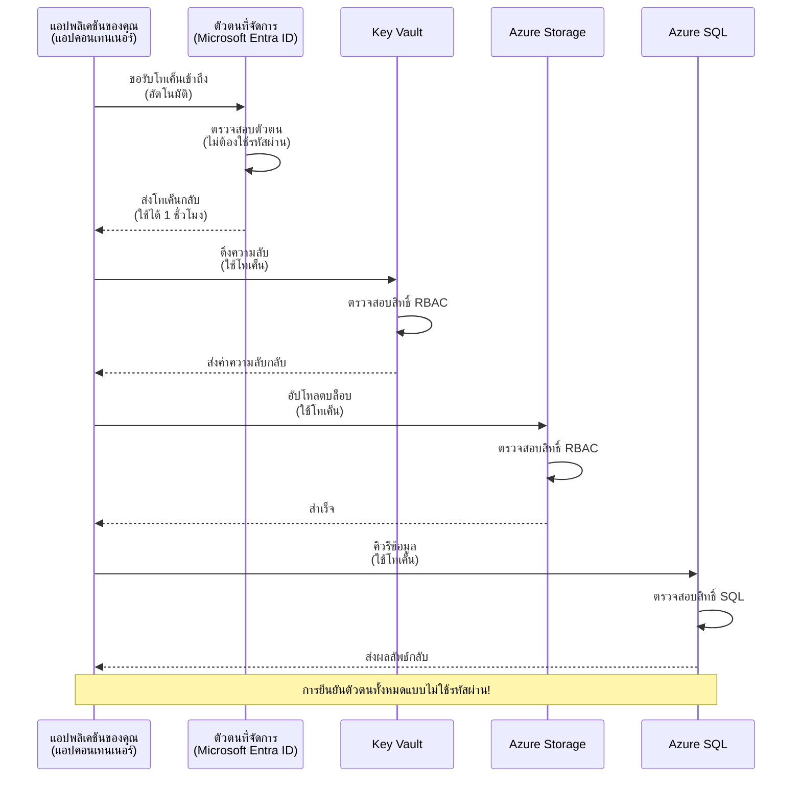
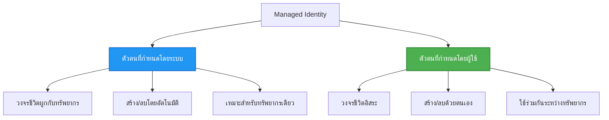

# คู่มือรูปแบบการพิสูจน์ตัวตนและ Managed Identity

⏱️ **เวลาประมาณ**: 45-60 นาที | 💰 **ผลกระทบค่าใช้จ่าย**: ฟรี (ไม่มีค่าใช้จ่ายเพิ่มเติม) | ⭐ **ความซับซ้อน**: ปานกลาง

**📚 เส้นทางการเรียนรู้:**
- ← ก่อนหน้า: [Configuration Management](configuration.md) - การจัดการตัวแปรสภาพแวดล้อมและความลับ
- 🎯 **คุณอยู่ที่นี่**: การพิสูจน์ตัวตน & ความปลอดภัย (Managed Identity, Key Vault, รูปแบบที่ปลอดภัย)
- → ถัดไป: [First Project](first-project.md) - สร้างแอป AZD แรกของคุณ
- 🏠 [หน้าหลักหลักสูตร](../../README.md)

---

## สิ่งที่คุณจะได้เรียนรู้

เมื่อเสร็จสิ้นบทเรียนนี้ คุณจะ:
- เข้าใจรูปแบบการพิสูจน์ตัวตนของ Azure (คีย์, connection strings, managed identity)
- นำ **Managed Identity** มาใช้สำหรับการพิสูจน์ตัวตนแบบไม่ใช้รหัสผ่าน
- ปกป้องความลับด้วยการผสานรวม **Azure Key Vault**
- กำหนดค่า **role-based access control (RBAC)** สำหรับการปรับใช้ AZD
- ใช้แนวทางปฏิบัติด้านความปลอดภัยที่ดีที่สุดใน Container Apps และบริการ Azure
- ย้ายจากการพิสูจน์ตัวตนโดยใช้คีย์ไปเป็นแบบใช้ตัวตน

## ทำไม Managed Identity ถึงสำคัญ

### ปัญหา: การพิสูจน์ตัวตนแบบดั้งเดิม

**ก่อนใช้ Managed Identity:**
```javascript
// ❌ ความเสี่ยงด้านความปลอดภัย: ความลับที่เข้ารหัสไว้ในโค้ด
const connectionString = "Server=mydb.database.windows.net;User=admin;Password=P@ssw0rd123";
const storageKey = "xK7mN9pQ2wR5tY8uI0oP3aS6dF1gH4jK...";
const cosmosKey = "C2x7B9n4M1p8Q5w3E6r0T2y5U8i1O4p7...";
```

**ปัญหา:**
- 🔴 **ความลับถูกเปิดเผย** ในโค้ด ไฟล์คอนฟิก หรือ environment variables
- 🔴 การ **เปลี่ยนรหัสประจำตัว** จำเป็นต้องแก้โค้ดและปรับใช้ใหม่
- 🔴 **การตรวจสอบยุ่งยาก** - ใครเข้าถึงอะไรและเมื่อไร?
- 🔴 ความยุ่งเหยิง - ความลับกระจายอยู่หลายระบบ
- 🔴 ความเสี่ยงด้านปฏิบัติตาม - ไม่ผ่านการตรวจสอบด้านความปลอดภัย

### ทางออก: Managed Identity

**หลังใช้ Managed Identity:**
```javascript
// ✅ ปลอดภัย: ไม่มีความลับในโค้ด
const credential = new DefaultAzureCredential();
const client = new BlobServiceClient(
  "https://mystorageaccount.blob.core.windows.net",
  credential  // Azure จัดการการตรวจสอบสิทธิ์โดยอัตโนมัติ
);
```

**ข้อดี:**
- ✅ ไม่มีความลับในโค้ดหรือตัวตั้งค่า
- ✅ การเปลี่ยนรหัสอัตโนมัติ - Azure จัดการให้อัตโนมัติ
- ✅ บันทึกการตรวจสอบแบบครบถ้วนใน Microsoft Entra ID
- ✅ การรักษาความปลอดภัยแบบรวมศูนย์ - จัดการใน Azure Portal
- ✅ พร้อมสำหรับการปฏิบัติตามมาตรฐานความปลอดภัย

**อุปมา:** การพิสูจน์ตัวตนแบบดั้งเดิมเหมือนการพกกุญแจหลายดอกสำหรับประตูหลายบาน ส่วน Managed Identity เหมือนมีบัตรประจำตัวที่ให้สิทธิ์เข้าถึงโดยอัตโนมัติขึ้นอยู่กับตัวตนของคุณ—ไม่ต้องกังวลเรื่องกุญแจกุญแจหาย หรือต้องคัดลอกและเปลี่ยนบ่อย

---

## ภาพรวมสถาปัตยกรรม

### กระบวนการพิสูจน์ตัวตนด้วย Managed Identity



### ประเภทของ Managed Identities



| คุณสมบัติ | System-Assigned | User-Assigned |
|---------|----------------|---------------|
| **วงจรชีวิต** | ผูกกับทรัพยากร | อิสระ |
| **การสร้าง** | สร้างอัตโนมัติพร้อมทรัพยากร | สร้างด้วยตนเอง |
| **การลบ** | ลบพร้อมทรัพยากร | คงอยู่หลังลบทรัพยากร |
| **การแชร์** | ใช้กับทรัพยากรเดียว | ใช้กับหลายทรัพยากรได้ |
| **กรณีการใช้งาน** | สถานการณ์ง่าย | สถานการณ์หลายทรัพยากรซับซ้อน |
| **ค่าเริ่มต้น AZD** | ✅ แนะนำ | ตัวเลือก |

---

## ข้อกำหนดเบื้องต้น

### เครื่องมือที่ต้องใช้

ควรติดตั้งเครื่องมือเหล่านี้จากบทเรียนก่อนหน้าแล้ว:

```bash
# ตรวจสอบ Azure Developer CLI
azd version
# ✅ คาดว่า: azd เวอร์ชัน 1.0.0 หรือสูงกว่า

# ตรวจสอบ Azure CLI
az --version
# ✅ คาดว่า: azure-cli 2.50.0 หรือสูงกว่า
```

### ข้อกำหนดของ Azure

- มีบัญชี Azure ที่ใช้งานได้
- สิทธิ์ในการ:
  - สร้าง managed identities
  - กำหนดบทบาท RBAC
  - สร้างทรัพยากร Key Vault
  - ปรับใช้ Container Apps

### ความรู้เบื้องต้น

คุณควรผ่าน:
- [Installation Guide](installation.md) - การตั้งค่า AZD
- [AZD Basics](azd-basics.md) - แนวคิดหลัก
- [Configuration Management](configuration.md) - ตัวแปรสภาพแวดล้อม

---

## บทเรียนที่ 1: ทำความเข้าใจรูปแบบการพิสูจน์ตัวตน

### รูปแบบที่ 1: Connection Strings (เก่า – หลีกเลี่ยง)

**ทำงานอย่างไร:**
```bash
# สตริงการเชื่อมต่อมีข้อมูลรับรอง
STORAGE_CONNECTION_STRING="DefaultEndpointsProtocol=https;AccountName=myaccount;AccountKey=xK7mN9pQ2wR5..."
COSMOS_CONNECTION_STRING="AccountEndpoint=https://myaccount.documents.azure.com:443/;AccountKey=C2x7..."
SQL_CONNECTION_STRING="Server=myserver.database.windows.net;User=admin;Password=P@ssw0rd..."
```

**ปัญหา:**
- ❌ ความลับมองเห็นได้ใน environment variables
- ❌ ถูกบันทึกในระบบปรับใช้
- ❌ หมุนรหัสยาก
- ❌ ไม่มีบันทึกการตรวจสอบการเข้าถึง

**ใช้เมื่อไหร่:** ใช้เฉพาะพัฒนาท้องถิ่นเท่านั้น ห้ามใช้ใน production

---

### รูปแบบที่ 2: Key Vault References (ดีกว่า)

**ทำงานอย่างไร:**
```bicep
// Store secret in Key Vault
resource keyVault 'Microsoft.KeyVault/vaults@2023-02-01' = {
  name: 'mykv'
  properties: {
    enableRbacAuthorization: true
  }
}

// Reference in Container App
env: [
  {
    name: 'STORAGE_KEY'
    secretRef: 'storage-key'  // References Key Vault
  }
]
```

**ข้อดี:**
- ✅ ความลับเก็บอย่างปลอดภัยใน Key Vault
- ✅ จัดการความลับรวมศูนย์
- ✅ หมุนรหัสได้โดยไม่ต้องแก้โค้ด

**ข้อจำกัด:**
- ⚠️ ยังใช้คีย์/รหัสผ่าน
- ⚠️ ต้องจัดการสิทธิ์การเข้าถึง Key Vault

**ใช้เมื่อไหร่:** เป็นขั้นตอนย้ายจาก connection strings ไปเป็น managed identity

---

### รูปแบบที่ 3: Managed Identity (แนวทางปฏิบัติที่ดีที่สุด)

**ทำงานอย่างไร:**
```bicep
// Enable managed identity
resource containerApp 'Microsoft.App/containerApps@2023-05-01' = {
  name: 'myapp'
  identity: {
    type: 'SystemAssigned'  // Automatically creates identity
  }
}

// Grant permissions
resource roleAssignment 'Microsoft.Authorization/roleAssignments@2022-04-01' = {
  scope: storageAccount
  properties: {
    roleDefinitionId: storageBlobDataContributorRole
    principalId: containerApp.identity.principalId
  }
}
```

**โค้ดแอปพลิเคชัน:**
```javascript
// ไม่จำเป็นต้องมีความลับ!
const { DefaultAzureCredential } = require('@azure/identity');
const { BlobServiceClient } = require('@azure/storage-blob');

const credential = new DefaultAzureCredential();
const blobServiceClient = new BlobServiceClient(
  'https://mystorageaccount.blob.core.windows.net',
  credential
);
```

**ข้อดี:**
- ✅ ไม่มีความลับในโค้ดหรือตั้งค่า
- ✅ หมุนรหัสอัตโนมัติ
- ✅ บันทึกการตรวจสอบเต็มรูปแบบ
- ✅ สิทธิ์ตาม RBAC
- ✅ พร้อมสำหรับการปฏิบัติตามมาตรฐาน

**ใช้เมื่อไหร่:** ใช้ตลอดเวลา สำหรับแอป production

---

### รูปแบบที่ 4: Service Principals (CI/CD & Automation)

Managed identity คือมาตรฐานทองคำ *สำหรับทรัพยากรที่รันภายใน Azure* แต่ว่าสิ่งที่รัน **นอก** Azure เช่น pipeline CI/CD บน build agent หรือสคริปต์ในเครื่องคุณที่ไม่สามารถใช้การล็อกอินแบบอินเทอร์แอคทีฟได้ จะใช้ **service principal** ซึ่งเป็นตัวตน non-human ที่มีรหัสประจำตัวตัวเองสำหรับกระบวนการอัตโนมัติ

**ทำงานอย่างไร:**

สร้าง service principal ที่ผูกกับ resource group (สิทธิ์น้อยที่สุด):

```bash
az ad sp create-for-rbac \
  --name "myapp-cicd" \
  --role contributor \
  --scopes /subscriptions/<sub-id>/resourceGroups/<rg-name>
```

จะแสดง client ID, client secret, และ tenant ID azd สามารถล็อกอินด้วยข้อมูลเหล่านี้แบบไม่ต้องโต้ตอบ:

```bash
azd auth login \
  --client-id "<appId>" \
  --client-secret "<password>" \
  --tenant-id "<tenant>"
```

**แนะนำใช้ federated credentials (OIDC) แทน secret** แทนที่จะใช้ client secret ที่มีอายุยาว ให้ตั้งค่าการรับรอง federated credential เพื่อให้ pipeline แลก token ชั่วคราว — ไม่มี secret รั่วหรือหมุน:

```bash
azd auth login \
  --client-id "<appId>" \
  --federated-credential-provider "github" \
  --tenant-id "<tenant>"
```

> `azd pipeline config` ตั้งค่านี้ให้คุณอัตโนมัติ ดู walkthroughs CI/CD ใน [บทที่ 8](../chapter-08-production/production-ai-practices.md)

**ข้อดี:**
- ✅ ใช้งานนอก Azure (build agents, on-prem, คลาวด์อื่น)
- ✅ ผูกกับ resource group เดียวได้โดยมีบทบาทเดียว
- ✅ แบบ federated (OIDC) ไม่ใช้ secret เก็บไว้

**ข้อแลกเปลี่ยน:**
- ⚠️ แบบใช้ secret ต้องเก็บและหมุน secret อย่างระมัดระวัง
- ⚠️ secret รั่วหมายถึงสิทธิ์ทั้งหมดที่ SP มี — ควบคุมขอบเขตอย่างเข้มงวด

**ใช้เมื่อไหร่:** สำหรับ pipeline CI/CD และ automation ที่ไม่สามารถใช้ managed identity ได้ แนะนำเลือกใช้แบบ **federated/OIDC** แทน client secret และเลือกใช้ managed identity เมื่อรันงานใน Azure

**การเก็บรหัสประจำตัวอย่างปลอดภัย:**
- หลีกเลี่ยงการ commit ความลับ—ใช้ secret store ของ pipeline (GitHub Actions secrets, Azure DevOps variable groups / Key Vault)
- กำหนดขอบเขต SP ให้เล็กที่สุดในบทบาทและ resource group ที่จำเป็น
- ตั้งวันหมดอายุและหมุน secret หรือใช้ OIDC เพื่อเลิกใช้ secret โดยสิ้นเชิง

---

## บทเรียนที่ 2: การใช้งาน Managed Identity กับ AZD

### ขั้นตอนการดำเนินการทีละขั้นตอน

มาสร้าง Container App ที่ปลอดภัยโดยใช้ managed identity เพื่อเข้าถึง Azure Storage และ Key Vault

### โครงสร้างโปรเจกต์

```
secure-app/
├── azure.yaml                 # AZD configuration
├── infra/
│   ├── main.bicep            # Main infrastructure
│   ├── core/
│   │   ├── identity.bicep    # Managed identity setup
│   │   ├── keyvault.bicep    # Key Vault configuration
│   │   └── storage.bicep     # Storage with RBAC
│   └── app/
│       └── container-app.bicep
└── src/
    ├── app.js                # Application code
    ├── package.json
    └── Dockerfile
```

### 1. กำหนดค่า AZD (azure.yaml)

```yaml
name: secure-app
metadata:
  template: secure-app@1.0.0

services:
  api:
    project: ./src
    language: js
    host: containerapp

# Enable managed identity (AZD handles this automatically)
```

### 2. โครงสร้างพื้นฐาน: เปิดใช้ Managed Identity

**ไฟล์: `infra/main.bicep`**

```bicep
targetScope = 'subscription'

param environmentName string
param location string = 'eastus'

var tags = { 'azd-env-name': environmentName }

// Resource group
resource rg 'Microsoft.Resources/resourceGroups@2021-04-01' = {
  name: 'rg-${environmentName}'
  location: location
  tags: tags
}

// Storage Account
module storage './core/storage.bicep' = {
  name: 'storage'
  scope: rg
  params: {
    name: 'st${uniqueString(rg.id)}'
    location: location
    tags: tags
  }
}

// Key Vault
module keyVault './core/keyvault.bicep' = {
  name: 'keyvault'
  scope: rg
  params: {
    name: 'kv-${uniqueString(rg.id)}'
    location: location
    tags: tags
  }
}

// Container App with Managed Identity
module containerApp './app/container-app.bicep' = {
  name: 'container-app'
  scope: rg
  params: {
    name: 'ca-${environmentName}'
    location: location
    tags: tags
    storageAccountName: storage.outputs.name
    keyVaultName: keyVault.outputs.name
  }
}

// Grant Container App access to Storage
module storageRoleAssignment './core/role-assignment.bicep' = {
  name: 'storage-role'
  scope: rg
  params: {
    principalId: containerApp.outputs.identityPrincipalId
    roleDefinitionId: 'ba92f5b4-2d11-453d-a403-e96b0029c9fe'  // Storage Blob Data Contributor
    targetResourceId: storage.outputs.id
  }
}

// Grant Container App access to Key Vault
module kvRoleAssignment './core/role-assignment.bicep' = {
  name: 'kv-role'
  scope: rg
  params: {
    principalId: containerApp.outputs.identityPrincipalId
    roleDefinitionId: '4633458b-17de-408a-b874-0445c86b69e6'  // Key Vault Secrets User
    targetResourceId: keyVault.outputs.id
  }
}

// Outputs
output AZURE_STORAGE_ACCOUNT_NAME string = storage.outputs.name
output AZURE_KEY_VAULT_NAME string = keyVault.outputs.name
output APP_URL string = containerApp.outputs.url
```

### 3. Container App กับ System-Assigned Identity

**ไฟล์: `infra/app/container-app.bicep`**

```bicep
param name string
param location string
param tags object = {}
param storageAccountName string
param keyVaultName string

resource containerApp 'Microsoft.App/containerApps@2023-05-01' = {
  name: name
  location: location
  tags: tags
  identity: {
    type: 'SystemAssigned'  // 🔑 Enable managed identity
  }
  properties: {
    configuration: {
      ingress: {
        external: true
        targetPort: 3000
      }
    }
    template: {
      containers: [
        {
          name: 'api'
          image: 'myregistry.azurecr.io/api:latest'
          resources: {
            cpu: json('0.5')
            memory: '1Gi'
          }
          env: [
            {
              name: 'AZURE_STORAGE_ACCOUNT_NAME'
              value: storageAccountName
            }
            {
              name: 'AZURE_KEY_VAULT_NAME'
              value: keyVaultName
            }
            // 🔑 No secrets - managed identity handles authentication!
          ]
        }
      ]
    }
  }
}

// Output the identity for RBAC assignments
output identityPrincipalId string = containerApp.identity.principalId
output id string = containerApp.id
output url string = 'https://${containerApp.properties.configuration.ingress.fqdn}'
```

### 4. โมดูลมอบหมายบทบาท RBAC

**ไฟล์: `infra/core/role-assignment.bicep`**

```bicep
param principalId string
param roleDefinitionId string  // Azure built-in role ID
param targetResourceId string

resource roleAssignment 'Microsoft.Authorization/roleAssignments@2022-04-01' = {
  name: guid(principalId, roleDefinitionId, targetResourceId)
  scope: resourceId('Microsoft.Resources/resourceGroups', resourceGroup().name)
  properties: {
    roleDefinitionId: subscriptionResourceId('Microsoft.Authorization/roleDefinitions', roleDefinitionId)
    principalId: principalId
    principalType: 'ServicePrincipal'
  }
}

output id string = roleAssignment.id
```

### 5. โค้ดแอปพลิเคชันที่ใช้ Managed Identity

**ไฟล์: `src/app.js`**

```javascript
const express = require('express');
const { DefaultAzureCredential } = require('@azure/identity');
const { BlobServiceClient } = require('@azure/storage-blob');
const { SecretClient } = require('@azure/keyvault-secrets');

const app = express();
const PORT = process.env.PORT || 3000;

// 🔑 เริ่มต้นข้อมูลประจำตัว (ทำงานโดยอัตโนมัติด้วย managed identity)
const credential = new DefaultAzureCredential();

// การตั้งค่า Azure Storage
const storageAccountName = process.env.AZURE_STORAGE_ACCOUNT_NAME;
const blobServiceClient = new BlobServiceClient(
  `https://${storageAccountName}.blob.core.windows.net`,
  credential  // ไม่ต้องใช้กุญแจ!
);

// การตั้งค่า Key Vault
const keyVaultName = process.env.AZURE_KEY_VAULT_NAME;
const secretClient = new SecretClient(
  `https://${keyVaultName}.vault.azure.net`,
  credential  // ไม่ต้องใช้กุญแจ!
);

// ตรวจสอบสุขภาพ
app.get('/health', (req, res) => {
  res.json({ status: 'healthy', authentication: 'managed-identity' });
});

// อัปโหลดไฟล์ไปยัง blob storage
app.post('/upload', async (req, res) => {
  try {
    const containerClient = blobServiceClient.getContainerClient('uploads');
    await containerClient.createIfNotExists();
    
    const blobName = `file-${Date.now()}.txt`;
    const blockBlobClient = containerClient.getBlockBlobClient(blobName);
    
    await blockBlobClient.upload('Hello from managed identity!', 30);
    
    res.json({
      success: true,
      blobName: blobName,
      message: 'File uploaded using managed identity!'
    });
  } catch (error) {
    console.error('Upload error:', error);
    res.status(500).json({ error: error.message });
  }
});

// ดึงความลับจาก Key Vault
app.get('/secret/:name', async (req, res) => {
  try {
    const secretName = req.params.name;
    const secret = await secretClient.getSecret(secretName);
    
    res.json({
      name: secretName,
      value: secret.value,
      message: 'Secret retrieved using managed identity!'
    });
  } catch (error) {
    console.error('Secret error:', error);
    res.status(500).json({ error: error.message });
  }
});

// แสดงรายการ blob containers (สาธิตการเข้าถึงแบบอ่าน)
app.get('/containers', async (req, res) => {
  try {
    const containers = [];
    for await (const container of blobServiceClient.listContainers()) {
      containers.push(container.name);
    }
    
    res.json({
      containers: containers,
      count: containers.length,
      message: 'Containers listed using managed identity!'
    });
  } catch (error) {
    console.error('List error:', error);
    res.status(500).json({ error: error.message });
  }
});

app.listen(PORT, () => {
  console.log(`Secure API listening on port ${PORT}`);
  console.log('Authentication: Managed Identity (passwordless)');
});
```

**ไฟล์: `src/package.json`**

```json
{
  "name": "secure-app",
  "version": "1.0.0",
  "dependencies": {
    "express": "^4.18.2",
    "@azure/identity": "^4.0.0",
    "@azure/storage-blob": "^12.17.0",
    "@azure/keyvault-secrets": "^4.7.0"
  },
  "scripts": {
    "start": "node app.js"
  }
}
```

### 6. ปรับใช้และทดสอบ

```bash
# เริ่มต้นสภาพแวดล้อม AZD
azd init

# ติดตั้งโครงสร้างพื้นฐานและแอปพลิเคชัน
azd up

# ดึง URL ของแอป
APP_URL=$(azd env get-values | grep APP_URL | cut -d '=' -f2 | tr -d '"')

# ทดสอบการตรวจสอบสุขภาพ
curl $APP_URL/health
```

**✅ ผลลัพธ์ที่คาดหวัง:**
```json
{
  "status": "healthy",
  "authentication": "managed-identity"
}
```

**ทดสอบการอัพโหลด blob:**
```bash
curl -X POST $APP_URL/upload
```

**✅ ผลลัพธ์ที่คาดหวัง:**
```json
{
  "success": true,
  "blobName": "file-1700404800000.txt",
  "message": "File uploaded using managed identity!"
}
```

**ทดสอบการแสดงรายการ container:**
```bash
curl $APP_URL/containers
```

**✅ ผลลัพธ์ที่คาดหวัง:**
```json
{
  "containers": ["uploads"],
  "count": 1,
  "message": "Containers listed using managed identity!"
}
```

---

## บทบาท RBAC ทั่วไปใน Azure

### รหัสบทบาท Built-in สำหรับ Managed Identity

| บริการ | ชื่อบทบาท | รหัสบทบาท | สิทธิ์ |
|---------|-----------|---------|-------------|
| **Storage** | Storage Blob Data Reader | `2a2b9908-6b94-4a3d-8e5a-a7d8f8cc8a12` | อ่าน blobs และ containers |
| **Storage** | Storage Blob Data Contributor | `ba92f5b4-2d11-453d-a403-e96b0029c9fe` | อ่าน เขียน ลบ blobs |
| **Storage** | Storage Queue Data Contributor | `974c5e8b-45b9-4653-ba55-5f855dd0fb88` | อ่าน เขียน ลบ ข้อความคิว |
| **Key Vault** | Key Vault Secrets User | `4633458b-17de-408a-b874-0445c86b69e6` | อ่านความลับ |
| **Key Vault** | Key Vault Secrets Officer | `b86a8fe4-44ce-4948-aee5-eccb2c155cd7` | อ่าน เขียน ลบความลับ |
| **Cosmos DB** | Cosmos DB Built-in Data Reader | `00000000-0000-0000-0000-000000000001` | อ่านข้อมูล Cosmos DB |
| **Cosmos DB** | Cosmos DB Built-in Data Contributor | `00000000-0000-0000-0000-000000000002` | อ่าน เขียนข้อมูล Cosmos DB |
| **SQL Database** | SQL DB Contributor | `9b7fa17d-e63e-47b0-bb0a-15c516ac86ec` | จัดการฐานข้อมูล SQL |
| **Service Bus** | Azure Service Bus Data Owner | `090c5cfd-751d-490a-894a-3ce6f1109419` | ส่ง รับ และจัดการข้อความ |

### วิธีค้นหารหัสบทบาท

```bash
# แสดงรายชื่อบทบาทมาตรฐานทั้งหมด
az role definition list --query "[].{Name:roleName, ID:name}" --output table

# ค้นหาบทบาทเฉพาะ
az role definition list --query "[?contains(roleName, 'Storage Blob')].{Name:roleName, ID:name}" --output table

# ดูรายละเอียดของบทบาท
az role definition list --name "Storage Blob Data Contributor"
```

---

## แบบฝึกหัดเชิงปฏิบัติ

### แบบฝึกหัด 1: เปิดใช้ Managed Identity สำหรับแอปที่มีอยู่ ⭐⭐ (ระดับกลาง)

**เป้าหมาย:** เพิ่ม managed identity ให้กับการปรับใช้ Container App ที่มีอยู่

**สถานการณ์:** คุณมี Container App ใช้ connection strings ต้องแปลงเป็น managed identity

**จุดเริ่มต้น:** Container App ที่มีการตั้งค่าดังนี้:

```bicep
// ❌ Current: Using connection string
env: [
  {
    name: 'STORAGE_CONNECTION_STRING'
    secretRef: 'storage-connection'
  }
]
```

**ขั้นตอน:**

1. **เปิดใช้ managed identity ใน Bicep:**

```bicep
resource containerApp 'Microsoft.App/containerApps@2023-05-01' = {
  name: 'myapp'
  identity: {
    type: 'SystemAssigned'  // Add this
  }
  // ... rest of configuration
}
```

2. **มอบสิทธิ์เข้าถึง Storage:**

```bicep
// Get storage account reference
resource storageAccount 'Microsoft.Storage/storageAccounts@2023-01-01' existing = {
  name: storageAccountName
}

// Assign role
resource roleAssignment 'Microsoft.Authorization/roleAssignments@2022-04-01' = {
  name: guid(containerApp.id, 'ba92f5b4-2d11-453d-a403-e96b0029c9fe', storageAccount.id)
  scope: storageAccount
  properties: {
    roleDefinitionId: subscriptionResourceId('Microsoft.Authorization/roleDefinitions', 'ba92f5b4-2d11-453d-a403-e96b0029c9fe')
    principalId: containerApp.identity.principalId
    principalType: 'ServicePrincipal'
  }
}
```

3. **อัปเดตโค้ดแอปพลิเคชัน:**

**ก่อน (connection string):**
```javascript
const { BlobServiceClient } = require('@azure/storage-blob');

const blobServiceClient = BlobServiceClient.fromConnectionString(
  process.env.STORAGE_CONNECTION_STRING
);
```

**หลัง (managed identity):**
```javascript
const { DefaultAzureCredential } = require('@azure/identity');
const { BlobServiceClient } = require('@azure/storage-blob');

const credential = new DefaultAzureCredential();
const blobServiceClient = new BlobServiceClient(
  `https://${process.env.STORAGE_ACCOUNT_NAME}.blob.core.windows.net`,
  credential
);
```

4. **อัปเดตตัวแปรสภาพแวดล้อม:**

```bicep
env: [
  {
    name: 'STORAGE_ACCOUNT_NAME'
    value: storageAccountName  // Just the name, no secrets!
  }
  // Remove STORAGE_CONNECTION_STRING
]
```

5. **ปรับใช้และทดสอบ:**

```bash
# ติดตั้งใหม่
azd up

# ทดสอบว่ายังคงใช้งานได้อยู่
curl https://myapp.azurecontainerapps.io/upload
```

**✅ เกณฑ์ความสำเร็จ:**
- ✅ แอปปรับใช้สำเร็จไม่มีข้อผิดพลาด
- ✅ การทำงานกับ Storage ใช้งานได้ (อัปโหลด, แสดงรายการ, ดาวน์โหลด)
- ✅ ไม่มี connection strings ใน environment variables
- ✅ ตัวตนแสดงใน Azure Portal ในแท็บ "Identity"

**การตรวจสอบ:**

```bash
# ตรวจสอบว่าการจัดการตัวตนเปิดใช้งานหรือไม่
az containerapp show \
  --name myapp \
  --resource-group rg-myapp \
  --query "identity.type"
# ✅ คาดหวัง: "SystemAssigned"

# ตรวจสอบการกำหนดบทบาท
az role assignment list \
  --assignee $(az containerapp show --name myapp --resource-group rg-myapp --query "identity.principalId" -o tsv) \
  --scope /subscriptions/{sub-id}/resourceGroups/rg-myapp/providers/Microsoft.Storage/storageAccounts/mystorageaccount
# ✅ คาดหวัง: แสดงบทบาท "Storage Blob Data Contributor"
```

**เวลา:** 20-30 นาที

---

### แบบฝึกหัด 2: การเข้าถึงหลายบริการด้วย User-Assigned Identity ⭐⭐⭐ (ระดับสูง)

**เป้าหมาย:** สร้าง user-assigned identity ที่แชร์ระหว่างหลาย Container Apps

**สถานการณ์:** คุณมี 3 ไมโครเซอร์วิสที่ต้องเข้าถึง Storage account และ Key Vault เดียวกันทั้งหมด

**ขั้นตอน:**

1. **สร้าง user-assigned identity:**

**ไฟล์: `infra/core/identity.bicep`**

```bicep
param name string
param location string
param tags object = {}

resource userAssignedIdentity 'Microsoft.ManagedIdentity/userAssignedIdentities@2023-01-31' = {
  name: name
  location: location
  tags: tags
}

output id string = userAssignedIdentity.id
output principalId string = userAssignedIdentity.properties.principalId
output clientId string = userAssignedIdentity.properties.clientId
```

2. **มอบบทบาทให้ user-assigned identity:**

```bicep
// In main.bicep
module userIdentity './core/identity.bicep' = {
  name: 'user-identity'
  scope: rg
  params: {
    name: 'id-${environmentName}'
    location: location
    tags: tags
  }
}

// Grant Storage access
resource storageRoleAssignment 'Microsoft.Authorization/roleAssignments@2022-04-01' = {
  name: guid(userIdentity.outputs.principalId, 'storage-contributor')
  scope: storageAccount
  properties: {
    roleDefinitionId: subscriptionResourceId('Microsoft.Authorization/roleDefinitions', 'ba92f5b4-2d11-453d-a403-e96b0029c9fe')
    principalId: userIdentity.outputs.principalId
    principalType: 'ServicePrincipal'
  }
}

// Grant Key Vault access
resource kvRoleAssignment 'Microsoft.Authorization/roleAssignments@2022-04-01' = {
  name: guid(userIdentity.outputs.principalId, 'kv-secrets-user')
  scope: keyVault
  properties: {
    roleDefinitionId: subscriptionResourceId('Microsoft.Authorization/roleDefinitions', '4633458b-17de-408a-b874-0445c86b69e6')
    principalId: userIdentity.outputs.principalId
    principalType: 'ServicePrincipal'
  }
}
```

3. **ผูกตัวตนกับหลาย Container Apps:**

```bicep
resource apiGateway 'Microsoft.App/containerApps@2023-05-01' = {
  name: 'api-gateway'
  identity: {
    type: 'UserAssigned'
    userAssignedIdentities: {
      '${userIdentity.outputs.id}': {}
    }
  }
  // ... rest of config
}

resource productService 'Microsoft.App/containerApps@2023-05-01' = {
  name: 'product-service'
  identity: {
    type: 'UserAssigned'
    userAssignedIdentities: {
      '${userIdentity.outputs.id}': {}
    }
  }
  // ... rest of config
}

resource orderService 'Microsoft.App/containerApps@2023-05-01' = {
  name: 'order-service'
  identity: {
    type: 'UserAssigned'
    userAssignedIdentities: {
      '${userIdentity.outputs.id}': {}
    }
  }
  // ... rest of config
}
```

4. **โค้ดแอปพลิเคชัน (ทุกบริการใช้รูปแบบเดียวกัน):**

```javascript
const { DefaultAzureCredential, ManagedIdentityCredential } = require('@azure/identity');

// สำหรับบัญชีตัวตนที่ผู้ใช้กำหนด ให้ระบุรหัสลูกค้า
const credential = new ManagedIdentityCredential(
  process.env.AZURE_CLIENT_ID  // รหัสลูกค้าบัญชีตัวตนที่ผู้ใช้กำหนด
);

// หรือใช้ DefaultAzureCredential (ตรวจจับอัตโนมัติ)
const credential = new DefaultAzureCredential();

const blobServiceClient = new BlobServiceClient(
  `https://${process.env.STORAGE_ACCOUNT_NAME}.blob.core.windows.net`,
  credential
);
```

5. **ปรับใช้และตรวจสอบ:**

```bash
azd up

# ทดสอบว่าบริการทั้งหมดสามารถเข้าถึงพื้นที่จัดเก็บข้อมูลได้
curl https://api-gateway.azurecontainerapps.io/upload
curl https://product-service.azurecontainerapps.io/upload
curl https://order-service.azurecontainerapps.io/upload
```

**✅ เกณฑ์ความสำเร็จ:**
- ✅ ตัวตนเดียวแชร์ระหว่าง 3 บริการ
- ✅ ทุกบริการเข้าถึง Storage และ Key Vault ได้
- ✅ ตัวตนยังอยู่แม้ลบบริการหนึ่งไป
- ✅ การจัดการสิทธิ์รวมศูนย์

**ข้อดีของ User-Assigned Identity:**
- ตัวตนเดียวสำหรับจัดการ
- สิทธิ์สม่ำเสมอข้ามบริการ
- คงอยู่แม้ลบบริการ
- เหมาะกับสถาปัตยกรรมซับซ้อน

**เวลา:** 30-40 นาที

---

### แบบฝึกหัด 3: การหมุนรหัสลับ Key Vault ⭐⭐⭐ (ระดับสูง)

**เป้าหมาย:** เก็บคีย์ API จากภายนอกใน Key Vault และเข้าถึงด้วย managed identity

**สถานการณ์:** แอปของคุณต้องเรียก API ภายนอก (OpenAI, Stripe, SendGrid) ที่ต้องใช้คีย์ API

**ขั้นตอน:**

1. **สร้าง Key Vault พร้อม RBAC:**

**ไฟล์: `infra/core/keyvault.bicep`**

```bicep
param name string
param location string
param tags object = {}

resource keyVault 'Microsoft.KeyVault/vaults@2023-02-01' = {
  name: name
  location: location
  tags: tags
  properties: {
    enableRbacAuthorization: true  // Use RBAC instead of access policies
    sku: {
      family: 'A'
      name: 'standard'
    }
    tenantId: subscription().tenantId
    enableSoftDelete: true
    softDeleteRetentionInDays: 90
  }
}

// Allow Container App to read secrets
output id string = keyVault.id
output name string = keyVault.name
output uri string = keyVault.properties.vaultUri
```

2. **จัดเก็บความลับใน Key Vault:**

```bash
# รับชื่อ Key Vault
KV_NAME=$(azd env get-values | grep AZURE_KEY_VAULT_NAME | cut -d '=' -f2 | tr -d '"')

# เก็บคีย์ API ของบุคคลที่สาม
az keyvault secret set \
  --vault-name $KV_NAME \
  --name "OpenAI-ApiKey" \
  --value "sk-proj-xxxxxxxxxxxxx"

az keyvault secret set \
  --vault-name $KV_NAME \
  --name "Stripe-ApiKey" \
  --value "sk_live_xxxxxxxxxxxxx"

az keyvault secret set \
  --vault-name $KV_NAME \
  --name "SendGrid-ApiKey" \
  --value "SG.xxxxxxxxxxxxx"
```

3. **โค้ดแอปเพื่อดึงความลับ:**

**ไฟล์: `src/config.js`**

```javascript
const { DefaultAzureCredential } = require('@azure/identity');
const { SecretClient } = require('@azure/keyvault-secrets');

class Config {
  constructor() {
    this.credential = new DefaultAzureCredential();
    this.secretClient = new SecretClient(
      `https://${process.env.AZURE_KEY_VAULT_NAME}.vault.azure.net`,
      this.credential
    );
    this.cache = {};
  }

  async getSecret(secretName) {
    // ตรวจสอบแคชก่อน
    if (this.cache[secretName]) {
      return this.cache[secretName];
    }

    try {
      const secret = await this.secretClient.getSecret(secretName);
      this.cache[secretName] = secret.value;
      console.log(`✅ Retrieved secret: ${secretName}`);
      return secret.value;
    } catch (error) {
      console.error(`❌ Failed to get secret ${secretName}:`, error.message);
      throw error;
    }
  }

  async getOpenAIKey() {
    return this.getSecret('OpenAI-ApiKey');
  }

  async getStripeKey() {
    return this.getSecret('Stripe-ApiKey');
  }

  async getSendGridKey() {
    return this.getSecret('SendGrid-ApiKey');
  }
}

module.exports = new Config();
```

4. **ใช้ความลับในแอปพลิเคชัน:**

**ไฟล์: `src/app.js`**

```javascript
const express = require('express');
const config = require('./config');
const { OpenAI } = require('openai');

const app = express();

// เริ่มต้นใช้งาน OpenAI ด้วยคีย์จาก Key Vault
let openaiClient;

async function initializeServices() {
  const openaiKey = await config.getOpenAIKey();
  openaiClient = new OpenAI({ apiKey: openaiKey });
  console.log('✅ Services initialized with secrets from Key Vault');
}

// เรียกใช้ตอนเริ่มต้น
initializeServices().catch(console.error);

app.post('/chat', async (req, res) => {
  try {
    const completion = await openaiClient.chat.completions.create({
      model: 'gpt-4.1',
      messages: [{ role: 'user', content: 'Hello!' }]
    });
    
    res.json({
      response: completion.choices[0].message.content,
      authentication: 'Key from Key Vault via Managed Identity'
    });
  } catch (error) {
    res.status(500).json({ error: error.message });
  }
});

app.listen(3000, () => {
  console.log('Secure API with Key Vault integration running');
});
```

5. **ปรับใช้และทดสอบ:**

```bash
azd up

# ทดสอบว่า API keys ใช้งานได้
curl -X POST https://myapp.azurecontainerapps.io/chat \
  -H "Content-Type: application/json" \
  -d '{"message":"Hello AI"}'
```

**✅ เกณฑ์ความสำเร็จ:**
- ✅ ไม่มี API keys ในโค้ดหรือ environment variables
- ✅ แอปพลิเคชันดึงคีย์จาก Key Vault
- ✅ API ของบุคคลที่สามทำงานได้อย่างถูกต้อง
- ✅ สามารถหมุนคีย์ได้โดยไม่ต้องเปลี่ยนโค้ด

**หมุน secret:**

```bash
# อัปเดตความลับใน Key Vault
az keyvault secret set \
  --vault-name $KV_NAME \
  --name "OpenAI-ApiKey" \
  --value "sk-proj-NEW_KEY_HERE"

# รีสตาร์ทแอปเพื่อรับคีย์ใหม่
az containerapp revision restart \
  --name myapp \
  --resource-group rg-myapp
```

**เวลา**: 25-35 นาที

---

## จุดตรวจสอบความรู้

### 1. รูปแบบการพิสูจน์ตัวตน ✓

ทดสอบความเข้าใจของคุณ:

- [ ] **Q1**: รูปแบบการพิสูจน์ตัวตนหลักสามแบบคืออะไร?
  - **A**: สายการเชื่อมต่อ (รุ่นเก่า), อ้างอิง Key Vault (เปลี่ยนผ่าน), Managed Identity (ดีที่สุด)

- [ ] **Q2**: ทำไม managed identity ถึงดีกว่าสายการเชื่อมต่อ?
  - **A**: ไม่มีความลับในโค้ด, หมุนอัตโนมัติ, มีบันทึกตรวจสอบเต็มรูปแบบ, สิทธิ์การใช้งานแบบ RBAC

- [ ] **Q3**: เมื่อไหร่ควรใช้ user-assigned identity แทน system-assigned?
  - **A**: เมื่อแชร์ identity ข้ามหลาย resource หรือเมื่อ lifecycle ของ identity แยกจาก lifecycle ของ resource

**ตรวจสอบด้วยตนเอง:**
```bash
# ตรวจสอบประเภทของตัวตนที่แอปของคุณใช้งาน
az containerapp show \
  --name myapp \
  --resource-group rg-myapp \
  --query "identity.type"

# แสดงรายการการมอบหมายบทบาททั้งหมดสำหรับตัวตนนี้
az role assignment list \
  --assignee $(az containerapp show --name myapp --resource-group rg-myapp --query "identity.principalId" -o tsv)
```

---

### 2. RBAC และสิทธิ์ ✓

ทดสอบความเข้าใจของคุณ:

- [ ] **Q1**: รหัสบทบาทสำหรับ "Storage Blob Data Contributor" คืออะไร?
  - **A**: `ba92f5b4-2d11-453d-a403-e96b0029c9fe`

- [ ] **Q2**: สิทธิ์ที่ "Key Vault Secrets User" ให้คืออะไร?
  - **A**: อ่านความลับเท่านั้น (ไม่สามารถสร้าง, อัปเดต หรือ ลบได้)

- [ ] **Q3**: วิธีการให้ Container App เข้าถึง Azure SQL คืออะไร?
  - **A**: กำหนดบทบาท "SQL DB Contributor" หรือกำหนดการพิสูจน์ตัวตน Microsoft Entra ID สำหรับ SQL

**ตรวจสอบด้วยตนเอง:**
```bash
# ค้นหาบทบาทเฉพาะ
az role definition list --name "Storage Blob Data Contributor"

# ตรวจสอบว่าบทบาทใดที่ได้รับมอบหมายให้กับตัวตนของคุณ
PRINCIPAL_ID=$(az containerapp show --name myapp --resource-group rg-myapp --query "identity.principalId" -o tsv)
az role assignment list --assignee $PRINCIPAL_ID --output table
```

---

### 3. การรวม Key Vault ✓

ทดสอบความเข้าใจของคุณ:

- [ ] **Q1**: วิธีเปิดใช้งาน RBAC สำหรับ Key Vault แทนนโยบายการเข้าถึงคืออะไร?
  - **A**: ตั้งค่า `enableRbacAuthorization: true` ใน Bicep

- [ ] **Q2**: ไลบรารี Azure SDK ใดจัดการการพิสูจน์ตัวตน managed identity?
  - **A**: `@azure/identity` กับคลาส `DefaultAzureCredential`

- [ ] **Q3**: ความลับใน Key Vault จะค้างในแคชนานเท่าไหร่?
  - **A**: ขึ้นกับแอปพลิเคชัน; พัฒนากลยุทธ์แคชของคุณเอง

**ตรวจสอบด้วยตนเอง:**
```bash
# ทดสอบการเข้าถึง Key Vault
az keyvault secret show \
  --vault-name $KV_NAME \
  --name "OpenAI-ApiKey" \
  --query "value"

# ตรวจสอบว่า RBAC เปิดใช้งานหรือไม่
az keyvault show \
  --name $KV_NAME \
  --query "properties.enableRbacAuthorization"
# ✅ คาดว่า: จริง
```

---

## แนวปฏิบัติด้านความปลอดภัยที่ดีที่สุด

### ✅ ควรทำ:

1. **ใช้ managed identity ในการผลิตเสมอ**
   ```bicep
   identity: {
     type: 'SystemAssigned'
   }
   ```

2. **ใช้บทบาท RBAC ที่มีสิทธิ์น้อยที่สุด**
   - ใช้บทบาท "Reader" เมื่อทำได้
   - หลีกเลี่ยง "Owner" หรือ "Contributor" ยกเว้นจำเป็น

3. **เก็บคีย์ของบุคคลที่สามใน Key Vault**
   ```javascript
   const apiKey = await secretClient.getSecret('ThirdPartyApiKey');
   ```

4. **เปิดใช้งานบันทึกตรวจสอบ**
   ```bicep
   diagnosticSettings: {
     logs: [{ category: 'AuditEvent', enabled: true }]
   }
   ```

5. **ใช้ identity แยกต่างหากสำหรับ dev/staging/prod**
   ```bash
   azd env new dev
   azd env new staging
   azd env new prod
   ```

6. **หมุนความลับเป็นประจำ**
   - กำหนดวันหมดอายุให้กับความลับใน Key Vault
   - อัตโนมัติการหมุนด้วย Azure Functions

### ❌ ห้ามทำ:

1. **ห้ามฝังความลับในโค้ด**
   ```javascript
   // ❌ ไม่ดี
   const apiKey = "sk-proj-xxxxxxxxxxxxx";
   ```

2. **ห้ามใช้สายการเชื่อมต่อใน production**
   ```javascript
   // ❌ แย่
   BlobServiceClient.fromConnectionString(process.env.STORAGE_CONNECTION_STRING)
   ```

3. **ห้ามให้สิทธิ์เกินจำเป็น**
   ```bicep
   // ❌ BAD - too much access
   roleDefinitionId: 'Owner'
   
   // ✅ GOOD - least privilege
   roleDefinitionId: 'Storage Blob Data Reader'
   ```

4. **อย่าบันทึกความลับใน log**
   ```javascript
   // ❌ ไม่ดี
   console.log('API Key:', apiKey);
   
   // ✅ ดี
   console.log('API Key retrieved successfully');
   ```

5. **อย่าแชร์ identities ใน production ข้ามสภาพแวดล้อม**
   ```bicep
   // ❌ BAD - same identity for dev and prod
   // ✅ GOOD - separate identities per environment
   ```

---

## คู่มือแก้ไขปัญหา

### ปัญหา: "Unauthorized" เมื่อเข้าถึง Azure Storage

**อาการ:**
```
Error: Unauthorized (403)
AuthorizationPermissionMismatch: This request is not authorized to perform this operation
```

**การวินิจฉัย:**

```bash
# ตรวจสอบว่าบัญชีจัดการตัวตนเปิดใช้งานหรือไม่
az containerapp show \
  --name myapp \
  --resource-group rg-myapp \
  --query "identity.type"
# ✅ ที่คาดไว้: "SystemAssigned" หรือ "UserAssigned"

# ตรวจสอบการมอบหมายบทบาท
PRINCIPAL_ID=$(az containerapp show --name myapp --resource-group rg-myapp --query "identity.principalId" -o tsv)
az role assignment list --assignee $PRINCIPAL_ID

# ที่คาดไว้: ควรเห็น "Storage Blob Data Contributor" หรือบทบาทที่คล้ายกัน
```

**แนวทางแก้ไข:**

1. **ให้บทบาท RBAC ที่ถูกต้อง:**
```bash
STORAGE_ID=$(az storage account show --name mystorageaccount --resource-group rg-myapp --query "id" -o tsv)
az role assignment create \
  --assignee $PRINCIPAL_ID \
  --role "Storage Blob Data Contributor" \
  --scope $STORAGE_ID
```

2. **รอการแพร่กระจาย (อาจใช้เวลา 5-10 นาที):**
```bash
# ตรวจสอบสถานะการมอบหมายบทบาท
az role assignment list --assignee $PRINCIPAL_ID --scope $STORAGE_ID
```

3. **ตรวจสอบว่าโค้ดแอปใช้ credential ที่ถูกต้อง:**
```javascript
// ตรวจสอบให้แน่ใจว่าคุณกำลังใช้ DefaultAzureCredential
const credential = new DefaultAzureCredential();
```

---

### ปัญหา: การเข้าถึง Key Vault ถูกปฏิเสธ

**อาการ:**
```
Error: Forbidden (403)
The user, group or application does not have secrets get permission
```

**การวินิจฉัย:**

```bash
# ตรวจสอบว่า Key Vault RBAC เปิดใช้งานแล้วหรือไม่
az keyvault show \
  --name $KV_NAME \
  --query "properties.enableRbacAuthorization"
# ✅ ที่คาดหวัง: จริง

# ตรวจสอบการมอบหมายบทบาท
az role assignment list \
  --assignee $PRINCIPAL_ID \
  --scope /subscriptions/{sub-id}/resourceGroups/rg-myapp/providers/Microsoft.KeyVault/vaults/$KV_NAME
```

**แนวทางแก้ไข:**

1. **เปิดใช้งาน RBAC บน Key Vault:**
```bash
az keyvault update \
  --name $KV_NAME \
  --enable-rbac-authorization true
```

2. **กำหนดบทบาท Key Vault Secrets User:**
```bash
KV_ID=$(az keyvault show --name $KV_NAME --query "id" -o tsv)
az role assignment create \
  --assignee $PRINCIPAL_ID \
  --role "Key Vault Secrets User" \
  --scope $KV_ID
```

---

### ปัญหา: DefaultAzureCredential ล้มเหลวในเครื่องท้องถิ่น

**อาการ:**
```
Error: DefaultAzureCredential failed to retrieve a token
CredentialUnavailableError: No credential available
```

**การวินิจฉัย:**

```bash
# ตรวจสอบว่าคุณได้เข้าสู่ระบบแล้วหรือไม่
az account show

# ตรวจสอบการยืนยันตัวตนของ Azure CLI
az ad signed-in-user show
```

**แนวทางแก้ไข:**

1. **เข้าสู่ระบบ Azure CLI:**
```bash
az login
```

2. **ตั้งค่าการสมัครใช้งาน Azure:**
```bash
az account set --subscription "Your Subscription Name"
```

3. **สำหรับการพัฒนาในเครื่อง ใช้ environment variables:**
```bash
export AZURE_TENANT_ID="your-tenant-id"
export AZURE_CLIENT_ID="your-client-id"
export AZURE_CLIENT_SECRET="your-client-secret"
```

4. **หรือใช้ credential ต่างกันในเครื่อง:**
```javascript
const { DefaultAzureCredential, AzureCliCredential } = require('@azure/identity');

// ใช้ AzureCliCredential สำหรับการพัฒนาในเครื่อง
const credential = process.env.NODE_ENV === 'production' 
  ? new DefaultAzureCredential()
  : new AzureCliCredential();
```

---

### ปัญหา: การกำหนดบทบาทใช้เวลานานเกินไปในการแพร่กระจาย

**อาการ:**
- กำหนดบทบาทสำเร็จแล้ว
- ยังได้รับข้อผิดพลาด 403
- การเข้าถึงเป็นบางครั้ง (บางครั้งทำงาน บางครั้งไม่)

**คำอธิบาย:**
การเปลี่ยนแปลง Azure RBAC อาจใช้เวลา 5-10 นาทีในการแพร่กระจายทั่วโลก

**แนวทางแก้ไข:**

```bash
# รอและลองใหม่อีกครั้ง
echo "Waiting for RBAC propagation..."
sleep 300  # รอ 5 นาที

# ทดสอบการเข้าถึง
curl https://myapp.azurecontainerapps.io/upload

# หากยังล้มเหลว ให้รีสตาร์ทแอปพลิเคชัน
az containerapp revision restart \
  --name myapp \
  --resource-group rg-myapp
```

---

## การพิจารณาด้านค่าใช้จ่าย

### ค่าใช้จ่าย Managed Identity

| Resource | ค่าใช้จ่าย |
|----------|------------|
| **Managed Identity** | 🆓 **ฟรี** - ไม่มีค่าใช้จ่าย |
| **RBAC Role Assignments** | 🆓 **ฟรี** - ไม่มีค่าใช้จ่าย |
| **คำขอ Microsoft Entra ID Token** | 🆓 **ฟรี** - รวมอยู่แล้ว |
| **การดำเนินงาน Key Vault** | $0.03 ต่อ 10,000 การดำเนินงาน |
| **การจัดเก็บ Key Vault** | $0.024 ต่อความลับต่อเดือน |

**Managed identity ช่วยประหยัดเงินโดย:**
- ✅ ลดการดำเนินงาน Key Vault สำหรับการพิสูจน์ตัวตนแบบบริการต่อบริการ
- ✅ ลดเหตุการณ์ความปลอดภัย (ไม่มีรหัสผ่านรั่วไหล)
- ✅ ลดภาระการดำเนินงาน (ไม่มีการหมุนด้วยมือ)

**ตัวอย่างเปรียบเทียบค่าใช้จ่าย (ต่อเดือน):**

| สถานการณ์ | สายการเชื่อมต่อ | Managed Identity | ประหยัด |
|------------|-----------------|------------------|----------|
| แอปเล็ก (1M คำขอ) | ~$50 (Key Vault + ops) | ~$0 | $50/เดือน |
| แอปกลาง (10M คำขอ) | ~$200 | ~$0 | $200/เดือน |
| แอปใหญ่ (100M คำขอ) | ~$1,500 | ~$0 | $1,500/เดือน |

---

## เรียนรู้เพิ่มเติม

### เอกสารทางการ
- [Azure Managed Identity](https://learn.microsoft.com/entra/identity/managed-identities-azure-resources/overview)
- [Azure RBAC](https://learn.microsoft.com/azure/role-based-access-control/overview)
- [Azure Key Vault](https://learn.microsoft.com/azure/key-vault/general/overview)
- [DefaultAzureCredential](https://learn.microsoft.com/dotnet/api/azure.identity.defaultazurecredential)

### เอกสาร SDK
- [@azure/identity (Node.js)](https://www.npmjs.com/package/@azure/identity)
- [Azure.Identity (C#)](https://www.nuget.org/packages/Azure.Identity/)
- [azure-identity (Python)](https://pypi.org/project/azure-identity/)

### ขั้นตอนถัดไปในหลักสูตรนี้
- ← ก่อนหน้า: [การจัดการการกำหนดค่า](configuration.md)
- → ถัดไป: [โปรเจกต์แรก](first-project.md)
- 🏠 [หน้าหลักหลักสูตร](../../README.md)

### ตัวอย่างที่เกี่ยวข้อง
- [ตัวอย่างการแชท Microsoft Foundry Models](../../../../examples/azure-openai-chat) - ใช้ managed identity สำหรับ Microsoft Foundry Models
- [ตัวอย่าง Microservices](../../../../examples/microservices) - รูปแบบการพิสูจน์ตัวตนหลายบริการ

---

## สรุป

**คุณได้เรียนรู้:**
- ✅ รูปแบบการพิสูจน์ตัวตนสามแบบ (สายการเชื่อมต่อ, Key Vault, managed identity)
- ✅ วิธีเปิดใช้งานและกำหนด managed identity ใน AZD
- ✅ การกำหนดบทบาท RBAC สำหรับบริการ Azure
- ✅ การรวม Key Vault สำหรับความลับของบุคคลที่สาม
- ✅ ความแตกต่างระหว่าง user-assigned กับ system-assigned identities
- ✅ แนวปฏิบัติด้านความปลอดภัยที่ดีที่สุดและการแก้ไขปัญหา

**ข้อสรุปสำคัญ:**
1. **ใช้ managed identity ในการผลิตเสมอ** - ไม่มีความลับ, หมุนอัตโนมัติ
2. **ใช้บทบาท RBAC ที่มีสิทธิ์น้อยที่สุด** - ให้สิทธิ์เฉพาะที่จำเป็นเท่านั้น
3. **เก็บคีย์ของบุคคลที่สามใน Key Vault** - การจัดการความลับศูนย์กลาง
4. **แยก identity ตามสภาพแวดล้อม** - แยก dev, staging, prod
5. **เปิดใช้งานบันทึกตรวจสอบ** - ติดตามว่าใครเข้าถึงอะไร

**ขั้นตอนถัดไป:**
1. ทำแบบฝึกหัดในเชิงปฏิบัติที่กล่าวมา
2. ย้ายแอปที่มีอยู่จากสายการเชื่อมต่อเป็น managed identity
3. สร้างโปรเจกต์ AZD แรกของคุณโดยมีความปลอดภัยตั้งแต่วันแรก: [โปรเจกต์แรก](first-project.md)

---

<!-- CO-OP TRANSLATOR DISCLAIMER START -->
**ปฏิเสธความรับผิดชอบ**:
เอกสารนี้ได้รับการแปลโดยใช้บริการแปลภาษา AI [Co-op Translator](https://github.com/Azure/co-op-translator) ขณะที่เราพยายามให้ความถูกต้อง โปรดทราบว่าการแปลโดยอัตโนมัติอาจมีข้อผิดพลาดหรือความไม่ถูกต้อง เอกสารต้นฉบับในภาษาต้นทางควรถูกพิจารณาเป็นแหล่งข้อมูลที่เชื่อถือได้ สำหรับข้อมูลที่สำคัญ แนะนำให้ใช้การแปลโดยมนุษย์มืออาชีพ เราไม่รับผิดชอบต่อความเข้าใจผิดหรือการตีความที่ผิดพลาดที่เกิดขึ้นจากการใช้การแปลนี้
<!-- CO-OP TRANSLATOR DISCLAIMER END -->