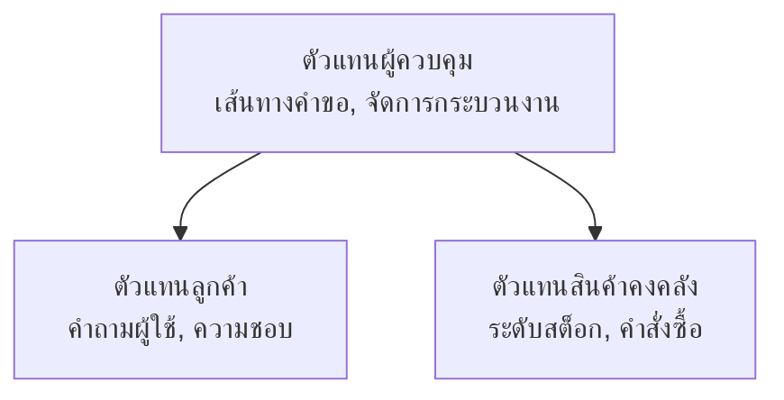

# บทที่ 5: โซลูชัน AI หลายเอเจนต์

**📚 หลักสูตร**: [AZD สำหรับผู้เริ่มต้น](../../README.md) | **⏱️ ระยะเวลา**: 2-3 ชั่วโมง | **⭐ ความซับซ้อน**: ขั้นสูง

---

## ภาพรวม

บทนี้ครอบคลุมรูปแบบสถาปัตยกรรมหลายเอเจนต์ขั้นสูง การประสานงานเอเจนต์ และการปรับใช้ AI สำหรับการใช้งานจริงในสถานการณ์ซับซ้อน

> ได้รับการตรวจสอบกับ `azd 1.27.1` ในเดือนกรกฎาคม 2026

## วัตถุประสงค์การเรียนรู้

เมื่อเรียนจบบทนี้ คุณจะสามารถ:
- เข้าใจรูปแบบสถาปัตยกรรมหลายเอเจนต์
- ปรับใช้ระบบเอเจนต์ AI ที่ประสานงานกัน
- ใช้การสื่อสารระหว่างเอเจนต์
- สร้างโซลูชันหลายเอเจนต์สำหรับการใช้งานจริง

---

## 📚 บทเรียน

| # | บทเรียน | คำอธิบาย | เวลา |
|---|--------|-------------|------|
| 1 | [พื้นฐานหลายเอเจนต์](multi-agent-basics.md) | ปฏิบัติจริง: ปรับใช้แอปหลายเอเจนต์ด้วย `azd up` | 45 นาที |
| 2 | [รูปแบบการประสานงาน](../chapter-06-pre-deployment/coordination-patterns.md) | กลยุทธ์การประสานงานเอเจนต์ (ดำเนินต่อในบทที่ 6) | 30 นาที |
| 3 | [การปรับใช้ ARM Template](../../examples/retail-multiagent-arm-template/README.md) | ตัวอย่างการปรับใช้ด้วยคลิกเดียว | 30 นาที |

> **เริ่มต้นด้วยบทเรียนที่ 1.** นี่คือบทเรียนเดียวที่เน้นการปฏิบัติและพร้อมปรับใช้ในบทนี้ บทเรียนที่ 2 อยู่ในบทที่ 6 (ร่วมกับการวางแผนก่อนปรับใช้) และ [โซลูชันหลายเอเจนต์ค้าปลีก](../../examples/retail-scenario.md) เป็นแบบแผนสถาปัตยกรรม—เป็นแบบอ้างอิงการออกแบบ ไม่ใช่เทมเพลตคำสั่งเดียว

---

## 🚀 เริ่มต้นอย่างรวดเร็ว

```bash
# ตัวเลือกที่ 1: ติดตั้งจากเทมเพลต
azd init --template agent-openai-python-prompty
azd up

# ตัวเลือกที่ 2: ติดตั้งจากไฟล์ manifest ของเอเจนต์ (ต้องใช้ส่วนขยาย azure.ai.agents)
azd extension install azure.ai.agents
azd ai agent init -m agent-manifest.yaml
azd up
```

> **ใช้แบบไหน?** ใช้ `azd init --template` เพื่อเริ่มจากตัวอย่างที่ทำงานได้ ใช้ `azd ai agent init` เมื่อต้องการใช้ไฟล์ manifest เอเจนต์ของคุณเอง ดู [AZD AI CLI reference](../chapter-08-production/production-ai-practices.md#azd-ai-cli-commands-and-extensions) สำหรับรายละเอียดเพิ่มเติม

---

## 🤖 สถาปัตยกรรมหลายเอเจนต์



---

## 🎯 โซลูชันเด่น: หลายเอเจนต์ค้าปลีก

[โซลูชันหลายเอเจนต์ค้าปลีก](../../examples/retail-scenario.md) แสดง:

- **เอเจนต์ลูกค้า**: จัดการการโต้ตอบและความชอบของผู้ใช้
- **เอเจนต์สินค้าคงคลัง**: จัดการสต็อกและการประมวลผลคำสั่งซื้อ
- **ผู้ประสานงาน**: ประสานงานระหว่างเอเจนต์
- **หน่วยความจำร่วม**: การจัดการบริบทข้ามเอเจนต์

### บริการที่ใช้

| บริการ | วัตถุประสงค์ |
|---------|---------|
| Microsoft Foundry Models | การเข้าใจภาษา |
| Azure AI Search | แคตตาล็อกสินค้า |
| Cosmos DB | สถานะและหน่วยความจำของเอเจนต์ |
| Container Apps | โฮสต์เอเจนต์ |
| Application Insights | การตรวจสอบ |

---

## 🔗 การนำทาง

| ทิศทาง | บทที่ |
|-----------|---------|
| **ก่อนหน้า** | [บทที่ 4: โครงสร้างพื้นฐาน](../chapter-04-infrastructure/README.md) |
| **ถัดไป** | [บทที่ 6: การวางแผนก่อนปรับใช้](../chapter-06-pre-deployment/README.md) |

---

## 📖 แหล่งข้อมูลที่เกี่ยวข้อง

- [คู่มือเอเจนต์ AI](../chapter-02-ai-development/agents.md)
- [แนวทางปฏิบัติ AI สำหรับการผลิต](../chapter-08-production/production-ai-practices.md)
- [การแก้ไขปัญหา AI](../chapter-07-troubleshooting/ai-troubleshooting.md)

---

<!-- CO-OP TRANSLATOR DISCLAIMER START -->
**ปฏิเสธความรับผิดชอบ**:
เอกสารนี้ได้รับการแปลโดยใช้บริการแปลภาษา AI [Co-op Translator](https://github.com/Azure/co-op-translator) ขณะที่เราพยายามให้ความถูกต้อง โปรดทราบว่าการแปลโดยอัตโนมัติอาจมีข้อผิดพลาดหรือความไม่ถูกต้อง เอกสารต้นฉบับในภาษาต้นทางควรถูกพิจารณาเป็นแหล่งข้อมูลที่เชื่อถือได้ สำหรับข้อมูลที่สำคัญ แนะนำให้ใช้การแปลโดยมนุษย์มืออาชีพ เราไม่รับผิดชอบต่อความเข้าใจผิดหรือการตีความที่ผิดพลาดที่เกิดขึ้นจากการใช้การแปลนี้
<!-- CO-OP TRANSLATOR DISCLAIMER END -->