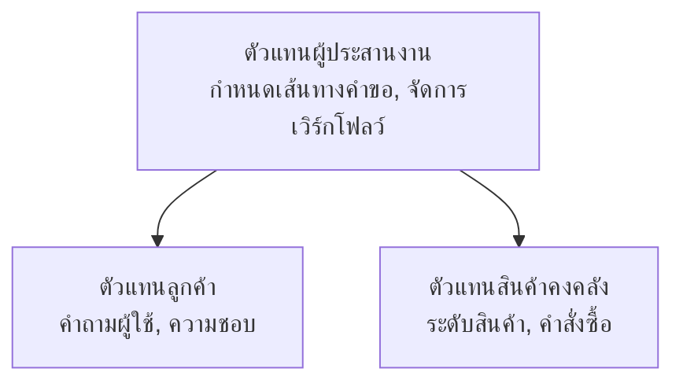

# Chapter 5: โซลูชัน AI หลายตัวแทน

**📚 คอร์ส**: [AZD สำหรับผู้เริ่มต้น](../../README.md) | **⏱️ ระยะเวลา**: 2-3 ชั่วโมง | **⭐ ความซับซ้อน**: ขั้นสูง

---

## ภาพรวม

บทนี้ครอบคลุมรูปแบบสถาปัตยกรรมหลายตัวแทนขั้นสูง การประสานงานตัวแทน และการปรับใช้ AI ที่พร้อมผลิตสำหรับสถานการณ์ที่ซับซ้อน

> ตรวจสอบกับ `azd 1.25.6` ในเดือนมิถุนายน 2026

## วัตถุประสงค์การเรียนรู้

เมื่อทำบทนี้สำเร็จ คุณจะ:
- เข้าใจรูปแบบสถาปัตยกรรมหลายตัวแทน
- ปรับใช้ระบบตัวแทน AI ที่ประสานงานกัน
- นำการสื่อสารตัวแทนกับตัวแทนมาใช้
- สร้างโซลูชันหลายตัวแทนที่พร้อมใช้งานจริง

---

## 📚 บทเรียน

| # | บทเรียน | คำอธิบาย | เวลา |
|---|--------|-------------|------|
| 1 | [พื้นฐานหลายตัวแทน](multi-agent-basics.md) | ฝึกปฏิบัติ: ปรับใช้แอปหลายตัวแทนที่ใช้งานได้ด้วย `azd up` | 45 นาที |
| 2 | [รูปแบบการประสานงาน](../chapter-06-pre-deployment/coordination-patterns.md) | กลยุทธ์การประสานงานตัวแทน (ต่อในบทที่ 6) | 30 นาที |
| 3 | [การปรับใช้ ARM Template](../../examples/retail-multiagent-arm-template/README.md) | ตัวอย่างการปรับใช้ด้วยคลิกเดียว | 30 นาที |

> **เริ่มต้นที่บทเรียนที่ 1.** เป็นบทเรียนเดียวที่ฝึกปฏิบัติเต็มรูปแบบและปรับใช้ได้ในบทนี้ บทเรียนที่ 2 อยู่ในบทที่ 6 (ใช้ร่วมกับการวางแผนก่อนปรับใช้) และ [โซลูชันหลายตัวแทนการค้าปลีก](../../examples/retail-scenario.md) เป็นแบบแผนสถาปัตยกรรม — เป็นเอกสารอ้างอิงการออกแบบ ไม่ใช่เทมเพลตคำสั่งเดียว

---

## 🚀 เริ่มต้นอย่างรวดเร็ว

```bash
# ตัวเลือก 1: ติดตั้งจากเทมเพลต
azd init --template agent-openai-python-prompty
azd up

# ตัวเลือก 2: ติดตั้งจาก manifest ของเอเจนต์ (ต้องการส่วนขยาย azure.ai.agents)
azd extension install azure.ai.agents
azd ai agent init -m agent-manifest.yaml
azd up
```

> **วิธีการใด?** ใช้ `azd init --template` เพื่อเริ่มต้นจากตัวอย่างที่ใช้งานได้ ใช้ `azd ai agent init` เมื่อคุณมีแผ่นประกาศตัวแทนของคุณเอง ดู [เอกสารอ้างอิง AZD AI CLI](../chapter-08-production/production-ai-practices.md#azd-ai-cli-commands-and-extensions) สำหรับรายละเอียดเต็ม

---

## 🤖 สถาปัตยกรรมหลายตัวแทน



---

## 🎯 โซลูชันเด่น: หลายตัวแทนการค้าปลีก

[โซลูชันหลายตัวแทนการค้าปลีก](../../examples/retail-scenario.md) สาธิต:

- **ตัวแทนลูกค้า**: จัดการการโต้ตอบและความชอบของผู้ใช้
- **ตัวแทนสินค้าคงคลัง**: บริหารสต็อกและกระบวนการสั่งซื้อ
- **ผู้ประสานงาน**: ประสานงานระหว่างตัวแทน
- **หน่วยความจำร่วม**: การจัดการบริบทข้ามตัวแทน

### บริการที่ใช้

| บริการ | วัตถุประสงค์ |
|---------|---------|
| Microsoft Foundry Models | ความเข้าใจภาษา |
| Azure AI Search | แค็ตตาล็อกสินค้า |
| Cosmos DB | สถานะและหน่วยความจำของตัวแทน |
| Container Apps | โฮสต์ตัวแทน |
| Application Insights | การตรวจสอบ |

---

## 🔗 นำทาง

| ทิศทาง | บท |
|-----------|---------|
| **ก่อนหน้า** | [บทที่ 4: โครงสร้างพื้นฐาน](../chapter-04-infrastructure/README.md) |
| **ถัดไป** | [บทที่ 6: ก่อนปรับใช้](../chapter-06-pre-deployment/README.md) |

---

## 📖 ทรัพยากรที่เกี่ยวข้อง

- [คู่มือผู้แทน AI](../chapter-02-ai-development/agents.md)
- [แนวปฏิบัติ AI สำหรับผลิตภัณฑ์](../chapter-08-production/production-ai-practices.md)
- [การแก้ไขปัญหา AI](../chapter-07-troubleshooting/ai-troubleshooting.md)

---

<!-- CO-OP TRANSLATOR DISCLAIMER START -->
**ปฏิเสธความรับผิดชอบ**:
เอกสารนี้ได้รับการแปลโดยใช้บริการแปลภาษา AI [Co-op Translator](https://github.com/Azure/co-op-translator) ขณะที่เราพยายามให้ความถูกต้อง โปรดทราบว่าการแปลโดยอัตโนมัติอาจมีข้อผิดพลาดหรือความไม่ถูกต้อง เอกสารต้นฉบับในภาษาต้นทางควรถูกพิจารณาเป็นแหล่งข้อมูลที่เชื่อถือได้ สำหรับข้อมูลที่สำคัญ แนะนำให้ใช้การแปลโดยมนุษย์มืออาชีพ เราไม่รับผิดชอบต่อความเข้าใจผิดหรือการตีความที่ผิดพลาดที่เกิดขึ้นจากการใช้การแปลนี้
<!-- CO-OP TRANSLATOR DISCLAIMER END -->