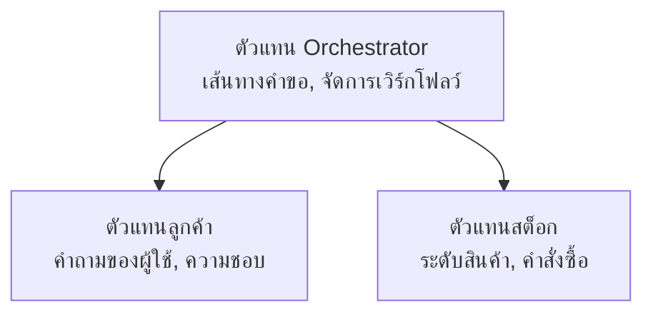

# บทที่ 5: โซลูชัน AI แบบหลายตัวแทน

**📚 คอร์ส**: [AZD สำหรับผู้เริ่มต้น](../../README.md) | **⏱️ ระยะเวลา**: 2-3 ชั่วโมง | **⭐ ความซับซ้อน**: ขั้นสูง

---

## ภาพรวม

บทนี้ครอบคลุมรูปแบบสถาปัตยกรรมหลายตัวแทนขั้นสูง การประสานงานตัวแทน และการปรับใช้ AI ที่พร้อมใช้งานสำหรับสถานการณ์ที่ซับซ้อน

## วัตถุประสงค์การเรียนรู้

หลังจากเรียนจบบทนี้ คุณจะ:
- เข้าใจรูปแบบสถาปัตยกรรมหลายตัวแทน
- ปรับใช้ระบบตัวแทน AI ที่ประสานงานกัน
- นำการสื่อสารระหว่างตัวแทนไปใช้
- สร้างโซลูชันหลายตัวแทนที่พร้อมใช้งานจริง

---

## 📚 บทเรียน

| # | บทเรียน | คำอธิบาย | เวลา |
|---|--------|-------------|------|
| 1 | [โซลูชัน AI หลายตัวแทนสำหรับค้าปลีก](../../examples/retail-scenario.md) | เดินทางการติดตั้งใช้งานครบถ้วน | 90 นาที |
| 2 | [รูปแบบการประสานงาน](../chapter-06-pre-deployment/coordination-patterns.md) | กลยุทธ์การประสานงานตัวแทน | 30 นาที |
| 3 | [การปรับใช้เทมเพลต ARM](../../examples/retail-multiagent-arm-template/README.md) | การปรับใช้คลิกเดียว | 30 นาที |

---

## 🚀 เริ่มต้นอย่างรวดเร็ว

```bash
# ตัวเลือกที่ 1: ติดตั้งจากเทมเพลต
azd init --template agent-openai-python-prompty
azd up

# ตัวเลือกที่ 2: ติดตั้งจาก manifest ของเอเย่นต์ (ต้องมีส่วนขยาย azure.ai.agents)
azd extension install azure.ai.agents
azd ai agent init -m agent-manifest.yaml
azd up
```

> **แนวทางไหน?** ใช้คำสั่ง `azd init --template` เพื่อเริ่มต้นจากตัวอย่างที่ใช้งานได้จริง ใช้ `azd ai agent init` เมื่อคุณมีไฟล์ manifest ตัวแทนของตัวเอง ดูรายละเอียดทั้งหมดได้ที่ [เอกสารอ้างอิง AZD AI CLI](../chapter-08-production/production-ai-practices.md#azd-ai-cli-commands-and-extensions) 

---

## 🤖 สถาปัตยกรรมหลายตัวแทน


---

## 🎯 โซลูชันเด่น: AI หลายตัวแทนสำหรับค้าปลีก

[โซลูชัน AI หลายตัวแทนสำหรับค้าปลีก](../../examples/retail-scenario.md) แสดงถึง:

- **ตัวแทนลูกค้า**: จัดการการโต้ตอบและความชอบของผู้ใช้
- **ตัวแทนสินค้าคงคลัง**: จัดการสต็อกและกระบวนการสั่งซื้อ
- **ผู้ประสานงาน**: ประสานงานระหว่างตัวแทน
- **หน่วยความจำร่วม**: การจัดการบริบทข้ามตัวแทน

### บริการที่ใช้

| บริการ | วัตถุประสงค์ |
|---------|---------|
| Microsoft Foundry Models | การเข้าใจภาษา |
| Azure AI Search | แคตตาล็อกสินค้า |
| Cosmos DB | สถานะและหน่วยความจำของตัวแทน |
| Container Apps | โฮสต์ตัวแทน |
| Application Insights | การตรวจสอบ |

---

## 🔗 การนำทาง

| ทิศทาง | บทที่ |
|-----------|---------|
| **ก่อนหน้า** | [บทที่ 4: โครงสร้างพื้นฐาน](../chapter-04-infrastructure/README.md) |
| **ถัดไป** | [บทที่ 6: ก่อนการปรับใช้](../chapter-06-pre-deployment/README.md) |

---

## 📖 แหล่งข้อมูลที่เกี่ยวข้อง

- [คู่มือ AI Agents](../chapter-02-ai-development/agents.md)
- [แนวปฏิบัติการผลิต AI](../chapter-08-production/production-ai-practices.md)
- [การแก้ไขปัญหา AI](../chapter-07-troubleshooting/ai-troubleshooting.md)

---

<!-- CO-OP TRANSLATOR DISCLAIMER START -->
**ข้อจำกัดความรับผิดชอบ**:  
เอกสารฉบับนี้ได้รับการแปลโดยใช้บริการแปลภาษาอัตโนมัติ [Co-op Translator](https://github.com/Azure/co-op-translator) แม้เราจะพยายามให้ความถูกต้องสูงสุด โปรดทราบว่าการแปลอัตโนมัติอาจมีข้อผิดพลาดหรือความไม่แม่นยำ เอกสารต้นฉบับในภาษาดั้งเดิมควรถูกถือเป็นแหล่งข้อมูลที่เชื่อถือได้ สำหรับข้อมูลสำคัญ แนะนำให้ใช้บริการแปลโดยมนุษย์ผู้เชี่ยวชาญ เราไม่รับผิดชอบต่อความเข้าใจผิดหรือการตีความที่ผิดพลาดที่เกิดจากการใช้การแปลนี้
<!-- CO-OP TRANSLATOR DISCLAIMER END -->