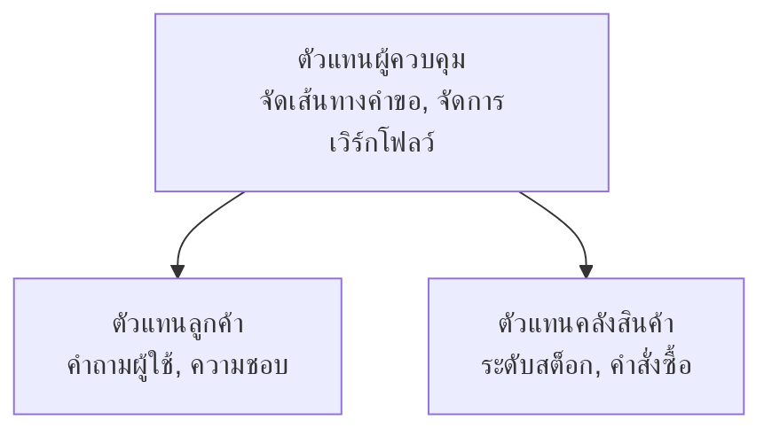

# Chapter 5: โซลูชัน AI แบบหลายเอเย่นต์

**📚 คอร์ส**: [AZD สำหรับผู้เริ่มต้น](../../README.md) | **⏱️ ระยะเวลา**: 2-3 ชั่วโมง | **⭐ ความซับซ้อน**: ขั้นสูง

---

## ภาพรวม

บทนี้ครอบคลุมรูปแบบสถาปัตยกรรมหลายเอเย่นต์ขั้นสูง การประสานงานเอเย่นต์ และการปรับใช้งาน AI ที่พร้อมใช้งานจริงสำหรับสถานการณ์ที่ซับซ้อน

> ได้รับการยืนยันกับ `azd 1.23.12` ในเดือนมีนาคม 2026

## วัตถุประสงค์การเรียนรู้

เมื่อสำเร็จบทนี้ คุณจะสามารถ:
- เข้าใจรูปแบบสถาปัตยกรรมหลายเอเย่นต์
- ปรับใช้ระบบเอเย่นต์ AI ที่ประสานงานกัน
- นำการสื่อสารระหว่างเอเย่นต์ไปใช้
- สร้างโซลูชันหลายเอเย่นต์ที่พร้อมสำหรับการใช้งานจริง

---

## 📚 บทเรียน

| # | บทเรียน | คำอธิบาย | เวลา |
|---|--------|-------------|------|
| 1 | [โซลูชันหลายเอเย่นต์สำหรับค้าปลีก](../../examples/retail-scenario.md) | การเดินดูการใช้งานครบถ้วน | 90 นาที |
| 2 | [รูปแบบการประสานงาน](../chapter-06-pre-deployment/coordination-patterns.md) | กลยุทธ์การประสานงานเอเย่นต์ | 30 นาที |
| 3 | [การปรับใช้ ARM Template](../../examples/retail-multiagent-arm-template/README.md) | ปรับใช้ด้วยคลิกเดียว | 30 นาที |

---

## 🚀 เริ่มต้นอย่างรวดเร็ว

```bash
# ตัวเลือกที่ 1: ติดตั้งจากเทมเพลต
azd init --template agent-openai-python-prompty
azd up

# ตัวเลือกที่ 2: ติดตั้งจากแสดงรายการตัวแทน (ต้องใช้ส่วนขยาย azure.ai.agents)
azd extension install azure.ai.agents
azd ai agent init -m agent-manifest.yaml
azd up
```

> **ใช้แนวทางไหน?** ใช้ `azd init --template` เพื่อเริ่มต้นจากตัวอย่างที่ใช้งานได้ ใช้ `azd ai agent init` เมื่อคุณมี manifest ของเอเย่นต์ของตัวเอง ดูรายละเอียดทั้งหมดได้ที่ [AZD AI CLI reference](../chapter-08-production/production-ai-practices.md#azd-ai-cli-commands-and-extensions)

---

## 🤖 สถาปัตยกรรมหลายเอเย่นต์


---

## 🎯 โซลูชันแนะนำ: โซลูชันหลายเอเย่นต์สำหรับค้าปลีก

[โซลูชันหลายเอเย่นต์สำหรับค้าปลีก](../../examples/retail-scenario.md) แสดงให้เห็น:

- **เอเย่นต์ลูกค้า**: จัดการการโต้ตอบและความชอบของผู้ใช้
- **เอเย่นต์สินค้าคงคลัง**: จัดการสต็อกและการประมวลผลคำสั่งซื้อ
- **ผู้ประสานงาน**: ประสานงานระหว่างเอเย่นต์
- **หน่วยความจำที่ใช้ร่วมกัน**: การจัดการบริบทข้ามเอเย่นต์

### บริการที่ใช้

| บริการ | วัตถุประสงค์ |
|---------|---------|
| Microsoft Foundry Models | การเข้าใจภาษา |
| Azure AI Search | แคตตาล็อกสินค้า |
| Cosmos DB | สถานะและหน่วยความจำของเอเย่นต์ |
| Container Apps | โฮสต์เอเย่นต์ |
| Application Insights | การตรวจสอบ |

---

## 🔗 การนำทาง

| ทิศทาง | บท |
|-----------|---------|
| **ก่อนหน้า** | [บทที่ 4: โครงสร้างพื้นฐาน](../chapter-04-infrastructure/README.md) |
| **ถัดไป** | [บทที่ 6: การเตรียมการปรับใช้](../chapter-06-pre-deployment/README.md) |

---

## 📖 แหล่งข้อมูลที่เกี่ยวข้อง

- [คู่มือเอเย่นต์ AI](../chapter-02-ai-development/agents.md)
- [แนวปฏิบัติ AI สำหรับการใช้งานจริง](../chapter-08-production/production-ai-practices.md)
- [การแก้ไขปัญหา AI](../chapter-07-troubleshooting/ai-troubleshooting.md)

---

<!-- CO-OP TRANSLATOR DISCLAIMER START -->
**ข้อจำกัดความรับผิดชอบ**:  
เอกสารนี้ถูกแปลโดยใช้บริการแปลภาษา AI [Co-op Translator](https://github.com/Azure/co-op-translator) แม้ว่าเราจะพยายามให้ความถูกต้องสูงสุด โปรดทราบว่าการแปลอัตโนมัติอาจมีข้อผิดพลาดหรือความไม่ถูกต้อง เอกสารต้นฉบับในภาษาต้นฉบับควรถูกพิจารณาว่าเป็นแหล่งข้อมูลที่น่าเชื่อถือ สำหรับข้อมูลที่สำคัญ ขอแนะนำให้ใช้การแปลโดยมนุษย์มืออาชีพ เราไม่รับผิดชอบต่อความเข้าใจผิดหรือการตีความที่ผิดพลาดที่เกิดจากการใช้การแปลนี้
<!-- CO-OP TRANSLATOR DISCLAIMER END -->