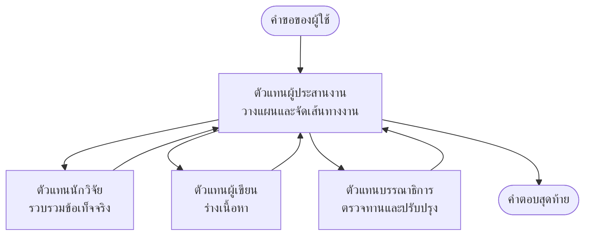

# พื้นฐานระบบหลายเอเจนต์ - ปรับใช้ระบบ AI ประสานงานตัวแรกของคุณ

**การนำทางบทเรียน:**
- **📚 หน้าแรกคอร์ส**: [AZD สำหรับผู้เริ่มต้น](../../README.md)
- **📖 บทปัจจุบัน**: บทที่ 5 - โซลูชัน AI แบบหลายเอเจนต์
- **⬅️ ก่อนหน้า**: [บทที่ 4: โครงสร้างพื้นฐาน](../chapter-04-infrastructure/README.md)
- **➡️ ถัดไป**: [รูปแบบการประสานงาน](../chapter-06-pre-deployment/coordination-patterns.md)

> ยืนยันแล้วกับ `azd 1.25.6` ในเดือนมิถุนายน 2026.

## บทนำ

ในบทก่อนหน้านี้คุณได้ปรับใช้แอปพลิเคชันหนึ่งตัว—และในบทที่ 2 คุณได้ปรับใช้เอเจนต์ AI เดียว บทเรียนนี้ก้าวไปอีกขั้น: ปรับใช้ **ระบบหลายเอเจนต์** ซึ่งเอเจนต์เฉพาะทางหลายตัวทำงานร่วมกันเพื่อแก้ปัญหาที่เอเจนต์เดียวไม่สามารถจัดการได้ดีด้วยตัวเอง

ข่าวดีสำหรับผู้เริ่มต้น: **คุณไม่จำเป็นต้องใช้คำสั่งใหม่** โซลูชันหลายเอเจนต์ยังคงเป็นโครงการ azd คุณจะ `azd init`, `azd up`, ทดสอบ และ `azd down`—เวิร์กโฟลว์เดียวกับที่คุณรู้ สิ่งที่เปลี่ยนคือรูปร่างของแอปด้านใน

## เป้าหมายการเรียนรู้

เมื่อจบบทเรียนนี้ คุณจะ:
- เข้าใจความหมายของ "หลายเอเจนต์" และเมื่อใดที่ควรรับภาระความซับซ้อนเพิ่มเติม
- จำแนกบทบาททั่วไปในระบบหลายเอเจนต์ (ผู้ประสานงาน + ผู้เชี่ยวชาญเฉพาะด้าน)
- ปรับใช้เทมเพลตหลายเอเจนต์ที่ใช้งานได้จริงด้วย `azd up`
- เข้าใจทรัพยากร Azure ที่สนับสนุนแอปหลายเอเจนต์
- รู้วิธียืนยัน ปรับแต่ง และยกเลิกโซลูชันอย่างปลอดภัย

## ผลลัพธ์การเรียนรู้

หลังจากทำบทเรียนนี้เสร็จ คุณจะสามารถ:
- อธิบายความแตกต่างระหว่างเอเจนต์เดียวกับระบบหลายเอเจนต์
- เลือกระหว่างเอเจนต์เดี่ยวที่มีเครื่องมือ กับการออกแบบหลายเอเจนต์จริงๆ
- ปรับใช้และทดสอบเทมเพลตหลายเอเจนต์ตั้งแต่ต้นจนจบด้วย azd
- ระบุว่าแต่ละเอเจนต์ทำงานที่ไหนและสื่อสารกันอย่างไร
- ลบทรัพยากรทั้งหมดเพื่อหลีกเลี่ยงค่าใช้จ่ายที่เกิดขึ้นต่อเนื่อง

---

## ระบบหลายเอเจนต์คืออะไร?

เอเจนต์ AI เดี่ยวคือโมเดลหนึ่งตัวที่มีชุดคำสั่งและ (ถ้ามี) บางเครื่องมือ นั่นทำงานได้ดีสำหรับงานที่มุ่งเน้น แต่เมื่อภารกิจขยายขึ้น—ค้นคว้า แล้วเขียน แล้วแก้ไข ตรวจสอบข้อเท็จจริง—ยัดทุกอย่างลงใน prompt เดียวทำให้เอเจนต์ช้าลง น่าเชื่อถือน้อยลง และยากต่อการดีบัก

ระบบหลายเอเจนต์จะแบ่งงานเป็นผู้เชี่ยวชาญที่แต่ละตัวทำหน้าที่หนึ่งอย่างได้ดี โดยมีผู้ประสานงานเป็นผู้จัดการการทำงาน:



### สองบทบาทที่คุณจะเห็นเสมอ

| บทบาท | หน้าที่ | ตัวอย่าง |
|------|-----|---------|
| **ผู้ประสานงาน** | ตัดสินใจ *สิ่งที่จะเกิดขึ้นต่อไป* และจัดเส้นทางงานระหว่างเอเจนต์ | "ค้นคว้าก่อน แล้วค่อยเขียน แล้วค่อยแก้ไข" |
| **ผู้เชี่ยวชาญเฉพาะด้าน** | ทำงานเฉพาะอย่างหนึ่งอย่างชำนาญและส่งผลลัพธ์กลับมา | ตัว "นักวิจัย" ที่รวบรวมข้อเท็จจริงเท่านั้น |

### คุณจำเป็นต้องมีหลายเอเจนต์จริงหรือ?

เริ่มจากอย่างเรียบง่าย เลือกใช้ระบบหลายเอเจนต์ **ก็ต่อเมื่อ** มีข้อใดข้อหนึ่งต่อไปนี้เป็นจริง:

- ✅ ภารกิจมี **ขั้นตอนที่แตกต่างกัน** ที่ได้ประโยชน์จากคำสั่งที่ต่างกัน (ค้นคว้า เทียบกับ เขียน เทียบกับ ตรวจทาน)
- ✅ คุณต้องการให้ผู้เชี่ยวชาญทำงาน **พร้อมกัน** เพื่อประหยัดเวลา
- ✅ ขั้นตอนต่างๆ ต้องการ **เครื่องมือหรือแหล่งข้อมูลที่ต่างกัน**
- ✅ คุณต้องการให้แต่ละขั้นตอน **ทดสอบและดีบักแยกกันได้**

ถ้าภารกิจของคุณเป็นคำถาม-คำตอบเดียวหรือการเรียกใช้เครื่องมืออย่างง่าย เอเจนต์เดี่ยวที่มีเครื่องมือ (บทที่ 2) จะเรียบง่ายกว่า ถูกกว่า และจัดการได้ง่ายกว่า

> **เคล็ดลับสำหรับผู้เริ่มต้น:** "มีเอเจนต์มากขึ้น" ไม่ได้หมายความว่า "ดีกว่า" เอเจนต์แต่ละตัวเพิ่มความหน่วง ค่าใช้จ่าย และสิ่งที่ต้องติดตาม เพิ่มเอเจนต์เมื่อปัญหาแบ่งเป็นส่วนอย่างชัดเจนเท่านั้น

---

## สองวิธีในการสร้างระบบหลายเอเจนต์บน Azure

| วิธี | คืออะไร | เหมาะสำหรับ |
|----------|-----------|----------|
| **เอเจนต์เดี่ยว + เครื่องมือ** | เอเจนต์ Foundry หนึ่งตัวที่เรียกฟังก์ชัน/เครื่องมือ | เวิร์กโฟลว์เรียบง่าย เริ่มต้นใช้งาน |
| **หลายเอเจนต์ที่ประสานงานกัน** | เอเจนต์หลายตัวที่มีผู้ประสานงาน | ขั้นตอนที่แตกต่าง การทำงานพร้อมกัน ความเชี่ยวชาญเฉพาะด้าน |

บทเรียนนี้มุ่งเน้นที่วิธีที่สองโดยใช้ **เทมเพลตพร้อมใช้งาน** เพื่อให้คุณเห็นระบบหลายเอเจนต์จริงทำงานก่อนที่คุณจะสร้างของคุณเอง

---

## ฝึกปฏิบัติ: ปรับใช้แอปหลายเอเจนต์ที่ใช้งานได้

เราจะปรับใช้ **Contoso Creative Writer** ตัวอย่างอย่างเป็นทางการจาก Azure ที่ใช้เอเจนต์หลายตัว (นักวิจัย นักเขียน บรรณาธิการ) ประสานงานกันเพื่อสร้างบทความ นี่เป็นแอปหลายเอเจนต์ที่ดีสำหรับเริ่มต้นเพราะบทบาทเข้าใจได้ง่าย

### ขั้นตอนที่ 1: เริ่มต้นเทมเพลต

```bash
# สร้างโฟลเดอร์ทำงาน
mkdir creative-writer && cd creative-writer

# เริ่มต้นจากเทมเพลตมัลติเอเจนต์อย่างเป็นทางการ
azd init --template contoso-creative-writer
```

> เรียกดูเทมเพลตหลายเอเจนต์เพิ่มเติมได้ตลอดเวลาใน [แกลเลอรี Awesome AZD AI](https://azure.github.io/awesome-azd/?tags=ai). ตัวเลือกอื่นที่เหมาะสำหรับผู้เริ่มต้นได้แก่ `get-started-with-ai-agents` และ `azure-ai-travel-agents`.

### ขั้นตอนที่ 2: การยืนยันตัวตน

```bash
# จำเป็นสำหรับเวิร์กโฟลว์ของ azd
azd auth login
```

### ขั้นตอนที่ 3: สร้าง environment

```bash
azd env new dev
```

### ขั้นตอนที่ 4: แสดงตัวอย่าง แล้วปรับใช้

```bash
# ดูว่าจะมีอะไรถูกสร้างขึ้นก่อนที่จะใช้จ่ายอะไรเลย (แนะนำ)
azd provision --preview

# จัดเตรียมโครงสร้างพื้นฐานและปรับใช้เอเจนต์ทั้งหมดในขั้นตอนเดียว
azd up
```

`azd up` จะขอให้เลือก subscription และ region แล้วจัดเตรียมทรัพยากร Azure และปรับใช้แอปพลิเคชัน การปรับใช้ AI อาจใช้เวลานานกว่าเว็บแอปธรรมดา—ถ้าคุณกำลังปรับใช้โมเดลขนาดใหญ่ขึ้น คุณสามารถขยายเวลาหมดเวลาในการปรับใช้ได้:

```bash
azd deploy --timeout 1800
```

> **เตือนเรื่องค่าใช้จ่ายและความจุ:** แอปหลายเอเจนต์จะปรับใช้โมเดล AI ซึ่งใช้โควต้าและเกิดค่าใช้จ่าย หาก `azd up` ล้มเหลวด้วยปัญหาโควต้าโมเดล ให้ดู [การแก้ปัญหา AI](../chapter-07-troubleshooting/ai-troubleshooting.md) สำหรับการแก้ไขภูมิภาคและโควต้า และบทที่ 6 [การวางแผนความจุ](../chapter-06-pre-deployment/capacity-planning.md)

---

## ทำความเข้าใจสิ่งที่คุณปรับใช้

แอปหลายเอเจนต์ทั่วไปเช่นนี้จะจัดเตรียมทรัพยากร Azure ชุดหนึ่งที่แมปตรงกับความรับผิดชอบในไดอะแกรมข้างต้น:

| ทรัพยากร | เหตุผลที่มี |
|----------|----------------|
| **Microsoft Foundry / Models** | โฮสต์โมเดลภาษาที่แต่ละเอเจนต์ใช้ |
| **Azure AI Search** | ให้ข้อมูลที่มีแหล่งอ้างอิงแก่เอเจนต์นักวิจัยสำหรับการค้นหา |
| **Container Apps** (หรือ App Service) | โฮสต์โค้ดผู้ประสานงานและเอเจนต์ |
| **Cosmos DB** (ในตัวอย่างบางชุด) | เก็บสถานะ/ความทรงจำที่แชร์ระหว่างเอเจนต์ |
| **Application Insights** | ติดตามคำขอ *ข้าม* เอเจนต์เพื่อให้คุณดีบักการไหลได้ |

### วิธีที่เอเจนต์สื่อสารกัน

ในตัวอย่าง azd หลายเอเจนต์ส่วนใหญ่ **ผู้ประสานงานรันในโค้ดแอปของคุณ** (ตัวอย่างเช่น ใช้เฟรมเวิร์กอย่าง Semantic Kernel หรือ Microsoft Agent Framework) ผู้ประสานงานเรียกเอเจนต์ผู้เชี่ยวชาญทีละตัว ส่งผลลัพธ์ต่อ และประกอบคำตอบสุดท้าย เอเจนต์จะแชร์บริบทผ่าน:

- **การเรียกฟังก์ชัน/เครื่องมือ** — ผู้ประสานงานเรียกเอเจนต์ผู้เชี่ยวชาญและได้รับผลลัพธ์กลับ
- **หน่วยความจำที่แชร์** — ฐานข้อมูล (มักเป็น Cosmos DB) เก็บสถานะที่ทั้งสองเอเจนต์สามารถอ่านได้
- **ข้อความ/อีเวนต์** — สำหรับการเชื่อมโยงที่หลวมกว่า เอเจนต์สื่อสารผ่านคิวหรือ Service Bus

> **ทำไมเรื่องนี้สำคัญสำหรับการดีบัก:** เพราะแต่ละขั้นตอนแยกกัน Application Insights จะแสดงให้คุณเห็นว่าเอเจนต์ใดช้า หรือล้มเหลว นั่นเป็นเหตุผลสำคัญที่จะต้องแยกงานระหว่างเอเจนต์ตั้งแต่แรก

---

## ตรวจสอบการปรับใช้

ยืนยันว่าระบบทำงานจริงก่อนดำเนินการต่อ:

```bash
# แสดงจุดเชื่อมต่อที่ปรับใช้อยู่
azd show

# เปิดแดชบอร์ดการเฝ้าติดตามของแอป
azd monitor

# ติดตามล็อกแบบต่อเนื่องหากมีบางอย่างดูผิดปกติ
azd monitor --logs
```

แล้วเปิด URL ของแอปจาก `azd show` และลองส่งคำขอที่ใช้งานเอเจนต์ทั้งหมด (สำหรับ Creative Writer ให้ขอให้เขียนบทความสั้นในหัวข้อหนึ่ง) ใน **transaction search** ของ Application Insights คุณควรเห็นคำขอกระจายออกผ่านขั้นตอนนักวิจัย นักเขียน และบรรณาธิการ

**เกณฑ์ความสำเร็จ:**
- ✅ `azd show` แสดงจุดเชื่อมต่อที่เข้าถึงได้
- ✅ คำขอสร้างผลลัพธ์ที่ชัดเจนว่าเดินผ่านหลายขั้นตอน
- ✅ Application Insights แสดง traces สำหรับมากกว่าหนึ่งขั้นตอนของเอเจนต์

---

## ปรับแต่ง: เพิ่มหรือปรับเอเจนต์

เพราะว่าแต่ละเอเจนต์เป็นเพียงชุดคำสั่งบวกเครื่องมือ การปรับแต่งจึงเข้าถึงได้:

1. **ค้นหาคำจำกัดความของเอเจนต์** ในเทมเพลต (มักจะเป็นไฟล์ชุด `prompts/`, `agents/`, หรือ `*.prompty`)
2. **ปรับแต่งคำสั่งของเอเจนต์** — ตัวอย่างเช่น บอกเอเจนต์บรรณาธิการให้บังคับใช้โทนเสียงหรือจำนวนคำที่เฉพาะเจาะจง
3. **ปรับใช้เฉพาะโค้ดอีกครั้ง** (โครงสร้างพื้นฐานไม่เปลี่ยนแปลง):

   ```bash
   azd deploy
   ```

หากต้องการก้าวไกลและสร้างเอเจนต์จาก manifest ของ *คุณเอง* ให้ใช้ส่วนขยายเอเจนต์และวงจรชีวิตเต็มรูปแบบ:

```bash
azd extension install azure.ai.agents
azd ai agent init -m agent-manifest.yaml
azd up
azd ai agent invoke      # ทดสอบ โดยมีการวัดเวลาตอบสนอง
```

ดู [บทที่ 2: เอเจนต์](../chapter-02-ai-development/agents.md) และ [เอกสารอ้างอิง AZD AI CLI](../chapter-08-production/production-ai-practices.md#azd-ai-cli-commands-and-extensions) สำหรับวงจรชีวิตของเอเจนต์แบบครบถ้วน (`invoke`, `eval generate`, `optimize`, `delete`)

---

## ทำความสะอาด

แอปหลายเอเจนต์ใช้งานบริการที่เรียกเก็บเงินหลายรายการ ลบทุกอย่างเมื่อเสร็จแล้ว:

```bash
azd down --force --purge
```

แฟล็ก `--purge` ยังลบทรัพยากร AI ที่ถูกลบแบบนุ่ม (soft-deleted) เช่น บัญชี Foundry/Azure AI Services เพื่อไม่ให้กีดขวางการปรับใช้ในอนาคตหรือยังคงเกิดค่าใช้จ่ายอยู่

---

## หมายเหตุเกี่ยวกับระบบหลายเอเจนต์ในการใช้งานจริง

[โซลูชันหลายเอเจนต์สำหรับค้าปลีก](../../examples/retail-scenario.md) ในรีโปนี้เป็น **บลูปริ้นท์สถาปัตยกรรม** ไม่ใช่เทมเพลตคำสั่งเดียว—มันอธิบายว่าระบบค้าปลีกใช้งานจริง *จะ* ถูกสร้างขึ้นอย่างไร (และระบุชัดเจนว่าการสร้างแบบเต็มรูปแบบเป็นงานที่ต้องใช้ความพยายามมาก) ใช้มันเป็นเอกสารอ้างอิงการออกแบบ *หลังจาก* ที่คุณปรับใช้ตัวอย่างที่ใช้งานได้ที่นี่ สำหรับข้อกังวลในระดับการผลิต (ความทนทาน ค่าใช้จ่าย การมอนิเตอร์ การกำกับดูแล) ให้ไปต่อที่ [บทที่ 8: แนวปฏิบัติ AI ในการใช้งานจริง](../chapter-08-production/production-ai-practices.md)

---

## สรุป

- ระบบหลายเอเจนต์แบ่งงานข้ามผู้เชี่ยวชาญที่ประสานงานโดยผู้ประสานงาน
- ใช้มันก็ต่อเมื่อภารกิจมีขั้นตอนแตกต่างกัน การทำงานพร้อมกัน หรือเครื่องมือที่ต่างกันในแต่ละขั้นตอน—ถ้าไม่เช่นนั้นให้เลือกเอเจนต์เดี่ยว
- เวิร์กโฟลว์ azd ไม่เปลี่ยน: `azd init` → `azd up` → ทดสอบ → `azd down`
- เทมเพลตจริงอย่าง `contoso-creative-writer` ช่วยให้คุณเห็นและปรับแต่งแอปหลายเอเจนต์ที่ใช้งานได้วันนี้
- การติดตามใน Application Insights ข้ามเอเจนต์เป็นหนึ่งในประโยชน์เชิงปฏิบัติที่ใหญ่ที่สุดของการออกแบบหลายเอเจนต์

---

## 🔗 การนำทาง

| Direction | Lesson |
|-----------|--------|
| **Previous** | [บทที่ 4: โครงสร้างพื้นฐาน](../chapter-04-infrastructure/README.md) |
| **Next** | [รูปแบบการประสานงาน](../chapter-06-pre-deployment/coordination-patterns.md) |

## 📖 แหล่งข้อมูลที่เกี่ยวข้อง

- [AI Agents Guide](../chapter-02-ai-development/agents.md)
- [Coordination Patterns](../chapter-06-pre-deployment/coordination-patterns.md)
- [Production AI Practices](../chapter-08-production/production-ai-practices.md)
- [AI Troubleshooting](../chapter-07-troubleshooting/ai-troubleshooting.md)

---

<!-- CO-OP TRANSLATOR DISCLAIMER START -->
**ปฏิเสธความรับผิดชอบ**:
เอกสารนี้ได้รับการแปลโดยใช้บริการแปลภาษา AI [Co-op Translator](https://github.com/Azure/co-op-translator) ขณะที่เราพยายามให้ความถูกต้อง โปรดทราบว่าการแปลโดยอัตโนมัติอาจมีข้อผิดพลาดหรือความไม่ถูกต้อง เอกสารต้นฉบับในภาษาต้นทางควรถูกพิจารณาเป็นแหล่งข้อมูลที่เชื่อถือได้ สำหรับข้อมูลที่สำคัญ แนะนำให้ใช้การแปลโดยมนุษย์มืออาชีพ เราไม่รับผิดชอบต่อความเข้าใจผิดหรือการตีความที่ผิดพลาดที่เกิดขึ้นจากการใช้การแปลนี้
<!-- CO-OP TRANSLATOR DISCLAIMER END -->