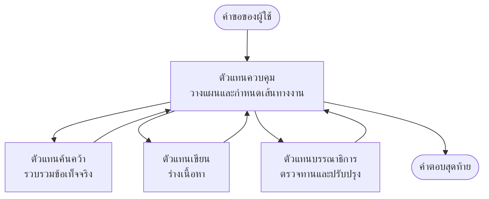

# พื้นฐานมัลติเอเจนต์ - ปรับใช้ระบบ AI ที่ประสานงานกันครั้งแรกของคุณ

**นำทางบทเรียน:**
- **📚 หน้าแรกหลักสูตร**: [AZD สำหรับผู้เริ่มต้น](../../README.md)
- **📖 บทปัจจุบัน**: บทที่ 5 - โซลูชัน AI มัลติเอเจนต์
- **⬅️ ก่อนหน้า**: [บทที่ 4: โครงสร้างพื้นฐาน](../chapter-04-infrastructure/README.md)
- **➡️ ถัดไป**: [รูปแบบการประสานงาน](../chapter-06-pre-deployment/coordination-patterns.md)

> ได้รับการยืนยันกับ `azd 1.27.1` ในเดือนกรกฎาคม 2026

## บทนำ

ในบทก่อนหน้านี้คุณได้ปรับใช้แอปพลิเคชันเดียว — และในบทที่ 2 คุณได้ปรับใช้เอเจนต์ AI ตัวเดียว บทเรียนนี้พาคุณไปอีกขั้น: การปรับใช้ **ระบบมัลติเอเจนต์** ซึ่งมีเอเจนต์เฉพาะทางหลายตัวทำงานร่วมกันเพื่อแก้ปัญหาที่เอเจนต์ตัวเดียวไม่สามารถจัดการได้ดีด้วยตัวเอง

ข่าวดีสำหรับผู้เริ่มต้น: **คุณไม่จำเป็นต้องใช้คำสั่งใหม่** โซลูชันมัลติเอเจนต์ยังคงเป็นโครงการ azd คุณจะใช้ `azd init`, `azd up`, ทดสอบ, และ `azd down` — ตามกระบวนการทำงานที่คุณรู้แล้ว สิ่งที่เปลี่ยนคือ *รูปร่าง* ของแอปภายใน

## เป้าหมายการเรียนรู้

สิ้นสุดบทเรียนนี้คุณจะ:
- เข้าใจความหมายของ "มัลติเอเจนต์" และเมื่อใดที่ควรใช้ความซับซ้อนเพิ่มเติมนี้
- รู้จักบทบาททั่วไปในระบบมัลติเอเจนต์ (ผู้ประสานงาน + ผู้เชี่ยวชาญ)
- ปรับใช้เทมเพลตมัลติเอเจนต์จริงที่ทำงานได้ด้วย `azd up`
- เข้าใจทรัพยากร Azure ที่สนับสนุนแอปมัลติเอเจนต์
- รู้วิธีตรวจสอบ ปรับแต่ง และล้างโซลูชันอย่างปลอดภัย

## ผลลัพธ์การเรียนรู้

หลังจากทำบทเรียนนี้ คุณจะสามารถ:
- อธิบายความแตกต่างระหว่างเอเจนต์ตัวเดียวกับระบบมัลติเอเจนต์
- เลือกระหว่างเอเจนต์ตัวเดียวพร้อมเครื่องมือกับการออกแบบมัลติเอเจนต์แท้จริง
- ปรับใช้และทดสอบเทมเพลตมัลติเอเจนต์ตั้งแต่ต้นจนจบด้วย azd
- ระบุได้ว่าแต่ละเอเจนต์ทำงานที่ใดและสื่อสารกันอย่างไร
- ทำความสะอาดทรัพยากรทั้งหมดเพื่อหลีกเลี่ยงค่าใช้จ่ายอย่างต่อเนื่อง

---

## ระบบมัลติเอเจนต์คืออะไร?

เอเจนต์ AI ตัวเดียวคือโมเดลหนึ่งพร้อมชุดคำสั่งและ (ถ้ามี) เครื่องมือบางอย่าง นั่นเหมาะสำหรับงานที่เน้นเฉพาะจุด แต่เมื่องานขยายตัว—วิจัย, เขียน, แก้ไข, ตรวจสอบข้อเท็จจริง—การยัดทุกอย่างเข้าในโปรมต์เดียวทำให้เอเจนต์ทำงานช้าลง น่าเชื่อถือลดลง และยากต่อการแก้ไขข้อบกพร่อง

ระบบ **มัลติเอเจนต์** แบ่งงานออกเป็นผู้เชี่ยวชาญแต่ละคนทำงานหนึ่งอย่างดี ภายใต้การประสานงานของผู้ประสานงาน:



### บทบาทสองแบบที่คุณจะเห็นเสมอ

| บทบาท | งาน | ตัวอย่าง |
|------|-----|---------|
| **ผู้ประสานงาน** | ตัดสินใจ *สิ่งที่จะเกิดขึ้นต่อไป* และกระจายงานระหว่างเอเจนต์ | "เริ่มด้วยวิจัย เขียน แล้วแก้ไข" |
| **ผู้เชี่ยวชาญ** | ทำงานที่มุ่งเน้นหนึ่งอย่างและส่งผลลัพธ์กลับ | "นักวิจัย" ที่เก็บรวบรวมข้อเท็จจริงเท่านั้น |

### คุณจำเป็นต้องใช้เอเจนต์หลายตัวจริงๆ หรือ?

เริ่มจากง่ายก่อน ใช้มัลติเอเจนต์ **เฉพาะเมื่อ** หนึ่งในนี้เป็นจริง:

- ✅ งานมี **ขั้นตอนที่แตกต่างกัน** ซึ่งได้รับประโยชน์จากคำสั่งที่ต่างกัน (วิจัย vs เขียน vs ตรวจทาน)
- ✅ คุณต้องการให้ผู้เชี่ยวชาญทำงาน **พร้อมกัน** เพื่อประหยัดเวลา
- ✅ ขั้นตอนต่างๆ ต้องการ **เครื่องมือหรือแหล่งข้อมูลที่ต่างกัน**
- ✅ คุณต้องการให้แต่ละขั้นตอน **ทดสอบและแก้ไขข้อบกพร่องได้อย่างอิสระ**

ถ้างานของคุณเป็นเพียงคำถาม-คำตอบเดียวหรือการเรียกใช้เครื่องมืออย่างง่ายๆ **เอเจนต์ตัวเดียวพร้อมเครื่องมือ** (บทที่ 2) จะง่ายกว่า ถูกกว่า และง่ายต่อการดูแล

> **เคล็ดลับสำหรับผู้เริ่มต้น:** "เอเจนต์มากขึ้น" ไม่ได้แปลว่า "ดีกว่า" เอเจนต์แต่ละตัวเพิ่มความหน่วง เวลา และสิ่งที่ต้องดูแล เพิ่มเอเจนต์เมื่อปัญหาชัดเจนว่าจะแบ่งเป็นส่วนๆ

---

## สองวิธีสร้างมัลติเอเจนต์บน Azure

| วิธี | คืออะไร | เหมาะสำหรับ |
|----------|-----------|----------|
| **เอเจนต์ตัวเดียว + เครื่องมือ** | เอเจนต์ Foundry ตัวเดียวที่เรียกใช้ฟังก์ชัน/เครื่องมือ | เวิร์กโฟลว์ง่ายๆ เริ่มต้นใช้งาน |
| **เอเจนต์หลายตัวที่ประสานงานกัน** | เอเจนต์หลายตัวพร้อมผู้ประสานงาน | ขั้นตอนที่แตกต่างกัน งานพร้อมกัน ความเชี่ยวชาญเฉพาะทาง |

บทเรียนนี้เน้นวิธีที่สองโดยใช้ **เทมเพลตพร้อมใช้งาน** เพื่อให้คุณเห็นระบบมัลติเอเจนต์จริงที่กำลังทำงานก่อนสร้างของคุณเอง

---

## ฝึกปฏิบัติ: ปรับใช้แอปมัลติเอเจนต์ที่ทำงานได้จริง

เราจะปรับใช้ **Contoso Creative Writer** ตัวอย่าง Azure อย่างเป็นทางการที่ใช้เอเจนต์หลายตัว (นักวิจัย, ผู้เขียน, บรรณาธิการ) ประสานงานกันเพื่อสร้างบทความ มันเป็นแอปมัลติเอเจนต์ตัวแรกที่ดีเพราะบทบาทเข้าใจง่าย

### ขั้นตอนที่ 1: เริ่มต้นเทมเพลต

```bash
# สร้างโฟลเดอร์ทำงาน
mkdir creative-writer && cd creative-writer

# เริ่มต้นจากแม่แบบตัวแทนหลายคนอย่างเป็นทางการ
azd init --template contoso-creative-writer
```

> ค้นหาเทมเพลตมัลติเอเจนต์เพิ่มเติมได้ที่ [แกลเลอรี Awesome AZD AI](https://azure.github.io/awesome-azd/?tags=ai) ตัวเลือกสำหรับผู้เริ่มต้นอื่นๆ มี `get-started-with-ai-agents` และ `azure-ai-travel-agents`

### ขั้นตอนที่ 2: ยืนยันตัวตน

```bash
# จำเป็นสำหรับการทำงานแบบ azd
azd auth login
```

### ขั้นตอนที่ 3: สร้างสภาพแวดล้อม

```bash
azd env new dev
```

### ขั้นตอนที่ 4: ดูตัวอย่าง แล้วปรับใช้

```bash
# ดูว่าจะสร้างอะไรบ้างก่อนใช้จ่าย (แนะนำ)
azd provision --preview

# จัดเตรียมโครงสร้างพื้นฐานและปรับใช้ตัวแทนทั้งหมดในขั้นตอนเดียว
azd up
```

`azd up` จะขอให้ระบุการสมัครใช้งานและภูมิภาค จากนั้นจัดสรรทรัพยากร Azure และปรับใช้แอปพลิเคชัน การปรับใช้ AI อาจใช้เวลานานกว่าเว็บแอปง่ายๆ — หากคุณกำลังปรับใช้โมเดลใหญ่ขึ้น คุณสามารถขยายเวลาเดดไลน์การปรับใช้ได้:

```bash
azd deploy --timeout 1800
```

> **แจ้งเตือนเรื่องค่าใช้จ่ายและความจุ:** แอปมัลติเอเจนต์ปรับใช้โมเดล AI ที่ใช้โควต้าและเสียค่าใช้จ่าย หาก `azd up` ล้มเหลวเพราะโควต้าของโมเดล ดูที่ [การแก้ไขปัญหา AI](../chapter-07-troubleshooting/ai-troubleshooting.md) สำหรับการแก้ไขภูมิภาคและโควต้า และบทที่ 6 [การวางแผนความจุ](../chapter-06-pre-deployment/capacity-planning.md)

---

## ทำความเข้าใจสิ่งที่คุณปรับใช้

แอปมัลติเอเจนต์ทั่วไปแบบนี้จะจัดสรรชุดทรัพยากร Azure ที่แมปตรงกับความรับผิดชอบในแผนภาพข้างบน:

| ทรัพยากร | ทำไมถึงมี |
|----------|---------------|
| **Microsoft Foundry / Models** | โฮสต์โมเดลภาษาที่แต่ละเอเจนต์ใช้ |
| **Azure AI Search** | ให้นักวิจัยมีข้อมูลพื้นฐานสำหรับค้นหา |
| **Container Apps** (หรือ App Service) | โฮสต์โค้ดผู้ประสานงานและโค้ดเอเจนต์ |
| **Cosmos DB** (ในตัวอย่างบางส่วน) | เก็บสถานะ/ความทรงจำที่แชร์ระหว่างเอเจนต์ |
| **Application Insights** | ติดตามคำขอ *ข้าม* เอเจนต์เพื่อให้แก้ข้อบกพร่องได้ |

### วิธีที่เอเจนต์สื่อสารกัน

ในตัวอย่างมัลติเอเจนต์ azd ส่วนใหญ่, **ผู้ประสานงานรันในโค้ดแอปของคุณ** (เช่น ใช้เฟรมเวิร์กอย่าง Semantic Kernel หรือ Microsoft Agent Framework) ผู้ประสานงานจะเรียกเอเจนต์ผู้เชี่ยวชาญแต่ละตัวตามลำดับ, ส่งผลลัพธ์ต่อ, และประกอบคำตอบสุดท้าย เอเจนต์แชร์บริบทผ่าน:

- **การเรียกฟังก์ชัน/เครื่องมือ** — ผู้ประสานงานเรียกใช้งานผู้เชี่ยวชาญและได้รับผลลัพธ์กลับ
- **ความทรงจำที่แชร์** — ฐานข้อมูล (มักเป็น Cosmos DB) เก็บสถานะที่เอเจนต์ทั้งสองอ่านได้
- **ข้อความ/เหตุการณ์** — สำหรับการเชื่อมโยงที่หลวมกว่า, เอเจนต์สื่อสารผ่านคิวหรือ Service Bus

> **เหตุผลที่สำคัญสำหรับการแก้ข้อบกพร่อง:** เพราะแต่ละขั้นตอนแยกจากกัน Application Insights จะแสดงให้เห็น *เอเจนต์ตัวไหน* ที่ทำงานช้าหรือผิดพลาด นั่นเป็นเหตุผลหลักที่ต้องแบ่งงานข้ามเอเจนต์ตั้งแต่ต้น

---

## ตรวจสอบการปรับใช้

ยืนยันว่าระบบทำงานจริงก่อนดำเนินการต่อ:

```bash
# แสดงจุดเชื่อมต่อที่ถูกติดตั้ง
azd show

# เปิดแผงควบคุมการตรวจสอบของแอป
azd monitor

# ติดตามบันทึกเหตุการณ์ถ้ามีสิ่งใดผิดปกติ
azd monitor --logs
```

จากนั้นเปิด URL แอปจาก `azd show` แล้วลองคำขอที่เรียกใช้เอเจนต์ทั้งหมด (สำหรับ Creative Writer ให้ขอให้เขียนบทความสั้นในหัวข้อหนึ่ง) ในการค้นหาธุรกรรมของ Application Insights คุณควรเห็นคำขอแยกไปยังขั้นตอนนักวิจัย ผู้เขียน และบรรณาธิการ

**เกณฑ์ความสำเร็จ:**
- ✅ `azd show` จะแสดงปลายทางที่เข้าถึงได้
- ✅ คำขอสร้างผลลัพธ์ที่ผ่านหลายขั้นตอนอย่างชัดเจน
- ✅ Application Insights แสดงแทรซของเอเจนต์มากกว่าหนึ่งขั้นตอน

---

## ปรับแต่ง: เพิ่มหรือตั้งค่าเอเจนต์

เพราะแต่ละเอเจนต์เป็นเพียงคำสั่งและเครื่องมือ การปรับแต่งจึงง่าย:

1. **หารายละเอียดเอเจนต์** ในเทมเพลต (มักเป็นไฟล์ชุดใน `prompts/`, `agents/`, หรือ `*.prompty`)
2. **ปรับแต่งคำสั่งเอเจนต์** — เช่น บอกเอเจนต์บรรณาธิการให้บังคับใช้โทนเสียงหรือจำนวนคำเฉพาะ
3. **ปรับใช้งานโค้ดใหม่เฉพาะ** (โครงสร้างพื้นฐานไม่เปลี่ยนแปลง):

   ```bash
   azd deploy
   ```

หากต้องการก้าวไปไกลขึ้นและสร้างเอเจนต์จาก *แมนิเฟสต์* ของคุณเอง, ใช้ส่วนขยายเอเจนต์และวงจรชีวิตครบถ้วน:

```bash
azd extension install azure.ai.agents
azd ai agent init -m agent-manifest.yaml
azd up
azd ai agent invoke      # ทดสอบ พร้อมเวลาตอบสนอง
```

ดู [บทที่ 2: เอเจนต์](../chapter-02-ai-development/agents.md) และ [เอกสารอ้างอิง AZD AI CLI](../chapter-08-production/production-ai-practices.md#azd-ai-cli-commands-and-extensions) สำหรับวงจรชีวิตเอเจนต์ครบถ้วน (`invoke`, `eval generate`, `optimize`, `delete`)

---

## ทำความสะอาด

แอปมัลติเอเจนต์ใช้งานบริการจ่ายเงินหลายตัว ทำลายทุกอย่างเมื่อเสร็จสิ้น:

```bash
azd down --force --purge
```

ธง `--purge` จะลบทรัพยากร AI ที่ถูกลบนุ่มนวล (เช่น บัญชี Foundry/Azure AI Services) เพื่อไม่ให้บล็อกการปรับใช้อีกครั้งในอนาคตหรือต่อเนื่องเรียกเก็บค่าใช้จ่าย

---

## หมายเหตุเกี่ยวกับระบบมัลติเอเจนต์ในสภาพแวดล้อมผลิตจริง

[โซลูชันมัลติเอเจนต์ค้าปลีก](../../examples/retail-scenario.md) ในรีโปนี้เป็น **แผนภาพสถาปัตยกรรม** ไม่ใช่เทมเพลตคำสั่งเดียว—มันอธิบายวิธีที่ระบบค้าปลีกผลิตจริง *จะถูก* สร้างขึ้น (และชัดเจนว่าการสร้างเต็มรูปแบบเป็นงานที่ยาก) ใช้มันเป็นอ้างอิงการออกแบบ *หลังจาก* คุณปรับใช้ตัวอย่างที่ใช้งานได้ที่นี่ สำหรับข้อกังวลในผลิตจริง (ความทนทาน, ค่าใช้จ่าย, การตรวจสอบ, การกำกับดูแล) ให้ดำเนินการต่อที่ [บทที่ 8: แนวปฏิบัติ AI ในการผลิต](../chapter-08-production/production-ai-practices.md)

---

## สรุป

- ระบบมัลติเอเจนต์แบ่งงานข้ามผู้เชี่ยวชาญที่ประสานงานโดยผู้ประสานงาน
- ใช้เฉพาะเมื่อภารกิจมีขั้นตอนที่แตกต่างกัน งานพร้อมกัน หรือเครื่องมือที่ต่างกันในแต่ละขั้นตอน—ถ้าไม่ ใช้เอเจนต์เดียวจะดีกว่า
- กระบวนการ azd ไม่เปลี่ยน: `azd init` → `azd up` → ทดสอบ → `azd down`
- เทมเพลตจริงอย่าง `contoso-creative-writer` ช่วยให้คุณเห็นและปรับแต่งแอปมัลติเอเจนต์ที่ทำงานได้จริงวันนี้
- การติดตาม Application Insights ข้ามเอเจนต์เป็นหนึ่งในประโยชน์ที่ใช้งานได้จริงที่สุดของการออกแบบมัลติเอเจนต์

---

## 🔗 การนำทาง

| ทิศทาง | บทเรียน |
|-----------|--------|
| **ก่อนหน้า** | [บทที่ 4: โครงสร้างพื้นฐาน](../chapter-04-infrastructure/README.md) |
| **ถัดไป** | [รูปแบบการประสานงาน](../chapter-06-pre-deployment/coordination-patterns.md) |

## 📖 แหล่งข้อมูลที่เกี่ยวข้อง

- [คู่มือ AI Agents](../chapter-02-ai-development/agents.md)
- [รูปแบบการประสานงาน](../chapter-06-pre-deployment/coordination-patterns.md)
- [แนวปฏิบัติ AI ในการผลิต](../chapter-08-production/production-ai-practices.md)
- [การแก้ไขปัญหา AI](../chapter-07-troubleshooting/ai-troubleshooting.md)

---

<!-- CO-OP TRANSLATOR DISCLAIMER START -->
**ปฏิเสธความรับผิดชอบ**:
เอกสารนี้ได้รับการแปลโดยใช้บริการแปลภาษา AI [Co-op Translator](https://github.com/Azure/co-op-translator) ขณะที่เราพยายามให้ความถูกต้อง โปรดทราบว่าการแปลโดยอัตโนมัติอาจมีข้อผิดพลาดหรือความไม่ถูกต้อง เอกสารต้นฉบับในภาษาต้นทางควรถูกพิจารณาเป็นแหล่งข้อมูลที่เชื่อถือได้ สำหรับข้อมูลที่สำคัญ แนะนำให้ใช้การแปลโดยมนุษย์มืออาชีพ เราไม่รับผิดชอบต่อความเข้าใจผิดหรือการตีความที่ผิดพลาดที่เกิดขึ้นจากการใช้การแปลนี้
<!-- CO-OP TRANSLATOR DISCLAIMER END -->